## Outline

::: {.outline-container}

::: {.outline-box .fragment data-fragment-index="0"}
### 
{width="100%"} 
:::

::: {.outline-box .fragment data-fragment-index="1"} 
### 
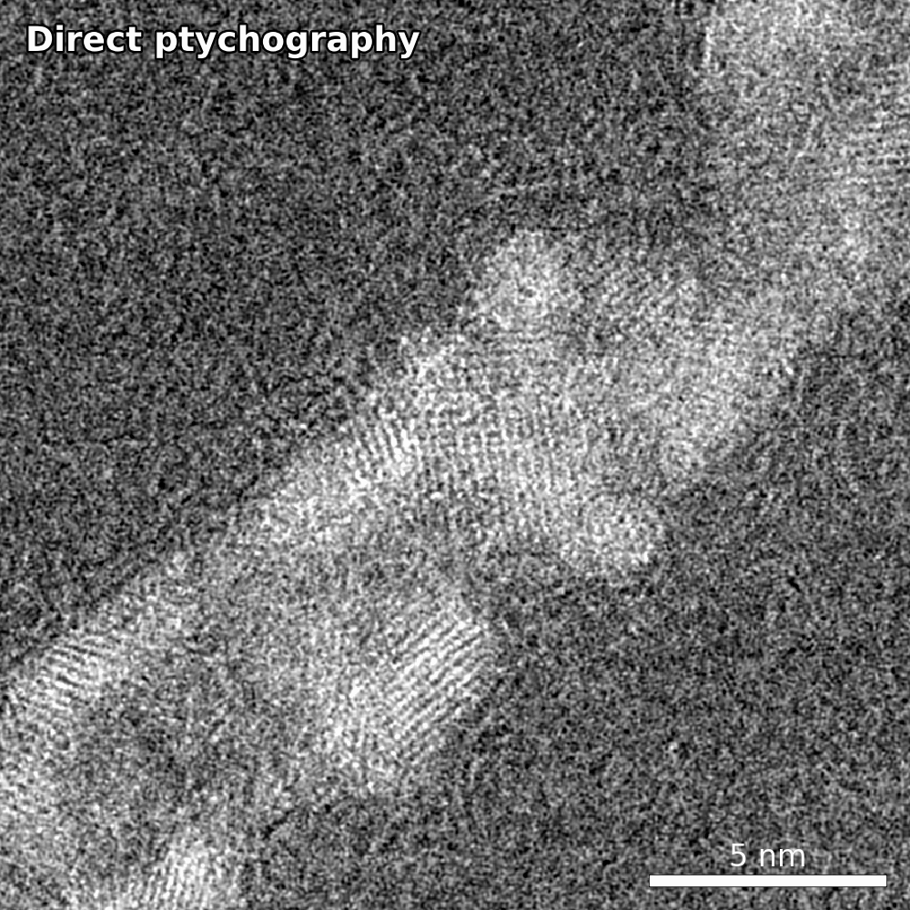{.outline-fit} 
:::

::: {.outline-box .fragment data-fragment-index="2"}
###
{autoplay="true" data-autoplay="true" muted="true" loop="true"}
:::

:::

# Part 1 · Sub-Ångstrom 3D Resolution {.divider}

> Simulation reaches 10⁸ atoms. **Can measurement follow — atom by atom, in 3D?**

1 · Sub-Ångstrom 3D

2 · Fused FF-STEM

<video src="./figs_imc21/vortex/frft_vortex_linkedin_crop.mp4" autoplay muted loop playsinline></video>
3 · Transverse state

## Ptychographic tomography: put the scattering physics in the model

::: {.columns}
::: {.column width="50%"}
{controls="true" autoplay="true" data-autoplay="true" muted="true" loop="true" height="780px"}
:::
::: {.column width="50%"}
Depth information is encoded in the **illumination angles** — for large convergence angles, a single scan already carries 3D information.

{controls="true" autoplay="true" data-autoplay="true" muted="true" loop="true" width="640px"}

Forward model — multislice, paraxial, time-independent:
$$\mathcal{M}_{\psi}(\mathbf{V}) = \prod_{k=0}^T (\mathcal{P}^{\Delta z} T^{\mathbf{V}_k})\psi$$
:::
:::

::: {.callout-note}
Atomic 3D resolution from a 4D-STEM tilt series — with multiple scattering modelled explicitly, not approximated away
:::

## First unknown 3D atomic structure solved by phase-contrast tomography

::: {.columns}
::: {.column width="46%"}
1. 4D-STEM tilt series
2. mixed-state ptychography at every tilt
3. joint linear tomography and alignment
4. sub-pixel atomic peak tracing
5. 3D atomic-structure determination

{width="88%"}
:::
::: {.column width="54%"}
{controls="true" autoplay="true" data-autoplay="true" muted="true" loop="true" width="72%"}
:::
:::

::: {.callout-note .fragment}
Elliptic double-wall CNT resolved in 3D; a **novel ZrTe₂ phase**, confirmed stable by DFT
:::

::: aside
@Pelz_2023
:::

## End-to-end reconstruction alleviates the missing wedge

::: {.columns}
::: {.column width="40%"}
Fully end-to-end MSPT differentiates through the *whole* chain — affine resampling of the volume, z-resampling, batch-cropping, mixed-state multislice, far-field propagation, and gradient backpropagation through all of it.

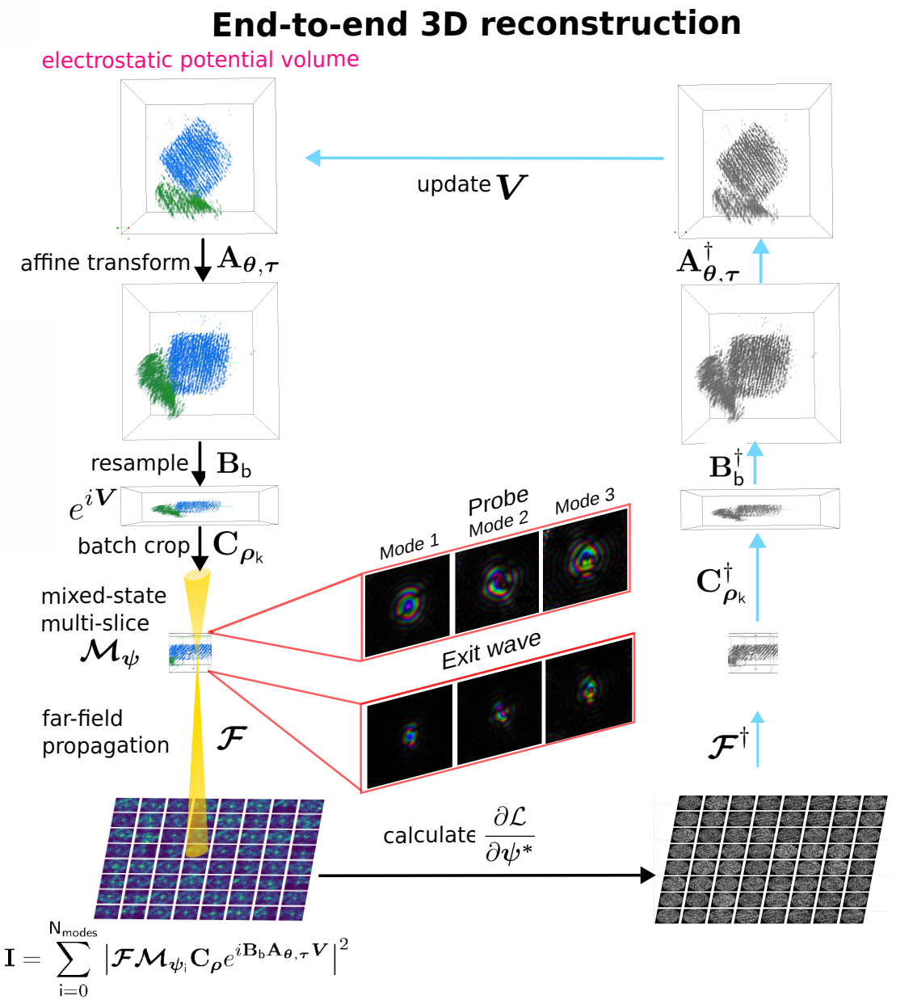{height="520px"}
:::
::: {.column width="60%"}
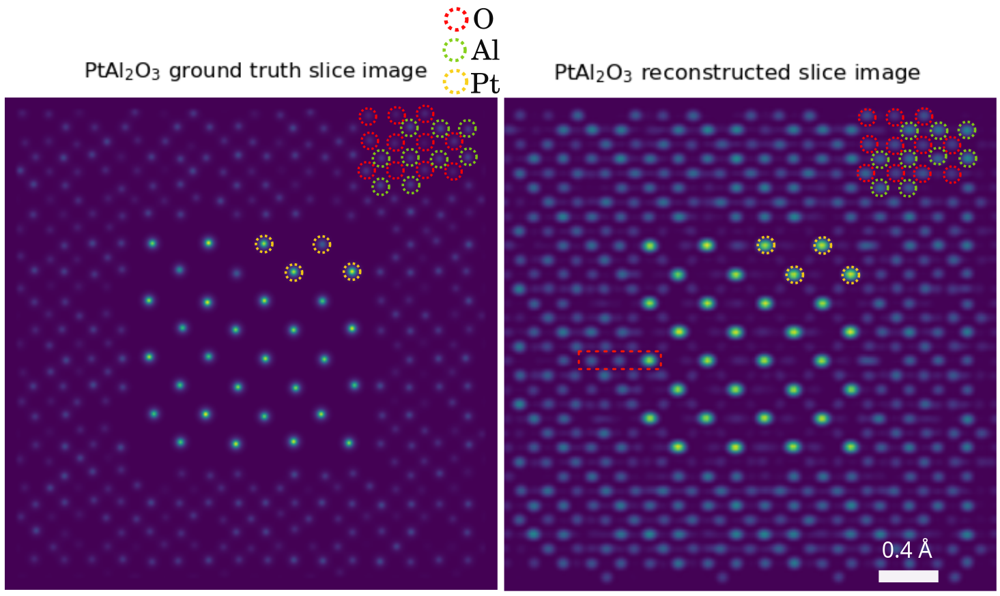{height="620px"}
:::
:::

::: {.callout-note .fragment}
Physical priors recover the missing wedge → near-isotropic 3D resolution (Nyquist 0.82 Å), at **12× virtual sub-sampling**
:::

::: aside
@Romanov_2024, @You_Romanov_Pelz_2024
:::

## The payoff: atomic resolution in all three directions

::: {.columns}
::: {.column width="50%"}
{width="83%" controls="true" autoplay="true" data-autoplay="true" muted="true" loop="true"}

scale bar: 2 nm

:::
::: {.column width="50%"}
{width="83%" controls="true" autoplay="true" data-autoplay="true" muted="true" loop="true"}

scale bar: 2 nm

:::
:::

::: {.callout-note .fragment}
Unknown 3D structure, solved — the specimen unknown is addressed. **On to the rest.**
:::

::: aside
@You_Romanov_Pelz_2024
:::

# Chemistry, and the cost of scale {.divider}

> Ptychography delivers weak chemical contrast. **Spectroscopic STEM provides complementary contrast. Existing forward models however are expensive and do not scale well.**

## Core-loss EELS maps cannot be read off directly

::: {.columns}
::: {.column width="40%"}
- Atomic-resolution **EELS elemental maps are not projections**: the focused probe undergoes strong **dynamical scattering**
- Quantitative interpretation needs full quantum-mechanical simulation of the probe *before* **and** *after* the core-loss transition
- So the forward model becomes the bottleneck for **inversion**
:::
::: {.column width="60%"}
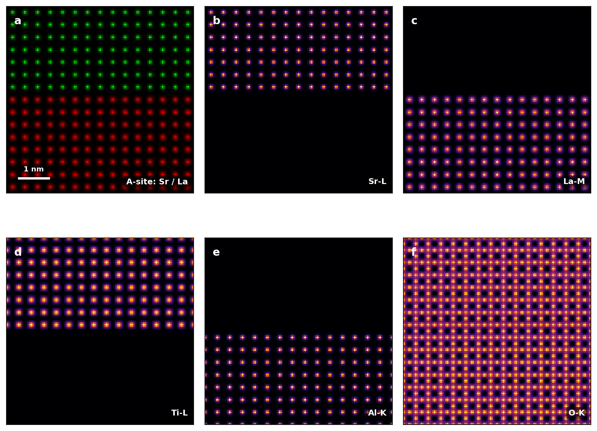{width="100%"}
:::
:::

::: {.callout-note .fragment}
Core-loss chemistry is the richest — and one of the more expensive — signals to simulate
:::

::: aside
@pelz2026bipprismalgorithmfastscalable
:::

## Bi-partitioned PRISM-EELS: and it scales

::: {.columns}
::: {.column width="42%"}
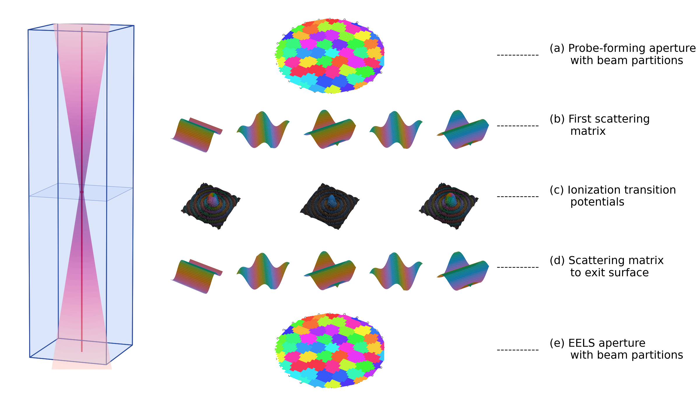{width="100%"}

**Bi-partition both** scattering matrices → the per-scan exit propagation **disappears**
:::
::: {.column width="58%"}

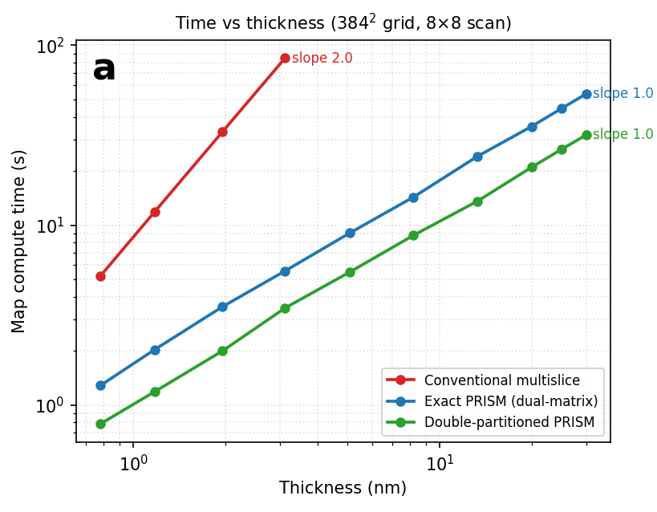
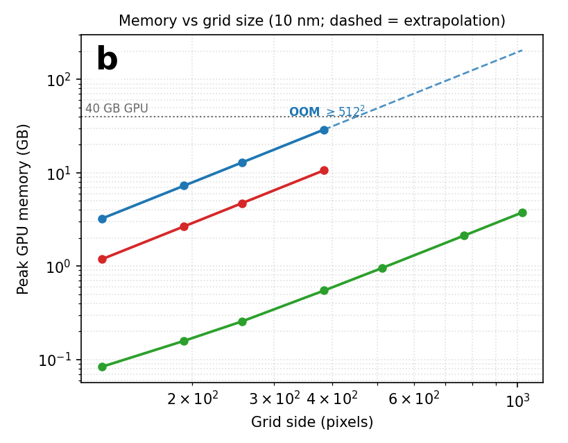
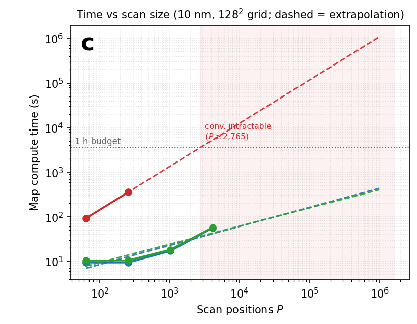

:::
:::

::: {.callout-note .fragment}
LaAlO₃/SrTiO₃, **five core-loss edges at once**, 32 041 probe positions: **~89 s, 2.4 GB** on one GPU — **>50×** lower memory
:::

::: aside
@pelz2026bipprismalgorithmfastscalable

Building on Ophus 2017, Brown 2019, Pelz 2021
:::

# Part 2 · Fused Full-Field STEM {.divider}

> One scan already illuminates several detectors. **Why throw any of them away?**

1 · Sub-Ångstrom 3D

2 · Fused FF-STEM

<video src="./figs_imc21/vortex/frft_vortex_linkedin_crop.mp4" autoplay muted loop playsinline></video>
3 · Transverse state

## Sensor fusion: gap-free contrast in near-real time

::: {.columns}
::: {.column width="62%"}
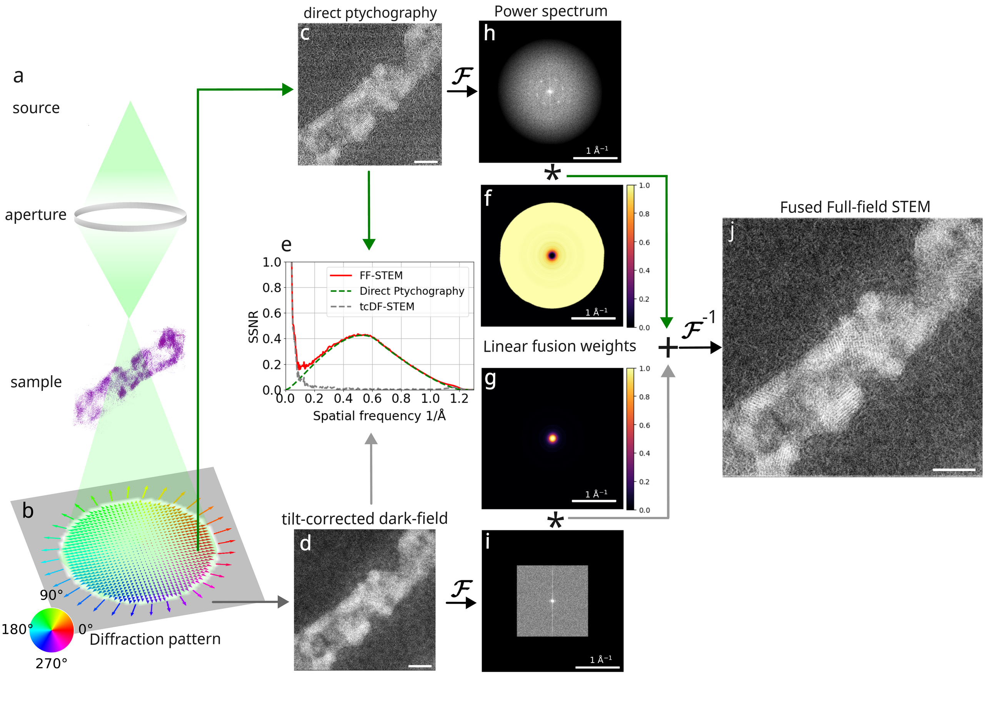{width="100%"}
:::
::: {.column width="38%"}
- **Direct ptychography** → coherent **high-frequency phase**
- **Tilt-corrected dark-field** → **low-frequency** amplitude contrast
- fused in Fourier space by Wiener-type weighting with **SSNR-based weights**
:::
:::

::: {.callout-note .fragment}
Closes the low↔high spatial-frequency gap → one **aberration-free** image. Analytic, non-iterative: **< 1 s** on a single GPU.
:::

::: aside
@You_2026
:::

## Fusion works on real, low-dose data

::: {layout="[[1]]"}
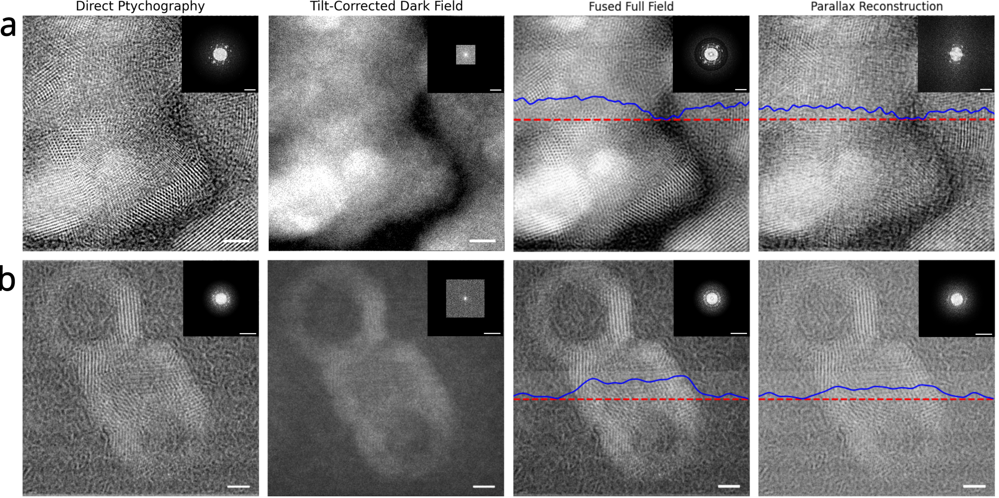{fig-align="center" width="80%"}
:::

::: {.callout-note .fragment style="margin-top: 40px;"}
Robust across samples and detectors
:::

::: aside
@You_2026
:::

# Part 3 · Transverse Quantum State Characterization {.divider}

> Many structured-illumination proposals assume a coherent state.
> **What transverse quantum state does a programmable MEMS phase plate actually deliver?**

1 · Sub-Ångstrom 3D

2 · Fused FF-STEM

<video src="./figs_imc21/vortex/frft_vortex_linkedin_crop.mp4" autoplay muted loop playsinline></video>
3 · Transverse state

## Motivation: a wealth of proposals for programmable electron optics

## Mixed-state ptychography measures the whole illumination

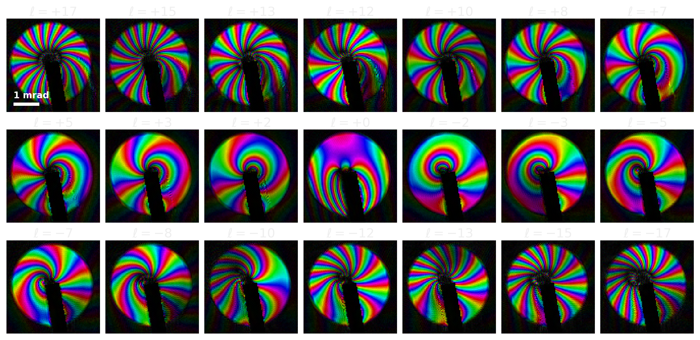{width="100%"}

::: {.callout-note .fragment}
21 charge states, from **standard 4D-STEM** using ptychography 
Two stages: BF-disk shift estimation with a vortex ramp, then a **mixed-state** iterative solver.
:::

::: aside
MEMS device: CNR Modena (V. Grillo). @you2026transversequantumstatecharacterizationprogrammable
:::

## The device is linear and calibratable

From the OAM spectrum of the reconstructed probe density matrix:
$$\langle \ell \rangle = \sum_\ell \ell\, P_\ell, \qquad P_\ell = \rho_{\ell\ell}$$

::: {.columns}
::: {.column width="50%"}
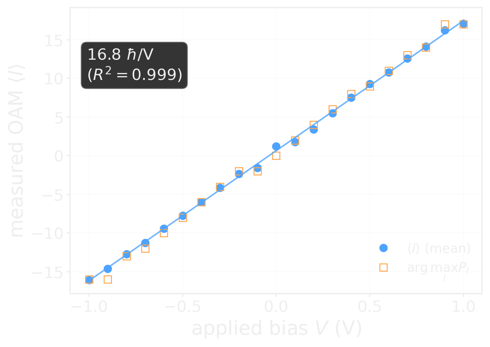{width="90%"}
:::
::: {.column width="50%"}
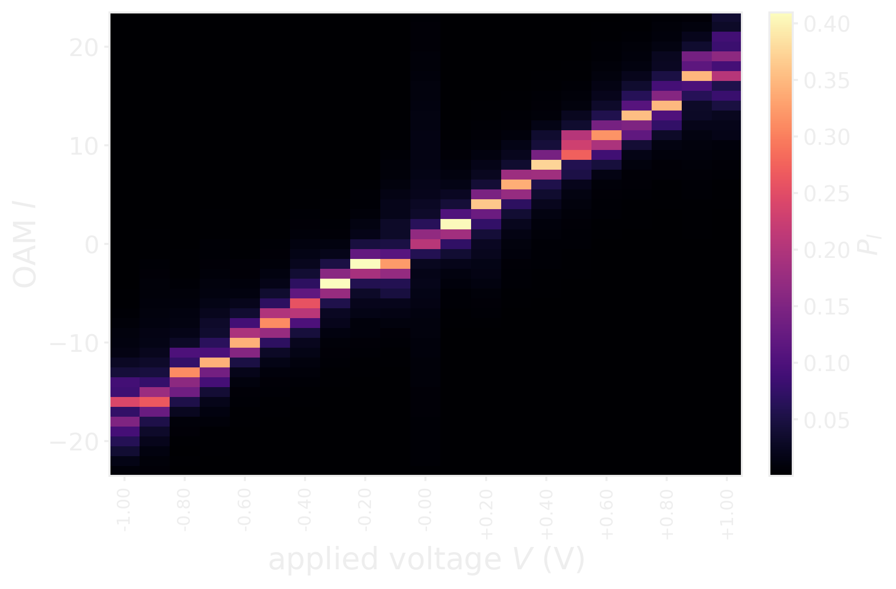{width="95%"}
:::
:::

::: {.callout-note .fragment}
**16.8 ħ per applied volt** across ℓ = −17 … +17. 
programmed charge maps onto the delivered charge by stable gain 
:::

::: aside
@you2026transversequantumstatecharacterizationprogrammable
:::

## But the delivered beam is not one wave

::: {.columns}
::: {.column width="56%"}
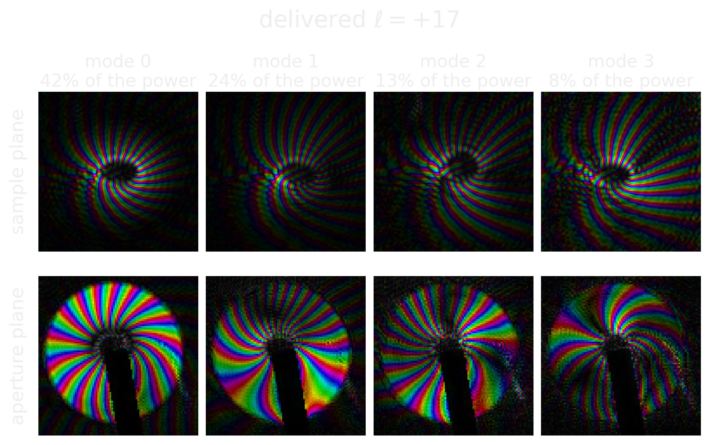{width="100%"}
:::
::: {.column width="44%"}
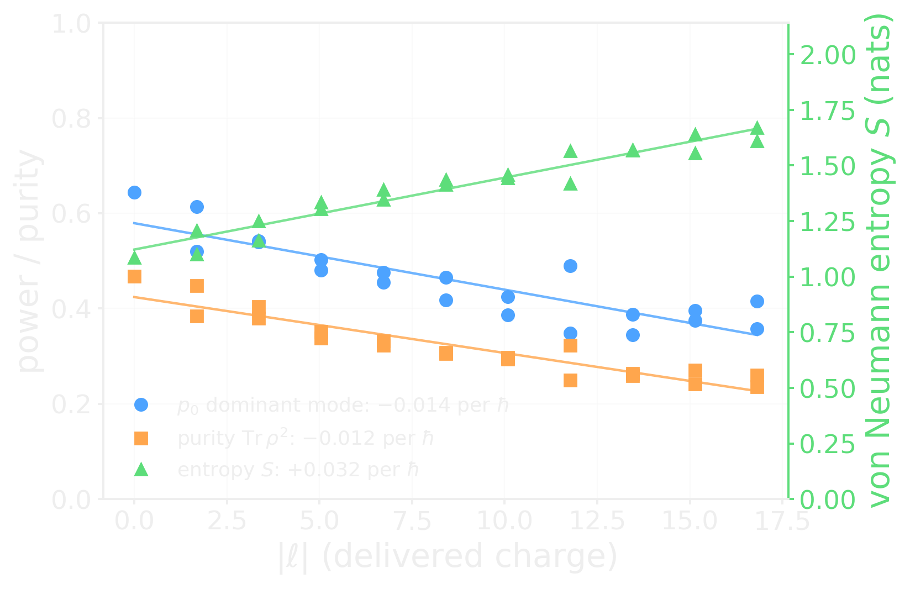{width="100%"}
:::
:::

::: {.callout-note .fragment}
At ℓ = +17 the dominant mode carries only **42 %** of the power. Purity falls and entropy rises: the higher the charge you program, the more mixed the beam you get.
:::

::: aside
@you2026transversequantumstatecharacterizationprogrammable
:::

## Partial coherence, measured in both planes

::: {.columns}
::: {.column width="62%"}
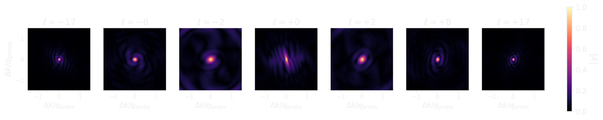{width="100%"}
:::
::: {.column width="38%"}
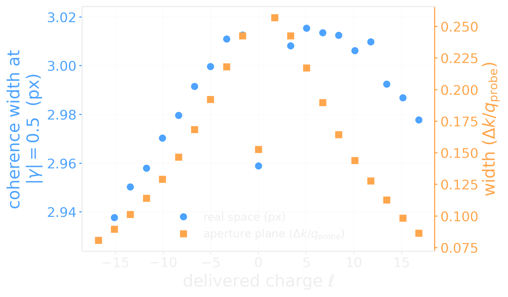{width="100%"}
:::
:::

::: {.callout-note .fragment}
The aperture-plane coherence width **collapses by ~3×** from ℓ = 0 to \|ℓ\| = 17, while the real-space envelope stays near the source-size limit — the mixedness lives in the *aperture*, exactly where a vortex phase plate acts.
:::

::: aside
@you2026transversequantumstatecharacterizationprogrammable
:::

## Dose budget to reach given resolution

::: {.columns}
::: {.column width="58%"}
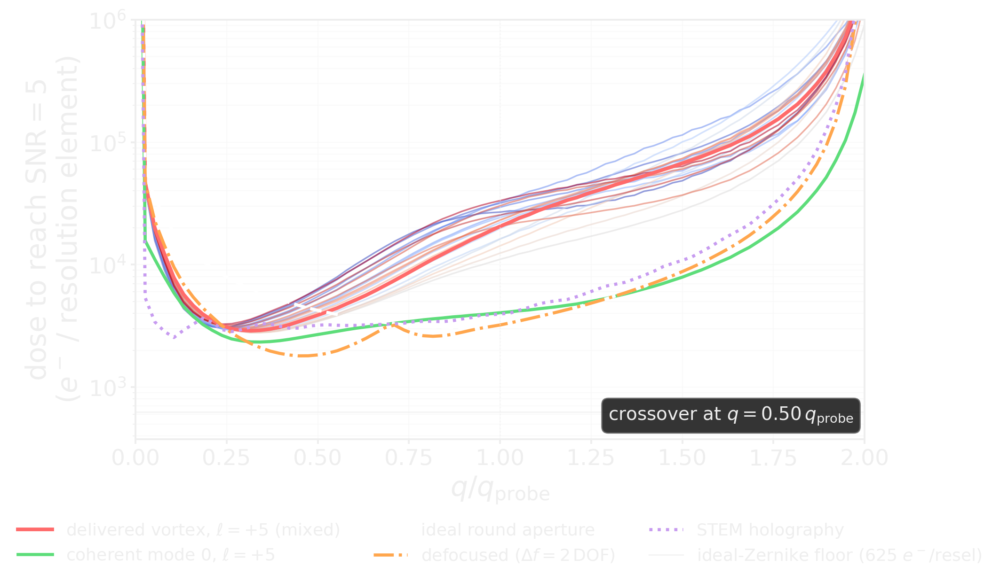{width="100%"}
:::
::: {.column width="42%"}
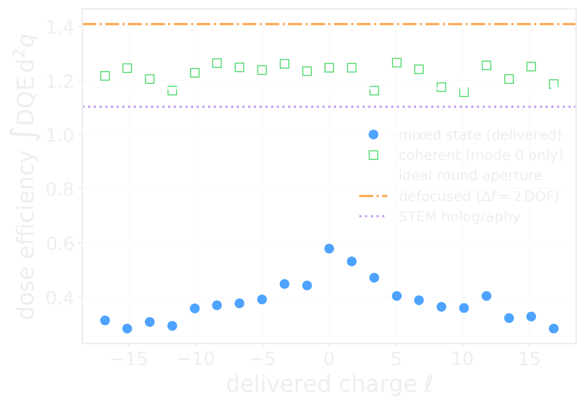{width="100%"}
:::
:::

- We derive a **generalized weak-phase SSNR for mixed probes**: $\Gamma_\rho(q,k) = J(k-q,k) - J(k,k+q)$, giving $\mathrm{SSNR}_\rho = \sqrt{2L_{\mathrm{up}}}\,D_{\mathrm{coh}}$. → DQE → partial coherence-aware dose budget

::: {.callout-note .fragment}
**Dose rule:** below $q \approx 0.5\,q_{\mathrm{probe}}$ the vortex is the cheaper probe; above it, pay for purity or use a round aperture.
:::

::: aside
@you2026transversequantumstatecharacterizationprogrammable

Reduces to Nellist–Rodenburg, Bennemann and Varnavides in the appropriate limits
:::

## Acknowledgements {#acknowledgements}

thank you

<figure class="ack-person ack-fau" data-person="Shengbo You" role="listitem">

<figcaption>Shengbo YouFAU</figcaption></figure>
<figure class="ack-person ack-fau" data-person="Sihan Shao" role="listitem">
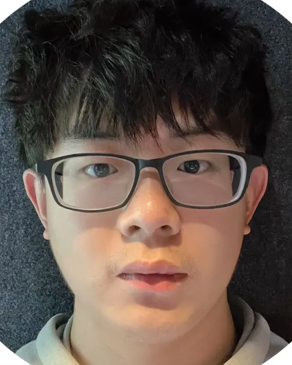
<figcaption>Sihan ShaoFAU</figcaption></figure>
<figure class="ack-person ack-fau" data-person="Nikita Palatkin" role="listitem">
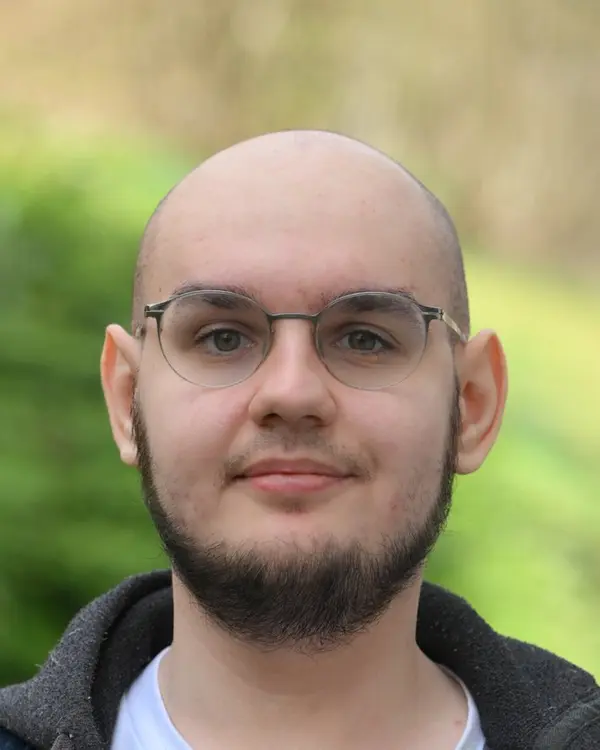
<figcaption>Nikita PalatkinFAU</figcaption></figure>
<figure class="ack-person ack-fau" data-person="Mingjian Wu" role="listitem">

<figcaption>Mingjian WuFAU</figcaption></figure>
<figure class="ack-person ack-fau" data-person="Tadahiro Yokosawa" role="listitem">
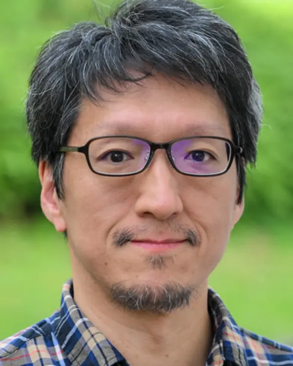
<figcaption>Tadahiro YokosawaFAU</figcaption></figure>
<figure class="ack-person ack-fau" data-person="Erdmann Spiecker" role="listitem">
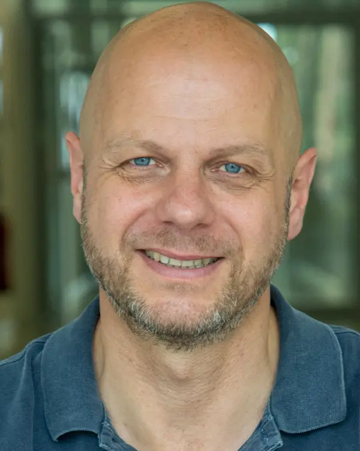
<figcaption>Erdmann SpieckerFAU</figcaption></figure>
<figure class="ack-person" data-person="Andreas Hutzler" role="listitem">
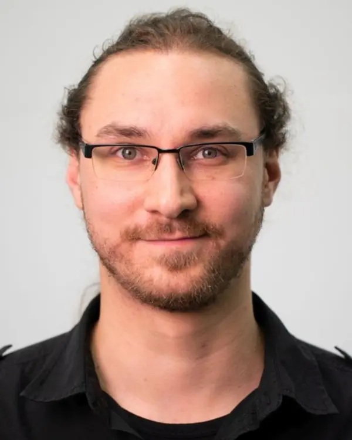
<figcaption>Andreas HutzlerHI ERN</figcaption></figure>
<figure class="ack-person" data-person="Lucía Morales" role="listitem">
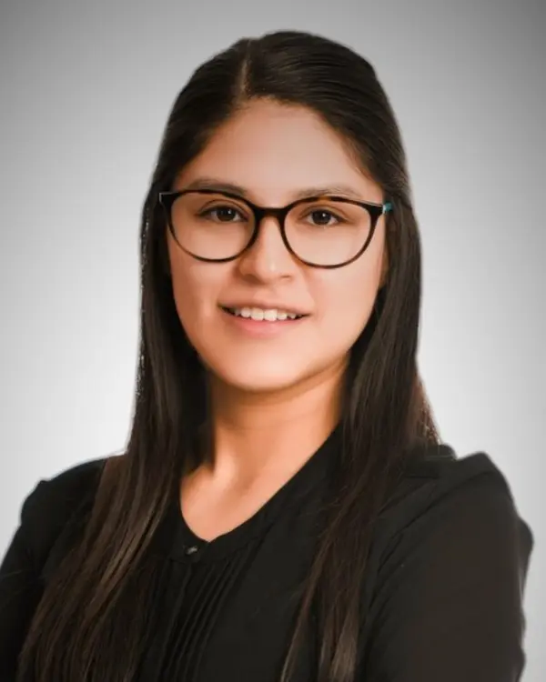
<figcaption>Lucía MoralesHI ERN</figcaption></figure>
<figure class="ack-person" data-person="Georgios Varnavides" role="listitem">
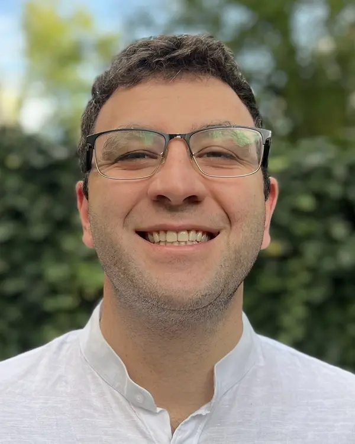
<figcaption>Georgios VarnavidesTU Delft</figcaption></figure>
<figure class="ack-person" data-person="Sagar Khavnekar" role="listitem">
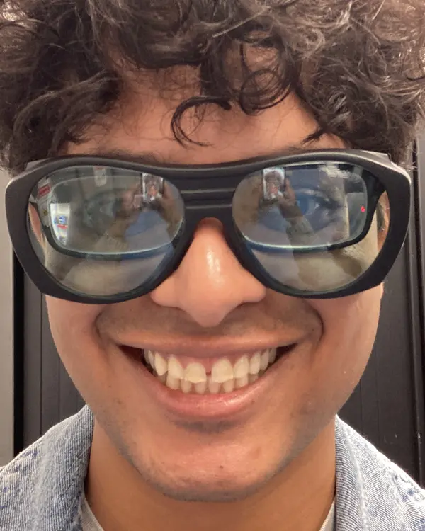
<figcaption>Sagar KhavnekarThermo Fisher</figcaption></figure>
<figure class="ack-person" data-person="Darya Chernikova" role="listitem">
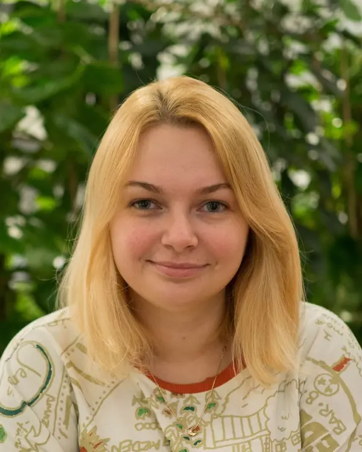
<figcaption>Darya ChernikovaISTA</figcaption></figure>
<figure class="ack-person" data-person="Baixu Zhu" role="listitem">

<figcaption>Baixu ZhuIndiana University</figcaption></figure>
<figure class="ack-person" data-person="Ricardo Egoavil" role="listitem">
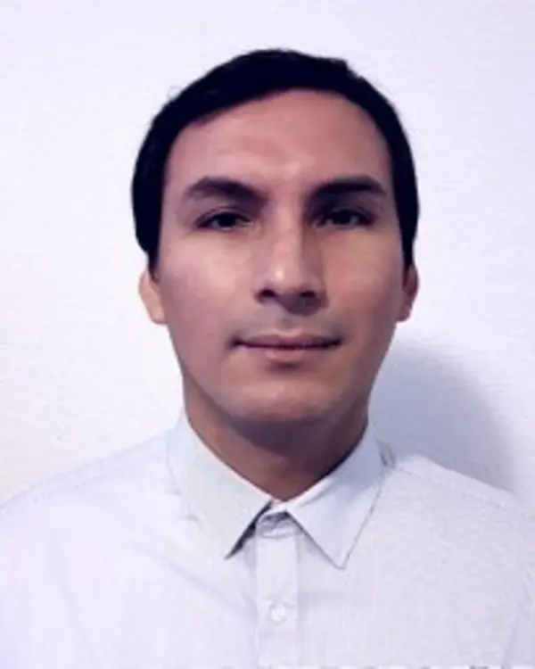
<figcaption>Ricardo EgoavilThermo Fisher</figcaption></figure>
<figure class="ack-person" data-person="Stefano Vespucci" role="listitem">
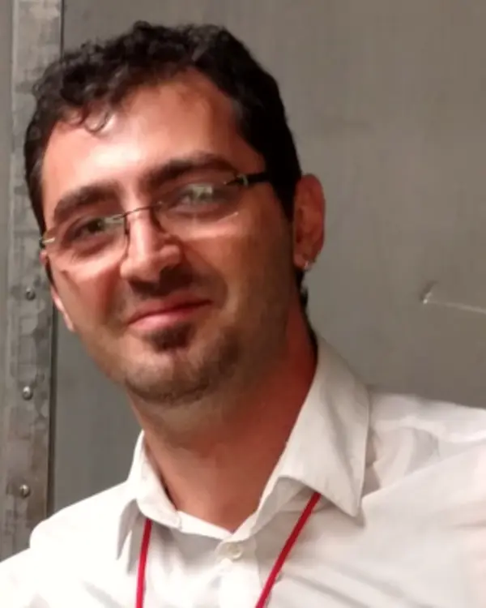
<figcaption>Stefano VespucciThermo Fisher</figcaption></figure>
<figure class="ack-person" data-person="Dileep Krishnan" role="listitem">
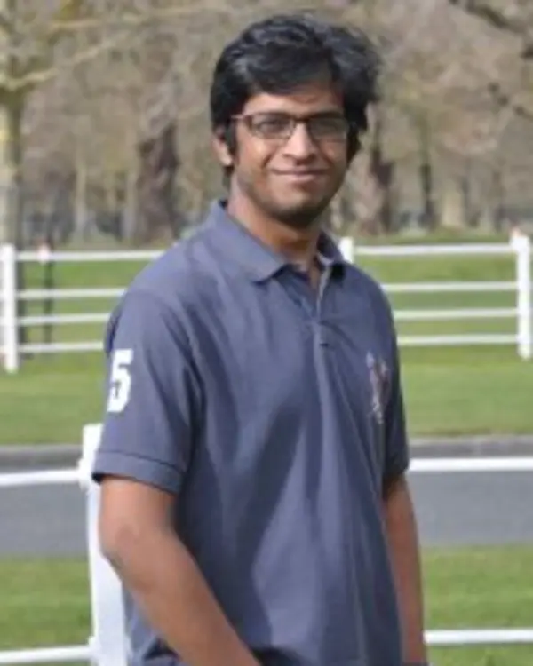
<figcaption>Dileep KrishnanThermo Fisher</figcaption></figure>
<figure class="ack-person" data-person="Florian K. M. Schur" role="listitem">

<figcaption>Florian K. M. SchurISTA</figcaption></figure>
<figure class="ack-person" data-person="Paolo Rosi" role="listitem">
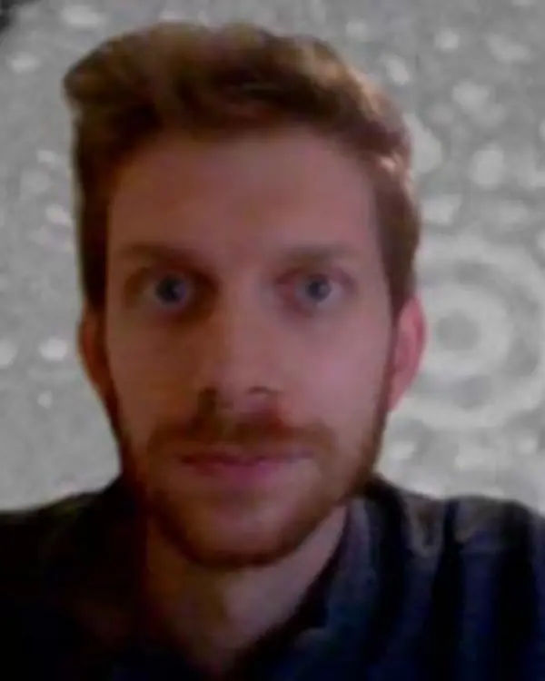
<figcaption>Paolo RosiCNR Nanoscience</figcaption></figure>
<figure class="ack-person" data-person="Colin Ophus" role="listitem">

<figcaption>Colin OphusStanford</figcaption></figure>
<figure class="ack-person" data-person="Vincenzo Grillo" role="listitem">
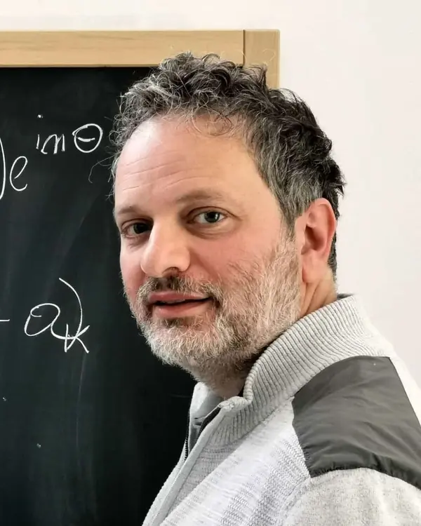
<figcaption>Vincenzo GrilloCNR Modena</figcaption></figure>
<figure class="ack-person" data-person="Daniel Stroppa" role="listitem">

<figcaption>Daniel StroppaDSTL</figcaption></figure>
<figure class="ack-person" data-person="M. Meffert" role="listitem">
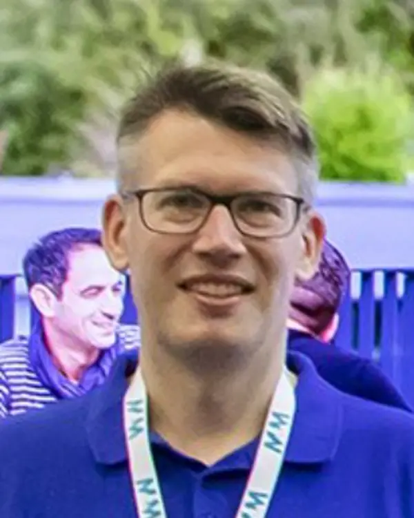
<figcaption>M. MeffertDECTRIS</figcaption></figure>
<figure class="ack-person" data-person="Xingchen Ye" role="listitem">

<figcaption>Xingchen YeIndiana University</figcaption></figure>

Supported by the ERC Starting Grant <strong>HyperScaleEM</strong>

## Summary 

::: {.columns}
::: {.column width="66%"}
- **Sub-Ångstrom 3D** — ptychographic electron tomography reaches sub-Ångström, near-isotropic 3D *beyond* the depth-of-focus limit
- **core-loss EELS simulations at scale** [@pelz2026bipprismalgorithmfastscalable] — BiP-PRISM allows core-loss EELS + 4D-STEM **past one million atoms** on one GPU
- **FF-STEM** [@You_2026] — Wiener sensor fusion gives gap-free, aberration-free contrast in **< 1 s**, robust at low dose
- **Transverse quantum state characterization** [@you2026transversequantumstatecharacterizationprogrammable] — mixed-state ptychography can now be used to characterize the transverse quantum state of a programmable MEMS phase plate

:::
::: {.column width="33%"}
{width="100%"}
{width="60%" loop="true" autoplay="true" data-autoplay="true" muted="true" style="margin-left:auto;margin-right:0;display:block;"}
:::
:::
### References 📚
::: {#refs}
:::
 
## Backup · OAM channel decomposition {visibility="uncounted"}

::: {.columns}
::: {.column width="34%"}
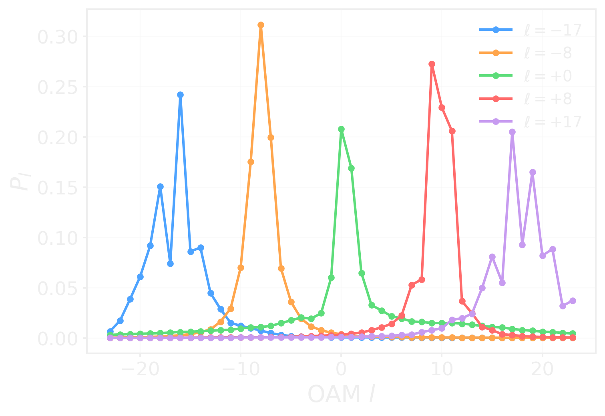{width="100%"}
:::
::: {.column width="33%"}
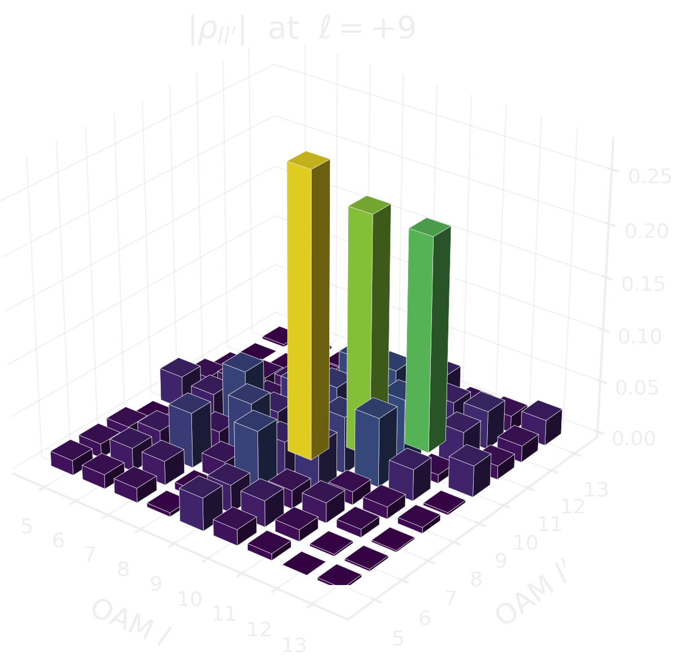{width="100%"}
:::
::: {.column width="33%"}
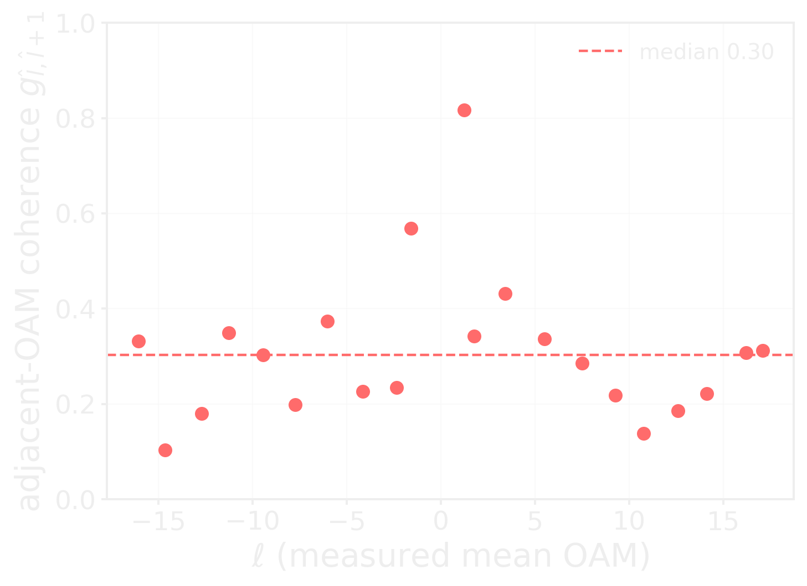{width="100%"}
:::
:::

::: {.callout-note}
Median adjacent-OAM coherence **0.30**: the delivered state is largely an *incoherent* OAM mixture, not a coherent fractional superposition
:::

## Backup · Channel purity and mode powers {visibility="uncounted"}

::: {.columns}
::: {.column width="50%"}
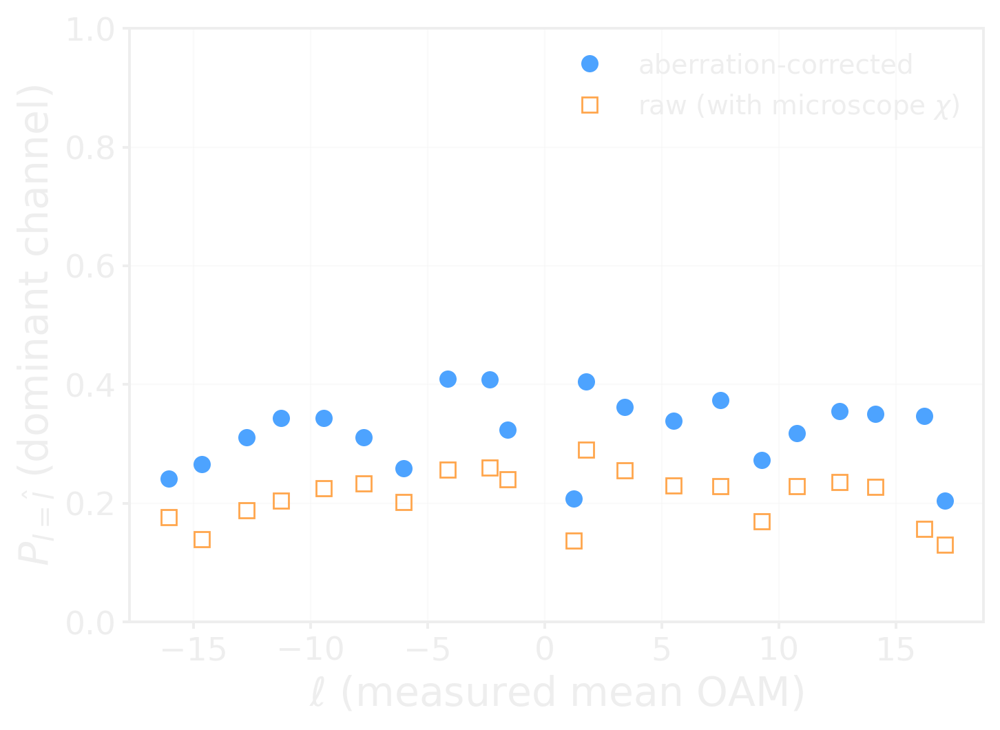{width="100%"}
:::
::: {.column width="50%"}
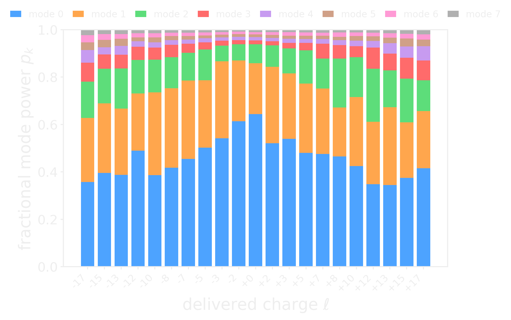{width="100%"}
:::
:::

## Backup · SSNR and DQE in full {visibility="uncounted"}

::: {.columns}
::: {.column width="33%"}
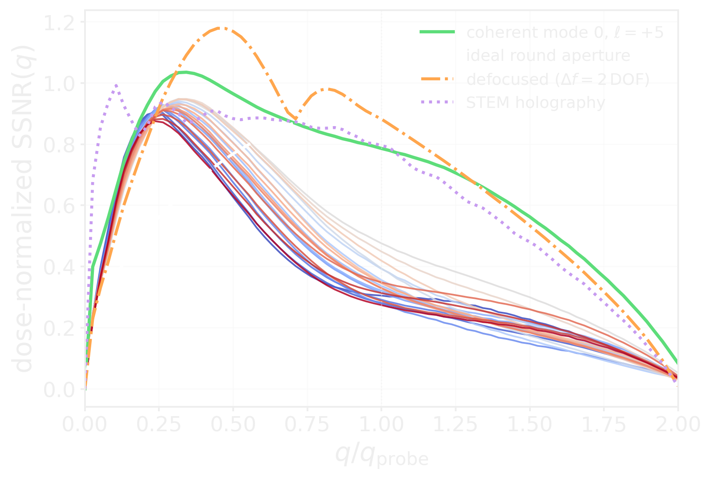{width="100%"}
:::
::: {.column width="33%"}
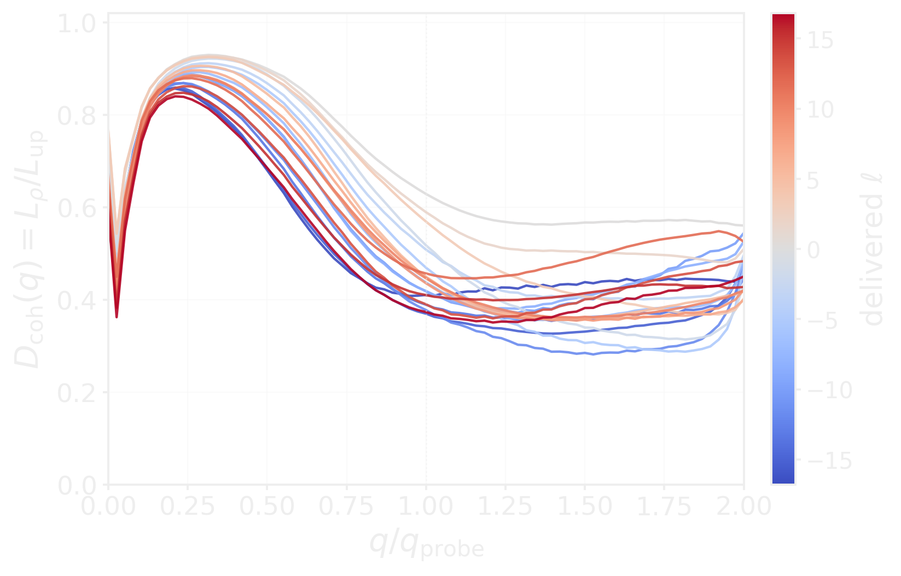{width="100%"}
:::
::: {.column width="33%"}
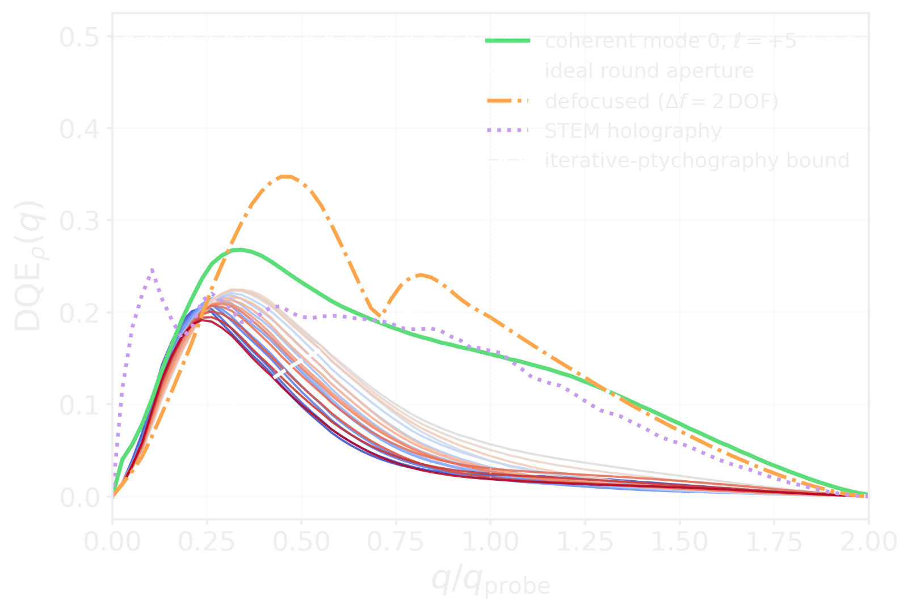{width="100%"}
:::
:::

## Backup · Sample-plane coherence and mode gallery {visibility="uncounted"}

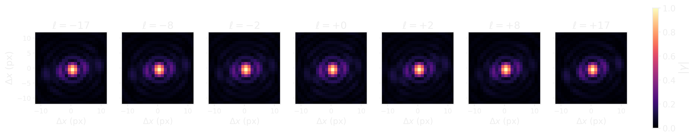{height="200px"}

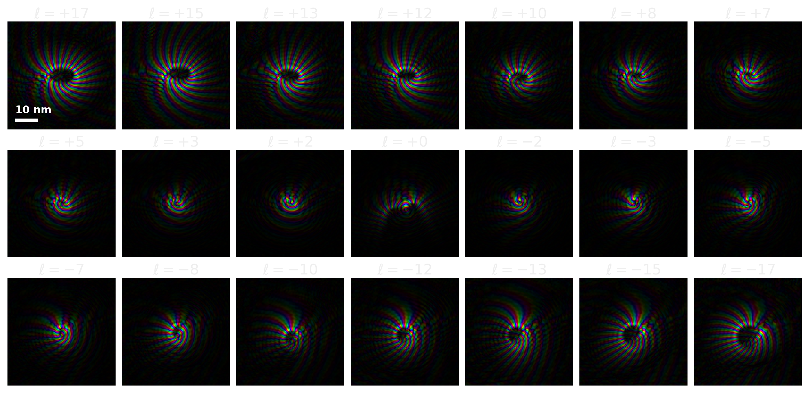{height="560px"}

## Backup · Controls and object self-consistency {visibility="uncounted"}

::: {.columns}
::: {.column width="40%"}
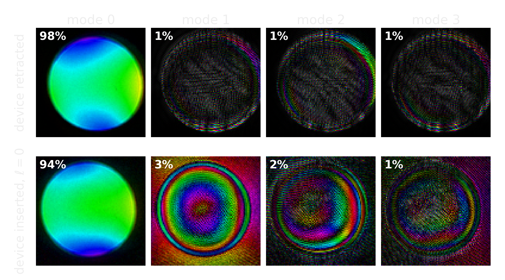{width="100%"}

Retracting the device recovers a **98 %** pure mode; inserting it at ℓ = 0 costs a few percent.
:::
::: {.column width="60%"}
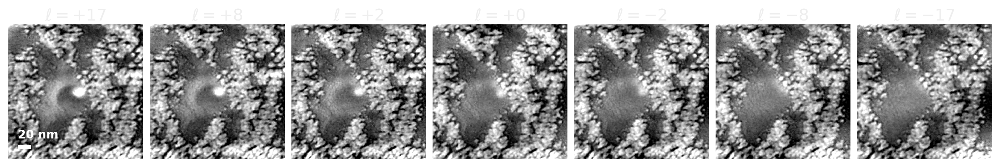{width="100%"}

The specimen is recovered consistently across the whole charge series, which is what licenses comparing probes.
:::
:::

 

<!--
========================================================================
 IMC21 invited talk, September 2026.
 
 Render:  quarto render imc21.qmd

 Figures: figs_imc21/vortex/ is fully generated —
     cd scripts && python make_all.py
 Reused media is referenced from ./media/ (not copied: ~80 MB).

 >>> BEFORE PRESENTING (search "TODO"):
   - Title-slide subtitle: IMC21 city, session, exact date
   - Re-check the BiP-PRISM 89 s / 2.4 GB / >50x numbers
   - Round-beam control: mode-count caveat on the backup slide
========================================================================
-->
