<style>
.trieste-slide .aside { font-size: 0.62em !important; }
</style>

## Outline — from diffraction patterns to quantitative imaging

*Five threads: X-ray vs. electron ptychography, phase retrieval and direct methods, the 4D-STEM acquisition chain, iterative and 3D reconstruction, then fields in the same data.*

::: {.outline-container}

::: {.outline-box .fragment data-fragment-index="0"}
### 
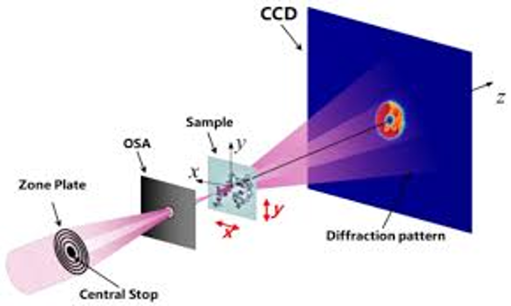{width="100%"} 
:::

::: {.outline-box .fragment data-fragment-index="1"}
### 
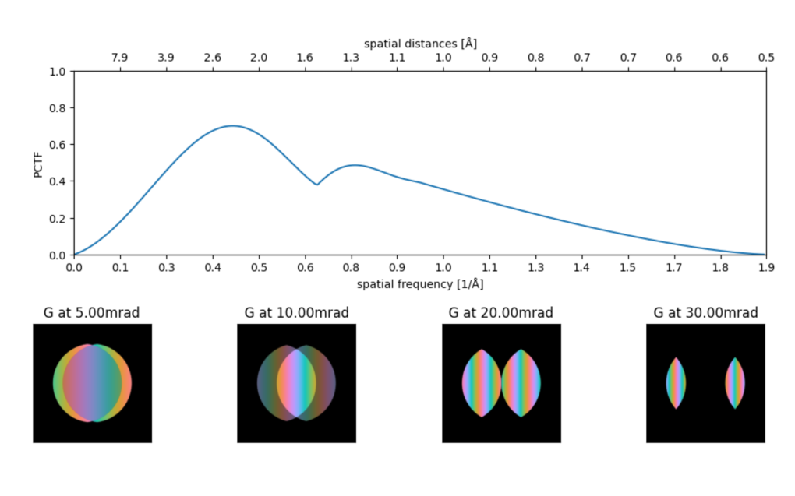{width="100%"} 
:::

::: {.outline-box .fragment data-fragment-index="2"}
### 
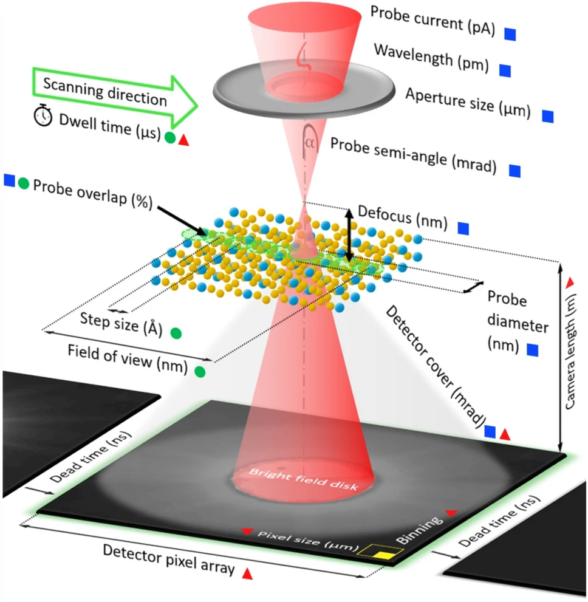{width="100%"} 
:::

::: {.outline-box .fragment data-fragment-index="3"} 
### 
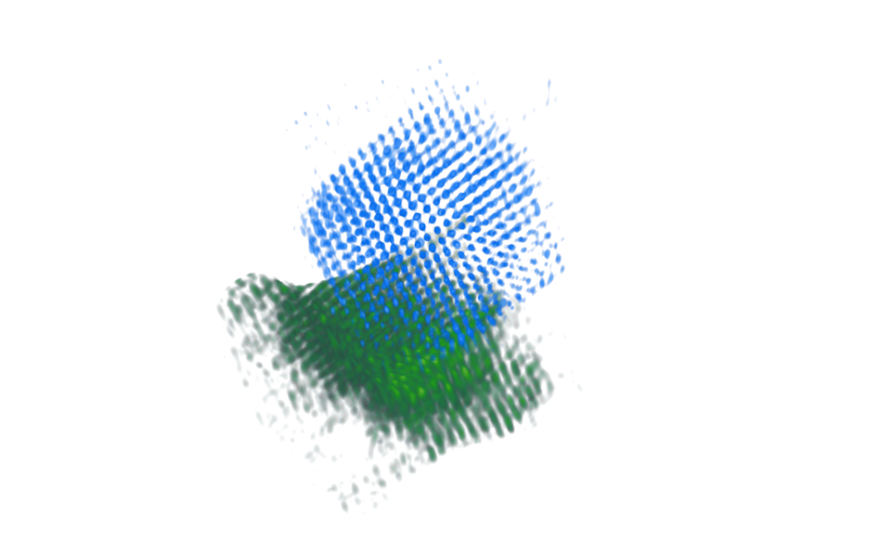 
:::

::: {.outline-box .fragment data-fragment-index="4"}  
### 
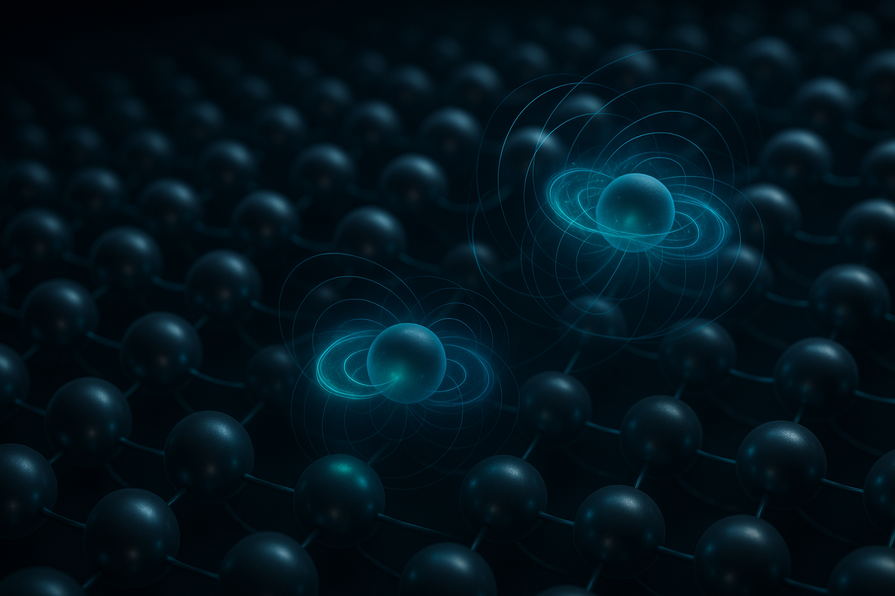 
:::

:::

<style>
.outline-box.fragment[data-fragment-index="0"]:not(.current-fragment) h3::before { content: "1"; }
.outline-box.fragment[data-fragment-index="0"].current-fragment h3::before { content: "1 · X-ray vs. electron ptychography"; transition: all 0.8s ease; }
.outline-box.fragment[data-fragment-index="1"]:not(.current-fragment) h3::before { content: "2"; }
.outline-box.fragment[data-fragment-index="1"].current-fragment h3::before { content: "2 · Phase problem & direct methods"; transition: all 0.8s ease; }
.outline-box.fragment[data-fragment-index="2"]:not(.current-fragment) h3::before { content: "3"; }
.outline-box.fragment[data-fragment-index="2"].current-fragment h3::before { content: "3 · The 4D-STEM acquisition chain"; transition: all 0.8s ease; }
.outline-box.fragment[data-fragment-index="3"]:not(.current-fragment) h3::before { content: "4"; }
.outline-box.fragment[data-fragment-index="3"].current-fragment h3::before { content: "4 · Iterative & multislice 3D imaging"; transition: all 0.8s ease; }
.outline-box.fragment[data-fragment-index="4"]:not(.current-fragment) h3::before { content: "5"; }
.outline-box.fragment[data-fragment-index="4"].current-fragment h3::before { content: "5 · Fields, charge & magnetism"; transition: all 0.8s ease; }
</style>

## Part 1 · X-ray vs. electron ptychography

> Many ptychography concepts transfer from X-rays — but the physics and engineering diverge quickly.
> **What changes when we swap photons for electrons?**

<div class="roadmap">
<div class="rtile active"><div class="rlbl">1 · X-ray vs e⁻</div></div>
<div class="rtile"><div class="rlbl">2 · Phase & direct</div></div>
<div class="rtile"><div class="rlbl">3 · Acquisition</div></div>
<div class="rtile"><div class="rlbl">4 · Iterative & 3D</div></div>
<div class="rtile"><div class="rlbl">5 · Fields</div></div>
</div>

 

## 1. Strength of interaction — 1 {.trieste-slide}

<div class="trieste-highlight">
Elastic scattering cross section for C of 300 keV electron is ~100.000× of 6 keV photon
</div>

::: {.columns}
::: {.column width="48%"}

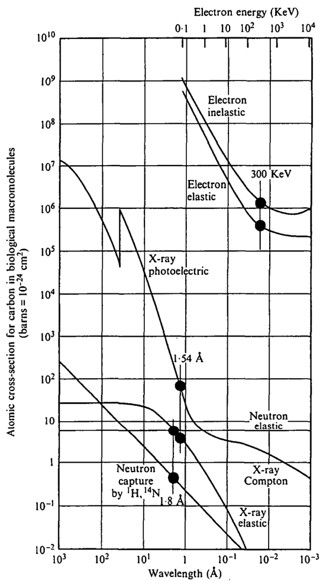{height=600px}

:::
::: {.column width="52%"}

<div style="font-size:0.76em;">

Imaging single light atoms in **2D** with electron ptychography is possible with some **10.000 e⁻/Ų**

<div style="font-size:0.9em; margin-top:0.3em;">Chen, Z. et al. Mixed-state electron ptychography enables sub-angstrom resolution imaging with picometer precision at low dose. *Nature Communications* **11**, 2994 (2020).</div>

<br>

Imaging single light atoms in **3D** with electron ptychography is possible with some **1M-10M e⁻/Ų**

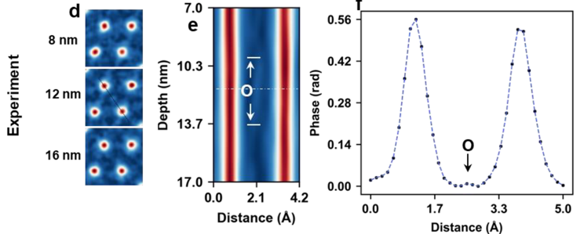{height="300px"}

<div style="font-size:0.9em; margin-top:0.3em;">Cui, J. et al. Imaging, counting, and positioning single interstitial atoms in solids. Preprint at [arXiv:2407.18063](https://arxiv.org/abs/2407.18063) (2024).</div>

</div>
:::
:::

::: {.aside}
[@Henderson_1995; @Chen_2020; @Cui_2024]
:::

## 1. Strength of interaction — 2 {.trieste-slide}

::: {.columns}
::: {.column width="50%"}

<div style="font-size:0.82em;; color: #000;">

For algorithms: strong atomic potential peaks cannot be fully recovered by pixel-wise reconstruction

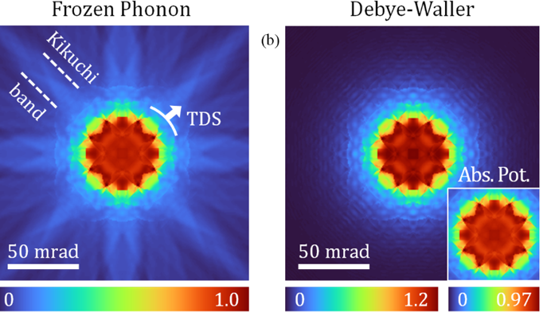{height="320px"}

When dark-field data is measured, artifacts can arise using a pixelated model

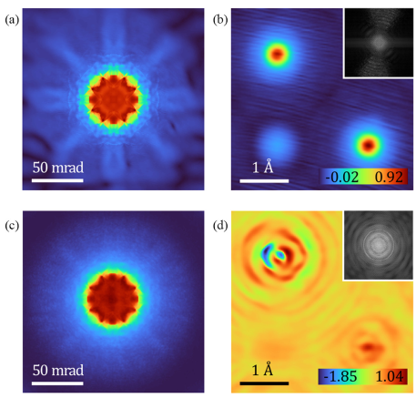{height="320px"}

</div>
:::
::: {.column width="50%"}

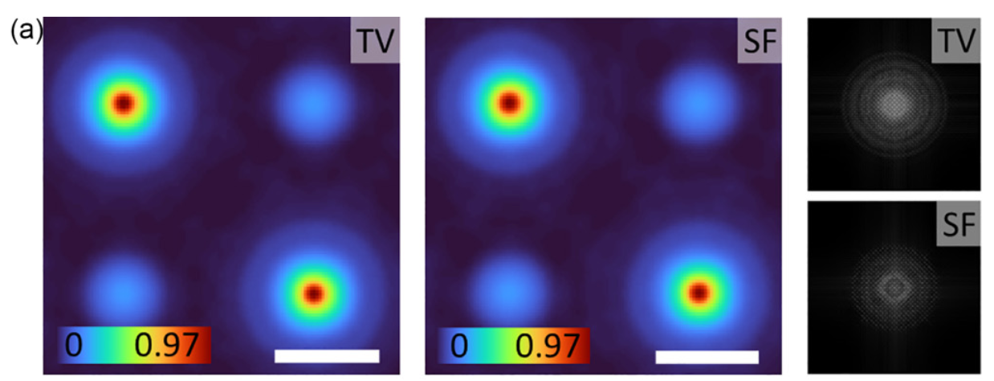{height="250px"}

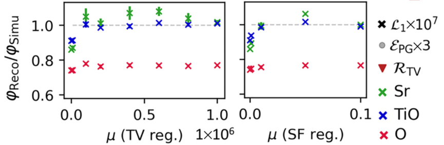{height="210px"}

<div style="font-size:0.82em; text-align:center;">Ideally, atomic peak height gives element</div>

<div class="trieste-highlight">
Quantification of recovered potentials is tricky, solution unclear yet
</div>

:::
:::

::: {.aside}
[@Herdegen_2024]
:::

## 2. Depth of forward models {.trieste-slide}

::: {.columns}
::: {.column width="48%"}

### X-ray ptychography

$$
I_{j\mathbf{q}} = \sum_k \alpha_k \left| \langle \mathbf{q} | O_j | P_k \rangle \right|^2
$$

<div style="font-size:0.65em;">[@Thibault_Menzel_2013]</div>
 
:::
::: {.column width="52%"}

### Electron ptychography

<div style="font-size:0.72em;">

**Coherent model**

$$
I(\mathbf{s}) = \left| \mathcal{F} \left[ M(\phi(\cdot - \mathbf{s}), \mathcal{S}) \right] \right|^2
$$

$$
M(\phi, V_1, \dots, V_S) = e^{i\sigma V_S} \cdot \left(F \otimes \left(e^{i\sigma V_{S-1}} \dots \left(F \otimes \left(e^{i\sigma V_1} \cdot \phi\right)\right) \dots \right)\right)
$$

$$
P(k, \Delta z, \theta) = e^{-i\pi\lambda k^2 \Delta z + 2\pi i \Delta z (k_x \tan \theta_x + k_y \tan \theta_y)}
$$

**Realistic model including atomic vibrations & spatial & temporal coherence**

$$
V_{\mathrm{FP}}^{(j)}(\mathbf{r}, \tau) = \sum_{n=1}^{N} w_n v_{Z_n} \left( \mathbf{r} - \mathbf{r}_n - \sqrt{\langle u_n^2 \rangle} \cdot \mathbf{g}_{n,\tau} \right)
$$

$$
I(\mathbf{s}) \approx \sum_k \alpha_k \left| \hat{M}_{\{\mathcal{S}\}}(\tau_k) \cdot \phi_{\{P\}}(\mathbf{r} - \mathbf{s} - \boldsymbol{\eta}_k, \delta_k) \right|^2
$$

<div style="font-size:0.9em;">[@Diederichs_2024]</div>

</div>
:::
:::

::: {.callout-note .fragment}
Atomic resolution allows direct parametrization<br>
Voxels → Atoms
:::
 

## 3. Degree of model mismatch {.trieste-slide}

::: {.columns}
::: {.column width="55%"}

- **X-ray ptychography:** weak interaction → thin-object / paraxial models usually match experiment
- **Electron ptychography:** strong interaction → simplified models break down
  - inelastic/plasmon background and contamination
  - dynamical scattering vs. thickness and defocus

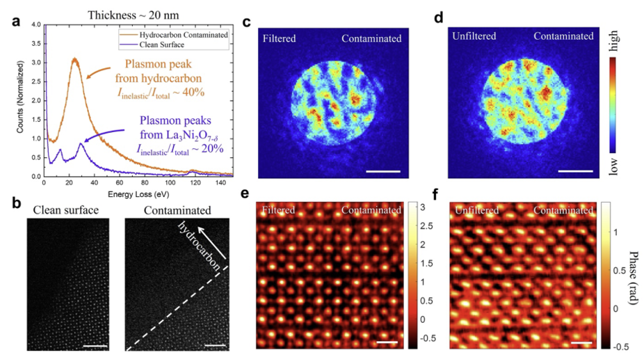{height="380px"}

:::
::: {.column width="45%"}

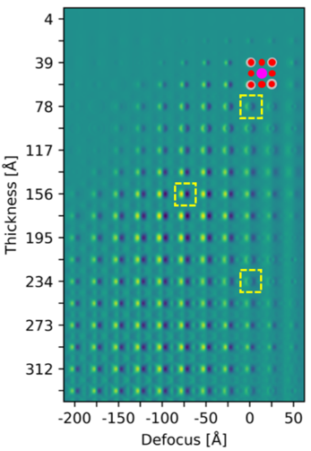{height="420px"}

:::
:::

::: {.aside}
[@Dong_2024; @Deimetry_2024]
:::

## 4. Experimental setup and resulting limitations {.trieste-slide}

::: {.columns}
::: {.column width="50%"}

### X-ray ptychography

{height="260px"}

<div style="font-size:0.78em;">

- Sample translation with piezos → few kHz max
- FOV limited by sample translation

> “2D images acquired at 110 kHz by combining the fast-acquisition scheme with a high-acquisition rate prototype detector” [@Cipiccia_2024]

> “developed a new approach for scanning X-ray microscopy by combining a slow sample stage possessing a long travel range with a fast but small range positioner for the beam-defining optics” [@Odstrcil_2019]

</div>
:::
::: {.column width="50%"}

### Electron ptychography

<div style="font-size:0.78em; text-align:center; margin-bottom:0.35em;">4D-STEM data acquisition</div>

{autoplay="true" loop="true" muted="true" height="800px"}

<div style="font-size:0.78em;">

- Beam translation with electron optics → few MHz max
- FOV limited by electron optics → stitching scans

</div>

 
::: {.callout-note .fragment}
Faster scans are coming to X-ray ptychography
:::
:::
:::

## 4. Experimental setup and resulting limitations 2 {.trieste-slide}

[Optical elements and setup of a modern electron microscope](images/TEM.png)

## Part 2 · Phase problem & direct methods

> Detectors record intensities; atomic structure lives in the **phase**.
> **What can we retrieve directly — and when do we need iteration?**

<div class="roadmap">
<div class="rtile"><div class="rlbl">1 · X-ray vs e⁻</div></div>
<div class="rtile active"><div class="rlbl">2 · Phase & direct</div></div>
<div class="rtile"><div class="rlbl">3 · Acquisition</div></div>
<div class="rtile"><div class="rlbl">4 · Iterative & 3D</div></div>
<div class="rtile"><div class="rlbl">5 · Fields</div></div>
</div>

## The Microscopy Phase Problem

::: {.columns}
::: {.column width="45%"}

- The exit wave $\psi(\vec{r})$ is **complex**; detectors record intensities $I = |\psi|^2$
- Specimen structure is encoded primarily in the **phase** (weak objects: $t(\vec{r}) \approx 1 + i\sigma V_p(\vec{r})$)
- Conventional annular BF/ABF/ADF/HAADF signals integrate $| \tilde{\psi}_\mathrm{exit}|^2$ and discard most phase information
- **4D-STEM** retains the full diffraction pattern $I(\vec{R}, \vec{k})$ at every scan position — the raw material for phase retrieval

:::
::: {.column width="55%" .fragment}

<div class="iframe-container" style="height: 520px;">
<iframe
  class="marimo-frame"
  src="https://pelzlab.science/marimo/apps/plane_wave_imaging.html?mode=read&embed=true"
  frameBorder="0"
  width="100%"
  height="520px"
  style="border: none; filter: invert(1) hue-rotate(180deg);"
></iframe></div>

:::
:::

::: {.callout-note .fragment}
TEM defocus and Zernike phase plates convert phase → intensity; STEM reciprocity links these ideas to convergent-beam 4D-STEM
:::

## From Scan Position to Diffraction Pattern

<div class="iframe-container" style="height: 780px;">
<iframe
  class="marimo-frame"
  src="https://pelzlab.science/marimo/apps/stem_measurements.html?mode=read&embed=true"
  frameBorder="0"
  width="100%"
  height="780px"
  style="border: none; filter: invert(1) hue-rotate(180deg);"
></iframe></div>

::: {.callout-note .fragment}
Move the probe over the sample — structure is encoded in how the bright-field disk distorts. **One pattern per scan pixel = 4D-STEM.**
:::

## Ptychography: The origins 

::: {.columns}
::: {.column width="55%"}

- The diffraction signal in STEM contains the phase information of the sample

$$
T(\vec{r}) = \exp^{i \sigma V(\vec{r})}
$$

- The phase shift $\sigma$ is related to the potential $V(\vec{r})$ of the sample

- Question: How can we measure the phase shifts of a sample in the STEM?

#### "In the case of inorganic crystals, and perhaps also in the case of radiation-sensitive organic crystals, these procedures could easily<br> develop into being competitors for the methods described in Sections 2.3-2.10 (CTEM, Zone plates)" [1]

:::
::: {.column width="45%"}

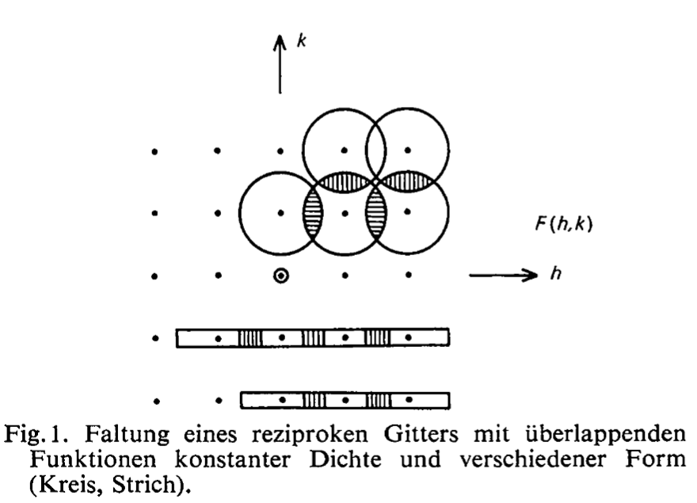{width="85%"}

<div style="text-align: right; margin-top: 0.5em;">
<div style="font-size: 0.8em;">Walter Hoppe [2]</div>
{width="30%"}
</div>

:::
:::

::: {.aside}
[1] @Frank_2022 [2] @Hoppe_1983
:::

## Reciprocity & parallax — the tcBF equations

By reciprocity, every bright-field detector pixel is a *tilted* plane-wave view of the sample; defocus and aberrations then shift those views by a measurable parallax. 

::: {.columns}
::: {.column width="50%"}

### Reciprocity → virtual bright fields

- A detector pixel at $\mathbf{k}$ inside the BF disk is illumination tilted by
$$
\boldsymbol{\theta}(\mathbf{k}) = \lambda\,\mathbf{k}
$$
- A **virtual bright-field (VBF) image** is that single pixel scanned over probe positions $\mathbf{R}$:
$$
I_{\mathbf{k}}(\mathbf{R}) \equiv I(\mathbf{R}, \mathbf{k})
$$
- → one tilted-illumination image of the object per BF pixel.

:::
::: {.column width="50%"}

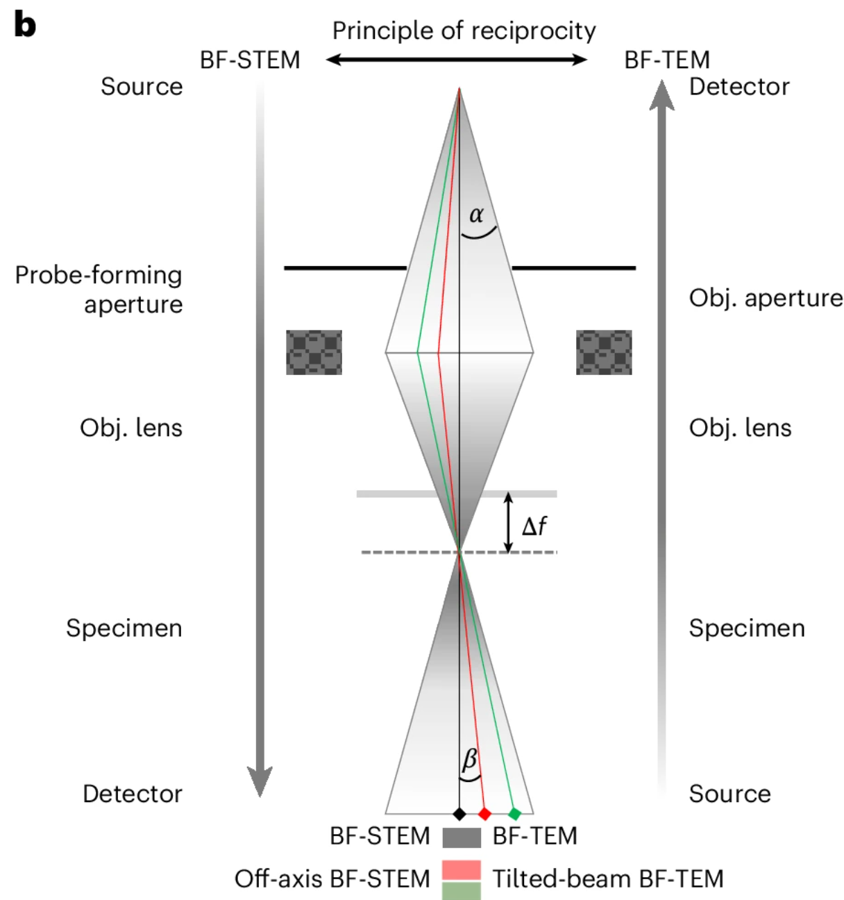{height=650px}

 

:::
:::

::: {.callout-note .fragment}
A real-space shift $\mathbf{s} = \tfrac{1}{2\pi}\nabla_{\mathbf{k}}\chi$ is a reciprocal-space phase ramp $e^{\,i\,\nabla_{\mathbf{k}}\chi(\mathbf{k})\cdot\mathbf{Q}_p}$
:::

::: {.aside}
[@Yu_2025; @Ophus_2019; @Varnavides_2026]
:::

## Virtual Bright Fields and Parallax

<div class="iframe-container" style="height: 720px;">
<iframe
  class="marimo-frame"
  src="https://pelzlab.science/marimo/apps/parallax_virtual_bright_fields.html?mode=read&embed=true"
  frameBorder="0"
  width="100%"
  height="720px"
  style="border: none; filter: invert(1) hue-rotate(180deg);"
></iframe></div>

::: {.callout-note .fragment}
Each bright-field detector pixel is one illumination tilt (reciprocity), $\boldsymbol{\theta} = \lambda\mathbf{k}$. Defocus × tilt → lateral parallax shift $\mathbf{s}(\mathbf{k}) = \lambda\,\Delta f\,\mathbf{k}$ in the virtual image.
:::

## Correcting Aberrations: tcBF / Parallax Imaging

<div class="iframe-container" style="height: 820px;">
<iframe
  class="marimo-frame"
  src="https://pelzlab.science/marimo/apps/parallax_aberration_surface.html?mode=read&embed=true"
  frameBorder="0"
  width="100%"
  height="820px"
  style="border: none; filter: invert(1) hue-rotate(180deg);"
></iframe></div>

::: {.callout-note .fragment}
Match the aberration surface → realign the virtual-BF stack → sharpen. Parallax/tcBF is the fast quadratic approximation to full SSB inversion.
:::

## Direct Phase Retrieval: One Forward Model, Many Acronyms

Under the weak phase object approximation, $G(\mathbf{Q}_p, \mathbf{K}_f) = \hat{W}(\mathbf{Q}_p, \mathbf{K}_f)\,\tilde{\varphi}(\mathbf{Q}_p) + n$ — all linear estimators differ only in weighting and normalization [@Varnavides_2026].

<div style="font-size:0.72em">

| Method | Also known as | Kernel / approximation | Normalization |
|--------|---------------|------------------------|---------------|
| **SSB** | acBF ptychography | full $\hat{W}$, one sideband | none |
| **OBF** | optimum bright field | full $\hat{W}$ | RMS overlap (noise flattening) |
| **MF / WDD** | matched filter / Wigner deconv. | full $\hat{W}$ (mixed domain) | Wiener / LS |
| **Parallax** | tcBF STEM | $\exp[i\nabla_k \chi(k)\cdot \mathbf{Q}_p]$ only | phase flip + sum |
| **iCOM / iDPC** | integrated CoM | first moment $\int \hat{W}\,\mathbf{k}\,d\mathbf{k}$ | Fourier integration |

</div>

::: {.callout-note .fragment}
Direct methods: ms reconstruction → live feedback during acquisition and initial guesses for iterative engines
:::

## SSB / acBF Ptychography

Phase-compensated coherent sum over the aperture-overlap kernel $\hat{W}(\mathbf{Q}_p, \mathbf{K}_f) = \tilde{\psi}^*(\mathbf{K}_f)\tilde{\psi}(\mathbf{K}_f - \mathbf{Q}_p) - \tilde{\psi}(\mathbf{K}_f)\tilde{\psi}^*(\mathbf{K}_f + \mathbf{Q}_p)$:

$$
\tilde{\varphi}_\mathrm{SSB}(\mathbf{Q}_p) = \sum_{\mathbf{K}_f \in \mathrm{double\text{-}overlap}} \hat{W}^*(\mathbf{Q}_p, \mathbf{K}_f)\, G(\mathbf{Q}_p, \mathbf{K}_f)\, \big/ |\hat{W}(\mathbf{Q}_p, \mathbf{K}_f)|
$$

 
![Sideband structure in $G(\mathbf{K}_f, \mathbf{Q}_p)$ for graphene [@Pennycook_2015].](./ssb/page_004_img_001.png){height="420px"}
 

::: {.callout-note .fragment}
SSB uses only the double-overlap (single sideband); beyond $|Q| > q_0$ the CTF collapses to the ideal aperture autocorrelation envelope [@Yang_2016].
:::
<!-- 
## iCOM / iDPC: First Moment of the Overlap Kernel

$$
\tilde{\varphi}_\mathrm{iCOM}(\mathbf{Q}_p) = \frac{\sum_{\mathbf{K}_f} \mathbf{Q}_p \cdot \big[G(\mathbf{Q}_p, \mathbf{K}_f)\,\mathbf{K}_f\big]}{i|\mathbf{Q}_p|^2}
$$

- Cheapest direct estimator — no aberration deconvolution, but excellent for near-focus / in-situ workflows
- CTF $\propto [\tilde{\psi} \star \tilde{\psi}](\mathbf{Q}_p)$; SSNR $\propto 1/|\mathbf{Q}_p|$ → low frequencies are noisy despite unit contrast
- Same first-moment signal underlies **DPC / CoM field imaging** (revisited later)

<!-- ::: {.callout-note .fragment}
iCOM is the fast end of the direct-methods family; SSB/OBF/MF recover more phase when defocus and aberrations are large
::: -->

## Analytical Theory and Contrast Transfer

::: {.columns}
::: {.column width="55%"}

- The phase contrast transfer function (PCTF) describes how specimen spatial frequencies are transferred
- For SSB under the WPOA:

$$
\mathrm{PCTF}_\mathrm{SSB}(\mathbf{Q}_p) = \frac{i}{2}\sum_{\mathbf{K}_f} |\hat{W}(\mathbf{Q}_p, \mathbf{K}_f)|
$$

- $\hat{W}$ uses the full complex probe $\tilde{\psi}(\mathbf{K}_f) = A(\mathbf{K}_f)\,e^{-i\chi(\mathbf{K}_f)}$ — aberration phase is built in
- CTF sets the *maximum* transferable signal; **SSNR / DQE** quantify what is statistically reliable [@Varnavides_2026]

:::
::: {.column width="45%" .fragment}

- Optimal transfer: $\mathrm{PCTF} = 1$
- Reduced transfer when direct and scattered beams do not overlap constructively
- Axial BF ($\mathbf{K}_f = 0$): $\mathrm{PCTF} \propto -i\sin[\chi(\mathbf{Q}_p)]$ — the HRTEM reciprocity link

:::
:::

::: {.callout-note .fragment}
Tune convergence angle and defocus to maximize phase contrast at the spatial frequencies you care about
:::


## Analytical Theory and Contrast Transfer: Visual

<div class="iframe-container" style="height: 900px;">
<iframe
  class="marimo-frame"
  src="https://pelzlab.science/marimo/apps/ptychographic_ctf.html?mode=read&embed=true"
  frameBorder="0"
  width="100%"
  height="800px"
  style="border: none; filter: invert(1) hue-rotate(180deg);"
></iframe></div>


<!-- ## Statistically Reliable Information: SSNR and DQE

<div class="iframe-container" style="height: 900px;">
<iframe
  class="marimo-frame"
  src="https://pelzlab.science/marimo/apps/ff_stem_ssnr.html?mode=read&embed=true"
  frameBorder="0"
  width="100%"
  height="780px"
  style="border: none; filter: invert(1) hue-rotate(180deg);"
></iframe></div>

::: {.callout-note .fragment}
SSB, OBF, and MF/WDD share the same SSNR — they differ in robustness, not information content. Iterative ptychography fills the CTF but hits a STEM DQE ceiling.
::: 
-->

## Beyond the Weak Phase Object: When to Go Iterative

::: {.columns}
::: {.column width="55%"}

- Direct BF ptychography is **self-linearizing** for moderate phase: even-order Born terms populate an absorptive channel suppressed by phase-selective operators
- Direct methods excel at **low dose** and **live feedback**; iterative methods win for thick / strongly scattering samples
- First ePIE iteration ≈ SSB deconvolution; later iterations extend the effective CTF toward unity

:::
::: {.column width="45%" .fragment}

- **Projection-set:** ER, DM, RAAR — robust, no explicit loss function
- **Gradient-based:** ePIE → SGD/Adam — interfaces with autodiff, multislice, mixed-state, learned priors

:::
:::

::: {.callout-note .fragment}
Workflow: fast direct reconstruction during acquisition → offline iterative / multislice on GPU
:::


## Part 3 · The 4D-STEM acquisition chain

> Pixelated detectors deliver enormous data rates.
> **How do we acquire, store, and preview 4D-STEM in practice?**

<div class="roadmap">
<div class="rtile"><div class="rlbl">1 · X-ray vs e⁻</div></div>
<div class="rtile"><div class="rlbl">2 · Phase & direct</div></div>
<div class="rtile active"><div class="rlbl">3 · Acquisition</div></div>
<div class="rtile"><div class="rlbl">4 · Iterative & 3D</div></div>
<div class="rtile"><div class="rlbl">5 · Fields</div></div>
</div>

## Detector Evolution: Hybrid Pixel Array Detectors

::: {.columns}
::: {.column width="52%"}
- Thick high-Z sensor + per-pixel electronics (counting, thresholds)
- **EMPAD** [@Tate_2016]: 128×128, 1.1 kHz, dynamic range ~1:1,000,000 → records the full bright-field disk *and* single electrons in the same pattern
- **Medipix3 / Merlin** [@Ballabriga_2013]: 256×256 counting, 12/24-bit, up to ~kHz frame rates
- Trade-offs:
  - modest pixel counts (128–512)²
  - thick sensor → charge sharing between pixels at high energy
  - radiation-hard, tolerate direct central beam
:::
::: {.column width="48%"}
::: {.columns}
::: {.column width="50%"}
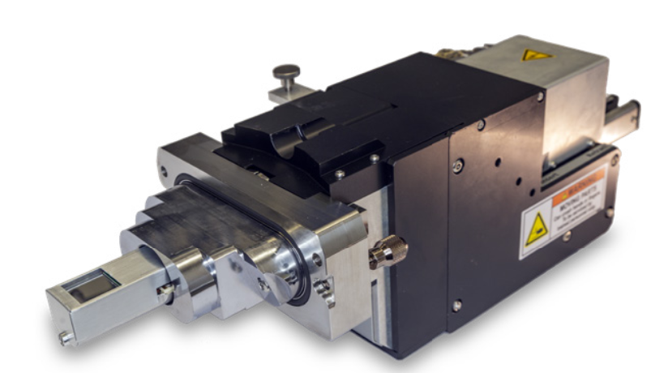{height="240px"}
:::
::: {.column width="50%"}
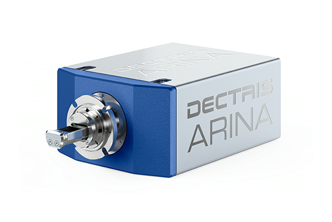{height="240px"}
:::
:::
:::
:::

::: {.callout-note .fragment}
Hybrid PADs are the current workhorses for ptychography: high dynamic range where the central beam lives
:::

## Detector Evolution: Event-Driven Detection

::: {.columns}
::: {.column width="52%"}
- **Timepix3** [@Poikela_2014] / **Timepix4** [@Llopart_2022]: no frames — each electron is an event (x, y, time-of-arrival, time-over-threshold)
- Time resolution ~1.6 ns; sparse readout → data volume scales with **dose**, not with scan size
- Demonstrated 4D-STEM with µs dwell times [@Jannis_2022]
- Consequences:
  - dwell time becomes a free post-processing choice (re-binning events in time)
  - natural fit for low-dose & in-situ experiments
  - needs new sparse data formats and event-based algorithms
:::
::: {.column width="48%"}
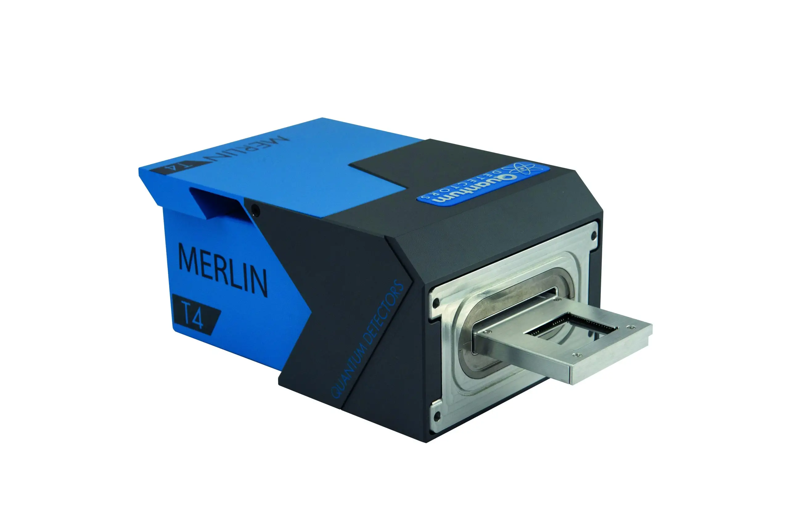{height="420px"}
:::
:::

::: {.callout-note .fragment}
Event-driven cameras dissolve the concept of "frame rate" — acquisition speed is set by the scan, not the camera
:::
 
## Data Rates: Drinking from the Firehose

::: {.columns}
::: {.column width="55%"}
- 4D-STEM multiplies data: (scan pixels) × (detector pixels)
- Merlin @ 4 kHz, 256², 12-bit → ~3 Gbit/s
- 4D Camera @ 87 kHz, 576×576 → ~480 Gbit/s, ~700 GB per minute [@Ercius_2024]
- A single overview scan (2k×2k probe positions) with a 256² camera = **0.5 TB** raw
:::
::: {.column width="45%" .fragment}
- Survival strategies:
  - electron counting + sparse/compressed formats (events, run-length encoding)
  - hierarchical formats: HDF5 / EMD, vendor formats (.mib, .dm5)
  - keep raw data close to GPUs — network becomes part of the microscope
:::
:::

::: {.callout-note .fragment}
Budget storage and compute *per session*, not per project — TB/day is normal now
:::
 


## Part 4 · Iterative & multislice 3D imaging

> Real specimens are thick and the inverse problem has many knobs.
> **How do iterative reconstruction and multislice tomography fit together?**

<div class="roadmap">
<div class="rtile"><div class="rlbl">1 · X-ray vs e⁻</div></div>
<div class="rtile"><div class="rlbl">2 · Phase & direct</div></div>
<div class="rtile"><div class="rlbl">3 · Acquisition</div></div>
<div class="rtile active"><div class="rlbl">4 · Iterative & 3D</div></div>
<div class="rtile"><div class="rlbl">5 · Fields</div></div>
</div>

## Bayesian Framework for Inverse Problems
::: {.columns}
::: {.column width="55%"}

- **Goal:** Estimate unknown image $\mathbf{x}$ from a diffraction pattern amplitude $\mathbf{y}$
- $p(\mathbf{x} | \mathbf{y})$: posterior probability of the unknown image given the diffraction pattern
- The most likely image, given the measurements:

$$\boxed{\hat{\mathbf{x}} = \arg\min_{\mathbf{x}} -\log p(\mathbf{y}|\mathbf{x}) - \log p(\mathbf{x})}$$

:::
::: {.column width="45%"}
\begin{align*}
\hat{\mathbf{x}} &= \arg\max_{\mathbf{x}} p(\mathbf{x}|\mathbf{y}) \\
&\overset{(i)}{=} \arg\max_{\mathbf{x}} \frac{p(\mathbf{y}|\mathbf{x})p(\mathbf{x})}{p(\mathbf{y})} \\
&\overset{(ii)}{=} \arg\max_{\mathbf{x}} p(\mathbf{y}|\mathbf{x})p(\mathbf{x}) \\
&\overset{(iii)}{=} \arg\max_{\mathbf{x}} \log\left(p(\mathbf{y}|\mathbf{x})p(\mathbf{x})\right) \\
&= \arg\min_{\mathbf{x}} -\log p(\mathbf{y}|\mathbf{x}) - \log p(\mathbf{x}).
\end{align*}
<div style="font-size:0.65em; text-align: right;">
- (i) <b>Bayes' rule:</b> $p(\mathbf{x} | \mathbf{y}) = \dfrac{p(\mathbf{y} | \mathbf{x})\, p(\mathbf{x})}{p(\mathbf{y})}$<br>
- (ii) $p(\mathbf{y})$ does not depend on $\mathbf{x}$<br>
- (iii) The log-likelihood increases monotonically
</div>

:::
:::
 


::: {.callout-note .fragment} 
Many modern ptychography algorithms use a Bayesian framework
:::

## Bayesian Framework for Ptychography

The likelihood for a linear forward model with Gaussian noise is:

$$
p(\mathbf{y}|\mathbf{x}) \sim \exp\left(-\frac{1}{2\sigma^2} \|\mathbf{P}(\mathbf{x}) - \mathbf{y}\|_2^2\right)
$$

where $\mathbf{P}$ is the ptychography measurement operator, $\mathbf{x}$ is the unknown image, $\mathbf{y}$ is the measured data, and $\sigma^2$ is the noise variance.
The negative log-likelihood for a forward model with Gaussian noise is:

$$
-\log p(\mathbf{y}|\mathbf{x}) = \frac{1}{2\sigma^2} \|\mathbf{P}(\mathbf{x}) - \mathbf{y}\|_2^2 + c
$$
The prior term $-\log p(\mathbf{x})$ is often called the *regularization* in optimization. It can be written as:
$$
\lambda \sigma^2 \mathcal{R}(\mathbf{x}) = -\log p(\mathbf{x})
$$
where $\mathcal{R}(\mathbf{x})$ is a regularization function (e.g., enforcing smoothness or sparsity), $\lambda$ is a regularization parameter, and $\sigma^2$ is the noise variance.
The resulting optimization problem for MAP estimation in the case of a linear forward model and Gaussian noise is:

---

$$
\hat{\mathbf{x}} = \arg\min_{\mathbf{x}} \frac{1}{2} \|\mathbf{P}(\mathbf{x}) - \mathbf{y}\|_2^2 + \lambda \mathcal{R}(\mathbf{x})
$$

where 

- $\mathbf{P}(\mathbf{x})$ is the measurement operator, 
- $\mathbf{y}$ is the measured data, 
- $\mathcal{R}(\mathbf{x})$ is the regularization (prior) term, and 
- $\lambda$ controls the strength of the regularization.
<br><br>

- first term enforces data fidelity 
- second term encodes prior knowledge or constraints on the solution (regularization)

---
## Iterative Reconstruction Methods: Basic Ptychography Algorithm
```{python}
#| code-fold: true
import torch
import torch.fft as fft
from torch import Tensor
import skimage.data as skdata  
import skimage.transform as sktrans
import matplotlib.pyplot as plt
from scipy.ndimage import gaussian_filter
import numpy as np
img = skdata.astronaut()

img = sktrans.resize(img, (64, 64))
img = gaussian_filter(img, sigma=1)
# Convert to grayscale by taking mean across color channels
img = np.mean(img, axis=2)
img = img.astype(np.float32) / 255.0
img = torch.from_numpy(img)  
complex_image = torch.polar(torch.ones_like(img), img/img.max()*0.4)
```


::: {.columns}
::: {.column width="55%"}
### Ingredient 1: scanning over the sample 
```{python}
def C(image : Tensor, positions : Tensor, window_size : int) -> Tensor:
    # Cropping operator: crop windows from the image at the given positions
    scan_windows = [] 
    for i, (x, y) in enumerate(positions):
        x_indices = torch.arange(x, x + window_size) % image.shape[1]
        y_indices = torch.arange(y, y + window_size) % image.shape[0] 
        Y, X = torch.meshgrid(y_indices, x_indices, indexing='ij') 
        window = image[Y, X]
        scan_windows.append(window)        
    scan_windows = torch.stack(scan_windows, dim=0)
    return scan_windows
```
:::
::: {.column width="45%"}
### Ingredient 2: propagation / interference
```{python}
def F(wave):
  return fft.fft2(wave)
```
### Simplest Ptychography Model
$$P(\mathbf{x}, \mathbf{\psi}, \mathbf{\rho}) = \left| \mathcal{F} \left( \mathbf{\psi(r)} \cdot \mathbf{C}(\mathbf{x}, \mathbf{\rho}) \right) \right|$$
```{python}
def P(sample, probe, scan_positions):
  # crop the scanning windows, transmit the beam, propagate 
  # to detector, then detect
  return th.abs(F(probe * C(sample, scan_positions, probe.shape[0])))
```
:::
:::
```{python}
#| code-fold: true
import numpy as np
import plotly.graph_objects as go
import plotly.io as pio

# Configure plotly for both VS Code and Quarto rendering
pio.renderers.default = "plotly_mimetype+notebook_connected"

# Define scan grid
size = 8
step = 1
x = torch.arange(0, size, step)
y = torch.arange(0, size, step)
X, Y = torch.meshgrid(x, y, indexing='ij')
positions = torch.stack([X.flatten(), Y.flatten()], dim=1)  # Kx2 array
K = positions.shape[0]

# Example sample image (replace with your own)
sample = complex_image

# Example probe (window size)
probe_size = 32 
probe = torch.ones((probe_size, probe_size))

# Crop image stack
image_stack = C(sample, positions, probe_size)  # shape: (K, probe_size, probe_size)

# Create interactive plotly figure with title "scanning windows"
fig = go.Figure()
# Add initial image
fig.add_trace(go.Heatmap(
    z=np.angle(image_stack[0].detach().cpu().numpy()),
    colorscale='inferno',
    showscale=False
))
# Add slider, set black background, add figure title, and set text color to white
fig.update_layout(
    title=dict(text="Scanning Windows", font=dict(color='white')),
    width=400,
    height=500,
    margin=dict(l=0, r=0, t=40, b=0),
    xaxis=dict(showticklabels=False, showgrid=False, color='white', title_font=dict(color='white')),
    yaxis=dict(showticklabels=False, showgrid=False, color='white', title_font=dict(color='white')),
    sliders=[dict(
        active=0,
        currentvalue={"prefix": "Position: ", "font": {"color": "white"}},
        len=0.9,
        x=0.1,
        xanchor="left",
        y=0,
        yanchor="top",
        steps=[dict(
            method="restyle",
            args=[{"z": [np.angle(image_stack[i].detach().cpu().numpy())]}, [0]],
            label=str(i)
        ) for i in range(K)],
        font=dict(color='white')
    )],
    paper_bgcolor='black',
    plot_bgcolor='black',
    font=dict(color='white')
)
fig.show()

```

## Experimental Design Considerations: parameter flexibility
::: {.columns}
::: {.column width="35%"}

![Adjustable parameters for ptychographic data acquisition [1]](images/ptychoscopy_01.webp){height="550px"}

:::
::: {.column width="65%"}

<div style="font-size:0.75em">

| Limitation/check         | Description                                                        | Default         |
|-------------------------|--------------------------------------------------------------------|-----------------|
| Areal oversampling       | How many probes illuminate each pixel? <br> $$A = \frac{\pi r_p^2}{s^2}$$   | 1.6 - 1e3   |
| Probe sampling           | To which extent is the probe contained in its window? <br> $$P = \frac{1}{2r_pd}$$ | < 0.5         |
| Ronchigram magnification     | Size of the shadow image on the detector plane in units $\frac{pixel}{Å}$ <br> $$M = \frac{\alpha}{\theta \cdot r_p} = \frac{\alpha}{\lambda d \cdot r_p}$$ | 10 - 100 |
</div>

:::
:::

where:

::: {.columns}
::: {.column width="50%"}
- $\alpha$ is the semi-convergence angle
- $\theta$ is the angular sampling in radians
- $s$ is the scan step size
:::
::: {.column width="50%"}
- $r_p$ is the probe radius
- $d$ is the diffraction space sampling
:::
:::
 
::: {.aside}
[1] @Skoupy_2025 [2] @Gilgenbach_2024
:::

## Experimental Design Considerations: sampling


<div class="iframe-container" style="height: 820px;">
<iframe
  class="marimo-frame"
  data-src="https://pelzlab.science/marimo/apps/ptychographic_sampling.html?mode=read&embed=true"
  src="about:blank"
  frameBorder="0"
  width="100%"
  style="border: none; filter: invert(1) hue-rotate(180deg);"
></iframe></div>

::: {.callout-note .fragment} 

sampling in diffraction space & defocus → Ronchigram Magnification

sampling in real space & defocus  → Areal oversampling

:::

## Modeling partial coherence

<div style="font-size: 90%;">
- partial coherence arises from multiple sources in electron microscopy:
  - finite source size --> partial spatial coherence of the electron source [1]
  - finite detector pixel size --> partial spatial coherence
  - finite energy spread inside the column --> partial temporal coherence [1]

::: {.fragment}
- most efficient models:
  - [detector pixel size & source size: convolution in the detector plane [2]]{style="color: green;"}
  - [energy spread & remaining partial coherence: multiple coherent modes [3]]{style="color: red;"}


$$
I(\vec{\rho}, \vec{q}) =\left(\color{red}{\sum_n a_n} \left|\mathcal{F}\left[O(\vec{\vec{r}})\color{red}{\psi_n(\vec{r}-\vec{\rho})}\right]\right|^2\right) \color{green}{\otimes M(\vec{q})}
$$

where:

::: {.columns}
::: {.column width="50%"}
- $\vec{\rho}$ is the position on the detector plane
- $\vec{q}$ is the position in reciprocal space
- $a_n$ is the amplitude of the $n$-th coherent mode
:::
::: {.column width="50%"}
- $O(\vec{r})$ is the aperture function
- $\psi_n(\vec{r}-\vec{\rho})$ is the wave function of the $n$-th coherent mode, shifted by the position $\vec{\rho}$
- $M(\vec{q})$ is the a function modeling modulation transfer function and partial source coherence
:::
:::
:::
</div>

  
::: {.aside}
[1] @Li_2022, [2] @Diederichs_2024, [3] @Thibault_Menzel_2013
:::

## Experimental Design Considerations: coherence

<div class="iframe-container" style="height: 850px;">
<iframe
  class="marimo-frame"
  src="https://pelzlab.science/marimo/apps/ptychographic_coherence.html?mode=read&embed=true"
  frameBorder="0"  
  height="850px"
  style="border: none; filter: invert(1) hue-rotate(180deg);"
></iframe></div>

::: {.callout-note .fragment} 
temporal coherence is no problem at 200-300kV, ~2-3 modes

at low energies 30-60keV, temporal coherence needs more modes

superresolution capabilities circumvent the coherence problem
:::

## Adding more "nuisance parameters": Refining the scan positions 

- realistic model for thin samples:

$$
P(\mathbf{x}, \mathbf{\psi}, \mathbf{\rho}) = \left|\left(\sum_n a_n \left|\mathcal{F}\left[O(\vec{\vec{r}})\psi_n(\vec{r}-\vec{\rho})\right]\right|^2\right) \otimes M(\vec{q})\right|
$$
 
$$
\hat{\mathbf{x}} = \arg\min_{\color{red}{\mathbf{x}, \mathbf{\psi}, \mathbf{\rho}}} 
\frac{1}{2} \|P(\mathbf{x}, \mathbf{\psi}, \mathbf{\rho}) - \mathbf{y}\|_2^2 + \lambda \mathcal{R}(\mathbf{x}) + \lambda_1 \mathcal{R}_1(\mathbf{\psi}) 
$$

 

::: {.callout-note .fragment} 

modern ML frameworks allow us to refine additional parameters easily using automatic gradient calculations

:::


## Modeling thick samples: the multi-slice algorithm

- Up to now: thin samples, i.e. thickness < depth of field and weak scattering 

::: {.columns}
::: {.column width="50%" .fragment}
- Thick samples require modeling of multiple scattering events
- Sample is divided into thin slices that can be treated independently
- Beam propagates through slices sequentially

![Multi-slice propagation model (Adapted from [1])](romanov2024/page_004_img_002.png)
:::

::: {.column width="50%" .fragment}
$$\psi_{n+1}(r) = \mathcal{P}_{\Delta z} \left[ t_n(r) \psi_n(r) \right]$$

where:

- $\psi_n(r)$ is the wave at slice n
- $t_n(r)$ is the transmission function
- $\mathcal{P}_{\Delta z}$ is the propagator (usually Fresnel)
- $\Delta z$ is the slice thickness

Key parameters:

- Slice thickness (typically 1-2 nm)
- Number of slices
- Propagation distance
:::
:::

 
::: {.aside}
[1] @Romanov_2024, [2] First demonstration: @Chen_2021
:::

## Multi-slice ptychography (MSP)
| Component | Mathematical Description |
|-----------|-------------------------|
| Multislice algorithm | $$\mathcal{M}_{\psi}(\mathbf{V}) = \prod_{k=0}^T (\mathcal{P}^{\Delta z} T^{\mathbf{V}_k})\psi $$ |
| Multi-slice ptychography model | $$P(\mathbf{V}, \mathbf{\psi}, \mathbf{\rho}) = \left|\left(\color{red}{\sum_n a_n} \left|\mathcal{F}\left[\mathcal{M}_{\color{red}{\psi_n(\vec{r}-\vec{\rho})}}(\mathbf{V})\right]\right|^2\right) \color{green}{\otimes M(\vec{q})}\right|$$ |
| Optimization problem | $$\hat{\mathbf{V}} = \arg\min_{\mathbf{V}, \mathbf{\psi}, \mathbf{\rho}} \frac{1}{2} \|P(\mathbf{V}, \mathbf{\psi}, \mathbf{\rho}) - \mathbf{y}\|_2^2 + \lambda \mathcal{R}(\mathbf{V}) + \lambda_1 \mathcal{R}_1(\mathbf{\psi}) $$ |

<!-- $$
P(\mathbf{V}, \mathbf{\psi}, \mathbf{\rho}) = \left|\left(\color{red}{\sum_n a_n} \left|\mathcal{F}\left[\mathcal{M}_{\color{red}{\psi_n(\vec{r}-\vec{\rho})}}(\mathbf{V})\right]\right|^2\right) \color{green}{\otimes M(\vec{q})}\right|
$$
 
$$
\hat{\mathbf{V}} = \arg\min_{\mathbf{V}, \mathbf{\psi}, \mathbf{\rho}} 
\frac{1}{2} \|P(\mathbf{V}, \mathbf{\psi}, \mathbf{\rho}) - \mathbf{y}\|_2^2 + \lambda \mathcal{R}(\mathbf{V}) + \lambda_1 \mathcal{R}_1(\mathbf{\psi}) 
$$ -->

::: {.callout-note .fragment} 

We have arrived at the state of the art in ptychography:

3D imaging with deep-sub-angstrom lateral and ~2nm depth resolution
:::

## Constraints in MSP: positive potential, amplitude~1, blur kernel

::: {.columns}
::: {.column width="33%" .fragment}
**Constraint 1: Positive Potential**

- The electrostatic potential $V(\mathbf{r})$ must be physically meaningful: $V(\mathbf{r}) \geq 0$
- Enforced during optimization by projecting negative values to zero
- Prevents unphysical solutions and improves stability

:::
::: {.column width="33%" .fragment}
**Constraint 2: Amplitude $\approx 1$**

- The transmission function $t_n(\mathbf{r})$ should have amplitude close to 1 (very few electrons scattered outside the 4D-STEM detector are registered as "amplitude contrast")
- Enforced by regularization: penalize deviations from $|t_n(\mathbf{r})| = 1$


:::
::: {.column width="33%" .fragment}
**Constraint 3: Blur Kernel**

- in (x,y) plane: stabilize deep-sub-angstrom resolution reconstructions
- in z-direction: limit depth resolution, disallow higher than 1nm depth resolution
- early algorithms: Fourier-space convolution --> leads to wrap-around artefacts for non-periodic samples

:::
:::

::: {.callout-note .fragment} 

Minimal set of constraints to make the reconstruction stable.<br>

Add your own flavour of constraints: more physics, data-driven priors, denoisers...

:::

## Extensions of MSP: mistilt correction

::: {.columns}
::: {.column width="50%" .fragment}
![Slight misorientation of the zone axis can lead to stricter requirements for the slice thickness.<br>Solution: include the mistilt in the propagator, refine it during the reconstruction<br>Adapted from [1]](sha/page_004_img_002.png)
:::
::: {.column width="50%" .fragment}
![Adaptive propagator requires less slices<br>--> Faster reconstructions<br>Adapted from [1]](sha/page_004_img_003.png){height="700px"}
:::
:::

::: {.callout-note .fragment} 

Slight deviations from the perfect zone axis can be refined algorithmically

:::


::: {.aside}
[1] @Sha_Cui_Yu_2022
:::

## Extensions of MSP: atomistic models

 
::: {.columns}
::: {.column width="50%" .fragment}

Assemble the electrostatic potential from atomic positions and atomic numbers

$$O_l(\mathbf{r}) = A_l(\mathbf{r}) e^{i \sigma_e V_{\mathrm{FP}}^{(j)}(\mathbf{r}, \boldsymbol{\tau})}$$

$$
V_{\mathrm{FP}}^{(j)}(\mathbf{r}, \boldsymbol{\tau}) = \sum_{n=1}^{N} w_n v_{Z_n} \left( \mathbf{r} - \mathbf{r}_n - \sqrt{\langle u_n^2 \rangle} \cdot \mathbf{g}_{n, \tau} \right)
$$

:::
::: {.column width="50%" .fragment}
![Atomistic model for the reconstructed potential (Adapted from [2])](atomistic/page_002_img_002.png){height="500px"}
:::
:::


::: {.callout-note .fragment} 

Atomic positions can be refined directly 

--> interpretable model, enables phonon modeling

--> sparse model --> achieves higher resolution than voxelized models

--> phonon modeling --> might enable imaging of phonon modes
:::


::: {.aside}
[1] @Yang_2024 [2] @Diederichs_2024
:::

## Extensions of MSP: mixed-state objects & phonon correlations

::: {.columns}
::: {.column width="45%"}

- **CAVIAR** (Correlated Atomic Vibration Imaging with sub-Ångstrom Resolution): mixed-state multislice ptychography that retrieves interatomic displacement correlations
- Forward model: incoherent sum over atomic configurations → diffraction intensities
- Output: Green's tensor of displacement correlations → phonon branches from few nm³ at room temperature

:::
::: {.column width="55%"}

![Adapted from [1]: Fig. 1 — multislice 4D-STEM simulation with multiple object configurations (phonon / thermal snapshots) summed incoherently to form each diffraction pattern.](phonon74135/image.png){width="100%"}

:::
:::

::: {.aside}
[1] @Gladyshev_2026
:::

## CAVIAR: simulated Σ9 Si grain boundary (Fig. 2)

![Adapted from [1]: Ptychographic reconstructions for a symmetric Σ9 grain boundary in silicon — ground-truth MD correlations (a) vs. CAVIAR under no vibration, Einstein (uncorrelated), correlated vibrations, and partial spatial coherence (b–e). CSM/LSM quantify cosine- and length-similarity to ground truth.](phonon74135/image2.png){height=700px}

::: {.callout-note .fragment}
Correlated vibrations must be modeled explicitly; uncorrelated (Einstein) thermal motion destroys recovered interatomic correlations
:::

::: {.aside}
[1] @Gladyshev_2026
:::

## CAVIAR: experimental hBN bicrystal (Fig. 3)

![Adapted from [1]: ~15 nm hBN bicrystal (11° twist) reconstructed with 30 slices, 10 object states, 5 probe modes — projected phase (a), power spectrum to 47.8 pm (b), 3D Fourier cut-off (c), depth-resolved r–z phase maps separating upper/lower lattices (d–f).](phonon74135/image3.png){height=700px}

::: {.callout-note .fragment}
Mixed-state MSP resolves depth-separated lattices and extracts phonon-dispersion curves from displacement correlations — complementary to vibrational EELS
:::

::: {.aside}
[1] @Gladyshev_2026
:::

## Applications of MSP: 3D imaging 
::: {.columns}
::: {.column width="50%"}

![Adapted from [1]: Identification of O vacancies in ZSM-5. Intensity histograms and variations reveal O vacancies through comparison of experimental and simulated ptychographic phase images. Red dots in (D) show identified vacancy-containing columns across layers L1-L7.](./images/3d_ptycho_01.png){width="90%"}
 
:::
::: {.column width="50%"}

![Adapted from [1]: (A) 4D-STEM ptychography image displaying extra T atoms (indicated by the magenta arrows) relative to the typical MFI framework. The yellow dashed rectangle indicates the region analyzed in Fig. 5A. (B) Structural projections of straight 10-MR channels of MFI and MEL and their superposition. The letters i and m denote inversion and mirror symmetry, respectively. (C and D) Second (C) and fourth (D) slices of the multislice ptychography reconstruction result.](./images/3d_ptycho_02.png){width="90%"}

:::
:::

::: {.callout-note .fragment} 
Excellent for imaging inhomogeneities of weakly scattering atoms
:::

::: {.aside}
[1] @Zhang_2023
:::

## Applications of MSP: 3D imaging 2
::: {.columns}
::: {.column width="50%"}

![Adapted from [1]: Hydrogen detection sensitivity across different imaging techniques. (A) Simulated images of NbHx (15 nm thickness) with varying hydrogen content over Nb metal atoms (0.36-2.0 H/M) acquired by contrast-inverted annular bright-field (ABF), integrated center-of-mass (iCOM), and multislice electron ptychography (MEP). Scale bar, 2 Å. (B) Hydrogen-to-metal column intensities vs hydrogen content for iCOM and MEP, demonstrating MEP’s superior detection sensitivity.](./images/H_ptycho.png){width="90%"}
 
:::
::: {.column width="50%"}

![Adapted from [1]: TiH2 phase images along [100] and [110] zone axes using experimental data, summing middle slices (11-22 nm thickness)](./images/H_ptycho2.png){width="90%"}

:::
:::

::: {.callout-note .fragment} 
Even hydrogen columns can be resolved, if more than 4 H atoms.
:::

::: {.aside}
[1] @Chen_2025
:::


## Applications of MSP: ultra low-dose imaging

::: {.columns}
::: {.column width="50%"}

![Adapted from [1]: MOF Zr-BTB imaged with electron ptychography at 115 e−/Å2 dose. (a) Phase image showing 2.25 Å resolution. (b-d) Power spectrum, enlarged region, and structural model showing excellent agreement.](./images/lowdose_ptycho_01.png){width="90%"}
 
:::
::: {.column width="50%"}

![Adapted from [1]: Iterative reconstruction error curves (d) and reconstructed ptychography phase images (e) using 4D-STEM datasets simulated at varying convergence semiangles with a consistent electron dose of 100 e−/Å2. The 10-mrad case shows the best reconstruction, as marked by the red square.](./images/lowdose_ptycho_02.png){width="65%"}

:::
:::

::: {.callout-note .fragment} 
Multiple scattering from crystals at very low doses enables 2Šresolution at dosesof 100 e-/Ų
:::

::: {.aside}
[1] @Li__2025
:::


## Limitations of MSP: axial resolution

::: {.columns}
::: {.column width="50%"}

![Adapted from [1]: Principle of depth sectioning via multislice electron ptychography](./images/depth_res_01.png){width="80%"}
 
:::
::: {.column width="50%"}

![Adapted from [1]: Depth evolution of phase/intensity across Pr-Pr dumbbell showing strong dependence on chromatic aberration. Comparison between (a) multislice ptychography and (b) focal series ADF imaging.](./images/depth_res_02.png){width="90%"}

:::
:::
 


::: {.callout-note .fragment} 
Axial resolution of MSP is (with current algorithms) limited to below atomic scale if not using the most cutting edge instrumentation


:::

::: {.aside}
[1] @Chen_2024
:::

## First unknown 3D atomic structure solved with 4D-STEM tomography

::: {.columns}
::: {.column width="50%"}
Approach: 

1. 4D-STEM tilt series
2. mixed-state ptychography of all tilt angles

{controls="true" autoplay="true" loop="true" width="50%"}

3. Joint linear tomography and alignment 
4. Sub-pixel atomic peak tracing
5. 3D atomic structure determination
:::

::: {.column width="50%"}
{controls="true" autoplay="true" loop="true" width="100%"}
:::
:::

::: {.callout-note .fragment}
Elliptic double-wall CNT and complex inner structure resolved in 3D 
:::
 

::: {.aside}
@Pelz_2023
:::

## Full 3D: Single-Slice Ptychographic Tomography Solves Nanostructures

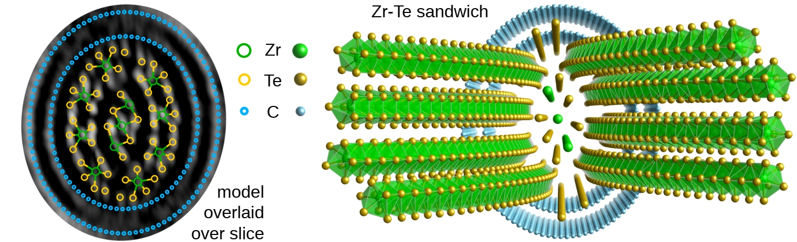{width="65%"}
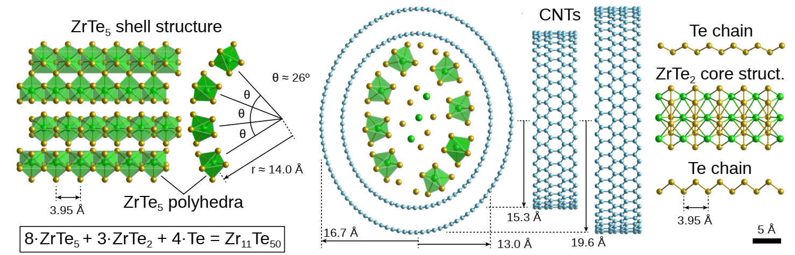{width="65%"}

. . .  


::: {.callout-note .fragment}
First 3D atomic structure solved with phase-contrast tomography.<br>
Novel ZrTe<sub>2</sub> phase, confirmed stable with DFT simulations.
:::

::: {.aside}
@Pelz_2023
:::

## Depth Resolution Progress Over Time
<br>
<br>
<br>

::: {.columns}
::: {.column width="40%" }
![2022: 2.2 Å in 6nm thick volume using SSPT [1]](./images/image30.jpg){style="width:700px;"}
:::

::: {.column width="30%" .fragment}
![2023: 2.0 Å in 18nm thick volume using MSPT [2]](./extracted_media//image87.png){style="width:500px;"}
:::
::: {.column width="30%" .fragment}
![2024: 0.8 Å in 11nm thick volume using E2E-MSPT [3]](./extracted_media/image135.png){style="width:500px; display: block; margin: 0 auto;"}
:::
:::

::: {.callout-note .fragment}
Algorithm development drives resolution records and depth of focus enhancements
:::

::: {.aside}
@Pelz_2023, @Romanov_2024, @You_Romanov_Pelz_2024
:::

## Full 3D: multis-slice ptychographic tomography
::: {.columns}
::: {.column width="50%"}
{width="80%"}
:::

::: {.column width="50%"}
{width="80%"}
:::
:::

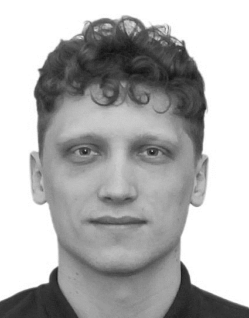
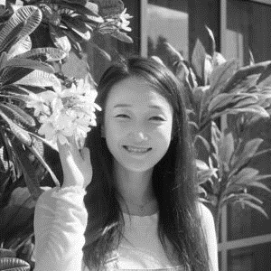

::: {.aside}
@Romanov_2024
:::


## Joint Tomography and Rigid Alignment enables atomic resolution of beyond-DOF volumes

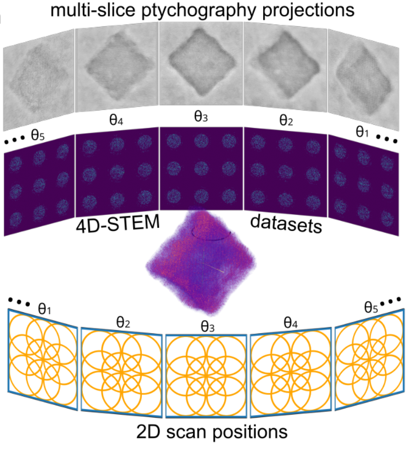{width="35%"}
 
::: {.callout-note .fragment}
Enabled by reaching sub-pixel alignment at each scale
:::


::: {.aside}
@Romanov_2024
:::

## 3x DOF volumes display atomic resolution

::: {.columns}
::: {.column width="50%"}
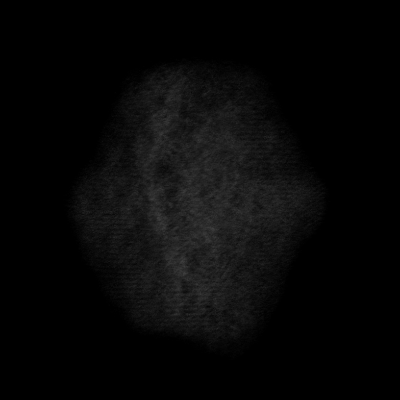
:::

::: {.column width="50%"}
{controls="true" autoplay="true" loop="true" width="100%"}
:::
:::

::: {.callout-note .fragment}
Volume size: (18.2 nm)<sup>3</sup>
Voxel size: 0.3 Å
:::

::: {.aside}
@Romanov_2024
:::

## Orthoslices reveal lattice in all 3 dimensions

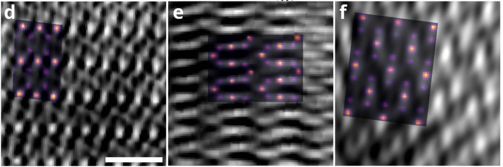

::: {.callout-note .fragment}
Lattice resolved, but Co atom contrast overpower O contrast<br>
=> Around 1 Å z resolution required to resolve O atoms
:::

::: {.aside}
@Romanov_2024
:::

## End-to-end reconstruction - putting all pieces together

::: {.columns}
::: {.column width="50%"}
Fully E2E-MSPT reconstruction includes

1. affine resampling of potential volume<br>
2. z-resampling of potential volume (save compute)<br>
3. batch-croppping and mixed-state multi-slice model<br>
4. far-field propagation<br>
5. gradient backpropagation through full model 
:::

::: {.column width="50%"}
{width="70%"}
:::
:::

::: {.callout-note .fragment}
The most accurate approximation for 4D-STEM tomography to-date 
:::

::: {.aside}
@You_Romanov_Pelz_2024
:::


<!-- ## Ptychographic tomography: Applications -->

## Part 5 · Fields, charge & magnetism

> The reconstructed phase encodes more than atomic positions.
> **Can we measure electric fields, charge transfer, and magnetism from the same 4D dataset?**

<div class="roadmap">
<div class="rtile"><div class="rlbl">1 · X-ray vs e⁻</div></div>
<div class="rtile"><div class="rlbl">2 · Phase & direct</div></div>
<div class="rtile"><div class="rlbl">3 · Acquisition</div></div>
<div class="rtile"><div class="rlbl">4 · Iterative & 3D</div></div>
<div class="rtile active"><div class="rlbl">5 · Fields</div></div>
</div>

## From Structure to Fields: What Else Is in the Data?

- So far: the object's **potential** $V(\vec{r})$ — atomic structure
- The same 4D datasets encode more:

::: {.columns}
::: {.column width="33%" .fragment}
**Electric fields** $\vec{E}(\vec{r})$ — deflection of the beam by the local field
:::
::: {.column width="33%" .fragment}
**Charge density** $\rho(\vec{r})$ — including *valence* redistribution due to bonding
:::
::: {.column width="33%" .fragment}
**Magnetic fields** $\vec{B}(\vec{r})$ — from textures (skyrmions) down to single atomic planes
:::
:::

::: {.callout-note .fragment}
Fields are derivatives of the phase — everything we learned about phase retrieval carries over
:::

## Ptychography → Potential, Field, and Charge Density

::: {.columns}
::: {.column width="55%"}
- Ptychography reconstructs $O(\vec{r}) = e^{i\sigma V(\vec{r})}$ → phase ∝ projected electrostatic potential
- Charge density from Poisson's equation:

$$
\rho(\vec{r}) = -\varepsilon_0 \nabla^2 V(\vec{r})
$$

- Uses *all* diffraction pixels dose-efficiently; post-corrects residual aberrations [@Jiang_2018; @Hofer_2025]
- Subtract the **independent-atom model (IAM)** → valence redistribution from bonding
:::
::: {.column width="45%" .fragment}
- CoM/DPC gives $\vec{E}_\perp$ directly from the first moment [@Mueller_2014] — fast, but:
  - divergence amplifies noise; heavy regularization needed
  - residual aberrations can invert contrast and hide bonding-scale signals [@Hofer_2025]
- Ptychographic phase is the route to *quantitative* charge transfer
:::
:::

::: {.callout-note .fragment}
Bonding perturbs the charge density by ~10% at atomic sites — ptychography + aberration correction reaches the required precision
:::

## Why Ptychography for Charge Transfer?

::: {.columns}
::: {.column width="55%"}
- Bonding-induced charge transfer is a **small** perturbation on the nuclear-dominated density
- Prior CoM/DPC and holography reached atomic-resolution charge density but not bonding sensitivity [@Hofer_2025]
- Residual lens aberrations can reverse W–S₂ dumbbell polarity → charge transfer invisible without correction
- **Focused-probe SSB ptychography** [@Hofer_2025]:
  - high-speed, dose-efficient 4D-STEM acquisition
  - simultaneous ADF for unambiguous structure/$Z$-contrast
  - post-collection aberration correction + parameter-based quantification
:::
::: {.column width="45%" .fragment}
- Interpretation requires **quantitative simulations**:
  - multislice 4D-STEM with DFT potentials (bonding included)
  - compare against IAM (bonding excluded)
  - thermal diffuse scattering from finite-$T$ MD
:::
:::

::: {.callout-note .fragment}
Ptychography supplies the measurement; DFT-based image simulation supplies the interpretation
:::

## Charge Transfer in Pristine WS₂ (Fig. 2)

::: {.columns}
::: {.column width="42%"}
- Monolayer WS₂: SSB phase and charge-density maps from experiment match **DFT**, not IAM [@Hofer_2025]
- Bonding redistributes charge W → S:
  - higher phase/CD at W sites
  - reduced phase/CD at S₂ sites
- Effect ≈ 10% of peak atomic signal — visible in DFT−IAM and Exp−IAM difference maps
- $S_2/W$ phase ratio: experiment agrees with DFT (+ TDS), IAM overestimates
:::
::: {.column width="58%"}
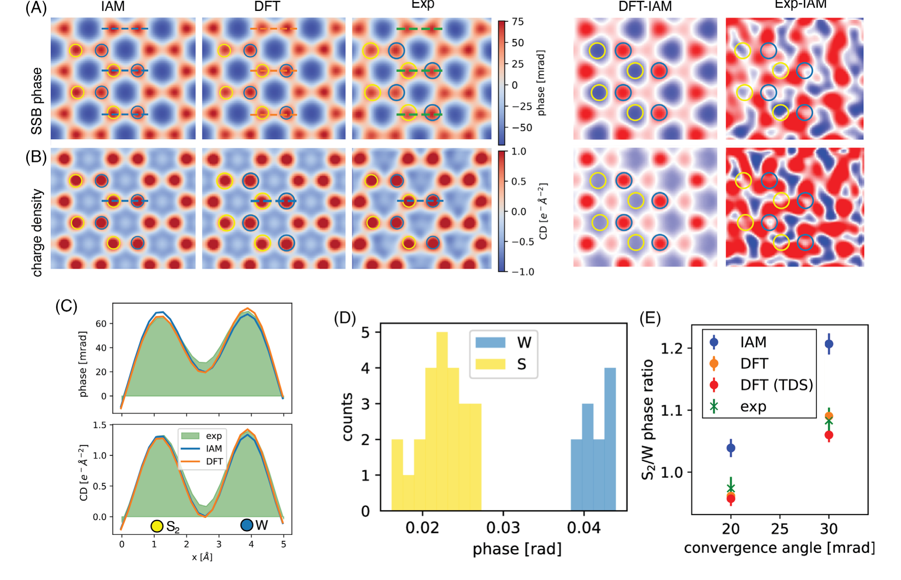{width="100%"}
:::
:::

::: {.aside}
@Hofer_2025
:::

::: {.callout-note .fragment}
Aberration-corrected ptychographic phase — not differentiated CoM — reaches the precision needed for bonding electrons
:::

## Charge Transfer at S Vacancies (Fig. 4)

::: {.columns}
::: {.column width="42%"}
- Individual S monovacancies in WS₂: local charge environment changes with vacancy clustering [@Hofer_2025]
- Metric: $W@S_{\mathrm{vac}}/S_{\mathrm{vac}}$ phase ratio
  - increases with vacancy density in experiment
  - **DFT** simulations reproduce the trend
  - **IAM** predicts a flat ratio → misses charge transfer entirely
- Defect charge transfer up to ~10% — requires site-averaging and low-dose-aware acquisition
:::
::: {.column width="58%"}
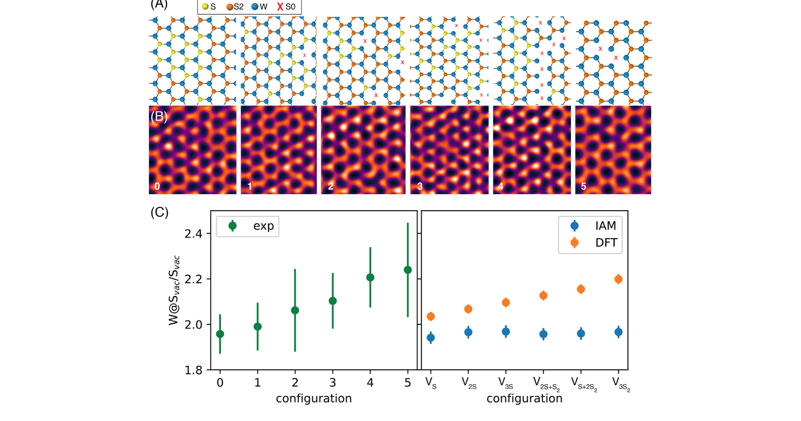{width="100%"}
:::
:::

::: {.aside}
@Hofer_2025
:::

::: {.callout-note .fragment}
Valence charge redistribution is detectable at defects, with ptychography matched to first-principles simulation.
:::

## Imaging Magnetic Fields: The Aharonov–Bohm Phase

::: {.columns}
::: {.column width="55%"}
- The electron phase has an electrostatic *and* a magnetic part:

$$
\varphi(\vec{r}) = \sigma \int V \, dz \; - \; \frac{e}{\hbar} \int \vec{A} \cdot d\vec{l}
$$

- Magnetic phases are **tiny**: mrad per nm vs. rad for atomic potentials
- Classic tools: Lorentz TEM, electron holography, segmented-detector DPC at low magnification
:::
::: {.column width="45%" .fragment}
- Challenges:
  - field-free objective lens ("Lorentz mode") → poor conventional resolution
  - separating $\vec{E}$ from $\vec{B}$ contributions
  - dose: weak signal needs many electrons
:::
:::

::: {.callout-note .fragment}
Magnetic imaging = phase imaging at 10⁻³ of the electrostatic signal strength — dose efficiency is everything
:::

## Lorentz Electron Ptychography (LEP)

::: {.columns}
::: {.column width="42%"}
- **Field-free objective lens** (Lorentz mode): sample in remnant field → electrons deflected by Lorentz force
- Aharonov–Bohm magnetic phase encoded in 4D-STEM diffraction patterns on a pixelated detector (EMPAD)
- **LEP** reconstructs the magnetic induction map from overlapping probes [@Chen_2022_Lorentz]
- Resolution set by maximum scattering angle with meaningful dose — **not** the probe-forming aperture (2–6× gain)
- Corrects probe damping/distortion that limits CoM/DPC field measurements
:::
::: {.column width="58%"}
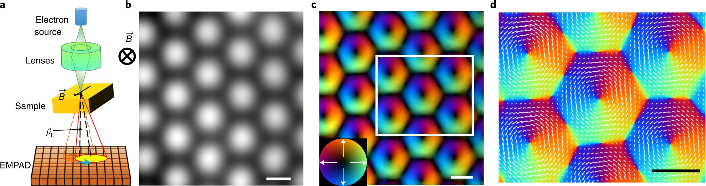{width="100%"}
:::
:::

::: {.aside}
@Chen_2022_Lorentz
:::

::: {.callout-note .fragment}
Same ptychographic inverse problem as electrostatic imaging — the forward model now includes the magnetic Aharonov–Bohm phase
:::

## Skyrmion Internal Structure in FeGe (Fig. 2)

::: {.columns}
::: {.column width="42%"}
- Model system: Bloch-type skyrmion lattice in FeGe single crystal (94 K, external field)
- LEP maps lateral $\vec{B}_\parallel$ **direction** and **magnitude** simultaneously [@Chen_2022_Lorentz]
- Resolves internal spin textures invisible to LTEM, holography, or DPC:
  - counterclockwise vortex approaching skyrmion core
  - reversed (clockwise) vortex at triple junction
  - anti-vortex texture at skyrmion boundaries
- Field direction well defined to ~1.2 nm from singular points ($<20$ mT lateral field)
:::
::: {.column width="58%"}
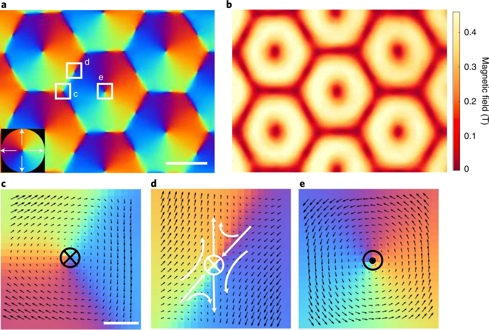{width="100%"}
:::
:::

::: {.aside}
@Chen_2022_Lorentz
:::

::: {.callout-note .fragment}
High SNR near magnetization discontinuities — the regime where direct CoM methods fail
:::

## LEP: Topological Defects & Quantitative Advantage

::: {.columns}
::: {.column width="50%"}
- Skyrmion-lattice **edge dislocation**: pentagon–heptagon pair at the core; distorted but topologically protected winding [@Chen_2022_Lorentz]
- vs. iCoM/DPC at equal dose [@Chen_2022_Lorentz]:
  - **Resolution**: LEP breaks the aperture limit (~5.2 nm probe) → ~1 nm at $\gtrsim 10^2$ e⁻ Å⁻²
  - **Accuracy**: CoM underestimates field max by $>10$% (probe convolution); LEP matches truth at $\gtrsim 500$ e⁻ Å⁻²
  - **Precision**: LEP superior at all doses; sub-10 nm features visible already at 1–10 e⁻ Å⁻²
:::
::: {.column width="50%"}
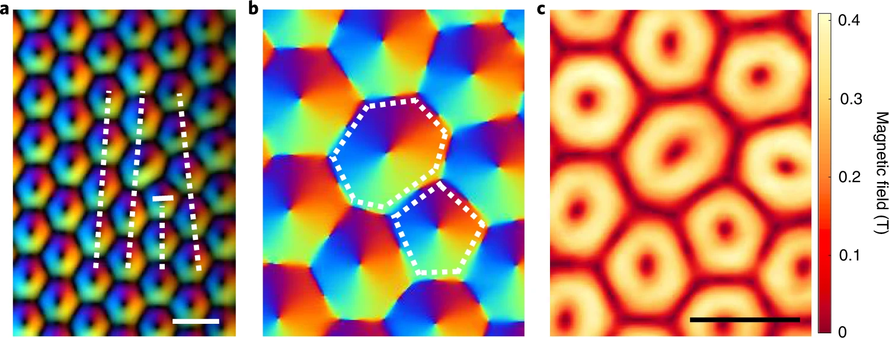{height="220px"}

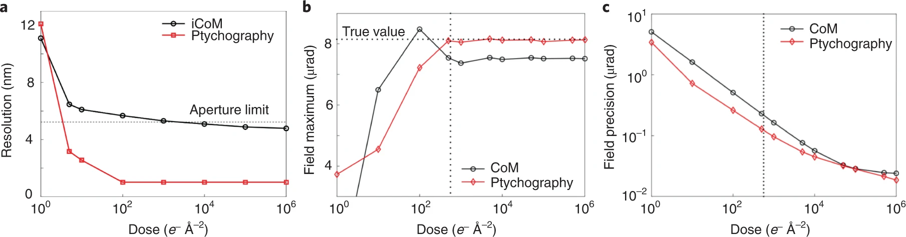{height="220px"}
:::
:::

::: {.aside}
@Chen_2022_Lorentz
:::

::: {.callout-note .fragment}
Dose-efficient magnetic microscopy for beam-sensitive molecular magnets — quantitative field maps with error bars, not just contrast
:::
 

## Outlook 1: From Imaging Static Structure to Imaging Dynamics

Open topics:
- algorithms fast enough for real-time imaging --> in-situ ptychography
- can we develop 3D depth sectioning methods fast enough for in-situ studies?

::: {.columns}
::: {.column width="50%"}
{autoplay="true" loop="true" muted="true" width="100%"}
:::
::: {.column width="50%"}
{autoplay="true" loop="true" muted="true" width="100%"}
:::
:::

::: {.callout-note .fragment}
We will see in-situ applications of ptychography as the codes become faster and more standardized
:::

## Outlook 2: From Imaging Ordered Structures to Imaging Disorder

::: {.columns}
::: {.column width="55%"}
- Can we image weakly scattering amorphous materials in 3D? [@Yuan_2022]
- Can we image the 3D structure of polymers?

::: {.callout-note .fragment}
3D atomic packing in amorphous solids with liquid-like structure is already measurable by atomic electron tomography [@Yuan_2022]
:::
:::
::: {.column width="45%"}
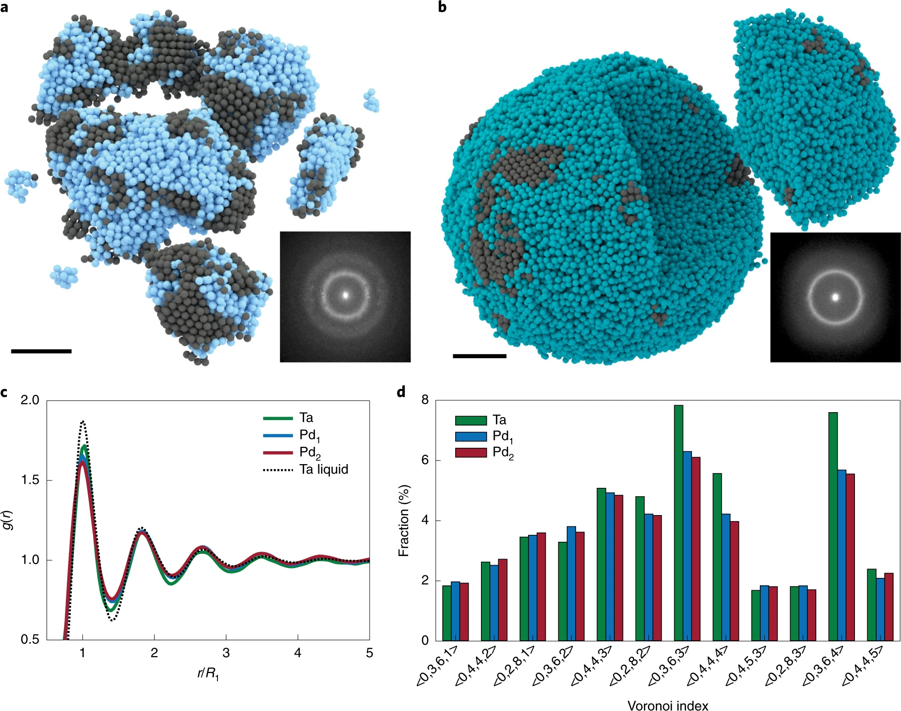{width="100%"}
:::
:::


## Summary
::: {.columns}
::: {.column width="66%"}
- Electron ptychography has a multitude of experimental settings to control and algorithms to explore
- When tuned well, results well beyond hardware capabilities can be expected 
- Modern ML tools alleviate algorithm development and application by non-experts 

### Open positions at FAU

- open Ph.D. / postdoc position in the ERC project HyperScaleEM, come talk to me if interested

:::
::: {.column width="33%"}
{loop="true" autoplay="true" style="width: 50%; margin-left: auto; margin-right: 0; display: block;"}
{loop="true" autoplay="true" style="width: 50%; margin-left: auto; margin-right: 0; display: block;"}
{loop="true" autoplay="true" style="width: 50%; margin-left: auto; margin-right: 0; display: block;"}
:::
 
:::

## References 📚 

::: {#refs}
:::


<div>
<script>


function hideMarimoBadge(frame) {
    if (frame.dataset.marimoBadgeHook) return;
    frame.dataset.marimoBadgeHook = "1";
    frame.onload = function() {
        try {
            let iframeDoc = frame.contentWindow.document;
            let marimoBadge = iframeDoc.querySelector("div.fixed.bottom-0.right-0.z-50");
            if (marimoBadge) {
                marimoBadge.style.display = "none";
            }
        } catch (error) {
            console.warn("Unable to modify iframe content due to CORS restrictions.");
        }
    };
}

function loadMarimoFrames(slide) {
    if (!slide) return;
    slide.querySelectorAll("iframe.marimo-frame").forEach(function(frame) {
        hideMarimoBadge(frame);
        var dataSrc = frame.getAttribute("data-src");
        var currentSrc = frame.getAttribute("src");
        if (dataSrc && (!currentSrc || currentSrc === "about:blank")) {
            if (frame.dataset.marimoLoaded) return;
            frame.dataset.marimoLoaded = "1";
            frame.setAttribute("src", dataSrc);
        }
    });
}

function initMarimoFrames() {
    if (typeof Reveal !== "undefined") {
        Reveal.on("ready", function(event) {
            loadMarimoFrames(event.currentSlide);
        });
        Reveal.on("slidechanged", function(event) {
            loadMarimoFrames(event.currentSlide);
        });
    } else {
        document.querySelectorAll("iframe.marimo-frame").forEach(function(frame) {
            loadMarimoFrames(frame.closest("section") || document);
        });
    }
}

initMarimoFrames();
</script>
</div>
