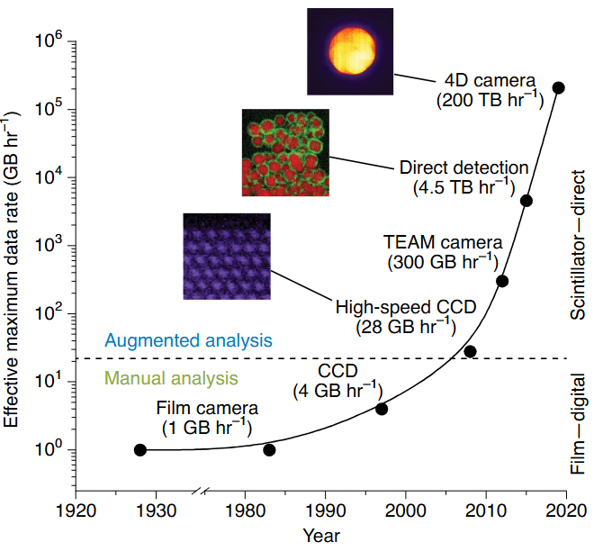
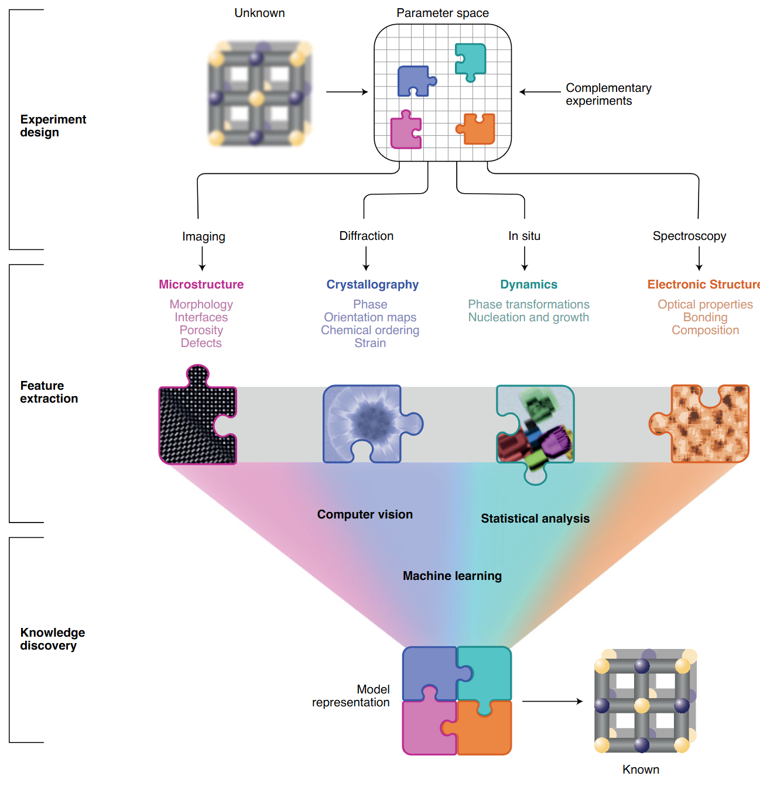
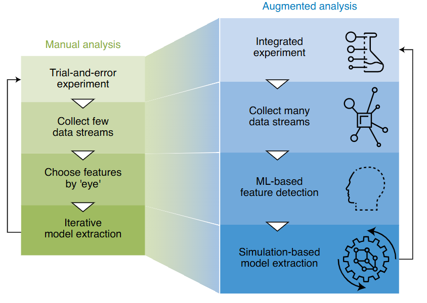

<!-- ===== §1. Course logistics & assessment ===== -->

## Welcome to Data Science for Electron Microscopy

:::: {.incremental}
- A 13-week course at the intersection of materials science, electron microscopy, and data-driven methods.
- You do **not** need to be a programmer — we start from zero Python today.
- By the end you will be able to build and evaluate a complete data-science pipeline on real EM data.
::::

:::: {.notes}
- Open by naming exactly what this course is NOT: it is not a programming course, not a pure ML course, and not a microscopy course — it is all three, woven together around the specific data types that EM produces. Say this loudly so students who panicked about "Python" can relax.
- The one point to land: data science is now as essential to EM as knowing how to focus the beam — the instrument is only half the story.
- Misconception to preempt: several students will assume they need a strong Python background. Correct this now and mean it. The notebook today is designed for absolute beginners; the first three weeks ramp slowly.
- Materials anchor: frame the course around a concrete provocation — a modern 4D-STEM session produces more data in one hour than a human analyst can manually inspect in a year. Python + NumPy is the minimal toolkit for even looking at that data.
- Forward link: Week 2 dives into what "learning from data" actually means, and how noise enters EM measurements.
- Transition: "Let's first do the paperwork — what exactly are you signing up for?"
::::

## Course logistics

:::: {.incremental}
- 13 weekly lectures (≈ 90 min each), no separate exercise class.
- **Assessment:** 40% miniproject + 60% written exam.
- Use of AI tools (GitHub Copilot, Cursor, …) is **allowed and encouraged** in the miniproject.
- Course website & materials: announced in first session — all slides and notebooks are public.
- Graded miniproject: individual or pairs; proposal due ≈ Week 6, final submission in exam period.
::::

:::: {.notes}
- Walk through the assessment split slowly. Students always mis-hear the weighting: forty percent is the miniproject, sixty percent is the written exam. Write the numbers on the board.
- Stress the miniproject timeline: the proposal (≤1 page) is due around Week 6 — that is five weeks away. They should start thinking about a dataset or task now.
- On AI tools: be explicit that using Copilot or similar is fine in the miniproject. The exam cannot use AI tools and tests conceptual understanding — so they still need to understand what the code does.
- Misconception to preempt: "I can wing the exam if I do the miniproject well." The 60/40 split means the exam is the larger weight; make sure they know the must-know document exists.
- Transition: "Here is the arc of the 13 weeks —"
::::

## Course arc — 13 weeks

:::: {.incremental}
- **Weeks 1–3:** Python foundations, what learning means, linear algebra & PCA
- **Weeks 4–5:** Regression, gradient descent, neural networks from first principles
- **Weeks 6–7:** CNNs for microscopy; beating small & expensive data
- **Weeks 8–9:** Unsupervised learning, autoencoders, uncertainty & Gaussian processes
- **Weeks 10–11:** Active/automated EM; imaging inverse problems I
- **Weeks 12–13:** Inverse problems II; explainability, trust & synthesis
::::

:::: {.notes}
- Do not lecture the arc — read it together with the students and flag the two "payoff" points: (a) by Week 6 they will be training a CNN on actual microscopy images, and (b) by Week 13 they will be able to say whether a model should be trusted. Those are the two deliverables of the course in plain language.
- Materials anchor: map each block to a real EM question — PCA for EELS hyperspectral data (Week 3), CNNs for particle detection (Week 6), GP for adaptive acquisition (Week 9), tomographic reconstruction (Weeks 11–12). Show the red thread early.
- Misconception to preempt: students may expect a monotone difficulty ramp. Flag that Weeks 8–9 (probability + GPs) are a conceptual jump; encourage them to flag confusion immediately rather than letting it accumulate.
- Transition: "Before we go further, let me show you why this course exists at all — the data problem in modern electron microscopy."
::::

<!-- ===== §2. Why data-driven (S)TEM — the data deluge ===== -->

## The data deluge: detector rates over time

::: {.columns}
::: {.column width="55%"}
{width="100%"}
:::
::: {.column width="45%"}
:::: {.incremental}
- **Film era (1990s):** ≈ 1 GB h⁻¹
- **CCD/CMOS (2000s–2010s):** 1–10 GB h⁻¹
- **Direct-electron detectors (today):** up to 200 TB h⁻¹
- That is a **10⁸× increase in two decades**.
- No human can inspect petabyte-scale datasets by eye.
::::
:::
:::

::: {.aside}
@Spurgeon_2020
:::

:::: {.notes}
- This is the motivating fact of the entire course. Spend time on it. The y-axis spans eight orders of magnitude — ask students to guess before revealing the number.
- The one point to land: the bottleneck in modern EM is no longer the instrument — it is the analyst. Data science moves the bottleneck back to the physics.
- Misconception to preempt: "more data is always better." More data is only better if you have the tools to process it. Without a pipeline, 200 TB h⁻¹ is 200 TB h⁻¹ of noise on a hard drive.
- Materials anchor: a single 4D-STEM scan of a grain boundary might generate hundreds of thousands of diffraction patterns. A human analysing one per minute would need years. An automated pipeline can do it overnight.
- Forward link: Week 2 explains exactly where the noise in each pixel of those patterns comes from.
- Transition: "So how do we go from data to insight? The three-layer framework —"
::::

## From data to insight: the three-layer framework

::: {.columns}
::: {.column width="50%"}
{width="100%"}
:::
::: {.column width="50%"}
:::: {.incremental}
- **Layer 1 — Experiment design:** What to measure, at what dose, in what sequence.
- **Layer 2 — Feature extraction:** Turn raw pixel/spectrum data into structured descriptors.
- **Layer 3 — Knowledge discovery:** ML + simulation → structure, chemistry, dynamics.
- The layers form a **feedback loop**: discoveries suggest new experiments.
::::
:::
:::

::: {.aside}
@Spurgeon_2020
:::

:::: {.notes}
- Walk down the three layers with a single concrete example: a 4D-STEM grain-boundary study. Layer 1 = choosing probe size, step size, dose. Layer 2 = Bragg-disk detection, strain maps. Layer 3 = grain orientation classification, automated defect cataloguing.
- The one point to land: data science does not replace physics — it is embedded in the middle of a physically grounded workflow. You still need to know what a diffraction pattern means.
- Misconception to preempt: "ML is the magic black box at the end." Wrong — it sits in Layer 3 and depends entirely on the quality of Layers 1 and 2. Garbage in, garbage out.
- Materials anchor: the feedback arrow is the new thing — traditional EM workflow is open-loop (plan, measure, analyse, publish). The data-driven paradigm closes the loop in near real time.
- Forward link: throughout the course each new method will be placed in one of these three layers, so this diagram is a map you will return to repeatedly.
- Transition: "Let's look at how the workflow itself has evolved —"
::::

## Manual vs. augmented EM workflow

::: {.columns}
::: {.column width="55%"}
{width="100%"}
:::
::: {.column width="45%"}
:::: {.incremental}
- **Manual:** Choose features by eye, collect one modality, iterate slowly.
- **Augmented:** Collect complete data streams, ML finds features automatically, simulation validates.
- **Goal:** Closed-loop, autonomous experiment steering.
::::
:::
:::

::: {.aside}
@Spurgeon_2020
:::

:::: {.notes}
- The key word is "augmented" — we are not replacing the microscopist. We are giving them a co-pilot. Keep this framing; it is less threatening and more accurate.
- The one point to land: the manual workflow scales linearly with analyst time; the augmented workflow scales sub-linearly because the bottleneck shifts to compute, which is cheap.
- Misconception to preempt: autonomous EM means pressing a button and walking away. Currently it means the system suggests the next beam position or acquisition parameter; a trained human is still in the loop for safety-critical decisions.
- Materials anchor: in-situ heating experiments are a canonical use case — at 5 frames/s you cannot watch and annotate every frame manually; an automated detector flags interesting events for the analyst to review.
- Transition: "Before we can write any analysis code, we need a mental model for how to structure a data project. Two frameworks in the next five slides."
::::

## EM modalities — the data landscape

:::: {.incremental}
- **HAADF-STEM:** intensity ∝ Z¹·⁶–Z¹·⁹ — heavy atoms appear bright; single-atom sensitivity.
- **4D-STEM:** a 2-D diffraction pattern at every probe position → 4-D data cube (x, y, kx, ky).
- **EELS/EDS:** energy-loss/X-ray spectra at each pixel → chemical identity at nm resolution.
- **Tomography:** tilt-series → 3-D atomic coordinates with pm precision.
- Each modality produces a **different tensor shape** — this course teaches you to handle all of them.
::::

:::: {.notes}
- Do not go deep on the physics — this is a single slide to give students vocabulary. They will encounter all these terms in the notebooks and need at least a one-line mental model for each.
- The one point to land: every modality maps neatly onto a NumPy array with a specific shape. HAADF is 2-D (rows × cols); 4D-STEM is 4-D (x, y, kx, ky); EELS is 3-D (x, y, energy). Learning array indexing today unlocks all of them.
- Misconception to preempt: "I only work with HAADF, so I can skip the 4D stuff." The course uses HAADF as the running example precisely because it is the simplest shape — but all concepts generalise to higher-dimensional modalities.
- Materials anchor: ask the room which modalities they have used. Usually there is a spread; use that diversity as a strength — pair students who have 4D-STEM experience with those who have only done HAADF.
- Forward link: Week 2 will explain where the Poisson and detector noise in each modality comes from.
- Transition: "Now the two mental-model frameworks that will structure everything we do."
::::

<!-- ===== §3. PSPP + CRISP-DM ===== -->

## The PSPP paradigm

:::: {.incremental}
- **P**rocessing → **S**tructure → **P**roperty → **P**erformance
- In EM: synthesis parameters → atomic structure (images/spectra) → material property → device behaviour.
- Each arrow is a potential ML task: regression, classification, inverse design.
- **Key insight:** structure *mediates* properties — you cannot skip it.
::::

:::: {.notes}
- Draw the chain on the board or annotate the slide live. Students from a pure materials background will immediately recognise PSPP from their intro courses; students from physics may not — bridge both.
- The one point to land: PSPP tells you *where in the causal chain your data lives*. If you have images (structure) but want to predict properties, the arrow between S and P is your ML task.
- Misconception to preempt: treating the chain as purely sequential. In reality the arrow from Performance back to Processing exists — that is inverse design / materials discovery. Flag it as an advanced topic (Week 10) without going further now.
- Materials anchor: grain size is a structure variable; yield strength is a property. A CNN that maps HAADF images → grain size is an S-stage model. A regression from grain size → yield strength is an S→P model. Composition and processing parameters live at the first P (Processing) stage; the model learns the arrows of the PSPP chain.
- Forward link: CRISP-DM (next slide) tells you *how* to execute any of those arrows systematically.
- Transition: "PSPP says what to model; CRISP-DM says how to execute the project."
::::

## The CRISP-DM workflow

:::: {.incremental}
1. **Business/scientific understanding** — what question are we actually answering?
2. **Data understanding** — visualise raw data *before* modelling.
3. **Data preparation** — clean, normalise, split (train / val / test).
4. **Modelling** — start with the simplest baseline; add complexity only when justified.
5. **Evaluation** — generalisation on held-out data; does it meet Phase 1 goals?
6. **Deployment / monitoring** — integrate into lab workflow; retrain when data drifts.
::::

:::: {.notes}
- CRISP-DM was originally a business analytics framework but maps perfectly onto scientific lab workflows. The key addition for science is Phase 1: instead of "ROI," ask "what is the falsifiable hypothesis?"
- The one point to land: steps run in order *and* loop back. If evaluation fails, you return to data preparation, not to modelling. Most beginner errors happen by jumping to Phase 4 (modelling) before finishing Phase 2 (data understanding).
- Misconception to preempt: "data preparation is the boring part." In practice it takes 60–80% of project time and is where data leakage, unit errors, and class imbalance hide. The miniproject rubric explicitly rewards careful Phase 2–3 work.
- Materials anchor: the classic failure story — a neural net achieving 99% accuracy on steel micrograph classification, which turned out to be learning microscope serial numbers correlated with steel grades. Phase 2 inspection would have caught this immediately.
- Forward link: every week's notebook follows CRISP-DM implicitly — you will always see EDA before any model code.
- Transition: "You now have the conceptual map. Time to build the tool: Python."
::::

## PSPP × CRISP-DM: putting it together

:::: {.incremental}
- **Phase 1 (understanding):** identify which PSPP arrow is your task.
- **Phase 2–3 (data):** understand the tensor shape and noise model of your EM modality.
- **Phase 4 (modelling):** choose a model appropriate for that tensor shape.
- **Phase 5 (evaluation):** measure generalisation — not training accuracy.
- **Principle:** domain knowledge is not optional; it goes into every phase.
::::

:::: {.notes}
- This synthesis slide is the conceptual keystone of the whole course. Do not rush it. Draw a 4×4 (simplified) grid on the board: PSPP columns (P, S, P, P) × CRISP-DM rows (understand, data, model, evaluate). Each cell of that matrix is a potential lecture topic.
- The one point to land: data science without domain knowledge produces confounded, fragile models. Domain knowledge without data science produces insights that do not scale. This course teaches the combination.
- Misconception to preempt: "if I follow CRISP-DM mechanically I will get a good result." CRISP-DM is a checklist, not a recipe. Judgement — knowing which PSPP arrow matters, which noise model applies, which baseline is appropriate — is what this course builds.
- Transition: "Enough framework. Let's write code."
::::

<!-- ===== §4. Python: variables / lists / functions ===== -->

## Python in one slide: why Python?

:::: {.incremental}
- **Free, open-source,** runs on any OS and in your browser (Google Colab).
- **Readable syntax** — code that reads close to pseudocode.
- **Massive ecosystem:** NumPy, SciPy, matplotlib, scikit-learn, PyTorch — all the tools this course uses.
- **Interactive:** Jupyter notebooks let you run one cell at a time and see results immediately.
- If you know MATLAB or any scripting language, Python will feel familiar within hours.
::::

:::: {.notes}
- Keep this brief — students will learn Python by doing, not by reading about it. The goal of this slide is to pre-answer the unspoken "why not MATLAB?" question without making it a debate.
- The one point to land: Python's power in data science comes almost entirely from its libraries. The language itself is modest; NumPy, matplotlib, and scikit-learn are where the action is.
- Misconception to preempt: "Python is too slow for real EM data." NumPy and PyTorch are implemented in C/Fortran/CUDA under the hood; vectorised operations run at near-C speed. The "slow Python" reputation applies to pure for-loops, which we will actively teach students to avoid.
- Materials anchor: essentially every open-source EM package (py4DSTEM, hyperspy, atomap, abTEM) is Python. Learning Python IS learning the EM software ecosystem.
- Transition: "The three building blocks you need to get started."
::::

## Variables and types

```python
# An integer
n_pixels = 512

# A float
pixel_size_nm = 0.05  # 0.05 nm per pixel

# A string
modality = "HAADF-STEM"

# Booleans
is_calibrated = True

# Check the type
print(type(pixel_size_nm))   # <class 'float'>
```

. . .

- Variables are assigned with `=`; Python infers the type automatically.
- Use **descriptive names** — `pixel_size_nm` beats `x`.

:::: {.notes}
- Type this live, not just show it. Ask students to predict what `type(n_pixels)` returns before revealing it.
- The one point to land: Python is dynamically typed — you do not declare types, but types still exist and matter. A common bug is accidentally storing a pixel coordinate as a float and then using it as an index.
- Misconception to preempt: "Python variables are like MATLAB variables." True at the surface; warn that Python indexing starts at 0, not 1. This will trip every MATLAB user at least once.
- Materials anchor: pixel_size_nm is a real quantity from EM calibration data. Emphasise that every number in a data pipeline should carry its units in the variable name — a habit that prevents hours of debugging.
- Transition: "Variables hold single values. Lists hold sequences."
::::

## Lists: ordered collections

```python
# A list of acquisition voltages in kV
voltages = [80, 100, 200, 300]

# Indexing — Python starts at 0!
print(voltages[0])   # 80
print(voltages[-1])  # 300  (last element)

# Slicing
print(voltages[1:3])  # [100, 200]

# Appending
voltages.append(60)
print(voltages)  # [80, 100, 200, 300, 60]
```

. . .

- Lists can hold **mixed types** but in science we almost always want homogeneous numerical data → use **NumPy arrays** (next section).

:::: {.notes}
- The 0-based indexing deserves a deliberate pause. Write index 0 = first element on the board. Tell the room: "you will forget this at least once; that is fine."
- The one point to land: lists are flexible but slow for numerical computation because Python must check the type of every element at runtime. NumPy arrays store a single type and skip those checks — that is the source of the performance win.
- Misconception to preempt: "I will just use lists for my image data." A 512×512 image as a list of lists is legal Python but will be 10–100× slower than a NumPy array for every numerical operation. Make the switch now.
- Materials anchor: the voltages list is realistic — if you are scripting a series of HAADF acquisitions at different kV values, you might iterate over this list to set the beam energy automatically.
- Transition: "Functions let us package and reuse code."
::::

## Functions: reusable operations

```python
def normalize(image):
    """Min-max normalize an image array to [0, 1].

    Note: a constant image (max==min) yields NaN; guard with
    `if hi==lo: return np.zeros_like(...)` in real pipelines.
    """
    img_min = image.min()
    img_max = image.max()
    return (image - img_min) / (img_max - img_min)

# Call it
normalized = normalize(my_stem_image)
```

. . .

- `def` defines a function; the docstring (`"""..."""`) documents what it does.
- Functions should do **one thing** — short, named, reusable.
- Write a function the moment you find yourself copying code a second time.

:::: {.notes}
- The normalization function is deliberately EM-relevant — students will use exactly this operation in the notebook's "your turn" exercise. Connecting the teaching example to the homework task makes both more memorable.
- The one point to land: a function with a docstring is self-documenting. In six months, past-you's docstring is the only thing that will tell present-you what the function does. Cultivate the habit now.
- Misconception to preempt: "I only need functions for long code." Wrong — even a two-line operation is worth naming if it has a clear semantic meaning. `normalize(img)` tells the reader something; `(img - img.min()) / (img.max() - img.min())` does not.
- Materials anchor: min-max normalisation is the standard first step before displaying an EM image, because raw detector counts span a wide dynamic range. The same function will appear in the miniproject.
- Transition: "Now the most important library in scientific Python."
::::

<!-- ===== §5. NumPy arrays & vectorised ops ===== -->

## NumPy: the array library

```python
import numpy as np

# Create an array from a list
a = np.array([1.0, 2.0, 4.0, 8.0])

# Shape and data type
print(a.shape)   # (4,)
print(a.dtype)   # float64
```

. . .

```python
# 2-D array (a matrix)
M = np.array([[1, 2, 3],
              [4, 5, 6]])
print(M.shape)  # (2, 3)  → 2 rows, 3 columns
```

. . .

- `shape` is a tuple: `(rows, cols)` for 2-D; `(x, y, kx, ky)` for a 4D-STEM cube.
- `dtype` governs storage: `float32` (4 bytes/element) vs `float64` (8 bytes/element).

:::: {.notes}
- The dtype point is practically important for EM data — a 4D-STEM dataset at float64 can be 4× larger in memory than the same data at float32. On a workstation with 32 GB RAM this is the difference between fitting in memory or not.
- The one point to land: everything in NumPy is an ndarray with a shape and a dtype. Once you internalise that, the entire API becomes predictable.
- Misconception to preempt: "shape is (rows, cols) so it's (height, width)." This is correct but counterintuitive for image people who think (width, height). NumPy follows matrix conventions: axis 0 = rows = y = height. matplotlib also follows this convention. Make the mapping explicit now.
- Materials anchor: a 512×512 HAADF image loaded from a .dm3 or .tif file is an ndarray with shape (512, 512). A 4D-STEM scan with 256×256 probe positions and 128×128 detector is shape (256, 256, 128, 128).
- Transition: "Indexing and slicing let you reach into an array."
::::

## Array creation and common operations

```python
# Zeros and ones (useful initialisers)
zeros = np.zeros((512, 512))    # blank image canvas
ones  = np.ones((3, 3))

# Range and linspace
x = np.arange(0, 10, 0.5)      # 0, 0.5, 1.0, …, 9.5
q = np.linspace(0, 1, 128)     # 128 evenly spaced values in [0, 1]

# Random noise (Gaussian approximation — Week 2 shows why Poisson is the correct low-dose model)
noise = np.random.randn(512, 512)  # Gaussian, mean=0, std=1
```

. . .

- **Vectorised arithmetic:** operates on the whole array, no for-loop needed.

```python
signal = np.ones((512, 512)) * 1000   # 1000 counts everywhere
noisy  = signal + noise * 30           # add noise, no loop
```

:::: {.notes}
- The Poisson/Gaussian noise example is deliberately EM-flavoured — in the notebooks students will add synthetic noise to clean images to test denoising algorithms. Plant the connection here.
- The one point to land: vectorised arithmetic is typically 100–1000× faster than an equivalent Python for-loop because NumPy calls compiled C routines. Never write a for-loop over array elements for a numerical operation.
- Misconception to preempt: "I need to loop over pixels to process an image." Almost never. Show the speed difference intuitively: 512×512 = 262 144 iterations in a for-loop vs. one NumPy call. The vectorised version is also cleaner to read.
- Materials anchor: dark-field STEM intensity scaling — multiplying an image by a scalar calibration factor, or subtracting a dark reference, are both vectorised operations that take one line.
- Transition: "Indexing and slicing let you isolate regions of interest — ROIs in EM."
::::

## Array indexing and slicing (EM ROI example)

```python
# Load (simulate) a 512×512 HAADF image
stem_image = np.random.poisson(lam=200, size=(512, 512)).astype(np.float32)

print(stem_image.shape)   # (512, 512)
print(stem_image.dtype)   # float32

# Crop a 64×64 ROI from the centre
cx, cy = 256, 256
roi = stem_image[cy-32:cy+32, cx-32:cx+32]
print(roi.shape)          # (64, 64)

# Single pixel value
print(stem_image[0, 0])   # top-left pixel
```

. . .

- Slicing syntax: `array[start:stop]` — stop is **exclusive**.
- Negative indices count from the end: `stem_image[-1, :]` is the last row.

:::: {.notes}
- This is the key EM example slide — walk through it carefully. Most students have never extracted an ROI from a NumPy array programmatically; they have done it in ImageJ.
- The one point to land: `[start:stop]` where stop is exclusive is a constant source of off-by-one errors. Demonstrate: `[256-32:256+32]` gives 64 elements, not 65, because stop is excluded.
- Misconception to preempt: "I need to write a helper to crop." No — Python slice notation IS the crop operation. Once students internalise this, they will use it constantly.
- Materials anchor: ROI selection is the first step in virtually every HAADF analysis workflow — selecting a single grain, isolating an atomic column, cropping out the scan distortion at the edge.
- Forward link: Week 3 will use ROI extraction to compute local PCA on spectral image patches.
- Transition: "Broadcasting: the rule that makes multi-dimensional operations automatic."
::::

## Broadcasting: operations between different shapes

```python
image  = np.random.poisson(200, (512, 512)).astype(float)  # (512, 512)
dark   = np.array([5.0])                                    # scalar

# Broadcasting: scalar applies to every element
corrected = image - dark    # same shape as image

# Row-wise mean subtraction
row_mean = image.mean(axis=1, keepdims=True)  # shape (512, 1)
row_corrected = image - row_mean              # shape (512, 512)
```

. . .

- **Rule:** dimensions are compatible if they are equal or one of them is 1.
- `(512, 512) - (512, 1)` → the column of means is subtracted from every column.

:::: {.notes}
- Broadcasting is the concept students find most confusing in the first two weeks. Use the shape annotation in the comments as a teaching tool — always write shapes in comments when broadcasting is happening.
- The one point to land: `keepdims=True` is crucial. Without it, `image.mean(axis=1)` returns shape `(512,)`, and subtracting that from a `(512, 512)` image does **not** raise an error on a square image — NumPy right-aligns the shapes and silently subtracts the per-row means down the **columns**, giving a wrong result with no warning. With `keepdims=True` you get shape `(512, 1)`, so the subtraction is unambiguous and correct; a non-square array would instead raise a `ValueError`.
- Misconception to preempt: "broadcasting is magic." It is a deterministic set of rules. If students follow the rules mechanically (align shapes from the right, each dimension is compatible if equal or 1), they will never be confused.
- Materials anchor: row-wise mean subtraction is a standard horizontal-striping correction in HAADF images (scan line-noise removal). Students will implement this in the notebook.
- Transition: "Now let's look at the data."
::::

<!-- ===== §6. Matplotlib basics ===== -->

## Displaying a STEM image with matplotlib

```python
import matplotlib.pyplot as plt
import numpy as np

# Synthetic HAADF-like image: bright atoms on dark background
stem = np.random.poisson(lam=50, size=(256, 256)).astype(float)
# Add a few "atoms" (bright spots)
for (r, c) in [(64, 64), (128, 128), (192, 64), (64, 192)]:
    stem[r-4:r+4, c-4:c+4] += 500

fig, ax = plt.subplots(figsize=(5, 5))
im = ax.imshow(stem, cmap='gray', origin='upper')
plt.colorbar(im, ax=ax, label='Counts')
ax.set_title('Synthetic HAADF-STEM image')
ax.set_xlabel('x (pixels)')
ax.set_ylabel('y (pixels)')
plt.tight_layout()
plt.show()
```

:::: {.notes}
- Run this live. The goal is to see a result in under five lines of matplotlib — students get an instant win.
- The one point to land: `cmap='gray'` is almost always the right choice for HAADF images. Colour maps like 'jet' or 'rainbow' perceptually distort intensity differences and have been shown to mislead EM analysis — use a perceptually uniform map (gray, viridis, inferno) by default.
- Misconception to preempt: "I need to normalise before imshow." Not true — imshow will auto-scale to the data range by default. You should normalise before *saving to disk* or *comparing across images*, but for exploratory display auto-scale is fine.
- Materials anchor: every quantitative STEM analysis starts with an imshow. The colorbar is not optional — it is the only way to communicate the intensity scale to a reader or collaborator.
- Transition: "Subplots for side-by-side comparison."
::::

## Subplots and line profiles

```python
# Extract and plot a horizontal line profile (common in HAADF)
row = 128
profile = stem[row, :]         # 1-D array of length 256

fig, axes = plt.subplots(1, 2, figsize=(10, 4))

axes[0].imshow(stem, cmap='gray')
axes[0].axhline(row, color='red', lw=1)
axes[0].set_title('STEM image')

axes[1].plot(profile)
axes[1].set_xlabel('Column (px)')
axes[1].set_ylabel('Intensity (counts)')
axes[1].set_title(f'Line profile at row {row}')

plt.tight_layout()
plt.show()
```

:::: {.notes}
- The line profile is the bread-and-butter diagnostic in HAADF STEM — measuring column intensities, checking atomic spacing, evaluating drift. This slide connects the NumPy slicing just taught to a real analysis output.
- The one point to land: `axes[0]` and `axes[1]` are Axes objects, not the Figure. The difference matters when you need to add labels, limits, or titles — always work on the Axes, not the Figure.
- Misconception to preempt: students often try `plt.title(...)` after creating subplots and get confused why only one panel has a title. Clarify: `plt.title` applies to the last active Axes; use `ax.set_title(...)` to be explicit.
- Materials anchor: the red horizontal line overlaid on the image is a standard HAADF-figure convention in publications. Teaching it here means students' first figures will already look publication-ready.
- Transition: "One more concept before the Colab walkthrough: what is a tensor?"
::::

<!-- ===== §7. Tensors & Colab ===== -->

## What is a tensor?

:::: {.incremental}
- A **tensor** is an n-dimensional array with a fixed numeric type.
- **0-D (scalar):** a single number — one pixel value.
- **1-D (vector):** a spectrum — 1024 energy channels.
- **2-D (matrix):** a HAADF image — shape (512, 512).
- **3-D tensor:** a spectral image (EELS map) — shape (256, 256, 1024).
- **4-D tensor:** a 4D-STEM scan — shape (256, 256, 128, 128).
::::

:::: {.notes}
- Tensors are central to every deep learning framework — PyTorch and TensorFlow both represent data as tensors. NumPy's ndarray IS a tensor (without GPU support or autograd).
- The one point to land: the word "tensor" should never be intimidating. It is just an ndarray with possibly more than two dimensions. Once students stop fearing the word they will read PyTorch documentation without anxiety.
- Misconception to preempt: "tensors are something advanced, only needed for deep learning." Wrong — a 4D-STEM dataset is a 4-D tensor regardless of whether you use deep learning. The concept is fundamental to how data is stored, not to any particular analysis method.
- Materials anchor: work through the 4D-STEM example slowly — 256 probe positions in x, 256 in y, 128 detector pixels in kx, 128 in ky. Ask the room to calculate total size: 256² × 128² × 4 bytes ≈ 4 GB for one scan. That is why dtype matters (float32 vs float64).
- Forward link: Week 5 introduces PyTorch tensors which add GPU acceleration and automatic differentiation on top of this concept.
- Transition: "The tool we use to run code together: Google Colab."
::::

## Running code in Google Colab

:::: {.incremental}
- **Google Colab:** a free Jupyter notebook environment in your browser, GPU-enabled.
- Go to [colab.research.google.com](https://colab.research.google.com) — sign in with your Google account.
- Open or upload a `.ipynb` notebook file.
- **Shift+Enter** runs the current cell and moves to the next.
- Runtime → Change Runtime Type → **GPU** (for deep learning, Weeks 5+).
- All this week's code runs without a GPU — no special setup needed.
::::

:::: {.notes}
- Do a live demo if internet is available. Create a new notebook, type `1+1`, run it. The psychological barrier to "starting to code" is enormous; remove it in two minutes.
- The one point to land: Colab does **not** auto-save to Drive — the runtime file is lost on disconnect unless you File → Save a copy in Drive, or you opened the notebook from Drive. Tell students explicitly so they don't lose work.
- Misconception to preempt: "I need to install Python on my laptop." Not for this course — Colab runs everything in the cloud. Local Python installation (Anaconda) is useful but not required.
- Materials anchor: the week01_python_numpy notebook (handed out today) is Colab-compatible. Students can open it directly from the course repository link and run it without any setup.
- Forward link: Week 5 (neural networks) will first use the GPU runtime — remind them when the time comes.
- Transition: "Before we code, let me show you a real STEM image loaded as a NumPy array."
::::

## EM example: a STEM image as a NumPy array

```python
import numpy as np
import matplotlib.pyplot as plt

# Simulate loading a HAADF-STEM image (replace with dm3/tif in practice)
# Shape: (height, width) — here 512×512 pixels at 0.05 nm/px
np.random.seed(42)
base = np.zeros((512, 512))
# Crystalline columns on a 20 px lattice
for r in range(10, 512, 20):
    for c in range(10, 512, 20):
        base[r-2:r+3, c-2:c+3] = 1.0
# Add Poisson noise (realistic detector statistics)
stem_image = np.random.poisson(lam=(base * 800 + 50)).astype(np.float32)

print("Shape :", stem_image.shape)   # (512, 512)
print("Dtype :", stem_image.dtype)   # float32
print("Min   :", stem_image.min())
print("Max   :", stem_image.max())
```

. . .

- Real files: `tifffile.imread('image.tif')` or `hyperspy.load('image.dm3')` return the same ndarray.

:::: {.notes}
- This is the culmination of the Python/NumPy section — all concepts (array creation, shape, dtype, printing) combined in a realistic EM context.
- The one point to land: the shape (512, 512) and dtype float32 are the first two things you check whenever you load an EM dataset. They tell you the spatial resolution, the memory footprint, and whether the values are in counts, electrons, or normalised units.
- Misconception to preempt: "I can just look at the image file in ImageJ and skip the NumPy step." That works for visual inspection, but the moment you want to measure anything (intensity, spacing, noise level) you need the array. Python + NumPy is the path to quantitative analysis.
- Materials anchor: Poisson noise (lam = signal) is the correct first-order noise model for EM detectors — each pixel represents a count of electrons, and counts follow Poisson statistics. This will be derived rigorously in Week 2.
- Forward link: Week 2 will explain exactly why the noise model is Poisson and how that affects what you can infer.
- Transition: "The final thing for today: the miniproject."
::::

<!-- ===== §8. Miniproject brief ===== -->

## The miniproject: overview

:::: {.incremental}
- **Weight:** 40% of final grade.
- **Scope:** Apply the full data-science pipeline (CRISP-DM) to a real or clearly-labelled synthetic EM / materials dataset.
- **Required components:** data provenance, model choice, uncertainty quantification, explainability.
- **Fully reproducible:** grader runs `jupyter nbconvert --execute notebook.ipynb` — it must produce all figures without manual steps.
- **Team size:** individual or pairs (pairs must divide contributions clearly).
::::

:::: {.notes}
- Read the full rubric in `_shared/miniproject.md` before this lecture and be prepared to answer specific questions about each criterion.
- The one point to land: reproducibility is a hard criterion, not a soft one. A notebook that requires manual intervention to run receives zero points on that criterion — 15% of the total grade. Make students understand this now.
- Misconception to preempt: "I can download a Kaggle kernel and submit that." The course requires an EM or materials science task and a genuine explainability step linked to a materials conclusion. Generic ML notebooks will score poorly on problem framing (15%) and explainability (15%).
- Materials anchor: walk through Option A (grain segmentation) and Option B (spectral denoising) briefly as concrete examples. Students with microscope access at FAU should consider using their own data — the course email address will be announced for dataset approval requests.
- Forward link: the proposal (≤1 page) is due around Week 6 — five weeks away. They should browse the dataset options this week and have a topic in mind by Week 3.
- Transition: "Four task options — let me briefly preview them."
::::

## Miniproject task options

:::: {.incremental}
- **Option A — Image segmentation:** grain boundaries or nanoparticles; synthetic Voronoi + noise, or real SEM/TEM data; deliver IoU vs noise curve + Grad-CAM on failure case.
- **Option B — Spectral denoising & clustering:** low-count EELS/EDS stacks; PCA or autoencoder denoising; latent-space clustering into chemical phases.
- **Option C — Property regression:** composition → yield strength or bandgap; GP or gradient-boosted tree; calibration plot + SHAP analysis.
- **Option D — Imaging inverse problem:** 2-D deblurring or limited-angle tomography; Tikhonov/TV regularisation study; bias–variance trade-off curve.
- **Own dataset:** email the instructor for approval by Week 6.
::::

:::: {.notes}
- Do not go deep on any single option — the full rubric is in `_shared/miniproject.md`. The goal is to give students enough information to have a first opinion about which option suits their background and access.
- The one point to land: every option has a zero-download synthetic fallback. No student should be blocked by lack of data access. The synthetic fallbacks are clearly labelled and sufficient for full marks.
- Misconception to preempt: "Option C is the easy one because it is tabular data." Options B and D are often less explored and can yield more interesting results for students who enjoy the physics angle. Choose based on interest, not perceived difficulty.
- Materials anchor: if students have done a thesis project involving EM, their own data is likely the best choice — they have domain knowledge that a generic dataset cannot provide. The approval process exists to ensure the task is in scope, not to discourage own data.
- Forward link: the full miniproject rubric is on Moodle and in `_shared/miniproject.md`. Read it this week — the criteria will shape how you design your pipeline from day one.
- Transition: "Let me close with a preview of next week, and then the self-study notebook."
::::

## Miniproject timeline at a glance

:::: {.incremental}
- **Week 1 (today):** briefed; browse dataset options.
- **≈ Week 6:** proposal check-in — ≤1 page (dataset, task, planned pipeline) submitted by email.
- **≈ Week 10:** progress check-in — draft notebook with data + model sections complete.
- **Exam period:** final submission — notebook + 4–6 page report PDF, uploaded to Moodle.
- All check-ins are **off lecture time** — email/Moodle upload, no in-class slots.
::::

:::: {.notes}
- This timeline will be repeated at the start of Week 6. The goal here is simply to anchor "Week 6 proposal" in students' calendars now.
- The one point to land: the proposal deadline at Week 6 is chosen so students have seen regression, linear algebra, and PCA before committing — they should have a realistic picture of what is feasible.
- Misconception to preempt: "I have until exam period to think about the topic." The proposal is 5 weeks away. Starting to think now is not early — it is on time.
- Transition: "That is everything for today. Here is the week's self-study material."
::::

<!-- ===== Forward link & housekeeping ===== -->

## Self-study this week

:::: {.incremental}
- **Notebook:** `notebooks/week01_python_numpy.ipynb` — "Python & NumPy in 90 minutes."
  - Variables, lists, functions, NumPy arrays, broadcasting, matplotlib.
  - Final "your turn" exercise: crop and min-max-normalise a synthetic STEM-like image.
- **Open in Colab:** no local installation needed.
- **Goal:** understand everything in this notebook before Week 2.
- **If you are stuck:** the Moodle forum, or office hours (times announced on the website).
::::

:::: {.notes}
- Distribute the Colab link (or GitHub link) during or immediately after the lecture. Students who try to open the notebook the night before Week 2 will run out of time — say this explicitly.
- The one point to land: the notebook takes about 90 minutes for a complete beginner. If it takes longer, that is fine — the only deadline is "before Week 2." If it takes less than 60 minutes, they should explore further or start thinking about the miniproject.
- Misconception to preempt: "I will do it later, I already know Python." Even experienced Python users should skim the EM sections — the STEM image loading and ROI examples are specific to this course and will appear in later notebooks.
- Materials anchor: the "your turn" exercise at the end — crop and normalise a STEM image — is the exact preprocessing step needed for every image in the miniproject. Completing the notebook IS completing the first step of Options A and B.
- Transition: "Next week we go deeper — what does it actually mean to learn from data, and where does the noise in your detector come from?"
::::

## Looking ahead — Week 2

:::: {.incremental}
- **Topic:** "What is learning? EM data & noise origins"
- What it means to fit a model: loss functions, optimisation, overfitting.
- Where noise comes from in EM detectors: Poisson statistics, readout noise, dose.
- The bias–variance trade-off as the central tension of machine learning.
- **Prerequisite:** complete the Week 1 notebook; you will need NumPy array operations.
::::

:::: {.notes}
- Keep this slide light — the goal is to prime curiosity, not to lecture the next week's content.
- The one point to land: the Poisson noise simulation in today's notebook is not arbitrary — it is the correct physical noise model for EM detectors. Week 2 will derive this from first principles. Students who understand why they used `np.random.poisson` in the notebook will find Week 2 much more satisfying.
- Misconception to preempt: "I will look at Week 2 materials before I finish the Week 1 notebook." Resist the urge — the notebook is designed as a prerequisite, and Week 2 assumes its contents.
- Transition: "See you next week — and please do open the notebook today."
::::

## Continue

- &rarr; Next: [Week 02 — What is learning? EM data & noise origins](../02_learning_and_em_data/01_intro.html)
- [All courses](../../index.html)

## References

::: {#refs}
:::
