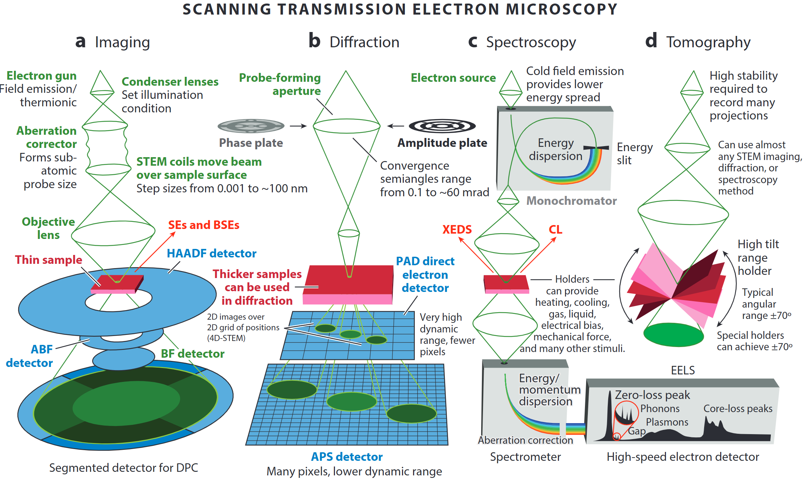
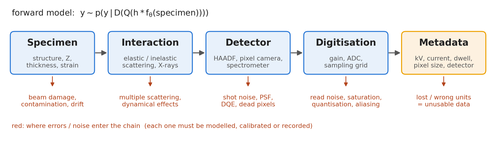
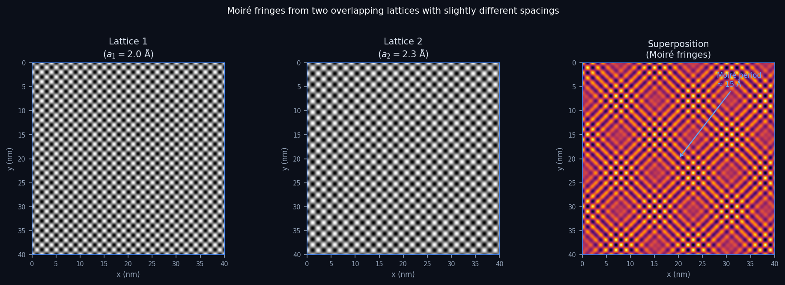
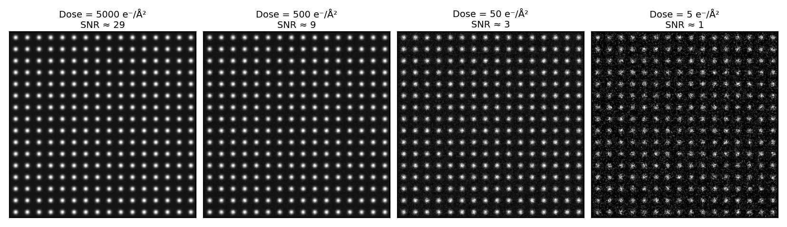
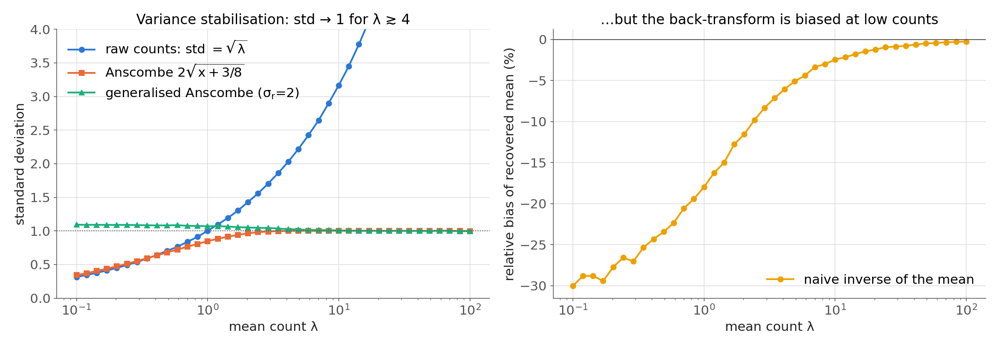

<!-- ===== §0. Recap + today's question ===== -->

## Recap: where we left off

:::: {.incremental}
- **Week 1 — Python crash course & the EM data deluge:** NumPy arrays, PSPP/CRISP-DM frameworks, EM modality overview, why EM produces terabytes.
- You can now load an EM image as a NumPy array, slice an ROI, and visualise it.
- The Poisson noise in last week's simulated STEM image was not arbitrary — it is the correct physical model.
- **Today we answer three questions:** What does it mean for a machine to *learn*? How is an EM number *formed*, and why is every pixel noisy? And how does the noise model decide the *loss*?
::::

:::: {.notes}
- Open by explicitly connecting to the notebook homework. Ask the room: how many completed it? If most have, spend 30 seconds acknowledging the key result — the Poisson noise call. If few have, make a brief case for completing it before Week 3 without shaming.
- The one point to land: the Poisson call in last week's notebook is not syntax trivia. By the end of today, students will be able to derive why that choice is physically correct.
- Misconception to preempt: "Week 1 was just software setup." No — the frameworks (PSPP, CRISP-DM) and the noise model planted in the arrays are the conceptual scaffolding for everything from here on.
- EM anchor: frame the Poisson call as a physicist's choice, not a programmer's choice. The beam consists of individual electrons arriving discretely at the detector — counts follow Poisson statistics. That is not a default; it is a physics fact.
- Forward link: by the end of today, students will be able to justify every noise-model choice they make in any future notebook.
- Transition: "Two big questions for today — let's start with the first."
::::

## Today's question

:::: {.incremental}
- **What is learning?** Fitting a model to data — but fitting *what* exactly? And how do you know it worked?
- **Where does EM noise come from?** Electrons arrive one at a time; every pixel is a count; counts fluctuate — fundamentally, unavoidably.
- **Why does it matter for data science?** Your noise model determines which loss function is correct. The wrong choice silently degrades every trained model on EM data.
- **Road map:** learning taxonomy → model taxonomy → EM data zoo → data-formation chain → sampling & aliasing → noise models → **noise model → likelihood → loss** → data quality & metadata → uncertainty.
::::

:::: {.notes}
- This is an orientation slide — do not rush it. The road map tells students there are nine conceptual blocks, each modest in size. Naming them removes anxiety about the upcoming 90 minutes.
- The one point to land: the Poisson–vs–Gaussian choice is not cosmetic. Show the punchline now: Poisson noise means variance = mean. Doubling dose improves SNR by only √2. This is the fundamental physics of why low-dose EM is hard.
- Misconception to preempt: "noise is random so I should just average it away." Averaging does help, but dose-doubling costs sample damage. The right answer is a better noise-aware model, not more dose.
- EM anchor: point to a real situation — cryo-EM or beam-sensitive 2D materials where radiation damage limits the dose you can afford.
- Pacing note: batch the learning-taxonomy slides quickly and protect ~20 min for the noise section and ~20 min for noise → likelihood → loss plus data quality — that is where the new core of the lecture lives.
- Transition: "First, what you will be able to do after these 90 minutes."
::::

## Learning outcomes

By the end of this lecture you can:

:::: {.incremental}
1. Distinguish classical data analysis from machine learning and place a method in the supervised / unsupervised / self-supervised and white / grey / black-box taxonomies.
2. Trace an EM measurement along the **data-formation chain** (specimen → interaction → detector → digitisation → metadata) and name where each error enters.
3. Apply Nyquist–Shannon to choose a pixel size and recognise aliasing / Moiré artefacts.
4. Write down the Poisson, Gaussian and mixed Poisson–Gaussian noise models and read gain and read noise off a variance–mean plot.
5. **Derive the loss from the noise model:** Gaussian → MSE, Poisson → Poisson NLL, mixed → variance-stabilising transform or mixed NLL.
6. Run a data-quality and metadata (FAIR) check before any model training.
::::

:::: {.notes}
- Read the outcomes aloud and point to outcome 5: this is the new centre of gravity of the lecture. Everything before it (data formation, detectors, noise) builds the ingredients; everything after it (data quality, uncertainty) tells you when the derivation is valid.
- The one point to land: these six outcomes map one-to-one onto exam questions and onto the notebook. Outcome 5 is exactly what the notebook's fitting experiment tests.
- Misconception to preempt: "the loss function is a hyperparameter you pick from a menu." By the end of today, students should see the loss as a *consequence* of the physics of the detector.
- EM anchor: every outcome is phrased around an EM object — a pixel, a detector, a spectrum image, a metadata header.
- Forward link: outcome 5 is re-used in Week 4 (regression as loss minimisation), Week 8 (physics decides augmentation) and Weeks 12/13 (forward model decides the inverse method).
- Timing plan (90 min, ~5 min slack):
  - 0–6 recap, today's question, outcomes
  - 6–19 learning vs analysis, models, three learning types, recipe, bias–variance, white/grey/black-box
  - 19–24 EM data zoo + HAADF (other modalities verbally, from notes)
  - 24–35 data-formation chain, signal → number, Nyquist, aliasing/Moiré, detectors
  - 35–45 Poisson vs Gaussian noise, dose simulation, mixed model, noise budget, variance–mean plot
  - 45–64 noise model → likelihood → loss: ML, MSE, Poisson NLL, weighting, VST, low-count experiment, cheat sheet, MAP preview
  - 64–72 data quality, metadata, FAIR, pre-flight checklist
  - 72–77 aleatory vs epistemic, trust teaser
  - 77–85 summary, must-know, self-study, Week 3 outlook
  - 85–90 slack / questions (backup slides: regression vs classification, Noise2Noise)
- Transition: "Let's start by being precise about what learning means."
::::

<!-- ===== §1. Learning vs classical data analysis ===== -->

## What is learning? Data analysis vs machine learning

:::: {.incremental}
- **Classical data analysis:** you write down the rules (equations, thresholds) and the computer applies them.
- **Machine learning:** you supply examples (data) and the computer *infers* the rules.
- In both cases the goal is the same: extract information from measurements.
- The difference is **who specifies the function** — the human or the optimiser.
::::

:::: {.notes}
- Draw this contrast explicitly on the board or annotate live: left column = "human writes rules," right column = "data implies rules." Students from an engineering background are very comfortable with the left side and will initially distrust the right side.
- The one point to land: ML does not replace domain knowledge — it uses data to fill in the parts of the function that are too complex or too data-dependent to write down analytically. The physicist still defines what the inputs and outputs mean.
- Misconception to preempt: "ML is magic — it figures out everything on its own." It can only learn patterns that exist in the training data. If the training data is biased or incomplete, the learned rules are biased and incomplete.
- EM anchor: measuring lattice spacing from an HAADF image by hand is classical analysis (measure peak positions, compute spacing). Training a CNN to predict strain maps from raw HAADF images is ML.
- Forward link: the distinction matters because it sets expectations about how much data you need and how you validate the result.
- Transition: "Models are the heart of ML. Let's define what a model is."
::::

## Models: all are wrong, some are useful

:::: {.incremental}
- A **model** is a purposeful abstraction of reality built for prediction or explanation [@neuer2024machine].
- **First-principles models:** derived from physical laws; interpretable; may fail when assumptions break down.
- **Data-based models:** inferred from observations; flexible; performance depends on data quality and coverage.
- George Box's maxim: *"All models are wrong, but some are useful."* — usefulness is judged at the decision point, not by aesthetics.
::::

:::: {.notes}
- Start by grounding the concept of "model" before introducing the taxonomy. Students have already met models (Newton's laws, Bragg's law) — now they learn to categorise them by the degree of physics embedded.
- The one point to land: Box's maxim is not a pessimistic statement — it is a liberating one. It removes the pressure of "finding the truth" and replaces it with "finding a model useful enough for the decision at hand."
- Misconception to preempt: "a data-based model is inherently less trustworthy than a physics model." This is context-dependent. A neural network trained on millions of cryo-EM images can predict protein structure more reliably than any current first-principles simulation. Trust depends on validation, not on the model family.
- EM anchor: Bragg's law is a white-box model — it predicts diffraction spot positions from lattice spacing and beam energy. A CNN that classifies grain orientations from diffraction patterns is a black-box model. Both are useful; neither is "true."
- Forward link: the model taxonomy (white/grey/black-box) extends this thought.
- Transition: "How transparent is the inside of the model?"
::::

## When first principles are not enough

:::: {.incremental}
- Complex systems can be nonlinear, high-dimensional, and partially observed.
- **Example:** Electron beam scattering in a thick sample — exact multi-slice simulation exists but is too slow for real-time analysis of millions of diffraction patterns.
- **Hybrid strategy:** keep trusted physics as structure; learn the residual or unknown coupling from data.
- Result: physically consistent outputs with data-efficient learning.
::::

:::: {.notes}
- This is the rationale for ML in materials science. Spend a moment on the 4D-STEM example: each probe position yields a diffraction pattern; there may be 256×256 = 65,536 patterns in one scan; multi-slice simulation of each is seconds per pattern → impractical.
- The one point to land: ML is most powerful where physics provides structure but not a complete closed-form solution. Treat ML as a complement, not a replacement.
- Misconception to preempt: "if we had faster computers, we wouldn't need ML." Even with faster computers, the inverse problem (going from measurements back to structure) requires efficient function approximation. ML is the tool for that even at infinite compute.
- EM anchor: ptychographic phase retrieval — the forward model (electron scattering) is well known, but inverting millions of diffraction patterns requires a fast, differentiable approximation. ML-assisted ptychography achieves this.
- Transition: "Three model types by transparency level."
::::

<!-- ===== §1b. Supervised / unsupervised / self-supervised ===== -->

## Three types of learning

::: {.columns}
::: {.column width="33%"}
**Supervised**

:::: {.incremental}
- Learn from **labelled** examples $(\mathbf{x}_i, y_i)$.
- Task: predict $y$ from new $\mathbf{x}$.
- Regression (continuous) or classification (discrete).
- Example: predict phase label from diffraction pattern.
::::
:::
::: {.column width="33%"}
**Unsupervised**

:::: {.incremental}
- Learn from **unlabelled** data $\{\mathbf{x}_i\}$.
- Task: find hidden structure — clusters, manifolds, compact representations.
- Example: cluster EELS spectra into chemical phases without manual annotation.
::::
:::
::: {.column width="33%"}
**Self-supervised**

:::: {.incremental}
- Generate labels **from the data itself** — no human annotation.
- Task: predict one part of the input from another.
- Example: Noise2Noise denoising — predict one noisy version from another.
::::
:::
:::

:::: {.notes}
- Walk each column with an EM example — use the same sample throughout (e.g. a 4D-STEM scan of a multi-phase alloy). Supervised: someone manually labelled 1000 diffraction patterns; the model learns to generalise. Unsupervised: no labels; PCA + K-means discovers that there are three clusters, which turn out to correspond to three phases. Self-supervised: two independently acquired noisy STEM images of the same area — one is the input, the other the target. The model learns to remove Poisson noise without ever seeing a clean reference.
- The one point to land: the label cost is the practical driver. Supervised learning requires human expert annotation, which is expensive for EM (hours per labelled image). Unsupervised and self-supervised methods reduce or eliminate this cost.
- Misconception to preempt: "self-supervised is just unsupervised." They both avoid external labels, but self-supervised learning creates an explicit pretext task and produces a model with a defined output type. Unsupervised clustering may not produce a model at all — just groupings.
- EM anchor: Noise2Noise-style training was quickly adopted in electron microscopy precisely because clean reference images are often unavailable — the only accessible "ground truth" is another noisy image taken at the same dose.
- Forward link: Week 8 (self-supervised pre-training) and Week 9 (autoencoders) are label-free. Week 7 (CNNs) is usually supervised. Week 3 (PCA) is unsupervised.
- Supervised splits into **regression** (continuous target, e.g. strain from a 4D-STEM pattern, atomic-column positions; loss MSE or Poisson NLL) and **classification** (discrete label, e.g. oxide / metal / carbide from EELS; loss cross-entropy). The output type is set by the physical quantity — a "phase index of 2.7" is nonsense. (Backup slide.)
- Unsupervised in practice: PCA compression + K-means on 4D-STEM patterns segments grains without annotation (built in Week 3). K-means needs K in advance — a materials decision, not a mathematical one.
- Noise2Noise works because the noise is zero-mean given the clean signal: MSE between two noisy realisations converges to the clean image. It fails for coherent artefacts (drift, Moiré). Odd/even frames of a cryo-EM movie are a ready-made training pair. (Backup slide; Week 8.)
- Transition: "How much label information you have determines which category you work in. What does the supervised workflow look like?"
::::

## The supervised learning recipe

:::: {.incremental}
1. **Collect labelled examples:** $(\mathbf{x}_i, y_i)$ for $i = 1, \ldots, N$ — features and targets.
2. **Choose a model class** $f_\theta$: linear, polynomial, neural network, …
3. **Define a loss function** $\ell(f_\theta(\mathbf{x}), y)$: MSE, cross-entropy, Poisson NLL.
4. **Minimise the average loss** over the training set (empirical risk minimisation).
5. **Evaluate on held-out data** — never use the test set during training.
6. **Deploy, monitor, retrain** as data distribution shifts.

This is CRISP-DM phases 3–6, mapped onto ML terminology.
::::

:::: {.notes}
- This recipe slide bridges the learning taxonomy to the CRISP-DM framework from Week 1. Students who remember CRISP-DM will immediately recognise the structure.
- The one point to land: step 5 is the most violated step in student projects. The test set must be sequestered from all training decisions. Using it to pick hyperparameters invalidates the evaluation — a form of data leakage.
- Misconception to preempt: "I can fine-tune on the test set as long as I use it last." No. Any use of test-set information to make modelling decisions constitutes leakage. Use the test set once, at the very end.
- EM anchor: a common leakage scenario — using all acquired images to normalise intensity before splitting train/test. The test images have been "seen" implicitly through the normalisation statistics. Fix: compute normalisation statistics from the training set only.
- Forward link: Week 4 covers gradient descent (step 4) and cross-validation (step 5) explicitly.
- Transition: "How complex should the model be? The bias–variance trade-off answers this."
::::

## Bias–variance trade-off: the central tension

::: {.columns}
::: {.column width="55%"}
:::: {.incremental}
- **Bias:** systematic error from overly simple assumptions — model misses real patterns.
- **Variance:** sensitivity to sampling noise — model memorises training quirks.
- **Underfitting** (high bias): too simple; straight-line fit to a curve.
- **Overfitting** (high variance): too complex; degree-50 polynomial fits noise.
- The "sweet spot" minimises the sum of both.
::::
:::
::: {.column width="45%"}
:::: {.incremental}
- **EM analogy:** fitting an EELS edge profile — a line is high-bias; a free polynomial is high-variance; a physically-motivated Hartree–Fock profile is the sweet spot.
- Regularisation, more training data, and physics priors all push toward the sweet spot.
- **Core message:** complexity is not free — it trades bias for variance.
::::
:::
:::

:::: {.notes}
- Introduce the trade-off gently — there is no maths, just intuition. The formal decomposition (bias² + variance + noise = expected loss) comes in Week 4.
- The one point to land: there is no model with zero bias AND zero variance. You are always trading one for the other. Choose the sweet spot for your data size and task complexity.
- Misconception to preempt: "a larger neural network is always better." Larger = more parameters = more variance. If your training set is small (common in EM), a large network overfits catastrophically. This is why physics priors are so valuable in EM — they add constraints that reduce variance without increasing bias.
- EM anchor: EELS edge fitting is a perfect example. The edge shape is determined by the density of states (physics) — constraining the fit to physically plausible shapes is free bias reduction.
- Forward link: Week 4 introduces regularisation as the formal tool. Week 8 covers data augmentation for variance reduction.
- Transition: "Now let's look at the data those models operate on."
::::

<!-- ===== §2. White / grey / black-box taxonomy ===== -->

## Model taxonomy: white / grey / black-box

::: {.columns}
::: {.column width="60%"}
:::: {.incremental}
- **White-box:** explicit mechanism, interpretable parameters (physical laws, linear regression).
- **Black-box:** high predictive flexibility, no traceable internal mechanism (deep neural networks).
- **Grey-box:** partially traceable; blends physics structure with learned components (physics-informed neural networks, PINNs) [@neuer2024machine].
- Explainability tools can move a black-box *toward* the grey zone — but never all the way to white.
::::
:::
::: {.column width="40%"}
:::: {.incremental}
- White: Bragg's law, Beer–Lambert law, Schrödinger equation.
- Grey: learned hardening law in crystal-plasticity simulation.
- Black: CNN classifying phase from HAADF image.
::::
:::
:::

:::: {.notes}
- Walk the spectrum with the three EM examples in the right column. Each one should feel concrete: Bragg's law is written in every diffraction textbook (white); a CPFEM model with one ML sub-module is grey; an end-to-end trained CNN is black.
- The one point to land: the box colour is not a quality label. Black-box models win Nobel Prizes (AlphaFold). Grey-box models are the engineering sweet spot when physics is partially known. Choose based on what physics is reliable at the relevant scale.
- Misconception to preempt: "white-box is always better." Bragg's law is perfectly white and perfectly useless for predicting whether an amorphous sample will crystallise under the beam. The right model is context-specific.
- EM anchor: direct electron detectors operate via known physics (electron → electron-hole cascade). The gain map calibration is a white-box calculation. But the deep-learning denoiser trained on those images is black-box. Both live in the same pipeline.
- Forward link: this taxonomy reappears with every model family — coefficients (Week 4), feature importance (Week 5), saliency/Grad-CAM (Week 7) — and is synthesised as the E1–E6 explainability ladder in Week 13.
- Transition: "Black-box criticism appears for good engineering reasons."
::::

## Why black-box criticism is not just philosophy

:::: {.incremental}
- Safety, traceability, and auditability requirements in engineering and science.
- Difficulty diagnosing failure causes without interpretable intermediate representations.
- **EM example:** a CNN classifies crystal phases with 97% accuracy but cannot explain *why* it rejected a pattern — which means you cannot tell whether it learned lattice geometry or a detector artefact.
- Good practice: validate that the model has learned the right *features*, not just achieved the right *score*.
::::

:::: {.notes}
- The EM phase classification example is real. Models trained on crystal diffraction patterns have been shown to latch on to diffraction ring radius (correct physics) but also on beam stop shadow (instrument artefact). They get the right answer for the wrong reason.
- The one point to land: a high test-set score is necessary but not sufficient for scientific trust. You must inspect what the model is doing — visualisation tools (Grad-CAM, saliency maps) exist for this, and they are covered in Week 7 alongside CNNs.
- Misconception to preempt: "a 97% accuracy means the model is correct." Accuracy measures output agreement with labels, not correctness of the learned representation. A model that learns artefacts will fail catastrophically when the artefact disappears (different microscope, different lens current, different detector).
- EM anchor: the classic failure mode — a model trained on data from one microscope that fails silently on data from another because it learned instrument-specific noise patterns.
- Transition: "Now let's look at what data the EM actually produces."
::::

<!-- ===== §3. The EM data zoo ===== -->

## The EM data zoo: four modalities

:::: {.incremental}
- **HAADF-STEM image:** intensity ∝ Z^1.6–1.9; 2-D array shape `(ny, nx)`. Heavy atoms bright.
- **4D-STEM:** a 2-D diffraction pattern at every probe position → 4-D tensor `(ny, nx, ky, kx)`.
- **EELS / EDS spectrum image:** energy spectrum at every pixel → 3-D tensor `(ny, nx, E)`.
- **Tilt-series tomography:** N projections at different tilt angles → 3-D array `(n_tilt, ny, nx)`.
- Each modality has its own **noise model**, **sampling constraints**, and **ML architecture family**.
::::

:::: {.notes}
- Return to the modality overview from Week 1 but now attach the tensor shape to each. Students who did the numpy notebook will recognise the shapes immediately.
- The one point to land: the modality determines the data tensor shape, and the tensor shape determines the correct ML architecture. 2-D images → CNNs. 3-D spectrum images → 3-D CNNs or factored models. 4-D data cubes → 4-D CNNs or physically-structured embeddings.
- Misconception to preempt: "I can always reshape data into 2-D and use a standard CNN." Sometimes, yes. But flattening a 4D-STEM cube loses the spatial–momentum coupling that is physically meaningful. Architecture choice should follow physics.
- EM anchor: spend a moment on the 4D-STEM size calculation: 256×256 probe positions × 128×128 detector pixels × 4 bytes = 4.3 GB for one scan. At 10 scans per day, that is > 40 GB per day. This is why efficient data pipelines matter.
- Forward link: Week 7 covers CNNs explicitly; Week 3 covers PCA for spectrum image dimensionality reduction.
- Transition: "Let's look at the simplest modality more carefully — a HAADF image."
::::

## HAADF-STEM: what the image encodes

::: {.columns}
::: {.column width="55%"}
{width="100%"}
:::
::: {.column width="45%"}
:::: {.incremental}
- Probe scans in a raster; at each position the transmitted beam is detected.
- **HAADF** (High Angle Annular Dark Field): collects high-angle scattered electrons; signal ∝ Z^~1.7 (often quoted as Z² in the high-angle Rutherford limit).
- Result: a 2-D map of projected atomic-column density — heavier atoms appear bright.
- Each pixel = one dwell time × electron current = a **count of scattered electrons**.
::::
:::
:::

::: {.aside}
@ophus2023quantitative
:::

:::: {.notes}
- Walk through the geometry carefully: the probe is focused to a sub-Å spot; it dwells at each pixel position for a fixed time (typically 10–100 µs); the annular detector integrates the scattering signal over that time.
- The one point to land: "each pixel is a count of scattered electrons" is the sentence that leads directly to Poisson statistics. Electrons arrive discretely, at random, at an average rate set by the scattering cross-section. The count is therefore Poisson-distributed.
- Misconception to preempt: "the HAADF signal is a continuous intensity." It is measured as a continuous voltage, but it originates from discrete electron arrivals. The variance of that voltage is proportional to the mean — the signature of Poisson statistics.
- EM anchor: this is why low-dose HAADF images of light-element materials (graphene, 2D heterostructures, biological membranes) look grainy — you cannot afford more dose, so the counts per pixel are low, variance is high, and SNR is poor.
- The other modalities from the zoo, briefly: 4D-STEM maps strain, fields and phase from one scan (a session easily yields 1 TB — why py4DSTEM exists); EELS disperses inelastic electrons by energy loss (bonding), EDS records characteristic X-rays (composition); tomography raw data are 2-D projections stacked over tilt — the 3-D-ness comes from the inverse step. Forward links: PCA on EELS (Week 3), CNNs on HAADF (Week 7), 4D-STEM tokens for transformers (Week 10), automated acquisition (Week 11).
- Transition: "Before data reaches the computer, it passes through a sensor. Let's trace that chain."
::::

<!-- ===== §4. Sensors & sampling ===== -->

## The data-formation chain

{width="100%"}

:::: {.incremental}
- **Specimen → interaction → detector → digitisation → metadata**: the measured array $\mathbf{y}$ is a *random draw* from a physics-determined distribution, not the specimen itself.
- A learning algorithm only ever sees the end of the chain — whatever the chain destroys or distorts, the model cannot recover without an explicit forward model or prior.
::::

:::: {.notes}
- This is the organising picture for the rest of today. Walk left to right and name one EM example per link: (1) specimen — beam damage in a zeolite, carbon contamination build-up, stage drift; (2) interaction — dynamical scattering makes HAADF intensity non-linear in thickness; (3) detector — shot noise, point-spread function, detective quantum efficiency (DQE), dead/hot pixels; (4) digitisation — gain, read noise, saturation of the ADC, quantisation, and the sampling grid (→ aliasing); (5) metadata — accelerating voltage, probe current, dwell time, pixel size, detector name and mode.
- The one point to land: the forward model written on top of the figure is the *generative* view of the measurement. Once you write $\mathbf{y} \sim p(\mathbf{y}\mid\ldots)$, the loss function follows by taking $-\log p$ — that is the derivation we do in the second half.
- Misconception to preempt: "the metadata box is bureaucracy, not physics." Without the pixel size and dose, the same image can be a 2 Å lattice or a 6 Å Moiré alias; without the gain, you cannot convert digital numbers back to electron counts, and the Poisson model is unusable.
- EM anchor: ML-PC Unit 2/3 uses the same chain for general sensors ($\xi(\tau) \to$ probe $\to$ detector $\to$ ADC $\to$ file). For EM the probe is the electron beam, and the chain is unusually well understood — which is why EM is a great playground for physics-informed ML.
- Forward link: Week 12/13 turn this chain into an explicit forward operator $\mathbf{A}$ and invert it (deblurring, tomography, ptychography).
- Transition: "Let's zoom into the detector and digitisation links."
::::

## From physical signal to digital number

:::: {.incremental}
- **Physical interaction:** electrons scatter off the sample; scattered electrons hit the detector.
- **Transduction:** the detector converts particle arrivals into an electrical signal (charge, voltage).
- **Digitisation:** an ADC samples the analog signal at discrete times and quantises to integer values.
- Every step introduces noise and constraints: **shot noise** (quantum), **read noise** (electronic), **quantisation** (ADC resolution).
- The digital number is never "the truth" — it is one **realisation of a random variable** drawn from a physics-determined distribution.
::::

:::: {.notes}
- Draw the chain on the board: electron → scintillator/direct detector → amplifier → ADC → integer. Each arrow is a potential noise source.
- The one point to land: the transformation from physical reality to digital number is lossy and stochastic. Understanding the loss and the statistics of the noise is the foundation of every quantitative EM analysis.
- Misconception to preempt: "the camera gives me the image." The camera gives you a noisy, band-limited, digitised approximation of the projected potential weighted by the detector's point-spread function and quantum efficiency. That is a very different thing.
- EM anchor: direct-electron detectors (Gatan K3, DE-16) minimise the loss by removing the scintillator layer. The dominant remaining noise is pure Poisson shot noise — which is actually the minimum achievable noise for counting experiments. They are said to approach the "quantum limit."
- Forward link: the noise model (Poisson, Gaussian, or mixed) determines which loss function is correct for any EM training task — a point we return to in the noise slides.
- Transition: "Before sampling, the signal must be properly sampled. Nyquist–Shannon is the guard-rail."
::::

## Sampling: Nyquist–Shannon theorem

::: {.columns}
::: {.column width="55%"}
:::: {.incremental}
- A signal containing only frequencies up to $f_\text{max}$ can be perfectly reconstructed from samples taken at rate $f_s \geq 2 f_\text{max}$.
- **Nyquist frequency:** $f_\text{Nyq} = f_s / 2$ — the highest frequency the system can faithfully capture.
- In an image: pixel pitch $\Delta x$ sets $f_s = 1/\Delta x$; structural features of size $d$ need $\Delta x \leq d/2$.
- **Key caveat:** this assumes perfect band-limiting before sampling (anti-aliasing filter). Without it, high-frequency content *folds* into the recorded band.
::::
:::
::: {.column width="45%"}
:::: {.incremental}
- Practical rule: sample at 3–5× the maximum frequency of interest, not the bare minimum.
- In atomic-resolution STEM: lattice spacing $a$ → pixel pitch ≤ $a/4$ is standard.
- Undersampling = **aliasing** (next slide).
::::
:::
:::

:::: {.notes}
- Nyquist–Shannon is the single most important sampling theorem in all of signal processing. It appears everywhere in EM: spatial sampling of the image, energy sampling of EELS, angular sampling of tomographic tilts.
- The one point to land: Nyquist is a lower bound, not a target. Real experiments aim for 3–4× oversampling because probe size, PSF, and noise all eat into the effective resolution below the Nyquist limit.
- Misconception to preempt: "if I have atomic-resolution pixels, I am Nyquist-limited." Wrong. Even if each pixel is smaller than one atomic spacing, the probe size and aberrations apply a physical low-pass filter. The effective spatial frequency cutoff is set by the probe convergence angle, not the pixel pitch.
- EM anchor: in tomography, the Nyquist condition applies to tilt angle: features of angular frequency $\nu$ require tilt-step $\leq 1/(2\nu)$. That is why fine tilt steps (≤1°) are needed for atomic-resolution tomography.
- Forward link: aliasing is the failure mode when Nyquist is violated — the next slide shows the specific TEM manifestation.
- Transition: "What happens when we violate Nyquist in an EM image?"
::::

## Aliasing and Moiré fringes in TEM

::: {.columns}
::: {.column width="55%"}
{width="100%"}
:::
::: {.column width="45%"}
:::: {.incremental}
- When the camera pixel pitch is too coarse to resolve the crystal lattice, lattice reflections **alias** into the image.
- The alias appears as spurious long-wavelength **Moiré fringes** — not real structure.
- Same artefact from two overlapping crystals with slightly different spacings: the beats have period $1/(1/a_1 - 1/a_2)$.
- **Diagnostic:** rotate the sample or change camera length — real structure rotates; aliasing pattern changes non-trivially.
::::
:::
:::

:::: {.notes}
- Moiré is one of the most common artefacts students encounter and one of the most misidentified. Students routinely report Moiré as a real structural feature in publications. This slide exists to prevent that.
- The one point to land: a long-period fringe in an EM image is a Moiré candidate unless proven otherwise. Proof requires either rotation/tilt invariance testing or diffraction confirmation.
- Misconception to preempt: "Moiré fringes are always bad and should be removed." Sometimes Moiré fringes carry genuine information — twist angle in twisted bilayer graphene is measured via the Moiré period. The artefact is only a problem when mistaken for real structure.
- EM anchor: twisted bilayer graphene is the canonical example where the Moiré period directly encodes the twist angle θ ≈ a/Δ, where Δ is the Moiré period and a is the graphene lattice constant (~0.246 nm). This is used to engineer flat bands and superconductivity.
- Forward link: when we cover CNNs (Week 7), students should ask: "was the training data collected at the right camera length to avoid aliasing the lattice?" If not, the CNN learns to predict a Moiré artefact.
- Transition: "Beyond artefacts from sampling, every pixel carries intrinsic noise from the physics of counting."
::::

## Aliasing visualised: undersampled lattice

:::: {.incremental}
- Imagine a crystal with lattice spacing $a = 2$ Å sampled at pixel pitch $\Delta x = 1.5$ Å — below Nyquist for that frequency.
- The lattice reflections at $k = 1/a = 5$ nm⁻¹ alias to $k' = k - f_s = 5 - 6.67 = -1.67$ nm⁻¹ → a spurious fringe at 6 Å period appears.
- **Rule:** alias frequency = $|f - n \cdot f_s|$ for the nearest integer $n$.
- **Prevention:** always check that your camera length places the Bragg spots you care about well inside the Nyquist radius of the detector.
::::

:::: {.notes}
- Work through the algebra numerically — it takes two minutes and makes the abstract formula concrete. $f_s = 1/\Delta x = 1/0.15\,\mathrm{nm} = 6.67\,\mathrm{nm}^{-1}$. The lattice reflection is at $5\,\mathrm{nm}^{-1}$. The nearest integer multiple is $n=1$: $|5 - 6.67| = 1.67\,\mathrm{nm}^{-1}$ → period $= 1/1.67 \approx 0.6\,\mathrm{nm} = 6$\,Å. A 2\,Å lattice masquerades as a 6\,Å fringe.
- The one point to land: aliasing is a deterministic, reproducible artefact. It does not look like random noise. It produces regular, periodic fringes that persist in any number of averaged frames.
- Misconception to preempt: "averaging many frames will remove the aliasing artefact." Wrong — unlike Poisson noise, which averages down as $1/\sqrt{N}$, aliasing is coherent and systematic. Averaging will not reduce it; a shorter camera length or smaller pixel pitch is required.
- EM anchor: this is why diffraction measurements always quote camera length explicitly — changing camera length changes $\Delta k_x$ (reciprocal-space pixel pitch), which shifts where the Nyquist frequency falls relative to the Bragg spots.
- Transition: "Now the fundamental noise sources that are irreducible — quantum mechanics says you cannot avoid them."
::::

## Sensors and detector types in EM

::: {.columns}
::: {.column width="50%"}
**Scintillator + CCD/CMOS (indirect)**

:::: {.incremental}
- High-energy electron → scintillator → visible photons → CMOS sensor.
- **Pro:** sensor survives radiation; cheap; large area.
- **Con:** scintillator spreads light → broad PSF; lower DQE; mixed Gaussian+Poisson noise.
::::
:::
::: {.column width="50%"}
**Direct electron detector (DED)**

:::: {.incremental}
- High-energy electron enters thinned Si layer directly → sharp PSF.
- **Pro:** near-delta PSF; single-electron counting; dominant noise = pure Poisson.
- **Con:** sensor damaged over time by direct irradiation; expensive.
- **Impact:** the "resolution revolution" in cryo-EM (2013, Nobel Prize 2017) was enabled by DEDs.
::::
:::
:::

:::: {.notes}
- This slide explains why the noise model differs between instruments. Students who do cryo-EM will work with direct detectors; students doing routine HAADF or EDS mapping may be using scintillator-based cameras.
- The one point to land: direct detectors deliver closer to the quantum limit of detection because each electron produces a localised, countable event. The residual noise is truly Poisson. Scintillator cameras add a Gaussian read-noise floor.
- Misconception to preempt: "all modern cameras are the same." Absolutely not. If you train a denoising network on data from a K3 direct detector and deploy on a scintillator camera, the noise statistics mismatch will cause systematic errors.
- EM anchor: the K3 detector (Gatan) acquires 1 500 frames/second in counting mode, producing a stream of single-electron events. A scintillator-CMOS camera integrates the full exposure in one frame. Fundamentally different noise regimes.
- Forward link: the noise model (Poisson vs mixed) determines which loss function is correct for any EM training task.
- Transition: "Two noise sources dominate — let's characterise them precisely."
::::

<!-- ===== §5. Noise models ===== -->

## Two fundamental noise sources

::: {.columns}
::: {.column width="50%"}
**Gaussian noise (thermal / readout)**

:::: {.incremental}
- Many small independent fluctuations add up → Central Limit Theorem → Gaussian.
- **Read noise** in CMOS/CCD electronics: standard deviation $\sigma_r$ independent of signal.
- **Thermal noise** in resistors (Johnson–Nyquist): $\propto \sqrt{k_B T R \Delta f}$.
- Variance is **independent** of the signal.
::::
:::
::: {.column width="50%"}
**Poisson noise (shot / counting)**

:::: {.incremental}
- Individual electrons arrive at the detector at random times.
- Count $N$ in a fixed time window: $N \sim \text{Poisson}(\lambda)$.
- Variance **equals** the mean: $\text{Var}(N) = \lambda$.
- SNR $= \lambda / \sqrt{\lambda} = \sqrt{\lambda}$ → doubling SNR needs **4× the dose**.
- Fundamental: cannot engineer away — it is the quantum nature of the electron.
::::
:::
:::

:::: {.notes}
- This is the most important single slide in the lecture. Spend at least 8 minutes here. Draw the two distributions side by side on the board.
- The one point to land: Poisson variance = mean is the key relation. It means SNR grows only as √(dose). Doubling the dose improves SNR by 41%, not 100%. This is the fundamental reason low-dose electron microscopy is hard.
- Misconception to preempt: "I can use Gaussian noise as an approximation for EM — it is close enough." For high counts (λ > ~20) the Poisson distribution looks Gaussian with σ = √λ — so the shapes are similar. But the variance–mean relation is different. A Gaussian model assumes constant variance; a Poisson model has signal-dependent variance. In ML: Gaussian → MSE loss; Poisson → Poisson NLL loss. Using MSE on low-count data is a silent physics error that causes models to underfit the noisy regions.
- EM anchor: a typical HAADF pixel in a low-dose experiment might have λ = 50 counts → SNR = √50 ≈ 7. A high-dose pixel at λ = 5000 → SNR ≈ 71. The image looks quantitatively different — not just "more noisy," but structured noise with statistics that the denoiser must handle correctly.
- Forward link: later today we derive the loss from the noise model and compare MSE and Poisson NLL on a simulated low-count fit; the notebook repeats the experiment.
- Dose numbers: ~1000 e⁻/Ų for metals, ~10 e⁻/Ų for beam-sensitive 2D materials. At 10 e⁻/Ų and 0.1 Å pixels, λ ≈ 0.1 counts/pixel — almost pure noise. Damage bounds the dose budget, so SNR is fundamentally bounded; denoisers must model signal-dependent (Poisson) noise, and they cannot recover information that was never captured.
- Transition: "Let's see what this looks like in a simulated image."
::::

## Dose-dependent image quality: a simulation

::: {.columns}
::: {.column width="50%"}
{width="100%"}
:::
::: {.column width="50%"}
:::: {.incremental}
- The phantom: a clean synthetic image of atomic columns on a periodic lattice.
- Noise added via `np.random.poisson(lam = dose_scale * phantom)`.
- At 5 000 e⁻/Ų: columns clearly resolved; SNR ≈ 29.
- At 500 e⁻/Ų: columns visible but noisy; SNR ≈ 9.
- At 50 e⁻/Ų: columns barely visible; SNR ≈ 3.
- At 5 e⁻/Ų: columns invisible to the eye; SNR ≈ 1. ML denoising required.
- *(image-average SNR = √(dose × mean_intensity); peak-column SNR is higher by ~√(1/mean_intensity) ≈ 2.5×)*
::::
:::
:::

:::: {.notes}
- This slide bridges the abstract √λ law to a concrete visual experience. Students need to see what "SNR = 1" (image-average) looks like in practice.
- The one point to land: the image at 5 e⁻/Ų is not recoverable by any single-frame denoising method — the information simply was not collected. But with a trained prior (a neural network that knows what a crystal looks like), structure can be plausibly recovered — at the risk of hallucination if the prior is wrong.
- Misconception to preempt: "I can always recover the image with enough denoising." Strong denoisers can fill in structure that was never measured. In a scientific context, this is dangerous — you might report a reconstructed artefact as a discovered structure. The right denoiser tells you its uncertainty.
- EM anchor: Cryo-EM of proteins is routinely done at doses of 20–80 e⁻/Ų across the entire tilt series — each micrograph contains very few electrons per pixel. This is why cryo-EM averages thousands of particle images: each individual image is barely above the noise floor.
- Forward link: the Week 2 notebook reproduces this plot. The exercise asks students to find the dose at which a chosen feature is no longer visible by eye — a quantitative threshold that connects to the √λ law.
- Transition: "The mixed noise model: both sources present simultaneously."
::::

## Real detectors: Gaussian + Poisson mixture

:::: {.incremental}
- Real EM detectors have both shot noise (Poisson) and read noise (Gaussian).
- **Mixed model:** $x_i = g \cdot \text{Poisson}(\lambda_i) + \mathcal{N}(0, \sigma_r^2)$.
  - $g$ = detector gain (electrons per digital count), $\sigma_r$ = read noise standard deviation.
- **Variance–mean plot:** $\text{Var}(x) = g \cdot \bar{x} + \sigma_r^2$ — a straight line with slope $g$ and intercept $\sigma_r^2$.
- **High-dose regime** ($g\lambda \gg \sigma_r^2$): Poisson dominates; variance ∝ signal.
- **Low-dose regime** ($g\lambda \ll \sigma_r^2$): Gaussian read noise dominates; variance is constant.
::::

:::: {.notes}
- The variance–mean plot is a practical diagnostic that every EM scientist should know how to make. It requires nothing more than taking many frames of varying illumination and plotting variance vs mean across pixels.
- The one point to land: the transition between Gaussian-dominated and Poisson-dominated regimes depends on the ratio σ_r²/(g·λ). Modern direct detectors have σ_r ≈ 1 electron, so the Poisson regime extends to very low doses. CCD cameras with σ_r ≈ 10 electrons are Gaussian-dominated unless you collect > 100 counts/pixel.
- Misconception to preempt: "I should always use Poisson NLL for EM data." Only if Poisson dominates. At high gain and low signal, the read noise floor means Gaussian is the better model for the read-noise term. In practice, the mixed (Gaussian+Poisson) model is always safer.
- EM anchor: the gain calibration (variance–mean measurement) is routinely done by detector manufacturers and published in detector specification sheets. When you set up an ML training pipeline for EM data, look up the detector spec sheet for the gain and read noise.
- Transition: "Several more noise sources join these two — here is the complete budget."
::::

## The complete noise budget

:::: {.incremental}
- Real EM images contain several additive noise contributions:
  1. **Poisson shot noise:** $\sigma^2 = \lambda$ — unavoidable quantum limit.
  2. **Read noise:** $\sigma^2 = \sigma_r^2$ — independent of signal; Gaussian; reduced by cooling.
  3. **Dark current:** thermally generated electrons; Poisson; eliminated by cooling.
  4. **Fixed-pattern noise:** per-pixel gain/offset variation; removed by flat-field calibration.
  5. **Quantisation noise:** ADC finite resolution; negligible for 14-bit+ systems.
- **Practical characterisation:** variance–mean plot — $\mathrm{Var}(x) = g \cdot \bar{x} + \sigma_r^2$.
  - Slope = detector gain $g$; intercept = read noise $\sigma_r^2$.
::::

:::: {.notes}
- The variance–mean plot (Photon Transfer Curve, PTC) is a five-minute measurement that fully characterises a detector. Every EM facility should have this for every camera. A student who knows how to make this measurement is immediately more capable than most users.
- The one point to land: the dominant noise source determines the correct loss function. Poisson-dominated → Poisson NLL. Gaussian read-noise-dominated → MSE. Mixed → mixed NLL.
- Misconception to preempt: "calibration is someone else's job." The person who collected the data is responsible for knowing the noise budget. "Someone else calibrated it" is not acceptable when a reviewer asks why MSE was used on low-count data.
- EM anchor: for most modern STEM cameras in materials science, Poisson dominates at > 50 counts/pixel. At < 10 counts/pixel, Gaussian read noise can matter. At > 5 000 counts/pixel, fixed-pattern noise from imperfect flat-fielding becomes visible.
- Forward link: the next section derives that the correct loss for each noise regime is the negative log-likelihood of that distribution. Knowing the budget tells you which loss to use.
- Transition: "How do you actually measure gain and read noise on your own detector?"
::::

## Measuring the noise model: the variance–mean plot

{width="100%"}

:::: {.incremental}
- Recipe: record flat-field frames at several illuminations → per-pixel mean and variance → linear fit. Two numbers ($g$, $\sigma_r$) fix the noise model — and therefore the loss.
::::

:::: {.notes}
- This is the practical bridge between the detector physics and the loss we are about to derive. The measurement is cheap (a few minutes of flat-field frames) and every student can do it with NumPy in five lines: stack frames, `mean(axis=0)`, `var(axis=0)`, `np.polyfit`.
- The one point to land: once you know $g$ and $\sigma_r$ you know which regime your data live in. Left of the crossover (low signal) read noise dominates and the noise is approximately Gaussian with constant variance; right of it, shot noise dominates and variance grows with the signal.
- Misconception to preempt: "digital numbers are electron counts." They are counts multiplied by the gain plus an offset and read noise. Divide by $g$ (after offset subtraction) before applying a Poisson model — otherwise your Poisson NLL is applied to numbers that are not counts.
- EM anchor: counting-mode direct detectors have $g \approx 1$ count per electron and negligible read noise — the crossover is below one electron. Integrating CCD/CMOS cameras can have $\sigma_r$ of several electrons, so low-dose frames sit on the read-noise floor.
- Forward link: the notebook reproduces this plot (Part 7) and recovers $g$ and $\sigma_r$ from simulated frames.
- Transition: "With the noise budget mapped, we can finally answer the data-science question: which loss?"
::::

<!-- ===== §5b. Noise model → likelihood → loss ===== -->

## Learning as maximum likelihood

:::: {.incremental}
- From MFML Unit 1: **empirical risk minimisation** chooses parameters by
  $$\hat{\theta} = \arg\min_\theta \hat{R}(\theta), \qquad \hat{R}(\theta) = \frac{1}{N}\sum_{i=1}^{N} \ell\big(f_\theta(\mathbf{x}_i), y_i\big).$$
- **Where does $\ell$ come from?** Write the measurement as a random draw, $y_i \sim p(y \mid f_\theta(\mathbf{x}_i))$ — the data-formation chain as a probability model.
- **Maximum likelihood:** choose $\theta$ that makes the observed data most probable. For independent pixels:
  $$\hat{\theta}_\text{ML} = \arg\max_\theta \prod_i p(y_i \mid f_\theta(\mathbf{x}_i)) = \arg\min_\theta \sum_i \underbrace{-\log p(y_i \mid f_\theta(\mathbf{x}_i))}_{\ell = \text{negative log-likelihood (NLL)}}.$$
- **Recipe:** noise model $\to$ likelihood $\to$ take $-\log$ $\to$ drop terms without $\theta$ $\to$ loss.
::::

:::: {.notes}
- This is the conceptual hinge of the lecture. Put the three words "noise model → likelihood → loss" on the board and leave them there for the next six slides.
- Notation follows MFML: bold lower-case vectors, $\hat{R}$ for empirical risk, $\theta$ for parameters. The same notation is used in Week 4 when we do regression and gradient descent.
- The one point to land: a loss function is not a free design choice — it is the negative log of the probability model you believe generated the data. Choosing a loss = asserting a noise model, whether you admit it or not.
- Why the log? Products of many small probabilities underflow; the log turns the product into a sum (which is what ERM averages) and is monotone, so the argmax does not move.
- Independence assumption: pixels are treated as independent given the clean signal. This is a good approximation for shot noise on a direct detector, less so for scintillator cameras where the PSF correlates neighbouring pixels (then whiten first or use a covariance-weighted loss).
- Misconception to preempt: "maximum likelihood is a Bayesian thing." It is the frequentist workhorse; the Bayesian extension (add a prior) comes two slides from now as MAP.
- Transition: "Let's run the recipe for the two noise models we know."
::::

## Gaussian noise → mean squared error

::: {.columns}
::: {.column width="50%"}
**Noise model:** $y_i = \mu_i + \varepsilon_i$, $\varepsilon_i \sim \mathcal{N}(0, \sigma^2)$, with $\mu_i = f_\theta(\mathbf{x}_i)$

$$p(y_i \mid \mu_i) = \frac{1}{\sqrt{2\pi\sigma^2}} \exp\!\left(-\frac{(y_i - \mu_i)^2}{2\sigma^2}\right)$$
:::
::: {.column width="50%"}
**Negative log-likelihood:**
$$-\log p = \frac{(y_i - \mu_i)^2}{2\sigma^2} + \tfrac{1}{2}\log(2\pi\sigma^2)$$

:::: {.incremental}
- If $\sigma^2$ is the **same for every pixel**, the second term and the factor $1/2\sigma^2$ do not depend on $\theta$ → minimising the NLL **is** minimising the MSE.
- MSE silently asserts: Gaussian, independent, **homoscedastic** (constant-variance) residuals.
::::
:::
:::

:::: {.notes}
- Do the derivation on the board in three lines; it takes two minutes. Emphasise the step "if $\sigma^2$ is constant" — that is where the physics enters.
- The one point to land: every `nn.MSELoss()` is a physical statement: "my noise is Gaussian with the same variance everywhere." For read-noise-dominated data (left of the crossover in the variance–mean plot) that statement is true. For shot-noise-dominated data it is false, because variance equals the mean.
- If the variance is known but different per pixel, you get **weighted least squares** with weights $1/\sigma_i^2$. If the model also predicts $\sigma_i^2$ you get the heteroscedastic Gaussian NLL $\frac{(y-\mu)^2}{2\sigma^2} + \frac12\log\sigma^2$ (`nn.GaussianNLLLoss`) — the basis of aleatoric uncertainty estimation in Week 11.
- Heavy tails (cosmic-ray hits, hot pixels) break the Gaussian assumption → Huber loss (Gaussian core, $\ell_1$ tails) or a Student-$t$ NLL.
- Historical aside (ML-PC Unit 2): Gauss motivated least squares by asking which error distribution makes the arithmetic mean the best estimate — the answer is the Gaussian. The link between MSE and the normal distribution is definitional, not cosmetic.
- Transition: "Now the same recipe for counts."
::::

## Poisson noise → Poisson negative log-likelihood

::: {.columns}
::: {.column width="50%"}
**Noise model:** $y_i \sim \text{Poisson}(\lambda_i)$, $\lambda_i = f_\theta(\mathbf{x}_i) > 0$

$$p(y_i \mid \lambda_i) = \frac{\lambda_i^{\,y_i}\, e^{-\lambda_i}}{y_i!}$$
:::
::: {.column width="50%"}
**Negative log-likelihood:**
$$-\log p = \lambda_i - y_i \log\lambda_i + \log(y_i!)$$

:::: {.incremental}
- $\log(y_i!)$ does not depend on $\theta$ → **Poisson loss** $\;\ell(\lambda, y) = \lambda - y\log\lambda$.
- Minimum at $\lambda = y$ per pixel, but the curvature is $y/\lambda^2$: the loss **automatically weights** each pixel by $1/\text{variance}$.
- PyTorch: `nn.PoissonNLLLoss(log_input=True)`; predict $\log\lambda$ or use `softplus` to keep $\lambda > 0$.
::::
:::
:::

:::: {.notes}
- Again three lines on the board. Point out that the observed count $y_i$ must be an integer count *in electrons* — divide digital numbers by the gain first (previous slide).
- The one point to land: the Poisson loss is not "MSE with a different shape" — it encodes signal-dependent variance. Bright pixels are noisier in absolute terms, so a unit residual there is less surprising than in a dark pixel. The Poisson NLL knows this; MSE does not.
- Gradient comparison: $\partial \ell_\text{MSE}/\partial\lambda = 2(\lambda - y)$, while $\partial \ell_\text{Pois}/\partial\lambda = 1 - y/\lambda = (\lambda - y)/\lambda$. The Poisson gradient is the MSE gradient divided by the variance $\lambda$ — a built-in inverse-variance weighting that adapts as the model improves.
- Numerical practice: `loss = lam - y * torch.log(lam + eps)` with `lam = softplus(z)`; or predict `z = log lam` and use `PoissonNLLLoss(log_input=True)`, which is numerically the most stable.
- Misconception to preempt: "at high counts Poisson becomes Gaussian, so MSE is fine." Poisson becomes Gaussian with variance $\lambda$ — still signal-dependent. MSE is only fine if the signal range is narrow enough that $\lambda$ is approximately constant over the image.
- Transition: "Let's see the shapes of the two losses side by side."
::::

## Why the choice matters: dark pixels and implicit weighting

{width="85%"}

:::: {.incremental}
- **Dark pixels ($y=0$):** MSE punishes $\hat\lambda^2$ (tiny near zero); Poisson punishes $\hat\lambda$ linearly and *forbids* $\hat\lambda = 0$ wherever any electron arrived.
- **Bright pixels:** MSE over-weights them (largest absolute residuals); Poisson down-weights them by $1/\lambda$ → low-count regions are fitted as carefully as bright ones.
::::

:::: {.notes}
- Walk the three curves. For $y=8$ the two losses have their minimum at the same place but different curvature: MSE curvature is constant, Poisson curvature is $y/\hat\lambda^2 = 1/8$ at the minimum — a bright pixel pulls on the fit eight times less than MSE would.
- The one point to land: when a network is trained with MSE on a low-dose image, most of the gradient comes from the few bright pixels (atomic columns). The dim background and light-element columns get almost no weight — exactly where the interesting weak signals (vacancies, light dopants) live.
- Misconception to preempt: "the minimiser per pixel is the same ($\hat\lambda = y$), so the loss does not matter." Per pixel, yes. But a model shares parameters across pixels; the loss decides *how the compromise is weighted* when it cannot fit every pixel exactly — which is always.
- EM anchor: in low-dose cryo-EM and 4D-STEM with 1–10 electrons per pixel, MSE-trained denoisers are known to smear weak features; Poisson-aware training (or Poisson-aware Noise2Noise variants) preserves them.
- Transition: "Real detectors mix Poisson and Gaussian. What loss then?"
::::

## Mixed noise: variance-stabilising transforms

::: {.columns}
::: {.column width="60%"}
{width="100%"}
:::
::: {.column width="40%"}
:::: {.incremental}
- **Anscombe** [@anscombe1948transformation]: $\;z = 2\sqrt{y + 3/8}$ → $z$ approximately Gaussian with $\sigma \approx 1$.
- **Generalised Anscombe** for $y = g\,\text{Poisson}(\lambda) + \mathcal{N}(0,\sigma_r^2)$:
  $z = \tfrac{2}{g}\sqrt{g\,y + \tfrac{3}{8}g^2 + \sigma_r^2}$.
- Then: **MSE on $z$** (or any Gaussian denoiser), and invert with an *unbiased* inverse.
- Breaks down below $\sim$ 1–4 counts/pixel → use the exact Poisson or Poisson–Gaussian NLL there.
::::
:::
:::

:::: {.notes}
- The variance-stabilising transform (VST) is the practical workhorse: it lets you re-use every Gaussian tool — MSE, PCA, BM3D, standard CNN denoisers — on count data.
- The one point to land: a VST fixes the *variance* (homoscedasticity) but not the *bias*. The square root is non-linear, so $\mathbb{E}[\sqrt{y}] \neq \sqrt{\mathbb{E}[y]}$; at low counts the naive algebraic inverse underestimates the mean by 10–30 % (right panel). Exact unbiased inverses exist (Mäkitalo & Foi), but at very low dose the direct NLL is simpler and better.
- The generalised Anscombe formula (for gain $g$ and read noise $\sigma_r$, zero offset) follows the same idea: make the variance of the transformed data constant. It requires the two numbers from the variance–mean plot — another reason to measure them.
- Misconception to preempt: "Anscombe converts Poisson into Gaussian." It converts it into something with approximately constant variance; the distribution is still discrete and skewed at low counts.
- EM anchor: Anscombe + PCA is a standard pre-processing for EELS/EDS spectrum images — the Poisson-weighted PCA of Week 3 is the same idea in another guise.
- Transition: "Does any of this matter in practice? Let's fit a low-count peak."
::::

## Experiment: fitting a low-count peak with four losses

{width="100%"}

:::: {.incremental}
- **Weighted χ²** (weights from the *observed* counts) and **naive Anscombe** are **biased low** by 10–20 % at a few counts per pixel — a systematic error in every quantified EELS/EDS map.
- **Plain MSE** is unbiased here but *inefficient*: ≈ 1.5× larger width variance → you pay the same precision with ≈ 50 % more dose.
- **Poisson NLL** is unbiased *and* the most precise — the maximum-likelihood estimate conserves total counts.
::::

:::: {.notes}
- Explain the setup: a 64-channel "spectrum" (or line profile) with one Gaussian peak on a flat background; the three parameters (amplitude, background, width) are fitted by minimising each loss with L-BFGS-B. We repeat 300 times per dose and compare the mean and spread of the estimates to the truth.
- Weighted χ² (Neyman's χ²) is the textbook "use $\sigma_i^2 = y_i$" recipe from spectroscopy. At low counts, pixels that fluctuated low get large weight and pull the fit down → systematic underestimate. The fix proposed in many papers (weights from the model, iterated) converges to the Poisson MLE anyway.
- Plain MSE: for a model that is linear in amplitude and background, MSE is unbiased on average — honest point to make. Its problem is efficiency: it ignores that bright channels are noisier, so the estimate scatters more. In a dose-limited experiment, scatter = dose.
- A key MLE property: for a model with a free overall scale, the Poisson MLE satisfies $\sum_i \hat\lambda_i = \sum_i y_i$ — the fitted model conserves the total number of detected electrons. This is why integrated intensities (elemental quantification) come out right. (Plain MSE with a free constant background also conserves counts — its normal equation forces residuals to sum to zero — which is why its bias curve overlaps the Poisson one; weighted χ² and Anscombe do not.)
- The one point to land: with the *same data*, only the loss changes, and the answer moves by 10–20 %. At low dose, the loss is a larger source of error than most of the knobs people tune.
- Forward link: notebook Part 8–9 lets students implement the Poisson NLL themselves and reproduce this plot.
- Transition: "Let's condense this into a cheat sheet."
::::

## Cheat sheet: noise model → loss

| Data / noise model | Likelihood | Loss | PyTorch |
|---|---|---|---|
| Read-noise dominated, constant $\sigma$ | Gaussian | MSE | `nn.MSELoss` |
| Known per-pixel $\sigma_i$ | Gaussian, heteroscedastic | weighted MSE $\sum (y-\mu)^2/\sigma_i^2$ | custom |
| Model predicts $\mu$ and $\sigma^2$ | Gaussian | Gaussian NLL | `nn.GaussianNLLLoss` |
| Electron counts (DED, counting mode) | Poisson | Poisson NLL | `nn.PoissonNLLLoss` |
| Counts + read noise | Poisson–Gaussian | VST + MSE, or mixed NLL | Anscombe + `MSELoss` |
| Outliers, hot pixels, cosmic rays | Laplace / heavy-tailed | MAE / Huber | `nn.L1Loss`, `nn.HuberLoss` |
| Class labels (phase, defect type) | Categorical | cross-entropy | `nn.CrossEntropyLoss` |
| Binary masks (segmentation) | Bernoulli | binary cross-entropy | `nn.BCEWithLogitsLoss` |

:::: {.notes}
- This is the slide students will photograph. Go row by row and ask the room for an EM example for each: HAADF on an integrating camera at high dose (MSE), EELS spectrum image with measured per-channel variance (weighted MSE), a network predicting strain with an uncertainty (Gaussian NLL, Week 11), counting-mode 4D-STEM (Poisson NLL), low-dose CMOS frames (VST + MSE), images with X-ray hits (Huber), phase classification from diffraction (cross-entropy, Week 6), nanoparticle segmentation masks (BCE / Dice, Week 7).
- The one point to land: the last two rows show that classification losses follow the same recipe — cross-entropy is the NLL of a categorical distribution. There is one principle, not a zoo of losses.
- Misconception to preempt: "Huber/MAE are just robust tricks." They are NLLs too: MAE is the NLL of a Laplace distribution (heavier tails than Gaussian).
- Transition: "One more ingredient: what if we also know something before seeing the data?"
::::

## Priors become regularisers (MAP) — a preview

:::: {.incremental}
- **Bayes** (MFML Unit 1): $\;p(\theta \mid \mathcal{D}) \propto p(\mathcal{D} \mid \theta)\, p(\theta)$.
- **Maximum a posteriori:**
  $$\hat{\theta}_\text{MAP} = \arg\min_\theta \Big[\underbrace{-\log p(\mathcal{D}\mid\theta)}_{\text{data term = NLL loss}} \; \underbrace{-\,\log p(\theta)}_{\text{regulariser}}\Big]$$
- Gaussian prior on weights → L2 / weight decay; Laplace prior → L1 / sparsity; smoothness prior → total variation; non-negativity → NMF (Week 3).
- **Physics enters twice:** the detector decides the data term, the specimen knowledge decides the prior.
::::

:::: {.notes}
- Keep this short — it is a preview. The full treatment of regularisation is Week 4 (Ridge/Lasso geometry) and Week 12 (Tikhonov, TV, plug-and-play priors for inverse problems).
- The one point to land: the canonical ML objective "loss + λ·penalty" is exactly MAP estimation. Today's derivation gives the first term; the second term is where prior physical knowledge lives: atoms are sparse, thickness varies smoothly, concentrations are non-negative.
- Misconception to preempt: "regularisation is a hack against overfitting." It is a prior belief made explicit. Choosing a regulariser is as much a physical statement as choosing the loss.
- EM anchor: ML-PC Unit 2's FISTA/sparse-recovery example (atom positions as sparse spikes) is a Poisson or Gaussian data term plus an $\ell_1$ prior.
- Transition: "A correct loss cannot save bad data. Before any training: data quality and metadata."
::::

<!-- ===== §5c. Data quality, metadata & FAIR ===== -->

## Data quality: failure modes in EM data

::: {.columns}
::: {.column width="50%"}
:::: {.incremental}
1. **Detector defects:** dead / hot pixels, gain-reference errors, saturated columns, X-ray hits.
2. **Acquisition artefacts:** scan distortion and drift, flyback lines, beam blanking, contamination build-up, beam damage during the series.
3. **Sampling:** undersampling → aliasing / Moiré; energy-axis drift in EELS.
::::
:::
::: {.column width="50%"}
:::: {.incremental}
4. **Duplicates & near-duplicates:** repeated frames, overlapping crops of the same area → leakage in Week 4.
5. **Missing / wrong metadata:** unknown pixel size, dose, or camera length; units lost on export.
6. **Label problems:** annotator disagreement, class definitions drifting between sessions.
::::
:::
:::

::: {.callout-note .fragment}
**Garbage in, garbage out:** most of these are caught only by *looking* — histograms, per-frame sums, FFTs — **before** fitting.
:::

:::: {.notes}
- Adapted from ML-PC Unit 3 ("six failure modes you will meet"), translated into EM language. Each item maps back to a link in the data-formation chain.
- Quick diagnostics that catch most of these in minutes: histogram of pixel values (saturation spike at the top, dead pixels at zero); per-frame total counts vs frame index (beam damage, contamination, blanking); FFT of each image (aliasing peaks, scan noise lines); cross-correlation between frames (drift, duplicates); a variance–mean plot (wrong gain reference).
- The one point to land: *clean at the source first*. Digital repair (interpolating dead pixels, filtering scan noise) cannot recover information that was never recorded — and every repair must be documented because it changes the noise model (interpolated pixels are no longer Poisson).
- Misconception to preempt: "outliers should be removed." In EM a single bright pixel may be an X-ray hit (remove) or a heavy dopant atom (the discovery). Decide with physics, not with a z-score threshold.
- Forward link: duplicates and overlapping crops are the #1 source of leakage in EM ML papers — Week 4 treats this with GroupKFold by specimen/session.
- Transition: "Item 5 deserves its own slide: metadata."
::::

## Metadata: the measurement you forget to save

::: {.columns}
::: {.column width="50%"}
**Record with every dataset**

- Instrument, accelerating voltage, mode (STEM/TEM, 4D-STEM, EELS)
- Probe current, dwell time, frame time → **dose** (e⁻/Ų)
- Convergence & collection angles, camera length
- Pixel size (real & reciprocal), energy dispersion, scan rotation
- Detector name, mode (counting / integrating), **gain & dark reference**
- Specimen ID, preparation, session, operator, timestamp
:::
::: {.column width="50%"}
:::: {.incremental}
- Without **dose and gain** you cannot convert numbers to counts → no Poisson model.
- Without **pixel size / camera length** you cannot check Nyquist or tell a lattice from an alias.
- Without **specimen / session IDs** you cannot split data honestly (Week 4).
- Keep metadata *with* the data: vendor formats (`.dm4`, `.emd`, `.mrc`) + open readers (HyperSpy, RosettaSciIO); never "just the TIFF".
::::
:::
:::

:::: {.notes}
- Make this concrete: ask how many students have a folder of TIFF screenshots from the microscope with no pixel size. That folder is, for quantitative ML purposes, lost.
- The one point to land: every item in the left column is needed by some step of today's lecture — dose for the SNR law, gain for the noise model, pixel size for Nyquist, IDs for honest validation. Metadata is not paperwork; it is part of the measurement.
- Misconception to preempt: "I can reconstruct the settings later from my lab notebook." In practice, no. Microscope software writes the metadata into the native file header at acquisition; exporting to TIFF or PNG strips it.
- EM anchor: the EMD (HDF5-based) format and the HyperSpy/RosettaSciIO readers preserve the metadata tree; py4DSTEM and LiberTEM read native 4D-STEM formats directly. Use them in the miniproject.
- Transition: "Metadata is one of the four FAIR principles."
::::

## FAIR data for electron microscopy

::: {.columns}
::: {.column width="50%"}
:::: {.incremental}
- **F**indable — persistent identifier (DOI), rich metadata, indexed in a repository.
- **A**ccessible — retrievable by a standard protocol; metadata stays available even if data are restricted.
- **I**nteroperable — open formats and shared vocabularies (units, ontologies, NeXus/EMD).
- **R**eusable — licence, provenance, acquisition parameters, processing history.
::::
:::
::: {.column width="50%"}
:::: {.incremental}
- The FAIR principles [@wilkinson2016fair] are about **machine**-actionability — exactly what an ML pipeline needs.
- EM practice: raw data + metadata in open formats, a processing script instead of manual clicks, deposit in Zenodo / institutional repositories / EMPIAR.
- **Payoff for ML:** re-usable training data, reproducible splits, and models that can be re-validated on someone else's microscope.
::::
:::
:::

:::: {.notes}
- FAIR (Wilkinson et al., Scientific Data 2016) is now required by most funders (DFG, EU). Students should know the four letters and one concrete action per letter.
- The one point to land: FAIR is not about making everything public — "Accessible" allows restricted access. It is about making data understandable and usable by machines without the original author in the room.
- Misconception to preempt: "FAIR is a librarian's problem." For ML it is the difference between a dataset that can be combined with other labs' data and one that dies with the PhD thesis. Most EM ML models fail to transfer between microscopes precisely because the training data lack the metadata to diagnose the shift.
- EM anchor: EMPIAR (cryo-EM raw data archive) is the success story — shared raw movies enabled the development of new motion-correction and denoising methods by groups who never operated the microscope.
- Transition: "Let's condense data quality into a checklist you run before training anything."
::::

## Pre-flight checklist before any ML on EM data

:::: {.incremental}
1. **Units & counts:** offset subtracted, divided by gain → data in electrons? Dose per pixel known?
2. **Noise model:** variance–mean plot made; regime (read-noise / shot-noise / mixed) identified → loss chosen accordingly.
3. **Sampling:** pixel size vs smallest feature (Nyquist, ≥ 3–4× oversampling); FFT checked for aliasing.
4. **Defects:** dead / hot / saturated pixels masked (not silently interpolated); drift and scan distortion checked.
5. **Duplicates & grouping:** specimen / session / region IDs attached for honest splits.
6. **Metadata & provenance:** native file + metadata kept; processing as a script; FAIR deposit planned.
::::

:::: {.notes}
- This is the practical takeaway of the second half. Students should run it on their miniproject data in Week 3 and report it in the miniproject proposal.
- The one point to land: every item takes minutes, and each one prevents a failure that otherwise costs weeks. Item 2 is today's core — without it, the loss is a guess.
- Misconception to preempt: "checklists are for beginners." Aviation and surgery use checklists precisely because experts skip steps under time pressure. Microscope time is always under pressure.
- Forward link: the miniproject rubric awards points for a documented data-quality check and an explicitly justified loss function.
- Transition: "Now that we understand where noise comes from and how to live with it, let's classify the types of uncertainty in our data."
::::

<!-- ===== §6. Aleatory vs epistemic uncertainty ===== -->

## Aleatory vs epistemic uncertainty

::: {.columns}
::: {.column width="50%"}
**Aleatory (irreducible)**

:::: {.incremental}
- Inherent randomness of the physical process.
- **Cannot** be reduced by more data or better models.
- Examples: shot noise (quantum), thermal vibrations, radioactive decay.
- Origin: the universe is fundamentally probabilistic.
::::
:::
::: {.column width="50%"}
**Epistemic (reducible)**

:::: {.incremental}
- Uncertainty from our *lack of knowledge*.
- **Can** be reduced by more data, better calibration, or better models.
- Examples: unknown detector gain, uncalibrated PSF, small training dataset, wrong model class.
- Origin: we have not yet measured or computed what we could know.
::::
:::
:::

::: {.aside}
@neuer2024machine
:::

:::: {.notes}
- The aleatory/epistemic split is arguably the most important conceptual distinction in uncertainty quantification. Students who understand this distinction can answer "should I collect more data?" — the most common question in experimental science.
- The one point to land: "Can I reduce this uncertainty?" If yes, it is epistemic — act on it. If no, it is aleatory — design your pipeline to live with it.
- Misconception to preempt: "all noise is Poisson, so it is all aleatory." The shot noise is aleatory. But the calibration error on the gain factor is epistemic — you can measure it more carefully. The distinction lives in whether the uncertainty is caused by fundamental physics or by incomplete measurement.
- EM anchor: in EELS, the zero-loss peak (ZLP) width is an aleatory property of the electron gun energy spread (Cold FEG: ~0.3 eV). But the exact peak position drift over a session is epistemic — it can be tracked and corrected by monitoring the ZLP periodically.
- Forward link: active learning (Week 11) explicitly targets epistemic uncertainty — it sends the probe to regions of the sample where the model is most uncertain, reducing that uncertainty efficiently.
- Transition: "With the noise and uncertainty landscape mapped, how should you approach trusting a model?"
::::

## Practical implications: which uncertainty can you act on?

:::: {.incremental}
- **Reduce epistemic uncertainty:** collect more training data, calibrate the detector, validate the PSF, improve the model architecture.
- **Accept aleatory uncertainty:** report confidence intervals; use noise-matched loss functions; do not over-denoise.
- **Mixed case:** a small training set means high epistemic uncertainty *on top of* irreducible aleatory noise. More data helps — up to the point where aleatory noise dominates.
- **Active learning principle:** always prioritise experiments that reduce *epistemic* uncertainty. Repeating the same measurement over and over only shrinks aleatory uncertainty by $1/\sqrt{N}$ — which is often not worth the dose budget.
::::

:::: {.notes}
- This slide operationalises the distinction. Students should walk away with a decision flowchart: is this uncertainty reducible? → if yes, reduce it. If no, propagate it honestly.
- The one point to land: over-denoising epistemic-uncertainty-free images is hallucination. A well-calibrated Bayesian model knows when it does not know something and says so with a wide credible interval. An overconfident deterministic model gives a single "answer" that may be completely wrong.
- Misconception to preempt: "uncertainty quantification is too advanced for practical work." Every error bar in a scientific paper is an attempt at uncertainty quantification. ML just demands you be explicit about which type you are reporting.
- EM anchor: in automated 4D-STEM analysis, a well-designed pipeline reports a per-pixel confidence score alongside the strain map. Pixels near amorphous regions or edge effects should have high uncertainty (partially epistemic from model extrapolation, partially aleatory from low signal). A pipeline that reports uncertainty = 0 everywhere is incorrect.
- Transition: "Finally: can you trust the model? And what does Week 3 bring?"
::::

<!-- ===== §7. Trust teaser + forward link ===== -->

## Trust and limits: a teaser

:::: {.incremental}
- A model can have low training loss *and* be physically wrong.
- Trust requires: correct noise model, no data leakage, held-out test performance, interpretable learned features, and physical consistency checks.
- **The central tension:** models that fit training data perfectly (*low bias*, *high variance*) generalise poorly. Models that are too simple (*high bias*, *low variance*) miss real patterns. Finding the balance is the bias–variance trade-off.
- Explainability comes with each model family (Weeks 4, 5, 7, 9, 10, 11) and is synthesised in Week 13. For now: *always ask what the model learned, not just how well it scored.*
::::

:::: {.notes}
- This is a teaser, not a full treatment. Plant the term "bias–variance trade-off" and promise to return to it. Students who have heard it before will feel oriented; students who have not will feel intrigued.
- The one point to land: trust is not a single number. It is a combination of physics consistency, statistical validation, and interpretability. All three must be satisfied simultaneously.
- Misconception to preempt: "I can evaluate trust by test accuracy alone." Test accuracy only measures the label-matching quality on held-out data from the same distribution. It says nothing about out-of-distribution generalisation, physical consistency, or whether the learned features are meaningful.
- EM anchor: a denoising network trained on simulated Poisson noise but deployed on real CMOS data (which has Gaussian read noise too) will make systematic errors in low-count pixels — precisely because the test distribution differs from the training distribution in the noise model. This is a physics-level generalisation failure.
- Forward link: Week 3 introduces linear algebra and PCA — the first concrete tools for understanding what a model has learned (eigenimages in PCA are the simplest form of "what did the model find?").
- Transition: "Next week we formalise all of this with linear algebra."
::::

## Summary

:::: {.incremental}
- **Learning** = inferring the function from data; supervised / unsupervised / self-supervised by label source; white / grey / black-box by transparency.
- **Data formation:** specimen → interaction → detector → digitisation → metadata. Every link adds noise or systematic error; the model only sees the end of the chain.
- **Sampling:** Nyquist sets the pixel size; violating it produces aliasing / Moiré that averaging cannot remove.
- **Noise:** Poisson shot noise (Var = mean, SNR = √λ) + Gaussian read noise; the variance–mean plot measures gain and read noise.
- **Noise model → likelihood → loss:** Gaussian → MSE, Poisson → Poisson NLL, mixed → VST or mixed NLL; priors → regularisers.
- **Data quality & FAIR metadata** are prerequisites, not afterthoughts; aleatory vs epistemic tells you which uncertainty more data can fix.
::::

:::: {.notes}
- Recap by walking the data-formation figure once more from left to right and attaching one sentence per box.
- The one point to land: the thread "physics → loss/prior" started today continues all semester — physics decides augmentation (Week 8), the forward model decides the inverse method (Weeks 12/13).
- Transition: "Here are the statements you must be able to reproduce in the exam."
::::

## Must-know takeaways (exam)

:::: {.incremental}
1. A loss function is the negative log-likelihood of an assumed noise model: MSE ⇔ Gaussian, constant variance.
2. Poisson counts: Var = mean, SNR = √λ; doubling SNR needs 4× dose.
3. Poisson loss: $\ell = \lambda - y\log\lambda$; it weights each pixel by 1/variance.
4. At low counts, observed-count-weighted χ² and naive Anscombe are biased; Poisson NLL is not.
5. Variance–mean plot: slope = gain, intercept = read-noise variance.
6. Sample at ≥ 2× (practically 3–4×) the highest spatial frequency; aliasing is coherent and does not average out.
7. Without dose, gain and pixel size in the metadata, EM data cannot be modelled quantitatively (FAIR).
::::

:::: {.notes}
- These seven statements are copied into the exam must-know list. Ask students to cover the slide and reproduce statement 1 and 3 from memory — they are the core of today.
- Transition: "Your self-study for this week."
::::

## Self-study this week

::: {.columns}
::: {.column width="60%"}
:::: {.incremental}
- **Notebook:** `notebooks/week02_poisson_noise.ipynb` — "Poisson noise, SNR & the right loss."
  - Parts 1–6: simulate dose-dependent Poisson noise, verify the $\sqrt{\lambda}$ law, find the dose at which a defect column disappears (CNR).
  - **Part 7:** variance–mean plot of a Poisson–Gaussian detector → recover gain and read noise.
  - **Parts 8–9:** implement the Poisson NLL yourself; fit a low-count peak with MSE, weighted χ², Anscombe + MSE and Poisson NLL → measure bias and scatter.
- CPU only, runs in < 5 min.
::::
:::
::: {.column width="40%"}

- **Must-know review:** `_shared/exam_mustknow.md`, Week 2 section.
- **Miniproject:** run the pre-flight checklist on your candidate dataset.
:::
:::

:::: {.notes}
- Distribute the Colab link at the end of the lecture. Students who open it immediately will have a head start on the exercise.
- The notebook takes about 90 minutes for students who completed the Week 1 notebook. It uses only NumPy, SciPy and Matplotlib.
- The one point to land: Part 9 reproduces the bias plot from the lecture — students see with their own simulation that changing only the loss changes the answer by 10–20 % at low dose.
- Misconception to preempt: "I understand Poisson noise from the lecture, I do not need to do the notebook." The √λ law is intuitive from the formula but surprising in practice; the loss experiment is even more surprising — most students expect all losses to agree.
- Forward link: Week 3 applies PCA and NMF to spectrum images; PCA implicitly assumes Gaussian, equal-variance noise — the notebook's Poisson intuition is exactly what is needed to understand why Poisson-weighted PCA and NMF with a Poisson (KL) divergence work better on counts.
- Transition: "Next week: linear algebra and spectral unmixing."
::::

## Looking ahead — Week 3

:::: {.incremental}
- **Topic:** "Linear algebra, PCA & spectral unmixing"
- Vectors, matrices, dot products and the SVD — the language of ML.
- PCA on an EELS / EDS spectrum image: scree plots, which components are signal vs noise?
- NMF and MCR-ALS: non-negative, parts-based unmixing into endmember spectra and abundance maps.
- EELS pre-processing: background subtraction, energy alignment, **Poisson weighting before PCA** — today's noise model in action.
::::

:::: {.notes}
- Keep this brief and appetising. The key promise: after Week 3, students will be able to open a hyperspectral dataset, apply PCA and NMF in a few lines of code, and identify chemically meaningful components.
- The one point to land: PCA's least-squares objective is the Gaussian NLL from today; NMF with the KL divergence is the Poisson NLL from today. Week 3 is today's loss derivation applied to matrix factorisation.
- Transition: "See you next week."
::::

<!-- BEGIN prev-next -->

## Continue

- &larr; Previous: [Unit 01 &mdash; Python crash course & the EM data deluge](../01_python_crash/01_intro.html)
- &rarr; Next: [Unit 03 &mdash; Linear algebra, PCA & spectral unmixing](../03_linear_algebra_spectral/01_intro.html)
- [All courses](../../index.html)

<!-- END prev-next -->

## Backup slides {visibility="uncounted"}

Material moved out of the 90-minute path; use for questions or self-study.

## Supervised learning: regression vs classification {visibility="uncounted"}

:::: {.incremental}
- **Regression:** predict a continuous target $y \in \mathbb{R}$.
  - Example: predict the local strain value from a 4D-STEM diffraction pattern.
  - Loss: MSE (Gaussian noise) or Poisson NLL (Poisson noise).
- **Classification:** predict a discrete class label $y \in \{1,\ldots,K\}$.
  - Example: classify each EELS spectrum as oxide, metal, or carbide.
  - Loss: cross-entropy.
- In EM, many tasks are neither cleanly one nor the other — strain maps are continuous, phase maps are discrete. Think carefully about the output type before choosing a loss.
::::

:::: {.notes}
- This is a short definitional slide — the goal is to fix vocabulary, not to teach optimisation theory (that comes in Week 4).
- The one point to land: the choice between regression and classification is set by the physical quantity you are trying to predict, not by personal preference. Strain is continuous → regression. Crystal phase is categorical → classification. Confusing them leads to models that produce nonsensical outputs (e.g., predicting a phase index of 2.7).
- Misconception to preempt: "I can always convert regression to classification by binning." Yes, but you lose resolution and introduce arbitrary bin boundaries. Bin at [0–0.5%, 0.5–1%, …] strain? Which atoms fall in which bin near a dislocation core? The physics is continuous; respect that.
- EM anchor: atomic-column position estimation is a regression task (sub-pixel precision required). Phase identification from EELS is a classification task (categorical output). Both appear in the same miniproject if you are doing automated defect analysis.
- Transition: "Unsupervised learning finds structure without labels."
::::

## Self-supervised learning: the Noise2Noise principle {visibility="uncounted"}

:::: {.incremental}
- **Idea:** use the data itself to generate supervision signals — no human labels.
- **Noise2Noise** [@lehtinen2018noise2noise]: train a denoising network using pairs of noisy images of the same scene. The network learns to predict one noisy image from another — and the expectation of Poisson noise is the clean signal.
- **Why it works for EM:** at the same dose, two independently acquired STEM images have the same signal but independent Poisson noise realisations.
- **Result:** denoising performance comparable to supervised training against a clean reference image.
::::

:::: {.notes}
- Noise2Noise (Lehtinen et al., ICML 2018) is the canonical self-supervised EM method. Its success depended entirely on the fact that Poisson noise is zero-mean conditional on the clean signal — so the network minimising MSE between two noisy images converges to the clean signal anyway.
- The one point to land: the noise model matters for the theoretical guarantee. Noise2Noise works for zero-mean noise (Poisson, Gaussian, salt-and-pepper). It does not work for structured artefacts (scan drift, Moiré) because those are coherent, not zero-mean, across realisations.
- Misconception to preempt: "I need a clean reference image to train a denoiser." Noise2Noise proves that you do not, as long as you can acquire two independent noisy measurements of the same scene. In practice, this means two low-dose scans instead of one.
- EM anchor: cryo-EM movie data is another Noise2Noise-friendly format — each frame pair (odd/even) from a single electron counting movie constitutes a Noise2Noise training pair. This is now standard practice in cryo-EM preprocessing pipelines.
- Forward link: the formal proof of why Noise2Noise works requires understanding expected loss under a Poisson model — sketched later today (noise model → loss) and revisited in Week 8 (self-supervision).
- Transition: "With learning types mapped, we can now classify the model by how transparent it is."
::::

## References

::: {#refs}
:::
