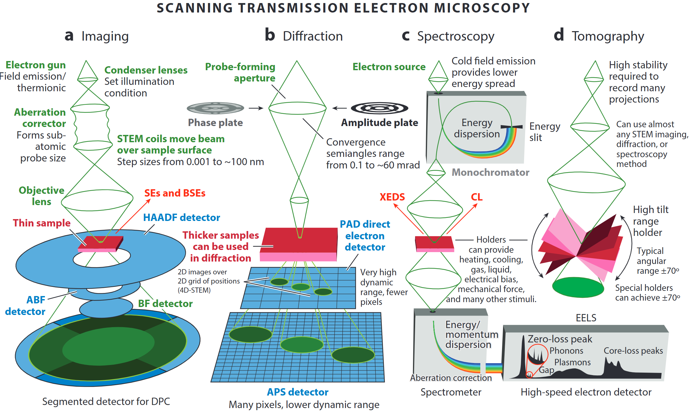
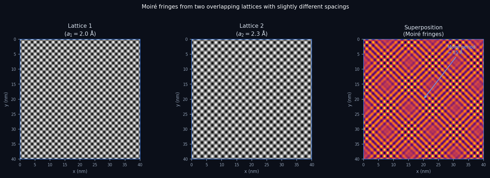
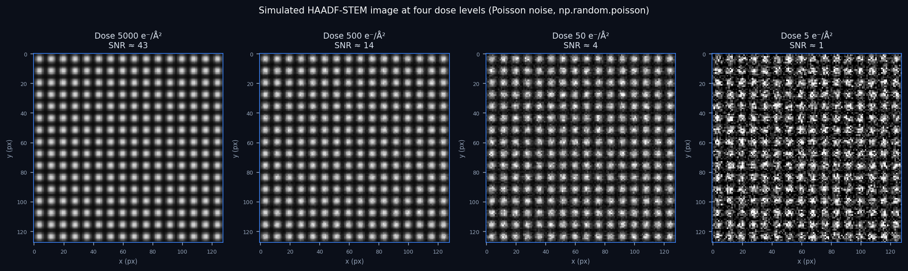

<!-- ===== §0. Recap + today's question ===== -->

## Recap: where we left off

:::: {.incremental}
- **Week 1:** Python + NumPy crash course, PSPP/CRISP-DM frameworks, EM modality overview.
- You can now load an EM image as a NumPy array, slice an ROI, and visualise it.
- The Poisson noise in last week's simulated STEM image was not arbitrary — it is the correct physical model.
- **Today we answer two questions:** What does it mean for a machine to *learn*? And why is every pixel in an EM detector noisy?
::::

:::: {.notes}
- Open by explicitly connecting to the notebook homework. Ask the room: how many completed it? If most have, spend 30 seconds acknowledging the key result — the Poisson noise call. If few have, make a brief case for completing it before Week 3 without shaming.
- The one point to land: the Poisson call in last week's notebook is not syntax trivia. By the end of today, students will be able to derive why that choice is physically correct.
- Misconception to preempt: "Week 1 was just software setup." No — the frameworks (PSPP, CRISP-DM) and the noise model planted in the arrays are the conceptual scaffolding for everything from here on.
- EM anchor: frame the Poisson call as a physicist's choice, not a programmer's choice. The beam consists of individual electrons arriving discretely at the detector — counts follow Poisson statistics. That is not a default; it is a physics fact.
- Forward link: by the end of today, students will be able to justify every noise-model choice they make in any future notebook.
- Transition: "Two big questions for today — let's start with the first."
::::

## Today's question

:::: {.incremental}
- **What is learning?** Fitting a model to data — but fitting *what* exactly? And how do you know it worked?
- **Where does EM noise come from?** Electrons arrive one at a time; every pixel is a count; counts fluctuate — fundamentally, unavoidably.
- **Why does it matter for data science?** Your noise model determines which loss function is correct. The wrong choice silently degrades every trained model on EM data.
- **Road map:** learning taxonomy → model taxonomy → EM data zoo → sensors & sampling → aliasing → noise models → uncertainty → trust.
::::

:::: {.notes}
- This is an orientation slide — do not rush it. The road map tells students there are eight conceptual blocks, each modest in size. Naming them removes anxiety about the upcoming 90 minutes.
- The one point to land: the Poisson–vs–Gaussian choice is not cosmetic. Show the punchline now: Poisson noise means variance = mean. Doubling dose improves SNR by only √2. This is the fundamental physics of why low-dose EM is hard.
- Misconception to preempt: "noise is random so I should just average it away." Averaging does help, but dose-doubling costs sample damage. The right answer is a better noise-aware model, not more dose.
- EM anchor: point to a real situation — cryo-EM or beam-sensitive 2D materials where radiation damage limits the dose you can afford.
- Transition: "Let's start by being precise about what learning means."
::::

<!-- ===== §1. Learning vs classical data analysis ===== -->

## What is learning? Data analysis vs machine learning

:::: {.incremental}
- **Classical data analysis:** you write down the rules (equations, thresholds) and the computer applies them.
- **Machine learning:** you supply examples (data) and the computer *infers* the rules.
- In both cases the goal is the same: extract information from measurements.
- The difference is **who specifies the function** — the human or the optimiser.
::::

:::: {.notes}
- Draw this contrast explicitly on the board or annotate live: left column = "human writes rules," right column = "data implies rules." Students from an engineering background are very comfortable with the left side and will initially distrust the right side.
- The one point to land: ML does not replace domain knowledge — it uses data to fill in the parts of the function that are too complex or too data-dependent to write down analytically. The physicist still defines what the inputs and outputs mean.
- Misconception to preempt: "ML is magic — it figures out everything on its own." It can only learn patterns that exist in the training data. If the training data is biased or incomplete, the learned rules are biased and incomplete.
- EM anchor: measuring lattice spacing from an HAADF image by hand is classical analysis (measure peak positions, compute spacing). Training a CNN to predict strain maps from raw HAADF images is ML.
- Forward link: the distinction matters because it sets expectations about how much data you need and how you validate the result.
- Transition: "Models are the heart of ML. Let's define what a model is."
::::

## Models: all are wrong, some are useful

:::: {.incremental}
- A **model** is a purposeful abstraction of reality built for prediction or explanation [@neuer2024machine].
- **First-principles models:** derived from physical laws; interpretable; may fail when assumptions break down.
- **Data-based models:** inferred from observations; flexible; performance depends on data quality and coverage.
- George Box's maxim: *"All models are wrong, but some are useful."* — usefulness is judged at the decision point, not by aesthetics.
::::

:::: {.notes}
- Start by grounding the concept of "model" before introducing the taxonomy. Students have already met models (Newton's laws, Bragg's law) — now they learn to categorise them by the degree of physics embedded.
- The one point to land: Box's maxim is not a pessimistic statement — it is a liberating one. It removes the pressure of "finding the truth" and replaces it with "finding a model useful enough for the decision at hand."
- Misconception to preempt: "a data-based model is inherently less trustworthy than a physics model." This is context-dependent. A neural network trained on millions of cryo-EM images can predict protein structure more reliably than any current first-principles simulation. Trust depends on validation, not on the model family.
- EM anchor: Bragg's law is a white-box model — it predicts diffraction spot positions from lattice spacing and beam energy. A CNN that classifies grain orientations from diffraction patterns is a black-box model. Both are useful; neither is "true."
- Forward link: the model taxonomy (white/grey/black-box) extends this thought.
- Transition: "How transparent is the inside of the model?"
::::

## When first principles are not enough

:::: {.incremental}
- Complex systems can be nonlinear, high-dimensional, and partially observed.
- **Example:** Electron beam scattering in a thick sample — exact multi-slice simulation exists but is too slow for real-time analysis of millions of diffraction patterns.
- **Hybrid strategy:** keep trusted physics as structure; learn the residual or unknown coupling from data.
- Result: physically consistent outputs with data-efficient learning.
::::

:::: {.notes}
- This is the rationale for ML in materials science. Spend a moment on the 4D-STEM example: each probe position yields a diffraction pattern; there may be 256×256 = 65,536 patterns in one scan; multi-slice simulation of each is seconds per pattern → impractical.
- The one point to land: ML is most powerful where physics provides structure but not a complete closed-form solution. Treat ML as a complement, not a replacement.
- Misconception to preempt: "if we had faster computers, we wouldn't need ML." Even with faster computers, the inverse problem (going from measurements back to structure) requires efficient function approximation. ML is the tool for that even at infinite compute.
- EM anchor: ptychographic phase retrieval — the forward model (electron scattering) is well known, but inverting millions of diffraction patterns requires a fast, differentiable approximation. ML-assisted ptychography achieves this.
- Transition: "Three model types by transparency level."
::::

<!-- ===== §1b. Supervised / unsupervised / self-supervised ===== -->

## Three types of learning

::: {.columns}
::: {.column width="33%"}
**Supervised**

:::: {.incremental}
- Learn from **labelled** examples $(\mathbf{x}_i, y_i)$.
- Task: predict $y$ from new $\mathbf{x}$.
- Regression (continuous) or classification (discrete).
- Example: predict phase label from diffraction pattern.
::::
:::
::: {.column width="33%"}
**Unsupervised**

:::: {.incremental}
- Learn from **unlabelled** data $\{\mathbf{x}_i\}$.
- Task: find hidden structure — clusters, manifolds, compact representations.
- Example: cluster EELS spectra into chemical phases without manual annotation.
::::
:::
::: {.column width="33%"}
**Self-supervised**

:::: {.incremental}
- Generate labels **from the data itself** — no human annotation.
- Task: predict one part of the input from another.
- Example: Noise2Noise denoising — predict one noisy version from another.
::::
:::
:::

:::: {.notes}
- Walk each column with an EM example — use the same sample throughout (e.g. a 4D-STEM scan of a multi-phase alloy). Supervised: someone manually labelled 1000 diffraction patterns; the model learns to generalise. Unsupervised: no labels; PCA + K-means discovers that there are three clusters, which turn out to correspond to three phases. Self-supervised: two independently acquired noisy STEM images of the same area — one is the input, the other the target. The model learns to remove Poisson noise without ever seeing a clean reference.
- The one point to land: the label cost is the practical driver. Supervised learning requires human expert annotation, which is expensive for EM (hours per labelled image). Unsupervised and self-supervised methods reduce or eliminate this cost.
- Misconception to preempt: "self-supervised is just unsupervised." They both avoid external labels, but self-supervised learning creates an explicit pretext task and produces a model with a defined output type. Unsupervised clustering may not produce a model at all — just groupings.
- EM anchor: Noise2Noise (Lehtinen et al., 2018) was first applied to electron microscopy precisely because clean reference images are often unavailable — the only accessible "ground truth" is another noisy image taken at the same dose.
- Forward link: Week 8 (autoencoders) is self-supervised. Week 6 (CNNs) is usually supervised. Week 3 (PCA) is unsupervised.
- Transition: "How much label information you have determines which category you work in. Now, what type of model?"
::::

## Supervised learning: regression vs classification

:::: {.incremental}
- **Regression:** predict a continuous target $y \in \mathbb{R}$.
  - Example: predict the local strain value from a 4D-STEM diffraction pattern.
  - Loss: MSE (Gaussian noise) or Poisson NLL (Poisson noise).
- **Classification:** predict a discrete class label $y \in \{1,\ldots,K\}$.
  - Example: classify each EELS spectrum as oxide, metal, or carbide.
  - Loss: cross-entropy.
- In EM, many tasks are neither cleanly one nor the other — strain maps are continuous, phase maps are discrete. Think carefully about the output type before choosing a loss.
::::

:::: {.notes}
- This is a short definitional slide — the goal is to fix vocabulary, not to teach optimisation theory (that comes in Week 4).
- The one point to land: the choice between regression and classification is set by the physical quantity you are trying to predict, not by personal preference. Strain is continuous → regression. Crystal phase is categorical → classification. Confusing them leads to models that produce nonsensical outputs (e.g., predicting a phase index of 2.7).
- Misconception to preempt: "I can always convert regression to classification by binning." Yes, but you lose resolution and introduce arbitrary bin boundaries. Bin at [0–0.5%, 0.5–1%, …] strain? Which atoms fall in which bin near a dislocation core? The physics is continuous; respect that.
- EM anchor: atomic-column position estimation is a regression task (sub-pixel precision required). Phase identification from EELS is a classification task (categorical output). Both appear in the same miniproject if you are doing automated defect analysis.
- Transition: "Unsupervised learning finds structure without labels."
::::

## Unsupervised learning: clustering and structure discovery

:::: {.incremental}
- **Goal:** find compact representations or groupings of unlabelled data.
- **Clustering:** partition data into groups by similarity — K-means, DBSCAN.
- **Dimensionality reduction:** project high-dimensional data to a low-dimensional space — PCA (Week 3), autoencoders (Week 8), t-SNE.
- **EM example:** a 4D-STEM scan of a polycrystalline alloy produces thousands of diffraction patterns. K-means clustering on PCA-compressed patterns automatically segments the image into grains of different orientation.
- No labels needed — the structure is discovered from the geometry of the data.
::::

:::: {.notes}
- The PCA + K-means pipeline for 4D-STEM is one of the most used techniques in modern electron microscopy. Students should leave this slide knowing that unsupervised learning is not a theoretical curiosity — it is a daily tool in EM labs.
- The one point to land: dimensionality reduction (compression) always precedes clustering in EM because the raw data dimension is huge (128×128 = 16 384 pixels per diffraction pattern) but the intrinsic dimensionality is low (a few crystal orientations). Compressing first makes clustering both faster and more meaningful.
- Misconception to preempt: "K-means tells you how many phases are present." K-means requires you to specify K in advance. Choosing K is a materials science question, not a mathematical one — it depends on your prior knowledge of the phase diagram. Automated methods (silhouette score, gap statistic) can help, but domain knowledge is the primary guide.
- EM anchor: py4DSTEM's `DataCube.get_virtual_image` followed by PCA → K-means is a standard 4D-STEM analysis workflow taught at workshops at major EM facilities. Students who complete this course will be able to run it from scratch.
- Forward link: Week 3 covers PCA in depth. Week 8 covers autoencoders as a non-linear alternative to PCA for dimensionality reduction.
- Transition: "Self-supervised learning closes the gap between supervised and unsupervised."
::::

## Self-supervised learning: the Noise2Noise principle

:::: {.incremental}
- **Idea:** use the data itself to generate supervision signals — no human labels.
- **Noise2Noise:** train a denoising network using pairs of noisy images of the same scene. The network learns to predict one noisy image from another — and the expectation of Poisson noise is the clean signal.
- **Why it works for EM:** at the same dose, two independently acquired STEM images have the same signal but independent Poisson noise realisations.
- **Result:** denoising performance comparable to supervised training against a clean reference image.
::::

:::: {.notes}
- Noise2Noise (Lehtinen et al., NeurIPS 2018) is the canonical self-supervised EM method. Its success depended entirely on the fact that Poisson noise is zero-mean conditional on the clean signal — so the network minimising MSE between two noisy images converges to the clean signal anyway.
- The one point to land: the noise model matters for the theoretical guarantee. Noise2Noise works for zero-mean noise (Poisson, Gaussian, salt-and-pepper). It does not work for structured artefacts (scan drift, Moiré) because those are coherent, not zero-mean, across realisations.
- Misconception to preempt: "I need a clean reference image to train a denoiser." Noise2Noise proves that you do not, as long as you can acquire two independent noisy measurements of the same scene. In practice, this means two low-dose scans instead of one.
- EM anchor: cryo-EM movie data is another Noise2Noise-friendly format — each frame pair (odd/even) from a single electron counting movie constitutes a Noise2Noise training pair. This is now standard practice in cryo-EM preprocessing pipelines.
- Forward link: the formal proof of why Noise2Noise works requires understanding expected loss under a Poisson model — covered in Week 4. The implementation in PyTorch is in Week 6.
- Transition: "With learning types mapped, we can now classify the model by how transparent it is."
::::

## The supervised learning recipe

:::: {.incremental}
1. **Collect labelled examples:** $(\mathbf{x}_i, y_i)$ for $i = 1, \ldots, N$ — features and targets.
2. **Choose a model class** $f_\theta$: linear, polynomial, neural network, …
3. **Define a loss function** $\ell(f_\theta(\mathbf{x}), y)$: MSE, cross-entropy, Poisson NLL.
4. **Minimise the average loss** over the training set (empirical risk minimisation).
5. **Evaluate on held-out data** — never use the test set during training.
6. **Deploy, monitor, retrain** as data distribution shifts.

This is CRISP-DM phases 3–6, mapped onto ML terminology.
::::

:::: {.notes}
- This recipe slide bridges the learning taxonomy to the CRISP-DM framework from Week 1. Students who remember CRISP-DM will immediately recognise the structure.
- The one point to land: step 5 is the most violated step in student projects. The test set must be sequestered from all training decisions. Using it to pick hyperparameters invalidates the evaluation — a form of data leakage.
- Misconception to preempt: "I can fine-tune on the test set as long as I use it last." No. Any use of test-set information to make modelling decisions constitutes leakage. Use the test set once, at the very end.
- EM anchor: a common leakage scenario — using all acquired images to normalise intensity before splitting train/test. The test images have been "seen" implicitly through the normalisation statistics. Fix: compute normalisation statistics from the training set only.
- Forward link: Week 4 covers gradient descent (step 4) and cross-validation (step 5) explicitly.
- Transition: "How complex should the model be? The bias–variance trade-off answers this."
::::

## Bias–variance trade-off: the central tension

::: {.columns}
::: {.column width="55%"}
:::: {.incremental}
- **Bias:** systematic error from overly simple assumptions — model misses real patterns.
- **Variance:** sensitivity to sampling noise — model memorises training quirks.
- **Underfitting** (high bias): too simple; straight-line fit to a curve.
- **Overfitting** (high variance): too complex; degree-50 polynomial fits noise.
- The "sweet spot" minimises the sum of both.
::::
:::
::: {.column width="45%"}
:::: {.incremental}
- **EM analogy:** fitting an EELS edge profile — a line is high-bias; a free polynomial is high-variance; a physically-motivated Hartree–Fock profile is the sweet spot.
- Regularisation, more training data, and physics priors all push toward the sweet spot.
- **Core message:** complexity is not free — it trades bias for variance.
::::
:::
:::

:::: {.notes}
- Introduce the trade-off gently — there is no maths, just intuition. The formal decomposition (bias² + variance + noise = expected loss) comes in Week 4.
- The one point to land: there is no model with zero bias AND zero variance. You are always trading one for the other. Choose the sweet spot for your data size and task complexity.
- Misconception to preempt: "a larger neural network is always better." Larger = more parameters = more variance. If your training set is small (common in EM), a large network overfits catastrophically. This is why physics priors are so valuable in EM — they add constraints that reduce variance without increasing bias.
- EM anchor: EELS edge fitting is a perfect example. The edge shape is determined by the density of states (physics) — constraining the fit to physically plausible shapes is free bias reduction.
- Forward link: Week 4 introduces regularisation as the formal tool. Week 7 covers data augmentation for variance reduction.
- Transition: "Now let's look at the data those models operate on."
::::

<!-- ===== §2. White / grey / black-box taxonomy ===== -->

## Model taxonomy: white / grey / black-box

::: {.columns}
::: {.column width="60%"}
:::: {.incremental}
- **White-box:** explicit mechanism, interpretable parameters (physical laws, linear regression).
- **Black-box:** high predictive flexibility, no traceable internal mechanism (deep neural networks).
- **Grey-box:** partially traceable; blends physics structure with learned components (physics-informed neural networks, PINNs) [@neuer2024machine].
- Explainability tools can move a black-box *toward* the grey zone — but never all the way to white.
::::
:::
::: {.column width="40%"}
:::: {.incremental}
- White: Bragg's law, Beer–Lambert law, Schrödinger equation.
- Grey: learned hardening law in crystal-plasticity simulation.
- Black: CNN classifying phase from HAADF image.
::::
:::
:::

:::: {.notes}
- Walk the spectrum with the three EM examples in the right column. Each one should feel concrete: Bragg's law is written in every diffraction textbook (white); a CPFEM model with one ML sub-module is grey; an end-to-end trained CNN is black.
- The one point to land: the box colour is not a quality label. Black-box models win Nobel Prizes (AlphaFold). Grey-box models are the engineering sweet spot when physics is partially known. Choose based on what physics is reliable at the relevant scale.
- Misconception to preempt: "white-box is always better." Bragg's law is perfectly white and perfectly useless for predicting whether an amorphous sample will crystallise under the beam. The right model is context-specific.
- EM anchor: direct electron detectors operate via known physics (electron → electron-hole cascade). The gain map calibration is a white-box calculation. But the deep-learning denoiser trained on those images is black-box. Both live in the same pipeline.
- Forward link: this taxonomy reappears in Week 13 (explainability) — you will learn to add transparency to black-box models without changing their predictions.
- Transition: "Black-box criticism appears for good engineering reasons."
::::

## Why black-box criticism is not just philosophy

:::: {.incremental}
- Safety, traceability, and auditability requirements in engineering and science.
- Difficulty diagnosing failure causes without interpretable intermediate representations.
- **EM example:** a CNN classifies crystal phases with 97% accuracy but cannot explain *why* it rejected a pattern — which means you cannot tell whether it learned lattice geometry or a detector artefact.
- Good practice: validate that the model has learned the right *features*, not just achieved the right *score*.
::::

:::: {.notes}
- The EM phase classification example is real. Models trained on crystal diffraction patterns have been shown to latch on to diffraction ring radius (correct physics) but also on beam stop shadow (instrument artefact). They get the right answer for the wrong reason.
- The one point to land: a high test-set score is necessary but not sufficient for scientific trust. You must inspect what the model is doing — visualisation tools (Grad-CAM, saliency maps) exist for this, and they are covered in Week 13.
- Misconception to preempt: "a 97% accuracy means the model is correct." Accuracy measures output agreement with labels, not correctness of the learned representation. A model that learns artefacts will fail catastrophically when the artefact disappears (different microscope, different lens current, different detector).
- EM anchor: the classic failure mode — a model trained on data from one microscope that fails silently on data from another because it learned instrument-specific noise patterns.
- Transition: "Now let's look at what data the EM actually produces."
::::

<!-- ===== §3. The EM data zoo ===== -->

## The EM data zoo: four modalities

:::: {.incremental}
- **HAADF-STEM image:** intensity ∝ Z^1.6–1.9; 2-D array shape `(ny, nx)`. Heavy atoms bright.
- **4D-STEM:** a 2-D diffraction pattern at every probe position → 4-D tensor `(ny, nx, ky, kx)`.
- **EELS / EDS spectrum image:** energy spectrum at every pixel → 3-D tensor `(ny, nx, E)`.
- **Tilt-series tomography:** N projections at different tilt angles → 3-D array `(n_tilt, ny, nx)`.
- Each modality has its own **noise model**, **sampling constraints**, and **ML architecture family**.
::::

:::: {.notes}
- Return to the modality overview from Week 1 but now attach the tensor shape to each. Students who did the numpy notebook will recognise the shapes immediately.
- The one point to land: the modality determines the data tensor shape, and the tensor shape determines the correct ML architecture. 2-D images → CNNs. 3-D spectrum images → 3-D CNNs or factored models. 4-D data cubes → 4-D CNNs or physically-structured embeddings.
- Misconception to preempt: "I can always reshape data into 2-D and use a standard CNN." Sometimes, yes. But flattening a 4D-STEM cube loses the spatial–momentum coupling that is physically meaningful. Architecture choice should follow physics.
- EM anchor: spend a moment on the 4D-STEM size calculation: 256×256 probe positions × 128×128 detector pixels × 4 bytes = 4.3 GB for one scan. At 10 scans per day, that is > 40 GB per day. This is why efficient data pipelines matter.
- Forward link: Week 6 covers CNNs explicitly; Week 3 covers PCA for spectrum image dimensionality reduction.
- Transition: "Let's look at the simplest modality more carefully — a HAADF image."
::::

## HAADF-STEM: what the image encodes

::: {.columns}
::: {.column width="55%"}
{width="100%"}
:::
::: {.column width="45%"}
:::: {.incremental}
- Probe scans in a raster; at each position the transmitted beam is detected.
- **HAADF** (High Angle Annular Dark Field): collects high-angle scattered electrons; signal ∝ Z².
- Result: a 2-D map of projected atomic-column density — heavier atoms appear bright.
- Each pixel = one dwell time × electron current = a **count of scattered electrons**.
::::
:::
:::

::: {.aside}
@ophus2023quantitative
:::

:::: {.notes}
- Walk through the geometry carefully: the probe is focused to a sub-Å spot; it dwells at each pixel position for a fixed time (typically 10–100 µs); the annular detector integrates the scattering signal over that time.
- The one point to land: "each pixel is a count of scattered electrons" is the sentence that leads directly to Poisson statistics. Electrons arrive discretely, at random, at an average rate set by the scattering cross-section. The count is therefore Poisson-distributed.
- Misconception to preempt: "the HAADF signal is a continuous intensity." It is measured as a continuous voltage, but it originates from discrete electron arrivals. The variance of that voltage is proportional to the mean — the signature of Poisson statistics.
- EM anchor: this is why low-dose HAADF images of light-element materials (graphene, 2D heterostructures, biological membranes) look grainy — you cannot afford more dose, so the counts per pixel are low, variance is high, and SNR is poor.
- Transition: "What about 4D-STEM and spectroscopy?"
::::

## 4D-STEM, EELS, and tomography

:::: {.incremental}
- **4D-STEM:** each probe position yields a full diffraction pattern. Maps strain, electric fields, magnetic fields, and phase — all from one scan. Shape `(ny, nx, ky, kx)`.
- **EELS spectrum image:** magnetic prism disperses inelastically scattered electrons by energy loss. Maps chemical bonding at nanometre resolution. Shape `(ny, nx, E)`.
- **EDS spectrum image:** characteristic X-rays from each pixel. Maps elemental composition. Shape `(ny, nx, E)`.
- **Tilt-series tomography:** project the object from many angles; reconstruct a 3-D volume. Shape `(n_tilt, ny, nx)` before reconstruction.
::::

:::: {.notes}
- This slide fills the "zoo" — students who have done experiments will recognise their modality. Those who haven't get a vocabulary. Keep it short; these modalities will each get their own time later in the course.
- The one point to land: every modality is a tensor, and the tensor shape embeds the physics of the measurement. Learning the physics = learning the shape.
- Misconception to preempt: "tomography is 3-D, so it must be more complicated than a 2-D image." Mathematically it is a 3-D reconstruction problem, but the raw data are 2-D projections stacked over tilt angle. The 3-D-ness comes from the inverse step (back-projection), not from the raw data format.
- EM anchor: 4D-STEM is the most data-intensive routine modality. A single academic 4D-STEM session can easily generate 1 TB of raw data. This is why py4DSTEM was written — to make 4-D array manipulation accessible to non-programmers.
- Forward link: Week 3 uses PCA to compress EELS spectrum images; Week 6 uses CNNs on HAADF images; Week 10 discusses 4D-STEM for automated acquisition.
- Transition: "Before data reaches the computer, it passes through a sensor. Let's trace that chain."
::::

<!-- ===== §4. Sensors & sampling ===== -->

## From physical signal to digital number

:::: {.incremental}
- **Physical interaction:** electrons scatter off the sample; scattered electrons hit the detector.
- **Transduction:** the detector converts particle arrivals into an electrical signal (charge, voltage).
- **Digitisation:** an ADC samples the analog signal at discrete times and quantises to integer values.
- Every step introduces noise and constraints: **shot noise** (quantum), **read noise** (electronic), **quantisation** (ADC resolution).
- The digital number is never "the truth" — it is one **realisation of a random variable** drawn from a physics-determined distribution.
::::

:::: {.notes}
- Draw the chain on the board: electron → scintillator/direct detector → amplifier → ADC → integer. Each arrow is a potential noise source.
- The one point to land: the transformation from physical reality to digital number is lossy and stochastic. Understanding the loss and the statistics of the noise is the foundation of every quantitative EM analysis.
- Misconception to preempt: "the camera gives me the image." The camera gives you a noisy, band-limited, digitised approximation of the projected potential weighted by the detector's point-spread function and quantum efficiency. That is a very different thing.
- EM anchor: direct-electron detectors (Gatan K3, DE-16) minimise the loss by removing the scintillator layer. The dominant remaining noise is pure Poisson shot noise — which is actually the minimum achievable noise for counting experiments. They are said to approach the "quantum limit."
- Forward link: the noise model (Poisson, Gaussian, or mixed) determines which loss function is correct for any EM training task — a point we return to in the noise slides.
- Transition: "Before sampling, the signal must be properly sampled. Nyquist–Shannon is the guard-rail."
::::

## Sampling: Nyquist–Shannon theorem

::: {.columns}
::: {.column width="55%"}
:::: {.incremental}
- A signal containing only frequencies up to $f_\text{max}$ can be perfectly reconstructed from samples taken at rate $f_s \geq 2 f_\text{max}$.
- **Nyquist frequency:** $f_\text{Nyq} = f_s / 2$ — the highest frequency the system can faithfully capture.
- In an image: pixel pitch $\Delta x$ sets $f_s = 1/\Delta x$; structural features of size $d$ need $\Delta x \leq d/2$.
- **Key caveat:** this assumes perfect band-limiting before sampling (anti-aliasing filter). Without it, high-frequency content *folds* into the recorded band.
::::
:::
::: {.column width="45%"}
:::: {.incremental}
- Practical rule: sample at 3–5× the maximum frequency of interest, not the bare minimum.
- In atomic-resolution STEM: lattice spacing $a$ → pixel pitch ≤ $a/4$ is standard.
- Undersampling = **aliasing** (next slide).
::::
:::
:::

:::: {.notes}
- Nyquist–Shannon is the single most important sampling theorem in all of signal processing. It appears everywhere in EM: spatial sampling of the image, energy sampling of EELS, angular sampling of tomographic tilts.
- The one point to land: Nyquist is a lower bound, not a target. Real experiments aim for 3–4× oversampling because probe size, PSF, and noise all eat into the effective resolution below the Nyquist limit.
- Misconception to preempt: "if I have atomic-resolution pixels, I am Nyquist-limited." Wrong. Even if each pixel is smaller than one atomic spacing, the probe size and aberrations apply a physical low-pass filter. The effective spatial frequency cutoff is set by the probe convergence angle, not the pixel pitch.
- EM anchor: in tomography, the Nyquist condition applies to tilt angle: features of angular frequency $\nu$ require tilt-step $\leq 1/(2\nu)$. That is why fine tilt steps (≤1°) are needed for atomic-resolution tomography.
- Forward link: aliasing is the failure mode when Nyquist is violated — the next slide shows the specific TEM manifestation.
- Transition: "What happens when we violate Nyquist in an EM image?"
::::

## Aliasing and Moiré fringes in TEM

::: {.columns}
::: {.column width="55%"}
{width="100%"}
:::
::: {.column width="45%"}
:::: {.incremental}
- When the camera pixel pitch is too coarse to resolve the crystal lattice, lattice reflections **alias** into the image.
- The alias appears as spurious long-wavelength **Moiré fringes** — not real structure.
- Same artefact from two overlapping crystals with slightly different spacings: the beats have period $1/(1/a_1 - 1/a_2)$.
- **Diagnostic:** rotate the sample or change camera length — real structure rotates; aliasing pattern changes non-trivially.
::::
:::
:::

:::: {.notes}
- Moiré is one of the most common artefacts students encounter and one of the most misidentified. Students routinely report Moiré as a real structural feature in publications. This slide exists to prevent that.
- The one point to land: a long-period fringe in an EM image is a Moiré candidate unless proven otherwise. Proof requires either rotation/tilt invariance testing or diffraction confirmation.
- Misconception to preempt: "Moiré fringes are always bad and should be removed." Sometimes Moiré fringes carry genuine information — twist angle in twisted bilayer graphene is measured via the Moiré period. The artefact is only a problem when mistaken for real structure.
- EM anchor: twisted bilayer graphene is the canonical example where the Moiré period directly encodes the twist angle θ ≈ a/Δ, where Δ is the Moiré period and a is the graphene lattice constant (~0.246 nm). This is used to engineer flat bands and superconductivity.
- Forward link: when we cover CNNs (Week 6), students should ask: "was the training data collected at the right camera length to avoid aliasing the lattice?" If not, the CNN learns to predict a Moiré artefact.
- Transition: "Beyond artefacts from sampling, every pixel carries intrinsic noise from the physics of counting."
::::

## Aliasing visualised: undersampled lattice

:::: {.incremental}
- Imagine a crystal with lattice spacing $a = 2$ Å sampled at pixel pitch $\Delta x = 1.5$ Å — below Nyquist for that frequency.
- The lattice reflections at $k = 1/a = 5$ nm⁻¹ alias to $k' = k - f_s = 5 - 6.67 = -1.67$ nm⁻¹ → a spurious fringe at 6 Å period appears.
- **Rule:** alias frequency = $|f - n \cdot f_s|$ for the nearest integer $n$.
- **Prevention:** always check that your camera length places the Bragg spots you care about well inside the Nyquist radius of the detector.
::::

:::: {.notes}
- Work through the algebra numerically — it takes two minutes and makes the abstract formula concrete. $f_s = 1/\Delta x = 1/0.15\,\mathrm{nm} = 6.67\,\mathrm{nm}^{-1}$. The lattice reflection is at $5\,\mathrm{nm}^{-1}$. The nearest integer multiple is $n=1$: $|5 - 6.67| = 1.67\,\mathrm{nm}^{-1}$ → period $= 1/1.67 \approx 0.6\,\mathrm{nm} = 6$\,Å. A 2\,Å lattice masquerades as a 6\,Å fringe.
- The one point to land: aliasing is a deterministic, reproducible artefact. It does not look like random noise. It produces regular, periodic fringes that persist in any number of averaged frames.
- Misconception to preempt: "averaging many frames will remove the aliasing artefact." Wrong — unlike Poisson noise, which averages down as $1/\sqrt{N}$, aliasing is coherent and systematic. Averaging will not reduce it; a shorter camera length or smaller pixel pitch is required.
- EM anchor: this is why diffraction measurements always quote camera length explicitly — changing camera length changes $\Delta k_x$ (reciprocal-space pixel pitch), which shifts where the Nyquist frequency falls relative to the Bragg spots.
- Transition: "Now the fundamental noise sources that are irreducible — quantum mechanics says you cannot avoid them."
::::

## Sensors and detector types in EM

::: {.columns}
::: {.column width="50%"}
**Scintillator + CCD/CMOS (indirect)**

:::: {.incremental}
- High-energy electron → scintillator → visible photons → CMOS sensor.
- **Pro:** sensor survives radiation; cheap; large area.
- **Con:** scintillator spreads light → broad PSF; lower DQE; mixed Gaussian+Poisson noise.
::::
:::
::: {.column width="50%"}
**Direct electron detector (DED)**

:::: {.incremental}
- High-energy electron enters thinned Si layer directly → sharp PSF.
- **Pro:** near-delta PSF; single-electron counting; dominant noise = pure Poisson.
- **Con:** sensor damaged over time by direct irradiation; expensive.
- **Impact:** the "resolution revolution" in cryo-EM (2013, Nobel Prize 2017) was enabled by DEDs.
::::
:::
:::

:::: {.notes}
- This slide explains why the noise model differs between instruments. Students who do cryo-EM will work with direct detectors; students doing routine HAADF or EDS mapping may be using scintillator-based cameras.
- The one point to land: direct detectors deliver closer to the quantum limit of detection because each electron produces a localised, countable event. The residual noise is truly Poisson. Scintillator cameras add a Gaussian read-noise floor.
- Misconception to preempt: "all modern cameras are the same." Absolutely not. If you train a denoising network on data from a K3 direct detector and deploy on a scintillator camera, the noise statistics mismatch will cause systematic errors.
- EM anchor: the K3 detector (Gatan) acquires 1 500 frames/second in counting mode, producing a stream of single-electron events. A scintillator-CMOS camera integrates the full exposure in one frame. Fundamentally different noise regimes.
- Forward link: the noise model (Poisson vs mixed) determines which loss function is correct for any EM training task.
- Transition: "Two noise sources dominate — let's characterise them precisely."
::::

<!-- ===== §5. Noise models ===== -->

## Two fundamental noise sources

::: {.columns}
::: {.column width="50%"}
**Gaussian noise (thermal / readout)**

:::: {.incremental}
- Many small independent fluctuations add up → Central Limit Theorem → Gaussian.
- **Read noise** in CMOS/CCD electronics: standard deviation $\sigma_r$ independent of signal.
- **Thermal noise** in resistors (Johnson–Nyquist): $\propto \sqrt{k_B T R \Delta f}$.
- Variance is **independent** of the signal.
::::
:::
::: {.column width="50%"}
**Poisson noise (shot / counting)**

:::: {.incremental}
- Individual electrons arrive at the detector at random times.
- Count $N$ in a fixed time window: $N \sim \text{Poisson}(\lambda)$.
- Variance **equals** the mean: $\text{Var}(N) = \lambda$.
- SNR $= \lambda / \sqrt{\lambda} = \sqrt{\lambda}$.
- Fundamental: cannot engineer away — it is the quantum nature of the electron.
::::
:::
:::

:::: {.notes}
- This is the most important single slide in the lecture. Spend at least 8 minutes here. Draw the two distributions side by side on the board.
- The one point to land: Poisson variance = mean is the key relation. It means SNR grows only as √(dose). Doubling the dose improves SNR by 41%, not 100%. This is the fundamental reason low-dose electron microscopy is hard.
- Misconception to preempt: "I can use Gaussian noise as an approximation for EM — it is close enough." For high counts (λ > ~20) the Poisson distribution looks Gaussian with σ = √λ — so the shapes are similar. But the variance–mean relation is different. A Gaussian model assumes constant variance; a Poisson model has signal-dependent variance. In ML: Gaussian → MSE loss; Poisson → Poisson NLL loss. Using MSE on low-count data is a silent physics error that causes models to underfit the noisy regions.
- EM anchor: a typical HAADF pixel in a low-dose experiment might have λ = 50 counts → SNR = √50 ≈ 7. A high-dose pixel at λ = 5000 → SNR ≈ 71. The image looks quantitatively different — not just "more noisy," but structured noise with statistics that the denoiser must handle correctly.
- Forward link: Week 4 (loss functions) — you will explicitly compare MSE and Poisson NLL on simulated low-count HAADF data. The difference in reconstruction quality is stark.
- Transition: "Let's make the SNR scaling concrete with numbers."
::::

## Poisson noise and dose: the SNR law

:::: {.incremental}
- **Signal-to-noise ratio** under Poisson statistics: $\mathrm{SNR} = \sqrt{\lambda}$ where $\lambda$ is the expected count.
- $\lambda$ is proportional to **electron dose** — electrons per unit area at the sample.
- To double SNR you must **quadruple** the dose ($\sqrt{4\lambda} = 2\sqrt{\lambda}$).
- At low dose (beam-sensitive materials): damage limits the dose budget → SNR is fundamentally bounded.
- **Consequence for data science:** denoising networks trained on EM data must model signal-dependent noise — Poisson, not Gaussian.
::::

:::: {.notes}
- Build intuition with specific numbers. Typical STEM doses: 1000 e⁻/Ų for metals (plenty of signal); 10 e⁻/Ų for beam-sensitive 2D materials. At 10 e⁻/Ų and pixel size 0.1 Å, λ ≈ 0.1 counts/pixel — the image is almost pure noise! ML denoising is the only path to usable images at those doses.
- The one point to land: the √λ law is a hard physical limit. You cannot beat it without changing the probe or the detector physics. You can only use it wisely — by choosing a noise-matched loss function and by denoising with a model that knows the statistics.
- Misconception to preempt: "deep learning can remove all the noise." Deep learning can denoise well if trained on matching statistics, but it cannot recover information that was never captured (sub-shot-noise features). If λ < 1 count/pixel, individual electron arrivals are sparse — each pixel is either 0 or 1, and structure must be reconstructed from the spatial pattern of arrivals.
- EM anchor: the "resolution revolution" in cryo-EM (2013, Nobel Prize 2017) was enabled partly by direct-electron detectors that count individual electrons, reducing effective noise well below what scintillator-based cameras could achieve.
- Forward link: the Week 2 notebook simulates this directly — students will observe how image quality degrades as dose drops and measure the SNR vs dose empirically, confirming the √λ law.
- Transition: "Let's look at what this looks like in a simulated image."
::::

## Dose-dependent image quality: a simulation

::: {.columns}
::: {.column width="50%"}
{width="100%"}
:::
::: {.column width="50%"}
:::: {.incremental}
- The phantom: a clean synthetic image of atomic columns on a periodic lattice.
- Noise added via `np.random.poisson(lam = dose_scale * phantom)`.
- At 5 000 e⁻/Ų: columns clearly resolved; SNR ≈ 70.
- At 500 e⁻/Ų: columns visible but noisy; SNR ≈ 22.
- At 50 e⁻/Ų: columns barely visible; SNR ≈ 7.
- At 5 e⁻/Ų: columns invisible to the eye; SNR ≈ 2. ML denoising required.
::::
:::
:::

:::: {.notes}
- This slide bridges the abstract √λ law to a concrete visual experience. Students need to see what "SNR = 2" looks like in practice.
- The one point to land: the image at 5 e⁻/Ų is not recoverable by any single-frame denoising method — the information simply was not collected. But with a trained prior (a neural network that knows what a crystal looks like), structure can be plausibly recovered — at the risk of hallucination if the prior is wrong.
- Misconception to preempt: "I can always recover the image with enough denoising." Strong denoisers can fill in structure that was never measured. In a scientific context, this is dangerous — you might report a reconstructed artefact as a discovered structure. The right denoiser tells you its uncertainty.
- EM anchor: Cryo-EM of proteins is routinely done at doses of 20–80 e⁻/Ų across the entire tilt series — each micrograph contains very few electrons per pixel. This is why cryo-EM averages thousands of particle images: each individual image is barely above the noise floor.
- Forward link: the Week 2 notebook reproduces this plot. The exercise asks students to find the dose at which a chosen feature is no longer visible by eye — a quantitative threshold that connects to the √λ law.
- Transition: "The mixed noise model: both sources present simultaneously."
::::

## Real detectors: Gaussian + Poisson mixture

:::: {.incremental}
- Real EM detectors have both shot noise (Poisson) and read noise (Gaussian).
- **Mixed model:** $x_i = g \cdot \text{Poisson}(\lambda_i) + \mathcal{N}(0, \sigma_r^2)$.
  - $g$ = detector gain (electrons per digital count), $\sigma_r$ = read noise standard deviation.
- **Variance–mean plot:** $\text{Var}(x) = g \cdot \bar{x} + \sigma_r^2$ — a straight line with slope $g$ and intercept $\sigma_r^2$.
- **High-dose regime** ($g\lambda \gg \sigma_r^2$): Poisson dominates; variance ∝ signal.
- **Low-dose regime** ($g\lambda \ll \sigma_r^2$): Gaussian read noise dominates; variance is constant.
::::

:::: {.notes}
- The variance–mean plot is a practical diagnostic that every EM scientist should know how to make. It requires nothing more than taking many frames of varying illumination and plotting variance vs mean across pixels.
- The one point to land: the transition between Gaussian-dominated and Poisson-dominated regimes depends on the ratio σ_r²/(g·λ). Modern direct detectors have σ_r ≈ 1 electron, so the Poisson regime extends to very low doses. CCD cameras with σ_r ≈ 10 electrons are Gaussian-dominated unless you collect > 100 counts/pixel.
- Misconception to preempt: "I should always use Poisson NLL for EM data." Only if Poisson dominates. At high gain and low signal, the read noise floor means Gaussian is the better model for the read-noise term. In practice, the mixed (Gaussian+Poisson) model is always safer.
- EM anchor: the gain calibration (variance–mean measurement) is routinely done by detector manufacturers and published in detector specification sheets. When you set up an ML training pipeline for EM data, look up the detector spec sheet for the gain and read noise.
- Transition: "Now that we understand where noise comes from, we can classify the types of uncertainty in our data."
::::

## The complete noise budget

:::: {.incremental}
- Real EM images contain several additive noise contributions:
  1. **Poisson shot noise:** $\sigma^2 = \lambda$ — unavoidable quantum limit.
  2. **Read noise:** $\sigma^2 = \sigma_r^2$ — independent of signal; Gaussian; reduced by cooling.
  3. **Dark current:** thermally generated electrons; Poisson; eliminated by cooling.
  4. **Fixed-pattern noise:** per-pixel gain/offset variation; removed by flat-field calibration.
  5. **Quantisation noise:** ADC finite resolution; negligible for 14-bit+ systems.
- **Practical characterisation:** variance–mean plot — $\mathrm{Var}(x) = g \cdot \bar{x} + \sigma_r^2$.
  - Slope = detector gain $g$; intercept = read noise $\sigma_r^2$.
::::

:::: {.notes}
- The variance–mean plot (Photon Transfer Curve, PTC) is a five-minute measurement that fully characterises a detector. Every EM facility should have this for every camera. A student who knows how to make this measurement is immediately more capable than most users.
- The one point to land: the dominant noise source determines the correct loss function. Poisson-dominated → Poisson NLL. Gaussian read-noise-dominated → MSE. Mixed → mixed NLL.
- Misconception to preempt: "calibration is someone else's job." The person who collected the data is responsible for knowing the noise budget. "Someone else calibrated it" is not acceptable when a reviewer asks why MSE was used on low-count data.
- EM anchor: for most modern STEM cameras in materials science, Poisson dominates at > 50 counts/pixel. At < 10 counts/pixel, Gaussian read noise can matter. At > 5 000 counts/pixel, fixed-pattern noise from imperfect flat-fielding becomes visible.
- Forward link: Week 4 will derive that the correct loss for each noise regime is the negative log-likelihood of that distribution. Knowing the budget tells you which loss to use.
- Transition: "With the noise budget mapped, we can classify the type of uncertainty."
::::

<!-- ===== §6. Aleatory vs epistemic uncertainty ===== -->

## Aleatory vs epistemic uncertainty

::: {.columns}
::: {.column width="50%"}
**Aleatory (irreducible)**

:::: {.incremental}
- Inherent randomness of the physical process.
- **Cannot** be reduced by more data or better models.
- Examples: shot noise (quantum), thermal vibrations, radioactive decay.
- Origin: the universe is fundamentally probabilistic.
::::
:::
::: {.column width="50%"}
**Epistemic (reducible)**

:::: {.incremental}
- Uncertainty from our *lack of knowledge*.
- **Can** be reduced by more data, better calibration, or better models.
- Examples: unknown detector gain, uncalibrated PSF, small training dataset, wrong model class.
- Origin: we have not yet measured or computed what we could know.
::::
:::
:::

::: {.aside}
@neuer2024machine
:::

:::: {.notes}
- The aleatory/epistemic split is arguably the most important conceptual distinction in uncertainty quantification. Students who understand this distinction can answer "should I collect more data?" — the most common question in experimental science.
- The one point to land: "Can I reduce this uncertainty?" If yes, it is epistemic — act on it. If no, it is aleatory — design your pipeline to live with it.
- Misconception to preempt: "all noise is Poisson, so it is all aleatory." The shot noise is aleatory. But the calibration error on the gain factor is epistemic — you can measure it more carefully. The distinction lives in whether the uncertainty is caused by fundamental physics or by incomplete measurement.
- EM anchor: in EELS, the zero-loss peak (ZLP) width is an aleatory property of the electron gun energy spread (Cold FEG: ~0.3 eV). But the exact peak position drift over a session is epistemic — it can be tracked and corrected by monitoring the ZLP periodically.
- Forward link: active learning (Week 10) explicitly targets epistemic uncertainty — it sends the probe to regions of the sample where the model is most uncertain, reducing that uncertainty efficiently.
- Transition: "With the noise and uncertainty landscape mapped, how should you approach trusting a model?"
::::

## Practical implications: which uncertainty can you act on?

:::: {.incremental}
- **Reduce epistemic uncertainty:** collect more training data, calibrate the detector, validate the PSF, improve the model architecture.
- **Accept aleatory uncertainty:** report confidence intervals; use noise-matched loss functions; do not over-denoise.
- **Mixed case:** a small training set means high epistemic uncertainty *on top of* irreducible aleatory noise. More data helps — up to the point where aleatory noise dominates.
- **Active learning principle:** always prioritise experiments that reduce *epistemic* uncertainty. Repeating the same measurement over and over only shrinks aleatory uncertainty by $1/\sqrt{N}$ — which is often not worth the dose budget.
::::

:::: {.notes}
- This slide operationalises the distinction. Students should walk away with a decision flowchart: is this uncertainty reducible? → if yes, reduce it. If no, propagate it honestly.
- The one point to land: over-denoising epistemic-uncertainty-free images is hallucination. A well-calibrated Bayesian model knows when it does not know something and says so with a wide credible interval. An overconfident deterministic model gives a single "answer" that may be completely wrong.
- Misconception to preempt: "uncertainty quantification is too advanced for practical work." Every error bar in a scientific paper is an attempt at uncertainty quantification. ML just demands you be explicit about which type you are reporting.
- EM anchor: in automated 4D-STEM analysis, a well-designed pipeline reports a per-pixel confidence score alongside the strain map. Pixels near amorphous regions or edge effects should have high uncertainty (partially epistemic from model extrapolation, partially aleatory from low signal). A pipeline that reports uncertainty = 0 everywhere is incorrect.
- Transition: "Finally: can you trust the model? And what does Week 3 bring?"
::::

<!-- ===== §7. Trust teaser + forward link ===== -->

## Trust and limits: a teaser

:::: {.incremental}
- A model can have low training loss *and* be physically wrong.
- Trust requires: correct noise model, no data leakage, held-out test performance, interpretable learned features, and physical consistency checks.
- **The central tension:** models that fit training data perfectly (*low bias*, *high variance*) generalise poorly. Models that are too simple (*high bias*, *low variance*) miss real patterns. Finding the balance is the bias–variance trade-off.
- Week 13 will cover interpretability and trust in full. For now: *always ask what the model learned, not just how well it scored.*
::::

:::: {.notes}
- This is a teaser, not a full treatment. Plant the term "bias–variance trade-off" and promise to return to it. Students who have heard it before will feel oriented; students who have not will feel intrigued.
- The one point to land: trust is not a single number. It is a combination of physics consistency, statistical validation, and interpretability. All three must be satisfied simultaneously.
- Misconception to preempt: "I can evaluate trust by test accuracy alone." Test accuracy only measures the label-matching quality on held-out data from the same distribution. It says nothing about out-of-distribution generalisation, physical consistency, or whether the learned features are meaningful.
- EM anchor: a denoising network trained on simulated Poisson noise but deployed on real CMOS data (which has Gaussian read noise too) will make systematic errors in low-count pixels — precisely because the test distribution differs from the training distribution in the noise model. This is a physics-level generalisation failure.
- Forward link: Week 3 introduces linear algebra and PCA — the first concrete tools for understanding what a model has learned (eigenimages in PCA are the simplest form of "what did the model find?").
- Transition: "Next week we formalise all of this with linear algebra."
::::

## Self-study this week

:::: {.incremental}
- **Notebook:** `notebooks/week02_poisson_noise.ipynb` — "Poisson noise & SNR in STEM."
  - Simulate dose-dependent Poisson noise on a clean STEM-like phantom.
  - Plot SNR vs dose; observe the $\sqrt{\lambda}$ law empirically.
  - Final exercise: find the dose threshold at which a chosen feature disappears.
- **Open in Colab:** no local installation needed.
- **Goal:** confirm the $\sqrt{\lambda}$ law numerically and build intuition for low-dose imaging before Week 3.
- **Must-know review:** check `_shared/exam_mustknow.md` — Week 2 statements are now filled.
::::

:::: {.notes}
- Distribute the notebook link at the end of the lecture. Students who open it immediately will have a head start on the exercise.
- The one point to land: the notebook takes about 60–90 minutes for students who completed the Week 1 notebook. The setup cells use only NumPy and Matplotlib — no new libraries are needed.
- Misconception to preempt: "I understand Poisson noise from the lecture, I do not need to do the notebook." The √λ law is intuitive from the formula but surprising in practice — the 5 e⁻/Ų image looks completely noise-dominated even though √5 ≈ 2, which sounds like it might be borderline. Seeing it visually is different from knowing the formula.
- Materials anchor: the qualitative threshold exercise at the end of the notebook connects directly to real experimental decisions: "how many electrons do I need to resolve this feature?" That is a question every EM practitioner answers daily.
- Forward link: Week 3 uses PCA on spectrum images. PCA is sensitive to noise statistics — a PCA model trained on Gaussian-assumed noise behaves differently from one that correctly handles Poisson noise. The Week 2 notebook builds the intuition you will need to understand that difference.
- Transition: "Next week we put linear algebra to work."
::::

## Looking ahead — Week 3

:::: {.incremental}
- **Topic:** "Linear algebra & PCA for EM spectral data"
- Vectors, matrices, dot products — the language of ML.
- Singular Value Decomposition (SVD): the workhorse for dimensionality reduction.
- PCA on a simulated EELS spectrum image: which components are signal vs noise?
- **Prerequisite:** complete the Week 2 notebook; you will need the Poisson noise intuition to interpret PCA components correctly.
::::

:::: {.notes}
- Keep this brief and appetising. The key promise: after Week 3, students will be able to open an EELS hyperspectral dataset, apply PCA in five lines of code, and identify the chemically meaningful components from the noise components.
- The one point to land: PCA is not a black box — its outputs (eigenvectors and eigenvalues) have direct physical interpretation in EM. The first component is the "average spectrum"; later components encode chemical variations. This is the first example of a model whose learned features are human-interpretable.
- Misconception to preempt: "PCA is just a data compression trick." PCA is also a noise separation tool — in spectrum images, the signal lives in a low-dimensional subspace, and the noise is spread across all dimensions. PCA pulls the signal out. This is only correct under the Gaussian-noise assumption, which the Week 2 notebook will prepare students to question.
- Transition: "See you next week."
::::

## Continue

- &rarr; Next: [Week 03 — Linear algebra &amp; PCA](../03_linear_algebra_pca/01_intro.html)
- &larr; Back: [Week 01 — Python crash course &amp; course launch](../01_python_crash/01_intro.html)
- [All courses](../../index.html)

## References

::: {#refs}
:::
