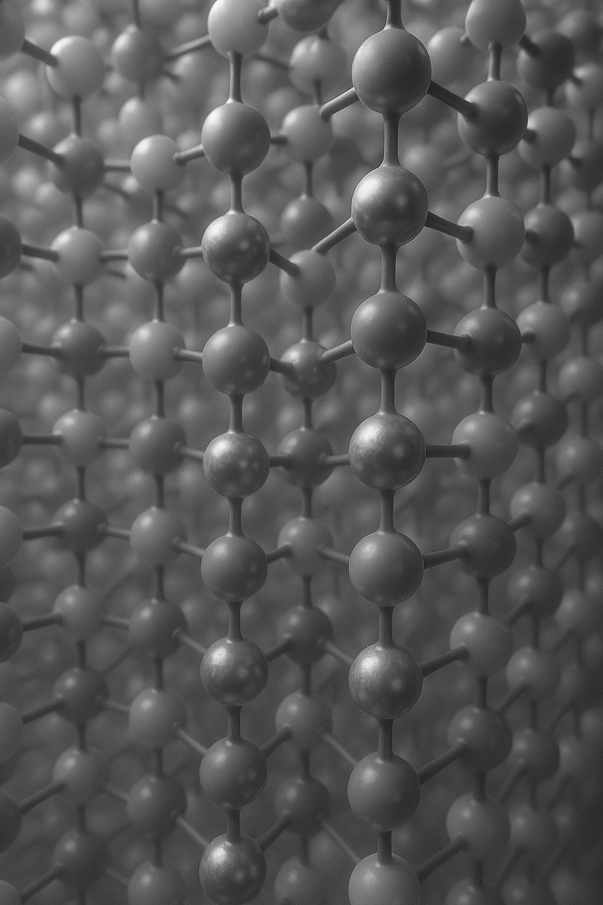

<!-- ## Outline

::: {.outline-container}

::: {.outline-box .fragment}
### Formalities
 
:::

::: {.outline-box .fragment}
### Introduction  to  Electron  Microscopy  Data

:::

::: {.outline-box .fragment}
### Basic Pytorch  Knowledge

:::

::: {.outline-box .fragment}
### .
  
:::-->
  


 
     
    
 
   

 
## References  
::: {#refs} 
:::
  
 

