<!-- ===== §0. Recap + today's question ===== -->

## Recap: where we left off

:::: {.incremental}
- **Week 2:** EM data formation. Specimen → interaction → detector → digitisation → metadata. Every stage leaves a fingerprint on the numbers.
- **Noise model → likelihood → loss:** Gaussian noise gives MSE, Poisson counts give the Poisson NLL, mixed noise calls for a variance-stabilising transform (Anscombe).
- Every EM pixel is a **count**, so the variance depends on the signal. Low-dose data are noisy no matter what you do afterwards.
- **Gap:** a spectrum image holds 10⁴–10⁵ spectra with hundreds of channels each. We need a compact representation that is also **physically interpretable**.
- **Today:** the linear algebra behind that representation. First PCA, which finds the subspace. Then NMF / MCR, which turn the subspace into phases.
::::

:::: {.notes}
- Open by asking: who completed the Week 2 notebook? The low-count fit should have shown that the shortcut losses (count-weighted χ², Anscombe + MSE) are biased and that plain MSE wastes dose compared with the Poisson NLL. Keep that result in mind, because today it comes back as "weight before PCA".
- The one point to land: Week 2 said that the noise model decides the loss. Today the same principle decides the decomposition. Plain PCA is least squares, i.e. it implicitly assumes Gaussian noise. Poisson data need weighting, or a Poisson-divergence NMF.
- Misconception to preempt: "I did not enjoy linear algebra in my physics degree." This week's linear algebra is geometric and intuition-first: projections, ellipses, triangles. If you can picture a stretched ellipse and a triangle of mixtures, you already have the core idea.
- EM anchor: an EELS spectrum image is a 3-D tensor (x, y, E), e.g. 128 × 128 pixels × 1024 channels, which is about 16 million numbers. The chemistry lives in maybe 3–5 of them per pixel.
- Pacing note: the first half (geometry, SVD, PCA, scree, denoising, ~45 min) is familiar ground and should move briskly. Protect ~30 min for the new second half: EELS preprocessing, NMF, MCR-ALS and unmixing pitfalls.
- Transition: "Two questions anchor today."
::::

## Today's question

:::: {.incremental}
- **Why does PCA denoise an EELS spectrum image?** Because the signal lives in a **low-dimensional subspace**, while the noise spreads across all directions.
- **Why are PCA components not phases, and what gives us phases?** Non-negativity and mixing constraints: **NMF, MCR-ALS, endmember unmixing**.
- **Road map:** geometry & projection · SVD · PCA & scree · PCA denoising · eigen-spectra · **EELS preprocessing pipeline** · **NMF & MCR-ALS** · **unmixing pitfalls** · ill-conditioning · limits.
- **Self-study:** `notebooks/week03_pca_nmf_eels.ipynb`. Build a 3-phase spectrum image, then compare PCA and NMF against the ground truth.
::::

:::: {.notes}
- Name the payoff upfront. By the end, students can (1) run and read a PCA scree plot, (2) explain why PCA components are signed and not phases, (3) run NMF and state why its answer is not unique, and (4) describe the EELS preprocessing steps that must come *before* any decomposition.
- The one point to land: PCA answers "how many things vary?", and unmixing answers "what are the things?". Both are matrix factorisations X ≈ T·S; they differ only in the constraints.
- Misconception to preempt: "NMF replaces PCA." No. In practice PCA is used first (denoise, choose K) and NMF/MCR second (interpret). Both run in the same pipeline.
- Forward link: Week 4 uses least squares = projection (today's geometry) for regression. Week 9 generalises PCA to non-linear autoencoders, and constrained autoencoders generalise NMF.
- Transition: "Here is what you should be able to do at the end."
::::

## Learning outcomes

:::: {.incremental}
By the end of this week you can:

1. **Reshape** a spectrum image into a data matrix $\mathbf{X}\in\mathbb{R}^{N\times D}$ (rows = pixels) and back.
2. **Explain** SVD geometrically and connect singular values to the variance per principal component.
3. **Choose** the number of components $K$ from a scree plot, and name the ways that choice can go wrong.
4. **Describe** the EELS preprocessing chain: energy alignment → power-law background → normalisation → Poisson weighting.
5. **Formulate** NMF and MCR-ALS as constrained factorisations, and explain multiplicative updates and alternating least squares.
6. **Diagnose** rotational ambiguity, PCA truncation bias and rare-phase loss, using residual maps and restarts.
::::

:::: {.notes}
- These outcomes map directly to exam must-know statements (see the must-know slide at the end). Outcomes 4–6 are new this year. They are the practical skills a microscopist needs before trusting any "phase map" produced by software such as HyperSpy.
- The one point to land: outcome 6 is the most important one. Every factorisation produces a picture, and the craft is knowing when the picture is lying.
- Pacing note: do not read the list out loud. Point at 4–6 and say "this is what is new compared to a generic ML course".
- Transition: "Start with the simplest thing: what is a vector?"
::::

<!-- ===== §1. Vectors & matrices as geometry ===== -->

## Vectors: arrows in space

:::: {.incremental}
- A **vector** $\mathbf{x} \in \mathbb{R}^D$ is a point (or arrow) in $D$-dimensional space.
- **In EM:** one EELS spectrum with 200 energy channels is a point in $\mathbb{R}^{200}$.
- The **dot product** $\mathbf{a}^T \mathbf{b} = |\mathbf{a}||\mathbf{b}|\cos\theta$ measures the alignment between two vectors.
- Dot product = 0 ⟹ **orthogonal** (90°) — the two vectors carry independent information.
- **Norm** $\|\mathbf{a}\| = \sqrt{\mathbf{a}^T\mathbf{a}}$ = the length of the arrow.
::::

:::: {.notes}
- Draw two arrows on the board. Ask: what does it mean for two spectra to be "similar"? Answer: their dot product is large (they point in almost the same direction). Two chemically distinct spectra (oxide vs metal) will be nearly orthogonal.
- The one point to land: angle between vectors = degree of similarity. This is the geometric foundation of every clustering and similarity metric we will use in the course.
- Misconception to preempt: "a vector is just a list of numbers." It is — but it also has a geometric meaning (direction + magnitude) that becomes crucial when we ask "which direction captures the most variance?" Keep both views active.
- EM anchor: the dot product between a measured EELS spectrum and a reference Fe-L edge spectrum is a spectroscopic "match score" — this is the basis of reference-spectrum fitting and spectral unmixing.
- Forward link: the projection of one vector onto another (next slide) is the foundation of PCA and least-squares regression.
- Transition: "How do we project one vector onto another? That is the workhorse operation of this whole week."
::::

## Projection: the core operation

::: {.columns}
::: {.column width="55%"}
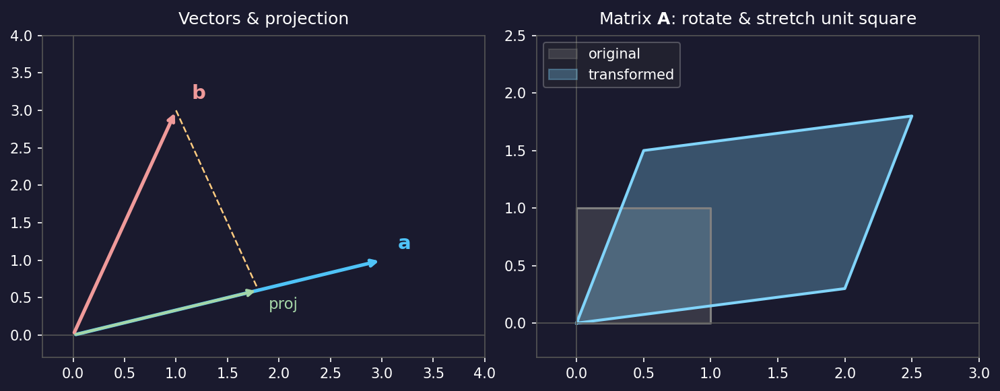{width="100%"}
:::
::: {.column width="45%"}
:::: {.incremental}
- **Scalar projection** of $\mathbf{b}$ onto unit vector $\hat{\mathbf{a}}$: $c = \hat{\mathbf{a}}^T \mathbf{b}$.
- **Vector projection**: $\text{proj}_{\mathbf{a}} \mathbf{b} = c \, \hat{\mathbf{a}}$.
- The **residual** $\mathbf{b} - \text{proj}_{\mathbf{a}}\mathbf{b}$ is perpendicular to $\mathbf{a}$.
- This decomposition — "how much lies along $\mathbf{a}$?" — is what PCA does in every direction.
::::
:::
:::

:::: {.notes}
- Work through the picture carefully: the blue arrow is $\mathbf{a}$, the red arrow is $\mathbf{b}$, the green arrow is the projection. The orange dashed line is the residual — it meets $\mathbf{a}$ at a right angle.
- The one point to land: projection = "shadow" of $\mathbf{b}$ onto the line of $\mathbf{a}$. The scalar $c$ tells you how much of $\mathbf{b}$ is "explained" by the direction $\mathbf{a}$.
- Misconception to preempt: "the projection is the closest point on the line to $\mathbf{b}$." This is true and equivalent, but students find the "shadow" intuition more concrete. Use both.
- EM anchor: projecting an EELS spectrum $\mathbf{b}$ onto a reference spectrum $\hat{\mathbf{a}}$ (normalised to unit length) gives the coefficient that tells you "how much Fe-L edge is in this spectrum." This is spectral unmixing in one formula.
- Forward link: least-squares regression (Week 4) generalises this to projecting onto a multi-dimensional subspace spanned by multiple feature vectors.
- Transition: "Now scale up: what does a matrix do geometrically?"
::::

## Matrices as geometric transformations

::: {.columns}
::: {.column width="55%"}
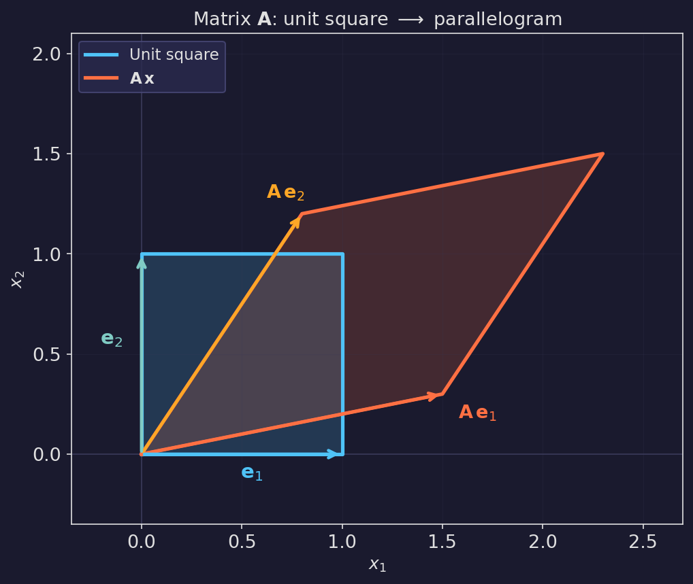{width="100%"}
:::
::: {.column width="45%"}
:::: {.incremental}
- A matrix $\mathbf{A}$ maps every vector $\mathbf{x}$ to a new vector $\mathbf{y} = \mathbf{Ax}$.
- Geometrically: $\mathbf{A}$ **rotates**, **stretches**, and (for non-symmetric $\mathbf{A}$) **shears** space.
- **The data matrix $\mathbf{X} \in \mathbb{R}^{N \times D}$:** $N$ spectra (rows), each with $D$ energy channels (columns).
- One row = one spectrum = one point in $\mathbb{R}^D$.
- **Convention for this week:** observations in rows, features in columns.
::::
:::
:::

:::: {.notes}
- The unit-square picture is the classic: take the four corners of the unit square, apply $\mathbf{A}$ to each corner, watch the square become a parallelogram. This encodes the full action of the matrix geometrically.
- The one point to land: a matrix is not just a 2-D spreadsheet — it is a machine that reshapes space. Understanding what kind of reshaping it does (rotation? stretch? compression?) is the key to understanding PCA and SVD.
- Misconception to preempt: "the data matrix has $D$ rows (features) and $N$ columns (observations)." Different fields use different conventions. In this course: observations (spectra, pixels, samples) are **rows**; features (energy channels, pixel values) are **columns**. Always check shape with `.shape`.
- EM anchor: for an EELS spectrum image of shape (64, 64, 1024), you reshape the first two axes to get the data matrix $\mathbf{X}$ of shape (4096, 1024) — 4096 spectra, each with 1024 energy channels. This is the input to PCA.
- Forward link: the column space of $\mathbf{X}$ (the span of all spectra) is the subspace PCA is searching for a compact basis for.
- Transition: "When we talk about 'dimensions' of EM data, what do we mean precisely?"
::::

## The data matrix: EM spectra as points in high-D space

::: {.columns}
::: {.column width="55%"}
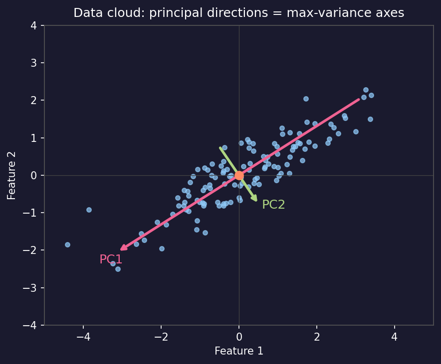{width="100%"}
:::
::: {.column width="45%"}
:::: {.incremental}
- Each EELS spectrum $\mathbf{x}_i \in \mathbb{R}^{1024}$ is a **point** in 1024-D space.
- The cloud of $N$ spectra occupies only a tiny corner of that space — most directions are empty.
- **Intrinsic dimensionality:** if a sample has $K$ distinct chemical phases, the spectra approximately lie on a $K$-dimensional subspace.
- **Key intuition:** for a two-phase sample, all spectra are linear combinations of two end-members → they lie on a **2-D plane** inside $\mathbb{R}^{1024}$.
- PCA finds and extracts that plane.
::::
:::
:::

:::: {.notes}
- Work through the figure in detail. The points are spectra; the two arrows are the first two principal components. PC1 points along the direction where spectra vary most (chemical difference between phases); PC2 points along the second-largest variation.
- The one point to land: a 1024-channel EELS dataset from a two-phase sample is effectively 2-dimensional. We only need 2 numbers per spectrum (the scores on PC1 and PC2) to characterise it completely. The other 1022 dimensions are noise.
- Misconception to preempt: "more channels = more information." Not necessarily. More channels can mean more noise in dimensions that carry no signal. PCA identifies the low-dimensional signal subspace and discards the noise-dominated directions.
- EM anchor: in a steel sample with austenite and martensite phases, the EELS spectra from each phase are nearly constant within the phase. The data cloud is very thin (one dimension per phase), so K=2 components capture essentially all the signal.
- Forward link: the concept of intrinsic dimensionality reappears in Week 9 (autoencoders) where non-linear dimensionality reduction finds curved, not flat, low-dimensional structures.
- Transition: "How do we find a compact basis for a cloud of points? Start with projection."
::::

## Reshaping EM data into a matrix: the practical step

```python
import numpy as np

# Simulate loading an EELS spectrum image
# Shape: (ny, nx, energy_channels) = (64, 64, 1024)
eels_map = np.random.rand(64, 64, 1024).astype(np.float32)

ny, nx, ne = eels_map.shape
print("Original shape:", eels_map.shape)   # (64, 64, 1024)

# Reshape: stack all pixels into rows → data matrix
X = eels_map.reshape(ny * nx, ne)
print("Data matrix shape:", X.shape)        # (4096, 1024) — N=4096 spectra, D=1024 channels

# After PCA: reshape score maps back to spatial image
# (assume K=3 components)
K = 3
# scores.shape = (4096, 3)  →  reshape to (64, 64, 3)
# score_maps = scores.reshape(ny, nx, K)
print(f"Score maps after reshape: ({ny}, {nx}, {K}) = {ny*nx*K} values total")
```

. . .

- **Data layout rule:** observations (pixels, spectra) in **rows**; features (channels) in **columns**.
- Always check `X.shape` before any analysis — a transposed matrix gives meaningless PCA.

:::: {.notes}
- This is a practical code slide. Walk through it line by line. The reshape from (64, 64, 1024) to (4096, 1024) is the single operation that unlocks PCA for any spectral image.
- The one point to land: the reshape operation does not change the data — it re-indexes it. The first 1024 values in row 0 of X are the spectrum at pixel (0, 0); the next 1024 in row 1 are the spectrum at pixel (0, 1); and so on. No information is lost.
- Misconception to preempt: "I should reshape the matrix as (1024, 4096) because features go in rows." In NumPy/sklearn, the convention is always observations in rows. Transposing before PCA gives a completely different (and wrong) result — PCA would find directions of maximum variance across energy channels, not across pixels.
- EM anchor: hyperspy's `s.decomposition()` does this reshape internally. Understanding it means you can use `s.get_decomposition_factors()` and `s.get_decomposition_loadings()` with confidence.
- Forward link: in the notebook, students do exactly this reshape operation before calling `np.linalg.svd`.
- Transition: "Now the core projection geometry."
::::

<!-- ===== §2. Projection & least-squares-as-projection intuition ===== -->

## Projection onto a subspace

:::: {.incremental}
- Suppose we want to **approximate** a spectrum $\mathbf{x}$ using only $K$ basis vectors $\{\mathbf{v}_1, \ldots, \mathbf{v}_K\}$.
- The best approximation (minimum reconstruction error) is the **orthogonal projection**:
  $$\hat{\mathbf{x}} = \sum_{k=1}^{K} (\mathbf{v}_k^T \mathbf{x})\, \mathbf{v}_k = \mathbf{V}_K \mathbf{V}_K^T \mathbf{x}.$$
- The coefficients $c_k = \mathbf{v}_k^T \mathbf{x}$ are called **scores** — how much of $\mathbf{x}$ lies along $\mathbf{v}_k$.
- **Residual:** $\mathbf{x} - \hat{\mathbf{x}}$ is orthogonal to every $\mathbf{v}_k$ — it contains whatever the $K$ basis vectors could not explain.
- If the basis vectors capture signal, the residual contains noise.
::::

:::: {.notes}
- This is the conceptual heart of both PCA and linear regression. Connect back to the single-vector projection: projecting onto $K$ basis vectors is just doing that operation $K$ times and adding up the results.
- The one point to land: "best approximation in the least-squares sense = orthogonal projection." This is a theorem (the projection theorem), not a convention. It means PCA reconstruction is optimal in the Frobenius norm sense.
- Misconception to preempt: "I need to choose the basis vectors before projecting." For projection onto a **given** subspace, yes. For PCA, the algorithm finds the optimal basis vectors from the data. The projection formula is then applied with those learned vectors.
- EM anchor: if we project an EELS spectrum onto a reference Fe-L edge eigenspectrum, the score $c_1$ directly measures the Fe content at that pixel. Low $c_1$ = Fe-poor; high $c_1$ = Fe-rich. The score map is a chemical map.
- Forward link: in Week 4, linear regression is exactly this: approximate a target vector $\mathbf{y}$ by projecting it onto the subspace spanned by the feature matrix columns. The coefficients are the regression weights.
- Transition: "This geometric picture leads directly to least squares with no calculus."
::::

## Least squares = projection (no calculus required)

:::: {.incremental}
- **Problem:** find weights $\mathbf{w}$ such that $\mathbf{Xw} \approx \mathbf{y}$ (predict target $\mathbf{y}$ from features $\mathbf{X}$).
- **Geometric view:** $\mathbf{Xw}$ can only reach the **column space** of $\mathbf{X}$.
- The best approximation is the orthogonal projection of $\mathbf{y}$ onto that column space.
- **Orthogonality condition:** the residual $\mathbf{r} = \mathbf{y} - \mathbf{Xw}$ must be perpendicular to every column of $\mathbf{X}$, i.e. $\mathbf{X}^T \mathbf{r} = \mathbf{0}$.
- Substituting: $\mathbf{X}^T(\mathbf{y} - \mathbf{Xw}) = \mathbf{0}$ → **Normal equations:** $\mathbf{X}^T\mathbf{X}\,\hat{\mathbf{w}} = \mathbf{X}^T \mathbf{y}$ [@bishop2006pattern].
::::

:::: {.notes}
- Draw the classic picture on the board: $\mathbf{y}$ is an arrow in $\mathbb{R}^N$ outside the column space (a plane). The projection $\hat{\mathbf{y}} = \mathbf{X}\hat{\mathbf{w}}$ is the closest point in the plane; the residual drops perpendicularly to the plane.
- The one point to land: "Normal equations" uses "normal" in the sense of perpendicular, not in the sense of Gaussian. The residual must be perpendicular to the feature subspace — that single geometric requirement gives the entire formula, no derivatives needed.
- Misconception to preempt: "I need to know calculus to understand least squares." The geometric derivation is completely calculus-free. The calculus derivation agrees, which is reassuring — but you do not need it to understand what is happening.
- EM anchor: fitting an EELS background (power-law or polynomial) is a least-squares problem: find the coefficients of the background model that minimise the squared residual in the pre-edge region. The feature matrix $\mathbf{X}$ is constructed from the background functional form evaluated at each energy channel.
- Forward link: in Week 4 we will compute $\hat{\mathbf{w}}$ numerically using gradient descent — but understanding the geometric answer (projection) tells us what gradient descent is converging to.
- Transition: "Now for the big tool: Singular Value Decomposition. We will build it as a geometric story."
::::

## Inner product and orthonormal bases: the computational engine

:::: {.incremental}
- **Orthonormal basis** $\{\mathbf{v}_1, \ldots, \mathbf{v}_K\}$: each vector has unit length and all pairs are perpendicular.
  - Formally: $\mathbf{v}_i^T \mathbf{v}_j = \delta_{ij}$ (= 1 if $i=j$, else 0).
- **Computational advantage:** to find the coefficient of $\mathbf{x}$ along $\mathbf{v}_k$, just compute one dot product: $c_k = \mathbf{v}_k^T \mathbf{x}$.
- No matrix inversion needed — orthonormality makes the "inverse" trivial.
- **PCA principal components are orthonormal:** each eigenspectrum has unit norm; different eigenspectra are perpendicular.
- This means the scores for different PCs are **uncorrelated** — a crucial property for interpretation.
::::

:::: {.notes}
- The orthonormality condition ($\delta_{ij}$) explains why PCA computation is cheap: projecting a spectrum onto K principal components requires only K dot products (K matrix-vector multiplies), not a system solve. Once the eigenspectra are known, processing a new spectrum is O(KD) — very fast.
- The one point to land: "uncorrelated PCs" means the score for PC1 carries no information about the score for PC2. If both were large and positively correlated, they would be redundant. Orthogonality guarantees each PC adds truly independent information.
- Misconception to preempt: "orthogonal components must be physically uncorrelated." PCA components are decorrelated in the data — their scores have zero covariance. But two physical quantities that happen to be decorrelated in *this particular* dataset are not guaranteed to be uncorrelated in general. PCA does not discover universal physical independence; it discovers statistical independence in the specific dataset.
- EM anchor: in EELS, after PCA, the Fe score map and Cr score map are guaranteed to be uncorrelated (by construction of PCA). If the actual Fe and Cr distributions in the sample are correlated (e.g. both track sample thickness), the PCA components will not directly correspond to Fe and Cr — instead they will encode linear combinations. To get back to element maps, you need an extra unmixing step.
- Forward link: the orthonormality of PCA components is what makes the Eckart–Young theorem work — the reconstruction error is simply the sum of the discarded singular values squared, with no cross-terms.
- Transition: "Three-dimensional intuition helps with the scree plot concept."
::::

## Projection intuition in 3-D

:::: {.incremental}
- Imagine a cloud of 3-D points (atoms in a grain boundary, spectra from a 3-phase sample).
- Most of the **variance** (spread) lies along one principal direction — call it $\mathbf{v}_1$.
- Projecting every point onto $\mathbf{v}_1$ gives a 1-D summary that preserves most information.
- Adding $\mathbf{v}_2$ (orthogonal to $\mathbf{v}_1$) captures the next largest spread, and so on.
- PCA finds $\mathbf{v}_1, \mathbf{v}_2, \ldots$ in order of decreasing variance — this is exact.
- **Key property:** $K$ projections capture more variance than any other set of $K$ directions — PCA is optimal.
::::

:::: {.notes}
- Use a physical analogy: shadow-casting. If you have a 3-D object and shine a light, the shadow on a wall is a 2-D projection. The shadow that shows the most detail corresponds to the best projection direction — the "most informative" shadow. PCA finds exactly that direction, then the second-most informative, and so on.
- The one point to land: PCA projections are optimal in a specific sense — among all possible $K$-dimensional subspaces, PCA chooses the one that minimises reconstruction error (equivalently, maximises captured variance). This is the Eckart–Young theorem, and it is why PCA is used everywhere.
- Misconception to preempt: "there might be a better set of 2 directions than PC1 and PC2." There isn't — the optimality of PCA is a theorem. However, "better" here means "explains more variance," not "more physically interpretable." Non-negative Matrix Factorization (NMF) sacrifices optimality for physical interpretability.
- EM anchor: in a 4D-STEM dataset, the 3-D analogy is literal — diffraction patterns vary across a 2-D spatial scan plus a 2-D reciprocal space. PCA collapses the (kx, ky) pattern variability into a few principal components that encode grain orientation or strain.
- Forward link: the next three slides formalise this with SVD, which is the computational engine of PCA.
- Transition: "The mathematical tool behind PCA is SVD. Let me show you its geometry."
::::

<!-- ===== §3. SVD as a picture ===== -->

## The covariance matrix: where geometry meets statistics

:::: {.incremental}
- **Covariance matrix** of centered data: $\mathbf{S} = \frac{1}{N-1}\tilde{\mathbf{X}}^T\tilde{\mathbf{X}} \in \mathbb{R}^{D \times D}$.
- Entry $S_{ij}$ = covariance between energy channels $i$ and $j$; $S_{ii}$ = variance of channel $i$.
- **Geometry:** the level set $\mathbf{x}^T\mathbf{S}^{-1}\mathbf{x} = 1$ is an **ellipsoid** whose axes are the eigenvectors of $\mathbf{S}$ with lengths $\propto \sqrt{\lambda_k}$ (eigenvalues).
- **PCA = align the coordinate axes with the ellipsoid axes:** rotate to the eigenbasis of $\mathbf{S}$, where features are uncorrelated.
- **In EM:** off-diagonal entries of $\mathbf{S}$ are large when two energy channels always increase or decrease together (e.g. Fe-L23 channels are correlated because they all belong to the same edge).
::::

:::: {.notes}
- The covariance matrix slide is the bridge between the abstract "directions of maximum variance" idea and the concrete eigenvector calculation. The ellipsoid picture is the geometric key: the long axis of the data ellipsoid is PC1.
- The one point to land: the shape of the covariance ellipsoid is exactly what PCA extracts. A thin, elongated ellipsoid means the data is highly structured and low-dimensional (good for PCA); a spherical ellipsoid means the data is isotropic (PCA helps little — all directions have equal variance).
- Misconception to preempt: "the covariance matrix is $N \times N$" (number of observations squared). It is $D \times D$ (number of features squared). For EELS data with 1024 channels and 4096 pixels, the covariance matrix is 1024×1024, not 4096×4096. This is why PCA is feasible even for huge numbers of pixels.
- EM anchor: in EELS, correlated energy channels are the norm because each element contributes a characteristic edge shape that spans many channels. The covariance matrix of EELS spectra is block-diagonal, with each block corresponding to an element's edge region.
- Forward link: SVD of the centered data matrix gives exactly the eigenvectors of $\mathbf{S}$ without ever forming $\mathbf{S}$ explicitly — which is important because forming $\mathbf{S}$ is computationally expensive and can be numerically unstable for large $D$.
- Transition: "Now the big tool: SVD as a geometric picture."
::::

## SVD: the rotate–stretch–rotate decomposition

::: {.columns}
::: {.column width="60%"}
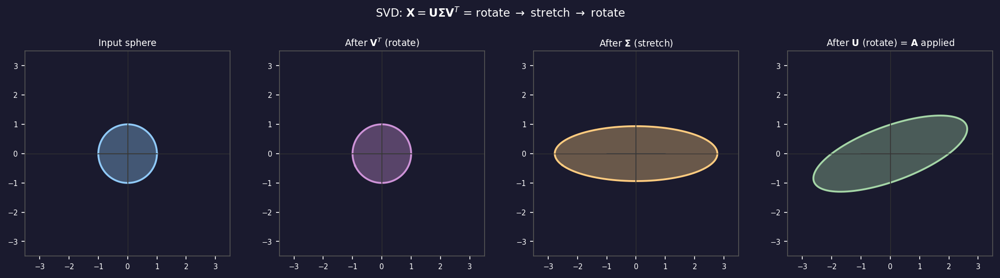{width="100%"}
:::
::: {.column width="40%"}
:::: {.incremental}
- Any matrix $\mathbf{X}$ (data matrix or otherwise) can be written as:
  $$\mathbf{X} = \mathbf{U} \boldsymbol{\Sigma} \mathbf{V}^T.$$
- **$\mathbf{V}$**: right singular vectors — input rotation (principal directions in feature space).
- **$\boldsymbol{\Sigma}$**: singular values on the diagonal — how much each direction is stretched.
- **$\mathbf{U}$**: left singular vectors — output rotation (scores in observation space).
::::
:::
:::

:::: {.notes}
- Walk through the four panels in the figure carefully: start with the unit circle (all possible unit-length inputs), apply $\mathbf{V}^T$ (rotate), then $\mathbf{\Sigma}$ (stretch along axes to form an ellipse), then $\mathbf{U}$ (rotate the ellipse). The result is the set of all possible output vectors when the input runs over the unit sphere.
- The one point to land: the singular values in $\boldsymbol{\Sigma}$ are the semi-axes of the output ellipse. A large singular value = a direction the matrix stretches strongly = a direction that carries a lot of information. A small singular value = a direction barely amplified = likely noise.
- Misconception to preempt: "SVD is just eigendecomposition." Similar idea, but SVD works on any matrix (including rectangular), while eigendecomposition only applies to square matrices. For PCA, the connection is: the right singular vectors of the centered data matrix $\mathbf{X}$ are the eigenvectors of the covariance matrix $\mathbf{X}^T\mathbf{X}/(N-1)$.
- EM anchor: for the EELS data matrix $\mathbf{X}$ (spectra × energy channels), the first singular value is proportional to the total signal strength; the corresponding left singular vector $\mathbf{u}_1$ shows how that signal varies across pixels; the right singular vector $\mathbf{v}_1$ shows the spectral shape of that variation.
- Forward link: the truncated SVD (keeping only the top $k$ singular values) is exactly the PCA denoising operation we will use in §6.
- Transition: "Let me make the SVD factors more concrete with their specific meanings."
::::

## SVD factors: what each part means

:::: {.incremental}
- $\mathbf{X} = \mathbf{U} \boldsymbol{\Sigma} \mathbf{V}^T$ for a data matrix $\mathbf{X} \in \mathbb{R}^{N \times D}$ (N spectra, D channels):
- **$\mathbf{V}$** ($D \times D$): columns are **eigenspectra** — the "spectral shapes" that make up the data.
- **$\boldsymbol{\Sigma}$** ($N \times D$, diagonal): singular values $\sigma_1 \geq \sigma_2 \geq \ldots \geq 0$ — the **importance** of each eigenspectrum.
- **$\mathbf{U}$** ($N \times N$): columns are **score maps** — how strongly each eigenspectrum is expressed at each pixel.
- **Compact notation:** $\mathbf{X} \approx \sum_{k=1}^{K} \sigma_k \, \mathbf{u}_k \mathbf{v}_k^T$ — a sum of $K$ rank-1 "spectral images."
::::

:::: {.notes}
- This is the interpretive slide for EM practitioners. Every quantity has a direct measurement meaning: eigenspectrum = a spectral shape (may resemble an edge minus a background); score map = a chemical map showing where that spectral shape is strong.
- The one point to land: each rank-1 term $\sigma_k \mathbf{u}_k \mathbf{v}_k^T$ is a "snapshot" of one spectral variation mode. The first few terms describe the dominant chemistry; the later terms describe noise fluctuations that look like random patterns in both the score map and the eigenspectrum.
- Misconception to preempt: "the first singular vector is the mean spectrum." No — PCA first centers the data (subtracts the mean spectrum), then finds the first singular vector of the centered data. The mean spectrum is removed before SVD. After centering, PC1 captures the largest *variation* around the mean, not the mean itself.
- EM anchor: Trebbia and Bonnet (1990) [@trebbia1990eels] introduced SVD/PCA analysis to EELS data. Their insight was exactly this: the first few singular vectors correspond to real chemical variations; the rest look like noise. This is now standard in hyperspy's PCA implementation.
- Forward link: the scree plot (next section) tells you how many rank-1 terms to keep — where the singular values drop from "signal-large" to "noise-small."
- Transition: "Before the scree plot: the full PCA recipe in two slides."
::::

## SVD and low-rank approximation (Eckart–Young)

:::: {.incremental}
- **Truncated SVD:** keep only the top $k$ singular values; set the rest to zero.
- **Result:** $\hat{\mathbf{X}}_k = \mathbf{U}_k \boldsymbol{\Sigma}_k \mathbf{V}_k^T$, where subscript $k$ means "first $k$ columns."
- **Optimality (Eckart–Young theorem):** $\hat{\mathbf{X}}_k$ is the best rank-$k$ approximation of $\mathbf{X}$ in the sense of minimising the Frobenius norm of the reconstruction error:
  $$\| \mathbf{X} - \hat{\mathbf{X}}_k \|_F = \sqrt{\sigma_{k+1}^2 + \sigma_{k+2}^2 + \cdots}.$$
- **Denoising:** if signal lives in rank-$k$ and noise spreads over all ranks, truncation removes noise.
- In Python: `U, s, Vt = np.linalg.svd(X, full_matrices=False)` — then zero out `s[k:]`.
::::

:::: {.notes}
- The Eckart–Young theorem is the one "theorem" worth naming here — it is the mathematical guarantee that makes PCA trustworthy for denoising. You do not need to prove it, but students should know it exists.
- The one point to land: the reconstruction error from truncating at rank $k$ is exactly computable from the discarded singular values. This is not an approximation — it is an exact formula. You can always compute how much information you throw away.
- Misconception to preempt: "truncating at rank $k$ removes only noise." It removes the directions with smallest singular values, which are *dominated* by noise if the signal is truly low-rank. But if a rare phase occupies only 1% of pixels, its singular value may be small — and truncation may discard it. Always check the residual.
- EM anchor: a synthetic EELS spectrum image constructed from two latent components plus Poisson noise has true rank 2. Its data matrix will have two large singular values (signal) and many small ones (noise floor). The exact reconstruction error from keeping only rank 2 is $\sqrt{\sum_{k>2} \sigma_k^2}$.
- Forward link: the scree plot is a visual display of the singular values. The elbow (where the curve transitions from steeply decreasing to flat) marks the boundary between signal and noise.
- Transition: "Now PCA — putting the geometric pieces together."
::::

<!-- ===== §4. PCA = directions of max variance ===== -->

## PCA: directions of maximum variance

:::: {.incremental}
- **PCA** finds the orthonormal directions $\mathbf{v}_1, \mathbf{v}_2, \ldots$ that maximise the **variance of the projected data**.
- Mathematically: PC1 maximises $\text{Var}(\mathbf{X}\mathbf{v})$ subject to $\|\mathbf{v}\|=1$.
- Solution: $\mathbf{v}_1$ is the **first right singular vector** of the centered data matrix.
- PC2 maximises variance subject to $\mathbf{v}_2 \perp \mathbf{v}_1$ — and so on.
- **Equivalently:** PCA diagonalises the covariance matrix $\mathbf{S} = \frac{1}{N-1}\mathbf{X}^T\mathbf{X}$ (after centering).
- The eigenvalues $\lambda_k = \sigma_k^2/(N-1)$ are the variances along each principal component.
::::

:::: {.notes}
- Connect back to the data-cloud figure from earlier. The long axis of the ellipse is PC1 (maximum spread = maximum variance). The short axis is PC2. SVD finds both simultaneously, plus all higher PCs.
- The one point to land: "PCA = SVD of the centered data matrix." The centering step is crucial — without it, the first singular vector just points toward the mean spectrum, which is not interesting.
- Misconception to preempt: "PCA maximises variance so it always finds the most physically meaningful directions." Maximum variance means maximum spread across samples. If the dominant variation is an instrumental artefact (beam drift, brightness drift), PC1 will capture that, not the chemistry. Always interpret PCs in the context of what causes spectral variation in your experiment.
- EM anchor: in EELS of a two-phase steel sample, PC1 typically captures the global intensity variation (due to sample thickness) and PC2 captures the chemical contrast between phases — because the chemical variation is the second-largest source of spectral change after thickness.
- Forward link: the scree plot shows the eigenvalues $\lambda_k$ (or equivalently the singular values $\sigma_k$) in decreasing order. The drop from signal-eigenvalues to noise-eigenvalues is the elbow. We read that next.
- Transition: "Scores and loadings are the outputs of PCA — let me name them precisely."
::::

## Scores and loadings: PCA outputs in EM

:::: {.incremental}
- After centering $\mathbf{X}$ (subtract mean spectrum): $\tilde{\mathbf{X}} = \mathbf{X} - \bar{\mathbf{x}}\mathbf{1}^T$.
- **Loadings (eigenspectra):** rows of $\mathbf{V}^T$ — the spectral shapes of each PC. Shape: ($K \times D$).
- **Scores:** $\mathbf{C} = \tilde{\mathbf{X}} \mathbf{V}_K$ — how strongly each PC is expressed at each pixel. Shape: ($N \times K$).
- Reshape scores back to (ny, nx, K) → **score maps** (chemical images).
- Reshape loadings to (K, D) → **eigenspectra** (spectral shapes).
- **Reconstruction with $k$ components:** $\hat{\mathbf{X}} = \bar{\mathbf{x}}\mathbf{1}^T + \mathbf{C}\mathbf{V}_K^T$.
::::

:::: {.notes}
- Walk through the full pipeline on the board: (1) form data matrix (N×D); (2) subtract mean; (3) call `np.linalg.svd`; (4) take first K columns of $\mathbf{V}$ as loadings; (5) project: scores = centered_data @ loadings; (6) reshape scores to image shape; (7) to denoise: reconstruct = mean + scores @ loadings.T. That is the entire algorithm — 7 steps, no black box.
- The one point to land: scores = "where is each PC strong?" (chemical map). Loadings = "what does each PC look like spectrally?" (spectral shape). Together they give a complete interpretation.
- Misconception to preempt: "I need to use a PCA library." You can, and you should for large data (sklearn's `IncrementalPCA`). But understanding that PCA is just SVD of the centered matrix means you can always fall back to `np.linalg.svd` and build it from scratch — which you will do in the notebook.
- EM anchor: in the notebook, students will build exactly this pipeline on a synthetic EELS line scan. The score maps will clearly show chemical variation; the eigenspectra will show recognisable spectral shapes (an edge profile for PC1, a difference spectrum for PC2).
- Forward link: the scree plot (next section) tells you which K to use before you compute the scores and loadings.
- Transition: "How do you pick K? The scree plot is your guide."
::::

## PCA step by step: the algorithm

:::: {.incremental}
1. **Form the data matrix:** reshape spectral image to $(N, D)$ — $N$ pixels, $D$ energy channels.
2. **Center:** subtract the mean spectrum $\bar{\mathbf{x}}$ from each row.
3. **SVD:** `U, s, Vt = np.linalg.svd(X_centered, full_matrices=False)`.
4. **Choose $k$** from the scree plot (next section).
5. **Scores:** `C = X_centered @ Vt[:k].T` — shape $(N, k)$.
6. **Reconstruct:** `X_hat = mean + C @ Vt[:k]` — shape $(N, D)$.
7. **Reshape** back to $(n_y, n_x, D)$ for display.
::::

:::: {.notes}
- This slide bridges theory to practice. Go through each step with the EELS example shapes: (4096, 1024) data matrix → center → SVD → choose k=3 → scores (4096, 3) → reconstruct (4096, 1024) → reshape to (64, 64, 1024).
- The one point to land: the entire PCA denoising pipeline is seven lines of NumPy. There is no magic. Each line maps to a geometric operation we already understand.
- Misconception to preempt: "I should use sklearn PCA because it is faster." For small data, `np.linalg.svd` is fine and perfectly transparent. For large EELS datasets (millions of spectra), `sklearn.decomposition.IncrementalPCA` processes data in chunks. The math is identical.
- EM anchor: hyperspy's `s.decomposition(algorithm='svd')` does exactly these seven steps internally. Understanding the steps means you can interpret hyperspy's output and troubleshoot unexpected PCs.
- Forward link: the notebook asks students to implement steps 1–7 from scratch on a synthetic EELS stack, then compare with `sklearn.decomposition.PCA`. Both should give identical results.
- Transition: "Now the critical question: how many components do we keep? The scree plot answers this."
::::

## PCA in five lines of NumPy

```python
import numpy as np

# ✅ CORRECT full pipeline — copy this version
mean_spectrum = X.mean(axis=0)                                 # (D,) mean of original data
X_centered    = X - mean_spectrum                              # center before SVD
U, s, Vt      = np.linalg.svd(X_centered, full_matrices=False) # core computation
K = 3                                                          # chosen from scree plot

# Scores (chemical maps): how strongly each PC is expressed per pixel
scores       = X_centered @ Vt[:K].T        # shape (N, K)

# Eigenspectra (spectral shapes): rows of Vt[:K], shape (K, D)
eigenspectra = Vt[:K]                       # already unit-norm and orthogonal

# Reconstruct (denoise): restore mean to get back to original scale
X_denoised   = scores @ eigenspectra + mean_spectrum  # shape (N, D)
```

:::: {.notes}
- Walk through each line carefully. Students who did the Week 1 notebook will recognise the array operations. The only new call is `np.linalg.svd`.
- The one point to land: the entire PCA pipeline — center, SVD, choose K, reconstruct — is five lines of NumPy. Every line corresponds to a geometric operation from the slides. There is no black box.
- Misconception to preempt: "I forgot to add the mean back in the reconstruction." This is the most common error. The SVD was computed on the centered data; the reconstruction is in centered space. To get back to the original scale, you must add the mean spectrum to every reconstructed row. Forgetting this gives systematically wrong intensities.
- Common mistake students make: writing `X_denoised = scores @ eigenspectra + X_centered.mean(axis=0)` — this uses the mean of the already-centered data (which is ≈ zero), so the mean is NOT restored and every reconstructed spectrum will have systematically wrong absolute intensities. Always save `mean_spectrum = X.mean(axis=0)` from the **original** un-centered data before centering.
- EM anchor: hyperspy does this automatically — `s.decomposition()` stores the mean internally and adds it back in `s.get_decomposition_model()`. Understanding why this step exists means you can implement it outside hyperspy.
- Forward link: the notebook in Part 4 uses exactly this code pattern. Students who type it themselves (rather than just running it) will own the pattern.
- Transition: "Before running PCA, we need to know how many components to keep. The scree plot is the guide."
::::

<!-- ===== §5. Scree plot ===== -->

## The scree plot: how many components to keep?

::: {.columns}
::: {.column width="55%"}
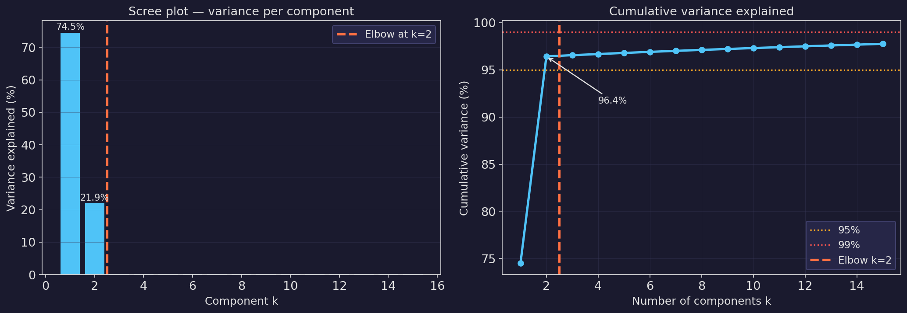{width="100%"}
:::
::: {.column width="45%"}
:::: {.incremental}
- Plot the **variance explained** $\lambda_k / \sum_k \lambda_k$ (or $\sigma_k^2$) for each component.
- **Signal** components: steeply decreasing — each one captures a large portion of variance.
- **Noise** components: flat floor — all roughly equal variance (noise is isotropic).
- **Elbow rule:** keep components before the curve flattens.
- **Cumulative variance:** keep the smallest $K$ such that $\geq 95\%$ (or $\geq 99\%$) of variance is explained.
::::
:::
:::

:::: {.notes}
- Walk through the figure in detail. The two left bars (k=1 and k=2) are clearly taller than the rest — PC1 captures ~74.5% of variance, PC2 captures ~21.9%, and from k=3 onwards the bars are nearly equal height (the noise floor at ~0.1% each). The elbow is sharply between k=2 and k=3. Cumulative variance reaches ~96% at k=2.
- The one point to land: the noise floor is approximately flat because Poisson noise is isotropic — it adds equal variance in every direction. Signal, by contrast, is structured and anisotropic — it clusters into a few directions. The elbow is where this transition happens.
- Misconception to preempt: "the elbow is always obvious." For real data with many phases, the elbow can be gradual. In that case, inspect the eigenspectra and score maps for PCs near the elbow — if they look like recognizable spectral features, keep them; if they look like random noise, drop them. The scree plot is a starting point, not a definitive answer.
- EM anchor: for a realistic EELS dataset from a multi-phase oxide with 5 distinct Fe/Cr/Ni environments, the elbow might be at k=6–8, not k=2. Rule of thumb: intrinsic dimensionality ≈ number of distinct chemical environments + 1–2 background components.
- Forward link: the notebook exercise asks students to construct the scree plot for their synthetic EELS stack and justify their choice of k from it. The assert in the notebook checks that choosing the correct k gives lower reconstruction error than an underfitted k=1 model.
- Transition: "The elbow tells you where to cut. Let me show you what truncation does to the data."
::::

## Interpreting the scree plot: signal vs noise

:::: {.incremental}
- **Above the elbow:** components with large $\sigma_k$ — their eigenspectrum has recognisable physical structure (peaks, edges, background shapes).
- **Below the elbow:** components with small $\sigma_k$ — their eigenspectrum looks like random oscillations; score map looks like spatially uncorrelated noise.
- **Practical check:** always inspect the eigenspectrum and score map of the last component you keep and the first one you discard.
- **Variance explained by noise floor:** for $N$ spectra with $D$ channels, the noise captures roughly $N \cdot D \cdot \sigma_n^2$ total variance. If the noise floor variance per component is uniform, each noise PC explains $\approx \sigma_n^2$.
- **90%/95%/99%:** common thresholds — for EELS denoising, 95% is a reasonable starting point.
::::

:::: {.notes}
- The visual inspection check is the most important practical point. Tell students: before trusting a PCA denoising result, always display PC_k_signal (last kept) and PC_(k+1)_noise (first discarded). The former should look like a smooth spectral shape; the latter should look like noise.
- The one point to land: the scree plot is not a black-box oracle — it is a diagnostic. The elbow is a starting point; physical interpretation of the PCs is the final check.
- Misconception to preempt: "keeping 95% of variance is always enough." This is true for global denoising but not for rare-phase discovery. If a minor phase accounts for only 0.5% of the sample area, its contribution may fall below the 95% threshold. PCA denoising might erase it entirely. Always inspect the residual.
- EM anchor: a commonly encountered case in STEM-EELS is radiation damage: a beam-induced change in one small region creates a new "phase" with a distinct spectrum. Its singular value may be small (because only a few pixels are damaged) but physically critical. PCA denoising would suppress it.
- Forward link: the denoising demonstration (next section) shows quantitatively how reconstruction error decreases with k and plateaus at the noise floor.
- Transition: "Let's see PCA denoising in action on the synthetic EELS stack."
::::

## Choosing K: the 95% rule and parallel analysis

:::: {.incremental}
- **95% cumulative variance rule:** keep the smallest $K$ such that $\sum_{k=1}^K \lambda_k / \sum_k \lambda_k \geq 0.95$.
- **Parallel analysis (Horn's test):** compare eigenvalues against those from random data with the same shape.
  - Components with $\lambda_k >$ random $\lambda_k$ are signal; the rest are noise.
  - More principled than the elbow rule but computationally heavier.
- **Physical prior:** if you know the sample has 3 phases + a background model → try $K = 4$.
- **Practice:** use the scree plot as a first pass, then inspect eigenspectra near the boundary.
- There is no universally correct $K$ — it depends on the science question.
::::

:::: {.notes}
- Introduce parallel analysis as a more rigorous alternative without going deep — students should know it exists. The key comparison: parallel analysis replaces the subjective elbow with a statistical threshold (is this eigenvalue larger than what random noise would produce?).
- The one point to land: the "right" K depends on the scientific question. For compression, use 95% variance. For denoising before clustering, use a larger K that includes weak components. For rare-phase detection, keep more components and look at residuals.
- Misconception to preempt: "there is a single correct K that the algorithm should find automatically." No algorithm can determine K without some criterion; different criteria answer different questions. The criterion is a scientific choice, not a mathematical one.
- EM anchor: in 4D-STEM grain orientation mapping, K might be 10–15 to capture major grain families plus twin variants; in EELS of a simple binary oxide, K=2–4 usually suffices.
- Forward link: the notebook exercise is specifically about justifying K from the scree plot. The assert checks that a reasonable K gives a meaningful reduction in reconstruction error compared to noise-dominated high-K reconstructions.
- Transition: "Now let's see what truncation actually does to the spectra."
::::

<!-- ===== §6. PCA denoising of EELS by truncation ===== -->

## PCA denoising of EELS: the experiment

::: {.columns}
::: {.column width="55%"}
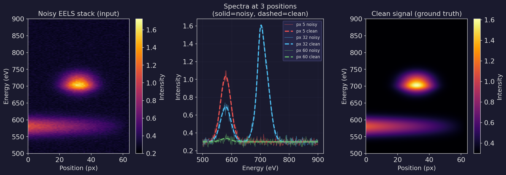{width="100%"}
:::
::: {.column width="45%"}
:::: {.incremental}
- **Setup:** 64-pixel × 300-channel synthetic EELS line scan.
- **Two latent components:** Fe-L edge (~710 eV) dominant in the centre; Cr-L edge (~580 eV) dominant at the edges.
- **Noise:** Poisson (scale = 500 counts); realistic low-dose EM conditions.
- **Goal:** recover the clean spectra from the noisy stack using PCA truncation.
- **Signal is low-rank!** Only 2 true latent components → data matrix has rank ≤ 2.
::::
:::
:::

:::: {.notes}
- Walk through the figure: the colour map shows intensity as a function of position (x-axis) and energy (y-axis). You can see the Fe edge (bright band around 710 eV) centred in the middle of the scan, and the Cr edge (around 580 eV) brighter at the edges. The noisy spectra look jagged; the clean dashed lines are smooth.
- The one point to land: this synthetic dataset is designed to mimic a real grain-boundary line scan in a steel sample where Fe and Cr vary spatially. The number of true components (K=2) is known, which lets us validate the denoising result against ground truth.
- Misconception to preempt: "I would need a real EELS dataset to learn PCA." The synthetic dataset is specifically designed so that the results are easy to interpret and the ground truth is known. Real EELS PCA works identically — we just cannot check against ground truth.
- EM anchor: Bosman et al. (2006) showed that multivariate analysis (PCA) of EELS spectrum images recovers both chemical and bonding (ELNES) information from noisy maps [@bosman2006eels]. The same approach is now routine in any EELS mapping experiment.
- Forward link: the notebook builds exactly this synthetic EELS stack and then walks through the PCA denoising pipeline step by step, ending with an exercise asking students to justify K from the scree plot.
- Transition: "Now let's run PCA and see what k components give what quality of reconstruction."
::::

## PCA denoising: reconstruction with k components

::: {.columns}
::: {.column width="60%"}
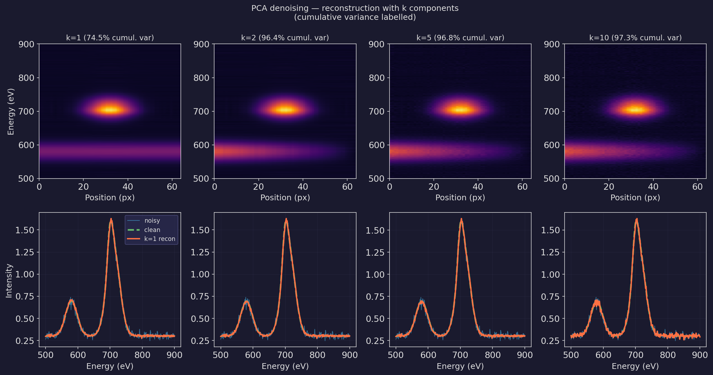{width="100%"}
:::
::: {.column width="40%"}
:::: {.incremental}
- **k = 1:** over-denoised — missing the Cr component; systematic error.
- **k = 2:** near-perfect — recovers both chemical components; smooth and accurate.
- **k = 5:** slightly under-denoised — residual noise from 3 noise components added back in.
- **k = 10:** significantly under-denoised — many noise components included.
- **Optimal k = 2** matches the scree-plot elbow. Not coincidence — the elbow marks where truncation switches from "removing noise" to "adding noise."
::::
:::
:::

:::: {.notes}
- This is the payoff slide — walk through each panel carefully. The k=2 reconstruction looks clean and closely tracks the ground truth (green dashed). The k=1 reconstruction is smooth but missing the Cr edge entirely (systematic error = too much truncation). k=5 and k=10 are noisier because we included noise components.
- The one point to land: there is an optimal K. Below the optimal K, you have underfitting (losing real signal). Above the optimal K, you have overfitting (including noise). The scree plot elbow is the visual signal of where the optimum lives.
- Misconception to preempt: "more components = better reconstruction." No — adding noise-floor components adds their random variation to the reconstruction, degrading it. The reconstruction error vs k plot is U-shaped: decreases to the optimal K, then increases again as noise components are added.
- EM anchor: in hyperspy, after `s.decomposition()`, the function `s.plot_decomposition_results()` shows the same comparison. Students can now interpret every panel of that output.
- Forward link: the notebook assert checks that the reconstruction error at k=2 is lower than at k=1 (underfitting) and that adding more components beyond the signal rank increases the error again.
- Transition: "The eigenspectra themselves carry chemical information. Let me show you what they look like."
::::

## Why PCA denoising works: the subspace argument

:::: {.incremental}
- **Signal is low-rank:** if the spectrum image has $K$ true chemical components, the clean data lies on a $K$-dimensional subspace of $\mathbb{R}^D$.
- **Noise is full-rank:** Poisson noise adds variance in every direction equally — it spreads across all $D$ dimensions.
- **After SVD:** the top $K$ singular vectors capture the signal subspace; the remaining $D - K$ directions are dominated by noise.
- **Truncation:** project onto the signal subspace (keep top $K$), discard the orthogonal complement (noise).
- **Caveat:** this argument assumes Gaussian noise (noise is isotropic). Poisson noise has signal-dependent variance, so the noise floor is not perfectly flat — PCA denoising is slightly suboptimal for Poisson statistics.
::::

:::: {.notes}
- This is the conceptual explanation that ties the geometry of §2–3 to the practical denoising result. The key phrase is "low-rank signal + full-rank noise."
- The one point to land: PCA denoising is not magic — it is projection onto the signal subspace. It works because the signal is structured (low-dimensional) while the noise is unstructured (spread over all dimensions). If the signal were also spread over many dimensions, PCA would not help.
- Misconception to preempt: "PCA denoising is the best possible denoising method." For Gaussian noise, yes (it is optimal in the Eckart–Young sense). For Poisson noise (real EELS), it is approximately optimal for high counts but suboptimal at low counts where the noise variance varies across energy channels. Anscombe transform or Poisson-matched methods can improve on it.
- EM anchor: this is why PCA denoising is so powerful for EELS: EELS spectra from a sample with $K$ phases lie in a $K$-dimensional subspace regardless of how many energy channels are recorded. The "true dimensionality" is set by the chemistry, not the spectrometer resolution.
- Forward link: Week 9 (autoencoders) removes the "linearity" assumption — autoencoders can find non-linear low-dimensional structure, useful when phase boundaries curve the data manifold rather than keep it flat.
- Transition: "The eigenspectra extracted by PCA are physically interpretable. Let me show you."
::::

<!-- ===== §7. Eigen-spectra / eigen-micrographs ===== -->

## Eigen-spectra: the spectral shapes of variation

::: {.columns}
::: {.column width="60%"}
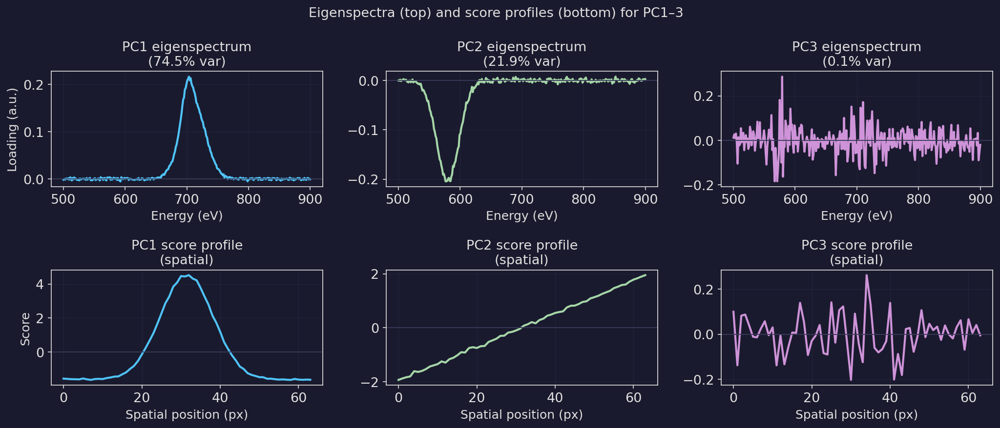{width="100%"}
:::
::: {.column width="40%"}
:::: {.incremental}
- **PC1 eigenspectrum:** the direction of maximum variance — here dominated by the Fe-L edge shape.
- **PC2 eigenspectrum:** second direction — captures Cr-L contrast (positive Cr-L, negative Fe-L background).
- **PC3+ eigenspectrum:** no recognisable peaks — random noise pattern.
- Note: eigenspectra can have negative values (they are basis vectors, not physical spectra).
- Physical spectra are reconstructed as: $\hat{\mathbf{x}}_i = \bar{\mathbf{x}} + c_{i1}\mathbf{v}_1 + c_{i2}\mathbf{v}_2$.
::::
:::
:::

:::: {.notes}
- Walk through each panel: PC1 has a clear peak around 710 eV (Fe-L$_{2,3}$) — this is the dominant spectral variation across the scan. PC2 has a peak around 580 eV (Cr-L) with an anticorrelation at 710 eV — this is the Cr-vs-Fe chemical contrast. PC3 shows no recognisable structure — it is noise.
- The one point to land: eigenspectra that look like recognisable spectral features (edges, peaks) are signal; those that look like random oscillations are noise. Physical interpretation is part of the analysis.
- Misconception to preempt: "PC1 should look like the average Fe-L spectrum." No — PC1 is a basis vector for the *variation*, not the mean. The mean spectrum is removed before PCA. PC1 looks like the spectral shape that varies most across pixels — which in this case is the Fe-L edge because Fe concentration varies most across the scan.
- EM anchor: in a real multi-element STEM-EELS experiment, the eigenspectra often resemble difference spectra between phases (oxide minus metal, high-Fe minus low-Fe). They are not directly interpretable as elemental compositions but can be rotated (e.g., with Varimax rotation) to get closer to physical end-members.
- Forward link: in Week 9, autoencoders replace the eigenspectra with learned non-linear features — but the same physical interpretation goal applies: what material variation does each latent feature capture?
- Transition: "Eigen-micrographs (score maps) complete the picture — but first: why do correlated features cause problems?"
::::

## Score maps: chemical images from PCA

:::: {.incremental}
- The **score** $c_{ik} = \mathbf{v}_k^T (\mathbf{x}_i - \bar{\mathbf{x}})$ tells how strongly pixel $i$ expresses PC $k$.
- Reshape scores to $(n_y, n_x)$ → a **score map** — a chemical image of the sample.
- **In our EELS example:** the PC1 score map shows high values (bright) where the Fe-L contribution is strong → Fe-rich region map.
- Score maps can be positive or negative (unlike elemental maps which must be ≥ 0).
- To get a physically interpretable elemental map: linear unmixing of score maps using known reference spectra.
- **Eigen-micrographs** (score maps reshaped to 2-D) are the EM equivalent of eigenfaces in face recognition.
::::

:::: {.notes}
- Connect to the 4D-STEM analogy: in 4D-STEM, applying PCA to the diffraction patterns (one per probe position) gives score maps that correspond to grain orientation contrast — bright regions in the PC1 score map are grains oriented strongly along PC1's diffraction direction. This is the basis of automated grain mapping without manual labelling.
- The one point to land: score maps are the spatial output of PCA and directly give chemical/structural contrast. They are cheap to compute once the eigenspectra are known (just one matrix multiply).
- Misconception to preempt: "I need NMF to get physical elemental maps." NMF gives non-negative maps (closer to physical concentrations) but at the cost of uniqueness (NMF solutions are not unique) and optimality (NMF is not the best rank-k approximation). PCA + linear unmixing is often more reliable.
- EM anchor: in hyperspy, `s.get_decomposition_factors()` gives the eigenspectra and `s.get_decomposition_loadings()` gives the score maps (called "loadings" in hyperspy's convention). Students who understand the relationship score = projection will never be confused by this naming.
- Forward link: the notebook visualises the score maps for the synthetic EELS stack. Students should see the Fe-rich vs Cr-rich regions clearly delineated in the PC1 and PC2 score maps.
- Transition: "Score maps and eigenspectra come straight out of the SVD — but only if the data going in are clean. Before we unmix anything: preprocessing."
::::

<!-- ===== §8. EELS preprocessing pipeline ===== -->

## Before any decomposition: the EELS preprocessing chain

:::: {.incremental}
1. **Energy alignment:** register every spectrum to the zero-loss peak (or a known edge onset). Drift of a fraction of an eV is enough to create fake components.
2. **Spike / X-ray removal:** cosmic-ray and hot-pixel spikes are rank-one outliers, and PCA will happily fit them.
3. **Background subtraction:** a power law $A E^{-r}$ fitted in a pre-edge window, then extrapolated under the edge [@egerton2011eels].
4. **Normalisation:** divide by the zero-loss or total intensity (thickness / beam-current changes). Note that this *changes the noise model*.
5. **Poisson weighting:** scale the counts so that every entry has roughly unit noise variance.
6. **Only now:** PCA (denoise, choose $K$) → NMF / MCR (interpret).
::::

:::: {.notes}
- This slide is the "garbage in dominates everything" slide of the week. Every decomposition method today is a matrix factorisation, and none of them can tell a physical component from a processing artefact.
- The one point to land: the order matters. Align before you decompose, weight before you do PCA, and always remember what each normalisation does to the noise statistics. Normalising by total counts makes the entries no longer Poisson-distributed, so weights must be computed on the raw counts.
- Misconception to preempt: "HyperSpy does all of this automatically." `s.decomposition(normalize_poissonian_noise=True)` does the weighting, but alignment (`align_zero_loss_peak`), spike removal and background choices are your decisions, and they must be recorded in the metadata (Week 2 FAIR checklist).
- EM anchor: for core-loss EELS the edge of interest can be a few percent of the local background intensity. A 2–3% background error then dominates the extracted signal.
- NMF-specific note: after background subtraction the pre-edge region fluctuates around zero, so small negative values appear. Either clip at zero (biased), fit NMF on the raw spectra and let one component absorb the background, or model the background explicitly (the physics-guided route).
- Forward link: Week 8 ("physics decides augmentation") and Week 12 ("forward model decides inverse method") continue this theme. The measurement chain dictates the processing.
- Transition: "Let's look at the two steps that most often go wrong: background and alignment."
::::

## Power-law background and energy alignment

{width="100%"}

:::: {.incremental}
- **Background:** $\log I = \log A - r \log E$ is a *linear* least-squares fit (projection again!). Typically $r\approx 2$–$6$. The fit window must be edge-free and close to the onset.
- **Alignment:** a rigid shift $\delta$ adds $\delta\cdot dI/dE$ to the spectrum (Taylor expansion). A derivative-shaped loading is therefore the fingerprint of misalignment, not of chemistry.
::::

:::: {.notes}
- Walk through the three panels left to right. Panel 1 is on a log scale: the background falls by an order of magnitude across the window, and the edges sit on top of it. Panel 2 shows that the subtracted spectrum agrees with the true edges, but only because the window was chosen sensibly. Panel 3 is the most important diagnostic of the week.
- The one point to land: a first-order Taylor expansion, $I(E-\delta)\approx I(E)-\delta\,I'(E)$, shows that random energy shifts add a component proportional to the derivative. PCA finds that component immediately and often ranks it as PC1 or PC2. If an eigenspectrum looks like a peak derivative (a positive lobe followed by a negative lobe), suspect drift before chemistry.
- Misconception to preempt: "the background fit is a detail." At low dose the power-law fit is itself dominated by Poisson noise, and a noisy background becomes a *systematic* error in every extracted edge. Cueva et al. address this with linear combinations of power laws and local background averaging, i.e. borrowing background counts from spectrally similar neighbours [@cueva2012eels].
- EM anchor: in HyperSpy, `s.remove_background(signal_range=(400., 445.), background_type='PowerLaw')` does panels 1 and 2. `s.align_zero_loss_peak()` handles the low-loss alignment, and core-loss SIs can be shifted with the ZLP shifts from a simultaneous dual-EELS acquisition.
- Forward link: the "fit a power law in log-log space" step is exactly linear regression in transformed variables. Week 4 formalises it.
- Transition: "The last preprocessing step, weighting, is the one that decides what PCA considers signal."
::::

## Poisson weighting before PCA

::: {.columns}
::: {.column width="55%"}
{width="100%"}
:::
::: {.column width="45%"}
:::: {.incremental}
- Poisson counts: $\operatorname{Var}[x_{ij}] = \mathbb{E}[x_{ij}]$. Bright channels and thick pixels dominate the variance.
- PCA = least squares, so it implicitly assumes **equal-variance Gaussian noise** (Week 2!).
- **Weighting** [@keenan2004poisson]: $\tilde{\mathbf{X}} = \mathbf{G}^{-1/2}\,\mathbf{X}\,\mathbf{H}^{-1/2}$, with $\mathbf{G}$ = diagonal of pixel totals and $\mathbf{H}$ = diagonal of the mean spectrum.
- After weighting, the noise is ≈ isotropic, the noise floor is flat, and the scree elbow becomes readable.
- Un-weight the reconstruction afterwards: $\hat{\mathbf{X}} = \mathbf{G}^{1/2}\hat{\tilde{\mathbf{X}}}\mathbf{H}^{1/2}$.
::::
:::
:::

:::: {.notes}
- This is where Week 2's lesson "the noise model decides the loss" returns. PCA minimises the Frobenius norm, which is the Gaussian negative log-likelihood with one shared variance. With Poisson data, high-count channels (the plasmon tail, the pre-edge background) carry more absolute variance, and PCA spends its components describing them.
- The one point to land: weighting changes *which subspace is top-K*. It is not cosmetic, because it decides whether a weak edge survives truncation. Compare the PC2/PC3 ratios printed in the two panels.
- Misconception to preempt: "I will just use the Anscombe transform." That is a valid alternative (the VST from Week 2). It works per entry and does not need a rank-one model of the mean. Keenan–Kotula weighting assumes the mean matrix is approximately rank one (pixel total × mean spectrum), which is a good approximation for most spectrum images.
- EM anchor: HyperSpy's `normalize_poissonian_noise=True` implements exactly this scaling. Bosman et al. showed that weighted PCA recovers ELNES bonding information that unweighted PCA loses [@bosman2006eels].
- Forward link: the NMF version of the same idea is to replace the Frobenius loss with the Poisson (KL) divergence. It comes in a few slides.
- Transition: "What does this look like on real EDS maps?"
::::

## Weighting and truncation in practice

::: {.columns}
::: {.column width="45%"}
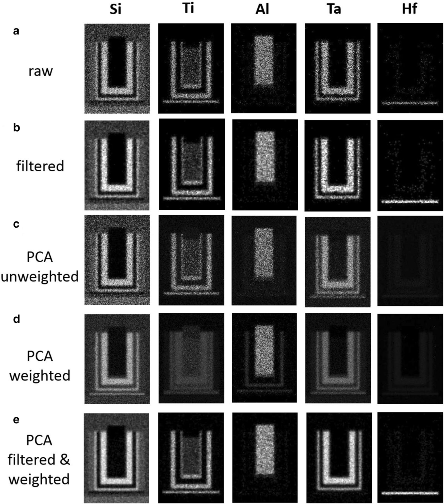{width="100%"}
:::
::: {.column width="55%"}
:::: {.incremental}
- EDS counts are even sparser than EELS counts (often < 1 count per channel per pixel). Without weighting, PCA mainly models the bremsstrahlung.
- **Potapov & Lubk** derive the optimal truncation rank from the noise statistics. It beats eyeballing the scree elbow [@potapov2019pca].
- **Recipe:** weight → PCA → choose $K$ where the eigenvalues leave the noise floor (flat after weighting) → reconstruct → un-weight.
- **Record** weighting, $K$ and the software version. Otherwise the map is not reproducible (Week 2 FAIR).
::::
:::
:::

:::: {.notes}
- Walk down the columns of the figure: the unweighted PCA row still shows noise-like texture in the minority elements, while the weighted row is clean. The difference comes entirely from the scaling step, since the algorithm is otherwise identical.
- The one point to land: "denoise with PCA" is not one method. It is a family of choices (weighting, K, spatial pre-filtering), and each choice changes the result. Report them.
- Misconception to preempt: "a fixed rule like keep 5 components is fine for all samples." A facility-wide fixed K can discard a dilute dopant on one sample and keep noise on another. K is a per-dataset decision.
- EM anchor: this paper is the standard reference for anyone doing PCA on STEM-EDS maps. Students who do the spectral miniproject should read its method section.
- Transition: "PCA has now given us a clean subspace. But its components are signed, orthogonal mixtures. How do we get phases?"
::::

<!-- ===== §9. Spectral unmixing: NMF, MCR-ALS, endmembers ===== -->

## The linear mixing model

::: {.columns}
::: {.column width="50%"}
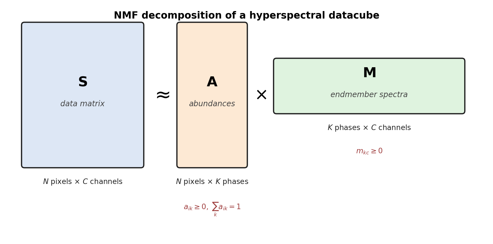{width="100%"}
:::
::: {.column width="50%"}
:::: {.incremental}
- Each pixel is a **mixture of pure phases** (endmembers):
  $$\mathbf{x}_i = \sum_{k=1}^{K} a_{ik}\,\mathbf{m}_k + \boldsymbol{\varepsilon}_i,\quad a_{ik}\ge 0,\ \textstyle\sum_k a_{ik}=1$$
- Matrix form: $\mathbf{X} \approx \mathbf{A}\mathbf{M}$ with $\mathbf{A}\in\mathbb{R}_{\ge0}^{N\times K}$ (abundance maps) and $\mathbf{M}\in\mathbb{R}_{\ge0}^{K\times D}$ (endmember spectra).
- **Same shape as PCA** ($\mathbf{X}\approx\mathbf{T}\mathbf{V}^T$), but with **different constraints**: non-negativity (+ sum-to-one) instead of orthogonality.
- Physically justified when the signal is **additive**: thin specimens, no strong multiple scattering or absorption.
::::
:::
:::

:::: {.notes}
- This slide reframes the whole week. PCA and unmixing are both rank-K factorisations of the same data matrix, and the difference lies entirely in the constraints. PCA asks for orthonormal loadings ordered by variance. Unmixing asks for spectra and abundances that could physically exist.
- The one point to land: a pixel on a phase boundary genuinely contains both phases, and its spectrum is genuinely (approximately) a linear mixture. That is why unmixing is the right model for spectrum images, and why hard clustering (K-means) is wrong on mixed pixels.
- Misconception to preempt: "linear mixing always holds." It fails with multiple scattering (thick EELS samples: plural scattering convolves the spectrum), with EDS absorption/fluorescence in thick specimens, and with channelling. Deconvolve plural scattering (Fourier-log) first, or accept that the model is approximate.
- EM anchor: in EDS, the "endmembers" are phase spectra (including bremsstrahlung). In core-loss EELS after background removal, they are edge shapes including ELNES. In low-loss EELS, they are plasmon shapes.
- Notation: $\mathbf{A}$ here is the MFML $\mathbf{W}$ (activations), and $\mathbf{M}$ is $\mathbf{H}$ (basis). Different communities use different letters: HyperSpy calls $\mathbf{A}$ "loadings" and $\mathbf{M}$ "factors", which is the opposite of the PCA convention in many textbooks. Always check shapes.
- Transition: "If we already know the endmembers, the problem is easy."
::::

## Known endmembers: constrained least squares & the simplex

::: {.columns}
::: {.column width="45%"}
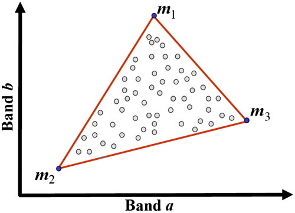{width="100%"}
:::
::: {.column width="55%"}
:::: {.incremental}
- **Known $\mathbf{M}$ (reference spectra):** solve per pixel $\min_{\mathbf{a}_i}\|\mathbf{x}_i-\mathbf{M}^T\mathbf{a}_i\|^2$. This is projection onto the span of the references (slide "Least squares = projection").
- Plain least squares can give **negative fractions**. Hence **NNLS** ($\mathbf{a}\ge0$) and **FCLS** (fully constrained: $\ge0$, sum to one).
- **Geometry:** with sum-to-one, the pixels lie in a $(K-1)$-dimensional **simplex**. The vertices are the pure phases, and mixed pixels sit inside.
- **Unknown $\mathbf{M}$, but pure pixels exist:** VCA / N-FINDR search for the vertices directly.
- **Unknown $\mathbf{M}$, no pure pixels:** we need a factorisation → NMF / MCR-ALS.
::::
:::
:::

:::: {.notes}
- Start with the easy case because it connects to the projection geometry from earlier today. Reference-spectrum fitting (e.g. HyperSpy's model fitting with reference components, or MLLS fitting in Gatan DigitalMicrograph) is just least squares with the references as columns.
- The one point to land: draw a triangle on the board. Mark the three corners as pure TiO₂, FeO and Ni. A pixel halfway along an edge is a 50/50 mixture of two phases. A pixel in the middle contains all three. The abundances are the barycentric coordinates. This picture carries all of the unmixing theory, including rotational ambiguity (next section).
- Misconception to preempt: "negative fractions mean the fit failed." They usually mean a missing endmember, a wrong background or misalignment. Check the residual before forcing non-negativity, because the constraint hides the symptom.
- EM anchor: Dobigeon & Brun (2012) applied Bayesian linear unmixing with exactly these simplex constraints to EELS spectrum images. They note that PCA/ICA struggle when abundances are statistically dependent, which is always the case under sum-to-one.
- Connection to the earlier PCA figure: after centering, data obeying sum-to-one lose one dimension. That is why a 3-phase mixture needs only 2 PCs (you will see PC3 = noise on the PCA-vs-NMF figure).
- Transition: "Now the real problem: we know neither the spectra nor the abundances."
::::

## Non-negative matrix factorisation (NMF)

:::: {.incremental}
- **Problem:** given $\mathbf{X}\ge0$, find $\mathbf{W}\in\mathbb{R}_{\ge0}^{N\times K}$ and $\mathbf{H}\in\mathbb{R}_{\ge0}^{K\times D}$ with
  $$\min_{\mathbf{W}\ge0,\,\mathbf{H}\ge0}\ \|\mathbf{X}-\mathbf{W}\mathbf{H}\|_F^2 \qquad\text{or}\qquad \min\ D_\text{KL}(\mathbf{X}\,\|\,\mathbf{W}\mathbf{H})$$
- **No subtraction allowed** → components can only *add up*. The result is a **parts-based** representation: peaks, edges, phases [@lee1999learning].
- **Frobenius loss** = Gaussian likelihood; **KL divergence** = **Poisson likelihood** (up to constants). For counts, the KL loss is the principled choice (Week 2 again).
- **Non-convex** in $(\mathbf{W},\mathbf{H})$ jointly, but convex in each factor separately → alternating optimisation. The result depends on initialisation.
- No orthogonality and no variance ordering: components are **not nested** (NMF with $K=3$ ≠ NMF with $K=2$ plus one component).
::::

:::: {.notes}
- Lee & Seung's 1999 Nature paper is the famous "parts of faces" result: NMF on face images gives noses, eyes and mouths as components, where PCA gives holistic eigenfaces. The reason is that without subtraction, no component can cancel another, so each must be a localised "part".
- The one point to land: the KL divergence $\sum_{ij} x_{ij}\log\frac{x_{ij}}{(\mathbf{WH})_{ij}} - x_{ij} + (\mathbf{WH})_{ij}$ equals, up to terms that do not depend on the model, the negative Poisson log-likelihood of $\mathbf{X}$ given the mean $\mathbf{WH}$. So "NMF with KL loss" is maximum-likelihood unmixing for count data, the direct analogue of Week 2's Poisson NLL.
- Misconception to preempt: "NMF components are the pure phase spectra." Only under additional conditions (pure pixels or pure channels, the so-called separability). In general NMF returns *one* of many valid factorisations. That is the rotational ambiguity pitfall later.
- Misconception 2: "choose K for NMF from its own reconstruction error." NMF error always decreases with K. Choose K from the (weighted) PCA scree plot first, then run NMF with that K. This is the standard PCA-then-NMF pipeline.
- EM anchor: HyperSpy exposes this as `s.decomposition(algorithm='NMF', output_dimension=3)` (sklearn backend) and `s.blind_source_separation()` for ICA-type rotations.
- Transition: "How is NMF actually computed? The multiplicative update is a two-line algorithm."
::::

## NMF by multiplicative updates

::: {.columns}
::: {.column width="52%"}
:::: {.incremental}
- **Lee–Seung updates** (Frobenius loss) [@lee2001nmf]:
  $$\mathbf{H} \leftarrow \mathbf{H}\odot\frac{\mathbf{W}^T\mathbf{X}}{\mathbf{W}^T\mathbf{W}\mathbf{H}},\qquad \mathbf{W} \leftarrow \mathbf{W}\odot\frac{\mathbf{X}\mathbf{H}^T}{\mathbf{W}\mathbf{H}\mathbf{H}^T}$$
  ($\odot$ and the fraction are element-wise).
- **Why it works:** it is gradient descent with a per-element step size chosen so that the negative part of the gradient cancels. Every factor is ≥ 0, so **non-negativity is preserved automatically**, with no projection step.
- The loss is **non-increasing** at every step (majorisation argument), but convergence can be slow and ends in a *local* minimum.
- KL version: $\mathbf{H}\leftarrow\mathbf{H}\odot\frac{\mathbf{W}^T(\mathbf{X}/\mathbf{WH})}{\mathbf{W}^T\mathbf{1}}$, the Poisson-ML update.
::::
:::
::: {.column width="48%"}
```python
from sklearn.decomposition import NMF

X = si.reshape(-1, n_channels)        # (N, D), counts >= 0
nmf = NMF(n_components=3,
          init="nndsvda",             # SVD-based init
          beta_loss="kullback-leibler",   # Poisson
          solver="mu",                # multiplicative
          max_iter=1000, random_state=0)
W = nmf.fit_transform(X)              # (N, K) abundances
H = nmf.components_                   # (K, D) spectra
maps = W.reshape(ny, nx, 3)
```
:::
:::

:::: {.notes}
- Derivation sketch for the board: the gradient of $\frac12\|\mathbf{X}-\mathbf{WH}\|^2$ with respect to $\mathbf{H}$ is $\mathbf{W}^T\mathbf{WH}-\mathbf{W}^T\mathbf{X}$, i.e. a positive part minus a negative part. Take a gradient step with element-wise step size $\eta_{kj} = H_{kj}/(\mathbf{W}^T\mathbf{WH})_{kj}$ and the update collapses to $H_{kj}\cdot(\mathbf{W}^T\mathbf{X})_{kj}/(\mathbf{W}^T\mathbf{WH})_{kj}$. That is a *multiplicative* update, and since all terms are non-negative, $\mathbf{H}$ stays non-negative.
- The one point to land: the algorithm is a special case of the gradient descent students will meet properly in Week 4, with a clever learning rate $\eta$. It is the first "learning algorithm" of the course that they can write by hand in five lines (the notebook does exactly this).
- Misconception to preempt: "multiplicative updates are the best solver." They are simple and robust but slow. Coordinate descent (sklearn's default `solver='cd'`) or HALS converge faster for the Frobenius loss. For the KL loss, `mu` is the standard sklearn option.
- Practical warning: a zero entry stays zero forever under multiplicative updates. Initialise with strictly positive values (NNDSVDa fills zeros with the mean), and never initialise with exact zeros where signal should be.
- EM anchor: for the synthetic 3-phase SI in the notebook (48 × 48 × 300), NMF converges in under a second on a laptop CPU.
- Transition: "Let's compare what PCA and NMF return on the same data."
::::

## PCA vs NMF on a synthetic 3-phase spectrum image

{width="78%" fig-align="center"}

:::: {.notes}
- Walk row by row. The ground truth consists of two particles in a Ni matrix, with the O-K edge shared by both oxides. The PCA spectra (middle) are signed and look like "oxide minus metal" and "Ti-oxide minus Fe-oxide" differences. The maps are blue/red, so neither a spectrum nor a map is physically interpretable on its own. The third PC is noise, because with sum-to-one the centered data have rank K−1 = 2.
- The one point to land: PCA and NMF span (almost) the same subspace. The reconstructions are nearly identical, but the *basis* inside that subspace is different. PCA picks the orthogonal, variance-ordered basis, and NMF picks a non-negative one. Choosing a basis is a modelling decision, not a data fact.
- Look at the NMF spectra: the shared O-K edge is split correctly between the two oxides, but there are small dips at 710 eV and 855 eV where edges overlap. These are ambiguity artefacts, which set up the rotational-ambiguity slide.
- Misconception to preempt: "NMF found the truth, so NMF is right." Here it works because (a) there are nearly pure pixels in every phase and (b) the endmembers have regions of zero intensity (before their onsets). Both conditions make the factorisation close to unique. Remove them and NMF drifts.
- EM anchor: this is the exact result the notebook asks students to reproduce and quantify (spectral correlation and abundance RMSE against ground truth after Hungarian matching of components).
- Transition: "NMF has one constraint. Chemometrics adds more: MCR-ALS."
::::

## MCR-ALS: multivariate curve resolution

::: {.columns}
::: {.column width="55%"}
:::: {.incremental}
- Model: $\mathbf{X} = \mathbf{C}\mathbf{S}^T + \mathbf{E}$, with $\mathbf{C}$ = concentrations (maps) and $\mathbf{S}$ = pure spectra [@dejuan2014mcr].
- **Alternating least squares:**
  1. Initialise $\mathbf{S}$ (purest pixels, PCA + varimax, or reference spectra).
  2. $\mathbf{C} \leftarrow \arg\min_{\mathbf{C}}\|\mathbf{X}-\mathbf{C}\mathbf{S}^T\|^2$ subject to the constraints.
  3. $\mathbf{S} \leftarrow \arg\min_{\mathbf{S}}\|\mathbf{X}-\mathbf{C}\mathbf{S}^T\|^2$ subject to the constraints.
  4. Repeat until the relative change in the residual is < $10^{-6}$.
- Each half-step is an ordinary (constrained) least-squares problem, i.e. a **projection**.
- NMF = MCR with non-negativity only. MCR adds **closure**, **unimodality**, **known spectra**, **selectivity / local rank**.
::::
:::
::: {.column width="45%"}
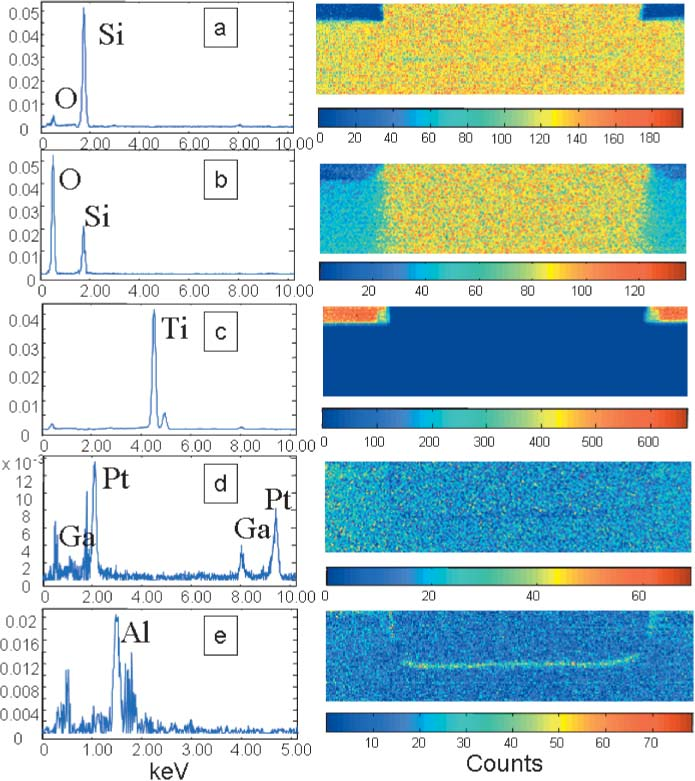{width="100%"}
:::
:::

:::: {.notes}
- MCR-ALS comes from analytical chemistry (chromatography, reaction monitoring), where de Juan & Tauler developed the constraint toolbox. Kotula & Keenan at Sandia brought it to STEM-EDS in the early 2000s. It is why MCR/PCA were the production default in EDS labs decades before deep learning.
- The one point to land: *the constraints are the science*. Non-negativity alone leaves a band of valid answers. Closure (fractions sum to one), unimodality (a diffusion profile has one maximum), a known reference spectrum or a region where only one phase is present are physical statements that shrink the band.
- Misconception to preempt: "MCR-ALS is just NMF with extra steps." Mathematically yes, and that is the point. The extra steps turn a generic factorisation into a physically constrained one. Plain NMF has no knowledge of the physics. MCR lets you inject it.
- Implementation detail: the simplest non-negativity step is least squares followed by clipping negatives to zero. It is crude but widely used. Proper NNLS per pixel is more accurate but slower. The notebook's optional MCR-ALS cell uses clipping plus closure.
- EM anchor (figure): the Ga/Pt component is the FIB-implanted Ga and the protective Pt cap. MCR isolates this contamination into its own component instead of letting it contaminate the chemistry. Read every component, including the boring ones.
- Transition: "A modern example where NMF made a trace-element measurement possible."
::::

## Case study: NMF-aided phase unmixing of STEM-EDXS

::: {.columns}
::: {.column width="42%"}
:::: {.incremental}
- **Sample:** lower-mantle assemblage from a diamond-anvil cell: bridgmanite, ferropericlase, Ca-perovskite, doped with trace Nd/Sm/U [@chen_2024_nmf].
- **Problem:** the phases share X-ray lines and intermix below the pixel scale. The per-pixel EDXS is far too noisy for trace elements.
- **Pipeline:** NMF (3 components) → phase spectra + abundance maps → constrained least-squares refinement → quantification.
- **Result:** trace Sm detected in ferropericlase down to tens of ppm.
- **Next step:** physics-guided NMF, where endmembers are built from X-ray emission theory and fitted with a Poisson loss [@teurtrie_2024_espmnmf].
::::
:::
::: {.column width="58%"}
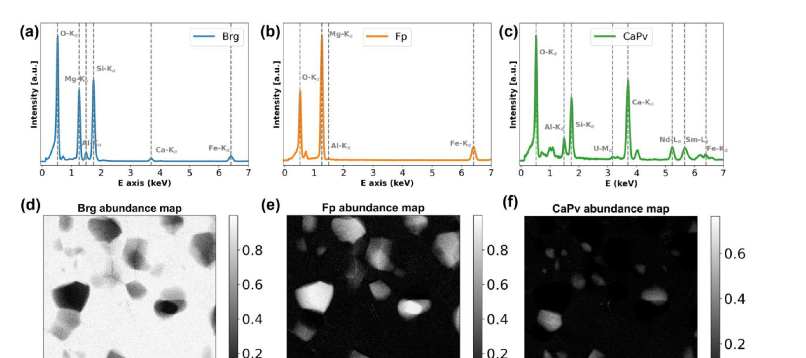{width="100%"}
:::
:::

:::: {.notes}
- Why this is the right case study: clustering (K-means / GMM) fails here because the phases overlap spectrally and spatially. A hard cluster map would be wrong on nearly every mixed pixel. NMF pools the counts of all pixels belonging to a phase into one clean endmember spectrum, which is how a per-pixel-noisy measurement becomes a trace-element measurement.
- The one point to land: the benefit of unmixing is statistical. The endmember spectrum is estimated from *thousands* of pixels, so its SNR is far higher than that of any single pixel. This is the same "exploit redundancy" argument as PCA denoising, but in a physically interpretable basis.
- Physics-guided NMF (Teurtrie et al., the `espm` Python package): instead of learning arbitrary non-negative spectra, parameterise each endmember by elemental concentrations times theoretical X-ray line shapes plus a bremsstrahlung model. Fit with the Poisson (KL) loss. This greatly reduces rotational ambiguity, because the spectra can no longer take arbitrary shapes.
- Misconception to preempt: "a black-box NMF result is publishable." Chen et al. validate against known phase compositions and refine the abundances with constrained least squares. The NMF step is a starting point, not the answer.
- Transition: "Which brings us to the pitfalls. Why is a factorisation not unique, and how do we notice when it is lying?"
::::

<!-- ===== §10. Pitfalls: rotational ambiguity, truncation bias ===== -->

## Pitfall 1: rotational ambiguity of NMF / MCR

::: {.columns}
::: {.column width="62%"}
{width="100%"}
:::
::: {.column width="38%"}
:::: {.incremental}
- For any invertible $\mathbf{T}$: $\mathbf{X} = \mathbf{C}\mathbf{S}^T = (\mathbf{C}\mathbf{T})(\mathbf{T}^{-1}\mathbf{S}^T)$, with **identical fit**.
- Non-negativity only rules out some $\mathbf{T}$. It leaves a **feasible band** of solutions.
- Geometrically: any simplex that encloses the data and has non-negative vertices is a valid answer.
- **Symptoms:** endmembers change between restarts, or converge consistently to spectra with dips / copies of other phases. Consistency ≠ correctness.
- **Remedies:** closure, known spectra, pure pixels / selectivity, sparsity, physics-guided endmembers. Always **report your constraints**.
::::
:::
:::

:::: {.notes}
- Board derivation: write $\mathbf{X} = \mathbf{C}\mathbf{S}^T$, insert $\mathbf{T}\mathbf{T}^{-1}$ in the middle, and regroup. The fit is unchanged. For PCA we remove this freedom by *demanding* orthonormality and variance ordering, which is why PCA is unique (up to sign) and NMF is not.
- The one point to land (figure): the true triangle and the enlarged dashed triangle both contain all pixels and both have non-negative vertex spectra, so both are perfectly valid NMF solutions. The dashed spectra (right panel) are the true spectra with a bit of the other phases *subtracted*, which is exactly the "dips at other phases' edges" artefact seen in the NMF row two slides ago.
- Misconception to preempt: "a better optimiser will find the true solution." No. All points in the feasible band have the *same* loss, so it is an identifiability problem, not an optimisation problem. Only more information (constraints, priors) can resolve it.
- War story (from the MCR literature): two groups publish "the pure phase spectrum" of the same material, and the spectra differ. Both are valid points in the feasible band, and neither group reported its constraints.
- Practical diagnostic: run NMF from 10 random initialisations. If the endmembers change qualitatively, the band is wide, so add constraints or report the range. Tools such as MCR-BANDS compute the feasible band explicitly.
- Exam-weight: state rotational ambiguity and name two constraints that reduce it.
- Transition: "The second pitfall concerns PCA itself, specifically what truncation throws away."
::::

## Pitfall 2: PCA truncation bias and the rare phase

{width="100%"}

:::: {.incremental}
- Truncation keeps **variance**, not **importance**. A rare or dilute phase contributes little variance and falls below the noise floor, so it is projected away.
- The noisy estimate of the loadings is itself biased. PCA-filtered maps can be **precise and biased at once** [@lichtert2013pca]. With poor peak-to-background, PCA filtering creates artefacts [@cueva2012eels].
- **Diagnostic:** always inspect the **residual map** $\|\mathbf{x}_i-\hat{\mathbf{x}}_i\|^2/\hat{\mathbf{x}}_i$. It must look like spatially uncorrelated noise.
::::

:::: {.notes}
- The one point to land: "looks clean" ≠ "is correct". The denoised reconstruction at K=2 looks perfect and the scree plot gives a textbook elbow, yet a real phase has been erased. The only place it survives is the residual, and a Poisson-normalised residual map makes it jump out.
- Why K=8 is not the answer: the rare phase is spread over several noise-level components, so you would add back 6 components of noise to recover 13 pixels. The right approach is to *detect* it in the residual and then analyse that region specifically (local PCA, targeted fitting, or simply the raw summed spectrum of those pixels).
- Lichtert & Verbeeck (2013) is the key cautionary paper: PCA noise filtering of atomic-resolution EELS maps can bias fitted parameters while making the precision look better than the Cramér–Rao bound. A tighter error bar around the wrong value is worse than an honest wide one.
- Misconception to preempt: "so never denoise." Denoise when the features of interest are *common* (matrix phase quantification). For *discovery* (rare phases, dopants, defects), work with residual maps or the raw data. Different question, different tool.
- EM anchor: dopant segregation to a grain boundary is the classic rare-phase case. The boundary is a few pixels wide and its variance is tiny, and PCA will happily smooth it away.
- Forward link: Week 9 revisits this with anomaly detection on autoencoder reconstruction errors, which applies the same residual logic to a non-linear model.
- Transition: "Let me put the methods side by side before we turn to ill-conditioning."
::::

## Choosing the decomposition: a decision table

| Question | Method | Constraint | Unique? | Watch out for |
|---|---|---|---|---|
| How many things vary? Denoise | **PCA / SVD** (weighted) | orthogonal, variance-ordered | yes (± sign) | truncation bias, rare phases, needs weighting |
| Which phases, known references | **NNLS / FCLS** | $\mathbf{a}\ge0$, $\sum a=1$ | yes | missing endmember → biased fractions |
| Which phases, unknown spectra | **NMF** (Frobenius / KL) | $\mathbf{W},\mathbf{H}\ge0$ | no | rotational ambiguity, init, choose $K$ from PCA |
| + physical prior knowledge | **MCR-ALS** / physics-guided NMF | + closure, unimodality, known spectra | ≈ with enough constraints | constraints must be *true* |
| Discrete phases, no mixing | **K-means / GMM** (Week 9) | hard / soft labels | no (init) | mixed pixels at boundaries |
| Curved manifolds, shifting peaks | **Autoencoders** (Week 9) | learned non-linear | no | interpretability, validation |

:::: {.notes}
- This table is the practical summary of the second half of the lecture. It is worth copying into the miniproject report template.
- The one point to land: PCA and unmixing are not competitors. The standard pipeline is: preprocess → weighted PCA to denoise and choose K → NMF/MCR with that K for interpretation → residual maps to check what was lost.
- Misconception to preempt: "clustering gives phase maps." Only when the phases are spatially separated and spectrally distinct (e.g. the duplex-steel low-loss EELS case in ML-PC Unit 5). Otherwise every boundary pixel is wrong, and unmixing is the right tool.
- Forward link: Week 9 covers the last two rows. Constrained autoencoders (softmax bottleneck + linear decoder) are literally NMF-style unmixing learned by gradient descent.
- Transition: "One practical warning that bridges to next week: correlated features and ill-conditioning."
::::

<!-- ===== §10b. Ill-conditioning & why correlated features hurt ===== -->

## Ill-conditioning: when correlated features cause trouble

::: {.columns}
::: {.column width="55%"}
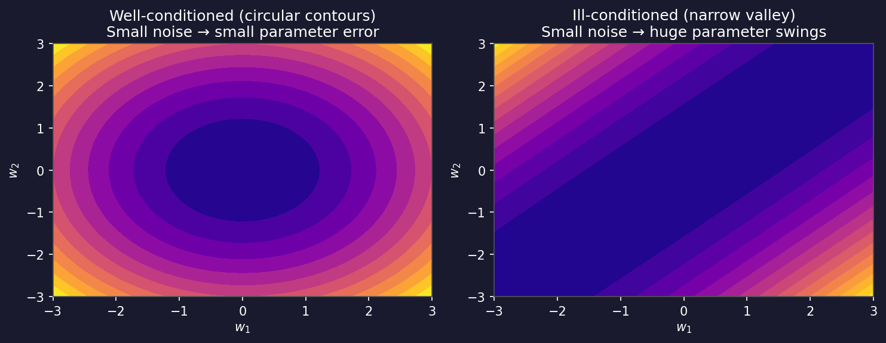{width="100%"}
:::
::: {.column width="45%"}
:::: {.incremental}
- **Condition number** $\kappa = \sigma_\text{max}/\sigma_\text{min}$ — ratio of largest to smallest singular value.
- Well-conditioned: $\kappa \approx 1$ (circular contours). Ill-conditioned: $\kappa \gg 1$ (narrow valley).
- **Cause:** highly correlated features → data matrix nearly singular → small $\sigma_\text{min}$ → large $\kappa$.
- **Effect:** a tiny change in the data produces huge, unstable swings in the estimated parameters [@murphy2012machine].
::::
:::
:::

:::: {.notes}
- Walk through the loss landscape figure: the circular contours mean that moving in any direction costs you the same loss — you can locate the minimum reliably. The narrow valley means the loss is nearly flat along the valley floor — many parameter combinations give almost the same loss, but they correspond to wildly different physical predictions.
- The one point to land: $\kappa \gg 1$ means the matrix amplifies small errors (noise, rounding) by a factor of $\kappa$. If $\kappa = 10^4$, floating-point noise at the $10^{-16}$ level becomes $10^{-12}$ errors in the solution — usually fine. But noise at the $10^{-3}$ level (real measurement noise) becomes errors of order $10$, which is catastrophic.
- Misconception to preempt: "ill-conditioning means the model is wrong." No — the model can be perfectly specified but the data matrix is ill-conditioned. The solution is not a different model but a different computation: use SVD (which can detect and handle small singular values) instead of direct inversion.
- EM anchor: in EDS mapping of an alloy with Fe and Mn close in energy, the two elemental maps are highly correlated because the Fe-K$\alpha$ and Mn-K$\alpha$ peaks overlap. Directly fitting both peaks simultaneously creates a near-singular regression matrix. SVD-based pseudo-inverse or regularisation (Ridge) is the standard fix.
- Forward link: in Week 4, ridge regression adds $\lambda\mathbf{I}$ to the normal equations, which lifts all eigenvalues by $\lambda$ and eliminates ill-conditioning. This is the standard cure.
- Transition: "Why do correlated features produce ill-conditioning?"
::::

## Why correlated features cause ill-conditioning in EM

:::: {.incremental}
- **Scenario:** two EDS channels (Fe-K$\alpha$ at 6.4 keV and Ni-K$\alpha$ at 7.5 keV) both increase with sample thickness in an FeNi alloy.
- Forming a regression matrix from both channels → two nearly parallel column vectors → near-singular $\mathbf{X}^T\mathbf{X}$ → high $\kappa$.
- **PCA as a cure:** PCA rotates to the principal directions. In the new basis, the directions are uncorrelated by construction (orthogonal). The PCA-transformed data matrix has no correlated columns.
- **Practical rule:** if your condition number is $> 10^3$ and you are fitting a linear model, standardise your features (subtract mean, divide by std) and consider PCA pre-processing or Ridge regularisation.
- Fitting with highly correlated features gives wildly uncertain coefficients even when the prediction accuracy looks fine.
::::

:::: {.notes}
- The key insight: high prediction accuracy with correlated features does not mean the coefficients are physically meaningful. The model found one combination of coefficients that works, but many other combinations work equally well (the loss valley is flat). Any perturbation of the data changes which combination is selected.
- The one point to land: "correct predictions, wrong coefficients" is a genuine failure mode. If you are using regression coefficients as physical descriptors (e.g., "the model says the Fe contribution is 0.7"), you need well-conditioned data for those numbers to be interpretable.
- Misconception to preempt: "I can check if my features are correlated by looking at the correlation matrix." Yes — but the correlation matrix shows pairwise correlation. SVD shows the effective dimensionality of the full feature matrix, including higher-order redundancies. High condition number with moderate pairwise correlations is common.
- EM anchor: in 4D-STEM strain mapping, the lattice parameters $a$ and $c$ of a hexagonal crystal are often correlated in strained regions. Directly fitting both can produce unstable strain maps; using PCA-reduced diffraction pattern features as inputs avoids this.
- Forward link: Week 4 introduces regularisation (Ridge, Lasso) as the systematic cure for ill-conditioning. PCA pre-processing (projecting onto the well-conditioned principal components) is an alternative.
- Transition: "Before we close: what are the limits of linear methods, and what comes next?"
::::

## Ill-conditioning: a quick diagnostic

:::: {.incremental}
- **Check condition number:** `np.linalg.cond(X)` — if $> 10^6$, you have a serious problem.
- **Variance–inflation factor (VIF):** for each feature, regress it on all others. High $R^2$ → high VIF → high collinearity.
- **Standardise first:** features on vastly different scales (counts vs kV vs nm) create artificial ill-conditioning. Always subtract the mean and divide by the standard deviation before linear modelling.
- **PCA as pre-processing:** project features onto the first $K$ principal components (choose $K$ to drop near-zero singular values). The resulting $K$ features are guaranteed to be uncorrelated.
- **Ridge regularisation (Week 4):** adds $\lambda\mathbf{I}$ to $\mathbf{X}^T\mathbf{X}$, lifting all eigenvalues above $\lambda$ — quick fix when you want to keep all features.
::::

:::: {.notes}
- This is a practical toolbox slide. Give students a decision tree: (1) check condition number; (2) if high, check for correlated features; (3) standardise; (4) if still high, use PCA pre-processing or Ridge. Each step has a specific NumPy/sklearn call.
- The one point to land: standardisation (subtract mean, divide by std) is the first step in any linear model pipeline when features have different physical units. Skipping it is one of the most common beginner errors — it creates artificial ill-conditioning that has nothing to do with the actual physics.
- Misconception to preempt: "standardisation distorts the physical meaning of the features." Standardisation changes scale but not relative variation. The regression coefficients after standardisation are in units of "standard deviations of the feature per unit target" — which is a meaningful, interpretable scale for comparing feature importances.
- EM anchor: in compositional analysis, if one feature is "Ti content in at%" (range 0–100) and another is "peak position in eV" (range 460–470), the scale difference is 100× — enough to create artificial ill-conditioning when both are used in a regression together.
- Forward link: Week 4 presents Ridge regression and introduces the explicit regularisation $\lambda$. The geometric interpretation: Ridge replaces the sharp SVD truncation with a soft shrinkage of all singular values, which is smoother and often more practical.
- Transition: "Let's close with the limits of linear methods and what we build toward."
::::

<!-- ===== §11. Limits + forward link ===== -->

## Limits of linear methods

:::: {.incremental}
- **Linearity:** PCA, NMF and MCR all assume $\mathbf{X}\approx$ (maps) × (spectra). Peak *shifts* (strain, valence), peak-*shape* changes (ELNES), plural scattering and EDS absorption bend the data cloud off the flat subspace / simplex.
- **Noise model:** PCA is optimal for isotropic Gaussian noise. For counts, weight (PCA) or use the KL loss (NMF), because at very low dose even weighting is only approximate.
- **Identifiability:** a decomposition always returns *an* answer. Uniqueness requires constraints (orthogonality for PCA, physical priors for NMF/MCR).
- **Rare & weak features:** variance-based truncation erases them. Residual maps are mandatory.
- **These limits motivate Week 9:** autoencoders learn non-linear low-dimensional representations, and constrained autoencoders learn NMF-style unmixing.
::::

:::: {.notes}
- Frame the limits positively: knowing where a method fails is as important as knowing where it works. Linear decomposition is the right *first* tool for any spectral dataset.
- The one point to land: every limit on this slide has a specific diagnostic. Curvature appears as many components with smooth, structured eigenspectra (a peak shift shows up as a derivative-shaped loading, as we saw). Noise-model mismatch appears as a sloped noise floor. Ambiguity appears as restart-dependence. Rare features appear as structured residuals.
- Misconception to preempt: "if PCA fails, I should use deep learning." Not necessarily. Weighting fixes the noise problem, NMF/MCR fix the non-negativity problem, alignment fixes the shift problem, and constraints fix the ambiguity problem. Reach for autoencoders only for genuine non-linearity, and choose the simplest tool that handles the specific failure mode.
- EM anchor: a solid solution whose edge onset shifts with composition forms a curved 1-D manifold. PCA needs 2–3 components (edge + derivative + curvature), whereas a 1-D non-linear latent captures it.
- Forward link: an autoencoder with linear activations and MSE loss exactly recovers the PCA subspace. With a softmax bottleneck and a non-negative linear decoder it becomes an unmixing model. Week 9 builds both.
- Transition: "Let's summarise."
::::

## Summary

:::: {.incremental}
- **Data matrix:** spectrum image $(n_y,n_x,D)$ → $\mathbf{X}\in\mathbb{R}^{N\times D}$, rows = pixels. Every method today factorises $\mathbf{X}\approx$ maps × spectra.
- **SVD / PCA:** rotate–stretch–rotate; singular values² ∝ variance; truncation = projection onto the signal subspace (Eckart–Young). Unique, but components are signed.
- **Scree plot & denoising:** signal = steep head, noise = flat floor. Too few components → bias, too many → noise.
- **Preprocessing:** align → remove spikes → power-law background → normalise → **Poisson-weight** → decompose.
- **NMF / MCR-ALS:** non-negativity (+ closure, …) gives phase-like spectra and maps. Multiplicative updates / alternating LS. KL loss = Poisson likelihood.
- **Pitfalls:** rotational ambiguity (report constraints, check restarts), truncation bias (inspect residual maps), ill-conditioning (κ = σ_max/σ_min).
::::

:::: {.notes}
- Use this slide as the verbal recap. Ask two students to explain one bullet each in their own words, focusing on the preprocessing and pitfalls bullets, since they are new.
- The one point to land: the same factorisation shape appears everywhere, and only the constraints change. Orthogonality gives PCA, non-negativity gives NMF, physical constraints give MCR, and a learned non-linear decoder gives an autoencoder (Week 9).
- Transition: "Here are the statements you must be able to reproduce in the exam."
::::

## Must-know takeaways

:::: {.incremental}
1. PCA = SVD of the **centered** data matrix; $\sigma_k^2/(N-1)$ is the variance along PC $k$; truncating at $K$ is the best rank-$K$ approximation (Eckart–Young).
2. PCA denoises because the signal is **low-rank** and the noise is **full-rank**; choose $K$ where the scree plot meets the noise floor.
3. PCA is least squares, i.e. it assumes equal-variance Gaussian noise. **Poisson-weight** counts before PCA.
4. EELS preprocessing order: **align → background (power law) → normalise → weight → decompose**. A derivative-shaped loading signals misalignment.
5. NMF: $\mathbf{X}\approx\mathbf{WH}$, $\mathbf{W},\mathbf{H}\ge0$ gives a parts-based, physically plausible basis; KL-NMF = Poisson maximum likelihood.
6. NMF / MCR are **not unique**: $\mathbf{CS}^T = (\mathbf{CT})(\mathbf{T}^{-1}\mathbf{S}^T)$. Constraints (closure, known spectra, selectivity) reduce the ambiguity.
7. Truncation removes low-variance, not unimportant, signal. Always inspect **residual maps**.
::::

:::: {.notes}
- These seven statements are exactly what goes into `_shared/mustknow_parts/week03.md` (plus a couple of related ones). The exam will ask for at least one of them in the form "explain why…".
- The one point to land: statements 3, 6 and 7 are the ones students most often get wrong. Rehearse them.
- Transition: "Next week: the projection geometry becomes regression."
::::

## Looking ahead: Week 4

:::: {.incremental}
- **Topic:** "Regression, optimisation & honest validation".
- Linear regression as projection, building directly on today's least-squares geometry.
- Gradient descent, SGD and Adam: loss landscapes and why ill-conditioning (today's $\kappa$) makes optimisation slow.
- Ridge and Lasso: systematic cures for ill-conditioning, and their geometry.
- Honest validation: train/val/test, k-fold, GroupKFold by specimen. Also why every preprocessing step (scaling, PCA, feature selection) must be fitted *inside* the training fold.
::::

:::: {.notes}
- Keep this light. It is a teaser, not a lecture. The key promise: after Week 4, students can fit a regularised linear model to EM-derived features and report an honest estimate of how well it generalises.
- The one point to land: the multiplicative NMF update was a gradient step with a clever learning rate. Week 4 makes gradient descent the central algorithm, and today's condition number tells you how hard the landscape is.
- Forward link to the leakage demo: the Week 4 notebook shows that selecting features on the full dataset before splitting invents a positive R² from pure noise. Fitting a scaler or PCA before the split leaks less dramatically, but it is the same mistake: fit every step of this PCA pipeline inside the training fold.
- Transition: "Here is what to do this week."
::::

## Self-study this week

::: {.columns}
::: {.column width="62%"}
:::: {.incremental}
- **Notebook:** `notebooks/week03_pca_nmf_eels.ipynb`, "PCA vs NMF on a synthetic spectrum image".
  - Part A: PCA denoising of an EELS line scan (SVD, scree plot, U-shaped error curve).
  - Part B: a 3-phase 2-D spectrum image with Poisson noise and a known ground truth.
  - Part C: PCA vs NMF: match components to the ground truth, quantify spectral correlation and abundance error.
  - Part D: write multiplicative updates yourself; break NMF by removing pure pixels (rotational ambiguity); optional MCR-ALS with closure.
- **Goal:** be able to explain *why* PCA components are not phases and when NMF can be trusted.
::::
:::
::: {.column width="38%"}
[](https://colab.research.google.com/github/ECLIPSE-Lab/public_presentations/blob/main/data_science_for_em/notebooks/week03_pca_nmf_eels.ipynb)

CPU only, < 5 min end-to-end. Uses NumPy, SciPy, matplotlib and scikit-learn.
:::
:::

:::: {.notes}
- Distribute the Colab link now. The notebook runs end-to-end in well under five minutes on a CPU.
- The one point to land: Part C's quantitative comparison (correlation of recovered vs true spectra, RMSE of abundance maps) is the habit we want. Never judge a decomposition by eye alone when a ground truth or a physical check exists.
- Misconception to preempt: "the notebook is just the lecture again in code." Part D asks students to implement the multiplicative update by hand and to *break* NMF: remove the pure pixels and NMF converges, consistently across restarts, to wrong endmembers that fit the data as well as the truth. That experience makes rotational ambiguity concrete, and shows that restart-consistency is not proof of correctness.
- Miniproject link: teams working on spectral data should treat this notebook as a template for their pipeline (preprocess → weighted PCA → NMF → residual check).
- Transition: "See you next week for regression and validation."
::::

<!-- BEGIN prev-next -->

## Continue

- &larr; Previous: [Unit 02 &mdash; Learning from EM data: signal formation, noise & loss](../02_em_data_formation/01_intro.html)
- &rarr; Next: [Unit 04 &mdash; Regression, optimisation & honest validation](../04_regression_validation/01_intro.html)
- [All courses](../../index.html)

<!-- END prev-next -->

## References

::: {#refs}
:::
