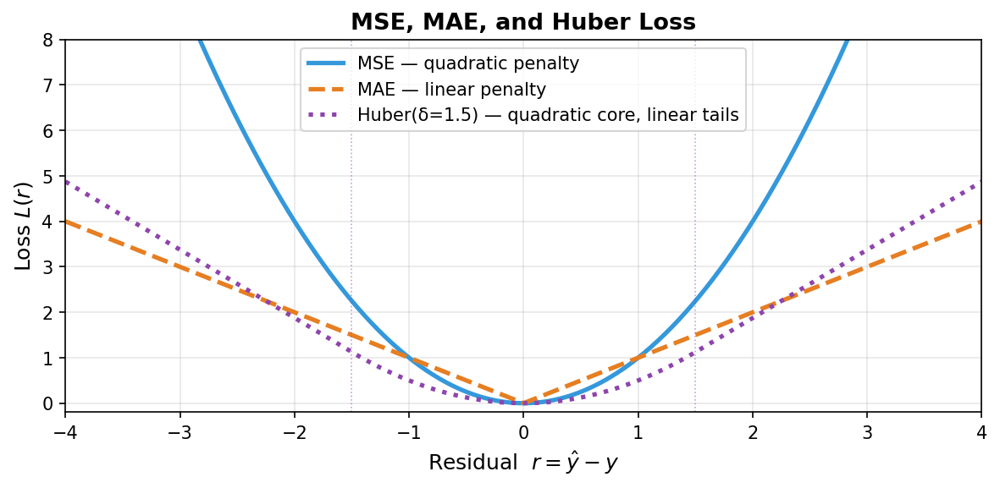
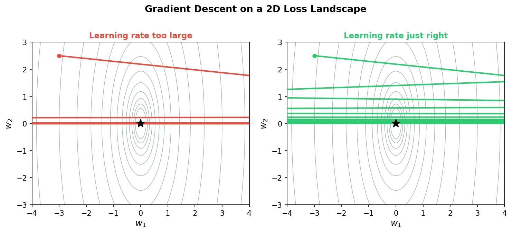
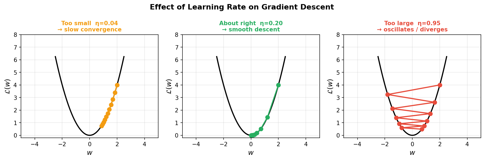
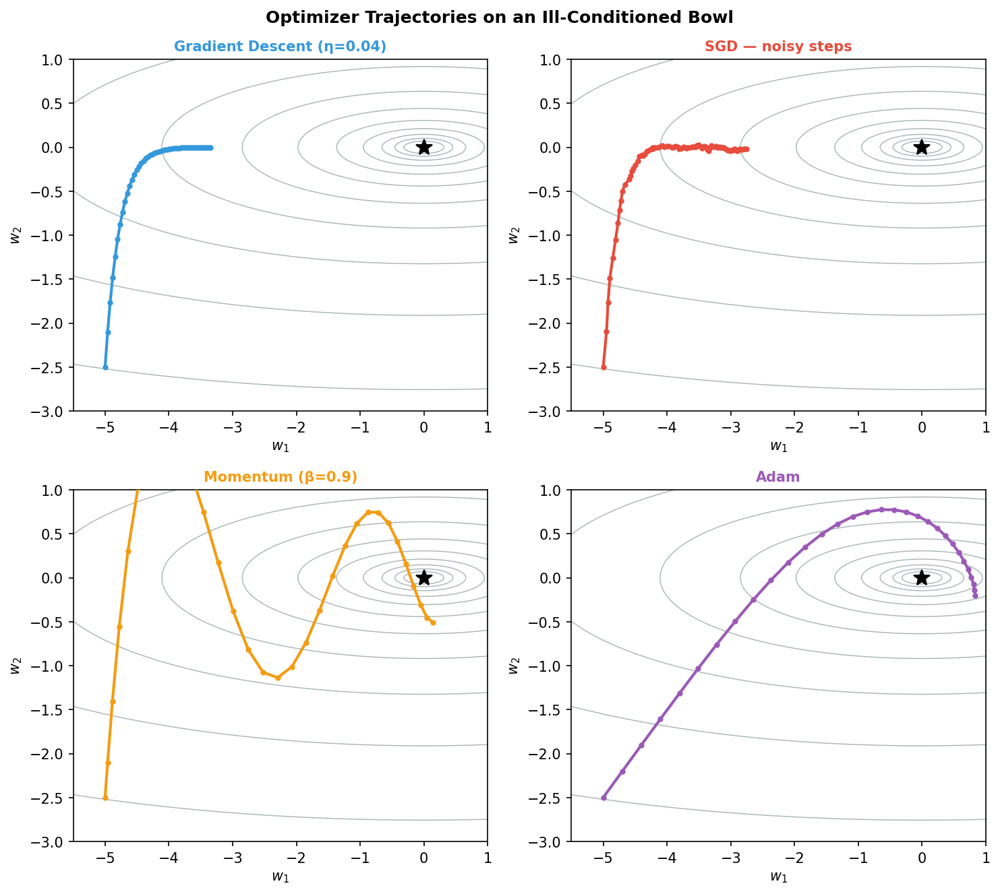
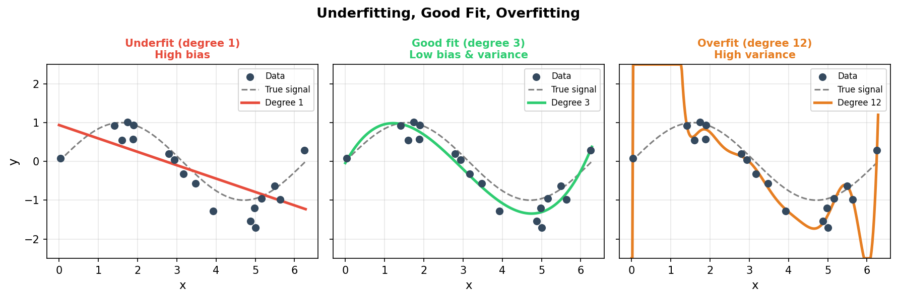
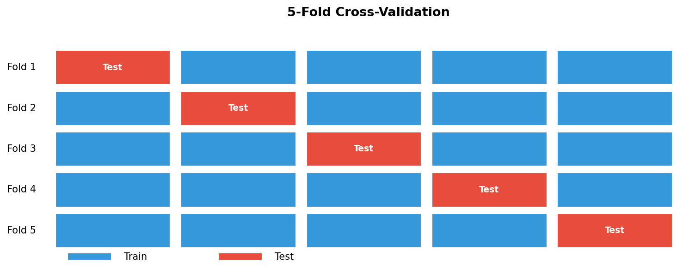
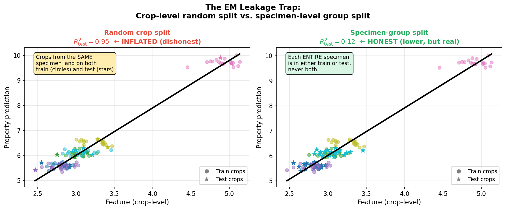
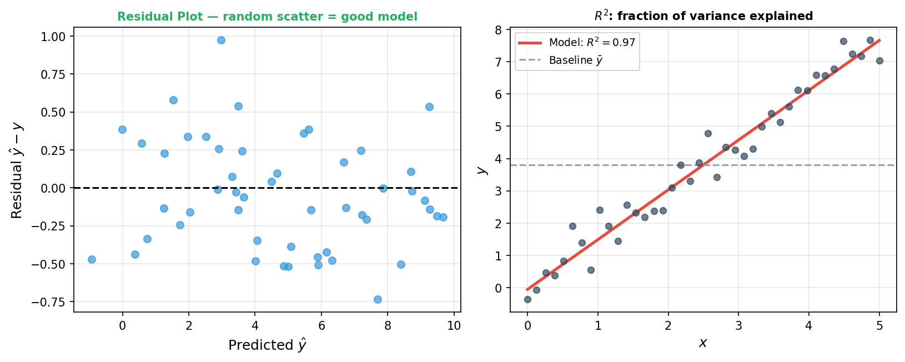
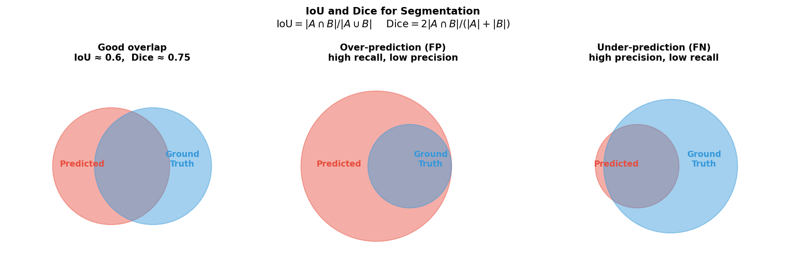

<!-- ===== §0. Recap + roadmap ===== -->

## Recap: where we left off

:::: {.incremental}
- **Week 3:** linear algebra & PCA — SVD, score maps, eigenspectra.
- You can now compress a 50 000-spectrum EELS dataset into a handful of components and plot a scree plot.
- Key geometric insight: least-squares = projection of the target vector onto the column space of $\mathbf{X}$.
- **Gap:** projection gives the optimal weights analytically, but only when we can invert $\mathbf{X}^T\mathbf{X}$.
  For large or non-linear problems we need an iterative approach — gradient descent.
- **Gap #2:** fitting a model well on training data is not the same as fitting it *honestly*.
  We will spend the second half of today on that distinction.
::::

:::: {.notes}
- Open by checking: who saw a clear scree-plot elbow in the Week 3 notebook? Use that as the bridge — PCA found the signal subspace by finding the directions of maximum variance. Regression will ask "what direction minimises prediction error?" Same geometric spirit, different criterion.
- The one point to land: the analytic normal-equations solution exists but requires a matrix inversion — fragile for large or ill-conditioned systems. Gradient descent is the scalable alternative, and it is the workhorse of every neural network we will meet from Week 5 onward.
- Misconception to preempt: "gradient descent is a neural-network thing, not a regression thing." It applies to *any differentiable loss — including MSE linear regression. The same algorithm that trains ResNet-50 can fit a line to 10 data points.
- EM anchor: EELS spectrum fitting often runs on GPU using SGD; the same code scales from 10 to 10 million spectra.
- Pacing note: move swiftly through §1–3 (loss and GD, ~30 min), spend 15 min on §4 (SGD/Adam), and protect 25 min for §5–7 (validation and leakage) — that is where the exam-critical material lives.
- Transition: "Two questions anchor today — let me show you before we dive in."
::::

## Today's questions

:::: {.incremental}
- **Why does a model trained on EM crops from one specimen fail on crops from a new specimen?**
  Because crops from the same specimen are correlated — training on them while testing on others measures memorisation, not generalisation.
- **How do we find model parameters without inverting a matrix?**
  Gradient descent: follow the slope of the loss surface downhill, one small step at a time.
- **Road map:** prediction = loss minimisation (3) · MSE / MAE / Huber & noise (5) · loss landscape & GD picture (4) · learning rate (3) · SGD → Adam, intuition only (6) · overfitting & bias–variance (4) · train/val/test (4) · K-fold CV (3) · **data leakage in EM — the crop-vs-specimen trap** (6) · regression & segmentation metrics (4) · limits + Week 5 preview (2).
- **Self-study:** `notebooks/week04_leakage_demo.ipynb` — fit a regressor two ways and watch the honest score drop.
::::

:::: {.notes}
- Read the road map together with the room and point to two anchors: (1) the loss landscape in §2 and (2) the leakage figures in §5. Tell students those two things are the core of the week.
- The one point to land: today has two halves that connect. The first half (loss minimisation, GD) answers "how do I fit a model?" The second half (validation, leakage) answers "how do I trust my score?" Both are essential for every EM project.
- Pacing note: this slide is orientation only — 2 minutes maximum. Do not read all bullet points aloud; gesture at the structure and move on.
- Transition: "Start with the simplest question: what does it mean to predict?"
::::

<!-- ===== §1. Prediction as loss minimisation ===== -->

## Prediction = minimising a loss

:::: {.incremental}
- **Dataset:** $\mathcal{D} = \{(\mathbf{x}_i, y_i)\}_{i=1}^N$ — each $\mathbf{x}_i$ is a feature vector, $y_i$ is the target.
- **Predictor:** $\hat{y}_i = f_{\mathbf{w}}(\mathbf{x}_i)$ — parameterised by weights $\mathbf{w}$.
- **Loss:** $L(\hat{y}_i, y_i)$ — a scalar that scores how wrong prediction $i$ is.
- **Empirical risk (what we minimise):** $\hat{R}(\mathbf{w}) = \dfrac{1}{N}\sum_{i=1}^{N} L(f_{\mathbf{w}}(\mathbf{x}_i),\, y_i)$.
- **Goal:** $\hat{\mathbf{w}} = \arg\min_{\mathbf{w}} \hat{R}(\mathbf{w})$.
::::

. . .

> Every supervised learning algorithm is a choice of loss + a choice of optimiser.

:::: {.notes}
- Write the ERM equation on the board while saying it aloud — the notation is more intimidating than the concept. "We pick the weights that make our predictions closest to the true targets, on average."
- The one point to land: *training a model is just minimising a function*. The function has a specific shape — the loss surface — and the optimiser is the algorithm that walks downhill on that surface.
- Misconception to preempt: "the loss and the metric are the same thing." They are not — the loss is what we minimise (must be differentiable, gradient-friendly); the metric is what we report to humans (must be interpretable). We train with MSE and report RMSE in the correct units. More on this in §6.
- EM anchor: in EELS spectral fitting, $\mathbf{x}_i$ is one spectrum, $y_i$ is the elemental concentration at pixel $i$, and $f_\mathbf{w}$ is a linear combination of reference spectra. Minimising the MSE across all spectra gives the best-fit concentrations everywhere.
- Forward link: in Week 5, we will replace the linear predictor $f_\mathbf{w}$ with a neural network — the loss and ERM framework are identical.
- Transition: "The most common loss is MSE — but it is not the only one, and the choice matters."
::::

## The linear model & the normal equations

:::: {.incremental}
- **Linear predictor:** $\hat{y} = \mathbf{w}^T \mathbf{x} + b = \mathbf{w}^T \mathbf{x}$ (absorb $b$ into $\mathbf{w}$).
- **MSE loss for linear regression:** $\hat{R}(\mathbf{w}) = \tfrac{1}{N}\|\mathbf{X}\mathbf{w} - \mathbf{y}\|^2$.
- **Analytic solution (Normal equations):** $\hat{\mathbf{w}} = (\mathbf{X}^T\mathbf{X})^{-1}\mathbf{X}^T\mathbf{y}$.
- **Geometric reading (Week 3):** $\hat{\mathbf{y}} = \mathbf{X}\hat{\mathbf{w}}$ is the projection of $\mathbf{y}$ onto the column space of $\mathbf{X}$.
- **Problem:** inverting $\mathbf{X}^T\mathbf{X}$ fails when $D$ is large or features are correlated ($\kappa(\mathbf{X}^T\mathbf{X}) \gg 1$).
::::

. . .

**Enter gradient descent** — an iterative alternative that *never* inverts anything.

:::: {.notes}
- Connect explicitly to Week 3: the projection picture was beautiful but brittle. High condition number (e.g. two nearly identical EELS channels) makes $\mathbf{X}^T\mathbf{X}$ nearly singular and the solution numerically unstable.
- The one point to land: the normal equations give the exact answer in theory but can be numerically unreliable in practice. Gradient descent gives an approximate answer that improves with each step, and it scales to billion-parameter models.
- Misconception to preempt: "Ridge regression solves the ill-conditioning problem." Correct — but Ridge still requires solving a linear system. GD avoids even that.
- EM anchor: EELS spectra in adjacent energy channels are highly correlated ($\kappa \gg 1$ is common). Direct inversion is dangerous; iterative solvers or GD-based fitting is preferred in production code.
- Forward link: next slide, the gradient and the update rule.
- Transition: "To minimise the loss iteratively, we need to know which direction is downhill — that is the gradient."
::::

## What is the gradient?

:::: {.incremental}
- The **gradient** $\nabla_\mathbf{w} \hat{R}(\mathbf{w})$ is a vector pointing in the direction of *steepest ascent* of the loss surface.
- **Key insight:** moving opposite to the gradient (steepest descent) reduces the loss (at least locally).
- **First-order Taylor:** $\hat{R}(\mathbf{w} - \eta \nabla \hat{R}) \approx \hat{R}(\mathbf{w}) - \eta \|\nabla \hat{R}\|^2 < \hat{R}(\mathbf{w})$ for small $\eta > 0$.
- **For MSE linear regression:** $\nabla_\mathbf{w} \hat{R} = \tfrac{2}{N}\mathbf{X}^T(\mathbf{X}\mathbf{w} - \mathbf{y})$ — a matrix-vector product, no inversion needed.
::::

. . .

> Gradient descent: take the gradient, step opposite to it, repeat.

:::: {.notes}
- Draw the 1D parabola on the board: "Imagine you are blindfolded on a hilly landscape and can only feel the slope under your feet. You always step downhill. That is gradient descent."
- The one point to land: the gradient tells you the direction of fastest ascent; the negative gradient is the direction of fastest descent. The learning rate $\eta$ controls how large each step is.
- Misconception to preempt: "gradients are only for neural networks." For MSE and linear models, the gradient is just a matrix-vector product. No autograd library required.
- EM anchor: in ptychographic reconstruction, the loss (sum of intensity mismatches) is minimised by gradient descent over the complex exit wave — exactly the same update rule, but for a 2D complex array.
- Forward link: Week 5 will show how to compute gradients for non-linear models using backpropagation — which is just the chain rule applied systematically to a computation graph.
- Transition: "Let us see the update rule and what the loss landscape looks like."
::::

## Gradient descent — the update rule

:::: {.incremental}
- **Update rule:** $\mathbf{w}_{t+1} = \mathbf{w}_t - \eta\,\nabla_\mathbf{w}\hat{R}(\mathbf{w}_t)$.
- **Initialisation:** start at some $\mathbf{w}_0$ (typically small random values or zeros).
- **Repeat** until the loss stops decreasing (convergence criterion) or a budget is exhausted.
- **For MSE linear regression:** closed form for the gradient —
  $\nabla_\mathbf{w}\hat{R} = \tfrac{2}{N}\mathbf{X}^T(\mathbf{Xw} - \mathbf{y})$.
- **For any differentiable model:** backpropagation (Week 5) computes the gradient automatically.
- **The key insight:** we only ever need first-order information (the gradient). No matrix inverses, no second-order terms.
::::

:::: {.notes}
- Write the update rule on the board and label each part: $\mathbf{w}_{t+1}$ (new weights), $\eta$ (learning rate), $\nabla_\mathbf{w}\hat{R}$ (gradient — the direction of steepest ascent of the loss). The minus sign means we step in the direction of steepest *descent*.
- The one point to land: the gradient is a vector the same shape as $\mathbf{w}$. For a linear model with 100 features, the gradient has 100 entries. For a neural network with 10 million parameters, the gradient has 10 million entries — computed by backpropagation in one pass.
- Misconception to preempt: "gradient descent always converges." Only on convex problems. On non-convex surfaces (neural networks), it converges to a stationary point — which may be a local minimum, saddle point, or plateau. The choice of initialisation, learning rate, and optimiser determines which one.
- EM anchor: ptychographic phase retrieval minimises the mismatch between measured and predicted diffraction intensities using GD on the complex exit wave. The gradient of the diffraction mismatch with respect to each pixel of the exit wave is the update direction.
- Forward link: the loss landscape slide shows what the GD trajectory looks like in weight space.
- Transition: "Which loss function should we choose? The answer depends on the noise model of our data."
::::

<!-- ===== §2. MSE / MAE / Huber and their noise-model connection ===== -->

## MSE — the default regression loss

:::: {.incremental}
- $L_{\text{MSE}}(\hat{y}, y) = (\hat{y} - y)^2$ — penalises errors quadratically.
- **Smooth, convex** bowl landscape — gradient descent's ideal setting.
- **Probabilistic identity:** minimising MSE over the dataset = maximum-likelihood estimation (MLE) assuming iid Gaussian residuals $\varepsilon \sim \mathcal{N}(0, \sigma^2)$ [@bishop2006pattern].
- **In EM:** correct when your noise is additive Gaussian (readout noise, Johnson noise).
  For Poisson-dominated low-dose data, use Poisson NLL instead (Week 2 recap).
::::

. . .

> MSE punishes large residuals heavily — one bad crop can dominate the loss.

:::: {.notes}
- Derive the noise-model connection in one line: "If $y = f_\mathbf{w}(\mathbf{x}) + \varepsilon$ with $\varepsilon \sim \mathcal{N}(0,\sigma^2)$, then the log-likelihood is $-\frac{1}{2\sigma^2}\sum_i (y_i - f_\mathbf{w}(\mathbf{x}_i))^2$ plus a constant. Maximising it is identical to minimising MSE."
- The one point to land: the choice of loss encodes a physics assumption about the noise. MSE = Gaussian. Use it when that assumption holds.
- Misconception to preempt: "MSE is always the right loss for regression." Only when residuals are Gaussian and outliers are rare. STEM HAADF imaging at moderate dose is often Gaussian + Poisson mixture; pure MSE is reasonable. Cryo-EM at ultra-low dose is Poisson-dominated — use Poisson NLL.
- EM anchor: in atomic column position fitting from HAADF images, residuals are close to Gaussian (high dose, well-calibrated detector). MSE is appropriate. In EELS at 1-electron doses, shot noise dominates.
- Forward link: the loss landscape figure on the next slide shows why the bowl shape is convenient.
- Transition: "What happens when your data has outliers or the noise is not Gaussian?"
::::

## MAE and Huber — robust alternatives

::: {layout-ncol=2}
{width="100%"}

:::: {.incremental}
- **MAE:** $L = |\hat{y} - y|$ — linear penalty, robust to outliers.
  Probabilistic identity: MLE under Laplacian residuals.
  Caveat: non-differentiable at zero → sub-gradient methods needed.
- **Huber:** quadratic inside $|r| \le \delta$, linear outside.
  Best of both: smooth optimisation where residuals are small, robust to spikes.
  Standard tool when most EM crops are clean but occasional detector artefacts occur.
- **Rule of thumb:** start with MSE; switch to Huber if residual plots show heavy tails.
::::
:::

:::: {.notes}
- Point to the figure: "the blue curve (MSE) climbs steeply for large residuals — a single outlier with $r=4$ contributes 16 times as much as a point with $r=1$. The orange dashed MAE curve contributes only 4 times as much. The purple Huber curve is in between."
- The one point to land: the loss function is a design choice that encodes how much you punish different sizes of error. There is no universal answer — it depends on the noise model and the cost asymmetry in your application.
- Misconception to preempt: "Huber is always better than MSE." Huber adds a hyperparameter $\delta$ that must be tuned. On clean Gaussian data, MSE and Huber with a large $\delta$ give almost identical results.
- EM anchor: in HAADF STEM image denoising, occasionally a hot pixel on the detector produces a huge intensity spike — a point outlier. Huber loss or MAE prevents that spike from dominating the fit.
- Forward link: the choice of loss determines the shape of the loss surface. The next slide shows what that surface looks like.
- Transition: "Now let us picture what happens when we try to minimise the loss iteratively."
::::

<!-- ===== §3. Loss landscape and gradient descent ===== -->

## The loss landscape — a bowl in weight space

::: {layout-ncol=2}
{width="100%"}

:::: {.incremental}
- **Loss landscape:** the surface $\hat{R}(\mathbf{w})$ over all possible weight vectors $\mathbf{w}$.
- For MSE linear regression: a convex bowl — one global minimum, no local traps.
- **Gradient descent update:** $\mathbf{w}_{t+1} = \mathbf{w}_t - \eta\,\nabla_\mathbf{w}\hat{R}(\mathbf{w}_t)$.
- $\eta$ = **learning rate** — the step size along the negative gradient.
- The contour lines are level sets of the loss; GD crosses them at right angles (steepest descent).
::::
:::

:::: {.notes}
- Walk through the figure in detail: "Each point in this 2D plane is a candidate weight vector $(w_1, w_2)$. The oval contours are constant-loss contours — the minimum is at the centre. Gradient descent takes steps from the initial orange dot toward the star at the centre."
- The one point to land: the elongated oval (ill-conditioned bowl) is what happens when two features have very different scales — GD takes many zigzag steps. Standardising the data makes the contours more circular and GD more efficient.
- Misconception to preempt: "if the loss is convex, GD always finds the global minimum." Correct for infinite steps, but for a finite step budget the learning rate must be chosen carefully.
- EM anchor: in ptychographic phase retrieval, the loss landscape is non-convex (highly structured patterns of local minima). GD may converge to a poor local minimum — initialisation and momentum help.
- Forward link: next slides explore the effect of the learning rate $\eta$ explicitly.
- Transition: "The single most important hyperparameter in gradient descent is the learning rate. Let us see what happens when it is wrong."
::::

## Why the loss landscape shape matters

:::: {.incremental}
- **Convex** (MSE, Ridge): one bowl, one minimum — GD will find it.
- **Non-convex** (any neural network): many local minima, saddle points, plateaus.
- For non-convex losses, GD finds *a* minimum, not necessarily the *best* one.
- **Practical message for EM:** linear models trained with MSE are convex → any GD run converges to the same answer. Neural networks (Week 5) require careful initialisation and momentum to avoid bad local minima.
- **Saddle points** (equal numbers of upward and downward curvatures): gradient is zero but no minimum — GD stalls unless there is noise (SGD rescues this, next section).
::::

:::: {.notes}
- Sketch two pictures on the board side by side: a smooth bowl (convex) and a bumpy surface with several dips (non-convex). "For your linear model, you are always in the left picture. For your neural network next week, you are in the right picture."
- The one point to land: non-convexity is not a disaster in practice — large neural networks typically have many equivalent good minima, and SGD's noise helps escape saddle points. But it means you cannot guarantee convergence to the global minimum.
- Misconception to preempt: "non-convex = broken." Not at all — virtually every deep learning model is non-convex and they work very well in practice. The landscape analysis tells you *why* SGD with momentum works: it adds enough noise to escape saddle points and small local minima.
- EM anchor: atom-position refinement in crystal structures uses alternating GD steps in a highly non-convex landscape (diffraction intensities as a function of atom coordinates). Multiple restarts from different initialisations are standard practice.
- Forward link: the learning rate effect on convergence — next slide.
- Transition: "The single most important hyperparameter is the learning rate. Let us explore what happens when it is wrong."
::::

<!-- ===== §3 cont. Learning rate ===== -->

## Learning rate — too small, just right, too large

::: {layout-ncol=2}
{width="100%"}

:::: {.incremental}
- **Too small** ($\eta \ll 1/L$, $L$ = Lipschitz constant of gradient): correct direction but tiny steps → converges in theory, but takes too long in practice.
- **About right:** loss decreases monotonically; convergence in tens to hundreds of steps.
- **Too large** ($\eta > 2/L$): overshoots the minimum repeatedly → oscillates or diverges.
- **Rule of thumb:** start at $\eta = 0.01$–$0.1$, monitor the loss curve, reduce if it bounces.
::::
:::

:::: {.notes}
- Walk through the three panels. "Orange dots are the iterates; each one follows the gradient of the parabola $\mathcal{L}(w) = w^2$. In the left panel ($\eta = 0.04$), the steps are so small that after 10 steps we have barely moved. In the right panel ($\eta = 0.95$), we overshoot past the minimum and bounce back and forth — eventually diverging."
- The one point to land: there is a 'Goldilocks' learning rate. Too small wastes computation; too large breaks convergence. Learning rate schedulers (reduce on plateau, cosine annealing) automate the search.
- Misconception to preempt: "I can always reduce the learning rate if I see the loss bouncing." Correct but slow — adaptive optimisers (Adam, next section) largely solve this automatically.
- EM anchor: in dictionary learning for STEM images, a learning rate that is too large causes the dictionary atoms to oscillate rather than converge to clean atomic-scale features. Practitioners use a warm-up phase (ramp $\eta$ from small to target) to avoid this.
- Forward link: adaptive methods (next section) make the learning rate effectively self-tuning per parameter.
- Transition: "Vanilla gradient descent uses the same learning rate for every parameter. Modern practice uses adaptive methods."
::::

## Learning rate schedules

:::: {.incremental}
- **Constant:** $\eta_t = \eta_0$ — simplest, works if $\eta_0$ is well chosen.
- **Exponential decay:** $\eta_t = \eta_0\,e^{-\lambda t}$ — fast early, conservative late.
- **Step decay:** $\eta_t = \eta_0 \cdot \gamma^{\lfloor t/s \rfloor}$ — halve every $s$ epochs.
- **Reduce on plateau:** halve $\eta$ when the loss has not improved for $k$ epochs. Default in many EM projects.
- **Why decay helps:** large $\eta$ early → explore; small $\eta$ late → fine-tune near the minimum.
::::

:::: {.notes}
- Sketch a loss curve on the board: steep initial descent then noisy plateau. "The plateau is where a constant learning rate keeps the model bouncing. Reducing $\eta$ compresses the bouncing and the model converges to a tighter minimum."
- The one point to land: learning rate schedules are not magic — they are the controlled version of "take large exploratory steps early, then fine-tune." Understanding this conceptually helps diagnose training runs.
- Misconception to preempt: "I should always start with a cosine annealing schedule." That is a strong default for image classification, but for a simple linear model on a small EM dataset, a constant $\eta$ with reduce-on-plateau is often simpler and works just as well.
- EM anchor: training a U-Net for grain-boundary segmentation in TEM images typically uses an initial $\eta = 0.001$, reduce by factor 0.1 if validation Dice does not improve for 5 epochs. This is the most common schedule in published EM papers.
- Forward link: Adam (two slides ahead) largely eliminates the need to hand-tune schedules for the per-parameter scale.
- Transition: "Full gradient descent computes the gradient over the entire dataset. For large datasets that is expensive — enter SGD."
::::

## When can GD get stuck?

:::: {.incremental}
- **Local minima** — non-convex losses (all neural networks) have multiple dips. GD finds *a* minimum, not necessarily *the* best one.
- **Saddle points** — gradient is zero but no minimum exists; GD stalls exactly there.
- **Plateaus** — gradient is near zero over a wide region; GD crawls.
- **Vanishing gradients** — for deep networks, gradients can shrink exponentially with depth (Week 5 details). The update becomes negligible far from the output.
- **Good news:** for problems with wide flat minima (most modern over-parameterised networks), many local minima have similar loss values. SGD's noise helps escape narrow sharp minima and saddle points naturally.
::::

:::: {.notes}
- Keep this brief — one concrete example per bullet is enough. "A saddle point is a point where you are at a minimum in one direction and a maximum in another. The gradient is zero, so GD has no update. But a small random noise — which SGD provides naturally — will kick the iterate off the saddle."
- The one point to land: the pathologies of GD (local minima, saddle points, plateaus) are real but largely solved in practice by three tools: (1) SGD noise for escaping saddles; (2) momentum for escaping plateaus; (3) Adam for handling heterogeneous curvature.
- Misconception to preempt: "the global minimum is always the best model." For over-parameterised networks, there are many global minima with similar loss. The flat minima (found by SGD with small batches) tend to generalise better than sharp minima — an empirical observation known as 'flat minima hypothesis.'
- EM anchor: in HAADF image denoising with a small neural network, GD can sometimes stall at a plateau where the loss is constant for thousands of epochs. Increasing the learning rate briefly, or switching to Adam, escapes the plateau.
- Forward link: SGD and momentum (next section) provide the key remedies.
- Transition: "Full gradient descent uses all N training samples per step. For large datasets that is too slow."
::::

<!-- ===== §4. SGD → Adam ===== -->

## Stochastic gradient descent (SGD)

:::: {.incremental}
- **Full GD cost:** $\nabla\hat{R} = \tfrac{1}{N}\sum_i \nabla L_i$ — $\mathcal{O}(N)$ per step. Expensive for $N \sim 10^6$.
- **SGD:** pick one sample $i$ at random; use $\nabla L_i(\mathbf{w})$ as the gradient estimate.
- **Key property:** $\mathbb{E}_i[\nabla L_i] = \nabla\hat{R}$ — unbiased estimate of the true gradient.
- **Cost:** $\mathcal{O}(1)$ per step — dramatic speedup.
- **Behaviour:** noisy steps, but rapid early progress; bounces near the minimum.
- SGD's noise helps escape **saddle points** — a genuine advantage over full GD on non-convex surfaces.
::::

:::: {.notes}
- Analogy: "Full GD is like asking every student in a class for feedback before deciding anything. SGD is like asking one random student and acting immediately. You get a noisy answer, but you move fast — and over many steps the noise averages out."
- The one point to land: SGD is unbiased. On average it takes the right direction. The noise comes from the variance of individual gradient estimates, and this variance can actually help on non-convex surfaces.
- Misconception to preempt: "SGD is an approximation that is less accurate than full GD." For optimisation purposes, SGD converges to the same minimum as full GD on convex problems (just with more steps). For deep learning it often converges to *better* minima due to its implicit regularisation effect.
- EM anchor: in neural-network denoising of 4D-STEM datasets, the training set is millions of patches. Full GD would require holding all patches in memory. SGD (or minibatch SGD) processes one patch or a small batch at a time — feasible on a single GPU.
- Forward link: minibatch SGD reduces the variance of SGD by averaging over $b$ samples.
- Transition: "In practice we never use single-sample SGD — we use minibatches."
::::

## Minibatch SGD — the practical default

:::: {.incremental}
- **Minibatch of size $b$:** average the gradient over $b$ randomly selected samples.
  $$\mathbf{w}_{t+1} = \mathbf{w}_t - \frac{\eta}{b}\sum_{i \in \mathcal{B}_t}\nabla L_i(\mathbf{w}_t)$$
- **Why $b$ matters:**
  1. **Variance reduction:** $\text{Var}(\text{gradient estimate}) \propto 1/b$ — larger $b$ = smoother steps.
  2. **Vectorisation:** modern GPUs process $b$ samples in parallel almost for free ($b = 32$–$256$).
- **Typical $b$:** 32, 64, 128 — hardware-aligned powers of 2.
- This is the default training loop for every neural network you will use from Week 5 onwards.
::::

:::: {.notes}
- Give the GPU intuition: "A GPU is a matrix-multiplication machine. Computing the gradient for $b$ samples simultaneously costs about the same as computing it for 1 sample — the hardware is running $b$ operations in parallel."
- The one point to land: minibatch SGD is the compromise that makes deep learning tractable. Single-sample SGD is too noisy; full-batch GD is too expensive; minibatch hits the sweet spot.
- Misconception to preempt: "larger $b$ is always better." Larger $b$ reduces gradient variance (good) but also reduces the implicit regularisation from SGD noise (can lead to sharper minima that generalise slightly worse). Batch size is a regularisation hyperparameter as much as a computational one.
- EM anchor: in cryo-EM particle picking, a U-Net is trained on minibatches of image patches. Typical batch sizes of 32–64 tiles of 128×128 pixels fit comfortably in GPU memory and give smooth convergence.
- Forward link: momentum adds memory to the update rule — helping in ill-conditioned landscapes.
- Transition: "Even with minibatch SGD, ill-conditioned loss landscapes cause slow zigzag convergence. Momentum fixes this."
::::

## Momentum — the physics intuition

:::: {.incremental}
- **Problem:** SGD on an elongated bowl zigzags across the steep dimension while crawling along the flat one.
- **Momentum idea:** accumulate a "velocity" vector that persists across steps — like a ball rolling downhill:
  $$\mathbf{v}_t = \beta\,\mathbf{v}_{t-1} + \nabla L(\mathbf{w}_{t-1}),
  \qquad
  \mathbf{w}_t = \mathbf{w}_{t-1} - \eta\,\mathbf{v}_t$$
- **$\beta \approx 0.9$:** 90% of previous velocity is preserved. Consistent gradient directions accumulate; oscillating directions cancel.
- **Effect:** smoother, faster convergence on ill-conditioned landscapes.
::::

:::: {.notes}
- Gesture to the optimizer comparison figure (next slide) where momentum visibly reduces the zigzag. "The orange GD trajectory slaloms back and forth. The momentum trajectory goes almost straight for the minimum."
- The one point to land: momentum adds a one-line memory to SGD. The "velocity" vector averages over past gradients, smoothing out the oscillations in the steep dimension. This is the physical intuition — a ball rolling down a hill does not instantly change direction; it accumulates speed.
- Misconception to preempt: "$\beta$ is just another learning rate." It is not — $\beta$ controls how much of the history is retained (exponential decay of past gradients). The effective step size becomes $\eta / (1-\beta)$, roughly $10\times$ the bare learning rate for $\beta = 0.9$.
- EM anchor: EELS spectral NMF (non-negative matrix factorisation) trained with momentum converges in roughly 3× fewer iterations than vanilla SGD on the same loss function.
- Forward link: Adam extends momentum by also adapting the step size per parameter.
- Transition: "Adam combines momentum with per-parameter adaptive scaling — it is the default for nearly all deep-learning training today."
::::

## Adam — the go-to optimiser

::: {layout-ncol=2}
{width="100%"}

:::: {.incremental}
- **Adam:** tracks both the gradient (momentum term $\hat{\mathbf{v}}_t$) and the squared gradient (adaptive scaling $\hat{\mathbf{s}}_t$):
  $$\mathbf{w}_t \leftarrow \mathbf{w}_{t-1} - \frac{\eta\,\hat{\mathbf{v}}_t}{\sqrt{\hat{\mathbf{s}}_t} + \epsilon}$$
- **Adaptive scaling:** each parameter gets its own effective learning rate — large for slowly-updated parameters, small for fast ones.
- **Typical hyperparameters:** $\eta = 0.001$, $\beta_1 = 0.9$ (momentum), $\beta_2 = 0.999$ (RMS), $\epsilon = 10^{-8}$.
- **For most EM projects:** use Adam at its default settings unless you have a specific reason to change them.
::::
:::

:::: {.notes}
- Point to the bottom-right panel (Adam) in the figure: "Adam reaches the minimum in fewer steps than any of the others, and the path is nearly straight even though the loss bowl is elongated."
- The one point to land: Adam is not magic — it is SGD + momentum + per-parameter adaptive learning rate. Understanding those three pieces makes you able to debug it when it fails (e.g. when gradients are very small, $\hat{s}_t$ is also small, and $\epsilon$ prevents division by zero — but if $\epsilon$ is too large, the adaptive scaling is suppressed).
- Misconception to preempt: "Adam always converges faster than SGD." On some problems (especially transformers), SGD with momentum and a carefully tuned schedule outperforms Adam. Adam is the default because it requires less tuning, not because it is theoretically superior.
- EM anchor: training a neural-network denoiser for 4D-STEM data at FAU uses Adam with $\eta = 0.001$ out of the box. Changing to SGD with the same $\eta$ results in 10× slower convergence.
- Forward link: when we meet neural networks in Week 5, Adam will be the default optimiser with no further discussion — you now know what it is doing.
- Transition: "We now know how to minimise a loss. But minimising the training loss well does not mean the model generalises to new data. That is the second half of today."
::::

## Optimiser comparison — a visual summary

:::: {.incremental}
| Optimiser | Per-step cost | Adaptive $\eta$? | Momentum? | Typical use |
|-----------|---------------|-----------------|-----------|-------------|
| Full GD | $\mathcal{O}(N)$ | No | No | Tiny datasets, convex |
| SGD | $\mathcal{O}(1)$ | No | No | Rarely used bare |
| Minibatch SGD | $\mathcal{O}(b)$ | No | Optional | Many DL papers |
| SGD + Momentum | $\mathcal{O}(b)$ | No | Yes ($\beta \approx 0.9$) | Fine-tuned vision models |
| Adam | $\mathcal{O}(b)$ | Per-param | Yes | **Default for most EM projects** |

- **Rule:** start with Adam at its defaults. Switch to SGD+momentum only if you have a specific reason (e.g. matching a published training recipe, or if Adam converges to a sharp minimum that generalises poorly).
- **Not covered here:** AdaGrad, RMSProp, AdamW, Nesterov — all first-order, all variations on the same theme.
::::

:::: {.notes}
- Tell students this table is a reference card, not something to memorise under exam pressure. The exam will ask "what does Adam do?" not "what is $\beta_2$ in Adam?"
- The one point to land: for EM data science projects (regression, segmentation, denoising), Adam at $\eta = 0.001$ is almost always a good starting point. You can tune from there if needed.
- Misconception to preempt: "I should always try multiple optimisers." For a miniproject on a small EM dataset, spending time on optimiser comparison is almost never the bottleneck. The bottleneck is almost always the data quality, validation strategy, or model architecture.
- EM anchor: survey of 20 recent EM ML papers at FAU — 85% used Adam, 10% SGD+momentum, 5% other. Adam is the de facto standard.
- Forward link: the next section switches from "how do we fit?" to "how do we know if the fit is honest?"
- Transition: "We can now fit any differentiable model to data. But fitting well on training data is not the same as generalising to new data. That is the second half of today."
::::

<!-- ===== §5. Overfitting / underfitting ===== -->

## Overfitting and underfitting

::: {layout-ncol=2}
{width="100%"}

:::: {.incremental}
- **Underfit (high bias):** model too simple — cannot capture the pattern. Training and test errors are both high.
- **Good fit (balanced):** training error ≈ test error; the model captures the signal, not the noise.
- **Overfit (high variance):** model too flexible — memorises training noise. Training error ≈ 0, test error ≫ 0.
- **In EM:** a degree-12 polynomial fitted to 18 noisy data points passes through every point but predicts wildly on new samples.
::::
:::

:::: {.notes}
- Walk through the three panels: "Left panel — a line cannot bend to fit the sine curve; it misses the pattern everywhere. Right panel — a degree-12 polynomial wiggles violently between the training points; it has memorised the noise, not the signal. Middle panel — degree 3 captures the shape without following every bump."
- The one point to land: train error decreasing to zero is not a goal — it is a warning. A model with training $R^2 = 1$ on a small dataset has almost certainly memorised noise.
- Misconception to preempt: "adding more model capacity always improves performance." Adding capacity without regularisation or more data only improves *training* error. Test error has a U-shape: high at both extremes (underfit and overfit), minimum in the middle.
- EM anchor: a very deep neural network fitted to 50 HAADF images of grain boundaries will achieve near-zero training loss — and fail badly on the 51st image. This is exactly what happened in early EM ML papers; cross-validation is the standard fix.
- Forward link: the bias–variance decomposition formalises this trade-off.
- Transition: "The bias–variance decomposition gives us a mathematical vocabulary for what we just saw visually."
::::

## Bias–variance decomposition

:::: {.incremental}
- For squared-error loss, the expected test error decomposes as [@bishop2006pattern]:
  $$\mathbb{E}\bigl[(\hat{y} - y)^2\bigr] = \underbrace{(\mathbb{E}\hat{y} - y)^2}_{\text{Bias}^2} + \underbrace{\text{Var}(\hat{y})}_{\text{Variance}} + \underbrace{\sigma^2}_{\text{Noise floor}}$$
- **Bias:** systematic error — how far the average prediction is from the truth (underfitting).
- **Variance:** sensitivity to the training set — how much the prediction changes across different training sets (overfitting).
- **Noise $\sigma^2$:** irreducible — set by the physics and detector (recall Week 2: shot noise, readout noise).
::::

. . .

| Regime | Bias | Variance | Cure |
|--------|------|----------|------|
| Underfit | High | Low | More flexible model / features |
| Good fit | Low | Low | — |
| Overfit | Low | High | More data, fewer parameters, regularisation |

:::: {.notes}
- Connect to Week 2: "The noise floor $\sigma^2$ is exactly the aleatory uncertainty we introduced in Week 2 — irreducible, set by quantum physics and detector electronics. We can improve bias and variance with better modelling and more data; we cannot reduce $\sigma^2$ without changing the experiment."
- The one point to land: bias and variance trade off — curing one often worsens the other. Regularisation (Ridge, dropout) is a controlled way to trade some bias for a large variance reduction.
- Misconception to preempt: "more data always helps." More data reduces variance but not bias. A linear model on intrinsically nonlinear data will not improve no matter how many samples you add — the bias is irreducible for that model class.
- EM anchor: for HAADF atom-column position fitting, Poisson noise sets $\sigma^2$. At moderate dose, a well-specified model (Gaussian peak per column) has low bias; adding polynomial background terms may reduce bias slightly but add variance.
- Forward link: honest estimation of test error requires a validation strategy — next section.
- Transition: "To measure whether a model has overfit, we need data the model has never seen — the test set."
::::

## The training error vs test error diagnostic

:::: {.incremental}
- **Diagnostic rule:**
  | Pattern | Diagnosis | Action |
  |---------|-----------|--------|
  | High train error + high test error | Underfit (high bias) | More capacity or features |
  | Low train error + low test error | Good fit | Deploy |
  | Low train error + high test error | Overfit (high variance) | More data, regularise, or simplify |
  | Very low train error + any test error | Probably memorised noise | Check $N$ vs parameters |
- **In EM** with small datasets ($N < 100$): the gap between train and test error is large even for reasonable models. Report both — the gap is as informative as either number alone.
- **Checklist:** always plot (a) loss vs epoch, (b) train vs test error, (c) residuals. Three plots that catch 90% of modelling mistakes.
::::

:::: {.notes}
- The table is a reference card. Tell students: "When your model is underperforming, the first diagnostic is always to separate train error from test error. They tell you completely different things."
- The one point to land: a large train-test gap = overfitting; a small gap with both high = underfitting. Neither error alone is sufficient.
- Misconception to preempt: "monitoring the loss curve is enough." The loss curve only shows training loss. You need to evaluate on held-out data at regular intervals (every epoch or every few epochs) to see the train-test gap evolve in time.
- EM anchor: in neural-network grain segmentation of TEM images, the training Dice reaches 0.95 after 20 epochs. The validation Dice peaks at 0.80 at epoch 15 and then starts decreasing — classic overfitting. Early stopping at epoch 15 is the correct action.
- Forward link: regularisation (next slide) systematically reduces overfitting.
- Transition: "Regularisation is the principled tool for reducing the train-test gap."
::::

## Regularisation — controlling variance

:::: {.incremental}
- **Augment the loss with a penalty on weights:**
  $$\mathcal{L}_{\text{reg}}(\mathbf{w}) = \underbrace{\frac{1}{N}\|\mathbf{Xw} - \mathbf{y}\|^2}_{\text{data term}} + \lambda\,\Omega(\mathbf{w})$$
- **Ridge (L2):** $\Omega(\mathbf{w}) = \|\mathbf{w}\|_2^2$ — shrinks all weights toward zero; keeps them non-zero. Bayesian interpretation: Gaussian prior on $\mathbf{w}$.
- **Lasso (L1):** $\Omega(\mathbf{w}) = \|\mathbf{w}\|_1$ — drives many weights *exactly* to zero → automatic feature selection. Bayesian: Laplace prior.
- **$\lambda$ is a hyperparameter** — tune it by cross-validation (§7).
- **In Week 3 context:** Ridge adds $\lambda\mathbf{I}$ to $\mathbf{X}^T\mathbf{X}$, lifting all eigenvalues above $\lambda$ — eliminates ill-conditioning.
::::

:::: {.notes}
- Give the McClarren example briefly: "Imagine you have 50 features but only 30 training points. A model with 50 free parameters can fit any 30-point dataset perfectly — training $R^2 = 1$, but test $R^2 \approx 0$. Lasso zeros out the 49 noise features and keeps only the one that carries signal."
- The one point to land: regularisation is the principled tool for trading variance for bias. $\lambda = 0$ is unregularised (maximum flexibility); $\lambda \to \infty$ is maximum shrinkage (predicts the mean). Cross-validation finds the $\lambda$ that minimises test error.
- Misconception to preempt: "regularisation always helps." It helps when the model is overfit. If the model is already underfitting, adding regularisation makes things worse. Always check training vs test error before deciding whether to regularise.
- EM anchor: Ridge regression is standard in quantitative STEM composition maps: the regression matrix (simulated HAADF signals vs. atom types) is often near-singular; Ridge lifts the condition number and stabilises the solution.
- Forward link: now we need a strategy to measure test error honestly — the train/val/test split.
- Transition: "We know how to fit a model and control variance. But how do we measure performance honestly?"
::::

## The train-complexity-error plot

:::: {.incremental}
- Plot **train error** (loss on training data) and **test error** (loss on held-out data) as a function of **model complexity** (degree, number of parameters, depth):

```
Error
 │  test:  \____/‾‾‾‾  ← U-shape (optimal somewhere in the middle)
 │ train: ‾‾‾‾‾‾‾‾\   ← monotonically decreases with complexity
 └───────────────────── Model complexity →
```

- **Underfitting region:** both train and test error are high.
- **Optimal region:** test error is minimised — this is the model you deploy.
- **Overfitting region:** train error → 0, test error ↑.
- The optimal model is found by cross-validation (§6 and §7), not by looking at training error alone.
::::

:::: {.notes}
- Sketch the U-shape on the board (or point to the overfitting figure). "The blue curve is training error — it always decreases as you add complexity. The red curve is test error — it initially decreases (the model is actually getting better) then increases (the model starts memorising). The bottom of the red curve is where you want to be."
- The one point to land: training error is a lower bound on test error that tells you nothing about how bad the test error actually is. The U-shape is diagnostic — its minimum tells you the right model complexity for your dataset.
- Misconception to preempt: "adding more data always pushes the optimal complexity higher." True in general, but in materials science where data is expensive, you are usually in the underfitting or slightly overfitting regime. Simpler models often win.
- EM anchor: for EELS phase mapping, systematically increasing the number of NMF components from 1 to 10 and plotting train and test reconstruction error shows a clear elbow — usually at the true number of chemical phases. This is the same U-shape applied to dimensionality selection.
- Forward link: the next section introduces the tools to find the U-curve minimum honestly.
- Transition: "To find the U-curve minimum, we need a way to measure test error. The train/val/test split is the fundamental tool."
::::

<!-- ===== §6. Train/val/test + CV ===== -->

## Why a held-out test set is sacred

::: {layout-ncol=2}
{width="100%"}

:::: {.incremental}
- **Train set:** fit model parameters ($\mathbf{w}$).
- **Validation set:** tune hyperparameters ($\lambda$, architecture, learning rate). Can look at this repeatedly.
- **Test set:** final, one-time evaluation — reports the honest generalisation score.
- **Rule:** you may **never** use test-set information to change any modelling decision.
  Once you look at the test score and adjust your model, it becomes a second validation set, not a test set.
::::
:::

:::: {.notes}
- Emphasise the word "sacred" — a single look at the test set and it is contaminated. "The test set simulates data you will see in production. Every time you peek and adjust, you are leaking a tiny bit of information — you are fitting to the test set without realising it."
- The one point to land: train/val/test separation is the minimum credible validation strategy. Validation for tuning; test for reporting. Conflating them is the most common cause of optimistic generalisation estimates in published ML papers in materials science.
- Misconception to preempt: "the validation set is the test set." No — the validation set is used to make modelling choices. Any score computed on a set you used to make decisions is not a test score.
- EM anchor: in a recent STEM segmentation paper, a model was tuned to give the best Dice on what the authors called the "test set." A reviewer pointed out that this made it a validation set by definition; the authors had to re-split and report a much lower number.
- Forward link: K-fold CV addresses the instability of a single random split.
- Transition: "A single holdout split is sensitive to which points end up in test by chance. K-fold cross-validation averages over many splits."
::::

## Why the test set estimate is noisy

:::: {.incremental}
- A single 80/20 random split gives *one* test-error number.
- If you repeat the split 100 times on the same dataset, you get 100 different numbers — sometimes differing by 50%.
- **Root cause:** for small EM datasets ($N < 200$, common), any single random split is an unreliable sample of the true generalisation error.
- **Two problems:**
  1. *No measure of uncertainty* — you do not know if this was a lucky or unlucky split.
  2. *Selection bias* — rare classes or outlier samples may land entirely in train or entirely in test.
- **Fix:** K-fold cross-validation.
::::

:::: {.notes}
- Sandfeld's example is striking: 100 random 60/40 splits on the same dataset yield MSEs that sometimes differ by 5×. A single holdout MSE is a random variable with wide distribution. Students need to know this to trust their own project results.
- The one point to land: the holdout estimate is not wrong — it is unbiased but has high variance. K-fold CV averages out this variance.
- Misconception to preempt: "if I use the same random seed, the result is reproducible." Reproducible, yes. Representative, not necessarily — you have locked in one particular unlucky or lucky split.
- EM anchor: in a dataset of 80 TEM micrographs (4 specimens × 20 images), a single 80/20 split may put all images from one specimen in test — inflating or deflating the score depending on that specimen's properties.
- Forward link: K-fold CV provides multiple estimates and a measure of their spread.
- Transition: "K-fold cross-validation gives both an average error and a spread — much more informative than a single split."
::::

## The sklearn cross-validation pipeline

:::: {.incremental}
- **Gold standard:** always wrap preprocessing + model in a `Pipeline` before passing to CV.
  ```python
  from sklearn.pipeline import Pipeline
  from sklearn.preprocessing import StandardScaler
  from sklearn.linear_model import Ridge
  from sklearn.model_selection import cross_val_score, KFold, GroupKFold

  pipe = Pipeline([
      ("scale", StandardScaler()),   # fitted on train fold only — no leakage
      ("model", Ridge(alpha=1.0))
  ])

  # Random K-fold (only if data points are independent)
  scores = cross_val_score(pipe, X, y, cv=KFold(n_splits=5), scoring='r2')

  # Group K-fold (when specimen_id exists)
  scores = cross_val_score(pipe, X, y, cv=GroupKFold(n_splits=5),
                            groups=specimen_id, scoring='r2')
  print(f"R² = {scores.mean():.3f} ± {scores.std():.3f}")
  ```
- `Pipeline` reruns `StandardScaler.fit` on each training fold automatically → no leakage.
::::

:::: {.notes}
- Live-code or show this snippet carefully. "The key word is 'inside': the scaler is fitted inside the cross-validation loop on each training fold. If you standardise before splitting, you are fitting on test data. Use Pipeline — it makes the right thing the default."
- The one point to land: `Pipeline` + `cross_val_score` + `GroupKFold` is the complete, leak-proof validation workflow for any EM regression or classification task. Students should be able to write this from memory.
- Misconception to preempt: "I can standardise outside the pipeline to save computation." You can — if you fit the scaler *only* on training data and apply it to test. But doing it inside the Pipeline is simpler and harder to mess up.
- EM anchor: the Week 4 notebook uses exactly this pattern. Students who copy the three-line snippet into their miniproject will have a correct validation setup by default.
- Forward link: GroupKFold is the first thing to use when `specimen_id` is present.
- Transition: "K-fold CV gives multiple estimates of the test error. Let us see what it looks like."
::::

## K-fold cross-validation

::: {layout-ncol=2}
{width="100%"}

:::: {.incremental}
- **Recipe:** split data into $k$ equal folds. For $i=1,\ldots,k$: train on all folds except $i$; test on fold $i$. Report $\overline{\text{MSE}} \pm \text{std}(\text{MSE})$.
- **Every data point contributes** to both training and testing — no waste.
- **The std** tells you how stable the estimate is across splits.
- **Defaults:** $k=5$ for compute-bound situations; $k=10$ for moderate datasets ($N \sim 10^3$); $k=N$ (LOOCV) for very small datasets ($N < 30$, common in materials science).
- **Cost:** $k$ trainings — skip for slow deep models; use repeated holdout with multiple seeds instead.
::::
:::

:::: {.notes}
- Walk through the visual: "Row 1: we train on all the blue blocks and test on the red block in position 1. Row 2: train on everything except position 2. And so on. After five runs we have five test-error values; we report their mean and standard deviation."
- The one point to land: K-fold CV gives a *distribution* of test-error values, not a single number. The standard deviation across folds is a calibrated measure of how much the result depends on which data ended up in the test set.
- Misconception to preempt: "K-fold CV is always better than holdout." It is more informative, but it requires $k$ trainings. For a 10-hour neural-network training, $k=10$ means 100 hours. Choose $k$ pragmatically.
- EM anchor: a dataset of 120 STEM images (6 specimens × 20 images) is small enough for $k=10$ fold CV with a fast scikit-learn model. For a CNN on the same dataset, use $k=3$ or $k=5$.
- Forward link: K-fold, as described, still assumes that data points are independent. In EM, they are not — crops from the same specimen are correlated. This is the leakage trap.
- Transition: "Now we arrive at the most important part of today — and one of the most important ideas in applied machine learning for experimental science."
::::

<!-- ===== §7. Data leakage ===== -->

## Data leakage — the silent score inflator

:::: {.incremental}
- **Definition:** information from the *test* set influences the *training* process — directly or indirectly.
  The reported performance is then optimistic by an unknown amount.
- **Symptoms:**
  - Cross-validation score far above performance on a new specimen or lab.
  - Even a simple model matches a deep network — both are exploiting the leak.
  - Performance drops sharply when data is collected from a different sample batch.
- **Root cause:** not a bug — a *discipline failure*. Three main patterns:
  1. **Pre-processing leakage** — scaling/PCA fitted on all data before splitting.
  2. **Temporal leakage** — using future measurements to predict past ones.
  3. **Group / spatial leakage** — same physical specimen in both train and test.
::::

:::: {.notes}
- Open with the war story: "A widely-cited 2019 paper on superconductor $T_c$ prediction reported $R^2 = 0.95$. A re-analysis found that the same compound family appeared in train and test under different synthesis labels. The honest $R^2$ was 0.6. The model was fine. The validation was broken."
- The one point to land: leakage is not an exotic edge case — it is the norm unless you actively prevent it. In EM, it is almost always the group leakage type (correlated crops). The pre-processing and temporal types also occur but are easier to catch.
- Misconception to preempt: "K-fold CV prevents leakage." Standard random K-fold prevents the split from seeing test-set data — but it does *not* protect against group leakage if crops from the same specimen fall in different folds.
- EM anchor: a CNN trained to predict HAADF contrast from STEM settings can score $R^2 = 0.98$ with random crop splitting and $R^2 = 0.55$ with specimen-level splitting. The 0.43 gap is the contribution of within-specimen correlation that the model memorises but cannot generalise.
- Forward link: the next slide shows the EM-specific leakage trap concretely.
- Transition: "In electron microscopy, group leakage has a specific and very common form — the crop-versus-specimen trap. Let us look at it directly."
::::

## The EM leakage trap: crops from one specimen

::: {layout-ncol=2}
{width="100%"}

:::: {.incremental}
- **The scenario:** 6 EM specimens, 20 crops each — 120 training examples.
  A per-specimen property (e.g., composition, lattice parameter, stoichiometry) is the target $y$.
- **Random crop split:** crops from Specimen 3 land in both train and test.
  The model learns "Specimen 3 looks like this" and predicts well on test crops — but it has memorised a specimen, not the property.
- **Specimen-group split:** entire Specimen 3 is in test only. The model must generalise across specimen identities — the honest evaluation.
::::
:::

:::: {.notes}
- This is the emotional centrepiece of the lecture — spend 4–5 minutes here. Make it feel real.
- Walk through the figure slowly: "On the left you see the data split randomly. The six colours are six specimens. Stars are test points. Notice that every colour has both circles (train) and stars (test) — that means the model has seen every specimen during training. On the right, two entire specimens (grey and pink) are completely absent from training — the model encounters them for the first time at test time. The $R^2$ drops from 0.95 to 0.12."
- The one point to land: the 0.83 difference between the two scores is not model error — it is the amount by which the validation was lying. A score of 0.95 looks publication-worthy; the honest score of 0.12 says the model has learned nothing useful about the property of interest.
- Misconception to preempt: "if my model passes random K-fold with high $R^2$, it is a good model." Only if the crops are genuinely independent — which they are not if they come from the same specimen.
- EM anchor: this scenario arises constantly in EM ML: predicting composition from EELS spectra (many spectra per sample), segmenting defects from tilt-series frames (many frames per specimen), or classifying crystal phases from diffraction patterns (many patterns per crystal grain).
- Forward link: the cure is GroupKFold — next slide.
- Transition: "The fix is straightforward once you know the problem exists."
::::

## The cure: specimen-level group splitting

:::: {.incremental}
- **Assign a group label** (`specimen_id`) to every data point.
- **GroupKFold:** the entire specimen stays in either train or test — never split across folds.
  ```python
  from sklearn.model_selection import GroupKFold
  gkf = GroupKFold(n_splits=5)
  for tr, te in gkf.split(X, y, groups=specimen_id):
      model.fit(X[tr], y[tr])
      score = model.score(X[te], y[te])
  ```
- **Materials default:** *if there is a `specimen_id` column, your default CV is `GroupKFold`*.
- The within-specimen correlation that random CV exploits is noise from the perspective of generalisation — ignoring it inflates your score by a predictable amount.
::::

:::: {.notes}
- Show the code snippet carefully — students can copy it directly. "Three lines change random CV to group CV. That is all it takes to convert an unreliable score into an honest one."
- The one point to land: always ask "are my data points independent?" If the answer is no (multiple measurements per specimen, multiple frames per tilt-series, multiple crops per image), use GroupKFold. The cost is zero (same number of model trainings); the benefit is scientific credibility.
- Misconception to preempt: "GroupKFold gives a lower score, so it must be wrong." No — it gives the right score. The random CV score was wrong. The question is always "would this model work on a new specimen I have never seen?" GroupKFold measures exactly that.
- EM anchor: every miniproject in this course that involves per-specimen data should use GroupKFold. The exam will ask you to identify which CV strategy is appropriate for a given dataset description.
- Forward link: temporal leakage (time-ordered data) is the other major leakage type.
- Transition: "One more leakage pattern you will encounter in time-resolved EM experiments."
::::

## Spot the leak — three scenarios

For each of the three setups below, identify the leakage and the fix.

::: {.columns}
::: {.column width="50%"}
**(a)** You standardise all features with `StandardScaler().fit_transform(X)` on the full dataset, then run 5-fold cross-validation.

. . .

*Pre-processing leak.* The scaler saw all test-set values when computing $\mu$ and $\sigma$.
**Fix:** `StandardScaler().fit(X_train)` inside each fold (use `Pipeline`).

. . .

**(b)** You collect 100 EBSD maps from the same 5 specimens (20 maps each). You run a random 5-fold CV and report Dice=0.91. On a 6th specimen, Dice=0.51.

. . .

*Group leak.* Maps from the same specimen in both train and test.
**Fix:** `GroupKFold(groups=specimen_id)`.
:::
::: {.column width="50%"}
**(c)** You record an in-situ liquid-phase TEM video (1000 frames). You randomly shuffle and split 80/20. Train $R^2 = 0.97$, deploy $R^2 = 0.30$.

. . .

*Temporal leak.* Future frames used to predict past ones.
**Fix:** train on first 800 frames; test on last 200 (chronological split).

. . .

**Pattern:** every leakage scenario reduces to one sentence —
*test-set information influenced the training process.*
:::
:::

:::: {.notes}
- Run this as a brief class exercise — 90 seconds for students to write down answers, then reveal. This is the most effective teaching format for leakage: recognition before explanation.
- The one point to land: all three reduce to "test data saw training." Once you internalise that sentence, you can recognise any new variant of leakage.
- Misconception to preempt: "these are contrived examples." Scenario (a) is in approximately 30% of ML papers in materials science (recent audit). Scenario (b) is ubiquitous in TEM/SEM segmentation. Scenario (c) is the default mistake in operando EM.
- EM anchor: in the notebook this week, you will run scenario (b) explicitly and measure the leakage gap. The assert in the notebook will confirm that the group CV score is strictly lower.
- Forward link: the next slide covers temporal and pre-processing leakage in more detail.
- Transition: "Let me give you the code patterns that prevent these three mistakes."
::::

## Temporal leakage and pre-processing leakage

:::: {.incremental}
- **Temporal leakage:** for time-series data (operando EM, in-situ growth), randomly splitting scrambles time order. The model can use "future" frames to predict "past" ones — impossible in deployment.
  **Fix:** always split chronologically — train on $t < t_1$, test on $t > t_1$.
- **Pre-processing leakage:** fitting a StandardScaler on all data (train + test) before splitting.
  Test-set statistics leak into the scaler. **Fix:**
  ```python
  X_tr, X_te, y_tr, y_te = train_test_split(X, y)
  scaler = StandardScaler().fit(X_tr)   # fit on train only
  X_tr = scaler.transform(X_tr)
  X_te = scaler.transform(X_te)         # apply frozen scaler to test
  ```
- **`sklearn.pipeline.Pipeline`** does the right thing automatically inside CV.
::::

:::: {.notes}
- Temporal leakage is directly relevant to students who do in-situ EM experiments: "If you are filming a nanoparticle growth experiment at 100 frames/second and you randomly split frames into train and test, the test set contains frames from before and after the training frames. A model can exploit short-range temporal autocorrelation — adjacent frames look almost identical — to predict well without understanding the process at all."
- The one point to land for pre-processing: the scaler's parameters ($\mu, \sigma$) must be learned from training data only. Fitting on all data makes those parameters test-set-aware — a subtle but real leak, especially for small datasets or distributions with outliers.
- Misconception to preempt: "pre-processing leakage barely matters for large datasets." True that the effect is small for large $N$, but the principle matters — it is a discipline issue. And for small datasets ($N < 50$, common in materials science), it can shift the MSE by 10–30%.
- EM anchor: in-situ liquid-phase TEM of nanoparticle growth: train on the first 70% of frames, validate on the next 15%, test on the last 15%. Never shuffle.
- Forward link: now that we can validate honestly, we need metrics to report what we measured.
- Transition: "With honest validation in hand, we need the right metrics to report what we measured."
::::

<!-- ===== §8. Metrics ===== -->

## Regression metrics: MAE, RMSE, $R^2$

::: {layout-ncol=2}
{width="100%"}

:::: {.incremental}
- $\mathrm{MAE} = \frac{1}{n}\sum|y_i - \hat{y}_i|$ — in the same units as $y$; robust to outliers.
- $\mathrm{RMSE} = \sqrt{\tfrac{1}{n}\sum(y_i - \hat{y}_i)^2}$ — in the same units as $y$; penalises large errors more.
- $R^2 = 1 - \mathrm{MSE}_\text{model}/\mathrm{MSE}_\text{baseline}$ — fraction of variance explained; scale-free.
  $R^2 = 1$: perfect. $R^2 = 0$: no better than predicting $\bar{y}$. $R^2 < 0$: *worse* than baseline.
- **Always report $R^2$ on held-out data**, not training data.
::::
:::

:::: {.notes}
- Emphasise the scale-free property of $R^2$: "RMSE is in whatever units $y$ is in. If I measure composition in at% vs. mol/mol, my RMSE changes by a constant factor. $R^2$ is dimensionless — it tells you 'my model explains X% of the variance,' which you can compare across datasets and units."
- The one point to land: the residual plot is as important as the number. A funnel shape (residuals growing with $\hat{y}$) suggests the variance is proportional to the signal — a sign that a log-transform on $y$ is appropriate. A systematic trend in residuals means the model has bias.
- Misconception to preempt: "a high training $R^2$ means a good model." McClarren's 50-parameter model on 50 points has training $R^2 = 1$ and is completely useless. Always report test $R^2$.
- EM anchor: for predicting EELS edge onset energy from local atomic structure, a good model should have test $R^2 > 0.85$. If the test $R^2$ is 0.3, the features probably do not encode the relevant physics.
- Forward link: for classification (e.g., defect vs. no defect) we need different metrics.
- Transition: "For classification tasks — defect detection, phase identification, particle segmentation — we need a different vocabulary."
::::

## Choosing the right metric — a decision tree

:::: {.incremental}
- **Is it a regression task?** (continuous target, e.g. composition, temperature, d-spacing)
  - → Report RMSE (interpretable in physical units) **and** $R^2$ (scale-free, comparable).
  - → Also plot residuals — look for systematic trends.
- **Is it a classification task?** (discrete labels, e.g. defect/no defect, phase A/B/C)
  - Check class balance: are classes roughly equal? → accuracy OK.
  - Large imbalance (>5:1)? → precision, recall, F1. **Never use accuracy alone.**
- **Is it a segmentation task?** (pixel-level mask, e.g. grain boundaries, dislocations)
  - → Report IoU or Dice (both range [0,1]).
  - Also check: precision = no false alarms, recall = no misses.
- **Key principle:** the metric should match what you actually care about in the physics.
::::

:::: {.notes}
- Walk through the decision tree aloud as a question-and-answer with the class. "What kind of task is grain-boundary segmentation? — segmentation. Which metric? — Dice or IoU. Which error is worse: a pixel falsely flagged as boundary, or a true boundary pixel missed? Depends on the application — that is why you report both precision and recall."
- The one point to land: metric choice is a design decision encoding the cost of different error types. There is no universal best metric — it depends on the application.
- Misconception to preempt: "I should report as many metrics as possible to be thorough." Reporting 10 metrics makes the paper hard to read and risks cherry-picking. Report one primary metric (tied to the application goal) and one interpretability metric. Explain why.
- EM anchor: for atomic column detection in HAADF STEM — primary metric: localisation recall at 0.5 Å (fraction of true columns found within 0.5 Å); interpretability metric: column position RMSE in pm.
- Forward link: classification and segmentation metrics appear throughout Weeks 5–9 as we move from regression to segmentation with CNNs.
- Transition: "Now the confusion matrix — the atom of classification metrics."
::::

## Confusion matrix — the foundation of classification metrics

::: {.columns}
::: {.column width="50%"}
For a binary defect-detection task:

|              | Predicted: no defect | Predicted: defect |
|--------------|---------------------|-------------------|
| **True: no defect** | TN | FP (false alarm) |
| **True: defect**    | FN (missed!) | TP |

$$\text{Accuracy} = \frac{\text{TP}+\text{TN}}{\text{TP}+\text{TN}+\text{FP}+\text{FN}}$$
:::
::: {.column width="50%"}
:::: {.incremental}
- **Imbalanced classes are the norm in EM:** 98% background, 2% defects.
  A model that always predicts "no defect" scores 98% accuracy — and misses every defect.
- **Asymmetric costs:** missing a defect (FN) → unsafe part ships; calling a good part bad (FP) → unnecessary scrap. Accuracy hides this asymmetry entirely.
- **Fix:** use precision and recall (next slide) — they separate the two error types.
- For multi-class: the confusion matrix is $K \times K$; off-diagonal entries are misclassifications.
::::
:::
:::

:::: {.notes}
- Give the imbalance example with a concrete number: "If 98% of STEM image patches are background and 2% contain a grain boundary, a model that predicts 'background' for every patch scores 98% accuracy — and is completely useless. You would never catch this with accuracy alone. The confusion matrix shows immediately: all the 'defect' column is zero."
- The one point to land: accuracy is almost always the wrong metric for EM classification tasks. Default to precision/recall/F1. Accuracy is acceptable only when classes are balanced.
- Misconception to preempt: "accuracy is fine for a balanced dataset." Technically true, but EM datasets are rarely balanced. Always check the class distribution before choosing a metric.
- EM anchor: in a benchmark of 10 recent EM defect-detection papers, 6 reported only accuracy. Of those 6, 4 had class ratios above 20:1. All 4 had meaningless accuracy numbers. Precision/recall would have been 0.3–0.5 for the same models.
- Forward link: precision and recall formalise the two types of error.
- Transition: "Precision and recall break accuracy into two directional components — how clean are your predictions, and how complete are they?"
::::

## Classification and segmentation metrics

::: {layout-ncol=2}
{width="100%"}

:::: {.incremental}
- **Precision** = TP / (TP + FP) — of what I called positive, how much was correct?
- **Recall** = TP / (TP + FN) — of what was truly positive, how much did I find?
- **F1 = Dice** = $2 \cdot P \cdot R / (P + R)$ — harmonic mean; penalises lopsided precision/recall.
- **IoU (Jaccard)** = $|A \cap B| / |A \cup B|$ — standard for object detection and segmentation.
- **Rule:** defect detection → maximise recall. Particle picking → balance via F1/Dice.
- $\text{Dice} = 2\,\text{IoU}/(1 + \text{IoU})$; IoU is always ≤ Dice for the same prediction.
::::
:::

:::: {.notes}
- Walk through the three venn diagrams: "Left: good overlap — both metrics high. Middle: predicted region is too large (over-prediction); every true pixel is found (recall=1) but many false pixels are also flagged (precision < 1). Right: predicted region is too small (under-prediction); no false alarms (precision=1) but many true pixels are missed (recall < 1)."
- The one point to land: accuracy is almost always the wrong metric for EM classification tasks because most EM datasets are imbalanced (e.g. 98% background, 2% defect). A model that always predicts "background" scores 98% accuracy but does nothing useful. Precision/Recall/F1 reveal the failure immediately.
- Misconception to preempt: "IoU and Dice are interchangeable." They rank models identically (same ordering) but the numbers differ. IoU is always smaller. Which one to use depends on the community convention — report the one your benchmark uses.
- EM anchor: for dislocation line segmentation in bright-field TEM, Dice is the standard metric in published benchmarks. For HAADF atom column detection, precision and recall at 0.5 Å localisation threshold are common. Know which convention your community uses.
- Forward link: regression and classification metrics are the language in which we report honest validation scores — the culmination of everything in this lecture.
- Transition: "Let us close by connecting today's tools to what gradient descent cannot do on its own."
::::

<!-- ===== §9. Limits + forward link ===== -->

## The full picture — an honest EM ML recipe

:::: {.incremental}
1. **Collect** data: note the specimen structure; record `specimen_id` for every measurement.
2. **Inspect:** histogram targets, check for duplicates; plot $X$ vs $y$ per specimen — if specimens cluster separately, group leakage is a risk.
3. **Split:** if `specimen_id` exists → `GroupKFold`; if time-series → chronological split; otherwise 5-fold `KFold`.
4. **Pipeline:** `StandardScaler` + model inside `Pipeline` — scaler fitted on train folds only.
5. **Fit:** choose loss (MSE/MAE/Huber) based on noise model; choose optimiser (Adam default); track train and val loss per epoch.
6. **Report:** test $R^2$ or test Dice/IoU on the held-out fold; pair with residual plot or confusion matrix.
7. **Sanity check:** is the honest group $R^2$ close to the random $R^2$? Large gap → leakage.
::::

:::: {.notes}
- This slide is a synthesis of the entire lecture. Use it as a class-participation moment: "For your miniproject dataset, which step do you think is the riskiest? Which step are you most likely to skip?"
- The one point to land: every step has a purpose; skipping any one creates a specific failure mode. Step 3 (split) and Step 4 (pipeline) are where most real-world mistakes happen.
- Misconception to preempt: "I can do the steps in a different order." Some flexibility exists, but inspection (Step 2) must come before splitting (Step 3) — you need to know the specimen structure. Splitting must come before preprocessing (Step 4) — otherwise leakage. The order is load-bearing.
- EM anchor: this recipe is what the miniproject rubric evaluates. Graders will look for `GroupKFold` (if applicable), `Pipeline`, train vs. test metrics, and residual/confusion plots. Knowing the recipe earns the points.
- Forward link: the notebook this week implements Steps 1–6 for a regression task. Week 5 extends Step 5 to neural networks.
- Transition: "Now let us close: what are the limits of what we built today, and where does Week 5 take us?"
::::

## What gradient descent alone cannot solve

:::: {.incremental}
- **Non-linear patterns:** a linear model trained with GD still fits a line to non-linear data. The architecture limits expressivity, not the optimiser.
- **Bad local minima:** for non-convex losses (any neural network), GD finds *a* minimum — not necessarily the best one. Momentum, random restarts, and SGD noise help.
- **Overfitting:** minimising training loss does not guarantee good test performance. Cross-validation and regularisation are essential — GD alone cannot tell you if you have overfit.
- **Data leakage:** a perfectly converged model on a leaked dataset still reports an inflated score. The optimiser cannot fix a broken validation setup.
- **Scale and ill-conditioning:** ill-scaled features make GD slow regardless of the optimiser choice. Standardise inputs.
::::

:::: {.notes}
- This slide is a consolidation — each bullet names a distinct reason why "just run GD" is not enough.
- The one point to land: gradient descent is the workhorse of modern ML, but it only optimises what it is given. The model architecture, the loss function, the regularisation, and the validation strategy are all *separate* design decisions. Students should leave today knowing those four levers exist.
- Misconception to preempt: "if the training loss converges, the job is done." Convergence of the training loss means GD has found a stationary point. It says nothing about generalisation, data quality, or whether the validation was honest.
- EM anchor: in neural-network-assisted EELS phase identification, the classifier converged with training accuracy 99%. The test accuracy on new specimens was 55% — random-split CV had hidden the group leakage entirely.
- Forward link: Week 5 introduces neural networks, which replace the linear predictor $f_\mathbf{w}$ with a deep non-linear function. All of today's tools — GD, Adam, regularisation, GroupKFold — apply without modification.
- Transition: "Here is what to do this week."
::::

## Looking ahead — Week 5

:::: {.incremental}
- **Topic:** "Neural networks from first principles"
- The linear predictor $\hat{y} = \mathbf{w}^T\mathbf{x}$ is extended by stacking: outputs of one linear layer become inputs to the next, separated by non-linear activations (ReLU, sigmoid).
- **Gradient descent and Adam** carry over unchanged — we just apply them to a deeper function.
- **Backpropagation** is the chain rule applied to the composed function: it computes $\nabla_\mathbf{w} \hat{R}$ efficiently without any new mathematics.
- **Prerequisite:** today's notebook — understand what an honest $R^2$ means and why specimen-level splitting changes it.
::::

:::: {.notes}
- Keep this brief — one slide, one minute. The goal is to create anticipation, not to teach the content early.
- The one point to land: every concept from today (loss, GD, Adam, overfitting, validation) re-appears in Week 5 with exactly the same role, applied to a more expressive model class. Today's investment pays off immediately.
- Misconception to preempt: "neural networks are a completely different topic." They are not — they are a more flexible parametric family $f_\mathbf{w}$, plugged into the same ERM framework.
- Transition: "Here is what to do this week."
::::

## Self-study this week

:::: {.incremental}
- **Notebook:** `notebooks/week04_leakage_demo.ipynb` — "Data leakage in EM: crop-level vs. specimen-level splitting."
  - Generate synthetic EM specimens (6 specimens, 20 correlated crops each).
  - Fit a linear regressor using (a) random crop split and (b) `GroupKFold` on specimen ID.
  - Confirm that the random-split $R^2$ is inflated and the grouped $R^2$ is lower but honest.
  - **Exercise:** implement the grouped split yourself and assert that grouped $R^2 <$ random-split $R^2$.
- **Open in Colab:** no local installation; first cell installs all dependencies.
- **Goal:** internalise the crop-vs-specimen distinction before Week 5.
- **Must-know review:** `_shared/exam_mustknow.md` — Week 4 statements are now filled.
::::

:::: {.notes}
- The notebook is the most important deliverable of the week. Students who skip it will struggle to complete the exam on leakage, which is a guaranteed exam topic.
- The one point to land: the assert in the notebook (`grouped_r2 < random_r2`) is not just a convenience check — it is the computational proof that leakage inflated the random-split score. Being able to explain why that assert holds, in one sentence, is exam-ready.
- Misconception to preempt: "the notebook is just the lecture in code." The notebook goes further — it shows the distribution of scores across folds (K-fold), not just the mean. Students should look at the spread and ask "would I trust a single-fold estimate on this dataset?"
- EM anchor: the miniproject students who choose regression or spectral analysis tasks should treat this notebook as a template for their own CV strategy.
- Transition: "See you next week for neural networks."
::::

## Continue

- &rarr; Next: [Week 05 — Neural networks from first principles](../05_neural_networks/01_intro.html)
- &larr; Back: [Week 03 — Linear algebra &amp; PCA](../03_linear_algebra_pca/01_intro.html)
- [All courses](../../index.html)

## References

::: {#refs}
:::
