<!-- ===== §0. Recap + roadmap ===== -->

## Recap: where we left off

:::: {.incremental}
- **Week 3:** linear algebra, PCA & spectral unmixing — SVD, scree plots, NMF / MCR-ALS endmembers and abundance maps.
- Key geometric insight: least-squares = projection of the target vector onto the column space of $\mathbf{X}$; the condition number $\kappa$ tells you how fragile that projection is.
- **Gap #1:** the projection gives optimal weights analytically, but only when we can (stably) invert $\mathbf{X}^T\mathbf{X}$.
  For large, ill-conditioned or non-linear problems we need an iterative approach — gradient descent.
- **Gap #2:** fitting a model well on training data is not the same as fitting it *honestly*.
  The second half of today is about that distinction — splits, leakage and what a coefficient may be trusted to mean.
::::

:::: {.notes}
- Open by checking: who saw a clear scree-plot elbow in the Week 3 notebook, and whose NMF endmembers matched the ground truth? Use that as the bridge — PCA/NMF found a signal subspace by a *criterion* (variance, non-negative reconstruction). Regression asks "which weights minimise prediction error?" Same geometric spirit, different criterion.
- The one point to land: the analytic normal-equations solution exists but requires a matrix inversion — fragile for large or ill-conditioned systems. Gradient descent is the scalable alternative, and it is the workhorse of every neural network we will meet from Week 6 onward.
- Callback that pays off later: NMF's multiplicative updates in Week 3 *were* an iterative optimiser on a non-convex loss. Today names the general machinery.
- Misconception to preempt: "gradient descent is a neural-network thing, not a regression thing." It applies to *any* differentiable loss — including MSE linear regression.
- Pacing note: §1–4 (loss, landscape, optimisers) ~35 min; §5 regularisation ~12 min; §6–7 validation and leakage ~25 min (exam-critical, protect it); metrics + reading coefficients ~15 min; close 3 min.
- Transition: "Two questions anchor today."
::::

## Today's questions

:::: {.incremental}
- **How do we find model parameters without inverting a matrix — and when is the answer unique?**
  Gradient descent on the loss landscape; convexity decides whether "a minimum" is "the minimum".
- **Why does a model trained on crops from one specimen fail on a new specimen?**
  Because crops from one specimen are correlated — random splits measure memorisation, not generalisation.
- **Road map:** ERM & losses · loss landscapes & convexity · learning rate, SGD → Adam · bias–variance · Ridge/Lasso geometry · train/val/test & CV · **leakage taxonomy** (duplicate · temporal · group · preprocessing) · metrics · **reading coefficients (E1/E2)** · honest EM recipe.
- **Self-study:** `notebooks/week04_leakage_demo.ipynb` — group leakage *and* preprocessing leakage, measured.
::::

:::: {.notes}
- Orientation only — 2 minutes. Point to the three anchors: the landscape pictures (§3), the leakage taxonomy (§7), and the coefficient-reading slides near the end.
- The one point to land: today has two halves that connect. The first half answers "how do I fit?"; the second answers "how do I trust my score — and my coefficients?"
- Transition: "Here is what you should be able to do at the end of today."
::::

## Learning outcomes

By the end of this lecture you can:

:::: {.incremental}
1. Write regression as **empirical risk minimisation** and derive MSE / MAE / Huber from a noise model.
2. Explain a **loss landscape**: convexity, local minima, saddle points, conditioning — and why optimisation ≠ generalisation.
3. Describe what **learning rate, momentum and Adam** each fix.
4. Sketch the **Ridge (disc) vs Lasso (diamond)** geometry and predict which gives sparse weights.
5. Choose a **split** (random, grouped, chronological) and name the **four leakage types** with an EM example each.
6. Report the right **metric** and read **linear coefficients** without over-interpreting them (E1/E2).
::::

:::: {.notes}
- These six outcomes map one-to-one onto the must-know list at the end and onto the Week 4 exam questions.
- Outcomes 4, 5 and 6 are new this year: Ridge/Lasso geometry, the full leakage taxonomy (from the Materials Genomics course, U8), and the first step of the explainability ladder that runs through the whole course (W5 permutation importance, W7 saliency, W10 attention, W13 synthesis).
- Transition: "Start with the simplest question: what does it mean to predict?"
::::

<!-- ===== §1. Prediction as loss minimisation ===== -->
## Prediction = minimising a loss

:::: {.incremental}
- **Dataset:** $\mathcal{D} = \{(\mathbf{x}_i, y_i)\}_{i=1}^N$ — each $\mathbf{x}_i$ is a feature vector, $y_i$ is the target.
- **Predictor:** $\hat{y}_i = f_{\mathbf{w}}(\mathbf{x}_i)$ — parameterised by weights $\mathbf{w}$.
- **Loss:** $L(\hat{y}_i, y_i)$ — a scalar that scores how wrong prediction $i$ is.
- **Empirical risk (what we minimise):** $\hat{R}(\mathbf{w}) = \dfrac{1}{N}\sum_{i=1}^{N} L(f_{\mathbf{w}}(\mathbf{x}_i),\, y_i)$.
- **Goal:** $\hat{\mathbf{w}} = \arg\min_{\mathbf{w}} \hat{R}(\mathbf{w})$.
::::

. . .

> Every supervised learning algorithm is a choice of loss + a choice of optimiser.

:::: {.notes}
- Write the ERM equation on the board while saying it aloud — the notation is more intimidating than the concept. "We pick the weights that make our predictions closest to the true targets, on average."
- The one point to land: *training a model is just minimising a function*. The function has a specific shape — the loss surface — and the optimiser is the algorithm that walks downhill on that surface.
- Misconception to preempt: "the loss and the metric are the same thing." They are not — the loss is what we minimise (must be differentiable, gradient-friendly); the metric is what we report to humans (must be interpretable). We train with MSE and report RMSE in the correct units. More on this in §8 (metrics).
- EM anchor: in EELS spectral fitting, $\mathbf{x}_i$ is one spectrum, $y_i$ is the elemental concentration at pixel $i$, and $f_\mathbf{w}$ is a linear combination of reference spectra. Minimising the MSE across all spectra gives the best-fit concentrations everywhere.
- Forward link: in Week 6, we will replace the linear predictor $f_\mathbf{w}$ with a neural network — the loss and ERM framework are identical.
- Transition: "The most common loss is MSE — but it is not the only one, and the choice matters."
::::

## The linear model & the normal equations

:::: {.incremental}
- **Linear predictor:** $\hat{y} = \mathbf{w}^T \mathbf{x} + b = \mathbf{w}^T \mathbf{x}$ (absorb $b$ into $\mathbf{w}$).
- **MSE loss for linear regression:** $\hat{R}(\mathbf{w}) = \tfrac{1}{N}\|\mathbf{X}\mathbf{w} - \mathbf{y}\|^2$.
- **Analytic solution (Normal equations):** $\hat{\mathbf{w}} = (\mathbf{X}^T\mathbf{X})^{-1}\mathbf{X}^T\mathbf{y}$.
- **Geometric reading (Week 3):** $\hat{\mathbf{y}} = \mathbf{X}\hat{\mathbf{w}}$ is the projection of $\mathbf{y}$ onto the column space of $\mathbf{X}$.
- **Problem:** inverting $\mathbf{X}^T\mathbf{X}$ fails when $D$ is large or features are correlated ($\kappa(\mathbf{X}^T\mathbf{X}) \gg 1$).
::::

. . .

**Enter gradient descent** — an iterative alternative that *never* inverts anything.

:::: {.notes}
- Connect explicitly to Week 3: the projection picture was beautiful but brittle. High condition number (e.g. two nearly identical EELS channels) makes $\mathbf{X}^T\mathbf{X}$ nearly singular and the solution numerically unstable.
- The one point to land: the normal equations give the exact answer in theory but can be numerically unreliable in practice. Gradient descent gives an approximate answer that improves with each step, and it scales to billion-parameter models.
- Misconception to preempt: "Ridge regression solves the ill-conditioning problem." Correct — but Ridge still requires solving a linear system. GD avoids even that.
- EM anchor: EELS spectra in adjacent energy channels are highly correlated ($\kappa \gg 1$ is common). Direct inversion is dangerous; iterative solvers or GD-based fitting is preferred in production code.
- Forward link: next slide, the gradient and the update rule.
- Transition: "To minimise the loss iteratively, we need to know which direction is downhill — that is the gradient."
::::

## The gradient & the gradient-descent update

:::: {.incremental}
- The **gradient** $\nabla_\mathbf{w} \hat{R}(\mathbf{w})$ points in the direction of *steepest ascent*; step against it.
- **First-order Taylor:** $\hat{R}(\mathbf{w} - \eta \nabla \hat{R}) \approx \hat{R}(\mathbf{w}) - \eta \|\nabla \hat{R}\|^2 < \hat{R}(\mathbf{w})$ for small $\eta > 0$.
- **Update rule:** $\mathbf{w}_{t+1} = \mathbf{w}_t - \eta\,\nabla_\mathbf{w}\hat{R}(\mathbf{w}_t)$, start at $\mathbf{w}_0$ (zeros / small random), repeat until the loss stops decreasing.
- **For MSE linear regression:** $\nabla_\mathbf{w} \hat{R} = \tfrac{2}{N}\mathbf{X}^T(\mathbf{X}\mathbf{w} - \mathbf{y})$ — a matrix-vector product, no inversion.
- **For any differentiable model:** backpropagation (Week 6) computes the same gradient automatically.
::::

. . .

> Only first-order information is needed — no inverses, no second derivatives.

:::: {.notes}
- Draw the 1D parabola: "Blindfolded on a hilly landscape, you can only feel the slope under your feet. Always step downhill." Then write the update rule and label each part: $\mathbf{w}_{t+1}$ new weights, $\eta$ learning rate, $\nabla\hat R$ gradient, minus sign = descent.
- The one point to land: the gradient has the same shape as $\mathbf{w}$ — 100 entries for 100 features, $10^7$ for a CNN, computed in one backward pass.
- Misconception to preempt: "gradient descent always converges to the best answer." Only on convex problems with a suitable $\eta$ — the next section makes this precise.
- EM anchor: ptychographic reconstruction (Week 13) minimises the diffraction-intensity mismatch with exactly this update over a complex-valued object array.
- Transition: "Which loss should we descend? That depends on the noise model."
::::

<!-- ===== §2. MSE / MAE / Huber and their noise-model connection ===== -->
## MSE — the default regression loss

:::: {.incremental}
- $L_{\text{MSE}}(\hat{y}, y) = (\hat{y} - y)^2$ — penalises errors quadratically.
- **Smooth, convex** bowl landscape — gradient descent's ideal setting.
- **Probabilistic identity:** minimising MSE over the dataset = maximum-likelihood estimation (MLE) assuming iid Gaussian residuals $\varepsilon \sim \mathcal{N}(0, \sigma^2)$ [@bishop2006pattern].
- **In EM:** correct when your noise is additive Gaussian (readout noise, Johnson noise).
  For Poisson-dominated low-dose data, use Poisson NLL instead (Week 2 recap).
::::

. . .

> MSE punishes large residuals heavily — one bad crop can dominate the loss.

:::: {.notes}
- Derive the noise-model connection in one line: "If $y = f_\mathbf{w}(\mathbf{x}) + \varepsilon$ with $\varepsilon \sim \mathcal{N}(0,\sigma^2)$, then the log-likelihood is $-\frac{1}{2\sigma^2}\sum_i (y_i - f_\mathbf{w}(\mathbf{x}_i))^2$ plus a constant. Maximising it is identical to minimising MSE."
- The one point to land: the choice of loss encodes a physics assumption about the noise. MSE = Gaussian. Use it when that assumption holds.
- Misconception to preempt: "MSE is always the right loss for regression." Only when residuals are Gaussian and outliers are rare. STEM HAADF imaging at moderate dose is often Gaussian + Poisson mixture; pure MSE is reasonable. Cryo-EM at ultra-low dose is Poisson-dominated — use Poisson NLL.
- EM anchor: in atomic column position fitting from HAADF images, residuals are close to Gaussian (high dose, well-calibrated detector). MSE is appropriate. In EELS at 1-electron doses, shot noise dominates.
- Forward link: the loss landscape figure two slides ahead shows why the bowl shape is convenient.
- Transition: "What happens when your data has outliers or the noise is not Gaussian?"
::::

## MAE and Huber — robust alternatives

::: {layout-ncol=2}
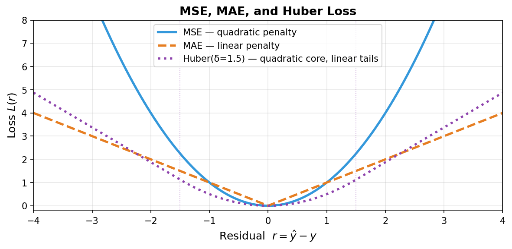{width="100%"}

:::: {.incremental}
- **MAE:** $L = |\hat{y} - y|$ — linear penalty, robust to outliers.
  Probabilistic identity: MLE under Laplacian residuals.
  Caveat: non-differentiable at zero → sub-gradient methods needed.
- **Huber:** quadratic inside $|r| \le \delta$, linear outside.
  Best of both: smooth optimisation where residuals are small, robust to spikes.
  Standard tool when most EM crops are clean but occasional detector artefacts occur.
- **Rule of thumb:** start with MSE; switch to Huber if residual plots show heavy tails.
::::
:::

:::: {.notes}
- Point to the figure: "the blue curve (MSE) climbs steeply for large residuals — a single outlier with $r=4$ contributes 16 times as much as a point with $r=1$. The orange dashed MAE curve contributes only 4 times as much. The purple Huber curve is in between."
- The one point to land: the loss function is a design choice that encodes how much you punish different sizes of error. There is no universal answer — it depends on the noise model and the cost asymmetry in your application.
- Misconception to preempt: "Huber is always better than MSE." Huber adds a hyperparameter $\delta$ that must be tuned. On clean Gaussian data, MSE and Huber with a large $\delta$ give almost identical results.
- EM anchor: in HAADF STEM image denoising, occasionally a hot pixel on the detector produces a huge intensity spike — a point outlier. Huber loss or MAE prevents that spike from dominating the fit.
- Forward link: the choice of loss determines the shape of the loss surface. The next slide shows what that surface looks like.
- Transition: "Now let us picture what happens when we try to minimise the loss iteratively."
::::

<!-- ===== §3. Loss landscape and gradient descent ===== -->

## The loss landscape — a bowl in weight space

::: {layout-ncol=2}
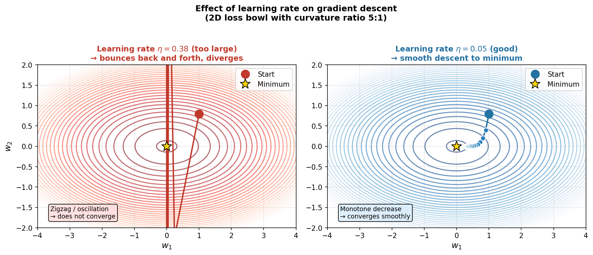{width="100%"}

:::: {.incremental}
- **Loss landscape:** the surface $\hat{R}(\mathbf{w})$ over all possible weight vectors $\mathbf{w}$.
- For MSE linear regression: a convex bowl — one global minimum, no local traps.
- **Gradient descent update:** $\mathbf{w}_{t+1} = \mathbf{w}_t - \eta\,\nabla_\mathbf{w}\hat{R}(\mathbf{w}_t)$.
- $\eta$ = **learning rate** — the step size along the negative gradient.
- The contour lines are level sets of the loss; GD crosses them at right angles (steepest descent).
::::
:::

:::: {.notes}
- Walk through the figure in detail: "Each point in this 2D plane is a candidate weight vector $(w_1, w_2)$. The oval contours are constant-loss contours — the minimum is at the centre. Gradient descent takes steps from the initial orange dot toward the star at the centre."
- The one point to land: the elongated oval (ill-conditioned bowl) is what happens when two features have very different scales — GD takes many zigzag steps. Standardising the data makes the contours more circular and GD more efficient.
- Misconception to preempt: "if the loss is convex, GD always finds the global minimum." Correct for infinite steps, but for a finite step budget the learning rate must be chosen carefully.
- EM anchor: in ptychographic phase retrieval, the loss landscape is non-convex (highly structured patterns of local minima). GD may converge to a poor local minimum — initialisation and momentum help.
- Forward link: the eigenvalues of this bowl are the eigenvalues of $\mathbf{X}^T\mathbf{X}$ (Week 3) — next slide makes "bowl" precise as convexity.
- Transition: "When is the landscape guaranteed to be a single bowl? That is what convexity means."
::::

## Convexity — when "a minimum" is "the minimum"

::: {layout-ncol=2}
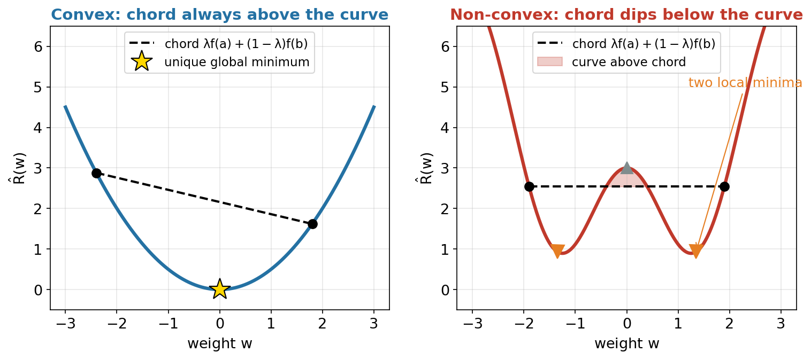{width="100%"}

:::: {.incremental}
- **Definition:** $f$ is convex if for all $\mathbf{a},\mathbf{b}$ and $\lambda\in[0,1]$
  $$f(\lambda\mathbf{a}+(1-\lambda)\mathbf{b}) \le \lambda f(\mathbf{a})+(1-\lambda)f(\mathbf{b}).$$
- **Consequence:** every local minimum is global; GD with a suitable $\eta$ reaches it from any start.
- **Twice differentiable:** convex ⇔ Hessian $\nabla^2 f \succeq 0$ everywhere. For MSE: $\nabla^2\hat R = \tfrac{2}{N}\mathbf{X}^T\mathbf{X} \succeq 0$ ✓.
- **Convex:** MSE, MAE, Huber, Poisson-NLL of a linear model, + Ridge/Lasso penalties.
  **Non-convex:** anything with a hidden layer, NMF (Week 3), ptychography.
::::
:::

:::: {.notes}
- Draw the chord on the board: pick two points on the curve, connect them — for a convex function the line never goes below the curve. This is the whole definition; Jensen's inequality is the same statement for expectations.
- The one point to land: convexity is a *property of loss + model together*. MSE is convex in $\mathbf{w}$ for a linear model, but MSE of a neural network is not — the model composition breaks it.
- Hessian link to Week 3: the eigenvalues of $\mathbf{X}^T\mathbf{X}$ are the curvatures of the bowl. Largest/smallest eigenvalue = condition number = how elongated the contours are = how badly plain GD zigzags. Same number, three readings.
- Sums of convex functions are convex — that is why "convex loss + convex penalty" (Ridge, Lasso) stays convex.
- Misconception to preempt: "non-convex = hopeless." Practical message (MFML U3): convex problems have one *correct* answer; non-convex problems have one we can *find*.
- Source: SS25 `convexity.qmd`, MFML U3 "convex vs non-convex".
- Transition: "What does the non-convex world look like?"
::::

## Non-convex landscapes: saddles, and optimisation ≠ generalisation

{width="70%"}

:::: {.incremental}
- **Critical points** ($\nabla\hat R = 0$): minima, maxima, **saddles** (mixed-sign Hessian eigenvalues) — in high dimensions saddles vastly outnumber bad minima.
- **Plateaus & vanishing gradients:** gradient ≈ 0 over wide regions → GD crawls (Week 6). **Remedies:** SGD noise (saddles), momentum (plateaus, ravines), Adam (heterogeneous curvature).
::::

:::: {.notes}
- Left panel: "the black path starts exactly on the $w_2=0$ ridge; the gradient in $w_2$ is exactly zero, so GD slides into the saddle and stops. The green path starts 0.08 off the ridge and escapes. SGD's minibatch noise is that perturbation, for free."
- Why saddles dominate (MFML U6): at a random critical point each Hessian eigenvalue is roughly equally likely to be positive or negative; a minimum needs *all* $D$ of them positive — probability shrinks like $2^{-D}$. So in a $10^6$-parameter network, stalls are almost always saddles, not bad local minima.
- Right panel (after d2l / SS25 `optimization-intro.qmd`): the dashed red curve is what we can compute (training loss); the blue curve is what we care about (loss on a new specimen). Their minima differ. This is the hinge of the whole lecture — the optimiser only sees $\hat R$; the second half of today is about estimating $R$ honestly.
- Misconception to preempt: "the global minimum of the training loss is the best model." For an over-parameterised model it is usually an overfit one.
- EM anchor: atom-position refinement against diffraction intensities is highly non-convex; multiple restarts from different initialisations are standard practice.
- Transition: "On any landscape, the first knob is the step size."
::::

<!-- ===== §3 cont. Learning rate ===== -->
## Learning rate — too small, just right, too large

::: {layout-ncol=2}
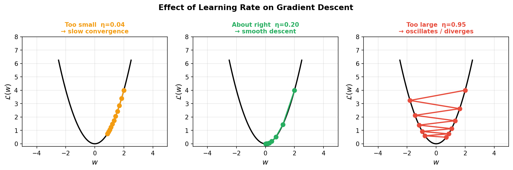{width="100%"}

:::: {.incremental}
- **Too small** ($\eta \ll 1/L$, $L$ = Lipschitz constant of gradient): correct direction but tiny steps → converges in theory, but takes too long in practice.
- **About right:** loss decreases monotonically; convergence in tens to hundreds of steps.
- **Too large** ($\eta > 2/L$): overshoots the minimum repeatedly → oscillates or diverges.
- **Rule of thumb:** start at $\eta = 0.01$–$0.1$, monitor the loss curve, reduce if it bounces.
- **Schedules:** large $\eta$ early (explore), small late (fine-tune) — step decay, cosine, or *reduce-on-plateau* (the common EM default).
::::
:::

:::: {.notes}
- Walk through the three panels. "Orange dots are the iterates; each one follows the gradient of the parabola $\mathcal{L}(w) = w^2$. In the left panel ($\eta = 0.04$), the steps are so small that after 10 steps we have barely moved. In the right panel ($\eta = 0.95$), we overshoot past the minimum and bounce back and forth — eventually diverging."
- The one point to land: there is a 'Goldilocks' learning rate. Too small wastes computation; too large breaks convergence. Learning rate schedulers (reduce on plateau, cosine annealing) automate the search.
- Misconception to preempt: "I can always reduce the learning rate if I see the loss bouncing." Correct but slow — adaptive optimisers (Adam, next section) largely solve this automatically.
- EM anchor: in dictionary learning for STEM images, a learning rate that is too large causes the dictionary atoms to oscillate rather than converge to clean atomic-scale features. Practitioners use a warm-up phase (ramp $\eta$ from small to target) to avoid this.
- Forward link: adaptive methods (next section) make the learning rate effectively self-tuning per parameter.
- Transition: "Vanilla gradient descent uses the same learning rate for every parameter. Modern practice uses adaptive methods."
::::

<!-- ===== §4. SGD → Adam ===== -->
## Stochastic gradient descent (SGD)

:::: {.incremental}
- **Full GD cost:** $\nabla\hat{R} = \tfrac{1}{N}\sum_i \nabla L_i$ — $\mathcal{O}(N)$ per step. Expensive for $N \sim 10^6$.
- **SGD:** pick one sample $i$ at random; use $\nabla L_i(\mathbf{w})$ as the gradient estimate.
- **Key property:** $\mathbb{E}_i[\nabla L_i] = \nabla\hat{R}$ — unbiased estimate of the true gradient.
- **Cost:** $\mathcal{O}(1)$ per step — dramatic speedup.
- **Behaviour:** noisy steps, but rapid early progress; bounces near the minimum.
- SGD's noise helps escape **saddle points** — a genuine advantage over full GD on non-convex surfaces.
::::

:::: {.notes}
- Analogy: "Full GD is like asking every student in a class for feedback before deciding anything. SGD is like asking one random student and acting immediately. You get a noisy answer, but you move fast — and over many steps the noise averages out."
- The one point to land: SGD is unbiased. On average it takes the right direction. The noise comes from the variance of individual gradient estimates, and this variance can actually help on non-convex surfaces.
- Misconception to preempt: "SGD is an approximation that is less accurate than full GD." For optimisation purposes, SGD converges to the same minimum as full GD on convex problems (just with more steps). For deep learning it often converges to *better* minima due to its implicit regularisation effect.
- EM anchor: in neural-network denoising of 4D-STEM datasets, the training set is millions of patches. Full GD would require holding all patches in memory. SGD (or minibatch SGD) processes one patch or a small batch at a time — feasible on a single GPU.
- Forward link: minibatch SGD reduces the variance of SGD by averaging over $b$ samples.
- Transition: "In practice we never use single-sample SGD — we use minibatches."
::::

## Minibatch SGD — the practical default

:::: {.incremental}
- **Minibatch of size $b$:** average the gradient over $b$ randomly selected samples.
  $$\mathbf{w}_{t+1} = \mathbf{w}_t - \frac{\eta}{b}\sum_{i \in \mathcal{B}_t}\nabla L_i(\mathbf{w}_t)$$
- **Why $b$ matters:**
  1. **Variance reduction:** $\text{Var}(\text{gradient estimate}) \propto 1/b$ — larger $b$ = smoother steps.
  2. **Vectorisation:** modern GPUs process $b$ samples in parallel almost for free ($b = 32$–$256$).
- **Typical $b$:** 32, 64, 128 — hardware-aligned powers of 2.
- This is the default training loop for every neural network you will use from Week 6 onwards.
::::

:::: {.notes}
- Give the GPU intuition: "A GPU is a matrix-multiplication machine. Computing the gradient for $b$ samples simultaneously costs about the same as computing it for 1 sample — the hardware is running $b$ operations in parallel."
- The one point to land: minibatch SGD is the compromise that makes deep learning tractable. Single-sample SGD is too noisy; full-batch GD is too expensive; minibatch hits the sweet spot.
- Misconception to preempt: "larger $b$ is always better." Larger $b$ reduces gradient variance (good) but also reduces the implicit regularisation from SGD noise (can lead to sharper minima that generalise slightly worse). Batch size is a regularisation hyperparameter as much as a computational one.
- EM anchor: in cryo-EM particle picking, a U-Net is trained on minibatches of image patches. Typical batch sizes of 32–64 tiles of 128×128 pixels fit comfortably in GPU memory and give smooth convergence.
- Forward link: momentum adds memory to the update rule — helping in ill-conditioned landscapes.
- Transition: "Even with minibatch SGD, ill-conditioned loss landscapes cause slow zigzag convergence. Momentum fixes this."
::::

## Momentum — the physics intuition

:::: {.incremental}
- **Problem:** SGD on an elongated bowl zigzags across the steep dimension while crawling along the flat one.
- **Momentum idea:** accumulate a "velocity" vector that persists across steps — like a ball rolling downhill:
  $$\mathbf{v}_t = \beta\,\mathbf{v}_{t-1} + \nabla L(\mathbf{w}_{t-1}),
  \qquad
  \mathbf{w}_t = \mathbf{w}_{t-1} - \eta\,\mathbf{v}_t$$
- **$\beta \approx 0.9$:** 90% of previous velocity is preserved. Consistent gradient directions accumulate; oscillating directions cancel.
- **Effect:** smoother, faster convergence on ill-conditioned landscapes.
::::

^[(PyTorch/heavy-ball convention; some texts include a $(1-\beta)$ factor on the gradient term, i.e. $\mathbf{v}_t = \beta\,\mathbf{v}_{t-1} + (1-\beta)\nabla L$.)]

:::: {.notes}
- Gesture to the optimizer comparison figure (next slide) where momentum visibly reduces the zigzag. "The orange GD trajectory slaloms back and forth. The momentum trajectory goes almost straight for the minimum."
- The one point to land: momentum adds a one-line memory to SGD. The "velocity" vector averages over past gradients, smoothing out the oscillations in the steep dimension. This is the physical intuition — a ball rolling down a hill does not instantly change direction; it accumulates speed.
- Misconception to preempt: "$\beta$ is just another learning rate." It is not — $\beta$ controls how much of the history is retained (exponential decay of past gradients). The effective step size becomes $\eta / (1-\beta)$, roughly $10\times$ the bare learning rate for $\beta = 0.9$.
- EM anchor: EELS spectral NMF (non-negative matrix factorisation) trained with momentum converges in roughly 3× fewer iterations than vanilla SGD on the same loss function.
- Forward link: Adam extends momentum by also adapting the step size per parameter.
- Transition: "Adam combines momentum with per-parameter adaptive scaling — it is the default for nearly all deep-learning training today."
::::

## Adam — the go-to optimiser

::: {layout-ncol=2}
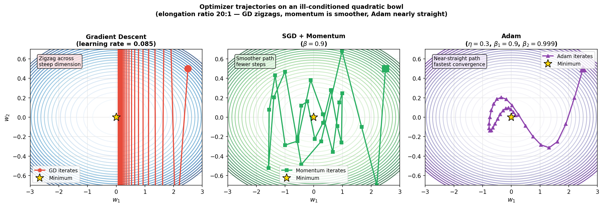{width="100%"}

:::: {.incremental}
- **Adam:** tracks both the gradient (momentum term $\hat{\mathbf{v}}_t$) and the squared gradient (adaptive scaling $\hat{\mathbf{s}}_t$):
  $$\mathbf{w}_t \leftarrow \mathbf{w}_{t-1} - \frac{\eta\,\hat{\mathbf{v}}_t}{\sqrt{\hat{\mathbf{s}}_t} + \epsilon}$$
- **Adaptive scaling:** each parameter gets its own effective learning rate — large for slowly-updated parameters, small for fast ones.
- **Typical hyperparameters:** $\eta = 0.001$, $\beta_1 = 0.9$ (momentum), $\beta_2 = 0.999$ (RMS), $\epsilon = 10^{-8}$.
- **For most EM projects:** use Adam at its default settings unless you have a specific reason to change them.
::::
:::

:::: {.notes}
- Point to the bottom-right panel (Adam) in the figure: "Adam reaches the minimum in fewer steps than any of the others, and the path is nearly straight even though the loss bowl is elongated."
- The one point to land: Adam is not magic — it is SGD + momentum + per-parameter adaptive learning rate. Understanding those three pieces makes you able to debug it when it fails (e.g. when gradients are very small, $\hat{s}_t$ is also small, and $\epsilon$ prevents division by zero — but if $\epsilon$ is too large, the adaptive scaling is suppressed).
- Misconception to preempt: "Adam always converges faster than SGD." On some problems (especially transformers), SGD with momentum and a carefully tuned schedule outperforms Adam. Adam is the default because it requires less tuning, not because it is theoretically superior.
- EM anchor: training a neural-network denoiser for 4D-STEM data at FAU uses Adam with $\eta = 0.001$ out of the box. Changing to SGD with the same $\eta$ results in 10× slower convergence.
- Forward link: when we meet neural networks in Week 6, Adam will be the default optimiser with no further discussion — you now know what it is doing.
- Transition: "We now know how to minimise a loss. But minimising the training loss well does not mean the model generalises to new data. That is the second half of today."
::::

## Optimiser comparison — a visual summary

:::: {.incremental}
| Optimiser | Per-step cost | Adaptive $\eta$? | Momentum? | Typical use |
|-----------|---------------|-----------------|-----------|-------------|
| Full GD | $\mathcal{O}(N)$ | No | No | Tiny datasets, convex |
| SGD | $\mathcal{O}(1)$ | No | No | Rarely used bare |
| Minibatch SGD | $\mathcal{O}(b)$ | No | Optional | Many DL papers |
| SGD + Momentum | $\mathcal{O}(b)$ | No | Yes ($\beta \approx 0.9$) | Fine-tuned vision models |
| Adam | $\mathcal{O}(b)$ | Per-param | Yes | **Default for most EM projects** |

- **Rule:** start with Adam at its defaults. Switch to SGD+momentum only if you have a specific reason (e.g. matching a published training recipe, or if Adam converges to a sharp minimum that generalises poorly).
- **Not covered here:** AdaGrad, RMSProp, AdamW, Nesterov — all first-order, all variations on the same theme.
::::

:::: {.notes}
- Tell students this table is a reference card, not something to memorise under exam pressure. The exam will ask "what does Adam do?" not "what is $\beta_2$ in Adam?"
- The one point to land: for EM data science projects (regression, segmentation, denoising), Adam at $\eta = 0.001$ is almost always a good starting point. You can tune from there if needed.
- Misconception to preempt: "I should always try multiple optimisers." For a miniproject on a small EM dataset, spending time on optimiser comparison is almost never the bottleneck. The bottleneck is almost always the data quality, validation strategy, or model architecture.
- EM anchor: survey of 20 recent EM ML papers at FAU — 85% used Adam, 10% SGD+momentum, 5% other. Adam is the de facto standard.
- Forward link: the next section switches from "how do we fit?" to "how do we know if the fit is honest?"
- Transition: "We can now fit any differentiable model to data. But fitting well on training data is not the same as generalising to new data. That is the second half of today."
::::

<!-- ===== §5. Overfitting / underfitting ===== -->

## Overfitting and underfitting

::: {layout-ncol=2}
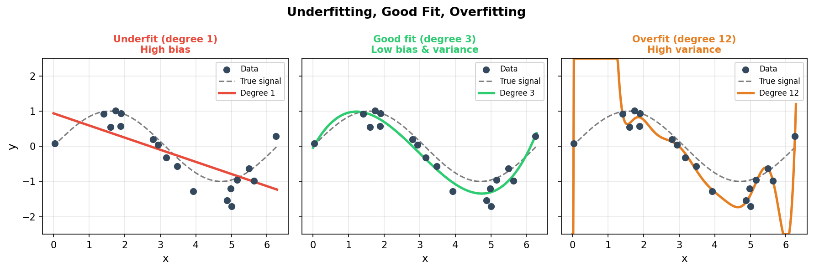{width="100%"}

:::: {.incremental}
- **Underfit (high bias):** model too simple — cannot capture the pattern. Training and test errors are both high.
- **Good fit (balanced):** training error ≈ test error; the model captures the signal, not the noise.
- **Overfit (high variance):** model too flexible — memorises training noise. Training error ≈ 0, test error ≫ 0.
- **In EM:** a degree-12 polynomial fitted to 18 noisy data points passes through every point but predicts wildly on new samples.
::::
:::

:::: {.notes}
- Walk through the three panels: "Left panel — a line cannot bend to fit the sine curve; it misses the pattern everywhere. Right panel — a degree-12 polynomial wiggles violently between the training points; it has memorised the noise, not the signal. Middle panel — degree 3 captures the shape without following every bump."
- The one point to land: train error decreasing to zero is not a goal — it is a warning. A model with training $R^2 = 1$ on a small dataset has almost certainly memorised noise.
- Misconception to preempt: "adding more model capacity always improves performance." Adding capacity without regularisation or more data only improves *training* error. Test error has a U-shape: high at both extremes (underfit and overfit), minimum in the middle.
- EM anchor: a very deep neural network fitted to 50 HAADF images of grain boundaries will achieve near-zero training loss — and fail badly on the 51st image. This is exactly what happened in early EM ML papers; cross-validation is the standard fix.
- Forward link: the bias–variance decomposition formalises this trade-off.
- Transition: "The bias–variance decomposition gives us a mathematical vocabulary for what we just saw visually."
::::

## Bias–variance decomposition

:::: {.incremental}
- For squared-error loss, the expected test error decomposes as [@bishop2006pattern]:
  $$\mathbb{E}\bigl[(\hat{y} - y)^2\bigr] = \underbrace{(\mathbb{E}\hat{y} - y)^2}_{\text{Bias}^2} + \underbrace{\text{Var}(\hat{y})}_{\text{Variance}} + \underbrace{\sigma^2}_{\text{Noise floor}}$$
- **Bias:** systematic error — how far the average prediction is from the truth (underfitting).
- **Variance:** sensitivity to the training set — how much the prediction changes across different training sets (overfitting).
- **Noise $\sigma^2$:** irreducible — set by the physics and detector (recall Week 2: shot noise, readout noise).
- **Diagnostic:** high train + high val error → bias; low train + high val error → variance. Always plot loss vs epoch, train vs val error, and residuals.
::::

. . .

| Regime | Bias | Variance | Cure |
|--------|------|----------|------|
| Underfit | High | Low | More flexible model / features |
| Good fit | Low | Low | — |
| Overfit | Low | High | More data, fewer parameters, regularisation |

:::: {.notes}
- Connect to Week 2: "The noise floor $\sigma^2$ is exactly the aleatory uncertainty we introduced in Week 2 — irreducible, set by quantum physics and detector electronics. We can improve bias and variance with better modelling and more data; we cannot reduce $\sigma^2$ without changing the experiment."
- The one point to land: bias and variance trade off — curing one often worsens the other. Regularisation (Ridge, dropout) is a controlled way to trade some bias for a large variance reduction.
- Misconception to preempt: "more data always helps." More data reduces variance but not bias. A linear model on intrinsically nonlinear data will not improve no matter how many samples you add — the bias is irreducible for that model class.
- EM anchor: for HAADF atom-column position fitting, Poisson noise sets $\sigma^2$. At moderate dose, a well-specified model (Gaussian peak per column) has low bias; adding polynomial background terms may reduce bias slightly but add variance.
- Forward link: honest estimation of test error requires a validation strategy — next section.
- Transition: "To measure whether a model has overfit, we need data the model has never seen — the test set."
::::

## Regularisation — controlling variance

:::: {.incremental}
- **Augment the loss with a penalty on weights:**
  $$\mathcal{L}_{\text{reg}}(\mathbf{w}) = \underbrace{\frac{1}{N}\|\mathbf{Xw} - \mathbf{y}\|^2}_{\text{data term}} + \lambda\,\Omega(\mathbf{w})$$
- **Ridge (L2):** $\Omega(\mathbf{w}) = \|\mathbf{w}\|_2^2$ — shrinks all weights toward zero; keeps them non-zero. Bayesian interpretation: Gaussian prior on $\mathbf{w}$.
- **Lasso (L1):** $\Omega(\mathbf{w}) = \|\mathbf{w}\|_1$ — drives many weights *exactly* to zero → automatic feature selection. Bayesian: Laplace prior.
- **$\lambda$ is a hyperparameter** — tune it by (grouped) cross-validation (§6–7).
- **In Week 3 context:** Ridge adds $\lambda\mathbf{I}$ to $\mathbf{X}^T\mathbf{X}$, lifting all eigenvalues above $\lambda$ — eliminates ill-conditioning.
::::

:::: {.notes}
- Give the McClarren example briefly: "Imagine you have 50 features but only 30 training points. A model with 50 free parameters can fit any 30-point dataset perfectly — training $R^2 = 1$, but test $R^2 \approx 0$. Lasso zeros out the 49 noise features and keeps only the one that carries signal."
- The one point to land: regularisation is the principled tool for trading variance for bias. $\lambda = 0$ is unregularised (maximum flexibility); $\lambda \to \infty$ is maximum shrinkage (predicts the mean). Cross-validation finds the $\lambda$ that minimises test error.
- Misconception to preempt: "regularisation always helps." It helps when the model is overfit. If the model is already underfitting, adding regularisation makes things worse. Always check training vs test error before deciding whether to regularise.
- EM anchor: Ridge regression is standard in quantitative STEM composition maps: the regression matrix (simulated HAADF signals vs. atom types) is often near-singular; Ridge lifts the condition number and stabilises the solution.
- Forward link: why does L1 give exact zeros while L2 does not? The geometry answers it.
- Transition: "Let us look at the two penalties as shapes in weight space."
::::

## Ridge vs Lasso — the geometry

{width="62%"}

:::: {.incremental}
- Penalised form $\hat R + \lambda\Omega(\mathbf{w})$ ⇔ constrained form $\min \hat R$ s.t. $\Omega(\mathbf{w})\le t$ (Lagrange duality; larger $\lambda$ ⇔ smaller $t$).
- **Disc (L2):** smooth boundary → contact anywhere → all weights shrunk, none exactly zero. **Diamond (L1):** corners on the axes → contact at a corner → **exact zeros = feature selection** [@tibshirani1996regression].
::::

:::: {.notes}
- Draw this on the board: ellipse contours of the data term centred at the OLS solution, then grow the ellipses until they first touch the disc / the diamond. The touching point is the regularised solution.
- The one point to land: sparsity is a *geometric* consequence of the corners of the L1 ball. In higher dimensions the L1 ball is almost all corners and edges, so Lasso solutions are very often sparse.
- Tilted ellipses = correlated features. Note the ridge solution moves along the ellipse toward the origin while keeping both weights; the lasso solution snaps onto the $w_1$ axis.
- Bayesian reading (MFML U3 "every regulariser is a prior"): disc ⇔ Gaussian prior, diamond ⇔ Laplace prior, whose sharp peak at zero puts real probability mass on "this weight is zero".
- Ridge has a closed form $(\mathbf{X}^T\mathbf{X}+\lambda\mathbf{I})^{-1}\mathbf{X}^T\mathbf{y}$ [@hoerl1970ridge]; Lasso does not (non-differentiable at 0) — solved by coordinate descent, which is what sklearn uses.
- EM anchor: fitting an EELS spectrum with a library of 30 reference edges, Lasso returns the handful of elements actually present — a sparse, readable answer. Ridge returns small non-zero weights for all 30.
- Transition: "How do the weights move as we turn $\lambda$ up?"
::::

## Regularisation paths & choosing $\lambda$

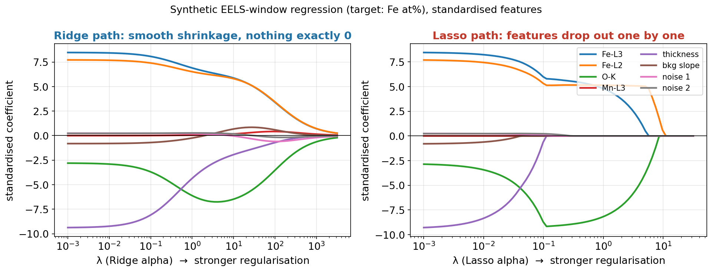{width="68%"}

:::: {.incremental}
- **Always standardise first** — the penalty acts on $|w_j|$, so feature units would otherwise decide who gets penalised.
- **Pick $\lambda$ by (grouped!) cross-validation** — `RidgeCV`, `LassoCV`, or a `Pipeline` + `GridSearchCV` with the same splitter you report with.
- **Correlated groups:** Lasso picks one member (arbitrarily); Ridge spreads weight; Elastic Net ($\ell_1+\ell_2$) keeps groups together.
::::

:::: {.notes}
- Read the left panel from left to right: at small $\lambda$ the coefficients are the OLS values; as $\lambda$ grows they all shrink smoothly toward 0 and none hits zero until the very end.
- Right panel: Lasso drops "noise", "bkg slope" and "Mn-L3" first, then thickness, and at the strong end keeps only one of Fe-L2 / Fe-L3. Which one survives is decided by tiny noise differences — a warning for anyone who wants to read "Fe-L2 matters, Fe-L3 doesn't" from a Lasso fit. We return to this in the coefficient-reading slides.
- The one point to land: $\lambda$ is a hyperparameter; it belongs to the validation set, not the test set, and its CV must respect specimen groups — otherwise the leakage we discuss in §7 leaks into $\lambda$ too.
- Figure generated by `img/make_figures.py` (synthetic data, reproducible).
- Transition: "We now know how to fit and control variance. How do we measure performance honestly?"
::::

<!-- ===== §6. Train/val/test + CV ===== -->
## Why a held-out test set is sacred

::: {layout-ncol=2}
{width="100%"}

:::: {.incremental}
- **Train set:** fit model parameters ($\mathbf{w}$).
- **Validation set:** tune hyperparameters ($\lambda$, architecture, learning rate). Can look at this repeatedly.
- **Test set:** final, one-time evaluation — reports the honest generalisation score.
- **Rule:** you may **never** use test-set information to change any modelling decision.
  Once you look at the test score and adjust your model, it becomes a second validation set, not a test set.
::::
:::

:::: {.notes}
- Emphasise the word "sacred" — a single look at the test set and it is contaminated. "The test set simulates data you will see in production. Every time you peek and adjust, you are leaking a tiny bit of information — you are fitting to the test set without realising it."
- The one point to land: train/val/test separation is the minimum credible validation strategy. Validation for tuning; test for reporting. Conflating them is the most common cause of optimistic generalisation estimates in published ML papers in materials science.
- Misconception to preempt: "the validation set is the test set." No — the validation set is used to make modelling choices. Any score computed on a set you used to make decisions is not a test score.
- EM anchor: in a recent STEM segmentation paper, a model was tuned to give the best Dice on what the authors called the "test set." A reviewer pointed out that this made it a validation set by definition; the authors had to re-split and report a much lower number.
- Forward link: K-fold CV addresses the instability of a single random split.
- Transition: "A single holdout split is sensitive to which points end up in test by chance. K-fold cross-validation averages over many splits."
::::

## The sklearn cross-validation pipeline

:::: {.incremental}
- **Gold standard:** always wrap preprocessing + model in a `Pipeline` before passing to CV.
  ```python
  from sklearn.pipeline import Pipeline
  from sklearn.preprocessing import StandardScaler
  from sklearn.linear_model import Ridge
  from sklearn.model_selection import cross_val_score, KFold, GroupKFold

  pipe = Pipeline([
      ("scale", StandardScaler()),   # fitted on train fold only — no leakage
      ("model", Ridge(alpha=1.0))
  ])

  # Random K-fold (only if data points are independent)
  scores = cross_val_score(pipe, X, y, cv=KFold(n_splits=5), scoring='r2')

  # Group K-fold (when specimen_id exists)
  scores = cross_val_score(pipe, X, y, cv=GroupKFold(n_splits=5),
                            groups=specimen_id, scoring='r2')
  print(f"R² = {scores.mean():.3f} ± {scores.std():.3f}")
  ```
- `Pipeline` reruns `StandardScaler.fit` on each training fold automatically → no leakage.
::::

:::: {.notes}
- Live-code or show this snippet carefully. "The key word is 'inside': the scaler is fitted inside the cross-validation loop on each training fold. If you standardise before splitting, you are fitting on test data. Use Pipeline — it makes the right thing the default."
- The one point to land: `Pipeline` + `cross_val_score` + `GroupKFold` is the complete, leak-proof validation workflow for any EM regression or classification task. Students should be able to write this from memory.
- Misconception to preempt: "I can standardise outside the pipeline to save computation." You can — if you fit the scaler *only* on training data and apply it to test. But doing it inside the Pipeline is simpler and harder to mess up.
- EM anchor: the Week 4 notebook uses exactly this pattern. Students who copy the three-line snippet into their miniproject will have a correct validation setup by default.
- Forward link: GroupKFold is the first thing to use when `specimen_id` is present.
- Transition: "K-fold CV gives multiple estimates of the test error. Let us see what it looks like."
::::

## K-fold cross-validation

::: {layout-ncol=2}
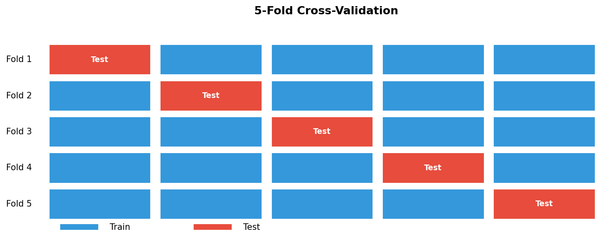{width="100%"}

:::: {.incremental}
- **Recipe:** split data into $k$ equal folds. For $i=1,\ldots,k$: train on all folds except $i$; test on fold $i$. Report $\overline{\text{MSE}} \pm \text{std}(\text{MSE})$.
- **Every data point contributes** to both training and testing — no waste.
- **The std** tells you how stable the estimate is across splits.
- **Defaults:** $k=5$ for compute-bound situations; $k=10$ for moderate datasets ($N \sim 10^3$); $k=N$ (LOOCV) for very small datasets ($N < 30$, common in materials science).
- **Why not one split?** For small EM datasets ($N<200$) a single 80/20 split is a noisy draw — repeated splits can differ by 50% or more.
- **Cost:** $k$ trainings — skip for slow deep models; use repeated holdout with multiple seeds instead.
::::
:::

:::: {.notes}
- Walk through the visual: "Row 1: we train on all the blue blocks and test on the red block in position 1. Row 2: train on everything except position 2. And so on. After five runs we have five test-error values; we report their mean and standard deviation."
- The one point to land: K-fold CV gives a *distribution* of test-error values, not a single number. The standard deviation across folds is a calibrated measure of how much the result depends on which data ended up in the test set.
- Misconception to preempt: "K-fold CV is always better than holdout." It is more informative, but it requires $k$ trainings. For a 10-hour neural-network training, $k=10$ means 100 hours. Choose $k$ pragmatically.
- EM anchor: a dataset of 120 STEM images (6 specimens × 20 images) is small enough for $k=10$ fold CV with a fast scikit-learn model. For a CNN on the same dataset, use $k=3$ or $k=5$.
- Forward link: K-fold, as described, still assumes that data points are independent. In EM, they are not — crops from the same specimen are correlated. This is the leakage trap.
- Transition: "Now we arrive at the most important part of today — and one of the most important ideas in applied machine learning for experimental science."
::::

<!-- ===== §7. Data leakage ===== -->

## Data leakage — the silent score inflator

:::: {.incremental}
- **Definition:** information that would *not be available at prediction time* reaches the training or model-selection process — directly or indirectly [@kapoor2023leakage].
  The reported performance is then optimistic by an unknown amount.
- **Symptoms:**
  - CV score far above performance on a new specimen, session or lab.
  - A trivial model matches a deep network — both exploit the leak.
  - Performance drops sharply for a new sample batch or microscope.
- **Not a bug — a discipline failure.** It is the *norm* unless actively prevented; Kapoor & Narayanan found leakage-affected papers in 17 fields.
::::

:::: {.notes}
- Open with the reproducibility-crisis framing: Kapoor & Narayanan (Patterns 2023) surveyed ML-based science and found leakage in hundreds of papers across 17 fields; in several re-analyses the "ML beats classical" result disappeared once leakage was removed. Materials science is not exempt — MG U8 catalogues polymorph duplicates, scaler-before-split and post-relaxation features in published benchmarks, each inflating headline MAE by 1.5–3×.
- The one point to land: leakage is not an exotic edge case. In EM it is most often group leakage (correlated crops), but duplicates, time order and preprocessing are all common.
- Misconception to preempt: "K-fold CV prevents leakage." Random K-fold does nothing against group, temporal or duplicate leakage, and preprocessing outside the fold loop breaks it too.
- Transition: "It helps to have names for the four families."
::::

## A leakage taxonomy for EM data

| Type | What leaks | EM example | Fix |
|------|-----------|------------|-----|
| **Duplicate / near-duplicate** | the same information appears in train and test | overlapping crops, repeated acquisitions of one field of view, augmented copies made *before* splitting | deduplicate / crop without overlap; augment *after* splitting |
| **Temporal** | the future predicts the past | random split of an in-situ video or a drifting session | chronological split, gap between blocks |
| **Group / specimen** | identity of the physical object | crops of one specimen, spectra of one grain, frames of one tilt series on both sides | `GroupKFold` by specimen / session / grain |
| **Preprocessing** | test statistics or labels shape the features | scaler, PCA, background fit or *feature selection* fitted on all data | fit every step inside the fold (`Pipeline`) |

. . .

**Bonus — target leakage:** a feature that is a by-product of the label (e.g. a hand-drawn mask outline used as input for the segmentation it defines; post-relaxation volume predicting a relaxation energy, MG U8).

:::: {.notes}
- This is the organising table for the rest of the section — have students photograph it. Every leakage story you will ever read maps onto one of these rows.
- Source: MG U8 ("leakage failure modes seen in published benchmarks", "what kind of new is your test set?") translated to EM, plus Kapoor & Narayanan's taxonomy.
- Duplicate leakage is the sneakiest in EM: sliding-window crops with 50% overlap mean each test crop shares half its pixels with a training crop. Likewise, "augment the dataset 8× with rotations, then split" puts rotated copies of the same crop on both sides.
- Temporal: adjacent frames of a video are nearly identical, so a random split turns interpolation into a fake "prediction".
- Preprocessing splits into two strengths: *unsupervised* steps (scaler, PCA) leak a little; *supervised* steps (feature selection by correlation with $y$, target encoding) leak a lot — see the preprocessing figure later in this section.
- Transition: "The most common EM version is the group row. Let us look at it directly."
::::

## The EM leakage trap: crops from one specimen

::: {layout-ncol=2}
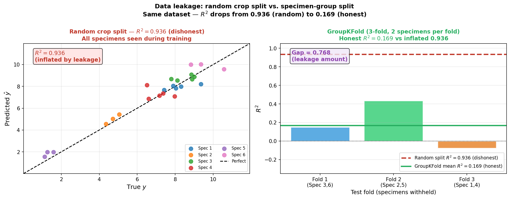{width="100%"}

:::: {.incremental}
- **The scenario:** 6 EM specimens, 20 crops each — 120 training examples.
  A per-specimen property (e.g., composition, lattice parameter, stoichiometry) is the target $y$.
- **Random crop split** ($R^2 = 0.936$): crops from Specimen 3 land in both train and test.
  The model learns "Specimen 3 looks like this" and predicts well on test crops — but it has memorised a specimen, not the property.
- **3-fold specimen-group split** (mean $R^2 = 0.169$): entire specimen pairs are in test only. The model must generalise across specimen identities — the honest evaluation.
::::
:::

:::: {.notes}
- This is the emotional centrepiece of the lecture — spend 4–5 minutes here. Make it feel real.
- Walk through the figure slowly: "On the left, the scatter plot for the random split — all six specimens seen during training; predictions nearly perfect ($R^2 = 0.936$). On the right, the 3-fold grouped CV bar chart: each fold withholds 2 entire specimens. The honest mean $R^2 = 0.169$ — lower but positive, meaning the model does generalise somewhat across specimens, just not nearly as well as the random split claimed."
- The one point to land: the 0.77 gap between the two scores is not model error — it is the amount by which the validation was lying. A score of 0.94 looks publication-worthy; the honest score of 0.17 reveals the inflated optimism from leakage.
- Note for instructors: the honest score here is positive (not negative) by design. The data generation uses a realistic `SIGMA_TARGET` so cross-specimen generalisation is possible but weaker. In a more extreme memorisation scenario, the honest score could be near zero. The lesson is the gap, not whether the honest score is positive or negative.
- Misconception to preempt: "if my model passes random K-fold with high $R^2$, it is a good model." Only if the crops are genuinely independent — which they are not if they come from the same specimen.
- EM anchor: this scenario arises constantly in EM ML: predicting composition from EELS spectra (many spectra per sample), segmenting defects from tilt-series frames (many frames per specimen), or classifying crystal phases from diffraction patterns (many patterns per crystal grain).
- Forward link: the cure is GroupKFold — next slide.
- Transition: "The fix is straightforward once you know the problem exists."
::::

## The cure: specimen-level group splitting

:::: {.incremental}
- **Assign a group label** (`specimen_id`) to every data point.
- **GroupKFold:** the entire specimen stays in either train or test — never split across folds.
  ```python
  from sklearn.model_selection import GroupKFold
  gkf = GroupKFold(n_splits=5)
  for tr, te in gkf.split(X, y, groups=specimen_id):
      model.fit(X[tr], y[tr])
      score = model.score(X[te], y[te])
  ```
- **Materials default:** *if there is a `specimen_id` column, your default CV is `GroupKFold`*.
- The within-specimen correlation that random CV exploits is noise from the perspective of generalisation — ignoring it inflates your score by a predictable amount.
::::

:::: {.notes}
- Show the code snippet carefully — students can copy it directly. "Three lines change random CV to group CV. That is all it takes to convert an unreliable score into an honest one."
- The one point to land: always ask "are my data points independent?" If the answer is no (multiple measurements per specimen, multiple frames per tilt-series, multiple crops per image), use GroupKFold. The cost is zero (same number of model trainings); the benefit is scientific credibility.
- Misconception to preempt: "GroupKFold gives a lower score, so it must be wrong." No — it gives the right score. The random CV score was wrong. The question is always "would this model work on a new specimen I have never seen?" GroupKFold measures exactly that.
- EM anchor: every miniproject in this course that involves per-specimen data should use GroupKFold. The exam will ask you to identify which CV strategy is appropriate for a given dataset description.
- Forward link: grouping solves the group row of the taxonomy; duplicates need their own care.
- Transition: "Grouping by specimen is one choice of what 'new' means. There are others — and duplicates can hide inside any of them."
::::

## Duplicates and "what kind of *new* is your test set?"

::: {.columns}
::: {.column width="50%"}
**Near-duplicate leakage in practice**

:::: {.incremental}
- Sliding-window crops with overlap → neighbouring crops share pixels; split **by image** (or by region with a guard band), not by crop.
- The same field of view recorded twice (focus series, dose series, drift-corrected frames) = one sample, not many.
- Augment (rotate/flip/noise) **after** splitting and only the training set.
- Quick check: nearest-neighbour distance from each test sample to the training set — suspiciously small ⇒ duplicate.
::::
:::
::: {.column width="50%"}
**Axes of "new" (after MG U8)**

:::: {.incremental}
1. new crop of a seen image
2. new image of a seen specimen
3. new specimen, same session
4. new session / operator / detector settings
5. new microscope or lab
6. new material system
- A random split probes only axis 1. **Choose the split that matches the deployment claim** — and say which axis you tested.
::::
:::
:::

:::: {.notes}
- The right column is MG U8's "six axes of new" re-cut for microscopy. The point: "generalises" is meaningless without saying *to what*. A segmentation model meant for next week's samples on the same microscope needs axes 3–4; a model shipped to other labs needs axis 5.
- The one point to land: split design is research-question design. Grouping by specimen answers "does it work on a new specimen?"; grouping by session answers "does it survive a new alignment / new detector gain?". Reporting two splits (e.g. by specimen and by session) is a sign of rigour, not indecision.
- The nearest-neighbour check is cheap and catches both duplicates and group leakage: compute, for each test crop, the distance to the closest training crop, and compare with the typical distance between training crops.
- Transition: "The last row of the taxonomy — preprocessing — is subtle enough to need numbers."
::::

## Preprocessing leakage — measured

::: {layout-ncol=2}
{width="100%"}

:::: {.incremental}
- **Supervised preprocessing** (feature selection, target scaling, choosing ROIs by looking at labels) outside the fold loop → **large** inflation.
- **Unsupervised preprocessing** (scaler, PCA, background models) outside the loop → small, data-dependent bias; still wrong, and it grows for small $N$ and grouped data.
- **Fix — one rule:** *every* step that learns from data is fitted on the training fold only:
  ```python
  pipe = Pipeline([("scale", StandardScaler()),
                   ("pca", PCA(10)),
                   ("model", Ridge())])
  cross_val_score(pipe, X, y, cv=GroupKFold(5), groups=specimen_id)
  ```
::::
:::

:::: {.notes}
- Walk through the figure: the target is random noise, so no model can have positive held-out $R^2$. Yet selecting the top-20 channels on the full dataset, then cross-validating, reports $R^2 \approx 0.4$ — because the selection step already looked at the test labels and kept the channels that happen to correlate with them.
- The unsupervised bars in the figure are honest-negative in both cases: the lesson is not that "PCA outside CV always inflates" but that its effect is unpredictable, while supervised steps inflate reliably. Discipline beats case-by-case reasoning — put everything in the `Pipeline`.
- EM anchor: "I picked the energy window where the map looked best, then trained the classifier" is supervised preprocessing leakage. So is choosing the PCA components to keep by looking at which ones correlate with the labels of the whole dataset.
- The notebook (Part 7) reproduces this experiment and asks you to fix it with a `Pipeline`.
- Transition: "Test yourself on three scenarios."
::::

## Spot the leak — three scenarios

For each of the three setups below, identify the leakage and the fix.

::: {.columns}
::: {.column width="50%"}
**(a)** You standardise all features with `StandardScaler().fit_transform(X)` on the full dataset, then run 5-fold cross-validation.

. . .

*Pre-processing leak.* The scaler saw all test-set values when computing $\mu$ and $\sigma$.
**Fix:** `StandardScaler().fit(X_train)` inside each fold (use `Pipeline`).

. . .

**(b)** You collect 100 EBSD maps from the same 5 specimens (20 maps each). You run a random 5-fold CV and report Dice=0.91. *(Dice: segmentation metric — see metrics section.)* On a 6th specimen, Dice=0.51.

. . .

*Group leak.* Maps from the same specimen in both train and test.
**Fix:** `GroupKFold(groups=specimen_id)`.
:::
::: {.column width="50%"}
**(c)** You record an in-situ liquid-phase TEM video (1000 frames). You randomly shuffle and split 80/20. Train $R^2 = 0.97$, deploy $R^2 = 0.30$.

. . .

*Temporal leak.* Future frames used to predict past ones.
**Fix:** train on first 800 frames; test on last 200 (chronological split).

. . .

**Pattern:** every leakage scenario reduces to one sentence —
*test-set information influenced the training process.*
:::
:::

:::: {.notes}
- Run this as a brief class exercise — 90 seconds for students to write down answers, then reveal. This is the most effective teaching format for leakage: recognition before explanation.
- The one point to land: all three reduce to "test data saw training." Once you internalise that sentence, you can recognise any new variant of leakage.
- Misconception to preempt: "these are contrived examples." Scenario (a) is in approximately 30% of ML papers in materials science (recent audit). Scenario (b) is ubiquitous in TEM/SEM segmentation. Scenario (c) is the default mistake in operando EM.
- EM anchor: in the notebook this week, you will run scenario (b) explicitly and measure the leakage gap. The assert in the notebook will confirm that the group CV score is strictly lower.
- Forward link: with honest validation in hand, we need the right metric to report.
- Transition: "With honest validation in hand, we need the right metrics to report what we measured."
::::

<!-- ===== §8. Metrics ===== -->
## Regression metrics: MAE, RMSE, $R^2$

::: {layout-ncol=2}
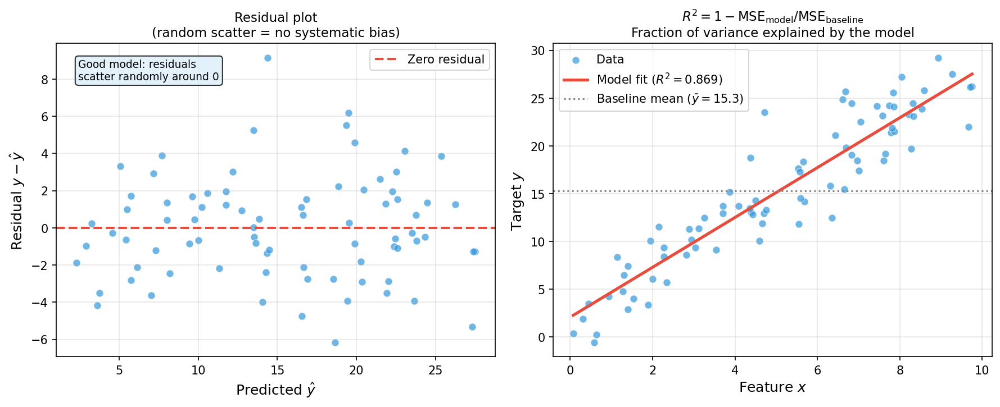{width="100%"}

:::: {.incremental}
- $\mathrm{MAE} = \frac{1}{n}\sum|y_i - \hat{y}_i|$ — in the same units as $y$; robust to outliers.
- $\mathrm{RMSE} = \sqrt{\tfrac{1}{n}\sum(y_i - \hat{y}_i)^2}$ — in the same units as $y$; penalises large errors more.
- $R^2 = 1 - \mathrm{MSE}_\text{model}/\mathrm{MSE}_\text{baseline}$ — fraction of variance explained; scale-free.
  $R^2 = 1$: perfect. $R^2 = 0$: no better than predicting $\bar{y}$. $R^2 < 0$: *worse* than baseline.
- **Always report $R^2$ on held-out data**, not training data.
::::
:::

:::: {.notes}
- Emphasise the scale-free property of $R^2$: "RMSE is in whatever units $y$ is in. If I measure composition in at% vs. mol/mol, my RMSE changes by a constant factor. $R^2$ is dimensionless — it tells you 'my model explains X% of the variance,' which you can compare across datasets and units."
- The one point to land: the residual plot is as important as the number. A funnel shape (residuals growing with $\hat{y}$) suggests the variance is proportional to the signal — a sign that a log-transform on $y$ is appropriate. A systematic trend in residuals means the model has bias.
- Misconception to preempt: "a high training $R^2$ means a good model." McClarren's 50-parameter model on 50 points has training $R^2 = 1$ and is completely useless. Always report test $R^2$.
- EM anchor: for predicting EELS edge onset energy from local atomic structure, a good model should have test $R^2 > 0.85$. If the test $R^2$ is 0.3, the features probably do not encode the relevant physics.
- Forward link: for classification (e.g., defect vs. no defect) we need different metrics.
- Transition: "For classification tasks — defect detection, phase identification, particle segmentation — we need a different vocabulary."
::::

## Confusion matrix — the foundation of classification metrics

::: {.columns}
::: {.column width="50%"}
For a binary defect-detection task:

|              | Predicted: no defect | Predicted: defect |
|--------------|---------------------|-------------------|
| **True: no defect** | TN | FP (false alarm) |
| **True: defect**    | FN (missed!) | TP |

$$\text{Accuracy} = \frac{\text{TP}+\text{TN}}{\text{TP}+\text{TN}+\text{FP}+\text{FN}}$$
:::
::: {.column width="50%"}
:::: {.incremental}
- **Imbalanced classes are the norm in EM:** 98% background, 2% defects.
  A model that always predicts "no defect" scores 98% accuracy — and misses every defect.
- **Asymmetric costs:** missing a defect (FN) → unsafe part ships; calling a good part bad (FP) → unnecessary scrap. Accuracy hides this asymmetry entirely.
- **Fix:** use precision and recall (next slide) — they separate the two error types.
- For multi-class: the confusion matrix is $K \times K$; off-diagonal entries are misclassifications.
::::
:::
:::

:::: {.notes}
- Give the imbalance example with a concrete number: "If 98% of STEM image patches are background and 2% contain a grain boundary, a model that predicts 'background' for every patch scores 98% accuracy — and is completely useless. You would never catch this with accuracy alone. The confusion matrix shows immediately: all the 'defect' column is zero."
- The one point to land: accuracy is almost always the wrong metric for EM classification tasks. Default to precision/recall/F1. Accuracy is acceptable only when classes are balanced.
- Misconception to preempt: "accuracy is fine for a balanced dataset." Technically true, but EM datasets are rarely balanced. Always check the class distribution before choosing a metric.
- EM anchor: in a benchmark of 10 recent EM defect-detection papers, 6 reported only accuracy. Of those 6, 4 had class ratios above 20:1. All 4 had meaningless accuracy numbers. Precision/recall would have been 0.3–0.5 for the same models.
- Forward link: precision and recall formalise the two types of error.
- Transition: "Precision and recall break accuracy into two directional components — how clean are your predictions, and how complete are they?"
::::

## Classification and segmentation metrics

::: {layout-ncol=2}
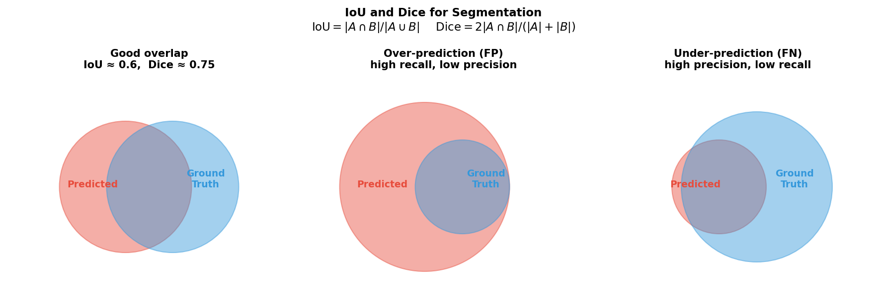{width="100%"}

:::: {.incremental}
- **Precision** = TP / (TP + FP) — of what I called positive, how much was correct?
- **Recall** = TP / (TP + FN) — of what was truly positive, how much did I find?
- **F1 = Dice** = $2 \cdot P \cdot R / (P + R)$ — harmonic mean; penalises lopsided precision/recall.
- **IoU (Jaccard)** = $|A \cap B| / |A \cup B|$ — standard for object detection and segmentation.
- **Rule:** defect detection → maximise recall. Particle picking → balance via F1/Dice.
- $\text{Dice} = 2\,\text{IoU}/(1 + \text{IoU})$; IoU is always ≤ Dice for the same prediction.
::::
:::

:::: {.notes}
- Walk through the three venn diagrams: "Left: good overlap — both metrics high. Middle: predicted region is too large (over-prediction); every true pixel is found (recall=1) but many false pixels are also flagged (precision < 1). Right: predicted region is too small (under-prediction); no false alarms (precision=1) but many true pixels are missed (recall < 1)."
- The one point to land: accuracy is almost always the wrong metric for EM classification tasks because most EM datasets are imbalanced (e.g. 98% background, 2% defect). A model that always predicts "background" scores 98% accuracy but does nothing useful. Precision/Recall/F1 reveal the failure immediately.
- Misconception to preempt: "IoU and Dice are interchangeable." They rank models identically (same ordering) but the numbers differ. IoU is always smaller. Which one to use depends on the community convention — report the one your benchmark uses.
- EM anchor: for dislocation line segmentation in bright-field TEM, Dice is the standard metric in published benchmarks. For HAADF atom column detection, precision and recall at 0.5 Å localisation threshold are common. Know which convention your community uses.
- Forward link: regression and classification metrics are the language in which we report honest validation scores — the culmination of everything in this lecture.
- Transition: "Metrics tell us how well the model predicts. The last question is what its parameters mean — the first step of explainability."
::::

<!-- ===== §9b. Reading coefficients: first rungs of the explainability ladder ===== -->

## The explainability ladder — where today fits

::: {.columns}
::: {.column width="55%"}
:::: {.incremental}
- Six levels (E1–E6) from *data* to *decision* [@neuer2024machine]: **E1 data** · **E2 process** · E3 features · E4 model · E5 prediction · E6 decision.
- **E1 — data:** what data, from which specimens / sessions, how split? *Today's leakage section is E1 work.*
- **E2 — process:** which physical process and measurement does each feature and the target stand for (units, detector, preprocessing)?
- A **linear model is its own explanation** — $\hat y = \sum_j w_j x_j$ can be read directly (E3/E4) *if* E1 and E2 are in order.
- Course thread: W5 permutation importance & SHAP · W7 saliency · W10 attention · W11 uncertainty · W13 the full ladder.
::::
:::
::: {.column width="45%"}
![The six levels of explainability (E1–E6) [@neuer2024machine]](img/neuer_explainability_levels_e1_e6.png){width="100%"}
:::
:::

:::: {.notes}
- Source: MFML U14 (explainability, limits & trust), which teaches the Neuer E1–E6 ladder. We introduce it now, with the simplest model family, and climb one rung per model week.
- The one point to land: a coefficient can only be interpreted once you know *what data* (E1) and *what physical quantity* (E2) it refers to. A coefficient on "channel 412" means nothing; a coefficient on "background-subtracted Fe-L3 integral, 705–715 eV, per unit thickness" means something.
- Connect back: every leakage check we just did is an E1 statement ("the model was validated on unseen specimens from two sessions"). Explanations built on leaked validation are explanations of a memorising model.
- Transition: "So: how do we read a linear model correctly?"
::::

## Reading linear coefficients correctly

:::: {.incremental}
- $w_j$ = change in $\hat y$ per unit change in $x_j$ **with all other features held fixed** — a *conditional*, model-internal statement.
- **Units matter:** raw $w_j$ are in [target unit / feature unit] and cannot be compared across features. Compare **standardised** coefficients (features scaled to unit variance) — or report both.
- **Sign and size are only meaningful with uncertainty:** refit on bootstrap resamples or CV folds and report the spread.
- **Regularisation biases coefficients toward 0** — Ridge/Lasso weights are good for prediction, shrunk as estimates.
- **Association ≠ causation:** $w_j>0$ says "the model uses $x_j$", not "increasing $x_j$ increases $y$" (that is an E6 claim; Week 13).
::::

:::: {.notes}
- Work one example aloud: predicting Fe at% from EELS window intensities. A standardised coefficient of +8 on the Fe-L3 integral means "one standard deviation more Fe-L3 signal, other windows fixed, predicts 8 at% more Fe". The phrase "other windows fixed" is the catch — physically, Fe-L3 and Fe-L2 never move independently.
- The one point to land: a coefficient is a statement about the *model given all the other features*, not about the material. Adding or removing a correlated feature can change it completely.
- Misconception to preempt: "a large coefficient means an important feature." Only after standardisation, and only if the feature is not collinear with others. With raw units a thickness in nm and an intensity in counts produce coefficients differing by orders of magnitude for purely unit reasons.
- Transition: "Here is what collinearity does to coefficients in practice."
::::

## When coefficients lie: collinearity

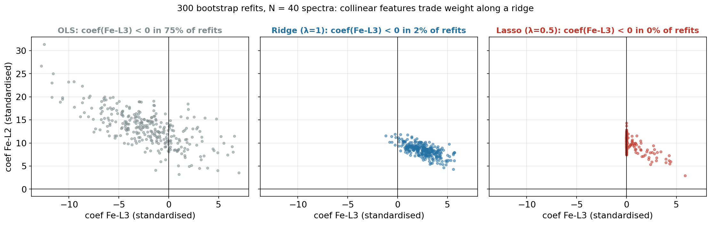{width="78%"}

:::: {.incremental}
- Collinear features ⇒ the data constrain only their **sum**, not each weight — the same flat valley we saw as an ill-conditioned bowl ($\kappa \gg 1$).
- **Remedies:** check correlations / VIF first; merge collinear features (e.g. total Fe-L$_{2,3}$ integral) or regress on PCA/NMF scores (Week 3); prefer Ridge for stable weights; never over-read which one Lasso kept.
::::

:::: {.notes}
- Read the left panel: each dot is one bootstrap refit. The OLS cloud stretches along a line of slope ≈ −1 in coefficient space — raise one weight, lower the other, the predictions barely change. The Fe-L3 coefficient changes sign in a sizeable fraction of refits. Anyone reading a single OLS fit could "discover" that Fe-L3 is anti-correlated with Fe content — nonsense.
- Middle: Ridge adds curvature in the flat direction (the $+\lambda\mathbf{I}$ from Week 3) and the cloud collapses. Right: Lasso sits on the axis for many refits — which window survives is a coin flip.
- The one point to land: coefficient instability is the ill-conditioning of §1 seen from the explainability side. Same $\kappa$, same cure.
- This sets up Week 5: permutation importance and SHAP suffer from the *same* correlated-feature problem — importance gets split or misassigned between correlated descriptors.
- Transition: "Let us put everything together into one recipe."
::::

<!-- ===== §10. Recipe + close ===== -->

## The full picture — an honest EM ML recipe

:::: {.incremental}
1. **Collect:** record `specimen_id`, `session`, acquisition time for every measurement (E1).
2. **Inspect:** histogram targets; look for duplicates / overlapping crops; plot $X$ vs $y$ per specimen.
3. **Split** to match the deployment claim: specimen → `GroupKFold`; time series → chronological; truly independent → `KFold`. Lock a test set away.
4. **Pipeline:** every learned preprocessing step (scaler, PCA, feature selection) inside the `Pipeline`.
5. **Fit:** loss from the noise model; standardise; Adam (or closed form); tune $\lambda$ with the *same* grouped CV.
6. **Report:** held-out metric ± fold spread, residual plot or confusion matrix, which "axis of new" was tested.
7. **Interpret with care:** standardised coefficients + bootstrap spread; flag collinear groups.
::::

:::: {.notes}
- Synthesis of the lecture; use it as a class-participation moment: "For your miniproject dataset, which step is riskiest?"
- The order is load-bearing: inspection before splitting (you must know the group structure), splitting before any preprocessing (otherwise leakage), and interpretation last (it inherits every earlier mistake).
- EM anchor: this recipe is what the miniproject rubric evaluates — `GroupKFold` where applicable, `Pipeline`, train vs held-out metrics, residual/confusion plots, and a sentence on what kind of generalisation was tested.
- Transition: "Summary and must-knows."
::::

## Summary

:::: {.incremental}
- **Fit = minimise empirical risk.** Loss encodes the noise model; GD needs only gradients.
- **Landscape:** convex (linear + MSE/Huber/Ridge/Lasso) → one answer; non-convex → saddles, plateaus; conditioning sets the zigzag. Momentum and Adam are fixes for curvature, SGD noise for saddles.
- **Optimisation ≠ generalisation:** the training-loss minimum is not the goal; bias–variance and regularisation control the gap.
- **Ridge = disc (shrink), Lasso = diamond (sparse)**; standardise first, tune $\lambda$ by grouped CV.
- **Honest validation:** train/val/test, K-fold, and the split must match the deployment claim.
- **Leakage taxonomy:** duplicate · temporal · group · preprocessing (+ target) — one `Pipeline` + the right splitter prevent most of it.
- **Coefficients** are conditional, unit-dependent and unstable under collinearity — the first rung (E1/E2 → E3) of the explainability ladder.
::::

:::: {.notes}
- Read these as seven sentences the students should be able to say back. Pause on the last two — they are the new material and the most exam-relevant.
- Transition: "The compact version for the exam."
::::

## Must-know takeaways (Week 4)

1. Minimising MSE = maximum likelihood under Gaussian noise; MAE ↔ Laplace, Huber = robust compromise.
2. GD: $\mathbf{w}_{t+1}=\mathbf{w}_t-\eta\nabla\hat R$; too large $\eta$ diverges, too small crawls; ill-conditioning ($\kappa\gg1$) causes zigzag.
3. Convex ⇒ every local minimum is global; linear models with MSE/MAE/Huber (+Ridge/Lasso) are convex, neural networks are not.
4. Momentum damps oscillations; Adam adds per-parameter step sizes; SGD noise helps escape saddles.
5. Bias–variance: underfit = high bias, overfit = high variance; regularisation trades a little bias for less variance.
6. Lasso's L1 diamond has corners ⇒ exact zeros; Ridge's disc only shrinks.
7. The test set is used once; hyperparameters (incl. $\lambda$) are tuned on validation / CV.
8. Four leakage types: duplicate, temporal, group/specimen, preprocessing — correlated crops ⇒ `GroupKFold`.
9. Every learned preprocessing step goes inside the CV fold (`Pipeline`); supervised selection outside CV can fake $R^2>0$ on noise.
10. A linear coefficient is a conditional, unit-dependent statement; compare standardised coefficients with bootstrap spread and distrust collinear pairs.

:::: {.notes}
- These ten statements are also in `_shared/exam_mustknow.md` (Week 4 section). Every exam question on Week 4 is answerable from them plus the leakage figures.
::::

## Looking ahead — Week 5

:::: {.incremental}
- **Topic:** "From images to features: descriptors & tree ensembles"
- From EM images to **tabular descriptors**: segmentation → particle / grain properties (area, eccentricity); atom-column finding → local-environment descriptors.
- **Decision trees, random forests, gradient boosting** — the models that win on tabular data, and the next rung of the baseline ladder (mean → linear → trees → NN).
- **Explainability, next rung:** permutation importance and SHAP — and why today's collinearity warning applies to them too.
- **Validation carries over unchanged:** `GroupKFold` by image, `Pipeline`, honest metrics.
::::

:::: {.notes}
- One minute. The goal is anticipation: today's linear model becomes the baseline that next week's trees must beat, under the same grouped CV.
- The one point to land: trees handle non-linearity and feature interactions without us designing them, but they need good descriptors — Week 5 is about turning pixels into those descriptors.
- Neural networks follow in Week 6; everything from today (GD, Adam, regularisation, leakage) is reused there.
- Transition: "Here is what to do this week."
::::

## Self-study this week

:::: {.incremental}
- **Notebook:** `notebooks/week04_leakage_demo.ipynb` — [](https://colab.research.google.com/github/ECLIPSE-Lab/public_presentations/blob/main/data_science_for_em/notebooks/week04_leakage_demo.ipynb)
  - Parts 1–6: 6 synthetic specimens × 20 correlated crops; random split vs `GroupKFold`; the leakage gap vs within-specimen correlation.
  - **Part 7 (new):** preprocessing leakage — scaler + PCA and feature selection fitted before vs inside the split, on spectra with no signal.
  - **Exercises:** implement the grouped split; repair the leaky pipeline and assert the honest score.
- Runs on CPU in < 1 min; first cell installs all dependencies.
- **Must-know review:** `_shared/exam_mustknow.md` — Week 4 section.
::::

:::: {.notes}
- The notebook is the most important deliverable of the week — leakage is a guaranteed exam topic.
- The one point to land: the asserts in the notebook (`grouped_r2 < random_r2`, `honest_r2 < leaky_r2`) are the computational proof of today's claims; being able to explain in one sentence why each holds is exam-ready.
- Miniproject students: treat the `Pipeline` + `GroupKFold` cells as the template for your own validation.
- Transition: "See you next week for features and tree ensembles."
::::

<!-- BEGIN prev-next -->

## Continue

- &larr; Previous: [Unit 03 &mdash; Linear algebra, PCA & spectral unmixing](../03_linear_algebra_spectral/01_intro.html)
- &rarr; Next: [Unit 05 &mdash; From images to features: descriptors & tree ensembles](../05_features_trees/01_intro.html)
- [All courses](../../index.html)

<!-- END prev-next -->

## References

::: {#refs}
:::
