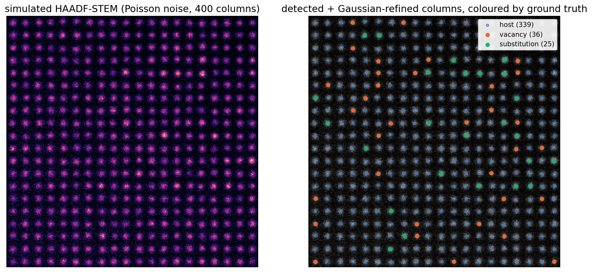
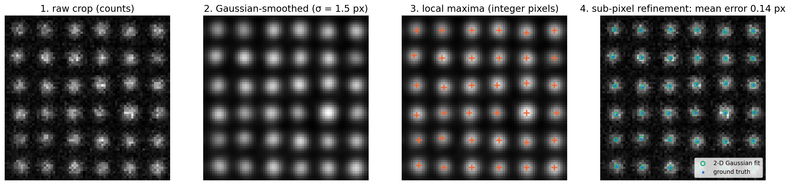
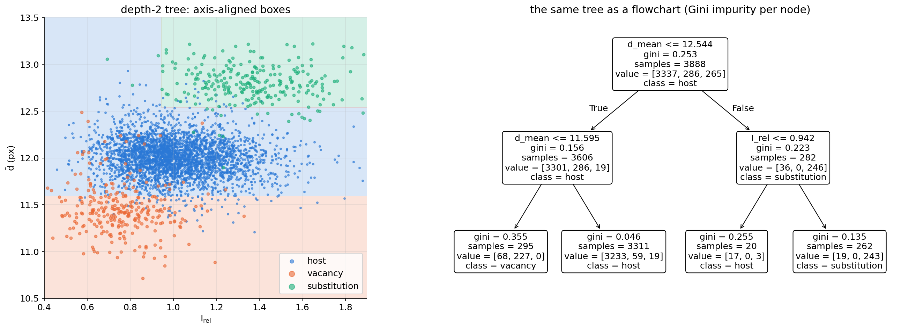
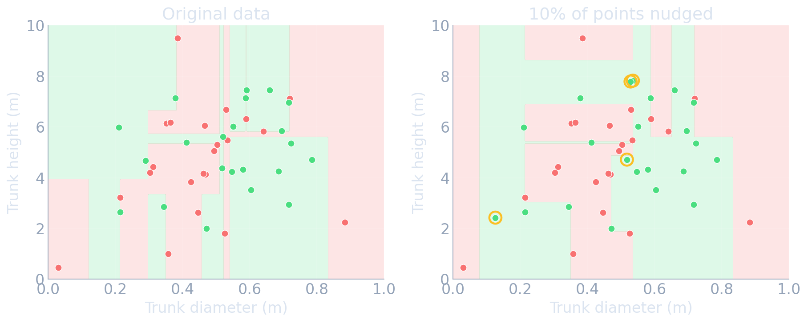
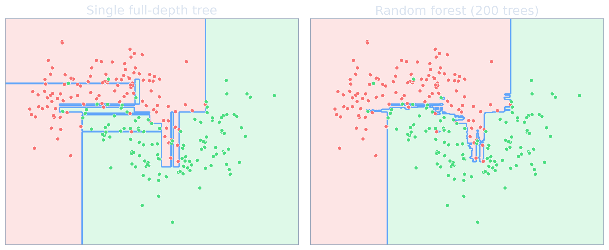
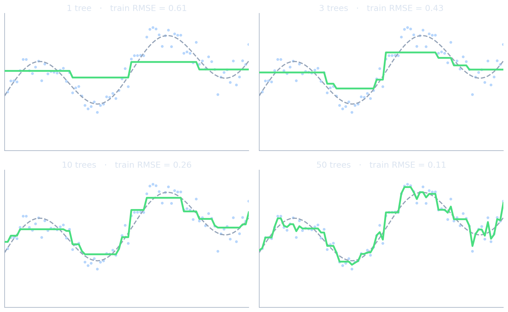
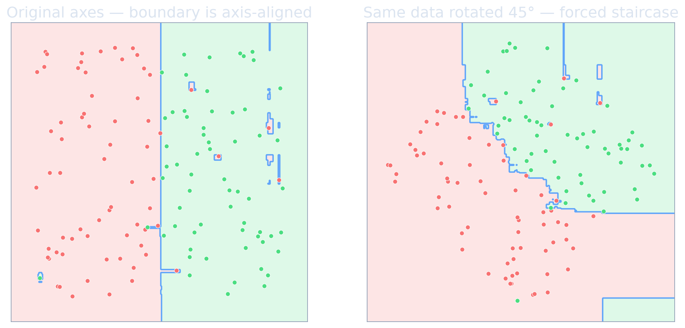

<!-- ===== §0. Recap + roadmap ===== -->

## Recap: where we left off

:::: {.incremental}
- **Week 4:** regression → loss landscapes and gradient descent → Ridge/Lasso → honest validation.
- You can fit a model by minimising an empirical risk $\hat{R}(\mathbf{w})$, read its coefficients (E1/E2 explainability), and — most importantly — report an honest score with `GroupKFold` so that crops of one specimen never sit in train *and* test.
- The leakage taxonomy (duplicate, temporal, group/specimen, preprocessing) is now your checklist for every evaluation in this course.
- **Gap:** every model so far took a **ready-made feature matrix** $\mathbf{X}\in\mathbb{R}^{N\times D}$. But an EM experiment delivers *images*, not tables. Who builds $\mathbf{X}$?
- **Today:** we build $\mathbf{X}$ ourselves — from particles, grains and atom columns — and learn the model family that dominates tabular data: **tree ensembles**.
::::

:::: {.notes}
- Open with the Week 4 notebook: the leakage gap between random split and `GroupKFold` was large. Today that lesson returns — our "specimen" is now the *image*, and every column in an image shares probe current, background and dose.
- The one point to land: Weeks 2–4 assumed the feature matrix exists. In EM it never does. Feature extraction is where most of the scientific judgement in classical ML lives, and it is where most published EM-ML pipelines silently succeed or fail.
- Misconception to preempt: "feature engineering is obsolete since deep learning." For small EM datasets (a few dozen images) hand-designed physical descriptors plus a tree ensemble or a linear model are still the strongest baseline — and they are the baseline your CNN in Week 7 has to beat.
- EM anchor: nanoparticle size distributions, grain-size statistics, atom-column intensities for defect mapping — all of these are "image → table → model" pipelines.
- Pacing: 3 minutes. Do not re-teach Week 4.
- Transition: "Here are the questions that will structure today."
::::

## Today's questions

:::: {.incremental}
- **How do we turn a micrograph into a table of physically meaningful numbers?** Segmentation → particle descriptors; atom-column finding → local-environment descriptors.
- **Which properties must a good descriptor have?** Invariance to translation, rotation, neighbour order — and to *image-level nuisances* like probe current.
- **Why do tree ensembles win on most tabular problems — and when do they not?**
- **What does the model actually use?** Permutation importance and SHAP — and why correlated descriptors fool both.
- **Road map:** images → features (6) · atom-column finding (4) · local-environment descriptors (8) · decision trees (6) · random forests & boosting (7) · baseline ladder & honest validation (4) · explaining tree models (8) · wrap-up (4).
- **Self-study:** `notebooks/week05_features_trees.ipynb` — simulate HAADF images with vacancies and substitutions, find columns, compute descriptors, classify defects with RF/GBM under `GroupKFold`, and audit the model with permutation importance.
::::

:::: {.notes}
- Read the four questions aloud, then point at the road map. Tell students the lecture follows the data: image → coordinates → descriptors → model → explanation.
- The one point to land: the hardest and most consequential step is not the model — it is the feature design. The notebook shows this quantitatively: descriptors move balanced accuracy from about 0.5 to above 0.9, while switching between logistic regression, random forest and gradient boosting changes it by a few points.
- Misconception to preempt: "trees are old-fashioned, we should go straight to neural networks." Trees are the default winner on tabular data in large benchmarks; neural networks win when the data have spatial/sequential structure (Weeks 6–10).
- Forward link: explainability is taught with every model family in this course; today it is permutation importance and SHAP; Week 7 will add saliency and Grad-CAM for CNNs.
- Transition: "What should you be able to do after today?"
::::

## Learning outcomes

By the end of this week you can:

:::: {.incremental}
1. **Describe** a classical segmentation pipeline (smoothing → Otsu threshold → watershed → `regionprops`) and name its failure modes.
2. **Implement** atom-column finding in HAADF-STEM: peak finding plus 2-D Gaussian refinement to sub-pixel precision.
3. **Design** local-environment descriptors (neighbour distances, angles, relative intensity, radial symmetry functions) and **check** their invariances.
4. **Explain** how a decision tree chooses splits, why a single tree has high variance, and how bagging, random forests and gradient boosting fix it.
5. **Climb the baseline ladder** (majority → linear → RF/GBM → NN) with grouped cross-validation and justify the final model choice.
6. **Compute and critique** impurity, permutation and SHAP importances, including the correlated-feature pitfall.
::::

:::: {.notes}
- These six outcomes map one-to-one onto exam questions. Outcomes 3, 5 and 6 are the conceptual core; 1 and 2 are the EM craft; 4 is the model theory.
- The one point to land: outcome 5 is the one students most often skip in the miniproject. A model without a baseline comparison is not a result.
- Misconception to preempt: "I need to memorise the Gini formula." You need to know what impurity measures do and why misclassification error is not used for growing — the formula is on the slide for reference.
- EM anchor: outcome 2 is exactly what Atomap and similar tools do; students who work on HAADF data in their theses will use this in week one.
- Transition: "Let's start with the bridge from pixels to tables."
::::

<!-- ===== §1. Images to features ===== -->

## From pixels to a feature table

:::: {.columns}
::: {.column width="50%"}
:::: {.incremental}
- A micrograph is a grid of $10^5$–$10^7$ correlated pixels. Classical ML needs rows = **objects**, columns = **descriptors**.
- **Object** = what the scientific question is about: a particle, a grain, a precipitate, a pore, an atom column.
- **Descriptor** = a number per object that encodes what we believe matters: size, shape, intensity, neighbourhood.
- The resulting $\mathbf{X}\in\mathbb{R}^{N\times D}$ is small, interpretable and cheap to model.
::::
:::
::: {.column width="50%"}
:::: {.incremental}
- **Two routes** in this course:
  - *Designed features* (today): physics chooses $\boldsymbol\phi(\text{image})$, the model is simple.
  - *Learned features* (Weeks 6–10): the network learns $\boldsymbol\phi$ from data.
- Designed features are **lossy by construction** — they keep only what you thought to keep [@sandfeld_materials_data_science].
- But with $N$ = a few dozen images they are usually the **stronger** baseline.
::::
:::
::::

:::: {.notes}
- Write the pipeline on the board: image → objects → descriptors → table → model → explanation. Keep it visible for the whole lecture.
- The one point to land: choosing the *object* is a scientific decision. For a defect-classification question the object is an atom column; for a coarsening study it is a particle; for a hardness model it may be the whole micrograph summarised by a grain-size distribution.
- Misconception to preempt: "one row per image is always right." Often one row per object is better: it gives many more samples — but it also creates groups (objects of the same image are correlated), which is exactly the Week 4 leakage story.
- EM anchor: the ASTM grain-size number is a designed descriptor that compresses a million pixels into one number. It answers exactly one question. The ML-PC course calls this the information bottleneck.
- Forward link: Week 6 makes $\boldsymbol\phi$ learnable; today's descriptors are the baseline a network must beat.
- Transition: "The first route to objects is classical segmentation."
::::

## Classical segmentation → particle descriptors

![Synthetic particle image processed with scikit-image [@vanderwalt2014scikitimage]: smoothing, Otsu threshold [@otsu1979threshold], binary mask, distance-transform watershed to split touching particles, and a `regionprops` feature table (one row per particle).](img/seg_pipeline.png){width="100%"}

:::: {.notes}
- Walk left to right. (1) Noisy image. (2) Intensity histogram of the smoothed image with the Otsu threshold — Otsu chooses the threshold that maximises the between-class variance of the two intensity populations. (3) Binary mask: touching particles merge into one blob. (4) Distance transform + watershed splits most touching pairs — note that some pairs remain merged; no classical splitter is perfect. (5) `regionprops` returns one row per labelled region.
- The one point to land: each step has a hyperparameter (smoothing width, threshold rule, watershed marker distance) that changes the final table. The descriptors inherit every segmentation error.
- Misconception to preempt: "Otsu is objective, so the threshold is not a choice." Otsu is a rule that assumes a bimodal histogram. With uneven illumination, thickness gradients or diffraction contrast it fails — then local/adaptive thresholding or a learned segmenter (U-Net, Week 7) is needed.
- EM anchor: nanoparticle size distributions from HAADF/ADF overview images in catalysis papers are exactly this pipeline.
- Transition: "What goes into the feature table?"
::::

## `regionprops`: what a particle table contains

:::: {.columns}
::: {.column width="50%"}
**Size & shape**

- `area`, `equivalent_diameter_area` $=\sqrt{4A/\pi}$
- `perimeter`, circularity $4\pi A/P^2$
- `eccentricity` (of the fitted ellipse), `major/minor_axis_length`
- `solidity` = area / convex-hull area (concavity, merged particles)
- `orientation` (angle of the major axis)
:::
::: {.column width="50%"}
**Intensity & context**

- `mean_intensity`, `max_intensity` (needs the intensity image)
- centroid → nearest-neighbour distance, local number density
- per-image statistics: size distribution, area fraction, $D_{50}$
- **units:** convert px → nm with the calibrated pixel size *before* modelling
:::
::::

. . .

> A `regionprops` table is a **designed representation**: every column encodes a hypothesis about what matters.

:::: {.notes}
- Show the scikit-image call: `measure.regionprops_table(labels, intensity_image=img, properties=(...))` returns a dict that goes straight into a pandas DataFrame.
- The one point to land: solidity is the most useful "quality control" feature — merged particles have low solidity, so it flags segmentation errors.
- Misconception to preempt: "eccentricity measures the particle shape in 3-D." It measures the 2-D projection. Stereology is needed to infer 3-D size distributions from 2-D sections/projections (ML-PC unit 4 covers this).
- EM anchor: in in-situ heating experiments, tracking area and centroid per particle over time turns a movie into a coarsening dataset (Ostwald ripening vs coalescence).
- Transition: "Before we trust such a table, four standard pitfalls."
::::

## Segmentation descriptors: four pitfalls

:::: {.incremental}
- **Edge truncation:** particles touching the image border are cut → biased small. Exclude them (`clear_border`) or correct statistically.
- **Calibration & resolution:** pixel size varies with magnification; features below ~3 px diameter are dominated by the PSF and noise.
- **Error propagation:** a split or merge error changes *several* descriptors at once (area, eccentricity, solidity) — segmentation errors become **correlated label noise**.
- **2-D ≠ 3-D:** projections overlap, sections cut particles off-centre; distributions need stereological correction.
- **Validation unit:** particles from the same image share imaging conditions → group by image (or specimen) when you cross-validate.
::::

:::: {.notes}
- These pitfalls are more important than the choice of model. A random forest on a biased size distribution learns the bias.
- The one point to land: segmentation errors are not random noise — they are structured and correlated across descriptors. That matters later today when we discuss correlated-feature pitfalls in importance measures.
- Misconception to preempt: "more particles = more independent samples." 2 000 particles from 5 images are 5 groups, not 2 000 independent draws.
- EM anchor: the Week 4 leakage story in a new form — a model that predicts processing temperature from particle descriptors must be validated with images (or better specimens) held out.
- Transition: "At atomic resolution the objects are atom columns — and there the classical pipeline is peak finding."
::::

<!-- ===== §2. Atom-column finding ===== -->

## HAADF-STEM: atom columns as objects

{width="78%"}

:::: {.notes}
- HAADF is Z-contrast imaging: the intensity of a column scales roughly as $Z^{1.7}$ per atom and with the number of atoms along the beam. A heavier substitution makes a column brighter; a column with missing atoms (vacancies) is dimmer.
- Our simulation also makes neighbours relax: a substitution pushes its neighbours outwards, a vacancy pulls them in. Those small displacements (≈0.5–0.8 px here) are invisible by eye but measurable after sub-pixel refinement.
- The one point to land: every image has its own probe current, background and dose. The absolute intensity of a host column differs by ±40 % between images — so absolute intensity alone cannot identify defects across images.
- Misconception to preempt: "brighter = heavier, done." Thickness variation, channelling and probe tails change column intensities too. That is why we need *relative* descriptors and a learned classifier.
- EM anchor: dopant mapping in 2-D materials and perovskites, vacancy detection in oxides — this is the standard use case for column-level ML [@ziatdinov2017deep].
- Transition: "How do we find the columns?"
::::

## Atom-column finding: peaks first

{width="100%"}

:::: {.notes}
- Step 2: smoothing with a Gaussian of roughly the column width is a matched filter — it maximises the signal-to-noise ratio for a Gaussian-shaped object in white noise.
- Step 3: `skimage.feature.peak_local_max(img, min_distance=..., threshold_abs=...)`. `min_distance ≈ 0.4 a` prevents two maxima per column; the threshold prevents maxima in the background. Dim columns (vacancies) must stay above the threshold — here the threshold is 30 % of the way from background to the brightest columns.
- Step 4: integer-pixel maxima are only accurate to ±0.5 px. The Gaussian fit brings this to ≈0.13 px — 1/90 of the lattice spacing — which is what makes strain and relaxation measurable.
- The one point to land: two hyperparameters (`min_distance`, threshold) decide which objects exist. Missed columns are missing rows in your table, not "noise".
- Transition: "What exactly does the refinement fit?"
::::

## 2-D Gaussian refinement

:::: {.columns}
::: {.column width="55%"}
For each peak, fit in a small window ($9\times9$ px):

$$
I(\mathbf{r}) = A\,\exp\!\left(-\frac{|\mathbf{r}-\mathbf{r}_0|^2}{2\sigma^2}\right) + b
$$

by least squares $\min_{A,\mathbf{r}_0,\sigma,b}\sum_{\text{pixels}}\big(I_\text{obs}-I(\mathbf{r})\big)^2$.

:::: {.incremental}
- Outputs per column: **position** $\mathbf{r}_0$, **amplitude** $A$, **width** $\sigma$, **local background** $b$ → the first four descriptors.
- Integrated intensity $\sum(I_\text{obs}-b)$ is more robust to probe blur than $A$.
- This is the workflow of *Atomap* [@nord2017atomap].
::::
:::
::: {.column width="45%"}
:::: {.incremental}
- **Loss ↔ noise model (Week 2):** least squares = Gaussian noise. At < 10 counts per pixel a **Poisson likelihood** is the principled loss.
- **Overlap:** when columns are closer than ~$3\sigma$, fit neighbouring Gaussians **jointly**.
- **Scan distortion & drift** shift rows systematically — correct before measuring strain.
- **Deep-learning finders** (fully convolutional networks) replace steps 1–3 when contrast is complex [@ziatdinov2017deep] → Week 7.
::::
:::
::::

:::: {.notes}
- Connect explicitly to Week 2: the choice of least squares is a choice of noise model. At high dose Gaussian is fine; at low dose use Poisson NLL — the same message as the Week 2 notebook.
- The one point to land: the refinement turns an image into a set of physical parameters with uncertainties. Those parameters are the raw material for the descriptors on the next slides.
- Misconception to preempt: "sub-pixel precision is impossible." Precision is limited by counts, not by pixel size: with hundreds of counts per column the centroid can be located to a small fraction of a pixel.
- EM anchor: picometre-precision strain and polarisation mapping in ferroelectrics relies on exactly this fit (often with two Gaussians per unit cell for A- and B-site columns).
- Forward link: in Week 7 we train a U-Net to output a "column probability map"; the Gaussian refinement stays as the last step.
- Transition: "We now have positions and intensities. How do we describe a column's environment?"
::::

## Column finding: failure modes to check

:::: {.incremental}
- **Missed columns** (below threshold) → vacancies-rich regions under-sampled; check detection recall on a simulated image with known truth.
- **Double detections** (`min_distance` too small) → fake neighbours at $r \ll a$; check the nearest-neighbour distance histogram.
- **Edge columns:** incomplete neighbour shells → descriptors differ systematically; drop columns within one lattice spacing of the border (as in the notebook).
- **Mismatch to ground truth:** in simulations, match detected ↔ true positions with a KD-tree and a tolerance ($< a/3$) before assigning labels.
- **Rule:** validate the finder on **simulated images with known truth** before trusting any downstream statistics.
::::

:::: {.notes}
- In our simulation: 400 true columns, 400 detected, 400 matched within a/3 in the first image; mean position error 0.13 px over 12 images. That is a best case — real data with drift and contamination will be worse.
- The one point to land: simulation with known ground truth is the standard way to validate an image-analysis pipeline. It is also how we get labels for supervised learning when real labels are scarce (a theme for Week 8: sim-to-real).
- Misconception to preempt: "if the overlay looks right, the finder is right." Eyeballing 400 columns misses the 2 % that matter — the defects.
- EM anchor: for real data, compare with a multislice simulation (abTEM, Dr.Probe) of the expected structure.
- Transition: "Now to the core of today's feature design: local-environment descriptors."
::::

<!-- ===== §3. Local-environment descriptors ===== -->

## The local environment of a column

{width="100%"}

:::: {.notes}
- Definition (from the MG course, unit 6): the local environment of atom (column) $i$ is the set of neighbours within a cutoff, described by relative vectors $\mathbf{r}_{ij}=\mathbf{r}_j-\mathbf{r}_i$ and their species/intensities.
- Middle panel: a vacancy column pulls its neighbours in, so its own first-shell distances are shorter and the peak of $G(R_s)$ shifts to $R_s<a$; a substitution pushes them out, shifting the peak to $R_s>a$. Sampling $G$ at $R_s = 0.9a, 1.0a, 1.1a$ gives three numbers that encode this shift.
- Right panel: measured data from 12 simulated images. Relative intensity $I_\text{rel}$ separates substitutions (bright) and vacancies (dim); the mean neighbour distance $\bar d$ adds the strain signature.
- The one point to land: the environment is where the physics of a defect lives — in the intensity contrast *and* in the displacement of the neighbours.
- Transition: "Which mathematical properties must such a descriptor have?"
::::

## Invariance discipline

A local descriptor $\boldsymbol\phi(\text{environment of } i)$ should be:

:::: {.columns}
::: {.column width="50%"}
:::: {.incremental}
- **Translation invariant:** use $\mathbf{r}_j-\mathbf{r}_i$, never $\mathbf{r}_i$.
- **Rotation invariant:** distances, angles, $|$Fourier modes$|$ — not raw $\Delta x,\Delta y$.
- **Permutation invariant:** sums, means, histograms, sorted lists over neighbours — never "neighbour #1, #2, …".
::::
:::
::: {.column width="50%"}
:::: {.incremental}
- **Continuous:** a 0.1 px displacement → a small change of $\boldsymbol\phi$ (smooth cutoffs, Gaussian bins).
- **Chemically / contrast sensitive:** a heavier column must change $\boldsymbol\phi$.
- **EM-specific: invariant to image-level nuisances** — probe current, detector gain, background → use **ratios** like $I_\text{rel}=I_i/\text{median}_j I_j$.
::::
:::
::::

. . .

> If a descriptor violates an invariance, the model learns coordinate-system or session accidents instead of physics.

:::: {.notes}
- The first five come directly from the MG course (unit 6, invariance discipline); the sixth is the EM-specific addition: image-level nuisance invariance. It is the direct analogue of "group by image" in validation — we remove the image identity from the features.
- The one point to land: invariances are priors. Building them into the descriptor means the model does not need data to learn them — the same idea as physics-respecting augmentation in Week 8 and architectural inductive bias in Weeks 6, 7 and 10.
- Misconception to preempt: "more raw information is better, the model will figure it out." With 3 900 columns from 12 images, raw absolute intensities give balanced accuracy ≈ 0.5 under grouped CV; relative descriptors give > 0.9.
- Diagnostic to recommend: rotate the image by 90° (or an arbitrary angle), recompute descriptors, check they do not change. This catches most bugs.
- EM anchor: the x-position of a column is a deliberate nuisance feature in the notebook — physically meaningless — and we will see what feature-importance methods make of it.
- Transition: "The simplest descriptors satisfy these properties almost for free."
::::

## Simple, interpretable environment descriptors

| descriptor | definition | encodes |
|---|---|---|
| coordination $n_i$ | $\#\{j: r_{ij} < r_c\}$ | missing / extra neighbours |
| mean bond length $\bar d_i$ | $\frac{1}{n_i}\sum_j r_{ij}$ | local strain (relaxation) |
| bond-length spread $s_i$ | std of $r_{ij}$ | distortion, asymmetry |
| angular spread | std of angular gaps between neighbours | shear, disorder (0 for a perfect square) |
| relative intensity $I_{\text{rel},i}$ | $I_i / \mathrm{median}_j I_j$ | $Z$-contrast, occupancy |
| neighbour contrast | $\mathrm{median}_j I_{\text{rel},j}$ | "a bright neighbour nearby" |

:::: {.notes}
- Every row is a permutation-invariant aggregation (count, mean, std, median) over neighbours. That is exactly how invariance is achieved without heavy maths.
- The one point to land: the cutoff $r_c$ is a scientific hyperparameter. Between the first and second shell (here $1.25a$) coordination is stable; right at a shell radius it jumps with noise.
- Misconception to preempt: "coordination is enough." In our lattice every inner column has four neighbours — coordination carries no information at all here. Geometry and intensity do the work.
- EM anchor: the MG course (unit 6) shows the same ladder for crystals: coordination → bond statistics → Voronoi → ACSF/SOAP.
- Transition: "For richer, smooth descriptors we borrow from interatomic potentials."
::::

## ACSF: atom-centred symmetry functions

:::: {.columns}
::: {.column width="50%"}
**Radial** [@behler2007symmetry]

$$
G_i^{\text{rad}}(R_s) = \sum_{j} e^{-\eta\,(r_{ij}-R_s)^2}\, f_c(r_{ij})
$$

- a *soft histogram* of neighbour distances around shell $R_s$
- many $(\eta, R_s)$ pairs → a feature vector
- $f_c$: smooth cutoff → continuity
:::
::: {.column width="50%"}
**Angular**

$$
G_i^{\text{ang}} = 2^{1-\zeta}\sum_{j,k}(1+\lambda\cos\theta_{jik})^{\zeta}\, e^{-\eta'(r_{ij}^2+r_{ik}^2)}\,f_cf_c
$$

- scores bond angles smoothly
- invariant by construction: only distances and angles
- **2-D use:** identical formulas with in-plane $r_{ij}$, $\theta_{jik}$
:::
::::

:::: {.notes}
- ACSF were introduced by Behler and Parrinello as the input layer of neural-network interatomic potentials: they needed smooth, invariant, per-atom features.
- The radial term in plain English: "how many neighbours are near distance $R_s$", weighted by a Gaussian of width $1/\sqrt{2\eta}$. In the notebook we use $\eta = 1/(0.05a)^2$ and $R_s\in\{0.9a, 1.0a, 1.1a\}$ — three radial functions that detect inward and outward relaxation.
- The one point to land: every term depends only on distances and angles, and sums over neighbours — so translation, rotation and permutation invariance are automatic. That is the design pattern to remember.
- Misconception to preempt: "ACSF are only for DFT people." For projected columns in STEM the in-plane version is a perfectly good descriptor — the MG course derivation carries over with 3-D replaced by 2-D.
- Transition: "SOAP takes a more systematic route."
::::

## SOAP and its 2-D analogue

:::: {.columns}
::: {.column width="50%"}
**SOAP** [@bartok2013soap]

1. Smooth the neighbours into a density $\rho_i(\mathbf{r})=\sum_j e^{-|\mathbf{r}-\mathbf{r}_{ij}|^2/2\sigma^2}$.
2. Expand in radial × spherical-harmonic basis: $c_{nlm}$.
3. Rotation-invariant **power spectrum** $p_{nn'l}=\sum_m c_{nlm}c^*_{n'lm}$.
4. Compare environments with a kernel.
:::
::: {.column width="50%"}
**2-D version for projected columns**

1. Same smoothed density in the image plane.
2. Expand the angular part in **circular harmonics** $e^{im\varphi}$: $c_{nm}$.
3. In-plane rotation only changes the phase of $c_{nm}$ → $|c_{nm}|^2$ is **invariant**.
4. $m=4$ / $m=6$ modes = bond-orientational order $\psi_4$, $\psi_6$ (square vs hexagonal).
:::
::::

:::: {.notes}
- The key trick of SOAP is: expansion coefficients are *equivariant* (they rotate), but products summed over $m$ (the power spectrum) are *invariant*. In 2-D this becomes very concrete: a rotation by angle $\alpha$ multiplies $c_{nm}$ by $e^{im\alpha}$, and the modulus squared removes the phase.
- The one point to land: SOAP and ACSF are two routes to the same goal — a smooth, complete-ish, invariant fingerprint of an environment. In 2-D the circular-harmonic version is simple enough to implement in 20 lines of NumPy.
- Misconception to preempt: "the most complete descriptor is always best." SOAP vectors have hundreds of dimensions; with a few hundred defect examples a handful of interpretable features often generalise better. Libraries such as DScribe compute ACSF/SOAP for 3-D structures [@himanen2020dscribe].
- EM anchor: $\psi_6$ maps are used to find grain boundaries and dislocations in colloidal crystals and 2-D materials images.
- Forward link: Week 10 replaces hand-designed environment descriptors with message passing on the atom-column graph — the learned version of the same idea.
- Transition: "How do we choose among all these descriptors?"
::::

## Choosing descriptors: a practical ladder

:::: {.incremental}
1. **Start with physics you can name:** relative intensity (occupancy / $Z$), mean bond length (strain), coordination (missing neighbours).
2. **Add smooth, invariant fingerprints** (radial/angular symmetry functions, $|c_{nm}|^2$) when simple features plateau.
3. **Tune the cutoff and widths** ($r_c$, $\eta$, $\sigma$) as hyperparameters — inside the cross-validation loop.
4. **Check invariances** (rotate/flip the image, rescale the intensity) and **nuisance leakage** (can the features identify the image?).
5. **Move to learned representations** (CNN, GNN) only when designed descriptors saturate *and* you have enough labelled data.
::::

:::: {.notes}
- This is the EM version of the MG "descriptor ladder" (composition → RDF → local environments → learned).
- The one point to land: step 4 is where most real pipelines leak. If the background level or the absolute intensity is in the feature set, the model can recognise the image — which inflates random-split scores.
- Misconception to preempt: "tuning $r_c$ on the full dataset is fine because it is not a model parameter." It is a hyperparameter; tuning it outside cross-validation is preprocessing leakage (Week 4).
- EM anchor: the notebook's Exercise 2 asks students to add a neighbour-contrast descriptor and test it with grouped CV — step 1 → 3 in miniature.
- Transition: "We now have a table. Which model?"
::::

## The feature table we will model

:::: {.columns}
::: {.column width="50%"}
**Dataset (notebook):** 12 simulated HAADF images, 3 888 inner columns

- host 3 337 · vacancy 286 · substitution 265 (strong **class imbalance**)
- 14 descriptors per column:
  - *raw:* `amp`, `I_int`, `sigma`, `bg_local`, `x_pos`
  - *local:* `I_rel`, `amp_rel`, `n_nb`, `d_mean`, `d_std`, `ang_std`, `G_0.9a`, `G_1.0a`, `G_1.1a`
- **groups** = image id (for `GroupKFold`)
:::
::: {.column width="50%"}
:::: {.incremental}
- **Metric: balanced accuracy** = mean per-class recall. "Always host" scores 86 % accuracy but only 0.33 balanced accuracy.
- **Nuisance:** `x_pos` is physically meaningless — a built-in test for importance methods.
- **Leakage trap:** `bg_local` differs per image and correlates with the image's defect fraction.
- Heterogeneous units, a few hundred minority examples, thresholds in the physics → classic **tabular** regime.
::::
:::
::::

:::: {.notes}
- Make students state the prediction task out loud: "given the 14 descriptors of a column, predict host / vacancy / substitution".
- The one point to land: this is exactly the regime where tree ensembles are the default — heterogeneous, tabular, moderately sized, imbalanced.
- Misconception to preempt: "accuracy is fine." With 86 % host, accuracy hides failure on the classes we care about. Balanced accuracy, per-class recall, or a confusion matrix are the honest choices.
- EM anchor: real defect statistics are even more imbalanced (dopants at 0.1–1 %) — then precision/recall on the minority class and a calibrated threshold matter (Week 11).
- Transition: "Let's build the simplest tree-based model."
::::

<!-- ===== §4. Decision trees ===== -->

## A decision tree = a sequence of yes/no questions

{width="90%"}

:::: {.notes}
- Read the flowchart: "Is $\bar d \le 12.54$ px? If no (neighbours pushed out) and $I_\text{rel} > 0.94$ → substitution. If yes and $\bar d \le 11.60$ px (neighbours pulled in) → vacancy. Otherwise host."
- The one point to land: a tree partitions feature space into axis-aligned boxes and predicts a constant (majority class or mean) per box. That is the entire model.
- Notice the tree found the physics we built in: relaxation first, then intensity. This is the E1 level of explainability — the model *is* its explanation — but only for shallow trees.
- Misconception to preempt: "the tree understood the physics." It found thresholds that reduce impurity. With a different random seed or slightly different data the top split could change (next slides).
- Transition: "How does the algorithm choose these questions?"
::::

## How splits are chosen

At each node choose the (feature $j$, threshold $t$) that maximises the **impurity decrease**

$$
\Delta = I(\text{parent}) - \frac{N_L}{N}\, I(\text{left}) - \frac{N_R}{N}\, I(\text{right}).
$$

:::: {.incremental}
- **Classification:** Gini $I=\sum_c p_c(1-p_c)$ or entropy $I=-\sum_c p_c\log p_c$.
- **Regression:** $I$ = within-node variance → a regression tree is *piecewise least squares*.
- **Greedy and recursive:** best split now, no look-ahead, no gradient descent.
- Cost $\approx O(N D \log N)$ → fast on large tables; **no feature scaling needed** (only the order of values matters).
::::

:::: {.notes}
- Board example: a node with targets {1,1,9,9}; the split {1,1}|{9,9} drops the variance from 16 to 0 — the maximal $\Delta$. Students see in 20 seconds why variance reduction = good split.
- The one point to land: trees are trained by greedy combinatorial search, not by gradient descent. That is why they are fast and why each split is only locally optimal.
- Misconception to preempt: "I have to standardise features for trees." No — trees are invariant to monotone transformations of each feature. (Logistic regression and MLPs do need scaling.)
- EM anchor: invariance to monotone transforms is handy for intensity features with heavy tails — log or not, the tree gives the same partition.
- Transition: "Why Gini or entropy, and not simply the error rate?"
::::

## Impurity measures

{width="48%"}

:::: {.incremental}
- Gini ≈ entropy in practice; Gini is the scikit-learn default (no logarithm).
- Misclassification error is **not** used for growing: it ignores improvements that do not flip the majority.
::::

:::: {.notes}
- Classic exam question: a 400/100 node split into 300/0 and 100/100. Misclassification error: 100 errors before and after — unchanged. Gini and entropy both drop, because the left child is now pure. Concavity rewards purity.
- The one point to land: Gini and entropy give very similar trees; the choice rarely matters. What matters is depth and the ensemble.
- Keep this to ~3 minutes.
- Transition: "How deep should a tree grow?"
::::

## Growing, pruning — and instability

:::: {.columns}
::: {.column width="45%"}
:::: {.incremental}
- Grown to pure leaves, a tree **memorises** the training set: low bias, **high variance**.
- **Pre-pruning:** `max_depth`, `min_samples_leaf`.
- **Cost-complexity pruning:** minimise $R_\alpha(T)=R(T)+\alpha|T|$ — regularised ERM with the number of leaves as penalty, $\alpha$ by CV.
- A small change of the data can flip the root split and **reshape the whole tree**.
::::
:::
::: {.column width="55%"}
{width="100%"}
:::
::::

:::: {.notes}
- Draw the parallel to Week 4: $R(T)+\alpha|T|$ is the same template as Ridge — data fit plus complexity penalty, with the penalty weight chosen by cross-validation.
- The one point to land: a single deep tree is an unstable, high-variance learner. That is bad for one model — and exactly what an averaging ensemble needs as raw material.
- Misconception to preempt: "carefully pruning one tree is the best practice." In modern practice complexity is controlled at the ensemble level; single trees are kept shallow only when interpretability is the goal.
- EM anchor: a deep tree trained on the columns of 9 images would carve out boxes that fit the noise of those images; on a new image with a different dose those boxes do not transfer.
- Transition: "So we average many trees."
::::

## Strengths and limits of a single tree

:::: {.columns}
::: {.column width="50%"}
**Strengths**

- readable rules (for depth ≤ 3–4)
- handles mixed units, no scaling, monotone-invariant
- captures thresholds and interactions naturally
- fast to train and predict
:::
::: {.column width="50%"}
**Limits**

- high variance, unstable structure
- piecewise constant → staircase approximations of smooth or oblique boundaries
- cannot extrapolate beyond the training range
- greedy → not globally optimal
:::
::::

:::: {.notes}
- The extrapolation limit is important for materials science: a tree trained on columns with intensity ratios up to 1.6 predicts the same constant for 2.5 — it cannot follow a trend beyond the data. A linear model extrapolates (sometimes wrongly, but it follows the trend).
- The one point to land: every limitation except extrapolation is reduced by ensembling.
- Misconception to preempt: "oblique boundaries are no problem for trees." They need many small steps; rotating the features destroys the axis alignment that trees exploit (slide on "why rotation matters").
- Transition: "From one tree to a forest."
::::

<!-- ===== §5. Ensembles ===== -->

## Bagging: variance reduction by averaging

:::: {.incremental}
- **Bootstrap:** draw $N$ samples with replacement → a new training set (≈63 % unique points) [@breiman1996bagging].
- Train one deep tree per bootstrap sample, **average** the predictions (or vote).
- For $B$ predictors with variance $\sigma^2$ and pairwise correlation $\rho$:
  $$
  \operatorname{Var}\Big[\tfrac{1}{B}\textstyle\sum_b \hat f_b\Big] = \rho\,\sigma^2 + \frac{1-\rho}{B}\,\sigma^2 .
  $$
- More trees kill the second term; the **correlation ceiling** $\rho\sigma^2$ remains → we must **decorrelate** the trees.
::::

:::: {.notes}
- Derive the formula quickly or state it: averaging independent predictors reduces variance by $1/B$; correlation limits the gain.
- The one point to land: the random forest's key idea is not "many trees" but "many *decorrelated* trees".
- Misconception to preempt: "more trees can overfit." Adding trees to a random forest does not increase variance; it only costs compute. (Boosting is different — there more trees can overfit.)
- Out-of-bag error: each tree never saw ~37 % of the data, so predictions on those points give a free validation estimate — but beware: OOB is a *random* split estimate and ignores groups. For grouped EM data use `GroupKFold`, not OOB.
- Transition: "How does a random forest decorrelate its trees?"
::::

## Random forest = bagging + random feature subsets

:::: {.columns}
::: {.column width="45%"}
:::: {.incremental}
- At every split, consider only a **random subset** of $m\approx\sqrt{D}$ features [@breiman2001randomforests].
- Strong features cannot dominate every tree → lower $\rho$.
- Defaults that just work: 200–500 trees, fully grown, `max_features="sqrt"`.
- `class_weight="balanced_subsample"` for imbalanced defect classes.
- **Extra-trees:** also randomise the thresholds — even lower $\rho$.
::::
:::
::: {.column width="55%"}
{width="100%"}
:::
::::

:::: {.notes}
- The one point to land: random forests are the "safe default" of tabular ML — few hyperparameters, hard to break, reasonable out of the box.
- In the notebook: `RandomForestClassifier(n_estimators=200, min_samples_leaf=3, class_weight="balanced_subsample")` reaches balanced accuracy 0.94 under `GroupKFold` with the full descriptor set.
- Misconception to preempt: "a random forest is a black box." It is an average of readable trees — but reading 200 trees is impossible, which is why we need importance and SHAP (§7).
- EM anchor: random forests are the classifier behind interactive pixel classifiers such as ilastik and Trainable Weka Segmentation — pixel-wise filter-bank features + RF.
- Transition: "The other route to strong ensembles is sequential: boosting."
::::

## Gradient boosting: gradient descent in function space

:::: {.incremental}
- Treat the predictor $\hat f$ itself as the variable. Minimise $\sum_i \mathcal{L}(y_i,\hat f(\mathbf{x}_i))$ [@friedman2001greedy].
- At step $t$ compute the **pseudo-residuals** $r_i^{(t)} = -\partial\mathcal{L}(y_i,\hat f)/\partial \hat f(\mathbf{x}_i)$.
- Fit a **small** regression tree $h_t$ to the $r_i^{(t)}$.
- Update $\hat f^{(t)}=\hat f^{(t-1)}+\eta\, h_t$ — **the same $\eta$ as in Week 4**.
- Squared error → pseudo-residual = ordinary residual: "each tree fixes what the ensemble still gets wrong". Log-loss → classification.
::::

:::: {.notes}
- Deliver the analogy with weight: in Week 4, gradient descent moved a parameter vector $\mathbf{w}$ against $\nabla_\mathbf{w}\hat R$. Here it moves a function against $\nabla_{\hat f}\hat R$, and since we cannot store arbitrary functions we approximate each gradient step with a tree.
- The one point to land: boosting reduces *bias* sequentially with shallow trees; bagging reduces *variance* in parallel with deep trees. They attack opposite corners of the bias–variance picture.
- Misconception to preempt: "boosting is just a better random forest." It has more hyperparameters, can overfit with too many iterations, and needs early stopping.
- Connect to Week 2: the loss choice (Gaussian → squared error, Bernoulli → log-loss, Poisson → Poisson deviance) selects the pseudo-residual — noise model decides loss, again.
- Transition: "See the ensemble grow."
::::

## Boosting builds the function tree by tree

{width="85%"}

:::: {.notes}
- Narrate each panel as "previous curve + one shrunken tree fitted to the remaining residual".
- The one point to land: bias falls monotonically with the number of trees; variance creeps in eventually. Early stopping on a (grouped!) validation set picks the number of trees.
- Misconception to preempt: "the learning rate only affects speed." Small $\eta$ with many trees generalises better than large $\eta$ with few — shrinkage is a regulariser, exactly as small steps in Week 4 gave smoother optimisation.
- Transition: "What do practitioners actually use?"
::::

## Gradient boosting in practice

:::: {.columns}
::: {.column width="50%"}
**Regularisation knobs**

- learning rate $\eta$ = 0.03–0.1 + **early stopping**
- shallow trees (depth 3–8 / `max_leaf_nodes`)
- subsampling rows / columns (stochastic GB)
- L2 penalty on leaf values, min samples per leaf
:::
::: {.column width="50%"}
**Implementations**

- `HistGradientBoostingClassifier` (scikit-learn): histogram binning, native missing values, fast
- XGBoost [@chen2016xgboost] — regularised objective, the Kaggle workhorse
- LightGBM, CatBoost [@prokhorenkova2018catboost] — speed / categorical features
:::
::::

. . .

> Tuning recipe: fix $\eta=0.05$, early-stop the number of trees on grouped validation folds, then tune depth and `min_samples_leaf`.

:::: {.notes}
- In the notebook we use `HistGradientBoostingClassifier(max_iter=150, class_weight="balanced")` — balanced accuracy 0.95 under `GroupKFold`.
- The one point to land: boosting has more hyperparameters than a random forest; tune them *inside* grouped CV, or you leak (Week 4).
- Practical note for shared/CPU machines: histogram GB uses OpenMP threads; on an overloaded server set `OMP_NUM_THREADS` to a small number — oversubscription can make it 20× slower.
- Misconception to preempt: "XGBoost is a different algorithm." It is gradient boosting with a second-order approximation and extra regularisation; the concepts are identical.
- Transition: "Why do these models dominate tabular benchmarks?"
::::

## Why trees win on (most) tabular data

:::: {.columns}
::: {.column width="45%"}
:::: {.incremental}
- **Uninformative features** are ignored by split selection; MLPs must learn to suppress them.
- **Non-smooth targets:** thresholds and jumps are natural for piecewise-constant trees.
- **Meaningful axes:** each column is a physical quantity; trees exploit axis-aligned structure, rotation-invariant MLPs waste capacity.
- Confirmed on 45 benchmark datasets [@grinsztajn2022treesdl]; foundation models such as TabPFN are closing the gap on small tables [@hollmann2023tabpfn].
::::
:::
::: {.column width="55%"}
{width="100%"}
:::
::::

:::: {.notes}
- The one point to land: tree ensembles are the default first model for tabular materials data — process parameters, compositions, particle and column descriptors.
- The rotation point is the most counter-intuitive: rotation invariance is a virtue for images and a liability for tables whose columns are individually meaningful.
- Misconception to preempt: "trees always win." They win *on average* over heterogeneous benchmarks. The next slides show a case where a linear model is just as good — and the ladder tells you so.
- Transition: "So how do we decide in practice? With the baseline ladder."
::::

<!-- ===== §6. Baseline ladder & validation ===== -->

## The baseline ladder

:::: {.incremental}
1. **Trivial baseline:** predict the mean (regression) or the majority class. Anything below this is broken.
2. **Linear model:** Ridge / logistic regression on standardised features. Interpretable, hard to overfit.
3. **Tree ensemble:** random forest, then gradient boosting.
4. **Neural network:** MLP on the same features (Week 6) — or a CNN on the raw image (Week 7).
::::

. . .

**Rules:** same grouped CV folds for every rung · keep the simplest model that is not significantly worse · report *all* rungs in the paper / miniproject.

:::: {.notes}
- The one point to land: a result without the lower rungs is uninterpretable. "Our GBM reaches 0.95" means nothing until we know logistic regression reaches 0.975 on the same folds.
- Misconception to preempt: "the ladder is extra work." It is four lines of scikit-learn in the same loop. The notebook does it in one cell.
- Statistical note: with 4 grouped folds, the fold-to-fold standard deviation is often ±0.01–0.09; differences smaller than that are not evidence.
- EM anchor: examiners and reviewers will ask "did you compare with a linear baseline under grouped CV?" — have the answer on one slide.
- Transition: "Here is the ladder for our defect classifier."
::::

## The ladder on the defect classifier

{width="92%"}

:::: {.notes}
- Numbers (notebook and figure script agree): majority 0.33; logistic raw 0.53 → all 0.975; random forest raw 0.48 → all 0.94; gradient boosting raw 0.47 → all 0.95; MLP raw 0.40 → all 0.93.
- The one point to land: descriptors moved every model by +0.45; the choice of model moved the score by a few hundredths. **Feature design dominates.**
- With good physical descriptors the classes are nearly linearly separable — so logistic regression is as good as (here slightly better than) the ensembles. That is an honest, useful outcome: report the linear model. Trees earn their place when relations are non-linear, thresholded and interacting — with raw features the ensembles also fail, because the information simply is not there.
- Right panel: with raw features, random `KFold` looks 0.08–0.10 better than `GroupKFold`. The per-image background level and intensity scale let the model recognise the image and its defect fraction. That is leakage — same mechanism as Week 4.
- Misconception to preempt: "the forest lost, so trees are bad." No — the ladder told us that for this representation a simpler model suffices. On raw process-parameter tables the ranking is often reversed.
- Transition: "Honest validation for column-level data, in one slide."
::::

## Honest validation for object-level EM data

:::: {.incremental}
- **Group = the unit that shares nuisances:** image (probe, dose, drift), session, specimen. When in doubt, choose the **coarser** group.
- **All preprocessing inside the folds:** scaler, feature selection, cutoff $r_c$ and $\eta$ tuning, class-weight choices.
- **Imbalance:** stratify *within* groups if possible (`StratifiedGroupKFold`), report balanced accuracy and per-class recall / confusion matrix.
- **Early stopping** for boosting on an inner grouped split — not on the outer test fold.
- **Nuisance audit:** can a classifier predict the *image id* from your features? If yes, expect leakage under random splits.
::::

:::: {.notes}
- This is the Week 4 checklist specialised to object-level data. Repeat the leakage taxonomy: group leakage (columns of the same image), preprocessing leakage (scaler/PCA fitted on all data), temporal leakage (in-situ series).
- The one point to land: the "nuisance audit" is a cheap, powerful diagnostic. If a model can tell which image a column came from, it can exploit image-level label correlations under random splits.
- Misconception to preempt: "GroupKFold is pessimistic." It answers the question you actually care about: performance on a new image.
- EM anchor: for a thesis-size dataset (say 30 images from 3 specimens), group by specimen for the final number and by image for model selection.
- Transition: "Once we have an honest model, we ask what it uses."
::::

<!-- ===== §7. Explaining tree models ===== -->

## Explainability for tree models: where we are

:::: {.incremental}
- **Week 4 (E1–E2):** a linear model *is* its explanation — standardised coefficients, signs, magnitudes.
- **Shallow tree:** readable rules (E1) — but unstable (a different sample → different rules).
- **Forest / boosting:** hundreds of trees → need **post-hoc** explanations:
  - *global:* which features does the model rely on overall? → impurity (MDI), **permutation importance**
  - *local:* why this prediction for this column? → **SHAP**
- **Always:** explanations describe the **model**, not nature. Importance ≠ causation.
::::

:::: {.notes}
- Place today in the explainability thread of the course: W4 coefficients, W5 permutation/SHAP, W7 saliency/Grad-CAM/occlusion, W9 latent-space pitfalls, W10 attention maps, W11 uncertainty as trust gate, W13 the full E1–E6 ladder.
- The one point to land: global and local explanations answer different questions. A materials paper claiming "feature X drives property Y" needs a global, held-out, correlation-aware importance — not a single SHAP plot.
- Misconception to preempt: "the most important feature is the physical cause." The model uses whatever predicts the label in the training data, including artefacts and proxies.
- Transition: "Start with the importance that scikit-learn gives you for free."
::::

## Impurity (MDI) importance

$$
\text{MDI}_j = \frac{1}{B}\sum_{b=1}^{B}\ \sum_{\text{nodes splitting on } j} \frac{N_\text{node}}{N}\,\Delta_\text{node}, \qquad \text{normalised to } \textstyle\sum_j \text{MDI}_j = 1 .
$$

:::: {.incremental}
- `rf.feature_importances_` — free, computed during training.
- **Computed on the training data** → cannot distinguish "useful" from "useful for memorising".
- **Cardinality bias:** continuous, high-resolution features offer more thresholds → more chance splits → inflated scores, even for pure noise [@strobl2007bias].
- **Correlated features** share splits arbitrarily → MDI spreads or concentrates credit unpredictably.
::::

:::: {.notes}
- Say the formula aloud: for each split on feature $j$, take its impurity decrease, weight by the fraction of samples reaching the node, sum over all nodes and trees, normalise.
- The one point to land: two structural reasons for bias — training-set quantity, and more thresholds for continuous features. Strobl et al. 2007 is the classic reference.
- Misconception to preempt: "MDI is fine because it is built in." It is fine for a quick look; it is not evidence in a publication.
- EM anchor: in column descriptors every feature is continuous — including the nuisance `x_pos`. Watch it on the next slide.
- Transition: "The honest alternative: permutation importance."
::::

## Permutation importance

:::: {.columns}
::: {.column width="52%"}
:::: {.incremental}
1. Score the fitted model on **held-out** data (here: held-out *images*) → baseline.
2. Shuffle column $j$ across rows — its distribution stays, its link to $y$ is destroyed.
3. Re-score the **same** model.
4. Importance$_j$ = baseline − shuffled score; repeat and average.
::::
:::
::: {.column width="48%"}
:::: {.incremental}
- **Model-agnostic:** needs only `predict` and a score → works for RF, GBM, MLP, CNN features.
- **Held-out** → not fooled by memorisation.
- **Question it answers:** how much does *this model* rely on feature $j$ for *this data*?
- `sklearn.inspection.permutation_importance(model, X_te, y_te, scoring="balanced_accuracy", n_repeats=10)`
::::
:::
::::

:::: {.notes}
- Thought experiment: randomly reassign every column's `d_mean` to a different column. If balanced accuracy collapses, the model relies on `d_mean`.
- The one point to land: compute permutation importance on the *grouped* held-out fold. Computing it on training data reintroduces the MDI problem.
- Misconception to preempt: "a feature with zero permutation importance is physically irrelevant." It may be redundant with another feature that carries the same information (next slides).
- Transition: "Compare the two on our forest."
::::

## MDI vs permutation importance on the defect forest

{width="88%"}

:::: {.notes}
- Walk through: MDI ranks `d_mean`, `amp_rel`, `G_0.9a`, `G_1.1a` highest; permutation ranks `d_mean` (drop 0.43) and `amp_rel` (0.20) far ahead, then a cluster of features at 0.04–0.07. The `G` features look much more important by MDI than by permutation — they are correlated with `d_mean`, and MDI credits them for splits that `d_mean` could have made.
- `x_pos`: MDI ≈ 0.005 (non-zero), permutation ≈ −0.005 (zero within noise). The forest made chance splits on it during training; on new images they do not help.
- The one point to land: the two methods can disagree on the *ranking*, not only on noise features. Report permutation importance on held-out groups.
- Misconception to preempt: "small MDI values do not matter." In a real dataset with 50 descriptors, a dozen noise features with MDI 0.01 each look like a meaningful "long tail".
- Transition: "But permutation importance has its own blind spot: correlated features."
::::

## The correlated-feature pitfall

{width="92%"}

:::: {.notes}
- Numbers (figure script): `I_rel` alone 0.059; with its duplicate: 0.047 and 0.055; both permuted together: 0.11. Geometry group: sum of single importances 0.59 vs group permuted together 0.49.
- Pitfall 1 — masking: when one copy is shuffled, the model uses the other. Each copy looks half as important as the underlying information. In EM this happens constantly: peak vs integrated intensity, intensity with different windows, $\bar d$ vs radial symmetry functions.
- Pitfall 2 — extrapolation: shuffling one of several dependent features creates impossible combinations (a column whose mean bond length says "compressed" while its $G$ values say "expanded"). The model is evaluated off the data manifold, and the drop measures extrapolation failure, not reliance [@hooker2021unrestricted].
- The one point to land: permute **groups of correlated features together** (cluster features by correlation first), or retrain without the group (drop-column importance).
- Transition: "SHAP is often presented as the fix. Let's see what it does."
::::

## SHAP: additive attribution for one prediction

:::: {.incremental}
- Decompose one prediction [@lundberg2017shap]:
  $$
  f(\mathbf{x}) = \phi_0 + \sum_{j=1}^{D}\phi_j, \qquad \phi_0 = \mathbb{E}[f(\mathbf{X})] .
  $$
- $\phi_j$ = **Shapley value**: the average marginal contribution of feature $j$ over all coalitions $S$ of other features:
  $$
  \phi_j = \sum_{S\subseteq D\setminus\{j\}} \frac{|S|!\,(D-|S|-1)!}{D!}\,\big[v(S\cup\{j\})-v(S)\big].
  $$
- **Completeness:** attributions sum exactly to prediction − baseline. **Signed:** pushes up or down.
- **TreeSHAP** computes exact values for tree ensembles in polynomial time [@lundberg2020treeshap].
::::

:::: {.notes}
- The value function $v(S)$ = expected model output when only the features in $S$ are known. The "interventional" version replaces the unknown features by values from a background sample — this is what the next figure uses.
- The one point to land: SHAP answers a *local* question ("why did this column get $P(\text{vacancy})=0.69$?"). Averaging $|\phi_j|$ over many samples gives a global ranking.
- Misconception to preempt: "SHAP is causal." It distributes the model's output among inputs according to fairness axioms. Nothing more.
- Exam deliverable: "SHAP assigns a signed attribution $\phi_j$ to each feature; they sum to prediction minus baseline; exact and fast for trees (TreeSHAP)."
- Transition: "Here is SHAP for our gradient-boosting classifier."
::::

## SHAP on the defect classifier

{width="92%"}

:::: {.notes}
- Left: `d_mean` dominates, then `I_rel` and `amp` — consistent with permutation importance. Nuisances `bg_local` and `x_pos` get small but non-zero average attributions.
- Right: for this particular vacancy column, the compressed neighbour shell (`d_mean` = 11.37 px) pushes $P(\text{vacancy})$ up by +0.45; its raw amplitude (`amp` = 1.19, bright because the image has a high probe current) pushes it *down* by −0.22 — the model partially learned "bright = not vacancy" from the raw feature. `x_pos` gets −0.07 for this one sample: local attributions of a meaningless feature are not zero. A physicist reading this plot should conclude: remove the non-invariant raw amplitude and `x_pos` from the feature set.
- The one point to land: SHAP is a debugging tool — it exposes *what the model uses per sample*, including the parts that are physically wrong.
- Practical: with the `shap` package, `shap.TreeExplainer(model).shap_values(X)` does this in milliseconds for trees. The notebook has an optional guarded cell.
- Transition: "SHAP has limits too — mostly the same ones."
::::

## SHAP: honest limitations

:::: {.incremental}
- **Correlated features:** interventional SHAP also builds off-manifold inputs (it mixes $\mathbf{x}_S$ with background values of $\mathbf{x}_{\bar S}$); credit between correlated copies is split, sometimes unstably.
- **Baseline dependence:** $\phi_0$ and all $\phi_j$ depend on the background sample — explain relative to a *meaningful* reference (e.g. host columns).
- **Describes the model, not the physics:** a shortcut feature gets a large, "fair" attribution.
- **Cost:** exact Shapley is exponential in $D$; KernelSHAP approximates, TreeSHAP is exact only for trees.
- **Good practice:** combine permutation importance on held-out groups + grouped features + SHAP for local debugging + domain knowledge.
::::

:::: {.notes}
- The correlated-feature pitfall does not disappear with SHAP; it changes form. SHAP spreads credit among correlated features according to the value function; different value functions (interventional vs conditional) give different answers.
- The one point to land: no explanation method is an oracle. Explanations are hypotheses about the model that must be tested (for example by retraining without a feature group, or by a controlled simulation where the ground-truth mechanism is known — which is exactly what the notebook's simulation provides).
- Misconception to preempt: "SHAP is the gold standard, so a SHAP plot proves my interpretation." Reviewers increasingly ask for robustness checks.
- EM anchor: the Week 7 shortcut-learning demo (a corner artefact) shows the same failure for CNN saliency.
- Transition: "A checklist you can apply to your miniproject."
::::

## Checklist: explaining a tabular EM model

:::: {.incremental}
1. **Ladder first:** is the model better than majority and linear under grouped CV? If not, there is little to explain.
2. **Held-out permutation importance** with the same grouped folds; report mean ± std over repeats.
3. **Cluster correlated descriptors** (e.g. |Spearman ρ| > 0.8) and permute clusters together.
4. **Check nuisance features:** position, image id, background, acquisition time must have ≈ 0 importance.
5. **SHAP** for individual failure cases (misclassified columns): which descriptor misled the model?
6. **Confirm by intervention:** retrain without a feature group; simulate data where the mechanism is known.
::::

:::: {.notes}
- This list is the practical outcome of §7 — copy it into the miniproject report template.
- The one point to land: step 6 is the strongest evidence. Importance values are observational statements about a model; retraining and simulation are experiments.
- Misconception to preempt: "one importance plot is enough." Different methods answer different questions; agreement across methods is what builds trust.
- EM anchor: in the notebook, the simulation knows the ground truth (relaxation + intensity), so students can verify that the importance ranking recovers the built-in physics — and that `x_pos` is correctly ignored.
- Transition: "Let's wrap up."
::::

<!-- ===== §8. Wrap-up ===== -->

## Self-study this week

:::: {.incremental}
- **Notebook:** `notebooks/week05_features_trees.ipynb` — 
  - simulate 12 HAADF images with vacancies and substitutions (per-image probe current, background, dose)
  - find columns: peak finding + 2-D Gaussian refinement (≈ 0.13 px error)
  - compute 14 descriptors, build the baseline ladder with `GroupKFold` by image
  - random vs grouped split on raw features (leakage gap ≈ 0.08–0.10)
  - MDI vs permutation importance; the near-duplicate pitfall
  - **Exercises:** grouped permutation importance; design a neighbour-contrast descriptor
  - *optional:* SHAP (only if `shap` is installed)
- **Runtime:** a few minutes on a laptop CPU; no GPU needed.
::::

:::: {.notes}
- Point out the two exercises: the first is the correlated-feature fix (grouped permutation), the second is a small feature-design experiment evaluated honestly.
- The one point to land: the notebook's self-check cells verify the four lessons — sub-pixel finding, descriptors ≫ model choice, random split optimism, nuisance feature ≈ 0 permutation importance.
- Misconception to preempt: "I need to install shap." No — the notebook runs without it; the SHAP cell is optional.
- Miniproject link: teams working on tabular or object-level data should reuse the ladder + grouped CV + importance code directly.
- Transition: "The week in six statements."
::::

## Summary

:::: {.incremental}
- **Images → tables:** segment objects (particles, columns), then describe them; every step's hyperparameters shape the table.
- **Atom-column finding:** smooth → local maxima → 2-D Gaussian fit gives sub-pixel positions, amplitudes and widths.
- **Descriptors must be invariant** to translation, rotation, neighbour order — and to image-level nuisances (use ratios such as $I_\text{rel}$).
- **Trees** partition feature space greedily; **random forests** reduce variance by averaging decorrelated trees; **gradient boosting** reduces bias by functional gradient descent.
- **Baseline ladder with grouped CV:** in our defect task descriptors moved balanced accuracy from ≈ 0.5 to > 0.9; the model choice moved it by a few points.
- **Explanations:** prefer held-out permutation importance over MDI; permute correlated groups together; SHAP explains single predictions of the *model*, not physics.
::::

:::: {.notes}
- Use this slide as the recap for students who got lost; it maps to the six learning outcomes.
- The one point to land: the order of importance in practice is data/labels → descriptors → validation → model → explanation. Students tend to invert it.
- Pacing: 3 minutes max.
- Transition: "Exam-level statements."
::::

## Must-know takeaways

:::: {.incremental}
1. A regionprops / column table is a **designed representation**; segmentation and detection errors propagate into correlated descriptor errors.
2. Gaussian refinement of atom columns = least-squares fit (Gaussian noise); sub-pixel precision is limited by counts, not pixel size.
3. Local descriptors must be translation, rotation and permutation invariant; ACSF/SOAP achieve this by summing over neighbours and using distances, angles or power spectra.
4. Trees split greedily by impurity decrease; they are scale-free, capture thresholds and interactions, but have high variance and cannot extrapolate.
5. Bagging variance $=\rho\sigma^2+\frac{1-\rho}{B}\sigma^2$: random forests lower $\rho$ with feature subsampling; gradient boosting fits trees to pseudo-residuals with learning rate $\eta$.
6. MDI is training-set based and biased; permutation importance on held-out groups is honest but masked by correlated features; SHAP satisfies completeness but explains the model, not causation.
::::

:::: {.notes}
- These six statements are the exam core for Week 5; the full list for the course lives in `_shared/exam_mustknow.md`.
- Exam-style prompt to practise: "A random forest trained on particle descriptors reports 'particle area' as most important by MDI. Name two reasons why this may be misleading and how you would check it." (Answer: cardinality/training-set bias; correlation with perimeter/diameter; check with grouped held-out permutation importance of the size-feature cluster, or drop-column retraining.)
- Transition: "Next week: letting the model learn the features."
::::

## Next week: neural networks & backpropagation

:::: {.incremental}
- Today we **designed** $\boldsymbol\phi(\mathbf{x})$ from physics and used simple models on top.
- **Week 6:** make the feature map **learnable** — perceptron → MLP, activation functions, softmax & cross-entropy.
- **Autograd & backpropagation:** the chain rule on a computational graph, a worked 2-layer example.
- **Training diagnostics:** initialisation, normalisation, loss curves, overfit-one-batch check.
- The **baseline ladder continues:** the MLP must beat today's logistic regression / GBM on the *same* grouped folds — in the notebook it did not (0.93 vs 0.975).
::::

:::: {.notes}
- Frame next week as the next rung of the ladder: an MLP on the same descriptors adds flexibility but also variance. Only on raw, high-dimensional inputs (images) do learned features pay off — Weeks 7–8.
- The one point to land: neural networks do not replace today's discipline; they plug into the same ERM + grouped-validation framework.
- Forward link to the architecture arc: MLP (no structure, W6) → CNN (grid, W7) → GNN/transformer (graph/set, W10). Today's local environments are the hand-crafted version of what a GNN learns by message passing.
- Transition: "Do the notebook before Week 6 — see you next week."
::::

<!-- BEGIN prev-next -->

## Continue

- &larr; Previous: [Unit 04 &mdash; Regression, optimisation & honest validation](../04_regression_validation/01_intro.html)
- &rarr; Next: [Unit 06 &mdash; Neural networks & backpropagation](../06_neural_networks/01_intro.html)
- [All courses](../../index.html)

<!-- END prev-next -->

## References

::: {#refs}
:::
