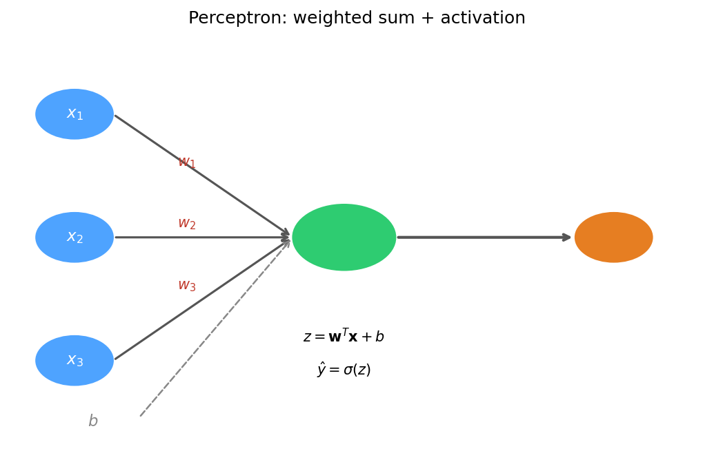
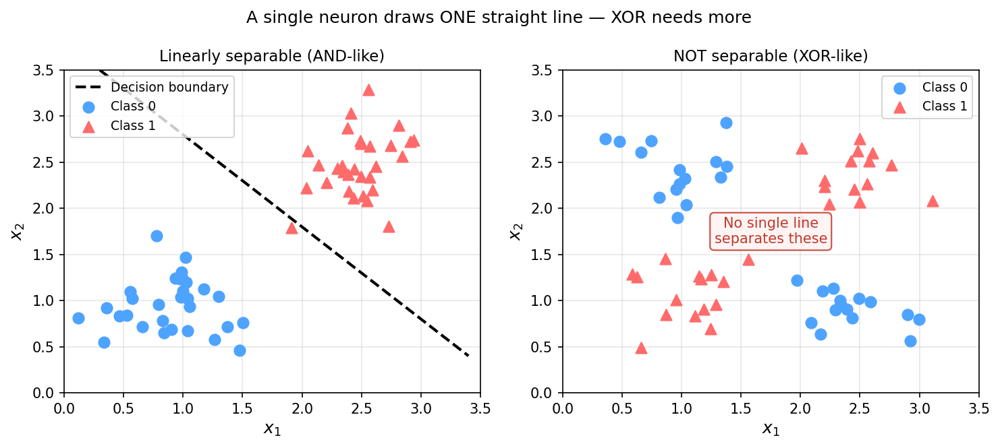
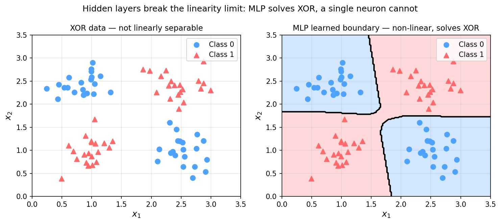
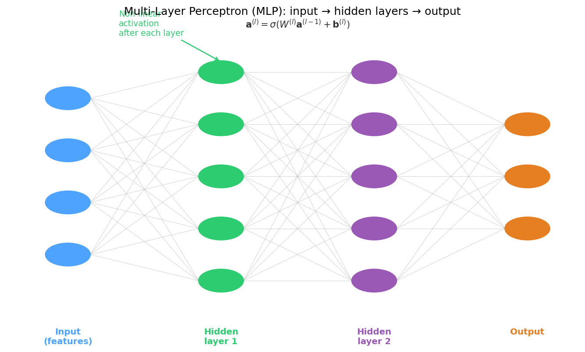
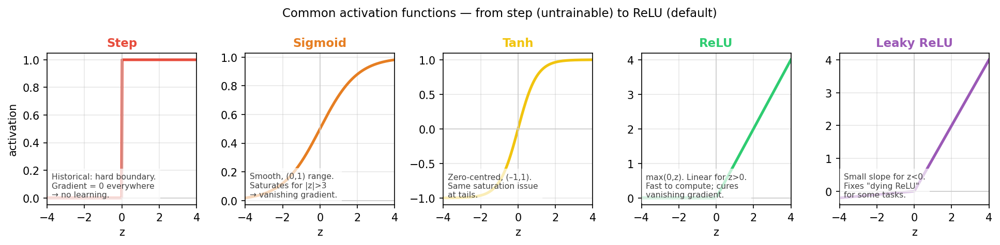
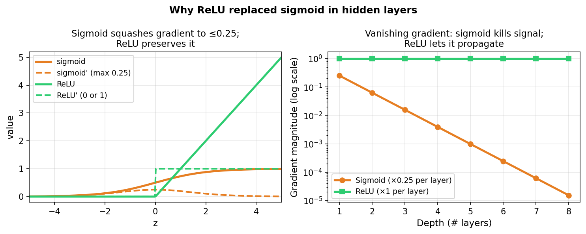
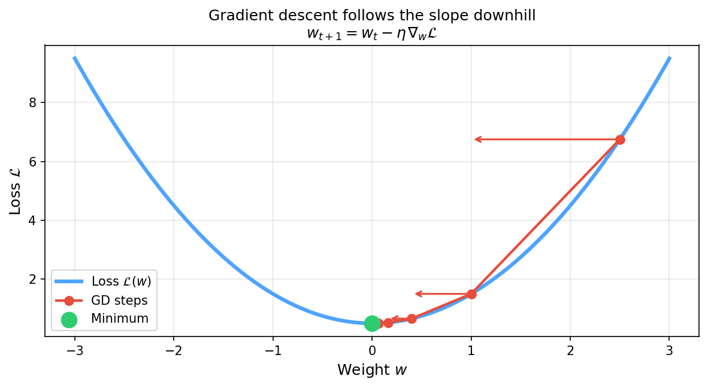
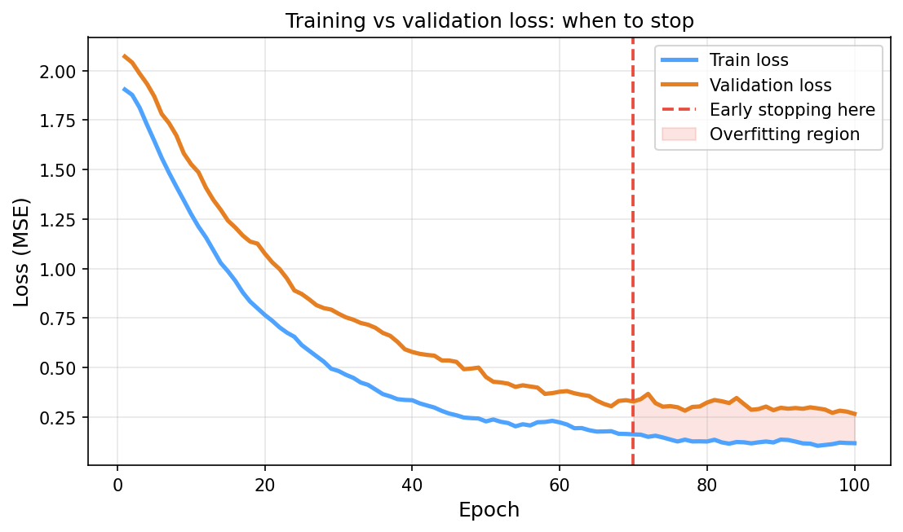
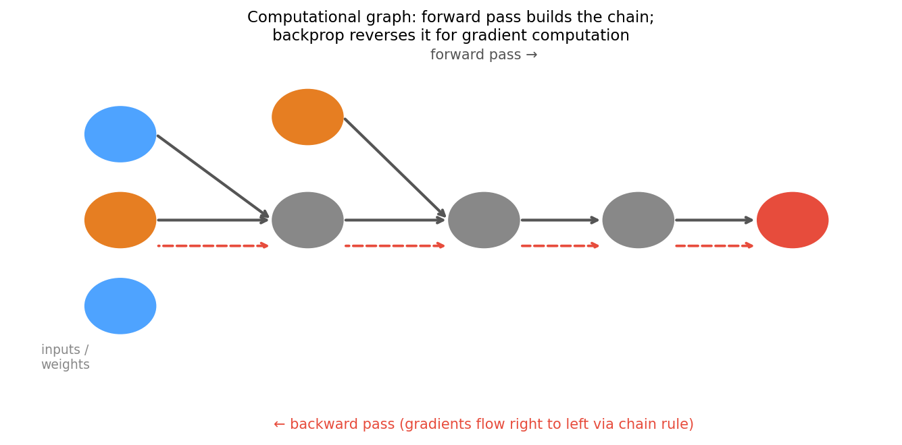

<!-- ===== §0. Recap + roadmap ===== -->

## Recap: where we left off

:::: {.incremental}
- **Week 4:** regression → gradient descent → honest validation.
- You can now fit a model to tabular EM data, diagnose overfitting with a train/val/test split, and report an honest $R^2$ using `GroupKFold` to prevent the crop-vs-specimen leakage trap.
- Key insight from Week 4: *training a model is just minimising a loss* — choose a loss, choose an optimiser, run the update rule $\mathbf{w}_{t+1} = \mathbf{w}_t - \eta\,\nabla_\mathbf{w}\hat{R}$.
- **Gap:** the linear predictor $\hat{y} = \mathbf{w}^T\mathbf{x}$ is limited to straight-line decisions — it cannot model the nonlinear relationships hiding in most EM datasets.
- **Today's question:** what happens when we make the feature map $\boldsymbol\phi(\mathbf{x})$ itself learnable? The answer is a neural network.
::::

:::: {.notes}
- Open by asking: who found the `GroupKFold` result surprising in the notebook? The leakage gap was large — that was intentional. Use it as the bridge: "We now know how to fit honestly. Today we learn a much more powerful predictor that uses the same GD engine."
- The one point to land: neural networks are not a different paradigm. They live entirely inside the ERM framework from Week 4 — same loss, same gradient descent update. What changes is the model family: we replace a linear map with a composition of nonlinear maps.
- Misconception to preempt: "neural networks are magical and hard to understand." Dispel this immediately. A single neuron is just a dot product plus an activation. An MLP is a chain of those. Today we build intuition layer by layer.
- EM anchor: mention that the MLP we will build today is exactly what gets used in composition–property regression from tabular EELS or EDS data — the same dataset structure students already know from Week 4, just with a deeper predictor.
- Pacing note: this recap slide is a bridge, not a lecture — 3 minutes maximum. The conceptual content starts in §1.
- Transition: "Two questions anchor today. Let me show them before we dive in."
::::

## Today's questions

:::: {.incremental}
- **Why does a Hall–Petch relationship exist — and can a model discover it without being told $d^{-1/2}$?**
  A single neuron cannot. A network with a hidden layer can learn the nonlinear transformation from data.
- **Why does depth without nonlinearity collapse?**
  Stack two linear maps and you get one linear map. Non-linear activations are what make depth meaningful.
- **Road map:** hand-crafted vs learned features (4) · perceptron: weights, bias, decision boundary (4) · learning rule & GD on a neuron (3) · XOR & the linearity limit (4) · MLPs as learned feature extractors (5) · activation functions: step → sigmoid → tanh → ReLU → softmax (6) · vanishing gradients → why ReLU won (3) · training a network: loss → gradients → update (3) · autograd / backprop intuition (4) · practicalities: init, overfitting, when NOT to use a deep net (3) · limits + Week 6 preview (2).
- **Self-study:** `notebooks/week05_tiny_mlp.ipynb` — train a small MLP on a materials-property dataset and see why, with 225 training samples, it does NOT yet beat a linear fit on the correct hand-crafted $1/\sqrt{d}$ feature ($R^2\approx0.91$ vs $R^2\approx0.65$) — and what that teaches about learned vs domain features.
::::

:::: {.notes}
- Read the road map together with the class and point at two anchors: (1) the XOR slide in §3 and (2) the Hall–Petch demo in §1. Tell students those two things are the core motivations.
- The one point to land: neural networks are the natural extension of Week 4's "minimise a loss with gradient descent" — the only change is the hypothesis class.
- Misconception to preempt: "backpropagation is a required deep understanding." It is not — you need to know what it does (computes gradients efficiently via the chain rule), not how to derive it. The full derivation is optional self-study; today's treatment is conceptual.
- Pacing note: this slide is orientation only — 2 minutes. Do not read every bullet aloud; gesture at the structure and move forward.
- Forward link: Week 6 will add spatial structure (convolution) on top of today's MLP skeleton.
- Transition: "Start with the question every EM materials scientist faces: how do you turn a microstructure measurement into a number that predicts a property?"
::::

<!-- ===== §1. From hand-crafted metrics to learned features ===== -->

## Hand-crafted features: the Hall–Petch story

:::: {.incremental}
- **Hall–Petch law:** $H = H_0 + k\,d^{-1/2}$ — grain size $d$ (µm) predicts hardness $H$ (HV) via a known functional form.
- A materials scientist hand-engineers the feature $\phi(d) = d^{-1/2}$ and fits a linear model in that feature. This works — but requires knowing the right transformation in advance.
- **What if the relationship is more complex?** Composition, processing temperature, cooling rate, phase fractions — the correct feature transformation is not always known.
- **What a network does instead:** present raw inputs $(d, T_\text{proc}, \ldots)$ and let the hidden layers discover the useful nonlinear transformation automatically.
::::

:::: {.notes}
- The Hall–Petch story is the perfect opener: it is a case where the hand-crafted feature is known and correct (so we can establish the baseline), and simultaneously a case where adding more features makes hand-engineering intractable.
- The one point to land: feature engineering is the hidden work in classical ML. Networks move that work from the human to the optimiser — trading expert effort for data. Neither is always better; both have their place.
- Misconception to preempt: "a deep network always beats hand-crafted features." It does not — especially when $N$ is small. The Hall–Petch linear baseline achieves $R^2 \approx 0.91$ with 225 training samples. The small MLP on raw features only reaches $R^2 \approx 0.65$ — domain knowledge wins here.
- EM anchor: grain-size→hardness is taught in every materials science programme. Using it as the first ML example provides an immediate physical anchor for students who are skeptical about ML.
- Forward link: next slide shows the comparison visually. The lesson is not "MLP wins" but "with limited data and known physics, embed the domain knowledge; learned features need more data to catch up."
- Transition: "Let me show the comparison visually."
::::

## Hall–Petch: hand-crafted vs learned features

{width="80%"}

:::: {.notes}
- Walk through the two panels. Left: "We told the model the functional form. It does the least-squares fit. Result: $R^2 \approx 0.91$ with 225 training points." Right: "We gave the model raw $d$ and let it find the transformation. The small MLP reaches $R^2 \approx 0.65$ — it is learning, but domain knowledge still wins at this sample size."
- The one point to land: the MLP on raw features is harder to train and needs more data than the hand-crafted version — but it generalises to situations where the correct transformation is unknown.
- Misconception to preempt: students sometimes read this plot as "deep learning is always as good as domain knowledge." That is wrong — when the domain knowledge is correct, embed it. Use learned features when the physics is unclear or multi-factorial.
- EM anchor: EELS near-edge fine structure, EBSD pole-figure texture, EDS compositional interactions — all cases where the correct feature transformation is not analytically known. That is where networks earn their place.
- Forward link: this plot assumed a simple one-feature setting. With many features and complex interactions, hand-crafted feature engineering becomes intractable — the motivation for deep learning at scale.
- Transition: "To understand how a network learns features, we start at the very bottom: a single neuron."
::::

## The information bottleneck: from micrograph to scalar

:::: {.incremental}
- A 1024×1024 BSE micrograph has $\sim 10^6$ pixels of state — one float per pixel.
- Collapsing to an ASTM grain-size number discards $\sim 10^6{:}1$ — almost everything.
- A single hand-crafted descriptor answers exactly the question it was designed to answer, and nothing else [@sandfeld_materials_data_science].
- **Learned representations** let a network decide which aspects of the $10^6$-pixel field are relevant for the target — compressing adaptively, not blindly.
- **Bottom line:** hand-crafted metrics are lossy by construction; learned features find a better compression for the task at hand. But "better" only holds when you have enough data and an honest validation strategy.
::::

:::: {.notes}
- Ground the compression analogy concretely: a JPEG compresses all images the same way; a learned auto-encoder compresses images differently depending on what is in the training set. Neither is universally better.
- The one point to land: the bottleneck argument is the cleanest reason to use learned representations — not "deep learning is cool," but "hand-crafted descriptors lose information you did not know to keep."
- Misconception to preempt: "more information is always better." No — irrelevant information (detector noise, background, beam drift) hurts the model if included. The question is not compression ratio but compression quality.
- EM anchor: in EELS spectrum-image analysis, a PCA-based compression (Week 3) is already a learned representation in a linear sense. An MLP encoder is the nonlinear generalisation.
- Forward link: this argument will come back in Week 8 when we introduce autoencoders as explicit learned compressors.
- Transition: "Now let's build a single neuron from scratch."
::::

## From fixed to learned feature maps

:::: {.incremental}
- **Fixed-basis model** (everything up to Week 4):
  $$\hat{y} = \sum_j w_j\,\phi_j(\mathbf{x}), \quad \phi_j \text{ chosen by the engineer before training.}$$
- Fourier, wavelet, polynomial, $1/\sqrt{d}$ — all fixed. The model learns only the coefficients $w_j$.
- **Neural-network model:** make $\phi_j(\mathbf{x};\theta)$ learnable — the feature map adapts to the data.
- The architecture decides what *kinds* of features are easy to learn; the training loop finds the specific values.
::::

. . .

> Hand-crafted features encode what the engineer *knows*. Learned features encode what the data *contains*.

:::: {.notes}
- Connect to the basis-function material students may know: Fourier series, polynomial regression. All of these are fixed-basis models. Neural networks generalise this by making the basis itself learnable.
- The one point to land: the transition from fixed to learned features is the single biggest conceptual leap in modern ML. Everything else — architecture choices, training tricks — is an engineering consequence of this choice.
- Misconception to preempt: "learned features are always better." They require more data, more compute, and more validation discipline. In data-sparse EM regimes (N < 100 specimens), domain-knowledge features are often superior.
- EM anchor: a physicist fitting EELS edges uses a hand-crafted basis (atomic cross-sections). A neural network for the same task would learn basis functions from thousands of labelled spectra — practical only with large labelled datasets.
- Forward link: the rest of today builds the neural-network model bottom-up: single neuron → MLP → training. That is the plan.
- Transition: "Let's build from the ground up. The atom of every neural network is a single neuron."
::::

<!-- ===== §2. The perceptron ===== -->

## The perceptron: weights, bias, and activation

{width="62%"}

:::: {.notes}
- Draw this on the board while talking through it. "The neuron computes a weighted sum of all inputs, adds a constant bias term — which you can think of as the threshold — and then applies a nonlinear activation function."
- The one point to land: the perceptron is the atom of every deep network. A layer of 100 perceptrons = 100 of these computations done in parallel. An MLP is layers of these stacked sequentially.
- Misconception to preempt: "the bias is optional." It is not — it shifts the activation threshold, allowing the decision boundary to sit anywhere in input space. Without bias, all boundaries pass through the origin.
- EM anchor: think of the inputs as elemental fractions from EDS: $x_1$ = Fe at%, $x_2$ = Cr at%, etc. The weights determine how much each element contributes to the prediction.
- Forward link: next slide adds the decision-boundary picture. Transition: "What does this computation look like geometrically?"
::::

## Perceptron: the decision boundary picture

:::: {.incremental}
- With two inputs, $z = w_1 x_1 + w_2 x_2 + b$ defines a linear score.
- The boundary $z = 0$ is a **straight line** in $(x_1, x_2)$ space (a hyperplane in higher dimensions).
- **Positive side** $z > 0$: neuron fires (output ≈ 1). **Negative side** $z < 0$: neuron silent (output ≈ 0).
- The learning rule adjusts $\mathbf{w}$ and $b$ so that the boundary separates the two classes correctly.
- **Key constraint:** one neuron = exactly one straight line. It cannot curve.
::::

:::: {.notes}
- Draw on the board: two axes $x_1$, $x_2$; scatter two classes; draw the boundary line. "This line is $w_1 x_1 + w_2 x_2 + b = 0$. Everything above it is Class 1; below is Class 0."
- The one point to land: a single neuron always draws exactly one straight line. If the classes are linearly separable, the perceptron will find the line. If they are not — like XOR — no single neuron can solve the problem no matter how long it trains.
- Misconception to preempt: "the perceptron always converges." The Perceptron Convergence Theorem guarantees convergence only for linearly separable data. On non-separable data it oscillates forever.
- EM anchor: try to classify "pore" vs "grain" pixels in a BSE image using only two features (contrast, local standard deviation). If the classes overlap, no single perceptron threshold will work. You need a curved boundary — i.e., hidden layers.
- Forward link: the XOR problem (§3) will make the boundary limitation vivid and motivate MLPs.
- Transition: "Before hitting the limit, let's see how a perceptron actually learns."
::::

## ADALINE and gradient descent on a neuron

:::: {.incremental}
- **Historical arc (compressed):** MCP neuron (1943) → hard threshold, fixed weights, no learning. Perceptron (1957) → trainable weights, hard threshold, error-correction learning rule. **ADALINE (1960)** → continuous output, MSE loss, full gradient-based update.
- ADALINE treats the neuron output as a continuous number during training and applies gradient descent on MSE:
  $$\nabla_\mathbf{w}\hat{R} = \frac{2}{N}\mathbf{X}^T(\mathbf{X}\mathbf{w} - \mathbf{y})$$
- This is the Week 4 GD update with the same MSE loss — the linear regression recipe, just at the level of a single neuron.
- **Key advance:** moving the gradient signal before the threshold makes learning smooth and stable.
::::

:::: {.notes}
- The ADALINE slide is the historical bridge: it shows that gradient-based learning is not a new idea invented with deep learning — it is already present at the single-neuron level, and is mathematically identical to linear regression.
- The one point to land: ADALINE = linear regression with a gradient descent optimiser. The name "neuron" is historical. From a mathematical perspective, ADALINE is just MSE gradient descent on a one-layer network.
- Misconception to preempt: "perceptrons and ADALINE are obsolete." The lesson here is that the learning principle — gradients, loss minimisation — is identical to what we do in a 50-layer ResNet today. History clarifies the lineage.
- EM anchor: fitting a background polynomial to an EELS spectrum by MSE gradient descent is ADALINE applied to spectroscopy. The operation is familiar; the name is different.
- Forward link: the update rule $\mathbf{w} \leftarrow \mathbf{w} - \eta\nabla_\mathbf{w}\hat{R}$ will appear again when we discuss training a full MLP in §5.
- Transition: "So a single neuron can do linear regression. Where does it fail?"
::::

<!-- ===== §3. XOR problem ===== -->

## The XOR problem: linearity's hard limit

{width="78%"}

:::: {.notes}
- Spend time on the right panel. Ask the room: "Can you draw a straight line that puts blue dots on one side and red triangles on the other?" Wait. Nobody can. "That is not a limitation of our training procedure — it is a mathematical impossibility for a linear classifier."
- The one point to land: XOR is the canonical example of a function that is not linearly separable. Any problem where the class boundary is curved, looping, or multi-connected falls into this category. In materials science, pore-vs-grain classification is often like this.
- Misconception to preempt: "XOR is a toy problem that does not appear in practice." Disagree explicitly. Curved or multi-connected decision boundaries appear constantly in microstructure classification — phase contrast between three phases, orientation classification from EBSD, defect vs clean region in HAADF.
- EM anchor: phase classification in a three-phase alloy (martensite, bainite, pearlite) requires multiple intersecting boundaries in feature space — no single hyperplane works.
- Forward link: the solution is to add a hidden layer. The next slide shows what changes.
- Transition: "A single neuron cannot solve XOR. What if we add one more layer?"
::::

## Why XOR requires a hidden layer

:::: {.incremental}
- With a hidden layer, the network first maps inputs to a **new learned feature space** where the classes become linearly separable.
- Example: a 2→2→1 network can learn an internal representation where the XOR pattern is separable by a final linear boundary.
- **Key intuition:** the hidden layer *warps* the input space. After warping, a curved boundary in the original space becomes a straight line in the learned space.
- The number of hidden neurons controls how flexible the warp is.
::::

. . .

> "A single neuron draws one straight line. A hidden layer bends the space so that line can solve curves." [@goodfellow2016deep]

:::: {.notes}
- The warp analogy is the most useful mental model. Draw it explicitly: start with the XOR scatter plot; then draw a second space where the four XOR points have been rearranged so they are linearly separable. "The hidden layer is the machine that does the rearranging."
- The one point to land: hidden layers are feature engineers that adapt to the data. The final layer is just a linear classifier on top of those learned features. This is true for every MLP and every CNN (the convolutional body is the feature engineer; the final dense layers are the linear classifier).
- Misconception to preempt: "more neurons always helps." More neurons increase capacity but also the risk of overfitting. The right number is determined by validation, not by adding neurons until training loss is zero.
- EM anchor: phase classification from EBSD orientation data: the hidden layer maps from raw Euler angles to a representation where the phase boundaries become hyperplanes.
- Forward link: the next section formalises the MLP as a systematic composition of layers.
- Transition: "Now let's build the full MLP."
::::

## MLP solves XOR: a non-linear decision boundary

{width="78%"}

:::: {.notes}
- Walk through both panels. Left: "Same XOR data. No single line separates them." Right: "After training, the MLP decision boundary is a curved region — the network has learned to combine two linear thresholds to form a region boundary. Both blue regions are correctly identified."
- The one point to land: the non-linear boundary is not drawn by a single neuron. It emerges from the composition of multiple linear operations separated by nonlinear activations.
- Misconception to preempt: "the MLP memorised the training points." With soft boundaries and noise, generalisation requires structure. The smooth curved boundary you see here is not memorisation — it is learning the geometry of the problem.
- EM anchor: HAADF image pixel classification: bright regions (heavy atoms, carbides), dark regions (voids, light inclusions), and mid-bright regions (matrix) form a three-region problem that is not linearly separable in any two-feature space.
- Forward link: how does the MLP learn this boundary? That requires understanding the full MLP architecture and training — next.
- Transition: "Let me now build the full MLP picture."
::::

<!-- ===== §4. MLPs as feature extractors ===== -->

## MLP architecture: layers, weights, and activations

{width="74%"}

:::: {.notes}
- Walk through the diagram left to right: "Input layer — raw features arrive, no computation. Hidden layer 1 — every neuron sees all inputs, applies the dot product + bias + activation, outputs an intermediate representation. Hidden layer 2 — every neuron sees the previous layer's outputs, applies the same recipe, outputs a more abstract representation. Output layer — a final linear combination."
- The one point to land: each hidden layer computes a new set of features (activations) that are used by the next layer. Early layers learn simple features (thresholds, linear combinations); later layers learn combinations of combinations.
- Misconception to preempt: "the hidden layers are black boxes." They are difficult to interpret, but not random. Visualization techniques (Week 13) and attribution methods can show what each hidden neuron responds to.
- EM anchor: for EELS: hidden layer 1 may learn edge-like features (responses to specific energy-loss windows); hidden layer 2 may learn combinations of edges that correspond to chemical states (oxidation, bonding).
- Forward link: why does depth require non-linearity? Next slide.
- Transition: "But there is a critical requirement for this to work at all: the activation functions must be non-linear."
::::

## Dense layer: the matrix multiply view

:::: {.incremental}
- A layer with input width $D$ and output width $M$ computes:
  $$\mathbf{z} = W\mathbf{x} + \mathbf{b}, \qquad \mathbf{a} = \sigma(\mathbf{z})$$
  where $W \in \mathbb{R}^{M \times D}$, $\mathbf{b} \in \mathbb{R}^M$, $\mathbf{x} \in \mathbb{R}^D$, $\mathbf{a} \in \mathbb{R}^M$.
- For a batch of $N$ samples: $A = \sigma(WX + \mathbf{b})$ with $X \in \mathbb{R}^{D \times N}$ — the bias broadcasts across samples.
- **Parameter count for one layer:** $M \times D$ weights + $M$ biases = $M(D+1)$.
- **Example:** $D=20$ features, $M=64$ hidden units → 1,344 parameters in this layer alone.
::::

:::: {.notes}
- Name shapes slowly: x is D by 1, W is M by D, output is M by 1. Run the example: D=20, M=64 gives 1280 weights + 64 biases = 1344 parameters. Accessible.
- The one point to land: dense means every input coordinate can affect every output coordinate. This is powerful but also expensive — for images this leads to billions of parameters (which motivates CNNs in Week 6).
- Misconception to preempt: "the batch size N affects the number of parameters." It does not — parameters are in W and b, not in X. Batch size affects how many samples we process at once, not the model complexity.
- EM anchor: for a tabular materials-property dataset with 20 composition + process features, a two-hidden-layer MLP (20 → 64 → 64 → 1) has 1344 + 4160 + 65 ≈ 5569 parameters. With N=300 training samples: ~18 samples per parameter — manageable with regularisation.
- Forward link: why does depth require non-linearity? Next slide shows the collapse algebra.
- Transition: "To understand why depth matters, we need to look at what happens without non-linearity."
::::

## Why non-linearity is non-negotiable

:::: {.incremental}
- **What happens with purely linear layers?**
  $$\mathbf{a}^{(2)} = W^{(2)}\bigl(W^{(1)}\mathbf{x}+\mathbf{b}^{(1)}\bigr)+\mathbf{b}^{(2)} = \underbrace{(W^{(2)}W^{(1)})}_{\tilde{W}}\mathbf{x}+\tilde{\mathbf{b}}$$
- Two linear layers collapse into one linear layer. By induction: any depth of purely linear layers has the expressivity of a single affine map. **Depth without nonlinearity is no depth at all.**
- Non-linear activation functions break this collapse — each layer can represent something the previous layer cannot.
- The XOR boundary we just saw is impossible without nonlinearity.
::::

:::: {.notes}
- Walk through the algebra: write $W^{(2)}W^{(1)} = \tilde{W}$ on the board. "No matter how many weights we have in two layers, they compose into a single weight matrix. Adding more linear layers adds zero expressive power."
- The one point to land: non-linear activations are the reason why depth is more than a bookkeeping exercise. Each non-linearity creates a threshold or kink that allows the subsequent layer to represent structure that was not representable before.
- Misconception to preempt: "I can stack 50 linear layers and get 50× better performance." Demonstrate the collapse algebraically. This is the most common conceptual error for students new to deep learning.
- EM anchor: a 10-layer MLP with all identity activations is mathematically identical to a single linear map. It would be slower to train and no more expressive than linear regression.
- Forward link: the next section covers the catalogue of activations in detail, including the critical vanishing-gradient story.
- Transition: "The choice of activation function matters enormously. Let's survey the main options."
::::

## MLPs learn hierarchical features

:::: {.incremental}
- **Layer 1 (close to input):** learns simple combinations of raw features — e.g. "large grain AND high temperature."
- **Layer 2 (deeper):** learns combinations of Layer 1 features — e.g. "large-grain–high-temp AND low Cr fraction."
- **Output layer:** applies a final linear map to the last hidden layer's features to produce $\hat{y}$.
- **Universal approximation:** a single sufficiently wide hidden layer can in principle approximate any continuous function to arbitrary accuracy [@goodfellow2016deep]. In practice, depth > width is more efficient.
::::

:::: {.notes}
- The hierarchical features picture is the key intuition for why depth helps. Early layers respond to simple patterns; later layers respond to combinations of patterns.
- The one point to land: depth buys representational efficiency — a deep network can represent certain functions with exponentially fewer neurons than a shallow network. This is why ResNet with 50 layers works better than one layer with billions of neurons.
- Misconception to preempt: "the Universal Approximation Theorem means MLPs are always the best model." UAT is an existence theorem: it says a solution exists in theory for arbitrarily wide networks. It says nothing about finding that solution by gradient descent with finite data.
- EM anchor: for EELS chemical-state analysis: Layer 1 might learn energy-window responses; Layer 2 might learn spectral ratios; Layer 3 might learn oxidation-state indicators. This hierarchy mirrors the physicist's own reasoning.
- Forward link: activation functions determine how each layer transforms its input. Let's meet them.
- Transition: "What nonlinear activation should we use? That is the next question."
::::

<!-- ===== §5. Activation functions ===== -->

## Activation functions: a visual survey

{width="86%"}

:::: {.notes}
- Walk through left to right. Step: "The original McCulloch–Pitts neuron. All-or-nothing. Gradient is zero everywhere except at the threshold — impossible to train by gradient descent." Sigmoid: "Smooth, gradient-friendly in the 1990s — but saturates above 3 and below -3, causing vanishing gradients in deep networks." Tanh: "Zero-centred version of sigmoid — preferred over sigmoid for hidden layers in the 1990s, same saturation problem." ReLU: "Identity above zero, zero below. Cheap to compute, does not saturate for positive inputs, and is the current default." Leaky ReLU: "Adds a small slope for negative inputs to prevent 'dying neurons'."
- The one point to land: the practical rule for 90% of problems — hidden layers use ReLU; output uses identity (regression), sigmoid (binary classification), or softmax (multi-class).
- Misconception to preempt: "sigmoid is a good default for hidden layers." It was in 1990; it is not today. The vanishing-gradient problem that killed 1990s deep networks was largely caused by sigmoid hidden units.
- EM anchor: in an MLP that predicts phase labels from BSE contrast values, the hidden layers use ReLU; the output layer uses softmax (one probability per phase). Both choices are principled, not arbitrary.
- Forward link: next, we zoom into the vanishing-gradient story — the reason sigmoid was replaced.
- Transition: "Why did sigmoid fall out of fashion? The vanishing gradient."
::::

## Step and sigmoid: historical activations

:::: {.incremental}
- **Step function:** $\sigma(z) = \mathbb{1}[z \geq 0]$. Output is 0 or 1. Derivative is zero everywhere — no gradient, no learning. Used in MCP neuron and original perceptron; unusable with gradient descent.
- **Sigmoid:** $\sigma(z) = (1+e^{-z})^{-1}$. Smooth, output in $(0,1)$ — interpretable as probability. Gradient is $\sigma'(z) = \sigma(z)(1-\sigma(z))$, max value **0.25** at $z=0$. Saturates to near-zero gradient for $|z| > 3$.
- **Historical role:** sigmoid dominated from 1986 (backprop paper) to around 2012. Its saturation was the main barrier to deep networks.
- **Today:** sigmoid is still used at the **output layer** for binary classification — but almost never in hidden layers.
::::

:::: {.notes}
- Spend a moment on the saturation point. Sketch sigmoid on the board; draw where the curve flattens. "At $z = 5$, the gradient is $\sigma(5)(1-\sigma(5)) \approx 0.007$. Across 8 layers this compounds to $0.007^8 \approx 6 \times 10^{-17}$. The early-layer weights cannot update."
- The one point to land: sigmoid's output range $(0,1)$ makes it semantically useful at the output (probability), but its saturation makes it harmful inside the network.
- Misconception to preempt: "sigmoid is always wrong." It is correct for binary output. The rule is: hidden layers = ReLU; binary-output layer = sigmoid.
- EM anchor: predicting whether a crystal is defective vs clean from EDS maps: output layer = sigmoid → probability of defect. Hidden layers = ReLU.
- Forward link: tanh is the zero-centred cousin of sigmoid. Same saturation problem, slightly better convergence in shallow networks.
- Transition: "Tanh shares the saturation problem but has one advantage."
::::

## Tanh and ReLU: the modern defaults

:::: {.incremental}
- **Tanh:** $\sigma(z) = \tanh(z)$. Output in $(-1,+1)$, zero-centred. Gradient: $1-\tanh^2(z)$, max **1.0** at $z=0$, but still saturates at tails. Better than sigmoid for hidden layers in shallow networks because zero-centering reduces internal covariate shift.
- **ReLU (Rectified Linear Unit):** $\sigma(z) = \max(0, z)$. Linear for $z > 0$, exactly zero for $z < 0$. Gradient: **exactly 1** for all $z > 0$. Does not saturate on the positive side. Computationally trivial: one comparison, no exponential.
- **Why ReLU changed everything:** it enabled training networks with 10–100 layers by keeping gradients alive. AlexNet (2012) used ReLU and revolutionised computer vision.
::::

:::: {.notes}
- Contrast tanh and ReLU explicitly: "Tanh improved over sigmoid because the output is zero-centred — symmetric around zero means gradients tend to be more evenly distributed. But the max gradient is still 1 only at z=0; it falls off quickly. ReLU's gradient is exactly 1 for all positive z — there is no fall-off."
- The one point to land: ReLU's non-saturation on the positive side is the key property. It means gradients flow through ReLU layers without shrinking — the vanishing-gradient problem is solved for positive activations.
- Misconception to preempt: "ReLU always outputs positive values, which must be a problem." Being zero for negative inputs means some neurons are always inactive for some inputs. That is not a problem — it is sparsity. Most deep learning benefits from sparse activations.
- EM anchor: a BSE image has both dark regions (light atoms, pores) and bright regions (heavy atoms). ReLU activations will respond to brightness features above threshold and be silent below it — exactly the "fire above threshold" model of a detector.
- Forward link: the "dying ReLU" problem (neurons permanently stuck at zero) motivates Leaky ReLU. But that is a detail — cover it briefly.
- Transition: "One more activation, and then we close the catalogue."
::::

## Softmax: multi-class output

:::: {.incremental}
- For $K$-class classification, the output layer computes a **probability vector** via softmax:
  $$\hat{p}_k = \frac{e^{z_k}}{\sum_{j=1}^{K} e^{z_j}}, \qquad \sum_k \hat{p}_k = 1, \quad \hat{p}_k > 0.$$
- **Always use softmax with cross-entropy loss** — not with MSE.
- **Cross-entropy loss:** $\mathcal{L} = -\sum_k y_k \log \hat{p}_k$ (where $y_k = 1$ for the true class, 0 otherwise).
- **Why not sigmoid per class?** Sigmoid outputs are independent and can sum to more than 1. Softmax enforces the probability simplex — physically correct.
::::

. . .

| Task | Output activation | Loss |
|---|---|---|
| Regression | identity | MSE or MAE |
| Binary classification | sigmoid | binary cross-entropy |
| Multi-class | softmax | categorical cross-entropy |

:::: {.notes}
- Softmax is the natural generalisation of sigmoid to multiple classes: it forces the outputs to sum to 1, making them a valid probability distribution.
- The one point to land: output activation and loss must be matched. Cross-entropy with softmax is the correct pair for multi-class problems; it is not interchangeable with MSE.
- Misconception to preempt: "I can use MSE with a softmax output." Mathematically possible, but numerically poor and the gradient landscape is suboptimal. Cross-entropy with softmax has a beautifully simple gradient: $\hat{p}_k - y_k$. MSE with softmax does not.
- EM anchor: phase classification from BSE/EBSD with $K=4$ phases (ferrite, austenite, martensite, bainite): output layer = 4 neurons + softmax; loss = categorical cross-entropy; predicted class = argmax of softmax output.
- Forward link: we now have all the activation functions. Next: how do we train the network?
- Transition: "We have the architecture. Now: how does the whole network learn?"
::::

<!-- ===== §6. Vanishing gradient ===== -->

## Vanishing gradients: sigmoid kills depth

:::: {.incremental}
- **Chain rule:** gradient of the loss with respect to weights in layer $l$ requires multiplying the activation derivative at every layer from the output back to $l$.
- **Sigmoid derivative:** $\sigma'(z) = \sigma(z)(1-\sigma(z)) \leq 0.25$.
- Through 8 sigmoid layers: gradient magnitude $\leq 0.25^8 \approx 2 \times 10^{-4}$ — a 5000× reduction.
- **Effect:** weights in early layers barely update; the network effectively fails to learn the early-layer features [@goodfellow2016deep].
- **Historical consequence:** this is why deep learning was stuck from 1986 to 2012. Networks beyond 5 layers were almost untrainable with sigmoid activations.
::::

:::: {.notes}
- The chain-rule calculation is the key insight. Write on the board: $\partial \mathcal{L}/\partial W^{(1)} = \delta^{(L)} \cdot \sigma'(z^{(L-1)}) \cdot W^{(L)} \cdots \sigma'(z^{(1)}) \cdot W^{(2)}$. "Each factor $\sigma'$ is at most 0.25. With 8 layers, we multiply 8 of these."
- The one point to land: vanishing gradients are not a numerical precision issue — they are a fundamental consequence of using activation functions whose derivative is always less than 1.
- Misconception to preempt: "we can fix vanishing gradients by using a smaller learning rate." This makes things worse, not better. The fix is a different activation (ReLU) or a different network structure (residual connections — Week 6).
- EM anchor: early attempts at training deep networks for EELS analysis (circa 2015) failed exactly because of vanishing gradients in 10-layer sigmoid networks. The paper that introduced ReLU-based training was a turning point for the field.
- Forward link: next slide shows the quantitative comparison between sigmoid and ReLU gradients.
- Transition: "The solution was to replace the 0.25 ceiling with a function whose gradient is 1 above zero."
::::

## Why ReLU won: gradient propagates intact

{width="82%"}

:::: {.notes}
- Read the right panel explicitly: "At depth 8, sigmoid gradient is $10^{-4}$. ReLU gradient is 1. That is four orders of magnitude. This is not a subtle effect."
- The one point to land: ReLU's non-saturation for positive inputs is the single property that made deep learning tractable. Without it, the 2012 deep-learning revolution (AlexNet, etc.) would not have been possible.
- Misconception to preempt: "ReLU is always better than sigmoid." For the output layer where you need a probability, sigmoid is still correct. For hidden layers, ReLU (or its variants) is almost always better.
- EM anchor: training a 10-layer MLP for grain-boundary detection in HAADF images: with sigmoid hidden units, the first-layer weights barely changed after 1000 epochs. Switching to ReLU: all layers trained from the start.
- Forward link: the "dying ReLU" problem (neurons that get stuck at 0 and never recover) is why Leaky ReLU and GeLU exist — but those are fine-tuning concerns, not beginner concerns.
- Transition: "We now understand the architecture. How does the whole network learn? Back to gradient descent."
::::

<!-- ===== §7. Training: loss → gradients → update ===== -->

## Training a network: loss → gradients → update

:::: {.incremental}
- **Same ERM framework as Week 4:**
  $$\hat{R}(\theta) = \frac{1}{N}\sum_{i=1}^{N} \mathcal{L}\!\bigl(f_\theta(\mathbf{x}_i),\, y_i\bigr), \qquad \theta \leftarrow \theta - \eta\,\nabla_\theta \hat{R}$$
  where $\theta$ now denotes **all weights and biases in all layers**.
- **What changes vs. Week 4:** the model $f_\theta$ is a composition of nonlinear maps. The update rule is identical.
- **SGD and Adam** still apply — Adam at $\eta = 0.001$ is the default starting point.
- The loss surface is now **non-convex** — multiple local minima exist. In practice, well-initialised networks find local minima that generalise well.
::::

:::: {.notes}
- Emphasise the continuity with Week 4. "The formula on this slide is identical to the one from last week. The only change is that $f_\theta$ is now 5 lines of matrix multiplications and activation calls instead of one dot product."
- The one point to land: neural-network training is not mysterious — it is gradient descent on a function that is more complex than linear regression, but the principle is identical.
- Misconception to preempt: "neural networks have a global minimum we can find." For non-convex loss landscapes, gradient descent finds a local minimum. In practice, these local minima often generalise well even though they are not the global minimum — why this happens is an active research area.
- EM anchor: training a denoising MLP on noisy STEM images at FAU uses Adam with $\eta = 0.001$ out of the box. Same algorithm, same hyperparameter, just a larger model.
- Forward link: to compute $\nabla_\theta \hat{R}$, we need to differentiate through many composed functions. That is what backprop does.
- Transition: "The challenge is computing $\nabla_\theta \hat{R}$ efficiently for all layers simultaneously. The tool is backpropagation."
::::

## Loss landscape: the GD picture for deep networks

{width="62%"}

:::: {.notes}
- The figure shows a 1D parabola for clarity — the actual loss surface of a deep network is high-dimensional and non-convex, but the local behaviour looks like this near a minimum.
- The one point to land: the learning rate $\eta$ controls step size. Too large: overshoot. Too small: slow. Adam adapts $\eta$ per parameter automatically — that is its main advantage over vanilla SGD.
- Misconception to preempt: "we need to reach the global minimum." We do not. Well-initialised networks typically find good local minima that generalise well. The practical problem is plateau regions (vanishing gradients) and saddle points, not local minima per se.
- EM anchor: when you call `model.fit(X, y)` in sklearn or `optimizer.step()` in PyTorch, this loop — evaluate loss, compute gradient, update — executes once per batch. For a typical EM miniproject dataset (200–2000 samples), this loop runs thousands of times.
- Forward link: next section, we ask how to compute the gradient $\nabla_\theta \hat{R}$ across all layers efficiently.
- Transition: "To execute this update, we need gradients for every weight in every layer. That is what automatic differentiation handles."
::::

## Training loss and early stopping

{width="68%"}

:::: {.notes}
- Read the figure carefully: "This is the most important plot you will make in any training run. Train and validation curves track together early on. After epoch 70, training loss keeps falling but validation R² stops improving — the model is starting to memorise training noise."
- The one point to land: monitor validation loss (or R²), not training loss. Save the model at the epoch where validation score is best. This is called early stopping and is the most effective regularisation technique for neural networks.
- Misconception to preempt: "training until convergence means training until training loss stops decreasing." It means training until validation loss stops improving — not the same thing.
- EM anchor: for an EELS chemical-map regression MLP trained on 500 spectra: training MSE may reach 0.01 while validation MSE is 0.08. The gap is the early-stopping signal.
- Forward link: this is the same overfitting concept from Week 4 — neural networks do not change the principle, but the effect is stronger because the model has far more parameters.
- Transition: "Before we can run GD, we need the gradients. How does the network compute them across many layers?"
::::

<!-- ===== §8. Autograd / backprop ===== -->

## Autograd: building the computational graph

:::: {.incremental}
- Every operation in a neural network (multiply, add, activation) can be thought of as a node in a **computational graph**.
- **Forward pass:** execute the graph left to right — compute the loss. Store every intermediate result.
- **Reverse-mode automatic differentiation (backprop):** traverse the graph right to left. At each node, multiply the incoming gradient by the **local derivative** — the chain rule applied automatically.
- Modern libraries (PyTorch, JAX, TensorFlow) do this for any code that uses their tensor types. You write `loss.backward()` and gradients appear in `.grad` attributes.
::::

:::: {.notes}
- The key message is: automatic differentiation is not symbolic algebra (which gives formulas) and not numerical differentiation (which is inaccurate). It executes the chain rule exactly on actual numbers, in one reverse traversal of the graph. Exact, efficient, automatic.
- The one point to land: you do not need to derive gradients by hand. Write the forward pass; the library computes the backward pass. Understanding what this does (chain rule, layer by layer) is essential for debugging; knowing how to implement it from scratch is optional self-study.
- Misconception to preempt: "autograd is mysterious magic." It is not — it is the chain rule applied as an algorithm on the computational graph. You have used the chain rule in calculus; autograd just does it systematically for every parameter.
- EM anchor: in PyTorch, defining an EELS denoising MLP and calling `loss.backward()` computes gradients for all 10,000 weights in about 1 ms. Manual derivation of those gradients would take days.
- Forward link: the full backprop derivation (Jacobians, vanishing gradient as a product of derivatives) is in the optional self-study supplement.
- Transition: "Let's make the graph idea concrete."
::::

## Backprop: reverse-mode chain rule on the graph

{width="74%"}

:::: {.notes}
- Walk through the graph. "Forward: input $x_1$ times weight $w_1$ → intermediate; add bias $b$ → pre-activation $z$; apply $\sigma$ → activation $a$; compute loss $\mathcal{L}$. The graph is a recipe." "Backward: at the loss node, the gradient is 1. Move left: at the activation node, multiply by $\sigma'(z)$. Move left again: at the add node, gradient passes through with multiplier 1. At the multiply node: gradient with respect to $w_1$ = the chain product × input $x_1$." That is backprop — the chain rule traversed in reverse.
- The one point to land: the graph makes the computation explicit. Each node has a simple local derivative. The full gradient is the product of all local derivatives from output back to the weight.
- Misconception to preempt: "backprop is only used for neural networks." Backpropagation is reverse-mode automatic differentiation — it applies to any differentiable computation, including physics simulations and inverse problems (relevant in Weeks 11–12).
- EM anchor: in phase-retrieval for 4D-STEM (Week 12), the forward simulation is a differentiable physics model; backprop computes gradients of the reconstruction error with respect to the specimen potential.
- Forward link: the full derivation of backpropagation for an MLP is in the optional self-study file. Students who want to understand the math in detail should work through it between Weeks 5 and 6.
- Transition: "The full math is optional. What you must know is: write the forward pass, call backward, read the gradients."
::::

## Backprop: what you need vs optional self-study

:::: {.incremental}
- **Must know:** backprop computes exact gradients for all weights via one reverse traversal of the computational graph (the chain rule applied at each node).
- **Must know:** modern libraries (`loss.backward()`, `grad()`) implement this automatically for any differentiable code. You write the forward pass; the library writes the backward pass for you.
- **Must know:** if a layer's activation saturates (e.g. sigmoid at $|z| \gg 0$), its local derivative $\approx 0$ and gradient flow stops — the vanishing-gradient problem.
- **Optional self-study:** full derivation — Jacobians per layer, general backprop algorithm, numerical verification via finite differences. See `data_science_for_em/01_intro/01_autograd.qmd` for an implementation walkthrough in PyTorch.
::::

:::: {.notes}
- Be explicit that the full derivation is off the exam syllabus for DSEM. Students from engineering backgrounds often feel anxious that they do not "properly understand" backprop. Resolve that anxiety: the conceptual picture (chain rule on a graph) is sufficient; the full derivation is a deeper level of understanding that is valuable but not required here.
- The one point to land: the three must-know bullet points above are the exam-level understanding. Everything else is bonus depth.
- Misconception to preempt: "if I do not derive backprop from scratch, I do not understand neural networks." Disagree. Understanding what the algorithm does and when it fails (vanishing gradients) is the engineer's level. Deriving the algorithm from first principles is the theorist's level. This course targets the former.
- EM anchor: in the practical context of this course — fitting an MLP to EM data — you will call `fit()` or `loss.backward()` and never implement backprop yourself. What matters is knowing what happens inside and why it can fail.
- Forward link: next section: practical realities before you train any network on EM data.
- Transition: "Before we leave the theory, there are practical points that will save you hours of debugging."
::::

<!-- ===== §9. Practicalities ===== -->

## Initialisation: symmetry breaking matters

:::: {.incremental}
- **Zero initialisation:** all neurons compute identical outputs, gradients, updates → hidden layer collapses to one effective neuron. Symmetry is never broken. **Always wrong for hidden layers.**
- **Random normal (too large):** activations saturate immediately (especially sigmoid/tanh); gradients vanish before training begins.
- **Xavier / Glorot initialisation:** $w_i \sim \mathcal{U}\!\bigl(-\tfrac{\sqrt{6}}{\sqrt{D_\text{in}+D_\text{out}}}, \tfrac{\sqrt{6}}{\sqrt{D_\text{in}+D_\text{out}}}\bigr)$ — scales variance to keep activation statistics stable through depth. Default for sigmoid/tanh layers.
- **He initialisation:** $w_i \sim \mathcal{N}(0, \sqrt{2/D_\text{in}})$ — accounts for ReLU zeroing half its inputs. Default for ReLU layers. Used by sklearn and PyTorch by default.
::::

:::: {.notes}
- Draw why zero-init fails: "If all weights are zero, all neurons compute $W\mathbf{x} + 0 = \mathbf{0}$ (if bias is also zero). All outputs are identical. All gradients are identical. The network collapses to a single effective neuron. No matter how many epochs you run, it never learns diverse features."
- The one point to land: use the framework defaults (He init for ReLU layers). You do not need to implement this yourself — but you do need to know not to manually set all weights to zero or to a large constant.
- Misconception to preempt: "initialisation matters less with modern optimisers like Adam." Adam helps with the learning rate problem; it does not fix symmetry breaking. Zero initialisation still breaks an Adam-trained network.
- EM anchor: in the Week 5 notebook, sklearn's `MLPRegressor` uses He initialisation by default — students never need to set it, but they should know what is happening inside.
- Forward link: the overfitting section connects back to the bias-variance material from Week 4.
- Transition: "Initialisation sets up training. What can go wrong after training starts?"
::::

## Overfitting in neural networks

:::: {.incremental}
- Neural networks have far more parameters than linear models. A 2-layer MLP with 64 neurons each has $>5000$ parameters — easily more than the number of training samples in small EM datasets.
- **Overfitting symptoms:** training loss ≈ 0, validation loss much larger; validation R² plateaus then decreases while training R² keeps climbing.
- **Cures (in order of convenience):**
  1. More data — always the first choice when possible.
  2. Early stopping — free, no hyperparameters to tune.
  3. Dropout — randomly zero out 20–50% of neurons per forward pass; forces redundant representations.
  4. Reduce model depth or width.
  5. L2 regularisation on weights (weight decay).
::::

:::: {.notes}
- The overfitting slides connect back to Week 4. Emphasise: "everything from Week 4 — train/val/test split, GroupKFold, bias-variance trade-off — applies to neural networks unchanged. Neural networks just have more parameters, so the overfitting risk is higher."
- The one point to land: early stopping is the most practical regulariser. Use it first. Dropout is second. Reduce model complexity third. Never reduce validation set size to make overfitting disappear.
- Misconception to preempt: "dropout makes training stochastic and therefore unreliable." On the contrary — dropout improves generalisation because it forces the network to not rely on any single neuron's response. At test time all neurons are active (scaled by dropout probability), making inference deterministic.
- EM anchor: a deep MLP trained on 80 HAADF images of grain boundaries with 5000 parameters: training accuracy 100%, test accuracy 55%. The fix: early stopping cuts the epochs from 2000 to 150; test accuracy rises to 78%.
- Forward link: practicalities close with the most important question — when should you NOT use a deep net?
- Transition: "Even with perfect regularisation, there are situations where a neural network is the wrong tool."
::::

## When NOT to use a deep net for EM data

:::: {.incremental}
- **Small tabular dataset ($N < 200$ specimens):** a linear model (Ridge) or gradient-boosted tree almost always generalises better. More parameters than samples → variance dominates.
- **Known physics specifies the feature map:** if you know the relationship is $H \propto d^{-1/2}$, embed that. Learning it costs data and compute you do not need to spend.
- **Interpretability is mandatory:** white-box models (Bragg, Hall–Petch, CALPHAD) are preferable when the physics is understood and peer reviewers expect mechanistic insight.
- **Spatial / image data without spatial invariances:** dense MLP on flattened 1024×1024 pixels requires $\sim 10^9$ weights in the first layer — wrong architecture. Use a CNN (Week 6).
::::

:::: {.notes}
- This slide is important for calibrating expectations. Students at MSc level often over-engineer. Spend a moment on each case.
- The one point to land: the right model is the simplest one that explains the data honestly. Complexity should be justified by validation, not by trend.
- Misconception to preempt: "using a deep net always looks more impressive in a report." The examiner will ask: "did you compare to a linear baseline, and did the deep net actually outperform it on the honest test set?" If not, the deep net is not justified.
- EM anchor: Hall–Petch with 60 samples — use the analytic $1/\sqrt{d}$ feature. Steel hardness prediction from 20 compositional features and 5000 samples — MLP can be justified. HAADF 4D-STEM analysis with 200 × 200 probe positions each yielding a 128 × 128 diffraction pattern — CNN is required (Week 6).
- Forward link: the CNN is the Week 6 topic. This slide ends with the motivation for it.
- Transition: "Which brings us to next week."
::::

<!-- ===== §10. Limits + forward link ===== -->

## Neural network limits: what UAT does NOT promise

:::: {.incremental}
- **Universal approximation (what it says):** a sufficiently wide MLP with one hidden layer can approximate any continuous function to arbitrary accuracy [@goodfellow2016deep].
- **What it does NOT say:**
  - That gradient descent will find that approximation.
  - That you have enough data to train it.
  - That it will generalise to new inputs outside the training distribution.
- **Practical limits for EM data science:**
  - Small $N$ (tabular, $< 200$ samples): tree models and Ridge almost always win.
  - Spatial data: dense MLP fails at scale — wrong inductive bias (ignores locality). Needs CNN (Week 6).
  - Distribution shift: a network trained on one EM instrument/operator may fail on another.
::::

:::: {.notes}
- The Universal Approximation Theorem (UAT) is often quoted as the reason to trust neural networks. Correct the misuse: UAT is an existence theorem, not a constructive one. It says a solution exists in theory; it says nothing about finding it in practice.
- The one point to land: the right model is the simplest one that explains the data honestly. Neural networks are justified when the input space is high-dimensional, the relationship is complex and nonlinear, and enough data exists to prevent overfitting.
- Misconception to preempt: "UAT means MLPs are always the best model." False. A linear model that generalises well is better than a deep network that overfits. Complexity should be justified by validation, not by theory.
- EM anchor: distribution shift is a critical concern in EM ML: a denoiser trained on Titan data at 300 kV may fail on ARM data at 80 kV because the noise statistics are different. This is not a failure of the architecture — it is a failure of the training data distribution.
- Forward link: explicitly preview Week 6.
- Transition: "Which brings us to next week's key concept."
::::

## Week 6 preview: CNNs for microscopy images

:::: {.incremental}
- **The problem with dense MLPs on images:** a 1024×1024 pixel image flattened to a vector requires $\sim 10^9$ weights in the first hidden layer. With $N < 1000$ training images, the model memorises noise.
- **The solution:** build two inductive biases into the architecture — **locality** (each neuron only sees a small patch) and **weight sharing** (the same filter is applied at every position).
- **Convolution** implements both constraints. It is a constrained version of the dense matrix multiply, with most weights forced to zero and the remaining weights tied across positions.
- **Week 6:** convolutional layers, feature maps, receptive fields, pooling; applications to grain-boundary detection, atom-column segmentation, phase classification in HAADF and EBSD data.
::::

:::: {.notes}
- This is the forward-link slide. Its job is to leave students motivated for Week 6 by naming the precise problem that CNNs solve.
- The one point to land: the CNN is not a different paradigm from the MLP — it is an MLP with two structural constraints added. Everything from today (forward pass, activation, backprop, loss minimisation) carries over unchanged. What we add next week is locality and weight sharing.
- Misconception to preempt: "convolution is a completely different operation from matrix multiply." It is not. Convolution is a sparse, weight-shared matrix multiply. Making this explicit in Week 6 will remove the mystique.
- EM anchor: the FAU group's phase-retrieval network for 4D-STEM uses a U-Net (an encoder-decoder CNN). The MLP trained today is the conceptual building block of that network.
- Pacing note: this slide can be brief — 3 minutes. Students are tired by this point. Give them a compelling reason to come back next week and close.
- Transition: "Try the notebook before Week 6. Everything from today — MLP, loss curve, overfitting — will be hands-on."
::::

<!-- ===== §11. Dropout + summary + back/forward ===== -->

## Dropout: practical regularisation

:::: {.incremental}
- **Dropout** (Srivastava et al., 2014): during each forward pass of training, randomly zero out a fraction $p$ (typically 0.2–0.5) of neurons in a layer.
- **Why it works:** forces each neuron to learn features that are useful *without* relying on specific other neurons — reduces co-adaptation and increases redundancy.
- **At test time:** all neurons active; outputs scaled by $(1-p)$ to match training expectations.
- **Practical rule:** add dropout after hidden layers, not after the output layer. Standard starting point: $p=0.2$ (drop 20% of hidden activations).
- Dropout is effectively training an ensemble of $2^N$ thinned networks simultaneously — each mini-batch trains a different sub-network.
::::

:::: {.notes}
- Frame dropout as "ensemble training for free." Each mini-batch trains a different thinned network; at test time we average over all $2^N$ sub-networks by scaling. This ensemble effect is why dropout works — the intuition from Week 4's bias-variance discussion applies directly.
- The one point to land: dropout is the most widely used regularisation technique for neural networks. Use it when overfitting is a problem and more data is not available.
- Misconception to preempt: "dropout should always be used." In very small networks or when $N$ is large relative to the parameter count, dropout may slow convergence unnecessarily. It is a regulariser for high-variance models.
- EM anchor: a denoising MLP for EELS spectral maps trained on 300 labelled spectra: without dropout, training RMSE = 0.8, test RMSE = 2.1 (gap = overfitting). With $p=0.3$ dropout: test RMSE drops to 1.4 with only a modest increase in training RMSE.
- Forward link: in CNNs (Week 6), batch normalisation partially replaces the role of dropout as a regulariser, but dropout remains useful in the final dense layers.
- Transition: "Let's put the full training recipe together."
::::

## The complete training recipe

:::: {.incremental}
- **Step 1 — Architecture:** choose depth, width, and activation function. Start with 2–3 hidden layers, 32–128 neurons, ReLU.
- **Step 2 — Initialise:** use He initialisation for ReLU layers (framework default). Never initialise to zero.
- **Step 3 — Normalise inputs:** `StandardScaler` on the training set; apply the same scaling to validation and test. (Same hygiene as Week 4.)
- **Step 4 — Train:** Adam at $\eta = 0.001$, mini-batch size 32–64, monitor validation loss, apply early stopping.
- **Step 5 — Evaluate honestly:** use the same `GroupKFold` strategy from Week 4. A neural network does not exempt you from honest validation.
::::

:::: {.notes}
- This slide is the practical recipe students will use in their miniproject. Go through each step deliberately.
- The one point to land: nothing here is new. Every step maps directly to a concept from Weeks 2–4. Neural networks add expressivity but do not change the engineering discipline.
- Misconception to preempt: "neural networks have their own validation rules." They do not. All of Week 4's validation principles — GroupKFold, train/val/test split, no leakage — apply without exception.
- EM anchor: the Week 5 notebook follows this recipe exactly on the Hall–Petch dataset. Students should trace through the notebook cells and map each one to a step in this list.
- Forward link: Week 6 adds one more step: choosing between dense MLP (tabular data) and CNN (image data). The rest of the recipe is identical.
- Transition: "Let me now summarise the full week's content in two slides."
::::

## MLP for materials property prediction: a complete example

:::: {.incremental}
- **Problem:** predict Vickers hardness from tabular features: grain size, processing temperature, Cr fraction, Mn fraction — a multi-input regression task typical of CALPHAD-adjacent datasets.
- **Encoding:** standardise all four inputs with `StandardScaler` (fit on train only).
- **Architecture:** 4 → 64 → 64 → 1 (two hidden layers, ReLU activations, identity output).
- **Training:** Adam at $\eta = 0.001$, batch size 32, early stopping on 20% validation holdout, `n_iter_no_change = 30`.
- **Baseline comparison:** always compare to Ridge regression on the same features. If the MLP does not outperform Ridge, the dataset is too small or the relationship is too linear for depth to help.
::::

:::: {.notes}
- Concrete example to anchor the whole week's content. Walk through each decision: "We have four raw features — no hand-crafted engineering. We standardise because MLP training is sensitive to feature scale. Two hidden layers of 64 neurons: wide enough to capture moderate nonlinearity, shallow enough to generalise on N~300. ReLU hidden activation, Adam optimiser — the recipe from the previous slide."
- The one point to land: the baseline comparison is mandatory. If Ridge $R^2$ = 0.89 and MLP $R^2$ = 0.87, the MLP is not justified. Report both; let the test scores decide.
- Misconception to preempt: "adding more features always improves the MLP." Only if those features carry signal not already captured. Uninformative features add noise dimensions that the MLP must learn to ignore — a waste of capacity.
- EM anchor: a composition-hardness dataset for stainless steel variants: 10 elemental fractions + 3 processing parameters = 13 raw features → 13 → 64 → 64 → 1. With N=400 specimens and GroupKFold over steel heats, the MLP achieves $R^2 = 0.82$ vs Ridge at $R^2 = 0.76$ — a modest but real improvement that justifies the added complexity.
- Forward link: the notebook week05_tiny_mlp.ipynb implements exactly this scenario on a synthetic but physically motivated dataset.
- Transition: "Let me close with the summary."
::::

## Summary: the week in five points

:::: {.incremental}
- **A single neuron** computes $\hat{y} = \sigma(\mathbf{w}^T\mathbf{x} + b)$ — a weighted sum plus bias, passed through a nonlinearity. It draws exactly one hyperplane.
- **Non-linearity is non-negotiable:** depth without nonlinear activations is a single affine map. ReLU is the default for hidden layers.
- **MLPs as feature extractors:** hidden layers learn intermediate representations; the output layer applies a linear map. Deeper = more abstract features.
- **Backpropagation** = reverse-mode automatic differentiation. The chain rule traverses the computational graph right to left. Libraries automate this; you write the forward pass.
- **Practical rules:** He init; Adam at $\eta = 0.001$; early stopping on validation loss; GroupKFold for honest evaluation; use simpler models when $N < 200$.
::::

:::: {.notes}
- Use this slide as a closing recap and as an orientation for students who fell behind during the lecture.
- The one point to land: neural networks fit entirely inside the ERM + gradient descent framework from Week 4. The only new concept is the architecture — compositions of nonlinear maps. Everything else is the same.
- Misconception to preempt: "this week was more theoretical than practical." Every concept here maps directly to a function call in the notebook. Theory and practice are tightly coupled.
- EM anchor: revisit the Hall–Petch motivation from the opening slides: "We started with a materials question. We built the mathematical machinery to answer it. The notebook shows you the code. That is the DSEM arc."
- Pacing note: spend at most 3 minutes on this slide — it is a review, not new content. Ask if there are questions before moving to the Week 6 preview.
- Transition: "Everything from today carries into Week 6. See you there."
::::

## References

::: {#refs}
:::
