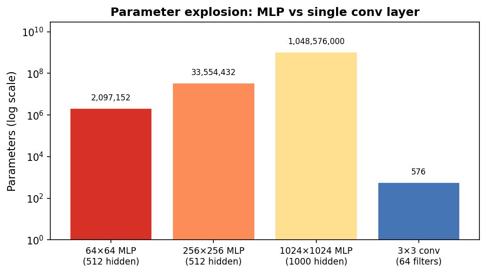
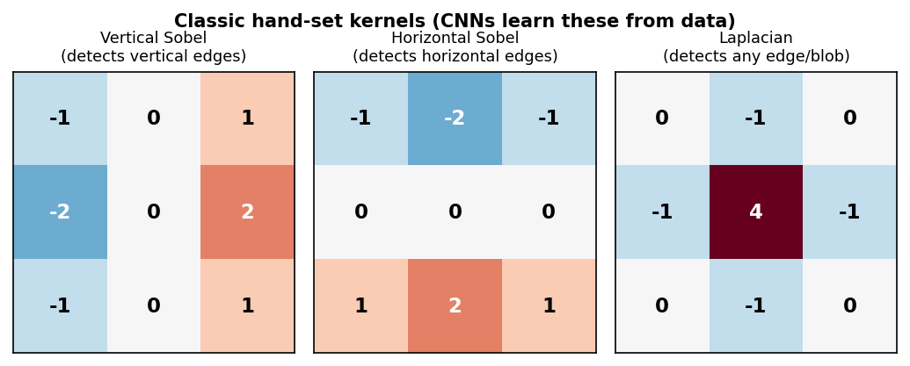
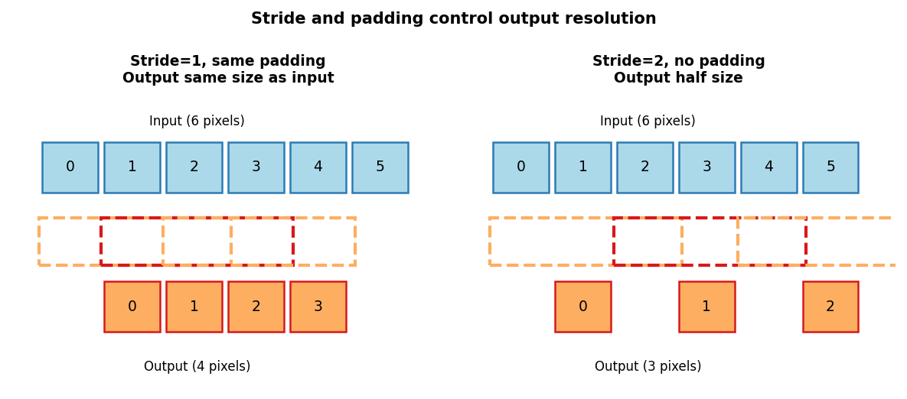
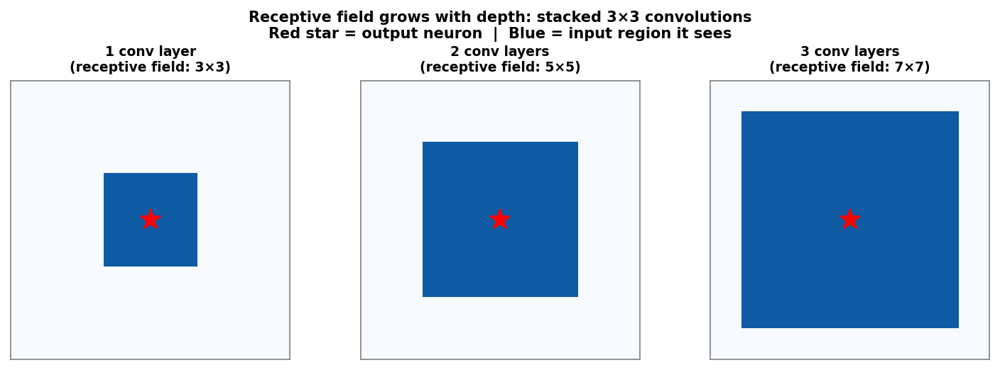
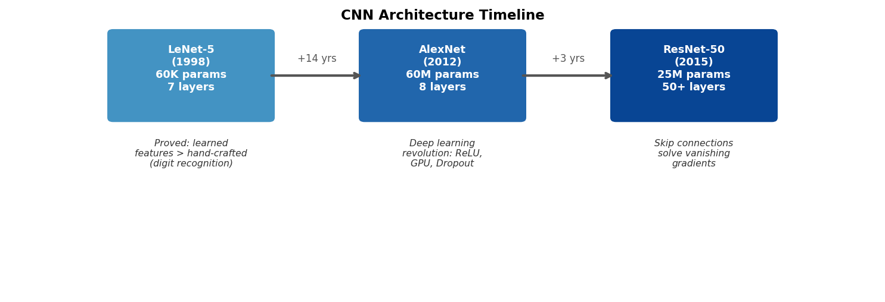
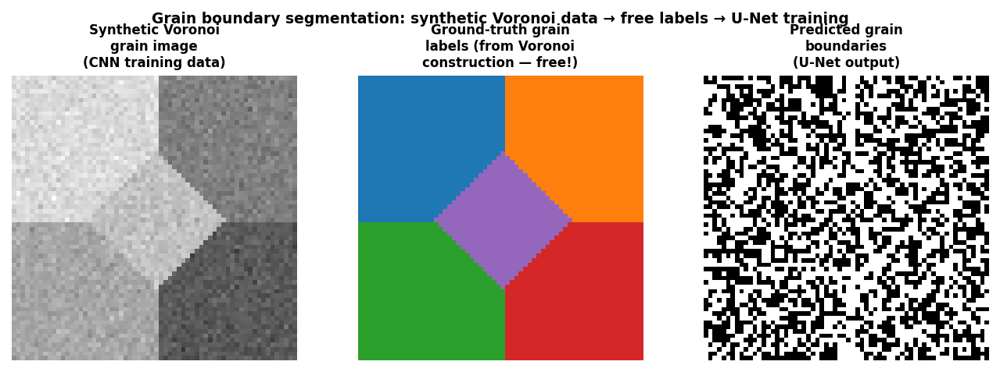

<!-- ===== §0. Recap + roadmap ===== -->

## Recap: Week 5 and today's question

:::: {.incremental}
- **Week 5:** neural networks from first principles — perceptrons, MLPs, XOR, ReLU, backprop via autograd, vanishing gradients.
- Core insight: a network is *loss minimisation by gradient descent* on a composition of learnable maps.
- **Gap:** MLPs flatten every image into a 1-D vector. A 1024×1024 HAADF image → one dense layer with 1000 neurons already has **one billion weights** — and the model treats the top-left pixel and the bottom-right pixel as completely unrelated inputs.
- **Today's question:** how do we build spatial structure into the architecture so that the network knows that nearby pixels are related, that the same feature can appear anywhere, and that features are hierarchical?
- **Answer:** convolutional neural networks (CNNs).
::::

:::: {.notes}
- Open by asking who noticed the "when NOT to use a deep net" bullet from Week 5: "dense MLP on images — use a CNN instead (Week 6)." Today is that week.
- The one point to land on this slide: CNNs are not a different paradigm; they are MLPs with locality and weight-sharing baked in. Everything from Week 5 — loss function, gradient descent, ReLU, Adam — still applies.
- Misconception to preempt: "CNNs are special because they use images." Wrong. CNNs work on any spatially structured signal: spectral images, diffraction patterns, EELS maps, simulated fields, time series.
- EM anchor: a 1024×1024 HAADF image is one of the most common data types in the course. The parameter-explosion argument is not theoretical — it is the concrete reason nobody trains a dense MLP on raw HAADF pixels.
- Pacing note: this slide is the bridge from Week 5 — 3 minutes maximum. The first conceptual slide is the next one.
- Transition: "Today's road map is short but dense. Let me show it before we dive in."
::::

## Road map and self-study

:::: {.incremental}
- **Road map:** recap Week 5 + today's question (2) · why MLPs fail on images (4) · convolution as a sliding feature detector (5) · kernels as edge/texture detectors (4) · stride, padding, channels (2) · weight sharing and translation equivariance (4) · pooling and downsampling (3) · receptive field and feature hierarchy (3) · CNN architectures: LeNet → AlexNet → ResNet (4) · U-Net for segmentation (3) · EM case study: phase and grain segmentation (6) · practicalities and failure modes + Week 7 preview (3).
- **Self-study:** `notebooks/week06_cnn_inference.ipynb` — apply hand-set kernels (Sobel, Laplacian, Gaussian) to a synthetic grain image; inspect feature maps; run a tiny random CNN forward pass; design a kernel to detect a specific boundary type. No training. Fast on CPU.
::::

:::: {.notes}
- Read the road map at medium pace and point out the two anchors: the parameter-explosion calculation in §1 and the U-Net EM segmentation in §5.
- The one pacing note: this slide is orientation only — 1 minute. Do not read every bullet. Gesture at the structure and move forward.
- Transition: "Start with the concrete problem — why does a plain MLP fail on microscopy images?"
::::

<!-- ===== §1. Why MLPs fail on images ===== -->

## The parameter explosion: a concrete count

{width="70%"}

:::: {.notes}
- Walk through the four bars explicitly. Left three: MLP on a 64×64, 256×256, and 1024×1024 image. Right: a single convolutional layer with 64 filters of size 3×3.
- The one point to land: the CNN bar is not visible at this scale — it is down at 576 parameters while the MLP is at 10⁹.
- Misconception to preempt: "more parameters = better." With small EM datasets (50–500 images), 10⁹ parameters means perfect memorisation of the training set and zero generalisation.
- EM anchor: a real 4D-STEM scan is 512×512 real-space × 128×128 momentum-space. Even the spatial slice is 262,144 pixels. No sane practitioner runs a dense MLP on that.
- Forward link: weight sharing is the mechanism that collapses 10⁹ to 576 — that is the next conceptual pivot.
- Transition: "The parameter count is one problem. The second problem is spatial blindness."
::::

## MLPs destroy spatial structure

:::: {.incremental}
- An MLP **flattens** the image: pixel (0,0), pixel (0,1), pixel (0,2), …, in row-major order.
- After flattening, the model treats pixel (100,100) and pixel (200,200) as completely **unrelated** input coordinates — no notion of "next to each other."
- Physics says the opposite: a grain boundary is a spatially *local* feature. An atomic column's contrast depends on its immediate neighborhood, not on pixels in a different part of the image.
- **Result:** the MLP must relearn the same edge detector at every possible image location — and then relearn it again if the same feature appears at a different size.
::::

:::: {.notes}
- Draw the key diagram on the board: a 4×4 image flattened to a vector of 16 numbers. Ask: "Which two numbers were neighbors in the image?" You cannot tell from the vector alone.
- The one point to land: locality is a physical property of EM images, not a mathematical luxury. Every microscopy feature — atomic column, grain boundary, pore, precipitate — is defined by what is near it.
- Misconception to preempt: "I could just tell the model the pixel coordinates." True in principle, but then you have already done feature engineering — you might as well use a CNN that does it automatically.
- EM anchor: a phase boundary in a TEM bright-field image is a 1–3 nm strip. Its signature is determined by the 10–20 pixels immediately around it, not by pixels 200 nm away.
- Transition: "The third problem is translation."
::::

## The translation problem: why position should not matter

:::: {.incremental}
- If a precipitate moves 5 pixels to the right, the MLP sees a **completely different** input vector.
- Every weight connected to the old location is now irrelevant; the model must have independently learned the same precipitate pattern at every position.
- This is physically absurd: a precipitate is a precipitate regardless of where it sits in the field of view.
- **What we want:** a feature detector that fires whenever the precipitate appears — regardless of location.
- This property is called **translation equivariance**: shift the input → the feature response shifts by the same amount.
::::

:::: {.notes}
- Use the "Where's Waldo" analogy: you find Waldo by scanning the image with a mental template of Waldo, not by memorising where he was in last week's puzzle. CNNs implement that template-scanning idea.
- The one point to land: translation equivariance is not a performance trick — it is encoding a physical fact about images. The network should not care where in the field of view the feature appears.
- Misconception to preempt: "convolution gives translation *in*variance." Convolutional layers give equivariance (shift in → shift response). Invariance comes from pooling or global average pooling — slides later.
- EM anchor: in a HAADF image of a superlattice, atomic columns appear at every unit-cell position. A detector that fires "column present" must work equally at every location.
- Transition: "So how do we fix all three problems at once? With one elegant idea."
::::

## Summary: three failures of MLP on images

| Problem | MLP behaviour | CNN fix |
|---|---|---|
| Parameter explosion | $D \times M$ weights per layer | $k_h k_w C_{out} C_{in}$ kernel weights |
| No spatial structure | All pixels treated equally | Local receptive field: inspect $k \times k$ patch |
| No translation awareness | Relearn at every location | Weight sharing: one kernel applied everywhere |

:::: {.fragment}
CNNs are MLPs with **locality and weight sharing built in as hard constraints**.
::::

:::: {.notes}
- Use this as a mini-summary before moving to the mechanics. Students often feel the three failure points were introduced separately but are actually one principle: dense layers know nothing about spatial structure.
- The one point to land: locality + weight sharing = convolution. That is the entire derivation. Everything else (padding, stride, pooling, channels) is implementation detail.
- Misconception to preempt: "CNNs are always better than MLPs." Wrong. For tabular non-spatial data (composition, temperature, hardness), MLPs or even linear models are often preferable. CNNs exploit spatial structure that may not exist.
- EM anchor: the "spatial structure" that CNNs exploit is exactly the physics-driven spatial correlation that Week 2 introduced via the Nyquist theorem: nearby pixels are correlated because they sample the same continuous physical field.
- Transition: "Let us now look at the core operation — convolution."
::::

<!-- ===== §2. Convolution: the sliding feature detector ===== -->

## Convolution: one idea, three properties at once

:::: {.incremental}
- Take a small **kernel** (e.g. 3×3 weights).
- **Slide** it across the image, pixel by pixel.
- At each position: multiply the kernel by the overlapping image patch, element-wise, and sum → one output value.
- The output is a **feature map**: a new image where each pixel encodes *how strongly the kernel's pattern appeared at that location*.
- One kernel produces one feature map. Multiple kernels in parallel → multiple feature maps.
::::

:::: {.notes}
- Narrate one output value explicitly: "align the 3×3 kernel at position (i,j), multiply the 9 overlapping pixels by the 9 kernel weights, sum the 9 products → one number. That is one pixel in the feature map."
- The one point to land: the "sliding" is what gives locality (only a local patch is used) AND translation equivariance (same kernel is slid everywhere).
- Misconception to preempt: "convolution flips the kernel." That is strict mathematical convolution. CNN libraries implement cross-correlation (no flip). Since kernels are learned, the distinction does not matter in practice.
- EM anchor: imagine a 3×3 "bright-dot" kernel applied to a HAADF image. It will respond strongly wherever an atomic column is and weakly everywhere else — producing a bright-dot feature map.
- Transition: "Let me show this on a real synthetic grain image."
::::

## The sliding-window operation step by step

{width="55%"}

:::: {.notes}
- Narrate one step of the sliding: "position the kernel over the top-left 3×3 patch; multiply each kernel weight by the overlapping pixel; sum the nine products; that single number becomes position (1,1) of the feature map. Now slide one pixel to the right; repeat."
- The one point to land: this sliding IS the translation equivariance — the same kernel visits every location, so whatever pattern it detects in the top-left it will also detect in the bottom-right.
- Misconception to preempt: "this is slow." For a single kernel loop it is. GPU-parallelised convolution evaluates all output positions simultaneously using BLAS-level matrix operations.
- EM anchor: think of the kernel as a template for a local feature — e.g. "bright centre, dark surround" for an atomic column. The sliding window asks: does my template match here? And here? And here?
- Transition: "Let us apply this to a real synthetic grain image and see the feature maps."
::::

## Convolution on a synthetic grain image

{width="90%"}

:::: {.notes}
- Point out explicitly: the two feature maps highlight *different* boundaries — vertical Sobel fires at the vertical boundary, horizontal Sobel fires at the horizontal boundary. Neither is a correct "grain boundary detector" by itself; you need both in combination.
- The one point to land: one 3×3 kernel produces one feature map. A CNN uses many kernels simultaneously, building a richer description.
- Misconception to preempt: "CNNs apply edge detectors." At the first layer, some learned kernels do resemble Sobel. But deeper layers learn highly abstract detectors that do not resemble any named filter.
- EM anchor: in a STEM experiment, you might want one feature map for atomic-column positions, one for the background, one for defect signatures. A single convolutional layer can extract all three simultaneously.
- Transition: "Let us look at specific hand-set kernels to build intuition before we let the network learn them."
::::

## The discrete convolution formula

For input image $I$ and kernel $K$:

$$
(I \star K)_{m,n} = \sum_{a=-\Delta}^{\Delta}\sum_{b=-\Delta}^{\Delta} K_{a,b}\,I_{m+a,\, n+b}
$$

:::: {.incremental}
- $K$ is a small matrix (typically $3\times3$ or $5\times5$); $\Delta = (k-1)/2$.
- At each output position $(m,n)$: dot product of the kernel with the local image patch.
- **Parameter count:** $k^2$ weights — independent of image size $H \times W$.
- The same $k^2$ weights are applied at every $(m,n)$ → **weight sharing**.
::::

:::: {.notes}
- Walk through the indices slowly: (m,n) is the output location; (a,b) runs over the kernel footprint. Students often confuse the kernel index with the image index.
- The one point to land: the formula shows why convolution is a LOCAL operation — only pixels within ±Δ of the output location contribute.
- Misconception to preempt: "the convolution formula requires flipping the kernel." This formula is cross-correlation. Strict mathematical convolution uses (m-a, n-b). Because kernels are learned, it makes no difference.
- EM anchor: for a HAADF signal, K could encode "compare center pixel to neighbors" — exactly what an edge-detector kernel does. The math is the same as the intuition.
- Transition: "What do specific kernels detect?"
::::

## Kernels as feature detectors

{width="70%"}

:::: {.fragment}
In a trained CNN, the network discovers these (and more complex) filters **automatically** from labelled examples — no manual kernel design needed.
::::

:::: {.notes}
- Name the sign pattern in each kernel. Vertical Sobel: positive on one column, negative on the other → fires at a sign change from left to right. Ask students: "what happens if you flip the sign pattern?" Answer: detects the opposite edge polarity.
- The one point to land: these hand-set kernels show what convolution can detect. The power of CNNs is that they learn kernels adapted to the specific task — grain boundary detection, atomic column location, pore segmentation.
- Misconception to preempt: "deep CNNs look like Sobel at every layer." Only the first layer occasionally learns Sobel-like patterns. Deeper layers learn combinations of earlier features that cannot be visualised as simple kernels.
- EM anchor: the Laplacian kernel fires at atomic columns (bright spots surrounded by dark background) and at defects — naturally suited to HAADF atomic-resolution images.
- Forward link: the notebook lets students hand-set kernels to detect a chosen grain-boundary type — connect this to the Sobel/Laplacian discussion here.
- Transition: "Three details control how a convolution layer changes image size: stride, padding, and multiple channels."
::::

<!-- ===== §3. Stride, padding, channels ===== -->

## Stride and padding: controlling output size

{width="70%"}

:::: {.incremental}
- **Padding (same):** add zeros around the border → output size = input size. Standard in most segmentation architectures.
- **Stride $s$:** move the kernel $s$ pixels per step → output size $\approx H/s$.
- A 3×3 kernel with padding=1, stride=1 keeps height and width: $H_{out} = \lfloor(H+2-3)/1\rfloor+1 = H$.
::::

:::: {.notes}
- Use the formula H_out = floor((H + 2p - k)/s) + 1 with concrete numbers. Ask students: "64×64 image, k=3, p=1, s=1 — what is H_out?" (Answer: 64.) "k=3, p=0, s=2?" (Answer: 31.)
- The one point to land: stride is the primary tool for downsampling in modern CNNs, often replacing explicit pooling layers (ResNet uses stride-2 convolutions instead of max-pool at stage transitions).
- Misconception to preempt: "zero padding is the only option." Reflect padding (mirror boundary), circular padding (for periodic signals like diffraction), and replicate padding are all available — some are more physically meaningful for certain EM signals.
- EM anchor: in 4D-STEM, the diffraction pattern is often periodic — circular padding is physically justified. For real-space HAADF images, reflect padding is more natural than zero padding.
- Transition: "Real images and feature maps have multiple channels."
::::

## Multiple channels: depth in the tensor

:::: {.incremental}
- A grayscale image has **1 channel**: $H\times W\times 1$.
- After a layer with $C_{out}$ kernels: $H_{out}\times W_{out}\times C_{out}$ (one feature map per kernel).
- A full convolutional layer kernel has shape $C_{out}\times C_{in}\times k_h\times k_w$.
- Total parameters: $C_{out}(C_{in}k_hk_w + 1)$ including biases — still independent of $H, W$.
- EM multichannels: hyperspectral EELS/EDS maps (spatial × energy), multi-segment detector images, RGB-like stacks of different contrast modes.
::::

:::: {.notes}
- Give the parameter count for a concrete example: 64 input channels, 128 output channels, 3×3 kernel → 128×(64×9+1) = 73,856 parameters. Still far smaller than any dense layer on a real image.
- The one point to land: channels are how CNNs regain expressive power after imposing locality and weight sharing. Each output channel is a different learned feature map.
- Misconception to preempt: "channels are just like colour channels." In the first layer yes, but by layer 3 each channel is an abstract learned representation — not interpretable as a colour or intensity.
- EM anchor: an EELS spectrum image at each of 1024 energy windows is a 3D tensor with 1024 channels. A convolutional layer over that can learn spatially localised spectral signatures — exactly what phase identification requires.
- Transition: "Now let us make precise why weight sharing is such a powerful inductive bias."
::::

<!-- ===== §4. Weight sharing and translation equivariance ===== -->

## Output shape formula: a practical checklist

For input $C_{in}\times H\times W$, kernel size $k$, padding $p$, stride $s$:

$$
H_{out} = \left\lfloor\frac{H + 2p - k}{s}\right\rfloor + 1
$$

:::: {.incremental}
- **Same convolution** (preserve size): $k=3, p=1, s=1$ → $H_{out}=H$.
- **Strided downsampling:** $k=3, p=1, s=2$ → $H_{out}\approx H/2$.
- **Parameter count:** $C_{out}(C_{in}k^2 + 1)$ — depends on channels and kernel size, NOT image size.
- Active check: $H=64, k=3, p=1, s=1$ → $H_{out}=(64+2-3)/1+1=64$. ✓
- After two stride-2 layers: $H_{out}=64/4=16$; after four: $H_{out}=64/16=4$.
::::

:::: {.notes}
- Derive one row of the formula numerically on the board: H=64, k=3, p=1, s=1. (64+2-3)/1 + 1 = 63+1 = 64. Check: same size.
- The one point to land: parameter count is independent of image size H and W. That is why the same CNN can process 256×256 and 1024×1024 images — the weights do not change; only the computation time does.
- Misconception to preempt: "more padding always means the same output size." Only for the specific combination k=3, p=1, s=1. If s=2, H_out ≈ H/2 even with padding=1.
- EM anchor: knowing the output shape formula lets you compute when the feature map becomes too small for the task. For segmentation, never shrink below ~8×8 in the encoder before starting the decoder path.
- Transition: "Now the key insight — weight sharing — that makes this parameter count so attractive."
::::

## Weight sharing: the key efficiency principle

{width="75%"}

:::: {.notes}
- Name the numbers. For the 1-D example shown: 8 inputs × 8 outputs = 64 weights in the dense case. 3-weight conv kernel shared across 8 positions = 3 weights. Factor of 21.
- The one point to land: weight sharing is not just an efficiency trick — it encodes a *physical assumption*. A grain boundary looks the same in the top-left corner and the bottom-right corner of the field of view. The same kernel should detect it in both places.
- Misconception to preempt: "fewer parameters = weaker model." CNNs are empirically more expressive than dense MLPs at the same parameter count on spatial data, because the inductive bias is well-matched to the signal structure.
- EM anchor: in HAADF imaging, atomic columns form a repeating pattern across the entire field of view. Learning one column-detector kernel and reusing it everywhere is physically optimal — and exactly what the network does.
- Transition: "Weight sharing gives us equivariance — let us be precise about what that means."
::::

## Translation equivariance as an inductive bias

:::: {.incremental}
- **Translation equivariance:** if the input shifts by $\delta$ pixels, the feature map shifts by $\delta$ pixels — the detector response follows the feature.
- Formally: $f(T_\delta X) = T_\delta f(X)$ where $T_\delta$ is a spatial shift and $f$ is a convolutional feature extractor.
- This is the correct prior for most microscopy tasks: a precipitate is a precipitate wherever it appears.
- **Translation invariance** (different!): the final *prediction* does not change if the input shifts. Built gradually via pooling, striding, and global average pooling — not by convolution alone.
::::

:::: {.fragment}
*Equivariance preserves "where." Invariance discards "where" and keeps only "what."*
::::

:::: {.notes}
- Clarify the equivariance vs invariance distinction explicitly. Equivariance is what conv layers give you. Invariance is what you want for image-level classification (does this image contain a precipitate, yes/no). Segmentation tasks need equivariance, not invariance — the output mask must track the position.
- The one point to land: architecture choice (conv vs pooling) determines whether you preserve or discard positional information. This is a design choice aligned with the task.
- Misconception to preempt: "data augmentation (random crops, flips) trains invariance." Augmentation helps, but the architectural bias from pooling/striding is what gives the fundamental invariance property.
- EM anchor: grain boundary segmentation (U-Net, coming soon) needs equivariance. Defect present/absent classification can discard position. Architecture choice should match the task.
- Transition: "Pooling is the classical way to introduce invariance and reduce resolution."
::::

## Inductive bias: encoding what you know

:::: {.incremental}
- An **inductive bias** is an assumption baked into the architecture that makes certain functions easy to learn.
- Dense MLP: no spatial bias — every function of all pixels is equally easy.
- CNN: locality + weight sharing make spatially local, translation-equivariant functions easy.
- Strong inductive bias helps with small datasets by ruling out physically unreasonable solutions.
- Weak inductive bias requires more data to learn the right structure from scratch.
::::

:::: {.notes}
- Connect to Week 5's practical rule: "when NOT to use a deep net: N < 200 tabular samples." CNNs are an example of the opposite rule: a strong spatial inductive bias lets them work well with fewer labelled images than a dense MLP would need.
- The one point to land: choosing an architecture is choosing a prior over functions. CNNs are a strong prior for images; Gaussian processes (Week 9) are a strong prior for smooth continuous functions.
- EM anchor: with 50 labelled HAADF images, a CNN with the right architecture generalises. A dense MLP on the same 50 images overfits catastrophically. The inductive bias is doing the work.
- Transition: "Now pooling."
::::

<!-- ===== §5. Pooling and downsampling ===== -->

## Pooling: summarising local responses

{width="40%"}

:::: {.incremental}
- **Max pooling:** keep the strongest activation in each local window. Answers: "did this feature appear here?"
- **Average pooling:** compute the mean. Answers: "how strongly was this feature present overall?"
- No learned parameters — purely deterministic aggregation.
- $2\times2$ max-pool: halves height and width, doubles the effective receptive field of later layers.
::::

:::: {.notes}
- Narrate the 2×2 max-pool: "take the top-left 2×2 block of the feature map, keep the largest value, put it in position (0,0) of the pooled output. Repeat for every non-overlapping block."
- The one point to land: pooling provides approximate translation invariance within a window. A precipitate shifted 1 pixel to the right stays in the same pool window and produces the same pooled output — the network becomes insensitive to small shifts.
- Misconception to preempt: "max-pool always wins." In segmentation (U-Net), max-pool in the encoder is fine, but the decoder must recover spatial detail that max-pool discarded — that is what skip connections do.
- EM anchor: in a HAADF image of a defect, the defect might shift slightly between beam positions due to drift. Max-pool makes the detector robust to this sub-pixel drift.
- Transition: "Pooling and strided convolutions both reduce resolution. Together they make the receptive field grow quickly with depth."
::::

## Max pooling: a worked example

:::: {.columns}
:::: {.column width="50%"}
**Input feature map (4×4):**

$$
\begin{pmatrix}
1 & 3 & 2 & 4 \\
5 & 6 & 7 & 8 \\
3 & 2 & 1 & 0 \\
1 & 2 & 3 & 4
\end{pmatrix}
$$
::::
:::: {.column width="50%"}
**After 2×2 max-pool (stride 2):**

$$
\begin{pmatrix}
6 & 8 \\
3 & 4
\end{pmatrix}
$$

Top-left 2×2 block: $\max(1,3,5,6)=6$.
Top-right: $\max(2,4,7,8)=8$.
::::
::::

:::: {.fragment}
- Output size: $2\times2$ from $4\times4$ — spatial dimensions halved.
- No learned parameters — purely a max operation.
- **Approximate invariance:** if the 6 moved to the adjacent cell (still in the same 2×2 window), the output is unchanged.
::::

:::: {.notes}
- Walk through the four quadrants. Top-left: max(1,3,5,6)=6. Top-right: max(2,4,7,8)=8. Bottom-left: max(3,2,1,2)=3. Bottom-right: max(1,0,3,4)=4.
- The one point to land: the maximum preserves "was this feature strongly present anywhere in this window?" — appropriate for feature detection where exact position within the 2×2 window does not matter.
- Misconception to preempt: "average pooling is always worse." Average pooling is better when you care about the average activation level (e.g. how much of this phase is in this region), not just whether the feature appeared.
- EM anchor: in an atomic-column detector, you want max-pool to be robust to 1-pixel drift of the column within the window. Average-pool would dilute a single bright-column response with its dark background neighbours.
- Transition: "Multiple conv-pool blocks in sequence is the standard encoder pattern."
::::

## Pooling in practice: the Conv–Pool block

:::: {.incremental}
- Standard building block: **Conv → ReLU → MaxPool**.
- After $L$ such blocks (each with stride-2 or 2×2 pool): spatial size is $H/2^L \times W/2^L$.
- Channels typically double at each stage: 64 → 128 → 256 → 512.
- Example: 256×256 input through 4 blocks → 16×16 feature maps with 512 channels.

| Block | Channels | Spatial size (from 256×256) |
|:---:|:---:|:---:|
| 1 | 64 | 128×128 |
| 2 | 128 | 64×64 |
| 3 | 256 | 32×32 |
| 4 | 512 | 16×16 |
::::

:::: {.notes}
- Ask students to confirm the table. After one 2×2 max-pool: 256/2 = 128. After two: 64. Three: 32. Four: 16. This is the standard encoder pattern in classification CNNs and the encoder half of U-Net.
- The one point to land: the spatial-channel trade-off is intentional. Losing spatial detail is acceptable if you are doing classification (just need a label). For segmentation, you need the decoder half of U-Net to restore the spatial detail.
- Transition: "Understanding receptive fields lets you reason about how much context each neuron sees."
::::

<!-- ===== §6. Receptive field and feature hierarchy ===== -->

## Receptive fields: how much context does one neuron see?

{width="75%"}

:::: {.notes}
- Walk through the three panels. First panel: the output neuron (red star) is determined by a 3×3 patch. Second panel: each neuron in layer 2 was itself determined by a 3×3 patch of layer 1, which was a 3×3 patch of the input — giving a 5×5 input receptive field. Third: 7×7.
- The one point to land: depth is how CNNs grow context without expensive large kernels. Three stacked 3×3 layers (3×9=27 params/channel) beat one 7×7 layer (49 params/channel) because there are two extra nonlinearities between them.
- Misconception to preempt: "larger kernels always see more." Two stacked 3×3 layers give the **same** 5×5 theoretical receptive field as one 5×5 layer — but with fewer parameters and an extra nonlinearity between them, making the representation strictly more expressive. The benefit is not a larger RF; it is parameter efficiency plus added depth.
- EM anchor: detecting a dislocation requires seeing context beyond one pixel. A grain triple junction requires seeing ~10–20 nm of context. Pooling rapidly grows the receptive field — by layer 4, one neuron can see a quarter of the image.
- Transition: "Growing receptive fields naturally lead to hierarchical features."
::::

## Feature hierarchy: edges → motifs → structures → properties

{width="90%"}

:::: {.notes}
- Walk through the four panels in order. Point out that each stage is more abstract and coarser in resolution.
- The one point to land: this hierarchy is why CNNs are a natural fit for materials images. Microscopy features ARE hierarchical — atoms form columns, columns form grains, grains form microstructures, microstructures encode properties.
- Misconception to preempt: "feature maps are always interpretable." Only Layer 1 features are reliably interpretable as edge/orientation detectors. Deeper features are abstract combinations with no simple physical label.
- EM anchor: in HAADF imaging: Layer 1 detects atomic columns. Layer 2 detects local lattice periodicity (grain interior) vs disorder (boundary). Layer 3 detects grain, phase, or defect-cluster regions. Layer 4+ enables phase classification.
- Forward link: Grad-CAM visualisation (mentioned in Week 13 explainability) can partially interpret which input regions drove the final classification — connecting to feature hierarchy.
- Transition: "Let us now look at the major CNN architectures and what each added."
::::

## Summary: how locality, sharing, and hierarchy combine

| Design choice | What it encodes | EM benefit |
|---|---|---|
| Local receptive field | Features depend on local context | Grain boundaries are local |
| Weight sharing | Same feature appears at many positions | Atomic columns repeat |
| Multiple channels | Many detectors in parallel | Multi-contrast detection |
| Stride / pooling | Coarser scale, larger context | Phase-level reasoning |
| Depth / nonlinearity | Hierarchical feature composition | Atoms → grains → phases |

:::: {.notes}
- Use this table as a mid-lecture checkpoint. Ask: "which row explains the 930,000× parameter reduction?" (Weight sharing.) "Which explains how a segmentation network eventually knows a whole grain is one phase?" (Depth + pooling.)
- Transition: "Now the major architectures."
::::

<!-- ===== §7. CNN architectures ===== -->

## CNN architectures in one breath: the arc from 1998 to 2015

{width="90%"}

:::: {.notes}
- Read the three boxes together as a story: "LeCun proved learned features beat hand-crafted features for digit recognition. The field then stalled for 14 years while GPUs and datasets grew. AlexNet in 2012 shocked the computer vision community with a 10-percentage-point lead on ImageNet. Then researchers tried to go deeper and hit the vanishing-gradient wall, which ResNet in 2015 solved with skip connections — enabling networks 20× deeper than AlexNet."
- The one point to land: each innovation solved a specific failure mode. LeNet → learning beats hand-craft. AlexNet → scale + ReLU + dropout. ResNet → depth without vanishing gradients.
- Misconception to preempt: "you need to know these architectures by name for the exam." What matters is the progression: what failed, what was added, why. The architecture names are labels for the innovations.
- Transition: "LeNet is worth knowing in a little more detail because it is the direct template for most materials-science CNNs."
::::

## LeNet: the CNN template

:::: {.incremental}
- **LeNet-5** [@lecun1998lenet]: two convolutional layers, two pooling layers, three dense layers.
- ~60,000 parameters — tiny by modern standards.
- Proved for the first time that a learned feature extractor could outperform hand-crafted features (SIFT, HOG) on a real vision task.
- **The template:** Conv → Activation → Pool → Conv → Activation → Pool → Flatten → FC → FC → Output.
- This exact recipe still appears in CNN classifiers for materials micrographs today — often with deeper variants.
::::

:::: {.notes}
- Draw the LeNet template on the board as a pipeline. Students should be able to reproduce this from memory by the end of the course.
- The one point to land: LeNet answers "what is the basic recipe?" The subsequent architectures are variations that go deeper, wider, and more efficient.
- EM anchor: a CNN for classifying steel microstructures as martensitic vs ferritic often follows this exact LeNet template — two or three conv-pool blocks, then a dense classifier head.
- Transition: "AlexNet added scale, ReLU, and dropout."
::::

## AlexNet: the deep learning revolution [@krizhevsky2012alexnet]

:::: {.incremental}
- **AlexNet (2012):** won the ImageNet Large Scale Visual Recognition Challenge by 10 percentage points over the second-place hand-crafted pipeline.
- Key innovations (each still used today):
  - **ReLU activation:** faster convergence, no vanishing gradient for $z > 0$ (from Week 5).
  - **Dropout:** randomly zero out neurons during training → prevents co-adaptation, reduces overfitting.
  - **GPU training:** made deep networks with 60 million parameters computationally feasible.
- Opened the "deep learning era" — almost every subsequent architecture follows the AlexNet pattern with improvements.
::::

:::: {.notes}
- Connect ReLU back to Week 5: "you already know why ReLU beat sigmoid — gradient is 1 for z > 0, so it doesn't vanish through many layers." Dropout is a new concept here — explain as "randomly turning off 50% of neurons per batch prevents any one neuron from becoming essential, forcing the network to learn redundant distributed representations."
- The one point to land: AlexNet's margin of victory was so large that it instantly converted the computer-vision community from hand-crafted features to deep learning. The same shift happened in materials science about 5 years later.
- Transition: "Going deeper than AlexNet revealed the vanishing gradient problem."
::::

## ResNet: skip connections solve vanishing gradients [@he2016resnet]

{width="42%"}

:::: {.fragment}
$$\mathbf{y} = F(\mathbf{x}) + \mathbf{x}$$
Instead of learning the target $\mathbf{y}$, learn the **residual** $F(\mathbf{x}) = \mathbf{y} - \mathbf{x}$.
::::

:::: {.notes}
- Connect to Week 5's vanishing gradient discussion: "through 20 layers of sigmoid, the gradient shrinks by 0.25^20 ≈ 10^-12. ReLU fixed this for moderate depth. ResNet fixed it for arbitrary depth by providing a gradient highway through the skip connection."
- The one point to land: the skip connection makes the gradient path shorter. Even if the convolutional branch produces a near-zero gradient, the skip branch passes the full gradient back without modification.
- Misconception to preempt: "ResNet needs 50+ layers to work." ResNet blocks are useful at any depth. Even a 10-layer network benefits from skip connections when training is unstable.
- EM anchor: several recent papers on materials microstructure segmentation use ResNet-50 as the feature extractor in a Mask R-CNN or DeepLab pipeline — students will encounter this terminology in the literature.
- Transition: "Classification networks produce one label per image. For EM segmentation we need one label per pixel — that is U-Net."
::::

<!-- ===== §8. U-Net ===== -->

## U-Net: encoder–decoder for segmentation [@ronneberger2015unet]

{width="78%"}

:::: {.notes}
- Walk through the architecture from top-left to top-right. "Encoder (blue): each block halves the spatial size and doubles channels — building rich abstract features. Bottleneck (purple): smallest spatial resolution, maximum context. Decoder (red): each block upsamples by 2 and uses a skip connection to bring back fine spatial detail from the corresponding encoder level. Output: same spatial resolution as input, one label per pixel."
- The one point to land: the key innovation is the skip connection that bypasses the bottleneck. Without it, the decoder has to reconstruct fine spatial detail entirely from the compressed bottleneck representation — which is too abstract and loses boundary precision.
- Misconception to preempt: "U-Net is only for medical images." The original paper used biomedical images, but U-Net is now the standard segmentation architecture for any spatially structured prediction — including phase segmentation in TEM and grain tracing in SEM.
- EM anchor: the spatial resolution of the output mask (same as input) is critical for measuring grain sizes, locating precipitates, and computing phase fractions. Classification-only CNNs cannot provide this.
- Transition: "Let me break down the two paths."
::::

## U-Net: encoder, bottleneck, decoder

:::: {.columns}
:::: {.column width="50%"}
**Encoder path**

:::: {.incremental}
- Conv × 2 → ReLU → MaxPool (stride 2).
- Repeat 4 times: spatial halves, channels double.
- Each level captures increasing context.
- Similar to a standard classification CNN encoder.
::::
::::
:::: {.column width="50%"}
**Decoder path**

:::: {.incremental}
- Upsample (bilinear or transposed conv) → concatenate skip.
- Conv × 2 → ReLU.
- Repeat 4 times: spatial doubles, channels halve.
- Final 1×1 conv → class probabilities per pixel.
::::
::::
::::

:::: {.fragment}
**Why skip connections are non-negotiable for segmentation:** without them, precise boundary locations are lost in the bottleneck compression; the output mask is correct in texture but blurry in boundary position.
::::

:::: {.notes}
- Explain why the decoder uses concatenation rather than addition: "we want to keep both the fine-detail information from the encoder (position, texture) and the high-level semantic information from the deeper decoder. Concatenation preserves both; addition would blend them."
- The one point to land: in segmentation, "where?" matters as much as "what?" — and skip connections are the mechanism that preserves "where."
- Misconception to preempt: "U-Net needs huge training sets." One of the explicit design goals of Ronneberger et al. 2015 was to work with very small labelled datasets (~30 images in the original biomedical application). This is ideal for EM.
- EM anchor: in a 4D-STEM phase-mapping application, the U-Net input could be the 2D real-space image (from virtual bright-field) and the output mask labels each pixel as phase A, B, or boundary.
- Transition: "Now let us see U-Net in action on EM data."
::::

## U-Net output: per-pixel classification

:::: {.incremental}
- Input: $C\times H\times W$ (image or multi-channel tensor).
- Output: $K\times H\times W$ (K class probability maps, same resolution as input).
- At inference: $\arg\max$ over the $K$ channels gives the segmentation mask.
- Loss: **cross-entropy at every pixel**, summed or averaged over the image.
- The loss is differentiable → same backprop + Adam optimisation as any other network.
::::

:::: {.notes}
- Write the loss explicitly: "for a binary segmentation (grain vs boundary), the loss at pixel (m,n) is the binary cross-entropy between the predicted probability and the ground-truth label. The total loss is the average over all pixels in the minibatch."
- The one point to land: U-Net uses the exact same training machinery as the MLP and classification CNN from the last two weeks. The only change is the output head and the loss computation.
- Transition: "Let us look at the EM case studies."
::::

<!-- ===== §9. EM case studies ===== -->

## EM case study 1: Au nanoparticle phase segmentation

{width="85%"}

:::: {.notes}
- Describe the physical task: "Au nanoparticles are crystalline — they show regular lattice fringes in TEM. The silica matrix is amorphous — shows no periodic structure. The task is to label every pixel as 'crystalline Au' or 'amorphous silica', producing a quantitative phase map."
- The one point to land: this is exactly the task where U-Net excels — the boundary between phases has a specific local texture signature that the encoder learns, and the exact location of the boundary matters for measuring nanoparticle size distributions.
- Misconception to preempt: "we need thousands of labelled TEM frames to train." In practice, 50–200 carefully labelled frames can train a U-Net for this specific task, especially combined with data augmentation (next week's topic).
- EM anchor: phase fraction measurement (how much Au vs how much silica?) requires pixel-accurate segmentation — a classification-only CNN cannot provide this.
- Transition: "The second case study shows how synthetic data can replace expensive labelling."
::::

## U-Net TEM segmentation: published results

{width="75%"}

:::: {.notes}
- The key message from a real result: the U-Net output mask closely tracks the true phase boundary, including thin boundary regions that would be hard to threshold manually.
- The one point to land: the skip connections are what enables boundary-level precision. Without them, the decoder would produce a coarsely correct but spatially blurry mask.
- Misconception to preempt: "high pixel-accuracy means a good model." Check IoU and Dice on the boundary class specifically — boundary pixels are rare (thin lines) so accuracy is dominated by the background class.
- EM anchor: published phase-fraction measurements from TEM use exactly this kind of pixel-accurate mask to compute the crystalline volume fraction — directly connecting to quantitative materials characterisation.
- Transition: "The same encoder–decoder approach, but trained on free synthetic data, works for grain boundary detection."
::::

## EM case study 2: Grain boundary segmentation from synthetic training data

{width="85%"}

:::: {.notes}
- Explain the Voronoi approach: "Voronoi tessellations generate random grain patterns where every pixel's grain assignment is known by construction — providing perfect free labels. A U-Net trained on thousands of these synthetic images can then be applied to real SEM polycrystal images."
- The one point to land: synthetic data generation is a powerful strategy for EM applications where expert labelling is expensive (hours per image). The CNN learns the topological truth of grain boundaries from synthetic images and transfers to real ones.
- Misconception to preempt: "a network trained on perfect synthetic images will fail on noisy real ones." Often it does not — because grain boundary topology (a dark line separating two bright regions) is visually robust to noise, contrast variation, and imaging conditions.
- EM anchor: grain boundary segmentation underpins the quantitative measurement of grain size distributions, which connects directly to Hall–Petch (Week 5's materials example) — a closed-loop materials data science pipeline.
- Forward link: systematic strategies for bridging the synthetic-to-real gap — augmentation, transfer learning, domain randomisation — are the topic of Week 7.
- Transition: "The third case study shows defect detection."
::::

## Synthetic-to-real transfer: Voronoi → SEM grain maps

{width="75%"}

:::: {.notes}
- Point out the core message: the network was never shown a real SEM image during training. It learned "grain boundary = dark narrow strip separating two regions of different texture" from synthetic images, and that description transfers.
- The one point to land: this is why synthetic data generation is a first-class strategy in EM data science. Physical topology (connectivity, boundary shape) is independent of the specific instrument, contrast mode, and noise level.
- Misconception to preempt: "domain shift will always break synthetic-to-real transfer." For grain boundaries specifically, the topological prior is very strong. For more subtle features (specific lattice defects, chemical contrast), domain adaptation or real labelled data may still be needed.
- EM anchor: the practical value is enormous — generating 10,000 Voronoi images takes minutes; manually labelling 10,000 real SEM grain images takes months. The synthetic approach democratises labelled data creation.
- Forward link: Week 7 will show how to augment synthetic images (add noise, vary contrast, apply elastic deformations) to further close the synthetic-to-real gap.
::::

## EM case study 3: CNN feature hierarchy for microstructure classification

:::: {.incremental}
- **Task:** classify TEM micrographs by microstructure type or material phase.
- **How:** use a pretrained CNN as a feature extractor — mechanics in Week 7.
::::

:::: {.notes}
- **Week 7 preview (brief):** a CNN trained on ImageNet (1.4 million natural photos) has learned edge detectors, texture filters, and local motif detectors in its first layers. These transfer to EM images. We freeze those layers and replace only the final classification head with a small network for the target task. Full fine-tuning mechanics are in Week 7.
- The one point to land: the feature hierarchy (edges → motifs → structures) transfers across domains — even from natural photos to TEM images. This is why pretrained CNNs are useful starting points for EM workflows.
- EM anchor: published workflows for steel microstructure classification (martensite vs bainite vs ferrite) achieve good results with pretrained CNNs fine-tuned on small labelled micrograph sets — made feasible precisely because the early feature hierarchy transfers.
- Forward link: transfer learning and data augmentation are the two main strategies for working with small labelled EM datasets — exactly the topic of Week 7.
- Transition: "Before we finish, let us be honest about where CNNs fail in EM applications."
::::

## Quantitative example: parameter savings and labelling cost

:::: {.incremental}
- A $3\times3$ conv layer with 64 input and 128 output channels: $128 \times (64 \times 9 + 1) = 73{,}856$ parameters.
- A dense layer on a $256\times256$ image with 128 outputs: $256^2 \times 128 = 8{,}388{,}608$ parameters — **114× more**.
- A compact four-level U-Net (32→64→128→256 channels) for 256×256 binary segmentation: ~7.8 million parameters. The original Ronneberger et al. U-Net is ~30 million parameters.
- A 256×256 dense prediction MLP would need hundreds of millions of parameters per layer.
- **Labelling cost:** training a U-Net from scratch on EM data typically requires 50–200 carefully annotated images. Transfer learning (Week 7) can reduce this to 20–50.
::::

:::: {.notes}
- Use this slide as a concrete summary of the efficiency argument and connect it to the practical context students face in their MSc projects. 200 labelled images is feasible in a 3-month project; 10,000 is not.
- The one point to land: the parameter efficiency of CNNs is not a luxury — it is what makes deep learning tractable for EM datasets, which are small by computer-vision standards.
- Transition: "Now the practicalities and failure modes."
::::

<!-- ===== §10. Practicalities, failure modes, forward link ===== -->

## Failure modes of CNNs in EM applications

:::: {.incremental}
- **Domain shift:** a CNN trained on HAADF images from one microscope fails on HAADF images from a different microscope with a different contrast transfer function or detector geometry. Solution: retrain on the target instrument or use domain adaptation.
- **Beam damage artefacts:** a CNN trained on undamaged samples may misclassify beam-damage artefacts as phase boundaries. Always inspect predictions qualitatively.
- **Scale sensitivity:** a CNN trained on 0.1 nm/pixel resolution misclassifies images at 0.5 nm/pixel. Always match training and inference resolution.
- **Out-of-distribution inputs:** a U-Net trained on grain boundaries gives nonsense output on a completely different microstructure type. Check training data coverage.
::::

:::: {.notes}
- Use one concrete failure story if possible: "a U-Net for Au nanoparticle segmentation was applied to a Pt nanoparticle dataset. The contrast pattern was similar but the lattice spacing was different. The model over-segmented the Pt particles as multiple Au-sized objects."
- The one point to land: CNNs learn correlations in training data. If the test distribution differs from training, all bets are off. Validation on held-out microscopy sessions (not just random image crops) is essential.
- Misconception to preempt: "a high train/val accuracy guarantees the CNN is correct." Not if the val set was drawn from the same microscopy session. Use GroupKFold by session/specimen (Week 4's lesson!) for honest evaluation.
- EM anchor: beam damage is a uniquely EM failure mode. Damage artifacts can look like grain boundaries or phase inclusions. The CNN has no way to distinguish them from real structure unless trained to do so.
- Forward link: data augmentation and transfer learning (Week 7) are the main strategies to improve robustness to domain shift and scale variation.
- Transition: "One last practical note before the forward link."
::::

## Practical checklist for CNN-based EM analysis

:::: {.incremental}
- **Match resolution:** train and infer at the same pixel size.
- **Honest validation:** use `GroupKFold` by specimen or microscopy session — not random splits.
- **Inspect qualitatively:** always look at predicted masks on held-out images before reporting metrics.
- **Report IoU and Dice, not accuracy:** for segmentation on imbalanced masks (thin boundaries vs large grains), accuracy is misleading.
- **Start simple:** a 4-layer U-Net with 32→64→128→256 channels often outperforms a 50-layer ResNet when $N < 200$ labelled images.
::::

:::: {.notes}
- Point out that points 2 and 3 directly echo Week 4 (honest validation) and Week 5 (inspect failure modes qualitatively). The recurring theme is: do not trust numbers alone; look at what the model actually predicts.
- The one point to land: for EM applications, the engineering simplicity rule applies. A simple, well-validated model that the team can understand and debug is more valuable than a complex model with marginally better metrics.
- Transition: "Let us close with the forward link to Week 7."
::::

## Forward link: Week 7 — Beating small and expensive data

:::: {.incremental}
- **Next week's question:** you have 30 labelled TEM images. How do you train a reliable CNN?
- **Strategy 1 — Data augmentation:** apply physically plausible image transformations (rotate, flip, add Poisson noise, crop, elastic deform) to multiply the effective training set size without new acquisitions.
- **Strategy 2 — Transfer learning:** start from a CNN pre-trained on ImageNet; the first layers' edge and texture detectors transfer to EM images; only fine-tune the last layers on the target task.
- **Strategy 3 — Synthetic microstructures:** generate ground-truth-labelled training data via Voronoi (grains), random sphere packing (nanoparticles), or physics simulations.
- Today's CNN mechanics are the prerequisite for all three strategies.
::::

:::: {.notes}
- This slide explicitly closes the forward link. Make clear that the three strategies are not alternatives — they are used together. A real EM segmentation pipeline might start with Voronoi synthetic data, augment extensively, and fine-tune from an ImageNet-pretrained backbone.
- The one point to land: everything from today — convolution, feature hierarchy, weight sharing, U-Net encoder-decoder — is the foundation on which Week 7 builds. The student who understands today's mechanics will understand why augmentation, transfer, and synthetic data all work.
- Transition to the notebook: "The self-study notebook applies everything from today hands-on, with no training — just kernels and forward passes. Work through it before Week 7."
::::

## References

::: {#refs}
:::
