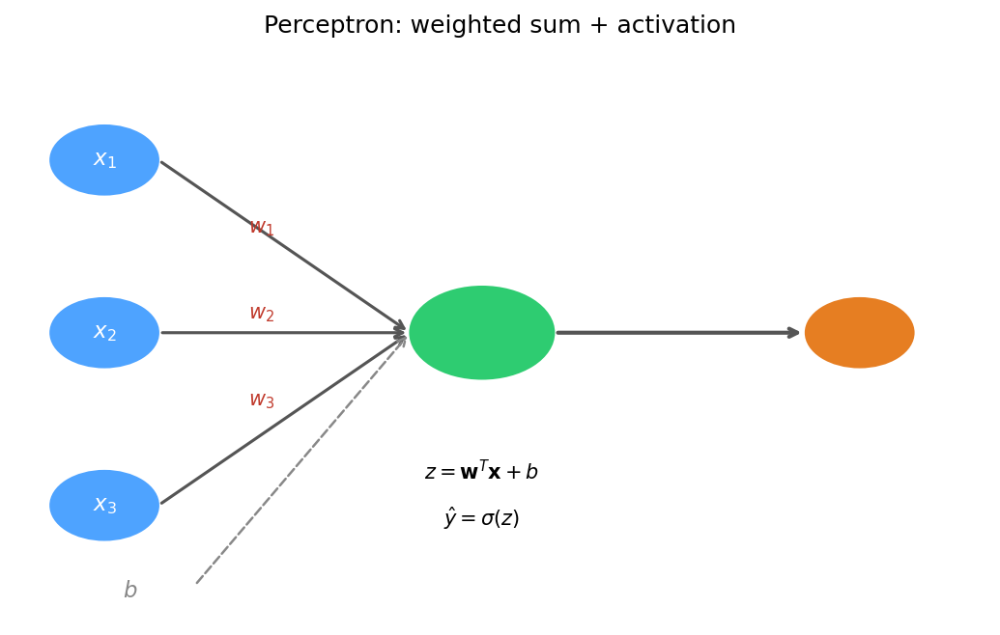
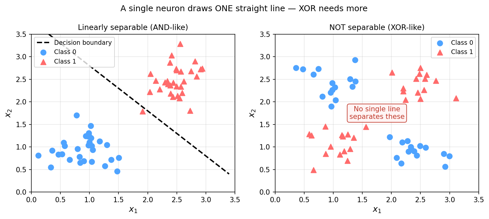
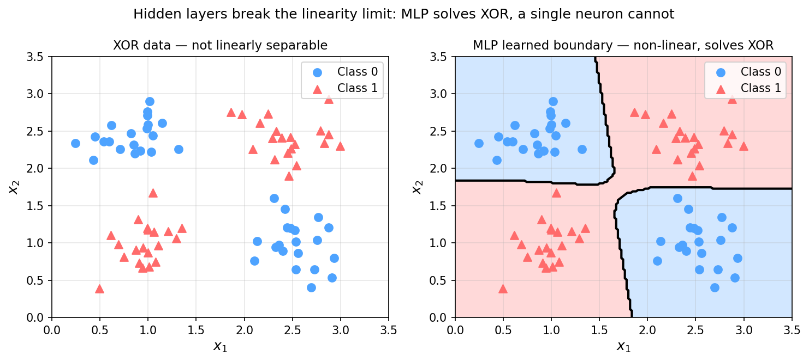
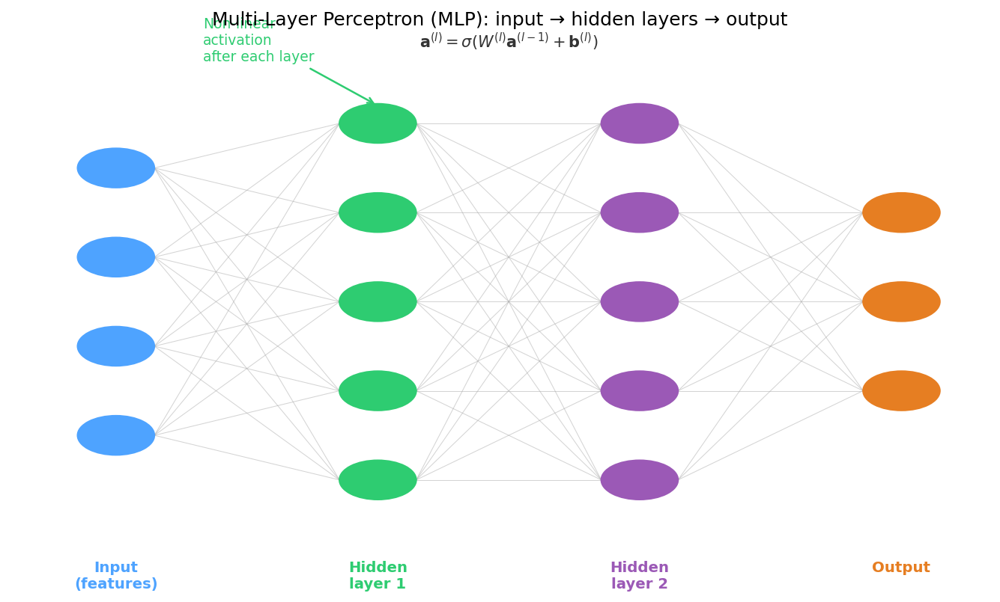
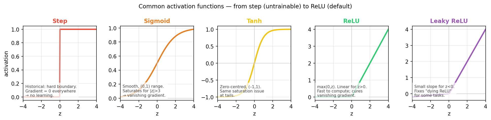
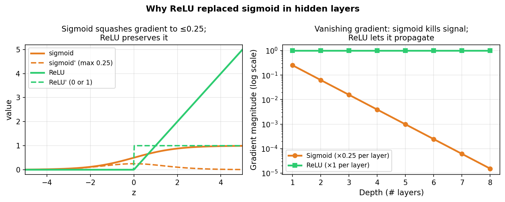
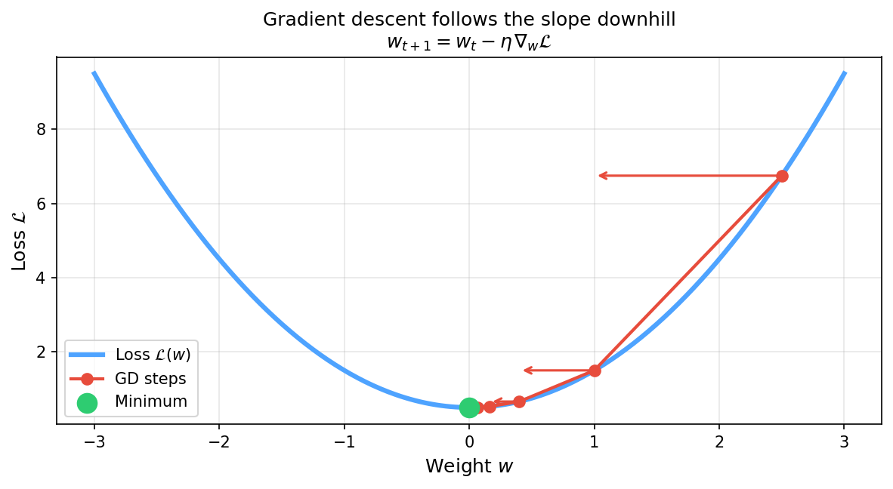
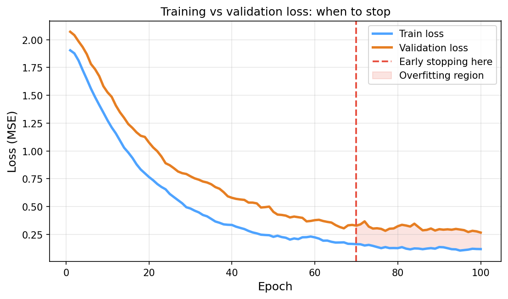
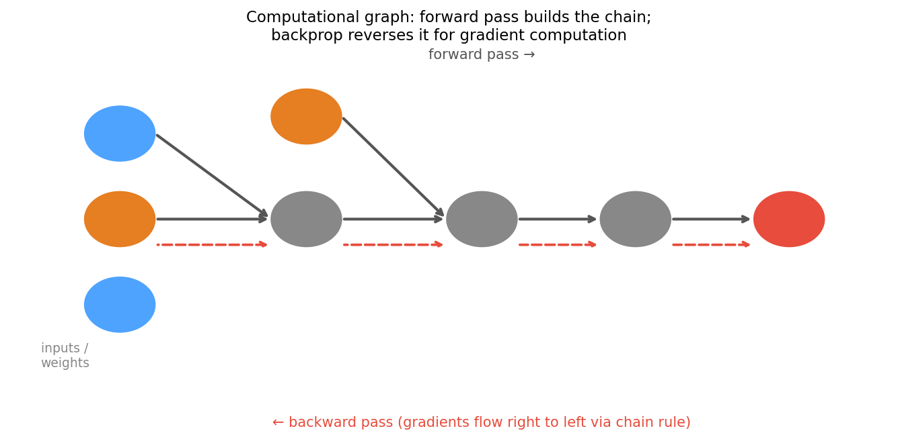

<!-- ===== §0. Recap + roadmap ===== -->

## Recap: where we left off

:::: {.incremental}
- **Week 5:** from images to features — segmentation → `regionprops` descriptors, atom-column finding, local-environment descriptors, then decision trees, random forests and gradient boosting on the resulting table.
- You can now turn an EM image into a feature table and fit a **RF/GBM baseline** with `GroupKFold` by image — and read it with permutation importance.
- **The baseline ladder** from Week 5: mean → linear/Ridge → RF/GBM → **neural network**. Each rung must beat the one below on the *same* honest split to earn its complexity.
- Underneath all of it (Week 4): *training = minimising a loss* with $\theta_{t+1} = \theta_t - \eta\,\nabla_\theta\hat{R}(\theta_t)$.
- **Today's question:** what happens when the feature map $\boldsymbol\phi(\mathbf{x};\theta)$ itself becomes learnable and is trained end-to-end by gradient descent? That is the top rung: a neural network — and backpropagation is how we get its gradients.
::::

:::: {.notes}
- Open by asking: in the Week 5 notebook, which descriptors did the random forest rank highest for the vacancy classifier? Use the answer as the bridge: "Last week *you* designed the features and the trees combined them. Today the network designs the features itself."
- The one point to land: neural networks are not a different paradigm. They live entirely inside the ERM framework from Week 4 — same loss, same gradient descent update. What changes is the model family: we replace a fixed feature map + linear/tree model by a composition of learnable nonlinear maps.
- Baseline ladder: say explicitly that every NN result in this course (notebook, miniproject) is reported next to the RF/GBM number from Week 5 on the same GroupKFold split. If the NN does not beat it, you report that honestly and use the simpler model.
- Misconception to preempt: "neural networks are magical and hard to understand." A single neuron is a dot product plus an activation. An MLP is a chain of those. Backprop is the chain rule, organised. Today we build all three by hand.
- Pacing note: this recap slide is a bridge, not a lecture — 3 minutes maximum.
- Transition: "Two questions anchor today. Let me show them before we dive in."
::::

## Today's questions

:::: {.incremental}
- **Why does a Hall–Petch relationship exist — and can a model discover it without being told $d^{-1/2}$?**
  A single neuron cannot. A network with a hidden layer can learn the nonlinear transformation from data — if it has enough of it.
- **How does a network with thousands of weights compute *all* its gradients in one sweep?**
  Backpropagation: the chain rule on a computational graph, run in reverse. We will do one example by hand.
- **Road map:** hand-crafted vs learned features · perceptron & XOR · MLPs as learned feature extractors · activations, softmax & cross-entropy · vanishing gradients · **autograd & backprop walkthrough (worked 2-layer example, gradient check)** · **initialisation (Xavier/He) & normalisation (batch/layer norm)** · **training diagnostics (loss curves, LR finder, overfit-one-batch)** · regularisation & the baseline ladder · limits + Week 7 preview.
- **Self-study:** `notebooks/week06_tiny_mlp.ipynb` — MLP vs Ridge vs RF/GBM on a materials-property dataset, plus a **manual-backprop vs autograd gradient check** in PyTorch.
::::

:::: {.notes}
- Read the road map together with the class and point at the two anchors: (1) the Hall–Petch demo in §1 and (2) the worked backprop example in §8. Those are the two things students should be able to reproduce on paper at the exam.
- The one point to land: neural networks are the natural extension of Week 4's "minimise a loss with gradient descent" and the top rung of Week 5's baseline ladder — the only change is the hypothesis class, and backprop is the tool that makes its gradients cheap.
- Misconception to preempt: "backpropagation is too mathematical for a materials course." It is the chain rule applied repeatedly. The worked example has six numbers; if you can differentiate $f(g(x))$ you can do it.
- Pacing note: this slide is orientation only — 2 minutes. Gesture at the structure and move forward. The bold items are new in this year's version: they are the practical skills that decide whether your network trains at all.
- Forward link: Week 7 adds spatial structure (convolution) on top of today's MLP skeleton; everything about backprop, init, normalisation and diagnostics carries over unchanged.
- Transition: "Here is what you should be able to do after today."
::::

## Learning outcomes

By the end of this week you can:

:::: {.incremental}
1. **Write** the forward pass of an MLP in matrix form and count its parameters.
2. **Explain** why nonlinear activations are required, and choose output activation + loss (identity/MSE, sigmoid/BCE, softmax/CE).
3. **Draw** the computational graph of a small network and **compute** its gradients by hand with the chain rule (backprop), then verify them with autograd and finite differences.
4. **Explain** vanishing/exploding gradients and how ReLU, Xavier/He initialisation and batch/layer normalisation counteract them.
5. **Diagnose** a training run from its loss curves; use an LR range test and the overfit-one-batch check.
6. **Justify** a neural network only when it beats the RF/GBM baseline from Week 5 on the same honest split.
::::

:::: {.notes}
- Point out outcome 3: it is the exam-relevant core of today. Expect a small hand-backprop question (a 2-layer network with ReLU, a handful of numbers) in the written exam.
- The one point to land: outcomes 4–5 are the practical survival skills. Most "my network does not learn" questions in the miniproject are answered by init, normalisation, learning rate, or a bug that the overfit-one-batch test would have caught.
- Misconception to preempt: "if the training loss goes down, everything is fine." Outcome 5 and 6 are about why that is not enough: validation curves and the baseline ladder decide.
- Transition: "Start with the question every EM materials scientist faces: how do you turn a microstructure measurement into a number that predicts a property?"
::::

<!-- ===== §1. From hand-crafted metrics to learned features ===== -->

## Hand-crafted features: the Hall–Petch story

:::: {.incremental}
- **Hall–Petch law:** $H = H_0 + k\,d^{-1/2}$ — grain size $d$ (µm) predicts hardness $H$ (HV) via a known functional form.
- A materials scientist hand-engineers the feature $\phi(d) = d^{-1/2}$ and fits a linear model in that feature. This works — but requires knowing the right transformation in advance.
- **What if the relationship is more complex?** Composition, processing temperature, cooling rate, phase fractions — the correct feature transformation is not always known.
- **What a network does instead:** present raw inputs $(d, T_\text{proc}, \ldots)$ and let the hidden layers discover the useful nonlinear transformation automatically.
::::

:::: {.notes}
- The Hall–Petch story is the perfect opener: it is a case where the hand-crafted feature is known and correct (so we can establish the baseline), and simultaneously a case where adding more features makes hand-engineering intractable.
- The one point to land: feature engineering is the hidden work in classical ML. Networks move that work from the human to the optimiser — trading expert effort for data. Neither is always better; both have their place.
- Misconception to preempt: "a deep network always beats hand-crafted features." It does not — especially when $N$ is small. The Hall–Petch linear baseline achieves $R^2 \approx 0.91$ with 225 training samples. The small MLP on raw features only reaches $R^2 \approx 0.65$ — domain knowledge wins here.
- EM anchor: grain-size→hardness is taught in every materials science programme. Using it as the first ML example provides an immediate physical anchor for students who are skeptical about ML.
- Forward link: next slide shows the comparison visually. The lesson is not "MLP wins" but "with limited data and known physics, embed the domain knowledge; learned features need more data to catch up."
- Transition: "Let me show the comparison visually."
::::

## Hall–Petch: hand-crafted vs learned features

{width="80%"}

:::: {.notes}
- Walk through the two panels. Left: "We told the model the functional form. It does the least-squares fit. Result: $R^2 \approx 0.91$ with 225 training points." Right: "We gave the model raw $d$ and let it find the transformation. The small MLP reaches $R^2 \approx 0.65$ — it is learning, but domain knowledge still wins at this sample size."
- The one point to land: the MLP on raw features is harder to train and needs more data than the hand-crafted version — but it generalises to situations where the correct transformation is unknown.
- Misconception to preempt: students sometimes read this plot as "deep learning is always as good as domain knowledge." That is wrong — when the domain knowledge is correct, embed it. Use learned features when the physics is unclear or multi-factorial.
- EM anchor: EELS near-edge fine structure, EBSD pole-figure texture, EDS compositional interactions — all cases where the correct feature transformation is not analytically known. That is where networks earn their place.
- Forward link: this plot assumed a simple one-feature setting. With many features and complex interactions, hand-crafted feature engineering becomes intractable — the motivation for deep learning at scale.
- Transition: "To understand how a network learns features, we start at the very bottom: a single neuron."
::::

## The information bottleneck: from micrograph to scalar

:::: {.incremental}
- A 1024×1024 BSE micrograph has $\sim 10^6$ pixels of state — one float per pixel.
- Collapsing to an ASTM grain-size number discards $\sim 10^6{:}1$ — almost everything.
- A single hand-crafted descriptor answers exactly the question it was designed to answer, and nothing else [@sandfeld_materials_data_science].
- **Learned representations** let a network decide which aspects of the $10^6$-pixel field are relevant for the target — compressing adaptively, not blindly.
- **Bottom line:** hand-crafted metrics are lossy by construction; learned features find a better compression for the task at hand. But "better" only holds when you have enough data and an honest validation strategy.
::::

:::: {.notes}
- Ground the compression analogy concretely: a JPEG compresses all images the same way; a learned auto-encoder compresses images differently depending on what is in the training set. Neither is universally better.
- The one point to land: the bottleneck argument is the cleanest reason to use learned representations — not "deep learning is cool," but "hand-crafted descriptors lose information you did not know to keep."
- Misconception to preempt: "more information is always better." No — irrelevant information (detector noise, background, beam drift) hurts the model if included. The question is not compression ratio but compression quality.
- EM anchor: in EELS spectrum-image analysis, a PCA-based compression (Week 3) is already a learned representation in a linear sense. An MLP encoder is the nonlinear generalisation.
- Forward link: this argument will come back in Week 9 when we introduce autoencoders as explicit learned compressors.
- Transition: "Now let's build a single neuron from scratch."
::::

## From fixed to learned feature maps

:::: {.incremental}
- **Fixed-basis model** (everything up to Week 4):
  $$\hat{y} = \sum_j w_j\,\phi_j(\mathbf{x}), \quad \phi_j \text{ chosen by the engineer before training.}$$
- Fourier, wavelet, polynomial, $1/\sqrt{d}$ — all fixed. The model learns only the coefficients $w_j$.
- **Neural-network model:** make $\phi_j(\mathbf{x};\theta)$ learnable — the feature map adapts to the data.
- The architecture decides what *kinds* of features are easy to learn; the training loop finds the specific values.
::::

. . .

> Hand-crafted features encode what the engineer *knows*. Learned features encode what the data *contains*.

:::: {.notes}
- Connect to the basis-function material students may know: Fourier series, polynomial regression. All of these are fixed-basis models. Neural networks generalise this by making the basis itself learnable.
- The one point to land: the transition from fixed to learned features is the single biggest conceptual leap in modern ML. Everything else — architecture choices, training tricks — is an engineering consequence of this choice.
- Misconception to preempt: "learned features are always better." They require more data, more compute, and more validation discipline. In data-sparse EM regimes (N < 100 specimens), domain-knowledge features are often superior.
- EM anchor: a physicist fitting EELS edges uses a hand-crafted basis (atomic cross-sections). A neural network for the same task would learn basis functions from thousands of labelled spectra — practical only with large labelled datasets.
- Forward link: the rest of today builds the neural-network model bottom-up: single neuron → MLP → training. That is the plan.
- Transition: "Let's build from the ground up. The atom of every neural network is a single neuron."
::::

<!-- ===== §2. The perceptron ===== -->

## The perceptron: weights, bias, and activation

{width="62%"}

:::: {.notes}
- Draw this on the board while talking through it. "The neuron computes a weighted sum of all inputs, adds a constant bias term — which you can think of as the threshold — and then applies a nonlinear activation function."
- The one point to land: the perceptron is the atom of every deep network. A layer of 100 perceptrons = 100 of these computations done in parallel. An MLP is layers of these stacked sequentially.
- Misconception to preempt: "the bias is optional." It is not — it shifts the activation threshold, allowing the decision boundary to sit anywhere in input space. Without bias, all boundaries pass through the origin.
- EM anchor: think of the inputs as elemental fractions from EDS: $x_1$ = Fe at%, $x_2$ = Cr at%, etc. The weights determine how much each element contributes to the prediction.
- Forward link: next slide adds the decision-boundary picture. Transition: "What does this computation look like geometrically?"
::::

## Perceptron: the decision boundary picture

:::: {.incremental}
- With two inputs, $z = w_1 x_1 + w_2 x_2 + b$ defines a linear score.
- The boundary $z = 0$ is a **straight line** in $(x_1, x_2)$ space (a hyperplane in higher dimensions).
- **Positive side** $z > 0$: neuron fires (output ≈ 1). **Negative side** $z < 0$: neuron silent (output ≈ 0).
- The learning rule adjusts $\mathbf{w}$ and $b$ so that the boundary separates the two classes correctly.
- **Key constraint:** one neuron = exactly one straight line. It cannot curve.
::::

:::: {.notes}
- Draw on the board: two axes $x_1$, $x_2$; scatter two classes; draw the boundary line. "This line is $w_1 x_1 + w_2 x_2 + b = 0$. Everything above it is Class 1; below is Class 0."
- The one point to land: a single neuron always draws exactly one straight line. If the classes are linearly separable, the perceptron will find the line. If they are not — like XOR — no single neuron can solve the problem no matter how long it trains.
- Misconception to preempt: "the perceptron always converges." The Perceptron Convergence Theorem guarantees convergence only for linearly separable data. On non-separable data it oscillates forever.
- EM anchor: try to classify "pore" vs "grain" pixels in a BSE image using only two features (contrast, local standard deviation). If the classes overlap, no single perceptron threshold will work. You need a curved boundary — i.e., hidden layers.
- Forward link: the XOR problem (§3) will make the boundary limitation vivid and motivate MLPs.
- Transition: "Before hitting the limit, let's see how a perceptron actually learns."
::::

## ADALINE and gradient descent on a neuron

:::: {.incremental}
- **Historical arc (compressed):** MCP neuron (1943) → hard threshold, fixed weights, no learning. Perceptron (1957) → trainable weights, hard threshold, error-correction learning rule. **ADALINE (1960)** → continuous output, MSE loss, full gradient-based update.
- ADALINE treats the neuron output as a continuous number during training and applies gradient descent on MSE:
  $$\nabla_\mathbf{w}\hat{R} = \frac{2}{N}\mathbf{X}^T(\mathbf{X}\mathbf{w} - \mathbf{y})$$
- This is the Week 4 GD update with the same MSE loss — the linear regression recipe, just at the level of a single neuron.
- **Key advance:** moving the gradient signal before the threshold makes learning smooth and stable.
::::

:::: {.notes}
- The ADALINE slide is the historical bridge: it shows that gradient-based learning is not a new idea invented with deep learning — it is already present at the single-neuron level, and is mathematically identical to linear regression.
- The one point to land: ADALINE = linear regression with a gradient descent optimiser. The name "neuron" is historical. From a mathematical perspective, ADALINE is just MSE gradient descent on a one-layer network.
- Misconception to preempt: "perceptrons and ADALINE are obsolete." The lesson here is that the learning principle — gradients, loss minimisation — is identical to what we do in a 50-layer ResNet today. History clarifies the lineage.
- EM anchor: fitting a background polynomial to an EELS spectrum by MSE gradient descent is ADALINE applied to spectroscopy. The operation is familiar; the name is different.
- Forward link: the update rule $\mathbf{w} \leftarrow \mathbf{w} - \eta\nabla_\mathbf{w}\hat{R}$ will appear again when we discuss training a full MLP in §5.
- Transition: "So a single neuron can do linear regression. Where does it fail?"
::::

<!-- ===== §3. XOR problem ===== -->

## The XOR problem: linearity's hard limit

{width="78%"}

:::: {.notes}
- Spend time on the right panel. Ask the room: "Can you draw a straight line that puts blue dots on one side and red triangles on the other?" Wait. Nobody can. "That is not a limitation of our training procedure — it is a mathematical impossibility for a linear classifier."
- The one point to land: XOR is the canonical example of a function that is not linearly separable. Any problem where the class boundary is curved, looping, or multi-connected falls into this category. In materials science, pore-vs-grain classification is often like this.
- Misconception to preempt: "XOR is a toy problem that does not appear in practice." Disagree explicitly. Curved or multi-connected decision boundaries appear constantly in microstructure classification — phase contrast between three phases, orientation classification from EBSD, defect vs clean region in HAADF.
- EM anchor: phase classification in a three-phase alloy (martensite, bainite, pearlite) requires multiple intersecting boundaries in feature space — no single hyperplane works.
- Forward link: the solution is to add a hidden layer. The next slide shows what changes.
- Transition: "A single neuron cannot solve XOR. What if we add one more layer?"
::::

## Why XOR requires a hidden layer

:::: {.incremental}
- With a hidden layer, the network first maps inputs to a **new learned feature space** where the classes become linearly separable.
- Example: a 2→2→1 network can learn an internal representation where the XOR pattern is separable by a final linear boundary.
- **Key intuition:** the hidden layer *warps* the input space. After warping, a curved boundary in the original space becomes a straight line in the learned space.
- The number of hidden neurons controls how flexible the warp is.
::::

. . .

> "A single neuron draws one straight line. A hidden layer bends the space so that line can solve curves." [@goodfellow2016deep]

:::: {.notes}
- The warp analogy is the most useful mental model. Draw it explicitly: start with the XOR scatter plot; then draw a second space where the four XOR points have been rearranged so they are linearly separable. "The hidden layer is the machine that does the rearranging."
- The one point to land: hidden layers are feature engineers that adapt to the data. The final layer is just a linear classifier on top of those learned features. This is true for every MLP and every CNN (the convolutional body is the feature engineer; the final dense layers are the linear classifier).
- Misconception to preempt: "more neurons always helps." More neurons increase capacity but also the risk of overfitting. The right number is determined by validation, not by adding neurons until training loss is zero.
- EM anchor: phase classification from EBSD orientation data: the hidden layer maps from raw Euler angles to a representation where the phase boundaries become hyperplanes.
- Forward link: the next section formalises the MLP as a systematic composition of layers.
- Transition: "Now let's build the full MLP."
::::

## MLP solves XOR: a non-linear decision boundary

{width="78%"}

:::: {.notes}
- Walk through both panels. Left: "Same XOR data. No single line separates them." Right: "After training, the MLP decision boundary is a curved region — the network has learned to combine two linear thresholds to form a region boundary. Both blue regions are correctly identified."
- The one point to land: the non-linear boundary is not drawn by a single neuron. It emerges from the composition of multiple linear operations separated by nonlinear activations.
- Misconception to preempt: "the MLP memorised the training points." With soft boundaries and noise, generalisation requires structure. The smooth curved boundary you see here is not memorisation — it is learning the geometry of the problem.
- EM anchor: HAADF image pixel classification: bright regions (heavy atoms, carbides), dark regions (voids, light inclusions), and mid-bright regions (matrix) form a three-region problem that is not linearly separable in any two-feature space.
- Forward link: how does the MLP learn this boundary? That requires understanding the full MLP architecture and training — next.
- Transition: "Let me now build the full MLP picture."
::::

<!-- ===== §4. MLPs as feature extractors ===== -->

## MLP architecture: layers, weights, and activations

{width="74%"}

:::: {.notes}
- Walk through the diagram left to right: "Input layer — raw features arrive, no computation. Hidden layer 1 — every neuron sees all inputs, applies the dot product + bias + activation, outputs an intermediate representation. Hidden layer 2 — every neuron sees the previous layer's outputs, applies the same recipe, outputs a more abstract representation. Output layer — a final linear combination."
- The one point to land: each hidden layer computes a new set of features (activations) that are used by the next layer. Early layers learn simple features (thresholds, linear combinations); later layers learn combinations of combinations.
- Misconception to preempt: "the hidden layers are black boxes." They are difficult to interpret, but not random. Attribution methods (saliency and Grad-CAM, Week 7) and permutation importance (Week 5) can show what each hidden neuron responds to.
- EM anchor: for EELS: hidden layer 1 may learn edge-like features (responses to specific energy-loss windows); hidden layer 2 may learn combinations of edges that correspond to chemical states (oxidation, bonding).
- Forward link: why does depth require non-linearity? Next slide.
- Transition: "But there is a critical requirement for this to work at all: the activation functions must be non-linear."
::::

## Dense layer: the matrix multiply view

:::: {.incremental}
- A layer with input width $D$ and output width $M$ computes:
  $$\mathbf{z} = W\mathbf{x} + \mathbf{b}, \qquad \mathbf{a} = \sigma(\mathbf{z})$$
  where $W \in \mathbb{R}^{M \times D}$, $\mathbf{b} \in \mathbb{R}^M$, $\mathbf{x} \in \mathbb{R}^D$, $\mathbf{a} \in \mathbb{R}^M$.
- For a batch of $N$ samples: $A = \sigma(WX + \mathbf{b})$ with $X \in \mathbb{R}^{D \times N}$ — the bias broadcasts across samples.
- **Parameter count for one layer:** $M \times D$ weights + $M$ biases = $M(D+1)$.
- **Example:** $D=20$ features, $M=64$ hidden units → 1,344 parameters in this layer alone.
::::

:::: {.notes}
- Name shapes slowly: x is D by 1, W is M by D, output is M by 1. Run the example: D=20, M=64 gives 1280 weights + 64 biases = 1344 parameters. Accessible.
- The one point to land: dense means every input coordinate can affect every output coordinate. This is powerful but also expensive — for images this leads to billions of parameters (which motivates CNNs in Week 7).
- Misconception to preempt: "the batch size N affects the number of parameters." It does not — parameters are in W and b, not in X. Batch size affects how many samples we process at once, not the model complexity.
- EM anchor: for a tabular materials-property dataset with 20 composition + process features, a two-hidden-layer MLP (20 → 64 → 64 → 1) has 1344 + 4160 + 65 ≈ 5569 parameters. With N=300 training samples: ~18 samples per parameter — manageable with regularisation.
- Forward link: why does depth require non-linearity? Next slide shows the collapse algebra.
- Transition: "To understand why depth matters, we need to look at what happens without non-linearity."
::::

## Why non-linearity is non-negotiable

:::: {.incremental}
- **What happens with purely linear layers?**
  $$\mathbf{a}^{(2)} = W^{(2)}\bigl(W^{(1)}\mathbf{x}+\mathbf{b}^{(1)}\bigr)+\mathbf{b}^{(2)} = \underbrace{(W^{(2)}W^{(1)})}_{\tilde{W}}\mathbf{x}+\tilde{\mathbf{b}}$$
- Two linear layers collapse into one linear layer. By induction: any depth of purely linear layers has the expressivity of a single affine map. **Depth without nonlinearity is no depth at all.**
- Non-linear activation functions break this collapse — each layer can represent something the previous layer cannot.
- The XOR boundary we just saw is impossible without nonlinearity.
::::

:::: {.notes}
- Walk through the algebra: write $W^{(2)}W^{(1)} = \tilde{W}$ on the board. "No matter how many weights we have in two layers, they compose into a single weight matrix. Adding more linear layers adds zero expressive power."
- The one point to land: non-linear activations are the reason why depth is more than a bookkeeping exercise. Each non-linearity creates a threshold or kink that allows the subsequent layer to represent structure that was not representable before.
- Misconception to preempt: "I can stack 50 linear layers and get 50× better performance." Demonstrate the collapse algebraically. This is the most common conceptual error for students new to deep learning.
- EM anchor: a 10-layer MLP with all identity activations is mathematically identical to a single linear map. It would be slower to train and no more expressive than linear regression.
- Forward link: the next section covers the catalogue of activations in detail, including the critical vanishing-gradient story.
- Transition: "The choice of activation function matters enormously. Let's survey the main options."
::::

## MLPs learn hierarchical features

:::: {.incremental}
- **Layer 1 (close to input):** learns simple combinations of raw features — e.g. "large grain AND high temperature."
- **Layer 2 (deeper):** learns combinations of Layer 1 features — e.g. "large-grain–high-temp AND low Cr fraction."
- **Output layer:** applies a final linear map to the last hidden layer's features to produce $\hat{y}$.
- **Universal approximation:** a single sufficiently wide hidden layer can in principle approximate any continuous function to arbitrary accuracy [@goodfellow2016deep]. In practice, depth > width is more efficient.
::::

:::: {.notes}
- The hierarchical features picture is the key intuition for why depth helps. Early layers respond to simple patterns; later layers respond to combinations of patterns.
- The one point to land: depth buys representational efficiency — a deep network can represent certain functions with exponentially fewer neurons than a shallow network. This is why ResNet with 50 layers works better than one layer with billions of neurons.
- Misconception to preempt: "the Universal Approximation Theorem means MLPs are always the best model." UAT is an existence theorem: it says a solution exists in theory for arbitrarily wide networks. It says nothing about finding that solution by gradient descent with finite data.
- EM anchor: for EELS chemical-state analysis: Layer 1 might learn energy-window responses; Layer 2 might learn spectral ratios; Layer 3 might learn oxidation-state indicators. This hierarchy mirrors the physicist's own reasoning.
- Forward link: activation functions determine how each layer transforms its input. Let's meet them.
- Transition: "What nonlinear activation should we use? That is the next question."
::::

<!-- ===== §5. Activation functions ===== -->

## Activation functions: a visual survey

{width="86%"}

:::: {.notes}
- Walk through left to right. Step: "The original McCulloch–Pitts neuron. All-or-nothing. Gradient is zero everywhere except at the threshold — impossible to train by gradient descent." Sigmoid: "Smooth, gradient-friendly in the 1990s — but saturates above 3 and below -3, causing vanishing gradients in deep networks." Tanh: "Zero-centred version of sigmoid — preferred over sigmoid for hidden layers in the 1990s, same saturation problem." ReLU: "Identity above zero, zero below. Cheap to compute, does not saturate for positive inputs, and is the current default." Leaky ReLU: "Adds a small slope for negative inputs to prevent 'dying neurons'."
- The one point to land: the practical rule for 90% of problems — hidden layers use ReLU; output uses identity (regression), sigmoid (binary classification), or softmax (multi-class).
- Misconception to preempt: "sigmoid is a good default for hidden layers." It was in 1990; it is not today. The vanishing-gradient problem that killed 1990s deep networks was largely caused by sigmoid hidden units.
- EM anchor: in an MLP that predicts phase labels from BSE contrast values, the hidden layers use ReLU; the output layer uses softmax (one probability per phase). Both choices are principled, not arbitrary.
- Forward link: next, we zoom into the vanishing-gradient story — the reason sigmoid was replaced.
- Transition: "Why did sigmoid fall out of fashion? The vanishing gradient."
::::

## Step and sigmoid: historical activations

:::: {.incremental}
- **Step function:** $\sigma(z) = \mathbb{1}[z \geq 0]$. Output is 0 or 1. Derivative is zero everywhere — no gradient, no learning. Used in MCP neuron and original perceptron; unusable with gradient descent.
- **Sigmoid:** $\sigma(z) = (1+e^{-z})^{-1}$. Smooth, output in $(0,1)$ — interpretable as probability. Gradient is $\sigma'(z) = \sigma(z)(1-\sigma(z))$, max value **0.25** at $z=0$. Saturates to near-zero gradient for $|z| > 3$.
- **Historical role:** sigmoid dominated from 1986 (backprop paper) to around 2012. Its saturation was the main barrier to deep networks.
- **Today:** sigmoid is still used at the **output layer** for binary classification — but almost never in hidden layers.
::::

:::: {.notes}
- Spend a moment on the saturation point. Sketch sigmoid on the board; draw where the curve flattens. "At $z = 5$, the gradient is $\sigma(5)(1-\sigma(5)) \approx 0.007$. Across 8 layers this compounds to $0.007^8 \approx 6 \times 10^{-17}$. The early-layer weights cannot update."
- The one point to land: sigmoid's output range $(0,1)$ makes it semantically useful at the output (probability), but its saturation makes it harmful inside the network.
- Misconception to preempt: "sigmoid is always wrong." It is correct for binary output. The rule is: hidden layers = ReLU; binary-output layer = sigmoid.
- EM anchor: predicting whether a crystal is defective vs clean from EDS maps: output layer = sigmoid → probability of defect. Hidden layers = ReLU.
- Forward link: tanh is the zero-centred cousin of sigmoid. Same saturation problem, slightly better convergence in shallow networks.
- Transition: "Tanh shares the saturation problem but has one advantage."
::::

## Tanh and ReLU: the modern defaults

:::: {.incremental}
- **Tanh:** $\sigma(z) = \tanh(z)$. Output in $(-1,+1)$, zero-centred. Gradient: $1-\tanh^2(z)$, max **1.0** at $z=0$, but still saturates at tails. Better than sigmoid for hidden layers in shallow networks because zero-centering reduces internal covariate shift.
- **ReLU (Rectified Linear Unit):** $\sigma(z) = \max(0, z)$. Linear for $z > 0$, exactly zero for $z < 0$. Gradient: **exactly 1** for all $z > 0$. Does not saturate on the positive side. Computationally trivial: one comparison, no exponential.
- **Why ReLU changed everything:** it enabled training networks with 10–100 layers by keeping gradients alive. AlexNet (2012) used ReLU and revolutionised computer vision.
::::

:::: {.notes}
- Contrast tanh and ReLU explicitly: "Tanh improved over sigmoid because the output is zero-centred — symmetric around zero means gradients tend to be more evenly distributed. But the max gradient is still 1 only at z=0; it falls off quickly. ReLU's gradient is exactly 1 for all positive z — there is no fall-off."
- The one point to land: ReLU's non-saturation on the positive side is the key property. It means gradients flow through ReLU layers without shrinking — the vanishing-gradient problem is solved for positive activations.
- Misconception to preempt: "ReLU always outputs positive values, which must be a problem." Being zero for negative inputs means some neurons are always inactive for some inputs. That is not a problem — it is sparsity. Most deep learning benefits from sparse activations.
- EM anchor: a BSE image has both dark regions (light atoms, pores) and bright regions (heavy atoms). ReLU activations will respond to brightness features above threshold and be silent below it — exactly the "fire above threshold" model of a detector.
- Forward link: the "dying ReLU" problem (neurons permanently stuck at zero) motivates Leaky ReLU. But that is a detail — cover it briefly.
- Transition: "One more activation, and then we close the catalogue."
::::

## Softmax: multi-class output

:::: {.incremental}
- For $K$-class classification, the output layer computes a **probability vector** via softmax:
  $$\hat{p}_k = \frac{e^{z_k}}{\sum_{j=1}^{K} e^{z_j}}, \qquad \sum_k \hat{p}_k = 1, \quad \hat{p}_k > 0.$$
- **Always use softmax with cross-entropy loss** — not with MSE.
- **Cross-entropy loss:** $\mathcal{L} = -\sum_k y_k \log \hat{p}_k$ (where $y_k = 1$ for the true class, 0 otherwise).
- **Why not sigmoid per class?** Sigmoid outputs are independent and can sum to more than 1. Softmax enforces the probability simplex — physically correct.
::::

. . .

| Task | Output activation | Loss |
|---|---|---|
| Regression | identity | MSE or MAE |
| Binary classification | sigmoid | binary cross-entropy |
| Multi-class | softmax | categorical cross-entropy |

:::: {.notes}
- Softmax is the natural generalisation of sigmoid to multiple classes: it forces the outputs to sum to 1, making them a valid probability distribution.
- The one point to land: output activation and loss must be matched. Cross-entropy with softmax is the correct pair for multi-class problems; it is not interchangeable with MSE.
- Misconception to preempt: "I can use MSE with a softmax output." Mathematically possible, but numerically poor and the gradient landscape is suboptimal. Cross-entropy with softmax has a beautifully simple gradient: $\hat{p}_k - y_k$. MSE with softmax does not.
- EM anchor: phase classification from BSE/EBSD with $K=4$ phases (ferrite, austenite, martensite, bainite): output layer = 4 neurons + softmax; loss = categorical cross-entropy; predicted class = argmax of softmax output.
- Forward link: we now have all the activation functions. Next: how do we train the network?
- Transition: "We have the architecture. Now: how does the whole network learn?"
::::

<!-- ===== §6. Vanishing gradient ===== -->

## Vanishing gradients: sigmoid kills depth

:::: {.incremental}
- **Chain rule:** gradient of the loss with respect to weights in layer $l$ requires multiplying the activation derivative at every layer from the output back to $l$.
- **Sigmoid derivative:** $\sigma'(z) = \sigma(z)(1-\sigma(z)) \leq 0.25$.
- Through 8 sigmoid layers: gradient magnitude $\leq 0.25^8 \approx 2 \times 10^{-4}$ — a 5000× reduction.
- **Effect:** weights in early layers barely update; the network effectively fails to learn the early-layer features [@goodfellow2016deep].
- **Historical consequence:** this is why deep learning was stuck from 1986 to 2012. Networks beyond 5 layers were almost untrainable with sigmoid activations.
::::

:::: {.notes}
- The chain-rule calculation is the key insight. Write on the board: $\partial \mathcal{L}/\partial W^{(1)} = \delta^{(L)} \cdot \sigma'(z^{(L-1)}) \cdot W^{(L)} \cdots \sigma'(z^{(1)}) \cdot W^{(2)}$. "Each factor $\sigma'$ is at most 0.25. With 8 layers, we multiply 8 of these."
- The one point to land: vanishing gradients are not a numerical precision issue — they are a fundamental consequence of using activation functions whose derivative is always less than 1.
- Misconception to preempt: "we can fix vanishing gradients by using a smaller learning rate." This makes things worse, not better. The fix is a different activation (ReLU) or a different network structure (residual connections — Week 7).
- EM anchor: early attempts at training deep networks for EELS analysis (circa 2015) failed exactly because of vanishing gradients in 10-layer sigmoid networks. The paper that introduced ReLU-based training was a turning point for the field.
- Forward link: next slide shows the quantitative comparison between sigmoid and ReLU gradients.
- Transition: "The solution was to replace the 0.25 ceiling with a function whose gradient is 1 above zero."
::::

## Why ReLU won: gradient propagates intact

{width="82%"}

:::: {.notes}
- Read the right panel explicitly: "At depth 8, sigmoid gradient is $10^{-4}$. ReLU gradient is 1. That is four orders of magnitude. This is not a subtle effect."
- The one point to land: ReLU's non-saturation for positive inputs is the single property that made deep learning tractable. Without it, the 2012 deep-learning revolution (AlexNet, etc.) would not have been possible.
- Misconception to preempt: "ReLU is always better than sigmoid." For the output layer where you need a probability, sigmoid is still correct. For hidden layers, ReLU (or its variants) is almost always better.
- EM anchor: training a 10-layer MLP for grain-boundary detection in HAADF images: with sigmoid hidden units, the first-layer weights barely changed after 1000 epochs. Switching to ReLU: all layers trained from the start.
- Forward link: the "dying ReLU" problem (neurons that get stuck at 0 and never recover) is why Leaky ReLU and GeLU exist — but those are fine-tuning concerns, not beginner concerns.
- Transition: "We now understand the architecture. How does the whole network learn? Back to gradient descent."
::::

<!-- ===== §7. Training: loss → gradients → update ===== -->

## Training a network: loss → gradients → update

:::: {.incremental}
- **Same ERM framework as Week 4:**
  $$\hat{R}(\theta) = \frac{1}{N}\sum_{i=1}^{N} \mathcal{L}\!\bigl(f_\theta(\mathbf{x}_i),\, y_i\bigr), \qquad \theta \leftarrow \theta - \eta\,\nabla_\theta \hat{R}$$
  where $\theta$ now denotes **all weights and biases in all layers**.
- **What changes vs. Week 4:** the model $f_\theta$ is a composition of nonlinear maps. The update rule is identical.
- **SGD and Adam** still apply — Adam at $\eta = 0.001$ is the default starting point.
- The loss surface is now **non-convex** — multiple local minima exist. In practice, well-initialised networks find local minima that generalise well.
::::

:::: {.notes}
- Emphasise the continuity with Week 4. "The formula on this slide is identical to the one from last week. The only change is that $f_\theta$ is now 5 lines of matrix multiplications and activation calls instead of one dot product."
- The one point to land: neural-network training is not mysterious — it is gradient descent on a function that is more complex than linear regression, but the principle is identical.
- Misconception to preempt: "neural networks have a global minimum we can find." For non-convex loss landscapes, gradient descent finds a local minimum. In practice, these local minima often generalise well even though they are not the global minimum — why this happens is an active research area.
- EM anchor: training a denoising MLP on noisy STEM images at FAU uses Adam with $\eta = 0.001$ out of the box. Same algorithm, same hyperparameter, just a larger model.
- Forward link: to compute $\nabla_\theta \hat{R}$, we need to differentiate through many composed functions. That is what backprop does.
- Transition: "The challenge is computing $\nabla_\theta \hat{R}$ efficiently for all layers simultaneously. The tool is backpropagation."
::::

## Loss landscape: the GD picture for deep networks

{width="62%"}

:::: {.notes}
- The figure shows a 1D parabola for clarity — the actual loss surface of a deep network is high-dimensional and non-convex, but the local behaviour looks like this near a minimum.
- The one point to land: the learning rate $\eta$ controls step size. Too large: overshoot. Too small: slow. Adam adapts $\eta$ per parameter automatically — that is its main advantage over vanilla SGD.
- Misconception to preempt: "we need to reach the global minimum." We do not. Well-initialised networks typically find good local minima that generalise well. The practical problem is plateau regions (vanishing gradients) and saddle points, not local minima per se.
- EM anchor: when you call `model.fit(X, y)` in sklearn or `optimizer.step()` in PyTorch, this loop — evaluate loss, compute gradient, update — executes once per batch. For a typical EM miniproject dataset (200–2000 samples), this loop runs thousands of times.
- Forward link: next section, we ask how to compute the gradient $\nabla_\theta \hat{R}$ across all layers efficiently.
- Transition: "To execute this update, we need gradients for every weight in every layer. That is what automatic differentiation handles."
::::

## Training loss and early stopping

{width="68%"}

:::: {.notes}
- Read the figure carefully: "This is the most important plot you will make in any training run. Train and validation curves track together early on. After epoch 70, training loss keeps falling but validation R² stops improving — the model is starting to memorise training noise."
- The one point to land: monitor validation loss (or R²), not training loss. Save the model at the epoch where validation score is best. This is called early stopping and is the most effective regularisation technique for neural networks.
- Misconception to preempt: "training until convergence means training until training loss stops decreasing." It means training until validation loss stops improving — not the same thing.
- EM anchor: for an EELS chemical-map regression MLP trained on 500 spectra: training MSE may reach 0.01 while validation MSE is 0.08. The gap is the early-stopping signal.
- Forward link: this is the same overfitting concept from Week 4 — neural networks do not change the principle, but the effect is stronger because the model has far more parameters.
- Transition: "Before we can run GD, we need the gradients. How does the network compute them across many layers?"
::::

<!-- ===== §8. Autograd / backprop ===== -->

## Why we need a clever way to get gradients

:::: {.incremental}
- Gradient descent needs $\nabla_\theta\hat{R}$ for **every** parameter — a small MLP has $10^4$, a U-Net $10^7$.
- **Finite differences:** $\dfrac{\partial \hat{R}}{\partial \theta_j} \approx \dfrac{\hat{R}(\theta + \epsilon\mathbf{e}_j) - \hat{R}(\theta)}{\epsilon}$ — one extra forward pass *per parameter* → $O(W)$ passes of cost $O(W)$ each = $O(W^2)$, and round-off error on top.
- **Symbolic differentiation:** exact formulas, but expression swell — the derivative of a 10-layer network written out is enormous.
- **Automatic differentiation (reverse mode) = backpropagation:** exact gradients for all $W$ parameters at the cost of roughly **one extra backward pass** [@rumelhart1986learning; @baydin2018automatic].
::::

:::: {.notes}
- Make the cost argument concrete: a network with $10^6$ weights and a forward pass of 1 ms. Finite differences: $10^6$ forward passes = 17 minutes *per gradient step*. Backprop: ~2–3 ms. That factor is the reason deep learning exists.
- The one point to land: backprop is not an approximation and not a symbolic formula — it evaluates the chain rule on numbers, in the right order, reusing intermediate results.
- Misconception to preempt: "autodiff is numerical differentiation." It is not — there is no $\epsilon$ and no truncation error. Finite differences come back later today only as a *debugging check* for gradients.
- EM anchor: the same machinery powers gradient-based ptychography (Week 13): millions of object pixels, one scalar data-mismatch loss — exactly the "many inputs, one output" case where reverse mode wins.
- Transition: "Everything rests on the chain rule. Quick refresher."
::::

## Chain rule: the only calculus you need

:::: {.incremental}
- **Univariate:** $y = f(g(x)) \;\Rightarrow\; \dfrac{dy}{dx} = f'(g(x))\,g'(x)$ — multiply local derivatives along the chain.
- **Multivariate:** if $L$ depends on $x$ through intermediates $u_1,\dots,u_k$:
  $$\frac{\partial L}{\partial x} = \sum_{i=1}^{k} \frac{\partial L}{\partial u_i}\,\frac{\partial u_i}{\partial x}$$
  → **multiply along each path, sum over paths.**
- **Vector form:** Jacobians $J_{ij} = \partial y_i/\partial x_j$ compose by matrix multiplication: $\dfrac{\partial L}{\partial \mathbf{x}} = \dfrac{\partial L}{\partial \mathbf{y}}\,\dfrac{\partial \mathbf{y}}{\partial \mathbf{x}}$.
::::

:::: {.notes}
- Write the univariate rule with a concrete example: $y = \sin(x^2)$, $dy/dx = \cos(x^2)\cdot 2x$. Everyone has done this in first-year calculus.
- The one point to land: "multiply along paths, sum over paths." In a network, a hidden unit feeds into many units of the next layer — the sum over paths is exactly the $\sum_m w_{mk}\delta_m$ that will appear in the delta recursion.
- Misconception to preempt: "the Jacobian of a layer is a huge matrix I have to form." Never in practice — we only ever need vector–Jacobian products $\mathbf{v}^T J$, which are cheap. That is what `backward()` computes.
- Transition: "Now put these rules on a graph."
::::

## Autograd: building the computational graph

:::: {.incremental}
- Every operation in a neural network (multiply, add, activation) can be thought of as a node in a **computational graph**.
- **Forward pass:** execute the graph left to right — compute the loss. Store every intermediate result.
- **Reverse-mode automatic differentiation (backprop):** traverse the graph right to left. At each node, multiply the incoming gradient by the **local derivative** — the chain rule applied automatically.
- Modern libraries (PyTorch, JAX, TensorFlow) do this for any code that uses their tensor types. You write `loss.backward()` and gradients appear in `.grad` attributes.
::::

:::: {.notes}
- The key message is: automatic differentiation is not symbolic algebra (which gives formulas) and not numerical differentiation (which is inaccurate). It executes the chain rule exactly on actual numbers, in one reverse traversal of the graph. Exact, efficient, automatic.
- The one point to land: you do not need to derive gradients by hand. Write the forward pass; the library computes the backward pass. But understanding what it does (chain rule, layer by layer) is essential for debugging — which is why we will do one example completely by hand in a moment.
- Misconception to preempt: "autograd is mysterious magic." It is not — it is the chain rule applied as an algorithm on the computational graph. You have used the chain rule in calculus; autograd just does it systematically for every parameter.
- EM anchor: in PyTorch, defining an EELS denoising MLP and calling `loss.backward()` computes gradients for all 10,000 weights in about 1 ms. Manual derivation of those gradients would take days.
- Forward link: in a few slides we run the full backward pass on a 2-layer network with real numbers.
- Transition: "Let's make the graph idea concrete."
::::

## Backprop: reverse-mode chain rule on the graph

{width="74%"}

:::: {.notes}
- Walk through the graph. "Forward: input $x_1$ times weight $w_1$ → intermediate; add bias $b$ → pre-activation $z$; apply $\sigma$ → activation $a$; compute loss $\mathcal{L}$. The graph is a recipe." "Backward: at the loss node, the gradient is 1. Move left: at the activation node, multiply by $\sigma'(z)$. Move left again: at the add node, gradient passes through with multiplier 1. At the multiply node: gradient with respect to $w_1$ = the chain product × input $x_1$." That is backprop — the chain rule traversed in reverse.
- The one point to land: the graph makes the computation explicit. Each node has a simple local derivative. The full gradient is the product of all local derivatives from output back to the weight.
- Misconception to preempt: "backprop is only used for neural networks." Backpropagation is reverse-mode automatic differentiation — it applies to any differentiable computation, including physics simulations and inverse problems (Weeks 12–13).
- EM anchor: in ptychographic phase retrieval (Week 13), the forward simulation is a differentiable physics model; backprop computes gradients of the reconstruction error with respect to the specimen potential.
- Forward link: the next slides explain why reverse mode is the right direction and then do the worked example. Extra reading: the SS25 autograd notebook (`data_science_for_em/01_intro/01_autograd.qmd`) and the MFML Unit 4 backprop self-study.
- Transition: "Why do we traverse right to left and not left to right?"
::::

## Forward mode vs reverse mode

:::: {.incremental}
- **Forward mode:** push derivatives from inputs to outputs — one pass per *input* direction. Efficient when #inputs ≪ #outputs.
- **Reverse mode:** pull derivatives from the output back to all inputs — one pass per *output*. Efficient when #outputs ≪ #inputs.
- Training: **$10^4$–$10^9$ parameters → one scalar loss** ⇒ reverse mode is the natural choice. Reverse-mode AD applied to a neural network *is* backpropagation.
- Price: the forward pass must **store all intermediate values** $\mathbf{z}^{(\ell)}, \mathbf{a}^{(\ell)}$ — memory, not compute, is usually the limit (→ gradient checkpointing, smaller batches for large EM images).
::::

:::: {.notes}
- Analogy: forward mode asks "if I wiggle this one input, how do all outputs move?"; reverse mode asks "for this one output, how much is each input to blame?". Training needs the blame assignment for one loss — reverse mode.
- The one point to land: backprop's cost is about 2–3× a forward pass, independent of the number of parameters; its memory is proportional to the number of stored activations.
- Misconception to preempt: "GPU out-of-memory means my model has too many parameters." Usually it is the stored activations of the forward pass (batch × spatial size × channels). For 4k × 4k EM images, activations dominate — that is why patches/tiles are used.
- Transition: "Enough theory — let's do one by hand."
::::

## Worked example (1/3): the network and the forward pass

:::: {.columns}
::: {.column width="50%"}
**Network:** 1 input → 2 ReLU hidden units → 1 linear output, squared loss.

$$
\begin{aligned}
\mathbf{z}^{(1)} &= \mathbf{W}^{(1)}x + \mathbf{b}^{(1)}, &\quad \mathbf{a}^{(1)} &= \mathrm{ReLU}(\mathbf{z}^{(1)})\\
\hat{y} &= \mathbf{w}^{(2)\top}\mathbf{a}^{(1)} + b^{(2)}, &\quad L &= \tfrac12(\hat{y}-y)^2
\end{aligned}
$$

**Numbers:** $x = 1,\; y = 0.5$,
$\mathbf{W}^{(1)} = \begin{pmatrix}2\\-1\end{pmatrix}$, $\mathbf{b}^{(1)} = \begin{pmatrix}-0.5\\0.5\end{pmatrix}$,
$\mathbf{w}^{(2)} = \begin{pmatrix}1\\2\end{pmatrix}$, $b^{(2)} = 0$.
:::
::: {.column width="50%"}
:::: {.incremental}
- $\mathbf{z}^{(1)} = (2\cdot1-0.5,\; -1\cdot1+0.5) = (1.5,\,-0.5)$
- $\mathbf{a}^{(1)} = \mathrm{ReLU}(\mathbf{z}^{(1)}) = (1.5,\; 0)$ ← unit 2 is **off**
- $\hat{y} = 1\cdot1.5 + 2\cdot0 + 0 = 1.5$
- $L = \tfrac12(1.5-0.5)^2 = 0.5$
- **Store** $\mathbf{z}^{(1)}, \mathbf{a}^{(1)}, \hat y$ — the backward pass needs them.
::::
:::
::::

:::: {.notes}
- Do this on the board, live, with the class calling out numbers. It takes 3 minutes and is the most valuable 3 minutes of the lecture for the exam.
- The one point to land: the forward pass is just evaluating the formula — but we write down every intermediate value, because each one reappears in the backward pass.
- Misconception to preempt: "ReLU is not differentiable at 0, so backprop breaks." In practice $z=0$ exactly never happens with floating-point weights; frameworks use $\mathrm{ReLU}'(0) = 0$. Here we deliberately chose $z_2^{(1)} = -0.5$ to see what an inactive unit does.
- Same numbers are used in the notebook gradient-check cell — students can verify by running it.
- Transition: "Now we go backwards."
::::

## Worked example (2/3): the backward pass

:::: {.incremental}
- **Output:** $\delta^{(2)} = \dfrac{\partial L}{\partial \hat y} = \hat{y} - y = 1.0$
- **Output-layer parameters:** $\dfrac{\partial L}{\partial \mathbf{w}^{(2)}} = \delta^{(2)}\,\mathbf{a}^{(1)} = (1.5,\; 0)$, $\quad\dfrac{\partial L}{\partial b^{(2)}} = \delta^{(2)} = 1.0$
- **Into the hidden layer:** $\dfrac{\partial L}{\partial \mathbf{a}^{(1)}} = \mathbf{w}^{(2)}\,\delta^{(2)} = (1.0,\; 2.0)$
- **Through ReLU:** $\boldsymbol{\delta}^{(1)} = \dfrac{\partial L}{\partial \mathbf{z}^{(1)}} = (1.0,\,2.0) \odot \mathrm{ReLU}'(\mathbf{z}^{(1)}) = (1.0,\,2.0)\odot(1,\,0) = (1.0,\; 0)$
- **Hidden-layer parameters:** $\dfrac{\partial L}{\partial \mathbf{W}^{(1)}} = \boldsymbol{\delta}^{(1)}\,x = (1.0,\; 0)$, $\quad \dfrac{\partial L}{\partial \mathbf{b}^{(1)}} = \boldsymbol{\delta}^{(1)} = (1.0,\; 0)$
- **GD step** ($\eta = 0.1$): $w^{(2)}_1: 1 \to 0.85$, $W^{(1)}_1: 2 \to 1.9$, $b^{(1)}_1: -0.5\to-0.6$; unit 2's incoming weights **do not move** this step.
::::

:::: {.notes}
- Pattern to highlight on the board: every weight gradient is "(error signal arriving at the node) × (input that the weight multiplied in the forward pass)". That is why we stored the activations.
- The one point to land: the inactive ReLU unit blocks the gradient — $\mathrm{ReLU}'=0$ — so its incoming weights get zero gradient for this sample. If a unit is inactive for *every* sample, it never recovers: a "dead ReLU".
- Misconception to preempt: "the gradient w.r.t. $w^{(2)}_2$ is zero because $w^{(2)}_2$ is unimportant." No — it is zero because the activation it multiplies is zero for this sample. Gradients are per-sample; the mini-batch average mixes many samples.
- Quick check with the class: after the GD step, recompute $\hat y$ ($z_1 = 1.9 - 0.6 = 1.3$, $\hat y = 0.85 \cdot 1.3 + 0 - 0.1 = 1.005$; with $b^{(2)} \to -0.1$). The loss dropped from 0.5 to about 0.13 — the step worked.
- Transition: "Here is the same computation drawn on the graph."
::::

## Worked example (3/3): the whole thing on one graph

{width="92%"}

:::: {.notes}
- Trace the red numbers right to left with a pointer: 1 at the loss, 1.0 at $\hat y$, split into 1.0 and 2.0 at the two activations, then the ReLU gate multiplies by 1 and 0.
- The one point to land: backprop is local. Each node only needs its own local derivative and the gradient arriving from the right. That locality is what lets frameworks implement it for arbitrary code.
- EM anchor: replace the ReLU nodes by an FFT, a probe multiplication and $|\cdot|^2$ and this is the graph of a ptychographic forward model (Week 13). The backward pass works identically.
- Transition: "Now generalise the recipe to any depth."
::::

## The delta recursion and the backprop algorithm

:::: {.columns}
::: {.column width="55%"}
:::: {.incremental}
1. **Forward:** for $\ell = 1..L$: $\mathbf{z}^{(\ell)} = \mathbf{W}^{(\ell)}\mathbf{a}^{(\ell-1)} + \mathbf{b}^{(\ell)}$, $\mathbf{a}^{(\ell)} = \sigma(\mathbf{z}^{(\ell)})$; store both. ($\mathbf{a}^{(0)} = \mathbf{x}$)
2. **Output delta:** $\boldsymbol{\delta}^{(L)} = \nabla_{\mathbf{a}^{(L)}}\mathcal{L} \odot \sigma'(\mathbf{z}^{(L)})$
3. **Backward:** for $\ell = L-1..1$:
   $$\boldsymbol{\delta}^{(\ell)} = \sigma'(\mathbf{z}^{(\ell)}) \odot \bigl(\mathbf{W}^{(\ell+1)\top}\boldsymbol{\delta}^{(\ell+1)}\bigr)$$
4. **Gradients:** $\nabla_{\mathbf{W}^{(\ell)}}\mathcal{L} = \boldsymbol{\delta}^{(\ell)}\mathbf{a}^{(\ell-1)\top}$, $\;\nabla_{\mathbf{b}^{(\ell)}}\mathcal{L} = \boldsymbol{\delta}^{(\ell)}$
::::
:::
::: {.column width="45%"}
:::: {.incremental}
- $\mathbf{W}^{\top}\boldsymbol\delta$ is the "sum over paths" of the multivariate chain rule.
- $\odot\,\sigma'$ is the local gate: ReLU passes or blocks, sigmoid shrinks by ≤ 0.25.
- Softmax + cross-entropy gives the famously simple output delta $\boldsymbol\delta^{(L)} = \hat{\mathbf{p}} - \mathbf{y}$.
- Mini-batch: average the per-sample gradients (in matrix form: $\nabla_{\mathbf{W}} = \frac{1}{B}\boldsymbol{\Delta}\mathbf{A}^\top$).
::::
:::
::::

:::: {.notes}
- Map every line back to the worked example: step 2 gave $\delta^{(2)}=1$, step 3 gave $(1,0)$, step 4 gave the weight gradients.
- The one point to land: backprop is four lines. The backward pass reuses the *transposed* forward weights — information flows back along the same edges.
- Misconception to preempt: "each layer needs its own derivation." No — the recursion is identical for every layer; only $\sigma'$ and the loss derivative change. That is why swapping MSE for cross-entropy or ReLU for tanh requires no new derivation.
- The softmax + CE result $\hat p - y$ is worth a moment: it is the same "prediction minus target" form as linear regression with MSE — the matched output/loss pair from the softmax slide pays off here.
- This slide follows MFML Unit 4 notation; students who took MFML have seen the derivation in more detail.
- Transition: "How expensive is this, compared to finite differences?"
::::

## Cost of backprop vs finite differences

| Method | Forward passes | Backward passes | Cost for $W$ params | Exact? |
|---|:---:|:---:|:---:|:---:|
| Finite differences | $W+1$ | 0 | $O(W^2)$ | no ($\epsilon$ error) |
| Symbolic | — | — | expression swell | yes |
| **Backprop (reverse AD)** | 1 | 1 | $O(W)$ | **yes** |

:::: {.incremental}
- For $W = 10^6$: backprop is $\sim10^6\times$ cheaper than finite differences [@bishop2006pattern].
- Memory: backprop stores all activations → memory $\propto$ batch × activations per sample.
- Finite differences still have one job: **checking** a hand-written or custom gradient on a tiny model (next slides + notebook).
::::

:::: {.notes}
- The table is the executive summary of the whole section. Leave it up for a moment.
- The one point to land: backprop's linear scaling is the enabling fact of deep learning. Every trick after this (Adam, BN, ResNets) assumes gradients are cheap.
- Misconception to preempt: "finite differences are obsolete." They are the gold-standard sanity check when you write a custom layer, a custom loss, or a physics forward model with a hand-coded gradient.
- Transition: "In practice you never write the backward pass yourself. Here is what PyTorch does."
::::

## Autograd in PyTorch: the four lines you use

```{.python}
import torch
x = torch.arange(4.0, requires_grad=True)   # track operations on x
y = 2 * torch.dot(x, x)                     # forward: builds the graph on the fly
y.backward()                                # reverse-mode AD through the graph
print(x.grad)                               # tensor([ 0.,  4.,  8., 12.]) == 4x
```

```{.python}
# the training step of every network in this course
opt.zero_grad()              # gradients ACCUMULATE by default -> reset them
loss = loss_fn(model(xb), yb)
loss.backward()              # fills p.grad for every parameter p
opt.step()                   # theta <- theta - eta * grad  (or Adam)
```

:::: {.notes}
- First block (from the SS25 autograd notebook): $y = 2\mathbf{x}^\top\mathbf{x}$, gradient $4\mathbf{x}$ — students can check by hand.
- The one point to land: PyTorch builds the computational graph *dynamically* while your Python code runs — loops, if-statements and function calls are all fine. `backward()` then walks that graph in reverse.
- Misconception to preempt: forgetting `zero_grad()`. PyTorch *adds* new gradients to `.grad` (useful for summing losses or gradient accumulation over micro-batches for huge EM images) — forgetting to reset gives silently wrong updates.
- Other practical points worth one sentence each: `with torch.no_grad():` for evaluation (no graph, less memory); `tensor.detach()` to cut a value out of the graph (e.g. a target computed from the model itself); `model.eval()` switches dropout and batch norm to inference behaviour.
- Transition: "How do you know your gradients are right when you write something custom? Check them."
::::

## Gradient checking: trust, but verify

:::: {.incremental}
- **Central differences** per parameter: $g_j^\text{num} = \dfrac{\mathcal{L}(\theta + \epsilon\mathbf{e}_j) - \mathcal{L}(\theta - \epsilon\mathbf{e}_j)}{2\epsilon}$, error $O(\epsilon^2)$.
- **Compare** with the analytic/autograd gradient via the relative error
  $$r = \frac{\|\mathbf{g}^\text{auto} - \mathbf{g}^\text{num}\|}{\|\mathbf{g}^\text{auto}\| + \|\mathbf{g}^\text{num}\|}$$
- Rules of thumb (float64, $\epsilon \approx 10^{-6}$): $r < 10^{-7}$ fine · $10^{-4}$ suspicious · $> 10^{-2}$ bug.
- Use **float64**, a tiny model, a few samples, and turn off dropout (randomness breaks the check). Avoid kinks: ReLU at $z \approx 0$ can give spurious mismatches.
- **Notebook:** manual NumPy backprop vs `loss.backward()` vs finite differences on the worked example and a random 2-layer net.
::::

:::: {.notes}
- This is the practical payoff of the hand-derivation: in the notebook students implement the four-line delta recursion in NumPy and compare it to PyTorch autograd and to central differences. All three must agree to ~1e-10.
- The one point to land: gradient checking is the unit test of differentiable code. Use it whenever you write a custom loss (e.g. a Poisson NLL from Week 2) or a custom differentiable forward model.
- Misconception to preempt: "float32 is fine for the check." With float32 and $\epsilon = 10^{-6}$, round-off dominates and you get $r \sim 10^{-3}$ even for correct code. Always check in float64.
- Transition: "Correct gradients can still be useless if they vanish or explode through depth."
::::

<!-- ===== §9. Making deep networks trainable: gradients, initialisation, normalisation ===== -->

## Exploding gradients and gradient clipping

:::: {.incremental}
- The backward pass multiplies one factor $\mathrm{diag}(\sigma'(\mathbf{z}^{(\ell)}))\,\mathbf{W}^{(\ell+1)\top}$ per layer — a **product of $L$ matrices**.
- Typical factor size $< 1$ → gradients **vanish** (sigmoid, tiny weights). Typical factor size $> 1$ → gradients **explode** (large weights, long chains) → loss jumps, then `NaN`.
- **Gradient clipping** (safety net): if $\|\nabla_\theta\mathcal{L}\| > \tau$, rescale $\nabla_\theta\mathcal{L} \leftarrow \tau\,\nabla_\theta\mathcal{L}/\|\nabla_\theta\mathcal{L}\|$ — in PyTorch `torch.nn.utils.clip_grad_norm_(model.parameters(), 1.0)`.
- **Structural fixes** keep each factor $\approx 1$ from the start: ReLU (done), **careful initialisation** and **normalisation layers** (next), residual connections (Week 7).
::::

:::: {.notes}
- Connect to the vanishing-gradient slides from §6: same product, other direction. The healthy regime is a product of factors near 1 — "edge of chaos" in the literature, but no need to use that phrase.
- The one point to land: clipping treats the symptom (one bad step), initialisation and normalisation treat the cause (the scale of each factor).
- Misconception to preempt: "NaN loss means my data has NaNs." Sometimes — check that first — but more often the learning rate is too high or gradients exploded. Clipping + lower LR is the first fix to try.
- EM anchor: unnormalised raw detector counts (0–60 000 for a 16-bit camera) fed straight into a network are a classic cause of exploding activations and gradients in the first iteration.
- Transition: "The first structural fix costs nothing: start with weights of the right size."
::::

## Initialisation: symmetry breaking and scale

:::: {.incremental}
- **Zero (or constant) initialisation:** all hidden units compute the same output, get the same gradient, receive the same update → the layer behaves like **one** neuron forever. Symmetry is never broken. **Always wrong for hidden layers.** (Biases may start at 0.)
- **Random, but what scale?** Too small → activations and gradients shrink layer by layer; too large → they blow up (ReLU) or saturate (tanh/sigmoid).
- **Xavier / Glorot** [@glorot2010xavier]: $\mathrm{Var}(w) = \dfrac{2}{D_\text{in}+D_\text{out}}$ — for tanh/sigmoid (roughly linear around 0).
- **He / Kaiming** [@he2015delving]: $\mathrm{Var}(w) = \dfrac{2}{D_\text{in}}$, i.e. $w \sim \mathcal{N}\bigl(0, \sqrt{2/D_\text{in}}^{\,2}\bigr)$ — for ReLU, which zeroes half its inputs.
- **Defaults:** PyTorch `nn.Linear` uses a Kaiming-uniform variant; sklearn `MLPRegressor` uses Glorot-uniform. Override only deliberately (`torch.nn.init.kaiming_normal_`).
::::

:::: {.notes}
- Draw why zero-init fails: "If all weights are zero, all hidden units output the same value; all gradients are identical; after the update they are still identical. However many epochs you run, the layer never learns diverse features."
- The one point to land: initialisation is about *scale*. The goal is that the variance of activations (forward) and of gradients (backward) stays roughly constant from layer to layer.
- Misconception to preempt: "initialisation matters less with modern optimisers like Adam." Adam rescales per-parameter step sizes; it does not break symmetry and does not rescue activations that are already $10^{-16}$ or $10^{19}$ at initialisation.
- Correction relative to older slides: the He formula is a *variance* $2/D_\text{in}$ (standard deviation $\sqrt{2/D_\text{in}}$). Students often mix the two.
- EM anchor: in the Week 6 notebook, sklearn's `MLPRegressor` uses Glorot/Xavier-uniform initialisation internally; PyTorch's `nn.Linear` uses a Kaiming-uniform variant. Students never need to set it, but should know what is happening inside.
- Transition: "Where does the factor 2/D_in come from? Three lines of variance algebra."
::::

## Why $\mathrm{Var}(w) = 2/D_\text{in}$: the variance argument

:::: {.incremental}
- One pre-activation: $z = \sum_{j=1}^{D_\text{in}} w_j a_j$ with independent zero-mean weights.
  $$\mathrm{Var}(z) = D_\text{in}\,\mathrm{Var}(w)\,\mathbb{E}[a^2]$$
- **Linear/tanh regime:** $\mathbb{E}[a^2] \approx \mathrm{Var}(z_\text{prev})$ → keep $\mathrm{Var}(z)$ constant with $\mathrm{Var}(w) = 1/D_\text{in}$ (Xavier averages forward and backward: $2/(D_\text{in}+D_\text{out})$).
- **ReLU:** half the inputs are zeroed, $\mathbb{E}[a^2] = \tfrac12\mathrm{Var}(z_\text{prev})$ → need $\mathrm{Var}(w) = 2/D_\text{in}$ (He).
- Otherwise each layer multiplies the variance by a constant $c \neq 1$ → after $L$ layers a factor $c^L$: $0.5^{20} \approx 10^{-6}$, $2^{20} \approx 10^{6}$.
::::

:::: {.notes}
- Do this on the board; it is short. The only facts used: variance of a sum of independent terms adds; $\mathrm{Var}(wa) = \mathrm{Var}(w)\mathbb{E}[a^2]$ for zero-mean independent $w$.
- The one point to land: the same exponential $c^L$ that kills gradients also governs the forward activations. Getting $c = 1$ at initialisation is the whole trick.
- Misconception to preempt: "this only matters for 100-layer networks." Even 5–10 layers with a badly chosen scale train very slowly or not at all — the next figure shows it for 20 layers.
- Transition: "Here is that argument as a simulation."
::::

## Initialisation in action: activation scale through depth

{width="88%"}

:::: {.notes}
- Read the left panel first: grey falls by ~20 orders of magnitude, red rises by ~20. Only the blue (He) line is flat — exactly what the variance argument predicted for ReLU. Orange (Xavier) decays slowly because it ignores the factor 1/2 from ReLU.
- Right panel: with tanh, $\mathcal{N}(0,1)$ does not explode — it saturates near ±1, which is just as bad for training because $\tanh' \approx 0$ there (vanishing gradients).
- The one point to land: "match the init to the activation" — He for ReLU, Xavier for tanh — and the network starts in a trainable regime.
- Transition: "Initialisation fixes the scale at step 0. During training the scale drifts again. Normalisation layers fix it at every step."
::::

## Normalisation (1): inputs and batch normalisation

:::: {.incremental}
- **Input standardisation** (always): `StandardScaler` fit on the *training* split only (Week 4 leakage rule) — or per-image intensity normalisation for EM images. Unscaled features → badly conditioned loss landscape.
- **Batch normalisation** [@ioffe2015batch]: for each unit, normalise the pre-activation over the mini-batch, then rescale with learnable $\gamma, \beta$:
  $$\hat{z}_i = \frac{z_i - \mu_\mathcal{B}}{\sqrt{\sigma^2_\mathcal{B} + \epsilon}}, \qquad \tilde{z}_i = \gamma\,\hat{z}_i + \beta$$
- **Effect:** keeps activation scale ≈ 1 at every layer during training → higher learning rates, less sensitivity to initialisation, mild regularisation.
- **Train vs eval:** training uses batch statistics; inference uses running averages — call `model.eval()`! Forgetting it is a classic bug.
- **Caveat for EM:** large images → batch sizes of 2–8 → noisy $\mu_\mathcal{B}, \sigma_\mathcal{B}$ → BN degrades.
::::

:::: {.notes}
- Emphasise the connection with Week 4: input standardisation was already part of the pipeline; batch norm applies the same idea *inside* the network, at every layer, on every mini-batch.
- The one point to land: BN is a layer with two learnable parameters per unit and two running statistics. $\gamma, \beta$ let the network undo the normalisation if that is optimal.
- Misconception to preempt: "BN removes internal covariate shift" — that was the original motivation, but later work argues that the main benefit is a smoother loss landscape. For this course: it keeps activations well scaled, which allows larger learning rates.
- The train/eval difference: with `model.train()` the output for one sample depends on the other samples in the batch. Evaluating in train mode gives batch-dependent, noisy predictions — and leaks information between test samples.
- EM anchor: 2k × 2k 4D-STEM or tomography patches often only fit 2–4 per batch on a GPU. With such tiny batches BN statistics are unreliable — the reason many EM U-Nets use group or instance normalisation instead.
- Transition: "What do we use when the batch is small, or when samples should not interact at all?"
::::

## Normalisation (2): layer norm and friends

:::: {.incremental}
- **Layer normalisation** [@ba2016layer]: normalise over the *features of one sample* instead of over the batch — independent of batch size, identical at train and test time. Default in transformers (Week 10).
- **Group normalisation** [@wu2018group]: normalise over groups of channels per sample — the CNN option for small batches (Week 7).
- **Where to put it:** Linear → Norm → ReLU (or the "pre-norm" variant in transformers). Keep the bias of the preceding layer off — $\beta$ replaces it.
::::

. . .

| | normalises over | batch-size dependent | train ≠ eval | typical use |
|---|---|:---:|:---:|---|
| BatchNorm | batch (per feature/channel) | yes | yes | CNNs, large batches |
| LayerNorm | features of one sample | no | no | transformers, MLPs, RNNs |
| GroupNorm | channel groups of one sample | no | no | CNNs with small batches (EM!) |

:::: {.notes}
- Draw the classic "cube" picture: axes batch × channels × spatial. BN slices across the batch; LN across channels (and spatial) of one sample; GN across a group of channels of one sample.
- The one point to land: all normalisers do the same thing (subtract mean, divide by std, learnable rescale); they differ only in *which* numbers they average over — and that determines whether batch size matters.
- Misconception to preempt: "normalisation replaces input standardisation." No — standardise inputs anyway. Normalisation layers act on hidden activations.
- For this week's tabular MLP, normalisation layers are rarely necessary (shallow network, standardised inputs). They become essential in Week 7 (deep CNNs, ResNets) and Week 10 (transformers).
- Transition: "We now have correct gradients and a well-scaled network. How do we know whether training is actually working? Diagnostics."
::::

<!-- ===== §10. Training diagnostics ===== -->

## Reading loss curves: four patterns you must recognise

{width="100%"}

:::: {.notes}
- Go panel by panel and ask the class for the diagnosis *before* revealing the caption. This is exam material: "given this curve, what would you change?"
- LR too high → lower η by 3–10×, or add clipping. LR too low → raise η (LR finder next slide). Healthy → early stopping at the validation plateau. Overfitting → more data, regularisation (weight decay, dropout, early stopping), smaller network — and check the baseline ladder.
- The one point to land: always plot train *and* validation loss on a log scale, from epoch 0. The training curve alone cannot distinguish "healthy" from "overfitting".
- Misconception to preempt: "a diverging validation loss means a bug." Usually it means overfitting. A diverging *training* loss means an optimisation problem (LR, init, exploding gradients) or a bug.
- EM anchor: in segmentation of HAADF images split by specimen (Week 4 GroupKFold), a large train/val gap often signals specimen-specific features being memorised — the validation curve is your leakage detector too.
- Transition: "How do we pick a learning rate without guessing?"
::::

## Learning-rate range test ("LR finder")

:::: {.columns}
::: {.column width="58%"}
{width="100%"}
:::
::: {.column width="42%"}
:::: {.incremental}
- Start at a tiny η, **multiply η by a constant factor every mini-batch**, record the (smoothed) loss; stop when it blows up [@smith2017cyclical].
- Pick η in the **steepest-descent region**, roughly **3–10× below** the minimum.
- Costs one short pass over the data — much cheaper than a grid search.
- Re-run when you change architecture, batch size or optimiser.
::::
:::
::::

:::: {.notes}
- Explain the logic: at each step the model is effectively trained for one mini-batch at learning rate η. Where the loss falls fastest, η is large enough to make progress but small enough to be stable.
- The one point to land: the LR is the single most important hyperparameter. The range test turns a guess into a one-minute measurement.
- Misconception to preempt: "choose the η at the loss minimum." At the minimum the model is already on the edge of instability; training for many epochs there diverges. Back off by 3–10×.
- The Adam default η = 1e-3 is usually a reasonable start for small networks; the range test tells you whether your problem is unusual.
- Transition: "Before any long run: two sanity checks that catch most bugs in minutes."
::::

## Sanity checks before a long run

:::: {.incremental}
1. **Check the initial loss.** Regression on standardised $y$: MSE ≈ 1. $K$-class classification with softmax: $\mathcal{L}_0 \approx \ln K$ (e.g. 1.39 for 4 phases). Far off → wrong loss, wrong labels or bad init.
2. **Overfit one batch.** Take ~10–32 samples, turn off regularisation, train for a few hundred steps: training loss must go to ≈ 0. If a network cannot memorise 16 samples, there is a **bug** (labels shuffled, `zero_grad` missing, wrong loss, frozen layers) — not a lack of data.
3. **Gradient check** custom losses / layers (finite differences, earlier slide).
4. **Monitor gradient norms** $\|\nabla_{\mathbf{W}^{(\ell)}}\mathcal{L}\|$ per layer: early layers ≪ late layers → vanishing; norms growing → exploding.
5. **Look at predictions**, not just numbers: parity plot, a few segmentation masks, the worst errors.
::::

:::: {.notes}
- These are the checks from the "recipe for training neural networks" folklore; they save days in the miniproject. Put a checkmark next to each in your notebook.
- The one point to land: overfit-one-batch is the fastest bug detector in deep learning. It separates "my code is broken" from "my model does not generalise" — two problems with completely different fixes.
- Misconception to preempt: "overfitting one batch is bad." Here it is the *goal* — a test that the optimisation machinery works. We only care about generalisation after this passes.
- The $\ln K$ check: with random init, the softmax output is roughly uniform, so $-\ln(1/K) = \ln K$. For binary with sigmoid: $\ln 2 \approx 0.69$.
- EM anchor: a common miniproject bug is shuffling images and masks independently in a custom dataset — the overfit-one-batch check catches it in two minutes, because the network cannot memorise random labels quickly.
- Transition: "With a network that trains, the remaining enemy is overfitting."
::::

<!-- ===== §11. Regularisation, the baseline ladder and when not to use a NN ===== -->

## Overfitting in neural networks

:::: {.incremental}
- Neural networks have far more parameters than linear models. A 2-layer MLP with 64 neurons each has $>5000$ parameters — easily more than the number of training samples in small EM datasets.
- **Overfitting symptoms:** training loss ≈ 0, validation loss much larger; validation R² plateaus then decreases while training R² keeps climbing.
- **Cures (in order of convenience):**
  1. More data — always the first choice when possible.
  2. Early stopping — free, no hyperparameters to tune.
  3. Dropout — randomly zero out 20–50% of neurons per forward pass; forces redundant representations.
  4. Reduce model depth or width.
  5. L2 regularisation on weights (weight decay).
::::

:::: {.notes}
- The overfitting slides connect back to Week 4. Emphasise: "everything from Week 4 — train/val/test split, GroupKFold, bias-variance trade-off — applies to neural networks unchanged. Neural networks just have more parameters, so the overfitting risk is higher."
- The one point to land: early stopping is the most practical regulariser. Use it first. Dropout is second. Reduce model complexity third. Never reduce validation set size to make overfitting disappear.
- Misconception to preempt: "dropout makes training stochastic and therefore unreliable." On the contrary — dropout improves generalisation because it forces the network to not rely on any single neuron's response. At test time all neurons are active (scaled by dropout probability), making inference deterministic.
- EM anchor: a deep MLP trained on 80 HAADF images of grain boundaries with 5000 parameters: training accuracy 100%, test accuracy 55%. The fix: early stopping cuts the epochs from 2000 to 150; test accuracy rises to 78%.
- Forward link: practicalities close with the most important question — when should you NOT use a deep net?
- Transition: "Even with perfect regularisation, there are situations where a neural network is the wrong tool."
::::

## Dropout: practical regularisation

:::: {.incremental}
- **Dropout** [@srivastava2014dropout]: during each forward pass of training, randomly zero out a fraction $p$ (typically 0.2–0.5) of neurons in a layer.
- **Why it works:** forces each neuron to learn features that are useful *without* relying on specific other neurons — reduces co-adaptation and increases redundancy.
- **At test time:** all neurons active; outputs scaled by $(1-p)$ to match training expectations (PyTorch uses "inverted dropout": scales by $1/(1-p)$ during training instead — same effect, `model.eval()` switches it off).
- **Practical rule:** add dropout after hidden layers, not after the output layer. Standard starting point: $p=0.2$ (drop 20% of hidden activations).
- Dropout is effectively training an ensemble of $2^N$ thinned networks simultaneously — each mini-batch trains a different sub-network.
::::

:::: {.notes}
- Frame dropout as "ensemble training for free." Each mini-batch trains a different thinned network; at test time we average over all $2^N$ sub-networks by scaling. This ensemble effect is why dropout works — the intuition from Week 4's bias-variance discussion applies directly.
- The one point to land: dropout is the most widely used regularisation technique for neural networks. Use it when overfitting is a problem and more data is not available.
- Misconception to preempt: "dropout should always be used." In very small networks or when $N$ is large relative to the parameter count, dropout may slow convergence unnecessarily. It is a regulariser for high-variance models.
- EM anchor: a denoising MLP for EELS spectral maps trained on 300 labelled spectra: without dropout, training RMSE = 0.8, test RMSE = 2.1 (gap = overfitting). With $p=0.3$ dropout: test RMSE drops to 1.4 with only a modest increase in training RMSE.
- Forward link: in CNNs (Week 7), batch normalisation partially replaces the role of dropout as a regulariser, but dropout remains useful in the final dense layers.
- Transition: "Let's put the full training recipe together."
::::

## The baseline ladder: a NN must earn its place

:::: {.incremental}
- From Week 5: **mean → linear/Ridge → RF/GBM → neural network.** Climb only as far as the validation score keeps improving.
- Evaluate **every rung on the same split** — `GroupKFold` by specimen/image — with the same preprocessing inside the pipeline. Report all numbers side by side.
- On **tabular** descriptor data (Week 5 features, compositions, process parameters) tree ensembles are very hard to beat at small/medium $N$ [@grinsztajn2022treesdl]. An MLP is worth it with more data, smooth relationships, or when it is part of a bigger differentiable model.
- On **raw images/spectra**, the NN (with the right inductive bias — Week 7) is the only rung that can learn the features itself; the baselines need hand-crafted descriptors first.
- **Notebook result** (Hall–Petch data, same split, test $R^2$): mean ≈ 0 · Ridge raw 0.80 · MLP 32×32 0.65 · RF 0.86 · GBM 0.88 · Ridge on domain feature $1/\sqrt{d}$ **0.91**. Here the NN does *not* earn its place.
::::

:::: {.notes}
- This slide connects today with last week. Put the Week 5 ladder figure (or draw it) next to today's MLP.
- The one point to land: "a neural network" is not a result; "a neural network that beats a tuned RF/GBM on the same GroupKFold split by X" is a result. That is the standard for the miniproject report.
- Misconception to preempt: "trees are old-fashioned." On tabular data they remain state of the art in benchmarks — Grinsztajn et al. give reasons: trees are robust to uninformative features and to irregular (non-smooth) target functions, while MLPs are biased towards smooth functions.
- EM anchor: for the Week 5 defect-classification task on local-environment descriptors, a GBM is the expected winner. For the same task from raw HAADF patches, a CNN (Week 7) is the natural choice — the descriptors are then learned.
- Transition: "So when exactly is a deep net the wrong tool?"
::::

## When NOT to use a deep net for EM data

:::: {.incremental}
- **Small tabular dataset ($N < 200$ specimens):** a linear model (Ridge) or gradient-boosted tree almost always generalises better. More parameters than samples → variance dominates.
- **Known physics specifies the feature map:** if you know the relationship is $H \propto d^{-1/2}$, embed that. Learning it costs data and compute you do not need to spend.
- **Interpretability is mandatory:** white-box models (Bragg, Hall–Petch, CALPHAD) are preferable when the physics is understood and peer reviewers expect mechanistic insight.
- **Spatial / image data without spatial invariances:** dense MLP on flattened 1024×1024 pixels requires $\sim 10^9$ weights in the first layer — wrong architecture. Use a CNN (Week 7).
::::

:::: {.notes}
- This slide is important for calibrating expectations. Students at MSc level often over-engineer. Spend a moment on each case.
- The one point to land: the right model is the simplest one that explains the data honestly. Complexity should be justified by validation, not by trend.
- Misconception to preempt: "using a deep net always looks more impressive in a report." The examiner will ask: "did you compare to a linear baseline, and did the deep net actually outperform it on the honest test set?" If not, the deep net is not justified.
- EM anchor: Hall–Petch with 60 samples — use the analytic $1/\sqrt{d}$ feature. Steel hardness prediction from 20 compositional features and 5000 samples — MLP can be justified. HAADF 4D-STEM analysis with 200 × 200 probe positions each yielding a 128 × 128 diffraction pattern — CNN is required (Week 7).
- Forward link: the CNN is the Week 7 topic. This slide ends with the motivation for it.
- Transition: "Which brings us to next week."
::::

## Neural network limits: what UAT does NOT promise

:::: {.incremental}
- **Universal approximation (what it says):** a sufficiently wide MLP with one hidden layer can approximate any continuous function to arbitrary accuracy [@goodfellow2016deep].
- **What it does NOT say:**
  - That gradient descent will find that approximation.
  - That you have enough data to train it.
  - That it will generalise to new inputs outside the training distribution.
- **Practical limits for EM data science:**
  - Small $N$ (tabular, $< 200$ samples): tree models and Ridge almost always win.
  - Spatial data: dense MLP fails at scale — wrong inductive bias (ignores locality). Needs CNN (Week 7).
  - Distribution shift: a network trained on one EM instrument/operator may fail on another.
::::

:::: {.notes}
- The Universal Approximation Theorem (UAT) is often quoted as the reason to trust neural networks. Correct the misuse: UAT is an existence theorem, not a constructive one. It says a solution exists in theory; it says nothing about finding it in practice.
- The one point to land: the right model is the simplest one that explains the data honestly. Neural networks are justified when the input space is high-dimensional, the relationship is complex and nonlinear, and enough data exists to prevent overfitting.
- Misconception to preempt: "UAT means MLPs are always the best model." False. A linear model that generalises well is better than a deep network that overfits. Complexity should be justified by validation, not by theory.
- EM anchor: distribution shift is a critical concern in EM ML: a denoiser trained on Titan data at 300 kV may fail on ARM data at 80 kV because the noise statistics are different. This is not a failure of the architecture — it is a failure of the training data distribution.
- Forward link: explicitly preview Week 7.
- Transition: "Which brings us to next week's key concept."
::::

<!-- ===== §12. Synthesis ===== -->

## The complete training recipe

:::: {.incremental}
- **Step 1 — Architecture:** choose depth, width, and activation function. Start with 2–3 hidden layers, 32–128 neurons, ReLU.
- **Step 2 — Initialise:** use He initialisation for ReLU layers (framework default). Never initialise to zero.
- **Step 3 — Normalise inputs:** `StandardScaler` on the training set; apply the same scaling to validation and test. (Same hygiene as Week 4.)
- **Step 3b — Sanity checks:** initial loss as expected; overfit one batch; LR range test.
- **Step 4 — Train:** Adam at $\eta = 0.001$, mini-batch size 32–64, monitor validation loss, apply early stopping.
- **Step 5 — Evaluate honestly:** use the same `GroupKFold` strategy from Week 4 and report the RF/GBM baseline from Week 5 next to it. A neural network does not exempt you from honest validation.
::::

:::: {.notes}
- This slide is the practical recipe students will use in their miniproject. Go through each step deliberately.
- The one point to land: nothing here is new. Every step maps directly to a concept from Weeks 2–5 or from earlier today. Neural networks add expressivity but do not change the engineering discipline.
- Misconception to preempt: "neural networks have their own validation rules." They do not. All of Week 4's validation principles — GroupKFold, train/val/test split, no leakage — apply without exception.
- EM anchor: the Week 6 notebook follows this recipe exactly on the Hall–Petch dataset. Students should trace through the notebook cells and map each one to a step in this list.
- Forward link: Week 7 adds one more step: choosing between dense MLP (tabular data) and CNN (image data). The rest of the recipe is identical.
- Transition: "Let me now summarise the full week's content in two slides."
::::

## MLP for materials property prediction: a complete example

:::: {.incremental}
- **Problem:** predict Vickers hardness from tabular features: grain size, processing temperature, Cr fraction, Mn fraction — a multi-input regression task typical of CALPHAD-adjacent datasets.
- **Encoding:** standardise all four inputs with `StandardScaler` (fit on train only).
- **Architecture:** 4 → 64 → 64 → 1 (two hidden layers, ReLU activations, identity output).
- **Training:** Adam at $\eta = 0.001$, batch size 32, early stopping on 20% validation holdout, `n_iter_no_change = 30`.
- **Baseline comparison:** always compare to Ridge **and** RF/GBM (Week 5) on the same features and the same `GroupKFold` split. If the MLP does not outperform them, the dataset is too small or the relationship too simple for depth to help.
::::

:::: {.notes}
- Concrete example to anchor the whole week's content. Walk through each decision: "We have four raw features — no hand-crafted engineering. We standardise because MLP training is sensitive to feature scale. Two hidden layers of 64 neurons: wide enough to capture moderate nonlinearity, shallow enough to generalise on N~300. ReLU hidden activation, Adam optimiser — the recipe from the previous slide."
- The one point to land: the baseline comparison is mandatory. If Ridge $R^2$ = 0.89 and MLP $R^2$ = 0.87, the MLP is not justified. Report both; let the test scores decide.
- Misconception to preempt: "adding more features always improves the MLP." Only if those features carry signal not already captured. Uninformative features add noise dimensions that the MLP must learn to ignore — a waste of capacity.
- EM anchor: a composition-hardness dataset for stainless steel variants: 10 elemental fractions + 3 processing parameters = 13 raw features → 13 → 64 → 64 → 1. With N=400 specimens and GroupKFold over steel heats, the MLP achieves $R^2 = 0.82$ vs Ridge at $R^2 = 0.76$ — a modest but real improvement that justifies the added complexity.
- Forward link: the notebook week06_tiny_mlp.ipynb implements exactly this scenario on a synthetic but physically motivated dataset.
- Transition: "Let me close with the summary."
::::

## Self-study notebook: `week06_tiny_mlp.ipynb`

:::: {.incremental}
- **Notebook:** `notebooks/week06_tiny_mlp.ipynb`
  - Hall–Petch-type dataset: Ridge on the hand-crafted $1/\sqrt{d}$ feature vs MLP on raw $(d, T)$.
  - **Baseline ladder:** RF and GBM on the same split — where does the MLP land?
  - **Manual backprop vs autograd:** implement the four-line delta recursion in NumPy for the worked example, compare with PyTorch `loss.backward()` and with central finite differences (relative error < $10^{-8}$).
  - Exercise: width and activation (ReLU vs tanh).
- **Open in Colab:** [](https://colab.research.google.com/github/ECLIPSE-Lab/public_presentations/blob/main/data_science_for_em/notebooks/week06_tiny_mlp.ipynb) — CPU only, runs in < 1 min.
- **Goal:** complete it before Week 7 — the CNN notebook assumes you can read a loss curve and trust `backward()`.
::::

:::: {.notes}
- Point out that the gradient-check part uses exactly the numbers of the worked example: students can compare the printout with their board notes.
- The one point to land: the notebook is the hands-on version of three slides: worked backprop, gradient checking, baseline ladder.
- Misconception to preempt: "PyTorch is only for GPUs." Everything here runs on a laptop CPU in seconds.
- Transition: "Let me summarise."
::::

## Summary: the week in six points

:::: {.incremental}
- **A neuron** computes $\sigma(\mathbf{w}^\top\mathbf{x} + b)$; an **MLP** composes such layers; **nonlinearity** is what makes depth meaningful. ReLU for hidden layers; identity/sigmoid/softmax outputs with matched losses.
- **Backprop** = reverse-mode autodiff: forward pass stores activations; backward pass runs the delta recursion $\boldsymbol\delta^{(\ell)} = \sigma'(\mathbf{z}^{(\ell)})\odot\mathbf{W}^{(\ell+1)\top}\boldsymbol\delta^{(\ell+1)}$; weight gradient = $\boldsymbol\delta\,\mathbf{a}^\top$. Cost ≈ one forward pass.
- **Verify** gradients with central finite differences (float64, relative error).
- **Trainability:** vanishing/exploding gradients are a product of per-layer factors; ReLU, **He/Xavier init** and **batch/layer norm** keep those factors ≈ 1; clip as a safety net.
- **Diagnostics:** train + val loss curves, LR range test, initial-loss and overfit-one-batch checks.
- **Honesty:** same GroupKFold split, compare with the RF/GBM baseline; use a NN only when it earns its place.
::::

:::: {.notes}
- Use this slide as a closing recap and as an orientation for students who fell behind during the lecture.
- The one point to land: neural networks fit entirely inside the ERM + gradient descent framework from Week 4; backprop just makes the gradient cheap; init/normalisation/diagnostics make the optimisation work; the baseline ladder keeps us honest.
- Pacing note: at most 3 minutes; ask for questions before the must-know slide.
- Transition: "The exam-level core, in ten lines."
::::

## Must-know for the exam

:::: {.incremental}
1. Dense layer $\mathbf{a} = \sigma(\mathbf{W}\mathbf{x} + \mathbf{b})$, parameter count $M(D+1)$; stacked linear layers collapse to one affine map.
2. Output/loss pairs: identity + MSE, sigmoid + BCE, softmax + CE (gradient $\hat{\mathbf{p}} - \mathbf{y}$).
3. Hand-compute forward and backward pass of a 2-layer ReLU network (worked example).
4. Delta recursion and $\nabla_{\mathbf{W}^{(\ell)}} = \boldsymbol\delta^{(\ell)}\mathbf{a}^{(\ell-1)\top}$; backprop costs $O(W)$, finite differences $O(W^2)$.
5. Gradient check: central differences, relative error, float64.
6. Vanishing ($\sigma' \le 0.25$) / exploding gradients; ReLU, clipping.
7. Zero init fails (symmetry); Xavier $2/(D_\text{in}+D_\text{out})$, He $2/D_\text{in}$ — and why.
8. BatchNorm vs LayerNorm: what is averaged, train vs eval, small-batch caveat.
9. Read loss curves; LR range test; initial loss ≈ ln K; overfit-one-batch.
10. Baseline ladder: NN vs RF/GBM on the same GroupKFold split.
::::

:::: {.notes}
- These ten points mirror `_shared/mustknow_parts/week06.md`. Expect at least one hand-backprop and one "diagnose this loss curve" question.
- Transition: "And next week: what changes when the input is an image?"
::::

## Next week (Week 7): CNNs & U-Nets for microscopy

:::: {.incremental}
- **The problem with dense MLPs on images:** a 1024×1024 pixel image flattened to a vector requires $\sim 10^9$ weights in the first hidden layer. With $N < 1000$ training images, the model memorises noise.
- **The solution:** build two inductive biases into the architecture — **locality** (each neuron only sees a small patch) and **weight sharing** (the same filter is applied at every position).
- **Convolution** implements both constraints. It is a constrained version of the dense matrix multiply, with most weights forced to zero and the remaining weights tied across positions.
- **Week 7:** convolution, receptive fields, pooling; VGG → ResNet (skip connections + batch norm — today's tools); U-Net segmentation of EM images with Dice/IoU; saliency and Grad-CAM to check *what* the network looks at.
- **Architecture as inductive bias:** MLP (no structure, today) → CNN (grid, translation, Week 7) → GNN / transformer (graphs and sets, Week 10).
::::

:::: {.notes}
- This is the forward-link slide. Its job is to leave students motivated for Week 7 by naming the precise problem that CNNs solve.
- The one point to land: the CNN is not a different paradigm from the MLP — it is an MLP with two structural constraints added. Everything from today (forward pass, activation, backprop, loss minimisation) carries over unchanged. What we add next week is locality and weight sharing.
- Misconception to preempt: "convolution is a completely different operation from matrix multiply." It is not. Convolution is a sparse, weight-shared matrix multiply. Making this explicit in Week 7 will remove the mystique.
- EM anchor: the FAU group's phase-retrieval network for 4D-STEM uses a U-Net (an encoder-decoder CNN). The MLP trained today is the conceptual building block of that network.
- Pacing note: this slide can be brief — 3 minutes. Students are tired by this point. Give them a compelling reason to come back next week and close.
- Inductive-bias arc: say it explicitly — the MLP assumes nothing about the input structure; every later architecture in this course is an MLP with a structural assumption built in.
- Transition: "Try the notebook before Week 7. Everything from today — backprop, init, loss curves — will be hands-on."
::::

<!-- BEGIN prev-next -->

## Continue

- &larr; Previous: [Unit 05 &mdash; From images to features: descriptors & tree ensembles](../05_features_trees/01_intro.html)
- &rarr; Next: [Unit 07 &mdash; CNNs & U-Nets for microscopy](../07_cnns_for_microscopy/01_intro.html)
- [All courses](../../index.html)

<!-- END prev-next -->

## References

::: {#refs}
:::
