<!-- ===== §0. Recap + roadmap ===== -->

## Recap: Week 6 and today's question

:::: {.incremental}
- **Week 6:** neural networks from first principles — perceptron, MLP, activations, softmax/cross-entropy, autograd and backprop, initialisation, batch/layer norm, training diagnostics.
- Core insight: a network is *empirical-risk minimisation by gradient descent* on a composition of learnable maps; backprop gives $\nabla_\theta \hat{R}$ for free.
- **Gap:** an MLP flattens every image into a vector. A 1024×1024 HAADF image into one dense layer with 1000 neurons already needs **one billion weights** — and the top-left and bottom-right pixels are unrelated inputs.
- **Today's question:** how do we build spatial structure into the architecture — locality, "same feature anywhere", hierarchy — and how do we check *what* the trained network actually looks at?
- **Answer:** convolutional networks, U-Nets for per-pixel segmentation, and saliency-type explanations.
::::

:::: {.notes}
- Open by recalling the Week 6 slide "when NOT to use a deep net": dense MLP on raw images. Today is the fix.
- The one point to land: CNNs are not a different paradigm; they are MLPs with locality and weight sharing baked in. Loss, backprop, Adam, BatchNorm from Week 6 all still apply unchanged.
- Misconception to preempt: "CNNs are for photos." CNNs work on any grid-structured signal: spectral images, diffraction patterns, EELS maps, simulated fields, 1-D spectra and time series.
- New this year: explainability is taught *with* the model family. CNNs get saliency, Grad-CAM, occlusion and the shortcut-learning demo today — not in a separate week.
- Pacing: 3 minutes. Transition: "Here is the map for today."
::::

## Road map, learning outcomes and self-study

:::: {.columns}
:::: {.column width="55%"}
**Road map (≈90 min)**

1. Why MLPs fail on images
2. Convolution: kernels, stride/padding, channels
3. Weight sharing, equivariance vs invariance, symmetry
4. Pooling, receptive field, hierarchy
5. Architectures: LeNet → AlexNet → VGG → ResNet
6. U-Net segmentation: IoU/Dice, class imbalance, validation, EM cases
7. Explainability: saliency, Grad-CAM, occlusion, shortcuts
8. Failure modes, checklist, notebook, Week 8 preview
::::
:::: {.column width="45%"}
**After today you can …**

- compute output shapes, parameter counts and receptive fields of a CNN;
- distinguish translation *equivariance* from *invariance* and say which a task needs;
- explain why skip connections make deep nets (ResNet) and sharp masks (U-Net) possible;
- evaluate a segmentation with IoU/Dice and handle class imbalance;
- produce and critically read saliency, Grad-CAM and occlusion maps.
::::
::::

:::: {.notes}
- Orientation only — 1–2 minutes. Point out the two anchors: the U-Net section (the workhorse for EM segmentation) and the shortcut-learning demo (the trust lesson).
- Self-study: `notebooks/week07_cnn_segmentation.ipynb` — kernels, an equivariance check, a tiny U-Net trained on synthetic particle images on CPU, saliency on a failure case, and the shortcut demo. Pointer slide near the end.
- Timing plan (90 min):
  - 0–4 min: recap + road map (2 slides)
  - 4–7 min: §1 why MLPs fail (2 slides)
  - 7–17 min: §2 convolution, grain example, formula, kernels, stride/padding/channels (5 slides)
  - 17–26 min: §3 weight sharing, equivariance, rotations, three routes to symmetry, inductive bias (5 slides)
  - 26–34 min: §4 pooling, max-pool example, receptive field, feature hierarchy (4 slides)
  - 34–42 min: §5 timeline, LeNet/AlexNet, VGG, ResNet (4 slides)
  - 42–58 min: §6 U-Net (2), metrics, class imbalance, tiny U-Net, validation, two EM case studies (8 slides)
  - 58–70 min: §7 explainability — why, three methods, shortcut demo, segmentation failure, sanity checks (5 slides)
  - 70–75 min: §8 failure modes + checklist, notebook pointer (2 slides)
  - 75–81 min: summary, must-know, Week 8 teaser (3 slides)
  - 81–90 min: questions / slack (≈5 min) + buffer for discussion of the shortcut demo
- Backup slides after the "Continue" slide (residual-block details, Au nanoparticle case study) — use on request.
- Transition: "Start with the concrete problem — why does a plain MLP fail on microscopy images?"
::::

<!-- ===== §1. Why MLPs fail on images ===== -->

## The parameter explosion: a concrete count

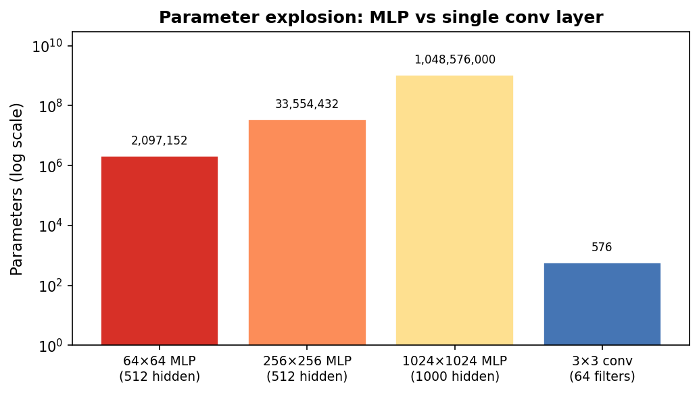{width="70%"}

:::: {.notes}
- Walk through the four bars explicitly. Left three: MLP on a 64×64, 256×256, and 1024×1024 image. Right: a single convolutional layer with 64 filters of size 3×3.
- The one point to land: the CNN bar is not visible at this scale — it is down at 576 parameters while the MLP is at 10⁹.
- Misconception to preempt: "more parameters = better." With small EM datasets (50–500 images), 10⁹ parameters means perfect memorisation of the training set and zero generalisation.
- EM anchor: a real 4D-STEM scan is 512×512 real-space × 128×128 momentum-space. Even the spatial slice is 262,144 pixels. No sane practitioner runs a dense MLP on that.
- Forward link: weight sharing is the mechanism that collapses 10⁹ to 576 — that is the next conceptual pivot.
- Transition: "The parameter count is one problem. The second problem is spatial blindness."
::::

## Three failures of MLPs on images

| Problem | MLP behaviour | CNN fix |
|---|---|---|
| Parameter explosion | $D \times M$ weights per layer | $C_{out}(C_{in}k^2+1)$ kernel weights |
| No spatial structure | flattened: neighbours become unrelated inputs | local receptive field: a $k \times k$ patch |
| No translation awareness | a shifted precipitate is a new input vector | weight sharing: one kernel applied everywhere |

:::: {.fragment}
CNNs are MLPs with **locality and weight sharing built in as hard constraints**.
::::

:::: {.notes}
- Spatial structure: draw a 4×4 image flattened to a vector of 16 numbers. Ask: "Which two numbers were neighbours in the image?" You cannot tell from the vector. After flattening, pixel (100,100) and (200,200) are unrelated input coordinates — yet a grain boundary or an atomic column is defined by its immediate neighbourhood (a 1–3 nm boundary strip is decided by the 10–20 pixels around it).
- Translation: if a precipitate moves 5 pixels, the MLP sees a completely different input vector and must have learned the same pattern at every position. "Where's Waldo": you scan with a template, you do not memorise where Waldo was last week. The property we want is translation **equivariance**: shift the input → the feature response shifts by the same amount.
- Misconception to preempt: "convolution gives translation *in*variance." Conv layers give equivariance; invariance comes from pooling / global average pooling (later today).
- Misconception to preempt: "CNNs are always better than MLPs." For tabular, non-spatial data (composition, temperature) MLPs or linear models are often preferable.
- The one point to land: locality + weight sharing = convolution. Everything else (padding, stride, pooling, channels) is implementation detail.
- EM anchor: the spatial correlation CNNs exploit is the physics-driven correlation from Week 2 (sampling, Nyquist): nearby pixels sample the same continuous field.
- Transition: "Let us now look at the core operation — convolution."
::::

<!-- ===== §2. Convolution: the sliding feature detector ===== -->

## Convolution: a sliding feature detector

:::: {.columns}
:::: {.column width="50%"}
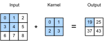{width="100%"}
::::
:::: {.column width="50%"}
:::: {.incremental}
- Slide a small **kernel** (e.g. 3×3 weights) across the image.
- At each position: multiply with the patch, sum → one output value.
- Output = **feature map**: how strongly the kernel's pattern appears at each location.
- $C_{out}$ kernels in parallel → $C_{out}$ feature maps.
::::
::::
::::

:::: {.notes}
- Narrate one output value explicitly: "align the 3×3 kernel at position (i,j), multiply the 9 overlapping pixels by the 9 kernel weights, sum the 9 products → one number. Slide one pixel to the right; repeat."
- The one point to land: the sliding gives locality (only a local patch is used) AND translation equivariance (the same kernel visits every location).
- Misconception to preempt: "convolution flips the kernel." That is strict mathematical convolution. CNN libraries implement cross-correlation (no flip). Since kernels are learned, the distinction does not matter.
- Misconception to preempt: "this is slow." GPUs evaluate all output positions in parallel with BLAS-level matrix operations.
- EM anchor: a 3×3 "bright centre, dark surround" kernel on a HAADF image responds wherever an atomic column is — a column feature map.
- Transition: "Let me show this on a synthetic grain image."
::::

## Convolution on a synthetic grain image

{width="90%"}

:::: {.notes}
- Point out explicitly: the two feature maps highlight *different* boundaries — vertical Sobel fires at the vertical boundary, horizontal Sobel fires at the horizontal boundary. Neither is a correct "grain boundary detector" by itself; you need both in combination.
- The one point to land: one 3×3 kernel produces one feature map. A CNN uses many kernels simultaneously, building a richer description.
- Misconception to preempt: "CNNs apply edge detectors." At the first layer, some learned kernels do resemble Sobel. But deeper layers learn highly abstract detectors that do not resemble any named filter.
- EM anchor: in a STEM experiment, you might want one feature map for atomic-column positions, one for the background, one for defect signatures. A single convolutional layer can extract all three simultaneously.
- Transition: "Let us look at specific hand-set kernels to build intuition before we let the network learn them."
::::

## The discrete convolution formula

For input image $I$ and kernel $K$:

$$
(I \star K)_{m,n} = \sum_{a=-\Delta}^{\Delta}\sum_{b=-\Delta}^{\Delta} K_{a,b}\,I_{m+a,\, n+b}, \qquad \Delta = (k-1)/2
$$

:::: {.incremental}
- Only pixels within $\pm\Delta$ of $(m,n)$ contribute → **local**.
- $k^2$ weights, independent of image size $H \times W$, reused at every $(m,n)$ → **weight sharing**.
::::

:::: {.notes}
- Walk through the indices slowly: (m,n) is the output location; (a,b) runs over the kernel footprint. Students often confuse the kernel index with the image index.
- $K$ is typically $3\times3$ or $5\times5$. At each output position the formula is a dot product of the kernel with the local patch.
- Misconception to preempt: "the formula requires flipping the kernel." This is cross-correlation; strict convolution uses (m−a, n−b). Learned kernels make it irrelevant.
- EM anchor: for a HAADF signal, K could encode "compare centre pixel to neighbours" — exactly what an edge-detector kernel does.
- Transition: "What do specific kernels detect?"
::::

## Kernels as feature detectors

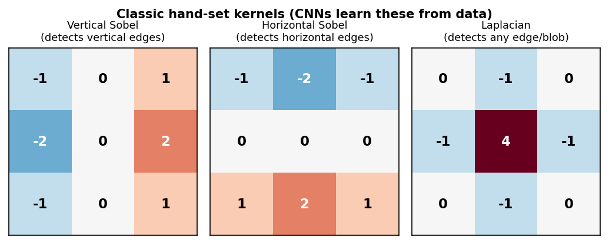{width="70%"}

:::: {.fragment}
In a trained CNN, the network discovers these (and more complex) filters **automatically** from labelled examples — no manual kernel design needed.
::::

:::: {.notes}
- Name the sign pattern in each kernel. Vertical Sobel: positive on one column, negative on the other → fires at a sign change from left to right. Ask students: "what happens if you flip the sign pattern?" Answer: detects the opposite edge polarity.
- The one point to land: these hand-set kernels show what convolution can detect. The power of CNNs is that they learn kernels adapted to the specific task — grain boundary detection, atomic column location, pore segmentation.
- Misconception to preempt: "deep CNNs look like Sobel at every layer." Only the first layer occasionally learns Sobel-like patterns. Deeper layers learn combinations of earlier features that cannot be visualised as simple kernels.
- EM anchor: the Laplacian kernel fires at atomic columns (bright spots surrounded by dark background) and at defects — naturally suited to HAADF atomic-resolution images.
- Forward link: the notebook lets students hand-set kernels to detect a chosen grain-boundary type — connect this to the Sobel/Laplacian discussion here.
- Transition: "Three details control how a convolution layer changes image size: stride, padding, and multiple channels."
::::

## Stride, padding, channels: output size and parameter count

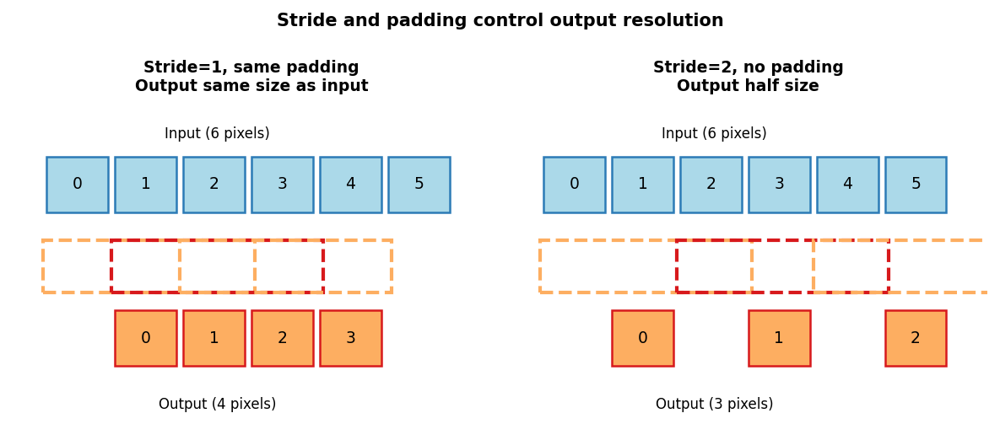{width="55%"}

:::: {.incremental}
- $H_{out} = \left\lfloor\frac{H + 2p - k}{s}\right\rfloor + 1$: $k=3, p=1, s=1$ keeps $H$ ("same" padding); $s=2$ halves it.
- Kernel tensor $C_{out}\times C_{in}\times k\times k$ → $C_{out}(C_{in}k^2+1)$ parameters — independent of $H, W$: the same network runs on 256² and 4096² images.
- EM multichannel inputs: EELS/EDS spectrum images, multi-segment detector stacks.
::::

:::: {.notes}
- Concrete numbers: "64×64 image, k=3, p=1, s=1 — H_out?" (64.) "k=3, p=0, s=2?" (31.)
- Parameter example: 64 input channels, 128 output channels, 3×3 kernel → 128×(64×9+1) = 73,856 parameters. A dense layer on a 256² image with 128 outputs has 8.4 M — 114× more.
- After a layer with $C_{out}$ kernels the tensor is $H_{out}\times W_{out}\times C_{out}$ — one feature map per kernel. Beyond layer 1, channels are abstract learned features, not colours.
- Stride is the main downsampling tool in modern CNNs (ResNet uses stride-2 convolutions at stage transitions).
- Padding options: zero, reflect (natural for real-space HAADF), circular (periodic signals such as diffraction patterns), replicate.
- EM anchor: an EELS spectrum image with 1024 energy channels is a 1024-channel input; a conv layer learns spatially localised spectral signatures.
- Transition: "Now let us make precise why weight sharing is such a powerful inductive bias."
::::

<!-- ===== §3. Weight sharing, equivariance, symmetry ===== -->

## Weight sharing: the key efficiency principle

{width="75%"}

:::: {.notes}
- Name the numbers. For the 1-D example shown: 8 inputs × 8 outputs = 64 weights in the dense case. 3-weight conv kernel shared across 8 positions = 3 weights. Factor of 21.
- The one point to land: weight sharing is not just an efficiency trick — it encodes a *physical assumption*. A grain boundary looks the same in the top-left corner and the bottom-right corner of the field of view. The same kernel should detect it in both places.
- Misconception to preempt: "fewer parameters = weaker model." CNNs are empirically more expressive than dense MLPs at the same parameter count on spatial data, because the inductive bias is well-matched to the signal structure.
- EM anchor: in HAADF imaging, atomic columns form a repeating pattern across the entire field of view. Learning one column-detector kernel and reusing it everywhere is physically optimal — and exactly what the network does.
- Transition: "Weight sharing gives us equivariance — let us be precise about what that means."
::::

## Translation equivariance as an inductive bias

:::: {.incremental}
- **Translation equivariance:** if the input shifts by $\delta$ pixels, the feature map shifts by $\delta$ pixels — the detector response follows the feature.
- Formally: $f(T_\delta X) = T_\delta f(X)$ for a spatial shift $T_\delta$.
- **Translation invariance** (different!): $f(T_\delta X) = f(X)$ — the *prediction* ignores the shift. Built by pooling, striding, global average pooling.
::::

:::: {.fragment}
*Equivariance preserves "where." Invariance discards "where" and keeps only "what."*
::::

:::: {.notes}
- Clarify the equivariance vs invariance distinction explicitly. Equivariance is what conv layers give you. Invariance is what you want for image-level classification (does this image contain a precipitate, yes/no). Segmentation tasks need equivariance, not invariance — the output mask must track the position.
- The one point to land: architecture choice (conv vs pooling) determines whether you preserve or discard positional information. This is a design choice aligned with the task.
- Misconception to preempt: "data augmentation (random crops, flips) trains invariance." Augmentation helps, but the architectural bias from pooling/striding is what gives the fundamental invariance property.
- EM anchor: grain boundary segmentation (U-Net, coming soon) needs equivariance. Defect present/absent classification can discard position. Architecture choice should match the task.
- Transition: "Translations are only one symmetry. What about rotations and mirrors?"
::::

## Beyond translation: rotations and mirrors in EM

{width="88%"}

:::: {.notes}
- Walk the two rows. Row 1: $f(Tx) = Tf(x)$ exactly (circular padding) — this is the equivariance that weight sharing buys. Row 2: $f(Rx) \ne Rf(x)$; the rod that was vertical is now horizontal and the vertical-edge detector is blind to it.
- The one point to land: a plain CNN is equivariant to *translations only*. It is neither rotation- nor mirror-equivariant, and it is not scale-equivariant either (the scale-sensitivity failure mode later today).
- EM anchor: crystal grains appear at arbitrary in-plane orientations; a specimen can be loaded rotated; diffraction patterns have point-group symmetry. For all of these the physics says "the answer should rotate with the input" — the architecture does not know that.
- The notebook reproduces this check in PyTorch (Part 4) and asks whether the isotropic Laplacian kernel is 90°-rotation-equivariant (it is — because the kernel itself is symmetric).
- Transition: "So how do we get rotation robustness?"
::::

## Getting symmetry: three routes

:::: {.incremental}
- For a group $G$ of transforms: equivariant $f(g\cdot x) = g\cdot f(x)$ (masks, denoised images); invariant $f(g\cdot x) = f(x)$ (phase label).
- **Route 1 — augmentation:** train on rotated/flipped copies; approximate symmetry is *learned* (Week 8).
- **Route 2 — test-time augmentation:** average predictions over the 8 rotations/flips of $D_4$ (un-rotate masks first).
- **Route 3 — build it in:** group-equivariant CNNs share weights across rotations too [@cohen2016group].
- Rule: **know the symmetry of your task first** — then learn it, average over it, or hard-wire it.
::::

:::: {.notes}
- Brief version of the MFML symmetry discussion. Keep the group language light — "a set of transforms you can compose and undo".
- Trade-offs: augmentation is cheap and universal but costs data and capacity; TTA is free at training time but 8× cost at inference; group-equivariant layers give exact symmetry with fewer parameters but more engineering.
- The one point to land: equivariance is what you want in the *layers*; invariance (if needed at all) is created at the very end, e.g. by global average pooling. Segmentation needs equivariance throughout.
- Misconception to preempt: "augmentation makes the network invariant." It makes it *approximately* equivariant/invariant on the training distribution — no guarantee on new data.
- EM anchor: for atomic-resolution images with a 4-fold or 6-fold zone axis, D4/D6 test-time augmentation is a two-line trick that typically cleans up segmentation noise.
- Forward link: the same symmetry question returns for graphs (permutation invariance) in Week 10 and for atomic environments (rotation-invariant descriptors) from Week 5.
- Transition: "Choosing an architecture is choosing which symmetries and assumptions to bake in — that is the inductive bias."
::::

## Inductive bias: encoding what you know

:::: {.incremental}
- An **inductive bias** is an assumption baked into the architecture that makes certain functions easy to learn.
- **MLP (Week 6):** no structure — every function of all inputs equally easy; needs the most data.
- **CNN (today):** grid + locality + translation weight sharing.
- **GNN / transformer (Week 10):** graph + permutation symmetry; a transformer is a fully connected graph with learned (attention) edges.
- Strong, *correct* bias helps with small datasets by ruling out physically unreasonable solutions; a *wrong* bias caps performance.
::::

:::: {.notes}
- This is the course arc slide: MLP (no structure) → CNN (grid, translation) → GNN (graph, permutation) → transformer (set / fully connected graph). Week 10 closes the loop with "a CNN is a GNN on a grid graph".
- Connect to Week 6's practical rule: dense nets need lots of data. CNNs work with far fewer labelled images because the spatial bias is well matched to the signal.
- The one point to land: choosing an architecture is choosing a prior over functions. CNNs are a strong prior for images; Gaussian processes (Week 11) are a strong prior for smooth functions.
- EM anchor: with 50 labelled HAADF images, a CNN with the right architecture generalises; a dense MLP overfits catastrophically.
- Transition: "Now pooling."
::::

<!-- ===== §4. Pooling, receptive field, hierarchy ===== -->

## Pooling and the Conv–Pool block

:::: {.columns}
:::: {.column width="35%"}
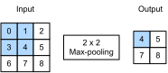{width="100%"}
::::
:::: {.column width="65%"}
:::: {.incremental}
- **Max pool:** "did the feature appear here?" **Average pool:** "how strongly on average?" No learned parameters.
- 2×2 pool halves $H$ and $W$ → approximate invariance to small shifts, faster receptive-field growth.
- Standard block: **Conv → ReLU → MaxPool**, channels doubling per stage: 256² input → 16² × 512 after 4 blocks.
- **Global average pooling** at the end → translation-invariant image-level prediction.
::::
::::
::::

:::: {.notes}
- Narrate the 2×2 max-pool: take the top-left 2×2 block, keep the largest value, put it at (0,0) of the output; repeat.
- The one point to land: pooling gives approximate translation invariance within a window — a precipitate shifted 1 pixel stays in the same window and gives the same pooled output.
- Spatial–channel trade-off: 128² × 64 → 64² × 128 → 32² × 256 → 16² × 512. Fine for classification; for segmentation the U-Net decoder must restore the discarded detail — that is what skip connections do.
- Misconception to preempt: "average pooling is always worse." It is better when you care about the average level (how much of this phase is here), not just presence.
- EM anchor: max-pool makes an atomic-column detector robust to 1-pixel drift between scans.
- Transition: "A worked example."
::::

## Max pooling: a worked example

:::: {.columns}
:::: {.column width="50%"}
**Input feature map (4×4):**

$$
\begin{pmatrix}
1 & 3 & 2 & 4 \\
5 & 6 & 7 & 8 \\
3 & 2 & 1 & 0 \\
1 & 2 & 3 & 4
\end{pmatrix}
$$
::::
:::: {.column width="50%"}
**After 2×2 max-pool (stride 2):**

$$
\begin{pmatrix}
6 & 8 \\
3 & 4
\end{pmatrix}
$$

Top-left 2×2 block: $\max(1,3,5,6)=6$.
Top-right: $\max(2,4,7,8)=8$.
::::
::::

:::: {.fragment}
- Output size: $2\times2$ from $4\times4$ — spatial dimensions halved.
- No learned parameters — purely a max operation.
- **Approximate invariance:** if the 6 moved to the adjacent cell (still in the same 2×2 window), the output is unchanged.
::::

:::: {.notes}
- Walk through the four quadrants. Top-left: max(1,3,5,6)=6. Top-right: max(2,4,7,8)=8. Bottom-left: max(3,2,1,2)=3. Bottom-right: max(1,0,3,4)=4.
- The one point to land: the maximum preserves "was this feature strongly present anywhere in this window?" — appropriate for feature detection where exact position within the 2×2 window does not matter.
- Misconception to preempt: "average pooling is always worse." Average pooling is better when you care about the average activation level (e.g. how much of this phase is in this region), not just whether the feature appeared.
- EM anchor: in an atomic-column detector, you want max-pool to be robust to 1-pixel drift of the column within the window. Average-pool would dilute a single bright-column response with its dark background neighbours.
- Transition: "Pooling and strided convolutions make the receptive field grow quickly with depth."
::::

## Receptive fields: how much context does one neuron see?

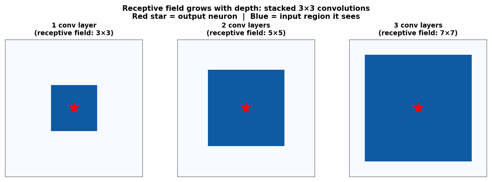{width="75%"}

:::: {.notes}
- Walk through the three panels. First panel: the output neuron (red star) is determined by a 3×3 patch. Second panel: each neuron in layer 2 was itself determined by a 3×3 patch of layer 1, which was a 3×3 patch of the input — giving a 5×5 input receptive field. Third: 7×7.
- The one point to land: depth is how CNNs grow context without expensive large kernels. Three stacked 3×3 layers (3×9=27 params/channel) beat one 7×7 layer (49 params/channel) because there are two extra nonlinearities between them.
- Misconception to preempt: "larger kernels always see more." Two stacked 3×3 layers give the **same** 5×5 theoretical receptive field as one 5×5 layer — but with fewer parameters and an extra nonlinearity between them, making the representation strictly more expressive. The benefit is not a larger RF; it is parameter efficiency plus added depth.
- EM anchor: detecting a dislocation requires seeing context beyond one pixel. A grain triple junction requires seeing ~10–20 nm of context. Pooling rapidly grows the receptive field — by layer 4, one neuron can see a quarter of the image.
- Transition: "Growing receptive fields naturally lead to hierarchical features."
::::

## Feature hierarchy: edges → motifs → structures → properties

{width="90%"}

:::: {.notes}
- Walk through the four panels in order. Point out that each stage is more abstract and coarser in resolution.
- The one point to land: this hierarchy is why CNNs are a natural fit for materials images. Microscopy features ARE hierarchical — atoms form columns, columns form grains, grains form microstructures, microstructures encode properties.
- Misconception to preempt: "feature maps are always interpretable." Only Layer 1 features are reliably interpretable as edge/orientation detectors. Deeper features are abstract combinations with no simple physical label.
- EM anchor: in HAADF imaging: Layer 1 detects atomic columns. Layer 2 detects local lattice periodicity (grain interior) vs disorder (boundary). Layer 3 detects grain, phase, or defect-cluster regions. Layer 4+ enables phase classification.
- Forward link: Grad-CAM (later today) reads out exactly these deep, coarse feature maps to show which region drove a decision.
- Mid-lecture checkpoint: "which design choice explains the huge parameter reduction?" (weight sharing) "which explains how a network knows a whole grain is one phase?" (depth + pooling).
- Transition: "Let us now look at the major CNN architectures and what each added."
::::

<!-- ===== §5. CNN architectures ===== -->

## CNN architectures in one breath: the arc from 1998 to 2015

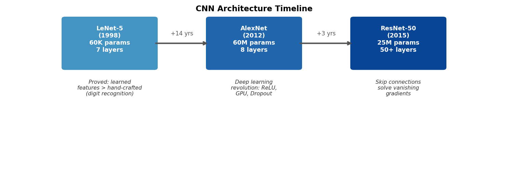{width="90%"}

:::: {.notes}
- Read the three boxes together as a story: "LeCun proved learned features beat hand-crafted features for digit recognition. The field then stalled for 14 years while GPUs and datasets grew. AlexNet in 2012 shocked the computer vision community with a 10-percentage-point lead on ImageNet. Then researchers tried to go deeper and hit the vanishing-gradient wall, which ResNet in 2015 solved with skip connections — enabling networks 20× deeper than AlexNet."
- The one point to land: each innovation solved a specific failure mode. LeNet → learning beats hand-craft. AlexNet → scale + ReLU + dropout. ResNet → depth without vanishing gradients.
- Misconception to preempt: "you need to know these architectures by name for the exam." What matters is the progression: what failed, what was added, why. The architecture names are labels for the innovations.
- Transition: "LeNet and AlexNet in one slide: the template and the revolution."
::::

## LeNet and AlexNet: the template and the revolution

:::: {.columns}
:::: {.column width="50%"}
**LeNet-5** [@lecun1998lenet]

- Conv → Act → Pool → Conv → Act → Pool → Flatten → FC → FC → Output
- ~60,000 parameters; learned features beat hand-crafted ones (SIFT, HOG)
- Still the template for small micrograph classifiers
::::
:::: {.column width="50%"}
**AlexNet** [@krizhevsky2012alexnet]

- Won ImageNet 2012 by ~10 percentage points
- **ReLU**, **dropout**, **GPU training**, ~60 M parameters
- Opened the deep-learning era
::::
::::

:::: {.notes}
- A CNN classifying steel microstructures (martensitic vs ferritic) often follows the LeNet template: two or three conv-pool blocks, then a dense head.
- ReLU (Week 6): gradient 1 for z > 0, so it does not vanish through many layers. Dropout: randomly zero neurons during training → no co-adaptation.
- AlexNet's margin converted computer vision from hand-crafted features to deep learning; materials science followed about 5 years later.
- Transition: "The next step was not a new trick but a design discipline: blocks."
::::

## VGG: deep networks from repeated blocks [@simonyan2015vgg]

:::: {.columns}
:::: {.column width="42%"}
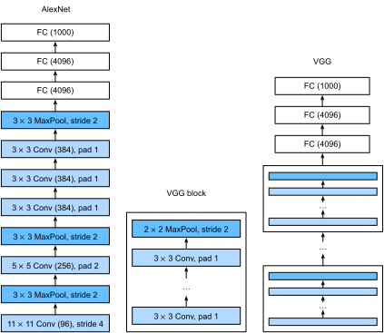{width="100%" style="background: white"}
::::
:::: {.column width="58%"}
:::: {.incremental}
- **VGG block:** $n\times$ (3×3 conv, pad 1, ReLU) → 2×2 max-pool; channels 64 → 128 → 256 → 512.
- **Why 3×3?** Each stacked 3×3 adds 2 pixels of receptive field: three give 7×7 with $27C^2$ instead of $49C^2$ weights and **two extra non-linearities**.
- **Design lesson:** think in *blocks*, not layers.
::::
::::
::::

:::: {.notes}
- The one point to land: VGG turned CNN design into a modular recipe — a network is a short program: `for c in (64,128,256,512): block(c)`. Every modern architecture (ResNet, U-Net) is a stack of repeated blocks.
- Ask: "How many weights does a 7×7 conv with C in/out channels have vs three 3×3?" 49C² vs 27C² — and the stack is *more* expressive.
- VGG-16 ≈ 138 M parameters (most in the dense head) — accurate but heavy; still a common "perceptual" feature extractor.
- Misconception to preempt: "VGG is obsolete, so irrelevant." Its block design and the encoder half of the original U-Net are VGG-style.
- Transition: "So just stack more VGG blocks? That is where things break."
::::

## ResNet: skip connections make depth trainable [@he2016resnet]

:::: {.columns}
:::: {.column width="38%"}
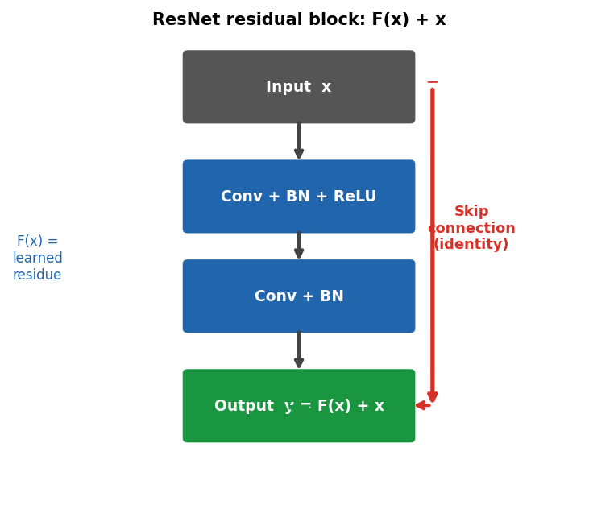{width="100%"}
::::
:::: {.column width="62%"}
:::: {.incremental}
- **Degradation:** plain stacks of 20 → 56 layers reach *worse training* error — not overfitting, an optimisation problem.
- **Residual block:** $\mathbf{y} = F(\mathbf{x}) + \mathbf{x}$ — learn only a correction to the identity.
- Gradient $\partial\mathbf{y}/\partial\mathbf{x} = \mathbf{I} + \partial F/\partial\mathbf{x}$: an unattenuated path through every block.
- Block: conv–**BN**–ReLU–conv–**BN**, add, ReLU.
- Skips today: **additive** (ResNet: optimisation) vs **concatenating** (U-Net: localisation).
::::
::::
::::

:::: {.notes}
- Degradation: He et al. showed that with BatchNorm the gradients are fine, yet the deeper plain net trains worse. Thought experiment: a deeper net could copy the shallow one and set the extra layers to identity — SGD does not find that. Idea: make identity the default.
- Connect to Week 6: through 20 sigmoid layers the gradient shrinks by 0.25^20 ≈ 10^-12. ReLU fixed moderate depth; the skip provides a gradient highway for arbitrary depth.
- BatchNorm recap (Week 6) [@ioffe2015batchnorm]: in CNNs the statistics are per channel over batch × H × W; running averages at inference — remember `model.eval()`.
- If shapes change (stride 2, more channels) the skip uses a 1×1 conv. ResNet-18/34/50 = 4 stages, global average pooling + one linear layer (ResNet-18 ≈ 11 M params vs VGG-16 ≈ 138 M). Backup slide has the details.
- Misconception to preempt: "ResNet and U-Net skips are the same thing." ResNet adds $x$ to help optimisation; U-Net concatenates encoder features to recover *where*.
- EM anchor: "U-Net with ResNet-34 encoder, ImageNet-pretrained" — students can now parse that sentence (the "pretrained" part is Week 8).
- Transition: "Classification networks produce one label per image. For EM segmentation we need one label per pixel — that is U-Net."
::::

<!-- ===== §6. U-Net segmentation ===== -->

## U-Net: encoder–decoder for segmentation [@ronneberger2015unet]

{width="78%"}

:::: {.notes}
- Walk through the architecture from top-left to top-right. "Encoder (blue): each block halves the spatial size and doubles channels — building rich abstract features. Bottleneck (purple): smallest spatial resolution, maximum context. Decoder (red): each block upsamples by 2 and uses a skip connection to bring back fine spatial detail from the corresponding encoder level. Output: same spatial resolution as input, one label per pixel."
- The one point to land: the key innovation is the skip connection that bypasses the bottleneck. Without it, the decoder has to reconstruct fine spatial detail entirely from the compressed bottleneck representation — which is too abstract and loses boundary precision.
- Misconception to preempt: "U-Net is only for medical images." The original paper used biomedical images, but U-Net is now the standard segmentation architecture for any spatially structured prediction — including phase segmentation in TEM and grain tracing in SEM.
- EM anchor: the spatial resolution of the output mask (same as input) is critical for measuring grain sizes, locating precipitates, and computing phase fractions. Classification-only CNNs cannot provide this.
- Transition: "Let me break down the two paths."
::::

## U-Net: encoder, decoder, per-pixel output

:::: {.columns}
:::: {.column width="50%"}
**Encoder** (context)

- (Conv×2 → ReLU → MaxPool) × 4
- spatial halves, channels double
::::
:::: {.column width="50%"}
**Decoder** (resolution)

- (Upsample → **concatenate skip** → Conv×2) × 4
- final 1×1 conv → $K\times H\times W$ class scores
::::
::::

:::: {.incremental}
- Mask = $\arg\max$ over $K$ channels; loss = **per-pixel cross-entropy** (often + Dice), same backprop + Adam.
- Without skips, boundary positions are lost in the bottleneck → blurry masks.
::::

:::: {.notes}
- Upsampling: bilinear or transposed convolution. Why concatenation, not addition: keep both the fine-detail encoder information (position, texture) and the semantic decoder information.
- Loss written out: for binary segmentation, BCE between predicted probability and label at each pixel (m,n), averaged over all pixels in the minibatch. U-Net uses exactly the training machinery from Week 6; only the output head and the loss change.
- The one point to land: in segmentation "where?" matters as much as "what?" — skip connections preserve "where."
- Misconception to preempt: "U-Net needs huge training sets." Ronneberger et al. designed it for ~30 labelled images — ideal for EM.
- EM anchor: 4D-STEM phase mapping — input a virtual bright-field image, output phase A / phase B / boundary per pixel.
- Transition: "How do we measure whether a mask is good?"
::::

## Segmentation metrics: IoU and Dice, not accuracy

{width="88%"}

:::: {.notes}
- Formulas: IoU (Jaccard) $= |A\cap B|/|A\cup B|$, Dice (F1) $= 2|A\cap B|/(|A|+|B|) = 2\,\mathrm{IoU}/(1+\mathrm{IoU})$. Dice is always ≥ IoU; they rank models identically on a single image but not always on averages.
- The one point to land: pixel accuracy counts the huge, easy background. The all-background "model" and Otsu have *the same* accuracy (0.91) but completely different usefulness.
- Reporting rules: per-class IoU (mean IoU over classes for multi-phase maps); say whether you average per image or pool all pixels; for thin structures (boundaries, cracks) consider a boundary-tolerant metric.
- Connect to Week 4 metrics and ML-PC unit 3: same idea as precision/recall under imbalance. Dice *is* the F1 score on pixels.
- Transition: "If the metric must ignore the background, the loss should too."
::::

## Class imbalance: losses that keep the minority visible

:::: {.incremental}
- Pixel-wise BCE is an *average* over pixels: with 9% particles, the minority class carries 9% of the loss weight.
- **Weighted BCE** (`pos_weight` $=(1-f)/f$); **focal loss** [@lin2017focal] down-weights easy pixels.
- **Soft Dice loss** [@milletari2016vnet], with $p_i=\sigma(z_i)$:
  $$\mathcal{L}_\text{Dice} = 1-\frac{2\sum_i p_i y_i+\epsilon}{\sum_i p_i+\sum_i y_i+\epsilon}$$
  normalised by the foreground size → "predict nothing" costs ≈ 1.
- **BCE + Dice** is the default. Notebook: BCE alone collapsed to "all background" (IoU 0.00); BCE + Dice reached IoU 0.84.
::::

:::: {.notes}
- Walk the Dice formula: numerator = soft overlap, denominator = soft sizes. It is a ratio, so it cannot be dominated by the background.
- The one point to land: the loss encodes what you care about. If you care about the rare class, the loss must say so — metric and loss should be aligned.
- The notebook numbers are real (SEED=7, tiny U-Net, CPU): with plain BCE the network found the trivial minimum first; with BCE + Dice the same network, data and optimiser gave IoU 0.84. With longer training BCE would eventually catch up — but the trap is real on budget.
- Also sample-level imbalance: crop training tiles around rare objects (oversampling) — but only within the training split.
- Misconception to preempt: "Dice alone is best." Pure Dice has noisy gradients for images with little or no foreground; BCE + Dice is the robust default.
- Transition: "What does that tiny U-Net actually produce?"
::::

## A tiny U-Net on synthetic particles (the notebook)

{width="46%"}

:::: {.notes}
- Numbers (test set from a different generator seed = different "session"): IoU 0.84, Dice 0.91, pixel accuracy 0.98; smoothed Otsu IoU 0.48. Trains in well under a minute on one CPU thread.
- The one point to land: even a 30 k-parameter U-Net beats the classical threshold by a wide margin, because it learns to ignore the illumination gradient and the support texture.
- Look at the worst image (bottom row): the faint particle is invisible to the model. Always inspect the tail of the per-image IoU distribution, not only the mean.
- Ablation in the notebook: removing the skip connections did *not* hurt here (IoU ≈ 0.84 either way) — the particles are compact blobs and the bottleneck is still 12×12. Skips pay off for thin boundaries and deep U-Nets. Ablations are task-dependent.
- Transition: "Before the literature case studies — how do you validate a segmenter honestly?"
::::

## Honest validation for segmentation

:::: {.incremental}
- **Tile leakage:** cutting one large micrograph into overlapping 256² tiles and splitting the *tiles* randomly puts neighbouring pixels in train and test → inflated IoU. Split by **micrograph, specimen or session** (`GroupKFold`, Week 4).
- **Label ceiling:** measure IoU *between two annotators* on a subset; a model cannot meaningfully beat that ceiling.
- **Report per class and per image:** mean IoU hides that one rare phase (or the faint particles) is never found.
- **Downstream quantity:** check the number you actually need — particle size distribution, phase fraction, grain count — not just IoU.
::::

:::: {.notes}
- Tile leakage is the segmentation-specific version of the Week 4 leakage story and it is extremely common in published EM work.
- Annotator ceiling: ML-PC unit 3 recommends computing Dice/IoU between annotators. Roberts et al. (next slide) report their model at roughly inter-annotator level — beyond that, more capacity buys nothing.
- Downstream: a U-Net with IoU 0.85 can still bias a size distribution if it systematically erodes boundaries by one pixel; for small particles that is a large relative error.
- Transition: "A published EM case study where exactly this ceiling shows up."
::::

## EM case study: defects in irradiated steel [@roberts2019stemdefects]

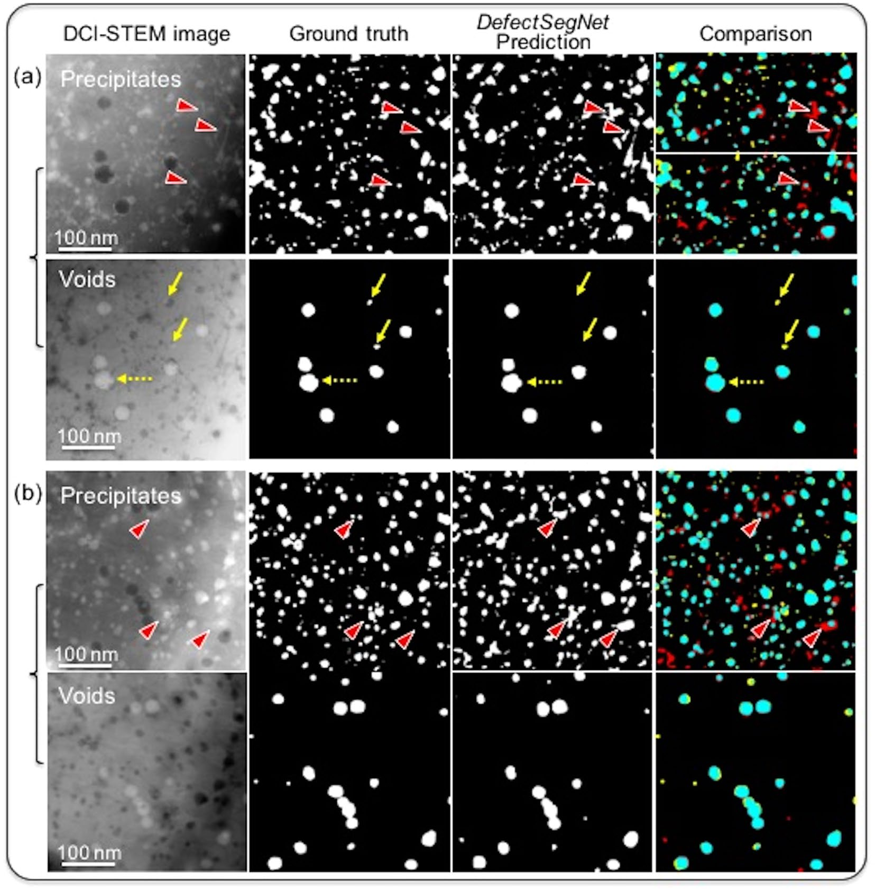{width="62%"}

:::: {.fragment}
- U-Net-type encoder–decoder with dense skip connections; per-pixel labels for dislocation loops, precipitates and voids.
- Reaches roughly **inter-annotator** agreement — beyond that point more model capacity buys nothing; better labels do.
::::

:::: {.notes}
- Real-world urgency: post-irradiation reactor steels; very few people can label voids and loops at expert level. The CNN matches them after training on a modest number of labelled images.
- Read the figure: four columns = input / human label / CNN / comparison. Most disagreement sits at object boundaries — where humans disagree too.
- The one point to land: the annotator floor is the practical ceiling. This connects to the "label ceiling" bullet on the validation slide.
- Material from ML-PC unit 4 (case 6).
- The Au nanoparticle phase-map case study is on a backup slide.
- Labelling cost: a U-Net from scratch on EM data typically needs 50–200 annotated images; transfer/self-supervised pretraining (Week 8) can cut this to 20–50. A compact 4-level U-Net (32→256 channels) has ~7.8 M parameters, the original ~30 M.
- Transition: "The second case: no human labels at all."
::::

## EM case study: grain boundaries from synthetic Voronoi labels

:::: {.columns}
:::: {.column width="50%"}
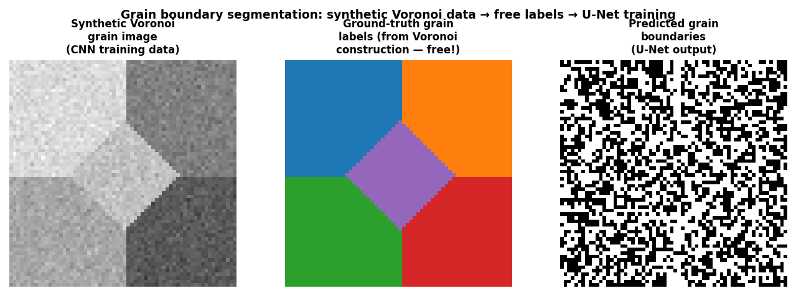{width="100%"}
::::
:::: {.column width="50%"}
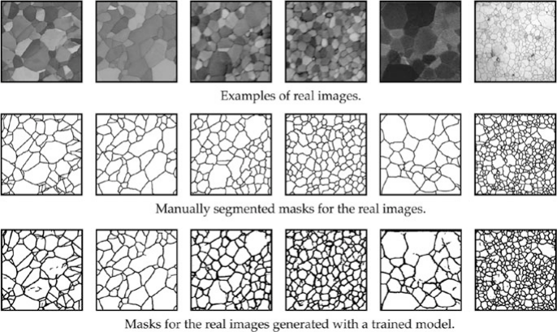{width="100%"}
::::
::::

- Voronoi tessellations give perfect labels for free; the boundary topology ("dark strip between two regions") transfers to real SEM images.

:::: {.notes}
- Generating 10,000 Voronoi images takes minutes; labelling 10,000 real SEM grain images takes months.
- Caveat: for grain boundaries the topological prior is strong; for subtle features (specific lattice defects, chemical contrast) domain adaptation or real labels may still be needed.
- EM anchor: grain-size distributions → Hall–Petch — a closed-loop materials data-science pipeline.
- Forward link: Week 8 covers systematic sim-to-real strategies (augmentation, domain randomisation, transfer).
- Transition: "Segmenters at annotator level, even from free labels — can we trust *why* they decide?"
::::

<!-- ===== §7. Explainability for CNNs ===== -->

## Why explain a CNN in EM?

:::: {.incremental}
- A segmenter or classifier with 0.99 test accuracy can still be **right for the wrong reason** — "shortcut learning" [@geirhos2020shortcut].
- EM shortcuts: scan-start/detector-edge artefacts, session contrast, scale bars, beam damage tied to one specimen.
- **Local explanation question:** *which input pixels drove this particular prediction?*
- Their job is **diagnosis** (find shortcuts, understand failures, decide what data to add) — not proof that a model is physically correct.
::::

:::: {.notes}
- Explainability thread: Week 4 read coefficients, Week 5 did permutation importance and SHAP on descriptors. For images there are no named features — the "features" are pixels, so explanations become maps.
- The one point to land: accuracy on a test set from the same sessions cannot detect a shortcut, because the shortcut is also present in the test set. You need either a shifted test set or an explanation.
- EM anchor: a real case pattern — all defective specimens were imaged on one day with a slightly different detector setting; the model learns the setting.
- Transition: "Three workhorse answers for CNNs."
::::

## Three local explanations: saliency, Grad-CAM, occlusion

:::: {.incremental}
- **Gradient saliency** [@simonyan2014saliency]: $S_i = |\partial z_c/\partial x_i|$ — one backward pass w.r.t. the *input*; pixel-level, noisy; sensitivity, not contribution.
- **Grad-CAM** [@selvaraju2017gradcam]: weight the last-conv feature maps by their mean gradient, $L^c = \mathrm{ReLU}\big(\sum_k \alpha_k^c A^k\big)$, $\alpha_k^c = \frac{1}{Z}\sum_{i,j}\partial z_c/\partial A^k_{ij}$ — coarse, smooth regions.
- **Occlusion** [@zeiler2014visualizing]: slide a grey patch, record the drop $p_c(\mathbf{x}) - p_c(\mathbf{x}_\text{occ})$ — model-agnostic, forward passes only.
- For segmentation: backpropagate from a *set* of output pixels (e.g. all false positives).
::::

:::: {.notes}
- Saliency implementation: `x.requires_grad_(True); model(x)[0, c].backward(); S = x.grad.abs()` — backprop from Week 6, but w.r.t. the input instead of the weights. No modification of the trained model. Picture: the model is a surface over pixel space; saliency is the local slope. Exam-level: a high value means the prediction is locally *sensitive* to that pixel — not "this pixel caused the prediction".
- Grad-CAM: the formula is reference, not a derivation to memorise. Resolution = last conv layer (e.g. 8×8, upsampled); class-specific; works for any conv backbone. Connects to the feature-hierarchy slide: the last conv layer holds the most abstract features. Exam question: "how does Grad-CAM differ from input-gradient saliency?" — coarse, smooth, semantically meaningful vs fine and noisy.
- Occlusion: measures a *global* effect (remove a region) instead of a local slope → often crisper. Cost: one forward pass per patch position (notebook: 4×4 patches on 32×32 = 64 passes; a 1024² micrograph with 16² patches = 4096 — use strides and batches). Resolution = patch size. The fill value matters: black in a HAADF image *adds* a "dark hole"; use the mean or a local blur, and report it.
- Transition: "Now put all three to work on the shortcut problem."
::::

## Shortcut learning: same accuracy, different physics

{width="80%"}

:::: {.notes}
- Numbers (notebook Part 9, 50 class-1 test images): fraction of attribution mass in the corner (3.5% of the pixels) — clean model 0.00 for all three methods; shortcut model 0.30 (gradient), 0.34 (Grad-CAM), 0.76 (occlusion). Gradient mass on the actual defect: clean 0.19, shortcut 0.03.
- The one point to land: on a test set drawn from the same sessions the shortcut model looks *better* (1.00). Only a shifted test set (0.50 = chance) or an explanation reveals the problem. This is Week 4 leakage in disguise.
- The three methods agree on *where*, differ in sharpness: occlusion is crispest, Grad-CAM smooth and coarse, gradient saliency noisy.
- Adapted from the May-2026 explainability week; the artefact is now dark and co-occurs with the real defect, which makes it a genuine spurious correlation.
- Remedies: remove/crop the artefact, include artefact images in both classes, randomise acquisition across classes — i.e. fix the *data*, the explanation only diagnoses.
- Transition: "The same idea works for a segmentation network."
::::

## Explaining a segmentation failure

{width="90%"}

:::: {.notes}
- OOD image: IoU 0.76, 101 false-positive and 33 false-negative pixels; mean saliency on the scratch ≈ 4× the rest of the image (notebook Part 8).
- Reading: the U-Net learned "locally bright blob = particle". Within its receptive field a bright line segment looks like an elongated particle. There is no global shape reasoning.
- The one point to land: the explanation tells you *what data to add* — scratches labelled as background, or scratch-like augmentation (Week 8) — and that this model must not be trusted on scratched specimens as is.
- Transition: "Before you trust any saliency map, check the method itself."
::::

## Sanity checks and honest limits of saliency

:::: {.incremental}
- **Model-randomisation test** [@adebayo2018sanity]: randomise the weights and recompute. If the map barely changes, it shows *image structure*, not what the model learned (notebook: correlation ≈ 0 — passes).
- **Fragility** [@kindermans2019reliability]: simple input transformations (e.g. a constant shift) can change some attribution maps without changing the prediction.
- **Sensitivity ≠ causation:** a coherent map can be coherent about the *wrong* feature (the corner).
- **Use them as hypotheses → test them:** occlude the suspected region, build a shifted test set, retrain without the cue.
::::

:::: {.notes}
- Adebayo et al. showed that several popular methods (e.g. guided backprop) produce almost the same maps for trained and random networks — they are edge detectors. Plain gradient saliency passes the test; the notebook's Exercise 3 reproduces this (correlation ≈ 0.01, corner mass drops from 0.28 to 0.03).
- The EM trap: HAADF images already have strong contrast at atomic columns. A method that just highlights bright pixels will *always* look plausible on HAADF data. Hence the randomisation check before any explanation goes into a paper or miniproject.
- The one point to land: explanations are diagnostic hypotheses. The decisive evidence is an intervention: occlude, shift, retrain.
- Forward link: Week 9 (latent-space pitfalls), Week 10 (attention ≠ explanation), Week 11 (uncertainty as a trust gate), Week 13 (the full E1–E6 explainability ladder).
- Transition: "Back to practical failure modes of CNNs in EM."
::::

<!-- ===== §8. Practicalities, failure modes, forward link ===== -->

## Failure modes and a practical checklist

:::: {.columns}
:::: {.column width="45%"}
**Failure modes**

- **Domain shift:** other microscope, detector, contrast transfer
- **Beam-damage artefacts** that look like boundaries
- **Scale:** trained at 0.1 nm/px, applied at 0.5 nm/px
- **Out-of-distribution** microstructures
::::
:::: {.column width="55%"}
**Checklist**

- Match pixel size between training and inference.
- `GroupKFold` by specimen/session — not random splits.
- Look at predicted masks; report per-class IoU/Dice.
- Start simple; beat a thresholding baseline first.
- Explain before deploying (+ randomisation check).
::::
::::

:::: {.notes}
- Failure story: a U-Net for Au nanoparticle segmentation applied to Pt nanoparticles — similar contrast, different lattice spacing — over-segmented the Pt particles into multiple Au-sized objects.
- Domain shift fixes: retrain on the target instrument or domain adaptation (Week 8). Beam damage is a uniquely EM failure mode — the CNN cannot distinguish damage from structure unless trained to.
- The one point to land: CNNs learn correlations in the training data. Validation on held-out sessions (Week 4) is essential — the shortcut demo is exactly this failure.
- "Start simple": a 4-level U-Net with 32→256 channels often beats a 50-layer ResNet when N < 200 labelled images. A simple, well-validated model the team can debug beats a complex one with marginally better metrics.
- Checklist points 2 and 3 echo Week 4 (honest validation) and Week 6 (look at what the model does).
- Forward link: augmentation, transfer and self-supervised learning (Week 8) are the main strategies against domain shift and scale variation.
- Transition: "Here is this week's notebook — and where to practise on real data."
::::

## Self-study notebook

:::: {.columns}
:::: {.column width="60%"}
**`notebooks/week07_cnn_segmentation.ipynb`**

1. Hand-set kernels (Sobel, Laplacian, Gaussian) as one conv layer
2. Equivariance check: shift ✓, rotation ✗
3. Synthetic particle images with free masks, split by "session"
4. IoU/Dice and the accuracy trap; Otsu baseline (IoU 0.48)
5. Tiny U-Net, BCE + soft Dice, CPU: **IoU 0.84, Dice 0.91**
6. Saliency on an OOD failure (scratch)
7. Shortcut demo: saliency, Grad-CAM, occlusion; randomisation check
::::
:::: {.column width="40%"}

- Runs end-to-end on a CPU in a few minutes.
- Exercises: soft-Dice loss, ablations (no skips / no Dice), saliency sanity check.
- Real data: **MetalDAM** (SEM, AM metal, per-pixel labels) via [Ai4MatLectures](https://github.com/ECLIPSE-Lab/Ai4MatLectures).
::::
::::

:::: {.notes}
- MetalDAM (`from ai4mat.datasets import ...`) is the real-data version of today's notebook: real class imbalance, label noise and contrast variation. Miniproject-sized exercise: U-Net with 3–4 levels (or ResNet encoder) → per-class IoU with a split **by micrograph** (split before tiling into 256² crops) → saliency on the worst class → one augmentation that fixes a failure. Needs a GPU (Colab). Ai4Mat also has HRTEM and NEU-DET surface defects for classification with Grad-CAM.
- Stress the ablation exercise: plain BCE collapses to "all background" on this imbalanced data — students should see the class-imbalance trap with their own eyes.
- The notebook numbers quoted on the slides come from the same code and seeds (`img/make_figures.py` reproduces the figures).
- Transition: "Summary."
::::

## Summary: the week in six points

:::: {.incremental}
1. **Convolution = locality + weight sharing**: parameters independent of image size, translation-equivariant feature maps.
2. **Equivariance vs invariance:** layers are shift-equivariant; invariance comes from pooling/GAP; rotations need augmentation, TTA or group-equivariant layers.
3. **Depth needs design:** VGG blocks of 3×3 convs; ResNet identity skips + BN make very deep nets trainable.
4. **U-Net** = encoder (context) + decoder (resolution) + concatenating skips (where) → one label per pixel.
5. **Evaluate with IoU/Dice**, fight class imbalance in the loss (BCE + Dice, weights), validate by specimen/session.
6. **Explain before trusting:** saliency, Grad-CAM, occlusion diagnose shortcuts and failures; sanity-check the explanation itself.
::::

:::: {.notes}
- Use as the recap to read out loud. Ask students to name, for each point, the slide or notebook cell that demonstrated it.
- Transition: "The must-know list for the exam."
::::

## Must-know for the exam

:::: {.incremental}
- Output size $\lfloor (H+2p-k)/s\rfloor+1$ and parameter count $C_{out}(C_{in}k^2+1)$ — independent of $H,W$.
- $f(T x)=T f(x)$ (equivariance) vs $f(Tx)=f(x)$ (invariance); CNNs are **not** rotation-equivariant by default.
- Stacked 3×3 convs: receptive field grows by 2 per layer; pooling/stride multiplies the growth.
- ResNet: $\mathbf{y}=F(\mathbf{x})+\mathbf{x}$ eases optimisation; U-Net skips concatenate encoder features to restore localisation.
- IoU, Dice ($=2\mathrm{IoU}/(1+\mathrm{IoU})$); pixel accuracy is misleading under imbalance; soft Dice / weighted BCE as remedies.
- Saliency $|\partial z_c/\partial \mathbf{x}|$, Grad-CAM (last conv layer), occlusion (model-agnostic); a plausible map can reveal a shortcut, and must pass a randomisation sanity check.
::::

:::: {.notes}
- These mirror the written must-know list for Week 7 (course exam must-know document).
- Typical exam questions: compute an output shape and parameter count; explain why accuracy 0.91 can mean "nothing found"; explain what the shortcut model's saliency shows and why test accuracy did not reveal it.
::::

## Next week: small data — augmentation, transfer & self-supervision

:::: {.incremental}
- **Next week's question:** you have 30 labelled TEM images. How do you train a reliable CNN?
- **Physics-respecting augmentation:** rotations/flips from the crystal symmetry, Poisson noise at the right dose, drift, scratches — the fix for today's scratch failure.
- **Transfer learning:** start from a pretrained encoder (e.g. a ResNet) — linear probe vs fine-tune.
- **Synthetic data & sim-to-real:** Voronoi grains, simulated HRTEM — free labels like today's notebook.
- **Self-supervised learning & foundation models:** SimCLR, masked autoencoders, DINO; SAM / μSAM for microscopy.
::::

:::: {.notes}
- Close the loop: today's two failure cases (missed faint particles, scratch false positives) and the rotation non-equivariance are all addressed by next week's toolbox.
- The one point to land: today's CNN and U-Net mechanics are the prerequisite for all of Week 8's strategies.
- Transition to the notebook: "Work through the notebook before Week 8 — especially the ablation exercise."
::::

<!-- BEGIN prev-next -->

## Continue

- &larr; Previous: [Unit 06 &mdash; Neural networks & backpropagation](../06_neural_networks/01_intro.html)
- &rarr; Next: [Unit 08 &mdash; Small data: augmentation, transfer & self-supervision](../08_small_data_self_supervised/01_intro.html)
- [All courses](../../index.html)

<!-- END prev-next -->

## Backup slides {visibility="uncounted"}

Material not covered in the 90-minute lecture path — for questions and self-study.

## Residual blocks in practice: BN, stages, and why EM cares {visibility="uncounted"}

:::: {.incremental}
- **Basic block:** conv3×3 → BN → ReLU → conv3×3 → BN, **add** input, ReLU. If shapes change (stride 2, more channels) the skip uses a 1×1 conv.
- **Gradient view:** $\frac{\partial \mathbf{y}}{\partial \mathbf{x}} = \mathbf{I} + \frac{\partial F}{\partial \mathbf{x}}$ — the identity term carries the gradient through every block unattenuated.
- **Stages:** ResNet-18/34/50 = 4 stages of residual blocks, stride-2 between stages, global average pooling + one linear layer (no big dense head: ResNet-18 ≈ 11 M params vs VGG-16 ≈ 138 M).
- **EM use:** ResNet backbones are the standard *encoder* for U-Net-style segmenters and the usual starting point for transfer learning (Week 8).
- Skip connections appear twice today: **additive** (ResNet: ease optimisation) and **concatenating** (U-Net: restore spatial detail).
::::

:::: {.notes}
- Draw the basic block on the board, and the 1×1 projection skip for the stride-2 case.
- The one point to land: identity + small correction. Blocks that are not needed can learn $F\approx 0$ and become near-identity — depth stops hurting.
- Misconception to preempt: "ResNet and U-Net skips are the same thing." Same name, different purpose: ResNet adds $x$ to help optimisation; U-Net concatenates encoder features to recover *where*.
- EM anchor: literature on nanoparticle/defect segmentation constantly says "U-Net with ResNet-34 encoder, ImageNet-pretrained" — students can now parse every word of that sentence (the "pretrained" part is Week 8).
- Transition: "Classification networks produce one label per image. For EM segmentation we need one label per pixel — that is U-Net."
::::

## EM case study: Au nanoparticle phase segmentation {visibility="uncounted"}

{width="85%"}

:::: {.notes}
- Describe the physical task: "Au nanoparticles are crystalline — they show regular lattice fringes in TEM. The silica matrix is amorphous — shows no periodic structure. The task is to label every pixel as 'crystalline Au' or 'amorphous silica', producing a quantitative phase map."
- The one point to land: this is exactly the task where U-Net excels — the boundary between phases has a specific local texture signature that the encoder learns, and the exact location of the boundary matters for measuring nanoparticle size distributions.
- Misconception to preempt: "we need thousands of labelled TEM frames to train." In practice, 50–200 carefully labelled frames can train a U-Net for this specific task, especially combined with data augmentation (Week 8).
- EM anchor: phase fraction measurement (how much Au vs how much silica?) requires pixel-accurate segmentation — a classification-only CNN cannot provide this.
::::

## References

::: {#refs}
:::

