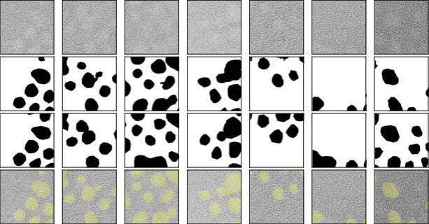

<!-- ===== §0. Recap + roadmap ===== -->

## Recap: Week 6 and today's question

:::: {.incremental}
- **Week 6:** neural networks from first principles — perceptron, MLP, activations, softmax/cross-entropy, autograd and backprop, initialisation, batch/layer norm, training diagnostics.
- Core insight: a network is *empirical-risk minimisation by gradient descent* on a composition of learnable maps; backprop gives $\nabla_\theta \hat{R}$ for free.
- **Gap:** an MLP flattens every image into a vector. A 1024×1024 HAADF image into one dense layer with 1000 neurons already needs **one billion weights** — and the top-left and bottom-right pixels are unrelated inputs.
- **Today's question:** how do we build spatial structure into the architecture — locality, "same feature anywhere", hierarchy — and how do we check *what* the trained network actually looks at?
- **Answer:** convolutional networks, U-Nets for per-pixel segmentation, and saliency-type explanations.
::::

:::: {.notes}
- Open by recalling the Week 6 slide "when NOT to use a deep net": dense MLP on raw images. Today is the fix.
- The one point to land: CNNs are not a different paradigm; they are MLPs with locality and weight sharing baked in. Loss, backprop, Adam, BatchNorm from Week 6 all still apply unchanged.
- Misconception to preempt: "CNNs are for photos." CNNs work on any grid-structured signal: spectral images, diffraction patterns, EELS maps, simulated fields, 1-D spectra and time series.
- New this year: explainability is taught *with* the model family. CNNs get saliency, Grad-CAM, occlusion and the shortcut-learning demo today — not in a separate week.
- Pacing: 3 minutes. Transition: "Here is the map for today."
::::

## Road map, learning outcomes and self-study

:::: {.columns}
:::: {.column width="55%"}
**Road map (≈90 min)**

1. Why MLPs fail on images
2. Convolution, stride, padding, channels
3. Weight sharing, equivariance vs invariance
4. Pooling, receptive field, hierarchy
5. Architectures: LeNet → AlexNet → VGG → ResNet
6. U-Net segmentation: Dice/IoU, class imbalance, EM cases
7. Explainability: saliency, Grad-CAM, occlusion, shortcuts
8. Failure modes, checklist, Week 8 preview
::::
:::: {.column width="45%"}
**After today you can …**

- compute output shapes, parameter counts and receptive fields of a CNN;
- distinguish translation *equivariance* from *invariance* and say which a task needs;
- explain why skip connections make deep nets (ResNet) and sharp masks (U-Net) possible;
- evaluate a segmentation with IoU/Dice and handle class imbalance;
- produce and critically read saliency, Grad-CAM and occlusion maps.
::::
::::

:::: {.notes}
- Orientation only — 1–2 minutes. Point out the two anchors: the U-Net section (the workhorse for EM segmentation) and the shortcut-learning demo (the trust lesson).
- Self-study: `notebooks/week07_cnn_segmentation.ipynb` — kernels, an equivariance check, a tiny U-Net trained on synthetic particle images on CPU, saliency on a failure case, and the shortcut demo. Pointer slide near the end.
- Transition: "Start with the concrete problem — why does a plain MLP fail on microscopy images?"
::::

<!-- ===== §1. Why MLPs fail on images ===== -->

## The parameter explosion: a concrete count

{width="70%"}

:::: {.notes}
- Walk through the four bars explicitly. Left three: MLP on a 64×64, 256×256, and 1024×1024 image. Right: a single convolutional layer with 64 filters of size 3×3.
- The one point to land: the CNN bar is not visible at this scale — it is down at 576 parameters while the MLP is at 10⁹.
- Misconception to preempt: "more parameters = better." With small EM datasets (50–500 images), 10⁹ parameters means perfect memorisation of the training set and zero generalisation.
- EM anchor: a real 4D-STEM scan is 512×512 real-space × 128×128 momentum-space. Even the spatial slice is 262,144 pixels. No sane practitioner runs a dense MLP on that.
- Forward link: weight sharing is the mechanism that collapses 10⁹ to 576 — that is the next conceptual pivot.
- Transition: "The parameter count is one problem. The second problem is spatial blindness."
::::

## MLPs destroy spatial structure

:::: {.incremental}
- An MLP **flattens** the image: pixel (0,0), pixel (0,1), pixel (0,2), …, in row-major order.
- After flattening, the model treats pixel (100,100) and pixel (200,200) as completely **unrelated** input coordinates — no notion of "next to each other."
- Physics says the opposite: a grain boundary is a spatially *local* feature. An atomic column's contrast depends on its immediate neighborhood, not on pixels in a different part of the image.
- **Result:** the MLP must relearn the same edge detector at every possible image location — and then relearn it again if the same feature appears at a different size.
::::

:::: {.notes}
- Draw the key diagram on the board: a 4×4 image flattened to a vector of 16 numbers. Ask: "Which two numbers were neighbors in the image?" You cannot tell from the vector alone.
- The one point to land: locality is a physical property of EM images, not a mathematical luxury. Every microscopy feature — atomic column, grain boundary, pore, precipitate — is defined by what is near it.
- Misconception to preempt: "I could just tell the model the pixel coordinates." True in principle, but then you have already done feature engineering — you might as well use a CNN that does it automatically.
- EM anchor: a phase boundary in a TEM bright-field image is a 1–3 nm strip. Its signature is determined by the 10–20 pixels immediately around it, not by pixels 200 nm away.
- Transition: "The third problem is translation."
::::

## The translation problem: why position should not matter

:::: {.incremental}
- If a precipitate moves 5 pixels to the right, the MLP sees a **completely different** input vector.
- Every weight connected to the old location is now irrelevant; the model must have independently learned the same precipitate pattern at every position.
- This is physically absurd: a precipitate is a precipitate regardless of where it sits in the field of view.
- **What we want:** a feature detector that fires whenever the precipitate appears — regardless of location.
- This property is called **translation equivariance**: shift the input → the feature response shifts by the same amount.
::::

:::: {.notes}
- Use the "Where's Waldo" analogy: you find Waldo by scanning the image with a mental template of Waldo, not by memorising where he was in last week's puzzle. CNNs implement that template-scanning idea.
- The one point to land: translation equivariance is not a performance trick — it is encoding a physical fact about images. The network should not care where in the field of view the feature appears.
- Misconception to preempt: "convolution gives translation *in*variance." Convolutional layers give equivariance (shift in → shift response). Invariance comes from pooling or global average pooling — slides later.
- EM anchor: in a HAADF image of a superlattice, atomic columns appear at every unit-cell position. A detector that fires "column present" must work equally at every location.
- Transition: "So how do we fix all three problems at once? With one elegant idea."
::::

## Summary: three failures of MLP on images

| Problem | MLP behaviour | CNN fix |
|---|---|---|
| Parameter explosion | $D \times M$ weights per layer | $k_h k_w C_{out} C_{in}$ kernel weights |
| No spatial structure | All pixels treated equally | Local receptive field: inspect $k \times k$ patch |
| No translation awareness | Relearn at every location | Weight sharing: one kernel applied everywhere |

:::: {.fragment}
CNNs are MLPs with **locality and weight sharing built in as hard constraints**.
::::

:::: {.notes}
- Use this as a mini-summary before moving to the mechanics. Students often feel the three failure points were introduced separately but are actually one principle: dense layers know nothing about spatial structure.
- The one point to land: locality + weight sharing = convolution. That is the entire derivation. Everything else (padding, stride, pooling, channels) is implementation detail.
- Misconception to preempt: "CNNs are always better than MLPs." Wrong. For tabular non-spatial data (composition, temperature, hardness), MLPs or even linear models are often preferable. CNNs exploit spatial structure that may not exist.
- EM anchor: the "spatial structure" that CNNs exploit is exactly the physics-driven spatial correlation that Week 2 introduced via sampling and the Nyquist criterion: nearby pixels are correlated because they sample the same continuous physical field.
- Transition: "Let us now look at the core operation — convolution."
::::

<!-- ===== §2. Convolution: the sliding feature detector ===== -->

## Convolution: one idea, three properties at once

:::: {.incremental}
- Take a small **kernel** (e.g. 3×3 weights).
- **Slide** it across the image, pixel by pixel.
- At each position: multiply the kernel by the overlapping image patch, element-wise, and sum → one output value.
- The output is a **feature map**: a new image where each pixel encodes *how strongly the kernel's pattern appeared at that location*.
- One kernel produces one feature map. Multiple kernels in parallel → multiple feature maps.
::::

:::: {.notes}
- Narrate one output value explicitly: "align the 3×3 kernel at position (i,j), multiply the 9 overlapping pixels by the 9 kernel weights, sum the 9 products → one number. That is one pixel in the feature map."
- The one point to land: the "sliding" is what gives locality (only a local patch is used) AND translation equivariance (same kernel is slid everywhere).
- Misconception to preempt: "convolution flips the kernel." That is strict mathematical convolution. CNN libraries implement cross-correlation (no flip). Since kernels are learned, the distinction does not matter in practice.
- EM anchor: imagine a 3×3 "bright-dot" kernel applied to a HAADF image. It will respond strongly wherever an atomic column is and weakly everywhere else — producing a bright-dot feature map.
- Transition: "Let me show this on a real synthetic grain image."
::::

## The sliding-window operation step by step

{width="55%"}

:::: {.notes}
- Narrate one step of the sliding: "position the kernel over the top-left 3×3 patch; multiply each kernel weight by the overlapping pixel; sum the nine products; that single number becomes position (1,1) of the feature map. Now slide one pixel to the right; repeat."
- The one point to land: this sliding IS the translation equivariance — the same kernel visits every location, so whatever pattern it detects in the top-left it will also detect in the bottom-right.
- Misconception to preempt: "this is slow." For a single kernel loop it is. GPU-parallelised convolution evaluates all output positions simultaneously using BLAS-level matrix operations.
- EM anchor: think of the kernel as a template for a local feature — e.g. "bright centre, dark surround" for an atomic column. The sliding window asks: does my template match here? And here? And here?
- Transition: "Let us apply this to a real synthetic grain image and see the feature maps."
::::

## Convolution on a synthetic grain image

{width="90%"}

:::: {.notes}
- Point out explicitly: the two feature maps highlight *different* boundaries — vertical Sobel fires at the vertical boundary, horizontal Sobel fires at the horizontal boundary. Neither is a correct "grain boundary detector" by itself; you need both in combination.
- The one point to land: one 3×3 kernel produces one feature map. A CNN uses many kernels simultaneously, building a richer description.
- Misconception to preempt: "CNNs apply edge detectors." At the first layer, some learned kernels do resemble Sobel. But deeper layers learn highly abstract detectors that do not resemble any named filter.
- EM anchor: in a STEM experiment, you might want one feature map for atomic-column positions, one for the background, one for defect signatures. A single convolutional layer can extract all three simultaneously.
- Transition: "Let us look at specific hand-set kernels to build intuition before we let the network learn them."
::::

## The discrete convolution formula

For input image $I$ and kernel $K$:

$$
(I \star K)_{m,n} = \sum_{a=-\Delta}^{\Delta}\sum_{b=-\Delta}^{\Delta} K_{a,b}\,I_{m+a,\, n+b}
$$

:::: {.incremental}
- $K$ is a small matrix (typically $3\times3$ or $5\times5$); $\Delta = (k-1)/2$.
- At each output position $(m,n)$: dot product of the kernel with the local image patch.
- **Parameter count:** $k^2$ weights — independent of image size $H \times W$.
- The same $k^2$ weights are applied at every $(m,n)$ → **weight sharing**.
::::

:::: {.notes}
- Walk through the indices slowly: (m,n) is the output location; (a,b) runs over the kernel footprint. Students often confuse the kernel index with the image index.
- The one point to land: the formula shows why convolution is a LOCAL operation — only pixels within ±Δ of the output location contribute.
- Misconception to preempt: "the convolution formula requires flipping the kernel." This formula is cross-correlation. Strict mathematical convolution uses (m-a, n-b). Because kernels are learned, it makes no difference.
- EM anchor: for a HAADF signal, K could encode "compare center pixel to neighbors" — exactly what an edge-detector kernel does. The math is the same as the intuition.
- Transition: "What do specific kernels detect?"
::::

## Kernels as feature detectors

{width="70%"}

:::: {.fragment}
In a trained CNN, the network discovers these (and more complex) filters **automatically** from labelled examples — no manual kernel design needed.
::::

:::: {.notes}
- Name the sign pattern in each kernel. Vertical Sobel: positive on one column, negative on the other → fires at a sign change from left to right. Ask students: "what happens if you flip the sign pattern?" Answer: detects the opposite edge polarity.
- The one point to land: these hand-set kernels show what convolution can detect. The power of CNNs is that they learn kernels adapted to the specific task — grain boundary detection, atomic column location, pore segmentation.
- Misconception to preempt: "deep CNNs look like Sobel at every layer." Only the first layer occasionally learns Sobel-like patterns. Deeper layers learn combinations of earlier features that cannot be visualised as simple kernels.
- EM anchor: the Laplacian kernel fires at atomic columns (bright spots surrounded by dark background) and at defects — naturally suited to HAADF atomic-resolution images.
- Forward link: the notebook lets students hand-set kernels to detect a chosen grain-boundary type — connect this to the Sobel/Laplacian discussion here.
- Transition: "Three details control how a convolution layer changes image size: stride, padding, and multiple channels."
::::

<!-- ===== §3. Stride, padding, channels ===== -->

## Stride and padding: controlling output size

{width="70%"}

:::: {.incremental}
- **Padding (same):** add zeros around the border → output size = input size. Standard in most segmentation architectures.
- **Stride $s$:** move the kernel $s$ pixels per step → output size $\approx H/s$.
- General rule: $H_{out} = \left\lfloor\frac{H + 2p - k}{s}\right\rfloor + 1$; e.g. $k=3, p=1, s=1$ keeps $H$; $s=2$ halves it.
- Parameters $C_{out}(C_{in}k^2+1)$ — independent of $H, W$: the same network runs on 256² and 4096² images.
::::

:::: {.notes}
- Use the formula H_out = floor((H + 2p - k)/s) + 1 with concrete numbers. Ask students: "64×64 image, k=3, p=1, s=1 — what is H_out?" (Answer: 64.) "k=3, p=0, s=2?" (Answer: 31.)
- The one point to land: stride is the primary tool for downsampling in modern CNNs, often replacing explicit pooling layers (ResNet uses stride-2 convolutions instead of max-pool at stage transitions).
- Misconception to preempt: "zero padding is the only option." Reflect padding (mirror boundary), circular padding (for periodic signals like diffraction), and replicate padding are all available — some are more physically meaningful for certain EM signals.
- EM anchor: in 4D-STEM, the diffraction pattern is often periodic — circular padding is physically justified. For real-space HAADF images, reflect padding is more natural than zero padding.
- Transition: "Real images and feature maps have multiple channels."
::::

## Multiple channels: depth in the tensor

:::: {.incremental}
- A grayscale image has **1 channel**: $H\times W\times 1$.
- After a layer with $C_{out}$ kernels: $H_{out}\times W_{out}\times C_{out}$ (one feature map per kernel).
- A full convolutional layer kernel has shape $C_{out}\times C_{in}\times k_h\times k_w$.
- Total parameters: $C_{out}(C_{in}k_hk_w + 1)$ including biases — still independent of $H, W$.
- EM multichannels: hyperspectral EELS/EDS maps (spatial × energy), multi-segment detector images, RGB-like stacks of different contrast modes.
::::

:::: {.notes}
- Give the parameter count for a concrete example: 64 input channels, 128 output channels, 3×3 kernel → 128×(64×9+1) = 73,856 parameters. Still far smaller than any dense layer on a real image.
- The one point to land: channels are how CNNs regain expressive power after imposing locality and weight sharing. Each output channel is a different learned feature map.
- Misconception to preempt: "channels are just like colour channels." In the first layer yes, but by layer 3 each channel is an abstract learned representation — not interpretable as a colour or intensity.
- EM anchor: an EELS spectrum image at each of 1024 energy windows is a 3D tensor with 1024 channels. A convolutional layer over that can learn spatially localised spectral signatures — exactly what phase identification requires.
- Transition: "Now let us make precise why weight sharing is such a powerful inductive bias."
::::

<!-- ===== §4. Weight sharing and translation equivariance ===== -->

## Weight sharing: the key efficiency principle

{width="75%"}

:::: {.notes}
- Name the numbers. For the 1-D example shown: 8 inputs × 8 outputs = 64 weights in the dense case. 3-weight conv kernel shared across 8 positions = 3 weights. Factor of 21.
- The one point to land: weight sharing is not just an efficiency trick — it encodes a *physical assumption*. A grain boundary looks the same in the top-left corner and the bottom-right corner of the field of view. The same kernel should detect it in both places.
- Misconception to preempt: "fewer parameters = weaker model." CNNs are empirically more expressive than dense MLPs at the same parameter count on spatial data, because the inductive bias is well-matched to the signal structure.
- EM anchor: in HAADF imaging, atomic columns form a repeating pattern across the entire field of view. Learning one column-detector kernel and reusing it everywhere is physically optimal — and exactly what the network does.
- Transition: "Weight sharing gives us equivariance — let us be precise about what that means."
::::

## Translation equivariance as an inductive bias

:::: {.incremental}
- **Translation equivariance:** if the input shifts by $\delta$ pixels, the feature map shifts by $\delta$ pixels — the detector response follows the feature.
- Formally: $f(T_\delta X) = T_\delta f(X)$ where $T_\delta$ is a spatial shift and $f$ is a convolutional feature extractor.
- This is the correct prior for most microscopy tasks: a precipitate is a precipitate wherever it appears.
- **Translation invariance** (different!): the final *prediction* does not change if the input shifts. Built gradually via pooling, striding, and global average pooling — not by convolution alone.
::::

:::: {.fragment}
*Equivariance preserves "where." Invariance discards "where" and keeps only "what."*
::::

:::: {.notes}
- Clarify the equivariance vs invariance distinction explicitly. Equivariance is what conv layers give you. Invariance is what you want for image-level classification (does this image contain a precipitate, yes/no). Segmentation tasks need equivariance, not invariance — the output mask must track the position.
- The one point to land: architecture choice (conv vs pooling) determines whether you preserve or discard positional information. This is a design choice aligned with the task.
- Misconception to preempt: "data augmentation (random crops, flips) trains invariance." Augmentation helps, but the architectural bias from pooling/striding is what gives the fundamental invariance property.
- EM anchor: grain boundary segmentation (U-Net, coming soon) needs equivariance. Defect present/absent classification can discard position. Architecture choice should match the task.
- Transition: "Pooling is the classical way to introduce invariance and reduce resolution."
::::

## Beyond translation: rotations and mirrors in EM

{width="88%"}

:::: {.notes}
- Walk the two rows. Row 1: $f(Tx) = Tf(x)$ exactly (circular padding) — this is the equivariance that weight sharing buys. Row 2: $f(Rx) \ne Rf(x)$; the rod that was vertical is now horizontal and the vertical-edge detector is blind to it.
- The one point to land: a plain CNN is equivariant to *translations only*. It is neither rotation- nor mirror-equivariant, and it is not scale-equivariant either (the scale-sensitivity failure mode later today).
- EM anchor: crystal grains appear at arbitrary in-plane orientations; a specimen can be loaded rotated; diffraction patterns have point-group symmetry. For all of these the physics says "the answer should rotate with the input" — the architecture does not know that.
- The notebook reproduces this check in PyTorch (Part 4) and asks whether the isotropic Laplacian kernel is 90°-rotation-equivariant (it is — because the kernel itself is symmetric).
- Transition: "So how do we get rotation robustness?"
::::

## Getting symmetry: three routes

:::: {.incremental}
- **Formal definitions** (group $G$ acting on images and feature maps):
  - equivariant: $f(g\cdot x) = g\cdot f(x)$ — output transforms *with* the input (segmentation masks, denoised images, strain maps);
  - invariant: $f(g\cdot x) = f(x)$ — output ignores the transform (phase label, "defect present?").
- **Route 1 — augmentation:** train on randomly rotated/flipped copies; the network *learns* approximate symmetry. Cheap, universal; costs data and capacity (Week 8).
- **Route 2 — test-time augmentation:** average predictions over the 8 rotations/flips of the dihedral group $D_4$ (un-rotate the masks first). Free at training time, 8× cost at inference.
- **Route 3 — build it in:** group-equivariant CNNs share weights across rotations as well as translations [@cohen2016group]; exact symmetry, fewer parameters, more engineering.
- Rule: **know the symmetry of your task first** — then decide whether to learn it, average over it, or hard-wire it.
::::

:::: {.notes}
- This is the brief version of the MFML symmetry discussion: invariance vs equivariance as properties of a map under a group action. Keep the group language light — "a set of transforms you can compose and undo".
- The one point to land: equivariance is what you want in the *layers*; invariance (if needed at all) is created at the very end, e.g. by global average pooling. Segmentation needs equivariance throughout.
- Misconception to preempt: "augmentation makes the network invariant." It makes it *approximately* equivariant/invariant on the training distribution — no guarantee on new data.
- EM anchor: for atomic-resolution images with a 4-fold or 6-fold zone axis, D4/D6 test-time augmentation is a two-line trick that typically cleans up segmentation noise.
- Forward link: the same symmetry question returns for graphs (permutation invariance) in Week 10 and for atomic environments (rotation invariance of descriptors) from Week 5.
- Transition: "Choosing an architecture is choosing which symmetries and assumptions to bake in — that is the inductive bias."
::::

## Inductive bias: encoding what you know

:::: {.incremental}
- An **inductive bias** is an assumption baked into the architecture that makes certain functions easy to learn.
- **MLP (Week 6):** no structure — every function of all inputs equally easy; needs the most data.
- **CNN (today):** grid + locality + translation weight sharing.
- **GNN / transformer (Week 10):** graph + permutation symmetry; a transformer is a fully connected graph with learned (attention) edges.
- Strong, *correct* bias helps with small datasets by ruling out physically unreasonable solutions; a *wrong* bias caps performance.
::::

:::: {.notes}
- This is the course arc slide: MLP (no structure) → CNN (grid, translation) → GNN (graph, permutation) → transformer (set / fully connected graph). Week 10 closes the loop with "a CNN is a GNN on a grid graph".
- Connect to Week 6's practical rule: dense nets need lots of data. CNNs work with far fewer labelled images because the spatial bias is well matched to the signal.
- The one point to land: choosing an architecture is choosing a prior over functions. CNNs are a strong prior for images; Gaussian processes (Week 11) are a strong prior for smooth functions.
- EM anchor: with 50 labelled HAADF images, a CNN with the right architecture generalises; a dense MLP overfits catastrophically.
- Transition: "Now pooling."
::::

<!-- ===== §5. Pooling and downsampling ===== -->

## Pooling: summarising local responses

{width="40%"}

:::: {.incremental}
- **Max pooling:** keep the strongest activation in each local window. Answers: "did this feature appear here?"
- **Average pooling:** compute the mean. Answers: "how strongly was this feature present overall?"
- No learned parameters — purely deterministic aggregation.
- $2\times2$ max-pool: halves height and width, doubles the effective receptive field of later layers.
::::

:::: {.notes}
- Narrate the 2×2 max-pool: "take the top-left 2×2 block of the feature map, keep the largest value, put it in position (0,0) of the pooled output. Repeat for every non-overlapping block."
- The one point to land: pooling provides approximate translation invariance within a window. A precipitate shifted 1 pixel to the right stays in the same pool window and produces the same pooled output — the network becomes insensitive to small shifts.
- Misconception to preempt: "max-pool always wins." In segmentation (U-Net), max-pool in the encoder is fine, but the decoder must recover spatial detail that max-pool discarded — that is what skip connections do.
- EM anchor: in a HAADF image of a defect, the defect might shift slightly between beam positions due to drift. Max-pool makes the detector robust to this sub-pixel drift.
- Transition: "Pooling and strided convolutions both reduce resolution. Together they make the receptive field grow quickly with depth."
::::

## Max pooling: a worked example

:::: {.columns}
:::: {.column width="50%"}
**Input feature map (4×4):**

$$
\begin{pmatrix}
1 & 3 & 2 & 4 \\
5 & 6 & 7 & 8 \\
3 & 2 & 1 & 0 \\
1 & 2 & 3 & 4
\end{pmatrix}
$$
::::
:::: {.column width="50%"}
**After 2×2 max-pool (stride 2):**

$$
\begin{pmatrix}
6 & 8 \\
3 & 4
\end{pmatrix}
$$

Top-left 2×2 block: $\max(1,3,5,6)=6$.
Top-right: $\max(2,4,7,8)=8$.
::::
::::

:::: {.fragment}
- Output size: $2\times2$ from $4\times4$ — spatial dimensions halved.
- No learned parameters — purely a max operation.
- **Approximate invariance:** if the 6 moved to the adjacent cell (still in the same 2×2 window), the output is unchanged.
::::

:::: {.notes}
- Walk through the four quadrants. Top-left: max(1,3,5,6)=6. Top-right: max(2,4,7,8)=8. Bottom-left: max(3,2,1,2)=3. Bottom-right: max(1,0,3,4)=4.
- The one point to land: the maximum preserves "was this feature strongly present anywhere in this window?" — appropriate for feature detection where exact position within the 2×2 window does not matter.
- Misconception to preempt: "average pooling is always worse." Average pooling is better when you care about the average activation level (e.g. how much of this phase is in this region), not just whether the feature appeared.
- EM anchor: in an atomic-column detector, you want max-pool to be robust to 1-pixel drift of the column within the window. Average-pool would dilute a single bright-column response with its dark background neighbours.
- Transition: "Multiple conv-pool blocks in sequence is the standard encoder pattern."
::::

## Pooling in practice: the Conv–Pool block

:::: {.incremental}
- Standard building block: **Conv → ReLU → MaxPool**.
- After $L$ such blocks (each with stride-2 or 2×2 pool): spatial size is $H/2^L \times W/2^L$.
- Channels typically double at each stage: 64 → 128 → 256 → 512.
- Example: 256×256 input through 4 blocks → 16×16 feature maps with 512 channels.

| Block | Channels | Spatial size (from 256×256) |
|:---:|:---:|:---:|
| 1 | 64 | 128×128 |
| 2 | 128 | 64×64 |
| 3 | 256 | 32×32 |
| 4 | 512 | 16×16 |
::::

:::: {.notes}
- Ask students to confirm the table. After one 2×2 max-pool: 256/2 = 128. After two: 64. Three: 32. Four: 16. This is the standard encoder pattern in classification CNNs and the encoder half of U-Net.
- The one point to land: the spatial-channel trade-off is intentional. Losing spatial detail is acceptable if you are doing classification (just need a label). For segmentation, you need the decoder half of U-Net to restore the spatial detail.
- Transition: "Understanding receptive fields lets you reason about how much context each neuron sees."
::::

<!-- ===== §6. Receptive field and feature hierarchy ===== -->

## Receptive fields: how much context does one neuron see?

{width="75%"}

:::: {.notes}
- Walk through the three panels. First panel: the output neuron (red star) is determined by a 3×3 patch. Second panel: each neuron in layer 2 was itself determined by a 3×3 patch of layer 1, which was a 3×3 patch of the input — giving a 5×5 input receptive field. Third: 7×7.
- The one point to land: depth is how CNNs grow context without expensive large kernels. Three stacked 3×3 layers (3×9=27 params/channel) beat one 7×7 layer (49 params/channel) because there are two extra nonlinearities between them.
- Misconception to preempt: "larger kernels always see more." Two stacked 3×3 layers give the **same** 5×5 theoretical receptive field as one 5×5 layer — but with fewer parameters and an extra nonlinearity between them, making the representation strictly more expressive. The benefit is not a larger RF; it is parameter efficiency plus added depth.
- EM anchor: detecting a dislocation requires seeing context beyond one pixel. A grain triple junction requires seeing ~10–20 nm of context. Pooling rapidly grows the receptive field — by layer 4, one neuron can see a quarter of the image.
- Transition: "Growing receptive fields naturally lead to hierarchical features."
::::

## Feature hierarchy: edges → motifs → structures → properties

{width="90%"}

:::: {.notes}
- Walk through the four panels in order. Point out that each stage is more abstract and coarser in resolution.
- The one point to land: this hierarchy is why CNNs are a natural fit for materials images. Microscopy features ARE hierarchical — atoms form columns, columns form grains, grains form microstructures, microstructures encode properties.
- Misconception to preempt: "feature maps are always interpretable." Only Layer 1 features are reliably interpretable as edge/orientation detectors. Deeper features are abstract combinations with no simple physical label.
- EM anchor: in HAADF imaging: Layer 1 detects atomic columns. Layer 2 detects local lattice periodicity (grain interior) vs disorder (boundary). Layer 3 detects grain, phase, or defect-cluster regions. Layer 4+ enables phase classification.
- Forward link: Grad-CAM (later today) reads out exactly these deep, coarse feature maps to show which region drove a decision.
- Transition: "Let us now look at the major CNN architectures and what each added."
::::

## Summary: how locality, sharing, and hierarchy combine

| Design choice | What it encodes | EM benefit |
|---|---|---|
| Local receptive field | Features depend on local context | Grain boundaries are local |
| Weight sharing | Same feature appears at many positions | Atomic columns repeat |
| Multiple channels | Many detectors in parallel | Multi-contrast detection |
| Stride / pooling | Coarser scale, larger context | Phase-level reasoning |
| Depth / nonlinearity | Hierarchical feature composition | Atoms → grains → phases |

:::: {.notes}
- Use this table as a mid-lecture checkpoint. Ask: "which row explains the 930,000× parameter reduction?" (Weight sharing.) "Which explains how a segmentation network eventually knows a whole grain is one phase?" (Depth + pooling.)
- Transition: "Now the major architectures."
::::

<!-- ===== §7. CNN architectures ===== -->

## CNN architectures in one breath: the arc from 1998 to 2015

{width="90%"}

:::: {.notes}
- Read the three boxes together as a story: "LeCun proved learned features beat hand-crafted features for digit recognition. The field then stalled for 14 years while GPUs and datasets grew. AlexNet in 2012 shocked the computer vision community with a 10-percentage-point lead on ImageNet. Then researchers tried to go deeper and hit the vanishing-gradient wall, which ResNet in 2015 solved with skip connections — enabling networks 20× deeper than AlexNet."
- The one point to land: each innovation solved a specific failure mode. LeNet → learning beats hand-craft. AlexNet → scale + ReLU + dropout. ResNet → depth without vanishing gradients.
- Misconception to preempt: "you need to know these architectures by name for the exam." What matters is the progression: what failed, what was added, why. The architecture names are labels for the innovations.
- Transition: "LeNet is worth knowing in a little more detail because it is the direct template for most materials-science CNNs."
::::

## LeNet: the CNN template

:::: {.incremental}
- **LeNet-5** [@lecun1998lenet]: two convolutional layers, two pooling layers, three dense layers.
- ~60,000 parameters — tiny by modern standards.
- Proved for the first time that a learned feature extractor could outperform hand-crafted features (SIFT, HOG) on a real vision task.
- **The template:** Conv → Activation → Pool → Conv → Activation → Pool → Flatten → FC → FC → Output.
- This exact recipe still appears in CNN classifiers for materials micrographs today — often with deeper variants.
::::

:::: {.notes}
- Draw the LeNet template on the board as a pipeline. Students should be able to reproduce this from memory by the end of the course.
- The one point to land: LeNet answers "what is the basic recipe?" The subsequent architectures are variations that go deeper, wider, and more efficient.
- EM anchor: a CNN for classifying steel microstructures as martensitic vs ferritic often follows this exact LeNet template — two or three conv-pool blocks, then a dense classifier head.
- Transition: "AlexNet added scale, ReLU, and dropout."
::::

## AlexNet: the deep learning revolution [@krizhevsky2012alexnet]

:::: {.incremental}
- **AlexNet (2012):** won the ImageNet Large Scale Visual Recognition Challenge by 10 percentage points over the second-place hand-crafted pipeline.
- Key innovations (each still used today):
  - **ReLU activation:** faster convergence, no vanishing gradient for $z > 0$ (from Week 6).
  - **Dropout:** randomly zero out neurons during training → prevents co-adaptation, reduces overfitting.
  - **GPU training:** made deep networks with 60 million parameters computationally feasible.
- Opened the "deep learning era" — almost every subsequent architecture follows the AlexNet pattern with improvements.
::::

:::: {.notes}
- Connect ReLU back to Week 6: "you already know why ReLU beat sigmoid — gradient is 1 for z > 0, so it doesn't vanish through many layers." Dropout was introduced in Week 6 — recall it as "randomly turning off 50% of neurons per batch prevents any one neuron from becoming essential, forcing the network to learn redundant distributed representations."
- The one point to land: AlexNet's margin of victory was so large that it instantly converted the computer-vision community from hand-crafted features to deep learning. The same shift happened in materials science about 5 years later.
- Transition: "The next step was not a new trick but a new design discipline: blocks."
::::

## VGG: deep networks from repeated blocks [@simonyan2015vgg]

:::: {.columns}
:::: {.column width="42%"}
{width="100%" style="background: white"}
::::
:::: {.column width="58%"}
:::: {.incremental}
- **VGG block:** $n\times$ (3×3 conv, padding 1, ReLU) → 2×2 max-pool. Channels double after each block: 64 → 128 → 256 → 512.
- **Why only 3×3?** Two stacked 3×3 layers have a 5×5 receptive field, three have 7×7 — with $3\cdot 9C^2 = 27C^2$ instead of $49C^2$ weights and **two extra non-linearities**.
- **The design lesson:** think in *blocks*, not layers — a network is a short program: `for c in (64,128,256,512): block(c)`.
- VGG-16 ≈ 138 M parameters (most in the dense head) — accurate but heavy; still a common "perceptual" feature extractor.
::::
::::
::::

:::: {.notes}
- Source: SS25 `03_cnns/04_convnets_1.qmd` (VGG section) and MFML U4. Keep it to the design idea.
- The one point to land: VGG turned CNN design into a modular recipe. Every modern architecture (ResNet, U-Net) is a stack of repeated blocks.
- Ask: "How many weights does a 7×7 conv with C in/out channels have vs three 3×3?" 49C² vs 27C² — and the stack is *more* expressive.
- Misconception to preempt: "VGG is obsolete, so irrelevant." Its block design and the encoder half of the original U-Net are VGG-style.
- Transition: "So just stack more VGG blocks? That is where things break."
::::

## Going deeper breaks: the degradation problem

:::: {.incremental}
- Naïvely stacking more conv layers (20 → 56) makes **training** error *worse*, not only test error [@he2016resnet].
- This is **not overfitting** (training error rises) and not only vanishing gradients (BatchNorm keeps activations well-scaled): plain deep stacks are simply **hard to optimise**.
- Thought experiment: a deeper net could copy the shallow one and set the extra layers to the identity — yet SGD does not find that solution.
- **Idea:** make the identity the *default* — let each block learn only a correction to it.
::::

:::: {.notes}
- This slide motivates ResNet properly. Students often think ResNet only "fixes vanishing gradients"; He et al. showed that with BatchNorm the gradients are fine, and the deeper plain net still trains worse.
- The one point to land: an optimisation problem, not a capacity or regularisation problem.
- BatchNorm recap (Week 6): normalise each channel over the mini-batch, then learnable scale/shift [@ioffe2015batchnorm]. In CNNs the statistics are per channel over batch × H × W. At inference, running averages are used — remember `model.eval()`.
- Transition: "The fix is one line of code."
::::

## ResNet: skip connections solve vanishing gradients [@he2016resnet]

{width="42%"}

:::: {.fragment}
$$\mathbf{y} = F(\mathbf{x}) + \mathbf{x}$$
Instead of learning the target $\mathbf{y}$, learn the **residual** $F(\mathbf{x}) = \mathbf{y} - \mathbf{x}$.
::::

:::: {.notes}
- Connect to Week 6's vanishing gradient discussion: "through 20 layers of sigmoid, the gradient shrinks by 0.25^20 ≈ 10^-12. ReLU fixed this for moderate depth. ResNet fixed it for arbitrary depth by providing a gradient highway through the skip connection."
- The one point to land: the skip connection makes the gradient path shorter. Even if the convolutional branch produces a near-zero gradient, the skip branch passes the full gradient back without modification.
- Misconception to preempt: "ResNet needs 50+ layers to work." ResNet blocks are useful at any depth. Even a 10-layer network benefits from skip connections when training is unstable.
- EM anchor: several recent papers on materials microstructure segmentation use ResNet-50 as the feature extractor in a Mask R-CNN or DeepLab pipeline — students will encounter this terminology in the literature.
- Transition: "What does a residual block look like in practice?"
::::

## Residual blocks in practice: BN, stages, and why EM cares

:::: {.incremental}
- **Basic block:** conv3×3 → BN → ReLU → conv3×3 → BN, **add** input, ReLU. If shapes change (stride 2, more channels) the skip uses a 1×1 conv.
- **Gradient view:** $\frac{\partial \mathbf{y}}{\partial \mathbf{x}} = \mathbf{I} + \frac{\partial F}{\partial \mathbf{x}}$ — the identity term carries the gradient through every block unattenuated.
- **Stages:** ResNet-18/34/50 = 4 stages of residual blocks, stride-2 between stages, global average pooling + one linear layer (no big dense head: ResNet-18 ≈ 11 M params vs VGG-16 ≈ 138 M).
- **EM use:** ResNet backbones are the standard *encoder* for U-Net-style segmenters and the usual starting point for transfer learning (Week 8).
- Skip connections appear twice today: **additive** (ResNet: ease optimisation) and **concatenating** (U-Net: restore spatial detail).
::::

:::: {.notes}
- Draw the basic block on the board, and the 1×1 projection skip for the stride-2 case.
- The one point to land: identity + small correction. Blocks that are not needed can learn $F\approx 0$ and become near-identity — depth stops hurting.
- Misconception to preempt: "ResNet and U-Net skips are the same thing." Same name, different purpose: ResNet adds $x$ to help optimisation; U-Net concatenates encoder features to recover *where*.
- EM anchor: literature on nanoparticle/defect segmentation constantly says "U-Net with ResNet-34 encoder, ImageNet-pretrained" — students can now parse every word of that sentence (the "pretrained" part is Week 8).
- Transition: "Classification networks produce one label per image. For EM segmentation we need one label per pixel — that is U-Net."
::::

<!-- ===== §8. U-Net ===== -->

## U-Net: encoder–decoder for segmentation [@ronneberger2015unet]

{width="78%"}

:::: {.notes}
- Walk through the architecture from top-left to top-right. "Encoder (blue): each block halves the spatial size and doubles channels — building rich abstract features. Bottleneck (purple): smallest spatial resolution, maximum context. Decoder (red): each block upsamples by 2 and uses a skip connection to bring back fine spatial detail from the corresponding encoder level. Output: same spatial resolution as input, one label per pixel."
- The one point to land: the key innovation is the skip connection that bypasses the bottleneck. Without it, the decoder has to reconstruct fine spatial detail entirely from the compressed bottleneck representation — which is too abstract and loses boundary precision.
- Misconception to preempt: "U-Net is only for medical images." The original paper used biomedical images, but U-Net is now the standard segmentation architecture for any spatially structured prediction — including phase segmentation in TEM and grain tracing in SEM.
- EM anchor: the spatial resolution of the output mask (same as input) is critical for measuring grain sizes, locating precipitates, and computing phase fractions. Classification-only CNNs cannot provide this.
- Transition: "Let me break down the two paths."
::::

## U-Net: encoder, bottleneck, decoder

:::: {.columns}
:::: {.column width="50%"}
**Encoder path**

:::: {.incremental}
- Conv × 2 → ReLU → MaxPool (stride 2).
- Repeat 4 times: spatial halves, channels double.
- Each level captures increasing context.
- Similar to a standard classification CNN encoder.
::::
::::
:::: {.column width="50%"}
**Decoder path**

:::: {.incremental}
- Upsample (bilinear or transposed conv) → concatenate skip.
- Conv × 2 → ReLU.
- Repeat 4 times: spatial doubles, channels halve.
- Final 1×1 conv → class probabilities per pixel.
::::
::::
::::

:::: {.fragment}
**Why skip connections are non-negotiable for segmentation:** without them, precise boundary locations are lost in the bottleneck compression; the output mask is correct in texture but blurry in boundary position.
::::

:::: {.notes}
- Explain why the decoder uses concatenation rather than addition: "we want to keep both the fine-detail information from the encoder (position, texture) and the high-level semantic information from the deeper decoder. Concatenation preserves both; addition would blend them."
- The one point to land: in segmentation, "where?" matters as much as "what?" — and skip connections are the mechanism that preserves "where."
- Misconception to preempt: "U-Net needs huge training sets." One of the explicit design goals of Ronneberger et al. 2015 was to work with very small labelled datasets (~30 images in the original biomedical application). This is ideal for EM.
- EM anchor: in a 4D-STEM phase-mapping application, the U-Net input could be the 2D real-space image (from virtual bright-field) and the output mask labels each pixel as phase A, B, or boundary.
- Transition: "Now let us see U-Net in action on EM data."
::::

## U-Net output: per-pixel classification

:::: {.incremental}
- Input: $C\times H\times W$ (image or multi-channel tensor).
- Output: $K\times H\times W$ (K class probability maps, same resolution as input).
- At inference: $\arg\max$ over the $K$ channels gives the segmentation mask.
- Loss: **cross-entropy at every pixel**, averaged over the image — often combined with a Dice loss (next slides).
- The loss is differentiable → same backprop + Adam optimisation as any other network.
::::

:::: {.notes}
- Write the loss explicitly: "for a binary segmentation (grain vs boundary), the loss at pixel (m,n) is the binary cross-entropy between the predicted probability and the ground-truth label. The total loss is the average over all pixels in the minibatch."
- The one point to land: U-Net uses the exact same training machinery as the MLP and classification CNN from the last two weeks. The only change is the output head and the loss computation.
- Transition: "How do we measure whether a mask is good?"
::::

## Segmentation metrics: IoU and Dice, not accuracy

{width="88%"}

:::: {.notes}
- Formulas: IoU (Jaccard) $= |A\cap B|/|A\cup B|$, Dice (F1) $= 2|A\cap B|/(|A|+|B|) = 2\,\mathrm{IoU}/(1+\mathrm{IoU})$. Dice is always ≥ IoU; they rank models identically on a single image but not always on averages.
- The one point to land: pixel accuracy counts the huge, easy background. The all-background "model" and Otsu have *the same* accuracy (0.91) but completely different usefulness.
- Reporting rules: per-class IoU (mean IoU over classes for multi-phase maps); say whether you average per image or pool all pixels; for thin structures (boundaries, cracks) consider a boundary-tolerant metric.
- Connect to Week 4 metrics and ML-PC unit 3: same idea as precision/recall under imbalance. Dice *is* the F1 score on pixels.
- Transition: "If the metric must ignore the background, the loss should too."
::::

## Class imbalance: losses that keep the minority visible

:::: {.incremental}
- Pixel-wise BCE is an *average* over pixels: with 9% particles, the minority class carries 9% of the loss weight.
- **Weighted BCE:** `pos_weight` $=(1-f)/f$ up-weights the rare class.
- **Soft Dice loss** [@milletari2016vnet], with $p_i=\sigma(z_i)$:
  $$\mathcal{L}_\text{Dice} = 1-\frac{2\sum_i p_i y_i+\epsilon}{\sum_i p_i+\sum_i y_i+\epsilon}$$
  normalised by the foreground size → "predict nothing" costs ≈ 1.
- **Focal loss** [@lin2017focal]: down-weights easy, confidently-correct pixels.
- **Common recipe:** BCE + Dice. Notebook ablation: **BCE only collapsed to "all background" (IoU 0.00, accuracy 0.91)** in the same 15-epoch budget where BCE + Dice reached IoU 0.84.
::::

:::: {.notes}
- Walk the Dice formula: numerator = soft overlap, denominator = soft sizes. It is a ratio, so it cannot be dominated by the background.
- The one point to land: the loss encodes what you care about. If you care about the rare class, the loss must say so — metric and loss should be aligned.
- The notebook numbers are real (SEED=7, tiny U-Net, CPU): with plain BCE the network found the trivial minimum first; with BCE + Dice the same network, data and optimiser gave IoU 0.84. With longer training BCE would eventually catch up — but the trap is real on budget.
- Also sample-level imbalance: crop training tiles around rare objects (oversampling) — but only within the training split.
- Misconception to preempt: "Dice alone is best." Pure Dice has noisy gradients for images with little or no foreground; BCE + Dice is the robust default.
- Transition: "What does that tiny U-Net actually produce?"
::::

## A tiny U-Net on synthetic particles (the notebook)

{width="46%"}

:::: {.notes}
- Numbers (test set from a different generator seed = different "session"): IoU 0.84, Dice 0.91, pixel accuracy 0.98; smoothed Otsu IoU 0.48. Trains in well under a minute on one CPU thread.
- The one point to land: even a 30 k-parameter U-Net beats the classical threshold by a wide margin, because it learns to ignore the illumination gradient and the support texture.
- Look at the worst image (bottom row): the faint particle is invisible to the model. Always inspect the tail of the per-image IoU distribution, not only the mean.
- Ablation in the notebook: removing the skip connections did *not* hurt here (IoU ≈ 0.84 either way) — the particles are compact blobs and the bottleneck is still 12×12. Skips pay off for thin boundaries and deep U-Nets. Ablations are task-dependent.
- Transition: "Before the literature case studies — how do you validate a segmenter honestly?"
::::

## Honest validation for segmentation

:::: {.incremental}
- **Tile leakage:** cutting one large micrograph into overlapping 256² tiles and splitting the *tiles* randomly puts neighbouring pixels in train and test → inflated IoU. Split by **micrograph, specimen or session** (`GroupKFold`, Week 4).
- **Label ceiling:** measure IoU *between two annotators* on a subset; a model cannot meaningfully beat that ceiling.
- **Report per class and per image:** mean IoU hides that one rare phase (or the faint particles) is never found.
- **Downstream quantity:** check the number you actually need — particle size distribution, phase fraction, grain count — not just IoU.
::::

:::: {.notes}
- Tile leakage is the segmentation-specific version of the Week 4 leakage story and it is extremely common in published EM work.
- Annotator ceiling: ML-PC unit 3 recommends computing Dice/IoU between annotators. Roberts et al. (next slides) report their model at roughly inter-annotator level — beyond that, more capacity buys nothing.
- Downstream: a U-Net with IoU 0.85 can still bias a size distribution if it systematically erodes boundaries by one pixel; for small particles that is a large relative error.
- Transition: "Now the EM case studies."
::::

<!-- ===== §9. EM case studies ===== -->

## EM case study 1: Au nanoparticle phase segmentation

{width="85%"}

:::: {.notes}
- Describe the physical task: "Au nanoparticles are crystalline — they show regular lattice fringes in TEM. The silica matrix is amorphous — shows no periodic structure. The task is to label every pixel as 'crystalline Au' or 'amorphous silica', producing a quantitative phase map."
- The one point to land: this is exactly the task where U-Net excels — the boundary between phases has a specific local texture signature that the encoder learns, and the exact location of the boundary matters for measuring nanoparticle size distributions.
- Misconception to preempt: "we need thousands of labelled TEM frames to train." In practice, 50–200 carefully labelled frames can train a U-Net for this specific task, especially combined with data augmentation (Week 8).
- EM anchor: phase fraction measurement (how much Au vs how much silica?) requires pixel-accurate segmentation — a classification-only CNN cannot provide this.
- Transition: "The second case study shows how synthetic data can replace expensive labelling."
::::

## U-Net TEM segmentation: published results

{width="75%"}

:::: {.notes}
- The key message from a real result: the U-Net output mask closely tracks the true phase boundary, including thin boundary regions that would be hard to threshold manually.
- The one point to land: the skip connections are what enables boundary-level precision. Without them, the decoder would produce a coarsely correct but spatially blurry mask.
- Misconception to preempt: "high pixel-accuracy means a good model." Check IoU and Dice on the boundary class specifically — boundary pixels are rare (thin lines) so accuracy is dominated by the background class.
- EM anchor: published phase-fraction measurements from TEM use exactly this kind of pixel-accurate mask to compute the crystalline volume fraction — directly connecting to quantitative materials characterisation.
- Transition: "The same encoder–decoder approach, but trained on free synthetic data, works for grain boundary detection."
::::

## EM case study 2: Grain boundary segmentation from synthetic training data

{width="85%"}

:::: {.notes}
- Explain the Voronoi approach: "Voronoi tessellations generate random grain patterns where every pixel's grain assignment is known by construction — providing perfect free labels. A U-Net trained on thousands of these synthetic images can then be applied to real SEM polycrystal images."
- The one point to land: synthetic data generation is a powerful strategy for EM applications where expert labelling is expensive (hours per image). The CNN learns the topological truth of grain boundaries from synthetic images and transfers to real ones.
- Misconception to preempt: "a network trained on perfect synthetic images will fail on noisy real ones." Often it does not — because grain boundary topology (a dark line separating two bright regions) is visually robust to noise, contrast variation, and imaging conditions.
- EM anchor: grain boundary segmentation underpins the quantitative measurement of grain size distributions, which connects directly to Hall–Petch (Week 6's materials example) — a closed-loop materials data science pipeline.
- Forward link: systematic strategies for bridging the synthetic-to-real gap — augmentation, transfer learning, domain randomisation — are the topic of Week 8.
- Transition: "The third case study shows defect detection."
::::

## Synthetic-to-real transfer: Voronoi → SEM grain maps

{width="75%"}

:::: {.notes}
- Point out the core message: the network was never shown a real SEM image during training. It learned "grain boundary = dark narrow strip separating two regions of different texture" from synthetic images, and that description transfers.
- The one point to land: this is why synthetic data generation is a first-class strategy in EM data science. Physical topology (connectivity, boundary shape) is independent of the specific instrument, contrast mode, and noise level.
- Misconception to preempt: "domain shift will always break synthetic-to-real transfer." For grain boundaries specifically, the topological prior is very strong. For more subtle features (specific lattice defects, chemical contrast), domain adaptation or real labelled data may still be needed.
- EM anchor: the practical value is enormous — generating 10,000 Voronoi images takes minutes; manually labelling 10,000 real SEM grain images takes months. The synthetic approach democratises labelled data creation.
- Forward link: Week 8 will show how to augment synthetic images (add noise, vary contrast, apply elastic deformations) to further close the synthetic-to-real gap.
::::

## EM case study 3: defects in irradiated steel [@roberts2019stemdefects]

{width="62%"}

:::: {.fragment}
- U-Net-type encoder–decoder with dense skip connections; per-pixel labels for dislocation loops, precipitates and voids.
- Reaches roughly **inter-annotator** agreement — beyond that point more model capacity buys nothing; better labels do.
::::

:::: {.notes}
- Real-world urgency: post-irradiation reactor steels; very few people can label voids and loops at expert level. The CNN matches them after training on a modest number of labelled images.
- Read the figure: four columns = input / human label / CNN / comparison. Most disagreement sits at object boundaries — where humans disagree too.
- The one point to land: the annotator floor is the practical ceiling. This connects to the "label ceiling" bullet on the validation slide.
- Material from ML-PC unit 4 (case 6).
- Transition: "How much does all this cost in parameters and labels?"
::::

## Quantitative example: parameter savings and labelling cost

:::: {.incremental}
- A $3\times3$ conv layer with 64 input and 128 output channels: $128 \times (64 \times 9 + 1) = 73{,}856$ parameters.
- A dense layer on a $256\times256$ image with 128 outputs: $256^2 \times 128 = 8{,}388{,}608$ parameters — **114× more**.
- A compact four-level U-Net (32→64→128→256 channels) for 256×256 binary segmentation: ~7.8 million parameters. The original Ronneberger et al. U-Net is ~30 million parameters.
- A 256×256 dense prediction MLP would need hundreds of millions of parameters per layer.
- **Labelling cost:** training a U-Net from scratch on EM data typically requires 50–200 carefully annotated images. Transfer learning and self-supervised pre-training (Week 8) can reduce this to 20–50.
::::

:::: {.notes}
- Use this slide as a concrete summary of the efficiency argument and connect it to the practical context students face in their MSc projects. 200 labelled images is feasible in a 3-month project; 10,000 is not.
- The one point to land: the parameter efficiency of CNNs is not a luxury — it is what makes deep learning tractable for EM datasets, which are small by computer-vision standards.
- Transition: "Now the practicalities and failure modes."
::::

<!-- ===== §XAI. Explainability for CNNs ===== -->

## Why explain a CNN in EM?

:::: {.incremental}
- A segmenter or classifier with 0.99 test accuracy can still be **right for the wrong reason** — "shortcut learning" [@geirhos2020shortcut].
- In EM, shortcuts are everywhere: scan-start or detector-edge artefacts, session-specific contrast, scale bars and annotations, beam damage that co-occurs with one specimen, drift direction.
- **Local explanation question:** *which input pixels drove this particular prediction?*
- Three workhorse answers for CNNs: **gradient saliency**, **Grad-CAM**, **occlusion**.
- Their job is **diagnosis** (find shortcuts, understand failures, decide what data to add) — not proof that a model is physically correct.
::::

:::: {.notes}
- Explainability thread: Week 4 read coefficients, Week 5 did permutation importance and SHAP on descriptors. For images there are no named features — the "features" are pixels, so explanations become maps.
- The one point to land: accuracy on a test set from the same sessions cannot detect a shortcut, because the shortcut is also present in the test set. You need either a shifted test set or an explanation.
- EM anchor: a real case pattern — all defective specimens were imaged on one day with a slightly different detector setting; the model learns the setting.
- Transition: "The cheapest explanation is one backward pass."
::::

## Gradient saliency: one backward pass [@simonyan2014saliency]

:::: {.incremental}
- For class score (logit) $z_c$ and input image $\mathbf{x}$: $\;S_i = \left|\dfrac{\partial z_c}{\partial x_i}\right|$.
- Large $S_i$: a small change of pixel $i$ changes the score strongly → the model is locally **sensitive** to pixel $i$.
- Implementation: `x.requires_grad_(True); model(x)[0, c].backward(); S = x.grad.abs()` — backprop from Week 6, but w.r.t. the **input** instead of the weights.
- For segmentation: backpropagate from a *set of output pixels* (e.g. all false positives) to ask what drove those decisions.
- Caveats: noisy, pixel-level, local linearisation — sensitivity is not the same as contribution.
::::

:::: {.notes}
- Emphasise: zero modification of the trained model, one extra forward+backward pass.
- Picture: the model is a surface over pixel space; saliency is the local slope.
- Exam-level understanding: "what does a high saliency value at a pixel mean?" — the prediction is locally sensitive to that pixel's value. Not: "this pixel caused the prediction."
- Transition: "Pixel gradients are noisy. Grad-CAM moves one level up."
::::

## Grad-CAM: explanations from the last conv layer [@selvaraju2017gradcam]

:::: {.incremental}
- Take the last convolutional feature maps $A^k$ (e.g. 32 channels at 8×8) and the gradient of the class score w.r.t. them.
- Channel weights and map:
  $$\alpha_k^c = \frac{1}{Z}\sum_{i,j}\frac{\partial z_c}{\partial A^k_{ij}}, \qquad L^c_\text{Grad-CAM} = \mathrm{ReLU}\Big(\sum_k \alpha_k^c A^k\Big)$$
- Upsample to image size → smooth, **region-level** heat map.
- Resolution = resolution of the last conv layer (coarse); class-specific; works for any CNN architecture with a conv backbone.
::::

:::: {.notes}
- The formula is reference, not a derivation to memorise. The exam question: "how does Grad-CAM differ from input-gradient saliency?" — it explains at the level of the last conv feature maps (coarse, smooth, semantically meaningful) instead of at raw pixels (fine, noisy).
- Connect to the feature-hierarchy slide: the last conv layer holds the most abstract features; Grad-CAM asks which of them — and where — supported the class.
- Transition: "Both methods need gradients. Occlusion does not."
::::

## Occlusion: model-agnostic "what if this region were missing?" [@zeiler2014visualizing]

:::: {.incremental}
- Slide a grey patch over the image; record the drop in predicted probability $p_c(\mathbf{x}) - p_c(\mathbf{x}_\text{occluded})$ at each position.
- **Model-agnostic:** needs only forward passes — works for any classifier, even non-differentiable pipelines.
- Measures a *global* effect (remove a region) instead of a local slope → often much crisper than gradients.
- Costs: one forward pass per patch position; resolution = patch size; result depends on the fill value (mean, black, blurred) → report it.
::::

:::: {.notes}
- In the notebook: 4×4 patches on 32×32 images = 64 forward passes per image — trivial. For a 1024² micrograph with 16² patches it is 4096 passes; use strides and batches.
- The fill value matters: occluding with black in a HAADF image *adds* information ("dark hole") rather than removing it; the mean or a local blur is the usual choice. Checking two fill values is a cheap robustness test.
- Transition: "Now put all three to work on the shortcut problem."
::::

## Shortcut learning: same accuracy, different physics

{width="80%"}

:::: {.notes}
- Numbers (notebook Part 9, 50 class-1 test images): fraction of attribution mass in the corner (3.5% of the pixels) — clean model 0.00 for all three methods; shortcut model 0.30 (gradient), 0.34 (Grad-CAM), 0.76 (occlusion). Gradient mass on the actual defect: clean 0.19, shortcut 0.03.
- The one point to land: on a test set drawn from the same sessions the shortcut model looks *better* (1.00). Only a shifted test set (0.50 = chance) or an explanation reveals the problem. This is Week 4 leakage in disguise.
- The three methods agree on *where*, differ in sharpness: occlusion is crispest, Grad-CAM smooth and coarse, gradient saliency noisy.
- Adapted from the May-2026 explainability week; the artefact is now dark and co-occurs with the real defect, which makes it a genuine spurious correlation.
- Remedies: remove/crop the artefact, include artefact images in both classes, randomise acquisition across classes — i.e. fix the *data*, the explanation only diagnoses.
- Transition: "The same idea works for a segmentation network."
::::

## Explaining a segmentation failure

{width="90%"}

:::: {.notes}
- OOD image: IoU 0.76, 101 false-positive and 33 false-negative pixels; mean saliency on the scratch ≈ 4× the rest of the image (notebook Part 8).
- Reading: the U-Net learned "locally bright blob = particle". Within its receptive field a bright line segment looks like an elongated particle. There is no global shape reasoning.
- The one point to land: the explanation tells you *what data to add* — scratches labelled as background, or scratch-like augmentation (Week 8) — and that this model must not be trusted on scratched specimens as is.
- Transition: "Before you trust any saliency map, check the method itself."
::::

## Sanity checks and honest limits of saliency

:::: {.incremental}
- **Model-randomisation test** [@adebayo2018sanity]: randomise the weights and recompute. If the map barely changes, the method shows *image structure* (edges, bright columns), not what the model learned. Notebook: trained vs randomised saliency correlation ≈ 0.
- **Fragility** [@kindermans2019reliability]: simple input transformations (e.g. a constant shift) can change some attribution maps without changing the prediction.
- **Sensitivity ≠ causation:** a hot pixel says the prediction is sensitive there, not that the physics is right. A coherent map can be coherent about the *wrong* feature (the corner).
- **Use them as hypotheses → test them:** occlude the suspected region, build a shifted test set, retrain without the cue.
::::

:::: {.notes}
- Adebayo et al. showed that several popular methods (e.g. guided backprop) produce almost the same maps for trained and random networks — they are edge detectors. Plain gradient saliency passes the test; the notebook's Exercise 3 reproduces this (correlation ≈ 0.01, corner mass drops from 0.28 to 0.03).
- The EM trap: HAADF images already have strong contrast at atomic columns. A method that just highlights bright pixels will *always* look plausible on HAADF data. Hence the randomisation check before any explanation goes into a paper or miniproject.
- The one point to land: explanations are diagnostic hypotheses. The decisive evidence is an intervention: occlude, shift, retrain.
- Forward link: Week 9 (latent-space pitfalls), Week 10 (attention ≠ explanation), Week 11 (uncertainty as a trust gate), Week 13 (the full E1–E6 explainability ladder).
- Transition: "Back to practical failure modes of CNNs in EM."
::::

<!-- ===== §10. Practicalities, failure modes, forward link ===== -->

## Failure modes of CNNs in EM applications

:::: {.incremental}
- **Domain shift:** a CNN trained on HAADF images from one microscope fails on HAADF images from a different microscope with a different contrast transfer function or detector geometry. Solution: retrain on the target instrument or use domain adaptation.
- **Beam damage artefacts:** a CNN trained on undamaged samples may misclassify beam-damage artefacts as phase boundaries. Always inspect predictions qualitatively.
- **Scale sensitivity:** a CNN trained on 0.1 nm/pixel resolution misclassifies images at 0.5 nm/pixel. Always match training and inference resolution.
- **Out-of-distribution inputs:** a U-Net trained on grain boundaries gives nonsense output on a completely different microstructure type. Check training data coverage.
::::

:::: {.notes}
- Use one concrete failure story if possible: "a U-Net for Au nanoparticle segmentation was applied to a Pt nanoparticle dataset. The contrast pattern was similar but the lattice spacing was different. The model over-segmented the Pt particles as multiple Au-sized objects."
- The one point to land: CNNs learn correlations in training data. If the test distribution differs from training, all bets are off. Validation on held-out microscopy sessions (not just random image crops) is essential.
- Misconception to preempt: "a high train/val accuracy guarantees the CNN is correct." Not if the val set was drawn from the same microscopy session. Use GroupKFold by session/specimen (Week 4's lesson!) for honest evaluation — the shortcut demo is exactly this failure.
- EM anchor: beam damage is a uniquely EM failure mode. Damage artifacts can look like grain boundaries or phase inclusions. The CNN has no way to distinguish them from real structure unless trained to do so.
- Forward link: data augmentation, transfer and self-supervised learning (Week 8) are the main strategies to improve robustness to domain shift and scale variation.
- Transition: "One last practical note before the forward link."
::::

## Practical checklist for CNN-based EM analysis

:::: {.incremental}
- **Match resolution:** train and infer at the same pixel size.
- **Honest validation:** use `GroupKFold` by specimen or microscopy session — not random splits.
- **Inspect qualitatively:** always look at predicted masks on held-out images before reporting metrics.
- **Report IoU and Dice, not accuracy:** for segmentation on imbalanced masks (thin boundaries vs large grains), accuracy is misleading.
- **Start simple:** a 4-level U-Net with 32→64→128→256 channels often outperforms a 50-layer ResNet when $N < 200$ labelled images; beat a thresholding baseline first.
- **Explain before deploying:** saliency/occlusion on failures and on a shifted test set; randomisation sanity check.
::::

:::: {.notes}
- Point out that points 2 and 3 directly echo Week 4 (honest validation) and Week 6 (training diagnostics: look at what the model does). The recurring theme is: do not trust numbers alone; look at what the model actually predicts.
- The one point to land: for EM applications, the engineering simplicity rule applies. A simple, well-validated model that the team can understand and debug is more valuable than a complex model with marginally better metrics.
- Transition: "Where to practise on real data, and the notebook."
::::
## Real-data practice: MetalDAM in Ai4Mat

:::: {.incremental}
- The companion repository **Ai4MatLectures** ([github.com/ECLIPSE-Lab/Ai4MatLectures](https://github.com/ECLIPSE-Lab/Ai4MatLectures)) provides PyTorch-ready EM datasets: `from ai4mat.datasets import ...`
- **MetalDAM:** SEM micrographs of additively manufactured metal with per-pixel phase/defect labels — the real-data version of today's notebook.
- Suggested exercise (miniproject-sized): U-Net with 3–4 levels (or a ResNet encoder) → per-class IoU with a split **by micrograph** → saliency on the worst class → one augmentation that fixes a failure.
- Also in Ai4Mat: HRTEM images and NEU-DET surface defects for classification with Grad-CAM.
::::

:::: {.notes}
- Point students here for the miniproject: the synthetic notebook teaches the mechanics; MetalDAM shows real class imbalance (rare defect classes), real label noise and real contrast variation.
- Practical hint: a GPU (Colab) is needed for 3–4-level U-Nets on full-size micrographs; tile into 256² crops, but split by micrograph *before* tiling.
- Transition: "Here is this week's notebook."
::::

## Self-study notebook

:::: {.columns}
:::: {.column width="60%"}
**`notebooks/week07_cnn_segmentation.ipynb`**

1. Hand-set kernels (Sobel, Laplacian, Gaussian) as one conv layer
2. Equivariance check: shift ✓, rotation ✗
3. Synthetic particle images with free masks, split by "session"
4. IoU/Dice and the accuracy trap; Otsu baseline (IoU 0.48)
5. Tiny U-Net, BCE + soft Dice, CPU: **IoU 0.84, Dice 0.91**
6. Saliency on an OOD failure (scratch)
7. Shortcut demo: saliency, Grad-CAM, occlusion; randomisation check
::::
:::: {.column width="40%"}

- Runs end-to-end on a CPU in a few minutes.
- Exercises: soft-Dice loss, ablations (no skips / no Dice), saliency sanity check.
::::
::::

:::: {.notes}
- Stress the ablation exercise: plain BCE collapses to "all background" on this imbalanced data — students should see the class-imbalance trap with their own eyes.
- The notebook numbers quoted on the slides come from the same code and seeds (`img/make_figures.py` reproduces the figures).
- Transition: "Summary."
::::

## Summary: the week in six points

:::: {.incremental}
1. **Convolution = locality + weight sharing**: parameters independent of image size, translation-equivariant feature maps.
2. **Equivariance vs invariance:** layers are shift-equivariant; invariance comes from pooling/GAP; rotations need augmentation, TTA or group-equivariant layers.
3. **Depth needs design:** VGG blocks of 3×3 convs; ResNet identity skips + BN make very deep nets trainable.
4. **U-Net** = encoder (context) + decoder (resolution) + concatenating skips (where) → one label per pixel.
5. **Evaluate with IoU/Dice**, fight class imbalance in the loss (BCE + Dice, weights), validate by specimen/session.
6. **Explain before trusting:** saliency, Grad-CAM, occlusion diagnose shortcuts and failures; sanity-check the explanation itself.
::::

:::: {.notes}
- Use as the recap to read out loud. Ask students to name, for each point, the slide or notebook cell that demonstrated it.
- Transition: "The must-know list for the exam."
::::

## Must-know for the exam

:::: {.incremental}
- Output size $\lfloor (H+2p-k)/s\rfloor+1$ and parameter count $C_{out}(C_{in}k^2+1)$ — independent of $H,W$.
- $f(T x)=T f(x)$ (equivariance) vs $f(Tx)=f(x)$ (invariance); CNNs are **not** rotation-equivariant by default.
- Stacked 3×3 convs: receptive field grows by 2 per layer; pooling/stride multiplies the growth.
- ResNet: $\mathbf{y}=F(\mathbf{x})+\mathbf{x}$ eases optimisation; U-Net skips concatenate encoder features to restore localisation.
- IoU, Dice ($=2\mathrm{IoU}/(1+\mathrm{IoU})$); pixel accuracy is misleading under imbalance; soft Dice / weighted BCE as remedies.
- Saliency $|\partial z_c/\partial \mathbf{x}|$, Grad-CAM (last conv layer), occlusion (model-agnostic); a plausible map can reveal a shortcut, and must pass a randomisation sanity check.
::::

:::: {.notes}
- These mirror the written must-know list for Week 7 (course exam must-know document).
- Typical exam questions: compute an output shape and parameter count; explain why accuracy 0.91 can mean "nothing found"; explain what the shortcut model's saliency shows and why test accuracy did not reveal it.
::::

## Next week: small data — augmentation, transfer & self-supervision

:::: {.incremental}
- **Next week's question:** you have 30 labelled TEM images. How do you train a reliable CNN?
- **Physics-respecting augmentation:** rotations/flips from the crystal symmetry, Poisson noise at the right dose, drift, scratches — the fix for today's scratch failure.
- **Transfer learning:** start from a pretrained encoder (e.g. a ResNet) — linear probe vs fine-tune.
- **Synthetic data & sim-to-real:** Voronoi grains, simulated HRTEM — free labels like today's notebook.
- **Self-supervised learning & foundation models:** SimCLR, masked autoencoders, DINO; SAM / μSAM for microscopy.
::::

:::: {.notes}
- Close the loop: today's two failure cases (missed faint particles, scratch false positives) and the rotation non-equivariance are all addressed by next week's toolbox.
- The one point to land: today's CNN and U-Net mechanics are the prerequisite for all of Week 8's strategies.
- Transition to the notebook: "Work through the notebook before Week 8 — especially the ablation exercise."
::::

<!-- BEGIN prev-next -->

## Continue

- &larr; Previous: [Unit 06 &mdash; Neural networks & backpropagation](../06_neural_networks/01_intro.html)
- &rarr; Next: [Unit 08 &mdash; Small data: augmentation, transfer & self-supervision](../08_small_data_self_supervised/01_intro.html)
- [All courses](../../index.html)

<!-- END prev-next -->

## References

::: {#refs}
:::

