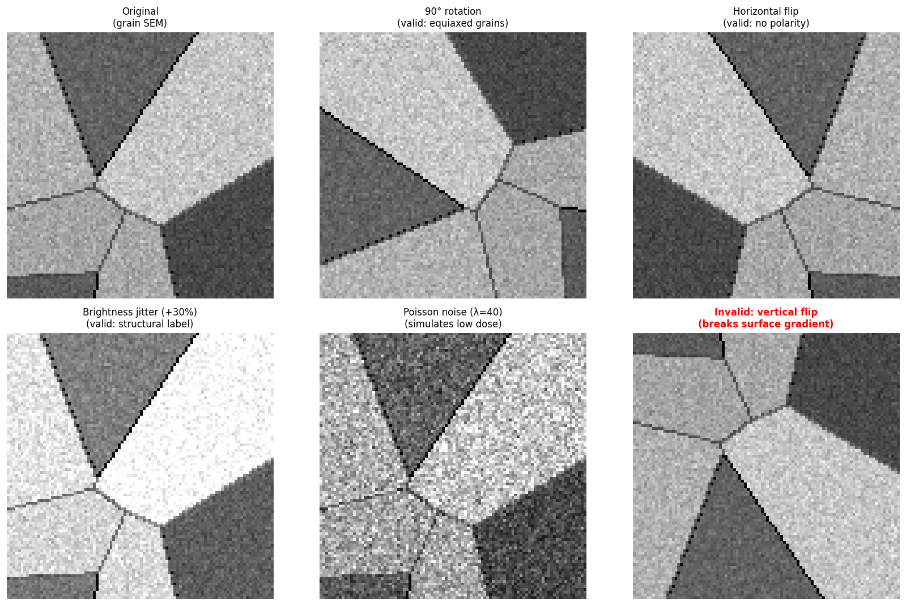
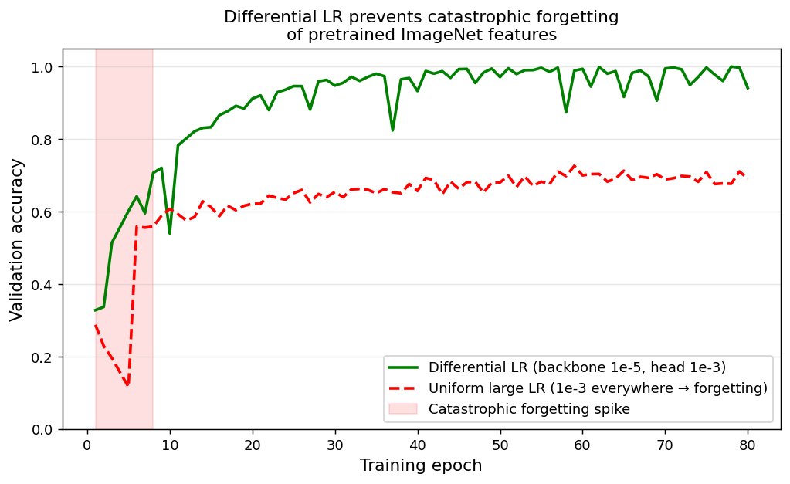
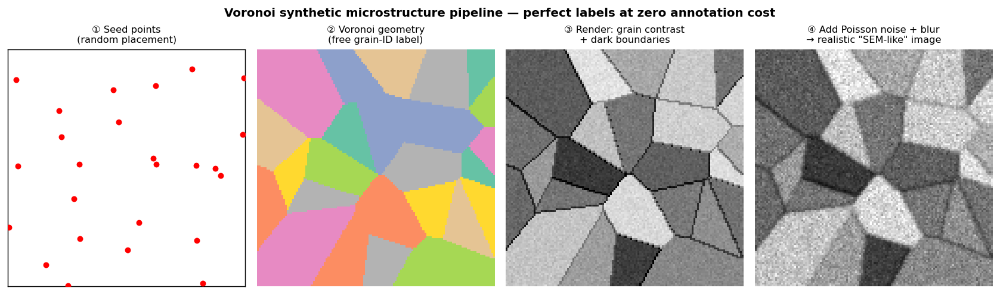
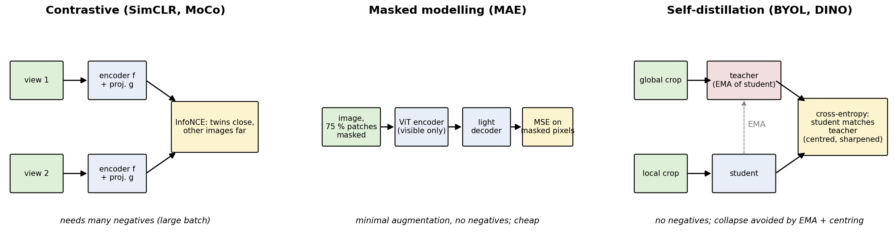
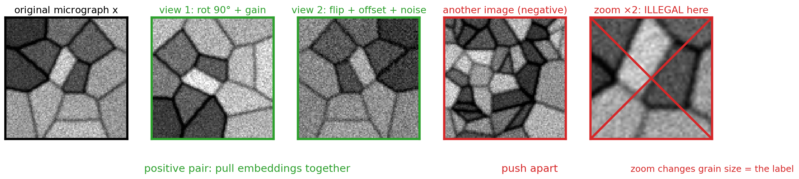
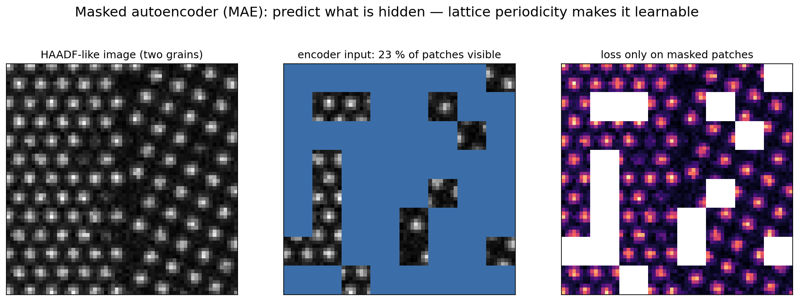
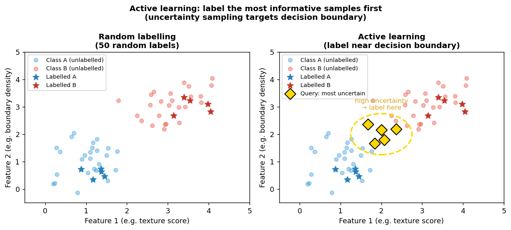

<!-- ===== §0. Recap + roadmap ===== -->

## Recap: Week 7 and today's question

:::: {.incremental}
- **Week 7:** CNNs & U-Nets — convolution, VGG → ResNet, U-Net segmentation (IoU/Dice), Grad-CAM and the shortcut-learning demo.
- A trained CNN is a hierarchical **feature extractor**: the part before the head is a reusable *backbone*.
- **The uncomfortable reality:** our U-Net needed hundreds of labels and still missed faint particles and fired on an unseen scratch.
- **Today's question:** 30 labelled TEM frames, thousands of *unlabelled* ones — how do you train a model that generalises?
::::

:::: {.notes}
- Open by recalling last week's closing slide: "30 labelled TEM images — how do you train a reliable CNN?" Today delivers the toolbox. Last week's two failure cases (missed faint particle, scratch false positive) and the missing rotation equivariance are exactly what augmentation and pretraining address.
- Answer in one line: physics-respecting augmentation, transfer learning, synthetic data — and self-supervised pretraining / foundation models that learn from the unlabelled mountain.
- The one point to land: the strategies are not alternatives — they stack. A real EM pipeline might start with a self-supervised or synthetic backbone, augment extensively, and fine-tune on a few real labels.
- Misconception to preempt: "if CNNs need so many labels, they are useless for EM." Wrong. With today's techniques 20–50 carefully chosen labels are often enough.
- EM anchor: Ti-6Al-4V SEM cross-section: half a day of sectioning, mounting, grinding, polishing, etching; another hour of expert grain segmentation. That is one labelled image. Meanwhile the same microscope can record thousands of unlabelled frames overnight.
- Pacing: 2 minutes. Transition: "Here is the map for today."
::::

## Road map and self-study

:::: {.columns}
:::: {.column width="55%"}
**Road map (≈90 min)**

1. The small-data reality in EM (3 slides)
2. Physics-respecting augmentation (5)
3. Transfer learning & catastrophic forgetting (3)
4. Synthetic data & the sim-to-real gap (3)
5. **Self-supervised learning:** SimCLR, MAE, DINO (9)
6. **Foundation models:** SAM, μSAM (3)
7. **Using embeddings:** probe vs fine-tune, retrieval (3)
8. Active learning & the full workflow (2)
::::
:::: {.column width="45%"}
**Self-study:** `notebooks/week08_embeddings_transfer.ipynb`

- sim-supervised vs **SimCLR** backbone (CPU, no labels)
- PCA maps + **kNN retrieval**, precision@k
- scratch vs **linear probe** vs **LP→fine-tune** vs #labels

[](https://colab.research.google.com/github/ECLIPSE-Lab/public_presentations/blob/main/data_science_for_em/notebooks/week08_embeddings_transfer.ipynb)
::::
::::

:::: {.notes}
- Orientation only — 1 minute. Point out the three anchors: the augmentation legality gate (materials-specific), the sim-to-real story, and the self-supervised/foundation-model block, the part of the field that moved fastest since 2020.
- **Timing plan (90 min):**
  - 0–5: recap, road map, learning outcomes
  - 5–12: §1 small-data reality — labelled-data gap, shortcuts at N≈50, the four strategies
  - 12–24: §2 augmentation — invariances, transform table, illegal cases, weld cold-call, joint transform + split-first
  - 24–31: §3 transfer — why ImageNet transfers, backbone/head decision matrix, catastrophic forgetting
  - 31–38: §4 synthetic data — label→image, Construction Zone case, sim-to-real gap and fixes
  - 38–56: §5 self-supervised learning — unlabelled mountain, families, SimCLR, InfoNCE, augmentations = labels, MAE, DINO, comparison, EM case study
  - 56–62: §6 foundation models — adaptation ladder, SAM, μSAM
  - 62–69: §7 embeddings — probe vs fine-tune, notebook label-efficiency result, retrieval + diagnostics
  - 69–74: §8 active learning loop, 30-frame synthesis
  - 74–84: notebook pointer (2), summary (3), must-know (3), next week (2)
  - 84–90: slack / questions (6 min)
- Backup slides after the "Continue" slide (overfitting curve, label-consistency figure, transfer recipe, sim-to-real failure scenario, workflow diagram, validation) are for questions or self-study.
- Transition: "First, the learning outcomes."
::::

## Learning outcomes

By the end of today you can …

:::: {.incremental}
1. **Explain** why labelled EM data is scarce and how shortcut learning shows up at $N\approx 50$.
2. **Design** an augmentation pipeline justified by physical symmetries — and reject illegal transforms.
3. **Choose** feature extraction, fine-tuning (differential LRs, LP→FT) or training from scratch.
4. **Describe** SimCLR, MAE and DINO, and how each avoids representation collapse.
5. **Evaluate** an embedding with a linear probe, kNN retrieval and specimen-grouped validation.
6. **Assemble** these pieces and active learning into one small-data workflow.
::::

:::: {.notes}
- Outcomes 4 and 5 are exam-relevant: expect to write down the InfoNCE loss and explain what a linear probe measures.
- Transition: "Start with the concrete problem — the materials data bottleneck."
::::

<!-- ===== §1. The small/expensive-data reality ===== -->

## The labelled-data gap: a three-order-of-magnitude problem

![Labelled images per domain: ImageNet 14 M (crowdsourced, seconds each), medical imaging ~10⁴ (radiologists), materials EM 50–500 (hours of expert time each) [@holm2020overview; @sandfeld_materials_data_science].](img/labeled_data_gap.png){width="70%"}

:::: {.notes}
- Walk through the three bars. Materials science sits three orders of magnitude below where ResNet-50 (25 million parameters) was designed to operate.
- The one point to land: the bottleneck is not pixels — a 4D-STEM dataset is hundreds of GB of raw frames. The bottleneck is *expert annotation time*. Raw data is abundant; labelled data is scarce.
- Why labels cost so much (formerly its own slide — say it, don't show it): (1) acquisition cost — rationed beamtime, €3–8 M aberration-corrected TEMs; (2) expert annotation time — hours per SEM image, crystallographic expertise for HAADF defects; (3) reproducibility — a Zeiss and an FEI SEM give different contrast, so pooling silently introduces a *domain shift* (the Week 4 GroupKFold lesson at instrument level); (4) unique specimens — an AM turbine cross-section cannot be re-imaged. They compound.
- Rule of thumb: 50–500 labelled images per task; ResNet-50 at 500 images = 50 000 parameters per image.
- EM anchor: prior-β grain segmentation in titanium: half a day of preparation + one hour of annotation = one labelled image. EELS chemical-state labelling of a defect map takes hours per image.
- Transition: "The consequence for a naive deep-learning approach: overfitting."
::::

## Overfitting at $N\approx 50$: the model learns shortcuts

:::: {.incremental}
- ResNet-50 on 50 images: ~500 000 parameters per image — enough to fit any labelling, including noise.
- **What it memorises instead of microstructure:** detector vignetting, session contrast, the scale-bar corner.
- **Symptom:** a train–val gap (99 % train, 55 % test), not a high training loss.
- **Diagnose:** Grad-CAM (Week 7) lighting up corners or the scale bar; specimen-grouped validation.
- **Hygiene rule:** **split by specimen first, then augment** — the training set only.
::::

:::: {.notes}
- The shortcut-learning framing: the model is not "confused" — it correctly learns the most predictive feature in the training set, which happens to be a spurious correlation.
- The training/validation loss curve (backup slide "Small data → fast overfitting") shows the classic picture: training loss falls monotonically, validation loss turns upward around epoch 40.
- Misconception to preempt: "I can fix overfitting by training longer." No — longer makes it worse. The fixes are more labels, augmentation, transfer, synthetic or self-supervised pretraining: today's topic.
- EM war story: a weld-defect classifier hit 99 % training / 58 % test. Grad-CAM showed it had learned the SEM vignetting pattern that correlated with the imaging session of the good welds. Fix: brightness augmentation + grouped cross-validation.
- Split-first, augment-second: with five specimens × 10 crops, a random 40/10 crop split puts every specimen on both sides and the model learns specimen identity. Right: 3 specimens / 2 specimens, then augment the 30 training crops. Group-based splits give lower and noisier numbers — that honest number beats a leaked one.
- Transition: "Four strategies attack this problem."
::::

## The small-data survival kit: four strategies

:::: {.incremental}
1. **Augmentation:** physically plausible transforms multiply the effective training set.
2. **Transfer learning:** start from a pretrained backbone (ImageNet); adapt only the last layers.
3. **Synthetic data:** simulate images from known structures — perfect labels at zero annotation cost.
4. **Self-supervised pretraining / foundation models:** learn from *unlabelled* in-domain images, or start from DINOv2 / SAM.
- **They stack:** pretrained backbone → augmentation throughout → fine-tune on few real labels.
::::

:::: {.notes}
- Frame the four as independent angles: augmentation makes the most of the data you have; transfer imports features learned elsewhere; synthetic data provides free labels; self-supervision extracts features from unlabelled in-domain data. Together they can reduce the real label count from 500 to 20–50.
- The one point to land: "which one is best" is the wrong question. The exam expects the stacked pipeline, not a menu pick.
- Transition: "Start with augmentation — the cheapest lever."
::::

<!-- ===== §2. Data augmentation ===== -->

## Augmentation: encoding physical invariances

{width="80%"}

**Every augmentation is a claim that the physics has that symmetry.**

:::: {.notes}
- Augmentation is not just multiplying data — it encodes a claim that the physics has a particular invariance. A rotation augmentation says "a grain boundary looks the same at any angle." True for equiaxed grains; false for directionally solidified columnar grains, where orientation is a physical signal.
- The one point to land: "before adding any transform, ask: would this produce a physically plausible image with the same label? If not, it is label noise you injected by hand."
- Misconception to preempt: "more augmentation is always safer." Wrong. A wrong augmentation injects false invariances. Ablate augmentations one at a time if performance is unexpectedly poor.
- Transition: "What each transform encodes, and when it breaks."
::::

## What each transform encodes — and when it is illegal

| Transform | Physical claim / simulates | Illegal when … |
|---|---|---|
| Flip | mirror symmetry | feature has polarity (weld cap vs root, DS column) |
| Rotation | rotational symmetry | orientation is the signal (columnar grains, EBSD) |
| Crop / zoom | translation / scale invariance | grain size or lattice spacing is the label |
| Elastic warp | drift, sample warping | metric labels (size, aspect ratio) |
| Brightness / gamma | session / detector variation | intensity is quantitative (EELS, Z-contrast) |
| Poisson noise, blur | low dose, defocus, drift | rarely — the physically correct noise model |
| Scratches, contamination | preparation artefacts | artefact *is* the target |

:::: {.notes}
- Geometric transforms are claims about symmetries; intensity transforms are generally safer but the physics gate still applies when the label is intensity-calibrated.
- Poisson noise is the materials-literate distinction: generic CV adds Gaussian noise; in EM the correct noise is Poisson — signal-dependent, worst at low dose. A model augmented with realistic Poisson noise transfers to low-dose acquisition. Gaussian noise simulates readout noise and is also fine for structural labels.
- Blur forces the model to rely on topology rather than fine texture — exactly why synthetic grain detectors transfer.
- Synthetic scratches / contamination spots are the fix for last week's scratch false positive: show the network artefacts during training so it learns they are not particles.
- Elastic warp on a grain-size regression task: the labels now refer to distorted grains. Symptom: worse on real images than the training curves predict.
- EM anchor for intensity: a carbon-contamination detector trained with brightness jitter ignores the subtle intensity change that is the only signal of contamination onset.
- Transition: "Three illegal cases you will meet in practice."
::::

## Physically-invalid augmentations: the materials gate

{width="80%"}

:::: {.notes}
- This is the materials-specific key concept of the section — spend time here.
  1. EBSD rotation: the IPF colour IS the crystallographic orientation relative to the sample frame. Rotating the image without the colour key gives a pixel that says "30°" where the crystal is at "120°". A labelling error with perfect data fidelity.
  2. Directional-solidification vertical flip: top and bottom of a DS column differ (segregation, dendrite morphology). A flip swaps them.
  3. EELS jitter: if the label is "42 % Fe", ±20 % intensity jitter teaches a wrong intensity-to-composition map.
  4. Zoom/rescale when grain size or lattice spacing is the label (returns in SSL today).
- The one point to land: augmentation legality is a domain-knowledge decision. Ask a materials scientist, not a CV tutorial.
- Transition: "Apply the gate yourself — a cold-call scenario."
::::

## Augmentation scenario: a laser-welded joint

:::: {.incremental}
- **Scenario:** 50 SEM images of a laser-welded joint, bead running left-to-right. Task: classify weld quality (good/defective).
- **Horizontal flip:** valid — the weld is approximately mirror-symmetric about its centreline.
- **Vertical flip:** invalid — top surface (cap bead, undercut) ≠ root (penetration, lack of fusion).
- **90° rotation:** invalid — bead direction is physically defined (travel direction, gravity during solidification).
- **Brightness jitter, Gaussian noise:** valid — quality is a structural judgement, not an absolute-intensity measurement.
- **The meta-point:** every verdict came from physics, not from a CV default.
::::

:::: {.notes}
- Run as a cold-call: ask for each transform before revealing the verdict and the physical reason.
- A strong exam answer cites the physical reason, not just the verdict: "vertical flip is invalid because the cap differs from the root" passes; "vertical flip is invalid" does not.
- Misconception: "horizontal flip is always safe." Only here because of the symmetry; the rule is task-dependent, not image-dependent.
- Transition: "Now the implementation: one transform for image and mask, and the split order."
::::

## Implementation: joint transforms, on the fly, after the split

```python
import albumentations as A
transform = A.Compose([A.HorizontalFlip(p=0.5), A.RandomRotate90(p=0.5),
                       A.GaussNoise(p=0.3), A.RandomBrightnessContrast(p=0.3)])
out = transform(image=image, mask=mask)   # ONE call: same random draw for both
```

:::: {.incremental}
- **Label consistency:** image and mask get the *same* sampled transform. Two separate calls → misaligned masks, IoU plateaus.
- **On the fly:** a new random transform every batch — the network never sees the same pixels twice.
- **Split by specimen first, then augment the training set only.**
::::

:::: {.notes}
- The classic bug: calling `transform(image=img)` and `transform(image=mask)` separately — two independent random angles. Symptom: training loss looks fine but IoU plateaus. The backup slide "On-the-fly augmentation and label consistency" shows the misaligned-mask picture.
- Each line of the config is a physics claim: `HorizontalFlip` claims mirror symmetry, `RandomBrightnessContrast` claims the label is structural. For the illegal cases two slides back (EBSD, directional solidification) you would remove `HorizontalFlip` / `RandomRotate90`.
- Offline augmentation (pre-generated on disk) gives a fixed set the network eventually memorises; use it only when the transform is expensive (e.g. physics rendering).
- Augmentation leakage: augmenting before splitting puts a rotated copy of a training image in the test set — the test then measures memorisation recall. Write "SPLIT, THEN AUGMENT" on the board.
- Transition: "Augmentation makes the most of the data we have. Transfer learning brings in knowledge from outside."
::::

<!-- ===== §3. Transfer learning ===== -->

## Why ImageNet features transfer to EM images

![Transferability vs CNN depth [@yosinski2014transferable]: edges/gradients (layer 1) transfer almost fully, textures mostly, object parts and task-specific layers barely.](img/feature_transfer_depth.png){width="62%"}

- **Domain gap:** EM is 1-channel, 16-bit, Poisson noise, periodic textures. **Replicate grey → 3 channels**; do not re-initialise the first conv layer.

:::: {.notes}
- Transferability decreases monotonically with depth. Early layers are constrained by natural-image statistics (edges, 1/f spectra) that EM images share; late layers are optimised for dogs, chairs and cars.
- Misconception: "ImageNet has no TEM images — how can it help?" Edge detectors fire at grain boundaries the same way they fire at the edge of a dog's ear.
- The grayscale-to-RGB fix is the #1 silent bug. Re-initialising conv1 discards the most transferable layer. Correct: `img.repeat(1, 3, 1, 1)` or sum the pretrained RGB weights: `w_gray = model.conv1.weight.sum(dim=1, keepdim=True)`.
- Texture mismatch (no Moiré fringes, lattice periodicity or diffraction banding in ImageNet) is what in-domain self-supervised pretraining closes later today.
- Actionable consequence: fine-tuning should be depth-graded — this is where differential LRs and gradual unfreezing come from.
- Transition: "The recipe: backbone plus head."
::::

## Backbone + new head: feature extraction or fine-tuning?

| | Few labels (<100) | More labels (100–1 000) |
|---|---|---|
| **Small domain gap** (optical ↔ photos) | Feature extraction (frozen backbone) | Fine-tuning, differential LRs |
| **Large domain gap** (photos ↔ HAADF) | Feature extraction + BN adaptation | Fine-tuning + gradual unfreezing |

:::: {.incremental}
- **Keep the backbone, replace the head** — the 1000-class ImageNet head is discarded, never "fine-tuned".
- **BatchNorm trap:** a frozen backbone in `eval()` uses ImageNet statistics → mis-normalised micrographs.
::::

:::: {.notes}
- Backbone = pretrained feature extractor (e.g. ResNet-50's [@he2016resnet] 2048-D representation). Head = randomly initialised task-specific map to your classes or scalar. Output dimension and semantics of the old head are both wrong.
- For segmentation the U-Net encoder IS the backbone; the decoder plays the role of the head.
- Zero real labels: synthetic pretraining → head, or synthetic pretraining → fine-tune.
- Feature extraction minimises overfitting risk but may underfit at a large domain gap; fine-tuning adapts features but risks catastrophic forgetting at small N.
- BN trap symptom: feature extraction is mysteriously poor. Fix: keep BN layers in `train()` mode (or re-estimate statistics) even when weights are frozen; typically recovers 5–15 percentage points.
- When in doubt, start with feature extraction; add fine-tuning once the head has converged.
- Transition: "Why fine-tuning needs different learning rates."
::::

## Catastrophic forgetting and differential learning rates

{width="58%"}

:::: {.incremental}
- A random head sends large random gradients into the pretrained backbone and overwrites it.
- **Fix:** $\eta_\text{backbone}\approx 10^{-5}\ll\eta_\text{head}\approx 10^{-3}$; unfreeze gradually top-down; or LP→FT.
::::

:::: {.notes}
- The mechanism is the exam concept: catastrophic forgetting is "a step size too large relative to the distance to a good minimum." The backbone sits in a good basin; the head is far from any minimum.
- Recipe (backup slide "The transfer learning recipe"): stage 1 freeze everything, train the head at 1e-3; stage 2 unfreeze the last block at 1e-5; stage 3 continue unfreezing top-down with depth-graded LRs. Deepest (most task-specific) layers adapt first; earliest (most general) are preserved longest — the Yosinski curve made operational.
- LP→FT (later today): initialise the head from a linear probe so it never sends random gradients.
- Misconception: "just use one small LR for everything." Then the head never learns. The fix is asymmetric rates.
- Symptom: loss spike at the start of fine-tuning, or final accuracy worse than feature extraction.
- Notebook: set backbone and head to the same LR and watch the spike; the fix is two parameter groups in Adam.
- Transition: "Transfer gives pretrained features. Synthetic data gives free labels."
::::

<!-- ===== §4. Synthetic data ===== -->

## Synthetic data: free perfect labels by construction

:::: {.columns}
:::: {.column width="45%"}
:::: {.incremental}
- **Flip the arrow:** choose the label (structure) → render the image. The label is *perfect by construction*.
- Voronoi grains, phase field, multislice TEM [@rakowski2024construction]: 10 000 images in minutes.
- **Caution:** it fails on whatever the generator omits — Voronoi makes no twins.
::::
::::
:::: {.column width="55%"}
{width="100%"}
::::
::::

:::: {.notes}
- The labelling-arrow flip: standard annotation is image → label (human provides); synthetic is label → image (renderer provides). The label is an input, not an inference.
- Synthetic data converts the labelling problem into a modelling problem — the model is only as good as the generator's physics.
- Walk the Voronoi panels: scatter seeds; assign each pixel to its nearest seed (grain ID known = free mask); random intensity per grain + dark boundaries; Poisson noise and defocus blur. A 30-line NumPy job; it is in the notebook.
- Caveat: Voronoi gives convex, roughly equiaxed grains with ~120° triple junctions — no annealing twins, no non-convex or columnar grains. The generator's omissions become the model's blind spots: not a tuning problem but an epistemic one.
- Transition: "Can purely synthetic training beat real labels? One case study."
::::

## Purely synthetic can beat real-trained: Construction Zone

:::: {.columns}
:::: {.column width="48%"}
U-Net trained **only on simulated HRTEM**, tested on **real** nanoparticles [@rakowski2024construction]:

| Benchmark | Synthetic F1 | Prev. best (real) |
|---|---:|---:|
| Au, 5 nm | **0.92** | 0.89 |
| Au, 2.2 nm | **0.86** | 0.75 |
| CdSe, 2 nm | **0.75** | 0.59 |

**Simulate the right variation, not more structures.**
::::
:::: {.column width="52%"}
![Synthetic-trained U-Net on real HRTEM Au nanoparticles; rows: weak → strong database curation. From Rakowski et al. 2024 [@rakowski2024construction].](img/construction_zone_segmentation.png){width="78%"}
::::
::::

:::: {.notes}
- Construction Zone (Rakowski et al., npj Comput. Mater. 2024): random Au nanoparticles on carbon, multislice with thermal effects, aberrations, plasmon losses and Poisson dose noise → masks by construction. Zero experimental training images.
- Say the numbers, then the surprise: it beats models trained on annotated experimental data, especially in the data-scarce small-particle and CdSe cases.
- The twist: ablations showed a few atomic structures sufficed; what moved F1 was simulation fidelity (frozen phonons, residual aberrations, plasmons) and diversity of imaging conditions (defocus, dose, substrate thickness).
- This is the synthetic analogue of the augmentation lesson: the nuisance variation you inject makes the model robust. Our notebook uses the same idea (domain randomisation of blur and dose).
- Anti-pattern: a huge structure library at one defocus / one dose → perfect synthetic F1, collapse on real images. Diagnostic: hold out real images from epoch 0 and watch the gap.
- Transition: "When does synthetic transfer, and what do we do when it doesn't?"
::::

## When synthetic transfers — and closing the sim-to-real gap

:::: {.incremental}
- **It transfers** when the generator captures the task-relevant invariant (grain topology: continuous boundaries, ~120° junctions) and spans the nuisance distribution (dose, defocus, aberrations).
- **It fails** on what the generator omits: twins, charging streaks, sub-grain contrast.
- **Close the gap, boring solutions first:**
  1. measured noise model (Poisson gain, readout σ) in the renderer
  2. augmentation in the rendering pipeline
  3. fine-tune on 10–20 real labels
  4. only then CycleGAN / adversarial domain adaptation
::::

:::: {.notes}
- Reconciliation of "synthetic fails on what the generator omits" and "a Voronoi-trained U-Net works on real SEM": both are true. For grain-boundary detection the task reduces to "find the dark narrow strip between two regions", which Voronoi captures. Grain size, triple-junction statistics, grain shape: work. Twin identification, specific texture components: do not.
- The sim-to-real figure (backup) shows clean synthetic vs real SEM with scan distortion, vignette and contrast drift — topology still correctly found.
- Failure scenario (backup): 96 % on synthetic, 61 % on real triple junctions — causes: geometry gap (rolled, elongated grains), missing artefacts (charging, contamination spots), contrast gap (channelling sub-structure), synthetic-style shortcut (Voronoi boundary width). "More synthetic data" does not help: more of a distribution that omits real artefacts still omits them.
- CycleGAN paints the real "texture skin" onto synthetic geometry while keeping the mask; adversarial DA makes features indistinguishable between domains. Both are unstable and only worth it with truly zero real labels.
- War story: a team spent a month on a CycleGAN; a colleague matched it in an afternoon by fitting a Poisson + Gaussian noise model to a flat-field image and fine-tuning on 20 real images.
- Transition: "Every fix so far needed labels or a physics generator. The fourth strategy needs neither."
::::

<!-- ===== §5. Self-supervised learning ===== -->

## The unlabelled mountain: learning without labels

:::: {.incremental}
- **Asymmetry:** a 4D-STEM scan has $10^5$–$10^6$ patterns; CEM500k holds ~500 000 unlabelled EM images [@conrad2021cem500k].
- **Self-supervised learning (SSL):** a *pretext task* whose labels come from the data itself trains a backbone; reuse it downstream.
- **Goal:** an embedding $\mathbf{h}=f_\theta(\mathbf{x})$ where physically similar micrographs are close — so a few labels suffice.
- **vs ImageNet transfer:** SSL pretrains *in-domain* — your detector, noise and contrast.
::::

:::: {.notes}
- Classic pretext tasks: denoising (Week 9 autoencoders), predicting rotations, jigsaws, colourisation. Modern winners fall into three families: contrastive (SimCLR), masked modelling (MAE), self-distillation (DINO).
- SSL converts the labelling problem into a pretext-design problem. Pretraining and labelling are decoupled: pretrain once on everything, label a little per downstream task.
- Misconception: "self-supervised = unsupervised clustering." No — SSL trains with a supervised-looking loss on manufactured labels. Clustering and latent spaces are next week.
- EM anchor: CEM500k (Conrad & Narayan 2021) — pretraining on a large unlabelled cellular-EM corpus gave better, more robust segmentation backbones than ImageNet.
- Transition: "The three families at a glance."
::::

## Three families of self-supervised learning

{width="100%"}

**Common enemy: representation collapse** — every input mapped to the same vector.

:::: {.notes}
- Walk left to right. Contrastive: "which of these is my twin?" Masked modelling: "fill in what is hidden." Self-distillation: "agree with a slowly moving copy of yourself on a different crop."
- Collapse trivially satisfies "views should agree". Remedies: negatives (contrastive), a reconstruction target (MAE), EMA teacher + centring/sharpening (DINO).
- Transition: "Contrastive learning in detail — you implement it in the notebook."
::::

## Contrastive learning: SimCLR

:::: {.columns}
:::: {.column width="55%"}
:::: {.incremental}
1. Batch of $N$ micrographs, **two random augmentations** each → $2N$ views.
2. Encoder $f$ → $\mathbf{h}$; projector MLP $g$ → $\mathbf{z}=g(\mathbf{h})$.
3. For view $i$, its twin $j$ is the **positive**; the other $2N-2$ are **negatives**.
4. Minimise NT-Xent (InfoNCE); then **discard $g$, keep $f$**.
::::
::::
:::: {.column width="45%"}
![SimCLR: two augmentations of $x$, shared encoder $f$, projector $g$. Only $f$ is kept. Chen et al. 2020, Fig. 2 [@chen2020simclr].](img/simclr_framework_fig2.png){width="100%"}
::::
::::

:::: {.notes}
- The projector matters: a loss directly on $\mathbf{h}$ forces the encoder to discard everything the augmentations vary. With $g$, the projector discards it while $f$ keeps a richer representation — downstream tasks use $\mathbf{h}$, not $\mathbf{z}$.
- SimCLR needs many negatives: the original used batches of 4096. MoCo keeps a queue of negatives to decouple them from batch size.
- Notebook: batch 128, a 14 k-parameter CNN — enough to see the effect on CPU in about a minute.
- Transition: "The loss, written out."
::::

## The InfoNCE / NT-Xent loss

For a positive pair $(i,j)$ among $2N$ views, cosine similarity $\mathrm{sim}(\mathbf{u},\mathbf{v})=\mathbf{u}^\top\mathbf{v}/(\|\mathbf{u}\|\|\mathbf{v}\|)$, temperature $\tau$:

$$
\ell_{i,j} = -\log \frac{\exp\!\big(\mathrm{sim}(\mathbf{z}_i,\mathbf{z}_j)/\tau\big)}{\sum_{k\neq i}\exp\!\big(\mathrm{sim}(\mathbf{z}_i,\mathbf{z}_k)/\tau\big)}
$$

:::: {.incremental}
- **A $(2N-1)$-way softmax classification** whose "correct class" is the twin.
- **Chance level** $\log(2N-1)$ (≈ 5.5 for $N=128$) — a sanity line on the training curve.
- **Temperature $\tau$** (0.1–0.5): small $\tau$ focuses on the hardest negatives.
- **Negatives prevent collapse:** identical $\mathbf{z}$ keep the loss at chance.
::::

:::: {.notes}
- Derive on the board: numerator = positive logit; denominator = positive plus all negatives. Exactly `F.cross_entropy(sim / tau, target)` with the diagonal masked — the 6-line implementation in the notebook. Same loss as Week 6 classification, with manufactured labels.
- Collapse: if all $\mathbf{z}$ were identical, the denominator would be the numerator times $2N-1$ — loss stuck at $\log(2N-1)$.
- Large $\tau$ treats all negatives alike; small $\tau$ gives tight clusters but is less stable.
- Materials caveat: negatives are just other images in the batch. Two crops of the same specimen are *false negatives* and get pushed apart — sample batches across specimens.
- Transition: "The most important design decision is not the loss — it is the augmentation set."
::::

## Augmentations are the labels: the physics gate returns

{width="85%"}

- The embedding becomes **invariant to exactly the augmentations you use**. Natural-image defaults (random-resized crop, colour jitter) are often wrong for EM.

:::: {.notes}
- In SSL the augmentations are the *only* supervision. A wrong augmentation in supervised training adds label noise; a wrong augmentation in SSL deletes the information from the representation.
- Scale is physical (grain size, lattice spacing), intensity can be quantitative (Z-contrast, EELS), orientation can be the label (EBSD, texture).
- The zoom example is a notebook "try this yourself": add a random zoom to SimCLR and watch the linear-probe accuracy for grain-size classes drop.
- EM anchors: 4D-STEM — rotations fine only if orientation does not matter; pattern-centre shifts (descan) are a nuisance and should be augmented. HAADF — a small lattice-spacing change is strain; scale augmentation erases it.
- Transition: "A different idea that needs almost no augmentation design: masking."
::::

## Masked image modelling: MAE

:::: {.columns}
:::: {.column width="50%"}
:::: {.incremental}
- **Mask ~75 %** of patches, encode the visible 25 % with a ViT, reconstruct the rest; MSE on masked patches [@he2022mae].
- High ratio → the model must learn structure, not interpolate.
- No negatives, minimal augmentation; encoder skips masked tokens (cheap).
- Frozen features weaker; MAE shines after **fine-tuning**.
::::
::::
:::: {.column width="50%"}
{width="100%"}
::::
::::

:::: {.notes}
- MAE is the vision analogue of BERT; patches are tokens (transformers in Week 10). About 3–4× faster pretraining because masked tokens are never encoded.
- Why it suits EM: crystalline images are redundant — predicting a hidden patch requires knowing the lattice, its orientation and the grain boundary. Defects are where prediction fails, so masked-reconstruction error doubles as an anomaly detector.
- MAE features encode low-level pixel detail: a linear probe underperforms contrastive/DINO, but after fine-tuning MAE is among the best. Matters when choosing a protocol later.
- Collapse is avoided by the reconstruction target itself.
- Transition: "The third family drops negatives *and* reconstruction."
::::

## Self-distillation: DINO and DINOv2

:::: {.incremental}
- **Student–teacher:** different crops (global + local); the student matches the teacher's output distribution [@caron2021dino].
- **Teacher = EMA of the student** — no gradients, a stable target (from BYOL [@grill2020byol]).
- **No negatives:** collapse avoided by *centring* and *sharpening* of teacher outputs.
- **DINOv2** [@oquab2023dinov2]: + masked-token objective, 142 M curated images. Frozen DINOv2 + linear probe = strongest *generic* baseline.
::::

:::: {.notes}
- Two networks agreeing with each other could trivially output a constant. Centring (subtract a running mean) prevents one dimension dominating; sharpening (low teacher temperature) prevents the uniform distribution.
- Local-to-global crops teach that a small patch "belongs" to the whole — DINO ViT attention maps segment objects without labels.
- For EM: DINOv2 backbones are the default starting point for "embed my micrograph archive"; ML-PC Unit 10 fine-tunes a DINOv2 ViT for in-situ AM quality control.
- Caution: multi-crop contains a scale assumption — the zoom problem again for grain-size tasks.
- Transition: "Side by side."
::::

## SimCLR vs MAE vs DINO — what to use for EM?

| | SimCLR | MAE | DINO / DINOv2 |
|---|---|---|---|
| Signal | twin among negatives | reconstruct hidden patches | match EMA teacher |
| Collapse prevention | negatives | reconstruction target | EMA + centring + sharpening |
| Augmentation design | **critical** | minimal | important (multi-crop) |
| Frozen features | good | weaker | **best** |
| After fine-tuning | good | **very good** | very good |

:::: {.notes}
- Rule of thumb for 2026: (1) try frozen DINOv2 features first; (2) for modalities far from natural images (diffraction, spectra) with a large unlabelled corpus, pretrain in-domain with MAE (cheap: the encoder sees 25 %); (3) use SimCLR when you can articulate the invariances precisely and want a small CNN (needs large batches).
- I-JEPA (predict *features* of masked regions) is the direction the field is moving.
- Transition: "Has any of this been done on EM data?"
::::

## Self-supervised pretraining on EM data

:::: {.columns}
:::: {.column width="46%"}
:::: {.incremental}
- **Kazimi et al. 2024** [@kazimi2024ssl]: pretrain on unlabelled CEM500k, fine-tune for segmentation, denoising, super-resolution.
- *Smaller pretrained models beat larger random-init ones*; biggest gains with few labels.
- Take-away: *pretrain on the unlabelled mountain you already have.*
::::
::::
:::: {.column width="54%"}
![Self-supervised pretraining on CEM500k, then fine-tuning on task data. From Kazimi, Ruzaeva & Sandfeld 2024 [@kazimi2024ssl].](img/emssl_fig1_pipeline.png){width="100%"}
::::
::::

:::: {.notes}
- The pretext here is adversarial denoising (a generator denoises, a discriminator judges real vs fake) — neither SimCLR nor MAE. The family matters less than the principle: in-domain pretraining on unlabelled EM data. CEM500k itself showed in-domain SSL beats ImageNet on EM segmentation benchmarks.
- "Smaller pretrained beats larger random": at small N, initialisation, not capacity, is the bottleneck — the empirical version of today's overfitting argument.
- Honest caveat: most published EM-SSL work is on biological EM. Materials-EM corpora of comparable size are only now appearing — an open opportunity for MSc/PhD projects.
- Transition: "Scale this up and you get foundation models."
::::

<!-- ===== §6. Foundation models for microscopy ===== -->

## Foundation models: pretrain once, adapt everywhere

:::: {.incremental}
- **Definition:** a large model pretrained on broad data, adapted by prompting, probing or fine-tuning — DINOv2, CLIP [@radford2021clip], SAM.
- **Adaptation ladder:** zero-shot / prompt → frozen features + probe / kNN → fine-tune last blocks → full fine-tune.
- **For EM:** natural-image models know edges, not diffraction physics — zero-shot is often mediocre; light in-domain fine-tuning closes most of the gap.
::::

:::: {.notes}
- CLIP: image–text embeddings, zero-shot classification by text prompts. SAM: promptable segmentation.
- Paradigm shift: instead of a model per task from scratch, start from a foundation backbone and spend the labelling budget on adaptation. Frozen features need one forward pass per image — laptop-feasible.
- "Foundation model" is not a quality guarantee; its fit to *your* modality must be measured (linear probe, retrieval — later today).
- Transition: "The foundation model most relevant to microscopists: Segment Anything."
::::

## Segment Anything (SAM): promptable segmentation

:::: {.incremental}
- **SAM** [@kirillov2023sam]: heavy ViT encoder (**once per image**) + prompt encoder + light mask decoder (**per click**, milliseconds).
- **Promptable:** click a particle or box a grain → mask; trained on 11 M images, 1.1 B masks.
- **Zero-shot on EM:** fine for particles and voids; weak on thin boundaries, low-dose noise, lattices.
- **Real value:** an **annotation accelerator** — clicks instead of polygons, then train your own small model.
::::

:::: {.notes}
- The encoder is MAE-pretrained; SA-1B was collected with a model-in-the-loop data engine. "Segment everything" mode tiles point prompts over the image.
- The encoder/decoder split is what makes interactive use feasible.
- Connect to active learning: SAM turns an hour of polygon annotation into a few minutes of clicking and correcting — it changes the cost side of the labelling equation.
- Misconception: "SAM understands microscopy." It segments things that look like objects in natural photos; a low-contrast grain-boundary network or an atom-column lattice is not object-like.
- Transition: "What happens when you fine-tune it on microscopy?"
::::

## μSAM: Segment Anything for Microscopy

![μSAM: napari plugin for interactive and automatic segmentation, correction and fine-tuning; default vs microscopy-fine-tuned results for light (top) and electron (bottom) micrographs. Archit et al., *Nature Methods* [@archit2025usam].](img/usam_fig1_overview.png){width="78%"}

**Report zero-shot and fine-tuned results side by side.**

:::: {.notes}
- μSAM fine-tunes SAM on diverse light and electron microscopy data and ships generalist EM/LM models plus a napari tool for the annotate → correct → fine-tune loop.
- Finding: zero-shot SAM is mediocre on EM; fine-tuned generalist models are clearly better and cut annotation time; fine-tuning further on your own data helps again.
- Anti-pattern: never report zero-shot SAM numbers as "the method's" performance, nor fine-tuned numbers without the zero-shot baseline.
- Materials note: published EM models are mostly biological EM. For nanoparticles or grains, expect to fine-tune on a few of your own images — today's small-data setting.
- Transition: "Whatever backbone you choose — SimCLR, DINOv2, μSAM encoder — how do you use and evaluate its embeddings?"
::::

<!-- ===== §7. Using embeddings ===== -->

## Linear probe vs fine-tune vs from scratch

| Protocol | What is trained | Use when |
|---|---|---|
| **Linear probe (LP)** | logistic regression on frozen $\mathbf{h}$ | very few labels (≲ 50); *measuring* embedding quality |
| **Fine-tune (FT)** | backbone (small $\eta$) + head | more labels, larger domain gap |
| **LP → FT** | head from LP, then FT with small $\eta$ | default fine-tuning recipe |
| **From scratch** | everything, random init | many labels, no relevant backbone |

:::: {.incremental}
- The probe is a **classifier** *and* a **measurement**: is the information linearly present?
- LP→FT avoids random-head gradients distorting the backbone [@kumar2022finetuning]. **State protocol and $N$; compare to random init.**
::::

:::: {.notes}
- This is transfer learning revisited in embedding language: feature extraction = linear probe; fine-tuning with differential LRs = FT; gradual unfreezing and LP→FT answer the same catastrophic-forgetting problem.
- kNN on embeddings trains nothing — used for retrieval and sanity checks (next slides).
- Kumar et al. (ICLR 2022): full fine-tuning can underperform linear probing out of distribution because it distorts features; LP-FT gets the best of both. For EM, "out of distribution" = the next specimen, session or microscope.
- Always report "85 % (LP-FT, N = 300, grouped split)". A number without protocol is uninterpretable, and without a random-init baseline you don't know what pretraining bought.
- Transition: "What this looks like in the notebook."
::::

## Notebook result: label efficiency of the protocols

{width="60%"}

:::: {.notes}
- Setup: 32×32 synthetic micrographs, 2 random draws per N; SimCLR trained on 1 500 unlabelled "real" images; plot by `img/make_figures.py`.
- Read the curves: at N = 9 the sim-supervised probe (0.68) beats from scratch (0.56) — the simulator task needs exactly the feature the real task needs. From scratch plateaus around 0.6–0.67. LP→FT gains nothing over its probe at N = 9 (0.58 vs 0.57) but is best at N = 300 (0.85).
- SimCLR never saw a label yet overtakes the sim-supervised probe at N = 300 (0.82 vs 0.80).
- Random-init probe above chance: conv + pooling is itself an inductive bias.
- Honesty note: tiny task, two draws per N — trends, not benchmarks.
- Transition: "The second use of embeddings: retrieval — and checking the embedding before trusting it."
::::

## Embedding retrieval and diagnostics

:::: {.incremental}
- **Retrieval:** L2-normalise $\mathbf{h}_n$, rank by cosine similarity, score with **precision@k**. Notebook, $k=5$ (chance 0.33): random 0.51 · SimCLR 0.67 · sim-supervised 0.72.
- **Uses:** find similar micrographs · de-duplicate before splitting · pick diverse images to label · flag OOD frames.
- **Diagnose:** linear probe vs random-init; inspect neighbours; colour the 2-D map by **nuisance** (session, detector).
- **A pretty 2-D map is not evidence — trust the probe.**
::::

:::: {.notes}
- Recipe: embed the archive once; for a query return the top-$k$ by $\hat{\mathbf{h}}_q^\top\hat{\mathbf{h}}_n$ (exact for 10⁵ images; approximate nearest-neighbour indices beyond). Precision@k = fraction of the $k$ neighbours sharing the query's label.
- What "similar" means is set by the pretraining: SimCLR with rotation augmentation retrieves grains at any orientation; an ImageNet embedding may retrieve by brightness or scale bar.
- Leakage use: near-duplicate crops of one specimen in train and test inflate every metric (Week 4); nearest-neighbour search finds them. OOD use previews Week 11: distance to the nearest training embedding is a simple OOD score.
- Colour-by-nuisance is the embedding version of Week 7's shortcut demo: if points cluster by session, the embedding encodes the instrument, not the material. "Pretty t-SNE, dead downstream" — Week 9 covers how latent maps mislead.
- The random-init baseline: a random CNN already gets 0.51 precision@5 — only the improvement over that is due to pretraining. Also compare against hand-crafted Week 5 descriptors.
- When foundation embeddings fail: diffraction patterns, spectra, atom-resolved lattices; labels defined by a scale or intensity the pretraining made invariant → pretrain in-domain or fine-tune.
- Transition: "One more lever — spend the labels you do buy wisely."
::::

<!-- ===== §8. Active learning and synthesis ===== -->

## Active learning: label the most informative samples

:::: {.columns}
:::: {.column width="50%"}
:::: {.incremental}
1. **Seed** with 10–20 random labels (cold start).
2. **Score** all unlabelled images by uncertainty.
3. **Query** the most uncertain *and diverse* ones.
4. **Retrain**, repeat.
::::
::::
:::: {.column width="50%"}
{width="100%"}
::::
::::

:::: {.notes}
- Active learning fits when labels, not images, are the bottleneck — exactly materials EM.
- Uncertainty sampling: highest entropy / smallest margin. Diversity sampling: points unlike the labelled set. Best practice combines both.
- Cold-start warning: with no labels, uncertainty is meaningless — seed randomly first. Batch-diversity trap: pure uncertainty in batches picks a tight cluster of near-identical hard cases.
- 50 well-chosen labels can beat 500 random ones — not guaranteed; a high-leverage tool, not a free lunch.
- EM anchor: 500 diffraction patterns from an automated TEM session, budget for 30 expert labels: run the model, label the 30 least confident, retrain, repeat. Combined with SAM-assisted annotation, clicks replace polygons.
- The full workflow diagram is on a backup slide.
- Transition: "Put it all together."
::::

## Putting it all together: 30 labelled TEM frames, 5 000 unlabelled

:::: {.incremental}
0. **Split first** by specimen/session; de-duplicate with retrieval.
1. **Backbone:** frozen DINOv2 / μSAM encoder, SSL on the 5 000 frames, or synthetic pretraining.
2. **Diagnose:** neighbours, precision@k, nuisance-coloured map; probe vs random init.
3. **Adapt:** linear probe first; LP→FT with differential LRs only if it beats the probe. Augment with the physics gate.
4. **Spend labels wisely:** SAM-assisted annotation + active learning; repeat 3–4.
5. **Report honestly:** held-out specimens, protocol and $N$ stated.
::::

:::: {.notes}
- This is the synthesis of the lecture — every step maps to a section of today.
- The U-Net and CNN architectures from Week 7 are unchanged. What changed is *how we initialise and train* them.
- Validation hygiene overrides everything: a perfect pipeline with a leaky split produces a confidently wrong model. GroupKFold by specimen is the difference between a publishable number and a lie.
- Miniproject template: students with their own EM data should follow exactly these steps.
- Transition: "The notebook."
::::

## Self-study notebook

:::: {.columns}
:::: {.column width="60%"}
**`notebooks/week08_embeddings_transfer.ipynb`**

1. Three data roles: labelled simulator, unlabelled "real" pool, few real labels + test set
2. Backbone A: supervised on the Voronoi simulator
3. Backbone B: **SimCLR from scratch** — NT-Xent in 6 lines, no zoom
4. PCA maps + **kNN retrieval**, precision@k
5. **Scratch vs linear probe vs LP→FT** for N = 9…300
::::
:::: {.column width="40%"}
[](https://colab.research.google.com/github/ECLIPSE-Lab/public_presentations/blob/main/data_science_for_em/notebooks/week08_embeddings_transfer.ipynb)

- CPU only, a few minutes.
- Try: zoom augmentation in SimCLR; naive FT vs LP→FT.
::::
::::

:::: {.notes}
- Numbers: precision@5 random 0.51 · SimCLR 0.67 · sim 0.72; at N = 300 scratch 0.62 · SimCLR probe 0.82 · LP→FT 0.85. Optional section 6: frozen ImageNet ResNet-18 features (off by default). No downloads.
- Stress the zoom "try this yourself": students see with their own eyes that the wrong augmentation deletes the information they need.
- The label-efficiency plot comes from this notebook (same code and seed); `img/make_figures.py` redraws it.
- Transition: "Summary."
::::

## Summary: the week in six points

:::: {.incremental}
1. **Labels, not pixels, are the bottleneck;** at $N\approx 50$ networks memorise shortcuts — grouped validation, split first.
2. **Augmentation encodes physical invariances;** illegal transforms inject label noise or erase the signal.
3. **Transfer = backbone + new head;** differential LRs, gradual unfreezing or LP→FT against catastrophic forgetting.
4. **Synthetic data** transfers when the generator captures the task invariant and spans the nuisance variation.
5. **SSL** pretrains on the unlabelled mountain (SimCLR, MAE, DINO); foundation models (DINOv2, SAM/μSAM) need in-domain adaptation.
6. **Evaluate embeddings** with probe, precision@k and nuisance-coloured maps, against random init.
::::

:::: {.notes}
- Read out loud; ask students to name, for each point, the slide or notebook cell that demonstrated it.
- Illegal examples to recall: EBSD rotation, DS flip, EELS intensity, zoom for size tasks. SimCLR = InfoNCE, augmentations are the labels; MAE = mask 75 %, reconstruct; DINO = EMA teacher, no negatives.
- Transition: "The must-know list for the exam."
::::

## Must-know for the exam

:::: {.incremental}
- $N\approx 50$ + $10^7$ parameters overfits; train–val gap, Grad-CAM; **split by specimen first, then augment**.
- Augmentation legality: justify by physical symmetry; name an illegal case and why.
- Feature extraction vs fine-tuning (labels × domain gap); $\eta_\text{backbone}\ll\eta_\text{head}$; catastrophic forgetting.
- InfoNCE: positives, negatives, temperature, chance level $\log(2N-1)$.
- Collapse remedies: negatives (SimCLR), reconstruction (MAE), EMA + centring/sharpening (DINO).
- Linear probe vs LP→FT vs scratch; kNN retrieval with cosine similarity and precision@k.
::::

:::: {.notes}
- These mirror the written must-know list for Week 8 in the course exam document. The InfoNCE formula is on the InfoNCE slide: $\ell_{i,j}=-\log\frac{\exp(\mathrm{sim}(\mathbf{z}_i,\mathbf{z}_j)/\tau)}{\sum_{k\neq i}\exp(\mathrm{sim}(\mathbf{z}_i,\mathbf{z}_k)/\tau)}$.
- Also on the written list: synthetic data transfer conditions, SAM/μSAM zero-shot vs fine-tuned reporting, embedding retrieval uses.
- Typical exam questions: design the augmentation set for a given EM task and justify it; write the InfoNCE loss and explain $\tau$; interpret a label-efficiency plot; explain why zero-shot SAM numbers on EM data are not the method's performance.
::::

## Next week: unsupervised learning, autoencoders & latent spaces

:::: {.incremental}
- **Today:** representations *for* a downstream label. **Next:** structure when there is *no* label — phases in a spectrum image, patterns in 4D-STEM.
- **Clustering:** k-means and Gaussian mixtures (EM algorithm).
- **Autoencoders & VAEs:** the reconstruction family — denoising AEs, ELBO, reparameterisation, rVAE.
- **Latent maps and how they mislead:** t-SNE/UMAP — today's "pretty map" warning, made precise.
::::

:::: {.notes}
- Close the loop: MAE from today is an autoencoder with masking; next week starts from plain autoencoders and adds the probabilistic view (VAE).
- The one point to land: an embedding is only as meaningful as the objective that shaped it — next week, embeddings shaped by reconstruction and likelihood instead of downstream labels.
- Transition to the notebook: "Work through the notebook before Week 9 — especially the zoom-augmentation experiment."
::::

<!-- BEGIN prev-next -->

## Continue

- &larr; Previous: [Unit 07 &mdash; CNNs & U-Nets for microscopy](../07_cnns_for_microscopy/01_intro.html)
- &rarr; Next: [Unit 09 &mdash; Unsupervised learning, autoencoders & latent spaces](../09_unsupervised_latent/01_intro.html)
- [All courses](../../index.html)

<!-- END prev-next -->

## Backup slides {visibility="uncounted"}

Material cut from the lecture path for time — for questions and self-study.

## Small data → fast overfitting {visibility="uncounted"}

{width="68%"}

:::: {.notes}
- Walk through the two curves: the model memorises 50 images in 40 epochs; validation loss then diverges as it fits per-image noise — detector vignetting, brightness drift, instrument-specific contrast.
- The symptom is the train–val gap, not training loss. Training longer makes it worse.
::::

## On-the-fly augmentation and label consistency {visibility="uncounted"}

{width="80%"}

:::: {.notes}
- On-the-fly: a new random transform per batch — near-infinite effective dataset from 50 images. Offline: a fixed augmented set the network eventually memorises; only for expensive transforms.
- Split by specimen first, then augment the training set only.
::::

## The transfer learning recipe: freeze → head → fine-tune {visibility="uncounted"}

{width="88%"}

:::: {.notes}
- Head first, then top block, then deeper: the Yosinski depth curve made operational. Deepest layers are most domain-specific and adapt first; earliest layers are most general and are preserved longest.
::::

## The sim-to-real gap {visibility="uncounted"}

{width="85%"}

:::: {.notes}
- The gap is statistical: contrast, noise, spatial-frequency content and scan artefacts differ between generator and instrument. For grain topology the prediction survives; for anything more subtle expect the gap to hurt.
::::

## The sim-to-real gap: a failure scenario {visibility="uncounted"}

:::: {.incremental}
- **Scenario:** a CNN trained on Voronoi images to detect grain triple junctions: 96 % on held-out synthetic data, 61 % on real SEM.
- **Differential diagnosis:**
  1. **Geometry gap:** rolled, elongated real grains vs convex equiaxed Voronoi grains.
  2. **Missing artefacts:** charging streaks, contamination spots that look like triple junctions.
  3. **Contrast gap:** real grains have sub-grain channelling contrast.
  4. **Synthetic-style shortcut:** the model learned Voronoi boundary-width regularities.
- **The fix is not "more synthetic data"** — add realistic rendering + fine-tune on 10–20 real images.
::::

:::: {.notes}
- Distinguish causes experimentally: test on an equiaxed real subset (geometry); mask or simulate artefacts; add grain-interior texture; Grad-CAM for the boundary-width shortcut.
- Callback to Week 4 leakage: the same failure mode (a spurious, perfectly predictive training feature) in a new context.
::::

## The complete small-data EM workflow {visibility="uncounted"}

{width="85%"}

:::: {.notes}
- Self-supervised pretraining plugs into the transfer leg: it replaces the ImageNet backbone by one pretrained on your own unlabelled micrographs.
::::

## Validation in the small-data regime {visibility="uncounted"}

:::: {.incremental}
- **Group by specimen, not by crop:** otherwise the model memorises specimen identity (vignette, brightness baseline, session contrast).
- **Protocol:** `GroupKFold(n_splits=5).split(X, y, groups=specimen_ids)` — the Week 4 lesson.
- **Augmentation leakage:** augmenting before splitting puts rotated copies of training images in the test set. **Split first, then augment.**
- **Honest consequence:** grouped splits give *lower and noisier* numbers — with 5 specimens the test set is 2 specimens. The variance is information.
::::

:::: {.notes}
- With only 50 images, one leaked specimen can inflate accuracy by 15–20 percentage points.
::::

## References

::: {#refs}
:::
