<!-- ===== §0. Recap + roadmap ===== -->

## Recap: Week 8 and today's question

:::: {.incremental}
- **Week 8:** small data — augmentation, transfer, sim-to-real, active labelling and *self-supervised* pre-training (SimCLR, MAE, DINO), judged by linear probe vs fine-tune.
- **The remaining gap:** 10 000 unlabelled EELS spectra or a 4D-STEM scan and *no downstream label at all*. We want phases, anomalies and order parameters directly from the data.
- **Today:** clustering (k-means, GMM/EM), compression (autoencoders), probabilistic latent spaces (VAE, rVAE) — and how to read latent spaces without fooling ourselves.
::::

:::: {.notes}
- Close the loop from Week 8: "last week the pretext task was contrastive (SimCLR) or masked reconstruction (MAE). Today the pretext task is the oldest one: reconstruct your own input through a bottleneck."
- Core insight carried over: a network can learn useful features from a pretext task that needs no labels; labels are only needed for the small head on top.
- MAE is literally a masked *autoencoder* — today's architecture is the ancestor of what they saw last week.
- The linear probe from Week 8 returns today as the quantitative test for "this latent axis means X".
- Concrete payoff to announce: a denoising AE recovers low-dose spectra; a VAE gives a smooth, sampleable latent space; GMM on that latent recovers the four phases with BIC — and a t-SNE sweep shows what a 2-D map can and cannot tell you.
- Pacing: 2 minutes. Key phrase: "the data is the label — we ask it to reconstruct itself."
::::

## Learning outcomes

:::: {.incremental}
1. State k-means (Lloyd, k-means++) and its failure modes on EM data.
2. Derive the E- and M-steps of EM for a GMM; choose $K$ with BIC.
3. Explain linear AE = PCA and why denoising AEs work on low-dose spectra.
4. **Derive the ELBO**, explain reparameterisation and the Gaussian KL, diagnose posterior collapse.
5. Explain how an **rVAE** separates rotation/translation from content.
6. Read t-SNE/UMAP and latent maps critically; build denoise → encode → cluster → map → validate.
::::

:::: {.notes}
- Outcomes 2 and 4 are the mathematical core and are exam-relevant: EM for GMMs and the ELBO derivation.
- Outcome 6 is this week's contribution to the explainability thread: latent-space reading pitfalls (Week 7 did saliency, Week 10 does attention maps).
::::

## Road map and self-study

:::: {.incremental}
- **Road map:** landscape (1) · k-means (2) · GMM & EM (3) · manifold hypothesis & autoencoders (4) · denoising AE, latent space & anomalies (3) · **VAE: ELBO, reparameterisation, β** (6) · **rVAE** (1) · **how latent spaces mislead** (3) · **4D-STEM/EELS latent maps** (1) · wrap-up.
- **Self-study:** `notebooks/week09_autoencoder_vae.ipynb` — denoising AE vs PCA, anomaly detection, VAE, GMM + BIC, t-SNE sweep, β-sweep. CPU, ≈1 min.
::::

:::: {.notes}
- Orientation only — 1 minute. Call out the two mathematical blocks (EM, ELBO) and the "how latent spaces mislead" block.
- GANs are deliberately *not* in this week: they come back in Week 13 as generative priors for inverse problems.
- Material that did not fit the 90 min (k-means vs GMM table, bottleneck sweep, denoising practicalities, AE vs VAE table, rVAE workflow and descriptor comparison, pipeline figure, t-SNE vs UMAP) is in the backup slides after "Continue".
- **Timing plan (90 min):**
  - 0–5 Recap, learning outcomes, road map (3 slides)
  - 5–8 Unsupervised landscape and why it matters for EM
  - 8–15 k-means: objective/Lloyd; init, choosing K, failure modes
  - 15–26 GMM model, EM algorithm (board derivation), guarantees + BIC
  - 26–36 Manifold hypothesis, AE architecture/objective, linear AE = PCA
  - 36–45 Denoising AE, latent space, anomaly detection
  - 45–64 VAE block: holes → model → ELBO (board) → reparameterisation → KL + code → β/collapse → notebook result
  - 64–67 rVAE
  - 67–76 t-SNE sweep, traps + checklist, interface trap
  - 76–79 4D-STEM/EELS latent maps
  - 79–85 Notebook summary, summary, must-knows, outlook
  - 85–90 Slack / questions
::::

<!-- ===== §1. Unsupervised learning landscape ===== -->

## The unsupervised learning landscape

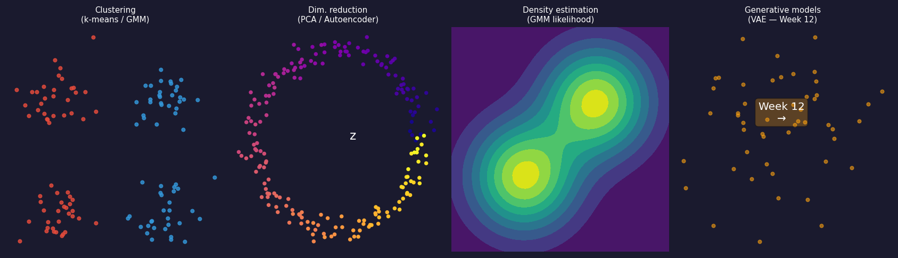{width="68%"}

- Most EM data arrives **unlabelled**: clustering proposes phases, compression speeds up maps, anomaly detection flags bad regions — at zero annotation cost.

:::: {.notes}
- Walk through the four quadrants: clustering (k-means, GMM), dimensionality reduction (PCA, autoencoder), density estimation, generative models (VAE later today; GANs and diffusion in Week 13 as priors for inverse problems).
- The boundary between dimensionality reduction and generative modelling is where the VAE lives.
- Clustering and dimensionality reduction work together: an autoencoder reduces dimension, then k-means/GMM clusters the latent codes.
- Why it matters for EM: a 4D-STEM scan is hundreds of GB of patterns; an EELS map is millions of spectra, none labelled. Clustering gives a hypothesis for the expert; a 1024-channel spectrum compresses to ~8 latent numbers; spectra from contaminated or damaged regions reconstruct poorly from an AE trained on normal data.
- Rule of thumb: with no labels, start with PCA to understand dimensionality, then an AE for non-linear structure [@sandfeld_materials_data_science].
- EM anchor: iron-oxide thin film EELS map, 128×128 × 1024 channels; the expert expects Fe₂O₃, FeO, Fe₃O₄ — clustering latent codes recovers them without labels.
::::

<!-- ===== §2. K-means ===== -->

## K-means: objective and Lloyd's algorithm

:::: {.columns}
:::: {.column width="55%"}
Assign $N$ spectra $\mathbf{x}_i\in\mathbb{R}^d$ to $K$ groups $C_k$ by minimising the within-cluster sum of squares

$$
J = \sum_{k=1}^{K} \sum_{i \in C_k} \|\mathbf{x}_i - \boldsymbol\mu_k\|^2.
$$

:::: {.incremental}
1. **Assign:** each spectrum → nearest centroid.
2. **Update:** each centroid → mean of its spectra.
- Neither step increases $J$ → converges, but only to a **local** minimum.
::::
::::
:::: {.column width="45%"}
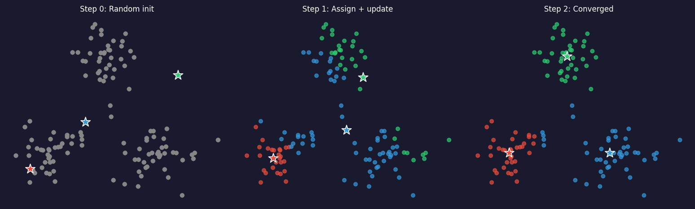{width="100%"}
::::
::::

:::: {.notes}
- K-means is coordinate descent on $J$: hold centroids fixed → assignments (nearest centroid); hold assignments fixed → centroids (mean). Each subproblem is closed form.
- The same logic applies to 1024-D EELS spectra; only the distance computation changes dimensionality.
- Transition: "The local minimum problem motivates smart initialization — and there are more failure modes."
::::

## K-means in practice: initialisation, $K$, failure modes

:::: {.incremental}
- **k-means++:** seed centroids with probability $\propto D(\mathbf{x})^2$; use 5–10 restarts, keep lowest $J$.
- **Choosing $K$:** no likelihood → heuristics: **elbow** of $J(K)$ and mean **silhouette** score; final check = domain knowledge.
- **Failure modes:** assumes *spherical, similar-sized* clusters; dominated by high-intensity features (zero-loss peak) and outliers; hard labels for mixed boundary spectra.
- **Fix:** normalise spectra, or better cluster **compressed** codes (PCA scores, AE latents) [@bruefach2023robust4dstem].
::::

:::: {.notes}
- The $D(x)^2$ weighting gives far-away points higher probability of becoming a seed, so seeds spread over different regions; it gives a provably better expected $J$. Default in scikit-learn.
- Elbow: $J(K)$ always decreases (J = 0 at K = N); look for diminishing returns. Silhouette $s=(b-a)/\max(a,b)$ with $a$ = mean intra-cluster distance and $b$ = mean distance to the nearest other cluster; range [−1, 1], $s>0.5$ good. Use both together.
- EM anchor: Fe–O film with three known phases — elbow and silhouette at K = 3. K = 4 splits a phase — real or artefact? Domain knowledge decides.
- Scale sensitivity is the most important failure: raw EELS spectra cluster by zero-loss peak and thickness, not chemistry. Two FeO spectra at 50 nm and 200 nm thickness end up in different clusters in raw space; in AE latent space thickness goes into one latent dimension and chemistry drives the clustering.
- Outliers: remove via AE reconstruction-error threshold, or use k-medoids. Elongated clusters (continuously shifting peak) get split incorrectly.
- Practical recipe: normalise → denoising AE to k-D latent → k-means on latents → decode centroids to verify chemistry [@de2019deep]. Never k-means raw 1024-D spectra.
- Transition: "The hard label on boundary spectra is what GMM fixes."
::::

<!-- ===== §3. GMM and EM ===== -->

## GMM: soft clustering for overlapping phases

:::: {.columns}
:::: {.column width="50%"}
$$
p(\mathbf{x}) = \sum_{k=1}^{K} \pi_k \,\mathcal{N}(\mathbf{x};\boldsymbol\mu_k,\Sigma_k), \quad \sum_k \pi_k = 1.
$$

:::: {.incremental}
- Each phase = Gaussian cloud around a representative spectrum $\boldsymbol\mu_k$ with covariance $\Sigma_k$ → **ellipsoidal** clusters.
- Each spectrum gets a **responsibility** vector $\gamma_{ik}=P(k\mid\mathbf{x}_i)$ instead of a hard label.
::::
::::
:::: {.column width="50%"}
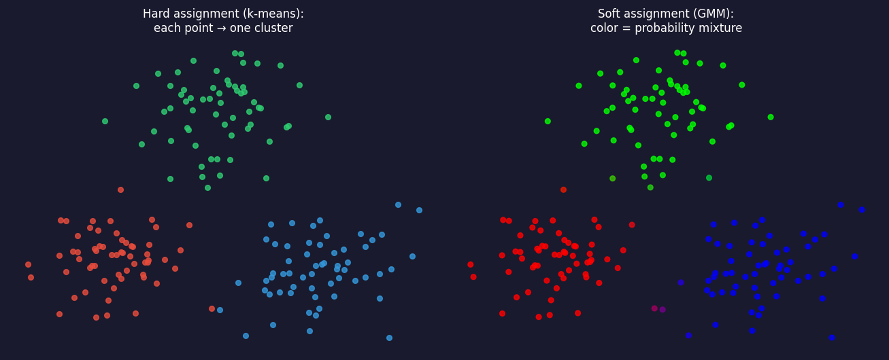{width="100%"}
::::
::::

:::: {.notes}
- Boundary points carry probability mass in two clusters — physically meaningful where phase boundaries are several unit cells wide.
- EM payoff: an Fe₂O₃ phase may vary more along the Fe-L₂₃ edge than along the O-K edge; a full-covariance GMM captures that anisotropy, k-means cannot.
- In 1024-D, full covariance has too many parameters: use diagonal covariance or cluster latent codes.
- Transition: "How do we fit this? Treat the phase label as a hidden variable [@dempster1977em]."
::::

## The latent-variable view and the EM algorithm

:::: {.columns}
:::: {.column width="55%"}
Hidden label $c_i$: $p(\mathbf{x}_i, c_i{=}k)=\pi_k\,\mathcal{N}(\mathbf{x}_i;\boldsymbol\mu_k,\Sigma_k)$. $\log\sum_k(\cdot)$ → no closed form. EM alternates:

**E-step** (Bayes' rule):
$$
\gamma_{ik}=\frac{\pi_k\,\mathcal{N}(\mathbf{x}_i;\boldsymbol\mu_k,\Sigma_k)}{\sum_j \pi_j\,\mathcal{N}(\mathbf{x}_i;\boldsymbol\mu_j,\Sigma_j)}
$$

**M-step** (weighted averages), $N_k=\sum_i\gamma_{ik}$:
$$
\boldsymbol\mu_k=\tfrac{1}{N_k}\textstyle\sum_i\gamma_{ik}\mathbf{x}_i,\quad
\Sigma_k=\tfrac{1}{N_k}\sum_i\gamma_{ik}(\mathbf{x}_i-\boldsymbol\mu_k)(\mathbf{x}_i-\boldsymbol\mu_k)^{\top},\quad
\pi_k=\tfrac{N_k}{N}
$$
::::
:::: {.column width="45%"}
{width="100%"}
::::
::::

:::: {.notes}
- Derive on the board: E-step is Bayes' rule with prior $\pi_k$ and likelihood $\mathcal{N}$. M-step: set the derivative of the responsibility-weighted log-likelihood to zero → weighted mean, covariance, fraction.
- Figure: 2-component GMM, soft colour-coded responsibilities, 1σ ellipses (via MFML Unit 5).
- Latent-variable language: $c_i$ is a *discrete* latent. The VAE later uses a *continuous* $\mathbf{z}$ — same idea; the ELBO is the general form of the bound EM climbs.
::::

## EM guarantees and choosing $K$ with BIC

:::: {.incremental}
- **Monotone:** no iteration decreases $\sum_i\log p(\mathbf{x}_i;\theta)$ — but only a *local* maximum → k-means init, several restarts [@bishop2006pattern].
- **k-means = hard-assignment limit** of EM ($\gamma_{ik}\in\{0,1\}$, shared $\sigma^2 I$, $\sigma\to0$).
- **Degeneracy:** $\Sigma_k\to0$ on one spectrum → regularise (`reg_covar`), diagonal $\Sigma$, or fit in a latent space.
- **GMM has a likelihood** → Bayesian information criterion [@schwarz1978bic]:
  $$\mathrm{BIC}(K)=-2\log p(\mathcal D;\hat\theta_K)+p_K\log N$$
- **Notebook:** GMM on the 2-D VAE latent → BIC minimum at $K=4$, ARI = 1.00.
::::

:::: {.notes}
- Say it: "k-means is EM with the uncertainty switched off."
- EM maximises a lower bound that is tight after each E-step — the same bound as the VAE's ELBO, with the exact posterior.
- Parameter count for full covariance: $p_K=(K-1)+Kd+K\,d(d+1)/2$. On raw 1024-D spectra that is ≈5×10⁵ per component — hopeless; another argument for clustering in a latent space.
- Notebook numbers: BIC 48 at K = 4 vs 371 at K = 3 and 75 at K = 5.
- BIC is only as good as the model: non-Gaussian (curved) clusters get tiled with extra components. Always look at the fit.
- Comparison table k-means vs GMM is in the backup slides.
- Transition: "Both methods cluster in whatever space you give them. The quality of the space is what matters — manifold hypothesis."
::::

<!-- ===== §4. Manifold hypothesis & autoencoders ===== -->

## The manifold hypothesis: why compression works

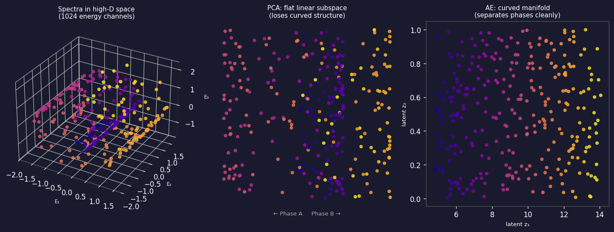{width="78%"}

- A spectrum is set by a few physical parameters (phase, oxidation state, thickness) — yet we measure 1024 channels. The scree-plot elbow (Week 3) estimates this dimension.

:::: {.notes}
- Left: data on a curved 2-D surface in 3-D (analogy for 1024-D spectra on a ~10-D surface). Centre: PCA's best flat hyperplane cuts through holes; phases separated on the manifold get pushed together. Right: a nonlinear AE bends its axes to follow the curve.
- For a two-phase system perhaps five numbers; the other ~1019 dimensions are noise and redundancy.
- Oxidation-state changes cause *non-linear* peak-position and intensity changes → curved manifold → nonlinear AE needs fewer latent dimensions than PCA [@goodfellow2016deep].
- Rule: if the scree elbow is at $k$, try a bottleneck of $k$ to $2k$. PCA may need 20–30 components for 95% variance because noise is isotropic.
- Transition: "An AE is the tool that implements this."
::::

## Autoencoder: encoder–bottleneck–decoder

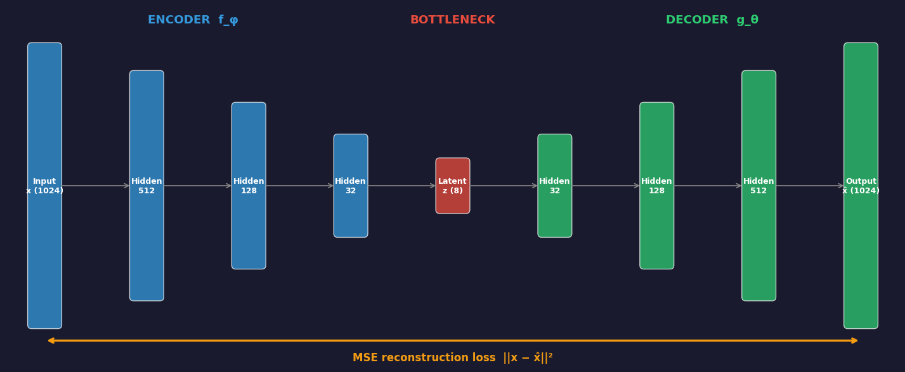{width="70%"}

$$
\mathcal{L}(\theta, \phi) = \frac{1}{N}\sum_{i=1}^{N} \bigl\|\mathbf{x}_i - g_\theta(f_\phi(\mathbf{x}_i))\bigr\|^2 \qquad\text{— no labels; the input is the target.}
$$

:::: {.notes}
- Layer widths: 1024 → 512 → 128 → 32 → 8 → 32 → 128 → 512 → 1024, symmetric by convention. Without the bottleneck the trivial solution is the identity.
- Self-supervised: the supervisory signal is built into the data. Minimum-description-length intuition: compress as much as possible while losing as little as possible.
- In PyTorch it is one line: `loss = ((x - decoder(encoder(x)))**2).mean()`. The full `nn.Module` is in the notebook; bottleneck and output layers have no activation (do not use sigmoid on raw counts).
- Week 2 callback: Gaussian noise → MSE; Poisson-noisy spectra → Poisson NLL [@sandfeld_materials_data_science].
- Bottleneck choice: sweep $k$, look for the elbow of validation reconstruction error, cross-check silhouette (backup slide).
::::

## Linear autoencoder = PCA

:::: {.columns}
:::: {.column width="45%"}
:::: {.incremental}
- Linear $f_\phi(\mathbf{x})=W_e\mathbf{x}$, $g_\theta(\mathbf{z})=W_d\mathbf{z}$, MSE loss → optimum spans the **top-$k$ PCA subspace** [@baldi1989neural].
- **Nonlinearity** is what lets an AE follow curved spectral manifolds.
- Always report the PCA baseline at the same $k$.
::::
::::
:::: {.column width="55%"}
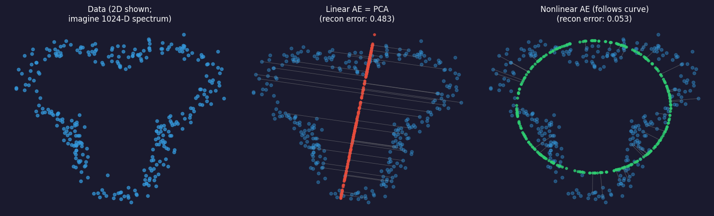{width="100%"}
::::
::::

:::: {.notes}
- Board sketch: objective = Frobenius reconstruction error; best rank-$k$ approximation = truncated SVD (Eckart–Young); $W_dW_e$ is rank $k$ → PCA projection $U_kU_k^\top$.
- EM implication: near-linear mixing (Beer–Lambert of pure-phase spectra) → PCA ≈ AE. Non-linear peak shifts (oxidation state, thickness, contamination) → nonlinear AE wins.
- Honest comparison: same train/test split for PCA and AE; compare held-out reconstruction error and latent silhouette; report both. A paper without the PCA baseline is incomplete.
- Figure: PCA residuals (orange) are large on the curved parts; nonlinear AE residuals (green) are small.
::::

<!-- ===== §5. Denoising AE, latent space, anomalies ===== -->

## Denoising autoencoders for low-dose spectra

:::: {.columns}
:::: {.column width="45%"}
Train on **corrupted inputs, clean targets** [@vincent2008extracting]:
$$\mathcal{L} = \frac{1}{N}\sum_i \|\mathbf{x}_i - g_\theta(f_\phi(\tilde{\mathbf{x}}_i))\|^2$$

- Noise-specific features cannot help reconstruct the clean signal → only **noise-robust** features are encoded.
- Notebook: AE MSE ≈ 5× lower than PCA ($k$=4).
::::
:::: {.column width="55%"}
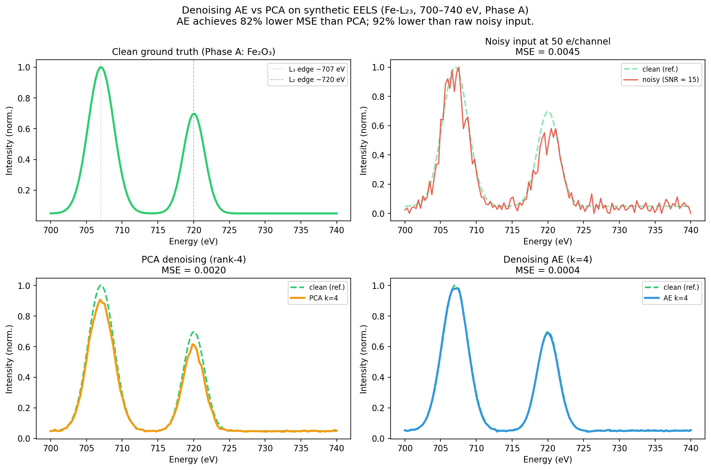{width="100%"}
::::
::::

:::: {.notes}
- Motivation: at 50 e⁻/channel the SNR is √50 ≈ 7 — the fine structure distinguishing Fe²⁺ from Fe³⁺ is buried.
- Training pairs: clean spectra simulated from a scattering model, noisy ones by adding Poisson realisations; alternative Noise2Noise. The notebook uses simulation.
- Numbers (SEED = 42): noisy MSE ≈ 0.0045, PCA ≈ 0.0020, AE ≈ 0.00038 → AE 81% better than PCA.
- Practicalities (backup slide): match the noise model (Poisson NLL / VST), tune the corruption level, train on the same noise source as test data, prefer PCA for < ~200 spectra.
- Pacing: high-value slide — 3 minutes.
::::

## The latent space: a learned coordinate system

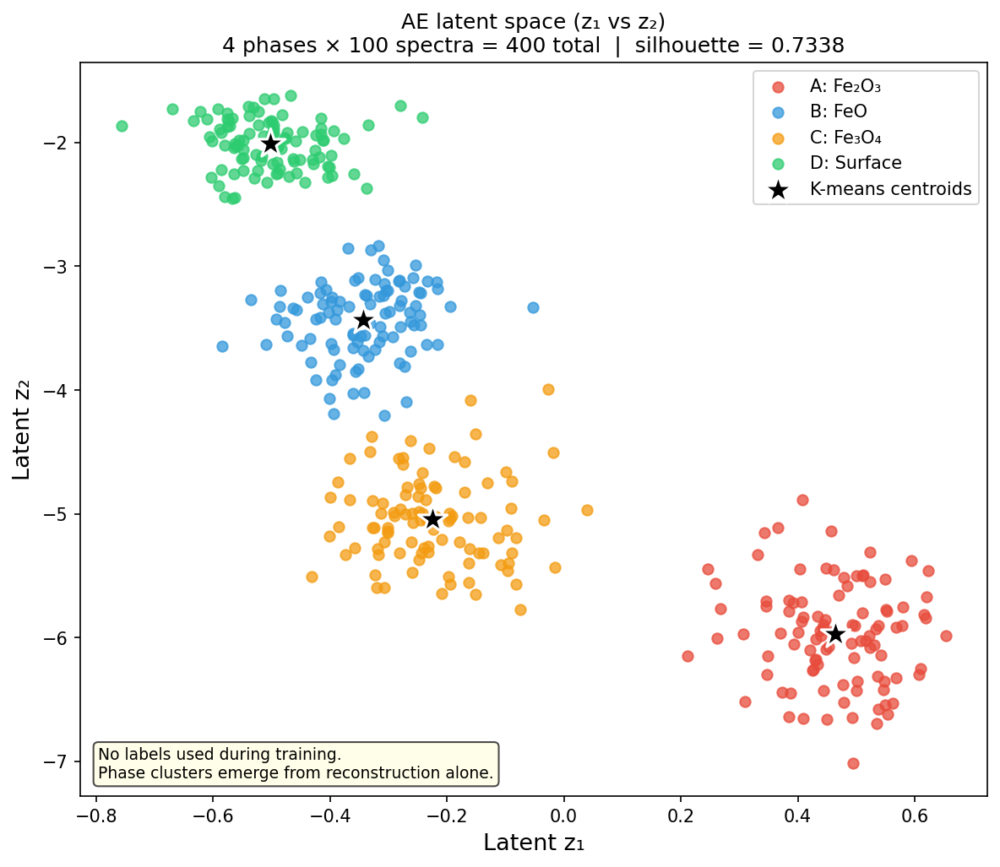{width="58%"}

- Cluster the $k$-D codes, not a 2-D picture of them. Elongated clusters = continuous parameters; isolated points = anomalies.

:::: {.notes}
- Payoff slide: "No labels were used. The AE was trained on raw spectra with a reconstruction loss." Silhouette ≈ 0.73 on 4-D codes; only z₁, z₂ are shown.
- Reading the latent space: well-separated islands = distinct phases; overlap = genuine mixtures or too small a bottleneck; elongated clusters = a continuous physical parameter (thickness, oxidation gradient) — useful for ordering spectra; isolated outliers = contamination, damage, novel chemistry.
- For $k>2$ we need t-SNE/UMAP to look at the codes — distances in those maps are not metric (section after the VAE; t-SNE vs UMAP figure in backup).
::::

## Anomaly detection: reconstruction error as a score

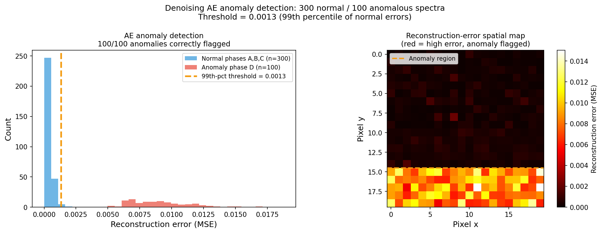{width="72%"}

- Complementary score: **latent distance** (Mahalanobis) catches anomalies the decoder "fills in" plausibly.
- Published: a convolutional VAE trained on perfect lattices flags point defects in STEM with zero defect labels [@prifti2023cvae_stem].

:::: {.notes}
- Zero-label application: anomalies were never seen during training, so high reconstruction error is the anomaly score. 99th-percentile threshold ≈ 0.0013 flags 100/100 anomalies in the notebook.
- Latent-outlier strategy: a beam-damaged spectrum may reconstruct adequately but land far from the normal cluster. Use reconstruction error as primary score, latent distance as secondary filter; calibrate the threshold to the acceptable false-alarm rate.
- Prifti et al.: defect labels are the most expensive annotation in materials science (aberration correction, tilt alignment, multislice comparison). A zero-label detector bypasses this.
- Transition: "The CVAE is a VAE. What exactly is that?"
::::

<!-- ===== §6. Variational autoencoders ===== -->

## From AE to VAE: the latent space has holes

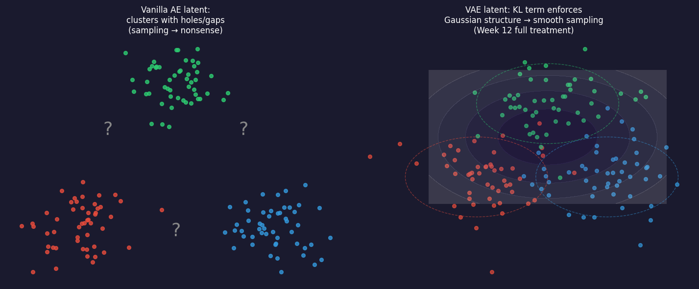{width="74%"}

:::: {.notes}
- The AE maps each spectrum to a *point*; nothing in the loss says what happens between points, so interpolating or sampling lands in untrained regions.
- The VAE changes two things: the encoder outputs a *distribution*, and the loss pulls those distributions toward a fixed prior. Tiny architectural change; the loss is where the magic is.
::::

## VAE: encoder outputs a distribution, prior on $\mathbf{z}$

:::: {.columns}
:::: {.column width="55%"}
**Decoder** (generative): $\ \mathbf{z}\sim\mathcal{N}(\mathbf{0},I),\quad \mathbf{x}\sim p_\theta(\mathbf{x}\mid\mathbf{z})$

**Encoder** (inference): $\ q_\phi(\mathbf{z}\mid\mathbf{x})=\mathcal{N}\big(\boldsymbol\mu_\phi(\mathbf{x}),\operatorname{diag}\boldsymbol\sigma^2_\phi(\mathbf{x})\big)$

:::: {.incremental}
- The encoder approximates the intractable posterior $p_\theta(\mathbf{z}\mid\mathbf{x})$.
- The union of all $q_\phi$ tiles the prior → sample $\mathbf{z}\sim\mathcal{N}(\mathbf{0},I)$ and decode [@kingma2014vae].
- GMM with a *continuous* latent and a neural likelihood.
::::
::::
:::: {.column width="45%"}
{width="85%"}
::::
::::

:::: {.notes}
- AE: x → z → x̂. VAE: x → (μ, σ) → *sample* z → x̂.
- No individual posterior equals the prior; their union (aggregate posterior) must tile it. That is why VAE latents are space-filling while AE latents clump.
- The Gaussian prior is a convenience (closed-form KL, trivial sampling), not a law of nature.
- GMM callback: there the E-step computed the exact posterior; here it is intractable, so a network *amortises* the E-step.
::::

## The ELBO: derivation in three moves

We want $\log p_\theta(\mathbf{x})=\log\int p_\theta(\mathbf{x}\mid\mathbf{z})\,p(\mathbf{z})\,d\mathbf{z}$ — intractable for a neural decoder.

:::: {.fragment}
1. Multiply and divide by $q_\phi(\mathbf{z}\mid\mathbf{x})$; 2. Jensen ($\log$ is concave); 3. factor $p(\mathbf{x},\mathbf{z})=p(\mathbf{x}\mid\mathbf{z})p(\mathbf{z})$:
$$
\log p_\theta(\mathbf{x})=\log\mathbb{E}_{q_\phi}\!\Big[\tfrac{p_\theta(\mathbf{x},\mathbf{z})}{q_\phi(\mathbf{z}\mid\mathbf{x})}\Big]
\;\ge\;\underbrace{\mathbb{E}_{q_\phi(\mathbf{z}|\mathbf{x})}\big[\log p_\theta(\mathbf{x}\mid\mathbf{z})\big]}_{\text{reconstruction}}-\underbrace{\mathrm{KL}\big(q_\phi(\mathbf{z}\mid\mathbf{x})\,\|\,p(\mathbf{z})\big)}_{\text{prior matching}}=\mathrm{ELBO}.
$$
::::

:::: {.fragment}
- **Gap** $=\mathrm{KL}\big(q_\phi(\mathbf{z}\mid\mathbf{x})\,\|\,p_\theta(\mathbf{z}\mid\mathbf{x})\big)\ge 0$: a better encoder gives a tighter bound.
- **Loss** $=-\mathrm{ELBO}$; reconstruction term = noise-model NLL: Gaussian → $\tfrac{1}{2\sigma^2}\|\mathbf{x}-\hat{\mathbf{x}}\|^2$ (MSE), Poisson counts → Poisson NLL.
::::

:::: {.notes}
- Do this on the board — it is exam material. Three moves: introduce q, Jensen, regroup.
- The gap statement is the deepest point: maximising the ELBO simultaneously fits the model and improves the encoder's posterior approximation. EM is the special case where the E-step makes the gap exactly zero.
- The decoder variance $\sigma^2$ sets the exchange rate between reconstruction and KL. In the notebook `SIGMA2 = 0.01`. Smaller → more latent information, less regularisation.
- Tie to Week 2: MSE is not a law; it is the Gaussian choice.
::::

## The reparameterisation trick

:::: {.columns}
:::: {.column width="50%"}
:::: {.incremental}
- We cannot back-propagate through a sample $\mathbf{z}\sim q_\phi$.
- **Move the randomness off the parameter path:**
$$
\mathbf{z}=\boldsymbol\mu_\phi(\mathbf{x})+\boldsymbol\sigma_\phi(\mathbf{x})\odot\boldsymbol\epsilon,\qquad \boldsymbol\epsilon\sim\mathcal{N}(\mathbf{0},I).
$$
- Sampling becomes differentiable → train with ordinary SGD/Adam.
::::
::::
:::: {.column width="50%"}
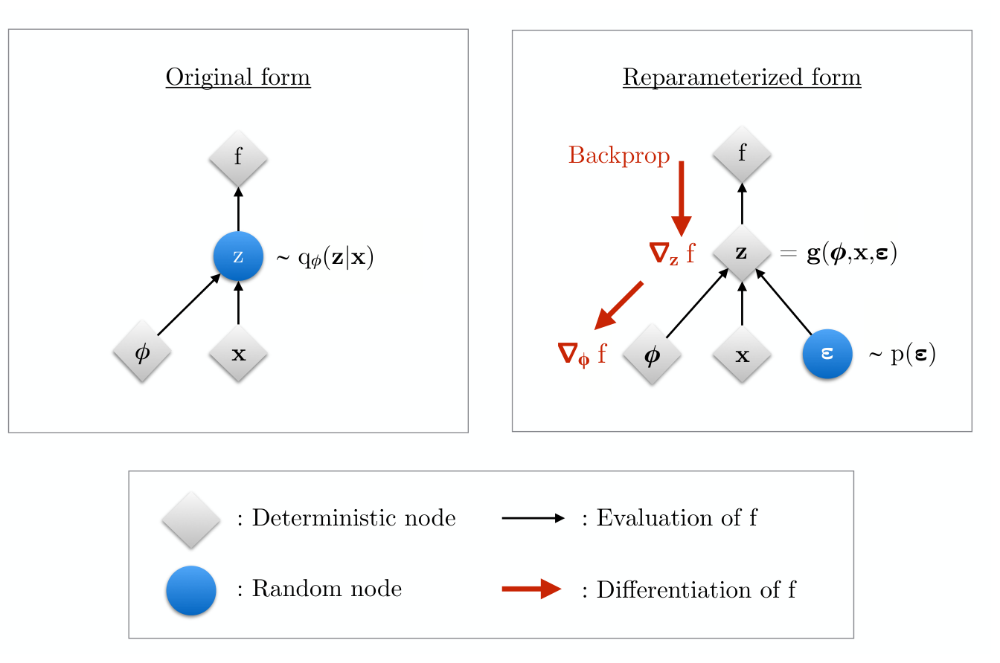{width="100%"}
::::
::::

:::: {.notes}
- Make them feel the wall first: "the sample is not a differentiable function of the parameters." Then fix the noise source and make z a deterministic function of (μ, σ, ε).
- Now $\nabla_\phi\,\mathbb{E}_{q_\phi}[f(\mathbf{z})]=\mathbb{E}_{\boldsymbol\epsilon}[\nabla_\phi f(\boldsymbol\mu+\boldsymbol\sigma\odot\boldsymbol\epsilon)]$ — an unbiased one-sample gradient estimate.
- It is what makes the VAE trainable — not "adding noise for robustness".
- The same move reappears in diffusion models (Week 13): $x_t=\sqrt{\bar\alpha_t}x_0+\sqrt{1-\bar\alpha_t}\epsilon$.
- Most-asked VAE exam question: "Why is the reparameterisation trick needed?"
::::

## Closed-form KL and the 10-line training step

:::: {.columns}
:::: {.column width="45%"}
For $q=\mathcal{N}(\boldsymbol\mu,\operatorname{diag}\boldsymbol\sigma^2)$, $p=\mathcal{N}(\mathbf{0},I)$:
$$
\mathrm{KL}(q\,\|\,p)=\tfrac12\sum_{j=1}^{k}\big(\mu_j^2+\sigma_j^2-\log\sigma_j^2-1\big)
$$

No Monte Carlo for the KL — only the reconstruction term uses the sampled $\mathbf{z}$.
::::
:::: {.column width="55%"}
```python
mu, logvar = encoder(x_noisy)          # predict log σ² → σ > 0 for free
eps = torch.randn_like(mu)
z = mu + torch.exp(0.5 * logvar) * eps # reparameterisation
x_hat = decoder(z)

recon = ((x_hat - x_clean)**2).sum(1) / (2 * SIGMA2)
kl = 0.5 * (mu**2 + logvar.exp() - logvar - 1).sum(1)
loss = (recon + beta * kl).mean()      # = −ELBO (β = 1)
loss.backward(); opt.step()
```
::::
::::

:::: {.notes}
- $\mu_j^2$ pulls means to 0; $\sigma_j^2-\log\sigma_j^2-1$ is a convex bowl with minimum at $\sigma_j=1$.
- Map every line to the math: lines 1–3 reparameterisation, line 6 the Gaussian NLL, line 7 the closed-form KL verbatim, line 8 the negative ELBO.
- Log-variance parameterisation: positivity for free, well-scaled gradients.
- One ε sample per spectrum suffices; the minibatch average reduces variance.
- Denoising VAE as in the notebook: noisy input, clean target; KL warm-up β: 0 → 1 over 50 epochs.
::::

## β-VAE, posterior collapse and inactive dimensions

:::: {.columns}
:::: {.column width="45%"}
:::: {.incremental}
- **β-VAE:** recon $+\,\beta\,$KL [@higgins2017betavae] — larger β: smoother latent, blurrier output.
- **Posterior collapse:** KL → 0, decoder ignores $\mathbf{z}$.
- Unused dimensions **switch off**. Active dims depend on β and decoder variance — **not** a count of physical degrees of freedom.
::::
::::
:::: {.column width="55%"}
{width="100%"}
::::
::::

:::: {.notes}
- β > 1: more disentangled, blurrier; β < 1: sharper, less sampleable.
- Collapse: encoder outputs μ ≈ 0, σ ≈ 1 for every input. Per-dimension collapse is common and useful — the KL acts as an automatic bottleneck selector.
- Diagnostics: log recon and KL separately; count active dims ($\bar\sigma_j<0.5$). Fixes: KL warm-up, smaller β, weaker decoder.
- Figure: blue bars below 0.5 → all informative (KL 9.4 nats). At β = 1, 4 three dims sit at σ ≈ 1 = prior. The four phases lie along one curve in spectrum space; ARI = 1.00 in all runs, but a 1-D latent cannot represent within-phase variability.
- Report β and σ² with every latent-space claim.
::::

## Notebook: a denoising VAE on the Fe-L₂₃ spectra

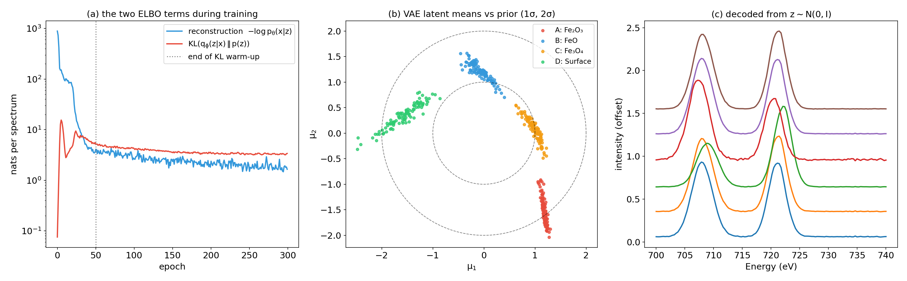{width="100%"}

:::: {.fragment}
Recon MSE: noisy 0.00449 · PCA 0.00205 · AE 0.00038 · **VAE ($k$=2) 0.00017** · ARI 1.00.
::::

:::: {.notes}
- 400 spectra, SIGMA2 = 0.01, 300 epochs; KL settles at ≈3.4 nats per spectrum; k-means on VAE means: silhouette 0.77.
- Honesty: the VAE uses mini-batches (4 updates/epoch vs 1 for the AE), so this is not a clean architecture comparison — the point is that the KL term costs very little reconstruction here.
- Panel (c) is the generative payoff. A generated spectrum is a prediction, not a measurement — never evidence for a new phase.
- AE vs VAE summary table in backup. GANs (sharper samples, no encoder, no likelihood) return in Week 13 with diffusion models as priors for inverse problems.
::::

<!-- ===== §7. rVAE ===== -->

## rVAE: separating rotation and translation from content

:::: {.columns}
:::: {.column width="55%"}
**Problem:** atom-centred STEM patches differ by *rotation* and *sub-pixel shift*; a plain VAE spends its latents on orientation.

:::: {.incremental}
- Latent split: $\mathbf{z}=(\theta,\Delta\mathbf{r},\mathbf{z}_{\text{content}})$ [@bepler2019spatialvae; @kalinin2021exploring].
- **Coordinate-based decoder:** $\hat{I}(\mathbf{r})=g_\psi\big(R(\theta)\,\mathbf{r}+\Delta\mathbf{r},\ \mathbf{z}_{\text{content}}\big)$.
- Rotation/shift act on the pixel grid *by construction* → $\mathbf{z}_{\text{content}}$ is orientation-free.
::::
::::
:::: {.column width="45%"}
```python
def decode(coords, theta, dr, z):   # coords: (n_pix, 2)
    c = coords @ rot(theta).T + dr  # transform the grid
    h = coord_mlp(c) + latent_mlp(z)
    return out_mlp(h)               # intensity per pixel
```
Invariance **built into the architecture** — as in CNNs (Week 7) and GNNs (Week 10).
::::
::::

:::: {.notes}
- "How does the rVAE know what is rotation?" It does not learn it — the decoder is told that θ rotates the pixel grid. Equivariance by construction.
- Priors: θ ~ N(0, s_θ²), Δr ~ N(0, s_r² I), z_content ~ N(0, I); ELBO as before.
- Connect to Week 5 local-environment descriptors: hand-crafted invariants; the rVAE learns the invariant descriptor instead.
- Kalinin et al. workflow (segmentation → atom finding → rVAE) and the GMM vs AE vs rVAE descriptor comparison on graphene are in the backup slides: with rotation removed, one latent direction ≈ degree of crystallinity — supported by *decoding* a latent grid.
- Source: SS25 DSEM deck; code simplified from the spatial generator of Bepler et al.
::::

<!-- ===== §8. Reading latent spaces critically ===== -->

## t-SNE perplexity sweep: same codes, four maps

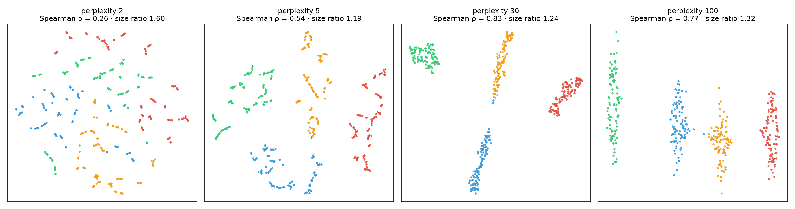{width="100%"}

:::: {.incremental}
- Low perplexity **shatters** phases into fake "sub-phases".
- Distance ranking changes with perplexity (ρ = 0.26 → 0.83); cluster sizes are equalised [@wattenberg2016tsne].
::::

:::: {.notes}
- t-SNE matches neighbourhood probabilities; perplexity ≈ effective number of neighbours. 2-D silhouette 0.16 at perplexity 2.
- Size ratio largest/smallest cluster radius: 1.75 in z vs 1.19–1.60 on the maps — area is not abundance or variability.
- The robust statement: "these points cluster together at every reasonable perplexity"; positions, gaps and sizes are layout.
- UMAP has the same issue with n_neighbors/min_dist and seeds (t-SNE vs UMAP figure in backup).
::::

## How latent spaces mislead — and a checklist

:::: {.columns}
:::: {.column width="50%"}
**Traps**

- **Distance / size:** map gaps and areas are not physics.
- **Narrative:** humans see blobs even in noise.
- **"Axis means X":** correlation ≠ encoding.
- **Nuisance:** latents follow thickness, dose, drift.
::::
:::: {.column width="50%"}
**Checklist**

- PCA/NMF baseline at the same dimension.
- Cluster and measure **in $\mathbf{z}$**; 2-D maps only for seeing.
- Sweep perplexity/n_neighbors × seeds; keep what survives.
- Decode along axes; **linear probe** on a held-out *specimen* split.
- Map back to real space.
::::
::::

:::: {.notes}
- Distance trap: "A is closer to B than C" on a t-SNE/UMAP map is not a physics claim — compute distances in z or spectrum space. Size trap: t-SNE equalises densities; count points in z-space clusters.
- Narrative fallacy: three blobs will be told as a three-phase story. Replicate across method, seed, hyperparameters, encoder.
- "Axis means X": z₁ correlating with thickness does not mean z₁ encodes thickness — demand a linear probe with a control (Week 8) and a held-out specimen/session split (Week 4), and decode a sweep along the axis.
- Nuisance/corpus trap: the latent inherits what varies most — thickness, zero-loss drift, beam current, tilt, detector gain.
- Also state the pipeline: preprocessing, architecture, latent dim, β / decoder variance, training data. A phase with no sensible spatial distribution is suspicious.
- Source: MG Unit 11 latent-space pitfalls and reproducibility checklist, adapted to EM. Use it in the miniproject report.
- Exam sentence: "A 2-D map is for seeing; distances and counts are measured in z; claims survive replication."
::::

## Confident is not correct: the interface trap

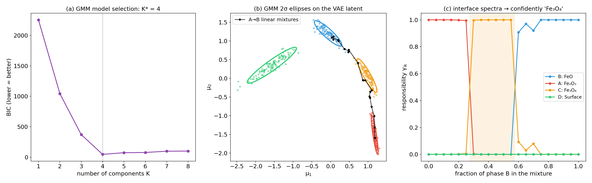{width="100%"}

:::: {.fragment}
A 50/50 Fe₂O₃/FeO interface pixel is labelled "Fe₃O₄" with $\gamma = 1.00$. A responsibility is a probability **under the fitted mixture**, not physical truth — check spatial context, reference spectra, linear unmixing (Week 3).
::::

:::: {.notes}
- Mixtures $(1-f)\,\mathbf{x}_{\text{Fe}_2\text{O}_3}+f\,\mathbf{x}_{\text{FeO}}$: for 0.30 ≤ f ≤ 0.55 they are assigned to Fe₃O₄ with γ ≈ 1.00.
- Why: in this simulation phase C (707.8 eV, L₃/L₂ = 1.1) lies almost on the linear blend of A (707.0 eV, 1.5) and B (708.5 eV, 0.8). No method that sees single spectra can tell a mixture from a pure intermediate phase.
- Real-world version: magnetite at a hematite/wüstite interface. A thin band exactly between two phases is a red flag.
- Explainability thread: latent-space analogue of the Week 7 shortcut demo — confident, right for the wrong reason.
::::

<!-- ===== §9. Latent maps for 4D-STEM and EELS ===== -->

## Latent maps for 4D-STEM and EELS

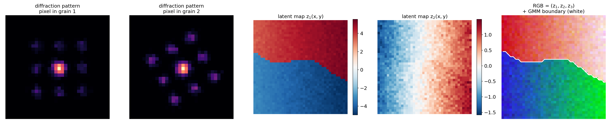{width="88%"}

- Pipeline: **denoise → encode → cluster → map → validate** against a physical observable (reference fit, virtual detector image, simulation); train/test on different regions.

:::: {.notes}
- Generated by img/make_figures.py: 40×40 probe positions, 32×32 px patterns, Poisson noise, √ transform (Week 2 VST), PCA as stand-in for the encoder. Same recipe with an AE/VAE; with rotations an rVAE puts orientation into θ, which becomes an orientation map, and the z_content map shows structure after removing orientation [@kalinin2021exploring].
- Key point: z₂ is a perfectly clean latent map — of thickness. Without physics knowledge you might call it a composition gradient. Nuisance trap in action.
- 4D-STEM: (N_y, N_x, Q_y, Q_x) → N_yN_x patterns → encoder → latent maps (N_y, N_x, k). Clusters = orientations/phases; continuous axes = strain, tilt, thickness. PCA/NMF + clustering is the robust baseline [@bruefach2023robust4dstem].
- EELS/EDS: Poisson-aware preprocessing (Week 3) → denoising AE/VAE → latent maps → GMM phase map with per-pixel responsibility; high-entropy pixels mark boundaries — where the interface trap lives.
- Honest splits: by spatial region/specimen, since neighbouring pixels are correlated (Week 4 GroupKFold) [@ede2021deep].
- Real-space coherence is a free validation: noise does not produce smooth maps. Virtual dark-field on a grain's diffraction spot should light up the same region as the latent cluster.
::::

<!-- ===== §10. Synthesis ===== -->

## Notebook summary: Week 9 key results

:::: {.incremental}
- **Denoising AE vs PCA ($k$=4):** MSE 0.00038 vs 0.00205; latent silhouette 0.73 vs 0.63.
- **Anomalies:** unseen phase D → 25× higher error; 100/100 flagged.
- **VAE (2-D):** MSE 0.00017, KL ≈ 3.4 nats; GMM + BIC → $K$ = 4, ARI 1.00 — but interface spectra → Fe₃O₄ with $\gamma$ = 1.00.
- **t-SNE sweep:** ρ = 0.26 / 0.54 / 0.83 / 0.77 at perplexity 2 / 5 / 30 / 100.
- **β-sweep:** active dims 4 → 1 → 1 for β = 0.1 → 1 → 4.
- [](https://colab.research.google.com/github/ECLIPSE-Lab/public_presentations/blob/main/data_science_for_em/notebooks/week09_autoencoder_vae.ipynb) `notebooks/week09_autoencoder_vae.ipynb`
::::

:::: {.notes}
- Data: 400 synthetic Fe-L₂₃ spectra, 4 phases, Poisson (50 e⁻/channel) + Gaussian noise, SEED = 42. AE 81.6% better than PCA (noisy input 0.00449). k-means on VAE latent means: silhouette 0.77, ARI 1.00. β-sweep KL 9.4 → 2.6 → 1.9 nats.
- All numbers match the executed notebook (and img/make_figures.py, which re-runs the notebook code). If library updates change them, update this slide.
- The full pipeline figure (one encoder → phase map, denoised spectra, anomaly flags) is in the backup slides.
::::

## Summary

:::: {.incremental}
- **Clustering:** k-means = coordinate descent on within-cluster variance (hard, spherical). GMM + EM = soft, ellipsoidal, with a likelihood → BIC. k-means is the hard limit of EM.
- **Autoencoders:** bottleneck → compact code; linear AE = PCA; denoising AEs learn noise-robust features.
- **VAE:** loss = −ELBO = noise-model NLL + KL to $\mathcal{N}(0,I)$; reparameterisation makes it trainable; β switches dimensions off.
- **rVAE:** rotation/translation in a coordinate decoder → orientation-free content latents.
- **Latent spaces mislead** unless you cluster in $\mathbf{z}$, sweep, decode, probe honestly, and map back to real space.
::::

:::: {.notes}
- Active recall: cover the slide and ask for the ELBO, the E-step, and one t-SNE pitfall.
::::

## Must-know takeaways

:::: {.incremental}
1. k-means minimises $\sum_k\sum_{i\in C_k}\|\mathbf{x}_i-\boldsymbol\mu_k\|^2$; local minimum → k-means++ and restarts.
2. GMM: E-step $\gamma_{ik}\propto\pi_k\mathcal{N}(\mathbf{x}_i;\boldsymbol\mu_k,\Sigma_k)$; M-step = weighted means, covariances, fractions; $K$ by BIC.
3. A linear AE with MSE loss spans the PCA subspace; nonlinearity goes beyond PCA.
4. $\log p(\mathbf{x})\ge\mathbb{E}_q[\log p(\mathbf{x}\mid\mathbf{z})]-\mathrm{KL}(q(\mathbf{z}\mid\mathbf{x})\|p(\mathbf{z}))$; gap = KL to the true posterior.
5. Reparameterisation $\mathbf{z}=\boldsymbol\mu+\boldsymbol\sigma\odot\boldsymbol\epsilon$ makes sampling differentiable.
6. t-SNE/UMAP: clusters that survive a sweep are evidence; positions, gaps and sizes are not.
::::

:::: {.notes}
- These six map onto the ≤10 statements in the must-know list for the exam.
::::

## Outlook: Week 10 — Attention, transformers & graph networks for EM

:::: {.incremental}
- **Today:** spectra and patches as flat vectors (MLP) or grids (CNN). The rVAE hinted that *where* things are and *how they relate* matters.
- **Attention:** queries, keys, values; vision transformers tokenise images and diffraction patterns; MAE = autoencoder with a transformer encoder.
- **Graphs:** atom columns as nodes, message passing with permutation invariance — CNN = grid graph, GNN = sparse graph, transformer = full graph.
- **Explainability:** attention ≠ explanation, just as a latent axis ≠ a physical variable.
::::

:::: {.notes}
- Graphs are the natural home for the atom-centred patches the rVAE used. Unifying picture: architecture as inductive bias.
- Close with the thread: "today we learned representations without labels; next week we learn how to build representations that respect the structure of the data — sets, sequences and graphs."
::::

<!-- BEGIN prev-next -->

## Continue

- &larr; Previous: [Unit 08 &mdash; Small data: augmentation, transfer & self-supervision](../08_small_data_self_supervised/01_intro.html)
- &rarr; Next: [Unit 10 &mdash; Attention, transformers & graph networks for EM](../10_transformers_graphs/01_intro.html)
- [All courses](../../index.html)

<!-- END prev-next -->

## Backup slides {visibility="uncounted"}

Material moved out of the 90-minute lecture path; not examined beyond what the main slides cover.

## K-means vs GMM: comparison table {visibility="uncounted"}

| | K-means | GMM |
|---|---------|-----|
| Assignment | hard (one cluster) | soft (probability vector) |
| Cluster shape | spherical | ellipsoidal (full $\Sigma$) |
| Speed | fast | slower (covariance update) |
| Boundary handling | abrupt | smooth |
| Choosing $K$ | elbow + silhouette | BIC (penalised log-likelihood) |
| High-dim risk | Euclidean dominance | covariance explosion ($d^2$ params) |

**Rule of thumb:** k-means for fast exploration; GMM when clusters overlap, vary in shape, or you need probabilities for downstream decisions. In both cases, prefer clustering latent codes over raw spectra [@murphy2012machine].

:::: {.notes}
- Use this table as a quick orientation — it is an exam-style summary.
- The high-dim covariance explosion is the key practical reason to cluster latent codes. A 1024-D full-covariance matrix has ~500k parameters per phase — more parameters than data points.
- Transition: "Why does compression into a latent code work at all? The manifold hypothesis."
::::

## Choosing the bottleneck dimension $k$ {visibility="uncounted"}

:::: {.incremental}
- **Too small ($k < $ intrinsic dim):** the AE underfits — reconstruction error is high even on training data. Phases that differ only subtly get merged into a single latent cluster.
- **Too large ($k > $ intrinsic dim):** the AE overfits — extra latent dimensions encode noise rather than signal. Latent clusters spread out and silhouette score drops.
- **Procedure:** sweep $k = 1, 2, \ldots, 2K_{\text{true}}$; plot validation reconstruction error vs $k$ and look for the elbow. Cross-check with silhouette score — both should peak near the true intrinsic dimension.
- **Sanity check:** compare against PCA at the same $k$. A nonlinear AE should reconstruct at least as well as PCA; if the AE underperforms PCA, it is either under-trained or the bottleneck is too narrow.
- **Rule of thumb:** start with $k = $ number of known phases. For an EELS map of an iron-oxide film with 3 known phases, try $k = 3, 4, 5$; the notebook exercise demonstrates this sweep concretely.
::::

:::: {.notes}
- The "elbow in reconstruction error" is an exact analogy to the scree plot elbow for PCA (Week 3). The latent dimension plays the role of the number of principal components retained.
- The silhouette cross-check is the EM-specific addition: we care not just about reconstruction quality but about whether the latent space is *useful* for phase identification.
- Transition: "A special case: when all activations are linear, the AE recovers PCA exactly."
::::

## Denoising AE in EM: practical considerations {visibility="uncounted"}

:::: {.incremental}
- **Noise model matters:** for Poisson-dominated EELS, use Poisson NLL loss or pre-normalise spectra to roughly constant variance before MSE. A mismatch degrades denoising of low-count bins.
- **Noise level during training:** the noise level $\sigma$ of $\tilde x_i = x_i + \epsilon_i$ is a hyperparameter. Too low: the AE learns the identity and memorises noise. Too high: the AE cannot reconstruct even clean spectra.
- **Beam-damage awareness:** in a real experiment, "noisy" is also "beam-damaged" for longer exposures. The denoising AE must be trained on data with *the same* noise source as the test data. Mixing Poisson noise with Gaussian readout noise requires a Poisson+Gaussian model.
- **When to prefer PCA denoising:** if you have fewer than ~200 spectra, PCA is more robust. The AE needs enough data to learn the spectral manifold. Rule of thumb: AE wins for $N > 500$ spectra; PCA wins for $N < 200$.
::::

:::: {.notes}
- The "Poisson+Gaussian" model is a Week 2 callback — remind students of the variance-mean plot diagnostic.
- The 200/500 thresholds are rough rules of thumb from practice, not theorems. The notebook allows students to see the crossover concretely by varying dataset size.
- Transition: "Once we have latent codes, we can visualise and cluster them."
::::

## t-SNE and UMAP: visualising high-dimensional latent codes {visibility="uncounted"}

{width="82%"}

:::: {.notes}
- The most important message: t-SNE plots are qualitative, not quantitative. Cluster sizes, inter-cluster distances, and densities in t-SNE are algorithm artefacts, not data properties.
- t-SNE misinterpretation rule (from MFML Unit 9): "These two clusters are 5× further apart in the plot — does that mean they are 5× more different?" No. The distances are not metric.
- UMAP preserves more global structure and is faster. In 2026 practice, UMAP is the default; t-SNE is a useful diagnostic when you want to confirm local neighborhood structure.
- Transition: "Once the latent space is visualised, anomalous spectra stand out."
::::

## AE vs VAE: summary {visibility="uncounted"}

| | Vanilla AE | VAE |
|---|---|---|
| Encoder output | a point $\mathbf{z}$ | a distribution $\mathcal{N}(\boldsymbol\mu,\operatorname{diag}\boldsymbol\sigma^2)$ |
| Loss | reconstruction | $-$ELBO = reconstruction + KL |
| Latent structure | arbitrary scale, holes | ≈ $\mathcal{N}(\mathbf{0},I)$, space-filling |
| Sampling / interpolation | unreliable | $\mathbf{z}\sim\mathcal{N}(\mathbf{0},I)$ → decode |
| Per-sample uncertainty | none | $\boldsymbol\sigma_\phi(\mathbf{x})$ (approximate) |
| Typical EM use | denoising, compression, anomaly scores | smooth latent maps, disentangling (rVAE), generation |

Generative adversarial networks (GANs) — sharper samples, no encoder, no likelihood — return in Week 13 together with diffusion models as priors for inverse problems [@goodfellow2014gan].

:::: {.notes}
- Exam-style summary. The posterior σ is an *approximate* uncertainty — it is typically over-confident. Calibrated uncertainty is Week 11.
- Transition: "Now a VAE that knows about rotations — built for atomic-resolution images."
::::

## rVAE workflow for dynamic STEM data {visibility="uncounted"}

{width="62%"}

:::: {.notes}
- Pipeline: supervised segmentation (Week 7 U-Net logic) → atom finding (Week 5) → unsupervised rVAE. Models are composed, not chosen exclusively.
- The time series of frames is analysed by tracking how the latent distribution changes: the latent coordinate becomes an *order parameter* for the transformation.
::::

## GMM vs AE vs rVAE on the same atomic patches {visibility="uncounted"}

{width="58%"}

:::: {.notes}
- Walk left to right: GMM (today's first half) is fine for classes but not interpretable here; AE compresses but entangles orientation; rVAE gives one or two physically nameable axes.
- Warning that anticipates the next section: "degree of crystallinity" is an interpretation of a latent axis. It is supported by decoding a grid of latent points (the panels) — that is a good practice: *decode* the axis, do not just name it.
::::

## Putting it all together: the unsupervised EM pipeline {visibility="uncounted"}

{width="80%"}

:::: {.notes}
- One trained encoder, three applications. Add the validation layer verbally: baseline, sweep, decode, probe, map back.
- EM anchor: Fe–O thin-film EELS map: denoising VAE on 80% of regions → latent map → GMM with BIC → phase map + responsibility map → flag high-reconstruction-error pixels for follow-up.
::::

## References

::: {#refs}
:::
