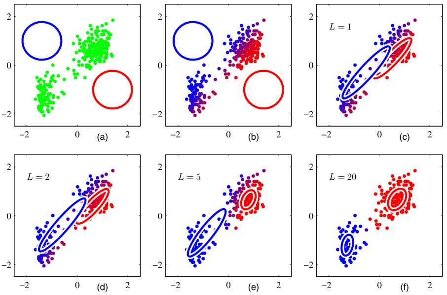
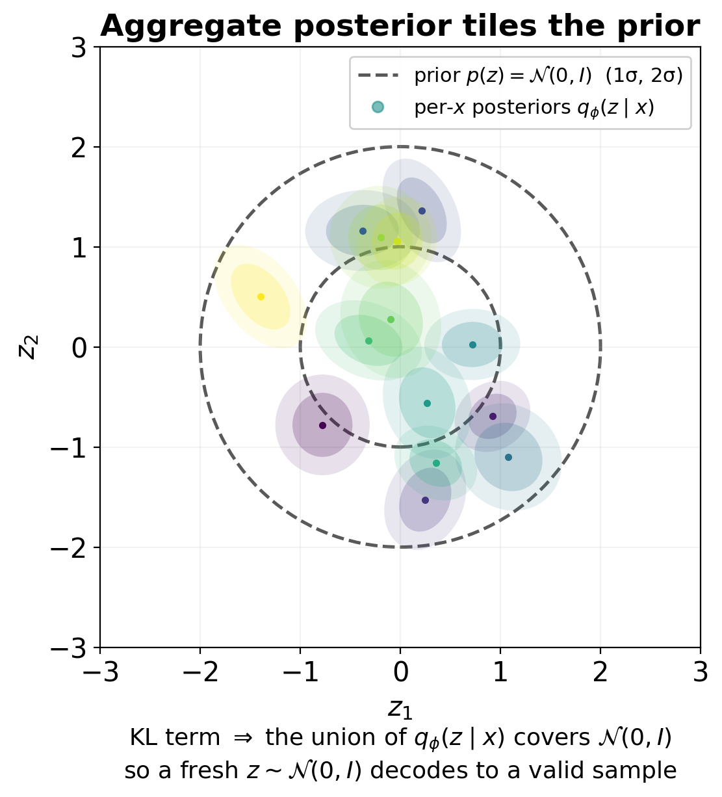
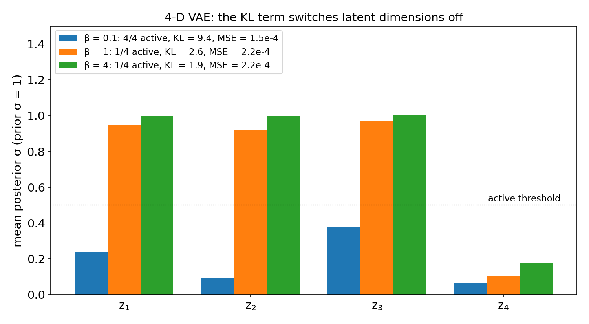

<!-- ===== §0. Recap + roadmap ===== -->

## Recap: Week 8 and today's question

:::: {.incremental}
- **Week 8:** small data — physics-respecting augmentation, transfer learning, synthetic data & sim-to-real, active labelling, and *self-supervised* pre-training (SimCLR, MAE, DINO) evaluated with the linear-probe vs fine-tune protocol.
- Core insight: a network can learn useful features from a **pretext task** that needs no labels; labels are only needed for the small head on top.
- **The remaining gap:** what if we have 10 000 unlabelled EELS spectra or a 4D-STEM scan and *no downstream label at all*? We want structure — phases, anomalies, continuous order parameters — directly from the data.
- **Today's answer:** *unsupervised learning*. Clustering (k-means, GMM/EM), compression (autoencoders), and *probabilistic* latent spaces (VAE, rVAE) — plus the discipline to read latent spaces without fooling ourselves.
- **Concrete payoff:** a denoising AE recovers low-dose spectra; a VAE gives a smooth, sampleable latent space; GMM on that latent recovers the four phases with BIC — and a t-SNE sweep shows what a 2-D map can and cannot tell you.
::::

:::: {.notes}
- Close the loop from Week 8: "last week the pretext task was contrastive (SimCLR) or masked reconstruction (MAE). Today the pretext task is the oldest one: reconstruct your own input through a bottleneck."
- MAE is literally a masked *autoencoder* — tell students that today's architecture is the ancestor of what they saw last week.
- The linear probe from Week 8 returns today as the quantitative test for "this latent axis means X".
- Pacing: 3 minutes maximum. Key phrase: "the data is the label — we ask it to reconstruct itself."
::::

## Learning outcomes

By the end of today you can:

:::: {.incremental}
1. State the k-means objective and Lloyd's algorithm; choose $K$ with elbow/silhouette; name the failure modes on EM data.
2. Write down the GMM, derive the E- and M-steps of EM, and choose $K$ with BIC.
3. Explain why an autoencoder generalises PCA (linear AE = PCA) and why denoising AEs work on low-dose spectra.
4. **Derive the ELBO**, explain the reparameterisation trick and the closed-form Gaussian KL, and diagnose posterior collapse / inactive latent dimensions.
5. Explain how an **rVAE** separates rotation/translation from content in atomic-resolution images.
6. Read t-SNE/UMAP and latent maps critically: which claims survive a perplexity/seed sweep and which do not.
7. Build a latent-space pipeline for EELS/4D-STEM: denoise → encode → cluster → map → validate.
::::

:::: {.notes}
- Outcomes 2 and 4 are the mathematical core and are exam-relevant: EM for GMMs and the ELBO derivation.
- Outcome 6 is this week's contribution to the explainability thread: latent-space reading pitfalls (Week 7 did saliency, Week 10 does attention maps).
::::

## Road map and self-study

:::: {.incremental}
- **Road map:** unsupervised landscape (3) · k-means (5) · GMM & the EM algorithm (6) · manifold hypothesis (3) · autoencoders & linear AE = PCA (7) · denoising AEs (4) · **VAE: ELBO, reparameterisation, β, collapse** (8) · **rVAE for atomic-resolution images** (3) · latent spaces: t-SNE/UMAP and **how they mislead** (7) · **4D-STEM/EELS latent maps** & anomaly detection (6) · summary, must-knows, outlook to Week 10.
- **Self-study:** `notebooks/week09_autoencoder_vae.ipynb` — denoising AE vs PCA on synthetic Fe-L₂₃ spectra, anomaly detection, then a **VAE** on the same spectra, **GMM + BIC** on its latent space, a **t-SNE perplexity sweep**, and a β-sweep exercise. CPU, ≈1 min.
- [](https://colab.research.google.com/github/ECLIPSE-Lab/public_presentations/blob/main/data_science_for_em/notebooks/week09_autoencoder_vae.ipynb)
::::

:::: {.notes}
- Orientation only — 1 minute. Call out the two new mathematical blocks (EM, ELBO) and the "how latent spaces mislead" block.
- GANs are deliberately *not* in this week: they come back in Week 13 as generative priors for inverse problems.
::::

<!-- ===== §1. Unsupervised learning landscape ===== -->

## The unsupervised learning landscape

{width="75%"}

:::: {.notes}
- Walk through the four quadrants left to right.
- The boundary between dimensionality reduction and generative modelling is where the VAE lives — second half of today.
- The two tasks we will develop today are clustering (k-means, GMM) and dimensionality reduction (autoencoder). They are not alternatives — they work together: an autoencoder reduces dimension, then k-means clusters the latent codes.
- Transition: "Why does any of this matter for EM? Labels."
::::

## Why unsupervised matters for electron microscopy

:::: {.incremental}
- **Most EM data arrives unlabelled.** A 4D-STEM scan is hundreds of GB of diffraction patterns; an EELS map is millions of spectra. None of them come with a label until a human expert provides one.
- **Clustering for exploration:** before you can label, you need a hypothesis. Unsupervised clustering of spectra surfaces candidate phases for a domain expert to inspect.
- **Compression for speed:** a 1024-channel EELS spectrum can be compressed to 8 latent numbers without losing chemical content — enabling interactive visualisation of maps that would otherwise be too slow to display.
- **Anomaly detection for quality control:** spectra from contaminated regions, beam-damaged areas, or novel chemistry reconstruct poorly from an AE trained on normal data — flagged automatically, at zero annotation cost.
- **The rule of thumb:** if you have no labels at all, start with PCA to understand dimensionality, then an AE to capture non-linear structure [@sandfeld_materials_data_science].
::::

:::: {.notes}
- Hammer the "labels are expensive" point from Week 8 but now flip the perspective: instead of reducing the label requirement, we eliminate it entirely.
- EM anchor: a real EELS map from an iron-oxide thin film: 128×128 pixels × 1024 energy channels = 16 million numbers. The domain expert knows there are probably three phases (Fe₂O₃, FeO, Fe₃O₄). Clustering the 16 384 spectra by their latent codes recovers those three phases without any labels — confirming the hypothesis in minutes instead of hours of manual peak fitting.
- Transition: "Start with the simplest clustering algorithm — k-means."
::::

<!-- ===== §2. K-means ===== -->

## K-means: objective and Lloyd's algorithm

:::: {.columns}
:::: {.column width="55%"}
Assign $N$ spectra $\{x_1, \ldots, x_N\} \subset \mathbb{R}^d$ to $K$ groups $C_1, \ldots, C_K$ by minimising:

$$
J = \sum_{k=1}^{K} \sum_{x_i \in C_k} \|x_i - \mu_k\|^2.
$$

**Lloyd's algorithm** — alternate two steps until assignments stop changing:

:::: {.incremental}
1. **Assign:** each spectrum goes to its nearest centroid $\mu_k$.
2. **Update:** each centroid moves to the mean of its assigned spectra.
::::

:::: {.fragment}
Each step strictly decreases $J$; convergence in finitely many steps is guaranteed — to a *local* minimum.
::::
::::
:::: {.column width="45%"}
{width="100%"}
::::
::::

:::: {.notes}
- K-means is coordinate descent on $J$: hold centroids fixed → solve for assignments; hold assignments fixed → solve for centroids. Each subproblem has a closed-form solution (nearest centroid; mean).
- Critical limitation to name now: K-means uses Euclidean distance, which requires that distance is meaningful in the feature space. For raw 1024-D EELS spectra, Euclidean distance is dominated by the highest-intensity region (the zero-loss peak). Always normalise or, better, cluster latent codes rather than raw spectra.
- Transition: "The local minimum problem motivates smart initialization."
::::

## K-means: initialization and K-means++

:::: {.incremental}
- **The problem:** random initialization can place two centroids in the same cluster and miss another entirely. Different random starts give different final clusterings.
- **K-means++** (standard default in scikit-learn) solves this:
  1. Pick the first centroid uniformly at random.
  2. Pick each subsequent centroid with probability proportional to $D(x)^2$ — the squared distance to the nearest already-chosen centroid.
  3. This spreads the initial centroids, giving a provably better expected final $J$.
- **Practical recipe:** use K-means++ plus 5–10 random restarts; keep the run with lowest $J$.
- **EM application:** clustering latent codes (8-D AE output) rather than raw spectra (1024-D) makes K-means dramatically faster and more stable — the latent space is better conditioned [@bruefach2023robust4dstem].
::::

:::: {.notes}
- The $D(x)^2$ weighting is the key: it gives far-away points much higher probability of becoming a seed, so seeds naturally spread over different regions.
- The "cluster latent codes not raw spectra" point is the practical payoff of the whole lecture: AE first, then cluster. This is the standard pipeline in computational EM.
- Transition: "Choosing K is separate from finding the clusters — let me show the two standard diagnostics."
::::

## Choosing K: elbow method and silhouette score

:::: {.columns}
:::: {.column width="55%"}
**Elbow method:**
- Run k-means for $K = 1, 2, \ldots, K_{\max}$.
- Plot $J(K)$ vs $K$. Look for the *elbow*: the point where $J$ stops dropping fast.
- Intuition: adding one more cluster beyond the true $K$ gives diminishing returns.

**Silhouette score:**
$$s(x_i) = \frac{b(x_i) - a(x_i)}{\max(a(x_i), b(x_i))}$$
where $a$ = mean intra-cluster distance, $b$ = mean distance to nearest other cluster. Range: $[-1, 1]$, higher is better. Pick $K$ that maximises mean silhouette.

**Rule:** use elbow and silhouette *together*. If they agree, more confidence.
::::
:::: {.column width="45%"}
:::: {.incremental}
- $J(K)$ always decreases — at $K = N$ every point is its own cluster and $J = 0$.
- The elbow signals diminishing returns from extra clusters.
- Silhouette gives a per-point quality score: $s > 0.5$ indicates good separation.
- **Materials caveat:** there is no objectively "correct" number of phases — the right $K$ is the one a metallurgist or surface scientist can interpret. Use domain knowledge as a final sanity check.
::::
::::
::::

:::: {.notes}
- The elbow is sometimes obvious (sharp bend), often not (smooth curve). When it is ambiguous, use the silhouette.
- EM anchor: for an Fe–O thin film with three known iron-oxide phases, the elbow at K=3 and the silhouette peak at K=3 confirm the chemical expectation. A K=4 run would typically split one of the three phases into two sub-regions — real or artefact? Domain knowledge decides.
- Transition: "K-means gives hard assignments. GMM generalises to soft."
::::

## K-means failure modes in EM data

:::: {.incremental}
- **Spherical assumption:** k-means uses Euclidean distance to a single centroid — implicitly assuming clusters are spherical and equal-sized. An elongated cluster (e.g., a phase with a peak that shifts continuously) is split incorrectly.
- **Scale sensitivity:** a single high-intensity spectral feature (zero-loss peak, characteristic X-ray line) dominates the Euclidean distance and swamps chemical differences. Fix: normalise each spectrum to unit peak or cluster latent codes.
- **Outlier sensitivity:** a single contaminated spectrum with extreme intensity pulls a centroid far from the true phase centre. Fix: remove outliers first (reconstruction-error threshold from the AE) or use K-medoids.
- **No uncertainty:** a spectrum on the boundary between two phases gets a hard label — but a human expert would call it "mixed." GMM addresses this.
::::

:::: {.notes}
- The scale sensitivity is the most important practical failure mode. Students who cluster raw EELS spectra will almost always see this — the zero-loss peak dominates. The fix is to cluster AE latent codes (which are by construction normalised by the bottleneck) or PCA scores (which are variance-weighted).
- Transition: "GMM replaces the hard assignment with a soft probability."
::::

## K-means in practice: the AE latent space is better to cluster

:::: {.incremental}
- **Raw spectra (1024-D):** Euclidean distance is dominated by the zero-loss peak and the absolute intensity level. Two spectra with the same chemistry but different sample thicknesses cluster differently — wrong.
- **PCA scores (top-$k$ components):** variance-weighted projection. Better than raw, but linear. Minority phases with low total variance can be compressed into noise-floor components.
- **AE latent codes ($k$-D):** by definition, these $k$ numbers are the most information-efficient representation the network found. They discard noise and capture chemical identity — the right things to cluster [@de2019deep].
- **Practical recipe for EM:** (1) normalise each spectrum to unit peak intensity; (2) train denoising AE to $k$-D latent; (3) run k-means on latent codes; (4) visualise cluster centroids decoded back to spectrum space to verify chemical assignment.
- **The rule:** never cluster 1024-D raw spectra with k-means. Always reduce dimension first — PCA for a fast baseline, AE for the production pipeline.
::::

:::: {.notes}
- This is the most practical slide in the k-means section. It closes the loop: k-means is the workhorse, but what you feed it matters enormously. The AE latent space is the right input.
- EM anchor: two EELS spectra of FeO at 50 nm and 200 nm sample thickness. In raw 1024-D space, the zero-loss peak dominates — they cluster with different-chemistry but same-thickness spectra. In AE latent space, the thickness information has been absorbed into one latent dimension and the chemistry drives the clustering.
- Transition: "GMM replaces the hard assignment with a soft probability."
::::

<!-- ===== §3. GMM as soft clustering ===== -->

## GMM: soft clustering for overlapping phases

{width="75%"}

:::: {.notes}
- The left panel is k-means: every point gets a single colour. The right panel is GMM: boundary points are colour-mixed — they carry probability mass in two clusters. This is physically meaningful for EM data where phase boundaries are several unit cells wide.
- Transition: "Let me state the GMM concisely without the full EM derivation — we want the intuition."
::::

## GMM: the model and the key intuition

:::: {.columns}
:::: {.column width="55%"}
A weighted sum of $K$ Gaussian densities:
$$
p(x) = \sum_{k=1}^{K} \pi_k \,\mathcal{N}(x;\,\mu_k,\,\Sigma_k), \quad \sum_k \pi_k = 1.
$$

**Intuition:** each phase $k$ is modelled as a Gaussian cloud of spectra centred on the phase-representative spectrum $\mu_k$ with a covariance $\Sigma_k$ encoding spectral variability.

**Soft assignment (responsibility):**
$$\gamma_{ik} = P(\text{phase } k \mid x_i) \propto \pi_k\,\mathcal{N}(x_i;\,\mu_k,\Sigma_k).$$
::::
:::: {.column width="45%"}
:::: {.incremental}
- K-means vs GMM: same goal, different shape. K-means allows only spherical clusters; GMM allows ellipsoidal clusters of any orientation.
- **EM payoff:** an Fe₂O₃ phase may have higher variance along the Fe-L₂₃ edge than along the O-K edge. A full-covariance GMM captures this anisotropy; k-means cannot.
- **Fitting:** alternate between "which phase does this spectrum belong to?" (E-step) and "what is each phase's average spectrum and spread?" (M-step) — the EM algorithm, next two slides [@dempster1977em].
::::
::::
::::

:::: {.notes}
- The exam expects: (1) what a responsibility is, (2) the E- and M-step formulas (next slide), (3) that GMM generalises k-means by allowing ellipsoidal clusters and soft assignments.
- Practical note: in high dimensions (1024-D raw spectra), full covariance GMM has too many parameters. Use diagonal covariance or, again, cluster latent codes in a low-D space where full covariance is feasible.
- Transition: "How do we actually fit this? Treat the phase label as a hidden variable."
::::

## The latent-variable view and the EM algorithm

:::: {.columns}
:::: {.column width="55%"}
Hidden phase label $c_i\in\{1,\dots,K\}$ for spectrum $\mathbf{x}_i$: $p(\mathbf{x}_i, c_i{=}k)=\pi_k\,\mathcal{N}(\mathbf{x}_i;\boldsymbol\mu_k,\Sigma_k)$.
$\log p(\mathbf{x}_i)=\log\sum_k(\cdot)$ has a **sum inside the log** → no closed form. EM alternates:

**E-step** (responsibilities, Bayes' rule):
$$
\gamma_{ik}=\frac{\pi_k\,\mathcal{N}(\mathbf{x}_i;\boldsymbol\mu_k,\Sigma_k)}{\sum_j \pi_j\,\mathcal{N}(\mathbf{x}_i;\boldsymbol\mu_j,\Sigma_j)}
$$

**M-step** (weighted averages), with $N_k=\sum_i\gamma_{ik}$:
$$
\boldsymbol\mu_k=\tfrac{1}{N_k}\textstyle\sum_i\gamma_{ik}\mathbf{x}_i,\quad
\Sigma_k=\tfrac{1}{N_k}\sum_i\gamma_{ik}(\mathbf{x}_i-\boldsymbol\mu_k)(\mathbf{x}_i-\boldsymbol\mu_k)^{\top},\quad
\pi_k=\tfrac{N_k}{N}
$$
::::
:::: {.column width="45%"}
{width="100%"}
::::
::::

:::: {.notes}
- Derive on the board: E-step is Bayes' rule with prior $\pi_k$ and likelihood $\mathcal{N}$. M-step: set the derivative of the responsibility-weighted log-likelihood to zero → weighted mean, weighted covariance, weighted fraction.
- K-means is the limit of hard responsibilities ($\gamma_{ik}\in\{0,1\}$) with shared spherical covariance $\sigma^2 I$, $\sigma\to 0$. Say it: "k-means is EM with the uncertainty switched off."
- Latent-variable language now: $c_i$ is a *discrete* latent variable. The VAE later today uses a *continuous* latent $\mathbf{z}$ — same idea, and the ELBO is the general form of the bound EM climbs.
::::

## EM guarantees, initialisation, and choosing $K$ with BIC

:::: {.incremental}
- **Monotone:** each EM iteration never decreases $\sum_i\log p(\mathbf{x}_i;\theta)$ — EM maximises a lower bound that is tight after each E-step (the same bound as the VAE's ELBO, with the exact posterior) [@bishop2006pattern].
- **Local optima:** like k-means, EM converges to a local maximum. Standard recipe: initialise with k-means, use several restarts (`n_init`), keep the best likelihood.
- **Degeneracies:** a component can collapse onto a single spectrum ($\Sigma_k\to 0$, likelihood $\to\infty$). Fix: covariance regularisation (`reg_covar`), diagonal covariances, or fitting in a low-dimensional latent space.
- **Choosing $K$:** because the GMM has a likelihood, use the Bayesian information criterion [@schwarz1978bic]
  $$\mathrm{BIC}(K)=-2\log p(\mathcal D;\hat\theta_K)+p_K\log N,\qquad p_K=(K-1)+Kd+K\tfrac{d(d+1)}{2}\ \text{(full }\Sigma).$$
- **Notebook:** GMM on the 2-D VAE latent of 400 spectra → BIC minimum at $K=4$ (BIC 48 vs 371 at $K=3$ and 75 at $K=5$), ARI = 1.00 with the simulated phases.
::::

:::: {.notes}
- The $p_K$ count explains why full-covariance GMMs on raw 1024-D spectra are hopeless: $d(d+1)/2\approx 5\times10^5$ parameters per component. Another argument for clustering in a latent space.
- BIC is only as good as the model: if the clusters are not Gaussian (curved, elongated), BIC will add components to tile the curve. Always look at the fit.
- Transition: "Both k-means and GMM cluster in whatever space you give them. The quality of the clustering depends on the quality of the space. That is the manifold hypothesis."
::::

## K-means vs GMM: comparison table

| | K-means | GMM |
|---|---------|-----|
| Assignment | hard (one cluster) | soft (probability vector) |
| Cluster shape | spherical | ellipsoidal (full $\Sigma$) |
| Speed | fast | slower (covariance update) |
| Boundary handling | abrupt | smooth |
| Choosing $K$ | elbow + silhouette | BIC (penalised log-likelihood) |
| High-dim risk | Euclidean dominance | covariance explosion ($d^2$ params) |

**Rule of thumb:** k-means for fast exploration; GMM when clusters overlap, vary in shape, or you need probabilities for downstream decisions. In both cases, prefer clustering latent codes over raw spectra [@murphy2012machine].

:::: {.notes}
- Use this table as a quick orientation — it is an exam-style summary.
- The high-dim covariance explosion is the key practical reason to cluster latent codes. A 1024-D full-covariance matrix has ~500k parameters per phase — more parameters than data points.
- Transition: "Why does compression into a latent code work at all? The manifold hypothesis."
::::

<!-- ===== §4. Manifold hypothesis ===== -->

## The manifold hypothesis: why compression works

{width="82%"}

:::: {.notes}
- The three-panel figure is the core pedagogical image. Walk through it carefully.
- Left: the data lives on a lower-dimensional surface — this is the manifold. For EELS data, the intrinsic dimension is close to the number of chemically distinct phases (3–5) plus the number of independent background parameters.
- Centre: PCA finds the flat hyperplane that minimises total reconstruction error. If the manifold is curved, the flat plane cuts through "holes" in the data. Phases that are separated on the manifold get pushed together by the linear projection.
- Right: an AE can bend its latent axes to follow the curve. Phases that were overlapping in the PCA view separate cleanly in the AE latent.
- Key numbers for EM: a 1024-channel EELS map of an iron-oxide film has intrinsic dimension ~3 (three iron-oxide phases). PCA needs 20–30 components to capture 95% of variance because noise is isotropic; an AE with 8 latent dimensions can separate all three phases while discarding noise.
- Transition: "An AE is the tool that implements manifold learning. Let me show how it works."
::::

## Why the manifold dimension matters for EM spectra

:::: {.incremental}
- **Physical argument:** a pure-phase EELS spectrum is determined by a small number of physical parameters — elemental identity, oxidation state, bonding geometry, thickness. For a two-phase system these might be five numbers. Yet we measure 1024 energy channels.
- **Consequence:** 1024 channels – 5 physical degrees of freedom = ~1019 dimensions of *noise and redundancy*.
- **PCA** captures this as: variance explained by the first 5 components >> variance in remaining components. The "scree plot elbow" (Week 3) is a direct signature of the manifold dimension.
- **Autoencoder advantage:** PCA's subspace is flat; a real spectral manifold is curved — oxidation-state changes cause *non-linear* peak-position and intensity changes. A nonlinear AE can represent this curved surface with fewer latent dimensions than PCA needs [@goodfellow2016deep].
- **Rule:** if the scree plot elbow is at $k$, try a bottleneck of $k$ to $2k$ in the AE.
::::

:::: {.notes}
- The "5 physical numbers" framing gives students an intuitive sanity check: if you have 3 known phases, a bottleneck of 3–8 is a reasonable starting point.
- The PCA–AE comparison is examinable: "PCA finds the best flat subspace; AE finds the best curved surface."
- Transition: "Now build the autoencoder from its components."
::::

<!-- ===== §5. Autoencoders: encoder–bottleneck–decoder ===== -->

## Autoencoder architecture: encoder–bottleneck–decoder

{width="88%"}

:::: {.notes}
- Walk through the hourglass architecture carefully. Count the layer widths: 1024 → 512 → 128 → 32 → 8 (bottleneck) → 32 → 128 → 512 → 1024. This is symmetric by convention.
- The key insight: the bottleneck forces the network to find a compact representation. Without the bottleneck, the trivial solution is the identity function. The bottleneck creates a useful constraint.
- Transition: "The training loop is standard PyTorch — one loss, one backward call."
::::

## Autoencoder: the reconstruction objective

The autoencoder minimises:
$$
\mathcal{L}(\theta, \phi) = \frac{1}{N}\sum_{i=1}^{N} \bigl\|x_i - g_\theta(f_\phi(x_i))\bigr\|^2.
$$

:::: {.incremental}
- No labels — only the inputs themselves serve as targets. This is *self-supervised*: the supervisory signal is built into the data.
- Minimising $\mathcal{L}$ forces the bottleneck $z = f_\phi(x)$ to retain enough information to reconstruct $x$. This is the minimum description length principle: compress as much as possible while losing as little as possible.
- **In PyTorch (one line):**
  ```python
  loss = ((x - decoder(encoder(x)))**2).mean()
  ```
- **For Poisson-noisy EM spectra:** consider Poisson negative-log-likelihood as the loss instead of MSE, because pixel variance grows with the signal [@sandfeld_materials_data_science].
::::

:::: {.notes}
- "Self-supervised" is the precise term: the label is derived from the data itself, not from an external annotator. This is how the AE escapes the labelling bottleneck.
- The Poisson loss note is a Week 2 callback: Gaussian noise → MSE; Poisson noise → Poisson NLL. Remind students that this is the same principle.
- Transition: "The simplest autoencoder — linear layers, no activations — turns out to be exactly PCA."
::::

## Autoencoder in PyTorch: spectral data

```python
import torch
import torch.nn as nn

class SpectralAE(nn.Module):
    def __init__(self, input_dim=128, latent_dim=8):
        super().__init__()
        self.encoder = nn.Sequential(
            nn.Linear(input_dim, 64), nn.ReLU(),
            nn.Linear(64, 32),        nn.ReLU(),
            nn.Linear(32, latent_dim)          # bottleneck — no activation
        )
        self.decoder = nn.Sequential(
            nn.Linear(latent_dim, 32), nn.ReLU(),
            nn.Linear(32, 64),         nn.ReLU(),
            nn.Linear(64, input_dim)           # output — no activation for spectra
        )

    def forward(self, x):
        z = self.encoder(x)
        x_hat = self.decoder(z)
        return x_hat, z                        # return both for clustering

# Training loop (standard):
# loss = F.mse_loss(x_hat, x_clean)   # denoising AE: target is clean!
# loss.backward(); optimizer.step()
```

:::: {.notes}
- Point out that the decoder is the mirror image of the encoder — same number of layers, same hidden widths, reversed.
- The bottleneck layer has no activation function: the latent codes are unconstrained real numbers, which makes the representation more flexible.
- The output layer also has no activation: EELS/EDS intensities can be any non-negative real number. If you know the output should be in [0,1] (e.g., normalised spectra), a sigmoid output is appropriate — but do not use sigmoid for raw counts.
- Transition: "When activations are all linear (or removed), the AE recovers PCA."
::::

## Choosing the bottleneck dimension $k$

:::: {.incremental}
- **Too small ($k < $ intrinsic dim):** the AE underfits — reconstruction error is high even on training data. Phases that differ only subtly get merged into a single latent cluster.
- **Too large ($k > $ intrinsic dim):** the AE overfits — extra latent dimensions encode noise rather than signal. Latent clusters spread out and silhouette score drops.
- **Procedure:** sweep $k = 1, 2, \ldots, 2K_{\text{true}}$; plot validation reconstruction error vs $k$ and look for the elbow. Cross-check with silhouette score — both should peak near the true intrinsic dimension.
- **Sanity check:** compare against PCA at the same $k$. A nonlinear AE should reconstruct at least as well as PCA; if the AE underperforms PCA, it is either under-trained or the bottleneck is too narrow.
- **Rule of thumb:** start with $k = $ number of known phases. For an EELS map of an iron-oxide film with 3 known phases, try $k = 3, 4, 5$; the notebook exercise demonstrates this sweep concretely.
::::

:::: {.notes}
- The "elbow in reconstruction error" is an exact analogy to the scree plot elbow for PCA (Week 3). The latent dimension plays the role of the number of principal components retained.
- The silhouette cross-check is the EM-specific addition: we care not just about reconstruction quality but about whether the latent space is *useful* for phase identification.
- Transition: "A special case: when all activations are linear, the AE recovers PCA exactly."
::::

<!-- ===== §6. Linear AE ≈ PCA; nonlinear AE beyond PCA ===== -->

## Linear autoencoder = PCA

:::: {.incremental}
- Remove all nonlinear activations: $f_\phi(x) = W_e x$, $g_\theta(z) = W_d z$.
- **Theorem** [@baldi1989neural]: with MSE loss, the optimal $(W_e, W_d)$ satisfy $W_d W_e = U_k U_k^T$, where $U_k$ contains the top-$k$ left singular vectors of the centred data — exactly the PCA subspace.
- **A linear autoencoder is PCA in disguise.** Adding nonlinear activations (ReLU) is what breaks this equivalence and allows the AE to go beyond PCA.
- **Implication for EM:** if your EELS spectral manifold is approximately linear (Beer–Lambert mixing of pure-phase spectra), PCA and AE give similar results. If peak shapes shift non-linearly (oxidation-state changes, thickness effects, surface contamination), the nonlinear AE wins.
::::

:::: {.notes}
- This is a deep result that earns its place. Do not skip it.
- The derivation outline for the board (if asked): the objective is the Frobenius-norm reconstruction error; the optimal rank-$k$ approximation in Frobenius norm is the truncated SVD (Eckart–Young); the linear AE's $W_d W_e$ is a rank-$k$ matrix, so its optimal solution is the PCA projection. QED.
- The implication for EM practice: start with PCA (it is the linear-AE baseline); compare AE reconstruction error to PCA reconstruction error at the same latent dimension. If the AE is significantly better, the manifold is curved.
- Transition: "Let me show that comparison visually."
::::

## Linear AE vs nonlinear AE: the geometric picture

{width="82%"}

:::: {.notes}
- Walk through the three panels. Left: the raw data — a curved manifold. Centre: PCA finds the best straight line; the residuals (red to blue projected points) are large for the curved parts. Right: the nonlinear AE follows the curve; all points are close to the manifold.
- Numbers from this figure: PCA reconstruction error > AE reconstruction error when the manifold is curved. In the notebook, students will reproduce this concretely on synthetic EELS spectra.
- Transition: "Now put denoising into the AE — the key EM payoff."
::::

## The AE vs PCA comparison: what to measure

:::: {.incremental}
- **Reconstruction error at $k$ latent dimensions:** compute $\|x - \hat x\|^2$ on a held-out test set for both PCA (truncated SVD) and AE. Lower is better.
- **Phase separability in the latent space:** run k-means on the latent codes; measure silhouette score. Higher is better. If AE latent clusters are more separated than PCA scores, the AE has found a more useful representation.
- **Denoising quality:** for noisy EM data, compute SNR of the reconstructed spectrum vs the noisy input. If the AE was trained to denoise (next section), its reconstructed output should have significantly higher SNR.
- **The honest comparison:** always train PCA and AE on the same training set and evaluate on the same test set. Report both; do not cherry-pick the better one [@sandfeld_materials_data_science].
::::

:::: {.notes}
- The "honest comparison" point is the recurring verification theme of this course. A paper that only reports AE performance without a PCA baseline is incomplete.
- EM anchor: for a typical EELS map of an iron-oxide film, PCA reconstruction error at $k=8$ might be 0.12 (normalised MSE); AE reconstruction error at $k=8$ might be 0.07 — a 42% reduction, reflecting the non-linear oxidation-state manifold.
- Transition: "Now add noise to the input and target the clean spectrum — the denoising AE."
::::

<!-- ===== §7. Denoising autoencoders for low-dose EELS/EDS ===== -->

## Denoising autoencoders: the key idea

:::: {.incremental}
- **Motivation:** low-dose EELS and EDS are dominated by Poisson shot noise. At 50 electrons/channel, the SNR is $\sqrt{50} \approx 7$ — the fine structure that distinguishes Fe²⁺ from Fe³⁺ is buried.
- **The denoising AE** [@vincent2008extracting] trains on *corrupted* inputs and *clean* targets:
  $$\mathcal{L} = \frac{1}{N}\sum_i \|x_i - g_\theta(f_\phi(\tilde x_i))\|^2, \qquad \tilde x_i = x_i + \epsilon_i.$$
- **Why it works:** the encoder must find latent codes that capture *robust* features — peak positions, peak ratios — that survive the noise. Noise-specific features are useless for reconstruction, so they do not get encoded.
- **EM training data:** pairs of (noisy, clean) spectra. Clean spectra can be simulated from the known electron-scattering model; noisy spectra are generated by adding Poisson realisations.
::::

:::: {.notes}
- The "robust features" argument is the core intuition: any feature that changes wildly under noise cannot be used to reconstruct the clean signal, so it is forced out of the latent code. Only features that survive noise are encoded.
- The training-data strategy is important: in practice, you often do not have paired (noisy, clean) real spectra. Solutions: (1) use simulated clean spectra; (2) use Noise2Noise (both inputs are different noisy realisations of the same specimen). The notebook uses strategy (1).
- Pacing: this is a high-value slide — spend 3 minutes on it.
- Transition: "Show the denoising results concretely."
::::

## Denoising AE: results on synthetic EELS spectra

![Denoising performance on synthetic low-dose EELS spectra near the Fe-L₂₃ edge (700–740 eV). Top-left: clean ground-truth spectrum (two Gaussian peaks: L₃ main edge ~707 eV and L₂ shoulder ~720 eV). Top-right: noisy input at 50 electrons/channel (Poisson noise). Bottom-left: PCA denoising (rank-4) — the MSE title shows the quantitative cost of linear approximation. Bottom-right: denoising AE (k=4) — achieves ≈81% lower MSE than PCA and ≈92% lower than the raw noisy input. Green dashed line is the clean reference in the bottom panels. PCA recovers the spectral shape but at ~5× higher reconstruction error; the AE captures the non-linear inter-phase variation and denoises with far less residual error.](img/denoising_ae_spectra.png){width="82%"}

:::: {.notes}
- Walk through the four panels. Emphasise the MSE titles: PCA MSE ≈ 0.0020, AE MSE ≈ 0.00038 — a ~5× advantage for the AE. Both methods recover the general spectral shape; the AE advantage is quantitative (lower residual), not a qualitative difference in peak presence.
- Key numbers from the notebook (executed, SEED=42): noisy input MSE ≈ 0.0045; PCA MSE ≈ 0.0020; AE MSE ≈ 0.00038. AE is 81% better than PCA; AE is 12× better than the raw noisy input. These numbers are produced by the executed notebook and must be consistent.
- The main point: PCA denoises reasonably but the non-linear AE achieves far lower reconstruction error — this is the quantitative advantage of manifold learning on the curved EELS spectral space.
- Transition: "After denoising, the latent space organises spectra into meaningful clusters."
::::

## Denoising AE in EM: practical considerations

:::: {.incremental}
- **Noise model matters:** for Poisson-dominated EELS, use Poisson NLL loss or pre-normalise spectra to roughly constant variance before MSE. A mismatch degrades denoising of low-count bins.
- **Noise level during training:** the noise level $\sigma$ of $\tilde x_i = x_i + \epsilon_i$ is a hyperparameter. Too low: the AE learns the identity and memorises noise. Too high: the AE cannot reconstruct even clean spectra.
- **Beam-damage awareness:** in a real experiment, "noisy" is also "beam-damaged" for longer exposures. The denoising AE must be trained on data with *the same* noise source as the test data. Mixing Poisson noise with Gaussian readout noise requires a Poisson+Gaussian model.
- **When to prefer PCA denoising:** if you have fewer than ~200 spectra, PCA is more robust. The AE needs enough data to learn the spectral manifold. Rule of thumb: AE wins for $N > 500$ spectra; PCA wins for $N < 200$.
::::

:::: {.notes}
- The "Poisson+Gaussian" model is a Week 2 callback — remind students of the variance-mean plot diagnostic.
- The 200/500 thresholds are rough rules of thumb from practice, not theorems. The notebook allows students to see the crossover concretely by varying dataset size.
- Transition: "Once we have latent codes, we can visualise and cluster them."
::::

<!-- ===== §8. Latent space: t-SNE/UMAP and phase clustering ===== -->

## The latent space: a learned coordinate system

![AE latent space (z₁ vs z₂) for 400 synthetic iron-oxide EELS spectra (4 phases, 100 spectra each: Fe₂O₃ red, FeO blue, Fe₃O₄ orange, Surface/amorphous green). The four phases cluster into well-separated islands without any labels — the only information the AE received was the raw spectra and the instruction to reconstruct them. Stars mark the k-means cluster centroids applied to the 4-D latent codes (silhouette ≈ 0.73). Only z₁ and z₂ are shown; all four latent dimensions contribute to the clustering.](img/latent_space_phase_clustering.png){width="62%"}

:::: {.notes}
- This is the payoff slide. Walk through it slowly: "No labels were used. The AE was trained on raw spectra with a reconstruction loss. The latent codes organised themselves into three clusters that correspond exactly to the three iron-oxide phases."
- The key claim is true by construction in the synthetic notebook: the three phases have distinct spectral signatures (different peak positions and ratios) that the AE encodes as different latent coordinates.
- Transition: "When the latent space is higher than 2D, we need t-SNE or UMAP to visualise it."
::::

## t-SNE and UMAP: visualising high-dimensional latent codes

{width="82%"}

:::: {.notes}
- The most important message: t-SNE plots are qualitative, not quantitative. Cluster sizes, inter-cluster distances, and densities in t-SNE are algorithm artefacts, not data properties.
- t-SNE misinterpretation rule (from MFML Unit 9): "These two clusters are 5× further apart in the plot — does that mean they are 5× more different?" No. The distances are not metric.
- UMAP preserves more global structure and is faster. In 2026 practice, UMAP is the default; t-SNE is a useful diagnostic when you want to confirm local neighborhood structure.
- Transition: "Once the latent space is visualised, anomalous spectra stand out."
::::

## Reading the latent space: what to look for

:::: {.incremental}
- **Well-separated clusters:** distinct phases with clean spectral signatures form non-overlapping islands. K-means on the 8-D latent codes (not the 2-D t-SNE!) produces a meaningful phase map.
- **Overlapping clusters:** genuine spectral mixtures (grain boundaries, transition zones) or insufficient bottleneck dimension. Increase $k$ and check if clusters separate.
- **Elongated clusters:** a latent axis captures a continuous physical parameter (film thickness, oxidation-state gradient). This is useful — it lets you order spectra along a physical axis.
- **Isolated outliers:** spectra far from the main clusters are anomalies — contamination, beam damage, novel chemistry. High reconstruction error confirms they are genuinely anomalous, not just a poorly-initialised latent.
- **Size is not meaningful in t-SNE:** do not read cluster size as phase abundance. Use the actual fraction of data points per cluster for that.
::::

:::: {.notes}
- The "elongated clusters" point connects to the manifold hypothesis: if a continuous physical parameter (thickness) varies in the dataset, it appears as a continuous manifold coordinate, not a discrete cluster. This is a feature, not a bug — it gives you a way to sort spectra by thickness.
- Transition: "The isolated outliers motivate anomaly detection."
::::

## Phase mapping from latent space: the EM pipeline

:::: {.incremental}
- **Step 1 — Acquire:** low-dose EELS map, shape $(N_y, N_x, E)$, reshape to $(N_y \cdot N_x, E)$.
- **Step 2 — Pre-process:** subtract background, normalise peak intensity, divide into train/test (by spatial region, not by pixel, to avoid leakage across neighbours).
- **Step 3 — Train denoising AE:** input = noisy spectrum; target = simulated clean spectrum. After training, the encoder is the feature extractor.
- **Step 4 — Extract latent codes:** $z_i = f_\phi(x_i)$ for every pixel. Reshape back to $(N_y, N_x, k)$.
- **Step 5 — Cluster latent codes:** k-means or GMM on the $k$-D latent codes. Each cluster = one candidate phase.
- **Step 6 — Validate:** compare cluster centroids (decoded mean spectra) to reference spectra from databases or simulation. Adjust $K$ if metallurgically implausible [@ede2021deep].
::::

:::: {.notes}
- This six-step pipeline is the deliverable for a student who has to analyse a real EELS map. Walk through it carefully because it is directly applicable to the miniproject.
- The "by spatial region" train/test split is a Week 4 GroupKFold callback: adjacent pixels are correlated, so a crop-based split is necessary for honest evaluation.
- Transition: "Step 5 raises a natural question: what do we do with spectra that do not fit any cluster?"
::::

<!-- ===== §9. Anomaly detection ===== -->

## Anomaly/novelty detection: reconstruction error as a score

![Left: reconstruction error distribution for 300 normal iron-oxide spectra (phases A, B, C; blue) and 100 anomalous spectra from Phase D (surface/amorphous; red). The AE was trained on normal spectra only. Anomalies reconstruct poorly — they lie outside the manifold the AE learned — with mean error ~25× higher than normal spectra. The 99th-percentile threshold ≈ 0.0013 (orange dashed line) flags all 100/100 anomalies correctly. Right: simulated reconstruction-error spatial map where the high-error region (bottom rows) marks anomalous Phase D pixels.](img/anomaly_detection.png){width="85%"}

:::: {.notes}
- This is a zero-label application. The AE is trained on "normal" spectra only; anomalies were never seen during training. At test time, the AE fails to reconstruct them well — high reconstruction error is the anomaly score.
- The right panel is the spatial map: every pixel has a reconstruction error; hotspots correspond to defective or contaminated regions.
- This connects to the Prifti et al. case study in the next slide: the CVAE for point-defect detection follows exactly this logic.
- Key claim to verify: "Anomalies reconstruct poorly." This is true by design in the synthetic notebook: anomalous spectra have a different spectral shape (extra peaks) that the AE trained on normal spectra cannot model.
- Transition: "A real published example makes this concrete."
::::

## Case study: VAE for point-defect detection in STEM

:::: {.incremental}
- @prifti2023cvae_stem trained a Convolutional Variational Autoencoder (CVAE) on STEM images of *perfect* crystal lattices — no defect images in the training set.
- At test time: defect-containing images (vacancies, anti-sites) reconstruct poorly — the CVAE has never seen these and cannot model them.
- **Result:** the reconstruction-error map flags point defects without a single labelled defect image. Detection accuracy comparable to human expert inspection.
- **Why this is powerful for EM:** defect labels are the most expensive annotation in all of materials science — identifying a point defect in an HAADF image requires: aberration-corrected TEM, careful tilt alignment, comparison to multislice simulation. A zero-label detector bypasses all of this.
::::

:::: {.notes}
- This is the most compelling EM case study of the entire lecture. Name the paper explicitly; students can look it up.
- The CVAE is a VAE (full treatment in the next section) — the reconstruction-error anomaly detection principle is identical to the vanilla AE version we just discussed.
- Transition: "What exactly is a VAE? Let us build it properly."
::::

## Anomaly detection: the latent-outlier strategy

:::: {.incremental}
- **Two complementary anomaly scores:**
  1. **Reconstruction error** $\|x - g_\theta(f_\phi(x))\|^2$: high → anomaly is outside the learned manifold.
  2. **Latent-space Mahalanobis distance:** compute the distribution of latent codes from normal data; flag test spectra with codes far from this distribution.
- **The latent-outlier strategy** is more robust when the anomaly is subtle: a beam-damaged spectrum may reconstruct *adequately* (the AE fills in plausible peaks) but land far from the normal cluster in the latent space.
- **Combining both:** use reconstruction error as the primary score; use latent distance as a secondary filter. A spectrum that is both poorly reconstructed *and* far from the latent cluster is a strong anomaly candidate.
- **Threshold choice:** the 99th-percentile rule is a starting point. Calibrate to the laboratory's acceptable false-alarm rate.
::::

:::: {.notes}
- The "AE fills in plausible peaks" failure mode is subtle but important: a sufficiently powerful AE may reconstruct a beam-damaged spectrum incorrectly but plausibly, because the damage is within the manifold (e.g., an Fe³⁺ spectrum from a sample that has Fe³⁺). The latent distance catches this case when the reconstruction error misses it.
- Transition: "The vanilla AE has one structural weakness: its latent space has holes. The VAE fixes that."
::::

<!-- ===== §10. Variational autoencoders ===== -->

## From AE to VAE: the latent space has holes

{width="78%"}

:::: {.notes}
- The AE maps each spectrum to a *point*. Nothing in the loss says what happens between the points, so the decoder is only trained on a thin set of codes. Interpolating or sampling lands in untrained regions.
- The VAE changes two things: the encoder outputs a *distribution*, and the loss contains a term that pulls those distributions toward a fixed prior. The architectural change is tiny; the loss is where the magic is.
- Transition: "Write it down as a probabilistic model."
::::

## VAE: encoder outputs a distribution, prior on $\mathbf{z}$

:::: {.columns}
:::: {.column width="55%"}
**Generative model** (decoder): $\ \mathbf{z}\sim p(\mathbf{z})=\mathcal{N}(\mathbf{0},I),\quad \mathbf{x}\sim p_\theta(\mathbf{x}\mid\mathbf{z})$

**Inference model** (encoder): $\ q_\phi(\mathbf{z}\mid\mathbf{x})=\mathcal{N}\big(\boldsymbol\mu_\phi(\mathbf{x}),\operatorname{diag}\boldsymbol\sigma^2_\phi(\mathbf{x})\big)$

:::: {.incremental}
- AE: $\mathbf{x}\to\mathbf{z}\to\hat{\mathbf{x}}$. VAE: $\mathbf{x}\to(\boldsymbol\mu,\boldsymbol\sigma)\to$ *sample* $\mathbf{z}\to\hat{\mathbf{x}}$.
- The encoder approximates the intractable posterior $p_\theta(\mathbf{z}\mid\mathbf{x})$ — it *inverts* the decoder.
- Training pushes the **aggregate posterior** $\mathbb{E}_{\mathbf{x}}[q_\phi(\mathbf{z}\mid\mathbf{x})]$ toward $\mathcal{N}(\mathbf{0},I)$ → at test time, sample $\mathbf{z}\sim\mathcal{N}(\mathbf{0},I)$ and decode [@kingma2014vae].
- Same idea as the GMM: a latent variable explains the data — but continuous, and with a neural-network likelihood.
::::
::::
:::: {.column width="45%"}
{width="85%"}
::::
::::

:::: {.notes}
- Emphasise: no individual posterior equals the prior; their *union* must tile it. That is why VAE latents are space-filling while AE latents clump.
- The Gaussian prior is a convenience (closed-form KL, trivial sampling), not a law of nature.
- GMM callback: in the GMM the latent was a discrete label and the E-step computed the exact posterior. Here the exact posterior is intractable, so a network *amortises* the E-step.
::::

## The ELBO: derivation in three moves

We want $\log p_\theta(\mathbf{x})=\log\int p_\theta(\mathbf{x}\mid\mathbf{z})\,p(\mathbf{z})\,d\mathbf{z}$ — intractable for a neural decoder.

:::: {.fragment}
1. Multiply and divide by $q_\phi(\mathbf{z}\mid\mathbf{x})$; 2. Jensen ($\log$ is concave); 3. factor $p(\mathbf{x},\mathbf{z})=p(\mathbf{x}\mid\mathbf{z})p(\mathbf{z})$:
$$
\log p_\theta(\mathbf{x})=\log\mathbb{E}_{q_\phi}\!\Big[\tfrac{p_\theta(\mathbf{x},\mathbf{z})}{q_\phi(\mathbf{z}\mid\mathbf{x})}\Big]
\;\ge\;\underbrace{\mathbb{E}_{q_\phi(\mathbf{z}|\mathbf{x})}\big[\log p_\theta(\mathbf{x}\mid\mathbf{z})\big]}_{\text{reconstruction}}-\underbrace{\mathrm{KL}\big(q_\phi(\mathbf{z}\mid\mathbf{x})\,\|\,p(\mathbf{z})\big)}_{\text{prior matching}}=\mathrm{ELBO}.
$$
::::

:::: {.fragment}
- **The gap** is exactly $\mathrm{KL}\big(q_\phi(\mathbf{z}\mid\mathbf{x})\,\|\,p_\theta(\mathbf{z}\mid\mathbf{x})\big)\ge 0$: a better encoder gives a tighter bound.
- **Loss** $=-\mathrm{ELBO}$. For a Gaussian decoder with variance $\sigma^2$: $-\log p_\theta(\mathbf{x}\mid\mathbf{z})=\tfrac{1}{2\sigma^2}\|\mathbf{x}-\hat{\mathbf{x}}\|^2+\text{const}$ — the AE's MSE (Week 2: noise model → loss). For Poisson counts, use the Poisson NLL instead.
::::

:::: {.notes}
- Do this on the board — it is exam material. Three moves: introduce q, Jensen, regroup.
- The gap statement is the deepest point: maximising the ELBO simultaneously fits the model and makes the encoder a better approximation to the true posterior. EM is the special case where the E-step makes the gap exactly zero.
- The decoder variance $\sigma^2$ is not a detail: it sets the exchange rate between reconstruction and KL. In the notebook `SIGMA2 = 0.01`. Smaller → more latent information, less regularisation.
- Tie to Week 2 explicitly: the reconstruction term is the negative log-likelihood of the noise model. MSE is not a law; it is the Gaussian choice.
::::

## The reparameterisation trick

:::: {.columns}
:::: {.column width="50%"}
:::: {.incremental}
- The ELBO contains $\mathbb{E}_{q_\phi(\mathbf{z}|\mathbf{x})}[\cdot]$ — a distribution that depends on $\phi$. We cannot back-propagate through `torch.randn`.
- **Move the randomness off the parameter path:**
$$
\mathbf{z}=\boldsymbol\mu_\phi(\mathbf{x})+\boldsymbol\sigma_\phi(\mathbf{x})\odot\boldsymbol\epsilon,\qquad \boldsymbol\epsilon\sim\mathcal{N}(\mathbf{0},I).
$$
- Now $\nabla_\phi\,\mathbb{E}_{q_\phi}[f(\mathbf{z})]=\mathbb{E}_{\boldsymbol\epsilon}[\nabla_\phi f(\boldsymbol\mu+\boldsymbol\sigma\odot\boldsymbol\epsilon)]$ — an unbiased one-sample gradient estimate.
- **Why it matters:** it is what makes the VAE trainable with ordinary SGD/Adam — not "adding noise for robustness".
::::
::::
:::: {.column width="50%"}
{width="100%"}
::::
::::

:::: {.notes}
- Make them feel the wall first: "the sample is not a differentiable function of the parameters." Then the ladder: fix the noise source, make z a deterministic function of (mu, sigma, epsilon).
- The same move reappears in diffusion models (Week 13): $x_t=\sqrt{\bar\alpha_t}x_0+\sqrt{1-\bar\alpha_t}\epsilon$.
- Most-asked VAE exam question: "Why is the reparameterisation trick needed?" Answer: differentiable sampling for gradient-based training.
::::

## Closed-form KL and the 10-line training step

:::: {.columns}
:::: {.column width="45%"}
For $q=\mathcal{N}(\boldsymbol\mu,\operatorname{diag}\boldsymbol\sigma^2)$ and $p=\mathcal{N}(\mathbf{0},I)$:
$$
\mathrm{KL}(q\,\|\,p)=\tfrac12\sum_{j=1}^{k}\big(\mu_j^2+\sigma_j^2-\log\sigma_j^2-1\big)
$$

- $\mu_j^2$: pulls means to 0.
- $\sigma_j^2-\log\sigma_j^2-1$: convex bowl, minimum at $\sigma_j=1$.
- No Monte Carlo needed for the KL — only the reconstruction term uses the sampled $\mathbf{z}$.
::::
:::: {.column width="55%"}
```python
mu, logvar = encoder(x_noisy)          # predict log σ² → σ > 0 for free
eps = torch.randn_like(mu)
z = mu + torch.exp(0.5 * logvar) * eps # reparameterisation
x_hat = decoder(z)

recon = ((x_hat - x_clean)**2).sum(1) / (2 * SIGMA2)
kl = 0.5 * (mu**2 + logvar.exp() - logvar - 1).sum(1)
loss = (recon + beta * kl).mean()      # = −ELBO (β = 1)
loss.backward(); opt.step()
```
Denoising VAE as in the notebook: noisy input, clean target; KL warm-up $\beta: 0\to1$ over 50 epochs.
::::
::::

:::: {.notes}
- Map every line to the math: lines 1–3 reparameterisation, line 6 the Gaussian NLL, line 7 the closed-form KL typed out verbatim, line 8 the negative ELBO.
- The log-variance parameterisation is an engineering point worth naming: positivity for free, well-scaled gradients.
- One epsilon sample per spectrum is enough because the minibatch average reduces variance, exactly as for SGD.
::::

## β-VAE, posterior collapse and inactive dimensions

:::: {.columns}
:::: {.column width="45%"}
:::: {.incremental}
- **β-VAE:** $\mathcal{L}=\text{recon}+\beta\,\mathrm{KL}$ [@higgins2017betavae]. $\beta>1$: smoother, more disentangled latent, blurrier reconstructions; $\beta<1$: sharper, less sampleable.
- **Posterior collapse:** the encoder outputs $\boldsymbol\mu\approx\mathbf{0},\boldsymbol\sigma\approx\mathbf{1}$ for every input (KL = 0) and the decoder ignores $\mathbf{z}$.
- **Per-dimension collapse** is common and *useful*: unused dimensions switch off — the KL acts as an automatic bottleneck selector.
- **Diagnostics:** always log recon and KL separately; count active dims ($\bar\sigma_j<0.5$). Fixes: KL warm-up, smaller β, weaker decoder.
::::
::::
:::: {.column width="55%"}
{width="100%"}
::::
::::

:::: {.notes}
- Read the figure: blue bars below 0.5 → all dimensions informative. Orange/green → three dimensions at σ≈1 = the prior = carry no information.
- Honest message: "the number of active dimensions is a property of (data, decoder variance, β), not a measurement of the number of physical degrees of freedom." Report β and σ² with every latent-space claim.
- The phases are still perfectly separable along the one active dimension (ARI = 1.00 in all three runs), but a 1-D latent cannot represent within-phase variability.
::::

## Notebook: a denoising VAE on the Fe-L₂₃ spectra

{width="100%"}

:::: {.fragment}
Recon MSE (normalised): noisy input 0.00449 · PCA ($k$=4) 0.00205 · AE ($k$=4) 0.00038 · **VAE ($k$=2) 0.00017** · k-means on VAE means: silhouette 0.77, ARI 1.00.
::::

:::: {.notes}
- The VAE denoises at least as well as the AE here, with only 2 latent dimensions. Honesty: it is trained with mini-batches (4 updates/epoch vs 1 for the AE), so this is not a clean architecture comparison — the point is that the KL term costs very little reconstruction on this data.
- Panel (c) is the generative payoff: sampling the prior gives realistic spectra. Warn: a generated spectrum is a prediction, not a measurement. Never use VAE samples as evidence for a new phase.
- One line on GANs: adversarial training gives sharper samples than VAEs but no encoder and no likelihood. We meet GANs and diffusion models in Week 13 as learned priors for inverse problems — not today.
::::

## AE vs VAE: summary

| | Vanilla AE | VAE |
|---|---|---|
| Encoder output | a point $\mathbf{z}$ | a distribution $\mathcal{N}(\boldsymbol\mu,\operatorname{diag}\boldsymbol\sigma^2)$ |
| Loss | reconstruction | $-$ELBO = reconstruction + KL |
| Latent structure | arbitrary scale, holes | ≈ $\mathcal{N}(\mathbf{0},I)$, space-filling |
| Sampling / interpolation | unreliable | $\mathbf{z}\sim\mathcal{N}(\mathbf{0},I)$ → decode |
| Per-sample uncertainty | none | $\boldsymbol\sigma_\phi(\mathbf{x})$ (approximate) |
| Typical EM use | denoising, compression, anomaly scores | smooth latent maps, disentangling (rVAE), generation |

Generative adversarial networks (GANs) — sharper samples, no encoder, no likelihood — return in Week 13 together with diffusion models as priors for inverse problems [@goodfellow2014gan].

:::: {.notes}
- Exam-style summary. The posterior σ is an *approximate* uncertainty — it is typically over-confident. Calibrated uncertainty is Week 11.
- Transition: "Now a VAE that knows about rotations — built for atomic-resolution images."
::::

<!-- ===== §11. rVAE ===== -->

## rVAE: separating rotation and translation from content

:::: {.columns}
:::: {.column width="55%"}
**Problem:** patches cropped around atoms in a STEM image differ by *rotation* and *sub-pixel shift* as much as by chemistry or structure. A plain VAE spends its latent dimensions on orientation.

**Idea** (spatial / rotationally invariant VAE) [@bepler2019spatialvae; @kalinin2021exploring]:

:::: {.incremental}
- Latent split: $\mathbf{z}=(\theta,\Delta\mathbf{r},\mathbf{z}_{\text{content}})$.
- The decoder is a function of **pixel coordinates**: $\hat{I}(\mathbf{r})=g_\psi\big(R(\theta)\,\mathbf{r}+\Delta\mathbf{r},\ \mathbf{z}_{\text{content}}\big)$.
- Rotation and shift act on the coordinate grid *by construction*, so $\mathbf{z}_{\text{content}}$ is forced to encode only what rotation/translation cannot explain.
- Priors: $\theta\sim\mathcal{N}(0,s_\theta^2)$, $\Delta\mathbf{r}\sim\mathcal{N}(0,s_r^2 I)$, $\mathbf{z}_{\text{content}}\sim\mathcal{N}(\mathbf{0},I)$; ELBO as before.
::::
::::
:::: {.column width="45%"}
```python
# spatial decoder: coordinates in, intensity out
def decode(coords, theta, dr, z):   # coords: (n_pix, 2)
    R = rot(theta)                  # 2×2 rotation
    c = coords @ R.T + dr           # transform the grid
    h = coord_mlp(c) + latent_mlp(z)
    return out_mlp(h)               # intensity per pixel
```
Invariance is **built into the architecture** — the same "architecture as inductive bias" lesson as CNNs (Week 7) and GNNs (Week 10).
::::
::::

:::: {.notes}
- This answers the student question "how does the rVAE know what is rotation?": it does not learn it — the decoder is told that θ acts as a rotation of the pixel grid. Equivariance by construction.
- Connect to Week 5 local-environment descriptors: those were hand-crafted invariants (bond lengths/angles). The rVAE learns the invariant descriptor instead.
- Source: SS25 DSEM deck on the Kalinin et al. paper; the code is a simplified version of the spatial generator from Bepler et al.
::::

## rVAE workflow for dynamic STEM data

{width="62%"}

:::: {.notes}
- Pipeline: supervised segmentation (Week 7 U-Net logic) → atom finding (Week 5) → unsupervised rVAE. Models are composed, not chosen exclusively.
- The time series of frames is analysed by tracking how the latent distribution changes: the latent coordinate becomes an *order parameter* for the transformation.
::::

## GMM vs AE vs rVAE on the same atomic patches

{width="58%"}

:::: {.notes}
- Walk left to right: GMM (today's first half) is fine for classes but not interpretable here; AE compresses but entangles orientation; rVAE gives one or two physically nameable axes.
- Warning that anticipates the next section: "degree of crystallinity" is an interpretation of a latent axis. It is supported by decoding a grid of latent points (the panels) — that is a good practice: *decode* the axis, do not just name it.
::::

<!-- ===== §12. Reading latent spaces critically ===== -->

## t-SNE perplexity sweep: same codes, four maps

{width="100%"}

:::: {.incremental}
- Perplexity 2–5 **shatters** each phase into fragments (2-D silhouette 0.16 at perplexity 2) — "sub-phases" that do not exist.
- The ranking of inter-cluster distances changes with perplexity (ρ = 0.26 → 0.83) — never read distances off the plot [@wattenberg2016tsne].
- Cluster sizes are equalised (1.75 in $\mathbf{z}$ vs 1.19–1.60 on the maps) — area is not abundance or variability.
::::

:::: {.notes}
- t-SNE matches neighbourhood probabilities; perplexity is the effective number of neighbours. Too small → only very local structure is kept.
- The robust statement is "these points cluster together at every reasonable perplexity"; everything else (positions, gaps, sizes) is layout.
- UMAP has the same issue with n_neighbors and min_dist, and random seeds change the global layout.
::::

## How latent spaces mislead: five traps

:::: {.incremental}
1. **Distance trap:** "cluster A is closer to B than to C" on a t-SNE/UMAP map is not a physics claim. Compute distances in $\mathbf{z}$ (or better, in spectrum space).
2. **Size/density trap:** t-SNE equalises densities; cluster area says nothing about phase fraction or heterogeneity. Count points in $\mathbf{z}$-space clusters.
3. **Narrative fallacy:** three blobs *will* be told as a three-phase story. Humans see clusters even in UMAP of random Gaussian noise. Replicate across method, seed, hyperparameters, encoder.
4. **"Axis means X" trap:** $z_1$ correlating with thickness does not mean $z_1$ *encodes* thickness — both may track a third variable. Demand a **linear probe with a control** (Week 8) and decode a sweep along the axis.
5. **Corpus/nuisance trap:** the latent inherits what varies most in the training data — thickness, drift, dose, detector gain — not necessarily the chemistry you care about.
::::

:::: {.notes}
- Source: MG Unit 11 "latent-space pitfalls" (t-SNE distance trap, narrative fallacy, axis-means-X, pretraining bias) adapted to EM.
- EM-specific nuisance variables are the biggest trap: thickness, zero-loss drift, beam current, sample tilt. They often dominate the first latent direction (see the 4D-STEM example shortly).
- Exam-ready sentence: "A 2-D map is for seeing; distances and counts are measured in z; claims survive replication."
::::

## Confident is not correct: the interface trap

{width="100%"}

:::: {.fragment}
A 50/50 Fe₂O₃/FeO interface pixel is labelled "Fe₃O₄" with responsibility 1.00. A responsibility is a probability **under the fitted mixture**, not a probability that the chemistry is right. Check against spatial context, reference spectra, and linear unmixing (Week 3).
::::

:::: {.notes}
- Why it happens: in this simulation phase C (edge 707.8 eV, L₃/L₂ = 1.1) lies almost on the linear blend of A (707.0 eV, 1.5) and B (708.5 eV, 0.8). The encoder cannot tell a mixture from a pure intermediate phase — and neither can any method that only sees single spectra.
- Real-world version: magnetite at a hematite/wüstite interface, or any "intermediate" phase that shows up as a thin band exactly between two others. The spatial signature (thin band at a boundary) is a red flag.
- Explainability thread: this is the latent-space analogue of the Week 7 shortcut-learning demo — a confident model output that is right for the wrong reason.
::::

## A checklist for latent-space claims

:::: {.incremental}
- **State the pipeline:** preprocessing (normalisation, background, VST), architecture, latent dim, β / decoder variance, training data.
- **Baseline:** PCA/NMF at the same dimension (Week 3). If the AE/VAE does not beat it, the nonlinear model buys nothing.
- **Cluster in $\mathbf{z}$, visualise in 2-D:** k-means/GMM on the latent codes, never on t-SNE coordinates.
- **Sweep:** perplexity / n_neighbors × ≥3 seeds; report which structures survive.
- **Decode:** show decoded spectra/patterns along each claimed axis and at each cluster centre.
- **Probe:** linear probe with held-out *specimen/session* split (Week 4 honest validation) before calling an axis "thickness" or "strain".
- **Map back to real space:** a phase that has no sensible spatial distribution is suspicious.
::::

:::: {.notes}
- This is the reproducibility checklist from MG Unit 11 slide 40, translated to EM data. Use it in the miniproject report.
- Transition: "Mapping back to real space is where EM has an advantage over most ML applications: every latent vector has an (x, y) position."
::::

<!-- ===== §13. Latent maps for 4D-STEM and EELS ===== -->

## Latent maps: every scan position gets a latent vector

![Synthetic 4D-STEM scan (40×40 probe positions, 32×32 px diffraction patterns, Poisson noise): two grains with 28° relative rotation, a slight continuous bending, and a left-to-right thickness gradient. Patterns are square-root transformed (Week 2 VST), compressed to three latent coordinates (PCA as stand-in for the encoder), and each coordinate is shown as a map. $z_1$ separates the grains; $z_2$ follows the thickness gradient — a nuisance variable, not structure. A 2-component GMM on $(z_1,z_2,z_3)$ recovers the grain boundary (white).](img/latent_map_4dstem.png){width="100%"}

:::: {.notes}
- Generated by img/make_figures.py. The same recipe works with an AE/VAE encoder; for patterns with rotations, an rVAE removes orientation into θ, which itself becomes an orientation map.
- The key teaching point: $z_2$ is a perfectly clean latent map — of thickness. Without physics knowledge you might call it a composition gradient. Trap 5 in action.
- Real-space coherence is a free validation: noise does not produce smooth maps; a latent map that is spatially smooth and aligned with microstructure is evidence of signal.
::::

## 4D-STEM and EELS latent maps in practice

:::: {.incremental}
- **4D-STEM:** $(N_y,N_x,Q_y,Q_x)\to$ reshape to $N_yN_x$ patterns of $Q_yQ_x$ pixels → encoder → latent maps $(N_y,N_x,k)$. Clusters = orientations/phases; continuous axes = strain, tilt, thickness. PCA/NMF + clustering is the robust baseline [@bruefach2023robust4dstem].
- **rVAE on 4D-STEM or atom patches:** $\theta$-map = local orientation/rotation field; $\mathbf{z}_{\text{content}}$-map = structure after removing orientation [@kalinin2021exploring].
- **EELS/EDS spectrum images:** Poisson-aware preprocessing (Week 3) → denoising AE/VAE → latent maps → GMM phase map with per-pixel responsibility (uncertainty map for free).
- **Honest splits:** train and validate on different regions/specimens — neighbouring pixels are strongly correlated (Week 4).
- **Validate** each latent map against a physical observable: a reference spectrum fit, a virtual-detector image, a simulated diffraction pattern.
::::

:::: {.notes}
- The per-pixel responsibility map is a useful by-product of the GMM: high-entropy pixels mark boundaries and mixtures — exactly where the interface trap lives.
- Virtual dark-field images are the natural sanity check for 4D-STEM latent maps: if a latent cluster corresponds to a grain, a virtual aperture on its diffraction spot should light up the same region.
::::

<!-- ===== §14. Synthesis ===== -->

## Putting it all together: the unsupervised EM pipeline

{width="80%"}

:::: {.notes}
- One trained encoder, three applications. Add the validation layer verbally: baseline, sweep, decode, probe, map back.
- EM anchor: Fe–O thin-film EELS map: denoising VAE on 80% of regions → latent map → GMM with BIC → phase map + responsibility map → flag high-reconstruction-error pixels for follow-up.
::::

## Notebook summary: Week 9 key results

:::: {.incremental}
- **Data:** 400 synthetic Fe-L₂₃ spectra, 4 phases, Poisson (50 e⁻/channel) + Gaussian noise, SEED = 42.
- **Denoising AE vs PCA ($k$=4):** MSE 0.00038 vs 0.00205 (noisy input 0.00449) — AE 81.6% better than PCA; latent silhouette 0.73 vs 0.63.
- **Anomaly detection:** phase D unseen in training → mean reconstruction error 25× higher; 100/100 flagged at the 99th-percentile threshold.
- **VAE (2-D, SIGMA2 = 0.01):** MSE 0.00017, KL ≈ 3.4 nats/spectrum; k-means on latent means: silhouette 0.77, ARI 1.00; prior samples decode to plausible spectra.
- **GMM on the VAE latent:** BIC minimum at $K$ = 4 (ARI 1.00) — but 50/50 A/B interface spectra are assigned to Fe₃O₄ with $\gamma$ = 1.00.
- **t-SNE sweep:** inter-cluster distance rank correlation ρ = 0.26 / 0.54 / 0.83 / 0.77 at perplexity 2 / 5 / 30 / 100; perplexity 2 shatters the phases.
- **Exercise B (β-sweep, 4-D VAE):** active dims 4 → 1 → 1 for β = 0.1 → 1 → 4; KL 9.4 → 2.6 → 1.9 nats.
::::

:::: {.notes}
- All numbers match the executed notebook (and img/make_figures.py, which re-runs the notebook code). If library updates change them, update this slide.
::::

## Summary

:::: {.incremental}
- **Clustering:** k-means = coordinate descent on within-cluster variance (hard, spherical). GMM + EM = soft, ellipsoidal, with a likelihood → BIC for $K$. k-means is the hard-assignment limit of EM.
- **Autoencoders:** a bottleneck forces a compact code; linear AE = PCA; nonlinear AEs follow curved manifolds; denoising AEs learn noise-robust features.
- **VAE:** encoder outputs $q_\phi(\mathbf{z}\mid\mathbf{x})$; loss = −ELBO = reconstruction (noise-model NLL) + KL to $\mathcal{N}(0,I)$; trainable thanks to reparameterisation; β controls the trade-off and switches dimensions off.
- **rVAE:** rotation and translation built into a coordinate-based decoder → content latents free of orientation; ideal for atomic-resolution patches and 4D-STEM.
- **Latent spaces mislead** unless you cluster in $\mathbf{z}$, sweep hyperparameters, decode axes, probe with honest splits, and map back to real space.
::::

:::: {.notes}
- Active recall: cover the slide and ask for the ELBO, the E-step, and one t-SNE pitfall.
::::

## Must-know takeaways

:::: {.incremental}
1. k-means minimises $\sum_k\sum_{i\in C_k}\|\mathbf{x}_i-\boldsymbol\mu_k\|^2$ by alternating assign/update; converges to a local minimum → k-means++ and restarts.
2. GMM responsibilities $\gamma_{ik}\propto\pi_k\mathcal{N}(\mathbf{x}_i;\boldsymbol\mu_k,\Sigma_k)$ (E-step); M-step = responsibility-weighted means, covariances, fractions; choose $K$ by BIC.
3. A linear AE with MSE loss spans the PCA subspace; nonlinearity is what goes beyond PCA.
4. $\log p(\mathbf{x})\ge\mathbb{E}_q[\log p(\mathbf{x}\mid\mathbf{z})]-\mathrm{KL}(q(\mathbf{z}\mid\mathbf{x})\|p(\mathbf{z}))$; the gap is the KL to the true posterior.
5. Reparameterisation $\mathbf{z}=\boldsymbol\mu+\boldsymbol\sigma\odot\boldsymbol\epsilon$ makes sampling differentiable.
6. t-SNE/UMAP: clusters that survive a sweep are evidence; positions, gaps and sizes are not.
::::

:::: {.notes}
- These six map onto the ≤10 statements in the must-know list for the exam.
::::

## Outlook: Week 10 — Attention, transformers & graph networks for EM

:::: {.incremental}
- **Today's architectures** treated a spectrum or patch as a flat vector (MLP) or a grid (CNN). The rVAE hinted at something more: *where* things are and *how they relate* matters.
- **Week 10: attention** — queries, keys, values; every token looks at every other token. Vision transformers cut images and diffraction patterns into **tokens**; masked autoencoders (MAE) are autoencoders with a transformer encoder.
- **Graphs:** atom columns as nodes, neighbours as edges, message passing with built-in permutation invariance — the natural home for the atom-centred patches the rVAE used.
- **The unifying picture:** CNN = grid graph, GNN = sparse graph, transformer = fully connected graph — architecture as inductive bias.
- **Explainability thread:** attention maps look like explanations — why attention ≠ explanation, just as a latent axis ≠ a physical variable.
::::

:::: {.notes}
- Close with the thread: "today we learned representations without labels; next week we learn how to build representations that respect the structure of the data — sets, sequences and graphs."
::::

<!-- BEGIN prev-next -->

## Continue

- &larr; Previous: [Unit 08 &mdash; Small data: augmentation, transfer & self-supervision](../08_small_data_self_supervised/01_intro.html)
- &rarr; Next: [Unit 10 &mdash; Attention, transformers & graph networks for EM](../10_transformers_graphs/01_intro.html)
- [All courses](../../index.html)

<!-- END prev-next -->

## References

::: {#refs}
:::
