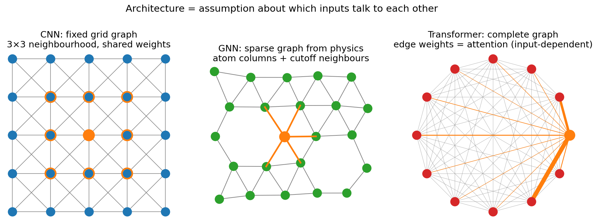
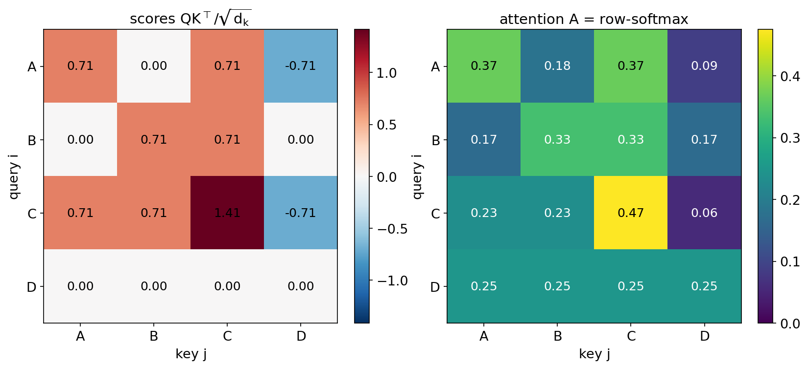
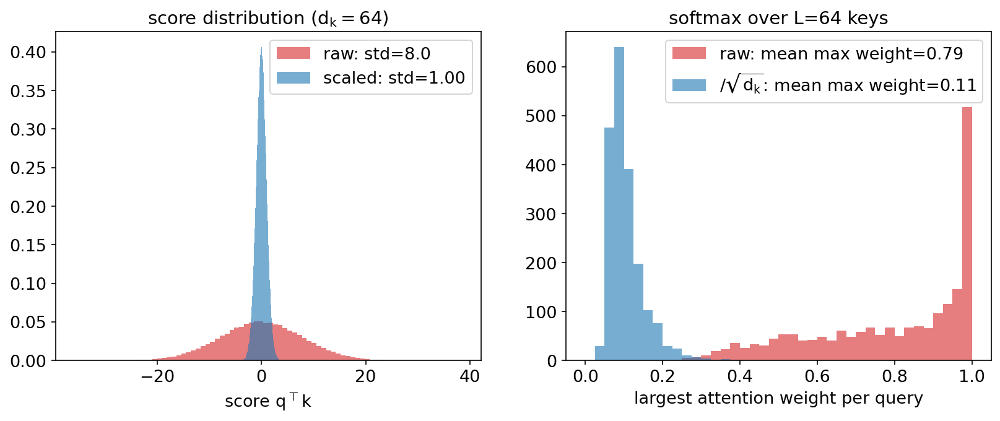
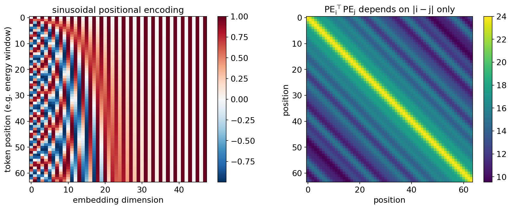
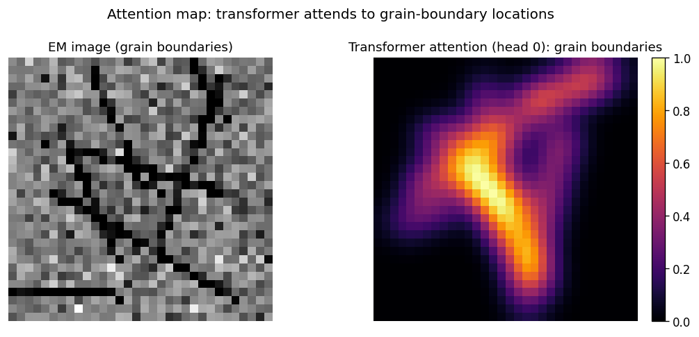
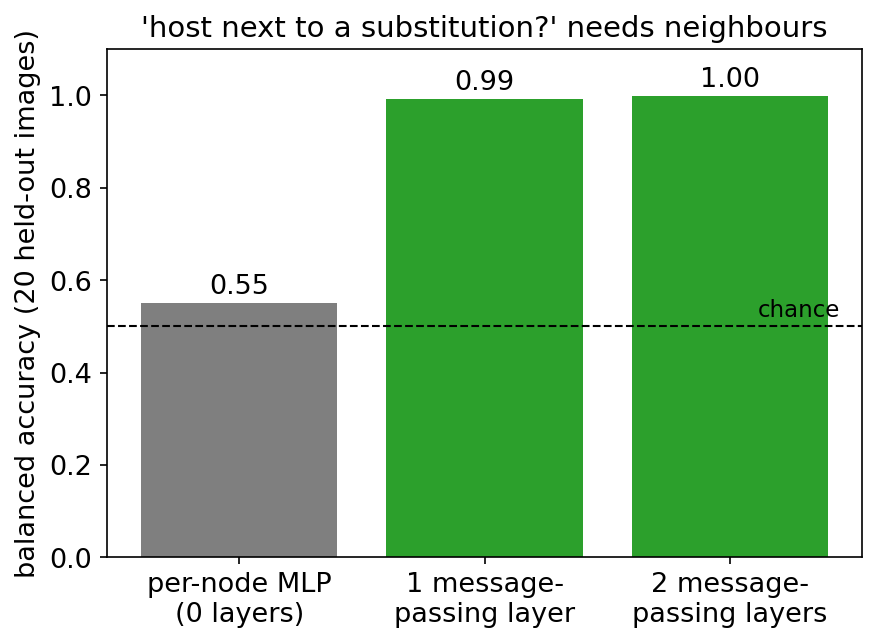

<!-- ===== §0. Recap + roadmap ===== -->

## Recap: where we left off

:::: {.incremental}
- **Week 9:** clustering, autoencoders, the VAE and rVAE, t-SNE/UMAP — a good *representation* is most of the work.
- **The architecture thread so far:** MLP (Week 6) — every input talks to every hidden unit with a *fixed* weight; CNN (Week 7) — only *neighbouring pixels* talk, with shared weights.
- **Gap:** many EM signals are not "local grids": Friedel pairs sit on opposite sides of a diffraction pattern, EELS edges couple over hundreds of eV, atom columns form an irregular *set* with vacancies.
- **Today's question:** how do we build networks whose connectivity matches *that* structure — learned from content (attention) or given by physics (graphs)?
::::

:::: {.notes}
- Week 9 in detail: k-means and GMMs, the VAE (ELBO, reparameterisation), rVAE for atomic-resolution images, and how t-SNE/UMAP latent spaces mislead. Once data sit in a well-structured latent space, clustering and anomaly detection become easy.
- Open with the Week 9 notebook: the VAE latent space separated the phases nicely — but the encoder was an MLP or a CNN. Today we ask whether those encoders were the right *shape* for the data.
- The one point to land: every architecture encodes an assumption about *which inputs are allowed to interact*. MLP: all, with fixed weights. CNN: only neighbours. Today: attention (all, with input-dependent weights) and graphs (whoever is connected by physics).
- Misconception to preempt: "transformers are a new paradigm that replaces everything before." They are one more point on the inductive-bias axis; the ERM loop from Week 4 and backprop from Week 6 are unchanged.
- EM anchor: hold up (or show) a CBED pattern — the information is in *pairs* of discs across the central beam. A 3×3 kernel needs many layers before those two discs ever meet.
- Pacing: 3 minutes. Transition: "Here is the plan for today."
::::

## Today's questions and road map

:::: {.incremental}
- **Why does a CNN struggle to tell a square from a rectangular lattice in a rotated diffraction pattern — and why does one attention layer help?**
- **What does an attention map actually tell you — and why is it not an explanation?**
- **How do you learn on a set of atom columns whose number and order change from image to image?**
- **Road map:** inductive bias · attention (Q/K/V, $\sqrt{d_k}$, multi-head) · positional encoding · transformer block & ViT · tokenising EM data, 4D-STEM/MAE, DiffractGPT · attention ≠ explanation · graphs & message passing · sequences · unifying picture · wrap-up.
- **Self-study:** `notebooks/week10_attention_gnn.ipynb` — self-attention from scratch, a mini-ViT on synthetic diffraction patterns (with a positional-encoding ablation), and a hand-written message-passing layer on an atom-column graph.
::::

:::: {.notes}
- Read the three questions aloud; each one maps to a block of today's lecture and to a part of the notebook.
- The one point to land: we will see the *same* operation — "update each element from a weighted sum of others" — three times: CNN (grid neighbours, fixed weights), GNN (graph neighbours), transformer (everyone, weights from content).
- Misconception to preempt: "I need a GPU for transformers." The notebook trains a transformer with ~60 k parameters on a laptop CPU in about a minute. Scale is not the concept.
- Pacing: 2 minutes, do not read every road-map item.
- **Timing plan (90 min, lecture path ≈ 85 min + 5 min questions):**
  - 0–6 min: recap, questions/road map, learning outcomes
  - 6–11: architecture = inductive bias; when CNN locality fails
  - 11–25: attention — soft dictionary, matrix view, hand-traced example, $\sqrt{d_k}$, multi-head
  - 25–32: permutation equivariance, sinusoidal/learned PE, PE for EM axes
  - 32–39: transformer block, ViT, ViT vs CNN
  - 39–48: tokenising EM data, 4D-STEM disc-token transformer + MAE, spectra/XRD/DiffractGPT, mini-ViT notebook results
  - 48–56: attention maps, attention ≠ explanation, occlusion check, responsible use
  - 56–67: atom-column graphs, graph construction, message passing, permutation invariance, depth/over-smoothing, GNN defect results
  - 67–70: sequences for in-situ EM
  - 70–75: unifying picture, decision guide
  - 75–85: notebook pointer, summary, must-know, next week
  - 85–90: slack / questions
- Backup slides after "Continue": 4D-STEM benchmark, ViT for XRD, transformer anti-patterns, GNNs beyond the microscope, practical sequence-model checklist.
- Transition: "Let's start with what we already know — architectures as assumptions."
::::

## Learning outcomes

By the end of this week you can:

:::: {.incremental}
1. **Write down** scaled dot-product attention $\mathrm{softmax}(QK^\top/\sqrt{d_k})V$, explain every symbol, and justify the $\sqrt{d_k}$.
2. **Explain** why attention is permutation-equivariant and how positional encodings (1-D, 2-D, physical axis) restore order.
3. **Choose a tokenisation** for an EM modality (image patches, Bragg discs, spectral windows, 4D-STEM scan positions) and argue its consequences.
4. **Describe** ViT, masked-autoencoder pretraining and their use on 4D-STEM data; place DiffractGPT-style generative models in context.
5. **Critically read** an attention map and state why attention weights are not a faithful explanation.
6. **Build** an atom-column graph, write one message-passing update, and prove it is permutation-equivariant.
7. **Relate** CNN, GNN and transformer as grid, sparse and complete graphs — and pick one for a given EM task and data budget.
::::

:::: {.notes}
- These seven outcomes are the examinable surface of the week; the must-know list at the end compresses them.
- Outcomes 1, 5 and 7 are the most exam-relevant: the formula, the attention-≠-explanation argument, and the unifying graph picture.
- Misconception to preempt: outcome 4 does not require you to reproduce paper details — you should be able to say *what problem* a 4D-STEM transformer solves and *why* MAE pretraining helps with few labels.
- Pacing: 1 minute. Transition: "Let's make the inductive-bias idea explicit."
::::

<!-- ===== §1. Architecture as inductive bias ===== -->

## Architecture = assumption about who talks to whom

:::: {.columns}
:::: {.column width="45%"}
:::: {.incremental}
- **MLP (Week 6):** every input connected to every unit; weights fixed after training; no notion of neighbourhood or order.
- **CNN (Week 7):** each pixel combines its $k\times k$ neighbours with the *same* kernel everywhere → locality + translation equivariance.
- **GNN (today):** each atom combines its *graph* neighbours; the graph comes from physics (bonds, cutoff distance).
- **Transformer (today):** each token combines *all* tokens, with weights computed from the content.
::::
::::
:::: {.column width="55%"}
{width="100%"}
::::
::::

:::: {.notes}
- This figure is the spine of the whole lecture; we return to it at the end. Point at each panel: "which nodes talk to the orange node?"
- The one point to land: inductive bias = what the architecture assumes before seeing data. Strong bias (CNN, GNN) = data-efficient if the assumption is right. Weak bias (transformer) = flexible, but must learn the structure from data.
- Misconception to preempt: "weak inductive bias is always better because it is more general." In EM we usually have hundreds, not millions, of labelled examples — the right assumption beats generality.
- EM anchor: a CNN's assumption is perfect for grain-boundary segmentation (local texture); a GNN's is perfect for atom-column lattices; a transformer's for diffraction and spectra where relations are long-range.
- Transition: "When exactly does locality fail?"
::::

## When CNN locality fails in EM

:::: {.incremental}
- **Diffraction patterns:** lattice type and orientation live in the *angles and length ratios between discs*, and Friedel pairs $I(\mathbf{g}) = I(-\mathbf{g})$ sit on opposite sides of the central beam. A stack of $3\times 3$ convolutions needs $\sim$(pattern radius) layers before antipodal discs interact.
- **Spectra:** an EELS L$_{2,3}$ white-line ratio compares peaks ~15 eV apart; ELNES/EXAFS correlations extend over 100+ eV — long-range along the energy axis.
- **Atom columns:** positions are irregular, the number of columns varies per image, vacancies break the grid — pixels are not the natural unit.
- **In-situ series:** frame $t$ depends on frames $t-1, t-2, \dots$ with variable lag — order matters, grid locality in time is too restrictive.
::::

. . .

> A CNN *can* learn long-range relations — through depth and pooling — but it pays in layers and data. Attention couples any two inputs in **one** layer.

:::: {.notes}
- Walk through the four cases and ask the audience for the characteristic interaction distance in each.
- The one point to land: the receptive field of a CNN grows linearly with depth (Week 7). Attention has a global receptive field from layer 1.
- Misconception to preempt: "CNNs cannot do global things." They can — ResNets classify ImageNet — but through many layers and pooling. The question is efficiency and data, not possibility.
- EM anchor: Friedel symmetry makes "long-range" exact: the two discs of a Friedel pair are physically coupled by construction.
- Transition: "So what would a layer look like whose connections are decided by the content?"
::::

<!-- ===== §2. Attention ===== -->

## Attention as a soft dictionary lookup

:::: {.incremental}
- A Python dict: `d["key"] → value` — exact match or nothing.
- A **soft** dict: a *query* is compared to *every* key; the answer is a similarity-weighted average of all values.
- Each token $\mathbf{x}_i \in \mathbb{R}^{d}$ plays three roles, via three learned projections:
  - **query** $\mathbf{q}_i = W_Q^\top \mathbf{x}_i$ — "what am I looking for?"
  - **key** $\mathbf{k}_j = W_K^\top \mathbf{x}_j$ — "what do I contain?"
  - **value** $\mathbf{v}_j = W_V^\top \mathbf{x}_j$ — "what do I pass on if selected?"
- Output: $\mathbf{z}_i = \sum_j a_{ij}\,\mathbf{v}_j$, with $a_{ij} = \dfrac{\exp(\mathbf{q}_i^\top\mathbf{k}_j/\sqrt{d_k})}{\sum_{j'}\exp(\mathbf{q}_i^\top\mathbf{k}_{j'}/\sqrt{d_k})}$.
::::

:::: {.notes}
- Use the library analogy: the query is your search phrase, keys are book titles, values are the book contents; you get a blend of books weighted by title match.
- The one point to land: the learning lives in $W_Q, W_K, W_V$. The attention formula itself has no parameters; training rotates the embedding space so that tokens that *should* interact produce aligned queries and keys.
- Misconception to preempt: "queries, keys and values are different inputs." In *self*-attention they are three linear views of the same tokens. (In cross-attention, queries come from one sequence and keys/values from another.)
- EM anchor: a token = one diffraction patch. The query of a patch containing a disc can learn to "look for" the patch that holds its Friedel partner.
- Notation (MFML): rows of $X \in \mathbb{R}^{L\times d}$ are tokens; $L$ = number of tokens, $d$ = embedding dimension, $d_k$ = query/key dimension.
- Transition: "Stack all tokens into matrices and the whole layer becomes one line."
::::

## Scaled dot-product attention — the matrix view

:::: {.columns}
:::: {.column width="58%"}
$$
Q = XW_Q,\quad K = XW_K,\quad V = XW_V \qquad X\in\mathbb{R}^{L\times d}
$$

$$
\boxed{\;\mathrm{Attention}(Q,K,V) = \underbrace{\mathrm{softmax}\!\left(\frac{QK^\top}{\sqrt{d_k}}\right)}_{A\,\in\,\mathbb{R}^{L\times L}\text{, rows sum to 1}} V\;}
$$

:::: {.incremental}
- $QK^\top$: all pairwise similarities at once — $L\times L$ scores.
- Row-wise softmax turns scores into weights; row $i$ of $A$ = where token $i$ looks.
- Cost: $\mathcal{O}(L^2 d)$ compute, $\mathcal{O}(L^2)$ memory — fine for 64 patches, painful for $10^4$.
::::
::::
:::: {.column width="42%"}
![Scaled dot-product attention: MatMul of $Q$ and $K$, scale, optional mask, softmax, MatMul with $V$ [@vaswani2017attention, Fig. 2].](img/attention_scaled_dot_product.png){width="70%"}
::::
::::

:::: {.notes}
- Box this equation on the board — it stays up for the rest of the lecture.
- Read it inside-out: scores, scale, normalise, average the values.
- The one point to land: the $L\times L$ matrix $A$ *is* the input-dependent adjacency matrix of a complete graph over tokens — the orange edges of the opening figure.
- Misconception to preempt: "the quadratic cost is a detail." It decides tokenisation in EM: a 256×256 diffraction pattern with 1-pixel tokens would be $L = 65\,536$ and $L^2 \approx 4\times10^9$ entries per head — impossible; with 16×16 patches $L = 256$ — trivial.
- Transition: "Let's compute one by hand."
::::

## Hand-traced example: four tokens

:::: {.columns}
:::: {.column width="40%"}
Four patch tokens, $d_k = 2$, $Q = K$ except D:

| token | $\mathbf{q}$ | $\mathbf{k}$ | $\mathbf{v}$ |
|---|---|---|---|
| A bright disc | (1,0) | (1,0) | (1,0) |
| B weak disc | (0,1) | (0,1) | (0,1) |
| C disc pair | (1,1) | (1,1) | (1,1) |
| D background | (0,0) | (−1,0) | (0,0) |

:::: {.fragment}
Row C: scores $(0.71, 0.71, 1.41, -0.71)$ → weights $(0.23, 0.23, 0.47, 0.06)$ → $\mathbf{z}_C = (0.71, 0.71)$.
::::
::::
:::: {.column width="60%"}
{width="100%"}
::::
::::

:::: {.notes}
- Do row C on the board: $\mathbf{q}_C^\top\mathbf{k}_A = 1$, $\mathbf{q}_C^\top\mathbf{k}_B = 1$, $\mathbf{q}_C^\top\mathbf{k}_C = 2$, $\mathbf{q}_C^\top\mathbf{k}_D = -1$; divide by $\sqrt 2$; softmax.
- The one point to land: the output $\mathbf{z}_C$ is a convex combination of the values — it lies inside the "value cloud", pulled toward tokens whose keys align with the query.
- Point at row D: a zero query gives equal scores and therefore *uniform* attention (0.25 each). "Uniform attention" is not "no information" — it is an average.
- Misconception to preempt: "attention weight = importance." Row D attends to everything equally, but that says nothing about how much D matters for the final prediction. We return to this in the explainability block.
- The same numbers appear in Part 1 of the notebook — students can verify their implementation against them.
::::

## Why divide by $\sqrt{d_k}$?

:::: {.columns}
:::: {.column width="40%"}
:::: {.incremental}
- If $\mathbf{q}, \mathbf{k}$ have i.i.d. zero-mean, unit-variance entries: $\mathrm{Var}(\mathbf{q}^\top\mathbf{k}) = \sum_{\ell=1}^{d_k}\mathrm{Var}(q_\ell k_\ell) = d_k$.
- Large-variance scores → softmax becomes nearly one-hot → its Jacobian ≈ 0 → gradients vanish at initialisation.
- Dividing by $\sqrt{d_k}$ restores unit variance; for $d_k = 64$, divide by 8.
::::
::::
:::: {.column width="60%"}
{width="100%"}
::::
::::

:::: {.notes}
- Do the variance argument on the board — it reuses "variance of a sum of independent terms" from probability.
- The one point to land: a single scalar decides whether a transformer trains. Same pathology as saturated sigmoids in Week 6 (vanishing gradients), same cure — keep pre-activations in the responsive range.
- Misconception to preempt: "the $\sqrt{d_k}$ is a tuning trick." It is derived, not tuned.
- Likely exam item: "why is attention scaled by $1/\sqrt{d_k}$?"
- Transition: "One attention pattern asks one kind of question. We usually want several."
::::

## Multi-head attention

:::: {.columns}
:::: {.column width="55%"}
$$
\mathrm{head}_h = \mathrm{Attention}(XW_Q^{(h)}, XW_K^{(h)}, XW_V^{(h)})
$$
$$
\mathrm{MHA}(X) = [\mathrm{head}_1,\dots,\mathrm{head}_H]\,W_O
$$

:::: {.incremental}
- $H$ heads with $d_k = d/H$ each → same cost as one full-width head.
- Each head learns its own notion of similarity: one head may pair Friedel partners, another group discs on the same lattice row, another attend to the central beam.
- Typical: ViT-Tiny $d = 192$, $H = 3$; our notebook $d = 48$, $H = 4$.
- Heads have **no guaranteed interpretable role** — do not over-read one head.
::::
::::
:::: {.column width="45%"}
![Multi-head attention: $H$ parallel scaled dot-product heads, concatenated and projected by $W_O$ [@vaswani2017attention, Fig. 2].](img/attention_multihead.png){width="65%"}
::::
::::

:::: {.notes}
- Analogy: several detectors viewing the same specimen — HAADF, ABF, DPC — each sees a different aspect; concatenate the signals.
- The one point to land: heads are cheap diversity. Splitting $d$ across heads keeps the parameter count and FLOPs constant.
- Misconception to preempt: "each head has a fixed interpretable role." Some heads specialise visibly, many do not, and heads are often redundant (pruning studies). Do not over-read a single head's map.
- Transition: "There is a property of attention we have been quietly ignoring — it does not know about order."
::::

<!-- ===== §3. Positional encoding ===== -->

## Attention is permutation-equivariant

:::: {.incremental}
- Permute the tokens with a permutation matrix $P$: $X \to PX$.
- Then $Q \to PQ$, $K \to PK$, $V \to PV$, scores $\to P\,QK^\top P^\top$; row-softmax commutes with $P$, so
$$\mathrm{Attention}(PX) = P\,\mathrm{Attention}(X).$$
- Same output vectors, just reordered — attention treats its input as a **set**.
- **A feature for sets** (atoms, detected discs, a composition {Fe, Cr, Ni}), **a bug for grids and axes** (patch $(0,0)$ vs $(7,7)$ of a diffraction pattern; 532 eV vs 708 eV).
::::

. . .

> Fix at the input, not in the operator: add a **positional encoding** to each token, $\tilde{\mathbf{x}}_i = \mathbf{x}_i + \mathbf{p}_i$.

:::: {.notes}
- Prove it on the board in one minute; students should be able to reproduce this in the exam.
- The one point to land: without positions, a ViT sees a *bag of patches*. For a diffraction pattern that destroys exactly the geometry (angles, distances from the central beam) we want to use.
- Misconception to preempt: "shuffling patches is a good augmentation for transformers." Only if your task is truly permutation-invariant. In the notebook, the ViT *without* positional embedding gives the same outputs for shuffled patches up to float round-off (max logit change ~$10^{-6}$) — we measure it.
- Forward link: the same equivariance is the *design goal* for GNNs later today — there, order carries no meaning, so we want it.
- Transition: "What should the positional encoding look like?"
::::

## Sinusoidal and learned positional encodings

:::: {.columns}
:::: {.column width="42%"}
$$
\mathrm{PE}(p, 2i) = \sin\!\big(p / 10000^{2i/d}\big),\quad
\mathrm{PE}(p, 2i+1) = \cos\!\big(p / 10000^{2i/d}\big)
$$

:::: {.incremental}
- Multi-scale "odometer": low dimensions oscillate fast (fine position), high dimensions slowly (coarse position).
- $\mathrm{PE}(p+k)$ is a fixed rotation of $\mathrm{PE}(p)$ → the model can express *relative* offsets.
- **Learned** embeddings (ViT, our notebook): one trainable vector per slot; simple, cannot extrapolate beyond the trained length.
- **RoPE**: rotate $\mathbf{q}, \mathbf{k}$ by position — standard in modern LLMs.
::::
::::
:::: {.column width="58%"}
{width="100%"}
::::
::::

:::: {.notes}
- Use the binary-counter analogy: bit 0 flips every step, bit 1 every two steps — sinusoids are the continuous version.
- The one point to land: the encoding is *added*, not concatenated. It works because $d$ is large and the network learns to read position and content from different subspaces.
- Misconception to preempt: "sinusoidal PE generalises to any length." In principle defined for any position; in practice extrapolation degrades.
- Transition: "EM data are not sentences — which encoding does each modality need?"
::::

## Positional encodings for EM axes

:::: {.incremental}
- **Micrographs & diffraction (2-D):** 2-D encodings — learned per patch, or separable sin/cos in $(x, y)$. For diffraction, polar coordinates $(k_r, k_\theta)$ relative to the central beam are physically natural.
- **Spectra (1-D, physical units):** the energy axis is *absolute* — the O-K edge is at 532 eV whether it is token 5 or token 17. Encode the actual energy (e.g. sinusoids of $E$ in eV), not the token index, if windows can shift.
- **4D-STEM:** two axes of position — detector $(k_x, k_y)$ inside a pattern and scan $(x, y)$ across the specimen. Decide which one your tokens span.
- **In-situ time series:** causal ordering — relative or causal encodings, plus a causal mask (no peeking at future frames).
::::

. . .

> **Diagnostic:** ablate the positional encoding. If accuracy does *not* drop, your task did not use geometry — or your model found a shortcut.

:::: {.notes}
- This slide is what distinguishes a materials course from a generic deep-learning course: the axes carry physical units.
- The one point to land: choosing the positional encoding is a physics decision. Getting it wrong gives a transformer that silently learns a permutation-invariant, physics-free map.
- EM anchor: in the notebook we train the same mini-ViT with and without positional embedding on rotated diffraction patterns — see the result slide later.
- Transition: "Now we can assemble the full transformer block."
::::

## The transformer block

:::: {.columns}
:::: {.column width="55%"}
$$
\begin{aligned}
X' &= X + \mathrm{MHA}(\mathrm{LN}(X))\\
X'' &= X' + \mathrm{MLP}(\mathrm{LN}(X'))
\end{aligned}
$$

:::: {.incremental}
- **Attention** mixes information *across* tokens.
- **MLP** (two dense layers, GELU) transforms each token *individually* — Week 6's MLP, applied per token.
- **Residual connections** (Week 7 ResNet) keep gradients flowing through deep stacks.
- **LayerNorm** (pre-norm) keeps activations well-scaled.
- Stack $N$ blocks; nothing else. Parameters do not depend on $L$.
::::
::::
:::: {.column width="45%"}
:::: {.fragment}
```python
class Block(nn.Module):
    def __init__(self, d, heads):
        super().__init__()
        self.n1 = nn.LayerNorm(d)
        self.n2 = nn.LayerNorm(d)
        self.attn = SelfAttention(d, heads)
        self.mlp = nn.Sequential(
            nn.Linear(d, 2*d), nn.GELU(),
            nn.Linear(2*d, d))

    def forward(self, x):
        x = x + self.attn(self.n1(x))
        return x + self.mlp(self.n2(x))
```
::::
::::
::::

:::: {.notes}
- Emphasise how little is new: attention (today), MLP (Week 6), residual + normalisation (Week 7). A transformer is an assembly of parts students already know.
- The one point to land: "attention = communication between tokens, MLP = computation within a token". Alternate the two, $N$ times.
- Misconception to preempt: "the transformer is mostly attention." In parameter count, the MLPs usually dominate.
- This exact code is in the notebook (Part 2).
- Transition: "Apply this to images: the Vision Transformer."
::::

<!-- ===== §4. ViT and EM ===== -->

## Vision Transformer (ViT)

:::: {.columns}
:::: {.column width="42%"}
:::: {.incremental}
1. **Patchify:** cut the image into $P\times P$ patches; 32×32 with $P = 4$ → $L = 64$ tokens.
2. **Linear embed** each flattened patch to $d$ dimensions.
3. Prepend a learnable **[CLS] token**; add positional embeddings.
4. $N$ transformer blocks.
5. Classify from the final [CLS] state with a linear head [@dosovitskiy2021vit].
::::
::::
:::: {.column width="58%"}
![ViT overview: image split into patches, linearly embedded, positional embeddings added, a [CLS] token prepended, then a standard transformer encoder [@dosovitskiy2021vit, Fig. 1].](img/vit_patch_tokenization.png){width="100%"}
::::
::::

:::: {.notes}
- ViT = "the 2017 encoder applied to image patches". The only new ideas are patchify and 2-D positions.
- The one point to land: the patch embedding is a *linear* layer — equivalently a convolution with kernel size = stride = $P$. The only locality left in a ViT is inside a patch.
- Misconception to preempt: "[CLS] is magic." It is a learnable token that gathers information via attention; global average pooling over patch tokens works just as well, often better on small data.
- Transition: "How does ViT compare to a CNN in practice?"
::::

## ViT vs CNN: data is the price of weak bias

:::: {.columns}
:::: {.column width="42%"}
:::: {.incremental}
- On ImageNet-scale data *without* heavy pretraining, ResNets beat ViTs; ViTs overtake only with very large pretraining sets and compute.
- Reason: a CNN gets locality and translation equivariance for free; a ViT has to *learn* them from data.
- EM reality: 100–10 000 labelled patterns. From-scratch ViTs overfit.
- **Remedies:** self-supervised pretraining on unlabelled data (MAE, Week 8), pretrained backbones, hybrids (CNN stem + transformer), or smaller patches + strong augmentation.
::::
::::
:::: {.column width="58%"}
![Transfer performance vs pre-training compute for ViTs, ResNets and hybrids. ResNets are more compute-efficient at small budgets; ViTs overtake at larger scale [@dosovitskiy2021vit, Fig. 5].](img/vit_vs_cnn_data_efficiency.png){width="100%"}
::::
::::

:::: {.notes}
- Reconnect to the inductive-bias triangle: weak bias = data hunger.
- The one point to land: in EM, a transformer from scratch is justified only when the relation is genuinely long-range (diffraction, spectra) *or* you can pretrain on a large unlabelled corpus.
- Misconception to preempt: "transformers are always state of the art, so use them." On a 500-image SEM segmentation task, a U-Net (Week 7) will usually beat a from-scratch ViT.
- Honest-validation reminder (Week 4): when comparing CNN vs ViT, split by specimen/session, same budget of tuning for both.
- Transition: "If we do use a transformer on EM data, the first design decision is: what is a token?"
::::

## Tokenising EM data: the token is the inductive bias

{width="92%"}

:::: {.notes}
- The one point to land: what you call a token decides what one attention layer can mix. Patches keep all pixels but blur disc geometry at seams; disc tokens throw away pixels but make geometry explicit; spectral windows respect the physical axis.
- 4D-STEM has two valid tokenisations: tokens = patches of *one* diffraction pattern (per-position inference), or tokens = *scan positions* (each position summarised by an embedding) for spatial context. They answer different questions.
- War story (from ML-PC U10): 16×16 patches on a CBED pattern with ~10 px discs → discs land on seams → accuracy plateaus. Diagnostic: overlay the patch grid on real patterns before training.
- Misconception to preempt: "the tokenisation is a preprocessing detail." It is a modelling decision with a physics consequence — make it explicitly and ablate it.
- Transition: "Here is a real 4D-STEM transformer that uses disc tokens."
::::

## Case study: transformer for 4D-STEM orientation & phase maps

:::: {.columns}
:::: {.column width="45%"}
:::: {.incremental}
- **4D-STEM:** $10^5$–$10^6$ diffraction patterns per scan.
- **Je et al. (2026):** each **Bragg disc is a token** $(k_r, k_\theta, I)$; encoder + mean pooling → orientation and phase; symmetry-aware loss [@dstem_transformer2024].
- **Amortised inference:** ~14× (CPU) to ~100× (GPU) faster than template matching.
- **Few labels?** **Masked autoencoder** pretext [@he2022mae]: hide ~75 % of patches, reconstruct them — no labels; then fine-tune on a few hundred labelled positions.
::::
::::
:::: {.column width="55%"}
![Disc-token transformer: detected Bragg discs are embedded by $(k_r, k_\theta, I)$, mixed by a transformer encoder, pooled, and mapped to structural attributes [@dstem_transformer2024].](img/dstem_fig1_architecture.png){width="95%"}
::::
::::

:::: {.notes}
- What the paper did: 4D-STEM scans → per-position orientation/phase inference, compared against correlative template matching (py4DSTEM).
- The one point to land: **amortised inference** — one forward pass per pattern replaces a per-pattern search over a template library. That is why it scales to millions of patterns.
- Note that disc tokens with no positional index form a *set*; the geometry is in the token features $(k_r, k_\theta)$. Permutation-invariance is exactly right here — the order in which a peak finder lists discs is meaningless.
- Honest validation: hold out *whole scans*, not random probe positions — neighbouring positions are nearly identical (Week 4 leakage).
- This is a 2026 arXiv preprint; treat numbers as preliminary. Benchmark figure: backup slide.
- MAE (Week 8 link): a 4D-STEM scan has $10^5$+ patterns but zero labels; reconstructing masked discs from visible ones forces the encoder to learn the lattice. Pretraining on your own scans is fine if evaluation scans are held out and the pretraining data are reported.
- Transition: "Spectra and 1-D diffraction work the same way — and transformers can also *generate*."
::::

## Spectra, XRD and DiffractGPT

:::: {.columns}
:::: {.column width="48%"}
:::: {.incremental}
- **1-D signals:** XRD/EELS windows along $2\theta$ or energy → tokens; one layer couples distant peaks [@vit_xrd2024].
- **DiffractGPT** [@choudhary2025diffractgpt]: a *generative* transformer maps powder XRD → atomic structure as a token sequence — an inverse problem (Weeks 12–13) solved by generation.
- **LLM outlook:** literature mining, analysis code, agents calling instrument APIs (Week 11).
- Caveat: outputs are *candidates* — physics validation is non-negotiable.
::::
::::
:::: {.column width="52%"}
![DiffractGPT workflow: the XRD pattern is tokenised and fed to a GPT (optionally conditioned on elements or formula), which autoregressively generates a structure that is then relaxed; contrast with database matching [@choudhary2025diffractgpt].](img/diffractgpt_fig3_overview.png){width="72%"}
::::
::::

:::: {.notes}
- ViT-for-XRD details (segment tokens, elemental priors as extra tokens, energy-calibration pitfall): backup slide. For EELS, absolute-energy positional encodings bake in calibration drift — align spectra first (Week 3).
- DiffractGPT: optional chemistry conditioning; candidate structures relaxed with a force field.
- Contrast discriminative (ViT: pattern → label) with generative (GPT: pattern → structure tokens). Both are transformers; the decoder uses a causal mask.
- The one point to land: once everything is a token sequence — patterns, structures, text — one architecture can map between modalities. That is the real reason transformers took over.
- Misconception to preempt: "an LLM can solve structures by reading the pattern." DiffractGPT is trained on paired pattern/structure data from a database; outside that distribution (new chemistries, multiphase samples, strong texture) expect failures. Week 11 (uncertainty, OOD) is the safety net.
- EM transfer: the same framing is being explored for electron diffraction and 4D-STEM; treat it as outlook, not routine.
- Transition: "Let's see what a tiny transformer does on our synthetic diffraction problem."
::::

## Mini-ViT on synthetic diffraction patterns (notebook)

{width="100%"}

:::: {.incremental}
- Task: classify **square / hexagonal / rectangular** lattice from a randomly rotated pattern — requires *angles and length ratios* between discs.
- With positional embeddings: **0.99** test accuracy; without: **0.90** — the "bag of patches" keeps what is *inside* each patch but loses the global geometry (chance = 0.33).
- Same model at 10× lower dose (not in training): **0.42**, barely above chance — while the mean softmax confidence stays at **0.98**. Deploy at the dose you validated (Week 2, Week 11).
::::

:::: {.notes}
- These numbers come from the same code as the notebook (fixed seeds); students reproduce them in Part 2.
- The one point to land: the positional-encoding ablation is the cleanest demonstration that the model uses geometry. Removing it makes the model permutation-invariant over patches — it can still use what lies *inside* each 4×4 patch (spot sizes, partial spacings, intensity statistics), which is surprisingly informative (0.90), but it cannot measure angles and distances across the pattern, so the last ~10 % of accuracy needs geometry.
- Misconception to preempt: "high accuracy on a synthetic test set means it works on real data." Real patterns have dynamical intensities, thickness effects, detector artefacts — the synthetic test set shares the generator with training, which is the most optimistic split imaginable.
- Dose shift: the drop at 10× lower dose is a preview of Week 11 — a model has no way to tell you it is out of distribution unless you build that in.
- Transition: "The model also gives us attention maps. What do they mean?"
::::

<!-- ===== §5. Attention maps and explainability ===== -->

## Attention maps: what the model "looks at"

:::: {.columns}
:::: {.column width="42%"}
:::: {.incremental}
- Read row [CLS] of the attention matrix $A$ in the last block: how much the class token draws from each patch → a heat map over the image.
- **Attention rollout** multiplies the per-layer attention matrices (with the residual identity) to trace information flow through depth [@abnar2020attentionflow].
- Cheap (no backward pass) and patch-level, hence smoother than pixel saliency (Week 7).
- Useful as a **sanity check**: an orientation model should attend to discs, not to vacuum, the beam stop or a detector seam.
::::
::::
:::: {.column width="58%"}
{width="100%"}
::::
::::

:::: {.notes}
- Walk through the figure: warm colours along the boundaries — a pleasing picture. The rest of this block is about why "pleasing" is not "faithful".
- The one point to land: attention maps are *descriptions of the forward computation*, not measurements of what the prediction depends on.
- EM anchor: if a phase classifier's attention sits on the scale bar or a detector hot pixel, you have found a shortcut (Week 7 shortcut-learning demo) — that use is legitimate.
- Misconception to preempt: "a single head's map is the explanation." Heads differ, layers differ, and the residual stream carries information that bypasses attention entirely.
- Transition: "Why is attention not an explanation?"
::::

## Why attention ≠ explanation

:::: {.incremental}
- **Values matter, not just weights:** $\mathbf{z}_i = \sum_j a_{ij}\mathbf{v}_j$ — a large $a_{ij}$ on a token with a tiny $\mathbf{v}_j$ contributes nothing; a small weight on a huge value can dominate.
- **Residual stream bypass:** $X' = X + \mathrm{MHA}(\cdot)$ — information flows around attention; the head output is only part of the story.
- **Mixing through depth:** after layer 1, token $j$ already contains information from all other patches; "attention to patch $j$" in layer 3 is not attention to the *pixels* of patch $j$.
- **Non-uniqueness:** different attention patterns can give the same prediction [@jain2019attention]; attention *can* be informative, but must be validated [@wiegreffe2019attention].
::::

. . .

> Attention is a hypothesis about what matters. An intervention (occlusion, ablation, counterfactual) is the test.

:::: {.notes}
- Literature: Jain & Wallace found attention weights often correlate weakly with gradient/leave-one-out importance; Wiegreffe & Pinter showed the conclusion depends on the test.
- This is the Week 10 entry in the explainability ladder: attention sits with saliency (Week 7) as a *descriptive* tool, below interventional evidence.
- The one point to land: "the model attends to X" ≠ "the prediction depends on X". Only an intervention measures dependence.
- Misconception to preempt: "the debate was settled — attention is useless." No: the correct position is that attention can be informative, but you must check it against an intervention on your task.
- Exam item: give two reasons why attention weights are not a faithful explanation.
- Transition: "We ran that check on our mini-ViT."
::::

## Checking attention against occlusion (notebook)

{width="62%"}

**Mean Spearman correlation, attention vs occlusion (100 patterns): ≈ 0.04 — essentially none.**

:::: {.notes}
- Explain occlusion: blank one patch, re-run the model, record how much the probability of the predicted class drops. That is a (crude) intervention — it measures dependence.
- The one point to land: the mean rank correlation between attention and occlusion over 100 test patterns is **0.04** — essentially zero. Attention spreads over the central beam and many discs; occlusion shows that blanking almost any single patch changes nothing (the lattice is redundantly encoded by many discs), and only one or two patches matter.
- Caveat on occlusion itself: blanking a patch creates an out-of-distribution input (Week 7) — no attribution method is ground truth; agreement between *different kinds* of evidence is what builds trust.
- Students reproduce this in Part 2 of the notebook and can vary the layer / head.
- Transition: "A practical checklist."
::::

## Using attention maps responsibly

:::: {.incremental}
- ✅ **Do** use attention to spot shortcuts (scale bars, beam stop, detector seams, sample-holder edges).
- ✅ **Do** aggregate over heads and layers (rollout) and look at many examples, including failures.
- ✅ **Do** confirm with an intervention: occlusion, masking the suspected region, or a counterfactual pattern (e.g. remove one Friedel partner).
- ❌ **Don't** claim "the model learned the physics because it attends to the discs" — discs are also where the signal is.
- ❌ **Don't** report one hand-picked head on one hand-picked image.
- **Ladder so far:** coefficients (W4) → permutation importance/SHAP (W5) → saliency/Grad-CAM/occlusion (W7) → latent-space reading (W9) → attention maps (W10) → uncertainty as a trust gate (W11).
::::

:::: {.notes}
- The one point to land: explainability tools are *diagnostic instruments*; like any instrument they need calibration (sanity checks) before you trust the reading.
- EM anchor: a physically meaningful counterfactual in diffraction is to delete one disc of a Friedel pair or to rotate the pattern — if the prediction changes in the way physics predicts, that is far stronger evidence than any heat map.
- Transition: "Now we leave pixels and patches behind and turn to atoms: graphs."
::::

<!-- ===== §6. Graph neural networks ===== -->

## From atom-column images to graphs

{width="100%"}

:::: {.notes}
- Pipeline (Week 5 revisited): find columns (peak finding + Gaussian refinement) → nodes with features (intensity, fitted width, local descriptors) → edges from a cutoff or $k$ nearest neighbours → edge features (distance, displacement vector).
- The one point to land: the graph is where the physics goes in. Which atoms are "neighbours" is a modelling decision (cutoff, $k$-NN, Voronoi), just like the tokenisation for transformers.
- Why not a CNN on the image? You can — but the image has ~$10^5$ pixels for ~$10^2$ columns, vacancies are "missing pixels" rather than missing nodes, and column positions with sub-pixel precision are lost to the grid.
- Transition: "Formally, what is a graph and what do we compute on it?"
::::

## Graph construction for EM data

:::: {.incremental}
- Graph $G = (V, E)$: nodes $i \in V$ with features $\mathbf{h}_i^{(0)}$; edges $(j \to i) \in E$ with features $\mathbf{e}_{ij}$.
- **Node features:** integrated column intensity (∝ $Z^{\sim1.7}$ in HAADF), Gaussian width, local descriptors (Week 5: neighbour count, bond angles).
- **Edges:** cutoff $\|\mathbf{r}_i - \mathbf{r}_j\| < r_c$ (between first and second shell), or $k$-NN; for crystals include periodic images [@xie2018cgcnn].
- **Edge features:** distance $d_{ij}$ (often expanded in Gaussian radial basis functions), displacement $\mathbf{r}_j - \mathbf{r}_i$ — the carrier of **strain** information.
- **Pitfalls:** cutoff too small → disconnected graph at a strained region; too large → second-shell neighbours; results must be reported with $r_c$ (reproducibility).
::::

:::: {.notes}
- Connect to MG U07 (crystals as periodic graphs): same construction, but in EM we see a 2-D projection with vacancies, noise and finite field of view.
- The one point to land: strain is an *edge* quantity (relative displacement), defect type is mostly a *node* quantity (intensity) plus its neighbourhood. The graph lets us represent both.
- Misconception to preempt: "the graph is given." It is inferred from noisy detections — a missed column changes the graph topology. Always visualise the graph over the image.
- In our notebook the cutoff is 1.2 lattice spacings: nearest neighbours only.
- Transition: "Now the core operation: message passing."
::::

## The message-passing template

$$
\boxed{\;\mathbf{h}_i^{(\ell+1)} = U\Big(\mathbf{h}_i^{(\ell)},\; \bigoplus_{j\in\mathcal{N}(i)} M\big(\mathbf{h}_i^{(\ell)}, \mathbf{h}_j^{(\ell)}, \mathbf{e}_{ij}\big)\Big)\;}
$$

:::: {.incremental}
- $M$: **message** function (small MLP) — what neighbour $j$ tells node $i$, given their relation $\mathbf{e}_{ij}$.
- $\bigoplus$: **permutation-invariant aggregation** — sum, mean or max (or attention weights!).
- $U$: **update** function — combine own state with the aggregated message (MLP, residual).
- Same $M, U$ at every node → weight sharing, like a convolution kernel; works for any number of nodes [@gilmer2017mpnn].
- Notebook version: $\mathbf{h}_i' = \mathrm{ReLU}\big(W_\text{self}\mathbf{h}_i + \sum_{j\in\mathcal{N}(i)} \mathrm{MLP}(\mathbf{h}_j)\big)$ — ten lines of PyTorch with `index_add_`.
::::

:::: {.notes}
- Put the boxed equation next to the attention equation on the board. Ask: what is the difference? Answer: attention aggregates over *all* tokens with weights from content; message passing aggregates over *graph neighbours* with weights from the message function.
- The one point to land: a CNN is message passing on a grid graph where $M$ depends on the relative offset (the kernel weight). A GNN generalises this to irregular neighbourhoods.
- Misconception to preempt: "GNNs need special libraries." `torch_geometric` is convenient, but a layer is `index_add_` over an edge list. We write it by hand in the notebook.
- References: general framework [@gilmer2017mpnn]; graph convolution [@kipf2017gcn]; the relational-inductive-bias view [@battaglia2018relational].
::::

## Permutation invariance and equivariance

:::: {.incremental}
- Nodes have **no natural order** — the peak finder lists columns in arbitrary order. The model must not care.
- **Equivariance (node outputs):** permuting the node order permutes the outputs identically: $f(PX, PAP^\top) = P\,f(X, A)$.
  - Holds because $M, U$ are shared and $\bigoplus$ is a symmetric function (sum does not care about order).
- **Invariance (graph outputs):** a sum/mean readout $\mathbf{h}_G = \sum_i \mathbf{h}_i^{(L)}$ gives $f(PX, PAP^\top) = f(X, A)$ — Deep Sets in a nutshell [@zaheer2017deepsets].
- Notebook check: shuffle node indices, re-run — outputs agree exactly (max deviation 0 in our run).
- **Other symmetries** (rotation, translation): use distances/angles as edge features (invariant) or equivariant layers (vectors) — MG U09: SchNet, NequIP, MACE [@schutt2018schnet].
::::

:::: {.notes}
- Parallel to the attention slide: the same equivariance that is a *bug* for image patches is exactly what we *want* for atoms.
- The one point to land: symmetry is built into the architecture, not learned from augmentation. That is why GNNs are data-efficient on atomistic data.
- Readout choice (MG U07): *sum* for extensive targets (total count of defects), *mean* for intensive ones (defect fraction, average strain).
- Misconception to preempt: "if I feed raw $(x, y)$ positions as node features, the GNN is fine." Raw positions break translation invariance — a shifted image gives different features. Use relative displacements on edges.
- Exam item: prove that sum aggregation makes a message-passing layer permutation-equivariant.
::::

## Receptive field, depth and over-smoothing

:::: {.incremental}
- After $L$ layers, node $i$ has seen all nodes within $L$ hops — the GNN analogue of the CNN receptive field (Week 7).
- **Too shallow:** a label that depends on the second shell cannot be learned with one layer.
- **Too deep:** repeated neighbour averaging makes all node embeddings converge — **over-smoothing**; the GNN forgets which column is which.
- **Practical recipe (materials):** 2–4 layers + residuals + RBF-expanded *relative* distances/displacements (not absolute positions → translation invariance).
- Long-range effects (elastic fields of a dislocation, charge) are hard for local GNNs — add a global node (MEGNet-style) or attention layers → graph transformers.
::::

:::: {.notes}
- Refer back to the right panel of the atom-graph figure: orange = 1 hop, green = 2 hops.
- The one point to land: GNN depth is not "more is better" — pick the depth to match the physical interaction range.
- EM anchor: vacancy detection needs 1 hop (a node with a missing neighbour); a strain gradient needs a few hops; a long-range strain field around a dislocation core may need 10+ — at that point a transformer or a hybrid is more natural.
- Transition: "Does message passing actually help? Our notebook experiment."
::::

## GNN for defect classification (notebook)

:::: {.columns}
:::: {.column width="45%"}
:::: {.incremental}
- 60 synthetic column lattices (12×12, 8 % substitutions, 5 % vacancies); **train on 40 images, test on 20 unseen images** (grouped split, Week 4).
- Node label: *host column next to a substitution* — not decidable from the column's own intensity.
- Per-node MLP (0 layers): **0.55** balanced accuracy — essentially chance, as it must be.
- One message-passing layer: **0.99**; two layers: **1.00**.
- Same model on shuffled node order: identical outputs (equivariance check).
::::
::::
:::: {.column width="55%"}
{width="95%"}
::::
::::

:::: {.notes}
- The one point to land: the task is designed so that information *must* come from neighbours. A per-node model is stuck at 0.5 by construction; one hop of message passing is exactly what the label needs.
- Honest validation: we split by *image*, not by node. Nodes in the same image share noise and lattice realisation — a node-level random split would leak (Week 4).
- Real EM extension: node labels from simulation (known dopant positions), edge features = measured displacements → strain classification or dopant identification. Real-data caveat: column-finding errors propagate into graph errors.
- CGCNN, SchNet, equivariant GNNs and grain graphs: backup slide ("GNNs for materials beyond the microscope"); covered in depth in Materials Genomics U07/U09.
- Transition: "One more structure we see in EM: time."
- Misconception to preempt: "the second layer always helps." Here it barely changes anything (0.99 → 1.00) because the label is 1-hop. Depth should match the physics of the label.
::::

<!-- ===== §7. Sequences ===== -->

## Sequences for in-situ EM: RNN → transformer

:::: {.columns}
:::: {.column width="50%"}
:::: {.incremental}
- In-situ heating, biasing, liquid-cell TEM → **movies**: frame $t$ depends on earlier frames.
- **RNN / LSTM:** hidden state $\mathbf{s}_t = f(\mathbf{s}_{t-1}, \mathbf{x}_t)$, weights shared over time; gates mitigate vanishing gradients [@hochreiter1997lstm]. Sequential and slow; memory fades.
- **Causal transformer:** each frame attends to all *earlier* frames in one layer; parallel training.
- **Start frame-wise** (Week 7 per-frame segmentation + tracking); add temporal context only when the label needs history.
::::
::::
:::: {.column width="50%"}
![An RNN unrolled through time: the same weights are applied at every step and the hidden state carries memory forward [@mcclarren2021machine, Fig. 7.2].](img/rnn_unrolled.png){width="100%"}
::::
::::

:::: {.notes}
- Keep this to ~3 minutes: it is a pointer, not a full treatment (ML-PC U07 covers sequences and probabilistic forecasting in depth). The practical checklist (factorised space/time attention, latent sequences, cumulative dose as covariate) is on a backup slide.
- Typical EM tasks: drift/tracking, nucleation-event detection, forecasting a phase transformation, anomaly flags during automated acquisition.
- The one point to land: a sequence is a 1-D grid with a *causal* arrow. RNNs are "recurrent CNNs along time"; transformers with a causal mask are "complete graphs restricted to the past".
- Misconception to preempt: "for video, just stack frames as channels in a CNN." That fixes the temporal window and ignores variable-lag effects.
- Honest validation for time series: split by *time* (train on early runs, test on later runs), never randomly across frames — neighbouring frames are nearly identical (temporal leakage, Week 4).
- Forward link: Week 11 uses exactly these streaming settings for autonomous experiments.
- Transition: "Let's put all architectures into one picture."
::::

<!-- ===== §8. Unifying picture ===== -->

## The unifying picture

:::: {.columns}
:::: {.column width="48%"}
One update rule for all:
$$
\mathbf{h}_i' = \phi\Big(\mathbf{h}_i,\ \sum_{j \in \mathcal{N}(i)} w_{ij}\, \psi(\mathbf{h}_j)\Big)
$$

| | graph $\mathcal{N}(i)$ | weights $w_{ij}$ |
|---|---|---|
| **CNN** | grid, $k\times k$ | fixed by relative offset |
| **GNN** | sparse, from physics | from message fn / edge features |
| **Transformer** | complete | $\mathrm{softmax}(\mathbf{q}_i^\top\mathbf{k}_j/\sqrt{d_k})$ |
| **RNN** | chain (past) | fixed, shared over time |
::::
:::: {.column width="52%"}
:::: {.incremental}
- A CNN is a GNN on a grid graph with translation-shared, offset-dependent weights.
- A transformer is a GNN on the complete graph whose edge weights are computed from content.
- A graph transformer is attention restricted to (or biased by) a physical graph.
- Choosing an architecture = choosing $\mathcal{N}(i)$ and how $w_{ij}$ is computed — i.e. how much structure you *hard-code* versus *learn*.
::::
::::
::::

:::: {.notes}
- Put the opening figure back on screen next to this table.
- The one point to land (and exam item): CNN = grid graph, GNN = sparse graph, transformer = fully connected graph with input-dependent weights. Everything else is detail.
- Misconception to preempt: "these are competing families." They are points on one spectrum of assumptions about which inputs interact; hybrids (CNN stem + transformer, graph transformers) are common.
- Transition: "Which one should you pick for your miniproject data?"
::::

## Decision guide: which architecture for which EM data?

| EM data | structure | first choice | consider |
|---|---|---|---|
| SEM/TEM micrograph segmentation | local texture on a grid | U-Net (W7) | ViT/SAM backbone if pretrained |
| Diffraction pattern (orientation, phase, strain) | long-range, symmetric | disc-token transformer or CNN baseline | MAE pretraining on unlabelled scans |
| EELS/EDS spectrum | 1-D physical axis, long-range edges | 1-D CNN / PCA+trees (W3, W5) | spectral transformer with energy PE |
| Atom-column positions | irregular set with neighbours | GNN | descriptors + trees (W5) as baseline |
| Grain/particle networks | objects + relations | GNN | tabular descriptors (W5) |
| In-situ movie | frames + causal time | frame-wise CNN + tracking | temporal transformer / latent sequence |
| Small labelled data (< 500) | any | simplest model that respects the physics | pretrained features + linear probe (W8) |

:::: {.notes}
- The one point to land: always run the baseline ladder (Week 5: mean → linear → trees → neural net). A transformer must beat a well-tuned simpler model under a grouped split before you use it.
- Misconception to preempt: "the table is a rule." It is a starting point; the data budget and the physics decide.
- Miniproject hint: justify your architecture choice in terms of inductive bias — graders look for that argument.
::::

<!-- ===== §9. Wrap-up ===== -->

## Notebook: `week10_attention_gnn.ipynb`

:::: {.columns}
:::: {.column width="60%"}
- **Part 1 — self-attention from scratch** in NumPy: hand-traced example, equivariance, softmax saturation.
- **Part 2 — mini-ViT** on synthetic diffraction: PE ablation, low-dose test, attention vs occlusion.
- **Part 3 — (optional) message passing by hand** on atom-column graphs.
- **Exercises:** multi-head attention, patch size, displacement edge features.
::::
:::: {.column width="40%"}
`notebooks/week10_attention_gnn.ipynb`

[](https://colab.research.google.com/github/ECLIPSE-Lab/public_presentations/blob/main/data_science_for_em/notebooks/week10_attention_gnn.ipynb)

Runs on CPU in under 5 minutes; only NumPy, matplotlib, scikit-learn and PyTorch (no `torch_geometric`).
::::
::::

:::: {.notes}
- Part 2 runs on CPU in ~1–2 min; Part 3 uses `index_add_`, compares 0/1/2 layers and checks equivariance. Exercises are TODO cells with solutions.
- Recommend doing Part 1 before the next lecture — writing attention in 10 lines of NumPy removes all mystery.
- Part 3 is optional but strongly recommended for anyone whose miniproject involves atomic-resolution images.
- Remind students: the notebook numbers match today's slides; if yours differ a lot, check the seed and the positional-embedding flag.
::::

## Summary: the week in six points

:::: {.incremental}
- **Attention** $=\mathrm{softmax}(QK^\top/\sqrt{d_k})V$: each token is updated by a content-weighted average of all tokens; $\sqrt{d_k}$ keeps the softmax from saturating; multi-head = several similarity notions in parallel.
- **Attention is permutation-equivariant** → positional encodings are a physics decision (2-D for patterns, absolute energy for spectra, causal for time).
- **ViT** = patches → tokens → transformer blocks → [CLS] head; weak inductive bias → data-hungry → MAE/self-supervised pretraining on unlabelled 4D-STEM data.
- **Tokenisation** is the inductive bias: patches, Bragg discs, spectral windows, scan positions.
- **Attention ≠ explanation:** weights ignore value magnitudes, residual paths and mixing through depth — validate with interventions.
- **GNNs:** message passing on atom-column graphs, permutation-equivariant by construction; **CNN = grid graph, GNN = sparse graph, transformer = complete graph.**
::::

:::: {.notes}
- Use this slide for recap and as orientation for students who fell behind.
- The one point to land: the unifying graph picture lets you reason about *any* new architecture you meet — ask "what is the graph, and how are the edge weights computed?"
- Pacing: 3 minutes; take questions before the must-know slide.
::::

## Must-know for the exam

:::: {.incremental}
1. Scaled dot-product attention formula, the shape of $A$ ($L\times L$, rows sum to 1), and $\mathcal{O}(L^2)$ cost.
2. Why $1/\sqrt{d_k}$: $\mathrm{Var}(\mathbf{q}^\top\mathbf{k}) = d_k$ → softmax saturation → vanishing gradients.
3. Self-attention (and message passing with sum aggregation) is permutation-equivariant; positional encodings break the symmetry on purpose.
4. ViT pipeline and why ViTs need more data than CNNs; MAE as label-free pretraining.
5. Two reasons why attention weights are not a faithful explanation, and one intervention to test them.
6. Message-passing update (message, permutation-invariant aggregation, update); receptive field = number of layers; over-smoothing.
7. CNN = grid graph, GNN = sparse physical graph, transformer = complete graph with input-dependent weights.
::::

:::: {.notes}
- These seven statements are the exam surface for Week 10 (they are merged into the course must-know document).
- Derivations examinable: the $\sqrt{d_k}$ variance argument and the permutation-equivariance proof (both one-liners).
::::

## Next week: uncertainty, Gaussian processes & autonomous EM

:::: {.incremental}
- **Today's remaining gap:** our mini-ViT dropped from 0.99 to 0.42 accuracy at 10× lower dose — with its softmax confidence still at 0.98. No warning. Every model today produces a point prediction with no statement of confidence.
- **Week 11:** aleatoric vs epistemic uncertainty, deep ensembles and MC dropout, calibration, conformal prediction, and out-of-distribution detection as a trust gate.
- **Gaussian processes & Bayesian optimisation:** models that know what they do not know — and use it to choose the next measurement.
- **Autonomous EM:** closing the loop between model and microscope — where the transformer and LLM agents from today meet uncertainty-aware decision making.
::::

:::: {.notes}
- Close the arc: today we made architectures match the structure of EM data; next week we make their predictions honest about uncertainty.
- The one point to land: a confident wrong answer at deployment (the low-dose ViT) is the most dangerous failure mode — Week 11 is about detecting it.
- Pacing: 2 minutes.
::::

<!-- BEGIN prev-next -->

## Continue

- &larr; Previous: [Unit 09 &mdash; Unsupervised learning, autoencoders & latent spaces](../09_unsupervised_latent/01_intro.html)
- &rarr; Next: [Unit 11 &mdash; Uncertainty, Gaussian processes & autonomous EM](../11_uncertainty_autonomous_em/01_intro.html)
- [All courses](../../index.html)

<!-- END prev-next -->

## Backup slides {visibility="uncounted"}

Material beyond the 90-minute lecture path, for self-study and questions.

## 4D-STEM transformer: speed and the MAE pretext {visibility="uncounted"}

:::: {.columns}
:::: {.column width="45%"}
:::: {.incremental}
- **Speed:** at $10^6$ patterns, ~14× (CPU) to ~98× (GPU) faster than template matching [@dstem_transformer2024].
- **The label problem:** orientation labels need simulation or slow indexing; phase labels need expert annotation.
- **Masked autoencoder (MAE) pretext** [@he2022mae]: hide 75 % of patches, reconstruct them from the rest — *no labels*. The unlabelled 4D-STEM stack itself is the pretraining corpus.
- Then fine-tune (or linear-probe, Week 8) on the few hundred labelled positions you can afford.
::::
::::
:::: {.column width="55%"}
![Template matching (b) vs transformer (c) with identical inputs and outputs; wall time vs number of patterns (d) and per-step GPU timing (e) [@dstem_transformer2024].](img/dstem_fig3_benchmark.png){width="100%"}
::::
::::

:::: {.notes}
- Connect to Week 8: MAE is the masked-modelling flavour of self-supervision; here it becomes the natural pretraining for diffraction and spectra.
- The one point to land: a 4D-STEM scan contains $10^5$+ patterns but typically zero labels. MAE turns that asymmetry into an advantage.
- Why MAE is plausible physically: diffraction patterns are highly redundant (symmetry, Friedel pairs) — reconstructing masked discs from visible ones forces the encoder to learn the lattice.
- Misconception to preempt: "pretraining on my own scan is cheating." It is not, as long as the evaluation scans are held out from the labelled fine-tuning *and* you report which data was used for pretraining.
::::

## Spectra and XRD as token sequences {visibility="uncounted"}

:::: {.columns}
:::: {.column width="45%"}
:::: {.incremental}
- Cut the 1-D pattern into fixed-length segments → tokens; prepend [CLS]; add positional encoding; transformer encoder; linear head.
- Phase identification depends on the *set* of peak positions and their ratios across the whole $2\theta$ (or energy) axis — a relational, long-range task.
- **Multimodal:** elemental priors (known chemistry) enter as extra tokens — no bolted-on branch needed [@vit_xrd2024].
- **EELS/EDS analogue:** windows along the energy axis; edge onset + fine structure coupled in one layer. Poisson noise (Week 2) still dictates the loss.
::::
::::
:::: {.column width="55%"}
![ViT for XRD: the 1-D pattern is sliced into segments (tokens), a CLS token and spectral + positional embeddings are added, a transformer encoder mixes the segments, and a head outputs phase identification/quantification [@vit_xrd2024].](img/vitxrd_fig1_architecture.png){width="100%"}
::::
::::

:::: {.notes}
- The one point to land: the same ViT recipe works on 1-D signals; "patch" becomes "energy window".
- EM anchor: an EELS spectrum image is a 2-D grid of 1-D spectra — you can token along energy (per-pixel classification) or across pixels (spatial context). Same choice as 4D-STEM.
- Misconception to preempt: "a 1-D CNN cannot do this." It can, with enough depth; the transformer's advantage is one-layer coupling of distant peaks and easy fusion of extra modalities.
- Pitfall: if energy calibration drifts between sessions, absolute-energy positional encodings bake in the drift. Align spectra (Week 3 preprocessing) first.
::::

## Anti-patterns for transformers on EM data {visibility="uncounted"}

:::: {.incremental}
- **Data hunger:** from-scratch ViT on 500 micrographs → overfit; a ResNet or U-Net wins. Fix: pretraining (MAE/DINO, Week 8) or a smaller model.
- **Positional embedding forgotten or shuffled:** the model silently becomes a bag of patches. Fix: ablate and check the drop.
- **Patch seams through discs:** accuracy caps. Fix: smaller/overlapping patches or disc tokens.
- **Dose / detector mismatch:** trained at high dose, deployed on beam-sensitive samples → confident and wrong. Fix: dose augmentation (Week 8), validate at deployment dose, uncertainty (Week 11).
- **Leaky splits:** random probe positions of the same scan in train and test → inflated accuracy. Fix: split by scan / specimen (Week 4).
::::

:::: {.notes}
- Each item is a real lab failure; ask students which ones they would detect with the standard train/val/test protocol (only the last one — and only if the split is grouped).
- The one point to land: most transformer failures in EM are *data* failures, not architecture failures.
- War story: a strain-mapping model trained on robust inorganic data, deployed at a tenth of the dose on a battery cathode, produced smooth, plausible — and wrong — maps with no warning.
::::

## GNNs for materials beyond the microscope {visibility="uncounted"}

:::: {.incremental}
- **CGCNN** — crystal graph, gated convolution on bonds, sum/mean pooling → formation energy, band gap [@xie2018cgcnn].
- **SchNet** — continuous-filter convolutions on interatomic distances, rotation/translation invariant by construction [@schutt2018schnet].
- **Equivariant GNNs** (NequIP, MACE) — vector/tensor features, machine-learned interatomic potentials (MG U09).
- **Where EM meets them:** atom positions from STEM/tomography → graph → GNN predicts local energy/strain; or GNN potentials generate structures for simulation-based training data (Week 8: sim-to-real).
- Beyond atoms: grain graphs from EBSD/SEM (grains = nodes, boundaries = edges) → property prediction from microstructure topology.
::::

:::: {.notes}
- Keep this brief — these architectures are treated in detail in Materials Genomics (U07, U09). The DSEM message: the same message-passing template underlies all of them.
- The one point to land: graphs are the natural representation whenever your data are *objects with relations* — atoms, columns, grains, particles.
- EM anchor: grain-boundary networks from EBSD are graphs; grain-growth or crack-path models on those graphs are an active research area.
::::

## Practical: when does a sequence model pay off? {visibility="uncounted"}

:::: {.incremental}
- **Frame-wise model first:** if each frame can be analysed alone (segmentation per frame, Week 7), do that and post-process (tracking, smoothing).
- **Add temporal context** when the label depends on history: "is this a nucleation event or noise?", "will this particle coalesce?"
- **Cost:** attention over $T$ frames × $L$ patches per frame is $\mathcal{O}((TL)^2)$ — factorise: spatial attention within a frame, temporal attention across frames per location.
- **Latent sequences:** encode each frame with the Week 9 autoencoder, then model the trajectory of latent codes — cheap and interpretable.
- **Beam effects:** the electron dose itself changes the specimen over time — include cumulative dose as a covariate, or you will "discover" beam damage as physics.
::::

:::: {.notes}
- The one point to land: start simple (frame-wise), add temporal modelling only when the question requires history.
- EM anchor: in liquid-cell TEM, growth rates depend on the beam-induced radiolysis — cumulative dose is a confounder that any temporal model must see.
- Forward link: Week 11 uses exactly these streaming settings for autonomous experiments — the model decides the next acquisition.
::::

## References

::: {#refs}
:::
