<!-- ===== §0. Recap + roadmap ===== -->

## Recap: Week 10 and today's question

:::: {.incremental}
- **Week 10:** attention, transformers and graph networks — the last architecture family of the course. CNN = grid graph, GNN = sparse graph, transformer = fully connected graph. We read attention maps and learned that *attention ≠ explanation*.
- **The gap every architecture shares:** a ViT, a GNN or a U-Net outputs a softmax or a number — *always*, with the same apparent confidence, whether the input looks like the training data or not.
- **Today's question:** *how sure is the model, and what should we do with that information?* Can we trust this prediction? Where should the microscope measure next?
- **Today's answer, in three steps:** (1) *quantify* uncertainty (ensembles, MC dropout, GPs), (2) *certify* it (calibration, conformal prediction, OOD gate), (3) *act* on it (Bayesian optimisation, deep kernel learning, autonomous 4D-STEM).
::::

:::: {.notes}
- Open from Week 10: "last week we asked *where* the transformer looked. Today we ask *how sure* it is — and whether that number means anything." Attention maps were explainability for a model family; uncertainty is the trust signal that works for *every* family.
- This lecture merges what used to be two weeks (uncertainty & GPs, and active/automated EM). The unifying sentence: "an honest error bar is both a trust gate and a steering signal."
- EM anchor: a phase-boundary pixel in an Fe–O EELS map. The segmentation network says "Fe₂O₃". With what probability? And if it does not know — should we measure there again?
- Pacing: 3 minutes. Key phrase to land: "a number without an error bar is not a deliverable."
- Transition: "Here is the road map."
::::

## Road map, learning outcomes and self-study

:::: {.columns}
::: {.column width="55%"}
**Road map (≈ 90 min)**

1. Why point predictions are dangerous · aleatoric vs epistemic
2. Uncertainty for deep nets: ensembles, MC dropout, reject threshold
3. Are the error bars honest? calibration, ECE, conformal & CQR
4. Gaussian processes: prior, posterior, kernels
5. Acting on uncertainty: Bayesian optimisation
6. Deep kernel learning & automated 4D-STEM
7. OOD detection as a trust gate · RL / agents outlook
:::
::: {.column width="45%"}
**After today you can**

- separate aleatoric from epistemic uncertainty and name a method for each
- read a reliability diagram, compute ECE, build a split-conformal interval
- write down and interpret the two GP posterior formulas
- run a BO loop and choose an acquisition function
- design a trust gate (σ + OOD score) for a deployed EM model

**Self-study:** `notebooks/week11_gp_bo.ipynb` (GP → conformal → BO, CPU, < 2 min)
:::
::::

:::: {.notes}
- One minute. Gesture at the structure: quantify → certify → act → guard.
- The learning outcomes are the exam targets. The two GP formulas and the split-conformal recipe are the two "write it down from memory" items.
- The notebook has three parts matching the lecture: Part A GP regression, Part B split conformal & CQR, Part C BO loop. Recommend students do Part A before next week's lecture at the latest.
- Transition: "Why do we even need error bars?"
::::

<!-- ===== §1. Why uncertainty ===== -->

## Why a point prediction is dangerous for EM decisions

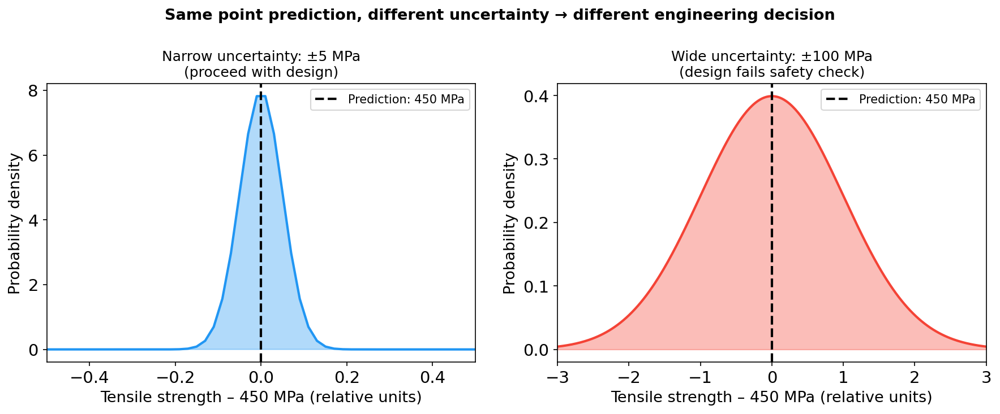{width="78%"}

:::: {.notes}
- Same mean, same label, opposite decision. The left model is a yes; the right is a no. The mean alone cannot distinguish them.
- Engineering and lab decisions are *threshold decisions*: accept/reject a segmentation, release/retest a part, measure here or not. A threshold needs a distribution, not a number (ML-PC U12 framing).
- EM anchor: a GP predicting Fe³⁺ fraction at a new composition. ±0.02 → informative. ±0.40 → "I have no idea — measure before deciding."
- Write on the board: "an overconfident model is more dangerous than an inaccurate one."
::::

## When point predictions fail in electron microscopy

:::: {.incremental}
- **Phase identification:** a CNN predicts "Fe₂O₃" for a boundary pixel. Clean decision or coin-flip? Without a confidence, misidentifications propagate silently into phase maps.
- **Extrapolation without warning:** a model trained on 200–500 °C specimens predicts 600 °C with the same apparent confidence. It does not know it is extrapolating [@bishop2006pattern].
- **New instrument or session:** a segmentation net trained on SEM #1 is run on SEM #2 after a detector swap — confident, smooth-looking, wrong maps. Errors are *silent*.
- **Expensive experiment design:** 8 h of instrument time on a composition you already know well is wasted. Honest error bars tell you what is *worth* measuring.
- **Root cause:** empirical-risk minimisation rewards average accuracy on the training distribution — it gives the model no incentive to express ignorance.
::::

:::: {.notes}
- "Silent failure" is the key phrase: a model that returns NaN is safe — you know it failed. A model that returns a confident wrong number is the dangerous one.
- The ERM point links back to Week 4: MSE/cross-entropy measure accuracy, not calibration. A model can have great test MSE and terrible practical safety.
- The four bullets map to today's four tools: classification confidence (ensembles/MC dropout), extrapolation (GP variance, OOD), instrument shift (calibration, OOD gate), experiment design (BO).
- Transition: "To fix this we need to be precise about *what kind* of uncertainty we mean."
::::

<!-- ===== §2. Aleatoric vs epistemic ===== -->

## Aleatoric vs epistemic uncertainty

:::: {.incremental}
- **Aleatoric** (*alea* = dice): irreducible randomness in the data-generating process — shot noise, detector read noise, grain-to-grain scatter. More data of the same kind does **not** remove it.
- **Epistemic** (*episteme* = knowledge): uncertainty from limited knowledge — we measured 8 compositions out of infinitely many, the model never saw this microscope. It **shrinks** as we add (the right) data.
- **Diagnostic test:** "Would measuring more of the same kind of data reduce this uncertainty?" Yes → epistemic. No → aleatoric [@bishop2006pattern].
- **Why it matters:** aleatoric sets the *achievable precision* (and the right loss — Week 2); epistemic tells you *where to invest the next instrument-hour* and *when not to trust the model*.
::::

:::: {.notes}
- Run the diagnostic live with EM examples: grain-to-grain hardness scatter (aleatoric), hardness model fitted to 5 grains (epistemic), detector thermal noise (aleatoric), a model applied to a new alloy family (epistemic).
- Week 2 callback: the noise model (Poisson/Gaussian) *is* the aleatoric model; it decided our loss. Today we add the epistemic part.
- Subtle point for the strong students: at a hard phase boundary, class ambiguity is aleatoric (the pixel genuinely mixes phases); a class the model never saw is epistemic. Entropy of the softmax mixes both.
::::

## Aleatoric vs epistemic in EM: visual comparison

{width="80%"}

:::: {.notes}
- Left: scatter is the material's real variability. A smaller error bar on the *mean* comes from averaging more grains, not from a better instrument.
- Right: the band collapses at the three measured compositions and stays wide between and beyond them.
- Ask: "which uncertainty shrinks if I measure 10 more grains at the same temperature?" (the uncertainty of the mean, not the scatter). "Which shrinks if I measure 3 more compositions?" (right panel). Get both answers.
::::

## From a point estimate to a predictive distribution

$$p(y_* \mid \mathbf{x}_*, \mathcal{D}) = \int p(y_* \mid \mathbf{x}_*, \theta)\, p(\theta \mid \mathcal{D})\, d\theta$$

$$
\underbrace{\mathrm{Var}[y_*]}_{\text{total}} = \underbrace{\mathbb{E}_{\theta}\big[\sigma_\epsilon^2(\mathbf{x}_*;\theta)\big]}_{\text{aleatoric}} + \underbrace{\mathrm{Var}_{\theta}\big[\mu(\mathbf{x}_*;\theta)\big]}_{\text{epistemic}}
$$

:::: {.incremental}
- **ERM / MSE** returns one $\hat\theta$ → one number $\hat y$ (MSE = MLE under Gaussian noise, Week 4). **Bayesian** averaging over plausible $\theta$ returns a distribution.
- **Epistemic term** = disagreement between plausible models. Near data they agree; away from data they disagree [@murphy2012machine].
- **Every method today approximates this integral:** ensembles (M samples of $\theta$), MC dropout (random masks), GPs (exact, closed form).
::::

:::: {.notes}
- Read the integral as a sentence: "for every parameter vector the data finds plausible, ask what it predicts, and average weighted by plausibility."
- The variance decomposition (law of total variance) is the formal version of the aleatoric/epistemic split. Write it on the board; underline "does not shrink" under aleatoric and "shrinks" under epistemic.
- Road-map sentence: "Deep ensembles are a crude Monte-Carlo estimate of this integral with M=5 samples. MC dropout is a cheaper one. The GP does it exactly."
- Active-learning hook: measure where the epistemic term is largest.
::::

<!-- ===== §3. Deep nets: ensembles, MC dropout ===== -->

## Uncertainty for deep networks: ensembles and MC dropout

:::: {.columns}
::: {.column width="50%"}
**Deep ensembles** [@lakshminarayanan2017simple]

- Train $M \approx 5$ networks from different random initialisations / data orders.
- Mean of members = prediction; spread = epistemic uncertainty.
- Different local minima → genuine diversity → best empirical calibration of simple NN methods.
- Cost: $M\times$ training, $M\times$ inference (parallelisable).
:::
::: {.column width="50%"}
**MC dropout** [@gal2016dropout]

- Keep dropout **on at inference**; run $T \approx 30$ stochastic passes.
- Interpretable as approximate variational inference with a Bernoulli posterior.
- Zero extra training cost — works on any net trained with dropout.
- Pitfall: `model.eval()` switches dropout *off*.
:::
::::

For classification, per pixel $i$: $\bar{\mathbf{p}}_i = \frac{1}{T}\sum_t \mathbf{p}_i^{(t)}$, predictive entropy $H_i = -\sum_c \bar p_{i,c}\log \bar p_{i,c}$.

:::: {.notes}
- Ensembles: the loss landscape of a deep net has many minima; different seeds land in different ones. Where data are dense they agree, where data are sparse they disagree — that disagreement *is* the epistemic signal, no Bayesian formalism needed.
- MC dropout: one-line change, but half of student implementations get it silently wrong by calling `model.eval()`. Enable dropout layers explicitly.
- Use the entropy of the *mean* softmax, not the variance of the softmax outputs — the entropy of $\bar p$ is the "total uncertainty"; separating aleatoric/epistemic needs mutual information and is rarely worth it.
- $T=30$ is a typical knee — validate on a reliability diagram rather than trusting the number.
- Rule of thumb: MC dropout if a trained network already exists and compute is tight; ensemble if calibration quality is critical.
::::

## Ensembles vs MC dropout on a 1-D regression

![Left: MC dropout — stochastic forward passes (light blue) and mean ±2σ. Right: a deep ensemble of 5 independently trained networks (coloured) and mean ±2σ (green). Both widen away from data; ensembles are empirically better calibrated [@lakshminarayanan2017simple].](img/mc_dropout_ensembles.png){width="82%"}

:::: {.notes}
- Left: same weights, different masks — the variance reflects the approximate posterior; it depends on the dropout rate (too low → overconfident, too high → everything uncertain).
- Right: five entirely different training runs. Their disagreement grows in the data gap and beyond the range.
- Honest caveat: neither method is guaranteed to widen far from data — a ReLU network can extrapolate linearly and all members may agree. This is why we still need an OOD check later today.
::::

## Case study: MC dropout for SEM segmentation (MetalDAM)

![Two held-out MetalDAM micrographs of additively manufactured steel: SEM input, MC-mean prediction, per-pixel predictive entropy ($T{=}30$). Low entropy inside well-formed matrix/austenite regions; high entropy at phase boundaries, in ambiguous martensite/austenite laths and at defect rims. Data: MetalDAM [@metaldam; @luengo_2022_metaldam]; figure from ML-PC Unit 12.](img/mcdropout_maps.png){height="720px" fig-align="center"}

:::: {.notes}
- U-Net with dropout (p≈0.2) in bottleneck and decoder, trained on 42 expert-labelled micrographs; *whole micrographs* held out (Week 4 honest validation — split by image, not by tile).
- The uncertainty map is self-interpretable: it lights up exactly where a human expert would hesitate. If yours does not, suspect a calibration bug (dropout too low, one dropout layer only).
- Class imbalance: defect pixels are 0.7% of the data, precipitates 0.2% (mostly unannotated — label noise, Week 8 callback).
- Anti-pattern: blurring the entropy map before thresholding. Its spatial resolution is the point.
::::

## Reject-for-human-review: turning uncertainty into a decision

:::: {.columns}
::: {.column width="48%"}
:::: {.incremental}
- Choose an entropy threshold $\tau$: pixels with $H_i > \tau$ go to an operator; the rest are auto-classified.
- Sweep $\tau$ → **operating curve** (review rate vs defect recall). Report the curve, not one threshold.
- The operating point is a *cost* decision (analyst time vs missed defect), not an ML decision.
- **Honest limit:** the residual misses are *confidently wrong* — low entropy. No entropy threshold recovers them → calibration audit + OOD gate.
::::
:::
::: {.column width="52%"}
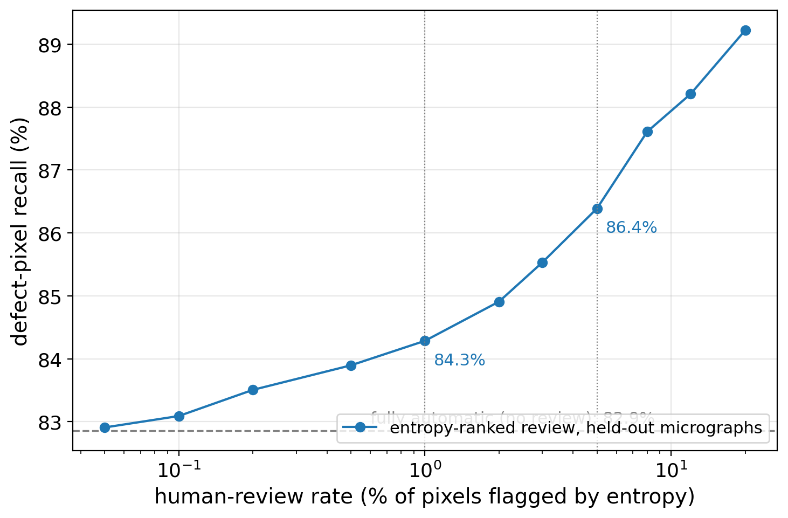{width="100%"}
:::
::::

:::: {.notes}
- This is the practical payoff of per-pixel uncertainty: model + human in the loop. At 5% review on a 1024×703 micrograph that is ~36k pixels, clusterable into a few hundred ROIs an analyst scans in a minute.
- There is no sharp knee in this curve — say it honestly. The headline is the gap to 100%: confidently wrong pixels. That is the bridge to calibration.
- Link to Week 8 active labelling: the flagged pixels are exactly the tiles worth labelling next.
- Transition: "Are these confidences honest at all? That is calibration."
::::

<!-- ===== §4. Calibration ===== -->

## Calibration: are the error bars honest?

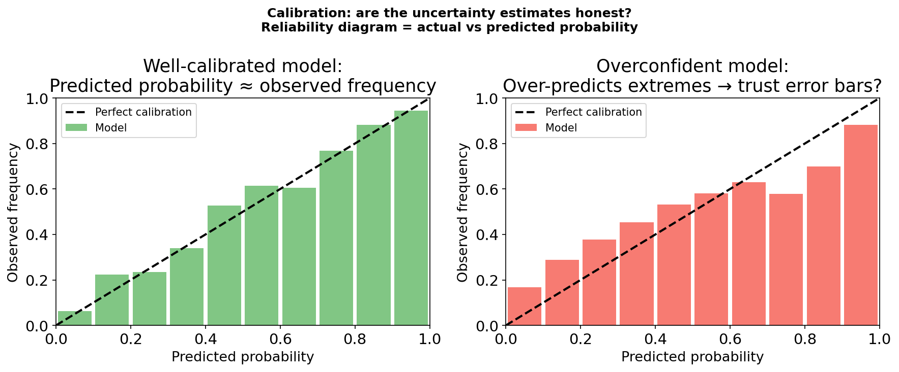{width="78%"}

:::: {.notes}
- Bin predictions by confidence (10 bins). Per bin: mean predicted confidence (x) vs observed accuracy (y). Diagonal = calibrated. Below = overconfident (dangerous), above = underconfident (wasteful but safe).
- For regression the analogue: nominal interval level vs empirical coverage.
- Modern deep nets are typically *overconfident* [@guo2017calibration] — bigger, better-trained networks drift further below the diagonal.
- A GP's 95% band is calibrated *only if* the kernel and noise model are right. Check it the same way.
::::

## Calibration metrics and post-hoc fixes

:::: {.incremental}
- **Expected Calibration Error** over $B$ confidence bins:
$$\mathrm{ECE} = \sum_{b=1}^{B} \frac{|\mathcal{B}_b|}{N}\,\big|\mathrm{acc}(\mathcal{B}_b) - \mathrm{conf}(\mathcal{B}_b)\big|$$
  0 = perfect; always show the diagram too — the *shape* carries the diagnosis.
- **Temperature scaling** [@guo2017calibration]: $\hat{\mathbf{p}} = \mathrm{softmax}(\mathbf{z}/T)$, one scalar $T$ fitted on a calibration set. Changes confidences, **not** the argmax — accuracy is unchanged.
- **The calibration set must be held out and lab-realistic:** same microscope, protocol and settings as deployment, no specimen shared with training (Week 4 leakage rules apply).
- **Tool shift breaks calibration:** MetalDAM with a simulated detector change — ECE 9.2% → 3.5% after temperature scaling on the new tool; pixel accuracy unchanged (ML-PC U12).
::::

:::: {.notes}
- ECE is a one-number summary; bin-count choices change it. Report it *with* the diagram.
- Temperature scaling: one parameter, post-hoc, no retraining. It fixes global over/underconfidence; it cannot fix wrong predictions.
- Trigger list for re-calibration: detector swap, gun replacement, coating change, large chamber vent. "My accuracy dropped after the chamber vent" is a calibration failure as often as a model failure — diagnose with a reliability diagram before retraining.
- War story (ML-PC): a pore-detection pipeline dropped 96%→78% after a chamber clean; two weeks of retraining. The real bug: the contrast shift broke calibration, so a fixed confidence threshold discarded true detections. Temperature scaling on 30 images fixed the thresholding step in an hour.
::::

<!-- ===== §5. Conformal ===== -->

## Split conformal prediction: a guarantee without trusting the model

:::: {.incremental}
1. Split data: **train** / **calibration** (never used for fitting) / test.
2. Fit *any* predictor $\hat f$ on train (GP, random forest, U-Net …).
3. Scores on calibration: $s_i = |y_i - \hat f(\mathbf{x}_i)|$, $i=1,\dots,n$.
4. $\hat q$ = the $\lceil (n+1)(1-\alpha)\rceil$-th smallest score.
5. Output $C(\mathbf{x}_*) = [\hat f(\mathbf{x}_*) - \hat q,\ \hat f(\mathbf{x}_*) + \hat q]$.

- **Guarantee** [@angelopoulos_2023_conformal]: $\Pr\big(y_* \in C(\mathbf{x}_*)\big) \ge 1-\alpha$ for *any* predictor and *any* distribution — provided calibration and test data are **exchangeable**.
- **Classification:** same recipe with score $1-\hat p_{y}(\mathbf{x})$ → *prediction sets* ("Fe₂O₃ or FeO") that contain the true class with prob. $\ge 1-\alpha$.
::::

:::: {.notes}
- "Any predictor" is the selling point: no Gaussian assumption, no correct kernel. It is a *wrapper*.
- The $(n+1)$ correction makes the finite-sample guarantee exact; with small $n$ the band is slightly conservative, never undercovering.
- Most common mistake: computing $\hat q$ from *training* residuals. The model fits its training data too well → too narrow → undercoverage (notebook: 0.78 instead of 0.90).
- Exchangeability is the one assumption. Discovery campaigns and new microscopes violate it by design — keep this in mind for the OOD section.
- Prediction sets for classification: a set of size 1 is a confident call; size 3 means "ambiguous — look at it."
::::

## Split conformal vs CQR on heteroscedastic EM data

{width="92%"}

:::: {.notes}
- Left: the guarantee holds *marginally* — averaged over all doses. At high dose only, split conformal covers just 0.80: too narrow where noise is large, too wide where it is small.
- Right: CQR [@romano_2019_cqr] fits lower/upper quantile regressors ($\alpha/2$, $1-\alpha/2$), then conformalises them with the score $s_i=\max(\hat q_{lo}(\mathbf{x}_i)-y_i,\ y_i-\hat q_{hi}(\mathbf{x}_i))$ and outputs $[\hat q_{lo}-\hat q,\ \hat q_{hi}+\hat q]$. High-dose coverage improves to 0.87 and the band is 2.3× wider at high dose than at low dose.
- Neither method gives *conditional* coverage in general — that is impossible distribution-free — but CQR gets much closer when noise is heteroscedastic.
- All numbers come from the notebook; students reproduce them in Part B.
::::

## GP bands, conformal intervals, OOD: who guarantees what?

| | GP credible band | Split conformal / CQR | Needs in addition |
|---|---|---|---|
| Guarantee | only if kernel + noise model correct | finite-sample, distribution-free, *marginal* | — |
| Width | varies with distance to data | constant (split) / adaptive (CQR) | — |
| Holds under shift? | no — kernel may miss the shift | no — exchangeability broken | **OOD gate** |
| Steers acquisition? | yes (σ is an exploration signal) | not directly | — |
| Cost | $O(N^3)$ | sort residuals | — |

**Rule of thumb:** GP / ensembles to *explore*; conformal to *certify* in-distribution; an OOD score to decide *whether you are in-distribution at all*.

:::: {.notes}
- This table is the spine of the second half. Conformal answers "how wide should the interval be, given we are in-distribution?" The OOD gate answers "are we in-distribution?" Neither replaces the other.
- Notebook exercise B3: evaluate the calibrated interval on dose 1.0–1.3 (never seen) → coverage drops from 0.93 to 0.70. The guarantee silently evaporates.
- MG U14 framing: conformal is ideal as a screening filter (cut 10⁵ candidates to 10³ with certified intervals), GPs for the acquisition that follows.
- Transition: "Now the model that gives honest, input-dependent uncertainty in closed form: the Gaussian process."
::::

<!-- ===== §6. Gaussian processes ===== -->

## Gaussian processes: a distribution over functions

:::: {.incremental}
- A **GP** is a probability distribution over *functions*: any finite set of values $[f(\mathbf{x}_1),\dots,f(\mathbf{x}_N)]$ is jointly Gaussian.
$$f \sim \mathcal{GP}\big(m(\mathbf{x}),\ k(\mathbf{x},\mathbf{x}')\big)$$
- Fully specified by a **mean function** $m(\mathbf{x})$ (usually 0 after centring) and a **kernel** $k(\mathbf{x},\mathbf{x}') = \mathrm{Cov}[f(\mathbf{x}), f(\mathbf{x}')]$.
- **RBF kernel:** $k(\mathbf{x},\mathbf{x}') = \sigma_f^2 \exp\!\big(-\|\mathbf{x}-\mathbf{x}'\|^2 / 2\ell^2\big)$ — nearby inputs have correlated outputs; length-scale $\ell$ sets the correlation range, $\sigma_f^2$ the vertical amplitude [@rasmussen2006gaussian].
- The kernel **is** the modelling decision: it encodes "compositions closer than $\ell$ have similar Fe³⁺ fractions" — domain knowledge as a covariance.
::::

:::: {.notes}
- Concrete picture: a 2-D Gaussian gives an ellipse of likely $(x,y)$ pairs; a GP gives a cloud of likely curves. We never handle the infinite object — only its finite marginals at the inputs we care about.
- Kernel ↔ inductive bias (course thread): CNN = translation equivariance, GNN = permutation invariance, GP kernel = smoothness/correlation structure.
- RBF gives infinitely smooth functions; Matérn-5/2 allows kinks and is often a better default for materials properties.
- At $|x-x'| = \ell$ the kernel is $e^{-0.5}\approx0.6$; at $3\ell$ it is $\approx0.01$ — nearly independent.
::::

## GP prior: plausible functions before seeing data

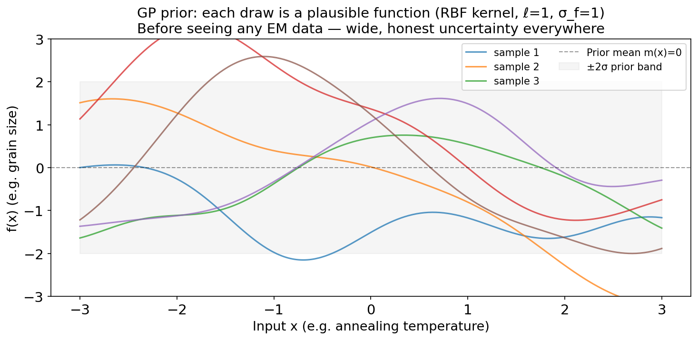{width="78%"}

:::: {.notes}
- Each coloured curve is one plausible "model" of Fe³⁺ fraction vs composition. All smooth (RBF), all on the same vertical scale (σ_f), all disagreeing — we have seen no data.
- The width of the cloud at any x is the prior variance σ_f². After conditioning, curves are forced near the observations.
- Transition: "Now condition on data."
::::

## Conditioning on data: prior → posterior

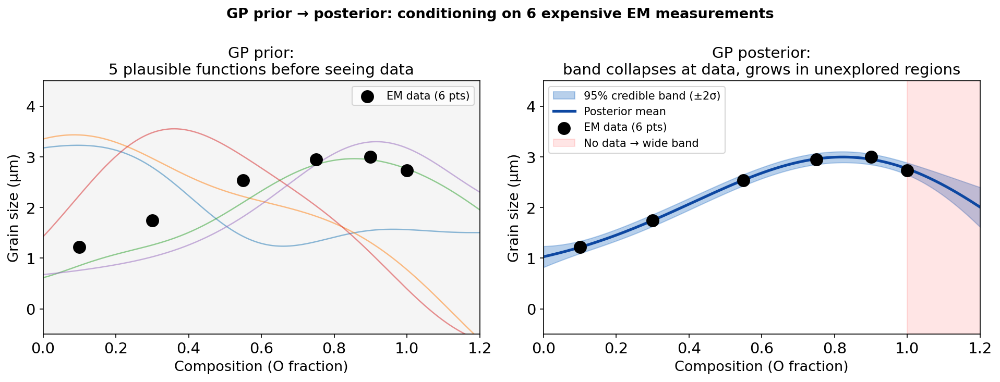{width="84%"}

:::: {.notes}
- The central picture of the GP block. Tight bundle at the data, fanning out to the right: "the GP knows what it doesn't know — and says so."
- Conditioning a joint Gaussian on some of its components gives another Gaussian: the posterior is again a GP, no approximation. This closure is why GPs are "exact Bayesian" regressors.
- Ask: "where would the GP tell you to measure next?" → the red region. That is the BO hook for later today.
::::

## The two GP posterior formulas

With noisy observations $y_i = f(\mathbf{x}_i) + \epsilon_i$, $\epsilon_i \sim \mathcal{N}(0,\sigma_n^2)$, kernel matrix $[\mathbf{K}]_{ij} = k(\mathbf{x}_i,\mathbf{x}_j)$ and $[\mathbf{k}_*]_i = k(\mathbf{x}_*,\mathbf{x}_i)$:

$$\boxed{\mu_*(\mathbf{x}_*) = \mathbf{k}_*^\top (\mathbf{K} + \sigma_n^2 \mathbf{I})^{-1} \mathbf{y}}$$

$$\boxed{\sigma_*^2(\mathbf{x}_*) = k(\mathbf{x}_*,\mathbf{x}_*) - \mathbf{k}_*^\top (\mathbf{K} + \sigma_n^2 \mathbf{I})^{-1} \mathbf{k}_*}$$

:::: {.incremental}
- **Mean:** a kernel-weighted vote of the training outputs. **Variance:** prior variance *minus* what the data explain — never increases with more data.
- $\sigma_*^2$ depends only on **where** we measured, not on the $y$ values → we can plan uncertainty reduction before measuring.
- Far from all data $\mathbf{k}_* \to \mathbf{0}$ ⇒ $\sigma_*^2 \to \sigma_f^2$: the GP reverts to the prior — **uncertainty balloons**. Cost: $O(N^3)$ [@rasmussen2006gaussian].
- Aleatoric ↔ $\sigma_n^2$ (WhiteKernel); epistemic ↔ the posterior variance of $f$ — the decomposition from earlier, exactly.
::::

:::: {.notes}
- These two boxes are the highest-yield formulas of the lecture — students will be asked to reproduce and interpret them.
- Mean as a sentence: "close training points vote strongly, far ones barely vote; far from all data, the mean returns to the prior mean 0."
- Variance as a sentence: "prior uncertainty minus the variance explained by the N observations."
- The "depends only on x locations" property is the theoretical basis for active learning and experimental design.
- $\sigma_n^2 \mathbf{I}$ is also the regulariser: without it the GP interpolates exactly through noisy points (and the matrix can be ill-conditioned — Week 3 conditioning callback).
::::

## GP posterior in pictures

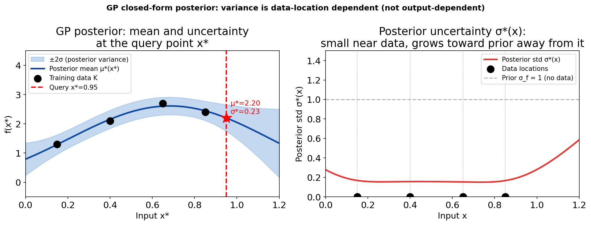{width="84%"}

:::: {.notes}
- Right panel: the "uncertainty map". No y-values are needed to draw it — only the x locations.
- It approaches but does not reach σ_f exactly within the plotted range; far enough away it does.
- Transition: "Here is the balloon effect on the notebook-style example."
::::

## The key intuition: uncertainty balloons away from data

![Illustration: left — GP fitted to 8 measurements clustered in [0, 0.7]; the 95% band widens rapidly beyond the data (red). Right — after one extra measurement at x=1.0 the band collapses locally while distant regions stay uncertain. In the notebook (EELS example, SEED=42) σ* at x=1.15 drops from 0.197 to 0.100 (−49%).](img/gp_uncertainty_balloons.png){width="86%"}

:::: {.notes}
- Emotional payoff of the GP block. "The blue band is the honest error bar; in the red region the GP has never been told anything — and says so."
- Notebook numbers (Part A): σ* near data (x=0.659) = 0.0145, far (x=1.15) = 0.1966 — 13.5×. Adding x=1.0 cuts σ* at x=1.15 by 49%; near-data σ* barely changes (+6.5%).
- Contrast with a neural net: it extrapolates its *value* confidently; a GP extrapolates its *prior uncertainty*.
- "Always measure where σ* is largest" is the simplest active-learning rule. BO refines it.
::::

## Kernel length-scale: smoothness and honesty

{width="84%"}

:::: {.notes}
- Short ℓ is honest but useless; long ℓ is the dangerous one — narrow bands far from data.
- Notebook exercise A6 reproduces this with ℓ = 0.05, 0.3, 1.2.
- Transition: "How do we pick ℓ without looking at the answer?"
::::

## Hyperparameters, kernel families and practical tips

:::: {.incremental}
- **Log marginal likelihood** — maximise over $\ell, \sigma_f, \sigma_n$:
$$\log p(\mathbf{y}\mid\mathbf{X}) = -\tfrac12\mathbf{y}^\top(\mathbf{K}+\sigma_n^2\mathbf{I})^{-1}\mathbf{y} - \tfrac12\log|\mathbf{K}+\sigma_n^2\mathbf{I}| - \tfrac N2\log 2\pi$$
  data fit − complexity penalty: an **automatic Occam's razor** [@rasmussen2006gaussian]. In sklearn: `GaussianProcessRegressor(n_restarts_optimizer=10)`.
- **Kernel families:** Matérn-5/2 (allows kinks — often better for materials), sums (trend + wiggle), products, ARD (one $\ell_d$ per input dimension → irrelevant inputs get long $\ell_d$).
- **Practice:** normalise $\mathbf{x}$ to [0,1] and $y$ to zero mean / unit variance; check calibration on held-out data; multiple restarts (the likelihood is multimodal).
::::

:::: {.notes}
- The log-determinant term penalises flexible kernels (short ℓ) — complexity is paid for automatically, no separate regulariser.
- MFML callback: this is the "evidence" — the likelihood integrated over the function values.
- ARD is feature selection as a by-product: a huge optimised ℓ_d says "this input does not matter".
- Multimodal likelihood: a short-ℓ "fit the noise" optimum and a long-ℓ "everything is noise" optimum can coexist; restarts guard against the wrong one.
::::

## GP scorecard: where GPs win and where they don't

| | Gaussian process | Deep neural network (+ ensemble) |
|---|---|---|
| Uncertainty | exact Bayesian (given the kernel) | add-on, approximate |
| Data regime | small, expensive ($N \lesssim 10^3$) | large ($10^4$–$10^7$) |
| Training cost | $O(N^3)$ (sparse GPs: $O(NM^2)$) | $O(N)$ per epoch |
| Input dimension | struggles beyond ~10–20 raw dims | images, spectra natively |
| Features | hand-chosen via the kernel | learned |
| Interpretability | $\ell, \sigma_f, \sigma_n$ physically meaningful | opaque weights |

**Experimental EM lives in the GP regime** (5–500 expensive measurements) — *unless* inputs are images → deep kernel learning (later today).

:::: {.notes}
- The GP is not universally better — it is better for the regime most common in experimental materials science: small N, low-dimensional inputs, need for calibrated intervals.
- Sparse / inducing-point GPs (GPyTorch, GPflow) push to N~10⁶ but are out of scope.
- The "image input" limitation is the cliffhanger for DKL: RBF on raw pixels is meaningless.
- Transition: "We have honest σ. Now: what do we *do* with it?"
::::

<!-- ===== §7. Bayesian optimisation ===== -->

## From uncertainty to action: explore vs exploit

:::: {.incremental}
- **Active learning** — goal: an accurate model *everywhere* with few measurements. Acquisition: $\alpha(\mathbf{x}) = \sigma_*(\mathbf{x})$ (pure exploration).
- **Bayesian optimisation (BO)** — goal: find the *best* setting (max SNR, max contrast) with few measurements. Acquisition must balance
  - *exploitation* — measure where $\mu_*$ is high, and
  - *exploration* — measure where $\sigma_*$ is high (maybe something better hides there).
- **Same GP, different acquisition function.** Next measurement: $\mathbf{x}_{\text{next}} = \arg\max_{\mathbf{x}} \alpha(\mathbf{x})$ [@shahriari2016taking].
- **BO-friendly objectives:** expensive, no closed form, reasonably smooth, low-to-moderate dimension — i.e. almost every EM acquisition or process parameter.
::::

:::: {.notes}
- Week 8 callback: active labelling chose which images to *label*; here we choose which *experiment* to run. Same machinery.
- EM example: building a full Fe³⁺ map across compositions = active learning; finding the synthesis condition that maximises Fe³⁺ = BO.
- Ask the room: "why not always go to the highest-σ point?" — because we may waste budget mapping regions that are obviously bad.
- BO is pointless for functions you can evaluate in milliseconds — use gradients there.
::::

## The experiment-design problem in EM

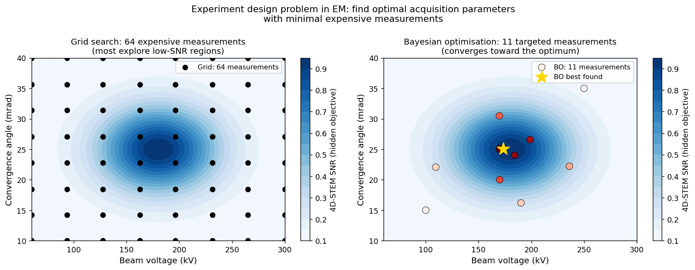{width="84%"}

:::: {.notes}
- A (S)TEM experiment has 50+ adjustable parameters; a 10-point grid per parameter is $10^{50}$ measurements. Even a 2-D 10×10 grid at 1 h per point is 100 h of instrument time.
- BO propagates information from each measurement to its neighbours through the kernel, so the acquisition can jump straight to promising regions.
- In 2-D the kernel generalises with ARD — separate length-scales in voltage and angle, learned from data.
::::

## The Bayesian optimisation loop

:::: {.incremental}
1. **Initialise:** a few measurements at random / Latin-hypercube locations.
2. **Fit** the GP surrogate → $\mu_*(\mathbf{x}), \sigma_*(\mathbf{x})$ everywhere (milliseconds).
3. **Acquire:** $\mathbf{x}_{\text{next}} = \arg\max_{\mathbf{x}} \alpha(\mathbf{x})$, evaluated on a dense candidate grid (milliseconds).
4. **Measure** at $\mathbf{x}_{\text{next}}$ — the expensive step (minutes to hours).
5. **Update** the dataset, go to 2 until the budget is spent. Report the best **observed** $\mathbf{x}^+ = \arg\max_i y_i$.
::::

:::: {.notes}
- Outer loop = expensive experiments; inner loop = cheap GP algebra. All the cost lives in step 4.
- "The GP is a map, not the territory": report the best observed measurement, not the maximum of the GP mean.
- Production libraries (BoTorch, scikit-optimize) use Cholesky updates ($O(N^2)$ per new point) instead of refitting.
::::

## Acquisition functions: formalising explore vs exploit

:::: {.incremental}
- **Upper Confidence Bound:** $\alpha_{\text{UCB}}(\mathbf{x}) = \mu_*(\mathbf{x}) + \kappa\,\sigma_*(\mathbf{x})$ — "optimism in the face of uncertainty". $\kappa=0$: pure exploitation; $\kappa\to\infty$: pure exploration.
- **Expected Improvement** (current best $f^+$, jitter $\xi$):
$$\alpha_{\text{EI}}(\mathbf{x}) = (\mu_* - f^+ - \xi)\,\Phi(Z) + \sigma_*\,\phi(Z), \qquad Z = \frac{\mu_* - f^+ - \xi}{\sigma_*}$$
  *how much* improvement to expect; zero where the objective is already known ($\sigma_*=0$).
- **Probability of Improvement:** $\alpha_{\text{PI}} = \Phi(Z)$ — *how likely* any improvement is; greedier than EI.
- All are closed-form in $(\mu_*, \sigma_*)$ → maximise by brute force on a grid in low dimension [@shahriari2016taking].
::::

:::: {.notes}
- UCB: "the mean here is 0.5 ± 0.3, so optimistically it could be 0.5 + 2×0.3 = 1.1." Go to the most optimistic point.
- EI reads as: "improvement by at least ξ, weighted by how likely it is". A high-σ point with a hopeless mean gets small EI.
- PI ignores magnitude and happily takes tiny improvements next to the current best.
- ξ in EI/PI plays the role of κ in UCB.
::::

## Three acquisition functions on the same GP posterior

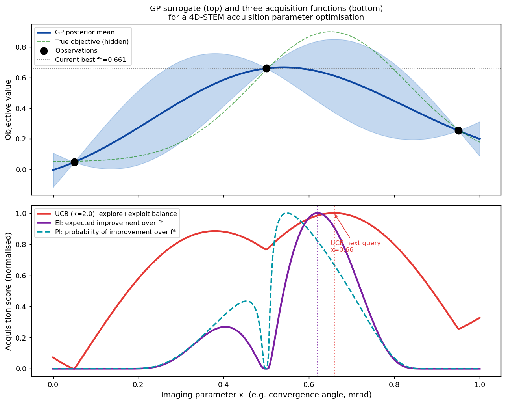{width="72%"}

:::: {.notes}
- The choice of acquisition function rarely changes the qualitative outcome on smooth problems; the *amount of exploration* does (next slide).
- Point at where each function peaks and why: UCB rewards σ more broadly, EI concentrates where improvement over f⁺ is plausible.
::::

## The BO loop in action on a multi-modal objective

{width="88%"}

:::: {.notes}
- Initial points sit near the deceptive local optimum (init best 0.6985). Iteration 1 goes to the uncertain boundary (x=1.0). Iteration 2 discovers the global peak (y=0.895). Later iterations refine near x=0.78.
- The true objective (shown for pedagogy) is never visible in a real experiment.
- Low κ (0.5) would have stayed near x=0.25 all 12 iterations.
::::

## BO vs random search: notebook numbers

:::: {.columns}
::: {.column width="45%"}
:::: {.incremental}
- Budget: 3 initial + 12 iterations = 15 measurements (SEED=42).
- **BO, UCB κ=3:** best **0.9323** at x=0.776 (true optimum x*=0.779, y*=0.9205).
- **Random:** best **0.7229** at x=0.236 — stranded at the local optimum.
- **κ matters:** κ=0.5 → 0.744, κ=2 → 0.744 (stuck); κ=3 → 0.932, κ=5 → 0.933, EI (ξ=0.01) → 0.932.
- Lesson: on multi-modal objectives the *amount of exploration* matters more than the choice of acquisition function.
::::
:::
::: {.column width="55%"}
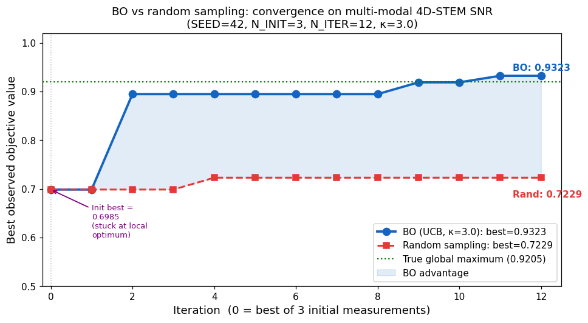{width="100%"}
:::
::::

:::: {.notes}
- These numbers are produced by notebook Part C and verified by assert checks there.
- +0.209 absolute (+29%) over random at equal budget; BO first gets within 0.05 of the true maximum at iteration 2 — genuine search, not luck at initialisation.
- Honest framing: κ=2 is the usual textbook default and it *fails* here within 12 iterations. Defaults are problem-dependent; the notebook exercise lets students see this.
- Transition: "This works for a 1-D knob. What if the input is an image patch?"
::::

<!-- ===== §8. DKL + automated 4D-STEM ===== -->

## Deep kernel learning: GP uncertainty for image inputs

:::: {.incremental}
- **Problem:** in 4D-STEM we want to predict a property at an *unvisited probe position* from its HAADF patch (e.g. 32×32 = 1024-D). RBF on raw pixels measures noise, not structure → useless surrogate.
- **Deep kernel** [@wilson2016deep]: pass inputs through a neural feature map $g(\mathbf{x};\mathbf{w})$, then apply a base kernel in the learned space:
$$k_{\text{DKL}}(\mathbf{x},\mathbf{x}') = k_{\text{RBF}}\big(g(\mathbf{x};\mathbf{w}),\ g(\mathbf{x}';\mathbf{w})\big)$$
- **Joint training:** network weights $\mathbf{w}$ and GP hyperparameters maximise the *same* log marginal likelihood — backprop through the GP formulas (Week 6 autograd).
- **Result:** NN representation power + GP posterior mean *and* σ → acquisition functions work unchanged on image inputs.
- **Caveat:** needs enough data to learn $g$ (tens–hundreds of points); tiny datasets overfit the feature map and σ becomes unreliable.
::::

:::: {.notes}
- MacKay's old question (SS25 lecture): can we combine the representation learning of NNs with the calibrated uncertainty of GPs? DKL is one answer.
- The feature extractor decides which aspects of the patch matter for the target; the GP measures similarity in that space. They learn together.
- Architecture thread: the CNN from Week 7 becomes the *kernel* of a GP.
- Scalability: DKL with inducing points (KISS-GP) scales to large N; GPyTorch has it built in.
::::

## Automated 4D-STEM: the DKL active-learning workflow

![DKL workflow for automated 4D-STEM. (a) Learning: sparse HAADF patches → neural network embedding → GP → scalarised property y. (b) Prediction: mean and uncertainty for all unvisited patches. (c) Measurement: the diffraction pattern at the chosen position is scalarised (centre of mass, virtual aperture). Figure: Roccapriore et al., ACS Nano 16, 7605 (2022) [@roccapriore2022automated].](img/roccapriore2022_dkl_workflow.png){width="74%"}

:::: {.notes}
- Step 1: a fast, low-dose HAADF pre-scan of the whole field — the input for the feature extractor everywhere.
- Step 2: a few random 4D measurements to bootstrap the DKL model.
- Step 3: loop — refit DKL (~2 s on GPU), compute acquisition over all unvisited positions, move the probe, acquire one diffraction pattern, scalarise, repeat.
- The **scalariser** encodes the physics of interest: CoM magnitude (local electric field), CoM angle, Bragg-disc spacing (strain), integrated virtual-aperture signal. Changing the scientific question = changing one function.
- Between steps the beam is blanked — the specimen only sees dose where the algorithm decides it is worth it.
::::

## Automated 4D-STEM: results

![Experiment on graphene (Nion UltraSTEM 100): HAADF with visited points (red), acquisition, predicted CoM magnitude/angle and uncertainty after 3, 10, 25 and 100 steps. The acquisition concentrates on domain boundaries. Figure: Roccapriore et al., ACS Nano 16, 7605 (2022) [@roccapriore2022automated].](img/roccapriore2022_com_results.png){width="86%"}

:::: {.notes}
- Watch the uncertainty column shrink and the acquisition column concentrate at interfaces — the algorithm discovers that boundaries are where the physics changes.
- Headline: maps of comparable quality from a small fraction of probe positions → large dose savings. This matters most for beam-sensitive materials (MnPS₃ in the paper) where a full 4D scan would damage the specimen.
- Same approach used for autonomous discovery of bulk vs edge plasmons in EELS [@roccapriore2022physics].
- Honest limits: the GP assumes smoothness in the learned feature space; sharp discontinuities the features miss are smoothed over, with deceptively low σ there. And the learned structure→property relation is itself a hypothesis that needs checking.
::::

## Choosing the right tool for acquisition

:::: {.incremental}
- **Standard BO (GP + RBF/Matérn):** 1–5 scalar knobs (voltage, convergence angle, dwell time, annealing temperature), 10–100 measurements.
- **DKL active learning:** image-patch or spectral inputs, spatial field mapping, $10^2$–$10^4$ candidate positions.
- **Sparse GPs:** many measurements ($N > 10^3$), streaming data.
- **Always log the trajectory:** where the agent measured *and* where it chose not to — otherwise the dataset carries an invisible selection bias.
- **Before trusting the loop:** is the surrogate calibrated on this specimen? Does the new region still look like what the model was trained on? → next section.
::::

:::: {.notes}
- Most common student mistake in miniprojects: DKL on 5 data points. The feature map overfits and σ is meaningless.
- The selection-bias point is scientific integrity: if the agent skipped a region that contained the interesting defect, the published statistics are biased. Archive the full acquisition history.
- Transition: "An autonomous loop is only as trustworthy as its uncertainty. When does σ lie?"
::::

<!-- ===== §9. OOD trust gate ===== -->

## When σ lies: out-of-distribution inputs

:::: {.columns}
::: {.column width="50%"}
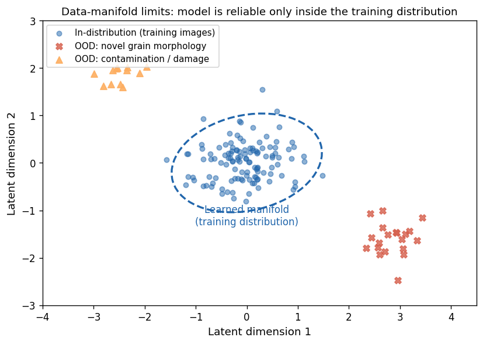{width="100%"}
:::
::: {.column width="50%"}
:::: {.incremental}
- **Calibration ≠ OOD detection.** Calibration: "*given* an in-distribution input, is my confidence honest?" OOD: "is this input like my training data at all?"
- **Silent extrapolation:** softmax stays at 0.95+ on a new detector; ensemble members all saw the same data and agree; a kernel that does not "see" the shift gives small σ.
- **EM sources of shift:** new microscope/detector, dose creep and beam damage, thicker specimen, contamination, a new alloy family.
::::
:::
::::

:::: {.notes}
- Two ideas students conflate. Both are mandatory; neither subsumes the other. A perfectly calibrated model still needs a detector that refuses to predict off-distribution.
- MG U14 example: a surrogate trained on oxides returns a confident posterior for a nitride — kernel-close, physically far. The small σ is meaningless.
- Dose creep: late frames of a long acquisition of a beam-sensitive specimen are OOD relative to early-frame training data.
- Softmax entropy is a poor OOD score: modern overconfident nets have low entropy on OOD inputs [@hendrycks2017baseline].
::::

## OOD scores and the trust gate

{width="88%"}

:::: {.notes}
- Mahalanobis distance in feature space [@lee2018simple]: fit mean and covariance of training embeddings; $d_M(\mathbf{z}) = \sqrt{(\mathbf{z}-\boldsymbol\mu)^\top\boldsymbol\Sigma^{-1}(\mathbf{z}-\boldsymbol\mu)}$. Cheap, post-hoc, surprisingly effective on microscopy.
- Threshold selection: same operating-curve logic as reject-for-review. Choose τ at an acceptable in-distribution false-refusal rate (e.g. 95th percentile).
- Real OOD data will not separate this cleanly — the synthetic figure shows the *procedure*, not a performance promise. Validate on a genuinely different session or instrument.
::::

## The trust gate in practice

:::: {.incremental}
- **Usable OOD scores:** Mahalanobis distance of embeddings · ensemble disagreement · GP variance (in a kernel you trust) · autoencoder reconstruction error (Week 9) · nearest-neighbour distance in latent space.
- **Gate rule:** act automatically **only if** the uncertainty is small **and** the OOD score is low. Wide σ + low OOD → measure more (within known territory). Any + high OOD → refuse, route to a human or a cheap exploratory measurement.
- **Use at least one score not derived from the model you are gating** — surrogate-derived signals fail together.
- **Audit trail per decision:** model version, calibration set, OOD score and threshold, decision, human review. Periodic blind audits of confidently accepted cases.
- **Trust is a system property, not a model property** — combine calibration, conformal coverage and an OOD gate (MG U14).
::::

:::: {.notes}
- This slide is the Week 11 contribution to the course-wide explainability/trust thread (W4 coefficients, W5 SHAP, W7 saliency, W9 latent pitfalls, W10 attention, W11 uncertainty as a trust gate, W13 the E1–E6 ladder).
- Escalation pattern from MG U14: "wide σ + high OOD" = outside our coverage; "wide σ, low OOD" = uncertain within known territory → more data closes the gap. Different responses.
- Gate tightness depends on the cost of a wrong action: a destroyed beam-sensitive specimen → tight gate; a cheap re-scan → loose gate.
- Miniproject requirement callback: every miniproject must report uncertainty — this slide is the checklist.
::::

<!-- ===== §10. RL / agents outlook ===== -->

## Outlook: reinforcement learning and agents at the microscope

:::: {.columns}
::: {.column width="50%"}
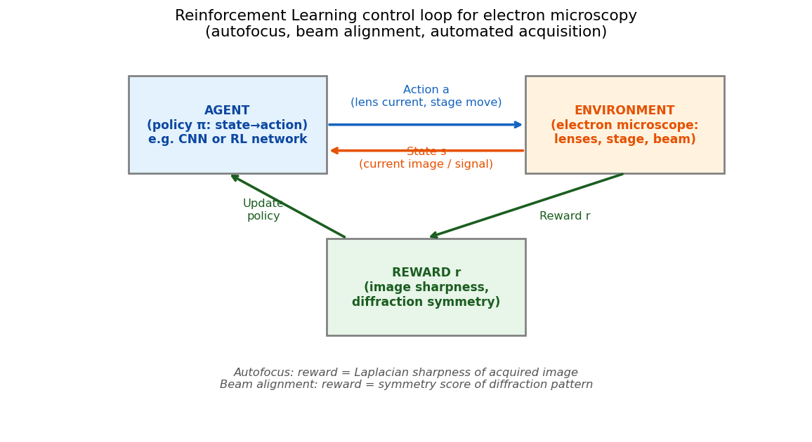{width="100%"}
:::
::: {.column width="50%"}
:::: {.incremental}
- **RL:** learn a policy $\pi(a\mid s)$ maximising $\mathbb{E}\big[\sum_t \gamma^t r_t\big]$ from rewards — no labels [@bishop2006pattern].
- **Time scales:** BO for slow loops (one measurement per minutes–hours); RL policies for fast control (autofocus, stigmation, drift — every 0.1–10 s); DKL in between.
- **Agents:** LLM-based orchestrators that call BO, segmentation and analysis tools and plan sessions — an active research frontier.
- **Risks:** reward hacking (a "sharp" image of contamination), sim-to-real gap, silent OOD — every agent needs today's trust gate.
::::
:::
::::

:::: {.notes}
- Keep this brief — an outlook, not examined in depth beyond the vocabulary (state, action, reward, policy) and the time-scale distinction.
- Control hierarchy: level 1 real-time corrections (autofocus RL, deployed in commercial software), level 2 session setup (alignment), level 3 experiment-level optimisation (BO, DKL). Level 1 failing silently corrupts level-3 measurements — monitor all levels.
- Reward hacking example: an autofocus agent maximising Laplacian variance can prefer sharp noise or contamination edges. Test policies on out-of-distribution images before deployment.
- The autonomous-lab vision (A-Lab, self-driving microscopes) is real but contested — MG U14 discusses the A-Lab debate; the lesson is the same: logs, audits, OOD gates.
::::

<!-- ===== §11. Wrap-up ===== -->

## Self-study notebook: GP → conformal → BO

:::: {.columns}
::: {.column width="60%"}
- **Notebook:** `notebooks/week11_gp_bo.ipynb` — CPU, sklearn only, < 2 min
- 
- **Part A — GP regression:** 8 simulated EELS measurements, posterior ±2σ, add a point, length-scale exercise.
- **Part B — conformal:** naive vs split conformal vs CQR on heteroscedastic data; exercise: α sweep and coverage under distribution shift.
- **Part C — BO:** UCB loop vs random at equal budget; exercise: vary κ, switch to EI.
:::
::: {.column width="40%"}
**Real-data extension (optional):** MC-dropout U-Net on MetalDAM with reject threshold and tool-shift calibration — [Ai4Mat companion notebook](https://eclipse-lab.github.io/Ai4MatLectures/notebooks/MLPC/week13_mcdropout_metaldam.html) (`ai4mat.datasets.MetalDAMDataset`).
:::
::::

:::: {.notes}
- Each part has a TODO exercise with a solution cell below; run the cells as-is first, then modify the "(try this yourself)" lines.
- Assert cells check non-trivial claims (e.g. BO beats random, CQR widens at high dose) on the fixed seed.
- The MetalDAM notebook needs a GPU for comfortable runtimes; it is optional.
::::

## Notebook key results (SEED=42)

:::: {.incremental}
- **GP (Part A):** optimised kernel $0.476^2\,\mathrm{RBF}(\ell{=}0.373) + \mathrm{White}(1.7\times10^{-4})$; σ* near data 0.0145 vs far 0.1966 (**13.5×**); one extra point at x=1.0 → σ* at x=1.15: 0.197 → 0.100 (**−49%**).
- **Conformal (Part B, α=0.1):** naive training-residual band covers **0.78**; split conformal **0.93**; CQR **0.94** with a band 2.3× wider at high dose. Under dose shift (1.0–1.3) coverage falls to **0.70** — exchangeability broken.
- **BO (Part C):** UCB κ=3 best **0.9323** vs random **0.7229** at 15 measurements (+29%); κ ≤ 2 gets stuck at the local optimum (0.744).
::::

:::: {.notes}
- Every number on this slide is printed by the notebook's final summary cell. If the notebook is re-run with a different sklearn version, re-check before teaching.
- The three numbers to remember: 13.5× (balloon), 0.78 vs 0.93 (don't calibrate on training residuals), 0.93 vs 0.72 (BO vs random).
::::

## Summary

:::: {.incremental}
- **Quantify:** aleatoric (irreducible noise) vs epistemic (lack of knowledge). Ensembles and MC dropout give practical epistemic estimates for deep nets; per-pixel entropy + a reject threshold turns them into decisions.
- **Certify:** reliability diagram + ECE reveal over-confidence; temperature scaling fixes confidences post hoc; split conformal / CQR give distribution-free coverage *if* data are exchangeable.
- **Model:** GPs give exact, input-dependent uncertainty in closed form; σ* balloons away from data; the marginal likelihood picks the kernel.
- **Act:** BO = GP + acquisition (UCB/EI) in a closed loop; DKL extends it to image inputs → automated, dose-efficient 4D-STEM.
- **Guard:** OOD scores + σ form a trust gate; trust is a property of the system, logged and audited.
::::

:::: {.notes}
- Five verbs: quantify, certify, model, act, guard. Use them as the mental index for the exam.
- Link forward: the uncertainty ideas return in Weeks 12–13 as priors and posteriors in inverse problems, and in the E1–E6 explainability ladder synthesis.
::::

## Must-know takeaways

:::: {.incremental}
1. Aleatoric vs epistemic: "would more data of the same kind reduce it?"
2. Deep ensembles / MC dropout: spread of predictions = epistemic signal; `model.eval()` disables dropout.
3. Reliability diagram and ECE; temperature scaling changes confidence, not accuracy.
4. Split conformal: $\hat q$ = $\lceil (n{+}1)(1{-}\alpha)\rceil$-th calibration score; guarantee needs exchangeability; CQR adapts the width.
5. GP posterior: $\mu_* = \mathbf{k}_*^\top(\mathbf{K}+\sigma_n^2\mathbf{I})^{-1}\mathbf{y}$, $\sigma_*^2 = k_{**} - \mathbf{k}_*^\top(\mathbf{K}+\sigma_n^2\mathbf{I})^{-1}\mathbf{k}_*$.
6. BO loop + UCB $\mu_*+\kappa\sigma_*$; too little exploration → stuck in local optima.
7. DKL = NN feature map inside a GP kernel → BO on image patches (automated 4D-STEM).
8. Calibration ≠ OOD detection; act only if σ is small **and** the OOD score is low.
::::

:::: {.notes}
- The full list with numbers is in the must-know document for the exam. Items 4 and 5 are "reproduce from memory" items.
::::

## Next week: Inverse problems I

:::: {.incremental}
- **Today:** we learned to be honest about what we don't know — and to measure where it matters.
- **Week 12 — Inverse problems I: regularisation, tomography & sensor fusion.** Measurements $\mathbf{y} = \mathcal{A}(\mathbf{x}) + \boldsymbol\epsilon$ rarely *are* the quantity we want: a tilt series encodes a 3-D structure, a HAADF + EDS pair encodes composition.
- Recovering $\mathbf{x}$ is **ill-posed** — many $\mathbf{x}$ fit the data. Priors and regularisers (Tikhonov, TV) pick a plausible one; the Bayesian view of today (prior × likelihood → posterior) is exactly the language we need.
- **Preparation:** finish notebook Parts A–C; revisit Week 3 (SVD, conditioning) — the small singular values return as the source of ill-posedness.
::::

:::: {.notes}
- Close the arc: "Week 11 gave us posteriors over functions. Week 12 asks for posteriors over images and volumes — with a physical forward model in the middle."
- Tomography teaser: the Radon transform, the Fourier-slice theorem and the missing wedge — why a tilt series can never fill all of Fourier space.
- Sensor fusion teaser: combining a high-SNR HAADF image with a noisy, low-resolution EDS map — two likelihoods, one reconstruction.
::::

<!-- BEGIN prev-next -->

## Continue

- &larr; Previous: [Unit 10 &mdash; Attention, transformers & graph networks for EM](../10_transformers_graphs/01_intro.html)
- &rarr; Next: [Unit 12 &mdash; Inverse problems I: regularisation, tomography & sensor fusion](../12_inverse_problems_1/01_intro.html)
- [All courses](../../index.html)

<!-- END prev-next -->

## References

::: {#refs}
:::
