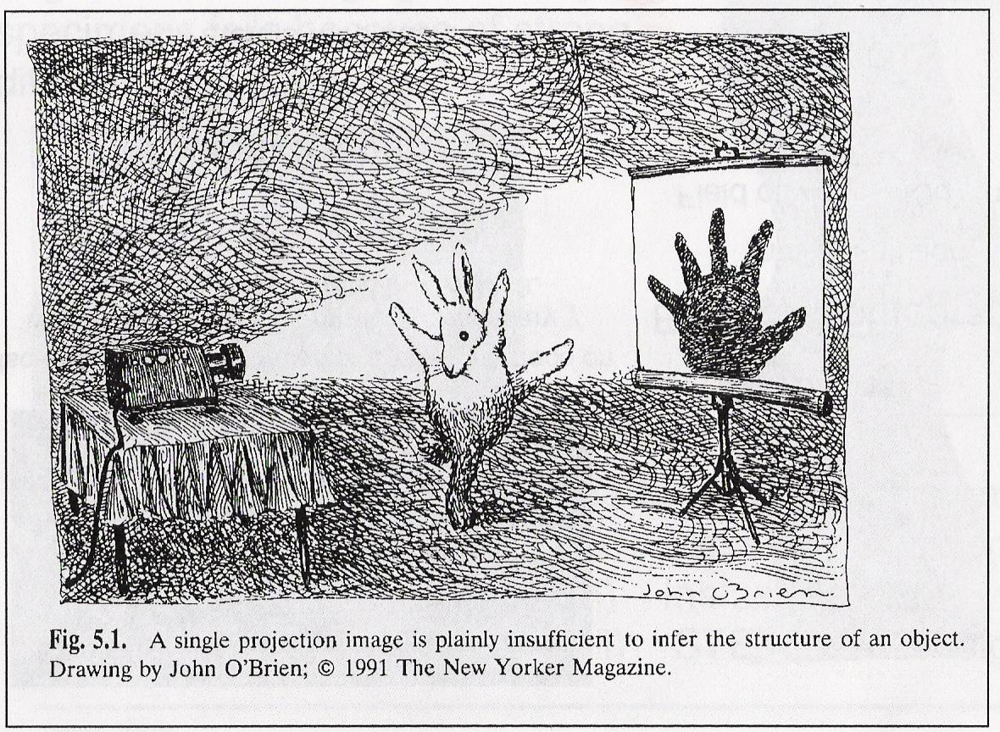

<!-- ===== §0. Recap + roadmap ===== -->

## Recap: Week 11 and today's question

:::: {.incremental}
- **Week 11:** uncertainty, Gaussian processes and autonomous EM — ensembles and MC dropout quantify *how sure* a model is, conformal prediction certifies it, and Bayesian optimisation lets the microscope decide *where* to measure next.
- **The Bayesian language from Week 11:** prior × likelihood → posterior. Today this language returns with a new job — not to predict a label, but to *reconstruct an object*.
- **Today's question:** given the measurements $\mathbf{y}$ (a blurred HAADF image, a tilt series, a noisy EDS map), how do we recover the physical object $\mathbf{x}$? Why is this hard, and how do priors make it possible?
- **Today's answer:** the *imaging inverse problem* — forward model $\mathbf{y} = H\mathbf{x} + \boldsymbol\epsilon$, ill-posedness (non-uniqueness, noise amplification), regularisation (Tikhonov / TV / plug-and-play) as "prior knowledge that tames noise" — applied to **electron tomography** and **HAADF + EDS sensor fusion**.
::::

:::: {.notes}
- Open by closing the Week 11 loop. Week 11 asked "how sure are we and where should we measure?" Today we ask "what does the measurement actually tell us about the object?" Acquisition strategy and inference are two sides of the same coin.
- Bridge phrase: "autonomous acquisition gives the most informative measurements; now we need the mathematical toolkit to extract the most from those measurements." Write both goals on the board: (1) acquire intelligently, (2) invert reliably.
- EM anchor: a HAADF tilt series of a nanoparticle. The detector records projections; the 3-D density we want is never measured directly. It is *encoded* in the projections. Recovering it requires inverting the forward model.
- Key tension: the forward direction (physics blurs and projects) is well understood. The reverse direction is hard because blurring and projection destroy information.
- Cross-cutting thread of the course: "physics → loss / prior". Week 2: the noise model decided the loss. Week 8: physics decided the augmentation. Today: the forward model decides the inverse method.
- Pacing: 3 minutes. Transition: "Here is what you should be able to do after today."
::::

## Learning outcomes

:::: {.incremental}
After this lecture you can …

1. write an EM measurement as a forward model $\mathbf{y} = H\mathbf{x} + \boldsymbol\epsilon$ and name $H$, $\mathbf{x}$ and the noise model for HAADF, EDS/EELS, tomography and ptychography;
2. explain ill-posedness with Hadamard's three conditions and the condition number / SVD picture;
3. set up a regularised objective, explain Tikhonov vs TV as Gaussian vs Laplace-type priors, and choose $\lambda$ (L-curve, discrepancy principle);
4. describe the Radon transform, the sinogram and the Fourier-slice theorem, and explain the missing wedge;
5. compare FBP, SART and TV-regularised tomography and predict their artefacts;
6. write down the HAADF + EDS fusion objective term by term and explain why it reduces dose;
7. state what *no* regulariser can recover (the null space of $H$).
::::

:::: {.notes}
- Read these quickly; they double as the exam checklist for this week. Outcomes 4–6 are the material restored from last year's course (tomography theory and sensor fusion).
- Pacing: 1 minute.
::::

## Road map and self-study

:::: {.incremental}
- **Road map:** computational imaging and the forward model (6) · why inversion is hard: non-uniqueness, Hadamard, ill-conditioning (6) · regularisation: Tikhonov, TV, ADMM, plug-and-play (8) · choosing $\lambda$ (4) · **electron tomography:** Radon, sinogram, back-projection, Fourier-slice theorem, missing wedge, FBP vs SART vs TV (12) · **sensor fusion:** HAADF + EDS as one inverse problem (8) · limits, summary, next week (6).
- **Self-study:** `notebooks/week12_inverse_deblurring.ipynb` — 1-D deblurring (naive inverse vs Tikhonov, $\lambda$ sweep, L-curve), Tikhonov vs TV via ADMM on a grain-boundary step signal, and a 2-D tomography lab with `skimage.transform.radon`: FBP vs SART vs SART + TV under a ±60° missing wedge.
::::

:::: {.notes}
- Two anchors to call out: (1) "the naive inverse blows up — we will see this concretely in the notebook"; (2) "regularisation = prior knowledge that says which solutions are physically reasonable". Everything else supports those two ideas.
- Notebook numbers (SEED=42): deblurring κ ≈ 230, naive RMSE 0.968, best Tikhonov RMSE 0.140 at λ ≈ 0.126 (≈ 7×). Step signal: Tikhonov 0.073 vs TV 0.035. Tomography: FBP 180° 0.124, FBP ±60° 0.218, SART 0.111, SART + TV 0.088.
- Pacing: 1 minute. Transition: "Let us start with the three-component view of computational imaging."
::::

<!-- ===== §1. Computational imaging and the forward model ===== -->

## Computational imaging: the three-component view

:::: {.incremental}
- **Classical microscopy:** build the best possible optics → the image *is* the result. The physics is in the hardware; computation is a post-hoc display tool.
- **Computational imaging:** optics + sensor + computation are co-designed. The detector measures something that is not directly interpretable; a reconstruction algorithm turns the data into the image. [@kamilov2023plug]
- **Three components every EM experiment has:**
  - *Forward operator* $H$: the physics that maps object $\mathbf{x}$ to measurement $\mathbf{y}$ (point-spread function, projection geometry, electron scattering).
  - *Noise model* $\boldsymbol\epsilon$: Poisson shot noise at low dose; Gaussian readout noise at high dose (Week 2).
  - *Reconstruction algorithm*: maps $(\mathbf{y}, H, \text{prior})$ back to an estimate $\hat{\mathbf{x}}$.
- **The paradigm shift:** a smarter reconstruction on the *same* raw data can equal or exceed the gain of an expensive hardware upgrade.
::::

:::: {.notes}
- The "co-design" idea: in ptychography (Week 13) the diffraction patterns are intentionally overlapped across scan positions — individual patterns are not interpretable images, but together they over-determine the phase. The reconstruction algorithm is as essential as the detector.
- EM anchors: (1) HAADF images are relatively direct — the signal is approximately incoherent and scales roughly as Z^1.7 [@pennycook2012scanning]. (2) Phase-contrast images (BF-TEM, 4D-STEM) require phase retrieval. (3) EELS/EDS maps are noisy line integrals through a 3-D compositional structure.
- Historical note: X-ray CT (Hounsfield, 1972) was the first major example of computational imaging. Without the reconstruction algorithm, the raw sinogram means nothing. Electron tomography follows the same logic.
- Pacing: 3 minutes. Emphasise: "In this course, 'data science for EM' includes the reconstruction step — it is an optimisation / learning problem."
::::

## The imaging pipeline: from electrons to numbers

:::: {.incremental}
- **Illumination → scattering → detection:** the beam interacts with the specimen; scattered electrons are collected; detector pixels register counts (Week 2's data-formation chain).
- **Point-spread function (PSF):** every point in the object produces a blurred spot in the image. The image is a *convolution* of the object with the PSF.
- **In STEM:** the probe is the PSF; at each probe position the detector integrates electrons over an angular range (HAADF, BF, ABF). HAADF intensity at $(i,j)$: $y_{ij} \approx \int \text{PSF}(\mathbf{r} - \mathbf{r}_{ij})\, Z(\mathbf{r})^{1.7}\, d\mathbf{r}$.
- **In tomography:** each projection $p_\theta$ is a set of line integrals along rays at tilt angle $\theta$ — the *Radon transform* of the object. We will treat this in detail in the tomography section.
::::

:::: {.notes}
- The convolution formula: the pixel at (i,j) receives contributions from all object points r, weighted by the PSF centred at the probe position.
- For an aberration-corrected STEM with a ~60 pm probe the PSF is a tight peak and the image closely resembles the object; for an uncorrected instrument the wider PSF blurs fine features.
- Keep the Radon transform as a teaser here; the full treatment (sinogram, back-projection, Fourier-slice theorem) comes in section 7.
::::

## EM modalities as forward models: a comparison table

| Modality | $H$ | Object $\mathbf{x}$ | Noise $\boldsymbol\epsilon$ | Typical prior |
|:--|:--|:--|:--|:--|
| HAADF-STEM | PSF $\star$ $Z^{1.7}$ | projected density | Poisson | TV / sparsity |
| EELS / EDS map | PSF $\star$ (linear) | elemental fraction | Poisson | TV, smoothness |
| Electron tomography | Radon transform | 3-D density | ≈ Gaussian | TV, non-negativity |
| HAADF + EDS fusion | $\{Z^\gamma$-sum, identity$\}$ | all elemental maps | Gaussian + Poisson | TV per element |
| 4D-STEM ptychography | multislice (nonlinear) | complex potential | Poisson | learned (Week 13) |

:::: {.incremental}
- **Key insight:** the same mathematical template applies to every row — only $H$, the noise model and $R(\mathbf{x})$ change. Understand the template once, unlock all rows.
- **Ptychography is often over-determined:** a 64×64 scan with 64×64 diffraction patterns gives ≈ 16.7 M measurements for 4096 unknowns — redundancy makes the inversion stable (Week 13).
::::

:::: {.notes}
- Students should be able to reproduce this table in the exam, including the noise column and a sensible prior.
- Gaussian vs Poisson: raw electron counts are always Poisson. In tomography it is common to take −log(I/I₀) (BF) or to work at high counts (HAADF), where the noise is approximately Gaussian — that is why tomography algorithms use least squares.
- The fusion row is new this year: two forward operators (HAADF: a nonlinear sum of Z-weighted elemental maps; EDS: approximately identity) acting on the same unknowns. We come back to it in section 8.
- Over-determination in ptychography: 64×64 HAADF scan = 4096 measurements for 4096 unknowns; 64×64 scan × 64×64 diffraction = 16.7 M measurements. Redundancy ≈ 4000×.
::::

## The deblurring problem: a concrete EM example

:::: {.incremental}
- **Setup:** a STEM line profile across atomic columns, recorded with a PSF of width $\sigma_p = 3$ px (≈ 150 pm at 50 pm/px). Well-separated columns stay separated; close columns merge.
- **Forward model:** $\mathbf{y} = h \star \mathbf{x} + \boldsymbol\epsilon$, Gaussian PSF $h$, $\boldsymbol\epsilon \sim \mathcal{N}(0, \sigma_\epsilon^2)$.
- **In matrix form:** $\mathbf{y} = H\mathbf{x} + \boldsymbol\epsilon$ with a Toeplitz $H$ (each row a shifted PSF). $N \times N$, but numerically rank-deficient: high-frequency singular values are near zero.
- **The information bottleneck:** the PSF attenuates spatial frequencies above $\sim 1/(2\sigma_p)$. What is attenuated below the noise floor is effectively in the null space of $H$ — no algorithm can recover it from $\mathbf{y}$.
- **Notebook:** this exact problem is implemented in `week12_inverse_deblurring.ipynb`, sections 1–5.
::::

:::: {.notes}
- Bridge between theory and notebook. The abstract forward model becomes concrete: a Toeplitz matrix, a Gaussian PSF, a 1-D signal with three sharp peaks.
- "Information bottleneck": the PSF IS the resolution limit. Deconvolution can restore contrast up to the PSF bandwidth, but cannot recover frequencies the PSF has already pushed below the noise floor.
- The notebook uses a 1-D signal for clarity. In 2-D the physics is the same; only the matrix is N² × N² — which is why real reconstructions never form H explicitly and use FFTs or projectors instead.
::::

## The forward model: $\mathbf{y} = H\mathbf{x} + \boldsymbol\epsilon$

{width="85%"}

:::: {.notes}
- Walk through each panel. Left: the true object — sharp features. Centre: what the detector records after convolution with the PSF and addition of noise. Right: the best regularised estimate — recovered but broadened; this is regularisation bias.
- On the board: (1) H = physics operator (PSF, projection, scattering); (2) x = what we want (structure, composition, potential); (3) ε = noise. Inverse problem: recover x from y knowing H and the statistics of ε.
- Even with H known perfectly, inversion is hard because of (i) non-uniqueness and (ii) noise amplification. These are the next two sections.
::::

<!-- ===== §2. Why inversion is hard ===== -->

## Why inversion is hard (I): non-uniqueness

{width="82%"}

:::: {.notes}
- Two physically different objects give the same projection. The detector is "blind" to the difference because projection sums along the ray. This is a geometric limitation, not an instrument failure.
- Hadamard: well-posed = existence, uniqueness, stability [@hadamard1902surles]. Most EM inverse problems violate uniqueness (this slide) and stability (next section).
- The fix in tomography: acquire projections from many angles; each angle adds constraints and shrinks the null space. With finitely many noisy projections, the null space is never fully constrained — regularisation fills the gap.
- Key message: "The data alone never uniquely determine the object. We must add prior knowledge about what a reasonable object looks like."
::::

## Hadamard's conditions for well-posedness

:::: {.incremental}
- A problem is **well-posed** if three conditions hold simultaneously:
  1. **Existence:** a solution exists for any admissible measurement $\mathbf{y}$.
  2. **Uniqueness:** the solution is the only one consistent with $\mathbf{y}$.
  3. **Stability:** small changes in $\mathbf{y}$ produce small changes in $\hat{\mathbf{x}}$.
- An inverse problem that violates at least one of these is **ill-posed**. [@hadamard1902surles]
- **EM examples:**
  - *Existence* fails if the true object is not in the model class (e.g. assuming a smooth object when the specimen has sharp defects; noisy data outside the range of $H$).
  - *Uniqueness* fails for any projection geometry with limited angular range (the missing wedge).
  - *Stability* fails whenever $H$ has very small singular values — 1 % noise can become 100 % error.
- **Regularisation restores well-posedness** by restricting the solution space to physically reasonable objects — smooth, sparse, or piecewise constant.
::::

:::: {.notes}
- Hadamard's classification (1902) came from PDEs, not imaging — but it is the right framework for any inversion of a physical process.
- Stability is the surprising one: in the forward direction small input changes give small output changes. In the inverse direction many inputs map to nearly the same output, so the inverse maps a narrow output range to a wide input range, amplifying noise.
- "Restricting the solution space" is the entire conceptual content of regularisation.
- Pacing: 2 minutes.
::::

## Why inversion is hard (II): ill-conditioning

{width="85%"}

:::: {.notes}
- Left panel: singular values drop over 2–3 orders of magnitude. The naive inverse divides by each; small ones produce huge amplification. Below the noise floor, the naive inverse is dominated by noise.
- Right panel: naive inverse error grows with noise roughly by the condition number; Tikhonov stays nearly flat because λ damps the small singular values.
- In the notebook: 33 of 64 singular values lie below the 10 % noise level.
- Connection to Week 3: the same SVD, the same conditioning discussion — small singular values were "noise directions" in PCA; here they are the source of ill-posedness.
::::

## The condition number: measuring ill-conditioning

:::: {.incremental}
- **Condition number:** $\kappa(H) = \sigma_\text{max} / \sigma_\text{min}$.
- **Interpretation:** if $\kappa = 230$, a relative noise of 1 % in $\mathbf{y}$ can produce a relative error of up to 230 % in $H^{-1}\mathbf{y}$.
- **Rule of thumb:** $\kappa < 10$ — naive inversion is safe. $\kappa \sim 100$ — some regularisation needed. $\kappa > 10^4$ — regularisation is essential.
- **Why EM operators are ill-conditioned:** Gaussian PSFs are low-pass filters — the high-frequency singular values (the OTF at high $k$) are tiny. The inverse is a high-pass amplifier that amplifies exactly the frequencies most contaminated by noise.
- **The analogy:** zooming into a blurry photograph does not restore detail. Regularisation does not "create" missing information; it makes a stable *estimate* consistent with both data and prior.
::::

:::: {.notes}
- Misconception to kill: "a better deconvolution algorithm recovers arbitrarily sharp features." False: deconvolution recovers detail up to the noise floor, no further.
- For a convolution operator the singular values are the magnitudes of the optical transfer function (OTF). A Gaussian PSF has a Gaussian OTF that falls to zero at high frequencies.
- EELS: Fourier-ratio deconvolution is always combined with a low-pass filter — that low-pass IS the regulariser.
::::

## Noise amplification in action

{width="85%"}

:::: {.notes}
- The most important figure of the first half. Make sure students understand every panel.
- Naive inverse: RMSE ≈ 0.968 — the reconstruction is dominated by amplified noise.
- Tikhonov: RMSE ≈ 0.140. Peaks visible and correctly located; heights slightly reduced (regularisation bias).
- Question to the audience: "Is the Tikhonov result correct?" No — it is slightly wrong everywhere. But it is *interpretably* wrong; the naive result is *uselessly* wrong.
::::

## Why the naive inverse fails: the SVD picture

:::: {.incremental}
- **SVD of $H$:** $H = U \Sigma V^\top$ with $\Sigma = \text{diag}(\sigma_1 \geq \dots \geq \sigma_N)$.
- **Naive inverse:** $\hat{\mathbf{x}}_\text{naive} = V \Sigma^{-1} U^\top \mathbf{y} = \sum_i \frac{\mathbf{u}_i^\top \mathbf{y}}{\sigma_i}\,\mathbf{v}_i$ — divides by every singular value, including the tiny ones.
- **Tikhonov filter:** $\hat{\mathbf{x}}_\lambda = \sum_i \dfrac{\sigma_i}{\sigma_i^2 + \lambda}\,(\mathbf{u}_i^\top \mathbf{y})\,\mathbf{v}_i$ — the filter factor $\sigma_i^2/(\sigma_i^2+\lambda)$ is ≈ 1 for large $\sigma_i$ and ≈ 0 for $\sigma_i \ll \sqrt\lambda$.
- **Truncated SVD:** hard filter (keep $\sigma_i > \tau$) — same idea as keeping the top PCA components in Week 3.
- **Every linear regulariser has a filter interpretation;** L1 / TV act as *non-linear*, data-adaptive filters that preserve edges.
::::

:::: {.notes}
- Reference formula; the exam asks for the intuition, not the derivation: "λ puts a floor under the singular values".
- Wiener filtering is Tikhonov for convolution operators with a frequency-dependent λ = 1/SNR(k).
- Generalised Tikhonov: (HᵀH + λLᵀL)⁻¹Hᵀy with L = I (ridge), L = ∇ (penalise gradients), L = Laplacian (penalise curvature).
- Transition: "Now let us build the regularised framework."
::::

<!-- ===== §3. Regularisation ===== -->

## Regularisation: the core idea

:::: {.incremental}
- **Variational formulation:** $\hat{\mathbf{x}} = \arg\min_{\mathbf{x}} \underbrace{\|H\mathbf{x} - \mathbf{y}\|^2}_{\text{data fidelity}} + \lambda \underbrace{R(\mathbf{x})}_{\text{regulariser}}$
- **Data fidelity:** penalises solutions that do not explain the measurements. Its form follows from the noise model (Week 2: Gaussian → squared error, Poisson → Poisson NLL).
- **Regulariser $R(\mathbf{x})$:** penalises physically unreasonable solutions — encodes prior knowledge.
- **The weight $\lambda$:** too small → fits every noise fluctuation (overfitting); too large → ignores the data (underfitting). The same bias–variance trade-off as Ridge/Lasso in Week 4.
- **Bayesian view (Week 11):** data term = −log-likelihood, regulariser = −log-prior; minimising their sum = the MAP estimate. [@bishop2006pattern]
::::

:::: {.notes}
- The central equation of the lecture. Make students copy it; it reappears for every regulariser, for tomography and for sensor fusion.
- Three intuitions for λ: λ = 0 → naive inverse; λ = ∞ → prior only; optimum → the Goldilocks zone.
- Bayes: p(x|y) ∝ p(y|x)p(x). −log p(x|y) = ‖Hx − y‖²/(2σ²) + R(x) + const. Gaussian prior → L2 (Tikhonov); Laplace prior on gradients → TV; Laplace prior on values → L1.
- "Regularisation encodes prior knowledge" is the single most important sentence.
- Note the connection to Week 4: Ridge regression is exactly Tikhonov with H = the design matrix X.
::::

## The regularised objective: data + prior

:::: {.incremental}
- **Data fidelity:** Gaussian noise → $\|H\mathbf{x} - \mathbf{y}\|_2^2$; Poisson (low-dose EELS/EDS) → $\sum_i [(H\mathbf{x})_i - y_i \log (H\mathbf{x})_i]$.
- **Regulariser — the prior knowledge term:**

| Regulariser | Prior belief | Effect |
|:--|:--|:--|
| $\|\mathbf{x}\|_2^2$ (L2 / ridge) | values are small | uniform shrinkage |
| $\|\nabla \mathbf{x}\|_2^2$ (gradient Tikhonov) | object varies slowly | suppresses oscillations; blurs edges |
| $\|\nabla \mathbf{x}\|_1$ (TV) | piecewise constant | preserves sharp edges; staircases |
| $\|\mathbf{x}\|_1$ (L1 / sparsity) | mostly zero | few non-zero atoms (compressed sensing) |
| $\mathbf{x} \geq 0$ (constraint) | densities / counts are non-negative | removes unphysical solutions |

- **Choice of regulariser is a scientific choice:** TV for HAADF of grains / particles in vacuum; smoothness for slowly varying phase maps.
::::

:::: {.notes}
- The table is examinable: what each regulariser assumes and what it produces.
- Poisson: for low-dose EELS the log-likelihood term replaces the squared residual; the objective is still minimised by (projected) gradient methods.
- TV vs L2: sharp compositional boundaries (core-shell) → TV; diffuse interface → L2 (TV would introduce staircases).
- Non-negativity is the cheapest and most underrated prior: it alone removes a large part of the null space in tomography.
::::

## Building intuition: regularisation = taming the solution space

:::: {.incremental}
- **Without regularisation:** every $\mathbf{x}$ with $\|H\mathbf{x} - \mathbf{y}\| \leq \|\boldsymbol\epsilon\|$ is equally valid — an enormous set. The least-squares solver picks one that amplifies noise.
- **With regularisation:** add a constraint set $\{\mathbf{x} : R(\mathbf{x}) \leq c\}$; the solution is where the data-fit ellipsoid first touches it.
- **Geometric picture:** L2 ball → smooth solutions; L1 diamond → corners → sparse solutions (the Lasso picture from Week 4); TV ball → piecewise-constant solutions.
- **EM intuition:** a physical STEM image cannot contain pixel-to-pixel oscillations above the probe bandwidth. A solution with such components is physically unreasonable; the regulariser enforces this.
::::

:::: {.notes}
- Same geometric argument as Lasso vs Ridge in Week 4: L1 corners promote exact zeros; L2 circles do not.
- Truncated SVD vs Tikhonov: hard vs soft threshold on the singular values. Both valid; Tikhonov is smoother.
::::

## Tikhonov (L2) regularisation

:::: {.incremental}
- **Tikhonov:** $\hat{\mathbf{x}}_\lambda = \arg\min_\mathbf{x} \|H\mathbf{x} - \mathbf{y}\|_2^2 + \lambda \|L\mathbf{x}\|_2^2$ with $L = I$ or $L = \nabla$. [@tikhonov1977solutions]
- **Closed form for linear $H$:** $\hat{\mathbf{x}}_\lambda = (H^\top H + \lambda L^\top L)^{-1} H^\top \mathbf{y}$ — one linear solve.
- **Prior:** Gaussian on $L\mathbf{x}$ — the object (or its gradient) is expected to be small everywhere.
- **Strengths:** cheap, unique solution, smooth objective, spectral-filter interpretation.
- **Weakness:** blurs sharp edges — atomic columns, grain boundaries, interfaces are systematically over-smoothed, whatever $\lambda$ you pick.
::::

:::: {.notes}
- Tikhonov's key insight: adding a penalty turns an ill-posed problem into a well-posed one, and the solution converges to the truth as noise → 0 and λ → 0 at the right rate.
- L = ∇ is sometimes called first-order Tikhonov (or Tikhonov–Phillips); L = I is zeroth-order = ridge.
- Works well: DPC/ptychographic phase maps of uniform samples, graded compositions. Fails: core-shell, grain boundaries, heterostructures → use TV.
::::

## Total variation (TV) regularisation

:::: {.incremental}
- **Total variation:** $\text{TV}(\mathbf{x}) = \|\nabla \mathbf{x}\|_1 = \sum_{i,j} \sqrt{(\partial_i x)^2 + (\partial_j x)^2}$. [@rudin1992nonlinear]
- **Prior:** the object is *piecewise constant* — flat regions separated by sharp edges: grains, particles in vacuum, phases in a composite.
- **Key difference from L2:** a step of height $h$ costs $h$ under TV but is spread out under L2 (a ramp of $n$ pixels costs $h^2/n$ — L2 prefers the ramp). TV has no reason to smear edges.
- **Strengths:** edge-preserving; the standard prior for HAADF tomography and compressed sensing. [@leary2013compressive]
- **Weaknesses:** staircase artefacts on smooth gradients, loss of fine texture ("cartoon look"), non-differentiable at $\nabla\mathbf{x} = 0$ → needs proximal methods (next slide).
::::

:::: {.notes}
- Rudin, Osher and Fatemi (1992) introduced TV denoising. It became the dominant regulariser for compressed-sensing tomography in the 2010s.
- The ramp argument makes the difference concrete: L2 of the gradient for a ramp over n pixels = n·(h/n)² = h²/n → decreases with n, so L2 prefers wide ramps; TV = n·(h/n) = h, independent of n → no preference for smearing.
- Staircase: on a smooth gradient TV produces flat steps — structure that is not real. Always sanity-check.
::::

## Tikhonov vs TV on a grain-boundary step signal

![Notebook section 6 (SEED=42): a 1-D piecewise-constant signal (0.2 → 0.8 → 0.3; two grain boundaries), blurred with a Gaussian PSF ($\sigma$ = 4 px) plus 6 % noise. Left: best reconstruction of each regulariser after a $\lambda$ sweep. Gradient-Tikhonov (blue, RMSE 0.073) smears both boundaries into ramps and rings in the flat regions; TV solved with ADMM (orange, RMSE 0.035) keeps the steps nearly vertical. Right: both RMSE curves are U-shaped in $\lambda$; TV's minimum is ≈ 2× lower. Note the flat TV plateau at large $\lambda$: the reconstruction collapses to a constant.](img/tikhonov_vs_tv.png){width="88%"}

:::: {.notes}
- The truth has perfectly sharp steps at pixels 30 and 55 — think of a HAADF line profile across two grain boundaries.
- Tikhonov: transitions visible but smeared; oscillations (Gibbs-like ringing) in the flat regions.
- TV: sharp transitions at the correct positions; slight height bias (TV shrinks contrast by ~λ).
- Exam question: "Which regulariser for a HAADF image of a grain boundary?" → TV.
- Honesty: both have artefacts. Making the prior explicit makes the artefacts predictable.
::::

## Solving TV: proximal splitting and ADMM

:::: {.incremental}
- **Problem:** $\min_\mathbf{x} \tfrac12\|H\mathbf{x}-\mathbf{y}\|^2 + \lambda\|D\mathbf{x}\|_1$ — the second term has a kink, so plain gradient descent stalls.
- **ADMM idea** [@boyd2011admm]: introduce $\mathbf{z} = D\mathbf{x}$ and alternate three simple steps:
  1. **data step:** $\mathbf{x} \leftarrow (H^\top H + \rho D^\top D)^{-1}(H^\top\mathbf{y} + \rho D^\top(\mathbf{z}-\mathbf{u}))$
  2. **prior step:** $\mathbf{z} \leftarrow \operatorname{soft}_{\lambda/\rho}(D\mathbf{x} + \mathbf{u})$ — soft-thresholding: small gradients → exactly 0 (flat regions)
  3. **dual step:** $\mathbf{u} \leftarrow \mathbf{u} + D\mathbf{x} - \mathbf{z}$
- **The general pattern:** *data consistency* step ↔ *denoising* step (the proximal operator of the prior). Every modern reconstruction algorithm — SART + TV, fusion, plug-and-play — has this structure.
- **Notebook:** `tv_admm()` is 10 lines of NumPy; 500 iterations on 96 pixels take milliseconds.
::::

:::: {.notes}
- Why soft-thresholding gives flat regions: gradients smaller than λ/ρ are set exactly to zero — the L1 geometry from Week 4 again.
- The "data step + denoising step" pattern is the key abstraction for the next slide (plug-and-play) and for SART + TV in tomography, where the data step is a SART sweep and the prior step is a TV denoiser.
- Students do not need to prove convergence; they need to recognise the structure.
::::

## Plug-and-play priors: a learned denoiser as the prior step

:::: {.columns}
::: {.column width="55%"}
:::: {.incremental}
- **Observation:** in ADMM the prior only enters through a *denoising* step. So replace it by *any* good denoiser $D_\sigma$ — BM3D, or a CNN (DnCNN, U-Net) trained on clean EM images. [@venkatakrishnan2013plug; @kamilov2023plug]
- **PnP-ADMM:**
  $\mathbf{z}^k \leftarrow \operatorname{prox}_{\alpha g}(\mathbf{x}^{k-1} - \mathbf{s}^{k-1})$ (physics / data)
  $\mathbf{x}^k \leftarrow D_\sigma(\mathbf{z}^k + \mathbf{s}^{k-1})$ (learned prior)
  $\mathbf{s}^k \leftarrow \mathbf{s}^{k-1} + \mathbf{z}^k - \mathbf{x}^k$
- **Why not train an end-to-end inverse network?** It must learn physics *and* prior, gives no data-consistency guarantee and must be retrained for every new geometry. PnP keeps the physics explicit and reuses one denoiser.
::::
:::
::: {.column width="45%"}
:::: {.incremental}
- **Separation of concerns:**
  - forward model $H$ = known physics (projector, PSF, multislice)
  - prior = learned statistics of plausible images
- **Caveats:** convergence needs well-behaved denoisers; a denoiser trained on the wrong material hallucinates its training distribution.
- **Next week:** diffusion models push this idea further — a *generative* prior sampled while enforcing data consistency.
::::
:::
::::

:::: {.notes}
- PnP (Venkatakrishnan, Bouman, Wohlberg 2013) is the conceptual bridge from classical regularisation to learned priors. The Kamilov et al. 2023 review is the reference for theory and algorithms.
- The green/red box picture from last year: green = data consistency (physics), red = denoiser (prior).
- EM relevance: denoisers trained on simulated HAADF images are used as priors in low-dose tomography and ptychography.
- Honest caveat: the prior is only as good as its training data — the same distribution-shift problem as in Week 8 and the OOD discussion in Week 11.
::::

<!-- ===== §4. Choosing lambda ===== -->

## Choosing $\lambda$: the bias–variance trade-off

{width="80%"}

:::: {.notes}
- Students must reproduce the U-shape in the notebook (SEED=42).
- The U-shape always exists when the model can overfit (small λ) and the prior can underfit (large λ).
- The RMSE curve needs the ground truth — never available for real EM data. That is why the L-curve and the discrepancy principle exist.
::::

## Choosing $\lambda$ without ground truth: the L-curve

{width="60%"}

:::: {.notes}
- Vertical leg (top-left): over-regularised, poor data fit, small norm. Horizontal leg (bottom-right): under-regularised, tight fit, enormous norm.
- Honest discrepancy: corner λ ≈ 0.175 vs RMSE-optimal λ ≈ 0.126 — a factor 1.4 in λ, but only 0.142 vs 0.140 in RMSE. The L-curve is a guide, not a guarantee [Hansen 1992].
::::

## Practical $\lambda$ selection: the discrepancy principle and friends

:::: {.incremental}
- **Discrepancy principle (Morozov):** choose $\lambda$ so the residual matches the expected noise: $\|H\hat{\mathbf{x}}_\lambda - \mathbf{y}\| \approx \|\boldsymbol\epsilon\|$. Needs a noise estimate — feasible in EM (Poisson: from the counts; Gaussian: from blank frames).
- **Cross-validation:** hold out a subset of measurements (pixels, tilts); choose $\lambda$ minimising the held-out residual. Honest-validation logic from Week 4 applied to reconstruction.
- **L-curve:** maximal curvature in the log–log plot — no noise estimate needed, can mislead on flat curves.
- **Notebook, tomography exercise:** the discrepancy principle picks TV weight 0.04 (residual / noise norm = 0.96) — exactly the RMSE-optimal weight, without using the ground truth.
- **Always report $\lambda$** — it is a hyperparameter of your measurement, like the accelerating voltage.
::::

:::: {.notes}
- For Gaussian noise of standard deviation σ on M measurements, ‖ε‖ ≈ σ√M.
- The tomography exercise result is a nice validation: residual/noise ratio 0.63 (weight 0) → 0.96 (0.04) → 1.27 (0.16), RMSE minimal at 0.04.
- Cross-validation by leaving out tilts is used in practice for tomography.
::::

## $\lambda$ selection in EM: what practitioners do

:::: {.incremental}
- **Tomography:** SART + TV; sweep the TV weight on a log grid; inspect: ringing / noise → increase, lost small features → decrease; check the residual against the noise floor.
- **EELS/EDS deconvolution:** Wiener filter = Tikhonov in Fourier space with a frequency-dependent $\lambda = 1/\mathrm{SNR}(k)$.
- **Sensor fusion:** tune the TV weight on a reference region with known composition (vacuum must stay zero); err on the side of *under*-regularising — noise is familiar, over-smoothing creates unphysical features. [@manassa2024fused]
- **There is no universal correct $\lambda$** — it depends on noise level, specimen and question.
::::

:::: {.notes}
- The "err on the side of under-weighting" advice comes from the fused multi-modal tutorial (Manassa et al.) — it is sound: reviewers recognise noise; they do not recognise hallucinated smoothness.
- Transition: "We have the full toolbox. Now apply it to the most important 3-D inverse problem in EM: tomography."
::::

<!-- ===== §5. Electron tomography ===== -->

## Why tomography? Projections are misleading

:::: {.columns}
::: {.column width="55%"}
{width="95%"}
:::
::: {.column width="45%"}
:::: {.incremental}
- A TEM/STEM image is a **2-D projection** of a 3-D object: overlapping particles, buried interfaces, pores and shape are ambiguous.
- Structure determines function: quantum-dot size → emission colour; particle shape → catalytic facets.
- **Electron tomography:** record projections over many tilt angles, then solve the inverse problem for the 3-D density. [@midgley2003tomography; @frank2006electron]
- Related 3-D techniques are *all* inverse problems: crystallography, cryo-EM single-particle analysis, atom-probe tomography, ptychographic tomography.
::::
:::
::::

:::: {.notes}
- "Microscopists study the shadows on the wall because they do not have access to the objects that create them."
- Contrast with biology: cryo-EM averages thousands of identical copies. Materials nanoparticles are all different — we must reconstruct each one individually, from one tilt series, at limited dose.
- Recent example from our group: ptychographic atomic electron tomography of a nanotube-encapsulated structure — the most data-hungry version of this problem.
::::

## The projection requirement and the forward model

:::: {.incremental}
- **Projection requirement:** the recorded intensity must be a *monotonic* function of a projected property (mass-thickness, potential, $Z$). [@midgley2003tomography]
  - HAADF-STEM: incoherent, $\approx Z^{1.7}$-weighted, no contrast reversals → the standard for materials tomography.
  - BF-TEM: diffraction and phase contrast violate monotonicity for crystals → artefacts.
- **Forward model:** each projection $p_\theta(s) = \int_\text{ray} f\, dl$ is a line integral at tilt $\theta$.
- **Tilt series:** from $-\theta_\text{max}$ to $+\theta_\text{max}$ in 1°–3° steps; typical ±70°, 50–140 images.
- **Dose budget:** total dose = dose per image × number of tilts. Beam-sensitive samples → fewer tilts / lower dose per tilt → more regularisation needed.
::::

:::: {.notes}
- Beer's law: I = I₀ exp(−t/λ) — for BF, take −log(I/I₀) to get a quantity linear in thickness.
- Crowther criterion: for a particle of diameter d at resolution δ, the number of projections needed is ≈ πd/δ — 60–150 for typical nanoparticles.
- EELS/EDS tomography needs a spectrum image per tilt → enormous dose → strong priors and fusion (end of section 8).
::::

## The Radon transform and the sinogram

{width="92%"}

:::: {.incremental}
- $\;p_\theta(s) = (\mathcal{R}f)(\theta, s) = \iint f(x,z)\,\delta(x\cos\theta + z\sin\theta - s)\,dx\,dz$ — linear in $f$, so in discrete form $\mathbf{p} = R\,\mathbf{f}$ with a (huge, sparse) matrix $R$. [@radon1917bestimmung]
::::

:::: {.notes}
- Radon (1917) proved that a function is uniquely determined by all its line integrals — the mathematical foundation of CT and electron tomography.
- Why "sinogram": a single point at (x₀, z₀) projects to s = x₀cosθ + z₀sinθ — a sinusoid in the (θ, s) plane. The sinogram is a superposition of sinusoids.
- The matrix R is the H of this week: same template y = Hx + ε. In 3-D with parallel-beam geometry and a single tilt axis, each slice perpendicular to the tilt axis is an independent 2-D problem — that is why the 2-D notebook is realistic.
- Note that for single-axis tilt the wedge is a 2-D wedge per slice; dual-axis tilting reduces it to a "missing pyramid".
::::

## Back-projection: why we need the filter

{width="95%"}

:::: {.incremental}
- **Back-projection** $R^\top\mathbf{p}$ = the adjoint of the projector: smear each projection back along its rays and sum.
- **Plain back-projection is not the inverse:** Fourier spokes are dense near the origin and sparse far out → low frequencies are over-counted by $1/|k|$ → blur.
- **Filtered back-projection (FBP):** multiply each projection's 1-D spectrum by $|k|$ (ramp filter), then back-project. Exact for complete, noise-free data. [@kak1988principles]
::::

:::: {.notes}
- Back-projection is the transpose of the projection matrix — the same R^T that appears in the gradient of the least-squares data term, ∇ = Rᵀ(Rf − p). So every gradient step in iterative tomography is a back-projection of the residual.
- The ramp filter is a high-pass filter: it amplifies high-frequency noise. In practice it is apodised (Shepp–Logan, Hann filters) — which is regularisation in disguise.
- The star artefact with 3 angles connects to non-uniqueness: many objects are consistent with 3 projections.
::::

## The Fourier-slice theorem

:::: {.columns}
::: {.column width="50%"}
{width="100%"}
:::
::: {.column width="50%"}
:::: {.incremental}
- **Theorem:** the 1-D Fourier transform of the projection $p_\theta$ equals the slice of the 2-D Fourier transform of $f$ through the origin at angle $\theta$:
  $$\mathcal{F}_{1D}[p_\theta](k) = \mathcal{F}_{2D}[f](k\cos\theta,\,k\sin\theta)$$
- In 3-D: a 2-D projection ↔ a central *plane* of the 3-D Fourier transform.
- **Consequence 1:** each tilt fills one spoke; $K$ tilts fill $K$ spokes; the gaps are the null space.
- **Consequence 2:** complete angular coverage ⇒ all of Fourier space ⇒ unique inversion (Radon) — FBP is exactly "fill the spokes, correct the density with $|k|$, invert".
::::
:::
::::

:::: {.notes}
- Proof sketch for θ = 0 (worth doing on the board, 2 minutes): p₀(x) = ∫ f(x,z) dz. Its FT: ∫ p₀(x) e^{-2πikx} dx = ∫∫ f(x,z) e^{-2πi(kx + 0·z)} dx dz = F(k, 0). General θ follows by rotation.
- The polar-grid Jacobian |k| dk dθ is exactly where the ramp filter comes from.
- This theorem is also why resolution in tomography is anisotropic and why the missing wedge is a wedge.
::::

## The Fourier-slice theorem, checked numerically

{width="92%"}

:::: {.notes}
- This is a three-line check in the notebook: sum over one axis, FFT, compare with a row of the 2-D FFT. Encourage students to try another angle using scipy.ndimage.rotate — then the agreement is only approximate because of interpolation.
- Take-away: the theorem is not an approximation; the limits of tomography come from *which* slices we can measure and from noise.
::::

## The missing wedge

:::: {.incremental}
- **Tilt limit:** holder and grid shadow the beam beyond ±60°–80° → an unmeasured wedge of Fourier space (for single-axis tilt).
- **Consequence:** frequencies in the wedge are in the null space of $R$ — *no algorithm recovers them from the data*. Reconstructions are elongated along the beam direction; resolution becomes anisotropic.
- **Diagnostic:** the elongation is always along the beam, identical for all particles, and shrinks with a larger tilt range. [@frank2006electron]
- **Mitigation:** needle specimens with ±90° tilt; dual-axis tilt (missing pyramid); priors — non-negativity, TV, compressed sensing — that fill the wedge with *plausible* values. [@leary2013compressive; @saghi2016reduced]
::::

{width="62%" fig-align="center"}

:::: {.notes}
- Figure: Fourier coverage for ±70° (left) and a spherical particle reconstructed with the missing-wedge elongation (right).
- Most commonly misinterpreted artefact in electron tomography: a spherical particle appears elongated along z — not real structure.
- Important nuance: a prior "filling" the wedge is an *inference*, not a measurement. TV fills it with piecewise-constant extrapolation; a wrong prior fills it wrongly.
::::

## Tomographic reconstruction algorithms

:::: {.incremental}
- **FBP:** analytical inverse Radon (ramp filter + back-projection). Fast ($O(N^2\log N)$ per slice), no hyperparameters except the filter — but assumes complete, noise-free data: noise is amplified by the ramp, the missing wedge gives streaks and elongation.
- **SART (Simultaneous Algebraic Reconstruction Technique):** iterative least squares on $\mathbf{p} = R\mathbf{f}$ — forward-project the current estimate, back-project the residual, update; easy to add non-negativity. [@andersen1984sart]
- **SART + TV:** alternate a SART sweep (data step) with a TV denoising step (prior step) — the ADMM pattern again. [@saghi2016reduced]
- **Compressed-sensing tomography:** directly minimise $\|R\mathbf{f} - \mathbf{p}\|^2 + \lambda\,\text{TV}(\mathbf{f})$ or a sparsity norm; reconstructs from far fewer tilts. [@leary2013compressive]
- **Learned priors (PnP, unrolled networks, diffusion):** Week 13.
::::

:::: {.notes}
- FBP algorithm: (1) ramp-filter each projection in Fourier space, (2) back-project. Exact with complete noiseless data.
- SART update: f ← f + ω · (normalised Rᵀ)(p − Rf), with relaxation ω. One sweep processes all projections. It never uses missing projections — it simply has no equations for them, and non-negativity + early stopping act as implicit regularisers.
- In the notebook: skimage `iradon_sart` with relaxation 0.25 and clip to [0, 2]; TV via `denoise_tv_chambolle` after each sweep.
::::

## FBP vs iterative vs regularised: the notebook result

![Notebook section 7 (SEED=42, 128×128 phantom, 5 % Gaussian noise on the sinogram). RMSE inside the reconstruction disk: FBP with 60 tilts over 180° — 0.124 (noise amplified by the ramp filter); FBP with 25 tilts over ±60° — 0.218 (noise + streaks + vertical missing-wedge elongation); SART on the same limited data — 0.111; SART + TV (weight 0.04) — 0.088. The regularised limited-angle reconstruction beats unregularised FBP even on complete data, but the top and bottom of the ellipse remain blurred: the wedge is filled by the prior, not measured.](img/tomo_fbp_vs_tv.png){width="98%"}

:::: {.notes}
- Walk left to right. FBP 180°: correct geometry, grainy noise. FBP ±60°: streaks at the extreme tilt angles and the ellipse edges at top and bottom disappear — missing wedge.
- SART: much less noise (non-negativity + iterative averaging), but the wedge artefacts remain.
- SART + TV: cleanest image and lowest RMSE; flat regions flat. But the small features near the bottom are washed out (TV cartoon effect) and the top/bottom edges are still weaker than the sides.
- Exercise B in the notebook: sweep the TV weight (0 → 0.16: RMSE 0.113 → 0.089 → 0.107), change the tilt range to ±45°/±75°, and implement the discrepancy principle.
- Key sentence: "regularisation beats more data only when the data are noisy; it never replaces the missing wedge."
::::

## Tomography in 3-D: a spectroscopic example

:::: {.incremental}
- **Challenge:** 3-D *spectroscopic* maps need a spectrum image at every tilt — 4-D/5-D data $(x, y, \theta, E)$ with extreme dose.
- **Landmark:** Nicoletti et al. (2013) reconstructed the 3-D distribution of localised surface plasmons of a silver nanocube from an EELS tilt series. [@nicoletti2013three]
- **Result:** corner, edge and face modes — which overlap in every projection — separated in 3-D.
- **What regularisation contributed:** strongly regularised / constrained reconstruction made the noisy per-energy data usable.
- **Newer route:** *fused multi-modal tomography* — combine the high-SNR HAADF tilt series with sparse EDS tilts in one objective, 3-D chemistry at ≈ 1 nm resolution. [@Schwartz_2024] → the topic of section 8.
::::

:::: {.notes}
- Nicoletti 2013 (Nature) is a landmark: EELS, despite very low counts per energy channel, can be reconstructed in 3-D.
- Physics: a silver nanocube has corner, edge and face plasmon modes at slightly different energies. In 2-D they overlap; tomography separates them.
- The Schwartz 2024 paper is the direct bridge to the fusion section: tomography + fusion = the full regularised-inverse-problem machinery in one experiment.
::::

## Electron tomography: artefacts to be aware of

:::: {.incremental}
- **Missing-wedge elongation:** along the beam direction; severity grows with the missing angle.
- **Streaks (FBP):** radiating from high-contrast features at the extreme tilt angles and between sparse angles.
- **Over-regularisation:** TV staircases and cartoon look; Tikhonov blur. Monitor the residual — much larger than the noise level ⇒ over-regularised.
- **Model violations:** diffraction contrast in BF, channelling in HAADF, beam damage during the series, tilt-axis misalignment — *no* regulariser fixes a wrong forward model.
- **Honest reporting:** tilt range, tilt step, algorithm, number of iterations, $\lambda$, total dose.
::::

:::: {.notes}
- Challenge question: "A TV-regularised tomogram shows a very sharp phase boundary — real or TV artefact?" Answer: (1) compare with a mildly regularised reconstruction; (2) check whether the boundary is visible in the raw projections; (3) check the residual.
- Dose-symmetric tilt schemes collect the most informative low tilts first to limit damage.
- Transition: "Tomography combines many views of one signal. Sensor fusion combines several signals of one object."
::::

<!-- ===== §6. Sensor fusion ===== -->

## Sensor fusion: why fuse HAADF + EDS/EELS?

:::: {.incremental}
- **HAADF alone:** high SNR (elastic scattering, thousands of counts/px), atomic resolution, but only $Z$-contrast ($\approx Z^{\gamma}$, $\gamma \approx 1.6$–$2$) — cannot tell which element is where.
- **EDS/EELS alone:** chemically specific, but inelastic cross-sections are small → few counts/px at a safe dose → noisy maps, resolution limited by SNR, not by the probe.
- **Brute force:** 10× dose → $\sqrt{10} \approx 3.2\times$ SNR — and a destroyed specimen.
- **Fusion idea:** the HAADF image is recorded *simultaneously* at no extra dose. Use it as a physical constraint: the elemental maps must *jointly* explain the HAADF contrast. [@Schwartz_2022]
- **This is a regularised inverse problem** with two forward operators acting on the same unknowns — the template from section 1, one more data term.
::::

:::: {.notes}
- Frame this as "borrowed information": HAADF tells us where the scattering power is; EDS tells us what it is made of.
- Requirement list (from the tutorial): both signals recorded on the same grid (ideally simultaneously), HAADF must provide Z-contrast, the chemical maps must cover *all* elements that contribute to the HAADF signal.
- Last year this was taught as "sensor fusion as a regression problem" — it is least squares plus a Poisson term plus TV, i.e. exactly regularised regression with a physics-based design.
::::

## The fused multi-modal objective

![Fused multi-modal electron microscopy: raw HAADF and noisy EDS maps of DyScO$_3$ (top) are combined in one objective (centre) and yield denoised elemental maps (bottom). Figure from @Schwartz_2022 (CC BY 4.0), via the Elemental Microscopy tutorial [@manassa2024fused].](img/fusion_schwartz_overview.png){width="62%"}

$$\hat{\mathbf{x}} = \arg\min_{\mathbf{x}_i \geq 0}\; \underbrace{\tfrac12\Big\|\mathbf{b}_H - \sum_i (Z_i\mathbf{x}_i)^{\gamma}\Big\|_2^2}_{\Psi_1:\ \text{HAADF consistency}} + \lambda_1 \underbrace{\sum_i \big(\mathbf{1}^\top\mathbf{x}_i - \mathbf{b}_i^\top\log(\mathbf{x}_i + \varepsilon)\big)}_{\Psi_2:\ \text{Poisson EDS fidelity}} + \lambda_2 \underbrace{\sum_i \|\mathbf{x}_i\|_\text{TV}}_{\text{prior}}$$

:::: {.notes}
- Unknowns: one map x_i per element (Dy, Sc, O). b_H = measured HAADF, b_i = measured EDS counts for element i.
- Ψ₁: the elemental maps, weighted by atomic number and raised to γ, must reproduce the HAADF image — the incoherent Z-contrast model.
- Ψ₂: Poisson negative log-likelihood — the correct noise model for low counts (Week 2!). Using MSE here would underweight low-count pixels.
- TV per element: piecewise-smooth maps, noise suppression.
- x_i ≥ 0: concentrations cannot be negative.
- Correction to older versions of this slide: the fusion objective is from Schwartz et al. 2022 (Hovden group), not from the STEM textbook.
::::

## The fusion objective, term by term

| Term | Physics | Noise model | Role |
|:--|:--|:--|:--|
| $\Psi_1 = \frac12\|\mathbf{b}_H - \sum_i (Z_i\mathbf{x}_i)^\gamma\|^2$ | incoherent HAADF, $\gamma \approx 1.6$ | Gaussian (high counts) | links all elements to the high-SNR image |
| $\Psi_2 = \sum_i \mathbf{1}^\top\mathbf{x}_i - \mathbf{b}_i^\top\log(\mathbf{x}_i+\varepsilon)$ | EDS/EELS counts ∝ concentration | Poisson (low counts) | keeps chemistry faithful to the spectroscopy |
| $\lambda_2\sum_i\|\mathbf{x}_i\|_\text{TV}$ | maps are piecewise smooth | — | noise suppression, edge preservation |
| $\mathbf{x}_i \geq 0$ | concentrations are non-negative | — | removes unphysical solutions |

:::: {.incremental}
- **Why it works:** $\Psi_1$ alone is non-unique (many element mixtures give the same $Z$-contrast); $\Psi_2$ alone is noisy. Together they are well-posed: HAADF fixes *where*, EDS fixes *what*.
- **Reported gains:** 300–500 % SNR improvement, > 10× dose reduction, stoichiometry within ≈ 15 %. [@Schwartz_2022]
::::

:::: {.notes}
- Ask: "What happens if an element that contributes to HAADF is missing from the EDS list?" → Ψ₁ cannot be satisfied correctly; the algorithm will distribute the missing scattering onto the other elements — a model violation, not a prior problem.
- λ₁ weights chemistry vs HAADF; the HAADF weight is fixed at 1/(number of elements) in the tutorial code.
- The numbers are from the original paper's experiments and simulations; they depend on the specimen and dose.
::::

## The fusion algorithm: gradient step + positivity + TV

:::: {.incremental}
- **One iteration** (from the SS25 tutorial code, `fusion_utils.py`) — the ADMM-style pattern again:
  1. **data step:** $\mathbf{x} \leftarrow \mathbf{x} - \eta\big[\lambda_H\,\gamma\,\mathbf{x}^{\gamma-1}\odot A^\top(A\mathbf{x}^\gamma - \mathbf{b}_H) + \lambda_1(\mathbf{1} - \mathbf{b}/(\mathbf{x}+\text{bkg}))\big]$
  2. **constraint:** $\mathbf{x} \leftarrow \max(\mathbf{x}, 0)$
  3. **prior step:** a few iterations of fast gradient-projection TV denoising per element (weight $\lambda_\text{TV}$)
- **Typical settings:** $\gamma \approx 1.6$, $\lambda_1 \in [0.05, 0.3]$, $\lambda_\text{TV} < 0.2$, converges in 10–30 iterations. [@manassa2024fused]
- **Convergence check:** all three cost terms should decay and level off — oscillations mean a too-large step or $\lambda$.
- **Validation:** compare with the raw maps on thin, well-known regions; vacuum must stay empty.
::::

:::: {.notes}
- A is a weighted measurement matrix: it sums the element maps with weights Z_i — the "HAADF simulator".
- The chain rule gives the γx^{γ−1} factor: ∂/∂x of ‖Ax^γ − b‖²/2.
- The Poisson gradient 1 − b/x pushes x towards the measured counts; the background term bkg stabilises the division.
- This is short enough to implement in the miniproject if a student has simultaneous HAADF + EDS data.
::::

## Fusion result: DyScO$_3$ at atomic resolution

{width="80%"}

:::: {.notes}
- Point at the Sc and Dy columns: in the raw EDS they are barely recognisable; in the fused result they are sharp and on the HAADF lattice.
- The O map is the most interesting and most dangerous: oxygen contributes little to HAADF, so its reconstruction relies more on the prior. Treat light-element fused maps with extra scepticism — the uncertainty lesson from Week 11 applies.
::::

## The TV weight decides: noisy – right – over-smoothed

{width="60%"}

:::: {.notes}
- Same U-shaped story as the λ sweep in the 1-D notebook and the TV-weight sweep in the tomography exercise — just shown as images.
- Best practice from the tutorial: err on the side of under-weighting. Noise is familiar; over-smoothing creates unphysical artefacts that look authoritative.
- In the high-λ row the elongated Dy columns become round — the prior has overwritten a real feature. A good exam example of "regularisation bias".
::::

## Fusion on a synthetic core-shell particle

{width="80%"}

:::: {.notes}
- A simplified single-element version of the same objective — useful to show what happens at a *sharp* chemical interface.
- Check for TV over-sharpening: if the HAADF shows a gradual edge but the fused map shows a sharp step, the prior dominates.
- Compare with the Week 3 approach (PCA/NMF denoising of a spectrum image): PCA exploits spectral redundancy, fusion exploits a second modality. They can be combined.
::::

## Fusion as the general framework

:::: {.incremental}
- **Every EM reconstruction fits one template:** $\;\hat{\mathbf{x}} = \arg\min_\mathbf{x} \sum_k \lambda_k\, \mathcal{D}_k(\mathbf{y}_k, H_k\mathbf{x}) + \lambda_\text{reg} R(\mathbf{x})$
  - $\mathcal{D}_k$ = negative log-likelihood of modality $k$ (Gaussian, Poisson), $H_k$ = its forward operator.
- **Examples:** deblurring (one term) · tomography ($H$ = Radon) · HAADF + EDS fusion (two terms) · fused multi-modal *tomography* (HAADF tilt series + sparse EDS tilts) [@Schwartz_2024] · ptychography ($H$ = multislice, Week 13).
- **Modular:** a new detector = a new data term with its own physics and noise model; the prior stays.
- **The limit:** strongly nonlinear or non-differentiable $H_k$, and hand-crafted priors that are too simple → learned and generative priors (Week 13).
::::

:::: {.notes}
- For projects: HAADF + EDS + EELS + BF of the same sample → one objective with four data terms and one prior.
- Connection across the course: Week 4 (ridge = forward model + L2 prior), Week 9 (VAE = reconstruction + KL prior), Week 11 (GP posterior = likelihood + prior) — all MAP/variational objectives of the same shape.
::::

<!-- ===== §7. Limits, summary, next week ===== -->

## What good reconstruction looks like — and its honest limits

{width="78%"}

:::: {.notes}
- The best reconstruction is the least wrong among all stable solutions, not "correct".
- "Regularisation always trades some resolution for stability" — write it on the board.
- Over-regularisation is dangerous because it looks clean and authoritative.
::::

## Reconstruction limits: what we cannot recover

:::: {.incremental}
- **Null space of $H$:** information in the null space is irreversibly lost — no algorithm recovers it from $\mathbf{y}$.
  - *Tomography:* the missing-wedge frequencies.
  - *Deblurring:* frequencies where the OTF is below the noise floor.
  - *Fusion:* element mixtures that give identical HAADF contrast *and* are hidden in EDS noise.
- **Noise floor:** accuracy is bounded by $\|\boldsymbol\epsilon\| / \sigma_\text{min}(H)$ — more dose or better detectors raise it, not better algorithms.
- **Regularisation bias:** the prior pulls the solution towards its mode; a wrong prior gives a *systematic*, convincing error.
- **Diagnostic:** compare the reconstruction's power spectrum with the noise floor; everything beyond the crossing was filled by the prior. Report it — and, where possible, report uncertainty (Week 11).
::::

:::: {.notes}
- The null-space concept is the deepest point in the lecture: "What did the measurement operator destroy?"
- Honest note to students: "If a published reconstruction shows features sharper than the instrument's PSF or detail inside the missing wedge, be sceptical — either the forward model is wrong or the prior is doing the talking."
::::

## Self-study notebook: deblurring, TV and tomography

:::: {.columns}
::: {.column width="60%"}
**`notebooks/week12_inverse_deblurring.ipynb`**

1. Forward model, SVD, condition number
2. Naive inverse vs Tikhonov, $\lambda$ sweep, L-curve
3. **TV vs Tikhonov** with a 10-line ADMM
4. **Tomography lab:** `radon` / `iradon` / `iradon_sart`, Fourier-slice check, FBP vs SART vs SART + TV
5. Exercises: noise / PSF sweep; tilt range, #tilts, TV weight, discrepancy principle

CPU only, < 1 min, numpy / scipy / scikit-image.
:::
::: {.column width="40%"}
**Key results (SEED=42)**

| Quantity | Value |
|:--|:--|
| $\kappa(H)$ | 230 |
| naive / best Tikhonov RMSE | 0.968 / 0.140 |
| step: Tikhonov / TV RMSE | 0.073 / 0.035 |
| FBP 180°, 60 tilts | 0.124 |
| FBP ±60°, 25 tilts | 0.218 |
| SART / SART + TV (±60°) | 0.111 / 0.088 |
| discrepancy-principle TV weight | 0.04 (= RMSE optimum) |
:::
::::

:::: {.notes}
- Recommend order: sections 1–5 first (they are the exam core), then 6 and 7. Exercise B task 4 (discrepancy principle) is the transferable skill.
- All numbers are from the executed notebook; students should reproduce them.
::::

## Summary

:::: {.incremental}
- **Forward model** $\mathbf{y} = H\mathbf{x} + \boldsymbol\epsilon$: $H$ from physics, the data term from the noise model.
- **Ill-posed** = non-unique and/or unstable; small singular values amplify noise by up to $\kappa$.
- **Regularisation** = prior: Tikhonov (smooth), TV (piecewise constant), non-negativity, learned denoisers (PnP); $\lambda$ via L-curve, discrepancy principle, cross-validation.
- **Tomography:** Radon transform → sinogram; Fourier-slice theorem → spokes in Fourier space; FBP = ramp-filtered back-projection; the missing wedge is a null space; SART + TV beats FBP on limited, noisy data but cannot measure the wedge.
- **Sensor fusion:** HAADF fixes *where*, EDS/EELS fixes *what*; one objective with a Gaussian HAADF term, a Poisson EDS term, TV and non-negativity → ≈ 10× dose reduction.
- **Universal pattern:** alternate a *data-consistency* step and a *prior* step.
::::

:::: {.notes}
- One sentence per bullet; ask students to reproduce the fusion objective and the Fourier-slice theorem from memory.
::::

## Must-know takeaways

:::: {.incremental}
1. $\mathbf{y} = H\mathbf{x} + \boldsymbol\epsilon$; Hadamard: existence, uniqueness, stability; $\kappa = \sigma_\text{max}/\sigma_\text{min}$ bounds noise amplification.
2. Tikhonov: $\hat{\mathbf{x}} = (H^\top H + \lambda L^\top L)^{-1}H^\top\mathbf{y}$; SVD filter factors $\sigma_i^2/(\sigma_i^2 + \lambda)$.
3. Regulariser = −log prior (MAP): L2 ↔ Gaussian (smooth), TV ↔ piecewise constant (edges), L1 ↔ sparse.
4. $\lambda$: U-shaped error; L-curve corner and discrepancy principle $\|H\hat{\mathbf{x}}-\mathbf{y}\| \approx \|\boldsymbol\epsilon\|$ need no ground truth.
5. Radon transform = line integrals; sinogram; Fourier-slice theorem: $\mathcal{F}_{1D}p_\theta$ = central slice of $\mathcal{F}_{2D}f$ at angle $\theta$.
6. FBP = ramp filter $|k|$ + back-projection; exact only for complete, noise-free data. SART/TV: iterative, handle noise and limited angles.
7. Missing wedge = null space → elongation along the beam; priors fill it, they do not measure it.
8. Fusion objective: HAADF $Z^\gamma$ consistency + Poisson EDS fidelity + TV + $\mathbf{x} \geq 0$.
::::

:::: {.notes}
- These eight items are also in the course must-know document. Items 5 and 8 are "reproduce from memory" items.
::::

## Next week: Inverse problems II

:::: {.incremental}
- **Today:** the classical toolbox — forward model, ill-posedness, Tikhonov/TV/PnP, $\lambda$ selection, tomography, sensor fusion.
- **What it cannot do well:** strongly nonlinear forward models (multiple scattering), extremely sparse data, and priors richer than "smooth" or "piecewise constant".
- **Week 13 — Inverse problems II: ptychography, generative priors & synthesis.** Strong-phase approximation and multislice, ePIE vs autodiff gradient-descent ptychography, GAN → diffusion priors and diffusion posterior sampling, physics-informed networks — and the synthesis of the whole course (E1–E6 explainability ladder, exam preparation).
- **Preparation:** finish notebook sections 6–7; revisit Week 6 (autograd) — next week we differentiate *through the physics*.
::::

:::: {.notes}
- Bridge: "today the prior was a formula (TV) or a denoiser (PnP); next week it becomes a generative model, and the forward model becomes a differentiable multislice simulator."
- Final pacing: leave 2 minutes for questions.
::::

<!-- BEGIN prev-next -->

## Continue

- &larr; Previous: [Unit 11 &mdash; Uncertainty, Gaussian processes & autonomous EM](../11_uncertainty_autonomous_em/01_intro.html)
- &rarr; Next: [Unit 13 &mdash; Inverse problems II: ptychography, generative priors & synthesis](../13_inverse_problems_2_generative/01_intro.html)
- [All courses](../../index.html)

<!-- END prev-next -->

## References

::: {#refs}
:::
