<!-- ===== §0. Recap + roadmap ===== -->

## Recap: Week 11 and today's question

:::: {.incremental}
- **Week 11:** uncertainty, GPs and autonomous EM — ensembles and MC dropout quantify *how sure* a model is, conformal prediction certifies it, Bayesian optimisation decides *where* to measure next.
- **The Bayesian language returns:** prior × likelihood → posterior — today not to predict a label, but to *reconstruct an object*.
- **Today's question:** given measurements $\mathbf{y}$ (a blurred HAADF image, a tilt series, a noisy EDS map), how do we recover the object $\mathbf{x}$ — and why do we need priors?
- **Today's answer:** forward model $\mathbf{y} = H\mathbf{x} + \boldsymbol\epsilon$, ill-posedness, regularisation (Tikhonov / TV / plug-and-play) — applied to **electron tomography** and **HAADF + EDS sensor fusion**.
::::

:::: {.notes}
- Open by closing the Week 11 loop. Week 11 asked "how sure are we and where should we measure?" Today we ask "what does the measurement actually tell us about the object?" Acquisition strategy and inference are two sides of the same coin.
- Bridge phrase: "autonomous acquisition gives the most informative measurements; now we need the mathematical toolkit to extract the most from those measurements." Write both goals on the board: (1) acquire intelligently, (2) invert reliably.
- EM anchor: a HAADF tilt series of a nanoparticle. The detector records projections; the 3-D density we want is never measured directly. It is *encoded* in the projections. Recovering it requires inverting the forward model.
- Key tension: the forward direction (physics blurs and projects) is well understood. The reverse direction is hard because blurring and projection destroy information.
- Cross-cutting thread of the course: "physics → loss / prior". Week 2: the noise model decided the loss. Week 8: physics decided the augmentation. Today: the forward model decides the inverse method.
- Pacing: 3 minutes. Transition: "Here is what you should be able to do after today."
::::

## Learning outcomes

:::: {.incremental}
After this lecture you can …

1. write an EM measurement as a forward model $\mathbf{y} = H\mathbf{x} + \boldsymbol\epsilon$ and name $H$, $\mathbf{x}$ and the noise model for HAADF, EDS/EELS, tomography and ptychography;
2. explain ill-posedness with Hadamard's three conditions and the condition number / SVD picture;
3. set up a regularised objective, explain Tikhonov vs TV as Gaussian vs Laplace-type priors, and choose $\lambda$ (L-curve, discrepancy principle);
4. describe the Radon transform, the sinogram and the Fourier-slice theorem, and explain the missing wedge;
5. compare FBP, SART and TV-regularised tomography and predict their artefacts;
6. write down the HAADF + EDS fusion objective term by term and explain why it reduces dose;
7. state what *no* regulariser can recover (the null space of $H$).
::::

:::: {.notes}
- Read these quickly; they double as the exam checklist for this week. Outcomes 4–6 are the material restored from last year's course (tomography theory and sensor fusion).
- Pacing: 1 minute.
::::

## Road map and self-study

:::: {.incremental}
- **Road map:** forward model (6) · why inversion is hard: Hadamard, conditioning, SVD (9) · regularisation: Tikhonov, TV, ADMM, plug-and-play (13) · choosing $\lambda$ (7) · **tomography:** Radon, back-projection, Fourier slice, missing wedge, FBP vs SART vs TV (20) · **sensor fusion:** HAADF + EDS (13) · limits, summary, next week (12).
- **Self-study:** `notebooks/week12_inverse_deblurring.ipynb` — deblurring (naive vs Tikhonov, $\lambda$ sweep, L-curve), Tikhonov vs TV via ADMM, and a tomography lab: FBP vs SART vs SART + TV under a ±60° missing wedge.
::::

:::: {.notes}
- Two anchors to call out: (1) "the naive inverse blows up — we will see this concretely in the notebook"; (2) "regularisation = prior knowledge that says which solutions are physically reasonable". Everything else supports those two ideas.
- Notebook numbers (SEED=42): deblurring κ ≈ 230, naive RMSE 0.968, best Tikhonov RMSE 0.140 at λ ≈ 0.126 (≈ 7×). Step signal: Tikhonov 0.073 vs TV 0.035. Tomography: FBP 180° 0.124, FBP ±60° 0.218, SART 0.111, SART + TV 0.088.
- **Timing plan (90 min):**
  - 0–5: recap, learning outcomes, road map (3 slides)
  - 5–11: forward model, EM modalities table (2 slides)
  - 11–20: non-uniqueness + Hadamard, conditioning, noise amplification, SVD picture (4 slides)
  - 20–33: regularised objective, Tikhonov, TV, Tikhonov vs TV, ADMM, plug-and-play (6 slides)
  - 33–40: λ bias–variance, L-curve, discrepancy principle, practice (4 slides)
  - 40–60: why tomography, Radon/sinogram, back-projection, Fourier slice (+ numeric check, board proof sketch), missing wedge, algorithms, notebook result, artefacts (9 slides)
  - 60–73: fusion motivation, fused objective, fusion algorithm, DyScO₃ result + TV weight, general framework (5 slides)
  - 73–85: limits, notebook pointer, summary, must-know, next week (5 slides)
  - 85–90: slack for questions
- Backup slides after the prev-next block (spectroscopic EELS tomography, synthetic core-shell fusion) — only if time or questions allow.
- Transition: "Let us start with the forward model."
::::

<!-- ===== §1. Computational imaging and the forward model ===== -->

## The forward model: $\mathbf{y} = H\mathbf{x} + \boldsymbol\epsilon$

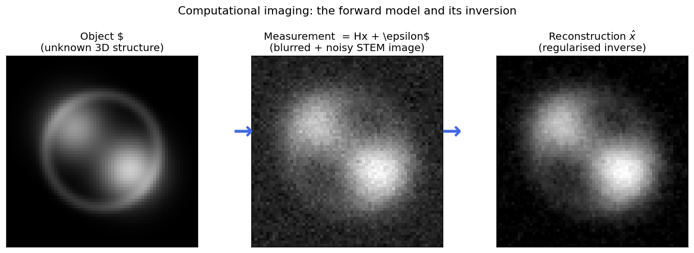{width="75%"}

:::: {.incremental}
- **Computational imaging:** optics + detector + reconstruction are co-designed; every experiment has a *forward operator* $H$ (PSF, projection, scattering), a *noise model* $\boldsymbol\epsilon$ (Poisson / Gaussian, Week 2) and a *reconstruction algorithm*. [@kamilov2023plug]
::::

:::: {.notes}
- Classical microscopy: build the best optics → the image *is* the result. Computational imaging: the detector measures something not directly interpretable; the reconstruction turns data into the image. Paradigm shift: a smarter reconstruction on the same raw data can equal or exceed an expensive hardware upgrade.
- Walk through each panel. Left: the true object — sharp features. Centre: what the detector records after convolution with the PSF and addition of noise. Right: the best regularised estimate — recovered but broadened; this is regularisation bias.
- Imaging pipeline (Week 2's data-formation chain): illumination → scattering → detection. The PSF makes the image a convolution of the object with the PSF. In STEM, the probe is the PSF; HAADF intensity y_ij ≈ ∫ PSF(r − r_ij) Z(r)^1.7 dr [@pennycook2012scanning]. In tomography each projection is a set of line integrals — the Radon transform (tomography section).
- Concrete EM example (notebook sections 1–5): a STEM line profile blurred with a Gaussian PSF (σ_p = 3 px ≈ 150 pm). In matrix form H is Toeplitz (each row a shifted PSF), numerically rank-deficient. Frequencies attenuated below the noise floor are effectively in the null space — no algorithm can recover them. In 2-D, H is N² × N², so real reconstructions use FFTs or projectors instead of forming H.
- Historical note: X-ray CT (Hounsfield, 1972) was the first major example of computational imaging.
- Even with H known perfectly, inversion is hard because of (i) non-uniqueness and (ii) noise amplification — next section.
- Pacing: 3–4 minutes.
::::

## EM modalities as forward models

| Modality | $H$ | Object $\mathbf{x}$ | Noise | Typical prior |
|:--|:--|:--|:--|:--|
| HAADF-STEM | PSF $\star$ $Z^{1.7}$ | projected density | Poisson | TV / sparsity |
| EELS / EDS map | PSF $\star$ (linear) | elemental fraction | Poisson | TV, smoothness |
| Electron tomography | Radon transform | 3-D density | ≈ Gaussian | TV, non-negativity |
| HAADF + EDS fusion | $\{Z^\gamma$-sum, identity$\}$ | all elemental maps | Gaussian + Poisson | TV per element |
| 4D-STEM ptychography | multislice (nonlinear) | complex potential | Poisson | learned (Week 13) |

- **Same template for every row** — only $H$, the noise model and the prior change.

:::: {.notes}
- Students should be able to reproduce this table in the exam, including the noise column and a sensible prior.
- Gaussian vs Poisson: raw electron counts are always Poisson. In tomography it is common to take −log(I/I₀) (BF) or to work at high counts (HAADF), where the noise is approximately Gaussian — that is why tomography algorithms use least squares.
- The fusion row: two forward operators (HAADF: a nonlinear sum of Z-weighted elemental maps; EDS: approximately identity) acting on the same unknowns. We come back to it in the sensor-fusion section.
- Ptychography is often over-determined: a 64×64 scan with 64×64 diffraction patterns gives ≈ 16.7 M measurements for 4096 unknowns — redundancy ≈ 4000×, which makes the inversion stable (Week 13).
::::

<!-- ===== §2. Why inversion is hard ===== -->

## Why inversion is hard (I): non-uniqueness and Hadamard

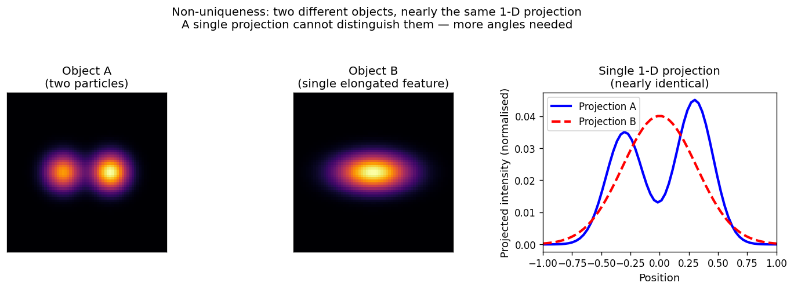{width="62%"}

:::: {.incremental}
- **Hadamard: well-posed** ⇔ a solution *exists*, is *unique*, and depends *stably* on $\mathbf{y}$. [@hadamard1902surles]
- EM inverse problems typically violate **uniqueness** (limited angles, missing wedge) and **stability** (tiny singular values). Regularisation restores well-posedness by restricting the solution space.
::::

:::: {.notes}
- Two physically different objects give the same projection. The detector is "blind" to the difference because projection sums along the ray. This is a geometric limitation, not an instrument failure.
- Existence fails if the true object is not in the model class (e.g. noisy data outside the range of H). Uniqueness fails for any limited-angle geometry. Stability fails whenever H has very small singular values — 1 % noise can become 100 % error.
- Hadamard's classification (1902) came from PDEs, not imaging — but it is the right framework for any inversion of a physical process.
- Stability is the surprising one: in the forward direction small input changes give small output changes; the inverse maps a narrow output range to a wide input range, amplifying noise.
- The fix in tomography: acquire projections from many angles; each angle shrinks the null space. With finitely many noisy projections the null space is never fully constrained — regularisation fills the gap.
- Key message: "The data alone never uniquely determine the object. We must add prior knowledge about what a reasonable object looks like."
- Pacing: 3 minutes.
::::

## Why inversion is hard (II): ill-conditioning

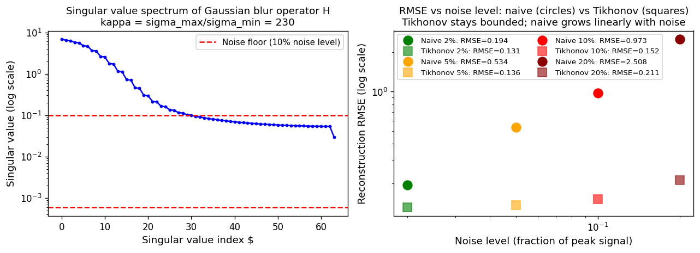{width="75%"}

:::: {.incremental}
- **Condition number** $\kappa = \sigma_\text{max}/\sigma_\text{min}$ bounds noise amplification: $\kappa \approx 230$ turns 1 % noise into up to 230 % error.
- A PSF is a low-pass filter, so its inverse is a high-pass amplifier — of exactly the noisiest frequencies.
::::

:::: {.notes}
- Left panel: singular values drop over 2–3 orders of magnitude. The naive inverse divides by each; small ones produce huge amplification. Red dashed line = noise floor. In the notebook: 33 of 64 singular values lie below the 10 % noise level.
- Rule of thumb: κ < 10 — naive inversion is safe; κ ~ 100 — some regularisation needed; κ > 10⁴ — essential.
- For a convolution operator the singular values are the magnitudes of the OTF. A Gaussian PSF has a Gaussian OTF that falls to zero at high frequencies.
- Misconception to kill: "a better deconvolution algorithm recovers arbitrarily sharp features." False: zooming into a blurry photo does not restore detail; regularisation makes a stable *estimate*.
- EELS: Fourier-ratio deconvolution is always combined with a low-pass filter — that low-pass IS the regulariser.
- Connection to Week 3: the same SVD — small singular values were "noise directions" in PCA; here they are the source of ill-posedness.
::::

## Noise amplification in action

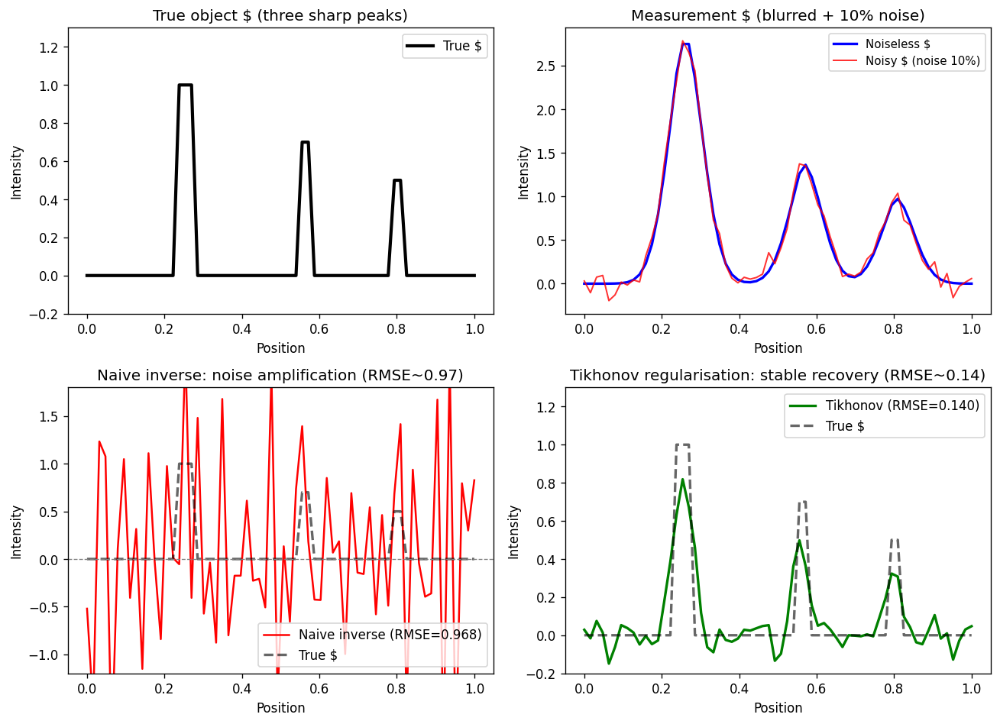{width="80%"}

:::: {.notes}
- The most important figure of the first half. Make sure students understand every panel.
- Naive inverse: RMSE ≈ 0.968 — the reconstruction is dominated by amplified noise.
- Tikhonov: RMSE ≈ 0.140. Peaks visible and correctly located; heights slightly reduced (regularisation bias).
- Question to the audience: "Is the Tikhonov result correct?" No — it is slightly wrong everywhere. But it is *interpretably* wrong; the naive result is *uselessly* wrong.
- Also shows the "honest limits" message: the best reconstruction is the least wrong among stable solutions; an over-regularised one (λ = 5, RMSE ≈ 0.189) smears the peaks and looks deceptively clean.
::::

## Why the naive inverse fails: the SVD picture

:::: {.incremental}
- **Naive inverse:** $\hat{\mathbf{x}}_\text{naive} = \sum_i \frac{\mathbf{u}_i^\top \mathbf{y}}{\sigma_i}\,\mathbf{v}_i$ — divides by every $\sigma_i$, including the tiny ones.
- **Tikhonov filter:** $\hat{\mathbf{x}}_\lambda = \sum_i \dfrac{\sigma_i}{\sigma_i^2 + \lambda}\,(\mathbf{u}_i^\top \mathbf{y})\,\mathbf{v}_i$ — filter factor $\sigma_i^2/(\sigma_i^2+\lambda)$: ≈ 1 for large $\sigma_i$, ≈ 0 for $\sigma_i \ll \sqrt\lambda$.
- **Truncated SVD** = hard filter (Week 3's top PCA components); L1 / TV act as *non-linear*, edge-preserving filters.
::::

:::: {.notes}
- SVD of H: H = U Σ Vᵀ, naive inverse = V Σ⁻¹ Uᵀ y.
- Reference formula; the exam asks for the intuition, not the derivation: "λ puts a floor under the singular values".
- Wiener filtering is Tikhonov for convolution operators with a frequency-dependent λ = 1/SNR(k).
- Generalised Tikhonov: (HᵀH + λLᵀL)⁻¹Hᵀy with L = I (ridge), L = ∇ (penalise gradients), L = Laplacian (penalise curvature).
- Transition: "Now let us build the regularised framework."
::::

<!-- ===== §3. Regularisation ===== -->

## Regularisation: data + prior

:::: {.incremental}
- $\hat{\mathbf{x}} = \arg\min_{\mathbf{x}} \underbrace{\|H\mathbf{x} - \mathbf{y}\|^2}_{\text{data fidelity}} + \lambda \underbrace{R(\mathbf{x})}_{\text{regulariser}}$ — data term from the noise model (Gaussian → squared error, Poisson → $\sum_i [(H\mathbf{x})_i - y_i \log (H\mathbf{x})_i]$).
- **Bayesian view (Week 11):** data term = −log-likelihood, regulariser = −log-prior → MAP estimate. [@bishop2006pattern]

| Regulariser | Prior belief | Effect |
|:--|:--|:--|
| $\|\nabla \mathbf{x}\|_2^2$ (L2 / Tikhonov) | varies slowly (Gaussian) | smooth; blurs edges |
| $\|\nabla \mathbf{x}\|_1$ (TV) | piecewise constant | sharp edges; staircases |
| $\|\mathbf{x}\|_1$ (L1) | mostly zero | sparse |
| $\mathbf{x} \geq 0$ | non-negative densities | removes unphysical solutions |
::::

:::: {.notes}
- The central equation of the lecture. Make students copy it; it reappears for every regulariser, for tomography and for sensor fusion.
- λ: too small → fits noise (overfitting); too large → ignores the data. Same bias–variance trade-off as Ridge/Lasso in Week 4 — Ridge regression is exactly Tikhonov with H = the design matrix X. Plain L2 ‖x‖² (ridge) = uniform shrinkage.
- Bayes: p(x|y) ∝ p(y|x)p(x). −log p(x|y) = ‖Hx − y‖²/(2σ²) + R(x) + const. Gaussian prior → L2; Laplace prior on gradients → TV; Laplace prior on values → L1.
- "Regularisation encodes prior knowledge" is the single most important sentence.
- The table is examinable: what each regulariser assumes and what it produces. Choice of regulariser is a scientific choice: TV for HAADF of grains / particles in vacuum; smoothness for slowly varying phase maps.
- Geometric intuition (Week 4 Lasso picture): without regularisation every x with ‖Hx − y‖ ≤ ‖ε‖ is equally valid; with it, the solution is where the data-fit ellipsoid first touches the constraint set. L2 ball → smooth; L1 diamond → sparse; TV ball → piecewise constant.
- Non-negativity is the cheapest and most underrated prior: it alone removes a large part of the null space in tomography.
::::

## Tikhonov (L2) regularisation

:::: {.incremental}
- $\hat{\mathbf{x}}_\lambda = \arg\min_\mathbf{x} \|H\mathbf{x} - \mathbf{y}\|_2^2 + \lambda \|L\mathbf{x}\|_2^2$, $L = I$ or $\nabla$. [@tikhonov1977solutions]
- **Closed form:** $\hat{\mathbf{x}}_\lambda = (H^\top H + \lambda L^\top L)^{-1} H^\top \mathbf{y}$ — one linear solve.
- **Prior:** Gaussian on $L\mathbf{x}$. Cheap, unique, spectral-filter interpretation.
- **Weakness:** blurs edges — atomic columns, grain boundaries, interfaces — whatever $\lambda$ you pick.
::::

:::: {.notes}
- Tikhonov's key insight: adding a penalty turns an ill-posed problem into a well-posed one, and the solution converges to the truth as noise → 0 and λ → 0 at the right rate.
- L = ∇ is sometimes called first-order Tikhonov (or Tikhonov–Phillips); L = I is zeroth-order = ridge.
- Works well: DPC/ptychographic phase maps of uniform samples, graded compositions. Fails: core-shell, grain boundaries, heterostructures → use TV.
::::

## Total variation (TV) regularisation

:::: {.incremental}
- $\text{TV}(\mathbf{x}) = \|\nabla \mathbf{x}\|_1 = \sum_{i,j} \sqrt{(\partial_i x)^2 + (\partial_j x)^2}$. [@rudin1992nonlinear]
- **Prior:** piecewise constant — grains, particles in vacuum, phases.
- **Why edges survive:** a step of height $h$ costs $h$ under TV; under L2 a ramp over $n$ pixels costs $h^2/n$, so L2 prefers the ramp.
- **Standard prior** for HAADF tomography and compressed sensing [@leary2013compressive]; weaknesses: staircases, "cartoon look", non-differentiable → proximal methods.
::::

:::: {.notes}
- Rudin, Osher and Fatemi (1992) introduced TV denoising. It became the dominant regulariser for compressed-sensing tomography in the 2010s.
- The ramp argument: L2 of the gradient for a ramp over n pixels = n·(h/n)² = h²/n → decreases with n, so L2 prefers wide ramps; TV = n·(h/n) = h, independent of n → no preference for smearing.
- Staircase: on a smooth gradient TV produces flat steps — structure that is not real. Always sanity-check.
::::

## Tikhonov vs TV on a grain-boundary step signal

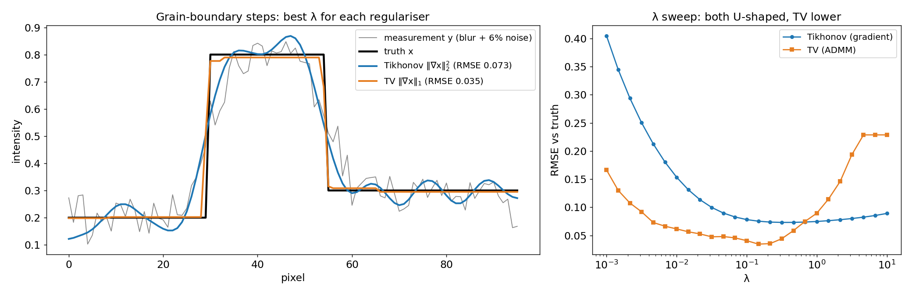{width="85%"}

:::: {.notes}
- The truth has perfectly sharp steps at pixels 30 and 55 — think of a HAADF line profile across two grain boundaries (0.2 → 0.8 → 0.3).
- Tikhonov: transitions visible but smeared; oscillations (Gibbs-like ringing) in the flat regions.
- TV: sharp transitions at the correct positions; slight height bias (TV shrinks contrast by ~λ). Note the flat TV plateau at large λ: the reconstruction collapses to a constant.
- Exam question: "Which regulariser for a HAADF image of a grain boundary?" → TV.
- Honesty: both have artefacts. Making the prior explicit makes the artefacts predictable.
::::

## Solving TV: proximal splitting and ADMM

:::: {.incremental}
- **Problem:** $\min_\mathbf{x} \tfrac12\|H\mathbf{x}-\mathbf{y}\|^2 + \lambda\|D\mathbf{x}\|_1$ — the second term has a kink, so plain gradient descent stalls.
- **ADMM idea** [@boyd2011admm]: introduce $\mathbf{z} = D\mathbf{x}$ and alternate three simple steps:
  1. **data step:** $\mathbf{x} \leftarrow (H^\top H + \rho D^\top D)^{-1}(H^\top\mathbf{y} + \rho D^\top(\mathbf{z}-\mathbf{u}))$
  2. **prior step:** $\mathbf{z} \leftarrow \operatorname{soft}_{\lambda/\rho}(D\mathbf{x} + \mathbf{u})$ — soft-thresholding: small gradients → exactly 0 (flat regions)
  3. **dual step:** $\mathbf{u} \leftarrow \mathbf{u} + D\mathbf{x} - \mathbf{z}$
- **The general pattern:** *data consistency* step ↔ *denoising* step (the proximal operator of the prior). Every modern reconstruction algorithm — SART + TV, fusion, plug-and-play — has this structure.
- **Notebook:** `tv_admm()` is 10 lines of NumPy; 500 iterations on 96 pixels take milliseconds.
::::

:::: {.notes}
- Why soft-thresholding gives flat regions: gradients smaller than λ/ρ are set exactly to zero — the L1 geometry from Week 4 again.
- The "data step + denoising step" pattern is the key abstraction for the next slide (plug-and-play) and for SART + TV in tomography, where the data step is a SART sweep and the prior step is a TV denoiser.
- Students do not need to prove convergence; they need to recognise the structure.
::::

## Plug-and-play priors: a learned denoiser as the prior step

:::: {.columns}
::: {.column width="55%"}
:::: {.incremental}
- **Observation:** in ADMM the prior only enters through a *denoising* step. So replace it by *any* good denoiser $D_\sigma$ — BM3D, or a CNN (DnCNN, U-Net) trained on clean EM images. [@venkatakrishnan2013plug; @kamilov2023plug]
- **PnP-ADMM:**
  $\mathbf{z}^k \leftarrow \operatorname{prox}_{\alpha g}(\mathbf{x}^{k-1} - \mathbf{s}^{k-1})$ (physics / data)
  $\mathbf{x}^k \leftarrow D_\sigma(\mathbf{z}^k + \mathbf{s}^{k-1})$ (learned prior)
  $\mathbf{s}^k \leftarrow \mathbf{s}^{k-1} + \mathbf{z}^k - \mathbf{x}^k$
- **Why not train an end-to-end inverse network?** It must learn physics *and* prior, gives no data-consistency guarantee and must be retrained for every new geometry. PnP keeps the physics explicit and reuses one denoiser.
::::
:::
::: {.column width="45%"}
:::: {.incremental}
- **Separation of concerns:**
  - forward model $H$ = known physics (projector, PSF, multislice)
  - prior = learned statistics of plausible images
- **Caveats:** convergence needs well-behaved denoisers; a denoiser trained on the wrong material hallucinates its training distribution.
- **Next week:** diffusion models push this idea further — a *generative* prior sampled while enforcing data consistency.
::::
:::
::::

:::: {.notes}
- PnP (Venkatakrishnan, Bouman, Wohlberg 2013) is the conceptual bridge from classical regularisation to learned priors. The Kamilov et al. 2023 review is the reference for theory and algorithms.
- The green/red box picture from last year: green = data consistency (physics), red = denoiser (prior).
- EM relevance: denoisers trained on simulated HAADF images are used as priors in low-dose tomography and ptychography.
- Honest caveat: the prior is only as good as its training data — the same distribution-shift problem as in Week 8 and the OOD discussion in Week 11.
::::

<!-- ===== §4. Choosing lambda ===== -->

## Choosing $\lambda$: the bias–variance trade-off

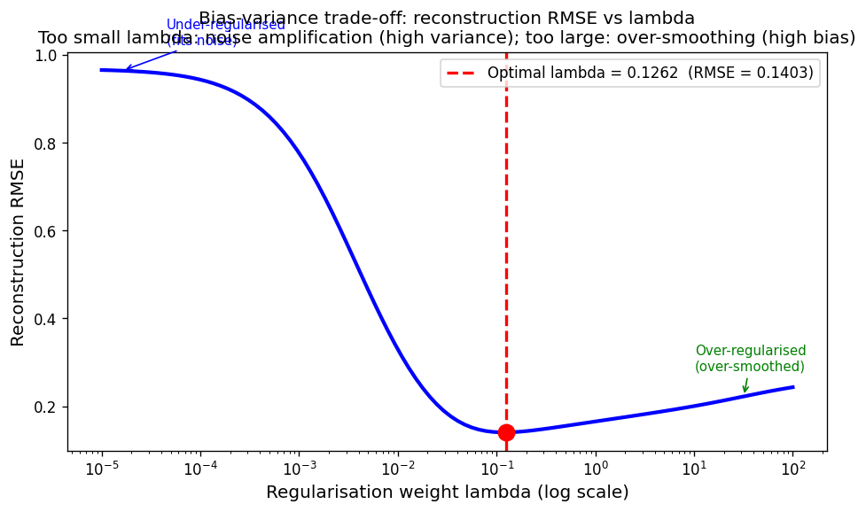{width="72%"}

:::: {.notes}
- Numbers: λ = 10⁻⁵ → RMSE ≈ 0.966; λ = 100 → RMSE ≈ 0.243; optimum λ* ≈ 0.126 with RMSE ≈ 0.140 (SEED=42, N=64, σ_PSF = 3, 10 % noise).
- Students must reproduce the U-shape in the notebook (SEED=42).
- The U-shape always exists when the model can overfit (small λ) and the prior can underfit (large λ).
- The RMSE curve needs the ground truth — never available for real EM data. That is why the L-curve and the discrepancy principle exist.
::::

## Choosing $\lambda$ without ground truth: the L-curve

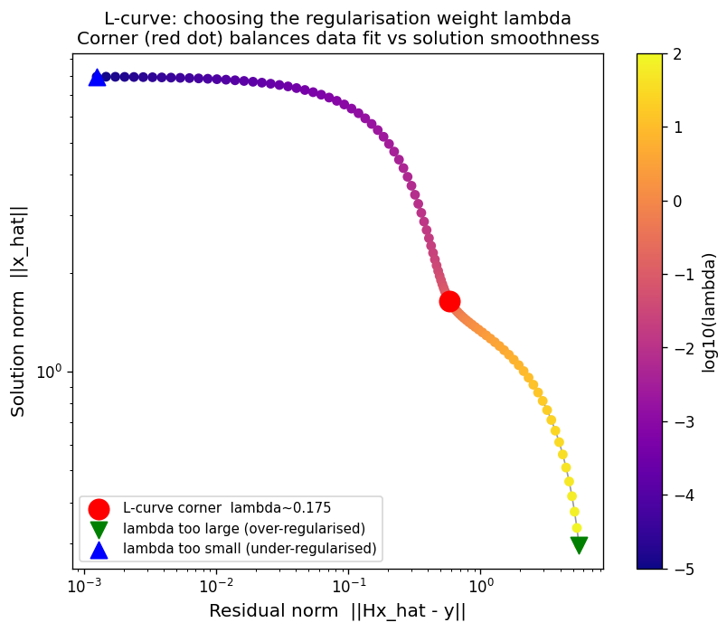{width="55%"}

:::: {.notes}
- Vertical leg (top-left): over-regularised, poor data fit, small norm. Horizontal leg (bottom-right): under-regularised, tight fit, enormous norm. Corner = maximum curvature.
- Honest discrepancy: corner λ ≈ 0.175 vs RMSE-optimal λ ≈ 0.126 — a factor 1.4 in λ, but only 0.142 vs 0.140 in RMSE. The L-curve is a guide, not a guarantee [Hansen 1992]. Can mislead on flat curves.
::::

## The discrepancy principle and cross-validation

:::: {.incremental}
- **Discrepancy principle (Morozov):** choose $\lambda$ with $\|H\hat{\mathbf{x}}_\lambda - \mathbf{y}\| \approx \|\boldsymbol\epsilon\|$ — needs a noise estimate (Poisson counts, blank frames).
- **Cross-validation:** hold out pixels or tilts, minimise the held-out residual (Week 4).
- **Notebook tomography:** the discrepancy principle picks TV weight 0.04 — exactly the RMSE optimum, without ground truth.
- **Always report $\lambda$** — it is a parameter of your measurement.
::::

:::: {.notes}
- For Gaussian noise of standard deviation σ on M measurements, ‖ε‖ ≈ σ√M.
- The tomography exercise result: residual/noise ratio 0.63 (weight 0) → 0.96 (0.04) → 1.27 (0.16), RMSE minimal at 0.04.
- Cross-validation by leaving out tilts is used in practice for tomography.
::::

## $\lambda$ selection in EM: what practitioners do

:::: {.incremental}
- **Tomography:** SART + TV; sweep the TV weight on a log grid; inspect: ringing / noise → increase, lost small features → decrease; check the residual against the noise floor.
- **EELS/EDS deconvolution:** Wiener filter = Tikhonov in Fourier space with a frequency-dependent $\lambda = 1/\mathrm{SNR}(k)$.
- **Sensor fusion:** tune the TV weight on a reference region with known composition (vacuum must stay zero); err on the side of *under*-regularising — noise is familiar, over-smoothing creates unphysical features. [@manassa2024fused]
- **There is no universal correct $\lambda$** — it depends on noise level, specimen and question.
::::

:::: {.notes}
- The "err on the side of under-weighting" advice comes from the fused multi-modal tutorial (Manassa et al.) — it is sound: reviewers recognise noise; they do not recognise hallucinated smoothness.
- Transition: "We have the full toolbox. Now apply it to the most important 3-D inverse problem in EM: tomography."
::::

<!-- ===== §5. Electron tomography ===== -->

## Why tomography? Projections are misleading

:::: {.incremental}
- A TEM/STEM image is a **2-D projection** of a 3-D object: overlapping particles, buried interfaces and shape are ambiguous.
- **Electron tomography:** tilt series ($\pm 70°$, 1°–3° steps), then invert for the 3-D density. [@midgley2003tomography; @frank2006electron]
- **Projection requirement:** intensity must be *monotonic* in a projected property → HAADF ($\approx Z^{1.7}$, incoherent) is the standard; BF diffraction contrast violates it.
- **Dose budget:** dose per image × number of tilts → beam-sensitive samples need more regularisation.
::::

:::: {.notes}
- Idea from Frank's textbook (Fig. 5.1, a New Yorker cartoon, not shown for copyright reasons): a single projection is insufficient to infer the structure of an object. "Microscopists study the shadows on the wall because they do not have access to the objects that create them."
- Structure determines function: quantum-dot size → emission colour; particle shape → catalytic facets.
- Related 3-D techniques are all inverse problems: crystallography, cryo-EM single-particle analysis, atom-probe tomography, ptychographic tomography.
- Contrast with biology: cryo-EM averages thousands of identical copies. Materials nanoparticles are all different — each one must be reconstructed individually, from one tilt series, at limited dose.
- Forward model: each projection p_θ(s) = ∫_ray f dl is a line integral at tilt θ; 50–140 images. Beer's law for BF: take −log(I/I₀) to get a quantity linear in thickness.
- Crowther criterion: for a particle of diameter d at resolution δ, the number of projections needed is ≈ πd/δ — 60–150 for typical nanoparticles.
- EELS/EDS tomography needs a spectrum image per tilt → enormous dose → strong priors and fusion (sensor-fusion section; spectroscopic example on a backup slide).
::::

## The Radon transform and the sinogram

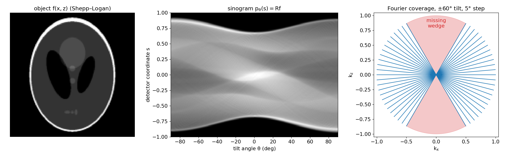{width="88%"}

:::: {.incremental}
- $\;p_\theta(s) = (\mathcal{R}f)(\theta, s) = \iint f(x,z)\,\delta(x\cos\theta + z\sin\theta - s)\,dx\,dz$ — linear: $\mathbf{p} = R\,\mathbf{f}$. [@radon1917bestimmung]
::::

:::: {.notes}
- Radon (1917) proved that a function is uniquely determined by all its line integrals — the mathematical foundation of CT and electron tomography.
- Why "sinogram": a single point at (x₀, z₀) projects to s = x₀cosθ + z₀sinθ — a sinusoid in the (θ, s) plane. The sinogram is a superposition of sinusoids.
- The matrix R is the H of this week: same template y = Hx + ε. In 3-D with parallel-beam geometry and a single tilt axis, each slice perpendicular to the tilt axis is an independent 2-D problem — that is why the 2-D notebook is realistic.
- For single-axis tilt the wedge is a 2-D wedge per slice; dual-axis tilting reduces it to a "missing pyramid". Figure generated by `img/make_figures.py`.
::::

## Back-projection: why we need the filter

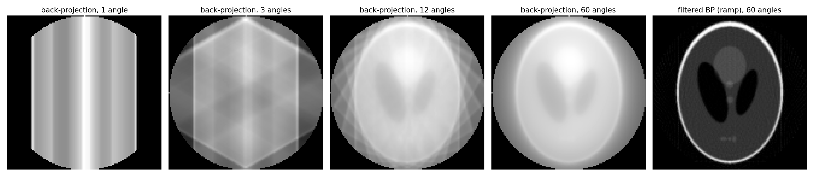{width="92%"}

:::: {.incremental}
- **Back-projection** $R^\top\mathbf{p}$ (adjoint): smear each projection back along its rays. Not the inverse — low frequencies are over-counted by $1/|k|$ → blur.
- **FBP:** ramp-filter ($|k|$) each projection, then back-project. Exact for complete, noise-free data. [@kak1988principles]
::::

:::: {.notes}
- Back-projection is the transpose of the projection matrix — the same Rᵀ that appears in the gradient of the least-squares data term, ∇ = Rᵀ(Rf − p). So every gradient step in iterative tomography is a back-projection of the residual.
- Why 1/|k|: Fourier spokes are dense near the origin and sparse far out (next slide).
- The ramp filter is a high-pass filter: it amplifies high-frequency noise. In practice it is apodised (Shepp–Logan, Hann filters) — regularisation in disguise.
- The star artefact with 3 angles connects to non-uniqueness: many objects are consistent with 3 projections.
::::

## The Fourier-slice theorem

:::: {.columns}
::: {.column width="45%"}
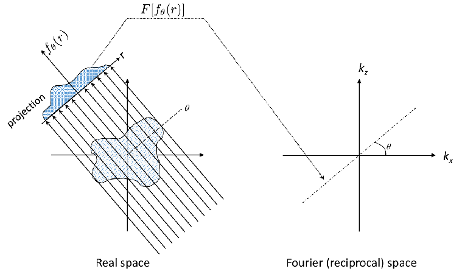{width="100%"}
:::
::: {.column width="55%"}
:::: {.incremental}
- The 1-D FT of a projection is the central slice of the 2-D FT of $f$ at the same angle:
  $$\mathcal{F}_{1D}[p_\theta](k) = \mathcal{F}_{2D}[f](k\cos\theta,\,k\sin\theta)$$
- Each tilt fills one spoke; the gaps are the null space.
- Full angular coverage ⇒ unique inversion; FBP = fill spokes, weight by $|k|$, invert.
::::
:::
::::

:::: {.notes}
- Proof sketch for θ = 0 (worth doing on the board, 2 minutes): p₀(x) = ∫ f(x,z) dz. Its FT: ∫ p₀(x) e^{-2πikx} dx = ∫∫ f(x,z) e^{-2πi(kx + 0·z)} dx dz = F(k, 0). General θ follows by rotation.
- In 3-D: a 2-D projection ↔ a central *plane* of the 3-D Fourier transform.
- The polar-grid Jacobian |k| dk dθ is exactly where the ramp filter comes from.
- The theorem is exact, not an approximation — next slide. The limits of tomography come from *which* slices we can measure and from noise.
- This theorem is also why resolution in tomography is anisotropic and why the missing wedge is a wedge.
::::

## The Fourier-slice theorem, checked numerically

{width="92%"}

:::: {.notes}
- This is a three-line check in the notebook: sum over one axis, FFT, compare with a row of the 2-D FFT. Encourage students to try another angle using scipy.ndimage.rotate — then the agreement is only approximate because of interpolation.
- Take-away: the theorem is not an approximation; the limits of tomography come from *which* slices we can measure and from noise.
::::

## The missing wedge

:::: {.incremental}
- **Tilt limit** (holder, grid): no data beyond ±60°–80° → an unmeasured wedge in Fourier space.
- These frequencies are in the **null space of $R$**: reconstructions elongate along the beam; resolution is anisotropic.
- **Mitigation:** needle specimens (±90°), dual-axis tilt, and priors (non-negativity, TV, compressed sensing) that fill the wedge with *plausible* values — never measured ones. [@leary2013compressive; @saghi2016reduced]
::::

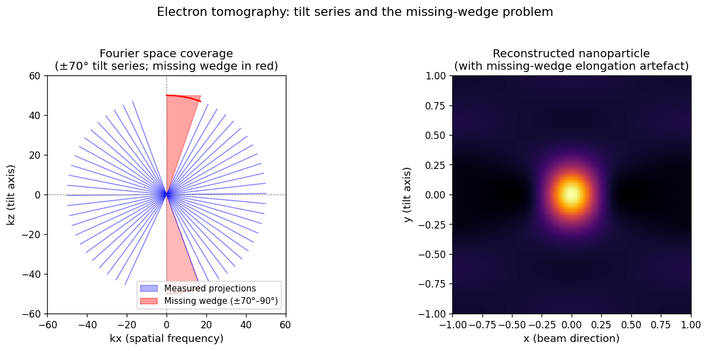{width="55%" fig-align="center"}

:::: {.notes}
- Figure: Fourier coverage for ±70° (left) and a spherical particle reconstructed with the missing-wedge elongation (right).
- Most commonly misinterpreted artefact in electron tomography: a spherical particle appears elongated along z — not real structure.
- Diagnostic: the elongation is always along the beam, identical for all particles, and shrinks with a larger tilt range [@frank2006electron].
- Important nuance: a prior "filling" the wedge is an *inference*, not a measurement. TV fills it with piecewise-constant extrapolation; a wrong prior fills it wrongly.
::::

## Tomographic reconstruction algorithms

:::: {.incremental}
- **FBP:** analytical, fast, no hyperparameters — but the ramp amplifies noise and the missing wedge gives streaks.
- **SART:** iterative least squares on $\mathbf{p} = R\mathbf{f}$ — project, back-project the residual, update; easy non-negativity. [@andersen1984sart]
- **SART + TV:** SART sweep (data step) + TV denoising (prior step) — the ADMM pattern again. [@saghi2016reduced]
- **Compressed sensing:** minimise $\|R\mathbf{f} - \mathbf{p}\|^2 + \lambda\,\text{TV}(\mathbf{f})$ — far fewer tilts. [@leary2013compressive] Learned priors: Week 13.
::::

:::: {.notes}
- FBP algorithm: (1) ramp-filter each projection in Fourier space, (2) back-project. O(N² log N) per slice. Exact with complete noiseless data.
- SART update: f ← f + ω · (normalised Rᵀ)(p − Rf), with relaxation ω. It never uses missing projections — it simply has no equations for them; non-negativity + early stopping act as implicit regularisers.
- In the notebook: skimage `iradon_sart` with relaxation 0.25 and clip to [0, 2]; TV via `denoise_tv_chambolle` after each sweep.
- Learned priors (PnP, unrolled networks, diffusion): Week 13.
::::

## FBP vs iterative vs regularised: the notebook result

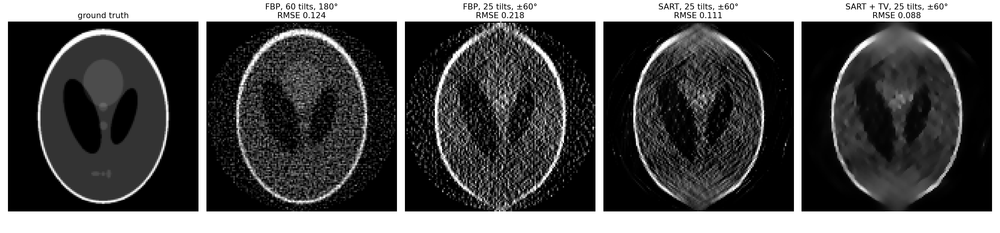{width="95%"}

:::: {.notes}
- Walk left to right. FBP 180°: correct geometry, grainy noise (ramp filter). FBP ±60°: streaks at the extreme tilt angles and the ellipse edges at top and bottom disappear — missing wedge.
- SART: much less noise (non-negativity + iterative averaging), but the wedge artefacts remain.
- SART + TV: cleanest image and lowest RMSE — beats unregularised FBP even on complete data. But small features near the bottom are washed out (TV cartoon effect) and the top/bottom edges are still weaker than the sides.
- Exercise B in the notebook: sweep the TV weight (0 → 0.16: RMSE 0.113 → 0.089 → 0.107), change the tilt range to ±45°/±75°, and implement the discrepancy principle.
- Key sentence: "regularisation beats more data only when the data are noisy; it never replaces the missing wedge."
::::

## Electron tomography: artefacts to be aware of

:::: {.incremental}
- **Missing-wedge elongation:** along the beam direction; severity grows with the missing angle.
- **Streaks (FBP):** radiating from high-contrast features at the extreme tilt angles and between sparse angles.
- **Over-regularisation:** TV staircases and cartoon look; Tikhonov blur. Monitor the residual — much larger than the noise level ⇒ over-regularised.
- **Model violations:** diffraction contrast in BF, channelling in HAADF, beam damage during the series, tilt-axis misalignment — *no* regulariser fixes a wrong forward model.
- **Honest reporting:** tilt range, tilt step, algorithm, number of iterations, $\lambda$, total dose.
::::

:::: {.notes}
- Challenge question: "A TV-regularised tomogram shows a very sharp phase boundary — real or TV artefact?" Answer: (1) compare with a mildly regularised reconstruction; (2) check whether the boundary is visible in the raw projections; (3) check the residual.
- Dose-symmetric tilt schemes collect the most informative low tilts first to limit damage.
- Transition: "Tomography combines many views of one signal. Sensor fusion combines several signals of one object."
::::

<!-- ===== §6. Sensor fusion ===== -->

## Sensor fusion: why fuse HAADF + EDS/EELS?

:::: {.incremental}
- **HAADF:** high SNR, atomic resolution, but only $Z$-contrast ($\approx Z^{\gamma}$, $\gamma \approx 1.6$–$2$) — not *which* element.
- **EDS/EELS:** chemically specific, but few counts/px at a safe dose → noisy maps.
- **Brute force:** 10× dose → only $\sqrt{10} \approx 3.2\times$ SNR, and a destroyed specimen.
- **Fusion:** the HAADF image comes *for free* (simultaneous); require the elemental maps to *jointly* explain it — one regularised inverse problem, two forward operators. [@Schwartz_2022]
::::

:::: {.notes}
- Frame this as "borrowed information": HAADF tells us where the scattering power is; EDS tells us what it is made of.
- Requirements (from the tutorial): both signals recorded on the same grid (ideally simultaneously), HAADF must provide Z-contrast, the chemical maps must cover *all* elements that contribute to the HAADF signal.
- Last year this was taught as "sensor fusion as a regression problem" — least squares plus a Poisson term plus TV, i.e. regularised regression with a physics-based design. The same template as in the forward-model section, one more data term.
::::

## The fused multi-modal objective

$$\hat{\mathbf{x}} = \arg\min_{\mathbf{x}_i \geq 0}\; \underbrace{\tfrac12\Big\|\mathbf{b}_H - \sum_i (Z_i\mathbf{x}_i)^{\gamma}\Big\|_2^2}_{\Psi_1:\ \text{HAADF, Gaussian}} + \lambda_1 \underbrace{\sum_i \big(\mathbf{1}^\top\mathbf{x}_i - \mathbf{b}_i^\top\log(\mathbf{x}_i + \varepsilon)\big)}_{\Psi_2:\ \text{EDS, Poisson NLL}} + \lambda_2 \underbrace{\sum_i \|\mathbf{x}_i\|_\text{TV}}_{\text{prior}}$$

:::: {.columns}
::: {.column width="45%"}
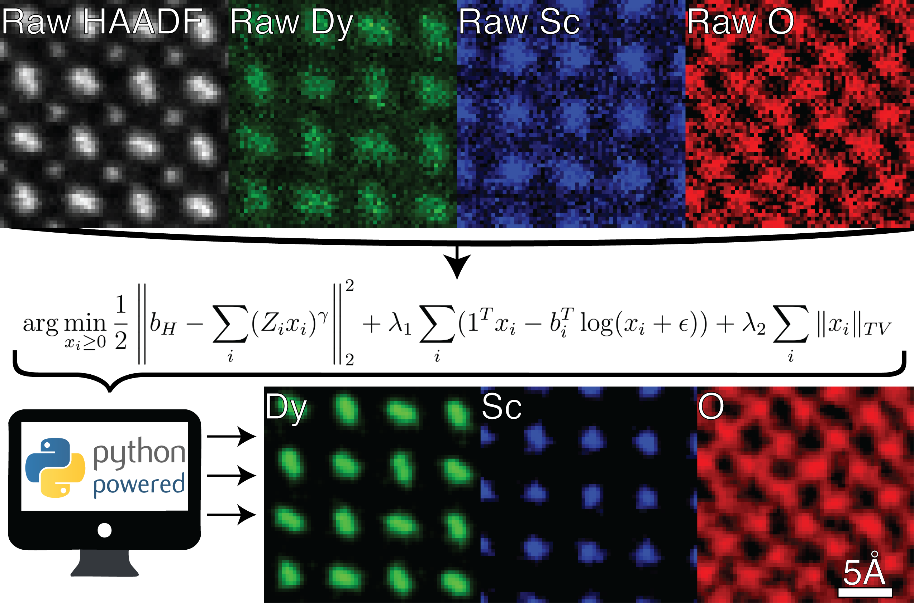{width="90%"}
:::
::: {.column width="55%"}
:::: {.incremental}
- $\Psi_1$ alone is non-unique, $\Psi_2$ alone is noisy — together: **HAADF fixes *where*, EDS fixes *what***.
- $\mathbf{x}_i \geq 0$: concentrations are non-negative.
- **Gains:** 300–500 % SNR, > 10× dose reduction, stoichiometry within ≈ 15 %. [@Schwartz_2022]
- Solved with the same pattern: gradient step, positivity, TV step.
::::
:::
::::

:::: {.notes}
- Unknowns: one map x_i per element (Dy, Sc, O). b_H = measured HAADF, b_i = measured EDS counts for element i.
- Ψ₁: the elemental maps, weighted by atomic number and raised to γ ≈ 1.6, must reproduce the HAADF image — incoherent Z-contrast model; high counts → Gaussian → squared error.
- Ψ₂: Poisson negative log-likelihood — the correct noise model for low counts (Week 2!). Using MSE here would underweight low-count pixels.
- TV per element: piecewise-smooth maps, noise suppression, edge preservation.
- Ask: "What happens if an element that contributes to HAADF is missing from the EDS list?" → Ψ₁ cannot be satisfied correctly; the algorithm distributes the missing scattering onto the other elements — a model violation, not a prior problem.
- λ₁ weights chemistry vs HAADF; the HAADF weight is fixed at 1/(number of elements) in the tutorial code. Typical settings: γ ≈ 1.6, λ₁ ∈ [0.05, 0.3], λ_TV < 0.2, 10–30 iterations [@manassa2024fused]. Full algorithm on the next slide.
- The gains are from the original paper's experiments and simulations; they depend on the specimen and dose.
- Correction to older versions of this slide: the fusion objective is from Schwartz et al. 2022 (Hovden group), not from the STEM textbook.
- Pacing: 4 minutes — this is a "reproduce from memory" exam item.
::::

## The fusion algorithm: gradient step + positivity + TV

:::: {.incremental}
- **One iteration** (from the SS25 tutorial code, `fusion_utils.py`) — the ADMM-style pattern again:
  1. **data step:** $\mathbf{x} \leftarrow \mathbf{x} - \eta\big[\lambda_H\,\gamma\,\mathbf{x}^{\gamma-1}\odot A^\top(A\mathbf{x}^\gamma - \mathbf{b}_H) + \lambda_1(\mathbf{1} - \mathbf{b}/(\mathbf{x}+\text{bkg}))\big]$
  2. **constraint:** $\mathbf{x} \leftarrow \max(\mathbf{x}, 0)$
  3. **prior step:** a few iterations of fast gradient-projection TV denoising per element (weight $\lambda_\text{TV}$)
- **Typical settings:** $\gamma \approx 1.6$, $\lambda_1 \in [0.05, 0.3]$, $\lambda_\text{TV} < 0.2$, converges in 10–30 iterations. [@manassa2024fused]
- **Convergence check:** all three cost terms should decay and level off — oscillations mean a too-large step or $\lambda$.
- **Validation:** compare with the raw maps on thin, well-known regions; vacuum must stay empty.
::::

:::: {.notes}
- A is a weighted measurement matrix: it sums the element maps with weights Z_i — the "HAADF simulator".
- The chain rule gives the γx^{γ−1} factor: ∂/∂x of ‖Ax^γ − b‖²/2.
- The Poisson gradient 1 − b/x pushes x towards the measured counts; the background term bkg stabilises the division.
- This is short enough to implement in the miniproject if a student has simultaneous HAADF + EDS data.
::::

## Fusion result and the TV weight

:::: {.columns}
::: {.column width="55%"}
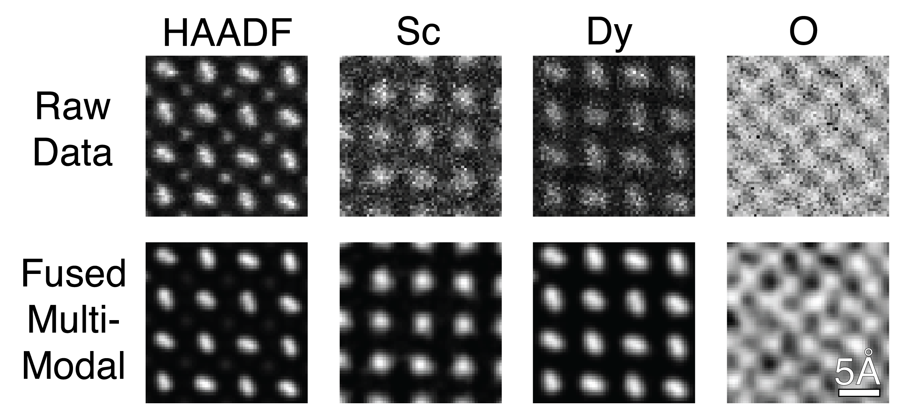{width="100%"}
:::
::: {.column width="45%"}
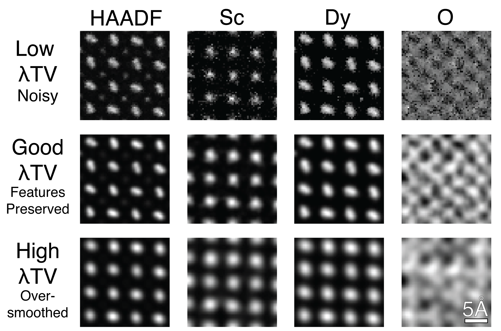{width="100%"}
:::
::::

- Noisy EDS → clean atomic-column maps; too much TV turns real column shapes into round blobs.

:::: {.notes}
- Left: point at the Sc and Dy columns: in the raw EDS they are barely recognisable; in the fused result they are sharp and on the HAADF lattice.
- The O map is the most interesting and most dangerous: oxygen contributes little to HAADF, so its reconstruction relies more on the prior (it gains structure because it is coupled through the HAADF term). Treat light-element fused maps with extra scepticism — the uncertainty lesson from Week 11 applies.
- Right: same U-shaped story as the λ sweep in the 1-D notebook and the TV-weight sweep in the tomography exercise — just shown as images.
- Best practice from the tutorial: err on the side of under-weighting. Noise is familiar; over-smoothing creates unphysical artefacts that look authoritative. Tune on a reference region with known composition — vacuum must stay empty.
- In the high-λ row the elongated Dy columns become round — the prior has overwritten a real feature. A good exam example of "regularisation bias".
- A synthetic core-shell example is on a backup slide.
::::

## Fusion as the general framework

:::: {.incremental}
- **One template:** $\;\hat{\mathbf{x}} = \arg\min_\mathbf{x} \sum_k \lambda_k\, \mathcal{D}_k(\mathbf{y}_k, H_k\mathbf{x}) + \lambda_\text{reg} R(\mathbf{x})$, $\mathcal{D}_k$ = NLL of modality $k$.
- **Examples:** deblurring · tomography ($H$ = Radon) · HAADF + EDS fusion · fused multi-modal *tomography* [@Schwartz_2024] · ptychography (Week 13).
- **Modular:** a new detector = a new data term; the prior stays.
- **Limit:** nonlinear $H_k$ and too-simple hand-crafted priors → Week 13.
::::

:::: {.notes}
- For projects: HAADF + EDS + EELS + BF of the same sample → one objective with four data terms and one prior.
- Fused multi-modal tomography (Schwartz 2024): high-SNR HAADF tilt series + sparse EDS tilts → 3-D chemistry at ≈ 1 nm resolution — tomography + fusion in one experiment.
- Connection across the course: Week 4 (ridge = forward model + L2 prior), Week 9 (VAE = reconstruction + KL prior), Week 11 (GP posterior = likelihood + prior) — all MAP/variational objectives of the same shape.
::::

<!-- ===== §7. Limits, summary, next week ===== -->

## Reconstruction limits: what we cannot recover

:::: {.incremental}
- **Null space of $H$** is irreversibly lost — missing-wedge frequencies (tomography), frequencies below the noise floor (deblurring), element mixtures hidden in both HAADF and EDS noise (fusion).
- **Noise floor:** accuracy bounded by $\|\boldsymbol\epsilon\| / \sigma_\text{min}(H)$ — more dose helps, a better algorithm does not.
- **Regularisation bias:** a wrong prior gives a *systematic*, convincing error. Report $\lambda$ and, where possible, uncertainty (Week 11).
::::

:::: {.notes}
- The null-space concept is the deepest point in the lecture: "What did the measurement operator destroy?"
- Regularisation always trades some resolution for stability — write it on the board. Over-regularisation is dangerous because it looks clean and authoritative.
- Diagnostic: compare the reconstruction's power spectrum with the noise floor; everything beyond the crossing was filled by the prior.
- Honest note to students: "If a published reconstruction shows features sharper than the instrument's PSF or detail inside the missing wedge, be sceptical — either the forward model is wrong or the prior is doing the talking."
::::

## Self-study notebook: deblurring, TV and tomography

:::: {.columns}
::: {.column width="60%"}
**`notebooks/week12_inverse_deblurring.ipynb`**

1. Forward model, SVD, condition number
2. Naive inverse vs Tikhonov, $\lambda$ sweep, L-curve
3. **TV vs Tikhonov** with a 10-line ADMM
4. **Tomography lab:** Fourier-slice check, FBP vs SART vs SART + TV
5. Exercises: noise / PSF sweep; tilt range, TV weight, discrepancy principle
:::
::: {.column width="40%"}
**Key results (SEED=42)**

| Quantity | Value |
|:--|:--|
| $\kappa(H)$ | 230 |
| naive / Tikhonov RMSE | 0.968 / 0.140 |
| step: Tikhonov / TV | 0.073 / 0.035 |
| FBP 180° / ±60° | 0.124 / 0.218 |
| SART / SART + TV | 0.111 / 0.088 |
:::
::::

:::: {.notes}
- CPU only, < 1 min, numpy / scipy / scikit-image; uses `radon` / `iradon` / `iradon_sart`.
- Recommend order: sections 1–5 first (they are the exam core), then 6 and 7. Exercise B task 4 (discrepancy principle — picks TV weight 0.04 = RMSE optimum) is the transferable skill.
- All numbers are from the executed notebook; students should reproduce them.
::::

## Summary

:::: {.incremental}
- **Forward model** $\mathbf{y} = H\mathbf{x} + \boldsymbol\epsilon$: $H$ from physics, the data term from the noise model.
- **Ill-posed** = non-unique and/or unstable; small singular values amplify noise by up to $\kappa$.
- **Regularisation** = prior: Tikhonov (smooth), TV (piecewise constant), non-negativity, learned denoisers (PnP); $\lambda$ via L-curve, discrepancy principle, cross-validation.
- **Tomography:** Radon → sinogram; Fourier-slice → spokes; FBP = ramp-filtered back-projection; missing wedge = null space; SART + TV beats FBP on limited, noisy data but cannot measure the wedge.
- **Sensor fusion:** HAADF fixes *where*, EDS/EELS fixes *what* → ≈ 10× dose reduction.
- **Universal pattern:** alternate a *data-consistency* step and a *prior* step.
::::

:::: {.notes}
- One sentence per bullet; ask students to reproduce the fusion objective and the Fourier-slice theorem from memory.
- Fusion objective recap: Gaussian HAADF term, Poisson EDS term, TV and non-negativity.
::::

## Must-know takeaways

:::: {.incremental}
1. $\mathbf{y} = H\mathbf{x} + \boldsymbol\epsilon$; Hadamard: existence, uniqueness, stability; $\kappa = \sigma_\text{max}/\sigma_\text{min}$ bounds noise amplification.
2. Tikhonov: $\hat{\mathbf{x}} = (H^\top H + \lambda L^\top L)^{-1}H^\top\mathbf{y}$; SVD filter factors $\sigma_i^2/(\sigma_i^2 + \lambda)$.
3. Regulariser = −log prior (MAP): L2 ↔ Gaussian (smooth), TV ↔ piecewise constant (edges), L1 ↔ sparse.
4. $\lambda$: U-shaped error; L-curve corner and discrepancy principle $\|H\hat{\mathbf{x}}-\mathbf{y}\| \approx \|\boldsymbol\epsilon\|$ need no ground truth.
5. Radon transform = line integrals; sinogram; Fourier-slice theorem: $\mathcal{F}_{1D}p_\theta$ = central slice of $\mathcal{F}_{2D}f$ at angle $\theta$.
6. FBP = ramp filter $|k|$ + back-projection; exact only for complete, noise-free data. SART/TV: iterative, handle noise and limited angles.
7. Missing wedge = null space → elongation along the beam; priors fill it, they do not measure it.
8. Fusion objective: HAADF $Z^\gamma$ consistency + Poisson EDS fidelity + TV + $\mathbf{x} \geq 0$.
::::

:::: {.notes}
- These eight items are also in the course must-know document. Items 5 and 8 are "reproduce from memory" items.
- Must-know also includes: TV is solved by ADMM (data step + soft-threshold prior step); plug-and-play swaps in a learned denoiser.
::::

## Next week: Inverse problems II

:::: {.incremental}
- **Today:** the classical toolbox — forward model, ill-posedness, Tikhonov/TV/PnP, $\lambda$ selection, tomography, sensor fusion.
- **What it cannot do well:** strongly nonlinear forward models (multiple scattering), extremely sparse data, and priors richer than "smooth" or "piecewise constant".
- **Week 13 — Inverse problems II: ptychography, generative priors & synthesis.** Strong-phase approximation and multislice, ePIE vs autodiff ptychography, GAN → diffusion priors and diffusion posterior sampling, physics-informed networks — and the course synthesis (E1–E6 explainability ladder, exam preparation).
- **Preparation:** finish notebook sections 6–7; revisit Week 6 (autograd) — next week we differentiate *through the physics*.
::::

:::: {.notes}
- Bridge: "today the prior was a formula (TV) or a denoiser (PnP); next week it becomes a generative model, and the forward model becomes a differentiable multislice simulator."
- Final pacing: leave 2 minutes for questions.
::::

<!-- BEGIN prev-next -->

## Continue

- &larr; Previous: [Unit 11 &mdash; Uncertainty, Gaussian processes & autonomous EM](../11_uncertainty_autonomous_em/01_intro.html)
- &rarr; Next: [Unit 13 &mdash; Inverse problems II: ptychography, generative priors & synthesis](../13_inverse_problems_2_generative/01_intro.html)
- [All courses](../../index.html)

<!-- END prev-next -->

## Backup slides {visibility="uncounted"}

- Material for questions or self-study; not part of the 90-minute lecture path.

## Tomography in 3-D: a spectroscopic example {visibility="uncounted"}

:::: {.incremental}
- **Challenge:** 3-D *spectroscopic* maps need a spectrum image at every tilt — 4-D/5-D data $(x, y, \theta, E)$ with extreme dose.
- **Landmark:** Nicoletti et al. (2013) reconstructed the 3-D distribution of localised surface plasmons of a silver nanocube from an EELS tilt series. [@nicoletti2013three]
- **Result:** corner, edge and face modes — which overlap in every projection — separated in 3-D.
- **What regularisation contributed:** strongly regularised / constrained reconstruction made the noisy per-energy data usable.
- **Newer route:** *fused multi-modal tomography* — combine the high-SNR HAADF tilt series with sparse EDS tilts in one objective, 3-D chemistry at ≈ 1 nm resolution. [@Schwartz_2024] → see the sensor-fusion section.
::::

:::: {.notes}
- Nicoletti 2013 (Nature) is a landmark: EELS, despite very low counts per energy channel, can be reconstructed in 3-D.
- Physics: a silver nanocube has corner, edge and face plasmon modes at slightly different energies. In 2-D they overlap; tomography separates them.
- The Schwartz 2024 paper is the direct bridge to the fusion section: tomography + fusion = the full regularised-inverse-problem machinery in one experiment.
::::

## Fusion on a synthetic core-shell particle {visibility="uncounted"}

{width="80%"}

:::: {.notes}
- A simplified single-element version of the same objective — useful to show what happens at a *sharp* chemical interface.
- Check for TV over-sharpening: if the HAADF shows a gradual edge but the fused map shows a sharp step, the prior dominates.
- Compare with the Week 3 approach (PCA/NMF denoising of a spectrum image): PCA exploits spectral redundancy, fusion exploits a second modality. They can be combined.
::::

## References

::: {#refs}
:::
