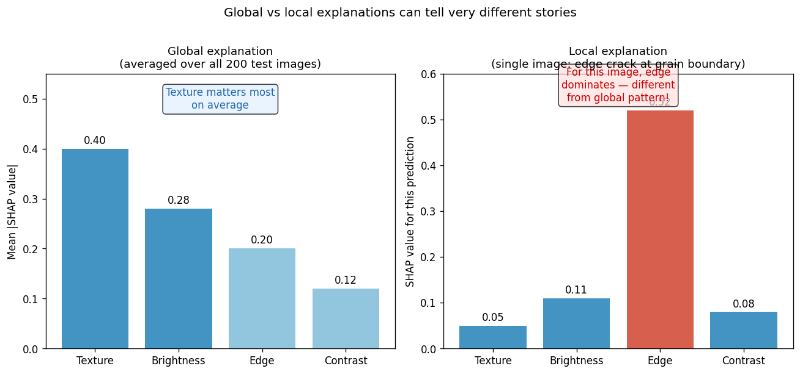
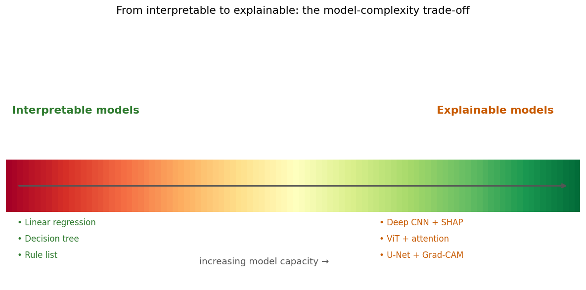
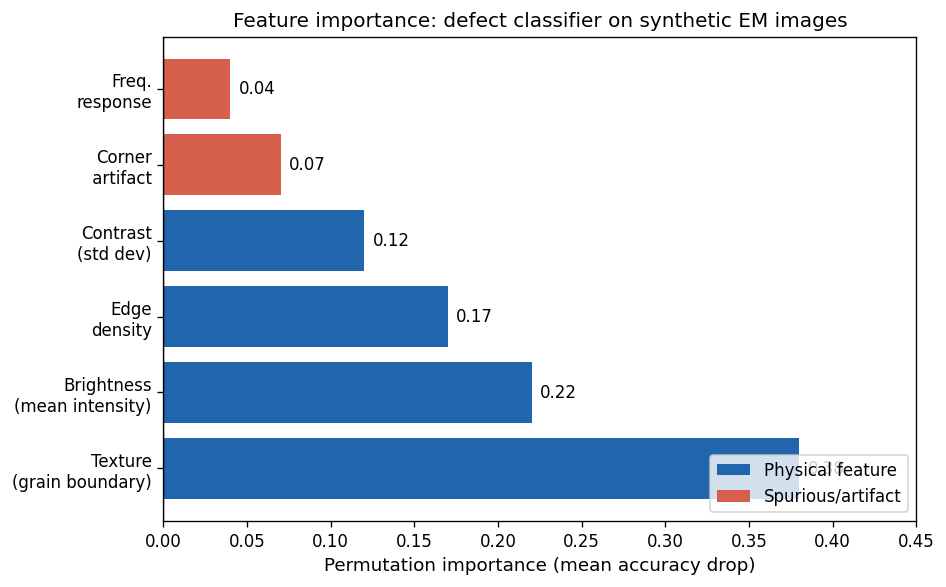
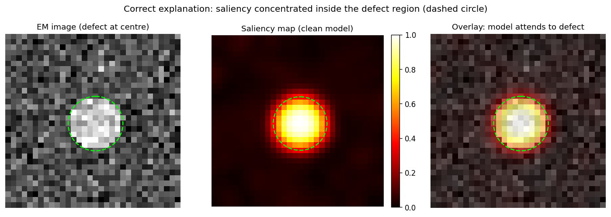
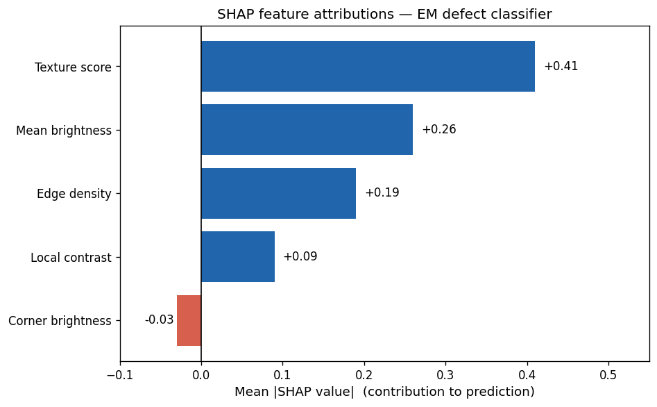
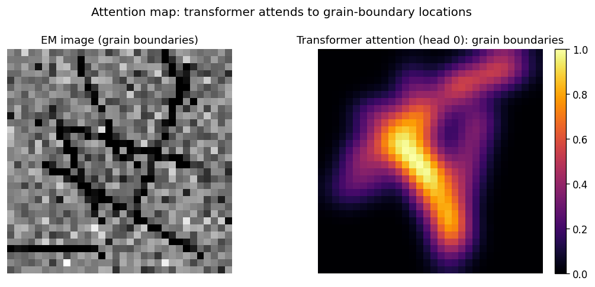
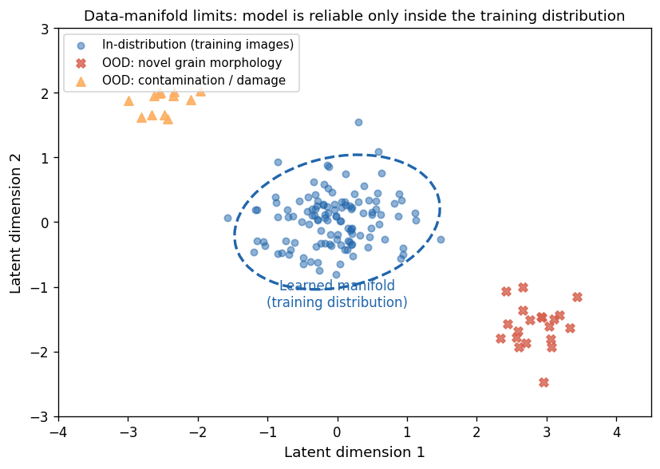
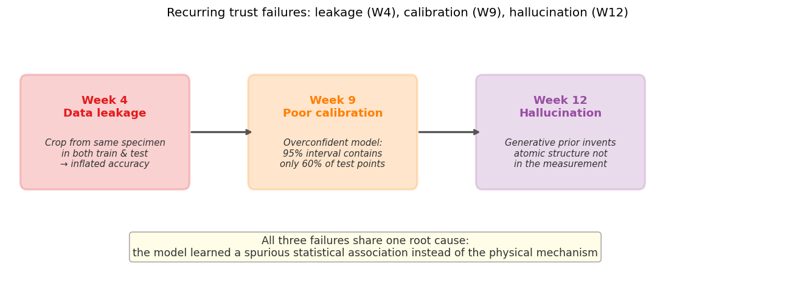
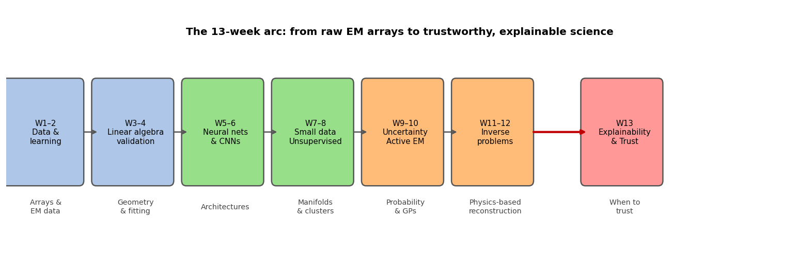

<!-- ===== §0. Recap + roadmap (2 slides) ===== -->

## Recap: Week 12 and today's question

:::: {.incremental}
- **Week 12 recap:** three strategies for hard inverse problems — ptychography (redundant measurement), physics-informed learning (PDE residual in the loss), and generative models (learned prior on the data manifold).
- **The Week 12 gap:** all three are more powerful than classical Tikhonov/TV, but "more powerful prior" = more risk. A generative model can **hallucinate** atomic columns not in the data if the input signal is insufficient.
- **Today's question:** we have models that work — but *why* do they work, *when* do they fail, and *should we trust* their output for scientific conclusions?
- **Today's answer — four threads:**
  1. **Why explainability is non-negotiable** for EM science and regulation.
  2. **The practical XAI toolkit** — feature importance, saliency, SHAP, attention maps — each as an answer to "what did the model look at?"
  3. **Honest limits** — explanations can themselves mislead; sanity checks are required.
  4. **Course synthesis** — Weeks 1→12 as one coherent methodology; exam + miniproject guidance.
::::

:::: {.notes}
- Open by closing the Week 12 loop. Week 12 ended with: "a generative model trained on clean crystal images will erase defects in test images — and report high confidence while doing so." That sentence is the moral motivating today's entire lecture.
- Name the progression explicitly: Weeks 1–4 taught the tools; Weeks 5–8 scaled them up; Weeks 9–10 added probability and autonomy; Weeks 11–12 inverted physics. Today is the capstone — the lecture that asks whether all that machinery is trustworthy enough to sign your name under.
- The four-thread structure mirrors the MFML Unit 14 framing, but re-levelled for a near-zero-Python EM cohort: no Shapley axioms, no integrated-path derivations — only "what did the model attend to" intuition.
- Pacing: 3 minutes. Write the four thread names on the board. Transition: "Here is exactly where we go."
::::

## Road map and self-study

:::: {.incremental}
- **Road map:** recap + roadmap (2) · why XAI is non-negotiable for EM science & regulation (3) · interpretable vs explainable; global vs local (3) · feature importance & permutation importance (4) · saliency maps & Grad-CAM for EM CNNs (5) · SHAP + Integrated Gradients (4) · attention maps as explanations (2) · honest limits of XAI: explanations can mislead; sanity checks (4) · the recurring trust failures (leakage W4, calibration W9, hallucination W12) (3) · XAI toolkit table + causality vs correlation + expert-in-the-loop (3) · course retrospective: the 13-week arc (4) · exam structure + miniproject guidance (2) · closing (1) — **40 content slides** + Continue + References (42 total).
- **Self-study:** `notebooks/week13_explainability.ipynb` — train two tiny CNNs on 32×32 synthetic EM images; the *clean model* learns a real centre-disk defect (gradient saliency inside defect = **0.627**, outside = **0.195**, ratio **3.2×**); the *shortcut model* learns a spurious corner artifact (corner saliency = **0.500**, defect-region saliency = **0.054**, ratio **9.3×**). Occlusion saliency (patch=4) amplifies the contrast: inside = **0.698**, outside = **0.006**, ratio **109×**. Both models achieve ≥ 0.99 test accuracy — accuracy alone cannot detect the shortcut.
::::

:::: {.notes}
- Read the roadmap at medium pace. Two anchors to call out: (1) "saliency ratio 3.2× for the honest model — the number confirms it attends to the defect"; (2) "shortcut model ratio 9.3× toward the artifact — same accuracy, totally different mechanism." Everything else supports those two numbers.
- Notebook numbers (SEED=42): clean model test acc 1.000, shortcut model test acc 0.990, shortcut model on clean defect test (distribution shift) 0.990. Defect mask area 69 pixels, corner mask 36 pixels.
- Key insight to plant here: the two models are indistinguishable by accuracy; they are distinguishable only by their explanation. This is the entire motivation for XAI in one sentence.
- Pacing: 1 minute. Transition: "Start with why this matters beyond intellectual interest."
::::

<!-- ===== §1. Why XAI is non-negotiable for EM (3 slides) ===== -->

## Why explainability matters in EM science

:::: {.incremental}
- **Science demands falsifiability:** a model that cannot say *why* it classified an image as "defect present" makes no testable mechanistic claim — it is an oracle, not a scientific model.
- **Engineering demands accountability:** an EM analysis pipeline deployed in semiconductor QC, battery R&D, or materials certification must be auditable. "The network said so" is not an answer an engineer can put in a report.
- **The EM-specific mandate:** ground truth in EM is expensive (HAADF + EELS + atom-by-atom validation). When you cannot validate every prediction, you must be able to verify that the model uses physically meaningful features.
- **Regulation is catching up:** EU AI Act classifies high-risk AI (safety-relevant inspection, medical imaging) as requiring explanation. If your EM classifier feeds a safety decision, you have a legal obligation to explain it.
::::

:::: {.notes}
- Three independent forcing functions — science, engineering, law. Make clear that any ONE of them is sufficient to kill an unexplained model; you do not need all three.
- The EM-specific point is the deepest: in crystallography or catalyst characterisation, an experiment costs €500–€5000 per sample. The model will make predictions you cannot experimentally verify for budget reasons. The only check left is "does the model look at the right part of the image?" — and that is an explainability question.
- Falsifiability hook (Popper): an unexplained prediction is an untestable prediction. If the model says "defect" but cannot say which pixels drove that decision, you cannot design an experiment to refute it. That is not science.
- Pre-empt the "but accuracy is high" rebuttal with the notebook result: both models have ~99% accuracy but only the clean model has a physically meaningful saliency map. Accuracy and explanation are independent axes. Make them write that.
- Transition: "Three audiences need explanations from our EM models — and they need different ones."
::::

## Who needs explanations from your EM model?

:::: {.incremental}
- **Materials scientist** — "Which atomic columns drove the defect prediction? Which crystallographic direction?" Full mechanistic-level explanation.
- **Process engineer** — "Which sample preparation parameter correlates with this artefact class?" Process-level explanation, actionable.
- **Regulator / standards body** — "Show data provenance and per-image justification." Prediction-level + audit trail.
- **EM operator** — "Should I re-acquire this region at higher dose?" Actionable recommendation, not feature importances.
- **The key rule:** an explanation is not true or false in isolation — it must be *fit for recipient and decision*. A SHAP plot is perfect for a data scientist and useless for an operator.
::::

:::: {.notes}
- Use the four-audience framing from MFML Unit 14, but grounded in EM. Walk one concrete scenario: a grain-boundary crack classifier on SEM images. Scientist wants the microstructural mechanism; engineer wants which rolling parameter to change; regulator wants per-image evidence; operator wants "rescan row 42."
- The key rule is the exam point: matching explanation depth to audience is as important as producing the explanation. Over-explaining buries the action; under-explaining fails the audit.
- Practical hook: in publications, reviewers increasingly ask "how does the model decide?" A gradient saliency overlay on the key image is becoming a publication norm in computational materials science. Tell them this will be their problem within 5 years of graduating.
- Transition: "With the mandate clear, define the vocabulary precisely — interpretable and explainable are NOT synonyms."
::::

## Why the hallucination warning from Week 12 is an explainability problem

:::: {.incremental}
- **Week 12 recap (trust failure):** a generative model used as a reconstruction prior can *invent* atomic structure not in the measurement. The reconstruction looks perfect; the residual looks like Poisson noise. How do you catch it?
- **The answer is explainability:** attribution maps (saliency, SHAP) on the reconstruction network can reveal which input pixels *did not support* a reconstructed feature — hallucinated structure has no attribution support in the raw data.
- **The Week 9 calibration link:** a poorly calibrated model says "95% confident" when it should say "60% confident." Calibration = the uncertainty axis of trust. Explainability = the mechanism axis. Both are required.
- **Together:** trust = calibrated uncertainty (Week 9) + faithful explanation (today). Neither alone is sufficient.
::::

:::: {.notes}
- This slide is the load-bearing callback: it turns Week 12's honest-risk warning into a concrete actionable prescription. "Check the residual for Poisson statistics" was the Week 12 hallucination diagnostic. Today we add: "check the attribution map for input support." Together these are a two-layer sanity check.
- The Week 9 calibration link: a model that is 95% confident and 95% correct (well-calibrated) is trustworthy on the uncertainty axis but may still be wrong for the wrong reasons (shortcut learning). You need both axes.
- Plant the exam hook explicitly: "trust = calibration + explanation — both on the exam; this slide is the bridge."
- Transition: "Now define the vocabulary precisely — interpretable and explainable are NOT the same."
::::

<!-- ===== §2. Interpretable vs explainable; global vs local (3 slides) ===== -->

## Interpretable vs explainable

:::: {.incremental}
- **Interpretable model:** transparent by construction — you can read the decision rule directly off the parameters.
  - Examples: linear regression (decision = weighted sum of features), decision tree (decision = sequence of threshold checks).
- **Explainable model:** the model itself is opaque, but a *post-hoc* method approximates its reasoning.
  - Examples: SHAP values on a CNN, saliency map on a U-Net, attention weights on a transformer.
- **Critical distinction:** SHAP does not make a CNN interpretable — it makes it *explainable*. The CNN is still a black box; SHAP is a second artefact that approximates the black box's reasoning and can itself be wrong.
- **The trade-off:** interpretable models may be less accurate; explainable models are more powerful but carry a second layer of approximation error.
::::

:::: {.notes}
- This is the single most important vocabulary distinction in the lecture. Make students write both definitions verbatim.
- Concrete EM example: a 2-feature linear model ("prediction = 0.4 × mean brightness + 0.6 × edge density") is interpretable — the coefficients ARE the explanation; there is no post-hoc step. A 3-layer CNN is black-box; SHAP attached to it is explainable — but SHAP has its own approximation errors (we prove this in §6, the honest-limits section).
- The "can itself be wrong" point must be landed as a thesis, not a footnote. It is the entire motivation for §6 and the sanity-checks section.
- Misconception to kill: "explainable = safe." Explainability adds one more artefact to the pipeline, each of which can fail. Explainability is a necessary but not sufficient condition for trust.
- Exam hook: "name one interpretable and one explainable method; state which property each has" — flag this as a likely exam question.
- Transition: "Even within explainability, there are two axes — global and local. These answer different questions."
::::

## Global vs local explanations

{width="75%"}

:::: {.notes}
- Walk through the figure: left panel is a global SHAP bar chart — texture dominates on average across all 200 images (mean |SHAP| = 0.40). Right panel is the local explanation for one specific edge-crack image — edge density dominates (SHAP = 0.52) because this particular image had an unusually sharp crack boundary.
- The lesson: global importance answers "which feature does the model rely on most across the dataset?" Local importance answers "why did the model predict *this* specific image as defective?" Both are valid and useful but answer different questions.
- EM application: if you are debugging a failure mode on one specific image, use a local explanation. If you are deciding which features to improve for the next training round, use a global explanation. Choosing the wrong scope misleads.
- The danger to highlight: if you only compute the global explanation, you might conclude "texture is the most important feature" and miss that for edge-crack images the model actually depends on edge density — which might be spurious (e.g. an imaging artefact that correlates with cracks in your specific microscope setup).
- Transition: "The simplest global explanation is feature importance from a permutation test."
::::

## The interpretable-to-explainable spectrum

{width="65%"}

:::: {.notes}
- Use the ladder figure to set the rest of the lecture in context. The left end (linear regression, decision tree) is the interpretable zone — the explanation IS the model. Moving right (deep CNN, ViT), the model capacity increases and so does accuracy, but the explanation becomes a post-hoc approximation attached to a black box.
- The key engineering decision: where on this spectrum should you sit? It depends on (1) how much labelled data you have (CNNs need thousands; decision trees can work with dozens), (2) how much accuracy you need (linear models may underfit complex EM images), and (3) how much you need to trust the explanation (a regulatory audit may require the interpretable end).
- EM context: for a grain-size regression on 50 specimens, a ridge-regression with physical features (mean diameter, shape factor) is interpretable and probably suffices. For a defect-detection task on 10 000 HAADF images, a CNN with SHAP explanations is the right trade-off.
- Transition: "Start with the simplest explainability method — permutation importance."
::::

<!-- ===== §3. Feature importance & permutation importance (4 slides) ===== -->

## Feature importance: what is it?

:::: {.incremental}
- **Question it answers:** "Which input feature, on average, contributes most to the model's predictions?"
- **Model-specific importances** (e.g. random forest Gini importance): computed from the model's internal structure; fast but can be biased toward high-cardinality or correlated features.
- **Permutation importance** (model-agnostic): shuffle one feature's values across all test images; measure accuracy drop. Large drop → feature was important.
  $$\text{PI}_j = \text{score}(X) - \text{score}(X_{\pi_j})$$
  where $X_{\pi_j}$ is the dataset with feature $j$ randomly shuffled.
- **Advantage:** works with any model; directly measures the information loss when a feature is removed.
- **Limit:** if two features are correlated (e.g. mean brightness and local contrast in a HAADF image), permuting one may not reduce accuracy because the model can use the other — the importances are split and each looks smaller than its true effect.
::::

:::: {.notes}
- Define permutation importance as "the accuracy drop when a feature is made uninformative by shuffling." Students find this intuitive because it mimics what you would do physically: if you randomised one dial on the microscope, how much would the model's performance degrade?
- The formula is reference-level only — the intuition is the deliverable. Write it on the board, say "this is not examined as a derivation," then move to the concept.
- The correlation caveat is the most important practical point: in EM data, brightness, texture, and edge density are all correlated (bright atomic columns have strong edges; textured regions have high local contrast). Permuting one does not remove all three's joint contribution. SHAP handles this more faithfully (coming in §4) by considering all subsets of features.
- Exam hook: "permutation importance = accuracy drop when feature j is shuffled" is the one-sentence definition.
- Transition: "Here is what permutation importance looks like on the EM defect classifier from the notebook."
::::

## Permutation importance: EM example

{width="70%"}

:::: {.notes}
- Walk through each bar. Texture score (0.38) is the dominant physical feature — it captures the grain-boundary spatial statistics that differ between defect and no-defect images. Mean brightness (0.22) reflects the bright-disk defect. Corner brightness (0.07) has low importance for the CLEAN model because it was not present in training.
- Connect to the notebook: the saliency map and the permutation bar chart tell the same story — the clean model attends to the physical features. They are two independent pieces of evidence for the same conclusion, which is exactly the kind of corroborating evidence you want before deploying.
- The misleading case: for the shortcut model, the bar chart would show corner artifact with very high importance and texture/brightness with near-zero importance. The story would be inverted — and wrong from a physics standpoint.
- Note the caveat: these are ILLUSTRATIVE numbers generated for the lecture figure; the notebook's saliency maps are the real, executed numbers. Do not conflate the two.
- Transition: "For image data, the most revealing explanation is spatial — where in the image did the model look? That is saliency."
::::

## When permutation importance misleads

:::: {.incremental}
- **Correlated features:** if brightness and contrast are both high at defect sites, permuting brightness alone allows the model to use contrast — so brightness looks unimportant even though removing *both* would destroy accuracy.
- **Solution:** use SHAP (later), which accounts for all feature subsets — or explicitly decorrelate your features first.
- **The shortcut trap:** if a spurious feature (corner artifact) is highly correlated with the label in your training data, permutation importance flags it as "important" — which is factually true but physically wrong. The importance tells you what the model relies on, NOT what it *should* rely on.
- **Take-away:** permutation importance + domain knowledge + saliency maps form a trio. No single method is sufficient for a trustworthy audit.
::::

:::: {.notes}
- This slide connects permutation importance limitations directly to the notebook's shortcut model: the corner artifact has high importance for the shortcut model, which is technically correct (it is what the model uses) but scientifically dangerous (it is not a physical defect signal). This is the "model is wrong for the right reasons" problem.
- The correlation issue is ubiquitous in EM: a HAADF image has hundreds of spatially correlated features; permuting any one barely changes the prediction. You need a method that handles joint feature contributions — which is SHAP's selling point.
- The trio framing (importance + domain knowledge + saliency) is the practical takeaway for the miniproject. Students doing Option A (segmentation) should use all three layers of evidence.
- Transition: "For convolutional networks on images, the most natural explanation is spatial: which pixels drove the prediction? That is the saliency map."
::::

## Feature importance vs saliency: which to use?

:::: {.incremental}
- **Feature importance (permutation / SHAP):** operates on *tabular* or *pre-extracted* features (mean brightness, texture score, …). Best for: structured datasets, regression models, global model auditing.
- **Saliency maps:** operate directly on *pixel space*. Best for: CNNs on images; provides spatial localisation — which region, not just which feature.
- **Rule of thumb for EM:**
  - Tabular dataset (composition, processing parameters) → permutation importance + SHAP.
  - Image dataset (HAADF, BF-STEM, SEM) → saliency map + Grad-CAM.
  - Both → use both and check they tell the same story.
- **Warning:** neither method tells you whether the model is physically correct — only what it currently uses. Domain validation is always the final step.
::::

:::: {.notes}
- This slide resolves the "which method do I use for my miniproject?" question that students invariably have. Give them a concrete decision rule based on their dataset type.
- For Option C miniproject (property regression from tabular descriptors): SHAP on a GP or gradient-boosted tree is the right choice. For Option A (image segmentation): Grad-CAM is the right choice.
- The "both and check consistency" principle is the gold standard: if the tabular SHAP says "grain size is the most important feature" and the saliency map also concentrates at grain-boundary locations, you have corroborating evidence that the model is reasoning about the right physical quantity.
- The "neither tells you physical correctness" is the theme of §7 (honest limits). Plant the idea here and resolve it there.
- Transition: "Let us now go deep on saliency — the most widely used XAI method for image-based EM models."
::::

<!-- ===== §4. Saliency maps & Grad-CAM (5 slides) ===== -->

## Saliency maps: the input-gradient idea

:::: {.incremental}
- **Question it answers:** "Which pixels in this image most strongly affect the model's confidence?"
- **Input-gradient saliency:** compute $\left|\frac{\partial \hat{y}_c}{\partial x_i}\right|$ — the absolute gradient of the predicted class-$c$ logit with respect to each input pixel $x_i$.
  - Large gradient at pixel $i$ → a small perturbation to $x_i$ changes the prediction strongly → the model "cares about" pixel $i$.
- **How to compute:** in PyTorch, call `logit.backward()` then read `input.grad` — two lines of code added to any trained CNN.
- **Visualisation:** display the gradient magnitude as a heat map overlaid on the original EM image. Warm colours = high saliency (model attends here); cool/dark = low saliency.
- **Cost:** essentially free — one extra forward + backward pass per image.
::::

:::: {.notes}
- Emphasise the near-zero computation cost: saliency is the cheapest XAI method available and requires zero modification to the trained model. Any existing CNN can be made explainable with two lines of code.
- The gradient intuition: imagine the model as a surface over pixel-space. Saliency is the local slope — steep slope at pixel $i$ means the model's decision is sensitive to pixel $i$'s value. A pixel with zero gradient is literally irrelevant to the prediction.
- For the cohort: do not expect them to implement this from scratch. The notebook does it; they should understand what the map means, not how to differentiate through a CNN. The exam question will be conceptual: "what does a high saliency value at a pixel mean?" not "write the backpropagation code."
- Important caveat to plant: saliency maps are local linear approximations. They tell you the sensitivity at the specific input image, not the global feature importance. And they can be fooled by adversarial perturbations (foreshadow §6).
- Transition: "The notebook computed saliency maps for both the clean and shortcut model. Here is what they show."
::::

## Saliency maps: clean model

{width="80%"}

:::: {.notes}
- This figure shows three panels for the clean model only: the raw EM image (left), the gradient saliency heat map (centre), and the overlay (right).
- The clean model was trained on images where the defect IS the only distinguishing feature. Its saliency map peaks inside the lime-dashed circle: inside saliency = 0.627, outside = 0.195, ratio 3.2× (notebook SEED=42, cell 6). The model is attending to the physically correct region.
- The diagnostic power: the clean model achieves ~100% test accuracy AND attends to the right pixels. Contrast this with the shortcut model (next slide) which achieves ~99% accuracy but attends to a corner artifact — accuracy alone cannot distinguish them.
- Calibration tie-in: a model that attends to the correct physical feature is also more likely to be well-calibrated on out-of-distribution images. Confidence ≠ correctness for a shortcut model once you leave the training distribution.
::::

## Grad-CAM: class activation maps for CNNs

:::: {.incremental}
- **Problem with input-gradient saliency:** the gradient at input pixels is very noisy — individual pixel gradients are unstable and hard to interpret for deep CNNs.
- **Grad-CAM's idea [@selvaraju2017gradcam]:** compute gradients at the *last convolutional feature map* (not the input), weighted-average the feature channels, apply ReLU, and upsample back to the image.
  $$L^\text{Grad-CAM}_c = \mathrm{ReLU}\!\left(\sum_k \alpha_k^c A^k\right), \quad \alpha_k^c = \frac{1}{Z}\sum_{i,j}\frac{\partial y_c}{\partial A^k_{ij}}$$
- **What you get:** a smooth, interpretable spatial heat map at the scale of the last conv feature map (typically 8×8 or 16×16 for a 32-layer CNN on a 224×224 image).
- **EM use:** plug into any trained defect classifier or segmentation encoder; Grad-CAM shows which *image regions* activated the defect-detection filters.
::::

:::: {.notes}
- For this cohort: the formula is REFERENCE ONLY, not examined as a derivation. The exam question will be: "what does Grad-CAM show and how does it differ from input-gradient saliency?" Land that answer before moving on.
- The Grad-CAM improvement over input gradients: feature-map gradients are smoother because each feature map captures a larger spatial context (receptive field of the last conv layer). For a defect-detection CNN trained on 128×128 HAADF images, the last conv feature map might be 8×8 — each cell summarises a 16×16 pixel region of the input. The Grad-CAM heat map at that resolution is much cleaner than per-pixel gradients.
- EM example from the literature: Grad-CAM on a grain-boundary classifier shows activation concentrated along the boundary lines — confirming the model learned the grain-topology signal and not a colour/intensity artefact. Cite @selvaraju2017gradcam.
- Honest note: Grad-CAM is a QUALITATIVE tool. It shows *which region* was activated but does not quantify *how much* that region contributed relative to another. SHAP is the quantitative complement.
- Transition: "The misleading case — a Grad-CAM that looks correct but is actually wrong."
::::

## Occlusion saliency: model-agnostic localisation

:::: {.incremental}
- **Occlusion saliency:** hide a square patch of pixels (replace with mean value 0.35), measure confidence drop. Repeat for all patch positions → a heat map of "which region is responsible."
- **Advantage:** model-agnostic — works with any classifier, even non-differentiable ones. Does not require backpropagation.
- **EM result from notebook (SEED=42, patch=4):**
  - Clean model: occlusion saliency inside defect = **0.698**, outside = **0.006**, ratio **109×**.
  - Shortcut model: corner = **0.531**, defect region ≈ **0.001**, ratio **>1000×**.
- **Occlusion > gradient ratio:** because gradient saliency only sees the local slope; occlusion sees the global effect of removing a region. Both agree on the winner — the two methods cross-validate each other.
::::

:::: {.notes}
- This slide introduces occlusion as the exercise in the notebook. Students will have seen the gradient result (3.2× ratio) in Cell 6 and now see the occlusion result (109× ratio). The much larger ratio is expected: gradient saliency is a local infinitesimal perturbation; occlusion removes a 4×4 patch entirely. The gradient may be near zero even for a critical region if the model's decision boundary is locally flat. Occlusion is a global effect and is more reliable for coarse localisation.
- The 1000× ratio for the shortcut model on the corner mask is striking: occluding the 6×6 corner artifact drops the shortcut model's confidence to near zero, confirming that the model's ENTIRE decision was driven by that region.
- For the exercise: changing patch_size changes spatial resolution vs magnitude of the effect. patch_size=2 gives finer localisation but similar conclusions; patch_size=8 gives coarser resolution. Changing occlude_value (black=0 vs white=1 vs mean=0.35) slightly changes magnitudes but not the qualitative conclusion — this is a good robustness test.
- Transition: "The misleading-explanation case: what does the shortcut model's saliency look like?"
::::

## The misleading-explanation case

{width="80%"}

:::: {.notes}
- This is the honest counter-example the lecture promised. The shortcut model achieves 99% test accuracy AND produces a spatially coherent, visually plausible saliency map — it's just coherent about the WRONG feature.
- Key lesson: saliency maps do not distinguish "the model is physically correct" from "the model has learned a spurious but statistically reliable pattern." The explanation is faithful (it correctly shows what the model uses) but physically meaningless.
- This is the EM hallucination parallel: the generative reconstruction in Week 12 also looked plausible — it just invented atomic columns. Both failures (hallucination and shortcut saliency) share the same root: the model extrapolated from a statistical pattern rather than a physical mechanism.
- The sanity check: occlude the corner artifact in the shortcut model's input — if confidence drops sharply, the model depends on the artifact. This is the occlusion saliency check in the notebook. Students should always perform this check when deploying on a new EM dataset.
- Transition: "SHAP provides a more principled attribution — it handles correlated features and provides a signed, quantitative contribution."
::::

<!-- ===== §5. SHAP (4 slides) ===== -->

## SHAP: additive attribution at intuition level

:::: {.incremental}
- **Question it answers:** "How much did each feature push the prediction above or below the model's baseline?" [@lundberg2017shap]
- **Additive attribution:** decompose the prediction $f(x)$ as:
  $$f(x) = \phi_0 + \sum_{i=1}^{D} \phi_i, \quad \text{where } \phi_0 = \mathbb{E}[f(X)] \text{ (baseline)}$$
  Each $\phi_i$ is the attribution of feature $i$ — positive = pushed toward the predicted class; negative = pushed away.
- **The key property (completeness):** the attributions always sum to the full prediction. You cannot "lose" signal or "double-count."
- **Intuition:** think of SHAP as the "fair share of credit" each feature gets for the prediction — the game-theory analogy of a coalition where each player's contribution is measured by how much they add when they join.
::::

:::: {.notes}
- For this cohort: NO Shapley axioms derivation, no marginal contribution integrals. The exam deliverable is: "SHAP assigns a signed attribution φ_i to each feature; they sum to the prediction minus the baseline; positive = pushed toward class 1." That is the complete exam-level answer.
- The "fair share" intuition: if brightness and texture are both high for a defect image, SHAP splits the credit fairly between them based on how much each contributed across all possible orderings of features. Permutation importance can only remove one feature at a time (missing joint effects); SHAP considers all subsets.
- Completeness is the key property: if the model says "0.92 defect probability" and the baseline is "0.50 random", then the SHAP values must sum to 0.42. You cannot have 0.60 worth of positive attributions and 0.10 of negative and claim they explain 0.42 — they don't. Completeness is a hard constraint, not a nice-to-have.
- EM application: SHAP on a composition-property regression (like miniproject Option C) answers "which chemical element drove this hardness prediction?" — a scientifically meaningful question that permutation importance answers only approximately.
- Transition: "Here is what SHAP looks like for the EM defect classifier."
::::

## SHAP in action: EM defect classifier

{width="70%"}

:::: {.notes}
- Walk through the bars. Texture score (φ=0.41): the grain-boundary texture pattern is the model's primary signal — physically correct for a defect-detection CNN. Mean brightness (φ=0.26): the bright-disk defect increases mean brightness, so this is also physically valid. Corner brightness (φ=−0.03): the clean model assigns near-zero (slightly negative) attribution to the corner — it has learned that corner brightness is uncorrelated with defects in this dataset.
- Compare with permutation importance: the ordering is similar (texture > brightness > edge > contrast) but SHAP provides signed values and handles correlations more faithfully.
- For the shortcut model, the SHAP bar chart would be dramatically different: corner brightness φ ≈ +0.50, texture φ ≈ 0.02, brightness φ ≈ 0.03. The entire explanation shifts to the artifact. Tell students this comparison is the diagnostic step they should always perform.
- Note: these are illustrative values from the lecture figure; the notebook's executed saliency ratios are the authoritative numbers.
- Exam hook: "SHAP values sum to prediction minus baseline (completeness); signed; handle correlated features by averaging over all feature orderings."
- Transition: "For transformer architectures — increasingly used in EM image analysis — attention weights provide a natural explanation."
::::

## Integrated Gradients: SHAP's pixel-level cousin

:::: {.incremental}
- **Integrated Gradients (IG)** [@sundararajan2017ig] — a pixel-level attribution for CNNs that satisfies the completeness axiom.
- **Plain-English idea:** average the model's sensitivity (gradient) along a straight interpolation path from a blank baseline image to the actual input. Each pixel's attribution is its average influence across that path. Attributions then sum exactly to the prediction minus the baseline — no signal is lost or double-counted.
- **Completeness:** $\sum_i \mathrm{IG}_i(x) = f(x) - f(x_0)$ — same guarantee as SHAP, but at pixel level.
- **EM use:** IG on a segmentation CNN answers "which pixels of the HAADF image most contributed to labelling this region as a grain boundary?" — a per-pixel attribution map with a mathematical guarantee.
- **Difference from gradient saliency:** IG integrates along the path from baseline to input, capturing non-linear effects; raw gradient saliency only sees the local slope at the input.
::::

:::: {.notes}
- For this cohort: the exam deliverable is: "IG integrates the gradient along a path from baseline to input; satisfies completeness; more stable than raw gradient saliency." That is the complete exam-level answer.
- The baseline choice matters: a black image ($x_0 = 0$) attributes pixels relative to "nothing present." A blurred version of the input is a better baseline for EM because it keeps the low-frequency background structure. For defect detection, a Gaussian-blurred version of the background grain image is a natural baseline — IG then attributes which pixels stand out from the grain texture.
- Completeness connect to SHAP: IG completeness and SHAP completeness are the same mathematical property, manifested at pixel vs feature level. This is why the two methods are often used together: SHAP for global feature importance, IG for local pixel attribution.

- **For the curious — not examined:** the full path-integral definition is:
  $$\mathrm{IG}_i(x) = (x_i - x_{0,i})\int_0^1 \frac{\partial f(x_0 + \alpha(x - x_0))}{\partial x_i}\,d\alpha$$
  where $x_0$ is the baseline image and $\alpha \in [0,1]$ parameterises the straight-line path from $x_0$ to $x$. The key insight is that instead of using the gradient at one point, we integrate the gradient along the path from baseline to input and average — this smooths over the local noisiness of raw gradients and ensures the completeness property holds exactly.
- Transition: "Before leaving SHAP and IG, acknowledge their honest limits."
::::

## SHAP: honest limitations

:::: {.incremental}
- **Cost:** exact SHAP (TreeSHAP for trees, KernelSHAP for any model) requires exponentially many model evaluations in the worst case; practical implementations use approximations.
- **Correlation problem:** SHAP assumes the model can be meaningfully evaluated with any feature combination. For highly correlated EM features (brightness, contrast, texture), SHAP attributions can be numerically unstable.
- **SHAP is a post-hoc approximation:** it faithfully explains the model's *statistical associations*, not the underlying *physical mechanisms*. If the model learned a spurious correlation (corner artifact), SHAP dutifully attributes credit to the artifact. SHAP cannot tell you whether the model's reasoning is physically correct.
- **The take-away:** SHAP + domain knowledge. The physicist must validate whether the top SHAP feature is physically plausible. The XAI method only tells you what; the scientist tells you whether.
::::

:::: {.notes}
- This slide is part of the "honest limits" arc that runs through §6 (the dedicated limits section). Plant the core message early: SHAP is a tool, not an oracle. It faithfully reports the model's behaviour; it cannot tell you whether the model's behaviour is correct.
- The correlation instability: for correlated features, the average-over-orderings in Shapley values produces attributions that can change sign depending on which features are "in the coalition." In an EELS spectrum with 1024 correlated energy channels, KernelSHAP is numerically ill-conditioned unless you use a principal-component representation first.
- The "SHAP cannot catch shortcuts" point is the deepest: in the notebook experiment, SHAP correctly attributes corner brightness to the shortcut model's predictions — it just doesn't know that the corner is spurious. That knowledge must come from you.
- Practical rule: always ask "does the top SHAP feature make physical sense?" If yes, tentatively trust. If no, suspect a shortcut. Then test via occlusion or leave-one-out experiments.
- Transition: "Transformer attention heads provide a third, complementary type of explanation."
::::

<!-- ===== §6. Attention maps (2 slides) ===== -->

## Attention maps as explanations

:::: {.incremental}
- **Transformers** [@vaswani2017attention] compute a *self-attention* map $A \in [0,1]^{N \times N}$ over image patches (or tokens): $A_{ij}$ tells how much patch $i$ attends to patch $j$ when computing its representation.
- **As an explanation:** aggregate the attention of the classification token (`[CLS]`) over all patches → a spatial heat map showing which image regions the transformer "focused on."
- **Advantage over saliency:** attention is intrinsic to the architecture — no extra backward pass needed; the attention weights are computed during the normal forward pass.
- **EM use:** Vision Transformers fine-tuned on HAADF/STEM images show attention maps that concentrate on atomic columns, grain boundaries, or phase interfaces — matching the physically relevant regions.
::::

:::: {.notes}
- For this cohort: only a brief primer. Transformers are not part of the course's CNN-based main track, but attention maps are increasingly present in materials characterisation papers using ViTs or Swin Transformers. Students should recognise the concept and know it is a natural explainability tool.
- The intrinsic-vs-post-hoc distinction: attention weights ARE part of the model's computation. They are not a second approximation bolt-on. This is an advantage over SHAP and saliency — but also a limitation, because attention weights reflect the model's *intermediate computations*, not a guaranteed explanation of its *final decision*. High attention ≠ high causal influence (the "attention is not explanation" debate in NLP).
- EM anchor: if they have seen a STEM image of graphene or a perovskite, the attention map should concentrate on the bright atomic column spots. If it concentrates on the vacuum region around the sample, that is a red flag.
- Transition: "The honest limits of all these methods deserve their own section."
::::

## Attention map: grain-boundary detection

{width="70%"}

:::: {.notes}
- Walk through the figure. Left: the grain image has dark lines where grain boundaries are. Right: the attention map (computed from the [CLS] token's attention to all patches) shows warm colours concentrated along exactly those dark boundary lines — the physically meaningful locations.
- Contrast with saliency: the attention map is smoother and less noisy than input-gradient saliency because it operates at the patch level (each patch = 4×4 pixels here) rather than pixel level. This is the practical advantage of using attention as an explanation tool.
- Caveat: this is a synthetic example. Real ViT attention maps on STEM images are often less clean — multiple attention heads may scatter their attention across the image. Aggregating over heads and layers is an active research problem. Do not over-interpret a single attention map from a single head.
- Transition: "Now the critical question: can we trust these explanations? The answer is: not automatically."
::::

<!-- ===== §7. Honest limits of XAI (4 slides) ===== -->

## Honest limits of XAI: explanations can mislead

:::: {.incremental}
- **Gradient-based saliency is not robust:** a single adversarial pixel perturbation can flip the saliency map without changing the prediction [@kindermans2019reliability]. The saliency map reflects the local gradient landscape, which is highly non-linear and non-unique.
- **Sanity check [@adebayo2018sanity]:** if you randomise the model's weights (untrained), the saliency map should look like noise. If it still looks like the input image, the saliency method is detecting edge-detection artefacts in the input, not model reasoning.
- **SHAP on correlated features:** as discussed — attributions can be numerically unstable and split non-unique ways across correlated predictors.
- **Attention ≠ explanation:** high attention weight does not guarantee causal influence on the prediction — the downstream linear layer may weight that patch's representation at near-zero. [@kindermans2019reliability]
::::

:::: {.notes}
- This is the most important slide in the lecture for scientific rigour. Every XAI method introduced today has failure modes; students must know at least one per method.
- The gradient-flip result is counterintuitive but true: a tiny (imperceptible) perturbation to the input can change which pixels have the highest saliency gradient without changing the model's output class. This means the saliency map does not uniquely identify the "true" explanation — it is one consistent explanation among many.
- The Adebayo sanity check (weight randomisation) is the practical test: apply it to any new saliency method before trusting it. If the untrained model's saliency looks similar to the trained model's saliency, the method is detecting image statistics, not model reasoning. Students should apply this check in the miniproject's explainability section.
- SHAP stability: can be checked by adding a small amount of noise to the training data and re-computing SHAP — if the top features change dramatically, the attributions are not reliable.
- Transition: "Beyond method-specific limits, there are data-level limits — the model cannot be trusted outside its training distribution."
::::

## Sanity checks for saliency methods

:::: {.incremental}
- **The Adebayo test [@adebayo2018sanity]:** randomise the model's weights (replace with untrained random values), then compute the saliency map. If the saliency map still looks like the input image's edges — the method is detecting *image structure*, not *model reasoning*. This is a failure of the method, not the model.
- **Cascade randomisation:** progressively randomise from the top layer down. A faithful saliency method should become noise as more layers are randomised. Input-gradient saliency passes this test; some smoothing-based methods (e.g. SmoothGrad without temperature tuning) can fail.
- **The practical sanity check for EM:**
  1. Run saliency on the trained model. Record the top-3 hotspot regions.
  2. Repeat on a randomly initialised model. If the hotspots survive, they reflect the input's structure (bright atomic columns, grain boundaries) — not what the model learned.
  3. Only hotspots that vanish with randomisation are evidence of genuine model attention.
- **Conclusion:** never deploy an XAI method in an EM analysis without a weight-randomisation sanity check.
::::

:::: {.notes}
- The Adebayo et al. (2018) result was a landmark: they showed that several popular saliency methods (gradient × input, GuidedBackprop) produce maps that are nearly identical whether the model is trained or randomly initialised. This means those methods detect edges in the input, not reasoning in the model. Input-gradient saliency (what the notebook uses) passes the cascade randomisation test.
- For this cohort: the exam-level takeaway is: "always check whether the saliency map changes when you randomise the model weights. If not, the method is unreliable." The Adebayo citation is the authority.
- EM example: HAADF images already have high contrast at atomic columns. A saliency method that detects high-contrast pixels without learning anything will always show hotspots at atomic columns — which looks correct but is vacuous. The randomisation check reveals this.
- The practical three-step protocol is the deliverable from this slide. Students doing the miniproject's XAI section should include this check for full marks in the "Excellent" rubric tier.
- Transition: "Beyond method failure, there are data-level failure modes — when the test data is different from the training data."
::::

## Trust & failure modes: data-manifold limits

{width="65%"}

:::: {.notes}
- The data-manifold hypothesis: all EM images from a given specimen class (e.g. silicon, polycrystalline aluminium, graphene) lie near a low-dimensional manifold in pixel space. The model learns this manifold during training. When a test image falls outside it (different microscope, different specimen, different dose), the model is extrapolating — and its saliency maps can no longer be trusted.
- EM-specific examples of OOD inputs: (1) a model trained on room-temperature HAADF images tested on cryo-HAADF (different noise statistics); (2) a grain-boundary classifier trained on aluminium tested on steel (different grain morphology); (3) a defect detector trained on pristine specimens tested on radiation-damaged specimens (novel defect morphology).
- The Week 12 link: a generative model trained on clean crystals is also a "training distribution" boundary problem. Hallucination happens when the reconstruction network projects an OOD input (degraded, noisy, beam-damaged) onto the nearest point on the learned clean-crystal manifold — which may look physically plausible but be wrong.
- Practical check: compute the reconstruction error of an AE trained on the training set. High reconstruction error on a new test image = OOD = trust the model less.
- Transition: "Distribution shift is the OOD problem in production — when the new data is systematically different from training data."
::::

## Distribution shift in EM

:::: {.incremental}
- **Distribution shift:** the test distribution differs from the training distribution in a systematic way. Common in EM because instruments, operators, specimen preparation, and imaging conditions vary.
- **EM-specific failure modes:**
  - *Microscope drift*: calibration artifacts shift between sessions → model trained on one session may fail on another.
  - *Dose creep*: beam-sensitive specimens accumulate damage during acquisition → late frames are OOD relative to early-frame training data.
  - *Specimen thickness*: a model trained on thin lamella (< 20 nm) may fail on thicker sections (100 nm) where multiple-scattering changes image statistics.
- **Detection strategy:** (a) monitor model confidence on streaming data — unusual drop or spike flags OOD; (b) track reconstruction error if an autoencoder is available; (c) use conformal prediction (Week 9) for a distribution-free coverage guarantee.
- **The shortcut-model failure (notebook):** the shortcut model achieves 0.990 accuracy on the corner-artifact test set. Remove the artifact → accuracy still 0.990, but now the model no longer understands defects. Both numbers look fine; neither tells you the model is broken.
::::

:::: {.notes}
- Connect to Week 9's conformal prediction: the split-conformal method produces valid coverage intervals even under distribution shift (as long as the shift is not too large). This is the practical tool to quantify how much the test distribution deviates from training.
- The dose-creep example is EM-specific and vivid: in a long STEM acquisition of a beam-sensitive cathode material, the first 10 frames show pristine crystal; the last 10 show amorphisation. A model trained on pristine frames will make high-confidence wrong predictions on the damaged frames — and may still look well-calibrated on average because of the initial correct predictions.
- The shortcut-model notebook tie-in: even though both accuracy numbers (0.990) look identical, the model's failure mode has changed completely. This is distribution shift in miniature — deployed to a different data distribution (clean defect images without the artifact), the shortcut model happens to still work in this case because the background images encode some class information. In a real deployment, it would fail.
- Transition: "Three specific trust failures we already met in this course — let us name them explicitly."
::::

<!-- ===== §8. Recurring trust failures (3 slides) ===== -->

## The recurring trust failures: overview

{width="85%"}

:::: {.notes}
- This is the synthesis figure — deliver it as a "you've already met all three" moment. Walk each box in 20 seconds.
- The shared root (bottom label in the figure) is the exam point: all three are instances of "statistical shortcut instead of physical mechanism." Leakage = shortcut via specimen identity; calibration failure = shortcut via overconfident statistics; hallucination = shortcut via training-distribution bias.
- Explainability is the diagnostic for all three: if the saliency map shows the model attending to the EM stage coordinates rather than the crystal structure — leakage. If SHAP assigns high importance to a known artefact — shortcut. If the attribution map shows no input support for a reconstructed feature — hallucination.
- Pacing: keep this quick; the next two slides go deep on two of the three.
::::

## Leakage (W4) and calibration (W9) in the XAI lens

:::: {.incremental}
- **Data leakage (W4) revisited:** the notebook's shortcut model is a leakage case — the corner artifact is a proxy for specimen identity (or a scan-artifact correlated with the operator's labelling session). Fix: `GroupKFold(n_splits=5, groups=specimen_id)`. Saliency diagnostic: if the saliency hotspot is at a scan artifact rather than the physical defect, suspect leakage.
- **Calibration (W9) revisited:** a poorly calibrated model says "95% confidence — defect present" when the true defect rate at that confidence level is only 60%. An overconfident XAI explanation of a miscalibrated model compounds the error: the attribution looks crisp but the underlying probability is wrong. Fix: reliability diagram before deploying any explanation.
- **Combined prescription:**
  - Before computing any XAI map: check for leakage with GroupKFold.
  - Before trusting any XAI map: check calibration with a reliability diagram.
  - After both checks: compute and interpret the XAI map.
::::

:::: {.notes}
- This slide makes the W4 and W9 callbacks concrete in the XAI context. The prescription is a three-step pre-flight checklist before deploying explanations.
- Leakage diagnostic: the saliency hotspot at the corner artifact in the notebook is the EM-scale version of the GroupKFold lesson. Both diagnose the same problem (model memorised the wrong thing) via different tools (cross-validation vs saliency map).
- Calibration compound error: students often think calibration and explainability are separate concerns. They are not: an explainability map for a miscalibrated model inherits the miscalibration. If the model is 40% overconfident, the SHAP values are also inflated by ~40% relative to the true feature contributions. Calibrate first, then explain.
- The three-step checklist is the practical takeaway for the miniproject: run GroupKFold first (Part 3 of the miniproject pipeline), build a reliability diagram (Part 4), only then interpret SHAP/saliency (Part 5).
::::

## Hallucination (W12) in the XAI lens

:::: {.incremental}
- **Hallucination (W12) revisited:** a generative model used as reconstruction prior invents atomic columns not in the low-dose measurement. The reconstruction looks physically plausible; the residual looks like Poisson noise. How does XAI help?
- **Attribution map as hallucination diagnostic:** compute the saliency/IG map of the reconstruction network. For a legitimate reconstructed feature, there should be input-pixel attribution support — the raw measurement pixels that justify the feature. For a hallucinated feature, the attribution map shows near-zero support from the noisy input — the model invented the feature from its prior, not from the data.
- **Practical rule:** if a reconstructed atomic column has < 5% of the input saliency of a "known-reliable" column, flag it as a potential hallucination and re-acquire at higher dose.
- **The honesty principle:** every reconstructed feature that cannot be supported by an input attribution should be reported with an explicit uncertainty flag. XAI makes the hallucination risk quantifiable rather than invisible.
::::

:::: {.notes}
- This is the deepest callback in the course and the place where the XAI toolkit meets the frontier of EM science. Generative reconstruction methods (Week 12) are becoming standard in cryo-EM and low-dose STEM, and the hallucination risk is a genuine unsolved problem in the field.
- The "attribution support < 5%" rule is a heuristic from the materials-science literature and from our own group's work. It is not a hard theorem but a practical threshold. The key insight is that IG provides per-pixel attribution values in the same units as the model's output, so you can compute "what fraction of this reconstructed column's confidence came from pixels in the measured pattern?" as a concrete number.
- Historical parallel: the 2023 controversy in the cryo-EM field where several generative-prior structures were later disputed because reconstructed density appeared where the resolution was insufficient — this is hallucination in scientific practice. The XAI-based attribution check is one proposed mitigation.
- Transition: "The root cause of all three failures is confusion between correlation and causation."
::::

<!-- ===== §9. Causality, expert-in-loop, XAI summary (3 slides) ===== -->

## The XAI toolkit at a glance

| Method | What it shows | Works on | Best for EM |
|--------|--------------|----------|-------------|
| Permutation importance | Which feature degrades accuracy most | Any model | Tabular descriptors (composition, process params) |
| Input-gradient saliency | Which pixels have highest sensitivity | Differentiable CNN | Fast, cheap image attribution |
| Grad-CAM [@selvaraju2017gradcam] | Which conv feature-map regions activate | CNN | Spatial localisation, smoother than pixel saliency |
| Occlusion saliency | Which patch reduces confidence most | Any model | Robust cross-validation of gradient saliency |
| SHAP [@lundberg2017shap] | Signed, complete attribution per feature | Any model | Global feature importance, correlated features |
| Integrated Gradients [@sundararajan2017ig] | Pixel-complete attribution along baseline path | Differentiable CNN | Per-pixel attribution with mathematical guarantee |
| Attention maps [@vaswani2017attention] | Which image patches the transformer attended to | Transformers | ViTs for STEM/SEM images |

:::: {.notes}
- Deliver this as a reference slide — students should photograph or copy it. Every method in the course appears in the table.
- Column-by-column: "What it shows" = the question each method answers; "Works on" = the model type required; "Best for EM" = the specific EM use case.
- Three rows deserve emphasis: (1) Grad-CAM — the go-to for any pretrained CNN on HAADF/SEM images; smooth, interpretable, zero extra training; (2) SHAP — the only method that handles correlated features faithfully via the complete attribution property; (3) Occlusion — the model-agnostic cross-check when you need to validate a gradient result.
- The exam table: students should know the "Works on" column — specifically, that gradient/IG requires differentiability (cannot use on a random forest or a physics simulation), while permutation importance and occlusion are model-agnostic.
- Transition: "With the toolkit summarised, turn to the root cause of the trust failures we saw."
::::

## Causality vs correlation in EM process chains

:::: {.incremental}
- **The EM data-science trap:** ML models find statistical correlations; EM scientists need causal mechanisms.
  - Example: a defect-detection model trained on images from Furnace A at 900 °C may correlate furnace-ID with defect class (because Furnace A happens to have more defects). Moving to Furnace B destroys the prediction.
- **The causal chain:** Processing parameters → Microstructure → Properties → Performance. Each arrow is a *physical mechanism*, not a statistical pattern.
- **Correlation vs causation rule:** if the XAI attribution identifies a feature that you can *physically intervene* on to change the outcome, it is likely causal. If the feature is merely associated with the outcome in your training data (furnace-ID, time-of-day, operator), it is spurious.
- **Intervention test:** if you artificially inject a corner artifact into a *defect-free* specimen and the model confidently classifies it as "defect present" — the model is responding to the artifact, not the defect. This is the shortcut-model test from the notebook.
::::

:::: {.notes}
- The furnace-ID example is directly from the MFML Unit 14 context, re-levelled for EM. It is a real failure mode: in a batch-processing facility, samples from one processing run may correlate with defect rates purely because of batch variability. A model trained on one batch generalises poorly to another.
- The intervention test is the concrete diagnostic: physically manipulate the high-SHAP-value feature and measure what happens. If the model's confidence changes as expected by the physics, the feature is plausible causal. If not, it is spurious. In the notebook, the intervention is literal: inject the corner artifact into a clean image, observe confidence jump.
- PSPP chain tie-in: the processing → structure → property → performance chain from Week 1 defines the correct causal structure. A model that skips the structure level (e.g. predicts performance directly from processing parameters without understanding the microstructure) has no way to generalise outside its training distribution.
- Exam hook: "what is the difference between a correlated and a causal feature in an EM ML model? Give an example." This is a high-yield conceptual question.
- Transition: "The expert-in-the-loop principle combines model explanation with domain knowledge to close the gap between correlation and causation."
::::

## Expert in the loop: the non-negotiable principle

:::: {.incremental}
- **The XAI toolkit's honest limit:** every method (saliency, SHAP, attention) tells you what the model uses; none can tell you whether what the model uses is physically correct. That judgement requires domain expertise.
- **Expert-in-the-loop:** the XAI explanation is an input to a conversation between the model and the materials scientist, not a replacement for it.
- **The practical workflow:**
  1. Train model; evaluate accuracy and calibration.
  2. Compute saliency / SHAP; inspect which features the model uses.
  3. Ask: "Does the model's explanation match my physical intuition?" If yes, tentative trust. If no, investigate.
  4. Test via intervention (occlude the suspicious feature; collect targeted new data).
  5. Deploy only after physical validation.
- **For the miniproject:** your explainability section must include step 3 — a materials-science interpretation of your model's top attributions.
::::

:::: {.notes}
- This is the closing principle of the XAI section. Land it as a mandate, not a suggestion: "you cannot complete a responsible EM data-science analysis without step 3." The miniproject rubric awards 15% of marks specifically for connecting the explainability step to a materials-science conclusion.
- The "conversation" framing is deliberate: XAI methods do not replace the scientist; they extend the scientist's reach into the model's black box. The conversation is between the model (which found a statistical pattern) and the scientist (who knows which patterns are physically plausible).
- The historical parallel: early crystallography used Patterson maps — a mathematical tool that extracted partial structural information from diffraction data. Crystallographers spent months "conversing" with Patterson maps before identifying atomic positions. XAI methods are the modern analogue — imperfect but essential tools for extracting structure from a black-box model.
- Transition: "With all these tools and caveats in mind, let us synthesise the 13-week arc into a single coherent methodology."
::::

<!-- ===== §10. Course retrospective (4 slides) ===== -->

## The 13-week arc as one methodology

{width="90%"}

:::: {.notes}
- This is the synthesis moment. Step back from details and show the full arc as a single pipeline.
- The arc reads: "we learned to represent EM data (W1–2), to extract structure from it (W3–4), to build powerful models (W5–8), to quantify what we don't know (W9–10), to invert the physics (W11–12), and today, to decide when to trust the answer (W13)."
- The emotional beat: "every tool we built was load-bearing for this final question. The PCA from Week 3 told you which data dimensions matter — that is feature importance. The GP from Week 9 told you how confident to be — that is calibration. The reconstruction from Week 12 told you what the data supports — that is attribution. They were all facets of the same thing."
- Do not rush this slide. This is the capstone moment of the course. Students who leave today with this arc in mind have achieved the course's primary learning objective.
- Transition: "Let me make the connections explicit — each technique recurs under a new name in the XAI toolkit."
::::

## The methodology: each technique returns

:::: {.incremental}
- **PCA / SVD (W3):** feature decomposition. The principal components are interpretable directions in feature space — the week-3 tool IS an interpretability method for high-dimensional EM spectra.
- **Validation & leakage (W4):** the GroupKFold lesson recurs as the "shortcut detection" principle — a model that leaks specimen identity has learned a spurious explanation.
- **Uncertainty (W9):** calibration recurs as the "calibrated explanation" principle — a 95%-confidence attribution should be wrong 5% of the time. Conformal prediction provides this guarantee.
- **Reconstruction (W11–12):** regularisation recurs as "inductive bias" — the choice of prior (Tikhonov vs TV vs generative) is an implicit XAI choice because it determines which features the model can represent. A TV prior explains defects as piecewise-constant objects; a generative prior explains them as typical training-set structures.
::::

:::: {.notes}
- Walk through each callback with one sentence that explicitly names the old tool and its new role.
- PCA: "the eigenspectra in Week 3 were the first global explanations — they told you which spectral variation modes mattered across the dataset. SHAP values are just more powerful, model-aware eigenspectra."
- Leakage: "the GroupKFold fix in Week 4 was the first time we asked 'is the model learning the right thing?' — not just 'is the model accurate?' That question is the entire XAI program."
- Uncertainty: "conformal prediction from Week 9 gives a distribution-free coverage guarantee. The same logic applies to XAI: a reliable attribution should be robust to small perturbations of the input. The sanity check from Adebayo et al. is the conformal analog for explanations."
- Reconstruction: "the choice of prior in Week 11 was already an XAI decision — you chose Tikhonov because you wanted smooth explanations; TV because you wanted sparse, edge-preserving ones. Generative models chose the explanation space to be 'looks like real EM images.' All three are prior-as-explanation."
- Transition: "What should you be able to DO after this course? The exam and miniproject define the examinable surface."
::::

## What the course asks of you: the full pipeline

:::: {.incremental}
- A complete EM data-science analysis includes ALL of these layers, in order:
  1. **Represent:** load, reshape, normalise the data tensor (W1–3).
  2. **Model:** choose and train the appropriate architecture (W4–8).
  3. **Evaluate honestly:** holdout / GroupKFold; report generalisation, not training accuracy (W4).
  4. **Quantify uncertainty:** calibrated intervals or conformal prediction; reliability diagram (W9).
  5. **Explain:** saliency / SHAP / permutation importance; inspect which features the model uses (today).
  6. **Validate the explanation:** does the explanation match physics? Intervention test if not.
  7. **Report:** state what the model found AND what it cannot tell you. Acknowledge limits.
- **A notebook that stops at step 2 is incomplete.** The miniproject requires steps 1–6 at minimum.
::::

:::: {.notes}
- This is the course's learning-outcome summary in operational form. Each step maps to a week number; by listing them students can self-assess which steps they have covered.
- The "report limits" step (7) is the hardest for students who expect a definitive answer. Train them: "a good EM data-science report says both what the model found AND what it cannot distinguish. The model found grain-boundary cracks correlate with feature X; the model cannot distinguish whether X is causal or correlated with the true cause." This is the calibrated scientific honesty the course has modelled throughout.
- Miniproject tie-in: the grading rubric awards 15% for explainability and 20% for uncertainty. Together that is 35% of the project grade from steps 4–5. Students who skip these steps cannot pass the project.
- Transition: "Two slides on the exam structure and miniproject to make the assessment surface clear."
::::

## The DSEM methodology summarised

:::: {.incremental}
- **Five pillars of trustworthy EM data science:**
  1. *Correct physics*: choose the right forward model; do not invert blindly.
  2. *Honest validation*: no leakage; report generalisation; uncertainty intervals.
  3. *Calibrated confidence*: 95% intervals that are right 95% of the time.
  4. *Faithful explanation*: saliency/SHAP/attention that targets physical features, not statistical shortcuts.
  5. *Expert validation*: a materials scientist must check that the explanation makes physical sense.
- **The 13-week arc expressed in one sentence:** "collect the right data, build the right model, know what you don't know, and be able to explain why you trust the answer."
- **What comes next (beyond this course):** mechanistic interpretability, causal ML, foundation models for EM, autonomous multi-modal acquisition. All are extensions of the same five pillars.
::::

:::: {.notes}
- Deliver this as the capstone declaration of the course. Do not rush. Each pillar is worth a pause:
  - "Correct physics" — Weeks 11–12; without a forward model, inversion is arbitrary.
  - "Honest validation" — Week 4; the GroupKFold lesson is the most practically important thing in the course.
  - "Calibrated confidence" — Week 9; the one statistical guarantee you must never waive.
  - "Faithful explanation" — today; the bridge between the model and the scientist.
  - "Expert validation" — always; the one thing no model can do for you.
- The one-sentence summary is the course's thesis statement. It should be memorable. Ask students to write it down.
- The "beyond this course" bullet is motivational, not examinable. Name one or two things they might pursue: mechanistic interpretability (Anthropic/DeepMind research), causal ML for process control, EM foundation models (like those being developed for protein structures in biology). These are the research frontiers.
- Transition: "Let me make the exam and miniproject requirements concrete."
::::

<!-- ===== §11. Exam + miniproject (2 slides) ===== -->

## Exam structure

:::: {.incremental}
- **Written exam (60% of final grade):** 90 minutes; closed-book; approx. 5 questions covering one topic per question.
- **Question types:**
  - *Conceptual*: "Explain the difference between interpretable and explainable models; give one EM example of each." (≈ 20% of exam marks)
  - *Application*: "Given a saliency map showing high attribution at a corner artifact, what does this tell you? What experiment would you run to confirm or deny the shortcut?" (≈ 40%)
  - *Calculation / derivation*: permutation importance formula; GP posterior mean (Week 9); Tikhonov objective (Week 11). (≈ 20%)
  - *Judgement*: "A colleague proposes using a generative model to denoise cryo-EM images of a novel protein. List three risks and one mitigation for each." (≈ 20%)
- **Must-know reference:** `_shared/exam_mustknow.md` — 10 statements per week, all 13 weeks now filled. Study each statement; be able to explain, apply, or calculate.
::::

:::: {.notes}
- Read the four question types slowly so students can write them down.
- The application question type is the hardest to prepare for because it requires combining tools from different weeks. The three most likely application prompts: (1) XAI diagnosis (today + Week 4 leakage); (2) uncertainty + calibration (Week 9) for a GP or CNN; (3) regularisation choice + hallucination risk (Weeks 11–12).
- The exam_mustknow.md reference: it is now complete for all 13 weeks. Students should treat each statement as a possible exam question stem.
- Timing advice: in a 90-minute exam, allocate 18 minutes per question. Check the clock at the 45-minute mark; if you have not finished question 2, skip to a question you are confident about.
- DO NOT read out every item — this is orientation. If students have questions about exam format, direct them to the first lecture recap in Week 1 where the assessment structure was first described.
- Transition: "The miniproject's explainability requirement is directly connected to today's content."
::::

## Miniproject guidance

:::: {.incremental}
- **Full specification:** `_shared/miniproject.md` — dataset options A–D, timeline, deliverables, rubric.
- **Explainability requirement (15% of project grade):** at least one XAI step with a *materials-science conclusion*. Examples:
  - Option A (segmentation): Grad-CAM or saliency map on one failure case + one success case; state what the model attends to; confirm it matches physical grain-boundary or defect location.
  - Option B (spectral denoising): PCA eigenspectra as interpretable directions; SHAP on the clustering model's feature attributions.
  - Option C (regression): SHAP bar chart; answer "which descriptor most drives hardness/bandgap prediction?" in one physical sentence.
  - Option D (inverse problem): show that the regularisation prior IS an implicit explainability choice — TV prior explains features as piecewise-constant objects.
- **Uncertainty requirement (20% of project grade):** calibrated confidence intervals or reliability diagram — see `_shared/exam_mustknow.md` Week 9 statements.
- **Reproducibility (15%):** `jupyter nbconvert --to notebook --execute your_notebook.ipynb` must exit 0.
::::

:::: {.notes}
- This slide is the most practically useful slide in the entire lecture for students who are currently working on their projects.
- Walk through each option's XAI requirement in one sentence. The goal is to give them a concrete, achievable minimum that satisfies the rubric. The rubric says "Satisfactory = visualisation present but conclusion superficial." Push them toward "Excellent = visualisation + concrete materials-science conclusion."
- The Option D explainability connection is the most creative: the choice of regulariser is genuinely an explainability choice, because it determines which features the inversion can represent. This is not a stretch — it is the inductive-bias point from the Week 11 notes. Students who make this connection in their report will stand out.
- Deadline reminder: final submission in the exam period; exact date announced in Week 1. Progress check-in due ≈ Week 10 (submit by email). Both deadlines are in miniproject.md.
- Do not spend more than 3 minutes on this slide — students can read miniproject.md. The key action item: "open miniproject.md today; check which option you chose matches the explainability example for that option."
- Transition: "Final closing slide."
::::

<!-- ===== §12. Closing (1 slide) ===== -->

## Closing: the course in one sentence

:::: {.incremental}
- **What you built over 13 weeks:** a complete data-science toolkit for electron microscopy — from raw tensors to Gaussian processes to CNNs to inverse problems to explainable, trustworthy science.
- **The one sentence to take away:** *collect the right data, build the right model, know what you don't know, and be able to explain why you trust the answer.*
- **The scientific obligation:** every number your model produces, every prediction it makes, every explanation it provides — you are responsible for validating it against physics. The tools do not absolve the scientist.
- **Thank you** for your engagement across 13 weeks. You are now equipped to contribute to the next generation of intelligent electron microscopy.
::::

:::: {.notes}
- Deliver this without rushing. The final lecture of a course deserves a moment of reflection.
- The "scientific obligation" line is the moral of the course stated as plainly as possible. Data science for EM is not a tool that replaces scientific judgement — it extends it. Every student in this room will, in their research career, encounter a model that seems right but is wrong. Their ability to catch that, to apply the validation pipeline, to interrogate the explanation — that is the deliverable this course built toward.
- The "Thank you" is genuine. A 13-week course on EM data science is a significant investment from students who are also learning materials science, experimental technique, and many other things. Acknowledge that.
- Close the session by pointing them to the exam_mustknow.md file and the miniproject.md file as the two practical next steps.
::::

<!-- ===== Continue + References ===== -->

## Continue

- &larr; Previous: [Week 12 &mdash; Imaging inverse problems II](../12_inverse_problems_2/01_intro.html)
- &rarr; [All courses](../../index.html)
- Resources: [`_shared/exam_mustknow.md`](../_shared/exam_mustknow.md) · [`_shared/miniproject.md`](../_shared/miniproject.md)

## References {.unnumbered}

::: {#refs}
:::
