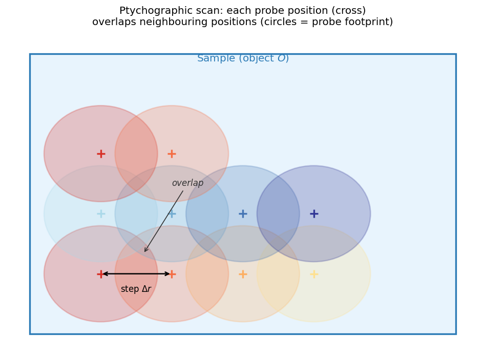
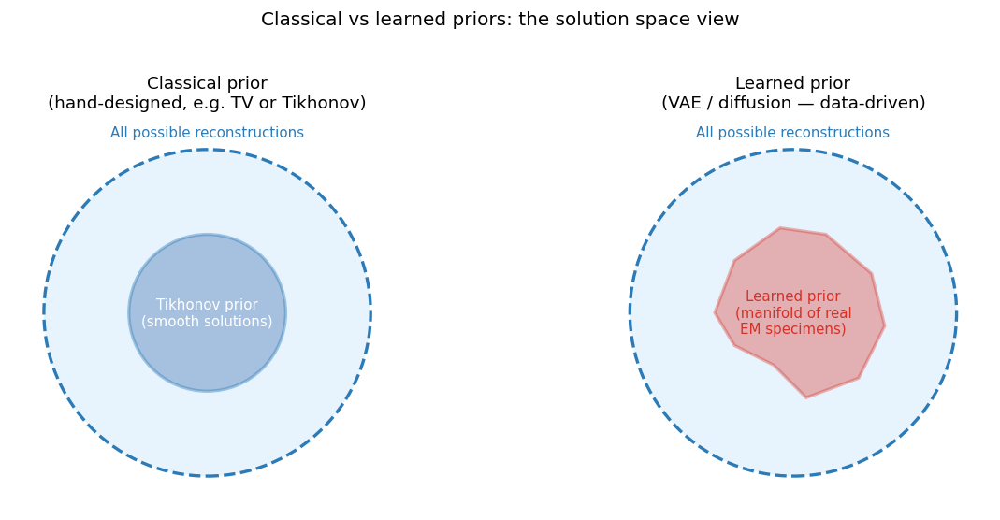
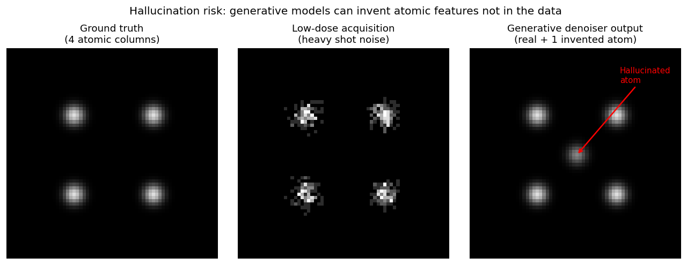

<!-- ===== §0. Recap + outcomes + roadmap (3 slides) ===== -->

## Recap: Week 12 and today's question

:::: {.incremental}
- **Week 12:** every measurement follows $\mathbf{y} = H\mathbf{x} + \boldsymbol{\epsilon}$; inversion is ill-posed (null space, small singular values), so we added priors (Tikhonov, TV, plug-and-play) and applied them to tomography and sensor fusion.
- **The gap:** (1) the forward models were *linear* — but a detector records $|\psi|^2$ and loses the phase; (2) the priors were *hand-designed*.
- **Today:**
  1. **Ptychography** — a non-linear forward model made solvable by redundancy, with the right physics (strong phase, multislice) and the right solver (ePIE or autodiff).
  2. **Generative priors** — GAN → diffusion, diffusion posterior sampling, and physics constraints as the counterweight.
  3. **Limits, causality and trust** — when does a powerful prior invent structure?
  4. **Course synthesis & exam preparation.**
::::

:::: {.notes}
- Open by closing the Week 12 loop: "Last week every forward model was a matrix. Blur, projection, fusion — all linear. Today the forward model contains a modulus squared, and suddenly half the information (the phase) is gone at the detector."
- Week 12 recap details (only if asked): L-curve / discrepancy principle for λ, Radon transform, Fourier-slice theorem, missing wedge, FBP vs iterative, HAADF + EDS fusion as one regularised objective.
- The Week 12 tomography material matters today: multislice ptychography has its own depth "missing wedge" (and ptychographic tomography combines both weeks — backup slide).
- This is the final lecture. Tell students up front that the last ~20 minutes are synthesis and exam preparation so they stay for it. Pacing: 2 minutes.
::::

## Learning outcomes

:::: {.incremental}
By the end of this lecture you can:

1. **Write down** the ptychographic forward model and explain why overlap makes phase retrieval over-determined.
2. **State** the strong-phase approximation, when it fails, and how **multislice** fixes it.
3. **Formulate** ptychography as loss minimisation and explain what **autodiff** buys over ePIE.
4. **Explain** GANs and diffusion models as learned priors and how **diffusion posterior sampling** works.
5. **Distinguish** soft (loss) and hard (architecture) physics constraints.
6. **Diagnose** hallucination and distribution shift before trusting a generative reconstruction.
7. **Place** the course's methods on the E1–E6 explainability ladder.
::::

:::: {.notes}
- Outcomes 1–3 are the "physics + optimisation" half; 4–6 the "learned priors + trust" half; 7 is the course capstone.
- Exam hint: outcomes 2, 3, 4 and 6 map one-to-one onto must-know statements in `_shared/exam_mustknow.md` (Week 13 section).
- Pacing: 1 minute. Do not read them all aloud; point at 3, 4 and 7 as the new material.
::::

## Road map and self-study

:::: {.incremental}
- **Road map (90 min):** phase problem & ptychography (11) · object physics: strong phase & multislice (9) · ptychography as gradient descent (11) · learned priors: GAN → diffusion (10) · diffusion posterior sampling (5) · physics constraints (4) · risks, limits & causality (9) · course synthesis (7) · exam & miniproject (4) · wrap-up (8) · questions (8).
- **Self-study:** `notebooks/week13_ptychography.ipynb` — forward model + ePIE with an overlap sweep; the same model reconstructed by **autodiff gradient descent**; a low-dose exercise with a TV prior in *one line of the loss*.
::::

:::: {.notes}
- The two anchors for the whole lecture: (1) "ptychography flips the ill-conditioning — overlap makes the problem over-determined"; (2) "the more the prior carries, the more it can invent". Everything else supports one of these.
- Notebook numbers (SEED=42, N_obj=48, N_probe=16): ePIE 40 iterations, step=4 (75 % overlap) 0.0991 → 0.0021; overlap sweep 4/6/8 px → 0.0021 / 0.0067 / 0.0091. Autodiff: full-batch Adam, lr 0.02, cosine schedule, 200 iterations, phase-only parameterisation $O=e^{i\phi}$ — amplitude error 8.7e-5 vs 7.7e-4 (ePIE); aligned phase RMS 2.9e-4 vs 1.7e-3 rad. Low dose (100 e⁻/pattern): TV prior 0.103 → 0.080 rad.
- **Timing plan (minute by minute, 90 min):**
  - 0–4 admin: recap (2), outcomes (1), road map (1).
  - 4–13 phase problem & ptychography: phase problem (2.5), redundancy + overlap (2.5), forward model (2.5), ePIE (1.5) — then 13–15 ePIE convergence (2).
  - 15–24 object physics: weak → strong phase (2), SPA breaks → multislice (2.5), picture (2), depth missing wedge + thermal limit (2.5).
  - 24–35 gradient descent: loss (2), autodiff code (3), ePIE vs autodiff (2), what autodiff buys (1.5), low dose + TV (2.5).
  - 35–45 learned priors: hand-built → learned (2.5), GANs (2.5), GAN → diffusion (2), diffusion models (3).
  - 45–50 DPS: Bayes + algorithm (3), toy (2).
  - 50–54 physics constraints: PINN idea (2), soft vs hard (2).
  - 54–63 risks & limits: hallucination (2), distribution shift (2), when not to trust (2), limits (1.5), causality (1.5).
  - 63–70 synthesis: course arc (2), E1–E6 ladder (2), trust failures (1.5), five pillars (1.5).
  - 70–74 exam prep (2.5), miniproject (1.5).
  - 74–82 notebook pointer (1.5), summary (2), must-know (2), closing (1.5) + 1 buffer.
  - 82–90 slack for questions (~8 min; the estimator puts the lecture path at ≤ 85).
- Pacing: 1 minute. Transition: "Let us start with why phase is hard."
::::

<!-- ===== §1. Phase problem and ptychography (5 slides) ===== -->

## The phase problem

::: {.columns}
:::: {.column width="40%"}
- Detectors record *intensity* $|\psi|^2$; the phase $\phi$ of $\psi = |\psi|e^{i\phi}$ is discarded.
- In a thin specimen $|\psi|$ is nearly uniform — almost all structural information sits in the **phase**.
- Recovering $\phi$ from intensities is the **phase problem**.
::::
:::: {.column width="60%"}
![Object phase (left), its Fourier amplitude (centre), and the recorded intensity $|\mathcal{F}[O]|^2$ (right): the phase is gone.](img/phase_problem.png){width="100%"}
::::
:::

:::: {.notes}
- Key physical insight: TEM images are formed by *interference* of the electron wave. A pure phase object (zero absorption) produces zero amplitude contrast — an in-focus image of a thin specimen looks featureless even when real atomic structure exists. This is why defocus phase contrast, Zernike phase plates, DPC and ptychography all exist.
- Example: graphene (Z=6) shifts the electron phase by only ~0.1 rad per atom at 300 kV; HAADF contrast is tiny, phase contrast reveals each atom.
- Walk through the panels. Key phrase: "the detector is a phase eraser." The map $O \mapsto |\mathcal{F}[O]|^2$ is many-to-one (non-uniqueness) — Hadamard condition 2 violated in its most extreme form.
- Historical context: the phase problem in X-ray crystallography delayed protein structures for decades; Patterson and heavy-atom methods were the workaround.
- Transition: "How do we recover phase? We need more data — ptychography provides it."
::::

## Redundancy is the key: overlapping probe positions

::: {.columns}
:::: {.column width="55%"}
- **One pattern:** $N^2$ intensities for $2N^2$ real unknowns — under-determined.
- **Ptychography:** scan the probe with a step *smaller* than the probe; neighbouring positions share most unknowns.
- 64×64 scan × 64×64 patterns ≈ 16.7 M measurements for a few $10^4$ object pixels — **massively over-determined**. [@rodenburg2007hard]
- Same redundancy idea as a tomographic tilt series (Week 12), applied to phase.
::::
:::: {.column width="45%"}
{width="100%"}
::::
:::

:::: {.notes}
- Numbers: with a 64×64 scan at sub-probe step the object field is roughly (64·step + probe) pixels on a side — tens of thousands of unknowns vs 16.7 M measurements. The message is "orders of magnitude more data than unknowns".
- GPS analogy: one satellite gives a sphere of possibilities, four give a point. Scan positions are the satellites of phase retrieval.
- Why overlap? If step = probe size, adjacent positions share no object pixels → each position is an independent under-determined problem. Overlap couples them. Standard ptychography uses 60–80 % overlap; the data set is a 4-D array (scan_y, scan_x, k_y, k_x) — "4D-STEM".
- Cost vs benefit: more overlap = better reconstruction, but also more dose and data (dose–resolution trade-off: backup slide).
::::

## The ptychographic forward model

{width="90%"}

$$I_j(\mathbf{k}) = \bigl|\mathcal{F}\bigl[P(\mathbf{r})\cdot O(\mathbf{r}-\mathbf{r}_j)\bigr]\bigr|^2$$

:::: {.notes}
- Walk through each panel: probe amplitude, object patch phase, exit wave, diffraction intensity (log).
- The formula is *the* equation of today. Reconstruction = inverting this operator over all positions simultaneously.
- Note the product $P\cdot O$: that is the *thin-object* (projection) assumption. We come back to it in a few slides — it is exactly the strong-phase approximation, and multislice replaces it.
::::

## Iterative phase retrieval: ePIE

:::: {.incremental}
- **Alternate two constraints:** Fourier amplitude must match $\sqrt{I_j}$ (*replace amplitude, keep phase*); then propagate the correction back to the object.
- **One ePIE step at position $j$:**
  1. Predict: $\psi_j = P \cdot O_j$ → $\Psi_j = \mathcal{F}[\psi_j]$
  2. Replace amplitude: $\Psi_j' = \sqrt{I_j} \cdot e^{i\arg \Psi_j}$
  3. Back-propagate: $\psi_j' = \mathcal{F}^{-1}[\Psi_j']$
  4. Update object: $O_j \leftarrow O_j + \beta \frac{P^*}{|P|^2_{\max}}(\psi_j' - \psi_j)$
- **Loop** over positions in random order until the amplitude-consistency error stops falling. [@maiden2009improved]
::::

:::: {.notes}
- Alternating projections: each constraint defines a set; if the sets intersect (enough overlap) alternating projections converge to the intersection.
- The update in step 4 is, up to the normalisation, a stochastic gradient step on $\|\,|\Psi_j| - \sqrt{I_j}\,\|^2$ with respect to $O_j$ — keep this in mind; it is the bridge to the gradient-descent section.
- Why shuffle positions? Same reason as SGD shuffles mini-batches (Week 4): avoids periodic artefacts and order bias.
- Blind ptychography adds the mirrored probe update $P \leftarrow P + \beta\,(O_j^*/|O_j|^2_{\max})(\psi'_j-\psi_j)$.
::::

## ePIE convergence: error vs iteration

{width="60%"}

:::: {.notes}
- The amplitude-consistency error is the normalised RMS difference between predicted and measured diffraction amplitudes — no ground truth needed. That is the metric you have in a real experiment.
- Numbers: 0.0991 → 0.0021 (step 4, ~48× below the flat-phase start), 0.1048 → 0.0067 (step 6), 0.1008 → 0.0091 (step 8). The ordering e4 < e6 < e8 is asserted in the notebook.
- Caveat to say aloud: low amplitude error = self-consistent, not necessarily correct. A wrong object that fits the data equally well is exactly the non-uniqueness problem — overlap is what removes it.
- Quality control in practice (backup slide): smooth plateauing error, residuals consistent with Poisson noise, stability across initialisations and half-sets.
::::

<!-- ===== §2. Object physics: strong phase and multislice (4 slides) ===== -->

## The object model: from weak to strong phase

:::: {.incremental}
- **Transmission function:** $O(\mathbf{r}) = e^{i\sigma V_p(\mathbf{r})}$, projected potential $V_p = \int V\,dz$, interaction constant $\sigma$.
- **Weak-phase approximation (WPOA):** $\sigma V_p \ll 1 \Rightarrow O \approx 1 + i\sigma V_p$ — the forward model becomes *linear* (basis of CTF theory).
- **Strong-phase approximation (SPA):** keep the full exponential, $\psi_{\text{exit}} = \psi_0\,e^{i\sigma V_p}$ — valid for phase shifts of several radians.
- **SPA assumes** the probe does not change shape inside the specimen (no propagation), pure phase object.
- **In the notebook:** parameterising $O = e^{i\phi}$ *is* the SPA — a hard constraint $|O|=1$.
::::

:::: {.notes}
- The order WPOA → SPA → multislice is a hierarchy of forward models of increasing fidelity and cost — the "choose the forward model that the physics demands" thread (Week 2 noise model, Week 12 linear operators).
- $\sigma = 2\pi m e \lambda / h^2$ (relativistic $m$); at 300 kV roughly $6.5\times10^{-4}$ rad V⁻¹ Å⁻¹. Not examined numerically. σ depends on beam energy.
- WPOA linearises; SPA keeps a single multiplicative phase screen — still a product $P\cdot O$, so ePIE works unchanged. SPA also conserves $|\psi|^2$ (no absorption).
- Exam hook: "Why does the weak-phase approximation linearise the forward model?" Answer: first-order Taylor expansion of the exponential.
::::

## When the strong-phase approximation breaks: multislice

:::: {.incremental}
- **SPA fails for** thick specimens (≳ 10–20 nm), low beam energies (< ~60 keV) and strong scatterers (heavy elements, channelling) — the probe *changes shape* inside the sample.
- **Symptom:** phase no longer scales linearly with thickness; ghost contrast at heavy columns.
- **Multislice** [@cowley1957scattering]: cut the specimen into thin slices, transmit and propagate:
$$\psi_{n+1} = p(\Delta z) \otimes \bigl[\psi_n \cdot e^{i\sigma V_n}\bigr], \qquad \mathcal{F}[p](\mathbf{k}, \Delta z) = e^{-i\pi\lambda\Delta z |\mathbf{k}|^2}$$
- **Multislice ptychography** reconstructs all slices $V_1\ldots V_N$ [@maiden2012multislice] — a deep, differentiable chain of multiply → FFT → propagate → IFFT.
::::

:::: {.notes}
- The Fresnel propagator in Fourier space is a pure phase factor that grows with $|\mathbf{k}|^2$ — high spatial frequencies are defocused more strongly per slice.
- The multislice forward model looks exactly like a neural network: repeated "multiply by learnable weights (the slice transmission), apply a fixed linear operator (propagation)". That is why autodiff frameworks (next section) are the natural home for multislice ptychography.
- Historical note: Cowley & Moodie (1957) introduced multislice for dynamical electron scattering simulation; Maiden, Humphry & Rodenburg (2012) turned it into a reconstruction method.
::::

## Phase object vs multislice: a picture

{width="85%"}

:::: {.notes}
- Left panel is the physical argument: a convergent probe with ~20–30 mrad semi-angle has a depth of field of only a few nm. If the sample is 20 nm thick, the probe at the exit surface is not the probe at the entrance surface — the SPA assumption "probe does not change shape" is violated.
- Right panel = the formula on the previous slide, drawn.
- Chen et al. 2021 used multislice ptychography to reach lattice-vibration-limited resolution in ~20 nm thick PrScO₃ — next slide.
::::

## Depth sectioning, its missing wedge, and the thermal limit

::: {.columns}
:::: {.column width="50%"}
- Depth information is carried only by *high* transverse frequencies (propagator phase $\pi\lambda\Delta z|\mathbf{k}|^2$).
- Low frequencies are nearly depth-invariant → **a missing wedge in $k_z$**, as in limited-angle tomography (Week 12): depth resolution a few nm vs < 0.5 Å laterally.
- **Resolution limit:** in PrScO₃ multislice ptychography reaches ~20 pm — set by *thermal vibrations* of the atoms, not the microscope. [@chen2020electron]
::::
:::: {.column width="50%"}
{width="100%"}
::::
:::

:::: {.notes}
- Connect explicitly to Week 12: the missing wedge re-appears. Same mathematics — a region of Fourier space that the measurement never samples; a prior (regulariser) must fill it or it stays empty. $\Delta z \propto 1/|\mathbf{k}_r|^2$.
- One can regularise along $z$, e.g. with a Fourier-space weight $W(\mathbf{k}) = 1 - \tfrac{2}{\pi}\arctan(\beta^2 k_z^2 / k_r^2)$, which damps structure along $k_z$ not supported by lateral frequencies. Mention for recognition only.
- The thermal limit is a beautiful "limits" message: once the reconstruction is good enough, the *specimen physics* (atoms vibrate at room temperature, ~5–10 pm RMS) becomes the resolution limit. No algorithm can beat that without cooling the sample. Resolution history: electron ptychography now sits above aberration-corrected imaging and approaches this limit.
- Going 3-D (ptychographic tomography, our group's work): backup slide.
- Transition: "How does such a reconstruction actually work? It is the same principle as training a neural network."
::::

<!-- ===== §3. Ptychography as gradient descent (5 slides) ===== -->

## Ptychography as loss minimisation

:::: {.incremental}
- **Loss over all scan positions:**
$$\hat{\phi} = \arg\min_{\phi} \; \sum_j \Bigl\|\, \bigl|\mathcal{F}[P\cdot O_j(\phi)]\bigr| - \sqrt{I_j}\,\Bigr\|_2^2 \;+\; \lambda\,R(\phi)$$
- **Data term from the noise model (Week 2):** least squares on $I$ (Gaussian), Poisson NLL (counts), or the **amplitude loss** on $\sqrt{I}$ ≈ variance-stabilised Poisson — the common choice.
- **Parameters:** object, and optionally probe, scan positions, slice potentials, tilt angles.
- **Solver:** any gradient method (Week 4). ePIE ≈ SGD with batch size 1 and a hand-derived step $\beta/|P|^2_{\max}$.
::::

:::: {.notes}
- This slide is the conceptual pivot: ptychography is ERM (Week 4) with a physics model instead of a neural network. $\hat R(\phi)$ notation for the data term deliberately matches MFML.
- The amplitude loss: $\sqrt{\text{Poisson}(\mu)}$ has variance ≈ 1/4 independent of μ for moderate counts (Anscombe) — the same variance-stabilising transform students met in Week 2. At very low dose the Poisson NLL $\sum (\hat I - I\log\hat I)$ is statistically correct.
- Solvers: GD, SGD over positions (mini-batches), Adam, L-BFGS.
- The regulariser $R$ is the Week 12 toolbox (Tikhonov, TV) — or a learned prior (later today).
::::

## Automatic differentiation: write the forward model, get the gradient

```{.python}
def forward(phi, probe, rows, cols):
    O = torch.exp(1j * phi)                    # SPA: pure phase object (hard constraint |O| = 1)
    exit_waves = probe * O[rows, cols]         # probe x all object patches at once
    return torch.abs(torch.fft.fft2(exit_waves))   # predicted diffraction amplitudes

phi = torch.zeros(N, N, requires_grad=True)
opt = torch.optim.Adam([phi], lr=0.02)
for it in range(200):
    loss = ((forward(phi, probe, rows, cols) - meas_amps) ** 2).sum()   # data fidelity
    loss = loss + lam_tv * tv(phi)                                      # prior: one extra line
    opt.zero_grad(); loss.backward(); opt.step()                        # autograd does the calculus
```

- `loss.backward()` differentiates *through* the FFT and the modulus — no hand-derived update. [@kandel2019automatic]
- Same pattern as training a network in Week 6 — the "network" is the physics.

:::: {.notes}
- The notebook contains exactly this code.
- Two things to point at: (1) the parameterisation `exp(1j*phi)` is a *hard* physics constraint (we will name it again in the physics-constraints section); (2) the TV line — adding a prior to ePIE requires deriving a new algorithm, adding it here is one line.
- Complex gradients: PyTorch uses Wirtinger calculus internally; parameterising by the real $\phi$ sidesteps the issue entirely.
- Kandel et al. 2019 is the reference paper that popularised AD as "a general framework for ptychographic reconstruction".
::::

## ePIE vs autodiff gradient descent: same problem, two solvers

::: {.columns}
:::: {.column width="55%"}
{width="100%"}
::::
:::: {.column width="45%"}
| after 200 passes | ePIE | autodiff GD |
|---|---|---|
| amplitude error | $7.7\times10^{-4}$ | $8.7\times10^{-5}$ |
| aligned phase RMS | $1.7\times10^{-3}$ rad | $2.9\times10^{-4}$ rad |
| wall time (CPU) | 4.5 s | 9.3 s |

- ePIE is **fast early**; full-batch Adam is **more precise late** (10× lower error).
::::
:::

:::: {.notes}
- Numbers from the notebook run (SEED=42). ePIE makes 81 small updates per pass; Adam's momentum + cosine schedule win late. Wall times depend on the machine; the ratio is what matters. After 40 passes ePIE is ahead (2.1e-3 vs 8.2e-3), but GD's 40-iteration value comes from a schedule tuned for 200 iterations — not a fair early-stopping comparison, and say so.
- "Aligned phase RMS": error inside the illuminated region after removing the global phase offset, which no intensity measurement can determine.
- The honest message: neither solver is magic; they minimise (almost) the same loss. The reason the field moved to autodiff is *flexibility* (next slide).
::::

## What automatic differentiation buys

:::: {.incremental}
- **Flexibility:** probe refinement, position correction, mixed probe states, multislice, tilt series — each is one more parameter or layer.
- **Any loss, any optimiser:** Poisson NLL at low dose; regularisers as loss terms; mini-batch SGD over millions of patterns on GPUs.
- **Composability:** a denoiser, a generative prior or a physics residual plugs into the same graph — the bridge to the rest of today.
- **Costs:** memory, hyperparameters, non-convexity — initialisation still matters.
::::

:::: {.notes}
- The composability point is why the rest of the lecture follows: once the reconstruction is a differentiable program, "prior" means "another differentiable term", whether hand-designed (TV), physics (PINN residual) or learned (diffusion score).
- Non-convexity: the phase problem has trivial ambiguities (global phase, conjugate twin, translation) plus real local minima at low overlap. Good initialisation (e.g. a DPC or parallax estimate) is standard practice.
- Memory: for a 20-slice multislice model on 256×256 patterns with 10⁵ positions, storing intermediates dominates GPU memory; checkpointing trades compute for memory.
- Partial coherence as mixed states: $I_j = \sum_k |\mathcal{F}[P_k \cdot O_j]|^2$ — trivial in an autodiff framework.
::::

## Low dose: a prior in one line of the loss

:::: {.incremental}
- **Notebook exercise 2:** Poisson noise, **100 e⁻ per pattern**; aligned phase RMS error:

| method | phase RMS [rad] |
|---|---|
| ePIE, 40 iterations | 0.094 |
| autodiff GD, $\lambda_{TV}=0$ (200 it.) | 0.103 |
| autodiff GD, $\lambda_{TV}=1$ | **0.080** |
| autodiff GD, $\lambda_{TV}=8$ | 0.140 |

- **U-curve:** too little prior fits noise; too much flattens the phase (bias) — the Week 12 $\lambda$ trade-off.
- **Early stopping is an implicit regulariser:** ePIE at 40 iterations beats unregularised GD.
- *The weaker the data, the more the prior has to carry.*
::::

:::: {.notes}
- All numbers from the executed notebook (noise seed 0). At 10× the dose (1000 e⁻/pattern) the optimal $\lambda_{TV}$ drops to ≈ 0.3: ePIE 0.037 rad, GD+TV(0.3) 0.032 rad.
- The sentence "the weaker the data, the more the prior has to carry" is the thread into the generative section: a diffusion prior at very low dose carries *almost everything* — that is where hallucination lives.
- Ask the room: "Why does TV hurt at large λ for *this* object?" Because the true phase is smooth Gaussian blobs, not piecewise constant — the prior is mis-specified. Priors encode assumptions; wrong assumptions bias the answer.
- Transition: "So far the prior was either nothing (overlap alone) or TV. What if we learn the prior from data?"
::::

<!-- ===== §4. Learned priors: GAN -> diffusion (4 slides) ===== -->

## From hand-built regularisers to learned priors

::: {.columns}
:::: {.column width="50%"}
- **Regularisation = MAP:**
$$\min_{\mathbf{x}} \|H(\mathbf{x}) - \mathbf{y}\|^2 + \lambda R(\mathbf{x}) \;\Leftrightarrow\; p(\mathbf{x}) \propto e^{-\lambda R(\mathbf{x})}$$
- Tikhonov, TV, positivity: hand-designed; none knows what real specimens look like.
- **Two ways to do better:** put known **physics** into the loss/architecture, or **learn** $p(\mathbf{x})$ from data with a generative model.
- Week 12's plug-and-play denoiser is the bridge: a diffusion model is a denoiser at *every* noise level.
::::
:::: {.column width="50%"}
{width="100%"}
::::
:::

:::: {.notes}
- The MAP ⇔ regularisation equivalence is the single most important bridge of the lecture. Write it on the board. Posterior ∝ likelihood × prior: the likelihood comes from the forward and noise models; the prior is the only place where "what specimens look like" enters.
- Prior spectrum from least to most data-dependent: hard constraints (positivity, $|O|=1$) → hand-crafted regularisers (TV) → physics residuals (PINN) → learned denoisers (PnP) → full generative models (diffusion).
- PnP recap (details on a backup slide): replace the proximal step of ADMM with any strong denoiser $D_\sigma$ (BM3D, DnCNN, U-Net) [@kamilov2023plug].
- Figure: if the test specimen is off the learned manifold, the prior forces the reconstruction onto it anyway — inventing structure that looks like training data. This is the hallucination mechanism; keep it in mind for the risk section.
- Generative families: VAE (Week 9: one-step, smooth latent, blurry), GAN, diffusion. VAE (2013) and GAN (2014) → diffusion (2020) became the default by 2022. MFML Unit 11 and MG Unit 12 have the derivations.
- Rule of thumb: little data + well-known physics → hand-designed/physics. Lots of in-distribution data + complex structure → learned prior.
::::

## GANs: an adversarial prior for sharp images

:::: {.incremental}
- **Minimax game** [@goodfellow2014generative]:
$$\min_G \max_D \; \mathbb{E}_{\mathbf{x}\sim p_{\text{data}}}[\log D(\mathbf{x})] + \mathbb{E}_{\mathbf{z}}[\log(1 - D(G(\mathbf{z})))]$$
  generator $G(\mathbf{z})$ maps noise to an image; discriminator $D(\mathbf{x})$ says "real or fake".
- **Strength:** sharp samples in *one* forward pass (no MSE blur); conditional GANs map low-dose → high-dose.
- **As a prior:** $\hat{\mathbf{z}} = \arg\min_{\mathbf{z}} \|H(G(\mathbf{z})) - \mathbf{y}\|^2$ — the solution lies on the generator's manifold.
- **Failure modes:** unstable training, **mode collapse**, and **no likelihood**.
::::

:::: {.notes}
- Do not derive the optimal discriminator; state the result: at the optimum $D \equiv 1/2$ and $G$ reproduces the data distribution.
- Unstable training: two players, no single loss to monitor. No likelihood: you cannot ask "how probable is this reconstruction?"
- Mode collapse in EM terms: a GAN trained on perfect SrTiO₃ reconstructs any noisy perovskite as a perfect lattice — defects are "off-mode" and get erased.
- Latent-space search (Bora et al.'s "compressed sensing with generative models") — powerful, but if the true object is not in the generator range the error cannot go to zero.
- Transition: "These failure modes are why the field moved to diffusion."
::::

## From GANs to diffusion: why the field moved

:::: {.incremental}
- **Stable training:** a plain regression loss (predict the noise) — one network, no adversary.
- **Mode coverage:** likelihood-based objective → *diverse* samples, no mode collapse.
- **A score, not just a sampler:** diffusion gives $\nabla_{\mathbf{x}} \log p_t(\mathbf{x})$ at every noise level — what Bayesian inverse problems need. [@song2021scoresde]
- **Price:** slow sampling — tens to hundreds of network evaluations vs one for a GAN.
::::

:::: {.notes}
- This is the pedagogical "GAN → diffusion" arc required by the curriculum. Emphasise the *score* bullet: a GAN gives samples, a diffusion model gives the gradient of the log prior.
- Loss curves you can read (Week 6 diagnostics apply).
- Faster samplers: DDIM, latent diffusion, flow matching, consistency models. Flow matching learns a velocity field instead of a noise predictor (MFML U11). Mention only.
- In materials science diffusion generates crystal structures (MatterGen, DiffCSP, MG Unit 12) and microstructures; in EM it drives denoising and super-resolution (applications: backup slide).
::::

## Diffusion models: forward noising, learned reverse

:::: {.incremental}
- **Forward process (fixed):** add Gaussian noise with schedule $\beta_t$; closed-form marginal [@ho2020denoising]
$$q(\mathbf{x}_t \mid \mathbf{x}_0) = \mathcal{N}\bigl(\sqrt{\bar\alpha_t}\,\mathbf{x}_0,\,(1-\bar\alpha_t)\mathbf{I}\bigr), \qquad \bar\alpha_t = \textstyle\prod_{s\le t}(1-\beta_s)$$
- **Training:** form $\mathbf{x}_t = \sqrt{\bar\alpha_t}\mathbf{x}_0 + \sqrt{1-\bar\alpha_t}\,\boldsymbol\epsilon$ and minimise
$$\mathcal{L} = \mathbb{E}\,\bigl\|\boldsymbol\epsilon - \boldsymbol\epsilon_\theta(\mathbf{x}_t, t)\bigr\|^2$$
  with a U-Net (Week 7) that predicts the noise.
- **Sampling:** start from $\mathbf{x}_T\sim\mathcal{N}(0,I)$, denoise step by step — coarse structure first.
- **Score:** $\nabla_{\mathbf{x}_t}\log p_t(\mathbf{x}_t) \approx -\boldsymbol\epsilon_\theta(\mathbf{x}_t,t)/\sqrt{1-\bar\alpha_t}$.
::::

:::: {.notes}
- Closed-form marginal means you never simulate the forward chain during training — pick any $t$ directly. Sample $\mathbf{x}_0$, $t$, $\boldsymbol\epsilon\sim\mathcal{N}(0,I)$.
- The noise-prediction network is literally a denoiser at noise level $\sqrt{1-\bar\alpha_t}$ — the PnP link.
- Score connection: for Gaussian corruption, predicting the noise is equivalent to predicting the score (denoising score matching). Not derived here; MFML U11.
- Transition: "Now combine the prior score with the measurement."
::::

<!-- ===== §5. Diffusion posterior sampling (2 slides) ===== -->

## Diffusion posterior sampling (DPS)

:::: {.incremental}
- **Bayes for scores** — the normaliser drops out:
$$\nabla_{\mathbf{x}_t}\log p_t(\mathbf{x}_t\mid\mathbf{y}) = \underbrace{\nabla_{\mathbf{x}_t}\log p_t(\mathbf{x}_t)}_{\text{learned prior score}} + \underbrace{\nabla_{\mathbf{x}_t}\log p_t(\mathbf{y}\mid\mathbf{x}_t)}_{\text{data consistency (intractable)}}$$
- **DPS** [@chung2023dps]: evaluate the likelihood at the clean-image (Tweedie) estimate $\hat{\mathbf{x}}_0 = (\mathbf{x}_t - \sqrt{1-\bar\alpha_t}\,\boldsymbol\epsilon_\theta)/\sqrt{\bar\alpha_t}$.
- **Each reverse step:** usual denoising step → $\mathbf{x}'_{t-1}$, then
$$\mathbf{x}_{t-1} = \mathbf{x}'_{t-1} - \zeta_t\,\nabla_{\mathbf{x}_t}\bigl\|\mathbf{y} - H(\hat{\mathbf{x}}_0)\bigr\|$$
- **Works for non-linear $H$** (ptychography): autodiff through network and physics. **Repeat with new seeds** → an ensemble of posterior samples.
::::

:::: {.notes}
- The Bayes-for-scores line is exam-level: "posterior score = prior score + likelihood score". Everything else is the approximation that makes it computable. Goal: sample $p(\mathbf{x}\mid\mathbf{y})$, not one MAP estimate.
- Tweedie (details on a backup slide): $\hat{\mathbf{x}}_0 = \mathbb{E}[\mathbf{x}_0\mid\mathbf{x}_t]$, the network's best guess of the clean image — blurry early, sharp late. It lets us push a clean estimate through the *physical* $H$ at every step even though $\mathbf{x}_t$ is noisy.
- Algorithm in words: start from noise; for t = T…1: prior step with $\boldsymbol\epsilon_\theta$, clean estimate, data step; return $\mathbf{x}_0$.
- Compare with PnP: *data step + denoiser step*, but with a noise schedule and injected randomness → samples instead of one point estimate.
- $\zeta$ is a step size; DPS normalises it by the residual norm. It is *not* a calibrated posterior sampler — see the toy on the next slide.
- Cost: one network forward + backward per step, 100–1000 steps per sample, several samples → minutes to hours.
- The ensemble spread is a (heuristic) uncertainty map — a direct link to Week 11 ensembles. Variants to name only: ΠGDM, DDRM, latent DPS.
- DPS was introduced by Chung et al. (ICLR 2023) and demonstrated on phase retrieval and non-uniform deblurring.
::::

## DPS on a toy: what the data fix and what the prior decides

![2-D toy with an exact prior (four Gaussian "structural variants") and exact noised scores. We observe only $x_1$ (a projection, $H=[1\;0]$); $x_2$ lies in the null space of $H$. Left: unconditional reverse diffusion reproduces the prior. Centre: exact posterior. Right: DPS samples. Generated by `img/make_figures.py`.](img/dps_toy.png){width="92%"}

:::: {.notes}
- Read the figure as a lesson about *null spaces*: the measurement pins $x_1 \approx 1.6$; nothing in the data says anything about $x_2$. The posterior has two modes (upper and lower) of equal weight — both answers are equally consistent with the data. The prior alone decides.
- DPS gets the important thing right (both modes, ≈ 50/50) but its spread along the measured direction is too narrow (0.08 vs 0.27 exact) and slightly shifted to the measured value: DPS is an approximation, not an exact posterior sampler.
- EM translation: $x_2$ could be "is there an atom at the centre of this cell?" at a dose where the data cannot tell. A single sample would *confidently* show one answer. Only the ensemble reveals that there are two.
- This is the hallucination slide in disguise — the risk section returns to it.
- Transition: "Before the risks: the other kind of prior — physics."
::::

<!-- ===== §6. Physics constraints (2 slides) ===== -->

## Physics-informed learning: the key idea

:::: {.incremental}
- **Generative priors know data, not physics.** Physics-informed learning adds a known equation, conservation law or symmetry to the objective. [@raissi2019physics]
- **PINN loss:**
$$\mathcal{L}(\theta) = \underbrace{\tfrac{1}{N}\textstyle\sum_i \|f_\theta(\mathbf{x}_i) - y_i\|^2}_{\text{data fidelity}} + \lambda\,\underbrace{\tfrac{1}{M}\textstyle\sum_m \|\mathcal{N}[f_\theta](\mathbf{x}_m)\|^2}_{\text{physics residual}}$$
- **Small-data advantage:** the residual constrains the solution where there are no data.
::::

:::: {.notes}
- From MFML U13 and the ML-PC PINN unit. $\mathcal{N}$ is the differential operator; derivatives by autodiff w.r.t. the *inputs*. Collocation points $\mathbf{x}_m$ need no labels.
- EM reading: data term = "reproduce the measurements"; physics term = "obey the known law" (e.g. Poisson's equation for the potential, a diffusion equation for in-situ kinetics).
- The λ knob: λ=0 → pure data fitting; λ→∞ → pure physics. Always monitor *both* terms: small residual + large data error → over-trusting physics; small data error + large residual → fitting noise.
- Optimisation pathologies: very different term scales, stiff PDEs, spectral bias of MLPs. Loss weighting and curricula help.
- Ptychography itself is "physics-informed" in the strongest sense: the entire model *is* the physics, only the object is learned.
- Complementarity: physics knows the law but not the typical specimen; generative priors know typical specimens but not the law. DPS with a physical $H$ combines both — the current frontier.
::::

## Soft vs hard physics constraints

:::: {.incremental}
- **Soft (penalty):** add $\lambda\|\text{violation}\|^2$ to the loss — flexible, only approximately satisfied, λ must be tuned.
- **Hard (parameterisation / architecture):** make violations *impossible*.
  - $O = e^{i\phi}$ guarantees $|O|=1$ (notebook); positivity via softplus.
  - Boundary conditions — **Lagaris substitution** [@lagaris1998artificial]: $\hat u(x) = A(x) + B(x)\,N_\theta(x)$.
  - Symmetry: equivariant architectures (CNN, GNN; Weeks 7, 10).
- **Hard constraints are exact but only as good as their physics:** wrong physics (SPA for a thick sample) biases the result *confidently*.
::::

:::: {.notes}
- The hard/soft distinction is exam-relevant and ties the course together: architecture as inductive bias (W6→W7→W10) is the hard-constraint side of the same coin.
- Lagaris: $A$ satisfies the BC and $B=0$ on the boundary. Example from MFML U13: for $x'=x$, $x(0)=1$, use $\hat x(t) = 1 + t\,N_\theta(t)$ — the initial condition holds for any weights. Normalisation: softmax.
- Rule: if a constraint is *certainly* true, hard-code it; if it is approximate (SPA for a 30 nm crystal), keep it soft — or better, upgrade the forward model (multislice).
- Wrong physics examples: wrong symmetry, SPA for a thick sample, ignoring inelastic scattering — the reconstruction still fits the data. Hard-coding $|O|=1$ for an absorbing specimen biases the phase.
- Transition: "Now the honest part — how do powerful priors fail in practice?"
::::

<!-- ===== §7. Risks, limits and causality (5 slides) ===== -->

## The honest risks: hallucination in EM

{width="82%"}

:::: {.notes}
- Walk through the three panels. The noisy centre region gave slight support for "something"; the prior filled in the most probable completion — which was wrong.
- Connect to the DPS toy: the centre of the cell is a null-space direction at this dose. The posterior is bimodal (atom / no atom); a single sample shows one mode with full confidence.
- Every application (denoising, super-resolution, missing-wedge inpainting, synthetic training data) raises the same question: *did the network reveal structure or invent it?* Low dose = weak likelihood = strong prior = high risk.
- Prevention: (1) ensembles of posterior samples; (2) residual checks; (3) physics constraints; (4) high-dose validation of the key feature.
::::

## Distribution shift: when training data do not match the specimen

:::: {.incremental}
- **Prior learned from $p_{\text{train}}$, specimen from $p_{\text{test}} \neq p_{\text{train}}$** — the most common cause of hallucination.
- **EM examples:** prior trained on perfect SrTiO₃ smooths away a grain boundary; Au-trained prior gives Pt columns Au-like contrast; simulation-trained prior on experimental data.
- **Detect:** residual $\mathbf{y} - H(\hat{\mathbf{x}})$ should look like noise; OOD scores (Week 11); disagreement with a prior-free (ePIE / TV) reconstruction.
- **Mitigate:** diverse training data, physical forward model in the loop (DPS, not image-to-image), independent validation.
::::

:::: {.notes}
- Distribution shift is the most common real-world failure — different microscope, preparation, dose, orientation.
- Simulation → experiment: you partly measure how well the simulation matches reality (*inverse crime* in reverse).
- The "compare with a prior-free reconstruction" check is cheap and powerful: features present in the generative result but absent in a TV reconstruction of the same data deserve suspicion.
- Link to Week 11: the OOD gate and conformal coverage both assume exchangeability with the calibration data — the same assumption the generative prior silently makes.
::::

## When NOT to trust a generative reconstruction

:::: {.incremental}
- **Red flags:**
  1. Very low dose and a suspiciously clean, noise-free result.
  2. A feature of a type absent from the training data.
  3. Structured residuals.
  4. The feature would be the headline result of your paper.
- **Checks:**
  1. Ensemble agreement across posterior samples / seeds.
  2. Normalised residuals $r_i = (y_i - H(\hat{\mathbf{x}})_i)/\sqrt{H(\hat{\mathbf{x}})_i} \sim \mathcal{N}(0,1)$.
  3. Agreement with a prior-free (ePIE / TV) reconstruction.
  4. Key features confirmed at higher dose or independently.
::::

:::: {.notes}
- The "headline result" red flag is intentionally provocative: priors have most influence exactly where the data are weakest, and that is often where the surprising finding sits. Low dose ≈ < 10² e⁻/Ų.
- The normalised residual check (Poisson): mean ≠ 0 → systematic bias; variance < 1 → over-fitting; variance > 1 → under-fitting or wrong noise model.
- Uncertainty quantification: a single reconstruction has no error bar. Posterior ensembles (heuristic — DPS under-disperses, as the toy showed); classical alternatives: half-set reconstructions (odd/even positions), bootstrap over patterns, Laplace approximation around the MAP (Week 11). Physics constraints shrink the space of possible hallucinations [@pelz2023solving].
- Report: method, training data, dose, residual map, uncertainty map, and which key assertion was validated independently.
- Choosing a method (backup slide): classical baseline first; learned priors only with in-distribution data; physics-informed when equations are known and data scarce.
::::

## Limits: more powerful = more assumptions

:::: {.incremental}
- **No algorithm recovers** what the measurement never contained: null space of $H$ (missing wedge, lost phase), frequencies below the noise floor, structure below the thermal blur.
- **A prior fills it with *plausible* content.** Plausible ≠ measured.
- **Hierarchy:** overlap alone (the forward model is right) → + TV (piecewise smooth) → + physics residual (the equation is right) → + generative prior (looks like the training set).
- Each step buys quality at low dose and costs *verifiability*: state, test and report the assumptions.
::::

:::: {.notes}
- Write the meta-lesson on the board: "more powerful = more assumptions".
- Null-space language unifies Weeks 12 and 13: missing wedge (tomography), phase (single diffraction pattern), $x_2$ in the DPS toy, the centre atom in the hallucination figure.
- Transition: "A different kind of limit: the difference between association and cause."
::::

## Causality vs correlation in EM analyses

:::: {.incremental}
- **ML finds associations; materials science needs mechanisms.** A defect classifier trained on furnace A may learn "furnace A ↔ defects" and fail on furnace B.
- **Reconstruction version:** a generative prior "explains" the data with the most *typical* structure — a statistical, not a causal, argument.
- **Only interventions establish causes:** inject an artefact (Week 7 shortcut demo), re-image at higher dose, measure a fresh specimen.
- **Honest validation (Week 4):** split by specimen/session to learn the *physics*, not the *specimen*.
::::

:::: {.notes}
- Furnace example from MFML U14, relevelled for EM. It is the confounding-variable story. Causal chain: processing → microstructure → properties → performance; each arrow is a physical mechanism, not a correlation in a table.
- The intervention test is the only way from "the model uses X" to "X causes Y". Attribution methods (Week 5 SHAP, Week 7 saliency) give the first; experiments give the second.
- Exam hook: "Give an example of a correlated but non-causal feature in an EM model and describe an experiment that distinguishes them."
::::

<!-- ===== §8. Course synthesis (4 slides) ===== -->

## The 13-week arc as one methodology

{width="90%"}

:::: {.notes}
- Step back and read the arc as one pipeline: represent EM data (W1–3), learn and validate honestly (W4), extract features and use strong tabular baselines (W5), build neural models with increasing inductive bias (W6 MLP → W7 CNN → W10 GNN/transformer), survive small data (W8), find latent structure (W9), quantify uncertainty and let the microscope decide (W11), and invert the physics (W12–13).
- The four threads: physics → loss/prior (W2 noise model decides the loss, W8 physics decides augmentation, W12–13 forward model decides the method); honest validation; architecture as inductive bias; explainability with every model family.
- The full pipeline a complete EM analysis contains (students can self-assess against it): (1) understand data formation — detector, dose, noise model → loss (W2), provenance (E1); (2) represent — arrays, spectra, descriptors, graphs (W1, W3, W5, W10); (3) baseline first — mean → linear → trees → NN (W4–5); (4) model with the right inductive bias (W6–10), self-supervision for small data (W8); (5) validate honestly — group splits, no leakage (W4); (6) quantify uncertainty — calibration, conformal, GPs, OOD gate (W11); (7) explain and sanity-check — attribution + intervention (W4–W10); (8) invert with the right forward model and an explicit prior (W12–13); (9) report limits.
- Do not rush this slide — it is the capstone.
::::

## The E1–E6 explainability ladder — collected over 13 weeks

![The six levels of explainability [@neuer2024machine], ordered from data to decision, with the weeks in which each level was taught. Explainability was not a separate topic: every model family came with its own explanation tool.](img/xai_ladder.png){width="92%"}

:::: {.notes}
- This is the synthesis of the explainability thread that ran through the whole course (W4 coefficients, W5 permutation importance/SHAP, W7 saliency/Grad-CAM/shortcut, W9 latent pitfalls, W10 attention ≠ explanation, W11 uncertainty as a trust gate). The full toolkit table is a backup slide — point students to it for revision.
- The ladder walks the same pipeline as the course: E1 data (W2/W4) → E2 process (W2/W12–13) → E3 features (W4–W5) → E4 model (W6–W10) → E5 prediction (W7/W11) → E6 decision (W11/W13). E1 and E2 are where EM scientists are strongest (provenance, physics); E3–E5 are the ML tools; E6 is where a human signs off.
- Today's contribution is at E2 (forward models, SPA vs multislice) and E6 (should I trust this reconstruction enough to publish it?).
- Sanity-check every explanation: randomise the weights — if the saliency map does not change, it explains the image, not the model.
::::

## Recurring trust failures across the course

{width="92%"}

:::: {.notes}
- Each failure has a matching detector from the course: GroupKFold by specimen (W4), saliency + intervention (W7), reliability diagram / conformal coverage / OOD score (W11), residual + ensemble + prior-free comparison (W13).
- Ask: "Which of these would a high test accuracy have caught?" None. That is the point.
::::

## Five pillars of trustworthy EM data science

:::: {.incremental}
1. **Correct physics:** the noise model decides the loss, the forward model decides the inversion.
2. **Honest validation:** no leakage; group splits; report generalisation.
3. **Calibrated confidence:** 95 % intervals that contain the truth 95 % of the time — checked.
4. **Faithful explanation:** attributions verified by sanity checks and interventions.
5. **Expert validation:** a materials scientist checks that it makes physical sense.

- *Collect the right data, build the right model, know what you don't know, and be able to explain why you trust the answer.*
::::

:::: {.notes}
- Pause on each pillar and name the week it came from: 1 → W2, W12–13; 2 → W4; 3 → W11; 4 → W5/W7; 5 → always. No tool does pillar 5 for you.
- Ask students to write down the one-sentence summary. It is the thesis of the course.
- Beyond the course (motivation, not examined): foundation models for microscopy, autonomous multi-modal acquisition, causal ML for processing, differentiable-physics reconstruction at scale.
::::

<!-- ===== §9. Exam and miniproject (2 slides) ===== -->

## Exam preparation

:::: {.incremental}
- **Written exam: 60 % of the grade** (miniproject 40 %); format and date as announced on the course page.
- **Question types:**
  - *Conceptual* — "When does the strong-phase approximation fail?"
  - *Application* — "A saliency map highlights a scale bar. What do you conclude, and which experiment confirms it?"
  - *Calculation* — noise model → loss, PCA/SVD, ridge/Tikhonov, backprop, GP posterior, Radon, ePIE update.
  - *Judgement* — "A colleague denoises a 50 e⁻/Ų image with a diffusion model trained on simulations. Three risks, one check each."
- **Study material:** `_shared/exam_mustknow.md`. For every week: core idea in one sentence, key equation, one EM application and one failure mode.
::::

:::: {.notes}
- Calculation topics by week: noise model → loss (W2), PCA/SVD (W3), ridge/Tikhonov objective (W4/W12), backprop on a tiny graph (W6), GP posterior (W11), Fourier-slice / Radon (W12), ePIE update (W13).
- `exam_mustknow.md` has ≤ 10 must-know statements per week for all 13 weeks, plus the notebooks' key numbers.
- The three-part strategy (idea, equation, application + failure mode) is the best single piece of exam advice; every must-know statement is written to support it.
- Application questions combine weeks — the most likely combinations: leakage + explainability (W4/W7), uncertainty + autonomous acquisition (W11), regularisation + hallucination (W12/13).
- Do not invent exam logistics on the spot — refer to the Week 1 slides / course page for date, duration and allowed aids.
::::

## Miniproject: final checklist

:::: {.incremental}
- **Specification:** `_shared/miniproject.md` — options A–E.
- **Rubric (40 %):** framing 15 · methodology 25 · uncertainty & validation 20 · explainability 15 · reproducibility 15 · report 10.
- **Explainability with a materials conclusion;** for **Option D** show what the prior contributes (with/without regularisation, residual plot).
- **Reproducibility:** `jupyter nbconvert --to notebook --execute your_notebook.ipynb` must run end-to-end.
::::

:::: {.notes}
- Options: A segmentation, B spectral unmixing & clustering, C property regression, D small imaging inverse problem, E atom-column descriptors & defect classification.
- Explainability examples: Grad-CAM on a failure case (A), NMF endmembers as interpretable spectra (B), SHAP on descriptors (C/E). Uncertainty: calibrated intervals, reliability diagram or posterior/ensemble spread; honest group splits.
- Option D directly uses Weeks 12–13: a deblurring, tomography or small ptychography problem. The strongest submissions show the λ trade-off (U-curve) and discuss what the prior may have invented.
- Action item: "open miniproject.md tonight and check your notebook against the rubric rows".
::::

<!-- ===== Notebook, summary, must-know, closing ===== -->

## Self-study notebook

- **Notebook:** `notebooks/week13_ptychography.ipynb` — [](https://colab.research.google.com/github/ECLIPSE-Lab/public_presentations/blob/main/data_science_for_em/notebooks/week13_ptychography.ipynb)
- **Parts 1–5:** forward model → ePIE (0.0991 → 0.0021); overlap sweep 4 / 6 / 8 px → 0.0021 / 0.0067 / 0.0091.
- **Part 6:** autodiff gradient descent with $O=e^{i\phi}$ — $8.7\times10^{-5}$ vs $7.7\times10^{-4}$ (ePIE) after 200 passes.
- **Part 7:** 100 e⁻/pattern, TV prior in one line; find the best $\lambda_{TV}$ and explain the U-curve.
- CPU only, < 1 min.

:::: {.notes}
- Parts 1–4: synthetic phase object and probe → forward model → ePIE. Part 5 is exercise 1 (overlap sweep). Part 6 aligned phase error 2.9e-4 rad vs 1.7e-3 rad for ePIE. Part 7 is exercise 2.
- Point students to the two questions in exercise 2 about early stopping and dose — both are exam-style.
- Try next: add a probe update, or the Poisson NLL instead of the amplitude loss. For the curious: extend `forward_torch` to two slices with a Fresnel propagator between them — a two-slice multislice model is ~5 extra lines.
::::

## Summary

:::: {.incremental}
- **Ptychography:** overlap makes phase retrieval over-determined; ePIE solves it by alternating projections.
- **Object physics:** weak phase → strong phase → **multislice** for thick samples; depth has a missing wedge; thermal vibrations set the final limit.
- **Autodiff gradient descent** solves the same loss with any parameters, losses and priors.
- **Generative priors:** GANs → diffusion (stable, diverse, gives a score); **DPS** adds a data-consistency gradient through Tweedie's estimate.
- **Physics constraints:** soft (loss) vs hard (parameterisation); wrong physics biases confidently.
- **Trust:** low dose = strong prior = hallucination risk — residuals, ensembles, prior-free baselines.
- **Synthesis:** E1–E6 ladder and five pillars — *more powerful = more assumptions*.
::::

:::: {.notes}
- One sentence per bullet; this is the slide to photograph before the exam.
::::

## Must-know takeaways (Week 13)

:::: {.incremental}
1. Detectors record $|\psi|^2$; ptychographic overlap makes phase retrieval over-determined: $I_j = |\mathcal{F}[P\cdot O(\mathbf{r}-\mathbf{r}_j)]|^2$.
2. ePIE: replace the Fourier amplitude with $\sqrt{I_j}$, back-transform, update $O_j \mathrel{+}= \beta\,P^*/|P|^2_{\max}\,(\psi'_j-\psi_j)$.
3. SPA: $\psi_{\text{exit}} = \psi_0\,e^{i\sigma V_p}$; fails for thick samples / strong scatterers → multislice (transmit, propagate, repeat).
4. Ptychography = loss minimisation; autodiff differentiates through FFT and modulus, so probe, positions, slices and priors are just extra terms.
5. Posterior score = prior score + likelihood score; DPS approximates the likelihood at the Tweedie estimate $\hat{\mathbf{x}}_0$.
6. Hard constraints (parameterisation) are exact but only as good as their physics; soft constraints need a λ.
7. The weaker the data, the more the prior decides — check residuals, ensembles and a prior-free baseline before trusting a generative reconstruction.
::::

:::: {.notes}
- These mirror `_shared/mustknow_parts/week13.md` (which has the full ten statements, including the E1–E6 ladder, causality and the five pillars).
::::

## Closing

:::: {.incremental}
- **Over 13 weeks** you built a data-science toolkit for EM — from noise models, trees, CNNs, transformers and GPs to physics-based and generative reconstruction.
- **The scientific obligation:** you are responsible for validating every number, explanation and reconstruction against physics.
- **Next steps:** `exam_mustknow.md`, `miniproject.md`, and the Ai4Mat companion notebooks.
- **Thank you** for 13 weeks of work.
::::

:::: {.notes}
- Deliver without rushing; the last lecture deserves a moment. The tools do not absolve the scientist.
- "You are now equipped to contribute to the next generation of intelligent electron microscopy."
- Every student in this room will meet a model that looks right and is wrong. Catching it — validation, explanation, physics — is what this course was for.
::::

<!-- BEGIN prev-next -->

## Continue

- &larr; Previous: [Unit 12 &mdash; Inverse problems I: regularisation, tomography & sensor fusion](../12_inverse_problems_1/01_intro.html)
- [All courses](../../index.html)

<!-- END prev-next -->

## Backup slides {visibility="uncounted"}

Material that did not fit the 90-minute lecture path — for self-study and questions.

## Beyond one view: ptychographic tomography {visibility="uncounted"}

:::: {.incremental}
- **Combine Week 12 and Week 13:** reconstruct a phase projection (or multislice stack) at every tilt angle, then solve a tomography problem — or do both at once.
- **Ptychographic atomic electron tomography:** 34.5 million diffraction patterns → atomic-resolution tilt series of a double-wall carbon nanotube with an encapsulated ZrTe structure; revealed a previously unobserved ZrTe₂ phase. [@pelz2023solving]
- **Multislice ptychographic tomography:** 2 Å axial and 0.7 Å lateral resolution in a volume beyond the depth-of-field limit — a 13.5× axial improvement over single-view multislice. [@romanov2024multislice]
- **End-to-end:** reconstruct the 3-D potential *directly* from the unaligned 4D-STEM tilt series, including alignment and a restricted tilt range — sub-Å near-isotropic resolution. [@you2024endtoend]
- **Why this became possible:** all of these are one big differentiable forward model optimised by gradient descent.
::::

:::: {.notes}
- These are our own group's papers — use them as "this is what the inverse-problem toolbox of Weeks 12–13 does in current research".
- Pelz et al. 2023: light elements (C) and heavy elements (Zr, Te) are imaged together in 3-D — HAADF tomography cannot do this because C is invisible next to Te.
- End-to-end: nuisance parameters (tilt-axis alignment, probe, positions) are optimised jointly with the volume. "Everything is a parameter; autodiff gives the gradient."
::::

## What ptychography buys: dose–resolution trade-off {visibility="uncounted"}

![Schematic dose–resolution trade-off for ADF-STEM (red) and ptychography (blue); y-axis inverted (higher = finer). In the low-dose regime both scale as $d \propto 1/\sqrt{\text{dose}}$, but ptychography uses all scattered electrons and achieves better resolution at equal dose. At high dose ADF saturates at the probe-size limit; ptychography keeps improving because it deconvolves the probe. [@chen2020electron]](img/dose_resolution_tradeoff.png){width="62%"}

:::: {.notes}
- Low dose: both limited by Poisson noise, $1/\sqrt{N}$ scaling. Ptychography uses the whole diffraction pattern instead of a high-angle annulus.
- High dose: ADF is limited by the probe (hardware); ptychography recovers information beyond the probe size because the diffraction pattern encodes sub-probe structure.
- Practical: for beam-sensitive materials (MOFs, zeolites, 2-D materials, biological samples) dose efficiency is the reason to use ptychography.
::::

## Experimental parameters and quality control {visibility="uncounted"}

:::: {.incremental}
- **What you choose:** probe size / defocus (aberration corrector settings), scan step (~20–40 % of the probe diameter), camera length (detector angular range ↔ real-space pixel size), total dose.
- **Detector sampling:** the diffraction pattern must be Nyquist-sampled; under-sampling aliases (Week 2).
- **Partial coherence:** model as mixed probe states, $I_j = \sum_k |\mathcal{F}[P_k \cdot O_j]|^2$ — trivial to add in an autodiff framework.
- **What you get:** complex object $O(\mathbf{r})$ (amplitude + phase), reconstructed probe(s), refined positions.
- **Quality check:** amplitude error decreasing smoothly and plateauing well below its start; residual consistent with Poisson noise; reconstruction stable across initialisations and data halves (a half-set comparison, like cryo-EM FSC). [@maiden2009improved]
::::

:::: {.notes}
- In the notebook, step 4 px on a 16 px probe = 25 % of the probe diameter = 75 % overlap.
- Half-set comparison: reconstruct from odd and even scan positions separately, compare in Fourier space; frequencies where they agree are supported by the data. This is an honest-validation idea (Week 4) applied to reconstruction.
::::

## The plug-and-play framework: any denoiser as a prior {visibility="uncounted"}

:::: {.incremental}
- **Insight:** the proximal step of a regulariser $R$ has the same form as *Gaussian denoising*. [@kamilov2023plug]
- **Plug-and-play (PnP):** replace the proximal step in ADMM / proximal gradient descent with *any* strong denoiser — BM3D, a DnCNN or a U-Net (Week 7) trained on EM images.
- **Algorithm:** alternate
  1. *Data step:* $\mathbf{x} \leftarrow \mathbf{x} - \eta \nabla_{\mathbf{x}} \|H(\mathbf{x}) - \mathbf{y}\|^2$
  2. *Prior step:* $\mathbf{x} \leftarrow D_\sigma(\mathbf{x})$ (apply the learned denoiser)
- **Result:** the denoiser defines the prior implicitly. Diffusion models are the logical extreme: a denoiser trained at *every* noise level.
::::

:::: {.notes}
- Recap of Week 12 PnP, with the forward pointer to diffusion: a diffusion model is a stack of denoisers $D_\sigma$ for all $\sigma$, and Tweedie's formula turns a denoiser into a score. That is why DPS looks like PnP with a noise schedule.
- Convergence guarantees need contractive denoisers, which most networks are not exactly — in practice it usually works. Not examined.
::::

## Tweedie's formula: a denoiser gives a clean-image estimate {visibility="uncounted"}

:::: {.incremental}
- At any step $t$ the network gives an estimate of the **clean** image (Tweedie):
$$\hat{\mathbf{x}}_0(\mathbf{x}_t) = \frac{\mathbf{x}_t + (1-\bar\alpha_t)\,\nabla_{\mathbf{x}_t}\log p_t(\mathbf{x}_t)}{\sqrt{\bar\alpha_t}} = \frac{\mathbf{x}_t - \sqrt{1-\bar\alpha_t}\,\boldsymbol\epsilon_\theta(\mathbf{x}_t,t)}{\sqrt{\bar\alpha_t}}$$
- $\hat{\mathbf{x}}_0$ is the *posterior mean* $\mathbb{E}[\mathbf{x}_0 \mid \mathbf{x}_t]$ — blurry early (large $t$), sharp late.
- **Why this matters for inverse problems:** we can push $\hat{\mathbf{x}}_0$ through the *physical* forward model $H$ at every step and compare with the measurement $\mathbf{y}$ — even though $\mathbf{x}_t$ itself is noisy.
- This is the one ingredient that turns an unconditional generator into a reconstruction algorithm.
::::

:::: {.notes}
- Tweedie's formula is the key technical step of diffusion posterior sampling. Present it as "the network's best guess of the clean image, given the noisy one".
- Early in sampling $\hat{\mathbf{x}}_0$ is an average over many plausible images (blurry); late it commits to one.
::::

## Generative models for EM: applications {visibility="uncounted"}

:::: {.incremental}
- **Denoising at low dose:** learned priors preserve atomic contrast far better than BM3D/NLM at extreme noise; self-supervised training (Noise2Void / blind-spot) avoids paired clean data.
- **Super-resolution & inpainting:** fill in sub-sampled scans (dose reduction by sparse scanning, compressed sensing) — conditioned on measured pixels.
- **Reconstruction priors:** diffusion/PnP priors inside ptychography and tomography — especially to fill the missing wedge.
- **Synthetic training data & inverse design:** generate realistic micrographs for training segmentation (Weeks 7–8) and crystal/microstructure candidates (MG Unit 12).
- **The common question in every case:** *did the network reveal structure or invent it?* Low dose = weak likelihood = strong prior = high risk.
::::

:::: {.notes}
- Denoising is the most widely adopted application because it directly addresses dose. The risk: "looks better" but removes real disorder or beam damage.
- Missing-wedge inpainting with learned priors is an active research area in tomography — directly continues Week 12.
::::

## Choosing a reconstruction method {visibility="uncounted"}

{width="85%"}

:::: {.notes}
- Row 1: default for new or unusual specimens — no training data needed, predictable failure (smoothing bias).
- Row 2: high performance when curated in-distribution training data exist; subtle failure modes.
- Row 3: physics known, data scarce — e.g. multislice ptychography with the multislice model as forward operator.
- Practical ordering: always run a classical baseline first (Week 5 baseline ladder, applied to reconstruction).
::::

## The explainability & trust toolkit at a glance {visibility="uncounted"}

| Method | Question it answers | Works on | Week |
|---|---|---|---|
| Coefficients / partial dependence | How does the output change with a feature? | Linear / additive models | W4 |
| Permutation importance, SHAP [@lundberg2017shap] | Which features matter, globally and per sample? | Any model | W5 |
| Saliency, Grad-CAM [@selvaraju2017gradcam], occlusion | Which pixels drove this prediction? | CNNs (occlusion: any) | W7 |
| Latent-space maps, t-SNE/UMAP | What structure did the model find? (beware distances) | AEs / VAEs / embeddings | W9 |
| Attention maps | Where did the transformer look? (≠ why) | Transformers | W10 |
| Calibration, conformal, OOD gate | How sure — and is this input in-distribution? | Any predictor | W11 |
| Residuals, posterior ensembles, half-sets | Is this reconstruction supported by the data? | Inverse problems | W12–13 |

- **Sanity check every explanation** — e.g. randomise the weights: if the saliency map does not change, it explains the image, not the model. [@adebayo2018sanity]

:::: {.notes}
- Reference slide — students should photograph it. Every row is examinable at the "what does it answer, what does it need" level.
- The "Works on" column: gradient methods need differentiability (no random forest, no black-box simulator); permutation importance and occlusion are model-agnostic.
- The last row is today's addition: for reconstructions, the explanation *is* the residual and the ensemble — "which parts of the output are forced by the data?".
::::

## References {.unnumbered}

::: {#refs}
:::
