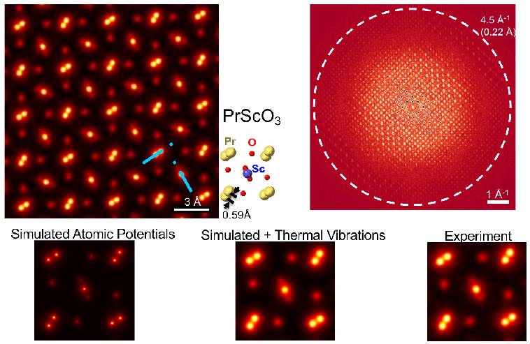
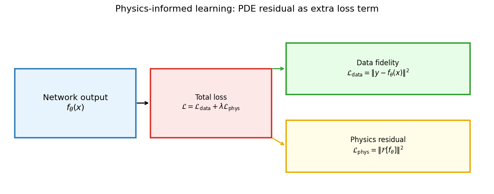
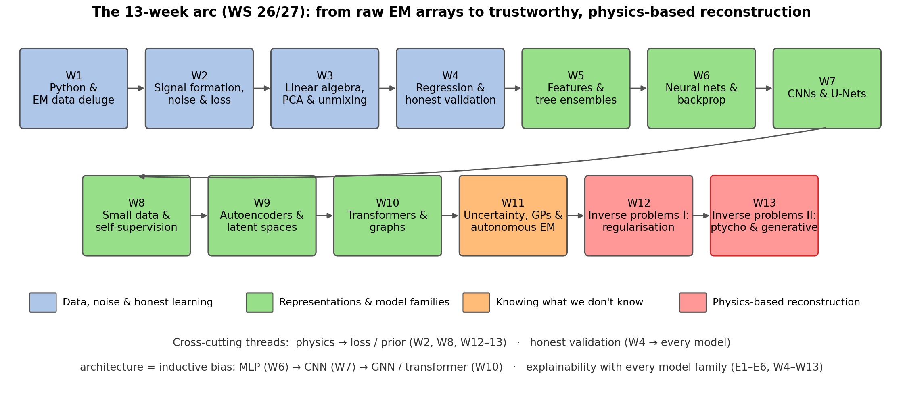

<!-- ===== §0. Recap + outcomes + roadmap (3 slides) ===== -->

## Recap: Week 12 and today's question

:::: {.incremental}
- **Week 12 recap:** every EM measurement follows $\mathbf{y} = H\mathbf{x} + \boldsymbol{\epsilon}$. Inversion is hard because $H$ has a null space (non-uniqueness) and small singular values (noise amplification). We stabilised it with **Tikhonov / TV** priors, picked $\lambda$ with the L-curve or discrepancy principle, met **plug-and-play** denoisers, reconstructed **tomograms** (Radon transform, Fourier-slice theorem, missing wedge, FBP vs iterative) and **fused** HAADF with EDS/EELS into one regularised objective.
- **The Week 12 gap:** (1) the forward models were *linear* — but a detector records $|\psi|^2$, which destroys the phase; (2) the priors were *hand-designed* and know nothing about what real specimens look like.
- **Today — three upgrades and a synthesis:**
  1. **Ptychography:** a non-linear forward model made solvable by redundancy — with the *right physics* (strong phase, multislice) and the *right solver* (ePIE or autodiff gradient descent).
  2. **Generative priors:** GAN → diffusion, and **diffusion posterior sampling** for inverse problems — plus physics constraints (PINNs) as the counterweight.
  3. **Limits, causality and trust:** when does a powerful prior invent structure?
  4. **Course synthesis & exam preparation:** the E1–E6 explainability ladder and the 13-week arc as one methodology.
::::

:::: {.notes}
- Open by closing the Week 12 loop: "Last week every forward model was a matrix. Blur, projection, fusion — all linear. Today the forward model contains a modulus squared, and suddenly half the information (the phase) is gone at the detector."
- The Week 12 tomography material matters today twice: multislice ptychography has its own depth "missing wedge", and ptychographic tomography literally combines this week's forward model with last week's Radon transform.
- This is the final lecture. Tell students up front that the last 20 minutes are synthesis and exam preparation so they stay for it. Pacing: 3 minutes.
- Transition: "Here is what you should be able to do at the end of today."
::::

## Learning outcomes

:::: {.incremental}
By the end of this lecture you can:

1. **Write down** the ptychographic forward model and explain why overlap makes phase retrieval over-determined.
2. **State** the strong-phase approximation, when it fails, and how the **multislice** model fixes it.
3. **Formulate** ptychography as loss minimisation and explain what **automatic differentiation** buys compared with ePIE.
4. **Explain** GANs and diffusion models as learned priors, and how **diffusion posterior sampling** combines a learned score with a data-consistency gradient.
5. **Distinguish** soft (loss) and hard (architecture) physics constraints.
6. **Diagnose** hallucination and distribution shift, and name three checks before trusting a generative reconstruction.
7. **Place** every method of the course on the E1–E6 explainability ladder and in the 13-week pipeline.
::::

:::: {.notes}
- Outcomes 1–3 are the "physics + optimisation" half; 4–6 the "learned priors + trust" half; 7 is the course capstone.
- Exam hint: outcomes 2, 3, 4 and 6 map one-to-one onto must-know statements in `_shared/exam_mustknow.md` (Week 13 section).
- Pacing: 1 minute. Do not read them all aloud; point at 3, 4 and 7 as the new material.
::::

## Road map and self-study

:::: {.incremental}
- **Road map (90 min):** phase problem (3) · ptychography & ePIE (4) · object physics: strong phase & multislice (5) · ptychography as gradient descent (5) · what ptychography buys (3) · from hand-built to learned priors (3) · generative priors: GAN → diffusion (5) · diffusion posterior sampling (4) · physics constraints / PINNs (4) · honest risks (4) · limits & causality (3) · explainability synthesis E1–E6 (3) · course synthesis & exam prep (5) · summary.
- **Self-study:** `notebooks/week13_ptychography.ipynb`
  - forward model + ePIE; overlap sweep: step 4/6/8 px → final amplitude error 0.0021 / 0.0067 / 0.0091;
  - **new:** the same forward model in PyTorch, reconstructed by **autodiff gradient descent** — amplitude error $8.7\times10^{-5}$ vs $7.7\times10^{-4}$ for ePIE after 200 passes;
  - **new exercise:** low dose (100 e⁻/pattern) + TV prior in *one line of the loss* → phase error 0.103 → 0.080 rad at the best $\lambda_{TV}$.
::::

:::: {.notes}
- The two anchors for the whole lecture: (1) "ptychography flips the ill-conditioning — overlap makes the problem over-determined"; (2) "the more the prior carries, the more it can invent". Everything else supports one of these.
- Notebook numbers (SEED=42, N_obj=48, N_probe=16): ePIE 40 iterations, step=4 (75 % overlap) 0.0991 → 0.0021. Autodiff: full-batch Adam, lr 0.02, cosine schedule, 200 iterations, phase-only parameterisation $O=e^{i\phi}$. Aligned phase RMS (illuminated region, global phase removed): ePIE 200 passes 1.7e-3 rad, GD 2.9e-4 rad.
- Pacing: 1 minute. Transition: "Let us start with why phase is hard."
::::

<!-- ===== §1. The phase problem (3 slides) ===== -->

## Why phase matters in EM

:::: {.incremental}
- **What detectors measure:** every detector — CCD, direct electron detector, HAADF annular — records *electron intensity*: the number of electrons hitting each pixel. Intensity $= |\psi|^2$.
- **What is lost:** the electron wave $\psi = |\psi|\,e^{i\phi}$ carries both amplitude and phase. The detector measures $|\psi|^2$. The phase $\phi$ is *discarded* by the measurement process.
- **Why this matters:** in a thin specimen the amplitude $|\psi|$ is nearly uniform — the specimen is nearly transparent. All the structural information (which column is where, how thick the sample is, what the projected potential is) is encoded in the *phase* $\phi$.
- **Consequence:** a conventional in-focus image of a thin specimen looks featureless, even when real atomic-scale structure exists. Recovering the phase from intensity measurements is the **phase problem**.
::::

:::: {.notes}
- Key physical insight: TEM images are formed by *interference* of the electron wave. A pure phase object (zero absorption) produces zero amplitude contrast — it is invisible in an amplitude-only image. This is why defocus phase contrast, Zernike phase plates, DPC and ptychography all exist.
- Historical context: the phase problem in X-ray crystallography delayed protein structures for decades; Patterson and heavy-atom methods were the workaround. Ptychography solves it for EM by collecting redundant data.
- Example: graphene (Z=6) shifts the electron phase by only ~0.1 rad per atom at 300 kV; HAADF contrast is tiny, phase contrast reveals each atom.
- Transition: "How do we recover phase? We need more data — ptychography provides it."
::::

## The phase problem: a picture

![Left: the object phase $\phi(x)$ varies across the specimen — this is the structural information. Centre: the Fourier-domain amplitude $|\mathcal{F}[O]|$ retains spatial-frequency magnitudes but discards phase. Right: the detector records only $|\mathcal{F}[O]|^2$ — the phase information is gone.](img/phase_problem.png){width="85%"}

:::: {.notes}
- Walk through each panel. Left: phase map — bright blobs encode local phase shifts. Centre: Fourier amplitude. Right: what the detector records.
- Key phrase: "the detector is a phase eraser." The map $O \mapsto |\mathcal{F}[O]|^2$ is many-to-one: many objects produce the same intensity pattern (non-uniqueness).
- Connect to Week 12: this is Hadamard condition 2 (uniqueness) violated in its most extreme form. One diffraction pattern: $N^2$ measured values, $2N^2$ real unknowns — under-determined.
- Transition: make the system over-determined by collecting *many* overlapping diffraction patterns.
::::

## Overcoming the phase problem: redundancy is the key

:::: {.incremental}
- **Single diffraction pattern:** $N^2$ measured intensities for $N^2$ complex unknowns ($2N^2$ real DOF) — under-determined. Infinitely many objects are consistent with one pattern.
- **Ptychographic scanning:** move the probe by a step smaller than the probe size. Each new position adds $N_p^2$ new measurements while sharing most unknowns with the previous position. With enough overlap the system becomes *massively over-determined*.
- **Concrete numbers:** a 64×64 scan with 64×64-pixel diffraction patterns gives $64^2 \times 64^2 \approx 16.7\,\text{M}$ measurements for an object of a few $10^4$ pixels — hundreds of measurements per unknown. [@rodenburg2007hard]
- **Result:** the phase can be recovered from magnitudes alone — no separate phase measurement needed. This is the same *redundancy* idea as a tomographic tilt series (Week 12), applied to phase.
::::

:::: {.notes}
- Numbers: with a 64×64 scan at sub-probe step the object field is roughly (64·step + probe) pixels on a side — tens of thousands of unknowns vs 16.7 M measurements. The exact ratio depends on step and pixel size; the message is "orders of magnitude more data than unknowns".
- GPS analogy: one satellite gives a sphere of possibilities, four give a point. Scan positions are the satellites of phase retrieval.
- Why overlap? If step = probe size, adjacent positions share no object pixels → each position is an independent under-determined problem. Overlap couples them.
- Transition: "Now the algorithm that exploits this."
::::

<!-- ===== §2. Ptychography: overlap, forward model, ePIE (4 slides) ===== -->

## Ptychography: overlapping probe positions

{width="70%"}

:::: {.notes}
- The circles overlap — a given object point is illuminated by several probe positions. Physical origin of the redundancy.
- Standard ptychography uses 60–80 % overlap. The data set is a 4-D array (scan_y, scan_x, k_y, k_x) — "4D-STEM".
- Cost vs benefit: more positions = more overlap = better reconstruction, but also more dose and data. Dose–resolution slide follows later.
::::

## The ptychographic forward model

{width="90%"}

$$I_j(\mathbf{k}) = \bigl|\mathcal{F}\bigl[P(\mathbf{r})\cdot O(\mathbf{r}-\mathbf{r}_j)\bigr]\bigr|^2$$

:::: {.notes}
- Walk through each panel: probe amplitude, object patch phase, exit wave, diffraction intensity (log).
- The formula is *the* equation of today. Reconstruction = inverting this operator over all positions simultaneously.
- Note the product $P\cdot O$: that is the *thin-object* (projection) assumption. We come back to it in §3 — it is exactly the strong-phase approximation, and multislice replaces it.
::::

## Iterative phase retrieval: ePIE intuition

:::: {.incremental}
- **The core idea:** alternate between two constraints.
  - **Fourier constraint:** the exit wave's Fourier amplitude must match the measured $\sqrt{I_j}$. *Replace amplitude, keep phase.*
  - **Real-space constraint:** update the object using the corrected exit wave. *Propagate the correction back.*
- **One ePIE step at position $j$:**
  1. Predict: $\psi_j = P \cdot O_j$ → $\Psi_j = \mathcal{F}[\psi_j]$
  2. Replace amplitude: $\Psi_j' = \sqrt{I_j} \cdot e^{i\arg \Psi_j}$
  3. Back-propagate: $\psi_j' = \mathcal{F}^{-1}[\Psi_j']$
  4. Update object: $O_j \leftarrow O_j + \beta \frac{P^*}{|P|^2_{\max}}(\psi_j' - \psi_j)$
- **Loop** over all positions in random order until the amplitude-consistency error stops falling. [@maiden2009improved]
::::

:::: {.notes}
- Alternating projections: each constraint defines a set; if the sets intersect (enough overlap) alternating projections converge to the intersection.
- The update in step 4 is, up to the normalisation, a stochastic gradient step on $\|\,|\Psi_j| - \sqrt{I_j}\,\|^2$ with respect to $O_j$ — keep this in mind; it is the bridge to §4.
- Why shuffle positions? Same reason as SGD shuffles mini-batches (Week 4): avoids periodic artefacts and order bias.
- Blind ptychography adds the mirrored probe update $P \leftarrow P + \beta\,(O_j^*/|O_j|^2_{\max})(\psi'_j-\psi_j)$.
::::

## ePIE convergence: error vs iteration

{width="60%"}

:::: {.notes}
- The amplitude-consistency error is the normalised RMS difference between predicted and measured diffraction amplitudes — no ground truth needed. That is the metric you have in a real experiment.
- Numbers: 0.0991 → 0.0021 (step 4), 0.1048 → 0.0067 (step 6), 0.1008 → 0.0091 (step 8). The ordering e4 < e6 < e8 is asserted in the notebook.
- Caveat to say aloud: low amplitude error = self-consistent, not necessarily correct. A wrong object that fits the data equally well is exactly the non-uniqueness problem — overlap is what removes it.
::::

<!-- ===== §3. Object physics: strong phase and multislice (5 slides) ===== -->

## The object model: from weak to strong phase

:::: {.incremental}
- **Transmission function:** a thin specimen multiplies the incident wave by $O(\mathbf{r}) = e^{i\sigma V_p(\mathbf{r})}$, with projected potential $V_p(\mathbf{r}) = \int V(\mathbf{r},z)\,dz$ and interaction constant $\sigma$ (depends on beam energy).
- **Weak-phase approximation (WPOA):** if $\sigma V_p \ll 1$ rad, $O \approx 1 + i\sigma V_p$ — the forward model becomes *linear* in $V_p$ (the basis of CTF theory and simple Fourier methods).
- **Strong-phase approximation (SPA):** keep the full exponential, $\psi_{\text{exit}}(\mathbf{r}) = \psi_0(\mathbf{r})\,e^{i\sigma V_p(\mathbf{r})}$. Valid for phase shifts of *several* radians — heavy columns, thicker crystals.
- **Key assumptions of SPA:** the probe does not change shape inside the specimen ($|\psi|^2$ conserved), no propagation or beam spreading inside the sample, pure phase object (no absorption).
- **In the notebook:** parameterising $O = e^{i\phi}$ *is* the SPA — a hard constraint $|O|=1$ built into the model.
::::

:::: {.notes}
- Restored from SS25 Week 9. The order WPOA → SPA → multislice is a hierarchy of forward models of increasing fidelity and cost — exactly the "choose the forward model that the physics demands" thread (Week 2 noise model, Week 12 linear operators).
- $\sigma = 2\pi m e \lambda / h^2$ (relativistic $m$); at 300 kV roughly $6.5\times10^{-4}$ rad V⁻¹ Å⁻¹. Not examined numerically.
- WPOA linearises; SPA keeps a single multiplicative phase screen — still a product $P\cdot O$, so ePIE works unchanged.
- Exam hook: "Why does the weak-phase approximation linearise the forward model?" Answer: first-order Taylor expansion of the exponential.
::::

## When the strong-phase approximation breaks

:::: {.incremental}
- **SPA fails for:**
  - thick specimens (roughly > 10–20 nm at typical STEM conditions): the probe *changes shape* while travelling through the sample;
  - low beam energies (< ~60 keV): stronger scattering, shorter depth of field;
  - strong scattering potentials (heavy elements, zone-axis channelling).
- **Symptom in a reconstruction:** phase no longer scales linearly with thickness; artefacts and "ghost" contrast at heavy columns; resolution degrades with thickness.
- **The fix — multislice** [@cowley1957scattering]: cut the specimen into slices of thickness $\Delta z$, each a thin phase screen, and propagate between them:
$$\psi_{n+1} = p(\Delta z) \otimes \bigl[\psi_n \cdot e^{i\sigma V_n}\bigr], \qquad \mathcal{F}[p](\mathbf{k}, \Delta z) = e^{-i\pi\lambda\Delta z |\mathbf{k}|^2}$$
- **Multislice ptychography:** reconstruct *all* slices $V_1\ldots V_N$ from the 4D-STEM data [@maiden2012multislice] — the forward model is a deep, differentiable chain of multiply → FFT → multiply by propagator → IFFT.
::::

:::: {.notes}
- The Fresnel propagator in Fourier space is a pure phase factor that grows with $|\mathbf{k}|^2$ — high spatial frequencies are defocused more strongly per slice.
- The multislice forward model looks exactly like a neural network: repeated "multiply by learnable weights (the slice transmission), apply a fixed linear operator (propagation)". That is why autodiff frameworks (§4) are the natural home for multislice ptychography.
- Historical note: Cowley & Moodie (1957) introduced multislice for dynamical electron scattering simulation; Maiden, Humphry & Rodenburg (2012) turned it into a reconstruction method.
::::

## Phase object vs multislice: a picture

{width="85%"}

:::: {.notes}
- Left panel is the physical argument: a convergent probe with ~20–30 mrad semi-angle has a depth of field of only a few nm. If the sample is 20 nm thick, the probe at the exit surface is not the probe at the entrance surface — the SPA assumption "probe does not change shape" is violated.
- Right panel = the formula on the previous slide, drawn.
- Chen et al. 2021 used multislice ptychography to reach lattice-vibration-limited resolution in ~20 nm thick PrScO₃ — two slides ahead.
::::

## Depth sectioning, its missing wedge, and the thermal limit

::: {.columns}
:::: {.column width="50%"}
- The propagator phase $\pi\lambda\Delta z|\mathbf{k}|^2$ means depth information is carried only by the *high* transverse frequencies: $\Delta z \propto 1/|\mathbf{k}_r|^2$.
- Low-frequency structure is nearly depth-invariant → **a missing wedge in $k_z$**, just like limited-angle tomography (Week 12). Depth resolution of single-view multislice: a few nm vs < 0.5 Å laterally.
- Regularise along $z$, e.g. with a Fourier-space weight $W(\mathbf{k}) = 1 - \tfrac{2}{\pi}\arctan\!\bigl(\beta^2 k_z^2 / k_r^2\bigr)$.
- **Resolution limit:** in PrScO₃, multislice ptychography reaches ~20 pm — set by *thermal vibrations* of the atoms, not by the microscope. [@chen2020electron]
::::
:::: {.column width="50%"}
{width="100%"}
::::
:::

:::: {.notes}
- Connect explicitly to Week 12: the missing wedge re-appears. Same mathematics — a region of Fourier space that the measurement never samples; a prior (regulariser) must fill it or it stays empty.
- The $W(\mathbf{k})$ regulariser damps structure along $k_z$ that is not supported by lateral frequencies. Formula shown for recognition, not for memorisation.
- The thermal limit is a beautiful "limits" message: once the reconstruction is good enough, the *specimen physics* (atoms vibrate at room temperature, ~5–10 pm RMS) becomes the resolution limit. No algorithm can beat that without cooling the sample.
::::

## Beyond one view: ptychographic tomography

:::: {.incremental}
- **Combine Week 12 and Week 13:** reconstruct a phase projection (or multislice stack) at every tilt angle, then solve a tomography problem — or do both at once.
- **Ptychographic atomic electron tomography:** 34.5 million diffraction patterns → atomic-resolution tilt series of a double-wall carbon nanotube with an encapsulated ZrTe structure; revealed a previously unobserved ZrTe₂ phase. [@pelz2023solving]
- **Multislice ptychographic tomography:** 2 Å axial and 0.7 Å lateral resolution in a volume beyond the depth-of-field limit — a 13.5× axial improvement over single-view multislice. [@romanov2024multislice]
- **End-to-end:** reconstruct the 3-D potential *directly* from the unaligned 4D-STEM tilt series, including alignment and a restricted tilt range — sub-Å near-isotropic resolution. [@you2024endtoend]
- **Why this became possible:** all of these are one big differentiable forward model optimised by gradient descent — next section.
::::

:::: {.notes}
- These are our own group's papers — use them as "this is what the inverse-problem toolbox of Weeks 12–13 does in current research".
- Pelz et al. 2023: the key point for students is that light elements (C) and heavy elements (Zr, Te) are imaged together in 3-D — HAADF tomography cannot do this because C is invisible next to Te.
- End-to-end: nuisance parameters (tilt-axis alignment, probe, positions) are optimised jointly with the volume. "Everything is a parameter; autodiff gives the gradient."
- Transition: "How does such a reconstruction actually work? It is the same principle as training a neural network."
::::

<!-- ===== §4. Ptychography as gradient descent (5 slides) ===== -->

## Ptychography as loss minimisation

:::: {.incremental}
- **Write down a loss** over all scan positions $j$:
$$\hat{\phi} = \arg\min_{\phi} \; \hat{R}(\phi) = \sum_j \Bigl\|\, \bigl|\mathcal{F}[P\cdot O_j(\phi)]\bigr| - \sqrt{I_j}\,\Bigr\|_2^2 \;+\; \lambda\,R(\phi)$$
- **Which data term?** The noise model decides (Week 2):
  - Gaussian noise on intensities → least squares on $I$;
  - Poisson counts → Poisson NLL $\sum (\hat I - I\log\hat I)$;
  - **amplitude loss** on $\sqrt{I}$ ≈ variance-stabilised Poisson (Anscombe) — robust and the most common choice.
- **Which parameters?** Object $\phi$ (or complex $O$), and optionally the probe $P$, scan positions $\mathbf{r}_j$, slice potentials $V_n$, tilt angles…
- **Which solver?** Any gradient method from Week 4: GD, SGD over positions (mini-batches), Adam, L-BFGS.
- ePIE ≈ SGD with batch size 1 and a hand-derived step size $\beta/|P|^2_{\max}$.
::::

:::: {.notes}
- This slide is the conceptual pivot: ptychography is ERM (Week 4) with a physics model instead of a neural network. $\hat R$ notation deliberately matches MFML.
- The amplitude loss: $\sqrt{\text{Poisson}(\mu)}$ has variance ≈ 1/4 independent of μ for moderate counts — the same variance-stabilising transform students met in Week 2. That is why fitting amplitudes works well at moderate dose; at very low dose the Poisson NLL is statistically correct.
- The regulariser $R$ is the Week 12 toolbox (Tikhonov, TV) — or a learned prior (§6–8).
::::

## Automatic differentiation: write the forward model, get the gradient

```{.python}
def forward(phi, probe, rows, cols):
    O = torch.exp(1j * phi)                    # SPA: pure phase object (hard constraint |O| = 1)
    exit_waves = probe * O[rows, cols]         # probe x all object patches at once
    return torch.abs(torch.fft.fft2(exit_waves))   # predicted diffraction amplitudes

phi = torch.zeros(N, N, requires_grad=True)
opt = torch.optim.Adam([phi], lr=0.02)
for it in range(200):
    loss = ((forward(phi, probe, rows, cols) - meas_amps) ** 2).sum()   # data fidelity
    loss = loss + lam_tv * tv(phi)                                      # prior: one extra line
    opt.zero_grad(); loss.backward(); opt.step()                        # autograd does the calculus
```

- `loss.backward()` differentiates *through* the FFT and the modulus — no hand-derived update rule. [@kandel2019automatic]
- Same code pattern as training a network in Week 6 — only the "network" is now the physics.

:::: {.notes}
- Restored and modernised from the SS25 Week 9 gradient-descent implementation. The notebook contains exactly this code.
- Two things to point at: (1) the parameterisation `exp(1j*phi)` is a *hard* physics constraint (we will name it again in the PINN section); (2) the TV line — adding a prior to ePIE requires deriving a new algorithm, adding it here is one line.
- Complex gradients: PyTorch uses Wirtinger calculus internally; for a real-valued loss the gradient w.r.t. a complex tensor is well defined. Parameterising by the real $\phi$ sidesteps the issue entirely.
- Kandel et al. 2019 is the reference paper that popularised AD as "a general framework for ptychographic reconstruction".
::::

## ePIE vs autodiff gradient descent: same problem, two solvers

::: {.columns}
:::: {.column width="55%"}
{width="100%"}
::::
:::: {.column width="45%"}
| after 200 passes | ePIE | autodiff GD |
|---|---|---|
| amplitude error | $7.7\times10^{-4}$ | $8.7\times10^{-5}$ |
| aligned phase RMS | $1.7\times10^{-3}$ rad | $2.9\times10^{-4}$ rad |
| wall time (CPU) | 4.5 s | 9.3 s |

- ePIE is **fast early** (81 small updates per pass).
- Full-batch Adam is **more precise late** — the momentum + cosine schedule reach a 10× lower error.
::::
:::

:::: {.notes}
- Numbers from the notebook run (SEED=42). Wall times depend on the machine; the ratio is what matters. After 40 passes ePIE is ahead (2.1e-3 vs 8.2e-3), but GD's 40-iteration value comes from a schedule tuned for 200 iterations — not a fair early-stopping comparison, and say so.
- "Aligned phase RMS": error inside the illuminated region after removing the global phase offset, which no intensity measurement can determine (a trivial ambiguity of the phase problem).
- The honest message: neither solver is magic; they minimise (almost) the same loss. The reason the field moved to autodiff is not speed on toy problems — it is *flexibility* (next slide).
::::

## What automatic differentiation buys

:::: {.incremental}
- **Flexibility:** probe refinement, position correction, partial coherence (mixed states), multislice, tilt series — each is "one more parameter or one more layer" in the forward model.
- **Any loss:** swap amplitude loss for Poisson NLL when dose is low; add regularisers (TV, positivity, a learned prior) as loss terms.
- **Any optimiser:** mini-batch SGD over scan positions scales to millions of patterns on GPUs.
- **Composability:** a trained denoiser, a generative prior or a physics residual plugs into the same computational graph — the bridge to the rest of today.
- **Costs:** memory (autograd stores intermediates of a deep multislice chain), hyperparameters (learning rate, schedule), local minima of a non-convex loss — initialisation still matters.
::::

:::: {.notes}
- The composability point is why §6–9 follow: once the reconstruction is a differentiable program, "prior" means "another differentiable term", whether hand-designed (TV), physics (PINN residual) or learned (diffusion score).
- Non-convexity: the phase problem has trivial ambiguities (global phase, conjugate twin, translation) plus real local minima at low overlap. Good initialisation (e.g. a DPC or parallax estimate) is standard practice.
- Memory: for a 20-slice multislice model on 256×256 patterns with 10⁵ positions, storing intermediates dominates GPU memory; checkpointing trades compute for memory.
::::

## Low dose: a prior in one line of the loss

:::: {.incremental}
- **Notebook exercise 2:** Poisson noise at **100 e⁻ per diffraction pattern**; aligned phase RMS error:

| method | phase RMS [rad] |
|---|---|
| ePIE, 40 iterations | 0.094 |
| autodiff GD, $\lambda_{TV}=0$ (200 it.) | 0.103 |
| autodiff GD, $\lambda_{TV}=1$ | **0.080** |
| autodiff GD, $\lambda_{TV}=8$ | 0.140 |

- **U-curve:** too little prior → noise is fitted (variance); too much → the smooth phase blobs are flattened into plateaus (bias). Exactly the Week 12 $\lambda$ trade-off.
- **Early stopping is an implicit regulariser:** ePIE stopped at 40 iterations beats unregularised GD run to convergence.
- **At 10× the dose** the optimal $\lambda_{TV}$ drops (≈ 0.3): *the weaker the data, the more the prior has to carry.*
::::

:::: {.notes}
- All numbers from the executed notebook (noise seed 0). At dose 1000: ePIE 0.037 rad, GD+TV(0.3) 0.032 rad.
- The sentence "the weaker the data, the more the prior has to carry" is the thread into the generative section: a diffusion prior at very low dose carries *almost everything* — that is where hallucination lives.
- Ask the room: "Why does TV hurt at large λ for *this* object?" Because the true phase is smooth Gaussian blobs, not piecewise constant — the prior is mis-specified. Priors encode assumptions; wrong assumptions bias the answer.
::::

<!-- ===== §5. What ptychography buys (3 slides) ===== -->

## A brief history of resolution

{width="50%"}

:::: {.notes}
- Restored from SS25. The black curve at the top right is ptychography: a *computational* method pushing past what lens hardware achieved.
- The yellow band is the thermal limit from two slides ago — ptychography is now bumping into it.
- Pacing: 1 minute; this is a motivation slide.
::::

## What ptychography buys: dose–resolution trade-off

![Schematic dose–resolution trade-off for ADF-STEM (red) and ptychography (blue); y-axis inverted (higher = finer). In the low-dose regime both scale as $d \propto 1/\sqrt{\text{dose}}$, but ptychography uses all scattered electrons and achieves better resolution at equal dose. At high dose ADF saturates at the probe-size limit; ptychography keeps improving because it deconvolves the probe. [@chen2020electron]](img/dose_resolution_tradeoff.png){width="62%"}

:::: {.notes}
- Low dose: both limited by Poisson noise, $1/\sqrt{N}$ scaling. Ptychography uses the whole diffraction pattern instead of a high-angle annulus.
- High dose: ADF is limited by the probe (hardware); ptychography recovers information beyond the probe size because the diffraction pattern encodes sub-probe structure.
- Chen et al. 2021: lattice-vibration-limited resolution (~20 pm) in PrScO₃ with multislice ptychography.
- Practical: for beam-sensitive materials (MOFs, zeolites, 2-D materials, biological samples) dose efficiency is the reason to use ptychography.
::::

## Experimental parameters and quality control

:::: {.incremental}
- **What you choose:** probe size / defocus (aberration corrector settings), scan step (~20–40 % of the probe diameter), camera length (detector angular range ↔ real-space pixel size), total dose.
- **Detector sampling:** the diffraction pattern must be Nyquist-sampled; under-sampling aliases (Week 2).
- **Partial coherence:** model as mixed probe states, $I_j = \sum_k |\mathcal{F}[P_k \cdot O_j]|^2$ — trivial to add in an autodiff framework.
- **What you get:** complex object $O(\mathbf{r})$ (amplitude + phase), reconstructed probe(s), refined positions.
- **Quality check:** amplitude error decreasing smoothly and plateauing well below its start; residual consistent with Poisson noise; reconstruction stable across initialisations and data halves (a half-set comparison, like cryo-EM FSC). [@maiden2009improved]
::::

:::: {.notes}
- In the notebook, step 4 px on a 16 px probe = 25 % of the probe diameter = 75 % overlap.
- Half-set comparison: reconstruct from odd and even scan positions separately, compare in Fourier space; frequencies where they agree are supported by the data. This is an honest-validation idea (Week 4) applied to reconstruction.
- Transition: "So far the prior was either nothing (overlap alone) or TV. What if we learn the prior from data?"
::::

<!-- ===== §6. From hand-built to learned priors (3 slides) ===== -->

## From hand-built regularisers to learned priors

:::: {.incremental}
- **Week 12 — the regularised objective:**
$$\hat{\mathbf{x}} = \arg\min_{\mathbf{x}} \|H(\mathbf{x}) - \mathbf{y}\|^2 + \lambda R(\mathbf{x}) \quad\Longleftrightarrow\quad \text{MAP with } p(\mathbf{x}) \propto e^{-\lambda R(\mathbf{x})}$$
- **The prior $R$ encodes what a "reasonable" object looks like:** Tikhonov (smooth), TV (piecewise constant), positivity, known symmetry. All hand-designed; none knows what real EM specimens look like.
- **Two ways to do better today:**
  - **Physics:** put a known equation (PDE, conservation law, scattering model) into the loss or the architecture.
  - **Data:** learn $p(\mathbf{x})$ from many simulated or experimental images with a **generative model**.
- **Bayesian view:** posterior $\propto$ likelihood × prior. The likelihood comes from the forward model and the noise model; the prior is the only place where "what specimens look like" enters.
::::

:::: {.notes}
- The MAP ⇔ regularisation equivalence is the single most important bridge of the lecture. Write it on the board.
- Prior spectrum from least to most data-dependent: hard constraints (positivity, $|O|=1$) → hand-crafted regularisers (TV) → physics residuals (PINN) → learned denoisers (PnP) → full generative models (diffusion).
- Rule of thumb: little data + well-known physics → hand-designed/physics. Lots of in-distribution data + complex structure → learned prior.
::::

## The plug-and-play framework: any denoiser as a prior

:::: {.incremental}
- **Insight:** the proximal step of a regulariser $R$ has the same form as *Gaussian denoising*. [@kamilov2023plug]
- **Plug-and-play (PnP):** replace the proximal step in ADMM / proximal gradient descent with *any* strong denoiser — BM3D, a DnCNN or a U-Net (Week 7) trained on EM images.
- **Algorithm:** alternate
  1. *Data step:* $\mathbf{x} \leftarrow \mathbf{x} - \eta \nabla_{\mathbf{x}} \|H(\mathbf{x}) - \mathbf{y}\|^2$
  2. *Prior step:* $\mathbf{x} \leftarrow D_\sigma(\mathbf{x})$ (apply the learned denoiser)
- **Result:** the denoiser defines the prior implicitly. Diffusion models are the logical extreme: a denoiser trained at *every* noise level.
::::

:::: {.notes}
- Recap of Week 12 PnP, now with the explicit forward pointer to diffusion: a diffusion model is a stack of denoisers $D_\sigma$ for all $\sigma$, and Tweedie's formula turns a denoiser into a score. That is why diffusion posterior sampling looks like PnP with a noise schedule.
- Convergence guarantees need contractive denoisers, which most networks are not exactly — in practice it usually works. Not examined.
::::

## The landscape of modern priors

{width="78%"}

:::: {.notes}
- Left: many smooth functions are not realistic specimens. Right: the manifold captures the true distribution but is non-convex.
- The danger: if the test specimen is off the manifold, the learned prior forces the reconstruction onto it anyway — inventing structure that looks like training data. This is the hallucination mechanism; keep it in mind for §10.
- Transition: "What are these generative models? GANs first, then diffusion."
::::

<!-- ===== §7. Generative priors: GAN -> diffusion (5 slides) ===== -->

## Generative models as learned priors: overview

{width="88%"}

:::: {.notes}
- VAEs were covered in Week 9 (ELBO, reparameterisation, rVAE) — here only as the first column for comparison: one-step sampling, smooth latent, blurry samples.
- All three are "learned priors": they encode in their parameters what the training distribution looks like. Using them in reconstruction means saying "I believe the true object was drawn from this distribution".
- Historical order: VAE (2013) and GAN (2014) → diffusion (2020) became the default for image generation by 2022. MFML Unit 11 and MG Unit 12 have the full derivations.
::::

## GANs: an adversarial prior for sharp images

:::: {.incremental}
- **Two networks in a minimax game** [@goodfellow2014generative]:
$$\min_G \max_D \; \mathbb{E}_{\mathbf{x}\sim p_{\text{data}}}[\log D(\mathbf{x})] + \mathbb{E}_{\mathbf{z}\sim\mathcal{N}(0,I)}[\log(1 - D(G(\mathbf{z})))]$$
  - **Generator** $G(\mathbf{z})$ maps noise to an image; **discriminator** $D(\mathbf{x})$ outputs "real" probability.
  - At the optimum $D \equiv 1/2$ and $G$ reproduces the data distribution.
- **Why EM used GANs:** sharp, realistic samples in *one* forward pass — the adversarial loss punishes the blur that MSE (and VAEs) produce. Conditional GANs (pix2pix-style) map low-dose → high-dose or low-res → high-res images.
- **As a prior in reconstruction:** search the latent space, $\hat{\mathbf{z}} = \arg\min_{\mathbf{z}} \|H(G(\mathbf{z})) - \mathbf{y}\|^2$ — the solution lies on the generator's manifold by construction.
- **Failure modes:** unstable training (two players, no single loss to monitor), **mode collapse** (few stereotyped outputs), and no likelihood — you cannot ask "how probable is this reconstruction?"
::::

:::: {.notes}
- From SS25 Week 5 (GANs) and MFML U11. Keep the minimax formula on the slide but do not derive the optimal discriminator; state the result.
- Mode collapse in EM terms: a GAN trained on perfect SrTiO₃ reconstructs any noisy perovskite as a perfect lattice — defects are "off-mode" and get erased.
- Latent-space search (Bora et al.'s "compressed sensing with generative models" idea) makes the reconstruction lie on the generator range — powerful, but if the true object is not in the range the error cannot go to zero.
- Transition: "These failure modes are why the field moved to diffusion."
::::

## From GANs to diffusion: why the field moved

:::: {.incremental}
- **Stable training:** diffusion is trained with a plain regression loss (predict the noise) — one network, no adversary, loss curves you can read (Week 6 diagnostics apply).
- **Mode coverage:** the likelihood-based objective covers the whole data distribution — no mode collapse; samples are *diverse*.
- **A score, not just a sampler:** a trained diffusion model gives $\nabla_{\mathbf{x}} \log p_t(\mathbf{x})$ at every noise level — exactly what Bayesian inverse problems need (next section). [@song2021scoresde]
- **Price:** sampling takes tens to hundreds of network evaluations (vs one for a GAN); DDIM, latent diffusion, flow matching and consistency models reduce that.
- **In materials science:** diffusion now generates crystal structures (MatterGen, DiffCSP, MG Unit 12) and microstructures; in EM it drives denoising and super-resolution.
::::

:::: {.notes}
- This is the pedagogical "GAN → diffusion" arc required by the curriculum. Emphasise the *score* bullet: it is the technical reason diffusion models are so useful for inverse problems — a GAN gives samples, a diffusion model gives the gradient of the log prior.
- Flow matching is the modern default in many new models (MFML U11 has the simple version); conceptually it learns a velocity field instead of a noise predictor. Mention only.
::::

## Diffusion models: forward noising, learned reverse

:::: {.incremental}
- **Forward process (fixed):** add Gaussian noise over $T$ steps with schedule $\beta_t$; closed-form marginal [@ho2020denoising]
$$q(\mathbf{x}_t \mid \mathbf{x}_0) = \mathcal{N}\bigl(\sqrt{\bar\alpha_t}\,\mathbf{x}_0,\,(1-\bar\alpha_t)\mathbf{I}\bigr), \qquad \bar\alpha_t = \textstyle\prod_{s\le t}(1-\beta_s)$$
- **Training (simple!):** sample $\mathbf{x}_0$, $t$, $\boldsymbol\epsilon\sim\mathcal{N}(0,I)$; form $\mathbf{x}_t = \sqrt{\bar\alpha_t}\mathbf{x}_0 + \sqrt{1-\bar\alpha_t}\,\boldsymbol\epsilon$; minimise
$$\mathcal{L} = \mathbb{E}\,\bigl\|\boldsymbol\epsilon - \boldsymbol\epsilon_\theta(\mathbf{x}_t, t)\bigr\|^2$$
  — a U-Net (Week 7) that predicts the noise.
- **Sampling:** start from $\mathbf{x}_T\sim\mathcal{N}(0,I)$ and denoise step by step; coarse structure appears first, fine detail last.
- **Score connection:** $\nabla_{\mathbf{x}_t}\log p_t(\mathbf{x}_t) \approx -\boldsymbol\epsilon_\theta(\mathbf{x}_t,t)/\sqrt{1-\bar\alpha_t}$.
::::

:::: {.notes}
- Closed-form marginal means you never simulate the forward chain during training — pick any $t$ directly.
- The noise-prediction network is literally a denoiser at noise level $\sqrt{1-\bar\alpha_t}$ — the PnP link.
- Score connection: for Gaussian corruption, predicting the noise is equivalent to predicting the score (denoising score matching). Not derived here; MFML U11.
::::

## Tweedie's formula: a denoiser gives a clean-image estimate

:::: {.incremental}
- At any step $t$ the network gives an estimate of the **clean** image (Tweedie):
$$\hat{\mathbf{x}}_0(\mathbf{x}_t) = \frac{\mathbf{x}_t + (1-\bar\alpha_t)\,\nabla_{\mathbf{x}_t}\log p_t(\mathbf{x}_t)}{\sqrt{\bar\alpha_t}} = \frac{\mathbf{x}_t - \sqrt{1-\bar\alpha_t}\,\boldsymbol\epsilon_\theta(\mathbf{x}_t,t)}{\sqrt{\bar\alpha_t}}$$
- $\hat{\mathbf{x}}_0$ is the *posterior mean* $\mathbb{E}[\mathbf{x}_0 \mid \mathbf{x}_t]$ — blurry early (large $t$), sharp late.
- **Why this matters for inverse problems:** we can push $\hat{\mathbf{x}}_0$ through the *physical* forward model $H$ at every step and compare with the measurement $\mathbf{y}$ — even though $\mathbf{x}_t$ itself is noisy.
- This is the one ingredient that turns an unconditional generator into a reconstruction algorithm.
::::

:::: {.notes}
- Tweedie's formula is the key technical step of diffusion posterior sampling. You can present it as "the network's best guess of the clean image, given the noisy one".
- Early in sampling $\hat{\mathbf{x}}_0$ is an average over many plausible images (blurry); late it commits to one.
- Transition: "Now combine the prior score with the measurement."
::::

<!-- ===== §8. Diffusion posterior sampling (4 slides) ===== -->

## Diffusion posterior sampling: Bayes with a learned score

:::: {.incremental}
- **Goal:** sample the posterior $p(\mathbf{x}\mid\mathbf{y}) \propto p(\mathbf{y}\mid\mathbf{x})\,p(\mathbf{x})$, not just one MAP estimate.
- **Bayes for scores** — the normaliser drops out when taking the gradient:
$$\nabla_{\mathbf{x}_t}\log p_t(\mathbf{x}_t\mid\mathbf{y}) = \underbrace{\nabla_{\mathbf{x}_t}\log p_t(\mathbf{x}_t)}_{\text{learned prior score}} + \underbrace{\nabla_{\mathbf{x}_t}\log p_t(\mathbf{y}\mid\mathbf{x}_t)}_{\text{data consistency}}$$
- **The problem:** $p_t(\mathbf{y}\mid\mathbf{x}_t)$ is intractable for noisy $\mathbf{x}_t$.
- **DPS approximation** [@chung2023dps]: $p_t(\mathbf{y}\mid\mathbf{x}_t) \approx p(\mathbf{y}\mid\hat{\mathbf{x}}_0(\mathbf{x}_t))$ — evaluate the likelihood at the Tweedie estimate. For Gaussian noise:
$$\nabla_{\mathbf{x}_t}\log p(\mathbf{y}\mid\mathbf{x}_t) \approx -\zeta\,\nabla_{\mathbf{x}_t}\bigl\|\mathbf{y} - H(\hat{\mathbf{x}}_0(\mathbf{x}_t))\bigr\|$$
- **Works for non-linear $H$** (phase retrieval, ptychography) because the gradient is computed by autodiff *through* the network and the forward model.
::::

:::: {.notes}
- The Bayes-for-scores line is exam-level: "posterior score = prior score + likelihood score". Everything else is the approximation that makes it computable.
- DPS was introduced by Chung et al. (ICLR 2023) and demonstrated on non-linear problems including phase retrieval and non-uniform deblurring.
- $\zeta$ is a step-size hyperparameter; DPS normalises it by the residual norm. It is *not* a calibrated posterior sampler — see the toy on the next-but-one slide.
- Note the recurring pattern: autodiff (§4) is what makes DPS possible for physics forward models.
::::

## DPS: the algorithm

:::: {.incremental}
1. Start from noise $\mathbf{x}_T \sim \mathcal{N}(0, I)$.
2. For $t = T, \ldots, 1$:
   a. **Prior step:** predict noise $\boldsymbol\epsilon_\theta(\mathbf{x}_t, t)$ and take the usual reverse-diffusion step → $\mathbf{x}'_{t-1}$.
   b. **Clean estimate:** $\hat{\mathbf{x}}_0 = (\mathbf{x}_t - \sqrt{1-\bar\alpha_t}\,\boldsymbol\epsilon_\theta)/\sqrt{\bar\alpha_t}$.
   c. **Data step:** $\mathbf{x}_{t-1} = \mathbf{x}'_{t-1} - \zeta_t\,\nabla_{\mathbf{x}_t}\|\mathbf{y} - H(\hat{\mathbf{x}}_0)\|$ (autodiff through $\boldsymbol\epsilon_\theta$ and $H$).
3. Return $\mathbf{x}_0$. **Repeat with new random seeds** → an ensemble of posterior samples.

- Compare with PnP: *data step + denoiser step*, but with a noise schedule and injected randomness → samples instead of one point estimate.
- **Cost:** one network forward + backward per step, 100–1000 steps per sample, several samples → minutes to hours per reconstruction.
::::

:::: {.notes}
- Emphasise step 3: the value of a posterior sampler is the *ensemble*. The pixel-wise spread across samples is a (heuristic) uncertainty map — a direct link to Week 11 ensembles.
- Variants to name only: ΠGDM, DDRM (linear problems, SVD-based), latent DPS, and diffusion priors inside ptychography codes (current research).
::::

## DPS on a toy: what the data fix and what the prior decides

![2-D toy with an exact prior (four Gaussian "structural variants") and exact noised scores. We observe only $x_1$ (a projection, $H=[1\;0]$); $x_2$ lies in the null space of $H$. Left: unconditional reverse diffusion reproduces the prior. Centre: exact posterior. Right: DPS samples. Generated by `img/make_figures.py`.](img/dps_toy.png){width="92%"}

:::: {.notes}
- Read the figure as a lesson about *null spaces*: the measurement pins $x_1 \approx 1.6$; nothing in the data says anything about $x_2$. The posterior has two modes (upper and lower) of equal weight — both answers are equally consistent with the data. The prior alone decides.
- DPS gets the important thing right (both modes, ≈ 50/50) but its spread along the measured direction is too narrow (0.08 vs 0.27 exact) and slightly shifted to the measured value: DPS is an approximation, not an exact posterior sampler.
- EM translation: $x_2$ could be "is there an atom at the centre of this cell?" at a dose where the data cannot tell. A single sample would *confidently* show one answer. Only the ensemble reveals that there are two.
- This is the hallucination slide in disguise — §10 returns to it.
::::

## Generative models for EM: applications

:::: {.incremental}
- **Denoising at low dose:** learned priors preserve atomic contrast far better than BM3D/NLM at extreme noise; self-supervised training (Noise2Void / blind-spot) avoids paired clean data.
- **Super-resolution & inpainting:** fill in sub-sampled scans (dose reduction by sparse scanning, compressed sensing) — conditioned on measured pixels.
- **Reconstruction priors:** diffusion/PnP priors inside ptychography and tomography — especially to fill the missing wedge.
- **Synthetic training data & inverse design:** generate realistic micrographs for training segmentation (Weeks 7–8) and crystal/microstructure candidates (MG Unit 12).
- **The common question in every case:** *did the network reveal structure or invent it?* Low dose = weak likelihood = strong prior = high risk.
::::

:::: {.notes}
- Denoising is the most widely adopted application because it directly addresses dose. The risk: "looks better" but removes real disorder or beam damage.
- Missing-wedge inpainting with learned priors is an active research area in tomography — directly continues Week 12.
- Keep this slide short; the point is to prepare the risk section. Transition: "Before the risks: the other kind of prior — physics."
::::

<!-- ===== §9. Physics constraints / PINNs (4 slides) ===== -->

## Physics-informed learning: the key idea

:::: {.incremental}
- **Generative priors know data, not physics.** Physics-informed learning adds what we *know* — a governing equation, a conservation law, a symmetry — to the objective. [@raissi2019physics]
- **PINN loss** for a network $f_\theta$:
$$\mathcal{L}(\theta) = \underbrace{\tfrac{1}{N}\textstyle\sum_i \|f_\theta(\mathbf{x}_i) - y_i\|^2}_{\text{data fidelity}} + \lambda\,\underbrace{\tfrac{1}{M}\textstyle\sum_m \|\mathcal{N}[f_\theta](\mathbf{x}_m)\|^2}_{\text{physics residual at collocation points}}$$
  with $\mathcal{N}$ the differential operator (derivatives by autodiff w.r.t. the *inputs*).
- **EM reading:** data term = "reproduce the measurements"; physics term = "obey the known law" (e.g. Poisson's equation for the potential, a diffusion equation for in-situ kinetics).
- **Small-data advantage:** the physics term constrains the solution where there are no data points — it acts as a very informative prior.
::::

:::: {.notes}
- From MFML U13 and the ML-PC PINN unit. The notation: collocation points $\mathbf{x}_m$ need no labels — the residual can be evaluated anywhere.
- The λ knob: λ=0 → pure data fitting; λ→∞ → pure physics (ignores data). Right λ depends on how much you trust the physics vs the measurement.
- Ptychography itself is "physics-informed" in the strongest sense: the entire model *is* the physics, only the object is learned. PINNs sit between that and a pure black-box network.
::::

## Physics-informed loss: schematic

{width="75%"}

:::: {.notes}
- $f_\theta$ can be an MLP (classical PINN on coordinates), a CNN/U-Net (field-to-field), or — as in ptychography — no network at all, just the physical parameters.
- In a concrete EM case the "physics residual" can be the multislice consistency itself: $\|I_{\text{sim}}(\theta) - I_{\text{meas}}\|^2$ — at which point PINN and physics-based reconstruction coincide.
::::

## Soft vs hard physics constraints

:::: {.incremental}
- **Soft constraint (penalty):** add $\lambda\|\text{violation}\|^2$ to the loss. Flexible, but only approximately satisfied, and λ must be tuned — multi-term losses can be hard to optimise.
- **Hard constraint (architecture / parameterisation):** make violations *impossible*.
  - Ptychography: $O = e^{i\phi}$ guarantees $|O|=1$ (pure phase object) — used in the notebook.
  - Positivity: $x = \text{softplus}(u)$; normalisation: softmax.
  - Boundary conditions — **Lagaris substitution** [@lagaris1998artificial]: $\hat u(x) = A(x) + B(x)\,N_\theta(x)$ with $A$ satisfying the BC and $B=0$ on the boundary.
  - Symmetry: equivariant architectures (CNN = translation, GNN = permutation; Weeks 7 and 10).
- **Rule:** if a constraint is *certainly* true, hard-code it; if it is approximate (SPA for a 30 nm crystal), keep it soft — or better, upgrade the forward model (multislice).
::::

:::: {.notes}
- The hard/soft distinction is exam-relevant and ties the whole course together: architecture as inductive bias (W6→W7→W10) is the hard-constraint side of the same coin.
- Lagaris example from MFML U13: for $x'=x$, $x(0)=1$, use $\hat x(t) = 1 + t\,N_\theta(t)$ — the initial condition holds for any network weights.
- Warning for "hard" constraints that are actually approximations: hard-coding $|O|=1$ for an absorbing specimen biases the phase. Hard constraints are only as good as their physics.
::::

## Physics constraints: failure modes and trade-offs

:::: {.incremental}
- **Wrong physics:** a mis-specified model (wrong symmetry, SPA for a thick sample, ignoring inelastic scattering) pushes the reconstruction *confidently* toward the wrong answer — while still fitting the data.
- **Optimisation pathologies:** data and residual terms with very different scales and gradients; stiff PDEs; spectral bias of MLPs toward smooth solutions. Loss weighting and curriculum strategies help.
- **Complementarity:** physics knows the law but not the typical specimen; generative priors know typical specimens but not the law. Combining both (physics-constrained generation, DPS with a physical $H$) is the current frontier.
- **Diagnostic:** always monitor *both* terms. Small physics residual + large data error → over-trusting the physics. Small data error + large residual → fitting noise or unphysical solutions.
::::

:::: {.notes}
- DPS is itself a physics + data prior combination: the learned score is the data prior, $H$ is the physics. The same holds for PnP ptychography.
- Transition: "Now the honest part — how do powerful priors fail in practice?"
::::

<!-- ===== §10. Honest risks (4 slides) ===== -->

## The honest risks: hallucination in EM

{width="82%"}

:::: {.notes}
- Walk through the three panels. The noisy centre region gave slight support for "something"; the prior filled in the most probable completion — which was wrong.
- Connect to the DPS toy: the centre of the cell is a null-space direction at this dose. The posterior is bimodal (atom / no atom); a single sample shows one mode with full confidence.
- Prevention: (1) ensembles of posterior samples — features that appear in all samples are supported, features that flip are prior-driven; (2) residual checks; (3) physics constraints; (4) high-dose validation of the key feature.
::::

## Distribution shift: when training data do not match the specimen

:::: {.incremental}
- **Distribution shift:** the prior was learned from $p_{\text{train}}$; the specimen comes from $p_{\text{test}} \neq p_{\text{train}}$.
- **EM examples:**
  - GAN/diffusion trained on perfect SrTiO₃ applied to a specimen with a grain boundary → boundary smoothed away.
  - Prior trained on Au nanoparticles applied to a Pt–Au alloy → Pt columns reconstructed with Au-like contrast.
  - Prior trained on simulations applied to experiment → you partly measure how well the simulation matches reality (*inverse crime* in reverse).
- **Detect:** residual $\mathbf{y} - H(\hat{\mathbf{x}})$ should look like noise; OOD scores (Week 11) on the input; disagreement between prior-based and prior-free (ePIE / TV) reconstructions.
- **Mitigate:** diverse training data, physics-based forward model in the loop (DPS rather than pure image-to-image), report uncertainty, validate key features independently.
::::

:::: {.notes}
- Distribution shift is the most common real-world failure — different microscope, preparation, dose, orientation.
- The "compare with a prior-free reconstruction" check is cheap and powerful: features present in the generative result but absent in a TV reconstruction of the same data deserve suspicion.
- Link to Week 11: the OOD gate and conformal coverage both assume exchangeability with the calibration data — the same assumption the generative prior silently makes.
::::

## When NOT to trust a generative reconstruction

:::: {.incremental}
- **Red flags:**
  1. Very low dose (< ~10² e⁻/Ų) and a suspiciously clean, noise-free result.
  2. A feature (defect, interface, precipitate) of a type absent from the training data.
  3. Structured residuals — the reconstruction does not reproduce the measurement statistics.
  4. The feature would be the headline result of your paper.
- **Green flags:**
  1. Ensemble agreement across posterior samples / seeds.
  2. Normalised residuals $r_i = (y_i - H(\hat{\mathbf{x}})_i)/\sqrt{H(\hat{\mathbf{x}})_i}$ consistent with $\mathcal{N}(0,1)$ (Poisson).
  3. Key features confirmed at higher dose or by an independent technique.
  4. Physics constraints enforced and a prior-free reconstruction qualitatively agrees.
::::

:::: {.notes}
- The "headline result" red flag is intentionally provocative: priors have most influence exactly where the data are weakest, and that is often where the surprising finding sits.
- The normalised residual check: mean ≠ 0 → systematic bias; variance < 1 → over-fitting; variance > 1 → under-fitting or wrong noise model.
::::

## Uncertainty quantification for reconstructions

:::: {.incremental}
- **The core problem:** a single reconstruction has no error bar; right and hallucinated answers look identical.
- **Posterior ensembles:** DPS / sampling with different seeds; pixel-wise mean and variance. Consistent features are data-supported; inconsistent ones are prior-driven. (Heuristic — DPS under-disperses, as the toy showed.)
- **Classical alternatives:** half-set reconstructions (odd/even scan positions), bootstrap over diffraction patterns, Laplace approximation around the MAP (Week 11 ideas).
- **Physics-constrained uncertainty:** a physics term shrinks the space of possible hallucinations — what remains is uncertainty among physically admissible structures. [@pelz2023solving]
- **Report:** method, training data, dose, residual map, uncertainty map, and which key assertion was validated independently.
::::

:::: {.notes}
- Tie back to Week 11: ensembles, calibration and conformal prediction were introduced for predictors; here they are applied to reconstructions. Calibrating reconstruction uncertainty is an open research problem.
- Pelz et al. 2023 used class averaging across many tilt images and sub-pixel peak localisation as a data-driven consistency check — not a generative prior, but the same spirit: only report what survives consistency tests.
::::

<!-- ===== §11. Limits and causality (3 slides) ===== -->

## Choosing a reconstruction method

{width="85%"}

:::: {.notes}
- Row 1: default for new or unusual specimens — no training data needed, predictable failure (smoothing bias).
- Row 2: high performance when curated in-distribution training data exist; subtle failure modes.
- Row 3: physics known, data scarce — e.g. multislice ptychography with the multislice model as forward operator.
- Practical ordering: always run a classical baseline first (Week 5 baseline ladder, applied to reconstruction).
::::

## Limits: more powerful = more assumptions

:::: {.incremental}
- **What no algorithm recovers:** information the measurement never contained — null space of $H$ (missing wedge, lost phase at zero overlap), frequencies beyond the dose-limited SNR, structure below the thermal-vibration blur.
- **What a prior can do there:** fill it with *plausible* content. Plausible ≠ measured.
- **Hierarchy of assumptions:**
  - overlap alone (ePIE) → the forward model is right;
  - + TV → the object is piecewise smooth;
  - + physics residual → the equation is right;
  - + generative prior → the specimen looks like the training set.
- **The meta-lesson:** every step up the hierarchy buys quality at low dose and costs *verifiability*. State the assumptions, test them, report them.
::::

:::: {.notes}
- Write the meta-lesson on the board: "more powerful = more assumptions".
- Null-space language unifies Weeks 12 and 13: missing wedge (tomography), phase (single diffraction pattern), $x_2$ in the DPS toy, the centre atom in the hallucination figure.
- Transition: "A different kind of limit: the difference between association and cause."
::::

## Causality vs correlation in EM analyses

:::: {.incremental}
- **ML finds associations; materials science needs mechanisms.** A defect classifier trained on images from furnace A may learn "furnace A ↔ defects" — and fail on furnace B.
- **The causal chain:** processing → microstructure → properties → performance. Each arrow is a *physical mechanism*, not a correlation in a table.
- **Reconstruction version:** a generative prior "explains" the data with the most typical structure; typicality is a statistical, not a causal, argument.
- **Intervention test:** change the suspected cause and observe the effect — inject a corner artefact into a clean image (Week 7 shortcut demo), re-image at higher dose, re-measure a fresh specimen from the other furnace.
- **Honest validation revisited (Week 4):** splitting by specimen/session is a crude but effective guard against learning the *specimen* instead of the *physics*.
::::

:::: {.notes}
- Furnace example from MFML U14, relevelled for EM. It is the confounding-variable story.
- The intervention test is the only way from "the model uses X" to "X causes Y". Attribution methods (Week 5 SHAP, Week 7 saliency) give the first; experiments give the second.
- Exam hook: "Give an example of a correlated but non-causal feature in an EM model and describe an experiment that distinguishes them."
::::

<!-- ===== §12. Explainability synthesis: E1-E6 (3 slides) ===== -->

## The E1–E6 explainability ladder — collected over 13 weeks

![The six levels of explainability [@neuer2024machine], ordered from data to decision, with the weeks in which each level was taught. Explainability was not a separate topic: every model family came with its own explanation tool.](img/xai_ladder.png){width="92%"}

:::: {.notes}
- This is the synthesis of the explainability thread that ran through the whole course (W4 coefficients, W5 permutation importance/SHAP, W7 saliency/Grad-CAM/shortcut, W9 latent pitfalls, W10 attention ≠ explanation, W11 uncertainty as a trust gate).
- The ladder walks the same pipeline as the course: data → process → features → model → prediction → decision. E1 and E2 are where EM scientists are strongest (provenance, physics); E3–E5 are the ML tools; E6 is where a human signs off.
- Today's contribution is at E2 (forward models, SPA vs multislice) and E6 (should I trust this reconstruction enough to publish it?).
- Not every audience needs every level; a qualification dossier or a methods section documents all six.
::::

## Recurring trust failures across the course

{width="92%"}

:::: {.notes}
- Each failure has a matching detector from the course: GroupKFold by specimen (W4), saliency + intervention (W7), reliability diagram / conformal coverage / OOD score (W11), residual + ensemble + prior-free comparison (W13).
- Ask: "Which of these would a high test accuracy have caught?" None. That is the point.
::::

## The explainability & trust toolkit at a glance

| Method | Question it answers | Works on | Week |
|---|---|---|---|
| Coefficients / partial dependence | How does the output change with a feature? | Linear / additive models | W4 |
| Permutation importance, SHAP [@lundberg2017shap] | Which features matter, globally and per sample? | Any model | W5 |
| Saliency, Grad-CAM [@selvaraju2017gradcam], occlusion | Which pixels drove this prediction? | CNNs (occlusion: any) | W7 |
| Latent-space maps, t-SNE/UMAP | What structure did the model find? (beware distances) | AEs / VAEs / embeddings | W9 |
| Attention maps | Where did the transformer look? (≠ why) | Transformers | W10 |
| Calibration, conformal, OOD gate | How sure — and is this input in-distribution? | Any predictor | W11 |
| Residuals, posterior ensembles, half-sets | Is this reconstruction supported by the data? | Inverse problems | W12–13 |

- **Sanity check every explanation** — e.g. randomise the weights: if the saliency map does not change, it explains the image, not the model. [@adebayo2018sanity]

:::: {.notes}
- Reference slide — students should photograph it. Every row is examinable at the "what does it answer, what does it need" level.
- The "Works on" column: gradient methods need differentiability (no random forest, no black-box simulator); permutation importance and occlusion are model-agnostic.
- The last row is today's addition: for reconstructions, the explanation *is* the residual and the ensemble — "which parts of the output are forced by the data?".
::::

<!-- ===== §13. Course synthesis and exam prep (5 slides) ===== -->

## The 13-week arc as one methodology

{width="90%"}

:::: {.notes}
- Step back and read the arc as one pipeline: represent EM data (W1–3), learn and validate honestly (W4), extract features and use strong tabular baselines (W5), build neural models with increasing inductive bias (W6 MLP → W7 CNN → W10 GNN/transformer), survive small data (W8), find latent structure (W9), quantify uncertainty and let the microscope decide (W11), and invert the physics (W12–13).
- The four threads: physics → loss/prior (W2 noise model decides the loss, W8 physics decides augmentation, W12–13 forward model decides the method); honest validation; architecture as inductive bias; explainability with every model family.
- Do not rush this slide — it is the capstone.
::::

## What the course asks of you: the full pipeline

:::: {.incremental}
A complete EM data-science analysis contains all of these layers:

1. **Understand the data formation:** detector, dose, noise model → loss (W2); metadata and provenance (E1).
2. **Represent:** arrays, spectra, descriptors, graphs (W1, W3, W5, W10).
3. **Baseline first:** mean → linear → trees → neural network (W4–5).
4. **Model with the right inductive bias:** CNN/U-Net for grids, GNN for atoms, transformer for sets/sequences (W6–10); self-supervision for small data (W8).
5. **Validate honestly:** splits by specimen/session, no preprocessing leakage (W4).
6. **Quantify uncertainty:** calibration, conformal, GPs; OOD gate (W11).
7. **Explain and sanity-check:** attribution + intervention test (W4–W10, E1–E6).
8. **Invert with the right forward model and an explicit prior:** state what the prior contributes (W12–13).
9. **Report limits:** what the model found *and* what it cannot tell you.
::::

:::: {.notes}
- This is the course's learning outcome in operational form; students can self-assess against it.
- Step 9 is the hardest for students who expect definitive answers. "The model found X; it cannot distinguish whether X is causal or correlated with the true cause" is a good sentence, not a weak one.
- Miniproject tie-in: steps 5–7 map directly onto 50 % of the rubric (uncertainty & validation 20 %, explainability 15 %, reproducibility 15 %).
::::

## Five pillars of trustworthy EM data science

:::: {.incremental}
1. **Correct physics:** the noise model decides the loss, the forward model decides the inversion. Never invert blindly.
2. **Honest validation:** no leakage; group splits; report generalisation, not training accuracy.
3. **Calibrated confidence:** 95 % intervals that contain the truth 95 % of the time — checked, not assumed.
4. **Faithful explanation:** attributions that point at physical features, verified by sanity checks and interventions.
5. **Expert validation:** a materials scientist checks that the explanation and the reconstruction make physical sense — no tool does this for you.

- **The course in one sentence:** *collect the right data, build the right model, know what you don't know, and be able to explain why you trust the answer.*
::::

:::: {.notes}
- Pause on each pillar and name the week it came from: 1 → W2, W12–13; 2 → W4; 3 → W11; 4 → W5/W7; 5 → always.
- Ask students to write down the one-sentence summary. It is the thesis of the course.
- Beyond the course (motivation, not examined): foundation models for microscopy, autonomous multi-modal acquisition, causal ML for processing, differentiable-physics reconstruction at scale.
::::

## Exam preparation

:::: {.incremental}
- **Written exam: 60 % of the final grade** (miniproject 40 %). Format and date as announced in Week 1 / on the course page.
- **Question types:**
  - *Conceptual* — "Why does the weak-phase approximation linearise the forward model? When does the strong-phase approximation fail?"
  - *Application* — "A saliency map highlights a scale bar. What do you conclude, and which experiment confirms it?"
  - *Calculation / derivation* — noise model → loss (W2), PCA/SVD (W3), ridge/Tikhonov objective (W4/W12), backprop on a tiny graph (W6), GP posterior (W11), Fourier-slice / Radon (W12), ePIE update (W13).
  - *Judgement* — "A colleague denoises a 50 e⁻/Ų image with a diffusion model trained on simulations. List three risks and one check for each."
- **Study material:** `_shared/exam_mustknow.md` — ≤ 10 must-know statements per week for all 13 weeks, plus the notebooks' key numbers.
- **Strategy:** for every week be able to (1) state the core idea in one sentence, (2) write the key equation, (3) name one EM application and one failure mode.
::::

:::: {.notes}
- The three-part strategy (idea, equation, application + failure mode) is the best single piece of exam advice; every must-know statement is written to support it.
- Application questions combine weeks — the most likely combinations: leakage + explainability (W4/W7), uncertainty + autonomous acquisition (W11), regularisation + hallucination (W12/13).
- Do not invent exam logistics on the spot — refer to the Week 1 slides / course page for date, duration and allowed aids.
::::

## Miniproject: final checklist

:::: {.incremental}
- **Specification:** `_shared/miniproject.md` — options A–E (segmentation, spectral unmixing & clustering, property regression, small imaging inverse problem, atom-column descriptors & defect classification).
- **Rubric (40 % of the grade):** framing 15 % · methodology 25 % · uncertainty & validation 20 % · explainability 15 % · reproducibility 15 % · report 10 %.
- **Explainability with a materials conclusion** — e.g. Grad-CAM on a failure case (A), NMF endmembers as interpretable spectra (B), SHAP on descriptors (C/E), and for **Option D**: show what the prior contributes (reconstruct with and without regularisation, plot the residual).
- **Uncertainty:** calibrated intervals, reliability diagram or posterior/ensemble spread; honest group splits.
- **Reproducibility:** `jupyter nbconvert --to notebook --execute your_notebook.ipynb` must run end-to-end.
::::

:::: {.notes}
- Option D directly uses Weeks 12–13: a deblurring, tomography or small ptychography problem. The strongest submissions show the λ trade-off (U-curve) and discuss what the prior may have invented.
- Two-minute slide. Action item: "open miniproject.md tonight and check your notebook against the rubric rows".
::::

<!-- ===== Notebook, summary, must-know, closing ===== -->

## Self-study notebook

- **Notebook:** `notebooks/week13_ptychography.ipynb` — [](https://colab.research.google.com/github/ECLIPSE-Lab/public_presentations/blob/main/data_science_for_em/notebooks/week13_ptychography.ipynb)
- **Parts 1–4:** synthetic phase object and probe → ptychographic forward model → ePIE (0.0991 → 0.0021 in 40 iterations).
- **Part 5 (exercise 1):** overlap sweep, step 4 / 6 / 8 px → 0.0021 / 0.0067 / 0.0091.
- **Part 6 (new):** the forward model in PyTorch; **autodiff gradient descent** with $O=e^{i\phi}$ — amplitude error $8.7\times10^{-5}$ and aligned phase error $2.9\times10^{-4}$ rad after 200 iterations, vs $7.7\times10^{-4}$ / $1.7\times10^{-3}$ rad for ePIE.
- **Part 7 (exercise 2, new):** 100 e⁻/pattern Poisson data; TV prior in one line; find the best $\lambda_{TV}$ and explain the U-curve.
- CPU only, < 1 min. Try next: add a probe update, or the Poisson NLL instead of the amplitude loss.

:::: {.notes}
- Point students to the two questions in exercise 2 about early stopping and dose — both are exam-style.
- For the curious: extend `forward_torch` to two slices with a Fresnel propagator between them — a two-slice multislice model is ~5 extra lines.
::::

## Summary

:::: {.incremental}
- **Ptychography** turns the phase problem into an over-determined inverse problem through overlapping probe positions; ePIE solves it by alternating projections.
- **Object physics:** weak phase (linear) → strong phase (one phase screen, $O=e^{i\sigma V_p}$) → **multislice** for thick samples; depth information has its own missing wedge; thermal vibrations set the final limit.
- **Autodiff gradient descent** solves the same loss with any parameters, losses and priors — the basis of multislice and tomographic ptychography.
- **Generative priors:** GANs (sharp, unstable, mode collapse) → diffusion (stable, diverse, gives a score); **DPS** adds a data-consistency gradient through Tweedie's estimate and the physical forward model.
- **Physics constraints:** soft (loss) vs hard (parameterisation, architecture); wrong physics biases confidently.
- **Trust:** low dose = strong prior = hallucination risk. Residuals, ensembles, prior-free baselines and high-dose checks before you believe it.
- **Synthesis:** E1–E6 ladder and five pillars — *more powerful = more assumptions*.
::::

:::: {.notes}
- One sentence per bullet; this is the slide to photograph before the exam.
::::

## Must-know takeaways (Week 13)

:::: {.incremental}
1. Detectors record $|\psi|^2$; ptychographic overlap makes phase retrieval over-determined: $I_j = |\mathcal{F}[P\cdot O(\mathbf{r}-\mathbf{r}_j)]|^2$.
2. ePIE: replace the Fourier amplitude with $\sqrt{I_j}$, back-transform, update $O_j \mathrel{+}= \beta\,P^*/|P|^2_{\max}\,(\psi'_j-\psi_j)$.
3. SPA: $\psi_{\text{exit}} = \psi_0\,e^{i\sigma V_p}$; fails for thick samples / strong scatterers → multislice (transmit, propagate, repeat).
4. Ptychography = loss minimisation; autodiff differentiates through FFT and modulus, so probe, positions, slices and priors are just extra terms.
5. Posterior score = prior score + likelihood score; DPS approximates the likelihood at the Tweedie estimate $\hat{\mathbf{x}}_0$.
6. Hard constraints (parameterisation) are exact but only as good as their physics; soft constraints need a λ.
7. The weaker the data, the more the prior decides — check residuals, ensembles and a prior-free baseline before trusting a generative reconstruction.
::::

:::: {.notes}
- These mirror `_shared/mustknow_parts/week13.md` (which has the full ten statements, including the E1–E6 ladder, causality and the five pillars).
::::

## Closing

:::: {.incremental}
- **What you built over 13 weeks:** a complete data-science toolkit for electron microscopy — from raw arrays and noise models, through trees, CNNs, transformers and Gaussian processes, to physics-based and generative reconstruction.
- **The scientific obligation:** every number, prediction, explanation and reconstruction your model produces — you are responsible for validating it against physics. The tools do not absolve the scientist.
- **Next steps:** `_shared/exam_mustknow.md` for the exam, `_shared/miniproject.md` for the project, and the Ai4Mat companion notebooks for real datasets.
- **Thank you** for 13 weeks of work — you are now equipped to contribute to the next generation of intelligent electron microscopy.
::::

:::: {.notes}
- Deliver without rushing; the last lecture deserves a moment.
- Every student in this room will meet a model that looks right and is wrong. Catching it — validation, explanation, physics — is what this course was for.
::::

<!-- BEGIN prev-next -->

## Continue

- &larr; Previous: [Unit 12 &mdash; Inverse problems I: regularisation, tomography & sensor fusion](../12_inverse_problems_1/01_intro.html)
- [All courses](../../index.html)

<!-- END prev-next -->

## References {.unnumbered}

::: {#refs}
:::
