# Introduction

## Why Quantum Mechanics in Materials Genomics?

::: {.incremental}
- Materials properties originate at the atomic scale — governed by quantum mechanics
- Understanding QM is **prerequisite** for simulation methods (DFT, MD) that generate our data
- This unit builds the conceptual foundation for all later computational and ML units
:::

## Lecture Roadmap

::: {.columns}
::: {.column width="50%"}
### Part I — Historical Background
::: {.incremental}
- Classical physics and its limits
- Blackbody radiation & UV catastrophe
- Wave-particle duality
- Atomic models: Thomson → Rutherford → Bohr
- De Broglie & matter waves
- Stern-Gerlach & electron spin
:::
:::

::: {.column width="50%"}
### Part II — Quantum Mechanics
::: {.incremental}
- Schrödinger's equation & the hydrogen atom
- Born interpretation
- Postulates and formalism of QM
- Bra-Ket notation & Hilbert spaces
- Observables and operators
:::
:::
:::

# Historical Background

## Concepts of Classical Physics (I)

By the late 19th century, physics rested on three pillars:

::: {.incremental}
- **Particle mechanics** — described by Newton's laws
- **Electrodynamics** — described by Maxwell's equations; light understood as electromagnetic wave
- **Thermodynamics** — two competing schools of thought:
  - *Macroscopic*: phenomenological thermodynamics (Carnot, Clausius) — thermodynamic cycles
  - *Microscopic*: statistical mechanics (Maxwell, Gibbs, Boltzmann) — ideal gas, entropy
:::

## Concepts of Classical Physics (II)

::: {.incremental}
- The "atomistic" approach was viewed with suspicion — rejected by Ernst Mach and Wilhelm Ostwald
- Early hypothetical crystal models existed, but experimental methods (e.g. X-ray diffraction) were not yet available
- Liquids were not understood on a microscopic level
- Energies and momenta are **continuous** quantities — no discretization anywhere
:::

## The Hubris of Classical Physics

> *"The more important fundamental laws and facts of physical science have all been discovered, and these are now so firmly established that the possibility of their ever being supplanted in consequence of new discoveries is exceedingly remote."*

— **Albert A. Michelson**, University of Chicago, 1894

::: {.fragment}
As we shall see, this confidence was profoundly misplaced.
:::

## Maxwell's Equations in Vacuum

Since we will mainly discuss light in vacuum, Maxwell's equations in vacuum suffice.

In terms of electric field $\boldsymbol{E}$, magnetic field $\boldsymbol{B}$, and speed of light $c$:

$$c^{-2} \frac{\partial^2 E_i}{\partial t^2} = \Delta E_i$$

$$c^{-2} \frac{\partial^2 B_i}{\partial t^2} = \Delta B_i$$

::: {.fragment}
These wave equations predict electromagnetic radiation propagating at speed $c$ — confirmed experimentally by Hertz (1887).
:::

# Experiments at Odds with Classical Physics

## Blackbody Radiation — The Experiment

::: {.columns}
::: {.column width="50%"}
### Experimental Setup
::: {.incremental}
- Hollow cubic cavity of graphite
- Small opening approximates a **perfect black body**: incoming radiation is trapped and unlikely to escape
- The opening also allows measurement of the emitted spectrum
:::
:::

::: {.column width="50%"}
{width=90%}
:::
:::

## Blackbody Radiation — The Cavity

{width=60%}

## Blackbody Radiation — Kirchhoff's Insight

Earlier work by Kirchhoff established:

::: {.incremental}
- Radiation in a cavity in **thermal equilibrium** depends only on temperature, not on wall material
- The radiation field is isotropic with uniform spectral energy density
- $\rightarrow$ The spectrum inside the cavity is **universal**
:::

## Blackbody Radiation — Electrodynamics of the Cavity

Starting from idealized perfectly conducting walls:

::: {.incremental}
- Boundary conditions: $E_{\parallel}=0$, $E_{\perp}\neq 0$; $B_{\parallel}\neq 0$, $B_{\perp}=0$
- Solutions: **standing electromagnetic waves** with wavelength
:::

::: {.fragment}
$$\lambda=\frac{2L}{\sqrt{\sum_{i=1}^{3}n_{i}^{2}}}$$
:::

## Rayleigh-Jeans Law — Classical Derivation

**Rayleigh and Jeans** counted modes in the frequency interval $[\nu,\nu+d\nu]$:

$$g(\nu)\,d\nu=\frac{8\pi \nu^2}{c^3}\,d\nu$$

Each mode has average energy $kT$ (classical equipartition theorem):

$$u(\nu,T)\,d\nu = g(\nu)\,kT\,d\nu$$

::: {.fragment .callout-warning}
Agrees at low frequencies but **diverges** at high frequencies — the **ultraviolet catastrophe**.

This is a severe blow to classical physics: Rayleigh's derivation makes **no assumptions** beyond the postulates of classical physics.
:::

## Planck's Revolutionary Solution

::: {.columns}
::: {.column width="50%"}
**Planck's assumptions:**

::: {.incremental}
- Same mode counting as Rayleigh-Jeans
- Wall atoms are electrically charged **harmonic oscillators** → can interact with the EM field
- Oscillators exchange energy only in **discrete quanta**: $E_n = n h \nu$
- Assume **Boltzmann statistics**
:::
:::

::: {.column width="50%"}
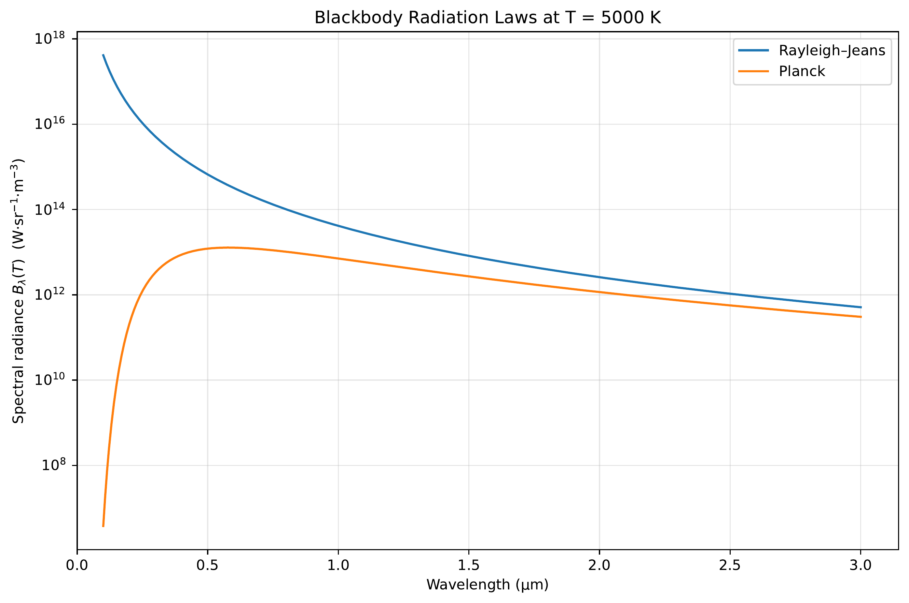{width=100%}
:::
:::

## Planck's Radiation Law

Average energy per mode:

$$\langle E \rangle = \frac{h\nu}{e^{h\nu/kT}-1}$$

Multiply by mode density → **Planck's radiation law**:

$$u(\nu)\,d\nu = \frac{8\pi h \nu^3}{c^3}\frac{1}{e^{h\nu/kT}-1}\,d\nu$$

::: {.fragment}
While Planck originally discretized the energy of wall oscillators, this effectively **quantizes** the electromagnetic field in the cavity.

$\rightarrow$ This marks the **departure from classical physics to quantum mechanics**.
:::

## Wave-Particle Duality of Light — Photoelectric Effect

::: {.columns}
::: {.column width="50%"}
At the start of the 20th century, light was understood as an electromagnetic wave (Maxwell).

However, several experiments revealed a **particle character**:

::: {.incremental}
- **Photoelectric effect**: light immediately ejects electrons from metal
- Kinetic energy depends on *frequency*, not intensity
- Einstein: single photons transmit energy to single electrons: $E_{kin}^{max}=h\nu-W_a$
:::
:::

::: {.column width="50%"}
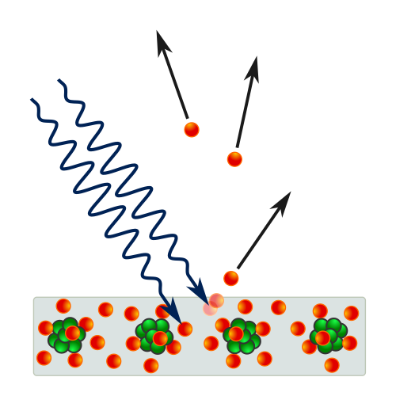{width=100%}
:::
:::

## Wave-Particle Duality of Light — Compton Effect

::: {.columns}
::: {.column width="50%"}
::: {.incremental}
- **Compton effect**: X-rays scattered off electrons emerge with **less energy**
- Behaves as expected if light carries momentum and transfers energy to electrons
- Resembles an **elastic collision** between particles
:::
:::

::: {.column width="50%"}
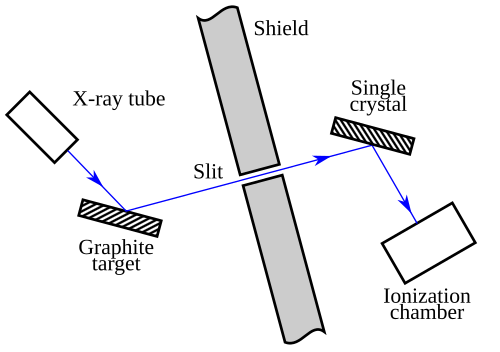{width=100%}

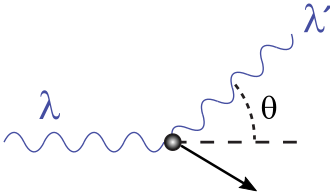{width=100%}
:::
:::

## Taylor's Feeble-Light Double Slit

This experiment sharply exposes the limits of a purely classical picture.

::: {.columns}
::: {.column width="50%"}
### Experimental Setup
::: {.incremental}
- Monochromatic light illuminates **two narrow slits**
- A screen records the intensity behind the slits
- The source intensity is made **extremely small** — ideally emitting single photons
:::
:::

::: {.column width="50%"}
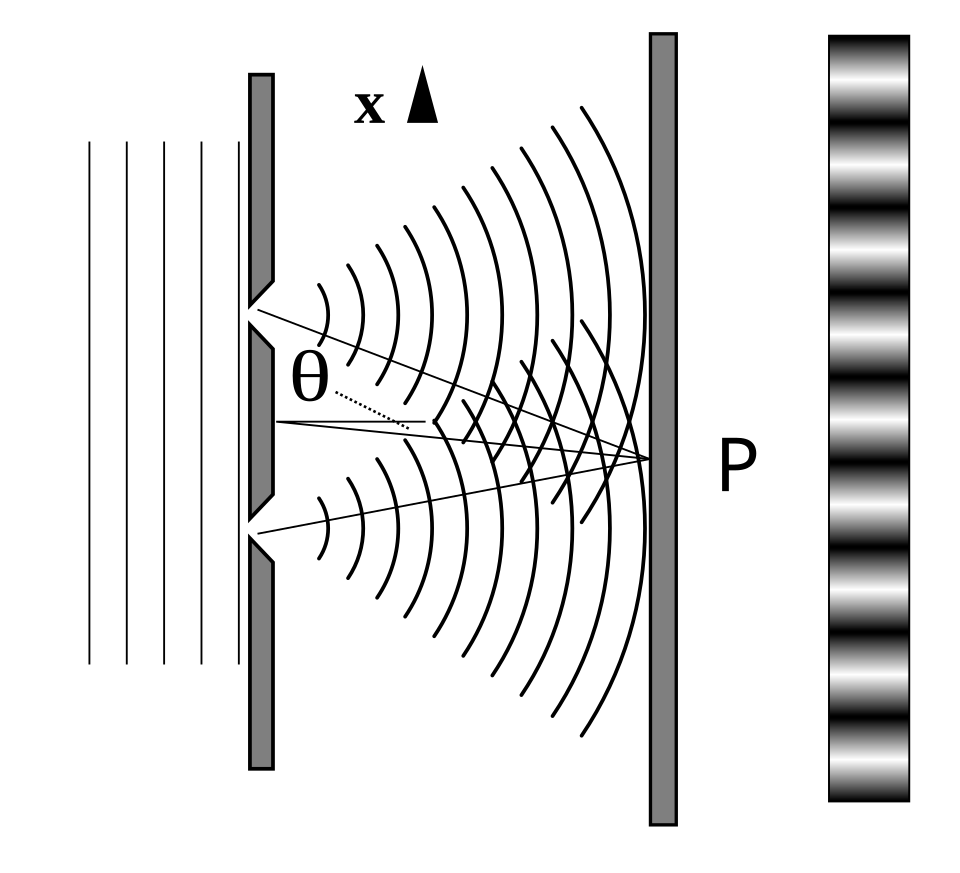{width=100%}
:::
:::

## Taylor's Feeble-Light Double Slit — Observation

::: {.columns}
::: {.column width="50%"}
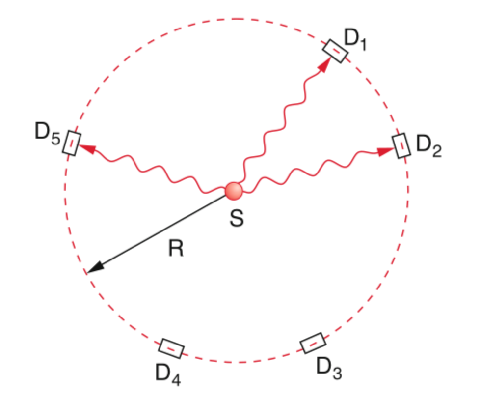{width=100%}
:::

::: {.column width="50%"}
### Observation
::: {.fragment}
Classical wave optics (Huygens' principle) explains the **interference pattern**, but **cannot explain** single, localized detection events.

$\rightarrow$ Light behaves as **both** wave and particle.
:::
:::
:::

# Evolution of the Atomic Model

## Experimental Foundations of Atomic Models

::: {.columns}
::: {.column width="50%"}
### Known experimental facts
::: {.incremental}
- Electrons exist as part of the atom (cathode rays, cloud chamber)
- Atoms are electrically neutral
- Hydrogen spectrum known to high precision (Rydberg)
:::
:::

::: {.column width="50%"}
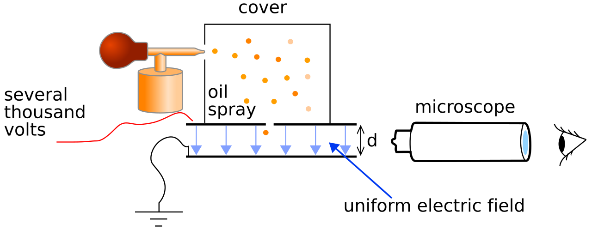{width=100%}
:::
:::

## Thomson's Plum Pudding Model

::: {.columns}
::: {.column width="50%"}
### Thomson's assumptions
::: {.incremental}
- Electrons embedded in a large positive background — like raisins in plum pudding
- Electrons maximize separation due to Coulomb repulsion
- Mass distribution unclear
:::
:::

::: {.column width="50%"}
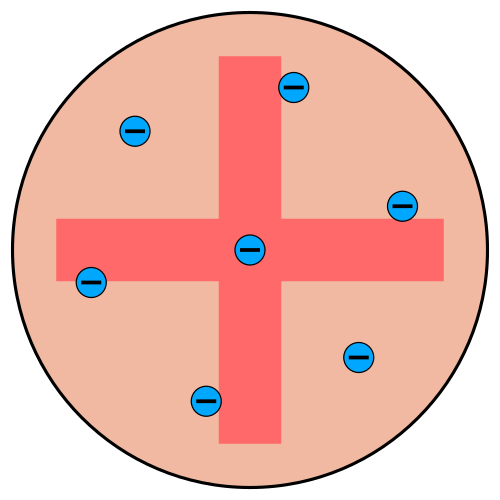{width=100%}
:::
:::

## Rutherford's Scattering Experiment

::: {.columns}
::: {.column width="50%"}
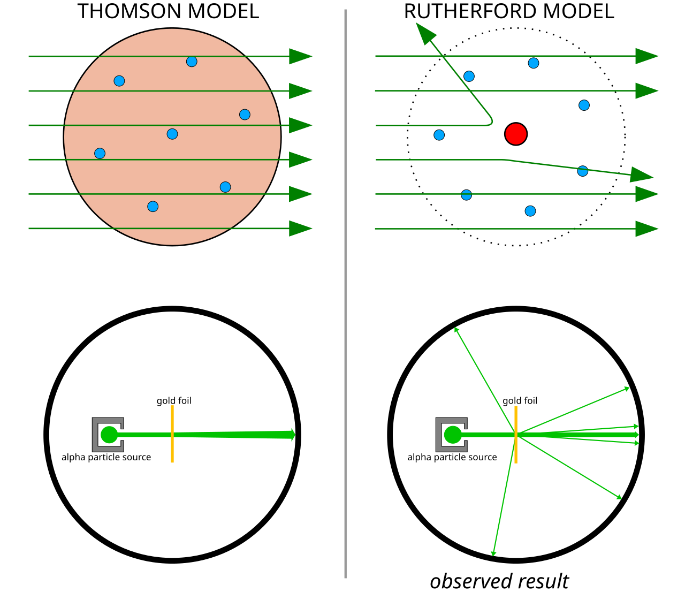{width=100%}
:::

::: {.column width="50%"}
Rutherford's $\alpha$-ray experiments demonstrated:

::: {.incremental}
- Mass concentrated in a **small core**
- Core is **positively charged**
- Electrons orbit the nucleus, repelling each other while attracted to the positive core
:::
:::
:::

## Bohr's Atomic Model

::: {.columns}
::: {.column width="50%"}
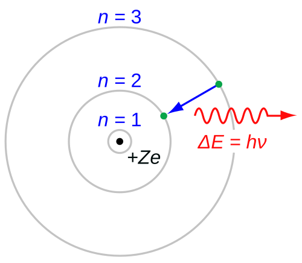{width=100%}
:::

::: {.column width="50%"}
### Bohr's assumptions

::: {.incremental}
1. Atoms cannot absorb/radiate continuous energy → **stable orbits**
2. Electrons obey **Newtonian mechanics**
3. Stable orbits via discretized angular momentum: $m_e v r = n \hbar$
4. Light absorption/emission via **Planck relation** $E=h\nu$
:::
:::
:::

## Criticism of Bohr's Model

::: {.incremental}
- Classical EM: an **accelerating charge** (orbiting electron) must radiate → model is **internally inconsistent**
- Works for hydrogen and hydrogen-like ions, but **fails for multi-electron** atoms
- Angular momentum prediction **wrong**: for $n=1$, measured orbital angular momentum is zero, but Bohr predicts $\hbar$
- Discretization assumptions are *ad hoc* — no fundamental justification
:::

::: {.fragment}
$\rightarrow$ A better theory is urgently needed.
:::

## De Broglie's Postulate — Matter Waves

**De Broglie postulate:** matter also behaves like waves with wavelength

$$\lambda_{dB} = \frac{h}{|\boldsymbol{p}|}$$

De Broglie reinterpreted Bohr's stable orbits as **standing waves**:

$$n \lambda_{dB} = 2 \pi r$$

## De Broglie & Bohr's Angular Momentum

For an orbiting electron with velocity $v$:

$$n \frac{h}{m_e v} = 2 \pi r$$

Rearranging for angular momentum $l = m_e v r$:

$$l  = n \frac{h}{2 \pi}$$

::: {.fragment}
Elegant, but **not a conclusive proof**. It also did not fix the major inconsistencies of Bohr's model, including the incorrect angular momentum for $n=1$.
:::

## Davisson-Germer Experiment — Setup

::: {.columns}
::: {.column width="50%"}
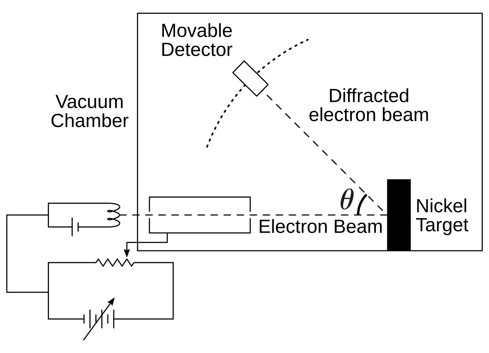{width=100%}
:::

::: {.column width="50%"}
::: {.incremental}
- Davisson & Germer investigated **elastic backscattering** of electrons on nickel surfaces
- Electron beam directed **perpendicular** to crystal surface in vacuum
- By accident (oxidation + annealing), they created **large monocrystalline** areas on the surface
:::
:::
:::

## Davisson-Germer — Results

::: {.columns}
::: {.column width="50%"}
![Observed diffraction patterns [@davisson1927scattering]](images/experiments/Davisson–Germer_experiment-1.png){width=100%}
:::

::: {.column width="50%"}
### Experimental findings
::: {.incremental}
- Clear **diffraction patterns** analogous to X-ray scattering
- Wavelength and kinetic energy followed **exactly** de Broglie's prediction
- $\rightarrow$ **Matter waves are real!**
:::
:::
:::

## Stern-Gerlach — The Discovery of Electron Spin

](images/experiments/Stern-Gerlach-1.png){width=70%}

## Stern-Gerlach — Setup and Prediction

### Experimental Setup
::: {.incremental}
- Oven evaporates silver atoms (single valence electron)
- Beam focused through two screens
- Beam traverses **inhomogeneous magnetic field** $\boldsymbol{B}$
- Atoms with magnetic dipole $\boldsymbol{\mu}_m$ experience force: $\boldsymbol{F} = -\boldsymbol{\mu}_m \cdot \nabla(\boldsymbol{B})$
:::

## Stern-Gerlach — Result

::: {.columns}
::: {.column width="50%"}
### Classical prediction
A **continuous strip** — dipole can point in any direction

### Observation
Silver atoms localize in **exactly two spots**

::: {.fragment}
$\rightarrow$ Angular momentum is **quantized**, and a new intrinsic quantum number — **spin** — exists.

This cannot be explained by any classical model.
:::
:::

::: {.column width="50%"}
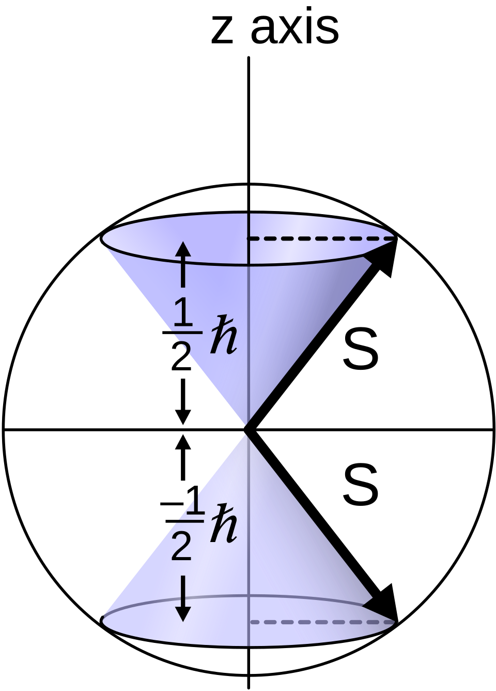{width=100%}
:::
:::

# Quantum Mechanics

## Schrödinger's Motivation

::: {.incremental}
- Bohr's model gave the correct hydrogen spectrum but was **logically inconsistent**
- De Broglie's matter-wave hypothesis suggested particles should be described by **wave phenomena**
- Schrödinger sought an equation analogous to classical wave equations, but adapted to mechanical systems
- **Goal:** obtain discrete atomic energy levels as **eigenvalues** of a continuous wave problem
:::

## The Time-Independent Schrödinger Equation

He postulated a stationary wave equation with an eigenvalue problem and external potential:

$$-\frac{\hbar^2}{2m}\Delta \psi + V(\mathbf{r})\psi = E\psi$$

For the hydrogen atom with Coulomb potential $V(r)=-e^2/r$:

$$\Delta \psi + \frac{2m_e}{\hbar^2}\left(E+\frac{e^2}{r}\right)\psi = 0$$

## The Laplacian in Spherical Coordinates

$\Delta = \nabla^2$ in spherical coordinates:

$$\Delta = \frac{1}{r^2}\frac{\partial}{\partial r}\left(r^2\frac{\partial}{\partial r}\right) - \frac{\hat{L}^2(\theta,\phi)}{\hbar^2 r^2}$$

where the angular momentum operator is

$$\hat{L}^2 = -\hbar^2\left[ \frac{1}{\sin\theta}\frac{\partial}{\partial\theta}\left(\sin\theta\,\frac{\partial}{\partial\theta}\right) + \frac{1}{\sin^2\theta}\frac{\partial^2}{\partial\phi^2}\right]$$

## Hydrogen Atom — Separation of Variables

The Schrödinger equation becomes:

$$\left[\frac{1}{r^2}\frac{\partial}{\partial r}\left(r^2\frac{\partial}{\partial r}\right) - \frac{\hat{L}^2}{\hbar^2 r^2} + \frac{2m_e}{\hbar^2}\left(E+\frac{e^2}{r}\right)\right]\psi = 0$$

Use the **separable ansatz**:

$$\psi(r,\theta,\phi)=R(r)\,\Theta(\theta)\,\Phi(\phi)$$

## Separated Equations

Dividing by $R\Theta\Phi$ yields three independent ODEs with separation constants $A, B$:

$$\frac{d}{dr}\left(r^2\frac{dR}{dr}\right) + \left(\frac{2m_er^2}{\hbar^2}\left(E+\frac{e^2}{r}\right) - A\right)R = 0$$

$$\frac{1}{\sin\theta}\frac{d}{d\theta}\left(\sin\theta\,\frac{d\Theta}{d\theta}\right) + \left(A - \frac{B}{\sin^2\theta}\right)\Theta = 0$$

$$\Phi^{-1} \frac{\partial^2 \Phi}{\partial \phi^2} + B = 0$$

## Solution Constraints

Solutions are found by requiring:

::: {.incremental}
1. **Finiteness** — wavefunctions must not diverge
2. **Periodicity** — $\Phi(\phi)=\Phi(\phi+2\pi)$
3. **Square integrability** — $\int |\psi|^2 dV < \infty$
:::

## Solutions — Radial and Angular Parts

$$R_{n\ell}(r) = N_{n\ell}\, e^{-r/(na_0)}\left(\frac{2r}{na_0}\right)^\ell L_{n-\ell-1}^{2\ell+1}\!\left(\frac{2r}{na_0}\right)$$

with $n=1,2,3,\dots$ and $\ell=0,1,\dots,n-1$

$$\Theta_{\ell m}(\theta) = N_{\ell m}\,P_\ell^{m}(\cos\theta), \quad A=\ell(\ell+1), \quad |m|\le \ell$$

$$\Phi_m(\phi) = \frac{1}{\sqrt{2\pi}}e^{im\phi}, \quad B=m^2, \quad m\in\mathbb{Z}$$

where $a_0 = \hbar^2/(m_e e^2)$ is the **Bohr radius**.

## The Complete Wavefunction

$L_{n-\ell-1}^{2\ell+1}$ is the generalized **Laguerre polynomial** and $P_\ell^{m}$ the **Legendre polynomial**.

The complete wavefunction:

$$\psi_{n\ell m}(r,\theta,\phi)=R_{n\ell}(r)\,\Theta_{\ell m}(\theta)\,\Phi_m(\phi)$$

::: {.fragment}
The solutions contain undetermined normalization constants $N_{n\ell}$ and $N_{\ell m}$.

Schrödinger fixed these by demanding:

$$\int_{\mathbb{R}^3} \psi^2\, dV=1$$

At this stage, this simply fixed the arbitrary scale of the eigenfunctions.
:::

## The Hydrogen Energy Spectrum

Solving the radial equation yields the energy spectrum:

$$E_n=-\frac{m_e e^4}{2\hbar^2 n^2}, \qquad n=1,2,3,\dots$$

::: {.fragment}
This agrees with:

- **Rydberg's formula** [@rydberg1889investigations]
- Bohr's earlier expression

But now as the consequence of a **consistent wave-mechanical eigenvalue problem** — not *ad hoc* assumptions!

$n$ is the **principal quantum number** — familiar from basic chemistry.
:::

## Born's Interpretation

Schrödinger was not fully satisfied: his normalization was a convention without solid justification, and he had only presented the stationary case.

::: {.fragment}
**Max Born** provided the elegant interpretation:

- The wavefunction itself is **not directly observable**
- Its modulus squared $|\psi(\mathbf{x})|^2$ gives the **probability density** for finding the electron at point $\mathbf{x}$
:::

::: {.fragment}
The normalization condition

$$\int_{\mathbb{R}^3} |\psi(\mathbf{r})|^2\, dV = 1$$

acquires the physical meaning: the particle must be found **somewhere** with total probability one.

This is the **Born interpretation**.
:::

# Postulates and Formalism of QM

## Bra-Ket Notation

In QM we use **Bra-Ket notation** (Dirac notation) for states, inner products, and operators:

::: {.incremental}
- A QM state: $\psi = |\psi\rangle$ (the "ket")
- Its complex conjugate: $\psi^{*}$
- Its conjugate transpose (adjoint): $\langle \psi|$ (the "bra")
:::

::: {.fragment}
The **inner product** between two states $|\psi(x)\rangle$ and $|\phi(x)\rangle$:

$$\langle\phi|\psi\rangle = \int_{-\infty}^{\infty} \phi^{\dagger}\, \psi\, dx$$
:::

## Postulate 1 — The Quantum State

A **quantum-mechanical state** is described by its wavefunction $|\psi\rangle$ in a complex **Hilbert space** $\mathcal{H}$.

A Hilbert space is a vector space with a scalar product and completeness of the associated norm.

::: {.fragment}
### In plain English

::: {.incremental}
- We need a **vector space** because QM is a wave theory — both amplitude *and* phase determine behavior
- We need a **well-behaved scalar product** — we can always compute it and it converges
- Both are necessary for **Born's interpretation** to work
:::
:::

## Postulate 2 — Observables and Operators

**Measurable quantities** (observables) are associated with **Hermitian operators** (notated $\hat{}$).

To measure observable $A$, solve the eigenvalue problem:

$$\hat{A}\, \phi_A = A\, \phi_A$$

with eigenstate $\phi_A$ and eigenvalue $A$.

::: {.fragment}
For $A$ to be a valid observable, $\hat{A}$ must be **Hermitian**: $A^{\dagger} = A$

This guarantees **real eigenvalues** — measurement outcomes must be real numbers.
:::

::: {.fragment}
The most important operator: the **Hamiltonian**

$$\hat{H}\, \psi = E\, \psi$$
:::

## Postulate 3 — Measurement Outcomes

The result of a measurement can **only** be one of the **eigenvalues** of the operator associated with the measured quantity.

::: {.fragment}
If we want to measure observable $A$, we apply operator $\hat{A}$:

$$\hat{A}\,\psi = a\,\psi$$

The possible outcomes are the eigenvalues $\{a_1, a_2, a_3, \dots\}$.
:::

## Postulate 4 — Measurement Probability

The **probability** of obtaining eigenvalue $a_n$ when measuring $\hat{A}$ on state $|\psi\rangle$ is:

$$P(a_n) = |\langle \phi_{a_n} | \psi \rangle|^2$$

where $|\phi_{a_n}\rangle$ is the eigenstate corresponding to $a_n$.

::: {.fragment}
This connects directly to Born's interpretation — probabilities arise from the **squared modulus** of the inner product.
:::

## Digression: Heisenberg's Matrix Mechanics

::: {.incremental}
- Developed independently and nearly simultaneously with Schrödinger's wave mechanics
- Heisenberg formulated QM entirely in terms of **matrices** and **algebraic relations**
- Later shown to be **mathematically equivalent** to Schrödinger's approach
- Both are representations of the same underlying Hilbert space structure
:::

## Unit 1 — Key Takeaways

::: {.incremental}
- Classical physics fails at atomic scales: blackbody radiation, photoelectric effect, atomic spectra
- **Planck** introduced energy quantization $E = nh\nu$ — the birth of quantum mechanics
- **Light** exhibits wave-particle duality (double slit, Compton effect)
- **Matter** also exhibits wave behavior (de Broglie, Davisson-Germer)
- **Bohr's model** gave correct spectra but was logically inconsistent
- **Schrödinger** unified these insights into a consistent eigenvalue problem
- **Born's interpretation**: $|\psi|^2$ is a probability density
- **Stern-Gerlach** revealed quantized angular momentum and spin
- QM is built on postulates: Hilbert space, Hermitian operators, measurement probabilities
:::

## References

::: {#refs}
:::
