## 01. Title + course role in program

::: {.incremental}
- Materials Genomics operationalizes discovery as a data-driven design process.
- Unit 1 builds conceptual scaffolding for later representation and modeling units.
:::

## 02. What “genomics” means (and what it does NOT mean)

::: {.incremental}
- Analogy: map compositional/structural diversity to property phenotypes.
- Not literal biology transfer; it is an organizational discovery metaphor.
:::

::: aside
@sandfeld_materials_data_science
:::

## 03. Learning outcomes Unit 1

::: {.incremental}
- Define design-space thinking and discovery-loop logic.
- Diagnose bias/leakage risks before model comparison.
:::

## 04. Discovery bottleneck in classical materials workflows

::: {.incremental}
- Classical trial-and-error is too slow for large combinatorial spaces.
- Data-driven prioritization reduces expensive experimental/DFT evaluations.
:::

```{mermaid}
%%| echo: false
%%| fig-align: center
graph LR
    %% Styling
    classDef default fill:#f8fafc,stroke:#cbd5e1,stroke-width:2px,color:#334155,rx:8px,ry:8px,font-family:Inter;
    classDef accent fill:#e0f2fe,stroke:#38bdf8,stroke-width:2px,color:#0f172a,rx:8px,ry:8px,font-family:Inter,font-weight:600;
    linkStyle default stroke:#94a3b8,stroke-width:2px;

    A[Design / Theory]:::accent --> B[Synthesis / Simulation]:::accent
    B --> C[Characterization / Testing]:::accent
    C --> D[Data Analysis / ML]:::accent
    D --> A
```


## Where to Find Data? {.larger}

 
- **Manual collection** – go through papers, extract data and tabulate (*takes time*)
- **Accelerated collection** – use of natural language processing (*requires model and workflow*)
- **Pre-built databases** – excellent when they exist in your area (*may require access fees*)
- **Automated experiments** – generate your own data over a given parameter space (*expensive*)
 

## Data Extraction from the Literature

Leverage the vast literature of published papers

 
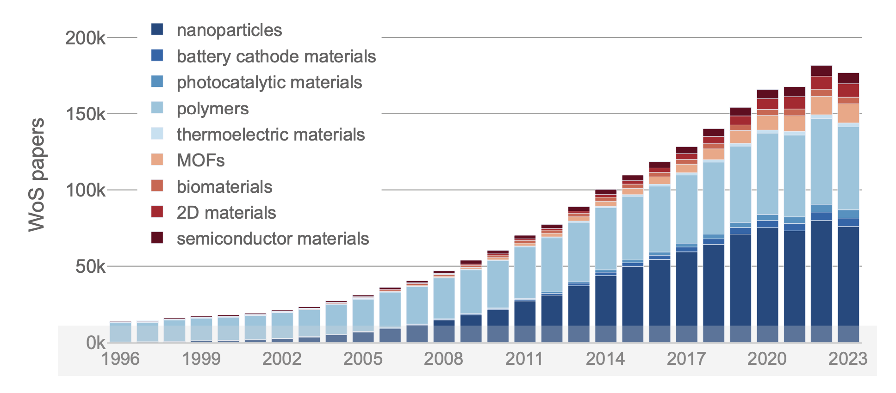{width=80%}
 

::: aside
M. Schilling-Wilhelmi et al, Chem. Soc. Rev. 54, 1125 (2025)
:::

## Data Extraction from the Literature

Many tailored workflows are available based on regular expressions and/or statistical models

 
[NLP/LLM Data Extraction Workflow: Preprocessing -> LLM interaction -> Postprocessing](01_img/Lecture3_p12_img00.png){width=80%}!
 

 
Examples include:

- [https://github.com/mcs07/ChemDataExtractor](https://github.com/mcs07/ChemDataExtractor)
- [https://github.com/CederGroupHub/text-mined-synthesis_public](https://github.com/CederGroupHub/text-mined-synthesis_public)
 

::: aside
M. Schilling-Wilhelmi et al, Chem. Soc. Rev. 54, 1125 (2025)
:::

## Why Share Data? {.huge}

::: {.incremental}
- **Reproducibility** – allow direct comparison with published literature beyond static tables and figures, e.g. raw spectra and diffraction patterns  
- **Reuse** – facilitate meta-studies comparing results from multiple experiments, e.g. variation in UV-vis spectra for different samples  
- **Statistical models** – power of machine learning depends on the quantity, quality, and diversity of training data  
:::

## Common Forms of Data Sharing

::: {.incremental}
- **Supporting information with publications** – often in the form of static pdf files (*increasingly obsolete*)
- **Data repositories** – most institutions offer data upload portals, but often lack guidelines and metadata, e.g. zip or tar files
- **Community-specific repositories** – best option if available, usually in a common format and searchable, with error detection
:::

## FAIR Data Standards

::: {.incremental}
- **Findable:** discoverable by humans & machines with metadata & persistent identifiers (e.g. DOI)
- **Accessible:** archived in long-term storage with clear access terms (e.g. CC open license)
- **Interoperable:** exchangeable between different applications and systems using open file formats
- **Reusable:** well documented and curated with clear terms and conditions on usage
:::
::: {.columns}
::: {.column width="25%"}
**Findable**


:::
::: {.column width="25%"}
**Accessible**


:::
::: {.column width="25%"}
**Interoperable**


:::
::: {.column width="25%"}
**Reusable**

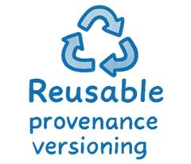
:::
:::
::: aside
https://www.howtofair.dk/what-is-fair
:::

## Data Security

Not all databases are public, e.g. companies and academic-industrial collaborations.

::: {.incremental}
- **Privacy:** protection of personal data
  - *e.g. General Data Protection Regulation (GDPR)*
- **Encryption:** protocols for storage and transfer
  - *e.g. public key encryption, hashing*
- **Access control:** limiting users or computers
  - *e.g. passwords, firewalls*
- **Data integrity:** avoid corruption or modification
  - *e.g. data provenance tracking, regular versioning*
:::

## 05. Data-rich turn in materials science

::: {.incremental}
- Digitization of simulation and instrumentation created reusable data assets.
- Opportunity comes with data governance and quality burdens.
:::
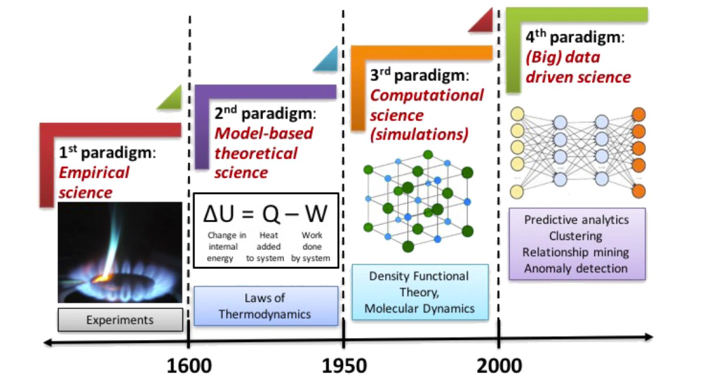{width=75%}

## Crystallography in the Lead

::: {.columns}
::: {.column width="50%"}
**Community Databases**

**Cambridge Structural Database**  
**(from 1960)**

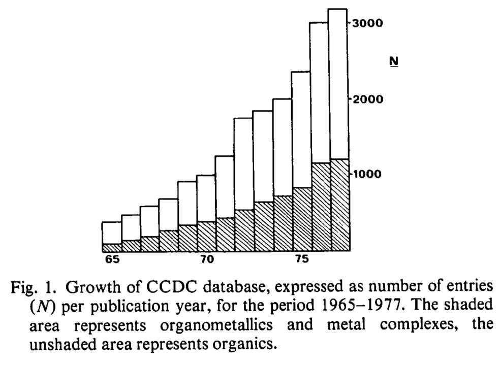
:::

::: {.column width="50%"}
**Standard Format**

**[Human]{.underline} and [Machine]{.underline} Readable**

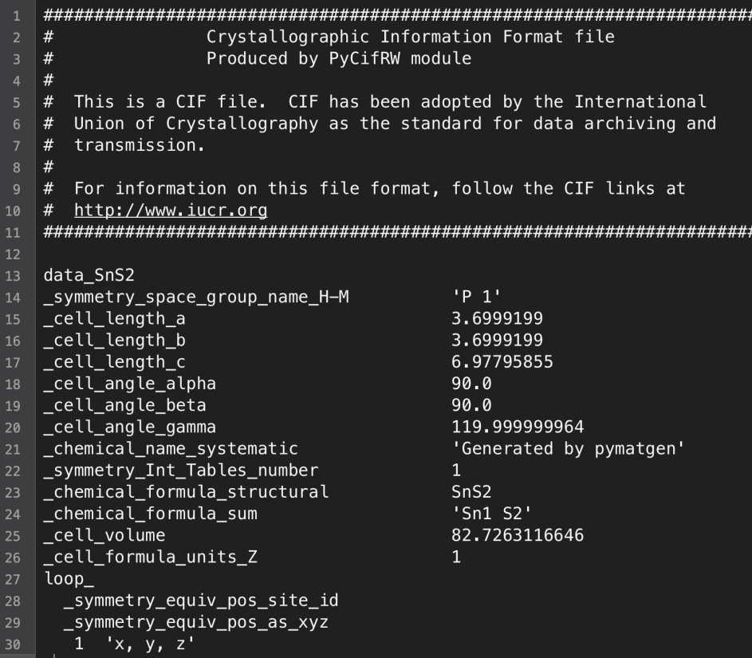
:::
:::

::: aside
https://www.ccdc.cam.ac.uk and https://checkcif.iucr.org
:::

## Crystallography in the Lead

 
- Compound composition, unit cell dimensions and symmetry
- Data collection and refinement information 
- Atom coordinates
- Atomic displacement parameters

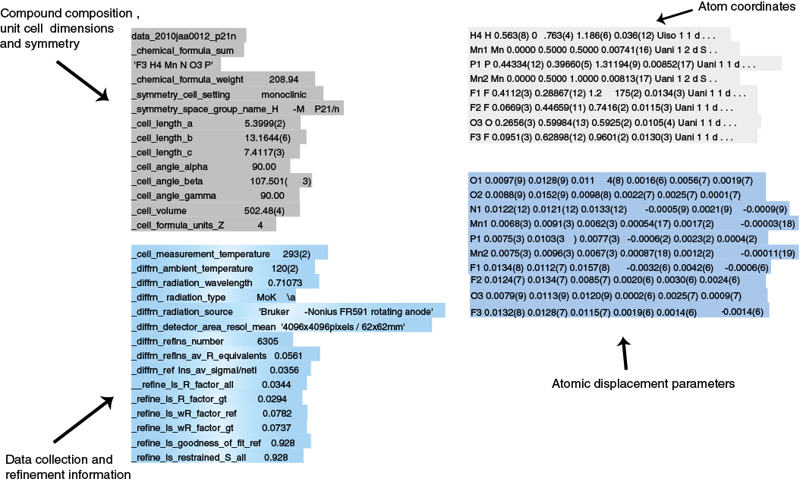
 
 


 
 

::: aside
https://www.ccdc.cam.ac.uk and https://checkcif.iucr.org
:::

## Crystallography in the Lead

Many open-source programs for cif visualisation  
(including Miller indices, diffraction patterns...)

::: {.columns}
::: {.column width="50%"}
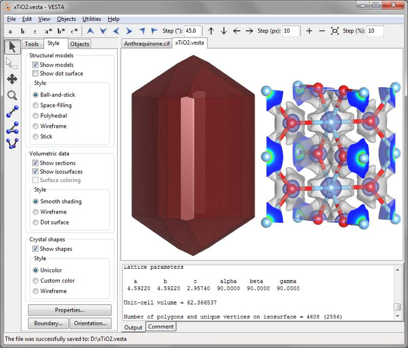{width=100%}
:::
::: {.column width="50%"}
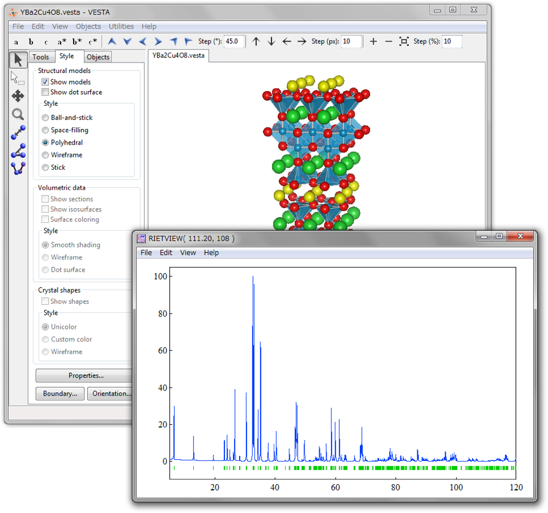{width=100%}
:::
:::

::: aside
VESTA structure visualisation tool: https://jp-minerals.org/vesta/en/
:::

## Example: General Repository

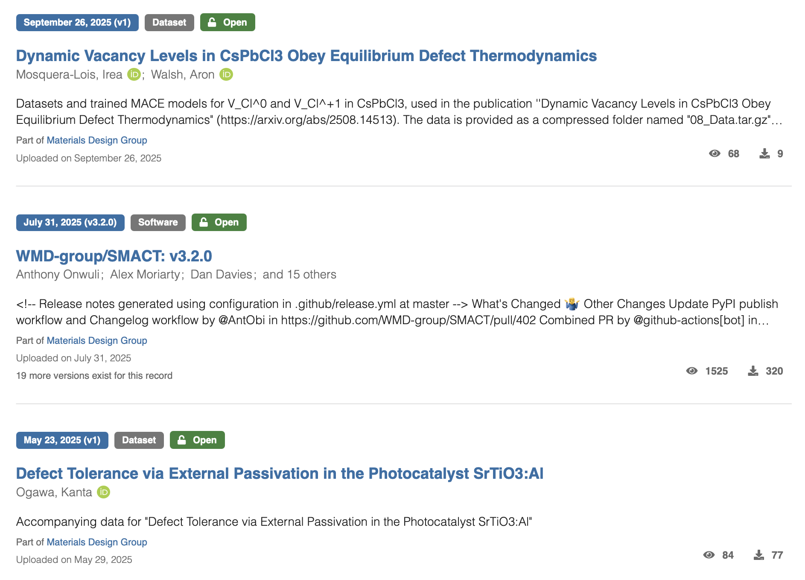{width=60%}

::: aside
EU Open Research Repository: https://zenodo.org
:::

## Example: Community Repository

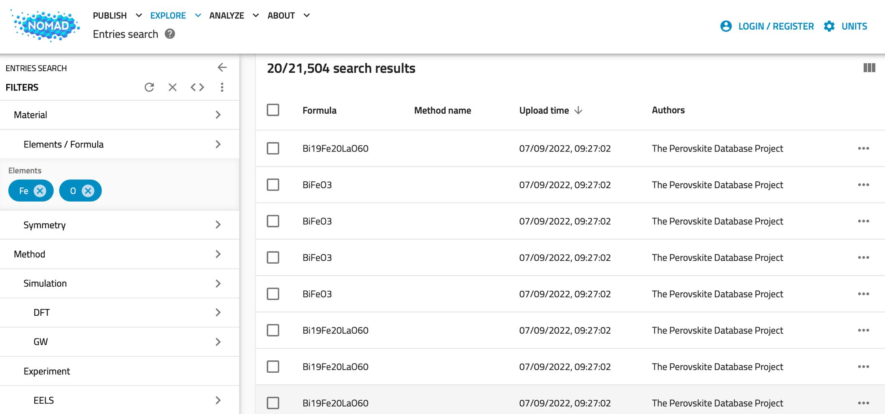{width=100%}

::: aside
https://nomad-lab.eu/nomad-lab
:::

## Example: Curated Repository

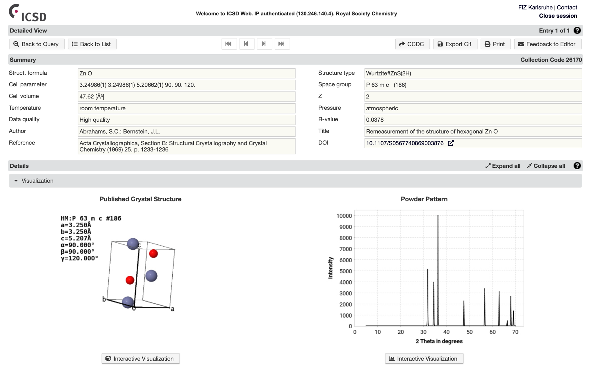{width=70%}

::: aside
Physical Sciences Data Service on https://psds.ac.uk
:::

## Example: Materials Modeling

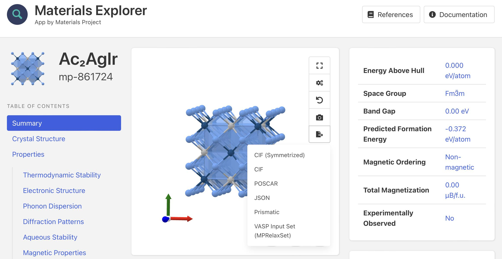{width=70%}

::: aside
https://materialsproject.org
:::

## Example: Microscopy

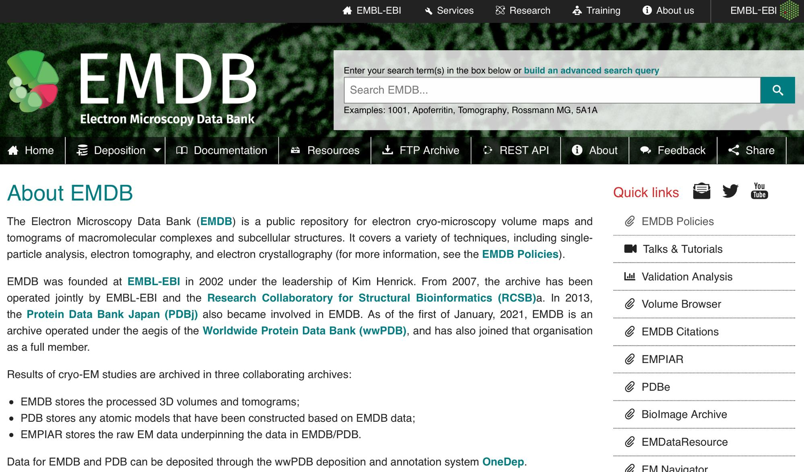{width=70%}

::: aside
https://www.ebi.ac.uk/emdb/about
:::

## 06. Where this course connects to MFML and ML-PC

::: {.incremental}
- MFML supplies formal risk/validation language.
- ML-PC supplies experimental-data cautionary patterns complementary to MG.
:::

## 07. 90-minute roadmap

::: {.incremental}
- Motivation -> data assets -> representation assumptions -> validity -> exercise bridge.
- Focus on scientific reliability, not benchmark chasing.
:::

## 08. Checkpoint prompt: “Where does ML add value here?”

::: {.incremental}
- Ask where ML is additive versus redundant to existing pipelines.
- Force explicit statement of decision target and cost.
:::

::: aside
@neuer2024machine
:::

## 09. Periodic table + structure space as searchable manifold

::: {.incremental}
- Treat composition+structure space as high-dimensional manifold.
- Search requires representations that preserve relevant invariances.
:::

## 10. PSPP graph for materials discovery

::: {.columns}
::: {.column width="50%"}
::: {.incremental}
- **P**rocessing
- **S**tructure
- **P**roperties
- **P**erformance
:::
:::

::: {.column width="50%"}
::: {.incremental}
- Discovery links these four pillars.
- MG emphasizes structure/property edges and candidate ranking.
:::
:::
:::

```{mermaid}
%%| echo: false
%%| fig-align: center
graph LR
    %% Styling
    classDef default fill:#f8fafc,stroke:#cbd5e1,stroke-width:2px,color:#334155,rx:8px,ry:8px,font-family:Inter;
    classDef primary fill:#fef08a,stroke:#eab308,stroke-width:2px,color:#422006,rx:12px,ry:12px,font-weight:bold,font-family:Inter;
    classDef secondary fill:#dcfce7,stroke:#22c55e,stroke-width:2px,color:#052e16,rx:8px,ry:8px,font-family:Inter,font-weight:bold;
    linkStyle default stroke:#94a3b8,stroke-width:2px;

    P[Processing]:::secondary --> S[Structure]:::primary
    S --> Pr[Properties]:::primary
    Pr --> Pe[Performance]:::primary
    Pe --> S
    Pr --> P
```

## 11. Targets: formation energy, stability, bandgap, moduli, etc.

::: {.incremental}
- Common targets: formation energy, hull distance, bandgap, moduli.
- Target semantics determine feasible model and metric choices.
:::

## 12. Direct simulation vs surrogate modeling

::: {.columns}
::: {.column width="50%"}
### Direct Simulation
::: {.incremental}
- High fidelity
- Physical anchoring
- High cost (Time/Compute)
:::
:::

::: {.column width="50%"}
### Surrogate Modeling
::: {.incremental}
- Data-driven approximation
- Massive throughput gains
- Best for screening/optimization
:::
:::
:::

::: {.incremental}
- Best practice: active loop with high-fidelity validation of top candidates.
:::

## 13. Screening logic: rank then validate

::: {.incremental}
- Rank by expected utility, not only predicted mean.
- Incorporate uncertainty to avoid overconfident exploitation.
:::

## 14. Why uncertainty is required for candidate prioritization

::: {.incremental}
- Without uncertainty, candidate prioritization is fragile under shift.
- Use uncertainty for exploration-exploitation balance.
:::

## 15. Domain knowledge constraints

::: {.incremental}
- Charge neutrality, stability, symmetry act as hard/soft constraints.
- Constraints reduce implausible regions and improve sample efficiency.
:::

## 16. First-principles + data-driven hybrid strategy

::: {.incremental}
- Combine first-principles computations with learned surrogates.
- Hybrid loops enable rapid hypothesis generation with physical anchoring.
:::

## 17. Micro-case: when pure data fit fails physically

::: {.incremental}
- Show failure where model learns dataset origin instead of chemistry.
- Use this to motivate robust split design.
:::

 ## 18. Database landscape (MP, OQMD, AFLOW, NOMAD)

- Materials Project, OQMD, AFLOW, NOMAD differ in scope/provenance.
- Document source and version for reproducible claims.

```{mermaid}
%%| echo: false
%%| fig-align: center
graph TD
    %% Styling
    classDef root fill:#f1f5f9,stroke:#94a3b8,stroke-width:2px,color:#0f172a,rx:8px,ry:8px,font-weight:bold,font-size:18px,font-family:Inter;
    classDef category fill:#e0f2fe,stroke:#38bdf8,stroke-width:2px,color:#0f172a,rx:8px,ry:8px,font-weight:bold,font-family:Inter;
    classDef item fill:#ffffff,stroke:#cbd5e1,stroke-width:2px,color:#334155,rx:8px,ry:8px,font-family:Inter;
    linkStyle default stroke:#94a3b8,stroke-width:2px;

    A[Materials Databases]:::root --> B[DFT-based]:::category
    A --> C[Curation / Aggregation]:::category
    B --> D[Materials Project]:::item
    B --> E[OQMD]:::item
    B --> F[AFLOW]:::item
    C --> G[NOMAD]:::item
    C --> H[Optimade]:::item
```

::: aside
@sandfeld_materials_data_science
::: 


## 19. What each database gives / misses

- Databases provide broad coverage but uneven labels and metadata quality.
- Absence patterns are informative and can induce bias.

## 20. Data object types: composition, structure, process metadata

- Inputs include composition vectors, crystal graphs, process metadata.
- Different object types imply different model classes.

## 21. Thermodynamic quantities used in ML datasets

- Formation energy and hull distance are central for stability-aware tasks.
- Clarify units and reference states before modeling.

## 22. Representation problem statement

- Representation must encode invariance/equivariance requirements.
- Poor representation can dominate model error.

## 23. Classical descriptors vs learned representations (preview)

- Classical descriptors are interpretable but may saturate performance.
- Learned representations can capture nonlinear interactions.

## 24. Symmetry and invariance constraints

- Permutation, rotational, and lattice symmetries must be respected.
- Violation causes data inefficiency and spurious patterns.

## 25. Data quality dimensions

- Assess completeness, consistency, uncertainty, and provenance.
- Quality gates should be explicit before training.

## 26. Metadata and provenance importance

- Track workflow origin, method settings, and preprocessing steps.
- Provenance enables debugging and scientific trust.

## 27. Dataset shift across generation pipelines

- Shift arises across computational settings, labs, and synthesis protocols.
- Evaluate robustness with split strategies reflecting deployment.

## 28. Bias map: coverage, publication, synthesis bias

- Coverage and publication biases distort apparent performance.
- Report limitations with subgroup diagnostics.

## 29. Leakage map in materials datasets

- Family-level and polymorph-level leakage are common pitfalls.
- Use grouped splits by composition/structure families.

## 30. Recap: data assumptions that must be explicit

- State assumptions explicitly: target definition, split logic, and uncertainty handling.
- Assumptions are part of the model.

## 31. Task formulations in MG

- MG uses regression, classification, and ranking depending on decision stage.
- Task choice should mirror downstream screening action.

::: aside
@murphy2012machine; @bishop2006pattern
:::

## 32. Regression baseline + error interpretation

- Start with simple baselines for sanity and residual analysis.
- Inspect error heterogeneity across chemical subspaces.

## 33. Classification/ranking formulations for screening

- Classification supports filter stages; ranking supports prioritization.
- Ranking metrics may be more relevant than MSE in screening.

## 34. Train/val/test under compositional grouping

- Random splits overestimate performance under compositional correlation.
- Use grouped/time-aware splits to emulate deployment.

## 35. OOD behavior in chemical space

- Evaluate extrapolation beyond seen chemistry/structure domains.
- OOD uncertainty should increase; if not, treat as warning signal.

## 36. Uncertainty-aware ranking concept

- Select by acquisition criteria combining mean and uncertainty.
- Avoid deterministic top-k overconfident traps.

::: aside
@ryan2021machine
:::

## 37. Exploration vs exploitation (concept only)

- Pure exploitation misses novel regions; pure exploration wastes budget.
- Balance adaptively with uncertainty-aware acquisition.

## 38. Decision rule with uncertainty and cost

- Translate predictions to decisions via explicit utility/cost.
- Document thresholds and rationale.

## 39. Explainability expectations in scientific ML

- Scientific discovery requires interpretable hypotheses, not only scores.
- Use attribution and counterfactual checks cautiously.

::: aside
@neuer2024machine
:::

## 40. Reproducibility checklist for discovery claims

- Share data split definitions, code, model version, and seeds.
- Reproducibility is part of scientific validity.

## 41. Common failure post-mortems

- Analyze false discoveries and missed candidates systematically.
- Turn failures into design rules for next cycle.

## 42. Exercise objective and dataset

- Reproduce a mini discovery pipeline on curated subset.
- End with one defendable recommendation.

## 43. Step 1: query and clean materials table

- Query and clean table; track missingness and units.
- Define train/val/test with leakage safeguards.

## 44. Step 2: feature table v1 (simple descriptors)

- Construct baseline descriptor set and document assumptions.
- Run a simple baseline model before complexity.

## 45. Step 3: baseline model + grouped split

- Evaluate with task-relevant metrics and uncertainty proxy.
- Compare grouped vs random split outcomes.

## 46. Step 4: error and bias diagnosis

- Diagnose one concrete bias artifact and propose mitigation.
- Quantify impact on candidate ranking.

## 47. Step 5: one uncertainty proxy and discussion

- Add uncertainty-aware selection and discuss changed priorities.
- Reflect on risk tolerance in discovery context.

## 48. What to report in notebook (scientific style)

- Include problem statement, split logic, metrics, error analysis, and recommendations.
- Avoid reporting only best score without context.

## 49. Unit summary: 10 exam-relevant statements

::: {.incremental}
- **Materials Genomics** operationalizes discovery as a data-driven design process.
- **Discovery loops** reduce costs by prioritizing candidates before expensive validation.
- **PSPP** (Processing, Structure, Property, Performance) is the central paradigm of discovery.
- **Surrogate models** trade some fidelity for massive throughput gains in screening.
- **Physical constraints** (symmetry, charge) reduce the search space and improve efficiency.
- **Uncertainty quantification** is required to avoid overconfident exploitation.
- **Data leakage** (e.g., polymorphs) is a major risk in materials dataset design.
- **Grouped splits** (e.g., by composition) are necessary to test true generalization.
- **Provenance** is critical for scientific trust and reproducibility of data-driven claims.
- **Decision rules** should explicitly incorporate both model predictions and costs.
:::

## 50. References + reading for Unit 2

- Data science in materials is interdisciplinary and explicitly tied to **domain knowledge** (Sandfeld Ch. 2.1).
- ML is a method family within a broader AI/data-science ecosystem; avoid buzzword conflation (Sandfeld Ch. 2.1; McClarren Ch. 1).
- Model trust requires explainability and uncertainty framing; “black-box by default” is not acceptable for scientific discovery (Neuer Ch. 1.1.2–1.1.3).
- **Lecture**: design-space thinking, dataset caveats, validity criteria, uncertainty-aware decision logic.
- **Exercise**: practical query/build/evaluate loop with one explicit bias diagnosis.
- Sandfeld Ch. 2.1–2.3
- Neuer Ch. 1.1.2–1.1.3
- McClarren Ch. 1.1 + 1.5

::: aside
@neuer2024machine; @sandfeld_materials_data_science; @ryan2021machine; @murphy2012machine; @bishop2006pattern
:::

::: {#refs}
:::
