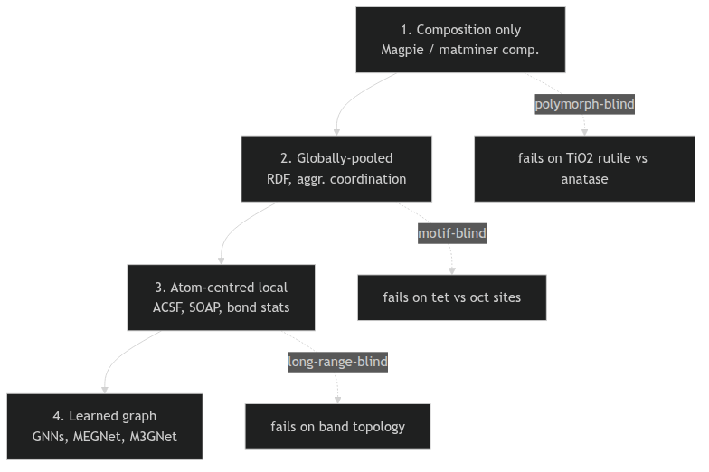
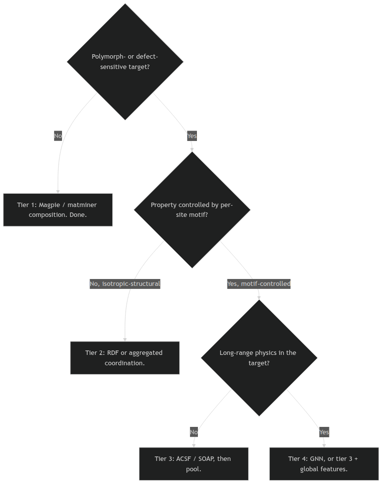
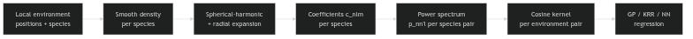

# §0 · Frame {.section}

## 01. Today's question

::: {.columns}
::: {.column width="50%"}
**How do we hand a *crystal* to a regression model?**

- A crystal is positions, species, and a periodic cell — not a vector.
- Some properties are dictated by *what* is in the formula; others by *where* the atoms sit; others still by *who sits next to whom*.
- A representation that ignores any one of these layers will fail on whichever properties depend on that layer.
:::
::: {.column width="50%" .fragment}
**Today's claim.**

- There is a *ladder* of structural descriptors, from formula-only Magpie vectors to atom-centred SOAP / ACSF.
- Climbing the ladder costs computation and interpretability; *not* climbing it costs accuracy on motif-sensitive targets.
- The art of materials-genomics representation is knowing **where on the ladder** a given problem belongs.
:::
:::

::: {.notes}
**Open with the question, not the title.** "So far we have treated crystals as quantum-mechanical objects (W2–3) and as continuum / Monte Carlo systems (W5). Today we ask the most boring possible question — *how do you turn a crystal into a vector* — and discover that the answer is the most consequential design decision in any materials ML pipeline. In two weeks we will see GNNs as the *learned* analogue of today's hand-crafted descriptors."

**Why this lecture exists in the new shape.** As of the SS26 realignment (2026-05-09), Unit 6 absorbs the descriptor families that the old Unit 4 sketched but never delivered: Magpie elemental statistics, the matminer feature library, radial distribution functions, and structure-aggregated coordination summaries. Those tiers are now the *front* of this unit, because every materials-ML student needs to see them *before* reaching for ACSF or SOAP. Roughly half of all "structure-aware" papers in the field would have been better off reporting a Magpie baseline.

**Pacing.** Eight minutes on §0 frame; fourteen on the descriptor ladder (§A); ten on what a local environment *is* (§B); twelve on simple geometric descriptors (§C); eighteen on ACSF and SOAP (§D); ten on pooling (§E); twelve on failure modes (§F); six-minute wrap (§G). Total 90 minutes. If you fall behind, compress §D first — SOAP can be left at the kernel-similarity slide.

**Triad coordination, said aloud.** "Pipeline mechanics — losses, CV, regularisation — are MFML's job. Experimental data quality, leakage, transfer learning — those are ML-PC's job. Today is *materials-specific representation*. Whenever a student asks 'why don't we just do nested CV here?' answer 'go re-watch MFML W3' and move on."

**Anti-hype frame.** SOAP is not magic, ACSF is not magic, and graph nets are not magic. They are all aggregations of the same primitive: who sits near atom *i*, at what distance, with what chemistry. Once you see that, the whole subfield decompresses into a small number of choices. The lecture is engineered to make those choices visible.
:::

## 02. Where we are

::: {.columns}
::: {.column width="50%"}
**Recap — what we already have**

- **Unit 1–4:** quantum mechanics, electronic structure, MD/MC. Atomistic structure is the physics.
- **Unit 5:** Monte Carlo sampling and continuum mechanics — the simulation side of the data pipeline.
- **MFML W5:** clustering & autoencoders — first hint of *learned* representations.
- **ML-PC W2:** PCA / SVD as the linear unsupervised baseline.

**Forward pointer**

- **Unit 7 (in two weeks):** crystals as *graphs* — GNNs as the learned analogue of today's fixed-aggregation descriptors.
:::
::: {.column width="50%"}
**Today — Unit 6 in one line**

- *Hand-engineered* atom-centred descriptors as a complement (and competitor) to learned graph representations.
- Five chunks: **composition baselines, locality discipline, simple geometry, ACSF + SOAP, pooling.**
- Closes with **failure modes** — the difference between pipelines that work and pipelines that publish but don't reproduce.
:::
:::

::: {.notes}
**Position the unit.** Unit 6 is *not* a derivation unit. It is the unit where students learn to *choose* a representation under constraints. The mathematical machinery (Gaussian basis functions, spherical harmonics, kernel similarity) was largely covered in MFML; we use the results.

**Forward pointer to Unit 7.** A graph neural network is, conceptually, a *learned* atom-centred descriptor: it builds a feature on each node by aggregating from neighbours, then aggregates again. ACSF and SOAP do the same thing but with the aggregation *fixed by hand*. Today's lecture sets up the question that next-week-but-one's GNN lecture answers — "what would change if we let the aggregation function be learned end-to-end?"

**Anchor to MFML W5/W9.** Latent spaces in MFML W9 (t-SNE, UMAP, contrastive) are the *learned* analogue of today's *engineered* descriptors. Both produce vectors. The difference is only who designs the function: a chemist (today) or an optimiser (W9). Tell the students to hold those two pictures side by side; they will collide productively in the second half of the semester.

**Anchor to old Unit 4 (the displaced material).** Magpie, matminer, RDF, coordination statistics — those used to be a separate week of "classical descriptors". They are now *§A of this lecture*. The students lose nothing; they gain a unified ladder.

**Forward pointer, said aloud.** "Once we have a vector, Unit 8 stops asking *how do we represent the crystal* and starts asking *can we trust the regression we get from this representation*. Today's choices propagate forward; that is why we spend ninety minutes on a problem that looks, from the outside, like simple feature engineering."
:::

## 03. Learning outcomes

By the end of 90 minutes, you can:

::: {.columns}
::: {.column width="50%"}
::: {.fragment}
1. **Place a problem on the descriptor ladder** — composition, globally-pooled, atom-centred, or learned graph — and justify the choice.
2. **Compute a Magpie / matminer baseline** and report it before any structure-aware model.
3. **Construct a local atomic environment** under periodic boundary conditions, with attention to the cutoff and to invariance.
4. **Distinguish coordination, bond-length, bond-angle, and Voronoi descriptors** by what they preserve and what they discard.
:::
:::
::: {.column width="50%"}
::: {.fragment}
5. **Explain ACSF and SOAP at the operational level** — what each function asks the neighbourhood, why it is invariant, and where the cost sits.
6. **Choose a pooling rule** (mean, histogram, species-resolved) consistent with the scientific mechanism of the target.
7. **Diagnose a descriptor pipeline** for cutoff sensitivity, periodic-image bugs, polymorph aliasing, and long-range physics limits.
8. **Articulate when a local descriptor is the wrong tool** and what to reach for instead.
:::
:::
:::

::: {.notes}
**Frame the exam contract.** Outcomes 1, 2, 7 are exam-weight: they appear in every materials-ML pipeline, and any failure on them is a critical mistake. Outcomes 3, 4, 6, 8 are skill-weight: the exercise tests them, the exam may probe the reasoning. Outcome 5 is comprehension-weight: students need to *recognise* ACSF and SOAP in literature, even if they do not implement them by hand.

**Five "must-know" statements (introduce now, repeat at the end).**

1. Always report a composition-only Magpie baseline before any structure-aware model. If structure cannot beat composition, structure is not the bottleneck.
2. The cutoff $r_c$ is part of the *scientific* model — pick it with chemistry in mind, not by sweeping a grid.
3. Periodic images are not optional; the first audit on any local-descriptor pipeline is to inspect a few boundary atoms.
4. Pooling encodes a scientific assumption (typical site? rare motif? distribution?). Match the pooling to the mechanism.
5. Local similarity does not imply property similarity — beware polymorph and framework aliasing.

**Tell them about outcome 8.** "Knowing when *not* to use a local descriptor is more valuable than knowing how to compute one. Band topology, charge transport, elastic anisotropy — these resist purely local treatment. We will return to that boundary in §F."

**Forward link to MFML W9.** Outcome 1's notion of a "baseline" connects to MFML's bias-variance discussion. Outcome 7 connects to ML-PC's leakage and out-of-distribution material. Both will be re-emphasised in Unit 8 next week.
:::

# §A · The descriptor ladder {.section}

## 04. The descriptor ladder 

::: {.columns}
::: {.column width="40%"}
**Four tiers of structural descriptor**

1. **Composition only** — Magpie / matminer composition statistics. Formula in, vector out. No structure used.
2. **Globally-pooled structural** — RDF, partial RDF, structure-aggregated coordination. Uses positions, averages over the cell.
3. **Atom-centred local** — ACSF, SOAP, bond geometry. One vector per site, then pooled.
4. **Learned graph** — GNNs (Unit 7). The aggregation itself is learned.
::: 
::: {.column width="60%"}
{fig-align="center" height="800px"}
:::
:::

::: {.notes}
**The single picture for the lecture.** Every other slide today either climbs this ladder or warns about a rung. Put it on the board now and refer back to it every fifteen minutes.

**The economic argument for the ladder.** Each rung up adds expressive power and computational cost. Composition takes microseconds per material; atom-centred descriptors take milliseconds; GNN training takes hours. If your problem can be solved at rung 1, solving it at rung 4 wastes resources, obscures interpretation, and probably overfits.

**The scientific argument for the ladder.** Each rung also encodes a stronger *assumption* about what determines the property. Composition assumes elements alone matter; globally-pooled adds isotropic structure; atom-centred adds per-site motifs; graph adds learned relational structure. The right rung is the one whose assumption matches the physics of the target.

**War story.** A 2023 study compared Magpie + random forest against a state-of-the-art GNN on the Materials Project formation-energy task. The Magpie baseline reached within 5–10% of the GNN's mean error and trained in seconds. *That* is the value of reporting tier-1 baselines: it tells you whether structure is doing real work or whether you have been admiring a regression on the formula vector.

**Cross-reference.** Tier 4 was Unit 7's whole topic. Tier 3 is today's main content. Tier 2 is §A's structural-baseline material. Tier 1 is §A's compositional-baseline material. Lecturer note: *do not* let students conflate "structure-aware" with "tier 3+". Tier 2 is also structure-aware; it just pools differently.
:::

## 05. Tier 1 — Magpie elemental statistics [@ward2016magpie]

::: {.columns}
::: {.column width="50%"}
**The construction**

- Take the chemical formula; for each element, look up per-element properties (atomic number, mass, electronegativity, atomic radius, valence-electron count, group, period, melting point, ionic radii, ...).
- Compute element-wise statistics across the formula:
  - mean, weighted mean, min, max, range, standard deviation.
- Concatenate into a fixed-length vector (≈ 40–60 numbers for typical setups).
:::
::: {.column width="50%"}
**Worked example: $\mathrm{Li}_x \mathrm{Ni}_y \mathrm{Co}_z \mathrm{Mn}_w \mathrm{O}_2$**

- Stoichiometric weights $\{x, y, z, w, 2\}$.
- For each per-element scalar (e.g. electronegativity), report `{wmean, wstd, range, max, min}`.
- The output is the same shape regardless of how many elements the formula has.
- **Cheap, interpretable, scale-invariant** — a baseline you can compute on a laptop in milliseconds.
:::
:::

::: {.notes}
**The point of Magpie.** Materials chemistry is, to first order, *additive in element identity*. A vector that summarises element properties weighted by stoichiometry captures a remarkable amount of that first-order structure. [@ward2016magpie] is the canonical reference and the original reason "Magpie" features got a name.

**The hidden assumption, said aloud.** Magpie assumes that *element identity and stoichiometry* dominate the target. This is a strong assumption. It works embarrassingly well on bulk thermodynamic targets (formation energy, cohesive energy) and surprisingly well on band gap; it falls apart on anything polymorph-sensitive.

**Engineering details that bite students.**

- *Missing properties.* Some elements lack a tabulated value for some property (e.g., electronegativity for noble gases). Decide on an imputation rule *before* computing features — and document it.
- *Categorical features.* Group and period are nominally categorical; treat them as ordinal at your peril. One-hot encoding bloats the vector but avoids spurious order.
- *Stoichiometric weighting.* Weighting by molar fraction is the default; weighting by *number of atoms* and weighting by *mass fraction* are both defensible alternatives, and they give different vectors for the same formula.

**MFML cross-reference.** The "feature engineering" framing here is exactly MFML W2's content. We are not deriving a new algorithm — we are *defining a fixed feature map* and feeding the result into a standard supervised learner.

**Anti-pattern to flag.** "I built a 256-dim Magpie+matminer vector and it underperformed a GNN." The natural follow-up is *was the gap due to structure information or to model capacity?* You answer that by training the GNN on the same Magpie vector and checking that it loses its advantage — exactly what most papers omit.
:::

## 06. Tier 1 — The matminer feature library [@ward2018matminer]

::: {.columns}
::: {.column width="50%"}
**What matminer adds on top of Magpie**

- A *library* of feature generators, each with a clear interface:
  - `ElementProperty` (Magpie itself, plus alternative tables: Deml, Pymatgen, Slater).
  - `OxidationStates`, `IonProperty`, `BandCenter`, `Stoichiometry`.
  - **Structure-aware** generators (when a `Structure` object is supplied): coordination statistics, bond fractions, X-ray diffraction patterns, ...
- Standard-conforming: every featuriser exposes `feature_labels()` and a `featurize(...)` API.
:::
::: {.column width="50%"}
**Why matminer is the tier-1 working tool**

- Reproducibility: papers report a *named featuriser stack*, not bespoke code.
- Composability: `MultipleFeaturizer([...])` stacks generators into one feature matrix.
- Interpretability: feature names like `MagpieData mean Electronegativity` survive into SHAP plots and feature-importance tables.
- Scaling: parallelisation built in; pandas-native.
:::
:::

::: {.notes}
**The historical context.** Before matminer [@ward2018matminer], every materials-ML paper rolled its own Magpie clone in a Jupyter notebook. The library standardised the vocabulary so that "did the authors include `Stoichiometry` features?" became a *checkable* question rather than a forensic exercise. This is why matminer is now the de-facto baseline in the literature — not because the math is novel, but because the discipline is enforced.

**The structure-aware part of matminer.** This is the bridge to tier 2: matminer's structure featurisers (e.g. `SiteStatsFingerprint`, `CrystalNNFingerprint`) average over sites and produce a *globally-pooled* descriptor — exactly the next rung up. We will see those again on slide 09.

**Engineering caveats.**

- *Featuriser drift.* matminer versions occasionally change feature names or default tables; pin the version. Pre-pin, results were not always reproducible across years.
- *NaN propagation.* A single failed featuriser on a single material can NaN an entire row. Strict per-row try/except logic + a NaN-fraction report should be part of every featurisation script.
- *Feature explosion.* The default `ElementProperty.from_preset("magpie")` already gives ~130 features; throw in `Stoichiometry` and `ValenceOrbital` and you are at ~200 before any structure features. Plan for feature selection or strong regularisation downstream.

**Triad note.** Feature stacking with `MultipleFeaturizer` is mechanically identical to scikit-learn `Pipeline` composition — covered in MFML W3. We are not re-teaching that here.

**Forward link.** matminer's `SiteStatsFingerprint` is what we will mean on slide 09 by "structure-aggregated coordination statistics". Concept introduced now; mechanics revealed there.
:::

## 07. Why composition-only is stronger than it should be

::: {.columns}
::: {.column width="50%"}
**The empirical picture**

- On many bulk-property tasks (formation energy, band gap, bulk modulus), Magpie + random forest reaches within ~5–10% of the best structure-aware model.
- For datasets ≲ 10 000 examples, the gap is often *zero*.
- Composition-only models train in seconds and ship in production.
:::
::: {.column width="50%"}
**Why it works**

- Property-determining chemistry is dominated by element identity and stoichiometry; structure is a *refinement*, not a first-order signal.
- Bulk thermodynamic targets are spatially averaged by definition — they integrate over local detail.
- The chemical periodicity that Magpie captures (group, period, valence) carries a lot of the variance in the data.
:::
:::

::: {.fragment}
> **The pedagogical lesson, said aloud:** *every materials-ML project should report a composition-only baseline before any structure-aware model.* If structure cannot beat composition, the bottleneck is the data, the target, or the split — not the representation.
:::

::: {.notes}
**The reproducibility crisis in materials ML, summarised.** Many "we beat the SOTA" claims in the 2018–2022 literature did not include a Magpie baseline. When that baseline is added retroactively, the GNN's lead frequently shrinks from "double-digit improvement" to "noise". This is exactly the same pathology that ML-PC W3 discusses for image-based microstructural ML: a baseline omission inflates the apparent value of complexity.

**Why structure is "second-order" for bulk targets.** Take formation energy. To zeroth order, it is a sum of bond energies; to first order, it depends on bond *types* (element pairs); to second order, it depends on bond *lengths* and *angles*. Magpie captures the zeroth and first orders. Structure adds the second order. For thermodynamic averages, the second order is real but small.

**When composition-only fails (preview of slide 08).** Polymorphs. Defects. Doping. Disorder. Anything that holds the formula fixed and changes the structure breaks composition-only. We will exploit this on slide 08.

**Engineering note.** A composition-only baseline is also the *fastest sanity check* for label noise. If a Magpie + random-forest model cannot even fit the *training* set well, the labels themselves are too noisy; no representation will save you. This is the cheapest "is the dataset learnable" diagnostic in the field.

**Forward to Unit 8.** Unit 8 will reframe the baseline question as part of *split design*: "does the structure-aware model still beat composition under chemistry-disjoint splits?" Often, the gap shrinks further. Today: report the baseline. Next week: stress-test it.
:::

## 08. Where composition-only fails

::: {.columns}
::: {.column width="50%"}
**Polymorph blindness**

- $\mathrm{TiO}_2$ exists as **rutile** (tetragonal, $E_g \approx 3.0\,\mathrm{eV}$), **anatase** (tetragonal, $E_g \approx 3.2\,\mathrm{eV}$), and **brookite** (orthorhombic).
- All three share the formula $\mathrm{TiO}_2$; their Magpie vectors are *identical*.
- A composition-only model cannot resolve which polymorph a sample is.
:::
::: {.column width="50%"}
**Defects, doping, disorder**

- Pristine vs vacancy-rich $\mathrm{Li}_x\mathrm{CoO}_2$: same formula range, very different ionic-conductivity behaviour.
- Ordered vs disordered alloys: same composition, different mixing entropy and band structure.
- Composition collapses all of these to a single point.
:::
:::

::: {.fragment}
> **Decision rule.** If the science depends on *which* polymorph, *which* defect, or *how* an alloy is ordered — composition alone is the wrong tool. Climb the ladder.
:::

::: {.notes}
**The TiO$_2$ example is the classical teaching case.** Rutile, anatase, brookite — same formula, ~10% spread in band gap, completely different photocatalytic and dielectric behaviour. A 2-line tasking exercise: hand a student two rows of a CSV with formula `TiO2` and band gap `3.0` vs `3.2`, and ask their model to distinguish them. Composition-only models *cannot*; they predict the average and call it a day.

**Why this matters scientifically.** Most of the materials we *care* about for technology are exactly the polymorph-, defect-, or order-sensitive cases. Battery cathodes, catalysts, structural alloys, photovoltaics — all live in regimes where structure-at-fixed-composition is the science. Composition-only descriptors are powerful for *screening*, weak for *discovery* of structure-property relationships at fixed composition.

**Anti-pattern.** "I added structure features and accuracy didn't improve, so structure doesn't matter for my problem." Wrong inference. *Did the dataset contain polymorphs of the same formula?* If not, the comparison is degenerate; you measured the structure features on materials whose structure was already implied by their formula.

**A subtler failure: reduced formulas.** $\mathrm{LiFePO}_4$ and $\mathrm{Li}_2\mathrm{Fe}_2\mathrm{P}_2\mathrm{O}_8$ are the same compound; a careless featuriser that treats the latter as a new formula doubles the dimensionality of the chemistry axis. Always reduce formulas before featurisation. matminer does this by default; bespoke pipelines often forget.

**Forward link to §F.** This is the first of three *aliasing* failure modes we will track through the lecture: composition aliasing (now), motif aliasing (slide 47), polymorph aliasing in local descriptors (slide 49). Different rungs of the ladder, same disease.
:::

## 09. Tier 2 — Radial distribution functions

::: {.columns}
::: {.column width="50%"}
**The total RDF $g(r)$**

- Probability of finding *any* atom at distance $r$ from a reference atom, normalised by an ideal-gas reference:
$$
g(r) = \frac{V}{N^2}\,\Big\langle \sum_{i \neq j} \delta(r - r_{ij}) \Big\rangle.
$$
- Captures isotropic structure: peak positions = coordination shells, peak widths = thermal / static disorder.
:::
::: {.column width="50%"}
**The partial RDF $g_{AB}(r)$**

- Restrict the pair to species $A$ and $B$:
$$
g_{AB}(r) \propto \big\langle \sum_{i \in A,\, j \in B,\, i \neq j} \delta(r - r_{ij}) \big\rangle.
$$
- Recovers chemistry that the total RDF and Magpie vectors lose.
- For an $n$-element compound: $\binom{n+1}{2}$ partial RDFs.
:::
:::

::: {.notes}
**The pedagogical role of the RDF.** It is the simplest *structural* descriptor that is not just "list the positions". It uses positions, but pools them — over reference atoms, over orientations, often over time if you are coming from MD. It is the descriptor that the diffraction community has been using for a hundred years; the materials-ML community rediscovered it as a feature.

**What the RDF preserves.** Coordination *shells* (peak positions ↔ characteristic neighbour distances), coordination *numbers* (peak integrals ↔ shell occupancy), and *disorder* (peak widths ↔ thermal + static spread). All of this is rotationally invariant by construction — you average over orientations.

**What the RDF discards.** Angular information (it integrates over angles). Per-site information (it averages over reference atoms). Long-range orientational order (g(r) of a glass and a polycrystal can look similar). If the angular arrangement of neighbours is the science, the RDF is the wrong tool.

**Engineering details.**

- *Cutoff and binning.* You cannot evaluate $g(r)$ at infinity. Common defaults: bin width 0.05 Å, max distance 10–12 Å. Both are scientific choices that affect downstream features.
- *Normalisation.* The "ideal gas" reference $V/N^2$ removes the trivial scaling with density. Without it, denser materials look RDF-different even with identical local order.
- *Featurisation.* For ML, $g(r)$ is usually evaluated on a fixed grid and the bin values become features. matminer's `RadialDistributionFunction` does exactly this; the resulting vector has dimension `n_bins`.

**Connection to experiment.** Total-scattering measurements (PDF analysis, neutron scattering) deliver $g(r)$ *directly*; this descriptor connects ML representations to a specific experimental observable. Worth saying aloud — it makes the descriptor scientifically grounded rather than arbitrary.

**Cross-reference to Unit 4.** MD simulations naturally produce RDFs at finite temperature; that is one way the simulation pipeline of Unit 4 feeds the descriptor pipeline of Unit 6.
:::

## 09b. The RDF is an *experimental observable* — PDF analysis & neutron total scattering

::: {.columns}
::: {.column width="50%"}
**PDF analysis: structure factor ↔ $g(r)$**

- A diffraction experiment measures the **total scattering structure factor** $S(Q)$ — *Bragg + diffuse, in one shot*.
- A sine Fourier transform gives the **pair distribution function** $G(r)$ — *the experimentally-measured RDF*:
$$
G(r) = \frac{2}{\pi}\!\int_0^{\infty}\! Q\,[S(Q)-1]\sin(Qr)\,\mathrm{d}Q.
$$
- Peaks = neighbour shells, widths = disorder — exactly the $g(r)$ of slide 09, now an observable [@keen2020total].

![Liquid Hg: structure factor $S(s)$ (a) and its PDF $W(r)$ (b) — the Fourier-transform pair [@keen2020total].](images/keen2020_total_scattering_pdf.png){width="100%"}
:::
::: {.column width="50%"}
**Neutrons measure it *directly***

- Neutrons scatter from **nuclei** → flat form factor (large $Q_{\max}$ → sharp $r$-resolution), **isotope/light-element contrast**, no electronic falloff.
- Total scattering at spallation sources captures Bragg **and** diffuse → a *snapshot* of the **local** structure, not just the average crystal.
- Refine with **reverse Monte Carlo / big-box** modelling to recover an atomistic ensemble consistent with the measured $G(r)$ [@dove2022neutronpdf].

![ScF$_3$ neutron PDF $D(r)$, experiment vs RMC, 10–1100 K — local structure across the negative-thermal-expansion regime [@dove2022neutronpdf].](images/dove2022_scf3_neutron_pdf.jpg){width="62%"}
:::
:::

::: {.callout-note}
The Tier-2 RDF descriptor is **not arbitrary**: it is a quantity you can *measure*. Models trained on simulated $g(r)$ can be validated against an experimental PDF, and experimental PDFs can be featurised on the same grid.
:::

::: {.notes}
**Why this slide exists.** Slide 09 ended on the throwaway line "total-scattering / neutron PDF delivers $g(r)$ directly." This slide cashes that cheque — it is the single point in the descriptor ladder where an ML feature coincides *exactly* with a century-old experimental observable. Make the epistemic point explicitly: most descriptors on this ladder are conveniences we invented; the RDF is one nature lets us *measure*. That is rare and worth thirty seconds of emphasis.

**The Fourier-pair, on the board.** $S(Q)$ lives in reciprocal space (what the detector sees), $G(r)$ in real space (what the chemist wants). They are a sine-Fourier-transform pair — show the liquid-Hg figure (Keen 2020, redrawn from the classic measurement): the oscillatory $S(s)$ on the left, its transform $W(r)$ on the right with the first peak = nearest-neighbour distance. Stress "**total** scattering" = Bragg **plus** diffuse: conventional crystallography throws the diffuse part away and so is blind to local disorder; total scattering keeps it, which is why the PDF sees the *local* structure that an average crystal structure misses.

**Why neutrons specifically (the "directly" in the prompt).** Three reasons, say all three: (1) neutrons scatter off *nuclei*, so the scattering length is $Q$-independent — no electronic form-factor falloff — allowing very high $Q_{\max}$ at spallation sources (GEM/POLARIS at ISIS, NOMAD at SNS) and hence sharp real-space resolution; (2) isotopic substitution gives *element- and even isotope-resolved* partials — the experimental analogue of the partial $g_{AB}(r)$ on slide 09; (3) neutrons see light atoms (H, Li, O) that X-rays barely register — decisive for hydrides, Li battery materials, oxides. The ScF$_3$ example (Dove & Li 2022) is the money figure: a *crystalline* material whose *average* structure is boring cubic, but whose neutron PDF, fit by RMC across 10–1100 K, exposes the correlated F-atom motion behind its famous negative thermal expansion. Average structure: nothing. Local structure (PDF): the whole story.

**The ML payload — connect it forward and back.** Back to slide 09: the bin-vector featurisation of $g(r)$ is now doubly motivated — it is both a simulation-derivable descriptor *and* a measurable spectrum, so a model trained on MD/simulated PDFs (Unit 4 pipeline) can be *validated* against, or *fine-tuned* on, experimental PDFs without changing the feature definition. Forward: RMC/big-box modelling is itself an inverse problem — measured $G(r)$ → atomistic ensemble — a natural lead-in to the inverse-design and uncertainty units. Mention that "PDF-in-the-loop" autonomous diffraction beamlines now close this loop experimentally.

**Anti-patterns / what students get wrong.** (1) Truncation ripples: a finite $Q_{\max}$ produces spurious oscillations and broadened peaks in $G(r)$ — the dotted low-$r$ region in the figure is unphysical, not data. (2) Confusing $S(Q)$ normalisation conventions ($S$, $F$, $i$, $E$ — every community uses different symbols; Keen 2020 is the Rosetta stone, cite it for the bewildered). (3) Treating the PDF as "the structure" — it is a 1-D orientationally-averaged projection; many 3-D structures share a PDF (the same degeneracy as the RDF on slide 09, now with experimental noise on top).

**Pacing.** ~3 minutes. The Fourier-pair idea and "Bragg + diffuse = local structure, neutrons measure it directly" are the two takeaways; the ScF$_3$ figure is the *wow*. If short on time, keep the left column and the callout, narrate the right column from the figure.
:::

## 10. Tier 2 — Structure-aggregated coordination [@ward2017voronoi]

::: {.columns}
::: {.column width="50%"}
**The descriptors**

- Per-element-pair coordination number, averaged over sites: $\langle N_{AB} \rangle$.
- Bond-length statistics per pair: $\langle r_{AB} \rangle$, $\sigma_{r_{AB}}$.
- Bond-angle moments per triplet: mean angle, variance, skewness.
- matminer: `SiteStatsFingerprint`, `BondFractions`, `CrystalNNFingerprint`.
:::
::: {.column width="50%"}
**What this rung gains over the RDF**

- Species-resolved by construction (the partial RDF is the integral; this is the moment summary).
- Dimensionally compact: a few moments per pair, not a histogram.
- Easier to feed into linear/tree-based models; no large `n_bins` axis.

**What it still discards**

- Per-site identity (it averages over sites, like the RDF).
- Higher-order angular correlations beyond the moment summary.
:::
:::

::: {.notes}
**The point of this rung.** It is a *finite-dimensional* compression of the partial RDF plus angular information, kept compatible with classical regressors. For datasets of a few thousand materials, this rung often hits the sweet spot between expressivity and dimensionality.

**A practical recipe ([@ward2017voronoi], "Voronoi-fingerprint" baseline).** For each site: get Voronoi neighbours (slide 26), compute coordination number, mean bond length, bond-length variance, mean and variance of solid angles. Aggregate over sites: mean and variance of each per-site quantity across the structure. Result: a fixed-length vector ~50 features long that encodes globally-pooled local geometry.

**Why this baseline still gets ignored.** Two cultural reasons. (1) Materials-ML papers love novelty; reporting a 2017 baseline does not get into NeurIPS. (2) Practitioners conflate "structure-aware" with "atom-centred", missing that *structure-aggregated* descriptors are also structure-aware, just at a different scale.

**Engineering caveats.**

- *Voronoi vs cutoff.* matminer's `SiteStatsFingerprint` has multiple `near_neighbours` strategies. The choice (`CrystalNN`, `VoronoiNN`, `MinimumDistanceNN`) changes which neighbours are counted, and downstream feature values shift. Pick one strategy and document it.
- *Disordered occupations.* For solid solutions and partial occupancies, the per-element-pair statistics may include "fractional bonds" depending on the strategy. Verify with a worked example before trusting the feature column.

**Forward to §C.** All of the per-site quantities here will reappear on slides 22–25 as *atom-centred* features — same formula, different aggregation. Tier 2 is "average across sites first"; tier 3 is "keep per-site then pool later". The order of operations matters more than students expect.

**Cross-reference to Unit 7.** Tier 2 is the closest hand-built analogue to a one-layer GNN: aggregate from neighbours, then pool the aggregations. The difference is that the GNN learns the aggregation function, and tier 2 fixes it as "compute these moments".
:::

## 11. Why we now go *local* — the motif argument

::: {.columns}
::: {.column width="50%"}
**The recurring failure mode of tiers 1 and 2**

- A target controlled by a *minority motif* (defects, dopant sites, surface terminations, intercalation sites).
- Tiers 1 and 2 average that motif away — its signal becomes a small perturbation to a large mean.
- A model trained on tier 1/2 features therefore *cannot* see the motif, no matter how much capacity you add.
:::
::: {.column width="50%"}
**The motif argument**

- A *local* descriptor is computed at each atomic site, then optionally pooled.
- Pooling is a *choice*, not a default: you can keep the distribution.
- A defect site stops being a perturbation to the mean and becomes a tail of the descriptor distribution.
- *That* is what makes locality earn its keep.
:::
:::

::: {.fragment}
> **The right question to ask of any descriptor:** *if the property of interest depends on a motif present at 1% of sites, does the descriptor preserve the 1% motif, or average it into the 99%?* Tiers 1–2 average; tier 3 preserves.
:::

::: {.notes}
**The defect example, drawn out.** Imagine a battery cathode where a small fraction of Li sites have a vacancy. The vacancy locally stretches bonds and reduces coordination. *If* the property of interest is ionic conductivity, that vacancy is the dominant feature; the bulk Li environment is irrelevant background. Tiers 1 and 2 give you a feature dominated by the bulk environment with a tiny perturbation from the vacancy; tier 3 (with appropriate pooling, slide 39) gives you a feature distribution where the vacancy site is a clearly distinct cluster.

**The catalysis example.** A heterogeneous catalyst's activity often depends on a single coordination-deficient site at a step edge — possibly less than 0.1% of all sites in the supercell. Composition-only descriptors are utterly blind to this; even tier-2 globally-pooled descriptors are nearly blind. Tier-3 atom-centred descriptors with histogram pooling (slide 40) finally let the rare site contribute as more than rounding error.

**The narrative arc.** This slide is the explicit *transition* between the absorbed old-U4 material and the original U6 content. Tier 1 is a baseline. Tier 2 is also a baseline, slightly more powerful. Tier 3 is the rest of the lecture. Make the transition visible: "from here on, every descriptor is computed *per atom*."

**Pedagogical anchor.** This is the same intellectual move as in MFML W9: when the global mean of a representation is dominated by a majority cluster, you need *local* (per-point or per-region) statistics to surface minority structure. Identical principle, applied to crystals.

**Anti-pattern to flag.** Building a tier-3 atom-centred descriptor and then *mean-pooling* it before regression. That throws away the very minority-motif information you climbed the ladder for. Pooling is a science choice; we will spend §E on it.
:::

## 12. The ladder, restated as a decision tree

{fig-align="center"}

::: {.notes}
**Use this slide as the lecture's reference card.** Every subsequent slide answers "what does this rung do, and how do you know when it is the right rung?" The decision tree is approximate — real problems have multiple targets and ambiguous physics — but it disciplines the choice.

**The interpretation of each branch.**

- *Polymorph- or defect-sensitive?* If no, structure adds nothing the formula doesn't already capture. Report Magpie + matminer composition features and *be done*. Most bulk-thermodynamic screening tasks land here.
- *Per-site motif?* If the motif is global and isotropic (e.g., density, average coordination), tier-2 RDF / aggregated coordination is enough. If a per-site motif drives the target, you must keep per-site information.
- *Long-range physics?* If the target depends on band dispersion, magnetic ordering across many lattice constants, or transport pathways, even a perfect tier-3 descriptor undersells. Either supplement with global features or move to tier 4 GNNs.

**A common student misreading.** "I have a polymorph-sensitive target, so I need ACSF/SOAP." Not necessarily — tier 2 (partial RDF, aggregated coordination) is *polymorph-aware*. The harder threshold is *motif-controlled*: if a *small subset of sites* dominates the target, you need tier 3.

**A common practitioner shortcut.** Run tiers 1, 2, and 3 in parallel and report all three baselines. Inspection of the gaps tells you what you have. If tier 3 beats tier 2 by a large margin, locality matters; if tier 2 beats tier 1 by a small margin, structure barely matters. This is exactly the diagnostic that materials-ML papers would benefit from publishing.

**Forward link.** §B redefines what a "local environment" *is*; §C–D give the tier-3 toolkit; §E gives the pooling vocabulary; §F catalogues the failure modes that are unique to tier 3. Bookmark this slide.
:::

# §B · What is a local atomic environment {.section}

## 13. Definition: the local environment of atom $i$

::: {.columns}
::: {.column width="50%"}
**The objects we keep**

For atom $i$ at position $\mathbf{r}_i$ with species $Z_i$:

- the central species $Z_i$,
- the neighbouring species $\{Z_j\}_{j \in \mathcal{N}(i)}$,
- the relative positions $\{\mathbf{r}_j - \mathbf{r}_i\}_{j \in \mathcal{N}(i)}$,
- and (optionally) angles $\theta_{jik}$ between neighbour pairs.

We deliberately *do not* keep the absolute position of $i$ in the cell.
:::
::: {.column width="50%"}
**Two ways to define $\mathcal{N}(i)$**

1. **Radial cutoff:** $\mathcal{N}(i) = \{j : 0 < r_{ij} < r_c\}$. One scalar parameter.
2. **Voronoi tessellation:** $j \in \mathcal{N}(i)$ iff Voronoi cells of $i$ and $j$ share a face (optionally with a face-area threshold). No cutoff parameter, but face-area thresholds reintroduce one.
:::
:::

::: {.notes}
**The definition is the entire foundation of tier 3.** Spend a moment on it. The local environment is *not* the crystal, it is *not* the nearest-neighbour list, it is a structured object: central species, neighbour species, relative positions. Each component matters; dropping any one of them dimensionalises the failure modes we will see in §F.

**Why we drop the absolute position $\mathbf{r}_i$.** Translation invariance — slide 16. Keeping $\mathbf{r}_i$ means the descriptor changes when the crystal is translated, which is physical nonsense. The way to enforce translation invariance is to *only ever use relative positions*.

**The two neighbour definitions, weighed.** Radial cutoff is simple, parameterised by one scalar, and the standard choice for ACSF / SOAP. Voronoi is geometric, adapts to local density, and is the standard choice for matminer's `CrystalNN`. They give different neighbour lists for the same crystal — sometimes meaningfully so (slide 26).

**A subtle definitional point.** Some descriptors (notably SOAP) treat the neighbour list as a *smooth* density rather than a discrete list (slide 33). The radial-cutoff definition becomes a smooth cutoff function instead of an indicator. Same idea, smoother realisation.

**Cross-reference to Unit 7.** Graph neural networks define $\mathcal{N}(i)$ as the graph's edge set; the *graph* is the engineered prior, and the GNN learns aggregations on top. Tier 3 is the same prior, expressed at the descriptor level rather than at the message-passing level.

**Verbal cue.** "From this slide on, every formula is per-atom. When I say 'the descriptor', I mean *the descriptor of one atom*. Pooling to the material happens later — and is its own decision."
:::

## 14. Neighbour construction under a radial cutoff

::: {.columns}
::: {.column width="50%"}
**The formula and the count**

- Indicator definition: $j \in \mathcal{N}_{r_c}(i) \iff 0 < r_{ij} < r_c$.
- Coordination number:
$$
N_i(r_c) = \sum_{j \neq i} \mathbb{1}[r_{ij} < r_c].
$$
- $N_i$ is a step function in $r_c$ — every shell adds a jump.
:::
::: {.column width="50%"}
::: {.fragment}
**Smooth cutoffs**

- A *hard* cutoff is non-differentiable in atomic positions.
- ACSF and SOAP therefore multiply by a smooth window:
$$
f_c(r) = \begin{cases}
\tfrac{1}{2}\left[\cos\!\left(\tfrac{\pi r}{r_c}\right) + 1\right] & r < r_c, \\
0 & r \geq r_c.
\end{cases}
$$
- Smooth cutoffs are *required* for descriptors used in machine-learned interatomic potentials.
:::
:::
:::

::: {.notes}
**The hard-vs-smooth cutoff distinction matters mathematically.** A hard cutoff makes the descriptor a *non-continuous* function of atomic positions: when an atom crosses $r_c$, the descriptor jumps. For regression on properties this is sometimes tolerable; for *forces* (gradients of energy w.r.t. positions), it is fatal. Machine-learned interatomic potentials therefore *always* use smooth cutoffs.

**Choosing $r_c$.** This is the single most consequential preprocessing parameter for tier-3 descriptors. Three competing pressures:

- *Chemistry:* you need to capture at least the first coordination shell, often the second, sometimes the third (e.g., for second-nearest-neighbour magnetism).
- *Computation:* the number of neighbours scales as $r_c^3$; SOAP cost scales worse. Larger $r_c$ rapidly burns budget.
- *Aliasing:* very large $r_c$ blurs short-range chemistry into long-range clutter.

Typical defaults: $r_c \in [4, 8]$ Å for oxides and metals; $r_c \in [3, 5]$ Å for molecular crystals; $r_c$ matching the third shell for magnetic exchange.

**A common student bug.** Forgetting to exclude the central atom itself ($j \neq i$). With self-counting, the coordination is incremented by 1 across the dataset, which biases linear regressors and makes the tree-based ones discover a constant feature.

**Forward to §F.** The cutoff appears as a failure mode at slide 45 (cutoff sensitivity) and slide 46 (transferability across chemistry families with different scales). Bookmark this slide; the smooth cutoff function will reappear inside ACSF on slide 28.
:::

## 15. Periodic images are not optional

::: {.columns}
::: {.column width="50%"}
**The geometry**

- A crystal is described by a fundamental cell + lattice vectors $\{\mathbf{a}_1, \mathbf{a}_2, \mathbf{a}_3\}$.
- Atom $i$ has *images* at $\mathbf{r}_i + n_1 \mathbf{a}_1 + n_2 \mathbf{a}_2 + n_3 \mathbf{a}_3$ for all $\mathbf{n} \in \mathbb{Z}^3$.
- The "true" neighbour list of atom $i$ at the cell *centre* and at the cell *boundary* must be physically equivalent.
:::
::: {.column width="50%"}
::: {.fragment}
**The trap and the fix**

- *Trap:* compute neighbours from atomic coordinates inside the unit cell only; atoms near the boundary acquire fake low coordination.
- *Fix:* enumerate images $(n_1, n_2, n_3)$ within $\mathbf{n}$ such that the image distance $\le r_c$, and include image atoms in the neighbour search.
- Standard tools: ASE `NeighborList`, pymatgen `Structure.get_neighbors`, MDAnalysis `distance_array(box=...)`. Use them.
:::
:::
:::

::: {.fragment}
> **The first audit on any local-descriptor pipeline:** plot the coordination number for ten boundary atoms and ten interior atoms, check that they look chemically equivalent. If they don't, the periodic images are wrong, *not* the descriptor.
:::

::: {.notes}
**The minimum-image convention.** For a single neighbour distance, the minimum-image convention says "use the shortest vector among $\mathbf{r}_{ij} + \mathbf{L}\,\mathbf{n}$ for $\mathbf{n} \in \{-1, 0, 1\}^3$". This works for orthorhombic cells with $r_c < \min(|\mathbf{a}_k|)/2$. It *fails* for triclinic cells and for $r_c$ longer than half the shortest cell vector.

**The general case.** For triclinic cells or large cutoffs, you must enumerate image cells more aggressively. Standard libraries do this; bespoke pipelines often get it subtly wrong on triclinic structures.

**A war story from the field.** A 2019 dataset for solid electrolytes was built with a custom neighbour-list routine that worked for orthorhombic cells but silently broke on monoclinic structures. The resulting Magpie + structure features were correct for half the dataset and corrupted for the other half. The downstream ML "discovered" a pattern that perfectly correlated with crystal system. The bug was found two years later by a re-implementation that never matched the original numbers.

**Why this audit slide is here.** It is one of the slides students will *re-watch* before they debug their first tier-3 pipeline. Make the recipe explicit: pick ten boundary atoms, plot their coordination, compare to interior atoms of the same species. If different, the images are wrong.

**Cross-reference.** ML-PC W3 makes essentially the same point for spectroscopic preprocessing: the first audit is on the data, not the model. Same discipline, different domain.
:::

## 16. Invariance discipline — what a descriptor must respect

A useful local descriptor $\phi(\text{environment of } i)$ must satisfy:

::: {.columns}
::: {.column width="50%"}
::: {.fragment}
- **Translation invariance.** Shift the crystal by any $\mathbf{t}$: $\phi$ unchanged.
- **Rotation invariance (or equivariance).** Rotate by any $R \in SO(3)$: $\phi$ either unchanged (invariant) or transforms predictably (equivariant).
- **Permutation invariance.** Reorder identical neighbours: $\phi$ unchanged.
:::
:::
::: {.column width="50%"}
::: {.fragment}
- **Continuity.** Small displacement $\delta \mathbf{r}_j$: small change $\delta \phi$ — no jumps.
- **Chemical sensitivity.** Replace $Z_j$ with a chemically distinct $Z_j'$: $\phi$ must change.
:::
:::
:::

::: {.fragment}
> **If a descriptor fails any of these, the model learns file conventions or noise instead of physical structure.** Invariance is not pedantry — it is the difference between a descriptor that generalises and a descriptor that overfits to coordinate-system accidents.
:::

::: {.notes}
**Why all five matter, individually.**

- **Translation:** the absolute position of the central atom is a coordinate-system accident. Any descriptor that uses $\mathbf{r}_i$ rather than $\mathbf{r}_j - \mathbf{r}_i$ violates this and treats the same crystal differently depending on where the origin happens to sit.
- **Rotation:** rotating the cell rotates all positions but does not change the chemistry. ACSF and SOAP are *invariant*: they reduce to scalars. Equivariant descriptors (e.g., NequIP, MACE) preserve directional information through rotation in a controlled way — useful for forces, vector targets.
- **Permutation:** if neighbours $j$ and $k$ are the same species at the same distance, swapping their indices in the file should not change the descriptor. Naive concatenation of neighbour positions violates this; sums and histograms do not.
- **Continuity:** a thermal vibration of 0.01 Å should change the descriptor by an amount of order 0.01 (in appropriate units), not by an order-1 jump. Hard cutoffs violate this; smooth cutoffs do not.
- **Chemical sensitivity:** replacing oxygen with sulfur should produce a measurably different descriptor. Pure geometric features (coordination only) violate this; species-resolved features do not.

**Equivariance vs invariance.** Modern equivariant networks (NequIP, MACE, Allegro) preserve directional information through SO(3); their internal features transform like spherical harmonics under rotation, not like scalars. For *scalar* targets, invariance is sufficient. For *vector / tensor* targets (forces, dipoles, elastic constants), equivariance is the correct prior. Today we focus on invariant descriptors; equivariance is the bridge to learned tier-4 representations.

**A diagnostic.** Take a random structure, rotate it by an arbitrary $R$, recompute the descriptor, and check that $\|\phi(\text{rotated}) - \phi(\text{original})\| < 10^{-10}$. If it isn't, your descriptor is rotation-leaking. This test catches more bugs than any unit test on a single structure.

**Cross-reference.** This is exactly what MFML W2 means by "feature engineering encodes a prior". The five invariances are *the* prior for atom-centred descriptors. Without them, the prior is implicit and wrong.
:::

## 17. Why raw Cartesian coordinates are the wrong baseline

::: {.columns}
::: {.column width="50%"}
**Three failures, in one slide**

1. **Origin dependence:** translating the crystal changes every input but no chemistry.
2. **Orientation dependence:** rotating the cell changes every input but no chemistry.
3. **Atom-ordering dependence:** the same crystal written with two atom orderings produces two different inputs.

A regression model fed raw Cartesians has to *learn* all three invariances from the data — which it almost never does cleanly, especially with small materials datasets.
:::
::: {.column width="50%"}
**The "data augmentation will save us" objection**

- Adding rotated copies as augmentation forces the model to *approximately* learn rotation invariance.
- For small datasets, this is wasteful: invariance can be *built in* (descriptor) instead of *fit* (model capacity).
- For *very* large datasets and large models, the augmentation route is increasingly competitive — see equivariant GNNs and end-to-end learned descriptors.
- Today's lecture is about the small-data, hand-built end of the spectrum.
:::
:::

::: {.notes}
**Why this slide is necessary.** A non-trivial fraction of materials-ML newcomers reach for "concatenate (x, y, z) for each atom and feed it to an MLP". It does not work, *and* the failure mode is not obvious from the loss curve. The model learns to memorise the training rotations and orderings; it generalises poorly to anything outside that distribution.

**The deeper point — priors versus data.** Every invariance the descriptor *does not* enforce, the model has to *learn* from data. Each learned invariance costs effective sample size. With ~10 000 materials and a moderate descriptor, you cannot afford to spend half your data teaching the model that rotations don't matter. With ~10 million structures and a transformer, maybe you can.

**The literature reference.** Equivariant networks (Tensor Field Networks, NequIP, MACE, Allegro, eSCN) are the modern alternative: they build SO(3) equivariance into the architecture, recovering the prior at the cost of more complex layers. They are the tier-4 cousins of today's tier-3 invariant descriptors. The trade-off lives on.

**A useful classroom demonstration.** Take the same crystal, rotate it by 30°, and feed both to a vanilla MLP that takes raw Cartesian coordinates. The two predictions can differ by orders of magnitude. Now pass them through a SOAP descriptor and feed *those* to the MLP. The two predictions agree to numerical precision. The audience usually finds this more convincing than any equation.

**Forward link.** Slide 28 (ACSF) and slide 31 (SOAP) are the two principled solutions to the failures listed here. Slide 17 motivates *why* we need them; slides 28+ deliver the construction.

**Cross-reference to Unit 7.** GNNs solve the same three problems by message passing: edges are defined by relative positions, sums over edges are permutation-invariant, and local features are computed in a translation- and rotation-aware way. Different machinery, same principles.
:::

## 18. The local-environment object, fully written out

::: {.columns}
::: {.column width="50%"}
**The mathematical object**

For atom $i$, the *local environment* is the set
$$
\mathcal{E}_i = \{(Z_j,\, \mathbf{r}_j - \mathbf{r}_i) : j \in \mathcal{N}(i)\},
$$
plus the central species $Z_i$ and (optionally) the cell metric.

The descriptor $\phi$ is any function $\mathcal{E}_i \mapsto \mathbb{R}^d$ that respects the five invariances of slide 16.
:::
::: {.column width="50%"}
**The taxonomy of $\phi$**

- **Counting:** coordination number ($d = 1$). Loses geometry.
- **Histograms:** binned bond lengths and angles ($d \approx 50$). Loses higher-order shape.
- **ACSF:** designed radial + angular functions ($d \approx 100\text{–}1000$). Hand-engineered, interpretable.
- **SOAP:** smooth density + spherical-harmonic expansion ($d \approx 500\text{–}5000$). Systematic, expressive.
- **Equivariant features:** vector-/tensor-valued $\phi$, beyond today's scope.
:::
:::

::: {.notes}
**The point of this slide.** Make the local environment a *first-class mathematical object* before introducing specific descriptors. The set $\mathcal{E}_i$ is what every tier-3 descriptor is a function of; we will spend the rest of the lecture comparing different functions.

**Why the empty-set boundary case matters.** If $r_c$ is too small or the structure is too sparse, $\mathcal{N}(i)$ may be empty. The descriptor must still be defined (typically zero, sometimes flagged as missing). Robust pipelines surface a warning when this happens; brittle ones return NaN and crash three steps later.

**Why the cell metric is sometimes included.** For periodic structures, the descriptor of a single atom in isolation is an idealisation. For molecules in vacuum, the cell is irrelevant. For periodic crystals, including the cell metric (e.g., as a 6-vector of lattice parameters) breaks pure locality but adds *just enough* global context to disambiguate polymorphs at the same composition with similar local motifs. Whether to include it is a *design choice*, not a default.

**The dimensionality column on the right.** It tells the same story as the descriptor ladder: each step up adds expressive power and feature dimension. Coordination is one number; SOAP can be thousands of numbers per atom. Pooling (§E) decides how that scales to the material level.

**Cross-reference.** "$\phi : \mathcal{E}_i \mapsto \mathbb{R}^d$" is the language MFML W2 uses for any feature map. We are giving it a concrete domain. The downstream regression / classification logic is identical to anything from MFML W3–W5.

**Forward link.** Slides 19–25 take the simplest functions in this taxonomy (counting, histograms). Slides 28–34 take ACSF and SOAP. Slides 35–40 handle pooling. Slides 43–49 catalogue the failure modes specific to tier-3 descriptors.
:::

## 19. Cutoff radius as a *scientific* hyperparameter

::: {.columns}
::: {.column width="50%"}
**$r_c$ is part of the model**

- $r_c$ too small → first or second coordination shell missing → chemistry truncated.
- $r_c$ too large → expensive, mixes local chemistry with weakly relevant structure.
- $r_c$ chosen to match a *physically meaningful length* (first-shell, second-shell, magnetic exchange, screening length) is most defensible.
:::
::: {.column width="50%"}
**Heuristics, not formulas**

- For metals and metallic glasses: $r_c \approx 6$–$8$ Å covers two coordination shells.
- For oxides: $r_c \approx 5$–$6$ Å covers cation–anion–cation paths.
- For molecular crystals: $r_c \approx 4$–$5$ Å covers nearest molecules.
- *Always* run a sensitivity scan; if results swing wildly with $r_c$, the descriptor is too brittle for the problem.
:::
:::

::: {.notes}
**The slide's central message.** $r_c$ is *not* a knob you sweep blindly — it is a statement about *which length scale you believe controls the property*. Treating it as a tuning hyperparameter (sweep, pick best on validation) gives a number; treating it as a scientific choice gives a *defensible* number.

**The grid-search anti-pattern.** "I swept $r_c \in \{3, 4, 5, 6, 7\}$ Å and picked the one that minimised validation MAE." Almost always wrong. The optimal $r_c$ on a small validation set is dominated by noise, and the answer often has no chemical justification. Worse: it commits you to a $r_c$ that may not transfer to a deployment dataset with different composition.

**The defensible pattern.** Choose $r_c$ from chemistry (first-and-second-shell coverage) and *verify* via sensitivity analysis: does the descriptor change qualitatively when $r_c$ changes by $\pm 1$ Å? If no, the choice is robust. If yes, you are working in a regime where small parameter changes flip the science — usually a sign the data is too sparse for the descriptor.

**Worked numbers.** First coordination shell of fcc Cu: ~2.55 Å. Second shell: ~3.61 Å. Third: ~4.42 Å. A cutoff at 4 Å covers two shells. A cutoff at 6 Å adds the third and a bit of the fourth. For most bulk-property tasks, 6 Å is overkill but safe; 4 Å is sharper but riskier on systems with second-shell physics.

**Cross-reference.** Slide 14 (radial cutoff definition) introduces $r_c$ mechanically; slide 28 (ACSF) requires $r_c$ in the cutoff function $f_c$; slide 45 (failure mode) returns to cutoff sensitivity. This slide is the *central decision*; the others are the consequences.
:::

# §C · Simple geometric local descriptors {.section}

## 20. Coordination number — the simplest summary

::: {.columns}
::: {.column width="50%"}
**Per-atom coordination**

$$
N_i(r_c) = \sum_{j \neq i} \mathbb{1}[r_{ij} < r_c].
$$

- One scalar per atom: cheap, interpretable.
- Resolves the most common motif families:
  - $N_i = 4$: tetrahedral, square-planar.
  - $N_i = 6$: octahedral, trigonal-prismatic.
  - $N_i = 8, 12$: cubic, fcc-/hcp-close-packed.
:::
::: {.column width="50%"}
**Species-resolved coordination**

$$
N_{i, A}(r_c) = \sum_{j \neq i,\, Z_j = A} \mathbb{1}[r_{ij} < r_c].
$$

- One scalar per atom *per species* — adds chemistry.
- For an oxide cation: $N_{i, \mathrm{O}}$ separates octahedral $\mathrm{Co}\mathrm{O}_6$ from tetrahedral $\mathrm{Co}\mathrm{O}_4$.
- Generalises to per-pair coordination over any cation–anion combination.
:::
:::

::: {.notes}
**The case for the world's simplest descriptor.** Half of the structural-chemistry information that a working materials scientist uses *is* coordination. "Octahedral Mn", "tetrahedral Fe", "12-coordinate Cs" — these are the verbal shorthand the field has converged on, and they are exactly what coordination numbers encode. Starting tier 3 with this descriptor anchors the abstract machinery of ACSF/SOAP to something every chemist can read.

**Cheapness.** Coordination is `O(N)` per atom; per-pair coordination scales as `O(N · (number of species))`. Both fit in milliseconds for ~1000-atom supercells. They are excellent for first-pass screening and as features alongside more expensive descriptors.

**Two warnings.** (1) Coordination is hard-cutoff-defined; it has the discontinuities of slide 14 unless you switch to the smooth-cutoff version $N_i(r_c) = \sum_j f_c(r_{ij})$. (2) Coordination collapses *shape* — slide 21 makes this concrete.

**Voronoi coordination as the alternative.** Same scalar interpretation, different counting rule (number of Voronoi neighbours). Often more chemically natural for distorted environments. We get to it on slide 26.

**Engineering tip.** If your dataset contains structures with very different densities (e.g., dense oxides and porous MOFs), a fixed-$r_c$ coordination scales with density even when the local chemistry is the same. Voronoi coordination is more density-invariant. Pick by what you want held fixed.

**Forward link.** Coordination as a feature alone is rarely sufficient (slide 21); coordination *plus* bond-length and bond-angle statistics (slides 22–24) is often the right minimal feature set for tier-3 baselines.
:::

## 21. The geometry coordination throws away

::: {.columns}
::: {.column width="50%"}
**Same count, different shape**

- $N_i = 4$: tetrahedral *vs* square-planar.
- $N_i = 6$: regular octahedral *vs* trigonal-prismatic *vs* distorted octahedral.
- $N_i = 12$: fcc *vs* hcp *vs* cuboctahedral.

Coordination *counts* neighbours; it does not *arrange* them.
:::
::: {.column width="50%"}
**Why this matters in materials**

- **Catalysis:** trigonal vs tetragonal Pt sites differ in adsorption energy by orders of magnitude; both have coordination ~3–4.
- **Magnetism:** octahedral Mn$^{3+}$ shows Jahn–Teller distortion; the *count* doesn't change but the splitting does.
- **Battery cathodes:** distorted vs regular Li octahedra differ in migration barrier.

To recover shape, we need *distances and angles*.
:::
:::

::: {.notes}
**The shape-vs-count distinction is the lesson of this slide.** Once students see that coordination 4 covers tetrahedral *and* square-planar, they understand why every textbook on local descriptors goes one step further and adds bond-length and bond-angle features.

**A quick sanity check for the audience.** Ask: "if your descriptor cannot distinguish a tetrahedral from a square-planar site, can it distinguish a metallic from an insulating phase that differs in Jahn–Teller distortion?" The answer is no — and the audience usually figures this out faster than the lecturer expects.

**Forward to slides 22–25.** Bond-length statistics restore *radial* shape. Bond-angle statistics restore *angular* shape. SOAP combines both into a continuous descriptor. The progression is monotonic in expressivity.
:::

## Examples: Where coordination fails

**A worked microscopic example**

- Pt(111) terrace site: coordination 9.
- Pt(111) step-edge site: coordination 7.
- Pt(111) kink site: coordination 6.
- These are the catalytically interesting sites, and they are distinguishable by coordination. 
- But once you go to fcc Pt corner sites with very different angular distribution at coordination 5–6, count alone fails; you need angular features to keep them apart.

**The Jahn–Teller example**

- Octahedral Mn$^{3+}$ in LaMnO$_3$ shows a coordination-6 environment with two long Mn–O bonds and four short ones. 
- Average bond length is unaffected; bond-length variance distinguishes Jahn–Teller-distorted from regular octahedra. 
- This is exactly the kind of distinction that bond-length statistics (slide 22) capture and coordination misses.

## 22. Bond-length statistics

::: {.columns}
::: {.column width="50%"}
**Per-atom bond-length features**

For atom $i$ with neighbours $\mathcal{N}(i)$:

- mean bond length $\bar{r}_i = \tfrac{1}{|\mathcal{N}(i)|}\sum_j r_{ij}$
- standard deviation $\sigma_{r,i}$
- min, max, range
- shell-resolved means: nearest-shell, second-shell mean

For per-pair: same statistics restricted to $Z_j = A$.
:::
::: {.column width="50%"}
**What these features see**

- **Strain / pressure:** uniform shift in $\bar{r}_i$.
- **Disorder / amorphisation:** large $\sigma_{r,i}$.
- **Jahn–Teller and other distortions:** bimodal $\{r_{ij}\}$ — large $\sigma_{r,i}$ at fixed $\bar{r}_i$.
- **Compression vs expansion:** smaller / larger $\bar{r}_i$ at fixed coordination.
:::
:::

::: {.notes}
**The bond-length distribution is one of the most physically interpretable features in the toolkit.** Every materials scientist already thinks in terms of "bond length" and "bond-length spread"; encoding them as features matches the working vocabulary.

**Why moments rather than histograms.** For atom-level features, *moments* (mean, std, skew) are dimensionally efficient (3–5 numbers per atom) and play nicely with linear regressors. Histograms (slide 9-style binned counts) preserve more information but inflate dimensionality. A common compromise: keep moments at the atom level and aggregate into a histogram only at the material level (slide 40).

**The Jahn–Teller-distortion-vs-temperature example.** A Jahn–Teller-active octahedron has bond-length distribution with two modes (4 short, 2 long). At elevated temperature, thermal disorder broadens the distribution. The two effects look similar in $\sigma_{r,i}$ alone — but a *bimodality* test (e.g., a higher-moment dip statistic, or a 2-bin histogram) distinguishes them. This is the kind of detail that engineering-grade pipelines have.

**Engineering details.**

- *Smooth-cutoff bond-length statistics.* If you use a smooth cutoff, weight each $r_{ij}$ by $f_c(r_{ij})$ in the moment computation; otherwise the discontinuities of the hard cutoff bite back at moment level.
- *Outlier-resistant statistics.* For datasets with relaxation noise, median + MAD can be more robust than mean + std.
- *Per-shell features.* Decompose $\mathcal{N}(i)$ into first-shell and second-shell using a peak-finding routine on $\{r_{ij}\}$, then compute statistics per shell. This is what `CrystalNNFingerprint` does internally.

**Forward link.** Bond-angle features (next slide) carry the *angular* signal that bond-length features miss.
:::

## 23. Bond-angle statistics

::: {.columns}
::: {.column width="50%"}
**Per-atom angular features**

For atom $i$ and pairs of neighbours $j, k \in \mathcal{N}(i)$:

- triplet angle $\theta_{jik} = \angle(\mathbf{r}_j - \mathbf{r}_i,\, \mathbf{r}_k - \mathbf{r}_i)$
- per-atom moments: mean, variance, skewness of $\{\theta_{jik}\}$
- histograms over angle bins (10° resolution typical)
- species-resolved triplets: $\theta_{jik}$ restricted to $(Z_j, Z_k) = (A, B)$
:::
::: {.column width="50%"}
**What these features see**

- **Tetrahedral $\theta \approx 109.5°$** vs **octahedral $\theta \approx 90°, 180°$**.
- **Trigonal-planar $\theta \approx 120°$**.
- **Square-planar $\theta \approx 90°, 180°$ but coordination 4**.
- Bond-angle histograms separate motif families that bond-length statistics cannot.
:::
:::

::: {.notes}
**The angular axis is the second of the three-axis local picture.** Coordination counts; bond-length statistics measure the *radial* spread; bond-angle statistics measure the *angular* arrangement. Together, the three axes recover most of the local-shape information without going to SOAP.

**Why the angle distribution is bimodal-ish for octahedral sites.** A perfect octahedron has 12 cis-angles at 90° and 3 trans-angles at 180°. A bond-angle histogram for an octahedral cation therefore has *two* peaks (90° and 180°) with a 4:1 area ratio. This signature is recognisable in raw histograms; a model trained on those histograms can classify octahedral vs tetrahedral environments by the second-peak presence alone.

**The cost.** Bond angles are `O(N · k^2)` per atom, where $k$ is the average coordination. For $k \sim 12$ (close-packed metals), that is 132 angles per atom — fine for ~10$^5$ atoms but slow for ~10$^7$. Cache or precompute.

**Engineering choices.**

- *Triplet weighting.* Should each angle be weighted by $1/(r_{ij}\, r_{ik})$? By $f_c(r_{ij})\, f_c(r_{ik})$ for smoothness? The angular ACSF (slide 28) makes this choice explicit and differentiable.
- *Histogram vs moments.* Histograms are interpretable but high-dimensional; angular moments are compact but lose multimodality information. Both have their place.
- *Including the central atom species in the triplet.* The triplet $(Z_j, Z_i, Z_k)$ is more informative than $(Z_j, Z_k)$ alone — central species enters the angular signature. Default to species-resolved triplets when chemistry is heterogeneous.

**Forward link.** Slide 28 (ACSF angular term) is exactly this idea written as a smooth, weighted sum over triplets — the differentiable, ML-friendly version of bond-angle statistics.
:::

## 24. Worked example — tetrahedral vs octahedral cations

::: {.columns}
::: {.column width="50%"}
**Setup**

- Mixed oxide dataset: $\mathrm{ABO}_2$ spinels and post-spinels.
- Cation $A$ in some structures occupies tetrahedral sites; in others, octahedral.
- Composition descriptor: identical Magpie vectors (same formula).
- Tier-2 RDF: similar (oxygen-rich in both cases).
:::
::: {.column width="50%"}
**Tier-3 separation**

::: {.fragment}
- **Coordination $N_{A,\mathrm{O}}$:** $\approx 4$ vs $\approx 6$. Already separates the two families.
- **Bond-length variance $\sigma_{r,A}$:** typically smaller in the regular tetrahedral case than in the Jahn–Teller-distorted octahedral case.
- **Bond-angle histogram peak at 90°:** present (octahedral) or absent (tetrahedral).
- **SOAP kernel similarity (slide 33):** intra-family ≈ 0.95, inter-family ≈ 0.4.
:::
:::
:::

::: {.notes}
**The pedagogical role of this slide.** It is the moment when the abstract construction of slides 13–23 yields a concrete, reproducible, lab-bench-relevant separation. Spend time here. Make it visible that *every* tier-3 descriptor we have introduced contributes a piece of the separation; together, they form a complete local fingerprint.

**Why SOAP separates better than coordination alone.** SOAP captures the full shape of the neighbourhood density. Two octahedral environments with slightly different distortions still have similar SOAP vectors; a tetrahedron has a qualitatively different SOAP vector. Coordination alone says "4 vs 6" and stops there; SOAP says "this entire angular and radial distribution looks like a regular tetrahedron / a slightly Jahn–Teller-distorted octahedron / etc."

**Pedagogical caveat.** This worked example uses a *toy-friendly* dataset where the families are clearly separated. Real datasets contain mixed-coordination, partial occupancy, and site disorder; the clean PCA picture muddies. We will revisit this in §F (slide 49) under polymorph and motif aliasing.

**Forward link.** Slide 33 will introduce the SOAP kernel similarity that produces the 0.95-vs-0.4 number quoted here.
:::

## Example: A real dataset to reach for

- The Materials Project's spinel subset ($\sim 200 \; \mathrm{ABO}_2$ structures) is a clean test bed.
- Run matminer's `CrystalNNFingerprint` (slide 10) and `BondFractions` (slide 6) on it.
- You will see the tetrahedral / octahedral families separate cleanly in the first two PCA components.
- This is a five-minute exercise students can do at the laptop.

## 25. Worked example — defect-sensitive proxy

::: {.columns}
::: {.column width="50%"}
**Setup**

- Crystal with $\sim 1\%$ vacancy concentration.
- Most sites: regular octahedral, $N_i = 6$, regular bond lengths.
- Vacancy-adjacent sites: $N_i = 5$, locally stretched bonds.
:::
::: {.column width="50%"}
**Mean vs histogram pooling, contrasted**

::: {.fragment}
- **Mean coordination across material:** $\bar{N} \approx 5.99$ — the vacancy is a tiny perturbation.
- **Coordination distribution:** sharp peak at 6 *plus* a small bump at 5.
- A model fed mean-pooled features barely sees the vacancy; a model fed histograms directly sees the bump and can regress vacancy-sensitive properties on it.
:::
:::
:::

::: {.fragment}
> **Lesson:** the *pooling* rule decides whether minority motifs survive. Mean pooling washes them out; histogram pooling preserves them. Match the pooling to the mechanism — see §E.
:::

::: {.notes}
**The narrative purpose of this slide.** Slide 24 showed that locality earns its keep on majority-motif distinctions. This slide shows that even within tier 3, *how you summarise* the per-atom features matters as much as which per-atom features you use. Pooling is the under-discussed half of the descriptor pipeline.

**A concrete vacancy example.** Pristine $\mathrm{Li}_{1}\mathrm{CoO}_2$: every Li site has $N_{i, \mathrm{O}} = 6$. Lithium-deficient $\mathrm{Li}_{0.99}\mathrm{CoO}_2$: 99% of Li sites still have $N_{i, \mathrm{O}} = 6$, 1% have $N_{i, \mathrm{O}} = 5$ (or 0 — vacancy itself is unoccupied). Mean coordination: 5.95. The vacancy is *barely visible* in a single-number summary.

**The histogram view.** Plot $P(N_i = n)$ across atoms. For pristine: $P(6) = 1$, all others zero. For 1% vacancy: $P(6) = 0.99$, $P(5) = 0.01$. The two distributions are 99% similar in mean, 1% similar in tail — and a model that sees the histogram regresses on the 1% tail; a model that sees the mean cannot.

**Forward to §E.** This worked example *motivates* the entire pooling discussion. Mean pooling, histogram pooling, species-resolved pooling — each encodes a different scientific assumption about what controls the property. Slide 39 will return to this example when introducing histogram pooling formally.

**Cross-reference.** ML-PC W5 (anomaly detection) makes the same argument for image data: a single mean pixel value misses a 1% lesion; the *distribution* of pixel values is the right object. Identical principle, different domain.
:::

## 26. Voronoi neighbourhoods

::: {.columns}
::: {.column width="50%"}
**The construction**

- Compute the Voronoi tessellation of all atomic positions (with periodic images).
- Two atoms are *Voronoi neighbours* if their Voronoi cells share a face.
- Optional refinement: drop faces with area below a threshold (suppresses spurious near-edge contacts).
:::
::: {.column width="50%"}
**Properties**

- *Adaptive to local density:* no global $r_c$ to set.
- *Always finite coordination* (at most ~14 in 3D random packings; ~12 for close-packed crystals).
- *Geometric, not chemical:* species enters only via filtering or weighting, not by construction.
- *Standard tools:* pymatgen `VoronoiNN`, matminer's `CrystalNN` (refines Voronoi by chemistry).
:::
:::

::: {.notes}
**The motivating intuition.** Voronoi tessellation answers the question "who is *closest* to atom $i$ from each angular direction?" That is often a more chemically natural notion of neighbour than "who is within $r_c$?" — particularly in materials with mixed bond lengths (e.g., heavy and light cations sharing the same anion sublattice).

**Why it adapts to density.** A dense fcc-like environment produces a Voronoi cell with 12 face neighbours. A sparse defective environment produces a cell with 8–10 face neighbours. Both are "the natural neighbours" without you having to pick a different $r_c$ for each.

**The face-area threshold subtlety.** The default Voronoi tessellation can produce *very thin* faces between atoms that are not physically neighbours — e.g., a third atom that just barely intrudes into the cell wall between two true neighbours. Imposing a minimum face area (e.g., 5% of the largest face on the cell) removes these spurious neighbours.

**`CrystalNN` as the modern default.** matminer's `CrystalNN` algorithm refines Voronoi by chemistry: it computes Voronoi neighbours, weights face areas, and applies chemistry-aware adjustments (e.g., expected coordination by oxidation state). It is the de-facto standard for "structurally meaningful neighbours" in matminer pipelines as of 2025.

**Failure modes (preview of slide 27).** Voronoi tessellation is fragile under noise: small atomic displacements can flip whether a face exists. We will cover this on the next slide.

**Cross-reference.** Voronoi neighbourhoods are the connection between the *crystal-as-graph* picture of Unit 7 (where edges are Voronoi face contacts) and the descriptor picture of Unit 6. The graph-edge construction in MEGNet, M3GNet, and CHGNet is essentially Voronoi-derived.
:::

## 27. Voronoi: when it shines, when it bites

::: {.columns}
::: {.column width="50%"}
**Advantages**

- No hand-chosen $r_c$.
- Reflects relative packing geometry, not absolute distances.
- Handles density variation naturally — useful across heterogeneous datasets.
- Provides a clean, finite-dimensional neighbour list.
:::
::: {.column width="50%"}
**Caveats**

- *Tiny faces*: small Voronoi facets create marginal neighbours that flip under noise. Always apply a face-area threshold.
- *Distorted structures*: highly distorted environments produce unstable tessellations.
- *Pure geometry*: chemistry has to be added on top (face weighting, species filtering).
- *Cost*: $O(N \log N)$ Voronoi construction, expensive for very large supercells.
:::
:::

::: {.fragment}
> **Pragmatic default:** combine Voronoi with a chemistry-aware refinement (`CrystalNN`) and a face-area threshold. Pure radial cutoffs and pure Voronoi are both edge cases of the more useful hybrid.
:::

::: {.notes}
**Why the hybrid is the right answer in practice.** Pure radial cutoffs over-count in dense regions and under-count in sparse regions. Pure Voronoi creates marginal neighbours under noise. The hybrid — Voronoi *plus* a chemistry-informed face-weight threshold — gives the locality of cutoffs and the adaptivity of Voronoi while avoiding both failure modes.

**A concrete failure mode.** A 2018 dataset for solid electrolytes used pure Voronoi neighbours without face-area thresholding. ~3% of structures had spurious face neighbours through narrow channels in the lattice. Downstream features acquired a bimodal-noise pattern that the regression treated as signal. The fix — a 1-line face-area threshold — recovered the expected accuracy. This is a representative bug, not an outlier.

**The cost-vs-quality trade-off.** Voronoi tessellation is $O(N \log N)$ — much slower than radial cutoff's $O(N)$ for dense systems. For supercells > 10$^5$ atoms (e.g., MD trajectories), Voronoi can be the bottleneck. Hybrid: Voronoi on a primitive cell, transferred via symmetry; or radial cutoff with on-the-fly Voronoi refinement only for sites near density anomalies.

**A subtle point about *defining* coordination.** Different communities define "coordination" differently: Voronoi-face count, distance-cutoff count, "nearest distinct distances above threshold", etc. The numbers do not always agree — and "the coordination of Mn in $\mathrm{LaMnO}_3$" can be reported as 6 or 8 depending on the convention. Be explicit about which convention you use.

**Cross-reference.** matminer's `CrystalNN` is the recommended default for structure-aware features. Documenting "we used `CrystalNN` defaults" is more reproducible than rolling your own Voronoi pipeline.

**Forward link.** §F slide 45 (cutoff sensitivity) and slide 46 (transferability) revisit these caveats as failure modes.
:::

# §D · ACSF and SOAP {.section}

## 28. ACSF — atom-centred symmetry functions [@behler2007symmetry]

::: {.columns}
::: {.column width="50%"}
**Radial term**

$$
G_i^{\text{rad}} = \sum_j \exp[-\eta\,(r_{ij} - R_s)^2]\, f_c(r_{ij}).
$$

- $\eta$ controls *radial sharpness*.
- $R_s$ controls *radial focus* (which shell).
- $f_c$ smooths the cutoff.
- Many copies with different $(\eta, R_s)$ form a feature vector — like a learned-once Gaussian basis on $r$.
:::
::: {.column width="50%"}
**Angular term**

$$
G_i^{\text{ang}} = 2^{1-\zeta} \sum_{j,k}
(1 + \lambda \cos\theta_{jik})^\zeta
e^{-\eta'(r_{ij}^2 + r_{ik}^2 + r_{jk}^2)}\,
f_c(r_{ij})f_c(r_{ik})f_c(r_{jk}).
$$

- $\zeta$ controls angular sharpness.
- $\lambda \in \{+1, -1\}$ peaks at $\theta = 0$ or $\theta = \pi$.
- Captures bond-angle distributions, smoothly.
:::
:::

::: {.notes}
**Where ACSF comes from.** Behler and Parrinello [@behler2007symmetry] introduced ACSF as the input layer of a neural-network interatomic potential. Their requirement was differentiable, smooth, invariant per-atom features that could be summed to give a total energy. The radial and angular forms here are their original construction, with minor variants now in the literature.

**The radial term, in plain English.** It is "how many neighbours are at distance approximately $R_s$, weighted by a Gaussian of width $1/\sqrt{2\eta}$, smoothly cut off at $r_c$". By choosing many $(\eta, R_s)$, you tile the radial axis with smooth bumps — a soft histogram of bond lengths.

**The angular term, in plain English.** It is "for each pair of neighbours $(j, k)$, score the angle $\theta_{jik}$ by $(1 + \lambda \cos\theta)^\zeta$ — concentrated near $\theta = 0$ or $\theta = \pi$ depending on $\lambda$ — and weight by a Gaussian on the triangle's perimeter". By choosing many $(\zeta, \lambda, \eta')$, you tile the angular axis with smooth bumps.

**Why this is differentiable.** Every term is a smooth function of all $r_{ij}$ and $\theta_{jik}$, hence smooth in atomic positions. Gradients of $G_i^{\text{rad}}$ and $G_i^{\text{ang}}$ w.r.t. $\mathbf{r}_j$ exist analytically. This is *required* for forces (machine-learned potentials) and *useful* for any pipeline that does sensitivity analysis.

**The hyperparameter zoo.** A typical ACSF setup uses ~10 $(\eta, R_s)$ pairs for radial, ~8 $(\zeta, \lambda, \eta')$ triples for angular, *per central species*. With 5 species, that is ~90 features per atom. Manageable, interpretable.

**Cross-reference.** The Gaussian basis here is conceptually identical to the radial basis in MFML W5 (RBF kernels). Different domain (positions instead of inputs to a kernel), same machinery.
:::

## 29. ACSF — what it is doing conceptually

::: {.columns}
::: {.column width="50%"}
**Each function asks one question**

- "How many neighbours are near radius $R_s$?" (radial $G$ with sharp $\eta$)
- "How spread is the first-shell distance distribution?" (radial $G$ with broad $\eta$)
- "Are there triplets around 90° (octahedral cis)?" ($\zeta$ large, $\lambda = +1$, $\theta_{jik} = \pi/2$ kernel)
- "Are there triplets around 109.5° (tetrahedral)?"
- "Are there straight (cis-trans-180°) triplets?" ($\zeta$ large, $\lambda = -1$)
:::
::: {.column width="50%"}
**The descriptor as a question stack**

- Each component of the ACSF vector $\mathbf{G}_i$ is one *question* about the local environment.
- The full vector is an *interpretable feature stack*: every entry has a name, a parameter, and an intended meaning.
- Downstream regressors can then read off "the model is sensitive to the 109.5° triplet term" — this is the interpretability that pure-coordinate models lack.
:::
:::

::: {.notes}
**The interpretive payoff of ACSF.** Unlike SOAP, where features are coefficients of a basis expansion that has no individual physical meaning, every ACSF component corresponds to a *named question*. Feature-importance analysis on ACSF is therefore informative: "this model relies on the 90° triplet, the 2.5 Å radial, and the 4.0 Å radial." That sentence is doing real scientific work.

**The downside, plainly.** Choosing the question set is *manual*. There is no canonical "right" ACSF parameter grid; published papers use different grids tuned to the system. This is fine for a single domain (one chemistry, one property family) and painful for transfer (rebuilding the grid for a new dataset).

**A worked example.** Distinguishing tetrahedral and octahedral cations (slide 24) using ACSF: include radial functions at $R_s = 1.8, 2.0, 2.2$ Å (cation–anion bond lengths), include angular functions at $\theta = 90°, 109.5°, 180°$. The resulting ACSF vector cleanly separates the families. *Manual* but principled.

**Engineering caveats.**

- *Hyperparameter tuning is dataset-specific.* ACSF parameters tuned for oxides do not transfer to molecular crystals. Plan for re-tuning per chemistry family.
- *Vector dimension scales as #species$^2$ for angular terms.* For high-component alloys (5+ species), this becomes large quickly. SOAP scales better in this respect.
- *Numerical stability.* Very large $\zeta$ creates very sharp angular features; gradients can vanish for misaligned triplets. Practitioners typically use $\zeta \in \{1, 2, 4, 16\}$ — geometric spacing, no extreme values.

**Forward to slide 31.** SOAP replaces the discrete question stack with a continuous density expansion. Same principle, smoother realisation, fewer manual choices, more abstract features.
:::

## 30. ACSF — strengths and weaknesses

::: {.columns}
::: {.column width="50%"}
**Strengths**

- *Interpretability:* each feature is a named question about the neighbourhood.
- *Smoothness:* differentiable in positions; ML-potential ready.
- *Compactness:* ~50–200 features per atom for typical setups.
- *Mature tooling:* `dscribe`, `RuNNer`, `n2p2`.
:::
::: {.column width="50%"}
**Weaknesses**

- *Manual hyperparameters:* no canonical grid; per-system tuning.
- *Question-coverage gaps:* if you fail to include a relevant function, the model cannot see that motif.
- *Species-pair scaling:* angular terms grow as $O(\#\text{species}^2)$.
- *Less expressive than SOAP for fine geometric distortions.*
:::
:::

::: {.notes}
**The take-home.** ACSF is the right choice when *interpretability* is non-negotiable: your downstream pipeline must report which features drive predictions, and your audience (chemists, regulators, reviewers) needs to read those features as named physical quantities. SOAP's expressive power is wasted on this audience.

**ACSF's natural home.** Machine-learned interatomic potentials for *single-chemistry* systems. The classical Behler--Parrinello recipe [@behler2007symmetry] targets one element (e.g., silicon) with a single ACSF parameter grid; this is interpretable, fast, and well-studied. Multi-element generalisations exist but are messier.

**ACSF in 2025.** While SOAP and learned representations dominate the high-precision-MLIP literature, ACSF remains widely used in *fast screening* applications and as an interpretability baseline. It is not obsolete; it occupies a different point on the trade-off curve.

**A practical decision tree, said aloud.** "Single chemistry, interpretability needed, MLIP-style application: ACSF. Multi-chemistry, fine geometric distinctions, kernel-friendly: SOAP. Either, tier-3 baseline against a GNN: pick whichever the team's existing pipeline already uses; the difference between them is small relative to the gap to a non-locality baseline."

**Cross-reference.** Slide 35 (ACSF vs SOAP) is the explicit comparison; slide 36c captures the lecture's recommendation (the `CrystalNN` tier-3 default).

**Forward link.** Slides 31–34 introduce SOAP. Watch for the conceptual contrast: SOAP replaces the discrete question stack with a continuous basis expansion of a smoothed density.
:::
 
## 31. SOAP — smooth overlap of atomic positions [@bartok2013soap]

::: {.columns}
::: {.column width="50%"}
**Step 1: smooth the neighbourhood**

Replace the discrete neighbour list with a Gaussian density:

$$
\rho_i(\mathbf{r}) = \sum_{j \in \mathcal{N}(i)} \exp\!\left(-\frac{|\mathbf{r} - \mathbf{r}_{ij}|^2}{2\sigma^2}\right) f_c(|\mathbf{r}_{ij}|).
$$

- $\sigma$ controls *position resolution* (typical ~0.5 Å).
- The neighbour list becomes a continuous *field*.
- Species: maintain one density per species, $\rho_i^{(Z)}(\mathbf{r})$.
:::
::: {.column width="50%"}
**Step 2: expand on a basis**

$$
\rho_i^{(Z)}(\mathbf{r}) = \sum_{n,l,m} c^{(Z)}_{nlm}\, g_n(r)\, Y_l^m(\hat{\mathbf{r}}).
$$

- Radial basis $g_n$: e.g., orthonormalised Gaussians or Bessel.
- Angular basis $Y_l^m$: spherical harmonics.
- The coefficients $c^{(Z)}_{nlm}$ are not yet rotation-invariant.
:::
:::

::: {.notes}
**Why density rather than discrete points.** Two reasons. First, density is *naturally smooth*: small displacements of neighbours produce small changes in the density field, automatically giving the continuity invariance of slide 16. Second, density admits a *systematic* basis expansion in radial × angular functions — you choose a truncation $(n_{\max}, l_{\max})$ and you get a finite-dimensional approximation with controllable error.

**The species-resolved density.** SOAP keeps one density per neighbour species: $\rho_i^{(\mathrm{O})}, \rho_i^{(\mathrm{Co})}, \ldots$. This way, oxygen neighbours and cobalt neighbours contribute different features even at the same position. Without species resolution, SOAP would treat all elements as equivalent — chemistry-blind.

**The width parameter $\sigma$.** Controls how much each neighbour smears. Small $\sigma$ → sharp features, more sensitive to atomic positions, less smooth (closer to discrete points). Large $\sigma$ → smoother, more robust to noise, less discriminative. Typical defaults: $\sigma \approx 0.3$–$0.5$ Å. The choice trades off precision against robustness — an explicit modelling decision.

**The basis truncation.** $(n_{\max}, l_{\max})$ controls the descriptor's resolution. Typical defaults: $n_{\max} = 6$–$8$, $l_{\max} = 6$. The number of independent invariants grows roughly as $n_{\max}^2 \times l_{\max}$; this is where SOAP's high dimensionality comes from.

**Cross-reference.** The basis-expansion technology here is identical to MFML W5's basis-function regression — same machinery, different signal. Students who recognise this should not need to re-derive it.

**Forward link.** Slide 32 builds the rotation-invariant power spectrum from these coefficients.
:::

## 32. SOAP — the rotation-invariant power spectrum

::: {.columns}
::: {.column width="50%"}
**The problem with raw $c_{nlm}$**

- Under a rotation $R \in SO(3)$, the coefficients transform via Wigner D-matrices:
$$
c^{(Z)}_{nlm} \to \sum_{m'} D^l_{mm'}(R)\, c^{(Z)}_{nlm'}.
$$
- Raw coefficients are *equivariant*, not invariant.
- Two identical environments differing by orientation give different $c$'s.
:::
::: {.column width="50%"}
**The power spectrum**

$$
p^{(Z_1, Z_2)}_{nn'l} = \pi \sqrt{\frac{8}{2l+1}} \sum_m c^{(Z_1)*}_{nlm}\, c^{(Z_2)}_{n'lm}.
$$

- Sum over $m$ → *rotation-invariant* (Wigner D-matrices unitary in $m$).
- Indices: radial pair $(n, n')$, angular order $l$, species pair $(Z_1, Z_2)$.
- Dimension: $\sim n_{\max}^2 \times (l_{\max} + 1) \times \binom{n_{\text{species}} + 1}{2}$.
:::
:::

::: {.notes}
**The mathematical move.** The problem of building an SO(3)-invariant from a function on the sphere is classical: the trick is to combine spherical-harmonic coefficients in *bilinear* combinations that the rotation D-matrices leave invariant. The power spectrum is the simplest such bilinear; the bispectrum (third order) is the next; modern equivariant networks use higher-order Clebsch-Gordan products.

**Why this matters operationally.** $p^{(Z_1, Z_2)}_{nn'l}$ depends only on the *shape* of the local density, not its orientation in the simulation cell. Every invariance from slide 16 is now built in: translation (we used relative positions), rotation (sum over $m$), permutation (sum over neighbours when building $\rho$), continuity (smooth $\sigma$), chemical sensitivity (species pair indices).

**Dimensionality, made concrete.** $n_{\max} = 8$, $l_{\max} = 6$, 4 species: $p$ has $\sim 8^2 \times 7 \times \binom{5}{2} = 4480$ entries per atom. SOAP is *not* a small descriptor. Pooling at material level (§E) and feature selection downstream are the standard responses.

**The bispectrum and beyond.** SOAP power spectrum is invariant but not *complete*: two distinct environments can have identical power spectra (a result by [@bartok2013soap]). The bispectrum is more complete; modern equivariant networks (NequIP, MACE) use higher-order tensor products to recover completeness. For most tier-3 applications, the power-spectrum approximation is sufficient.

**Cross-reference.** The "expand-and-contract-for-invariance" pattern reappears in MFML W9 (contrastive features) and any SO(3)-equivariant architecture (NequIP, MACE, eSCN). Same prior, different parameterisations.

**Forward link.** Slide 33 introduces the SOAP kernel similarity that compares two power spectra; slide 34 makes the trade-offs explicit against ACSF.
:::

## 33. SOAP — kernel similarity between environments

::: {.columns}
::: {.column width="50%"}
**The normalised SOAP kernel**

$$
k(\mathcal{E}_i, \mathcal{E}_j) = \left[ \frac{\mathbf{p}_i \cdot \mathbf{p}_j}{\sqrt{(\mathbf{p}_i \cdot \mathbf{p}_i)(\mathbf{p}_j \cdot \mathbf{p}_j)}} \right]^\zeta.
$$

- Cosine similarity of power spectra, raised to $\zeta$.
- $\zeta \geq 1$ sharpens the kernel ("only very-similar environments score high").
- $k = 1$: environments identical up to rotation. $k = 0$: orthogonal.
:::
::: {.column width="50%"}
**What "similarity" means here**

- Two SOAP-similar environments are those whose smooth densities *overlap* after rotational alignment.
- This captures *fine* geometric distinctions (Jahn–Teller distortions, slight bond-angle deviations).
- Used directly in kernel methods (GAP for energies, kernel ridge regression for properties) — slide 36.
:::
:::

::: {.notes}
**The intuition for SOAP similarity.** Imagine each local environment as a 3D fog of Gaussian neighbours. The kernel asks: "if I rotate one fog onto the other to maximise overlap, how much do they overlap?" Identical environments overlap fully ($k=1$); environments with the same coordination but different angles overlap partially; environments with different coordinations barely overlap.

**The exponent $\zeta$.** A linear cosine kernel ($\zeta = 1$) is too forgiving — distant environments still get nontrivial similarity. $\zeta = 4$ is a typical default; $\zeta = 8$ is sharp but fragile under noise. The choice trades discriminativity against smoothness, much like the angular-sharpness $\zeta$ in ACSF.

**Why a kernel rather than a distance.** Kernel methods (Gaussian Process regression, kernel ridge regression) work directly with $k(\mathcal{E}_i, \mathcal{E}_j)$ matrices and have closed-form posteriors. The Gaussian Approximation Potential (GAP, [@bartok2010gap]) is exactly SOAP + kernel ridge; it is one of the most accurate ML interatomic potentials, especially for small datasets.

**Engineering caveats.**

- *Kernel matrix scales as $O(N^2)$ in dataset size.* For datasets > 50 000 environments, switch to inducing-point methods (sparse GP) or random-feature approximations.
- *Numerical stability.* The cosine kernel is well-conditioned for normalised power spectra; sharp $\zeta$ can produce near-zero entries that destabilise downstream linear-algebra. Add a small diagonal regulariser to the kernel matrix.

**Cross-reference.** This is exactly the kernel-machine setup of MFML W7 (Gaussian processes). SOAP gives you the kernel; MFML gives you the regression. Cleanly modular.

**Forward link.** Slide 36 takes the SOAP-vs-ACSF comparison head-on.
:::

## 34. SOAP — what the descriptor is doing, in pictures

{fig-align="center"}

::: {.columns}
::: {.column width="50%"}
**The pipeline**

1. Build the per-species density $\rho_i^{(Z)}$.
2. Expand on radial × angular basis.
3. Combine into rotation-invariant power spectrum.
4. Compare environments via the cosine kernel.
5. Train a kernel regressor (GP, KRR) on the resulting kernel matrix.
:::
::: {.column width="50%"}
**Where the cost lives**

- Density evaluation: $O(N \times \#\text{neighbours})$ per material.
- Basis expansion: $O(n_{\max} \times l_{\max}^2)$ per neighbour.
- Power spectrum: $O(n_{\max}^2 \times l_{\max} \times n_{\text{species}}^2)$.
- Kernel matrix: $O(N_{\text{env}}^2)$.
- Bottleneck for large datasets: kernel matrix construction.
:::
:::

::: {.notes}
**Use this slide as the SOAP-pipeline reference card.** Every detail of slides 31–33 maps onto exactly one box in the diagram. When students later read a SOAP paper or debug a `dscribe.descriptors.SOAP` invocation, this picture is the mental model they should have.

**The cost story, made concrete.** For a typical materials-ML setup ($N_{\text{materials}} = 10^4$, average 50 atoms / material, $n_{\max} = 8$, $l_{\max} = 6$, 5 species): density evaluation runs in minutes, basis expansion in seconds, power spectrum in seconds, but kernel matrix construction is $\sim (5 \times 10^5)^2 / 2 = 1.25 \times 10^{11}$ kernel evaluations. The kernel is the bottleneck; sparse / inducing-point GPs are the standard scaling fix.

**The alternative pipeline.** Many practitioners use SOAP not in a kernel method but as input features to a *neural network* (deep KRR replacement, or end-to-end fine-tuning). This trades the GP's calibrated uncertainty for scalability. Both pipelines are alive in 2025; the choice is downstream-method specific.

**Cross-reference.** This pipeline is the cleanest example of how MFML's W2 (feature engineering), W5 (kernel basis), and W7 (GP regression) compose into a real materials-ML system. It is *not* magic; it is a stack of well-understood pieces.

**Forward link.** Slide 35 makes the explicit ACSF-vs-SOAP comparison; slide 36 gives the take-home rule.
:::

## 35. ACSF vs SOAP — the side-by-side

::: {.columns}
::: {.column width="50%"}
### ACSF
- *Hand-designed* radial + angular questions.
- ~50–200 features / atom.
- Each feature has a name and a chemistry interpretation.
- Manual hyperparameter grid, system-specific.
- Best for: interpretability, single-chemistry MLIPs.
:::
::: {.column width="50%"}
### SOAP
- *Systematic* density expansion in spherical harmonics.
- ~500–5000 features / atom.
- Features are basis-expansion coefficients — abstract, no individual name.
- Two main hyperparameters: $n_{\max}, l_{\max}$, plus $\sigma, r_c$.
- Best for: fine geometric distinctions, kernel methods, multi-chemistry.
:::
:::

::: {.fragment}
> **The honest comparison:** ACSF and SOAP capture similar information at similar cost when matched in expressivity. The choice is governed by *interpretability vs systematicity*, not by raw accuracy.
:::

::: {.notes}
**The honest comparison.** [@bartok2017unifies] and several follow-ups have shown that ACSF and SOAP, properly tuned, achieve comparable accuracy on benchmark interatomic-potential tasks. The choice is *not* a head-to-head accuracy contest; it is a workflow contest. ACSF gives you nameable features and manual control; SOAP gives you a systematic expansion and less manual tuning.

**A useful framing.** ACSF is closer to *signal processing* — you design filters that target specific physical questions. SOAP is closer to *Fourier analysis* — you expand on a complete basis and let downstream regression decide what to use.

**The benchmark literature, summarised.** For machine-learned potentials on single-element systems (Si, C, W), ACSF (Behler--Parrinello [@behler2007symmetry]) and SOAP (GAP [@bartok2010gap]) reach essentially the same accuracy. For multi-element systems, SOAP scales more gracefully; ACSF's species-pair angular dimensionality bites at 5+ elements. For property prediction (formation energy, band gap), the gap to learned tier-4 representations is larger than the gap between ACSF and SOAP.

**The interpretability argument, weighed.** "I picked ACSF because it's interpretable" is only meaningful if you *use* the interpretability. If your downstream pipeline is a black-box NN that ingests ACSF features and reports a single number, the per-feature interpretability is wasted; you might as well have used SOAP. Reach for ACSF only when feature-importance plots, SHAP, or chemistry-readable explanations are an output deliverable.

**Engineering tip.** Most modern pipelines use `dscribe` [@himanen2020dscribe], which provides both ACSF and SOAP under one API. Switching from one to the other is a single-line edit. Take advantage: prototype with one, replicate with the other, report both as a robustness check.
:::

## 36. ACSF / SOAP — when to reach for each

::: {.columns}
::: {.column width="50%"}
**Reach for ACSF when** 

- The downstream method must be interpretable.
- The chemistry is mostly mono-elemental.
- You need machine-learned potentials with named features.
- The dataset is small (~hundreds of structures) and you need feature-level intuition.
:::
::: {.column width="50%"}
**Reach for SOAP when**

- Fine distortions matter (Jahn–Teller, twin boundaries, polymorph fingerprints).
- The dataset has many element species.
- A kernel method (GP, KRR) is the regressor.
- You want a *systematic* descriptor with few hyperparameters and minimal manual tuning.
:::
:::

::: {.notes}
**When SOAP is unambiguously the right choice.** (1) Machine-learned interatomic potentials at production-grade accuracy: GAP, FLARE, and other kernel-MLIP frameworks rely on SOAP. (2) Spectroscopic fingerprinting: SOAP kernel similarity is the basis for several similarity-based phase classifiers in spectroscopy. (3) Active learning over chemical space: SOAP-kernel uncertainty is well-calibrated for GP-driven exploration.

**Cross-reference.** Slide 49 (polymorph aliasing) will revisit when even SOAP fails — the failure mode is *long-range* physics, not local resolution.

**Forward link.** But the *recommended* tier-3 baseline is none of these — it is `CrystalNN`, the algorithm the lecture has name-dropped a dozen times without ever defining. Slides 36b–36c finally do.
:::

## 36b. CrystalNN — chemistry-aware neighbour determination [@pan2021crystalnn]

::: {.columns}
::: {.column width="50%"}
**The ill-posed question: who is a neighbour?**

- **Radial cutoff** — one global scalar $r_c$. Fails when bond lengths vary across the structure (oxide vs metal sublattice); a single $r_c$ over- or under-counts.
- **Pure Voronoi** — every Voronoi facet is a "neighbour", including spurious long-range contacts through tetrahedral voids.
- Coordination is *not* a hard integer: it is genuinely ambiguous in distorted, defective, and mixed-bonding crystals.
:::
::: {.column width="50%"}
**The CrystalNN algorithm**

1. Voronoi-tessellate the local environment of site $i$.
2. Weight each candidate $j$ by **solid angle** of its Voronoi facet $\times$ a smooth distance-decay factor.
3. Convert the weights into a **probability distribution over coordination numbers** — not a single integer.
4. Optional **oxidation-state / electronegativity-aware** correction.

→ likelihood-weighted local-structure order parameters (tetrahedral, octahedral, …) = `CrystalNNFingerprint`.
:::
:::

::: {.notes}
**Why this slide had to exist.** `CrystalNN` is referenced on slides 6, 09b, 10, 22–26 and recommended as *the* tier-3 baseline — yet the lecture never says what it actually does. This pays that debt. State the one-sentence essence: *CrystalNN is "Voronoi neighbours, but weighted by solid angle and refined by chemistry, returning a probability over coordination numbers instead of a brittle integer."*

**Why solid-angle weighting is the right idea.** A Voronoi facet's solid angle is a smooth, continuous function of atomic positions — so the neighbour weighting is insensitive to small thermal/static distortions and has no discontinuity at a hard cutoff radius (contrast the radial-cutoff failure on slides 14/26). This is the same robustness argument as smoothing in SOAP (slide 31), applied to the neighbour list rather than the density.

**The probabilistic CN is the underrated feature.** Returning a *distribution* over coordination numbers — e.g. "70% 4-fold, 30% 5-fold" — is exactly the right behaviour for ambiguous sites (Jahn–Teller-distorted octahedra, surface/defect environments). A descriptor that forced an integer would inject discretisation noise that no downstream model can undo.

**API anchor.** `pymatgen.analysis.local_env.CrystalNN`; `matminer.featurizers.site.CrystalNNFingerprint.from_preset("ops")`. Defaults are well-chosen — "we used CrystalNN defaults" is a reproducible methods sentence; a hand-rolled Voronoi pipeline is not.

**Cross-reference.** Slides 13–14 (invariance) — CrystalNN order parameters are rotation/translation/permutation invariant by construction. Slide 26 (neighbour-definition sensitivity) — CrystalNN is the principled resolution of that sensitivity.

**Pacing.** ~2 minutes. The four-step box is the takeaway; do not derive the solid-angle weighting formula — name it and move on.
:::

## 36c. CrystalNN in practice — the tier-3 default [@pan2021crystalnn]

::: {.columns}
::: {.column width="50%"}
**The benchmark verdict** [@pan2021crystalnn]

- Pan et al. (2021) benchmarked **8 neighbour algorithms** (CrystalNN, VoronoiNN, MinimumDistanceNN, BrunnerNN, EconNN, JmolNN, …) against expert-/database-assigned coordination across thousands of Materials Project structures.
- **CrystalNN had the highest agreement** and the most robust behaviour *across bonding types* — ionic, covalent, metallic, molecular.
- This is *why* it is the de-facto matminer default.
:::
::: {.column width="50%"}
**The recipe (laptop-scale, no DFT)**

```python
from matminer.featurizers.site import CrystalNNFingerprint
from matminer.featurizers.structure import SiteStatsFingerprint
ssf = SiteStatsFingerprint(
    CrystalNNFingerprint.from_preset("ops"),
    stats=("mean", "std_dev"))
X = ssf.featurize_many(structures)   # material-level vector
```

Pair with `BondFractions` (slide 6) for chemistry; pool with `SiteStatsFingerprint`.
:::
:::

::: {.fragment}
> **The recommendation for tier-3 baselines:** start with `CrystalNN`-aggregated coordination + bond-length / bond-angle stats (slides 22–23), and reach for ACSF or SOAP only when the simpler tier-3 features fail. Most matminer-shaped pipelines never need to go further.
:::

::: {.notes}
**The recommendation, said aloud.** For most materials-ML projects in 2025, the right tier-3 baseline is *not* SOAP. It is matminer's `CrystalNNFingerprint` with bond-length and bond-angle statistics — the structurally aware features from slides 22–25 averaged with a defensible pooling rule. SOAP and ACSF earn their keep on harder problems: machine-learned potentials, kernel methods on small datasets, fine geometric distortions.

**Why the simpler choice usually suffices.** The accuracy gap between `CrystalNNFingerprint` + tree models and SOAP + GP on standard property-prediction tasks (formation energy, band gap, bulk modulus) is typically 10–20% in MAE. The gap between either of those and a tier-1 Magpie baseline is often *smaller*. Most of the variance in real materials-ML datasets is captured by the simpler descriptors; SOAP's expressive power is wasted unless the science demands it.

**Honest caveat on the benchmark.** Pan et al.'s "ground truth" is *human-/database-assigned* coordination — itself a soft label, because coordination is genuinely ill-defined for many structures (the point of slide 36b). Read the result as "CrystalNN agrees best with expert intuition," not "CrystalNN is provably correct." For ML featurisation this is exactly the right target: we want the descriptor a domain expert would endorse.

**The five-minute exercise (referenced on slide 09b notes).** Materials Project spinel/ABO$_2$ subset → `CrystalNNFingerprint` + `BondFractions` → 2-component PCA → tetrahedral vs octahedral families separate cleanly. This is the concrete payoff of the whole tier-2/tier-3 arc and is currently *not* in the exercise notebooks — flagged as a gap to add to `notebooks/MG/`.

**Cross-reference.** This slide is the lecture's bottom-line recommendation; slide 36 (ACSF/SOAP decision) is when you *override* it.

**Forward link.** §E now turns to the question every tier-3 descriptor must answer: how do we go from atom-level $\phi_i$ to material-level $\Phi$? (The `SiteStatsFingerprint` in the recipe above is one answer — pooling, formalised next.)
:::

# §E · Pooling and material-level features {.section}

## 37. From atoms to materials — the pooling problem

::: {.columns}
::: {.column width="50%"}
**The setup**

- Tier-3 descriptors give one vector $\phi_i \in \mathbb{R}^d$ per atom.
- A crystal has many atoms with potentially different $\phi_i$.
- Most supervised targets are *one number per material*, not per atom.
- We need a function $\Phi = \text{pool}(\{\phi_i\})$.
:::
::: {.column width="50%"}
**The pooling rule encodes a scientific assumption**

- *Mean pooling*: assumes a typical site dominates the property.
- *Sum pooling*: extensive properties (energy, volume).
- *Max pooling*: assumes one extreme site controls the property.
- *Histogram pooling*: assumes the *distribution* of motifs matters.
- *Species-resolved pooling*: assumes per-element behaviour matters.
:::
:::

::: {.notes}
**The narrative purpose of §E.** Tier-3 descriptors are powerful. *Mean-pooling* tier-3 descriptors throws away the very locality that justified climbing the ladder. Pooling is the bridge between atom-level expressivity and material-level prediction, and choosing the wrong pooling negates whatever investment you made in the per-atom descriptor.

**Why pooling is *not* a hyperparameter.** A hyperparameter is a knob you tune by validation accuracy. A pooling rule is a *scientific commitment*: "I claim the property is controlled by [the typical site / the dominant motif / the rare site / the distribution]." That commitment can be *tested* — but it is a hypothesis, not a tuning variable.

**A common confusion.** "Pooling" in this lecture is per-atom-to-per-material aggregation. In Unit 7 / GNN literature, "pooling" can also mean per-edge-to-per-node or per-graph aggregation. Same word, different scopes. We are doing the *graph-to-vector* end of the chain.

**The five rules listed.** They are not exhaustive — tensor pooling, attention pooling, and learned pooling are all extensions. They are, however, the *named* rules that cover ~95% of practice. Slides 38–41 unpack each in detail.

**Cross-reference.** This is the same mathematical structure as MFML W5's "set function" or "permutation-invariant aggregation". The choice of pooling is the choice of *which* permutation-invariant function: mean, max, sum, sorted, histogram, attention.

**Forward link.** Slide 42 closes §E with the comparison to *learned* graph pooling.
:::

## 38. Mean pooling

::: {.columns}
::: {.column width="50%"}
**The construction**

$$
\Phi^{\text{mean}} = \frac{1}{N} \sum_{i=1}^{N} \phi_i.
$$

- Average descriptor across all atoms.
- Same dimensionality as $\phi_i$.
- Cheap, smooth, easy to interpret.
:::
::: {.column width="50%"}
**Where it works, where it fails**

- *Works:* when the property is controlled by the *typical* environment (bulk thermodynamics, average density of states).
- *Fails:* when the property is controlled by a *rare* motif (defect-induced conductivity, catalytic active sites).
- *Subtle failure:* on disordered or partial-occupancy structures, mean pooling masks the disorder; the descriptor looks like an "average crystal" with no real existence.
:::
:::

::: {.notes}
**Mean pooling is the default — and that is the problem.** Most tier-3 pipelines reach for mean pooling without thinking about it. For roughly half of materials-property tasks (the bulk-thermodynamic half), this is fine. For the other half, mean pooling is *the* dominant cause of underperformance.

**The "average crystal" pathology.** Mean-pooled features for a disordered solid solution often correspond to a hypothetical *ordered* crystal that does not exist. The model is then forced to regress on a chimera. Histogram pooling (slide 40) preserves the disorder by reporting the full distribution of environments.

**A telling diagnostic.** Compute mean pooling on a 64-atom supercell and on a 128-atom supercell of the same material. They should agree to numerical precision (mean is size-invariant). If they don't, you have a bug — usually a forgotten weighting by $N$ or a periodic-image inconsistency.

**A subtler diagnostic.** Compute mean-pooled $\Phi$ on a pristine and a 1%-defective version of the same structure. The two should differ by ~$1/N$ in fractional terms. If your downstream model can detect that difference at the SNR of your data, mean pooling is enough; if not, you need histogram or weighted pooling (slide 40).

**Cross-reference.** This is the same "global mean masks local minority" failure that Unit 7 GNN literature responds to with attention pooling and node-classification heads. Same disease, different cure.
:::

## 39. Sum pooling — when extensivity is the answer

::: {.columns}
::: {.column width="50%"}
**The construction**

$$
\Phi^{\text{sum}} = \sum_{i=1}^{N} \phi_i.
$$

- Total descriptor, not normalised.
- Scales with system size $N$.
:::
::: {.column width="50%"}
**Where it works**

- *Extensive targets:* total energy $E_{\text{tot}}$, total volume $V_{\text{tot}}$.
- The atom-level $\phi_i$ becomes the *atomic contribution*, and the sum is the total — directly matching the physics.
- This is exactly how machine-learned interatomic potentials work: $E = \sum_i \epsilon_i(\phi_i)$.
- Forces follow by $-\nabla_i E$, which depends only on $\phi_i$ and its neighbours — local, smooth, fast.
:::
:::

::: {.notes}
**Sum pooling is the unsung hero of MLIP work.** Behler--Parrinello potentials [@behler2007symmetry], GAP [@bartok2010gap], NequIP, MACE --- every modern MLIP architecture is built on sum pooling. The atom-level descriptor → atom-level energy → sum to total energy → spatial gradient for forces. *Sum* is the right pool because energy is *extensive*.

**The intensive-vs-extensive distinction, made operational.** Energy, volume, total magnetisation, total charge: extensive — sum-pool. Density, band gap, mean magnetisation, mean charge: intensive — mean-pool. Bulk modulus, shear modulus, Curie temperature: intensive but more subtle; mean is the usual default but can fail on disordered systems.

**A subtle but practical point.** For *property* prediction, dataset normalisation often hides extensivity. If labels are reported per-atom (e.g., formation energy per atom rather than per formula unit), the natural pooling is mean, not sum. Always check: *is the target extensive or intensive in this dataset?*

**Engineering caveat.** Sum pooling on tier-3 descriptors of size $d$ produces features of size $d$, but their *magnitude* scales with system size. Naive scaling makes the regressor dataset-dependent. Standard practice: divide by $N$ before regression (recovering mean), or include $N$ as a feature and let the model handle the extensivity.

**Cross-reference.** Unit 7's MEGNet and CHGNet use *both* mean and sum pooling in different output heads (intensive vs extensive). The architecture-level distinction we are making here is exactly that.

**Forward link.** Slide 40 introduces histogram pooling — the right answer when the distribution itself matters.
:::

## 40. Histogram pooling — preserving the distribution

::: {.columns}
::: {.column width="50%"}
**The construction**

For each component $\phi_i^{(d)}$, build a histogram over a fixed binning:

$$
\Phi^{\text{hist}, (d)}_b = \frac{1}{N} \sum_{i=1}^{N} \mathbb{1}[\phi_i^{(d)} \in B_b].
$$

- One scalar per (feature, bin).
- Output dimension: $d \times n_{\text{bins}}$ — typically ~$10\times$ larger than mean pooling.
- Captures bimodality, skewness, tails.
:::
::: {.column width="50%"}
**Where it earns its keep**

- *Defects and rare motifs:* a 1% minority population shows up as a small bin, not a vanishing perturbation to the mean.
- *Disordered phases:* histogram captures the spread that mean-pool collapses.
- *Phase-coexistence:* a multimodal histogram is a fingerprint of mixed phases inside one structure.
- The defect-sensitive proxy of slide 25 *only works* with histogram (or moment) pooling.
:::
:::

::: {.notes}
**Histogram pooling is the right answer to slide 25.** It is the pooling rule that preserves the minority-motif signal that mean pooling washes out. Every materials-ML practitioner working on defects, dopants, or disordered systems should reach for it before reaching for any more complex pipeline.

**The dimensionality cost.** Mean pooling: $d$ features. Histogram pooling with 10 bins: $10d$ features. For tier-3 descriptors with $d \sim 100$–$1000$, histogram pooling produces $10^3$–$10^4$ features per material. Manageable but requires regularisation downstream.

**The bin-choice problem.** Bins must be defined on a scale that makes scientific sense and is consistent across the dataset. Two common approaches: (1) global quantile-based bins (10 equal-sample bins on the dataset distribution); (2) physically motivated bins (e.g., for coordination, integer bins 0..14). The first is general; the second is interpretable.

**Moment pooling as a compromise.** Instead of full histograms, report mean + variance + skewness per feature. Three numbers per feature instead of ten. Less expressive but more compact; often the right choice when the bimodality structure is not too sharp.

**A connection to anomaly detection.** Histogram pooling treats each material as a *distribution*. Distance between materials in distribution space (Wasserstein, Hellinger) is then the natural similarity. This is the gateway to *distributional* methods for materials, which are starting to appear in the literature.

**Cross-reference.** Histogram pooling for atom-level features is the materials analogue of texture / spatial-statistic features in image analysis (ML-PC W2). Same trick, different signal.

**Forward link.** Slide 41 is the species-resolved variant; slide 42 contrasts hand-built pooling with learned graph pooling.
:::

## 41. Species-resolved pooling

::: {.columns}
::: {.column width="50%"}
**The construction**

$$
\Phi^{\text{spec}, (Z)} = \text{pool}\left(\{\phi_i : Z_i = Z\}\right).
$$

- Apply any pooling rule (mean, sum, histogram) *separately* per species.
- Concatenate the per-species outputs.
- Dimension: $n_{\text{species}} \times d$ for mean; $n_{\text{species}} \times d \times n_{\text{bins}}$ for histogram.
:::
::: {.column width="50%"}
**Why this is often the right pooling**

- Different elements play different chemical roles; averaging across them masks per-element variation.
- For oxides: separate cation environments from anion environments naturally.
- For alloys: per-element pooling captures site preference and ordering.
- Standard in matminer's structure featurisers (`SiteStatsFingerprint(stats=[...], group_by=composition)`).
:::
:::

::: {.notes}
**The species-resolved upgrade is almost always worth it.** For any heterogeneous material (binary or higher), pooling across species blends fundamentally different chemistries into one number. The cost is multiplicative dimensionality; the benefit is that the regressor sees per-element signals separately.

**The dimensionality, made concrete.** A 4-element oxide with $d = 100$ tier-3 features per atom: mean pooling = 100 features. Species-resolved mean pooling = 400 features. Species-resolved histogram with 10 bins = 4000 features. The regressor needs more regularisation, but the chemistry signal is preserved.

**Engineering details.**

- *Empty species classes.* If a dataset has materials with different element sets, the species-resolved feature vector has variable population. Standard fixes: either pad with zeros (and add a "mass present" indicator), or aggregate to fixed atomic-number bins.
- *Padding bias.* Naive zero-padding creates a feature distribution dominated by zeros; tree-based regressors handle this well, linear regressors do not. Standardise after padding, or use indicator features.

**A worked example (back to slide 24).** The tetrahedral-vs-octahedral distinction in spinel oxides becomes much sharper under species-resolved pooling: cation-A features separate from cation-B features, and within each class, the geometry features cluster by site. Mean pooling across species blurs the picture.

**Cross-reference.** matminer's `SiteStatsFingerprint(group_by="...")` is the canonical implementation. Most well-published materials-ML papers use it; many less-published ones forget species resolution and underperform as a result.

**Forward link.** Slide 42 closes the comparison: hand-built pooling rules vs the learned pooling of GNNs.
:::

## 42. Hand-built vs learned pooling

::: {.columns}
::: {.column width="50%"}
**Hand-built pooling (this lecture)**

- Mean, sum, histogram, species-resolved.
- Pros: interpretable, cheap, fully under chemical control.
- Cons: rigid; if the property depends on a non-obvious aggregation, you must guess it.
:::
::: {.column width="50%"}
**Learned pooling (GNNs, Unit 7)**

- Set transformers, attention pooling, gated pooling.
- Aggregator is parameterised; the network *learns* how to aggregate.
- Pros: flexible; can discover non-obvious aggregations.
- Cons: opaque; requires more data; risk of overfitting the aggregator.
:::
:::

::: {.fragment}
> **The pragmatic decision:** for small / medium datasets (~10$^3$–10$^4$ materials), hand-built pooling on tier-3 descriptors is competitive with learned tier-4 pooling. For larger datasets and harder targets, the learned aggregator pulls ahead. Both are "correct"; the choice is data-budget driven.
:::

::: {.notes}
**The honest comparison, said aloud.** A tier-3 descriptor with histogram pooling on a 5000-material dataset typically beats a vanilla GNN on the same dataset by 10–20% in MAE — *because* the GNN does not have enough data to learn the right aggregation. At 50 000 materials, the GNN catches up. At 500 000 materials, the GNN pulls ahead.

**Why this matters pedagogically.** Students reading the GNN-heavy 2023+ literature often conclude "tier 3 is obsolete". It is not. For most academic-scale materials datasets, tier 3 + sensible pooling is competitive *and* more interpretable. Tier 4 is the right choice when you have either (a) a million-structure dataset or (b) a target that needs learned aggregation (e.g., long-range or path-dependent properties).

**A practical hybrid.** Concatenate tier-3 descriptors with the *output* of a small frozen GNN, regress on the concatenation. You get tier-3 interpretability *and* tier-4 expressivity. The 2024 literature shows this hybrid often beats either alone on moderate-sized datasets.

**The data-budget question, made concrete.** Roughly: tier-3 + RF needs 100s of structures to be useful, 1000s to be competitive. A GNN needs 1000s to train at all, 10$^4$+ to be competitive, 10$^5$+ to be state-of-the-art. The crossover depends on the target; for *transferable* properties it is later than for highly-task-specific ones.

**Cross-reference.** This trade-off is the materials-genomics version of MFML W6's bias-variance discussion: hand-built features have higher bias, lower variance; learned features have lower bias, higher variance. The data budget picks the right point on the curve.

**Forward link.** §F now catalogues the failure modes that bite tier-3 pipelines specifically — the price of admission for the locality argument.
:::

# §F · Failure modes and quality discipline {.section}

## 43. Failure mode 1 — periodic-image bugs

::: {.columns}
::: {.column width="50%"}
**The trap**

- Neighbour list built from intra-cell coordinates only.
- Atoms within $r_c$ of a cell boundary lose their cross-boundary neighbours.
- Coordination is silently *too low* by 5–50% for boundary atoms.
- The bug is silent at the loss-curve level: high-capacity models fit the corrupted features.
:::
::: {.column width="50%"}
**The audit**

1. Pick 10 atoms from a small cell, 10 from a 2×2×2 supercell of the same material.
2. Compute coordination on both.
3. The 10 small-cell atoms' coordinations should equal the supercell atoms' coordinations to numerical precision.
4. If they don't, your image handling is wrong, not your descriptor.
:::
:::

::: {.notes}
**The single most common bug in tier-3 pipelines.** When this fails, every downstream metric is corrupted; the model has been trained on systematically wrong inputs and may have learned to *exploit* the bug. Worse, the bug is undetectable from training/validation curves — both sets share the corruption.

**The audit recipe is the only reliable detection method.** It exploits a physical invariance: a 2×2×2 supercell of any structure has *the same local coordination* as the original cell, atom-by-atom. If your pipeline gives different answers, you have a bug.

**A common-but-misleading symptom.** "My model has slightly worse accuracy on this dataset than on the benchmark." Maybe — or maybe your dataset has 10× the number of cells with $r_c$ close to half the shortest lattice vector, where minimum-image breaks. Hard to diagnose without the audit.

**Production-grade defenses.**

- *Use vetted libraries.* ASE, pymatgen, MDAnalysis, dscribe — all handle periodic images correctly when used as documented.
- *Test on triclinic.* Most bugs hide on non-orthorhombic cells. Include at least one triclinic structure in your test fixtures.
- *Sanity-check coordination distributions.* Plot $P(N_i)$ for a known material (fcc Cu: should be 12; rocksalt NaCl: should be 6 for both). Anomalous shapes indicate image bugs.

**Cross-reference.** The "audit on a known invariance" pattern reappears throughout the lecture; it is the same idea as the rotation invariance test on slide 16.

**Forward link.** Slide 44 catalogues parser-level errors — the next layer of preprocessing failures.
:::

## 44. Failure mode 2 — parser and metadata mistakes

::: {.columns}
::: {.column width="50%"}
**The traps**

- *Fractional vs Cartesian coordinates*: file reports fractional, parser reads as Cartesian (or vice versa).
- *Cell-vector convention*: row-major vs column-major lattice matrices.
- *Element-symbol case*: "Cl" vs "CL" mis-parsed.
- *Site-occupancy fractions*: parser drops them, structure looks fully occupied.
- *Magnetic moments / oxidation states* missing, but the descriptor uses them.
:::
::: {.column width="50%"}
**The audit**

- Round-trip a structure: read → write → read. The two reads should agree exactly.
- Compute density from the parsed structure; compare to a known reference.
- Spot-check 10 structures by visualising them — does the rendered crystal look right?
- Verify element counts in the parsed structure against the chemical formula.
:::
:::

::: {.notes}
**This is the bug class that costs PhD students months.** A subtle parser inconsistency — usually in CIF or POSCAR handling — corrupts a fraction of the dataset systematically. The model fits both the corrupted and the correct subsets, and the test-set accuracy looks plausible. Years later, someone re-parses the dataset and gets different results, and the original publication does not reproduce.

**Why the audit recipe works.** Round-tripping catches asymmetries between read and write logic; density-checking catches unit mismatches (Å vs nm, Bohr vs Å); visualisation catches gross structural errors that summary statistics miss.

**A real example.** A 2020 perovskite dataset was extracted from a database that, in a small fraction of files, swapped the cation A and cation B columns of the formula. The structures were correct; the labels were systematically wrong on those files. A single Magpie baseline would have caught it (anomalously bad performance on the affected subset). The published GNN didn't notice.

**The silent-corruption antipattern.** Don't trust your dataset until you have audited it on a *known invariance* (round-trip, density, formula). "It loaded without errors" is not an audit.

**Engineering tip.** Adopt one canonical parser per file format and stick with it. ASE for general-purpose, pymatgen for materials-specific. Mixing parsers across a pipeline is an excellent source of subtle bugs.

**Cross-reference.** This is the descriptor-pipeline analogue of ML-PC W2's data-quality discipline: the model only sees what the parser delivered. Garbage in, garbage out, regardless of architecture.
:::

## 45. Failure mode 3 — cutoff sensitivity

::: {.columns}
::: {.column width="50%"}
**The diagnostic**

- Sweep $r_c$ over a sensible range (e.g., $\pm 1$ Å around the chemistry-justified default).
- For each $r_c$: recompute features, retrain a simple regressor, report MAE.
- A *robust* pipeline shows roughly flat MAE across the range.
- A *brittle* pipeline shows large swings or non-monotonic behaviour.
:::
::: {.column width="50%"}
**What the swings mean**

- *Sharp drop in MAE at one $r_c$:* you found a chemistry-relevant length scale. Use that $r_c$, with justification.
- *Non-monotonic / chaotic MAE:* descriptor is brittle; either the data is too small or the cutoff sits in a regime where shells overlap.
- *MAE worse for larger $r_c$:* the descriptor is being polluted by long-range clutter; locality is doing real work.
:::
:::

::: {.notes}
**Why this matters as a diagnostic, not just as a tuning knob.** The shape of the MAE-vs-$r_c$ curve tells you something about the *physics* of the problem: where the relevant length scales sit, how robust the descriptor is, whether locality earns its keep. A grid-search-only practitioner gets a number; a diagnostic practitioner gets *evidence*.

**A worked example.** For formation energy on transition-metal oxides, MAE typically drops sharply as $r_c$ crosses 4 Å (first-shell coverage), then plateaus, then slowly worsens past 8 Å (long-range pollution). The plateau is the safe operating region; the chemistry-justified default (~5 Å) sits well inside it.

**A failure to publish, found by this diagnostic.** A 2019 catalysis study reported a tier-3 model with carefully tuned $r_c = 4.7$ Å. Sensitivity analysis showed MAE varied by 30% across $r_c \in [4.5, 5.0]$ Å — well within the typical tuning range. The "carefully tuned" $r_c$ was overfit to the validation set; the model did not transfer.

**Engineering caveats.**

- *Computational cost.* Each cutoff value requires recomputing the descriptor — the bottleneck for SOAP. Scan with cheaper descriptors first; verify the chosen $r_c$ on the expensive one.
- *Cutoff per species pair.* For datasets with very different element scales, one global $r_c$ can be wrong for some pairs. Per-pair cutoffs (matminer's `MinimumDistanceNN` flavour) sometimes help.

**Cross-reference.** This is the same "stress-test the preprocessing" pattern as MFML W3's CV-on-preprocessing-pipelines discussion.
:::

## 46. Failure mode 4 — transferability and aliasing

::: {.columns}
::: {.column width="50%"}
**The trap**

- Two materials with similar local motifs but different global frameworks land at similar descriptor values.
- Local descriptor → local similarity → predicted-property similarity.
- But the property depends on framework connectivity, band dispersion, or long-range order — *not* on local motifs.
- Predictions are confidently wrong.
:::
::: {.column width="50%"}
**Examples**

- An octahedral $\mathrm{MO}_6$ motif in a 3D-connected perovskite has similar local descriptors to the same $\mathrm{MO}_6$ in a layered Ruddlesden-Popper or 2D-connected oxide.
- For *catalytic* targets (mostly local), the descriptor is right. For *band-gap* targets (framework-dependent), the descriptor confidently equates very different materials.
:::
:::

::: {.fragment}
> **Mitigation:** if the property depends on long-range structure, *augment* tier-3 with global features (cell parameters, dimensionality, framework descriptors) or move to tier 4 (GNNs).
:::

::: {.notes}
**The technical name: descriptor aliasing.** Two distinct objects map to the same descriptor value. This is a fundamental limitation of *any* representation that uses fewer dimensions than the underlying data manifold. Tier-3 descriptors compress the local environment to ~$10^3$ dimensions; the local-environment manifold has more degrees of freedom than that, but most of them are physically irrelevant. Aliasing happens precisely when one of the *relevant* directions gets squashed.

**A concrete band-gap example.** Bulk $\mathrm{TiO}_2$ rutile (3D framework) has $E_g \approx 3.0$ eV. A hypothetical 2D-confined $\mathrm{TiO}_2$ sheet would have a different gap due to quantum confinement — yet the *local* environment of Ti is the same in both. SOAP at the Ti centre cannot distinguish them. Cell parameters or framework descriptors fix this.

**The mitigation, made operational.** Concatenate the tier-3 descriptor with: (a) the cell parameters $(|a|, |b|, |c|, \alpha, \beta, \gamma)$, (b) a dimensionality flag (3D framework / 2D sheet / 1D chain / 0D molecule, computable from connectivity), (c) global density. These ~10 extra features add framework awareness without abandoning locality.

**The harder case: long-range physics.** For band topology, magnetic ordering across many lattice constants, or charge-transport pathways, no amount of cell-parameter augmentation suffices. These are the targets for which tier-4 GNNs are the right tool — and even GNNs struggle when the relevant physics is genuinely non-local.

**Cross-reference.** This is exactly the "out-of-distribution" failure mode of ML-PC W4: the test material looks like the training material under the descriptor, but the underlying physics differs. Same disease, descriptor-level diagnosis.
:::

## 47. Failure mode 5 — polymorph aliasing

::: {.columns}
::: {.column width="50%"}
**The trap**

- Two polymorphs share local motifs (similar coordination, similar bond lengths, similar angles).
- They differ in framework connectivity or in long-range order.
- Tier-3 descriptors with mean pooling treat them as nearly identical.
- Predictions of polymorph-specific properties (gap, Curie temperature, ionic conductivity) inherit the confusion.
:::
::: {.column width="50%"}
**Diagnosis and mitigation**

- *Diagnose:* for each pair of polymorphs in the dataset, compute the SOAP-kernel similarity of their environment distributions. Polymorph-aliasing is when similarity is high but property labels differ.
- *Mitigate:* (i) histogram pooling — captures motif distribution, often distinguishes polymorphs; (ii) global features (cell, dimensionality); (iii) tier-4 GNNs with framework-aware aggregation.
:::
:::

::: {.notes}
**Polymorph aliasing is the hard sibling of slide 46.** It is a sub-case where the *atoms* look the same but the *crystal* is different. Mean pooling collapses both onto the same vector; the model is then asked to predict different labels from indistinguishable inputs.

**The TiO$_2$ example, revisited from slide 8.** Rutile and anatase: both Ti in 6-fold coordination, similar Ti-O bond lengths (~1.95 Å), similar O-Ti-O angles. SOAP at Ti is *very* similar. Yet the band gaps differ by 0.2 eV and the photocatalytic behaviour differs qualitatively. Local descriptors with mean pooling cannot resolve them; histogram pooling helps a little (the angle distributions differ by ~5°); global features (tetragonality, cell volume) resolve them cleanly.

**The diagnostic, said aloud.** "Compute the SOAP-kernel similarity matrix on your dataset. Find pairs where similarity > 0.95 but property differs by more than the dataset median. Those pairs are your aliasing pathology. They are also the structures your model will misclassify at deployment."

**The split-design implication (preview of Unit 8).** Polymorph aliasing means random train/test splits are *too easy*: a polymorph in the test set is nearly identical to one in the training set. Polymorph-disjoint splits expose the aliasing; *that* is the test of whether your model captures polymorph physics. Unit 8 expands this into the leave-one-cluster-out methodology.

**Cross-reference.** Tier-2 (RDF) sometimes resolves polymorph aliasing better than tier-3 + mean pooling, because the RDF captures the framework's long-range pair-correlation peaks. A nice case where climbing the ladder is *not* the right move; you wanted the *globally-pooled* version of the same information.
:::

## 48. Failure mode 6 — long-range physics

::: {.columns}
::: {.column width="50%"}
**Where local descriptors stop being enough**

- Band topology and band dispersion (depend on Brillouin-zone-wide structure).
- Extended magnetic order (correlation lengths > $r_c$).
- Elastic anisotropy (depends on full elastic tensor, framework-wide).
- Charge / ion transport (depends on connected pathways).
- Optical and dielectric response above the local susceptibility.
:::
::: {.column width="50%"}
**What to do**

- *Augment* tier-3 with global features when locality is partially right.
- *Move to tier 4* when the property is genuinely path-dependent or topological.
- *Use physics-informed targets:* sometimes the right answer is to predict an intermediate (e.g., density of states) and derive the long-range observable from there.
- *Be honest about uncertainty:* on long-range targets, tier-3 confidence intervals should be wider than the model claims (Unit 13).
:::
:::

::: {.notes}
**This slide is the pedagogical boundary of locality.** It tells students: locality is *not* universal. Materials properties span a spectrum from "purely local" (formation energy, defect formation energy) to "purely global" (band topology, charge percolation). Tier-3 descriptors are excellent on the local end and degrade smoothly toward the global end.

**A useful classification.**

- *Highly local (tier-3 dominant):* formation energy, cohesive energy, vacancy formation energy, local-site magnetism, bond ionicity.
- *Mixed (tier-3 + global features):* band gap, bulk modulus, dielectric constant, Curie temperature.
- *Highly global (tier-4 / physics-augmented):* band topology, ionic conductivity, fracture toughness, 2D-confinement effects.

**A war story.** A 2021 effort to predict ionic conductivity in solid electrolytes via SOAP + KRR achieved good MAE on bulk thermodynamic properties (formation energy, cohesive energy) but *abysmal* performance on ionic conductivity itself. The physics is path-dependent: ions follow specific migration channels through the framework, and SOAP at any one site cannot see the channel. The fix in 2023 was a hybrid: SOAP features + nudged-elastic-band path descriptors + GNN. *Not* a "harder model"; a *physics-aware* augmentation.

**The honesty argument.** When you publish a tier-3 model on a long-range target, the right framing is *not* "we predict band gap from local environments". The right framing is *"we predict band gap from local environments augmented with cell parameters; the residuals correlate with structures of unusual long-range character; future work should incorporate framework features"*. This is the discipline that makes the field cumulative.

**Cross-reference.** Unit 13 (uncertainty-aware discovery) revisits this as a calibration question: tier-3 models on long-range targets *should* have high posterior uncertainty in the framework regions where they alias; if they don't, the uncertainty is mis-calibrated.
:::

## 49. Quality checklist before downstream learning

Before any tier-3 descriptor enters a regression or classification model:

::: {.columns}
::: {.column width="50%"}
::: {.fragment}
1. **Periodic images correct?** (slide 43 audit)
2. **Parser round-trip clean?** (slide 44 audit)
3. **Cutoff $r_c$ chemistry-justified, sensitivity-flat?** (slide 45)
4. **Invariances tested?** (rotate by random $R$, descriptor unchanged)
:::
:::
::: {.column width="50%"}
::: {.fragment}
5. **Pooling matches the mechanism?** (mean / sum / histogram / species — slide 38–41)
6. **Polymorph aliasing checked?** (slide 47 SOAP-kernel diagnostic)
7. **Long-range physics absent or augmented for?** (slide 48)
8. **Composition-only baseline reported?** (slide 7 — yes, *every* time)
:::
:::
:::

::: {.fragment}
> **The discipline:** these eight checks matter more than the choice between ACSF and SOAP. A tier-3 pipeline that fails three of them is worse than a tier-1 pipeline that passes all of them.
:::

::: {.notes}
**This is the exam-ready checklist.** Print it, hand it out, demand it on every materials-ML project the students touch. Eight items, no priority order — they all matter.

**A useful framing.** "Method choice (ACSF vs SOAP) is the third-most-important decision. Pooling is the second. Whether you ran the eight checks is the first." Said aloud; said again at the end.

**A real audit story.** A reviewer rejected a 2022 manuscript for a tier-3 + GNN comparison on the grounds that the authors had not reported the Magpie baseline. Two months later, the resubmission included it: tier-3 beat Magpie by 8% MAE; the GNN beat tier-3 by 3% MAE. The paper was accepted *with the framing changed*: "tier-3 dominates the gap to Magpie; tier-4 adds a small refinement". That framing is more durable, more reproducible, and more useful to the field than the original "we built a great GNN".

**Engineering tip.** Build the eight checks into your CI pipeline. Every commit that touches the descriptor logic re-runs the checks. Most descriptor bugs show up in the rotation-invariance test or the round-trip parser test before they escape to a paper.

**Cross-reference.** This checklist subsumes the materials-specific subset of the broader ML-PC W3 data-quality / leakage checks. We are not duplicating ML-PC; we are *materialising* its principles in the descriptor domain.

**Forward link.** §G now wraps up with the descriptor ladder summary and the bridge to Unit 8.
:::

# §G · Wrap-up {.section}

## 50. The descriptor ladder, restated

::: {.columns}
::: {.column width="50%"}
**The five rungs, in one sentence each**

1. **Magpie / matminer composition:** formula in, vector out. Always report.
2. **RDF / aggregated coordination:** structural, isotropic, polymorph-aware in principle.
3. **Atom-centred geometric:** coordination + bond-length + bond-angle stats. Per-site, then pooled.
4. **ACSF / SOAP:** principled per-site descriptors; smooth, invariant, MLIP-ready.
5. **Learned graph:** the aggregator is part of the model.
:::
::: {.column width="50%"}
**When to climb a rung**

- Rung 1 → 2: target is polymorph-sensitive at fixed composition.
- Rung 2 → 3: target depends on per-site motifs.
- Rung 3 → 4: motif geometry needs fine resolution; you need a kernel method.
- Rung 4 → 5: you have lots of data and the property has long-range or learned-aggregator structure.
:::
:::

::: {.notes}
**The single picture for the lecture, said one more time.** Every descriptor in materials genomics is one of these five rungs. The *right* rung is the one whose physical assumption matches the target, whose data budget you can afford, and whose interpretability your audience needs.

**The cumulative picture.** Each rung is a refinement of the previous. Magpie + RDF + per-site coordination + SOAP + a small GNN — all of these can coexist in one pipeline, with each contributing where it earns its keep. The ladder is *not* a "pick one" choice; it is a "stack at the right granularity" choice.

**The reproducibility argument, said one last time.** Always report the lower-rung baseline. If your tier-3 model beats Magpie by 30%, that is a meaningful claim. If it beats Magpie by 3%, the claim is statistical noise. The literature without baselines is the literature that does not reproduce.

**The interpretability argument.** For each rung up, you trade a bit of interpretability for a bit of expressive power. For a deployment pipeline, you may want to land *one rung lower* than the optimum, just to keep the explanations readable.

**Cross-reference.** The descriptor ladder maps onto MFML W2 (feature engineering) plus MFML W9 (learned representations) — same concepts, applied to crystals.
:::

## 51. Forward pointers — what Unit 8 will do with this

::: {.columns}
::: {.column width="50%"}
**Unit 8 — Regression and generalisation**

- *Once* you have a vector $\Phi$ for each material, the question changes.
- Not "how do we represent the crystal?" but "*can we trust the regression we get from this representation?*"
- Topics: baselines (revisited), split design, learning curves, leakage, OOD generalisation.
- The descriptor ladder you saw today determines which baselines and splits are even meaningful.
:::
::: {.column width="50%"}
**The through-line for the rest of the semester**

- *Today (W6):* representation choice.
- *Next (W7):* trust in the regression.
- *Soon (W8–9):* uncertainty-aware models, GP regression on SOAP kernels.
- *Later (W10–11):* generative models that *invert* the representation — given a desired $\Phi$, propose a structure.
- *End (W12):* uncertainty-aware discovery loop using the descriptors of today + the inversions of W11.
:::
:::

::: {.notes}
**The single sentence to leave with.** *Choosing a representation is not a preprocessing step; it is the most consequential modelling decision in the entire materials-ML pipeline.* Today picks the representation; the rest of the semester lives downstream of today's choices.

**A pedagogical anchor for next week.** Unit 8 will revisit *every* failure mode from §F today, but reframed as a *split-design* question: random splits hide aliasing; chemistry-disjoint splits expose it; polymorph-disjoint splits expose polymorph aliasing; structure-disjoint splits expose framework aliasing. The descriptor *and* the split together determine what generalisation means.

**A long-arc anchor for the second half of the semester.** Generative models (W11) will *invert* descriptors: given a target SOAP fingerprint, propose a structure that has it. That requires today's descriptor to be (a) expressive (so the inversion is meaningful) and (b) tractable (so the inversion is computable). SOAP power-spectra inversions are an active 2024–25 research area.

**The discovery-loop framing.** All of materials genomics is, in the end, a feedback loop: descriptor → model → prediction → experiment → new data → improved descriptor. Today is the *descriptor* node; subsequent units are the rest of the loop. We will revisit this loop in W12.

**Anti-hype final framing.** "If you take one thing from today: the choice of descriptor is *the* design decision in any materials-ML pipeline. Pipeline mechanics, models, and architectures change every two years. The descriptor ladder is a long-lived organising principle. Memorise the five rungs and the eight failure-mode audits; the rest is engineering details."
:::

## 52. Exercise + reading assignment

::: {.columns}
::: {.column width="50%"}
**Exercise (90 min, this afternoon)**

1. **Tier 1 baseline.** Compute Magpie + matminer composition features on a small Materials Project subset (provided). Train a random forest on formation energy. Report MAE.
2. **Tier 2 features.** Add `SiteStatsFingerprint` features. Retrain. Report the gap.
3. **Tier 3 features.** Compute SOAP via `dscribe`. Mean-pool, then histogram-pool. Train kernel ridge regression. Report MAE.
4. **Audit.** Run the rotation-invariance test, the round-trip parser test, and an $r_c$ sensitivity scan. Document one failure mode and one mitigation.
:::
::: {.column width="50%"}
**Reading for next week**

- **@sandfeld_materials_data_science**, chapters on descriptors and on regression validation.
- **@bishop2006pattern** §6 (kernel methods) for the SOAP kernel.
- Magpie [@ward2016magpie] and matminer [@ward2018matminer] --- original papers (links on the course Git).
- Behler and Parrinello [@behler2007symmetry] for ACSF; [@bartok2013soap] for SOAP --- original constructions.
- Optional: **@neuer2024machine** chapters on engineering ML for physical systems.

**Next week (Unit 8):** baselines, split design, learning curves, leakage, OOD — the trust audit on the regression you got today.
:::
:::

::: {.notes}
**Set expectations for the exercise.** Part 1 (Magpie baseline) is the must-finish — every student should leave today knowing how to produce one. Part 2 (matminer structure features) is the new-content stretch. Part 3 (SOAP) is the reach goal; many students will not get there in 90 min. Part 4 (audit) is the part that *separates* the careful students from the rest — emphasise it.

**Hand-off cues.** "The Materials Project subset, the matminer environment, and the dscribe SOAP scaffold are on the course Git. Read the Magpie and matminer papers *before* the exercise — they save you 30 min of head-scratching during it. The SOAP paper is harder; skim it, return after the exercise."

**Reading priorities.** If they only read one thing this week: Sandfeld's descriptor chapter — it ties everything in §A–E to materials examples in the same vocabulary we used today. If they read two: + the Magpie / matminer paper for the tier-1 reference. If three: + Bishop §6 for the kernel-method foundation, which Unit 8's GP regression will need.

**Closing sentence.** "Next week: trust. The descriptor you build today is only as useful as the regression you can defend on it. We start with baselines, end with leakage and OOD. Keep your tier-1, tier-2, tier-3 numbers from this afternoon's exercise — we will compare them next week under proper splits and find that some of today's rankings were illusions." End there. Take questions.

**Final check.** Verify before next week: every student has a working `dscribe` install, can load a Materials Project structure, and can run `SiteStatsFingerprint`. Without these, Unit 8's split-design exercise stalls.
:::

<!-- BEGIN prev-next -->

## Continue

- &larr; Previous: [Unit 05 &mdash; Monte Carlo Sampling & Continuum Mechanics](../05_monte_carlo_and_continuum/01_intro.html)
- &rarr; Next: [Unit 07 &mdash; Graph-Based Crystal Representations](../07_graph_based_rep/01_intro.html)
- [All courses](../../index.html)

<!-- END prev-next -->
