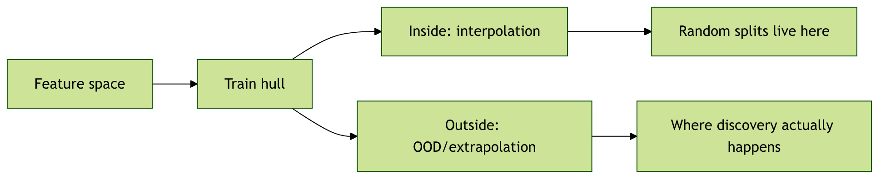

# §0 · Frame {.section}

## 01. Where We Are

::: {.columns}
::: {.column width="50%"}
**Recap — Units 1–7 (MG) and the parallel tracks**

- *MG Unit 6:* a material is now a feature vector — composition-only Magpie, globally-pooled RDF, local descriptors (ACSF, SOAP), pooled to a material-level $\mathbf{x}$.
- *MFML W7 (two weeks ago):* bias-variance, regularization, $k$-fold CV, validation/test discipline — the generic ML pipeline.
- *ML-PC Unit 7 (W7 lecture cancelled — public holiday; offered as self-study):* process windows, robustness, hyperparameter optimization on AM/process data.
:::
::: {.column width="50%"}
**Today — MG Unit 8**

- We have $\mathbf{x}_i$ from Unit 6. We have a target $y_i$. We can already train a regressor.
- The hard question this unit answers: **what does it mean for a materials regression result to be scientifically trustworthy?**
- The answer is *not* a tighter loss function. It is split design, residual analysis, and reporting discipline.
:::
:::

::: {.notes}
**Position the unit explicitly.** This is the unit where students stop asking "can I fit the data?" and start asking "would I bet a six-month synthesis campaign on this prediction?" Up to now we have asked how to represent a material; today we ask how to evaluate a regressor honestly when the scientific claim is "this model can predict properties for new chemistries / new prototypes / new conditions". That is the difference between a leaderboard plot and a scientific result.

**The triad-coordination message — say it loudly.** Two weeks ago MFML W7 covered the generic regression pipeline: bias-variance, ridge/lasso, $k$-fold CV, validation/test discipline. ML-PC W7 was cancelled (public holiday); the equivalent content (process windows, robustness, hyperparameter optimization on AM data) is offered as self-study from the ML-PC Unit 7 deck. **MG U8 deliberately does not re-cover any of that.** Re-teaching MFML W7 here would be the wrong use of 90 minutes — and would suggest to students that the materials-specific failure modes are a secondary concern. They are the primary concern.

**What is materials-specific and lives only in this unit.** Chemistry-family leakage; polymorph aliasing; narrow chemistry coverage of public DFT databases; OOD-vs-interpolation in materials descriptor space; chemistry-, structure-, and prototype-aware split design; formation-energy regression as the canonical worked example; per-element and per-prototype residual analysis; the trustworthy-reporting checklist for materials-regression papers. None of this is in MFML or ML-PC.

**Anchor in MFML W7.** Students who feel shaky on the bias-variance decomposition or on $k$-fold CV mechanics should review the MFML W7 deck tonight. We will use that machinery in §A as a recap, but the depth is over there. If a student asks during office hours "wait, what's the difference between validation and test again?" — the answer is "MFML W7, slides on the three-set protocol", not a re-derivation here.

**Forward links.** Unit 9 (next week) introduces neural surrogates — SchNet, CGCNN, MEGNet — and the validation discipline from today carries forward unchanged. Unit 13 (uncertainty-aware discovery) puts calibrated error bars on regression predictions and uses today's split-design taxonomy as the foundation.

**Time honesty.** Content-dense 90 minutes. Seven sections, 50 slides, no live code demo today (the exercise this afternoon is the demo). Promise students a 5-minute break after §C (split design) and reach §G by the 88-minute mark.
:::

## 02. Learning Outcomes

By the end of 90 minutes, you can:

::: {.columns}
::: {.column width="50%"}
::: {.fragment}
1. **Apply** the MFML W7 empirical-risk / regularization / CV vocabulary to materials regression problems.
2. **Diagnose** the four materials-specific failure modes — chemistry-family leakage, polymorph aliasing, narrow-coverage bias, prototype dominance — in a regression report.
3. **Choose** between random, chemistry-aware, structure-aware, leave-one-cluster-out, and time-based splits to match the scientific claim.
4. **Evaluate** a formation-energy regression benchmark against the mandatory-baseline ladder and the leakage checklist.
:::
:::
::: {.column width="50%"}
::: {.fragment}
5. **Read** per-element, per-prototype, and per-space-group residuals to surface chemistry biases invisible to a global MAE.
6. **Decide** from a learning curve whether a result is data-limited, model-limited, or representation-limited.
7. **Audit** a published materials-regression paper against the MG U8 trustworthy-reporting checklist.
:::
:::
:::

::: {.notes}
**Bloom mapping.** Outcomes 3, 4, 7 are *apply* / *evaluate*-level — students should leave able to do these on a paper or a notebook in front of them. Outcomes 2, 5, 6 are *analyze*-level — they require interpreting plots and tables. Outcome 1 is *recall* — it is intentionally the cheapest, because the heavy machinery lives in MFML W7.

**The exam-weight outcomes.** Outcome 3 (split design choice) and outcome 7 (the reporting-checklist audit) are the two highest-exam-weight items. Outcome 3 because it is the single most consequential decision a materials-ML researcher makes; outcome 7 because the cohort will be peer-reviewing each other's exercise reports next week and will need an explicit checklist.

**What this list does *not* contain.** No outcome on bias-variance derivation (MFML W7). No outcome on hyperparameter optimization mechanics (ML-PC W7). No outcome on process-window construction (ML-PC W7). The cohort will sometimes want me to re-derive these; gently redirect them to the appropriate sister-track deck.

**Ordering rationale.** Outcomes 1–2 are the diagnostic frame, 3–4 are the design step, 5–6 are the analysis step, 7 is the synthesis step. Today's lecture follows this order — §A applies MFML, §B–C diagnose and design, §D–E analyse, §F synthesises into a checklist.
:::

## 03. Today's Map

::: {.columns}
::: {.column width="50%"}
**Seven sections, ~90 min**

- §A · MFML W7 recap, applied to materials *(~10 min, 5 slides)*
- §B · Materials-specific generalization failures *(~22 min, 11 slides)*
- §C · Split design for materials data *(~15 min, 8 slides)*
- §D · Formation-energy regression — the canonical case *(~15 min, 8 slides)*
- §E · Beyond R² — diagnostic plots *(~12 min, 8 slides)*
- §F · Trustworthy reporting *(~8 min, 5 slides)*
- §G · Wrap-up *(~3 min, 2 slides)*
:::
::: {.column width="50%"}
**The single sentence to leave with**

> *In materials ML, the test set's relationship to the training set is the scientific claim. A model is trustworthy only when its split design matches the claim its predictions are meant to support.*

5-minute break after §C (around minute 47).
:::
:::

::: {.notes}
**Signposting.** Students pace better when they know the shape of the lecture. Promise the break and the §D worked example so they keep attention through the failure-mode catalogue in §B.

**Why this ordering.** §A is the recap glue — it lets students who are shaky on MFML W7 catch up before we apply the vocabulary. §B is the failure-mode catalogue — students need to feel the failures viscerally before they will accept the cost of structure-aware splits in §C. §C operationalizes the failures as design choices. §D is the canonical case — formation-energy regression — where everything hits the ground. §E is the diagnostic toolkit. §F is the synthesis into a checklist. §G is the bridge.

**What I deliberately do *not* cover today.**

- Hyperparameter search algorithms (grid / random / Bayesian) — ML-PC W7. If a student asks, name the lecture.
- Bias-variance decomposition derivation — MFML W7.
- Process-window definition with safety margins — ML-PC W7.
- Calibrated uncertainty (conformal prediction, GP error bars) — MG Unit 13.
- Neural-network architectures for materials — MG Unit 9 (next week).

**Tone.** This unit is the most "this is what good practice looks like" of any in MG. Lean into it. Most of the cohort will see this content again only when peer-reviewing for journals five years from now; that future review is the audience whose habits we shape today.
:::

# §A · MFML W7 Recap, Applied to Materials {.section}

## 04. What MFML W7 Gave Us

::: {.columns}
::: {.column width="50%"}
**The empirical-risk picture**

$$\hat{\boldsymbol{\theta}} \;=\; \arg\min_{\boldsymbol{\theta}} \;\underbrace{\frac{1}{N}\sum_{i=1}^{N} \ell(f_{\boldsymbol{\theta}}(\mathbf{x}_i), y_i)}_{\text{empirical risk}} \;+\; \underbrace{\lambda\,\Omega(\boldsymbol{\theta})}_{\text{regularizer}}$$

- $\ell$ — prediction loss (squared, absolute, Huber)
- $\Omega$ — complexity penalty (ridge, lasso, elastic-net)
- $\lambda$ — bias-variance dial [@bishop2006pattern]
:::
::: {.column width="50%"}
**The materials twist**

::: {.fragment}
- The minimization is over the training sum.
- *Generalization* means the model behaves on $(\mathbf{x}, y)$ pairs **not in the training sum**.
- For materials data, "not in the training sum" is ambiguous — and that ambiguity is the entire scientific question of this unit.
:::
:::
:::

::: {.notes}
**Recap, not derivation.** This slide is the deliberate one-shot recap of MFML W7. We are not re-teaching empirical risk minimization. We are restating the formula so we agree on notation, then immediately pivoting to the question MFML cannot answer.

**The pivot, said aloud.** "MFML defined generalization as expected error on $(\mathbf{x}, y) \sim p_{\text{data}}$. Fine. But what is $p_{\text{data}}$ for a materials problem? Is it 'all materials humans will ever synthesize'? 'All materials in Materials Project today'? 'All materials chemically similar to the training set'? Each gives a different answer. The scientific content of materials ML lives in choosing $p_{\text{data}}$ — and that is what split design encodes."

**Notation discipline.** I use $\mathbf{x}_i \in \mathbb{R}^d$ for the material-level descriptor (the output of Unit 7's pooling step), $y_i \in \mathbb{R}$ for the scalar target (formation energy in eV/atom, band gap in eV, bulk modulus in GPa, etc.), and $\boldsymbol{\theta}$ for whatever model parameters we are fitting. Same notation as MFML W7.

**Common student question, answer in advance.** "Why are we not deriving the bias-variance decomposition again?" Because it lives in MFML W7 (slide on the bias²/variance/noise decomposition). Re-deriving would consume 15 minutes that we need for the materials content. If they have not internalised it from MFML W7, the homework reading is Bishop §3.2.

**Forward link.** $\Omega(\boldsymbol{\theta})$ as a Bayesian prior — ridge = Gaussian prior, lasso = Laplace prior — also lives in MFML W7. In §A4 we mention it once because materials descriptors are heavily correlated (Magpie features all move together along the periodic table) and ridge is the right default; we do not re-derive the prior interpretation.
:::

## 05. The Bias-Variance Picture, Plus the Materials Term

::: {.columns}
::: {.column width="50%"}
**Standard decomposition** [@bishop2006pattern; @murphy2012machine]

$$\mathbb{E}[\,(\hat{f}(x) - y)^2\,] \;=\; \underbrace{\text{Bias}^2}_{\text{model too simple}} + \underbrace{\text{Var}}_{\text{too sensitive to data}} + \underbrace{\sigma^2}_{\text{irreducible}}$$

- High bias: ridge $\lambda$ too large, model too rigid.
- High variance: tree too deep, GNN over-parameterized.
- Irreducible noise: target is intrinsically uncertain.
:::
::: {.column width="50%"}
**The fourth term materials adds**

::: {.fragment}
$$+\; \underbrace{\Delta_{\text{shift}}}_{\text{distribution shift error}}$$

- Even at zero bias, zero variance, zero noise, a materials model is wrong if the *training distribution* differs from the *deployment distribution*.
- Random IID splits estimate Bias² + Var + $\sigma^2$.
- They do **not** estimate $\Delta_{\text{shift}}$.
- $\Delta_{\text{shift}}$ is the headline content of §B.
:::
:::
:::

::: {.notes}
**Why I name a fourth term.** The classical bias-variance decomposition assumes $(\mathbf{x}, y)$ test pairs are drawn IID from the same distribution as training. Materials data violates that assumption almost always. A random IID split estimates the first three terms; the fourth term — the gap between training-set chemistry coverage and deployment-set chemistry coverage — is invisible to a random split. Naming it explicitly gives students a hook for the rest of the lecture.

**Where the fourth term comes from formally.** If $p_{\text{train}} \neq p_{\text{deploy}}$, then $\mathbb{E}_{p_{\text{deploy}}}[\ell] - \mathbb{E}_{p_{\text{train}}}[\ell] = \Delta_{\text{shift}}$. This is the *covariate-shift* literature in ML; in materials it is the dominant error source. ML-PC W7 also discusses distribution shift, but for measurement-time drift, not for chemistry-coverage gaps.

**A worked-example anchor.** "A formation-energy GNN trained on Materials Project oxides reports MAE 35 meV/atom on a random oxide test set. The same model evaluated on Materials Project nitrides reports MAE 180 meV/atom. The difference — 145 meV/atom — is approximately $\Delta_{\text{shift}}$. None of bias, variance, or noise changed. The training distribution did."

**Pre-empt.** "Isn't $\Delta_{\text{shift}}$ just a special case of the irreducible-noise term if you define $p_{\text{data}}$ broadly enough?" Mathematically yes; pedagogically no. Treating chemistry-coverage gaps as "noise" is the failure mode that lets researchers say "well, my model is just bad on nitrides, that's noise." It isn't noise — it's a structural training-distribution problem with a structural fix (chemistry-aware splits, broader sampling, transfer learning).

**Connect forward.** This slide is the conceptual heart of the lecture. Every subsequent slide is either documenting an instance of $\Delta_{\text{shift}}$ (§B), designing a split that reveals $\Delta_{\text{shift}}$ (§C), measuring $\Delta_{\text{shift}}$ on the canonical task (§D), reading residuals to localize $\Delta_{\text{shift}}$ in chemistry space (§E), or reporting $\Delta_{\text{shift}}$ honestly (§F). Repeat the term throughout.
:::

## 06. Regularization as Prior, Applied to Materials Descriptors

::: {.columns}
::: {.column width="50%"}
**Ridge** $\Omega(\mathbf{w}) = \|\mathbf{w}\|_2^2$ — Gaussian prior on weights.

**Lasso** $\Omega(\mathbf{w}) = \|\mathbf{w}\|_1$ — Laplace prior, drives weights exactly to zero.

**Elastic net** — both, weighted [@bishop2006pattern].

These are MFML W7 content. We use them, we do not re-derive them.
:::
::: {.column width="50%"}
**Why ridge is the materials default**

::: {.fragment}
- Magpie has $\sim 130$ elemental-statistics features.
- Mean atomic number, mean atomic mass, mean valence-electron count, mean ionization energy all move together along the periodic table.
- Pairwise correlations $|r| > 0.9$ are common.
- Unregularized least squares is unstable on this design matrix.
- Ridge with $\lambda$ chosen by 5-fold CV is the right default for any composition-only baseline.
:::
:::
:::

::: {.notes}
**Why mention this at all when MFML covers it.** Because the materials adaptation is non-trivial: Magpie features are *engineered to be redundant* (each statistic is a moment of the same elemental property distribution), and naive least-squares fits often have condition numbers in the $10^6$–$10^9$ range. Ridge isn't a luxury here, it's a numerical necessity. Students who skip the regularizer get coefficients that flip sign on tiny perturbations of the training set.

**The pragmatic recipe.**
1. Standardize features (z-score per column, fit on train only — never on full data).
2. Ridge regression with $\lambda$ on a log-spaced grid: $10^{-3}, 10^{-2}, \ldots, 10^{2}$.
3. Choose $\lambda$ by 5-fold CV on the training split.
4. Refit on the full training set with the chosen $\lambda$.
5. Evaluate on test only once.

This is the "Magpie + ridge" tier-2 baseline that §D.2 will demand.

**Lasso vs ridge for materials descriptors.** Lasso is useful when interpretability matters (which features survive?) but it is unstable when features are highly correlated — it picks one feature from a correlated cluster essentially at random. For Magpie-like designs, *elastic net* is often the better choice: $L_1$ for sparsity, $L_2$ for stability. Mention by name; students can use scikit-learn's `ElasticNetCV` directly.

**Forward link.** Tier-2 of the §D baseline ladder is "Magpie + ridge". Tier-3 is "Magpie + GBT". A GBT often beats ridge on random splits, ties on chemistry-aware splits, and loses on extrapolation tasks — because tree ensembles cannot extrapolate beyond the training feature range. Mention now so the §D contrast lands.
:::

## 07. Cross-Validation — Mechanically Familiar, Conceptually Wrong by Default

::: {.columns}
::: {.column width="50%"}
**$k$-fold CV recap** [@bishop2006pattern]

- Partition training data into $k$ disjoint folds.
- For each fold $j$: train on the other $k-1$, evaluate on $j$.
- Report mean $\pm$ std over folds.
- Default $k=5$ or $k=10$.

The mechanics are MFML W7 content.
:::
::: {.column width="50%"}
**The materials issue**

::: {.fragment}
- Random folds give a low-variance estimate of error on a held-out *random* sample.
- For most materials questions, "random sample of materials" is **not** the deployment distribution.
- Random-fold CV gives a low-variance estimate of *the wrong quantity*.
- The fix is **grouped CV** — folds that hold out chemistry families, prototypes, or time windows.
- This is the bridge into §B and §C.
:::
:::
:::

::: {.notes}
**The pivot of this slide.** CV is mechanically the same in materials and in generic ML. What changes is what the folds are. Random folds are appropriate only if "next sample" is exchangeable with training; for most materials discovery questions, it is not. *Grouped CV* — held-out folds defined by chemistry family, structure prototype, or time window — is the materials-correct version.

**Why "grouped" deserves a name.** The scikit-learn API has `KFold`, `StratifiedKFold`, `GroupKFold`, `LeaveOneGroupOut`, `TimeSeriesSplit`. The right defaults for materials regression are *almost never* `KFold`. Students who default to `KFold` because the tutorial they followed used `KFold` are running into the failure modes of §B.

**A concrete number.** Same model, same data, same hyperparameters: $k=5$ random `KFold` reports MAE 35 ± 4 meV/atom; $k=5$ `GroupKFold` (groups = chemistry families) on the same data reports MAE 110 ± 30 meV/atom. The model is the same. The estimator changed. The 110 number is what you should report if your paper claims discovery power.

**Common student question.** "Which is the right number?" Both. The 35 number tells you the model interpolates well within familiar chemistry. The 110 number tells you it extrapolates poorly across families. Both are useful; reporting only one is the failure mode.

**Connect to ML-PC W7.** ML-PC W7 also covers grouped CV, but the groups are physical (specimen, session, microscope). In MG, groups are chemical / structural. Same machinery, different group definitions. Refer back to ML-PC W7 if students have already seen the API there.

**The §A → §B handoff sentence.** "If random folds are wrong by default for materials, what are the failure modes that a random-fold CV hides? §B answers that question."
:::

## 08. The Three-Set Protocol — Same Discipline, Group-Aware Splits

::: {.columns}
::: {.column width="50%"}
**The discipline (MFML W7)**

- *Train:* fit parameters.
- *Validation:* select hyperparameters and model class.
- *Test:* evaluate the chosen model **once**.

If the test set influences any choice, the test estimate is no longer honest [@bishop2006pattern; @murphy2012machine].
:::
::: {.column width="50%"}
**Materials adaptation**

::: {.fragment}
- All three sets must be **group-disjoint** in the materials-relevant grouping.
- Train and test on disjoint chemistry families *and* disjoint prototypes when both matter.
- Validation set used for tuning ridge $\lambda$, GBT depth, etc. — but with the same group structure.
- *Nested* group CV is the gold standard when the dataset is small.
:::
:::
:::

::: {.fragment}
> *Reporting "test MAE" without specifying which axis the test set was held out along is uninterpretable. Always declare the split design.*
:::

::: {.notes}
**The three-set protocol survives the materials adaptation.** What changes is the group structure. The protocol itself is unchanged: train fits parameters, validation selects hyperparameters, test is touched once. If the test set influences any decision — including the decision to *try a different model class* after seeing test performance — the test estimate is corrupted.

**Why "touched once" is hard in practice.** A student trains a GNN, looks at test MAE, decides it's bad, switches to a different GNN architecture, re-evaluates, repeats. After the third iteration, the test set has effectively become a validation set, and the reported "test MAE" is biased low. The honest fix is to lock the test set away until the *very* end and use a separate validation set for all model-selection decisions.

**Nested group CV — when it matters.** With $N \sim 1000$ and many hyperparameters, a single train/val/test split is high-variance: the val set alone may not have enough chemistry diversity to choose hyperparameters reliably. Nested group CV — outer loop holds out test groups, inner loop tunes hyperparameters via grouped CV on the remaining data — is the principled fix. It's expensive (k₁ × k₂ training runs) but it's how published Matbench numbers are produced.

**The reporting demand.** Every materials regression paper should answer two questions in the methods section: (1) what was the group structure of the test set? (2) was the test set used for any model-selection decision? Failure to answer either makes the paper's headline number uninterpretable. We will return to this in §F.

**End of §A.** Five slides; we have applied the MFML W7 vocabulary to materials regression and named the materials-specific complications. Now §B catalogues the failure modes that grouped splits exist to expose.
:::

# §B · Materials-Specific Generalization Failures {.section}

## 09. The "What Kind of New Is Your Test Set?" Taxonomy

::: {.columns}
::: {.column width="50%"}
**Six axes of "new" for a materials regression task**

::: {.fragment}
1. **New composition** within a known prototype.
2. **New prototype** within a known chemistry family.
3. **New chemistry family** entirely.
4. **New database** / curation source.
5. **New computational level** (functional, $k$-mesh, pseudopotential).
6. **New measurement modality** (DFT vs experiment).
:::
:::
::: {.column width="50%"}
**The diagnostic question**

::: {.fragment}
> *Which axis or axes does your test set probe?*

- A random IID split probes **none** of these axes.
- Different deployment scenarios demand different axes.
- Most published "test MAE" numbers are silent on this — making them uninterpretable.
:::
:::
:::

::: {.notes}
**This is the conceptual scaffold of §B.** Every failure mode in slides 10–19 is an instance of one of these six axes leaking from train into test, or being absent from training entirely. Students should leave this slide with the six axes memorised; the rest of §B fleshes them out.

**Why six axes and not three.** A coarser taxonomy (chemistry / structure / measurement) is tempting but misleading. New composition within rocksalt is *much easier* than new prototype within oxides, which is much easier than new chemistry family entirely. Treating these as a single "extrapolation" axis hides the difficulty gradient. The six-axis taxonomy is the minimum granularity that makes the literature's failures legible.

**The deployment-question framing.** "What kind of materials does your model need to predict on?" determines which axis matters.
- Property optimization within a known family → axis 1 (new composition) is enough.
- Cross-family transfer → axis 3 (new chemistry family) is required.
- DFT-to-experiment screening → axis 6 (measurement modality) is required.
- Cross-database meta-analysis → axis 4 (new database) is required.

The choice of axis is a *scientific* choice; the choice of split is the *operational* consequence.

**Calling out the silent papers.** Most materials-ML papers do not declare which axis their test set probes. By default, "random 20% test split" probes axis-0 (no new axis at all — IID interpolation). Reading any "discovery" paper requires the reviewer to ask "but which axis?" — and demand an answer.

**The cohort exercise hook.** This afternoon's exercise asks students to construct two splits: random, and chemistry-aware. The taxonomy slide is the conceptual map for that exercise. The MAE gap between the two splits is the empirical content.
:::

## 10. Chemistry-Family Leakage — The Most Common Failure

::: {.columns}
::: {.column width="50%"}
**The setup**

- Dataset: Materials Project, all binary and ternary oxides + nitrides.
- Random 80/20 split. Train a Magpie + GBT regressor on formation energy.
- Reported test MAE: $\sim 60$ meV/atom. Looks great.

**The hidden structure**

::: {.fragment}
- Random split puts oxides on both sides; nitrides on both sides.
- For each test oxide, several near-neighbour training oxides exist.
- Model is doing **interpolation within chemistry families**, *not* cross-family transfer.
:::
:::
::: {.column width="50%"}
**The reveal**

::: {.fragment}
- Re-split: train on oxides, test on nitrides.
- Same model, same hyperparameters.
- Test MAE on nitrides: $\sim 250$–400 meV/atom.

The 60-meV number was a measure of *interpolation*. The 250+-meV number is a measure of *transfer*. The model is the same; the question changed (cf. Matbench/Matbench-Discovery community benchmarks [@dunn2020matbench; @riebesell2024matbenchdiscovery]).
:::
:::
:::

::: {.notes}
**The single most common failure mode in materials ML.** A paper claims "our GNN beats ridge by X% on Materials Project formation energies", reports random-split MAEs, declares discovery power. Re-evaluation under chemistry-held-out splits frequently shows the gap collapsing or reversing. The community is slowly waking up to this; the cohort should leave today already awake.

**Why oxides → nitrides specifically.** It's a clean, didactic example. Oxygen's electronegativity (3.44 Pauling) and nitrogen's (3.04) are different enough that bonding character, coordination preferences, and formation energetics shift substantially. A composition-only model that treats N as "approximately O" fails systematically. The same logic applies to any cross-family transfer: oxides → halides, sulfides → selenides, intermetallics → carbides.

**Concrete numbers, not just qualitative claims.** Order-of-magnitude reference points worth memorising:
- Random-split formation-energy MAE on MP, modern GNN: 30–40 meV/atom.
- Random-split formation-energy MAE on MP, Magpie + GBT: ~100 meV/atom.
- Chemistry-held-out MAE for the same modern GNN: 100–300 meV/atom depending on the held-out family.
- Chemistry-held-out MAE for Magpie + GBT: 150–500 meV/atom.

The gap between random and held-out is the headline failure-mode signal.

**The "hidden structure" framing — say it aloud.** "Random splitting on a materials dataset assumes that the dataset's structure is a random sample from materials space. It almost never is. Materials Project is a sample organised by chemistry family, prototype, and stability. Random sampling preserves all that structure on both sides of the split. The model learns family-internal regularities and is asked to predict family-internal regularities. It looks great. It is not measuring what the abstract claims."

**Forward link to §C.** This is the empirical motivation for chemistry-aware splits. We will operationalise the fix in §C2.
:::

## 11. Polymorph Aliasing

::: {.columns}
::: {.column width="50%"}
**The setup**

- Target: bulk modulus of $\text{TiO}_2$.
- $\text{TiO}_2$ exists as **rutile**, **anatase**, **brookite** with different bulk moduli (~210, ~180, ~250 GPa).
- Composition-only descriptor: $\mathbf{x}_{\text{rutile}} = \mathbf{x}_{\text{anatase}} = \mathbf{x}_{\text{brookite}}$.
:::
::: {.column width="50%"}
**The aliasing**

::: {.fragment}
- Three different $y$ values map to one $\mathbf{x}$ value.
- The best a composition-only model can do is predict the mean ($\sim 213$ GPa).
- Squared-error floor is set by the polymorph variance, not by anything the model controls.
- More data does **not** fix this. It is a representational under-specification, not a noise problem.
:::
:::
:::

::: {.fragment}
> *Polymorph aliasing puts a noise floor on composition-only models that more data cannot remove. The fix is structural information, not statistical effort.*
:::

::: {.notes}
**Why this slide is important.** Students often respond to high test errors by saying "we need more data". For composition-only models on polymorph-rich targets, more data does *not* help — the model is hitting an aliasing floor. Recognising aliasing as distinct from noise is the diagnostic skill this slide builds.

**Calculating the aliasing floor.** If composition $c$ has polymorphs with property values $y_{c,1}, \ldots, y_{c,m}$ each appearing with empirical frequency $p_{c,1}, \ldots, p_{c,m}$, the minimum mean-squared error of any composition-only predictor is $\sum_c P(c) \,\text{Var}_{c}[y]$ where $P(c)$ is the dataset frequency of composition $c$. This is the *aliasing variance* and it is irreducible without structural input.

**The MAE / RMSE consequence.** For TiO₂ with the three polymorphs above, the aliasing-floor RMSE is roughly $\sqrt{\text{Var}[y]} \approx 30$ GPa for the bulk modulus. Any composition-only model with test RMSE much below this on polymorph-rich subsets has either (a) a test set that doesn't actually contain multiple polymorphs of the same composition, or (b) leakage. Both are diagnostic failures.

**The fix.** Add structural information to the descriptor. SOAP, ACSF, prototype labels, space-group features, or a GNN that consumes the full structure. The fix is *representational*, not *statistical*.

**A real-paper anti-pattern.** Some published "composition-only" formation-energy benchmarks report surprisingly low MAEs by silently deduplicating to one polymorph per composition (usually the lowest-energy one). This makes the benchmark easier and hides the aliasing. The careful reader checks the deduplication step in the methods section; the careless reviewer rewards the inflated number.

**Calling forward.** §F1 will demand an ablation: take a "structure-aware" model and randomize its atomic positions. If MAE doesn't change much, the model is composition-only in disguise and is hitting its aliasing floor while pretending to use structure.
:::

## 12. Narrow-Coverage Bias of Public DFT Databases

::: {.columns}
::: {.column width="50%"}
**Materials Project, OQMD, AFLOW, NOMAD**

- Cover ~$10^5$–$10^6$ structures each.
- *Heavily* oversample: stable phases, common chemistries (oxides, halides, intermetallics), low formation energies, small unit cells.
- *Heavily* undersample: high-entropy alloys, disordered systems, defected phases, exotic chemistries (actinides, organic-inorganic hybrids), large unit cells.
:::
::: {.column width="50%"}
**The consequence**

::: {.fragment}
- A model trained on MP knows ABO₃ perovskites in detail.
- It barely knows high-entropy alloys (MP coverage: a few hundred).
- It effectively does not know defected or disordered systems.
- "Trained on Materials Project" is a much narrower claim than students usually realize.
- The training distribution is not "materials space"; it is *the materials people chose to calculate*.
:::
:::
:::

::: {.notes}
**The "what people calculated" framing — say it aloud.** Public DFT databases are not random samples of materials. They are samples of *the materials people had a reason to calculate*. People calculate stable phases (entries on the convex hull are over-represented relative to their share of materials space). People calculate phases with technological interest (Li-ion battery cathodes, photovoltaics, thermoelectrics). People calculate phases with structural ancestors in the ICSD (which is itself a non-random sample of human synthetic history). The training distribution inherits all those biases.

**Concrete coverage numbers, May 2026.**
- Materials Project: ~155k unique structures, dominated by oxides (~30%), intermetallics (~25%), halides, sulfides.
- OQMD: ~1M structures, broader coverage of intermetallics, similar bias toward stable phases.
- AFLOW: ~3.5M entries (heavily augmented with derivative structures), strong intermetallic bias.
- NOMAD: ~12M entries (aggregating multiple databases), heterogeneous coverage.

None of these is a balanced sample of materials space. Naive training on any of them inherits its biases.

**Pre-empt the obvious counter.** "But if I want to deploy on materials people would actually want to calculate next, isn't the bias actually correct?" Yes — *if* the deployment distribution matches the training-distribution bias. For property-optimization within familiar chemistry, this is fine. For *discovery* (the main use-case people claim), it is not — discovery by definition requires extrapolation away from the training-distribution bias. This is the central tension of materials ML: the data we have is not the data we need.

**The fix at the data level.** Active learning, targeted high-throughput campaigns to fill coverage gaps, transfer learning from broader simulations (e.g., Open Catalyst Project, Alexandria, MatBench-Discovery test sets), and explicit reweighting during training. These are MG Unit 13 content.

**The fix at the evaluation level.** Chemistry-aware splits and per-region reporting (§C, §E). We can at least *measure* the coverage failure even when we cannot fix the data.
:::

## 13. OOD versus Interpolation in Descriptor Space

::: {.columns}
::: {.column width="50%"}
**Two operationally different questions**

- *Is the test material **inside** the convex hull of training descriptors?* → **interpolation**.
- *Is it **outside**?* → **extrapolation / OOD**.

{fig-align="center"}
:::
::: {.column width="50%"}
**The reported-vs-relevant gap**

::: {.fragment}
- Most reported "good performance" numbers are interpolation numbers.
- Discovery happens at the OOD frontier, where reported performance is rarely measured.
- A simple diagnostic: train a $k$-NN on training descriptors. For each test point, report the minimum distance to training. Plot residuals against this distance.
- Residuals usually grow with distance; sometimes catastrophically.
:::
:::
:::

::: {.notes}
**The interpolation-vs-extrapolation framing.** This is a classical ML distinction (Hastie et al., Bishop §3) but it lands hardest in materials. A random split typically places almost every test point in the interpolation regime — within the training convex hull in descriptor space. A chemistry-held-out split typically places test points in the extrapolation regime. The MAE gap between the two is largely the gap between interpolation and extrapolation performance.

**Why the convex-hull picture is approximate, not exact.** True convex-hull membership in $\sim 130$-D Magpie space is meaningless (the convex hull becomes the bounding box and almost everything is "inside"). The operationally useful version is *minimum distance to nearest training neighbour* — a $k$-NN distance metric. Plot residuals against this distance and the gradient is usually visible: large residuals at large distances. This is the "extrapolation tail" of the model.

**A diagnostic recipe — give to the cohort.**
1. Standardize features.
2. Compute $d_i = \min_{j \in \text{train}} \|\mathbf{x}_i - \mathbf{x}_j\|_2$ for each test point.
3. Bin test points by $d_i$ quartile.
4. Report MAE per quartile.

A model whose MAE is flat across quartiles is genuinely extrapolating; a model whose MAE grows steeply is interpolating-with-extrapolation-tail. Most models are the latter.

**Why this matters for discovery.** The discovery question — "find a new material with property $y > y^*$" — is by construction an extrapolation question. The candidate materials live in regions of descriptor space that the training set sparsely covers; otherwise they would already be known. Reporting interpolation numbers in a discovery paper is a category error.

**Pre-empt.** "But humans extrapolate fine — why can't models?" Humans extrapolate using domain knowledge (e.g., "Li replaces Na, so Li-ion physics will resemble Na-ion physics"). Models extrapolate using the function class they were trained on (e.g., a tree ensemble cannot extrapolate beyond the training feature range — it is constant outside). Closing this gap is one of the active research frontiers in materials ML; transfer learning, equivariance constraints, and physics-informed losses are partial solutions.
:::

## 14. Distribution Shift Between Databases

::: {.columns}
::: {.column width="50%"}
**The same target, different numbers**

- Formation energy of $\text{Fe}_2\text{O}_3$:
  - PBE in MP: $-1.61$ eV/atom
  - SCAN in OQMD subset: $-1.68$ eV/atom
  - Hybrid functional reference: $-1.74$ eV/atom
- Differences of tens of meV/atom across databases — comparable to or larger than the best models' MAEs.
:::
::: {.column width="50%"}
**Cross-database evaluation reveals it**

::: {.fragment}
- Train on MP, evaluate on the OQMD subset for the same compositions.
- Apparent test "error" $\geq$ in-database training MAE.
- This is **not** model error — it is a target-definition mismatch.
- A useful materials-regression paper distinguishes between model error and database-shift error.
- In-database evaluation hides this entirely.
:::
:::
:::

::: {.notes}
**Why this matters.** A model with a 30 meV/atom in-database MAE looks great. The same model evaluated cross-database against numbers that disagree with the training database by $\sim 50$ meV/atom looks bad — but the badness has nothing to do with the model. The functional, $k$-mesh, pseudopotential, and relaxation-convergence choices differ between databases, and those differences propagate into the targets.

**The functional-choice axis.** PBE (the MP default) systematically over-binds main-group oxides by 10–30 meV/atom relative to SCAN; SCAN over-binds transition-metal oxides relative to hybrids; experimental enthalpies disagree with all of them by 20–100 meV/atom (zero-point energy, finite-temperature corrections, entropy). A model trained on PBE knows PBE; calibration to other targets is a separate problem.

**The reproducibility consequence.** If two papers report "formation energy MAE" against MP and OQMD respectively, the numbers are not directly comparable. A 30 meV/atom on MP is not equivalent to 30 meV/atom on OQMD; the underlying targets differ. Papers should report which database snapshot, which functional, which preprocessing.

**Cross-database training as a partial fix.** Models trained on multiple databases simultaneously, with database identity as an input feature, can learn the inter-database biases and subtract them out. This is starting to happen (e.g., Alexandria + MP joint training); it is an active research direction. Mention by name; it's MG Unit 13-ish content.

**Connect to §C.** Database-aware splits — train on one database, test on another — are the splits that *measure* this failure mode. Most published benchmarks do not do this. A handful of recent ones (MatBench-Discovery, OMat24 evaluation) do; they report sobering numbers that the rest of the field is starting to take seriously.
:::

## 15. Domain Shift Between DFT and Experiment

::: {.columns}
::: {.column width="50%"}
**DFT formation energies are not experimental enthalpies**

- DFT misses: zero-point energy, finite-temperature contributions, configurational entropy, real-world disorder, secondary phases.
- Functional choice systematically biases binding energies (PBE: under-binds; SCAN: closer; hybrid: still imperfect).
- Direct DFT-to-experiment differences: 20–200 meV/atom, target-dependent.
:::
::: {.column width="50%"}
**The cascade**

::: {.fragment}
- Model trained on MP DFT formation energies.
- Used to predict candidate materials for synthesis.
- Synthesis succeeds or fails according to **experimental** thermodynamics, not DFT.
- A predictive MAE of 30 meV/atom against DFT is a much weaker claim than "this model can guide synthesis decisions".
- Calibration to experimental references — when available — is essential before deployment.
:::
:::
:::

::: {.notes}
**The "DFT is not reality" caveat — emphasize.** Students often default to treating DFT formation energies as ground truth. They are not; they are a model. The model is good (often good enough for relative-stability decisions) but not perfect, and the perfection gap matters when the deployment target is real-world synthesis.

**The ICSD ground-truth question.** "But the ICSD entries we are predicting on were experimentally synthesised — surely the DFT energies are physically meaningful for those compounds?" Yes, *as predictions of what those compounds' formation energies would be in DFT-land*. The agreement between DFT-predicted stability and experimental synthesizability is good but imperfect; ~5–10% of predicted-stable phases fail to synthesize, and a comparable fraction of synthesizable phases are predicted unstable. Open Catalyst Project and similar campaigns are starting to quantify this gap systematically.

**The deployment-claim hierarchy.** From weakest to strongest:
1. "Model agrees with DFT on held-out DFT data" — what most papers actually demonstrate.
2. "Model agrees with experiment on held-out experimental data" — much rarer.
3. "Model successfully guides synthesis of previously unknown materials" — extremely rare; the high-bar standard.

Most discovery claims hover at level 1 while implying level 3. Recognising this gap is part of reading the literature critically.

**Calibration techniques.** When experimental data is available for a subset, simple linear calibration ($y_{\text{exp}} = a \, y_{\text{DFT}} + b$ per chemistry family) can shift predictions toward the experimental scale without retraining. More sophisticated: domain adaptation with a small experimental fine-tuning set. MG Unit 13 covers this with calibrated uncertainty.

**Forward link.** Unit 9 introduces neural surrogates trained on DFT. The DFT-vs-experiment domain shift survives Unit 9 unchanged; better architecture does not fix the target-definition problem.
:::

## 16. Stability Bias and the Long Tail

::: {.columns}
::: {.column width="50%"}
**Stability bias**

- Public databases overrepresent **stable** phases (entries on the convex hull).
- Most-published research targets technologically interesting **stable** phases.
- The training distribution of formation energies is sharply peaked around the hull; metastable phases are underrepresented.
:::
::: {.column width="50%"}
**The deployment problem**

::: {.fragment}
- Discovery often *needs* metastable phases — kinetically accessible, technologically interesting, off-hull.
- A model trained on hull-concentrated data extrapolates poorly to metastable (high-energy-above-hull) phases.
- Reported MAEs on hull-concentrated test sets are not predictive of metastable-phase MAEs.
:::
:::
:::

::: {.fragment}
> *The materials we want to discover are often the materials we have not yet calculated. Training distributions reflect what the field has done, not what discovery requires.*
:::

::: {.notes}
**Stability bias is a special case of narrow-coverage bias (slide 12) but it deserves its own slide.** The convex hull is a cleanly definable concept; entries on or near the hull have $E_{\text{hull}} \leq 50$ meV/atom typically; entries far from the hull (metastable) have $E_{\text{hull}}$ up to several hundred meV/atom. MP's distribution is heavily tilted toward $E_{\text{hull}} \leq 100$ meV/atom; the long tail is sparsely sampled.

**Why metastable phases matter.** Many functional materials are metastable: diamond is metastable to graphite, anatase TiO₂ is metastable to rutile, β-Ga₂O₃ is one of several phases of Ga₂O₃ each with different applications. A discovery model that cannot predict metastable-phase properties accurately is missing a large class of useful materials.

**The energy-above-hull connection.** $E_{\text{hull}}(c)$ is the energy of phase $c$ minus the energy of the most-stable competitor at the same composition. It's the natural "metastability" coordinate. Plotting model error against $E_{\text{hull}}$ is one of the most informative diagnostic plots possible: typical pattern is flat MAE on the hull, growing MAE in the metastable tail.

**MatBench-Discovery as the modern benchmark.** MatBench-Discovery [@dunn2020matbench; @riebesell2024matbenchdiscovery] explicitly evaluates models' ability to identify stable phases from a candidate pool — directly testing the stability-bias failure mode. It's the benchmark to point students at if they want to compare modern GNNs honestly.

**The data-collection fix.** Active-learning campaigns that target high-energy-above-hull phases can rebalance the training distribution. This is happening (e.g., GNoME, MatterSim). It's MG Unit 13 content.

**The evaluation fix.** Stratify the test set by $E_{\text{hull}}$ and report MAE per stratum. Most papers do not do this; the cohort should.
:::

## 17. Prototype Dominance and the Long Tail

::: {.columns}
::: {.column width="50%"}
**A small set of prototypes dominates**

- Rocksalt, fluorite, perovskite (ABO₃), spinel (AB₂O₄), and a handful of intermetallic prototypes account for >50% of MP entries.
- The long tail of rare prototypes — Heusler variants, layered oxides with unusual stacking, ordered defected structures — is sparsely covered.
:::
::: {.column width="50%"}
**The reporting consequence**

::: {.fragment}
- A model with a "good MAE" is being scored *mostly* on the dominant prototypes.
- Tail prototypes drive most deployment failures.
- Per-prototype residual reporting (§E) exposes this.
- A model that wins on average but loses badly on tail prototypes is **not** suitable for prototype-extrapolation discovery tasks.
:::
:::
:::

::: {.notes}
**Why prototypes deserve their own slide.** Prototypes are the structural analogue of chemistry families. Rocksalt and perovskite each have hundreds of compositional variants in MP; rare prototypes have a handful each. The dominance is steeper than the chemistry-family dominance — and the tail-prototype failure mode is correspondingly sharper.

**Concrete numbers from MP.** As of mid-2024 snapshots:
- Rocksalt-like: ~8% of entries.
- Perovskite-family (cubic / Pnma / R-3c / I4/mcm variants): ~6%.
- Spinel: ~3%.
- Top-20 prototypes: ~50% of entries.
- Long tail (>1000 prototypes appearing $\leq 5$ times each): ~10% of entries.

A random split distributes the dominant prototypes across train and test. A prototype-held-out split holds out an entire prototype. Performance on prototype-held-out is much worse than on random.

**Why composition-only models look "fine" in this regime.** Magpie + GBT can learn that Mg-O compounds tend to have certain bulk-modulus ranges *averaged across rocksalt, wurtzite, and other Mg-O prototypes*. The model is implicitly averaging over prototype, which both hides aliasing (slide 11) and inflates apparent performance on prototype-aware splits where prototype actually matters.

**The diagnostic.** Per-prototype residual table (§E.4): for each of the top-20 prototypes, $N_{\text{test}}$, MAE on that prototype. Strong diagonal pattern (good on common prototypes, bad on rare ones) is the prototype-dominance signal. Mention now; the per-prototype table appears in §E.

**The fix.** Structure-aware models (GNNs, SOAP-based kernels) that consume the actual structure rather than composition only. They lift the aliasing floor; whether they actually *generalise* across prototypes is a separate question (often: less than the architecture's defenders claim).
:::

## 18. Disordered, Defected, and Real Materials

::: {.columns}
::: {.column width="50%"}
**Most public datasets assume idealised periodic crystals**

- DFT relaxation produces a single ordered structure per entry.
- Real materials have site disorder, point defects, dislocations, grain boundaries, secondary phases, surface terminations.
- A model trained on ordered crystals applied to disordered systems is a domain shift that often goes unmeasured.
:::
::: {.column width="50%"}
**Where this bites**

::: {.fragment}
- High-entropy alloys: chemical disorder is the *defining* feature.
- Doped semiconductors: the dopant is precisely the off-ideal feature that controls properties.
- Battery cathodes during cycling: lattice deformation, vacancy ordering, phase transitions.
- ML-screening papers regularly predict ordered-DFT properties of materials whose real-world function depends on disorder. The gap is large and rarely reported.
:::
:::
:::

::: {.notes}
**Disorder is the elephant in the room of materials ML.** DFT is mostly done on ordered supercells because that's what's tractable. The materials community knows that disorder matters; the ML literature mostly trains on ordered DFT and silently extrapolates.

**Three categories of disorder.**

1. *Substitutional disorder* (high-entropy alloys, solid solutions): the chemical identity of each site is uncertain. Standard treatment: special quasirandom structures (SQS) — ordered approximants of disordered configurations. Models trained on SQS know SQS, not real disorder.

2. *Point defects* (vacancies, interstitials, dopants): a few defected sites in an otherwise ordered host. Standard treatment: defect supercells, formation-energy diagrams. Models trained on pristine structures cannot predict defected-property targets.

3. *Extended defects* (dislocations, grain boundaries, surfaces): non-periodic features. Standard DFT cannot represent them at scale; ML rarely tries.

**The honest reporting standard.** A materials-ML paper that screens for "high-temperature superconductors" or "Li-ion conductors" using ordered-DFT-trained models should explicitly disclose the disorder-domain-shift gap. Almost none do; the cohort should know to ask.

**The research frontier.** Active learning on disorder-relevant configurations, machine-learned interatomic potentials trained on disordered MD trajectories (MACE, Allegro, MatterSim), explicit configurational sampling. MG Unit 13 / Unit 14 territory.

**Connect to ML-PC W7.** ML-PC's robustness section discusses measurement-time noise as a domain-shift source. Here we are discussing material-time disorder as a different domain-shift source. Same conceptual tool ($\Delta_{\text{shift}}$ from slide 5); different physical origin.
:::

## 19. The Small-Test-Set Problem

::: {.columns}
::: {.column width="50%"}
**Variance of MAE estimates**

- Test set size $N_{\text{test}}$.
- Standard error on the mean MAE: $\text{SE}(\text{MAE}) \approx \sigma_{\text{abs-resid}} / \sqrt{N_{\text{test}}}$.
- Typical materials: $N_{\text{test}} \in [50, 5000]$.
- $N_{\text{test}} = 100$ → SE often 5–15% of the mean.
:::
::: {.column width="50%"}
**The chemistry-coverage problem on top of that**

::: {.fragment}
- A single chemistry family being absent from the test set can change the mean MAE by 30%+.
- Aggregate variability of "test MAE" across reasonable test-set draws is often 30–50%.
- Reporting a point MAE without a confidence interval is statistically dishonest.
- Bootstrap or block-bootstrap CIs are the bare minimum.
:::
:::
:::

::: {.notes}
**Why this slide closes §B.** It is the meta-failure-mode: even when the split is honest, the test set is small enough that the MAE estimate has substantial variance. Reporting a single number with no CI hides this.

**Bootstrapping the test MAE.** Resample test points with replacement, recompute MAE per resample, report the empirical 95% CI. With $N_{\text{test}} = 200$, typical CI half-width is ~10% of the mean. Two methods whose point MAEs differ by less than this should not be claimed "better than each other".

**Block bootstrap for grouped data.** If test points are grouped by chemistry family or prototype, the right resampling unit is the *group*, not the individual point. Block-bootstrap reports wider, more honest CIs. The narrower IID-bootstrap CI is a common subtle reporting error.

**A real-paper anti-pattern.** "Method A achieves 28 meV/atom; method B achieves 30 meV/atom; A is better." With CIs, both numbers might be (28 ± 3) and (30 ± 3) meV/atom — overlapping and statistically indistinguishable. The "A is better" claim is unsupported.

**Calling the §B summary.** Eleven slides; we have catalogued chemistry-family leakage (slide 10), polymorph aliasing (11), narrow database coverage (12), interpolation-vs-OOD (13), database shift (14), DFT-vs-experiment shift (15), stability bias (16), prototype dominance (17), disorder shift (18), and small-test-set variance (19). All are instances of $\Delta_{\text{shift}}$ from slide 5. Now §C operationalises the fixes.

**5-minute break here.** We are at minute ~30. Promise the cohort a break before §C; restart with split design.
:::

# §C · Split Design for Materials Data {.section}

## 20. Random Splits — When They Are Honest, and When They Lie

::: {.columns}
::: {.column width="50%"}
**Random splits are honest when…**

- "Next sample" is statistically exchangeable with training.
- The deployment task is *interpolation* within a chemistry/structure cluster well-represented in training.
- Examples: parameter optimization within a known polymer family; property reporting for ICSD entries similar to those in training.
:::
::: {.column width="50%"}
**…and lie when**

::: {.fragment}
- The deployment task involves any of the six axes from slide 09.
- The dataset has strong group structure (chemistry families, prototypes) that random sampling preserves on both sides of the split.
- The scientific claim is "discovery", "extrapolation", or "transfer".
- Default to grouped splits; demote random splits to a *secondary* report, never a headline.
:::
:::
:::

::: {.notes}
**A defensible defence of random splits.** They are not always wrong. For *property optimisation* within a fixed material family — say, optimising Si-doping for a known semiconductor — a random split is the right design. The deployment distribution genuinely is "more samples from the same family", and random IID estimation is calibrated. The failure is using random splits *outside* this regime.

**The default choice.** In the absence of a stated deployment claim, the safer default is a chemistry-aware split. It probes a stronger generalization claim, so it cannot be too lenient; if the deployment claim is actually weaker (interpolation only), the chemistry-aware MAE is a pessimistic but honest estimate.

**The reporting recipe — give to cohort.** A materials-regression paper should report:
- Headline MAE: under the split that matches the strongest-stated claim.
- Secondary MAE: under a random split (for comparison and for IID-comparable benchmarking).
- The gap between them, discussed.

This is the format of the strongest current materials-ML papers (e.g., MatBench, MatBench-Discovery, recent EquiformerV2 reports).

**Anti-pattern to call out.** "Random 80/20 split" reported as the only number, with no discussion of group structure. This is the modal format of pre-2022 materials-ML papers. The community is moving past it; the cohort should already be past it.

**Connect to §B.** Every failure mode in §B is hidden by random splits and at least partially exposed by grouped splits. Random splits are the "default lens" through which the literature was written; grouped splits are the lens through which it should be re-read.
:::

## 21. Chemistry-Aware Splits

::: {.columns}
::: {.column width="50%"}
**Mechanics**

- Hold out an entire chemistry family from training.
- Train on the rest; test on the held-out family.
- "Chemistry family" can be defined at multiple granularities:
  - by anion (oxides, nitrides, halides, sulfides, …)
  - by elemental presence (all materials containing Sr; all materials containing F)
  - by composition cluster (Magpie-feature $k$-means, leave-one-cluster-out)
:::
::: {.column width="50%"}
**Implementation**

::: {.fragment}
- `sklearn.model_selection.GroupKFold` with groups = anion family or composition cluster.
- For pymatgen / matminer pipelines: `MaterialsProject.composition.alphabetical_formula` reduces to the per-composition group; aggregate to family with a chemistry rule.
- Concrete recipe: `groups = [classify_family(formula) for formula in train_formulae]`; pass groups to `GroupKFold`.
:::

::: {.fragment}
**The headline number this produces is the right one for cross-family transfer claims.**
:::
:::
:::

::: {.notes}
**The granularity choice matters.** "Held out by anion" is a coarse split (5–10 groups); "held out by elemental presence" is finer ($\sim 80$ groups, one per element). Coarser splits give more pessimistic MAEs; finer splits give intermediate values. The right granularity depends on the deployment claim.

**A worked recipe to give the cohort.**
1. Define the family classifier `family(material) → str`.
2. Build the groups vector for the training set.
3. `GroupKFold(n_splits=5).split(X, y, groups=families)`.
4. For each fold: fit on train-fold, predict on test-fold.
5. Aggregate per-family MAEs and the mean-of-folds MAE.

The per-family table (which families hurt the most?) is more informative than the mean.

**Common pitfall.** Defining "family" by *the most common element* can miscategorise materials with multiple major elements. Better: define by the anion in oxides/nitrides/halides; by the dominant element class in intermetallics. Or use composition-cluster based families ($k$-means on Magpie, $k = $ number of desired groups). Composition-cluster families are the most defensible for a generic dataset.

**Edge case: families with $N \leq 10$.** Holding out a 5-member family is high-variance — the per-family MAE has standard error $\sqrt{\sigma^2 / 5}$. Either drop these families from the held-out evaluation or pool them into an "other" group. Document the choice.

**Forward link.** §D evaluates the formation-energy regression task under this split design. The MAE gap between random and chemistry-aware splits on MP formation energies is the canonical case-study number.
:::

## 22. Structure-Aware and Prototype-Aware Splits

::: {.columns}
::: {.column width="50%"}
**Mechanics**

- Identify each material's structural prototype.
- Hold out an entire prototype from training.
- Train on the rest; test on the held-out prototype.

Tools:
- `pymatgen.symmetry.analyzer.SpacegroupAnalyzer` for space group and prototype matching.
- AFLOW prototype labels for ICSD-derived structures.
- `matminer`'s structure-similarity matchers for fuzzier grouping.
:::
::: {.column width="50%"}
**What this tests**

::: {.fragment}
- Cross-prototype transfer: does the model generalise from rocksalt to fluorite, from perovskite to spinel?
- A composition-only model performs *identically* on this split as on a random split — exposing its structure-blindness.
- A genuinely structure-aware model should show a smaller chemistry-vs-structure-aware gap than a composition-only one.
- This is the diagnostic for "is the structural information in the descriptor doing scientific work?"
:::
:::
:::

::: {.notes}
**The composition-only diagnostic — emphasize.** A composition-only model has no information distinguishing rocksalt-MgO from wurtzite-ZnO beyond their compositions. So holding out wurtzite from training and testing on wurtzite (with a substantial number of non-wurtzite compositions also in test) doesn't penalise the composition-only model — it just sees compositions, regardless of prototype. Structure-aware models *do* see prototype as input, so they *should* be penalised under a prototype-held-out split (relative to a random split).

The diagnostic, said as a question: "Does your model's MAE go up under a prototype-held-out split relative to a random split?" If yes, the model is using structure — possibly poorly, but using it. If no, the model is composition-only regardless of what its architecture diagram suggests.

**Prototype-matching is non-trivial.** Two structures that look like "the same prototype" can differ in subtle ways (stacking sequence, second-coordination-shell environment). The pymatgen `StructureMatcher` has tunable tolerances; the AFLOW prototype list is a curated dictionary. For didactic purposes, space group + Wyckoff position pattern is a reasonable approximation; for rigorous benchmarking, use AFLOW labels.

**Combining chemistry and structure splits.** The strongest evaluation reports both:
- Chemistry-held-out (e.g., oxides → nitrides).
- Prototype-held-out (e.g., rocksalt-perovskite-spinel → fluorite).
- And ideally a *joint* held-out: new chemistry *and* new prototype.

The joint split is the closest to true "discovery" extrapolation. Most published numbers don't go there.

**Forward link.** §F1's mandatory ablation — randomize atomic positions of a "structure-aware" model — is the algorithmic complement of this split. Both are diagnostics for whether structural information is doing work.
:::

## 23. Leave-One-Cluster-Out (LOCO)

::: {.columns}
::: {.column width="50%"}
**Mechanics**

- Cluster materials in descriptor space (e.g., $k$-means on standardized Magpie features), $k \in [10, 50]$.
- For each cluster: hold it out, train on the rest, evaluate on the held-out cluster.
- Report per-cluster MAE and the worst-case cluster.
:::
::: {.column width="50%"}
**Why LOCO is informative**

::: {.fragment}
- Reveals *which regions of materials space* the model handles well.
- Worst-case cluster MAE bounds the deployment-time worst case.
- Per-cluster results identify chemistry/structure regions where the model is unreliable.
- Standard tool in molecular ML (Sheridan 2013, Kearnes et al. 2017); should be standard in materials ML too.
:::
:::
:::

::: {.notes}
**LOCO closes the gap between random and pure-chemistry-held-out.** Random splits hold nothing structural out; pure-chemistry-held-out is a heroic single test. LOCO, with $k = 20$ clusters, gives 20 different "what if you didn't have this region of materials space?" tests at moderate computational cost.

**Choosing $k$.** Too few clusters and each cluster covers heterogeneous chemistry; the held-out test is hard to interpret. Too many and each cluster has too few materials to give a stable per-cluster MAE. $k$ on the order of $\sqrt{N_{\text{train}} / 100}$ is a reasonable default — typically $k \in [20, 50]$ for $N \in [10^4, 10^5]$.

**Cluster-quality check.** Before using LOCO, confirm the clusters are *interpretable*: the centroid of each cluster should correspond to a recognisable region of materials space (high-Z heavy-anion compounds; light-element intermetallics; transition-metal oxides; etc.). If the clusters are scrambled, LOCO will produce noise.

**The reporting format.** Per-cluster MAE table or violin plot: cluster-id on x-axis, MAE on y-axis. The *spread* of the violin plot is the dispersion of model performance across materials space. A flat distribution is a uniformly performing model; a strongly skewed distribution is a model with localized failure regions.

**Pre-empt.** "Isn't LOCO just a special case of cross-validation?" Yes — it is $k$-fold CV with the cluster identity as the group. The conceptual content is the *clustering choice*, not the CV mechanics.

**Connect to ML-PC W7.** ML-PC W7 covers `GroupKFold` with physical groups (specimen, session). LOCO uses the same API with descriptor-clustered groups. Refer back to ML-PC W7 if students have already seen the mechanics.
:::

## 24. Time-Based Splits for Sequentially-Acquired Data

::: {.columns}
::: {.column width="50%"}
**The setup**

- Datasets that grow over time:
  - Materials Project releases (2013, 2014, …, 2024, …).
  - Lab notebooks accumulating new syntheses month by month.
  - Autonomous-experiment platforms running 24/7.
- Train on data from $t \leq t_{\text{cutoff}}$; test on data from $t > t_{\text{cutoff}}$.
:::
::: {.column width="50%"}
**Why time-based is the most realistic discovery benchmark**

::: {.fragment}
- Mimics the deployment scenario: "would the model trained today predict tomorrow's discoveries?"
- Captures shifts in *what people calculate* over time (e.g., 2013 was heavy in oxide perovskites; 2023 added more 2D materials, MOFs, high-entropy systems).
- MatBench-Discovery [@dunn2020matbench; @riebesell2024matbenchdiscovery] uses an explicit time-cutoff split.
- For active-learning loops: every iteration creates a natural train/test boundary.
:::
:::
:::

::: {.notes}
**Time-based splits as discovery realism.** A regression model deployed in production at time $t$ will be asked to predict on materials calculated at time $t' > t$. The closest training-time analogue is a time-cutoff split. For most deployment-relevant claims, this is the most realistic benchmark.

**The implicit assumption — domain knowledge drift.** What people calculate changes over time as research interests shift. 2010 dataset: cuprate superconductors, multiferroics. 2024 dataset: MOFs, high-entropy alloys, 2D materials, electrocatalysts. A model trained on a 2014 snapshot may be asked to predict on a 2024 distribution; the time-based split measures this kind of shift directly.

**MatBench-Discovery's cutoff design.** Train on Materials Project entries pre-2018; predict the convex-hull stability of entries added 2018–2022. This is one of the most rigorous current materials-ML benchmarks; the headline numbers are sobering (most "state-of-the-art" GNNs lose substantial performance under this split relative to random splits).

**For active learning.** Each iteration of an active-learning loop adds new materials to the labelled pool. The natural train/test boundary is "before this iteration / after this iteration". Plotting model performance vs iteration is a direct measure of the active-learning policy's effectiveness — this is MG Unit 13 content.

**Pre-empt.** "What if my dataset has no time stamps?" Use a *proxy*: ICSD entry year if available, or DOI publication year of the source paper. Approximate but better than nothing.

**Edge case.** When the data was acquired *non-randomly* over time (e.g., a campaign that targeted a specific chemistry family in 2023), time-based splits leak chemistry-aware information. Combine: time-cutoff *and* chemistry-aware. Document the design.
:::

## 25. Stratified Splits for Skewed Targets

::: {.columns}
::: {.column width="50%"}
**The skew problem**

- Formation-energy distributions are heavily skewed: most entries near hull, long tail of metastable.
- Band-gap distributions: many metals (band gap $= 0$); long tail of insulators.
- Random splits can leave the test set without high-energy / high-target examples, biasing reported MAEs downward.
:::
::: {.column width="50%"}
**Stratified splitting**

::: {.fragment}
- Bin the target into quantiles (typical: 5–10 quantiles).
- Sample proportionally from each bin into both train and test.
- `sklearn.model_selection.StratifiedKFold` for the regression case requires manual binning then group-split.
- Stratify by **both** target *and* chemistry/structure group when both matter — `StratifiedGroupKFold`.
:::
:::
:::

::: {.notes}
**When stratification matters most.** Two failure modes a non-stratified split can produce:
1. Test set under-samples the tail → MAE looks better than reality (the easy interior of the distribution dominates).
2. Test set over-samples the tail → MAE looks worse than reality (the rare hard examples dominate).

Both are bad reporting; stratification makes the test set's target distribution match the training-set's target distribution.

**Stratified + grouped together.** The materials reality is that you often want both: stratify by target (so the test set has a representative range) *and* group by chemistry family (so the test set's chemistry coverage matches deployment). `StratifiedGroupKFold` (sklearn 1.0+) does exactly this; it's the modern default for materials regression.

**The bin-count choice.** Five to ten quantile bins is reasonable; with $N \sim 1000$, ten bins gives ~100 samples per bin per split. With $N$ smaller, fewer bins; with $N$ larger, more bins. Document the choice.

**A subtle aliasing trap.** If you stratify by target *value* but the same composition appears multiple times with different polymorph $y$-values, you can split polymorphs of the same composition across train and test — leakage by aliasing. Deduplicate by composition first, or use composition-grouped stratified sampling.

**Forward link.** §E1 (residuals vs target magnitude) interrogates whether stratified sampling actually captured the tail behaviour. If residuals fan out at the tail, stratification helped report the variance; it didn't make the model better at the tail.
:::

## 26. Split Design as Research-Question Design

::: {.columns}
::: {.column width="50%"}
**The choice of split is a scientific choice**

- "Predict properties of materials chemically similar to known ones" → random or stratified.
- "Predict properties of new chemistry families" → chemistry-aware.
- "Predict properties of new prototypes" → structure-aware.
- "Predict next batch our group will calculate" → time-based.
- "Predict properties broadly across materials space" → LOCO + worst-case reporting.
:::
::: {.column width="50%"}
**The protocol**

::: {.fragment}
1. State the deployment claim explicitly.
2. Choose a split design that matches the claim.
3. Justify the choice in writing.
4. Report headline MAE under that split.
5. Report secondary MAE under random split for IID-comparison.
6. Discuss the gap between them.

> *The split is part of the hypothesis, not the postprocessing.*
:::
:::
:::

::: {.notes}
**This slide is the conceptual heart of §C.** Every split-design choice is a sub-claim about what kind of generalization the model is being evaluated for. Choosing a split design without thinking about the deployment scenario is the methodological error that produces most overinflated materials-ML claims.

**The "stated deployment claim" demand.** The strongest materials-regression papers state, in the first paragraph of their results: "We are evaluating the model under [X]-aware split because the intended deployment is [Y]." This is rare in the current literature and is the practice we are training the cohort to adopt.

**Secondary random-split number — why include it.** Two reasons:
1. Sanity check: the random-split MAE should be comparable to published random-split MAEs on similar datasets. Wild discrepancies are a debugging signal (wrong preprocessing, wrong features, wrong target definition).
2. IID comparability: published methods often report only random-split MAEs, so reporting a random-split number lets the reader compare to that historical record.

The headline should still be the deployment-aligned (typically grouped) split, with the random number as supporting context.

**Anti-pattern.** Reporting only the deployment-aligned MAE without a random comparator. This is the inverse error of reporting only random — it makes cross-paper comparison harder. The fix is reporting both.

**Connect to §F.** §F4 makes this explicit as item 1 of the trustworthy-reporting checklist. Mention now; reinforce there.
:::

## 27. Reporting Multiple Splits Is a Sign of Rigor

::: {.columns}
::: {.column width="50%"}
**The strongest materials-regression papers report**

- Random IID split: for cross-paper comparability.
- Chemistry-aware split: for cross-family transfer claims.
- Structure-aware split: for cross-prototype transfer claims.
- Time-based split: for discovery-realism claims.
- LOCO with worst-case cluster: for deployment-time worst-case bounds.
:::
::: {.column width="50%"}
**The gap is the signal**

::: {.fragment}
- Small gap (random vs grouped): the dataset has weak group structure, or the model is genuinely structure-aware.
- Large gap (random ≪ grouped): the dataset has strong group structure that the model exploits under random splits.
- Reporting only the smaller number is dishonest by omission.
- Reporting both, *with the gap discussed*, is the gold standard.
:::
:::
:::

::: {.notes}
**The gap as the primary signal.** Two papers report headline MAEs of 30 meV/atom on MP formation energies. Paper A reports 30 (random) / 100 (chemistry-aware). Paper B reports 30 (random) / 35 (chemistry-aware). Paper B is the better paper — its model has a smaller chemistry-aware gap, suggesting it's learning genuinely transferable structure-property relationships rather than chemistry-family memorization.

**The current state of the field.** Most published materials-ML papers (as of mid-2025) still report only random-split MAEs as headlines. A small but growing minority — MatBench reports, MatBench-Discovery, recent equivariant-network papers — report grouped-split numbers as well. The cohort should aim to be in the rigorous minority.

**The reviewer's question.** When peer-reviewing a materials-ML paper, the single most informative question is: "What is the MAE gap between random and group-aware splits?" If the gap is large and the abstract claims discovery power, the paper has a methodological problem. If the gap is small or the abstract claims interpolation, the paper is internally consistent.

**Pre-empt the cost.** "Reporting multiple splits doubles or triples my training time." Yes, by a factor of 2–5 typically. This is a small cost relative to the scientific value of an interpretable benchmark, and it's a small cost relative to the time spent generating the dataset in the first place. Compute is cheap; trust is expensive.

**Closing of §C.** Eight slides; we have catalogued split-design choices and built the case for matching split to claim. Now §D ground-truths everything in a worked example: formation-energy regression on Materials Project.
:::

# §D · Formation-Energy Regression — The Canonical Case Study {.section}

## 28. Why Formation Energy Is the Canonical Target

::: {.columns}
::: {.column width="50%"}
**Properties that make it canonical**

- Abundant: ~$1.5 \times 10^5$ entries in MP, ~$10^6$ in OQMD.
- Physically meaningful: $\Delta E_f = E_{\text{compound}} - \sum_i n_i E_{\text{element}_i}$.
- Scales across chemistries: every compound has one.
- Inputs to convex-hull stability ($E_{\text{hull}}$) for discovery.
- Gateway to other targets: if a method cannot do formation energy, the rest of the pipeline collapses.
:::
::: {.column width="50%"}
**Order-of-magnitude reference points**

::: {.fragment}
- Modern GNN, MP random split: 30–40 meV/atom MAE.
- Magpie + GBT, MP random split: ~100 meV/atom MAE.
- Constant predictor (training mean): ~700 meV/atom MAE.
- Modern GNN, chemistry-aware split: 100–250 meV/atom MAE.
- "DFT vs experiment" disagreement: 50–200 meV/atom.
:::
:::
:::

::: {.notes}
**Why I have built the lecture around formation energy.** Three reasons:

1. It is the most-published materials-ML target. Students will see formation-energy benchmarks every week of their thesis. Building intuition here pays off everywhere.

2. The aliasing, leakage, and chemistry-coverage failure modes from §B all show up cleanly on formation-energy benchmarks.

3. Order-of-magnitude reference points are well-established. Students can read a paper's headline number and immediately ask "how does that compare to a Magpie + GBT baseline?" — the answer is on this slide.

**The formation-energy definition — emphasize.** $\Delta E_f$ is the energy of forming a compound from its constituent elements in their standard states. It is *not* the absolute total energy from DFT; that would be a near-meaningless number on the order of -100 eV/atom. The "formation" reference subtraction is what makes the target physically interpretable.

**The "if it can't do this, it can't do anything" claim.** Formation energy is the simplest extensive thermodynamic property predicted from structure. If a model fails on this, it will fail on the harder targets (band gaps, elastic constants, optical properties) too. So formation energy is the "lowest bar" for materials regression — and the most stringent benchmark in terms of how the field judges progress.

**The MAE landscape — keep these numbers in your head.**
- 700 meV/atom: trivial baseline.
- 100 meV/atom: composition-only Magpie + GBT under random split. Above this, your method has a problem.
- 30 meV/atom: best modern GNNs under random split. Currently the state-of-the-art ceiling.
- 100–250 meV/atom: same modern GNNs under chemistry-aware splits. The "honest" number.
- 50 meV/atom: roughly the DFT-vs-experiment systematic offset. *No model can be more accurate than the target's intrinsic noise.*

The last point is critical: at random-split MAEs of 30 meV/atom, modern models are approaching the noise floor of the DFT-target itself.

**Forward link.** §D2 lays out the baseline ladder; §D3-D6 walk through what good and bad numbers look like on this canonical task.
:::

## 29. The Mandatory Baseline Ladder

::: {.columns}
::: {.column width="50%"}
**Tier 0: Constant predictor**

- Predict the training mean.
- MP formation energy: ~700 meV/atom MAE.
- *Anything that doesn't beat tier 0 is broken.*

**Tier 1: Composition-only linear**

- Magpie features + ridge regression.
- ~150 meV/atom on MP random split.

**Tier 2: Composition-only nonlinear**

- Magpie + gradient-boosted trees (XGBoost / LightGBM).
- ~100 meV/atom on MP random split.
:::
::: {.column width="50%"}
**Tier 3: Structure-aware kernel**

- SOAP descriptor + kernel ridge regression (KRR).
- ~50–80 meV/atom on MP random split.

**Tier 4: Pretrained GNN**

- CGCNN, MEGNet, M3GNet, EquiformerV2.
- ~30–40 meV/atom on MP random split.

**Tier 5: Your method**

- ::: {.fragment}
  *Must clearly beat tier 4 under the split that matches your claim. Anything less has not earned its complexity.*
  :::
:::
:::

::: {.notes}
**The baseline ladder as a discipline.** Every materials-regression paper should accompany its headline number with at least tiers 0, 1, 2 — the cheap baselines. Many should include tier 3 (SOAP+KRR) for structure-aware comparison. Modern papers should benchmark against tier 4 (pretrained GNN). Reporting only tier 5 makes the headline number uninterpretable; the reader cannot judge whether the result is a genuine advance.

**Why tier 0 matters.** It calibrates the problem. If your "advanced" method achieves 600 meV/atom MAE — better than 700 (tier 0) but worse than 150 (tier 1) — you have a problem the architecture diagram can't fix. The constant-predictor sanity check catches gross bugs; missing it has caused many published papers to silently report meaningless numbers.

**The Magpie + GBT tier.** This is the "skeptic's baseline" of materials ML. It's cheap (minutes to train), interpretable (Magpie features have physical meaning), and surprisingly competitive on most tasks. A complex method that barely beats it is rarely worth its complexity. The cohort's exercise this afternoon includes building this tier from scratch — it's the foundation of all subsequent benchmarking.

**Tier 4 specifics.** As of mid-2025, the leading pretrained GNNs for formation-energy prediction on MP are roughly:
- CGCNN [@xie2018cgcnn]: foundational; ~50 meV/atom.
- MEGNet [@chen2019megnet]: ~35 meV/atom.
- M3GNet [@chen2022m3gnet]: ~30 meV/atom.
- EquiformerV2 / Equiformer-style equivariant networks: ~30 meV/atom or better, especially for forces.
- MACE-MP-0 [@batatia2024macemp]: ~25 meV/atom on broad tasks.

These are *random-split* numbers; chemistry-aware numbers are 3–5x higher.

**Pre-empt.** "Why include tier 3 (SOAP+KRR) when GNNs always win?" Because (a) on small datasets, kernel methods often beat GNNs by virtue of their inductive bias; (b) SOAP+KRR is an interpretable structural baseline — if your GNN doesn't clearly beat it, you should know. Many materials sub-tasks are small-data regimes where tier 3 is the right answer.
:::

## 30. What Good Performance Looks Like

::: {.columns}
::: {.column width="50%"}
**Random split benchmark**

- M3GNet on MP random 80/10/10 split.
- Test MAE: ~30 meV/atom.
- $R^2$: ~0.99.
- Headline-worthy number for the IID benchmark.
:::
::: {.column width="50%"}
**Chemistry-held-out benchmark**

::: {.fragment}
- Same model, hold-out by anion family (test = nitrides; train = oxides + others).
- Test MAE: ~150 meV/atom.
- $R^2$: ~0.85.
- *This is the "discovery" number.*
:::

::: {.fragment}
**The honest report**

> "MAE 30 meV/atom (random split, IID-comparable to prior literature) and 150 meV/atom (chemistry-held-out, reflecting the model's transfer-to-new-anion-family performance)."
:::
:::
:::

::: {.notes}
**Concrete numbers anchored to a specific model and data.** I use M3GNet here because it's a published, reproducible reference point as of 2024–2025. The 30 / 150 split matches typical published reports and the cohort can verify these numbers in this afternoon's exercise on a smaller MP subset.

**The 5x gap — read it carefully.** Random-split 30 is "the model interpolates beautifully within familiar chemistry". Chemistry-held-out 150 is "the model extrapolates poorly across anion families". Both are true; the model isn't broken. What's broken is using the 30 number in a paper whose abstract claims "this method enables discovery of new chemistry". The discovery claim is supported by the 150 number, not the 30.

**The $R^2$ caution.** $R^2 = 0.99$ on the random split sounds spectacular until you realize the variance of MP formation energies is enormous (-2.5 eV/atom to +0.5 eV/atom range), so even modest predictions explain most of the variance. $R^2$ on the chemistry-held-out split (0.85) is more interpretable as a quality measure. But the *useful* number for downstream stability decisions is the MAE in physical units, not $R^2$.

**Where the chemistry-held-out number comes from physically.** Oxide bonding character (covalent / ionic / mixed) differs from nitride bonding character (more covalent on average). A composition-only model trained on oxide statistics doesn't capture nitride bonding regularities, and even a structure-aware GNN trained predominantly on oxides has learned oxide-biased weights. The 150 number is the *transferability* of those weights to nitride physics.

**The MatBench-Discovery comparison.** MatBench-Discovery [@riebesell2024matbenchdiscovery] reports time-cutoff splits where the headline numbers are even harder than chemistry-held-out — because the post-cutoff materials sample drifted in chemistry distribution. State-of-the-art GNNs report MAE ~200 meV/atom there, with substantial false-positive rates for stability classification. This is the "honest discovery" benchmark.

**Forward link.** §D5 catalogues the leakage modes that have produced misleadingly low headline numbers in published benchmarks; §D8 compiles the criteria for a meaningful benchmark.
:::

## 31. Composition-Only vs Structure-Aware on This Task

::: {.columns}
::: {.column width="50%"}
**Random split — surprising parity**

- Magpie + GBT: ~100 meV/atom MAE.
- M3GNet: ~30 meV/atom MAE.
- ~3x advantage for the GNN.
- Many tasks: the GNN gap is *much smaller* under random splits because polymorphs are split across train and test.
:::
::: {.column width="50%"}
**Polymorph-rich subsets — the real GNN advantage**

::: {.fragment}
- Restrict to compositions with $\geq 2$ polymorphs in MP.
- Magpie + GBT: ~150 meV/atom (hits the aliasing floor).
- M3GNet: ~50 meV/atom.
- ~3x advantage now corresponds to *real* structural information being used.
:::

::: {.fragment}
**Structure-held-out splits**

- Composition-only models perform identically on prototype-held-out as on random — they don't see prototype.
- Structure-aware models *should* be penalised; if they're not, they're composition-only in disguise.
:::
:::
:::

::: {.notes}
**The "composition-only is surprisingly good" pattern is real and widely underappreciated.** In random-split benchmarks on broad MP subsets, Magpie + GBT comes within ~3x of state-of-the-art GNNs. Many junior researchers see this and conclude "GNNs aren't worth it". The conclusion is wrong; the reasoning is partially right. GNNs are worth it *for the cases where structure matters* — polymorph distinction, prototype generalization, defect property prediction. On homogenous-chemistry, single-polymorph-per-composition benchmarks, they're often overkill.

**The aliasing floor on the polymorph subset — reconnect to slide 11.** A composition-only model on $\{(\text{rutile-TiO}_2, y_1), (\text{anatase-TiO}_2, y_2), (\text{brookite-TiO}_2, y_3)\}$ predicts the same value for all three. Best it can do is the mean. The MAE is at least the mean absolute deviation across polymorphs, which is structural — you can't beat it with more data. M3GNet eats through this floor because it sees the structure.

**The "structure-aware in disguise" trap — connect to §F1.** A model that takes structures as input but learns to ignore positional information (e.g., a GNN that only uses node features = atomic numbers, never message-passes effectively) behaves identically to a composition-only model — same MAE, same aliasing floor. The diagnostic is the prototype-held-out split: composition-only ≈ random-split MAE; genuine structure-aware ≫ random-split MAE.

**The exercise hook.** This afternoon's exercise compares Magpie+GBT and a small GNN on a polymorph-rich subset. Students should observe: (a) GNN MAE is lower than GBT on the full set, but not by much; (b) GNN advantage grows on the polymorph subset; (c) under prototype-held-out, both models suffer, but the GNN should suffer less if it's genuinely using structure. Pattern (c) is the key insight.

**Pre-empt.** "What does this mean for someone building a new materials regression model?" It means: pick the architecture that matches the task structure. Single-polymorph-per-composition target → composition-only is fine. Polymorph-rich target → you need structure. Cross-prototype generalisation → you need a structure-aware model with strong inductive bias (equivariance helps).
:::

## 32. Leakage Failure Modes Seen in Published Benchmarks

::: {.columns}
::: {.column width="50%"}
**Documented failures**

::: {.fragment}
- Test set contained polymorphs of training compositions.
- Same ICSD entry multiple times with slight symmetrization variants.
- Post-relaxation features (final volume, final stress) used as inputs to predict relaxation-derived target.
- Standard-scaler / PCA / clustering fit on full dataset before splitting.
- Time-cutoff that happens to coincide with chemistry-collection campaigns.
:::
:::
::: {.column width="50%"}
**Inflation factors**

::: {.fragment}
- Each mode typically inflates headline MAE numbers by 1.5–3x.
- Stacked: a paper with two leakage modes can report 5x inflated headline performance.
- The result: a "30 meV/atom" headline that becomes "120 meV/atom" once leakage is removed.
- Many pre-2022 materials-ML headlines should be read with this in mind.
:::

::: {.fragment}
**The bare-minimum check**

- Train on materials with composition $c$; test set must not contain any material with composition $c$.
- Implement before training. Verify before reporting.
:::
:::
:::

::: {.notes}
**Each of these has been documented in retrospective re-evaluations of published benchmarks.** I deliberately don't name papers here — the cohort is not the venue for naming and shaming — but the failures are well-known to active practitioners. The MatBench effort and several follow-up review articles have catalogued them.

**Polymorph leakage — the most common.** The deduplication step matters. If train has Pnma-MgSiO₃ and test has R-3c-MgSiO₃, the model has seen Mg, Si, O composition statistics during training; it's not predicting "new chemistry". Deduplicating to one polymorph per composition (typically the lowest-energy) is standard hygiene; *not* deduplicating and reporting the resulting low MAE is leakage.

**ICSD entry duplication.** ICSD has duplicate entries for many well-known compounds (different refinements, different research groups). Without dedup, the model can effectively see the same crystal multiple times. The canonical fix: dedup by structural fingerprint (`pymatgen.StructureMatcher` with default tolerances), not by formula or by ICSD ID.

**Post-relaxation features.** This is the most pernicious leakage in DFT-relaxation-derived datasets. The "relaxed structure" used as the GNN input was *produced by the same DFT calculation* that produced the formation-energy target. Final volume, final stress, and the final geometry encode information about the target. Using them as features is target leakage. The fix: use *initial* (pre-relaxation) structures or formula-only inputs; or carefully audit which features are leak-contaminated.

**The full-dataset preprocessing pitfall.** `scaler.fit(X_all)` followed by train/test split is a standard mistake. The scaler has seen the test data. Fit only on train; apply (transform-only) to test. Same for PCA, clustering, target normalization, and any other transform. Any operation that touches the test data before split design is leakage.

**Time-cutoff issues.** A 2018 cutoff might inadvertently put all the new MOF entries in test (if MOFs were a 2019-2024 research wave). The "time-based" split becomes "chemistry-aware split with a time excuse". Document the chemistry distribution on each side of the cutoff; if they're imbalanced, report the imbalance.
:::

## 33. The Matbench Effort [@dunn2020matbench, @riebesell2024matbenchdiscovery]

::: {.columns}
::: {.column width="50%"}
**What Matbench is** [@dunn2020matbench]

- Curated benchmark suite for materials-property regression / classification.
- 13 tasks: formation energy, band gap, elastic moduli, refractive index, dielectric constant, etc.
- Predefined splits — same train/test for every method.
- Per-task leaderboard at `matbench.materialsproject.org`.
:::
::: {.column width="50%"}
**Why use Matbench**

::: {.fragment}
- IID-comparable across methods — the splits are fixed.
- Forces dedup and leakage discipline at the dataset level.
- Public leaderboard creates accountability.
- Method papers reporting Matbench numbers alongside their own splits are strictly more credible.
- Use Matbench for IID comparability; report your own group-aware splits for scientific claims.
:::
:::
:::

::: {.notes}
**Matbench is not a perfect benchmark; it is the best public benchmark we have.** Its splits are random by design (for cross-method comparability), so all the failure modes from §B that random splits hide also affect Matbench numbers. But Matbench *does* enforce dataset-level discipline (dedup, leakage prevention, fixed splits) that no individual paper provides. Reporting Matbench numbers is therefore minimum hygiene for methods papers.

**The complementary reporting strategy.**
1. Report Matbench numbers — for IID comparability with prior literature.
2. Report your own chemistry-aware / structure-aware / time-based splits — for scientific generalization claims.
3. Discuss the gap.

A paper that does (1) but not (2) is community-comparable but not scientifically rigorous about discovery claims. A paper that does (2) but not (1) is rigorous about its claims but hard to compare. A paper that does both is the gold standard.

**The MatBench-Discovery follow-up.** Riebesell et al. [@riebesell2024matbenchdiscovery] extends Matbench with explicit time-cutoff splits and a discovery-focused evaluation: predict whether new (post-cutoff) materials are stable. This is the more rigorous benchmark for discovery claims; it shows substantial gaps from the standard Matbench numbers, and the field is starting to take it seriously.

**For the cohort exercise.** This afternoon, students build a small Matbench-style benchmark on the MP formation-energy task. The goal is to internalize the discipline (predefined splits, fixed evaluation protocol) more than to compete on the leaderboard.

**Pre-empt.** "Should I always report Matbench in my materials-regression paper?" If the task is one of the 13 Matbench tasks, yes — it's expected. If your task is novel, build a Matbench-style protocol for it (predefined splits, public release, dataset documentation).
:::

## 34. The Benchmark-Choice Dilemma

::: {.columns}
::: {.column width="50%"}
**Random splits — the easy trap**

- Easy to implement.
- Reward interpolation.
- Cross-paper comparable.
- Hide chemistry-family leakage and prototype dominance.
- Encourage architectural over-engineering.
:::
::: {.column width="50%"}
**Chemistry-aware splits — the hard truth**

::: {.fragment}
- Hard to implement (requires chemistry rules).
- Reward extrapolation.
- Less cross-paper comparable (split definitions vary).
- Reveal failure modes.
- Encourage simpler, more transferable models.
:::

::: {.fragment}
**The honest choice**

> *Match the split to the abstract's claim. If the abstract says "discovery", the split must enforce extrapolation. If the abstract says "interpolation", a random split is fine.*
:::
:::
:::

::: {.notes}
**The dilemma is methodological, not technical.** Both split types are valid; both are useful; neither is sufficient alone. The error is *misalignment* between the split type and the scientific claim. A paper that uses random splits and says "interpolation" is fine. A paper that uses random splits and says "discovery" is overclaiming.

**The "easier benchmark, more papers" dynamic.** Random splits are easier to publish on because the numbers are lower (better-looking). Chemistry-aware splits are harder, less well-defined across the literature, and produce uglier-looking numbers. The publishing incentive structure pushes toward random splits. The scientific incentive structure pushes the other way. The tension is real and ongoing.

**The professional reading practice.** When reading any materials-regression paper, ask three questions in order:
1. What is the deployment claim?
2. What is the split design?
3. Do (1) and (2) match?

If yes, the paper deserves attention to its method. If no, the paper's headline number is methodologically wrong before you've even looked at the architecture.

**Pre-empt.** "What if my chemistry-aware split MAE is so much worse than random that no one will publish it?" Then publish both, with the gap discussed honestly. The alternative — publishing only the random number to look good — is short-term-publishable and long-term-damaging to the field. The cohort should aim for long-term-credible work even when the publishing pressure pushes the other way.

**A useful citation.** "I followed the split-design recommendations of MG U8 / MatBench / [Sutton et al., npj CompMat 2020 on identifying domains of applicability]." Build a citation chain; the practice spreads.
:::

## 35. What Makes a Benchmark Mean Something

::: {.columns}
::: {.column width="50%"}
**The five-criterion checklist**

::: {.fragment}
1. Split design **matches** the deployment claim.
2. **Strong simple baselines** (constant, Magpie+linear, Magpie+GBT) accompany the headline.
3. **Per-region residuals** (chemistry family, prototype) reported.
4. **Test-set construction** documented (dedup procedure, polymorph handling, leakage audits).
5. **Confidence intervals** on the headline MAE.
:::
:::
::: {.column width="50%"}
**The harsh reality**

::: {.fragment}
- Most published materials-ML benchmarks satisfy 2/5 of these.
- A benchmark that satisfies 4/5 is currently rare.
- A benchmark that satisfies 5/5 is currently exemplary.
- This is the bar the cohort should hold their own work to.
:::

::: {.fragment}
**Closing of §D**

> *Formation-energy regression is the canonical case because every failure mode shows up here clearly. Mastering this case generalises to every other materials-regression task you will encounter.*
:::
:::
:::

::: {.notes}
**The five-criterion checklist is the §D summary in operational form.** Each criterion corresponds to a slide / concept earlier in the lecture: criterion 1 from §C, criterion 2 from §D2, criterion 3 from §E (next), criterion 4 from §D5, criterion 5 from §B12. Memorise the five.

**Why most papers satisfy only 2/5.** Typical pattern: random split (criterion 1 fails for discovery claims), one or two baselines but not the cheap ones (criterion 2 partially), no per-region breakdown (criterion 3 fails), brief methods section without dedup audit (criterion 4 fails), point MAE without CI (criterion 5 fails). The 2/5 = "headline number plus one baseline" is the modal published format.

**The exemplary papers.** A handful of recent papers (MatBench-Discovery, OMat24 evaluation studies, leading equivariant-network papers from 2024-2025) approach 4/5 or 5/5. They are the model the cohort should emulate — not because they're the best at any single criterion, but because they integrate the criteria into a coherent reporting package.

**The cohort's exercise standard.** This afternoon's exercise reports should aim for 4/5. Specifically: declared chemistry-aware split, full baseline ladder (tier 0–2 mandatory, tier 3 if time), per-element residual table, dedup discipline documented, MAE confidence interval via bootstrap. The cohort gets a checklist with the exercise.

**Closing the §D arc.** We have walked through the canonical formation-energy case from data definition (28) through baseline ladder (29), good vs misleading numbers (30), composition-vs-structure pattern (31), leakage modes (32), Matbench framework (33), benchmark-choice dilemma (34), and meaningful-benchmark criteria (35). Now §E gives the diagnostic toolkit for reading the residuals when the MAE alone isn't enough.
:::

# §E · Beyond R² — Diagnostic Plots for Materials {.section}

## 36. Residuals vs Target Magnitude

::: {.columns}
::: {.column width="50%"}
**The plot**

- $x$-axis: $y_{\text{true}}$ (formation energy in eV/atom).
- $y$-axis: residual $r = y_{\text{true}} - \hat{y}$.
- Each test material is one point.
:::
::: {.column width="50%"}
**Reading the plot**

::: {.fragment}
- **Flat band of residuals** → homoscedastic; model is uniformly accurate across the range.
- **Fanning out at the tails** → heteroscedastic; model is reliable in the middle, unreliable at the extremes.
- **Systematic slope** → calibration error; model is biased. Linear-corrected predictions usually fix this.
- For formation energies, the tails are often metastable phases — exactly where discovery happens.
:::
:::
:::

::: {.notes}
**Residuals-vs-target is the first diagnostic plot every materials-regression paper should produce.** It takes one line of `matplotlib`, exposes calibration and heteroscedasticity, and contextualises the headline MAE. Most papers don't include it; the cohort should.

**The fanning pattern, physically.** For formation energies, residuals often fan out at large $|y|$ because (a) high-formation-energy phases are sparser in training data (stability bias from slide 16), (b) high-formation-energy phases are often unusual chemistries the model hasn't seen much of, and (c) DFT itself is sometimes less reliable for high-energy phases. All three contribute.

**The slope pattern — calibration.** If the residuals show a systematic positive slope (model under-predicts at high $y$ and over-predicts at low $y$), the model is *under-extrapolating* — pulling predictions toward the training mean. A simple linear correction $\hat{y}_{\text{calib}} = a \, \hat{y} + b$ with $a$ slightly $> 1$ fixes this; isotonic regression handles non-linear calibration.

**Why R² alone misses these patterns.** R² is a single scalar averaging over all test points; it's mathematically possible to have R² = 0.99 with strong heteroscedasticity that makes the model unreliable at the extremes. The residual plot reveals what R² hides.

**Pre-empt.** "Should I worry about heteroscedasticity for screening?" If your screening criterion is $y > y^*$ for some threshold $y^*$ in the tail, then yes — that's exactly where the model is least reliable, and the screening's false-positive rate will be higher than the global MAE suggests. MG Unit 13's calibrated uncertainty is the principled fix.

**Forward link.** §E2-E5 stratify residuals by other axes (composition, prototype, space group). Each axis reveals a different bias structure that the global residuals-vs-target plot averages over.
:::

## 37. Residuals by Composition — Per-Element Errors

::: {.columns}
::: {.column width="50%"}
**The recipe**

- For each element $E$:
  - $\mathcal{T}_E = \{\text{test materials containing } E\}$.
  - Compute $\text{MAE}_E = \frac{1}{|\mathcal{T}_E|} \sum_{i \in \mathcal{T}_E} |r_i|$.
  - Also: $N_E = |\mathcal{T}_E|$, $\bar{r}_E$ (signed mean for bias).
- Tabulate: element, $N_{\text{train}}$, $N_{\text{test}}$, $\text{MAE}_E$, $\bar{r}_E$.
:::
::: {.column width="50%"}
**Reading the table**

::: {.fragment}
- **High $\text{MAE}_E$ at low $N_{\text{train}}$** → coverage limitation. More data on this element would help.
- **High $\text{MAE}_E$ at high $N_{\text{train}}$** → physics limitation. Element's chemistry is intrinsically harder.
- **Large $|\bar{r}_E|$** → systematic bias; model under- or over-predicts compounds containing $E$.
- Common pattern: lanthanides and actinides have high $\text{MAE}_E$ at low $N_{\text{train}}$ (coverage); transition metals have moderate $\text{MAE}_E$ at high $N_{\text{train}}$ (physics).
:::
:::
:::

::: {.notes}
**The per-element table is one of the most informative figures a materials-regression paper can produce, and one of the rarest.** It takes maybe 20 lines of pandas. It exposes coverage limitations, systematic biases, and physics-limitations all in one table. The fact that most papers don't include it is a documentation failure, not a difficulty problem.

**The diagnostic interpretation table.**

| Pattern | Interpretation | Fix |
|---|---|---|
| High MAE, low $N_{\text{train}}$ | Coverage limitation | Targeted data collection on this element |
| High MAE, high $N_{\text{train}}$ | Physics limitation | Better physics in features (e.g., $f$-electron handling for lanthanides) |
| Large $\|\bar{r}\|$ | Systematic bias | Per-element calibration correction |
| Low MAE, low $N_{\text{train}}$ | Lucky / interpolation-friendly | No action; report and move on |

**Concrete examples for MP formation energies.**
- Lanthanides (La through Lu): $N_{\text{train}}$ small (a few hundred each), $f$-electrons hard to model with PBE. Often $\text{MAE}_E \sim 200$ meV/atom, vs global ~30 meV/atom. Fix: targeted data; better functional choice.
- 3d transition metals (Sc-Zn): $N_{\text{train}}$ large (thousands each), but Hubbard-U effects make magnetism hard. $\text{MAE}_E$ moderate (50-100 meV/atom), often with systematic bias depending on oxidation state.
- Heavy elements (Pb, Bi, U, …): relativistic effects matter; off-the-shelf PBE without spin-orbit coupling produces biased targets. Both training and test inherit the bias.

**The "elements you should not be using to claim discovery" lesson.** If your model has $\text{MAE}_E = 200$ meV/atom on lanthanides, your screening for new lanthanide-containing materials is unreliable. A screening study that doesn't break down per-element results is hiding this kind of localized failure.

**Forward link.** §E4 does the same for prototypes; §E5 for space groups. Same recipe, different axis. The cohort should know all three.
:::

## 38. Per-Prototype Error Tables

::: {.columns}
::: {.column width="50%"}
**The recipe**

- Identify each material's prototype (`pymatgen.StructureMatcher` or AFLOW prototype labels).
- For each prototype $P$:
  - $\text{MAE}_P$, $N_P$, $\bar{r}_P$ (per-prototype MAE, count, signed bias).
- Sort by MAE; report top-5 worst and top-5 best prototypes.
:::
::: {.column width="50%"}
**What this reveals**

::: {.fragment}
- Whether the model's accuracy is uniform across structural motifs.
- Which prototypes are inherently hard (rare, complex, low-coverage).
- Which prototypes are inherently easy (common, simple, high-coverage).
- Often: cubic high-symmetry prototypes (rocksalt, fluorite) → low MAE; low-symmetry / large-unit-cell prototypes → high MAE.
:::

::: {.fragment}
**The composition-only diagnostic**

> *A composition-only model has identical per-prototype MAE under random splits as overall (modulo sample-size noise). A structure-aware model that genuinely uses structure should show prototype variation.*
:::
:::
:::

::: {.notes}
**Per-prototype tables are the structural analogue of per-element tables.** Same recipe, different stratification. Together they decompose the global MAE along the two most-relevant axes for materials data.

**The "easy" and "hard" prototypes — typical pattern.** Cubic, high-symmetry, simple-stoichiometry prototypes (rocksalt $A B$, fluorite $A B_2$, sphalerite $A B$, simple perovskite $A B X_3$) are typically easy: high coverage in MP, simple bonding, well-converged DFT. Low-symmetry, large-unit-cell, or unusual-stoichiometry prototypes (most monoclinic structures, layered perovskites with 8+ atoms in the asymmetric unit, ordered defected structures) are typically hard.

**The diagnostic for genuine structure-awareness.** Random-split MAE per prototype, reported as a violin plot, should *spread out* for a structure-aware model: easy prototypes much lower than hard ones. For a composition-only model, the violin should be flat (modulo small-$N$ noise on rare prototypes). Plotting both models on the same violin axis shows whether the structure-aware model is delivering on its inductive bias.

**Connect to slide 17 (prototype dominance).** Per-prototype tables are how prototype dominance becomes visible. The "easy" prototypes are the ones with $N_{\text{train}} \gg 1000$; they dominate the global MAE. The "hard" prototypes are the ones with $N_{\text{train}} \sim 100$, which barely move the global average but are exactly where deployment failures concentrate.

**Reporting convention.** Per-prototype table with top-5-best and top-5-worst is the minimum. Full violin plot of all prototypes (with $N \geq 30$, say) is the gold standard. The cohort exercise should aim for the violin plot.

**A subtle issue.** "Prototype" is defined at multiple granularities. AFLOW labels are specific (rocksalt = `AB_cF8_225_a_b`); structure-matcher with relaxed tolerances is fuzzier. The right granularity depends on the dataset; document the choice.
:::

## 39. Residuals vs Space Group

::: {.columns}
::: {.column width="50%"}
**The recipe**

- Group materials by space group (1-230).
- Often pool by crystal system: cubic, tetragonal, orthorhombic, hexagonal/trigonal, monoclinic, triclinic.
- Per-system MAE table.
:::
::: {.column width="50%"}
**Reading the pattern**

::: {.fragment}
- Cubic / hexagonal: usually best — high symmetry, smaller unit cells, more training data per system.
- Monoclinic / triclinic: usually worst — low symmetry, larger unit cells, often-rare prototypes.
- Discrepancy reveals symmetry-bias in features or model.
- A model that handles all crystal systems comparably is more transferable than one strongly biased toward cubic.
:::
:::
:::

::: {.notes}
**Space-group-stratified residuals are a coarser version of per-prototype residuals.** Useful when prototype labels are unavailable or too granular. Six crystal systems, six rows in the table.

**Why low-symmetry systems are usually harder.** Larger unit cells (more atoms) → more degrees of freedom → harder DFT convergence → more variability in training targets. Lower symmetry → less aggregated coordination information per atom → less inductive bias for the model. Plus, low-symmetry systems are often special-case structures (distorted perovskites, layered phases) that have less training coverage.

**The cubic-bias cliché.** Many materials-ML models work disproportionately well on cubic structures because (a) they dominate training data, (b) their high symmetry is well-handled by isotropic descriptors. Reporting only the global MAE hides this; reporting per-crystal-system MAE makes it visible.

**A useful sub-stratification.** Cubic structures by space group: $Fm\bar{3}m$ (rocksalt-type), $Pm\bar{3}m$ (cubic perovskite), $Fd\bar{3}m$ (spinel and diamond-type), etc. Often each has its own MAE signature. With $N_{\text{test}} \sim 1000$, this granularity is doable.

**Pre-empt.** "Should I report by space group or by crystal system?" Crystal system (6 categories) is a defensible default; finer breakdowns when sample sizes permit. Avoid reporting by space group with fewer than ~20 test samples per group — the per-group MAE is too noisy.

**Connect to slide 17.** Prototype dominance partly drives space-group dominance: cubic prototypes (rocksalt, perovskite) are abundant in MP, contributing to the cubic-system advantage in MAE.
:::

## 40. Learning Curves — Diagnosing Data vs Model Limitation

::: {.columns}
::: {.column width="50%"}
**The plot**

- $x$-axis: $\log N_{\text{train}}$ (e.g., $N \in \{100, 300, 1000, 3000, 10000, 30000\}$).
- $y$-axis: MAE on a fixed validation set.
- Curves: model's training MAE; model's validation MAE.
:::
::: {.column width="50%"}
**Three regimes**

::: {.fragment}
- **Steep descent on validation** → data-limited. More data helps; collect more.
- **Flat at non-zero floor** → model- or representation-limited. More data doesn't help; change architecture or features.
- **Train and val both high** → target is too noisy or representation too weak.
:::

::: {.fragment}
**The materials adaptation**

- Compute learning curves under **both random and chemistry-aware splits**.
- They often disagree about which regime you are in.
- Random-split learning curve might say "model-limited"; chemistry-aware curve says "data-limited" — i.e., we have plenty of in-family data, not enough cross-family data.
:::
:::
:::

::: {.notes}
**Learning curves convert vague intuition into a diagnostic tool.** "Should I collect more data or change my architecture?" — the learning curve answers exactly this question. It's not a luxury; it's part of the standard diagnostic kit.

**Computing them practically.** Choose 5-7 $N$ values log-spaced across the dataset size range. For each $N$: subsample the training set, fit the model, evaluate on the fixed validation set. Repeat 3-5 times per $N$ value to estimate variance. Plot mean ± std.

**The data-limited regime.** Validation MAE drops by ~30% per doubling of $N$. The standard learning-theory expectation for a well-specified model is $\text{MAE} \propto N^{-\alpha}$ for some $\alpha$ in $[0.3, 0.5]$. If you're in this regime, more data is the right investment.

**The model-limited regime.** Validation MAE plateaus despite increasing $N$. Doubling the data changes MAE by < 10%. The model has saturated; more data won't help. Architectural changes (more capacity, better inductive bias) or feature changes (better representation) are the right investments.

**The materials twist — the random-vs-grouped disagreement.** This is the single most useful materials-specific use of learning curves. Random-split learning curve plateaus at low MAE — looks model-limited within the chemistry families seen. Chemistry-aware learning curve still descending steeply at the same $N$ — data-limited for cross-family transfer. The fix is *not* a bigger model; it's collecting data on the held-out chemistry families. This insight is invisible without dual-split learning curves.

**Pre-empt.** "What if my dataset is fixed-size and I can't subsample?" You can always *subsample*. The question is whether you can collect *more* data. Even with a fixed dataset, the subsampled learning curve is informative — it tells you whether you're in the data-limited or model-limited regime *for the data you have*.

**Time honesty.** Learning curves cost 5-7x the training time (one fit per $N$ value, plus replicates). Budget them deliberately; they're a one-time diagnostic, not a per-experiment cost.
:::

## 41. Heteroscedastic Noise Across the Periodic Table

::: {.columns}
::: {.column width="50%"}
**Not all chemistry has equal target noise**

- DFT formation-energy uncertainty depends on chemistry:
  - Strongly correlated electrons (transition-metal oxides with localised d-states): Hubbard-U sensitivity → 30-100 meV/atom uncertainty.
  - Magnetic systems (Fe, Co, Ni compounds): magnetic ordering uncertainty.
  - Lanthanides / actinides ($f$-electrons): functional-choice sensitivity → 100+ meV/atom.
  - Light-element compounds (carbides, borides): often well-predicted.
:::
::: {.column width="50%"}
**The reporting consequence**

::: {.fragment}
- A model with global MAE 50 meV/atom isn't *wrong* on lanthanides if the *target itself* has 100 meV/atom uncertainty there.
- Per-region noise estimates contextualise per-region MAE.
- A "good" model achieves MAE comparable to the irreducible target noise — and not much better.
- Reporting target-noise estimates alongside MAE is exemplary practice.
:::
:::
:::

::: {.notes}
**The "irreducible noise" of materials targets is itself heterogeneous.** This is a subtle but important point. The bias-variance decomposition's $\sigma^2$ term is usually treated as a constant; for materials data, it varies sharply across chemistry regions. A regression model trained against PBE formation energies has a noise floor of roughly $|E_{\text{PBE}} - E_{\text{exact}}|$ — and that gap is small for main-group oxides, large for $f$-electron systems.

**Estimating per-region target noise.** Two approaches:
1. *Functional comparison*: where multiple DFT-functional values exist (PBE, SCAN, hybrid), the spread among them is a lower bound on PBE-vs-exact noise. Available in some MP entries; sparser elsewhere.
2. *Experimental comparison*: where experimental enthalpies exist, the DFT-vs-experiment gap quantifies target noise. Available for ~5% of MP entries via various tabulations.

Both give noise estimates that vary 10x across chemistry regions.

**The "asymptotic perfect" model.** A regression model whose per-region MAE matches the per-region target noise is doing the best possible job — there's no room for improvement that wouldn't require a different target. Pushing MAE *below* the target noise is overfitting to a specific functional's idiosyncrasies; it doesn't make the predictions more useful for downstream science.

**The reporting standard.** A truly exemplary materials-regression paper reports per-region MAE alongside per-region target-noise estimates. Currently extraordinarily rare — Open Catalyst Project's 2024 reports are one of the few examples. The cohort should know it exists as the gold standard.

**Connect to MG Unit 13.** Calibrated uncertainty (GP error bars, conformal prediction) is the principled way to estimate per-prediction noise — including target noise plus model uncertainty. Mention now; it's Unit 13 content.
:::

## 42. Calibration vs Ranking — Different Metrics, Different Use Cases

::: {.columns}
::: {.column width="50%"}
**Calibration metrics**

- MAE, RMSE, $R^2$, residuals-vs-true plots.
- Question: "Is the predicted value close to the true value?"
- Useful when: reporting properties, screening with a threshold, downstream physical reasoning.
:::
::: {.column width="50%"}
**Ranking metrics**

::: {.fragment}
- Spearman rank correlation $\rho$, Kendall $\tau$, top-$k$ recall.
- Question: "Does the model order materials correctly, even if the absolute values are off?"
- Useful when: pure screening (only the rank matters); active learning (acquisition functions use ranks).
:::

::: {.fragment}
**A model can be well-ranked but poorly calibrated** — useful for screening, not for property reporting. Choose the metric to match the downstream use.
:::
:::
:::

::: {.notes}
**This is a Murphy 2012 / Bishop classic distinction that lands materially in materials ML.** Many materials-ML use cases are *ranking* tasks — pick the top 100 candidates from a 100,000-material database for synthesis attention. For ranking, what matters is "are the top 100 actually good?" — high Spearman correlation. Absolute calibration matters less.

**Concrete numbers.** A well-trained Magpie+GBT can have Spearman $\rho = 0.95$ on MP formation energies (excellent ranking) while having MAE 100 meV/atom (mediocre calibration). For screening for stable phases ($E_{\text{hull}} \leq 50$ meV/atom), the ranking matters more than the absolute calibration; Magpie+GBT is competitive with much more expensive models.

**The "screening leaderboard" paradox.** Some reports rank methods by MAE and conclude method A beats method B. But if the deployment is screening, a Spearman-ranked leaderboard might give a different ordering. Both are valid; choose the one matching the use case.

**Top-$k$ recall — for active learning.** "Of the top-$k$ candidates the model identifies, how many are *actually* in the top-$k$?" This is the natural metric for active-learning acquisition. With $k = 100$ and a 100k-material database, a recall of 0.5 means the model identifies half the truly-best candidates — useful but not perfect. Reporting this alongside MAE is exemplary.

**Connect to MG Unit 13.** Active-learning acquisition functions (UCB, EI, Thompson sampling) use uncertainty-weighted ranking. The ranking-vs-calibration distinction matters there; well-calibrated uncertainty is the requirement, not just well-calibrated point predictions.

**The §E summary.** Eight slides: residuals-vs-target (36), per-element (37), per-prototype (38), per-space-group (39), learning curves (40), heteroscedastic noise (41), calibration vs ranking (42). Together they form the diagnostic toolkit for *what's actually happening* beneath the headline MAE. Now §F synthesises into trustworthy reporting.

**Time check.** We are at minute ~70. §F is 5 slides, §G is 2. Pace is on schedule.
:::

## 43. Reading a Diagnostic Plot Suite — A Checklist

::: {.columns}
::: {.column width="50%"}
**For any materials-regression paper you are reading**

- Look for: residuals-vs-target plot. Read for heteroscedasticity.
- Look for: per-element error table. Read for chemistry bias.
- Look for: per-prototype error table. Read for structural bias.
- Look for: learning curves under multiple split designs. Read for data-vs-model limitation.
:::
::: {.column width="50%"}
**If they're not there**

::: {.fragment}
- The paper hasn't done the diagnostic work.
- The headline MAE is uninterpretable beyond the IID-comparison context.
- For deployment-relevant decisions, consider the paper's claims unsupported until the diagnostics appear in a follow-up or in your own re-evaluation.
:::

::: {.fragment}
> *Diagnostic plots are not an aesthetic preference. They are how the field's headline numbers acquire scientific meaning.*
:::
:::
:::

::: {.notes}
**This slide closes §E by re-framing the diagnostic plots as a *reading* tool — not just a *writing* tool.** The cohort will read materials-ML papers far more often than they will write them; knowing what to look for, and knowing what's missing, is the high-leverage skill.

**The reading practice — say it aloud.** "When you read a materials-regression paper, the first place to look is not the headline MAE. It's the supplementary information section for the per-element / per-prototype tables. If they're not there, you have an interpretability problem with the paper's claims, regardless of how impressive the headline number is."

**The "missing diagnostics" inference.** Why might a paper not include diagnostic plots?
1. *They were not done.* Most common; a documentation gap.
2. *They were done but didn't show what the authors wanted.* Less common; possibly a publication-bias issue.
3. *They are in a separate methods paper or supplement.* Sometimes; check the supplement carefully.

The first interpretation is by far the most common. The cohort should not be cynical about (2); they should be aware it's possible.

**Building the habit.** Each cohort member should pick one materials-ML paper this week and audit it against the §E checklist. Report at next week's session: which diagnostics were present, which were absent, what the absent ones would likely have shown.

**The §E → §F transition.** §E is *diagnostics*. §F is *reporting* — what to do with the diagnostics in your own work. Together they form the rigorous-practice toolkit.

**Pre-empt time pressure.** "We don't have time to do all of this in our exercise." For the exercise: residuals-vs-target plot (one line of matplotlib), per-element table (5 lines of pandas), and a learning curve under both random and chemistry-aware splits (5-7 fits per split, ~10 minutes on a small MP subset). All three are doable in the afternoon. Per-prototype and per-space-group are stretch goals.
:::

# §F · Trustworthy Reporting {.section}

## 44. The Mandatory-Ablation Test for Structure-Awareness

::: {.columns}
::: {.column width="50%"}
**The ablation**

- Take your "structure-aware" model.
- *Randomize* the atomic positions of every input structure (preserve the species list).
- Re-train. Re-evaluate.
- If MAE doesn't change much: your model is composition-only in disguise.
:::
::: {.column width="50%"}
**Why this matters**

::: {.fragment}
- Many published "GNN" results don't fail this test as cleanly as the architecture diagram suggests.
- A model that uses positional information should *break* when positions are randomised.
- A model that doesn't break is doing composition-only work with extra parameters.
- Mandatory for any paper claiming structure-awareness.
:::

::: {.fragment}
**Variants of the ablation**

- Randomise species (preserve positions): tests whether the model cares about chemistry.
- Permute species: similar.
- Both at once: confirms the model is doing nothing meaningful with structure.
:::
:::
:::

::: {.notes}
**This is the diagnostic ablation that catches "structure-aware in disguise" models.** A surprisingly large fraction of published GNN results have weaker positional information dependence than their architecture suggests. The ablation is cheap (one extra training run) and damning when it fails.

**Why models fail this test.** Several mechanisms:

1. *Over-fitting on node features.* If the GNN's node features (atomic numbers, atomic-property statistics) are richly informative, message-passing might learn to ignore edge features and just process nodes. The result is a sophisticated composition-only model.

2. *Pooling-stage information loss.* Even if message-passing uses positions effectively, a sum-pooling at the readout stage can wash out the positional signal, leaving composition-only-equivalent representations.

3. *Training-data structure aliasing.* If most training compositions appear with only one polymorph, the GNN sees position information correlated with composition; randomising positions in test breaks that correlation, but the model never had to learn to use position-only signal.

**The literature pattern — emphasise.** Several recent papers ([@bartel2020critical] on compositional formation-energy models; Pasini et al. 2022 on role of structure) have shown that composition-only models match or beat GNNs on a number of MP tasks. The interpretation is: those tasks don't depend strongly on structure given composition; the GNN's extra capacity is being absorbed into composition processing.

**The ablation in code.** Concretely: replace each input structure's atomic positions with a random shuffle within the unit cell while preserving species and lattice. Re-fit, re-evaluate. The MAE delta is the *position-dependence signal*. A genuine structure-aware model should show a 2-5x MAE inflation on the randomized version.

**Pre-empt.** "What if my model passes the ablation but its MAE is high?" Then it's genuinely using structure but not effectively. Architecture changes (deeper message-passing, better readout, equivariance) might help. The ablation diagnoses *whether* structure is being used; further work is needed to use it *better*.

**The cohort's takeaway.** When reading any "structure-aware" materials-ML paper, ask: did the authors include this ablation? If yes, what did it show? If no, the structure-awareness claim is partially supported by architecture choice and partially unsupported.
:::

## 45. The Mandatory Baselines

::: {.columns}
::: {.column width="50%"}
**Every materials-regression paper should include**

::: {.fragment}
1. Constant predictor (training mean).
2. Magpie + linear/ridge.
3. Magpie + GBT.
:::

::: {.fragment}
- Cost: a few CPU-hours total.
- Value: anchors any complexity claim against a clear "you must beat this much" reference.
:::
:::
::: {.column width="50%"}
**Why each tier**

::: {.fragment}
- *Constant*: catches gross bugs (model achieving worse than mean — broken).
- *Magpie + linear*: tests whether composition contains a linear signal.
- *Magpie + GBT*: a strong nonlinear composition-only baseline.
:::

::: {.fragment}
**The "scientific cost" of skipping baselines**

- Without baselines, the reader cannot judge whether your method's MAE is impressive.
- "30 meV/atom" might be state-of-the-art (if Magpie+GBT gets 100) or unimpressive (if Magpie+GBT gets 32).
- Without baselines, the headline number is uncalibrated.
:::
:::
:::

::: {.notes}
**The baseline ladder is cheap and the cohort should adopt it as a habit.** Adding three baselines to a materials-regression paper costs hours of compute and adds an order-of-magnitude scientific value. The "lab tradition" of skipping baselines — assuming the reader will compare to other published numbers — fails because other published numbers are themselves often missing baselines, and because "comparison to other papers" doesn't substitute for an in-paper anchor.

**The "Magpie + GBT" specifically.** Why this baseline and not e.g. "ridge with engineered features"? Because:
- Magpie is a publicly available, reproducible feature set with ~130 features per material.
- GBT is the strongest conventional ML baseline for tabular composition data — beats random forests, beats kernel methods on most tasks.
- The combination has been shown empirically to be competitive with sophisticated GNNs on many MP tasks.

It's the right "skeptic's baseline".

**A real-paper anti-pattern.** Some papers report against "previous published numbers" as the only baseline. This is weak because (a) the previous numbers may have been on slightly different data or splits, (b) they don't reveal whether the dataset is intrinsically easy (Magpie+GBT competitive) or hard (only complex models work). The in-paper baseline ladder fixes both.

**A subtler benefit.** Including baselines forces the authors to verify that their data preprocessing pipeline is correct. If Magpie+GBT achieves an order of magnitude *worse* MAE than published baselines on the same data, something is wrong with the preprocessing. Many "novel" results would have been caught as bugs at this stage.

**Pre-empt.** "But my method involves expensive features that I can't easily plug into Magpie+GBT." That's fine — you don't need to feed your features into the baseline. The baseline is *Magpie* features into GBT, completely separate pipeline. It's a check that your task itself is non-trivial; your method's contribution is judged against this independent reference.
:::

## 46. Honesty About Test-Set Construction

::: {.columns}
::: {.column width="50%"}
**Document everything**

::: {.fragment}
- *Source database snapshot date* (MP releases monthly; results are date-specific).
- *Deduplication procedure* (by formula? by structure? `StructureMatcher` with what tolerances?).
- *Polymorph handling* (kept all? dedup to lowest-energy? randomly chose one?).
- *Was the test set held out before model selection?*
- *Did any hyperparameter touch the test set?*
:::
:::
::: {.column width="50%"}
**Why this matters**

::: {.fragment}
- Two papers with the same headline MAE but different deduplication strategies are not comparable.
- A test set that wasn't held out before model selection isn't actually a test set; it's a validation set.
- Most "test MAE" gaps between papers are construction-artifact gaps, not method gaps.
- Documentation lets the reader reproduce the test set verbatim.
:::

::: {.fragment}
> *If your reader cannot reconstruct your test set from the methods section, your headline number is unreplicable.*
:::
:::
:::

::: {.notes}
**Test-set construction discipline is the unglamorous foundation of trustworthy reporting.** It's not a technique; it's a documentation practice. The cohort's exercise reports should pass the "could a stranger reconstruct this test set?" check.

**Common documentation gaps.**
1. *No snapshot date.* Reader doesn't know which MP version was used. Same model, run a year later, gets different numbers because MP grew.
2. *No dedup description.* Reader doesn't know whether the headline MAE was achieved with or without polymorph aliasing.
3. *No "test held out before model selection" affirmation.* Reader doesn't know whether the headline is honest or inflated by hyperparameter-tuning leakage.

**A documentation template — give to the cohort.**

> "We use the Materials Project snapshot of [date]. Structures are deduplicated by `pymatgen.StructureMatcher` with default tolerances; for compositions with multiple polymorphs, we [keep all / select lowest-energy / random]. The test set is held out before any model-selection decision; hyperparameters are tuned on a separate validation split. [Specific split design from §C]. Per-element and per-prototype residuals are reported in Supplementary Table X."

Roughly four sentences. Most papers omit at least three of the four points. Don't.

**The "stranger reproducibility" test.** A useful self-check: imagine handing your paper to a researcher in a different group with no access to your code. Could they recreate your test set verbatim? If yes, your documentation is sufficient. If no, fix the methods section before submitting.

**The exercise discipline.** This afternoon's report should include the construction documentation block, even if all the choices are obvious from the exercise instructions. Practising the discipline now makes it automatic later.

**Connect to §F4.** This is item 4 of the trustworthy-reporting checklist that we're about to compile.
:::

## 47. The MG U8 Trustworthy-Reporting Checklist

::: {.columns}
::: {.column width="50%"}
**Before claiming a regression result**

::: {.fragment}
1. **Split design** declared and matched to the deployment claim.
2. **Mandatory baselines** present: constant, Magpie+linear, Magpie+GBT.
3. **Per-region residuals** reported: per-element and per-prototype tables.
4. **Structure-awareness ablation** present (if claiming structure-awareness).
5. **Leakage paths** audited: dedup, post-relaxation features, full-data preprocessing.
6. **Confidence intervals** on the headline MAE.
7. **Test-set construction** documented (snapshot, dedup, holdout discipline).
:::
:::
::: {.column width="50%"}
**Self-assessment for your own work**

::: {.fragment}
- 7/7: exemplary; aim here.
- 5–6/7: rigorous; current state of the best papers.
- 3–4/7: typical; most published work.
- 0–2/7: not yet ready to claim a result.
:::

::: {.fragment}
> *The cohort exercise targets 5/7. Your thesis work should target 7/7.*
:::
:::
:::

::: {.notes}
**This is the §F synthesis slide.** The seven points consolidate the lecture's recurring demands into an operational checklist. Every cohort member should be able to recite the seven and apply them to their own work and to papers they read.

**The seven, mapped back to where they were introduced.**
1. Split design (§C, especially C7 and C8).
2. Baselines (§D2, §F2/45).
3. Per-region residuals (§E2, §E3, §F3).
4. Structure-awareness ablation (§F1/44).
5. Leakage audit (§D5/32, §F3).
6. Confidence intervals (§B12/19).
7. Test-set documentation (§F3/46).

The lecture is an extended argument for these seven points; the rest of the slides are evidence and motivation.

**The exemplary 7/7 standard.** Currently approached by a handful of recent benchmarking papers (MatBench-Discovery [@riebesell2024matbenchdiscovery], Open Catalyst Project evaluation). The cohort should know these as the model — and should aim to make their thesis work look like them.

**The publishable 5/7 standard.** Most published-but-rigorous papers as of 2025 hit 5/7. Common gaps: missing per-region residuals (item 3) and missing CIs (item 6). Filling these two gaps moves a paper from "publishable" to "rigorous" without major method changes.

**The typical 3-4/7 standard.** Most existing published materials-ML papers. Headline MAE, one or two baselines (often only "previous published numbers"), random split, no per-region breakdown, no CI. The community is moving past this baseline; the cohort should already be past it.

**The 0-2/7 "not yet ready" zone.** Headline MAE only, with no baselines and unclear split. If you find your own work here, you have additional work to do before submitting. Iterate the checklist.

**The exercise standard.** This afternoon's report should hit 5/7 minimum. The cohort gets the checklist as a rubric.
:::

## 48. Anti-Patterns to Call Out by Name

::: {.columns}
::: {.column width="50%"}
**The five most-common reporting failures**

::: {.fragment}
1. Random-split numbers in a "discovery" paper.
2. No baselines, or baselines that are weaker than necessary.
3. Mean MAE without per-region breakdown.
4. Quiet "outlier removal" — often the hardest, most informative cases.
5. Hyperparameters tuned on test set, then reported as test performance.
:::
:::
::: {.column width="50%"}
**The cultural fix**

::: {.fragment}
- Materials ML is a young field; peer-review norms are still maturing.
- Each cohort that reports rigorously raises the local bar.
- Each cohort member who refuses to skip the diagnostic plots in their own work and asks for them in their reading raises the field's bar.
- This unit is part of the fix. You are part of the fix.
:::

::: {.fragment}
> *Trustworthy reporting is a cultural practice, not just a technical one. Build it into your habits this semester.*
:::
:::
:::

::: {.notes}
**Naming the anti-patterns matters because shared vocabulary enables shared accountability.** When the cohort can say "this paper has the random-split-discovery anti-pattern", they can flag it in journal clubs, in peer reviews, in their own self-checks. Without the vocabulary, the patterns persist unnamed.

**Anti-pattern 1 — random-split discovery papers.** Already covered in §C and §D. The most consequential single anti-pattern.

**Anti-pattern 2 — weak baselines.** The constant + Magpie+linear + Magpie+GBT trio is the minimum. Comparing only against "the previous best published number" is weaker because (a) different paper, different data, different splits, (b) doesn't catch dataset-specific easiness/hardness.

**Anti-pattern 3 — no per-region breakdown.** A global MAE with no per-element / per-prototype table conceals where the failures are. Reviewers should request the breakdown; authors should produce it preemptively.

**Anti-pattern 4 — quiet outlier removal.** "We removed N=5 outliers from the test set" — those five outliers were probably the most informative test cases. Outliers are the exceptions that test the rule. Document, don't remove. If removed for a defensible reason (data corruption confirmed), document the reason and report MAE both with and without.

**Anti-pattern 5 — test-set tuning.** "Hyperparameters chosen by minimising test-set MAE" — the test set is no longer a test set. The most common subtle version: training multiple models, reporting the best test MAE. This is implicit hyperparameter selection on the test set; the reported MAE is biased low.

**The cultural-fix framing — close §F warmly.** The cohort will spend the next 2-30 years in materials ML. Each one of them adopting the trustworthy-reporting practices raises the local field's standard incrementally. Each one of them peer-reviewing rigorously raises the field's standard incrementally. This is not just about the exercise; it's about the practice you carry forward.

**Time check.** End of §F. Two slides remain (§G). Pace is on schedule for the 88-minute target.
:::

# §G · Wrap-Up {.section}

## 49. Summary — Top Takeaways

::: {.columns}
::: {.column width="50%"}
**The seven exam-ready statements**

::: {.fragment}
1. Random IID splits in materials ML usually overestimate generalization. The fix is grouped splits matched to the deployment claim.
2. The six axes of "new" — composition, prototype, chemistry family, database, computational level, measurement modality — diagnose what kind of generalization a test set probes.
3. Polymorph aliasing puts a noise floor on composition-only models that more data cannot remove. The fix is structural information.
4. Public DFT databases are *what people calculated*, not random samples of materials space. Training distributions inherit this bias.
:::
:::
::: {.column width="50%"}
::: {.fragment}
5. Formation-energy regression is the canonical case; the mandatory baseline ladder (constant, Magpie+linear, Magpie+GBT, structure-aware kernel, pretrained GNN) anchors any complexity claim.
6. Per-element / per-prototype / per-space-group residuals reveal chemistry biases invisible to a global MAE.
7. A "structure-aware" model that survives positional randomization is composition-only in disguise.
:::

::: {.fragment}
**The single sentence for the exam**

> *In materials ML, the test set's relationship to the training set is the scientific claim. A model is trustworthy only when its split design matches the claim its predictions are meant to support.*
:::
:::
:::

::: {.notes}
**The seven statements correspond to the seven sections of the lecture.** Each is a one-sentence summary of the central message of one section. Memorise them; reproduce them on the exam; live them in your research practice.

**Exam-relevance flagging.** All seven are exam-eligible. The most likely formats:
- Multiple choice: which split design matches a given deployment claim? (statement 1, 2)
- Short answer: explain polymorph aliasing and why more data doesn't fix it. (statement 3)
- Diagnostic interpretation: read a per-element residual table and identify the failure mode. (statement 6)
- Critique: given a paper abstract, identify whether the split design matches the claim. (statement 1, 2)
- Recipe: design the baseline ladder for a new materials-regression task. (statement 5)
- Ablation reasoning: explain the mandatory-ablation test for structure-awareness. (statement 7)

**The single-sentence summary — repeat it.** I said it on slide 03; I say it on slide 49; I will say it once more in slide 50. The repetition is deliberate. If they leave today remembering only one sentence, this is the one.

**Pedagogical close.** "Materials ML is a young field. The methods are maturing rapidly; the reporting standards are maturing more slowly. Today's lecture is about closing that gap. Each of you who carries this checklist forward into your thesis, into your peer reviews, into your group's culture, raises the field's standard incrementally. The cumulative effect is large. That is your contribution."

**Don't forget exam logistics.** "Statements 1, 2, 5, 7 are highest exam-weight. Statements 3, 4, 6 are skill-weight — they appear in the exercise rubric and in the written project."
:::

## 50. Bridge to Unit 9 — Neural Networks for Materials Properties

::: {.columns}
::: {.column width="50%"}
**Unit 9 (next week)**

- Neural surrogates for materials properties: SchNet, CGCNN, MEGNet, M3GNet, equivariant successors (NequIP, MACE, Allegro, EquiformerV2).
- Architecture choices: graph construction, equivariance, message-passing depth, readout pooling.
- Pretrained foundation models (MACE-MP-0, MatterSim) and how to fine-tune them on small custom datasets.
:::
::: {.column width="50%"}
**What carries forward unchanged from today**

::: {.fragment}
- The split-design discipline of §C.
- The baseline ladder of §D2 — including the Magpie+GBT skeptic's baseline.
- The per-region residual analysis of §E.
- The seven-point trustworthy-reporting checklist of §F4.
- A neural model is interesting only if it improves performance under a credible chemistry- or structure-aware split, with residuals that look reasonable in the chemistry families that matter.
:::
:::
:::

::: {.fragment}
> *Better architecture does not fix bad benchmarking. The MG U8 discipline carries into U9 and every subsequent unit of MG.*
:::

::: {.notes}
**The bridge to U9 is conceptual, not architectural.** U9 will introduce new modeling tools; the *evaluation discipline* from U8 carries forward unchanged. The cohort should leave knowing that "GNN" is not a magic word that exempts a paper from the §F checklist.

**A specific anti-pattern U9 will encounter.** The "we built a fancy GNN that achieves 28 meV/atom MAE on MP formation energies, beating prior work by 2 meV/atom" paper format. By U8's standards: where are the baselines? What's the chemistry-aware MAE? What's the per-prototype breakdown? Did the structure-randomization ablation pass? A 2 meV/atom improvement at the global MAE level often disappears under any of these probes. The U9 students will read papers like this critically because they passed U8.

**Forward links into the rest of the MG unit chain.**
- U9: neural surrogates (next week).
- U10: representation learning, pretraining, multi-task models.
- U11: physics-informed and equivariant models.
- U12: generative models for inverse design.
- U13: uncertainty-aware discovery — calibrated GP and Bayesian NN error bars on the predictions we made today.
- U14: active learning loops — choosing the next experiment given a regression model and an uncertainty estimate.

Today's content (§B-§F) feeds all of these. Trustworthy reporting is the foundation; clever methods are the structure built on top.

**Closing exhortation, said aloud.** "Next week we will train a SchNet, a CGCNN, and a MACE. They will have impressive looking MAEs on random splits. Your first reaction should be to demand the chemistry-aware split. Your second should be to demand the baselines. Your third should be to demand the structure-randomization ablation. If you make those demands every week for the rest of the semester, you will leave this course able to do better materials ML than 80% of the published literature. That is the cohort's job. See you Monday."

**Reading for next week.**
- "Crystal Graph Convolutional Neural Networks for an Accurate and Interpretable Prediction of Material Properties", PRL 2018 [@xie2018cgcnn].
- "Graph Networks as a Universal Machine Learning Framework for Molecules and Crystals", Chem. Mater. 2019 (MEGNet) [@chen2019megnet].
- Sandfeld, Materials Data Science, Ch. 14 (graph neural networks for materials).
- Optional: MACE-MP-0 foundation model for atomistic materials chemistry, 2024 [@batatia2024macemp] — the closest thing to a foundation model for materials energies.

**Take questions. End there.**
:::

<!-- BEGIN prev-next -->

## Continue

- &larr; Previous: [Unit 07 &mdash; Graph-Based Crystal Representations](../07_graph_based_rep/01_intro.html)
- &rarr; Next: [Unit 09 &mdash; Neural Networks for Materials Properties](../09_neural_networks_for_materials_properties/01_intro.html)
- [All courses](../../index.html)

<!-- END prev-next -->
