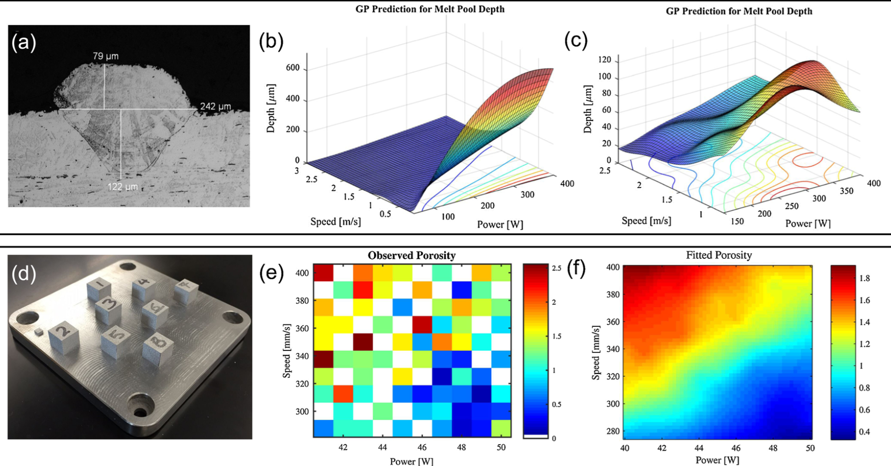

## Title + positioning in SS26 lecture triad

::: {.fragment}
- **MFML** provides the mathematical backbone for both applied SS26 courses.
- **Materials Genomics (MG)** and **ML for Characterization/Processing (ML-PC)** consume this notation directly.
- Goal: shared conceptual language so students can transfer methods across domains.
:::
::: {.fragment}
### Core textbooks for this course

::: {.columns}
::: {.column width="25%"}
{height=600px}
<br>
<small>Neuer: <br>Mathematical Foundations for Machine Learning</small>
:::
::: {.column width="25%"}
{height=600px}
<br>
<small>McClarren: <br>Machine Learning for Engineers</small>
:::
::: {.column width="25%"}
{height=600px}
<br>
<small>Murphy: <br>Machine Learning: A Probabilistic Perspective</small>
:::
::: {.column width="25%"}
{height=600px}
<br>
<small>Bishop: <br>Pattern Recognition and Machine Learning</small>
:::
:::

:::
## Why this course now?

::: {.fragment}
- Many students can “run models” but struggle to justify modeling decisions.
- Engineering ML requires **validity, uncertainty, and failure analysis**, not only accuracy.
- This unit reframes ML from tool usage to principled scientific modeling.
:::

## Learning outcomes for Unit 1

By the end of this lecture, students can:

::: {.fragment}
- formulate supervised learning as a risk-minimization problem,
- explain model/loss/regularization/generalization coherently,
- identify leakage and overconfidence risks in materials workflows,
- separate lecture-core theory from exercise implementation tasks.
:::

## What you should already know

::: {.fragment}
- Calculus basics, linear algebra, and SVD are assumed.
- Very basic Python is assumed (NumPy-level competency).
- We now reinterpret these prior tools as components of learning systems.
:::

## What students often confuse

::: {.fragment}
- AI vs ML vs deep learning vs statistics vs simulation.
- Predictive fit vs scientific explanation.
- High benchmark score vs deployable trustworthy model.
:::

## Quick map: AI vs ML vs DL vs Data Science

::: {.columns}
::: {.column width="50%"}
::: {.fragment}
- **AI**: broad umbrella for intelligent systems.
- **ML**: data-driven function estimation inside AI.
- **DL**: model family inside ML.
- **Data science**: includes data engineering, diagnostics, domain interpretation, and deployment context [@sandfeld_materials_data_science].
:::
:::

::: {.column width="50%"}
```{mermaid}
%%| echo: false
%%| fig-align: center
graph TD
    %% Styling
    classDef default fill:#f8fafc,stroke:#cbd5e1,stroke-width:2px,color:#334155,rx:8px,ry:8px,font-family:Inter;
    classDef accent fill:#e0f2fe,stroke:#38bdf8,stroke-width:2px,color:#0f172a,rx:8px,ry:8px,font-family:Inter,font-weight:600;
    linkStyle default stroke:#94a3b8,stroke-width:2px;

    subgraph DS [Data Science]
    AI[Artificial Intelligence] --> ML[Machine Learning]
    ML --> DL[Deep Learning]
    end
```
:::
:::

## Domain knowledge matters

::: {.fragment}
- Materials and engineering constraints reduce the hypothesis space.
- Physically impossible predictions are still wrong even if numerically low-loss.
- Domain priors improve data efficiency and robustness.
:::

## Roadmap of today 

::: {.fragment}
- Part A: model concept and epistemology.
- Part B: formal supervised learning core.
- Part C: validation, uncertainty, and trust.
- Part D: transfer to materials tasks and exercise handoff.
:::

## What is a model? (Neuer 1.1)

::: {.fragment}
- A model is a purposeful abstraction of reality for prediction and reasoning.
- Models trade realism for tractability and decision usefulness.
- Good models are evaluated at the **decision point**, not by aesthetics [@neuer2024machine].
:::
::: {.fragment}
### First-principles models 

 
<iframe
  src="../../assets/widgets/gravitational_law_widget.html"
  frameBorder="0"
  width="50%"
  height="440px"
  style="border: none;"
  loading="lazy"
  title="Interactive gravitational law widget"
></iframe> 

 
- Example: classical gravitation as a mechanistic model.
- Strengths: interpretability, invariance, extrapolation under assumptions.
- Limits: real systems often violate simplifying assumptions.
:::

::: {.notes}
 

Many models originate from axioms and the laws of nature. They link physical quantities with each other and thus allow a direct understanding of the relationships. Because of this property, they are called First-Principle models. They are captured by compact mathematical equations. Differential equations, conservation laws up to state models of control technology are examples of this.

A well-known first-principle model illustrates this a bit closer: the law of gravity. The force that two masses $m_1$ and $m_2$ exert on each other is proportional to the product of these masses and inversely proportional to the square of their distance $r$,

$$
F \propto \frac{m_1 m_2}{r^2}
$$

This model allows us to directly understand the relationship between the masses and their distance. It is also compactly formulated. This equation states what will happen if we, for example, double the mass $m_2$. On the other hand, if we find that the force has become four times smaller than before, we can say why by measuring $r$ and knowing $m_1$ and $m_2$: because the radius has doubled.

Let’s highlight the important features of models again: a) They help us understand complex relationships as they link variables together and b) they predict the behavior of systems.
:::


## Data-based modeling (top-down)

::: {.fragment}
- Learn relationships from observed \\((x,y)\\) pairs.
- Assumes relevant structure is represented in measured data.
- Performance depends on data quality, coverage, and split design [@neuer2024machine].
:::

::: {.fragment}
**Example: Additive Manufacturing (3D Printing)**

- *Bottom-up limits*: Simulating melt-pool multiphysics for every layer is computationally intractable.
- *Top-down approach*: Predict final part porosity ($y$) directly from laser parameters and in-situ sensor data ($x$) [@meng2020machine].
  
{width=55%}
:::
 


::: {.notes}
**Data-based Models**
 
Since machines are based on scientific principles, models help us identify problems in industrial production. Many technical processes are combinations of several processes. Often, the individual processes are so complex that a complete representation is only possible to a limited extent, even with reduced first-principle models. Especially the original bottom-up approach, deriving relationships from axioms or basic laws, is difficult. For example, in metal additive manufacturing, simulating the exact melt pool multiphysics for every layer is computationally impossible.

This is where data-based modeling comes into play. Data exists from many technical processes. What happens in the processes can be recorded at least within the accuracy of the sensors. Assuming all relevant data is captured and we have both the influencing variables and the size we want to understand or predict, then the actual dependency is contained in the data and can be extracted from it. This is the basic assumption of data-based modeling.

In contrast to deriving a model with the bottom-up approach, data-based modeling begins with the observation of the processes. This is top-down, as the process serves as the starting point and the details are only discovered afterwards. Subsequently, statistical tools are used to set up simple models. As complexity increases, machine learning methods are used. They form a separate subgroup of data-based modeling. Yet, there are difficulties and open questions:

- Choice of variables. Is the dynamics we want to capture even captured by the data?
- Quality of measurement. Are the sensor data accurate enough to represent the problem?
- Amount of data. Do we have enough measurement points available to set up the desired model?
:::

## When first-principles is insufficient

::: {.fragment}
- Complex process chains can be nonlinear, high-dimensional, and partially observed.
- Closed-form mechanistic models can be unavailable or too expensive.
- Hybrid strategies (physics + data) are often the engineering sweet spot.
:::

### White-box / grey-box / black-box

::: {.columns}
::: {.column width="50%"}
::: {.fragment}
- **White-box**: explicit mechanism and interpretable parameters.
- **Black-box**: high predictive flexibility, low immediate interpretability.
- **Grey-box**: blends mechanistic structure with learned components [@neuer2024machine].
:::
:::

::: {.column width="50%"}
```{mermaid}
%%| echo: false
%%| fig-align: center
graph LR
    %% Styling
    classDef default fill:#f8fafc,stroke:#cbd5e1,stroke-width:2px,color:#334155,rx:8px,ry:8px,font-family:Inter;
    classDef accent fill:#e0f2fe,stroke:#38bdf8,stroke-width:2px,color:#0f172a,rx:8px,ry:8px,font-family:Inter,font-weight:600;
    linkStyle default stroke:#94a3b8,stroke-width:2px;

    Model[Model Type]:::accent --> WB[White-box]:::accent
    Model --> GB[Grey-box]:::accent
    Model --> BB[Black-box]:::accent

    WB --- WBdesc[Physics-based]
    GB --- GBdesc[Hybrid]
    BB --- BBdesc[Data-driven]
```
:::
:::

::: {.notes}
The characterization in first-principle and data-based models is oriented towards the model’s origin. Another property is the traceability of a model. Here, the following categories are distinguished:

- **White-Box Models**: Any model that is completely traceable and explainable is called a White-Box model. We can look into the model and understand how it works. First-Principle models are White-Box models. Data-based approaches such as linear regression can also be White-Box models.
- **Black-Box Models**: If traceability is not possible and thus the internal mechanisms are not known, then it is called a Black-Box model. Such models can predict processes, but they do not allow any statement about the relationship between input and output variables. Consequently, it is difficult to trust Black-Box models. Machine learning algorithms are often accused of belonging to this category. However, this is not necessarily true. There are methods, as we will learn later, that help us to investigate models for their internal mechanisms and thus move from the Black-Box character to a real understanding and trust.
- **Grey-Box Models**: A third variant is Grey-Box models, which are partially traceable. They use input variables whose influence is known, and additional variables whose effect cannot be captured. Monte Carlo methods are counted in this category because they contain an analytical core, e.g., a differential equation, and simulate this with stochastic variables. Since the latter are random processes, at least part of the Monte Carlo simulation is unpredictable.
:::

## Why black-box criticism appears

::: {.fragment}
- Safety, traceability, and auditability requirements in engineering settings.
- Difficulty diagnosing failure causes without behavioral probes.
- High-stakes contexts demand calibrated confidence and explainability.
:::

::: {.notes}
The lack of reference to natural laws is a disadvantage of data-based modeling. Some practitioners and users criticize data-based models because of their difficult traceability. They base their criticism on a purely Black-Box character. The acceptance of machine learning was initially affected by this. However, many of these critics are based on false assumptions.

The diversity of models has increased over the years. Machine learning algorithms can be made understandable and explainable. They now belong to the area of Grey-Box models. The integration of physical First-Principle models as part of data-based models is unknown to many users. However, these approaches have many successes in the industry to show.

Learning methods can be sampled. By deliberately disturbing the input variables, one can check how the algorithm behaves. Thus, we can identify analytical relationships for non-deterministic neural networks. For most learning methods, a basis for explainability can be achieved with the help of tools from stochastic.
:::

## Explainability as spectrum, not binary

::: {.fragment}
- Global explainability: model-level behavior patterns.
- Local explainability: case-level attribution/sensitivity.
- Explainability quality must be judged against stakeholder questions.
:::

## Hybrid modeling mindset

::: {.fragment}
- Put trusted physics where available.
- Learn residuals or unknown couplings from data.
- Keep interfaces explicit so assumptions are inspectable and testable.
:::
::: {.fragment}
### Mini-checkpoint question


- Is linear regression always “white-box” in practice?
- What if features are heavily engineered or leakage-contaminated?
- Discussion target: transparency depends on *entire pipeline*, not formula alone.
:::

## Structural classification of data

::: {.fragment}
- **Structured:** Predefined schema and format (e.g., SQL tables, technical process data).
- **Unstructured:** No fixed data model (e.g., images, books, health records).
- **Semi-structured:** Mix of ordered and flexible components (e.g., emails, digital twin memory).
:::

## Quantitative and qualitative classification

::: {.fragment}
- **Quantitative:**
  - *Continuous*: Can assume any value within a range (e.g., length, analog signals).
  - *Discrete*: Clearly separable, countable points (e.g., product counts, digital data).
:::
::: {.fragment}
- **Qualitative:**
  - *Nominal*: Descriptive attributes without intrinsic order (e.g., material names, colors).
  - *Ordinal*: Data with a logical ranking or sequence (e.g., months, quality ratings).
  - *Cardinal*: Data supporting arithmetic operations.
  - *Binary*: Boolean (True/False, Pass/Fail) states.
:::

## Time series and labels

::: {.fragment}
- **Time Series:** Data points indexed and ordered by time; typically cardinal and discrete in modern systems.
- **Labels:** Special qualitative or quantitative variables used as training targets in mapping $x \to y$.
:::

## Measurement scales

::: {.fragment}
- **Nominal scale:** Sorting into categories; operations $=, \neq$.
- **Ordinal scale:** Introduces ranking; operations $<, >$.
- **Interval scale:** Meaningful distances, but no absolute zero (e.g., $^{\circ}$C); allows $+, -$. 
- **Ratio scale:** Absolute zero exists; enables ratios and scaling (e.g., Kelvin); allows $\times, \div$.
:::

## Data notation and task notation

- Dataset: $\mathcal{D} = \{(\mathbf{x}_i, y_i)\}_{i=1}^N$
- Hypothesis class: $f_\theta: \mathcal{X} \to \mathcal{Y}$
- Objective: choose $\theta$ minimizing risk under deployment-relevant assumptions.

## Empirical risk minimization (ERM)

- Core training objective:

$$
\hat\theta = \arg\min_\theta \frac{1}{N}\sum_{i=1}^{N}\ell\big(f_\theta(\mathbf{x}_i), y_i\big)
$$

- ERM fits observed data, not future distribution automatically.

## Regularized objective

- Practical objective adds complexity penalty:

$$
\hat\theta = \arg\min_\theta \frac{1}{N}\sum_{i=1}^{N}\ell\big(f_\theta(\mathbf{x}_i), y_i\big) + \lambda\Omega(\theta)
$$

- \\(\lambda\\) controls fit–complexity tradeoff.

## Population risk vs empirical risk

::: {.columns}
::: {.column width="50%"}
### Empirical Risk
::: {.fragment}
- Optimized on $\mathcal{D}_{train}$
- Proxy for performance
- Can be driven to zero (overfit)
:::
:::

::: {.column width="50%"}
### Population Risk
::: {.fragment}
- Expected error on $\mathcal{P}$
- True performance goal
- Requires generalization
:::
:::
:::

::: {.fragment}
- **Generalization gap**: $R_{test} - R_{train}$.
- This is the central bridge from statistics to real engineering decisions [@murphy2012machine; @bishop2006pattern].
:::

## Regression vs classification vs ranking


- Regression: continuous target estimation.
- Classification: class-probability estimation.
- Ranking: relative ordering for screening/prioritization workflows.

## Loss functions and meaning

- MSE emphasizes large errors quadratically.
- MAE is robust to outliers but less smooth for optimization.
- Cross-entropy aligns naturally with probabilistic classification outputs.

## Optimization lens

- Learning is numerical optimization in parameter space.
- Convergence behavior depends on curvature, scaling, and initialization.
- “Model failure” is often an optimization-pathology issue.

## Bayesian lens (intro)

- Bayesian update:

$$
p(\theta\mid\mathcal D) \propto p(\mathcal D\mid\theta)\,p(\theta)
$$

- Output is a distribution over parameters/predictions, not just a point estimate.

## Frequentist vs Bayesian workflow (practical)

- Frequentist practice often emphasizes point estimates + confidence intervals.
- Bayesian practice emphasizes posterior predictive uncertainty.
- Engineering choice depends on risk tolerance, compute budget, and interpretability needs.

## Decision layer separate from inference

- Inference estimates what is likely.
- Decision-making selects actions under cost/utility constraints.
- Good predictions with wrong decision threshold can still be operationally bad.

## No-free-lunch intuition

- No algorithm dominates over all data-generating processes.
- Every model encodes inductive bias.
- Model choice should reflect domain structure and failure costs [@murphy2012machine].

## Curse of dimensionality (conceptual)

- Data requirement grows rapidly with feature dimension.
- Sparse high-dimensional regimes invite overfitting.
- Structure assumptions, priors, and representations are mandatory.

## Recap: 6 equations/ideas to remember

- ERM and regularized ERM.
- Population risk vs empirical risk.
- Bayesian update and posterior predictive view.
- Generalization gap and why train error is insufficient.
- Inductive bias and no-free-lunch perspective.
- Decision layer must align with uncertainty + cost.

## Overfitting explained visually

- Underfit: high bias, misses structure.
- Overfit: memorizes quirks/noise, weak transfer.
- Well-fit: captures stable signal with controlled complexity.

## Bias–variance intuition

::: {.columns}
::: {.column width="50%"}
### Bias
::: {.fragment}
- Systematic error
- Model is too simple
- "Underfitting"
:::
:::

::: {.column width="50%"}
### Variance
::: {.fragment}
- Sensitivity to noise
- Model is too complex
- "Overfitting"
:::
:::
:::

::: {.fragment .mt-4}
- **Practical goal**: minimize expected deployment error, not one split score.
:::

## Train/val/test splits

- Train: fit parameters.
- Validation: tune model/hyperparameters.
- Test: one-shot final estimate.
- Never “peek” at test during iterative tuning.

## Cross-validation

- k-fold CV improves stability under limited data.
- Use grouped/blocked CV when IID assumptions break.
- Random CV can be misleading for correlated materials families [@ryan2021machine].

## Data leakage taxonomy

- Preprocessing leakage: statistics fit on full dataset.
- Group leakage: related samples split across train/test.
- Temporal leakage: future information in training features.

## Metrics linked to decisions

- MAE/RMSE for absolute error behavior.
- Calibration for probability trustworthiness.
- Cost-sensitive metrics when false negatives/positives are asymmetric.

## Uncertainty types (engineering interpretation)

- **Aleatoric**: irreducible measurement/process noise.
- **Epistemic**: reducible uncertainty from limited knowledge/data.
- Different mitigation actions are required for each [@neuer2024machine].

## Model confidence vs correctness

- High confidence can still be wrong (miscalibration).
- Reliability diagrams and calibration checks are essential.
- Threshold decisions should use calibrated outputs.

## Trust checklist for engineering ML

- Data provenance documented?
- Split strategy deployment-realistic?
- Uncertainty quantified and interpreted?
- Failure modes and fallback policy defined?

## Checkpoint MCQ slide

- Scenario: high CV score, low deployment performance.
- Ask students to identify likely root causes (leakage? shift? calibration? objective mismatch?).
- Use this as exam-style reasoning practice.

## Materials example 1: process→property regression

::: {.columns}
::: {.column width="60%"}
- Inputs: process parameters, composition, heat treatment metadata.
- Target: hardness / tensile strength (continuous).
- Risks: confounding from batch effects, hidden process controls.
:::

::: {.column width="40%"}
{width=100%}
:::
:::

## Materials example 2: defect classification from images

::: {.columns}
::: {.column width="60%"}
- Inputs: microscopy images + acquisition metadata.
- Target: defect class / defect probability.
- Risks: class imbalance, label noise, instrument-specific artifacts.
:::

::: {.column width="40%"}
{width=100%}
:::
:::

## Materials example 3: spectra interpretation task framing

::: {.columns}
::: {.column width="60%"}
- Inputs: spectral signal (possibly multimodal context).
- Targets: composition class, phase indicator, or property proxy.
- Risks: baseline drift, preprocessing leakage, calibration instability.
:::

::: {.column width="40%"}
{width=100%}
:::
:::

## How MFML links to Materials Genomics

- MG relies on MFML’s risk/validation language for trustworthy discovery.
- Representation, latent spaces, and uncertainty all require Unit 1 foundations.
- Dataset quality and split logic dominate many downstream MG outcomes [@sandfeld_materials_data_science].

## How MFML links to ML-PC

- ML-PC applies the same principles to noisier experimental signals.
- Measurement physics introduces additional constraints on pipeline validity.
- MFML concepts become operational safeguards in lab workflows [@ryan2021machine].

## Lecture-essential vs exercise content split

**Lecture essential:**
- definitions, equations, assumptions, validity criteria.

**Exercise essential:**
- implementation, diagnostics, ablations, error analysis.

## Exercise setup: NumPy linear regression from scratch

- Build linear regression objective and gradient updates manually.
- Implement train/validation split with strict separation.
- Plot training vs validation loss curves over iterations.

## Exercise extension: regularization + split stress test

- Add L2 term and compare under/overfit behavior.
- Repeat with different split strategies (random vs grouped).
- Document when measured “improvement” is actually leakage-driven.

## Exam-aligned summary: 10 must-know statements

1. ML is optimization under uncertainty, not magic fitting.
2. Train loss is not deployment success.
3. Split design is part of the model.
4. Leakage invalidates performance claims.
5. Metrics must align with decisions.
6. Uncertainty must be interpreted by type.
7. Inductive bias is unavoidable.
8. Domain constraints improve trustworthiness.
9. Explainability is contextual, not absolute.
10. Reproducibility is a scientific requirement.

## References + reading assignment for next unit

- **Required reading before Unit 2:**
  - Neuer: Ch. 1.1 and 1.3
  - McClarren: Ch. 1.1 and 1.5
- **Optional depth:**
  - Murphy: Ch. 1.1–1.4
  - Bishop: Ch. 1.1 and 1.3
- Next unit: linear algebra geometry for learning (projections, conditioning, SVD/PCA bridge).

::: {#refs}
::: 
