## Title + positioning in SS26 lecture triad

::: {.fragment}
- **MFML** provides the mathematical backbone for both applied SS26 courses.
- **Materials Genomics (MG)** and **ML for Characterization/Processing (ML-PC)** consume this notation directly.
- Goal: shared conceptual language so students can transfer methods across domains.
:::

::: {.fragment}
### Why this course now?

- Many students can “run models” but struggle to justify modeling decisions.
- Engineering ML requires **validity, uncertainty, and failure analysis**, not only accuracy.
- This unit reframes ML from tool usage to principled scientific modeling.
:::

::: {.notes}
Emphasize that this course is the foundation for Materials Genomics (MG) and Machine Learning for Characterization and Processing (ML-PC). Ensure students understand this triad structure.
:::

## Books for the lecture triad

::: {.columns}
::: {.column width="33%"}

:::
::: {.column width="33%"}
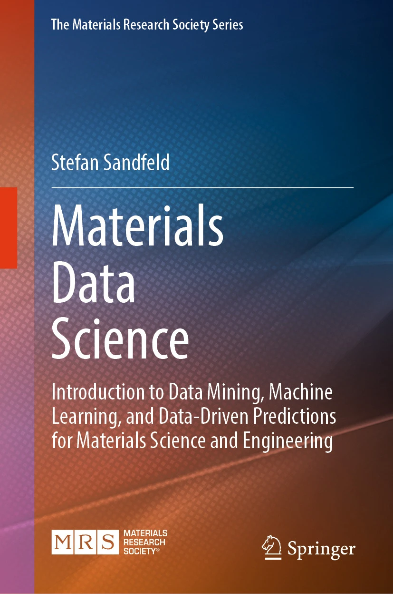
:::
::: {.column width="33%"}

:::
:::

::: {.notes}
Briefly introduce the standard texts. Bishop for fundamental mathematical ML, Sandfeld for materials data science contexts, and Neuer for engineering ML specifics.
:::

## Advanced Materials Development

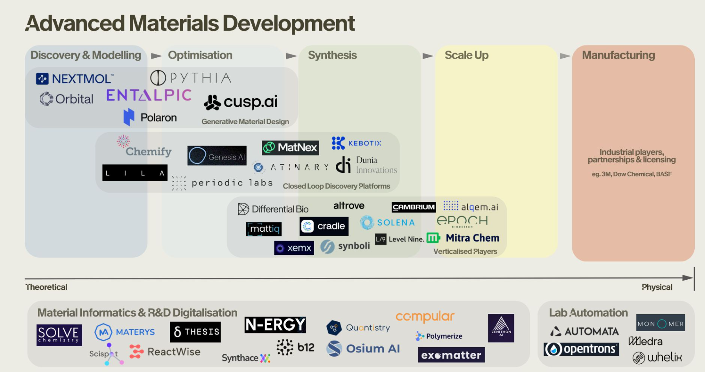

## Advanced Materials Development - Generative Design

::: {.fragment}
- **Orbital Materials**: Developing generative AI and "foundation models for atoms" to design new materials for carbon capture and clean energy storage.
:::

::: {.fragment}
- **CuspAI**: Building an algorithmic materials discovery platform—effectively a "search engine" for exact atomic structures and sustainable materials using generative models.
:::

::: {.fragment}
- **Polaron**: Accelerating the design of advanced materials by applying generative AI directly to the discovery and optimization of new multi-component systems.
:::

::: {.notes}
Highlight that generative AI is moving far beyond text and images into the physical world. Emphasize the rapidly growing startup ecosystem built around this exact capability:
- **Orbital Materials**: Focuses on foundation models for tackling big climate tech challenges.
- **CuspAI**: Founded by prominent ML researchers, aiming to computationally generate and evaluate materials on demand.
- **Polaron / Nextmol / Pythia / Enthalpic**: Mention that an entire wave of specialized startups has emerged tackling everything from alloys and inorganic materials (Polaron, Pythia) to molecular/polymer design and sustainable chemistry (Nextmol, Enthalpic).
:::

## Advanced Materials Development - Closed Loop Discovery Platforms

::: {.columns}
::: {.column width="50%"}
::: {.fragment}
- **Chemify**: Digitizing chemistry via "Chemputation," linking AI-driven molecular design with robotic synthesis.
:::

::: {.fragment}
- **Atinary**: Powering "Self-Driving Labs" with a no-code AI platform to automate the Design-Make-Test-Learn cycle.
:::

::: {.fragment}
- **Kebotix**: Integrating AI and robotic lab automation to form a self-driving platform targeting new chemicals and materials.
:::
:::

::: {.column width="50%"}
::: {.fragment}
- **Periodic Labs**: Deploying frontier AI models as "AI scientists" to autonomously design, execute, and learn from physical experiments.
:::

::: {.fragment}
- **MatNex**: Combining AI with quantum mechanics algorithms for rapid materials discovery, e.g., rare-earth-free magnets.
:::

::: {.fragment}
- **Genesis AI**: Building autonomous discovery engines that orchestrate AI agents and robotic hardware.
:::
:::
:::

::: {.notes}
Highlight that closed-loop discovery represents the shift from purely predictive AI to physical autonomy ("Self-Driving Labs").
- The defining feature of these platforms is the automated feedback loop: physical experimental results (both positive and negative) are fed directly back into the AI to refine the next round of hypotheses without a human bottleneck.
- Companies like **Chemify** (Chemputation), **Atinary**, and **Kebotix** are building the software/hardware bridges to execute this loop.
- **Periodic Labs** and **Genesis AI** focus on using cutting edge AI as fully autonomous agents planning and executing experiments.
- **MatNex** successfully integrates physics-based solvers with ML to quickly discover and test new materials in months instead of decades.
:::


## Advanced Materials Development - Materials Informatics & R&D Digitalization

::: {.fragment}
- **N-ERGY**: R&D intelligence platform leveraging AI and knowledge graphs to accelerate materials discovery for extreme environments.
:::

::: {.fragment}
- **Materys**: Cloud-based virtual laboratory automating complex material simulations and data management.
:::

::: {.fragment}
- **ReactWise**: AI-powered platform for chemical process optimization using Bayesian active learning to accelerate synthesis.
:::

::: {.fragment}
- **Polymerize**: Materials informatics platform focusing on predicting and optimizing polymer formulations.
:::

::: {.fragment}
- **Synthace**: Digital experiment platform for lab automation and orchestrating complex R&D experiments.
:::

::: {.notes}
Briefly cover how digitalization and informatics platforms streamline traditional R&D:
- **N-ERGY** and **Materys** focus on knowledge integration and making computational simulations more accessible.
- **ReactWise** and **Polymerize** are tailored to optimizing specific processes: chemical synthesis and polymer formulations, using AI to reduce trial-and-error.
- **Synthace** represents the automation side, acting as a crucial digital layer between experiment design and lab hardware.
:::


## Learning outcomes for Unit 1

By the end of this lecture, students can:

::: {.fragment}
- formulate supervised learning as a risk-minimization problem,
- explain model/loss/regularization/generalization coherently,
- identify leakage and overconfidence risks in materials workflows,
- separate lecture-core theory from exercise implementation tasks.
:::

::: {.notes}
Walk through the four outcomes. Set the expectation that they need to understand these conceptually by the end of the lecture.
:::

## What students already know

::: {.fragment}
- Calculus basics, linear algebra, and SVD are assumed.
- Very basic Python is assumed (NumPy-level competency).
- We now reinterpret these prior tools as components of learning systems.
:::

::: {.notes}
Reassure students. They have the mathematical prerequisites, the goal now is to combine these tools intelligently.
:::

## What students often confuse

::: {.fragment}
- AI vs ML vs deep learning vs statistics vs simulation.
- Predictive fit vs scientific explanation.
- High benchmark score vs deployable trustworthy model.
:::

::: {.notes}
Pause here. This is important to frame the right mindset. ML is not magic; it is statistics and optimization combined with domain knowledge.
:::

## Quick map: AI vs ML vs DL vs Data Science

::: {.columns}
::: {.column width="50%"}
::: {.fragment}
- **AI**: broad umbrella for intelligent systems.
- **ML**: data-driven function estimation inside AI.
- **DL**: model family inside ML.
- **Data science**: includes data engineering, diagnostics, domain interpretation, and deployment context [@sandfeld_materials_data_science].
:::
:::

::: {.column width="50%"}
{width=100%}
:::
:::

::: {.notes}
Use the diagram (or concept) to show containment. AI is the broad goal, ML is the method (learning from data), DL is a specific ML algorithm subset.
:::

## Domain knowledge matters

::: {.fragment}
- Materials and engineering constraints reduce the hypothesis space.
- Physically impossible predictions are still wrong even if numerically low-loss.
- Domain priors improve data efficiency and robustness.
:::

::: {.fragment}
> **Example — Alloy yield strength:**
> A neural net trained on composition → yield-strength data predicts $\sigma_y < 0$ for a novel alloy.
> The test MSE is low, but the prediction is physically meaningless ($\sigma_y \geq 0$).
> Encoding this constraint (e.g. softplus output) eliminates impossible predictions **and** reduces the data needed because the model no longer wastes capacity on the infeasible region.
:::

::: {.notes}
Walk through the example step by step:

1. A team collects ~500 composition–yield-strength pairs from the literature and trains a small fully connected network.
2. For an out-of-distribution composition the model returns $\sigma_y = -12$ MPa — numerically a small residual, but physically nonsensical.
3. The fix is simple: replace the linear output with a softplus activation, enforcing $\sigma_y \geq 0$.
   This is a domain prior that shrinks the hypothesis space from $\mathbb{R}$ to $\mathbb{R}^+$.
4. After the constraint, the model converges faster and needs fewer samples
   because it no longer has to "learn" that negative strength is impossible.

Key takeaway for students: domain knowledge is not optional decoration —
it is a formal part of the model specification that affects generalization, data efficiency, and trustworthiness.
:::

## Roadmap of today’s 90 min

::: {.fragment}
- Part A: model concept and epistemology.
- Part B: formal supervised learning core.
- Part C: validation, uncertainty, and trust.
- Part D: transfer to materials tasks and exercise handoff.
:::

::: {.notes}
Quickly outline the four parts to give students a mental timeline of the lecture and keep them oriented.
:::

## What is a model? (Neuer 1.1.1)

::: {.fragment}
- A model is a purposeful abstraction (simplified representation) of reality designed for prediction and explanation (reasoning).
- We distinguish between **First-Principle models** (bottom-up, based on physical laws) and **Data-based models** (top-down, extracted from observations).
- Models trade realism for tractability and decision usefulness.
- Good models are evaluated at the **decision point**, not by aesthetics [@neuer2024machine].
:::

### First-principles model example

::: {.fragment}
- Example: classical gravitation as a mechanistic model.
- Strengths: interpretability, invariance, extrapolation under assumptions.
- Limits: real systems often violate simplifying assumptions.
:::

::: {.notes}
Discuss abstraction. Remind them that 'all models are wrong, but some are useful' (Box). The value is in the decision-making utility, not absolute truth.
:::

## Data-based modeling (top-down)

::: {.fragment}
\begin{itemize}
  \item Infer patterns and dependencies directly from observed data pairs $(\mathbf{x}, y)$.
\end{itemize}
- Assumes relevant structure is represented in measured data.
- Performance depends on data quality, coverage, and split design [@neuer2024machine].
:::

::: {.notes}
Contrast with the bottom-up first-principles model. Highlight that data-based models learn the map f(x) -> y directly without necessarily knowing the mechanistic physics loop.
:::

## When first-principles is insufficient

::: {.fragment}
- Complex process chains can be nonlinear, high-dimensional, and partially observed.
- Closed-form mechanistic models can be unavailable or too expensive.
- Hybrid strategies (physics + data) are often the engineering sweet spot.
:::

::: {.fragment}
> **Example — Melt-pool dynamics in additive manufacturing:**
> We can formulate the partial differential equations (PDEs) for laser-melting metal powder, but simulating them for a whole part is computationally too expensive for real-time control. Internal defects are also physically "partially observed."
> A hybrid strategy trains an ML model on high-fidelity simulations and sensor data to predict defects in real-time, bypassing the computational bottleneck of pure physics while retaining physical validity [@meng2020machine].

[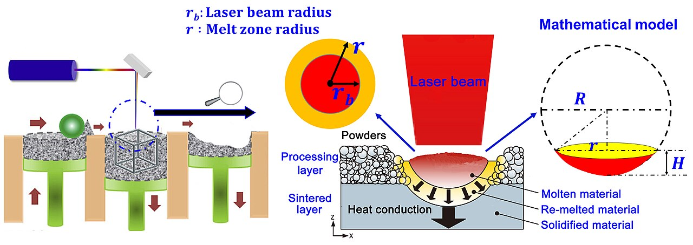{width=50%}](https://en.wikipedia.org/wiki/Selective_laser_melting)
:::
::: {.notes}
Reflect on Neuer's point: many modern technical systems are combinations of highly complex interacting processes. Deriving everything top-to-bottom from pure axioms hits a complexity wall in practice.

Walk the students through the additive manufacturing example:
1. **Intractable physics**: We have the fundamental equations (e.g., heat transfer, fluid dynamics) for a microscopic melt pool. But solving them dynamically for a macro-scale 3D part takes hours or days. It's theoretically possible but practically useless for real-time defect control (i.e. "too expensive").
2. **Partial observability**: We can measure surface variables like temperature with a pyrometer, but we cannot continuously observe the internal porosity forming beneath the process zone.
3. **The Hybrid Sweet Spot**: Instead of abandoning physics entirely to feed raw data into an unconstrained black box, engineers use the physics (e.g., thermal bounds, conservation equations) to constrain the machine learning model. This achieves the execution speed of data-driven models with the reliability of physical laws.
:::

## White-box / grey-box / black-box

::: {.columns}
::: {.column width="50%"}
::: {.fragment}
- **White-box**: explicit mechanism and interpretable parameters (e.g., physical laws, linear regression).
- **Black-box**: non-traceable internal mechanisms (e.g., deep neural networks), high predictive flexibility.
- **Grey-box**: partially traceable, blends mechanistic structure with learned components (e.g., PINNs) [@neuer2024machine].
- **Note**: Explainability techniques aim to move black-box models toward the grey-box category.
:::
:::

::: {.column width="50%"}
```{mermaid}
%%| echo: false
%%| fig-align: center
graph LR
    Model[Model Type] --> WB[White-box]
    Model --> GB[Grey-box]
    Model --> BB[Black-box]

    WB --- WBdesc[Physics-based]
    GB --- GBdesc[Hybrid]
    BB --- BBdesc[Data-driven]
```
:::
:::

::: {.fragment}
> **Example — Grey-box: crystal-plasticity with a learned hardening law:**
> In crystal-plasticity finite-element modeling (CPFEM) the kinematics (deformation gradient decomposition $\mathbf{F} = \mathbf{F}^e \mathbf{F}^p$, slip-system geometry) are well understood and kept as white-box components.
> The strain-hardening law $\dot{\tau}_c = h(\gamma, \dot{\gamma}, T)$, however, encodes complex dislocation interactions that are expensive to derive from first principles.
> A grey-box strategy replaces only this hardening function with a small neural network trained on experimental stress–strain curves, while the surrounding finite-element equilibrium and crystallographic slip rules remain physics-based.
> The result: physically consistent deformation fields **and** accurate hardening behavior without a full empirical constitutive model [@neuer2024machine].
:::

::: {.notes}
Use this slide to anchor the spectrum idea before the later "Hybrid modeling mindset" slide.

**White-box recap (≈ 30 s)**
A white-box model is one where every equation and parameter has a direct physical interpretation.
Classic example: Hooke's law $\sigma = E \varepsilon$. Students can read off the Young's modulus, understand its units, and trace every step of the prediction.
Strengths: interpretability, extrapolation under valid assumptions, auditability.
Weakness: the model is only as good as the assumptions — real materials exhibit plasticity, damage, rate effects, etc.

**Black-box recap (≈ 30 s)**
A black-box model makes minimal structural assumptions; a deep neural network mapping composition → mechanical properties is a typical example.
Strengths: can capture highly nonlinear, high-dimensional relationships.
Weakness: parameters (millions of weights) have no individual physical meaning; failure modes are hard to diagnose; predictions can violate physical constraints (e.g., negative stiffness) unless explicitly constrained.

**Grey-box in depth (≈ 2 min)**
Walk through the CPFEM example step by step:

1. **What is kept from physics?** The finite-element balance equations and the multiplicative decomposition of the deformation gradient $\mathbf{F} = \mathbf{F}^e \mathbf{F}^p$ are retained exactly. These are well-validated continuum-mechanics principles.
2. **What is replaced by ML?** Only the hardening function $h(\gamma, \dot{\gamma}, T)$ — the constitutive sub-model that describes how critical resolved shear stress evolves with accumulated slip. This is the part that is hardest to derive analytically because it depends on dislocation patterning at the microscale.
3. **Why is this better than pure white-box?** Traditional hardening laws (Voce, Kalidindi) have limited functional forms and may need re-calibration for every new alloy. A neural-network sub-model can generalize across alloy families once trained.
4. **Why is this better than pure black-box?** The physics scaffolding (equilibrium, compatibility, crystallography) prevents the model from predicting mechanically impossible deformation fields. The NN only needs to learn a scalar-valued function, not the entire tensor-field mapping — dramatically reducing data requirements.
5. **Interface discipline matters:** The NN inputs/outputs are physically defined quantities (slip, slip rate, temperature → hardening rate). This makes the learned component inspectable: you can plot $h$ vs $\gamma$ and compare it to classical Voce curves. If the learned curve is non-monotonic or negative, you know something is wrong.

**Connecting forward:**
Point out that the "Hybrid modeling mindset" slide (coming shortly) generalises this pattern — "put trusted physics where available, learn residuals or unknown couplings from data." The grey-box concept is exactly that pattern applied at the model-architecture level.

**Potential student question:**
"Isn't grey-box just feature engineering for the NN?" — No. Feature engineering selects *inputs*; grey-box constrains *model structure*. The physics equations are executed during the forward pass, not just used as input features.
:::

## Why black-box criticism appears

::: {.fragment}
- Safety, traceability, and auditability requirements in engineering settings.
- Difficulty diagnosing failure causes without behavioral probes.
- High-stakes contexts demand calibrated confidence and explainability.
:::

::: {.fragment}
> **Example — Automated weld inspection:**
> A deep CNN classifies radiographic weld images as *accept / reject* with 97 % accuracy.
> When a batch of welds is rejected, the production engineer asks: *"Is the defect porosity, lack of fusion, or a crack?"*
> The model cannot answer — it was trained end-to-end on a binary label.
> Without an interpretable intermediate representation, the team must repeat expensive manual inspection to identify the root cause, negating the deployment benefit.

[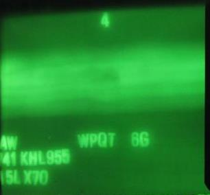{width=20%}](https://commons.wikimedia.org/wiki/File:Weld_radiograph_with_burnthrough_defect.jpg)
:::

::: {.notes}
Walk through the weld-inspection scenario:

1. A quality team deploys a convolutional network trained on ~10 000 labelled radiographs (accept/reject only).
2. The model reaches 97 % balanced accuracy on a held-out test set — impressive on paper.
3. When the model rejects a batch, the production engineer needs the *type* of defect (porosity, lack of fusion, crack) to adjust process parameters. The binary black-box cannot supply this.
4. The team is forced to fall back on manual expert re-inspection, eroding the efficiency gains that justified the ML system.
5. A more transparent alternative: train a segmentation or multi-class model that localises and categorises defects, or apply post-hoc attribution (e.g. Grad-CAM) to expose which image regions drive the reject decision.

Key takeaway: accuracy alone is insufficient when the *downstream decision* requires understanding the failure mode. Black-box criticism in engineering is not philosophical — it is operational.
:::

## Explainability as spectrum, not binary

::: {.fragment}
- Global explainability: model-level behavior patterns.
- Local explainability: case-level attribution/sensitivity.
- Explainability quality must be judged against stakeholder questions.
:::

::: {.fragment}
> **Example — Fatigue-life prediction with SHAP analysis:**
> A gradient-boosted tree predicts fatigue life $N_f$ of welded joints from geometry, load ratio, and material grade.
> *Global* explainability (SHAP summary plot) reveals that stress range $\Delta\sigma$ and weld-toe radius $r$ dominate predictions across the dataset — confirming known fracture-mechanics drivers.
> *Local* explainability (SHAP waterfall for a single joint) shows that for one anomalous prediction the model relied heavily on an unusual surface-roughness value, flagging a possible measurement error.
> The same model, two explainability scopes, two different actionable insights.
:::

::: {.notes}
**Goal of this slide (≈ 3 min):**
Drive home that "explainable" is not a yes/no property of a model — it is a *question-dependent* capability that exists at multiple granularities.

**Definitions (≈ 45 s)**

- *Global explainability*: answers "What has the model learned overall?" Tools: permutation importance, partial-dependence plots (PDP), SHAP summary plots. These reveal which features the model relies on *in aggregate*, and how feature values map to predictions on average.
- *Local explainability*: answers "Why did the model make *this* prediction?" Tools: SHAP waterfall/force plots, LIME, counterfactual explanations. These decompose one prediction into per-feature contributions, enabling case-level auditing.
- Emphasize that global and local explanations can *disagree*: a feature may be unimportant globally but decisive for an individual outlier.

**Walk through the fatigue-life example (≈ 1.5 min)**

1. **Setup:** An engineer trains a gradient-boosted tree on ~2 000 welded-joint fatigue records. Inputs include stress range $\Delta\sigma$, load ratio $R$, weld-toe radius $r$, plate thickness, surface roughness, and material grade. The target is $\log_{10}(N_f)$.
2. **Global view (SHAP summary):** The SHAP summary plot ranks features by mean absolute SHAP value. $\Delta\sigma$ and $r$ dominate — consistent with fracture-mechanics fundamentals (stress intensity factor depends on both). This gives the team confidence that the model has learned physically meaningful structure, not spurious correlations.
3. **Local view (SHAP waterfall):** For one specific joint flagged as an outlier (predicted $N_f$ much lower than expected), the waterfall plot shows that surface roughness contributes an unusually large negative SHAP value. Investigation reveals that the roughness measurement for that specimen was recorded in the wrong unit ($\mu$m vs mm). The local explanation *caught a data-quality issue* that the global view could not surface.
4. **Takeaway:** Global explainability validates the model's learned physics; local explainability enables case-by-case quality assurance. Both are needed; neither alone is sufficient.

**Stakeholder-dependent framing (≈ 45 s)**

- A *quality engineer* needs local explanations to decide whether to accept or reject a specific part.
- A *process designer* needs global explanations to understand which process parameters to optimize.
- A *regulator* needs both: global explanations to approve the model class, and local explanations to audit individual certification decisions.
- Therefore, "Is this model explainable?" is meaningless without specifying *to whom* and *for what purpose*.

**Connecting to exam statement 9:**
Point students to exam statement 9: "Explainability is contextual, not absolute." This slide is the conceptual foundation for that claim.

**Potential student question:**
"Are SHAP values always faithful to the model?" — Not necessarily. SHAP assumes feature independence for TreeSHAP (interventional vs observational). For highly correlated features (e.g., $\Delta\sigma$ and max stress), SHAP attributions can distribute importance arbitrarily among collinear inputs. This is a known limitation worth mentioning briefly, but a full treatment belongs in a later unit on post-hoc interpretability.
:::

## Hybrid modeling mindset

::: {.fragment}
- Put trusted physics where available.
- Learn residuals or unknown couplings from data.
- Keep interfaces explicit so assumptions are inspectable and testable.
:::

::: {.fragment}
> **Example — Thermal-barrier coating lifetime:**
> A turbine-blade thermal-barrier coating (TBC) degrades through oxide-layer growth and thermal cycling. The oxidation kinetics follow a well-known parabolic rate law $h_{\text{ox}} \propto \sqrt{t}$ (trusted physics). However, the spallation failure also depends on interface roughness, coating microstructure, and thermal-cycle profile — couplings that are poorly modelled analytically.
> 
> **Hybrid strategy:**
> 
> - **Physics module**: parabolic oxidation model computes oxide thickness $h_{\text{ox}}(t, T)$.
> - **ML module**: a small network takes $h_{\text{ox}}$, cycle count, roughness, and porosity as inputs and predicts remaining useful life (RUL).
> - **Explicit interface**: the physics module outputs $h_{\text{ox}}$ in μm; the ML module ingests it as a feature alongside microstructural descriptors. If the oxidation model is updated (e.g., different alloy), only the physics module changes; the ML module is retrained on new residuals.
> 
> This is exactly the pattern: trusted physics → learned residual → explicit interface.
:::

::: {.notes}
**Goal of this slide (≈ 3 min):**
Distill the overarching design philosophy that unifies the grey-box, melt-pool, and explainability discussions into three actionable engineering principles.

**Bullet-by-bullet unpacking (≈ 1.5 min)**

1. *"Put trusted physics where available."*
   "Trusted" means validated at the relevant scale and regime — not merely published. Conservation laws (mass, energy, momentum) are almost always trustworthy. A specific constitutive law calibrated for one alloy at room temperature is *not* automatically trustworthy at 1200 °C.
   Remind students of the CPFEM example (grey-box slide): the deformation-gradient decomposition is trusted physics; the hardening law is not.

2. *"Learn residuals or unknown couplings from data."*
   The ML component should model the *discrepancy* between the trusted physics and reality, not the entire input–output mapping. This keeps the learned part small, interpretable, and data-efficient.
   Mathematically: if the physics model predicts $\hat{y}_{\text{phys}}(\mathbf{x})$, the hybrid model is $\hat{y}(\mathbf{x}) = \hat{y}_{\text{phys}}(\mathbf{x}) + f_\theta(\mathbf{x})$ where $f_\theta$ learns the residual. The residual is typically lower-variance and smoother than the raw target, so fewer parameters and fewer data points suffice.

3. *"Keep interfaces explicit so assumptions are inspectable and testable."*
   The boundary between the physics module and the ML module must have clearly defined inputs, outputs, and units. This allows:
   - Independent validation of each module,
   - Diagnosing whether a prediction failure is due to wrong physics or poor learned residuals,
   - Swapping either module without retraining the whole pipeline.
   Connect back to the weld-inspection slide: a black-box that merges everything into one opaque mapping violates this principle and makes debugging impossible.

**Concrete example — Thermal-barrier coating lifetime (≈ 1 min)**

A turbine-blade thermal-barrier coating (TBC) degrades through oxide-layer growth and thermal cycling. The oxidation kinetics follow a well-known parabolic rate law $h_{\text{ox}} \propto \sqrt{t}$ (trusted physics). However, the spallation failure also depends on interface roughness, coating microstructure, and thermal-cycle profile — couplings that are poorly modelled analytically.

Hybrid strategy:
- **Physics module**: parabolic oxidation model computes oxide thickness $h_{\text{ox}}(t, T)$.
- **ML module**: a small network takes $h_{\text{ox}}$, cycle count, roughness, and porosity as inputs and predicts remaining useful life (RUL).
- **Explicit interface**: the physics module outputs $h_{\text{ox}}$ in μm; the ML module ingests it as a feature alongside microstructural descriptors. If the oxidation model is updated (e.g., different alloy), only the physics module changes; the ML module is retrained on new residuals.

This is exactly the pattern: trusted physics → learned residual → explicit interface.

**Connecting backward and forward:**
- Backward: the grey-box slide showed this pattern at the constitutive-law level; the melt-pool slide showed it at the process-model level. This slide generalises the principle.
- Forward: the mini-checkpoint question (next slide) will challenge students to think about when a model that *looks* white-box (linear regression) can still violate the "inspectable interface" principle if features are engineered opaquely.

**Potential student question:**
"How do I decide *how much* physics to include — when is it better to just use a black-box?"
Rule of thumb: include physics when (a) you trust the governing equation in the operating regime, (b) the physics reduces the dimensionality or variance of what the ML component must learn, and (c) the computational cost of executing the physics module is acceptable. If none of these hold — e.g., the physics is speculative, or the simulation is too slow — a well-regularised black-box with strong validation may be more pragmatic.
:::


## Mini-checkpoint question

::: {.fragment}
- Is linear regression always “white-box” in practice?
- What if features are heavily engineered or leakage-contaminated?
- Discussion target: transparency depends on *entire pipeline*, not formula alone.
:::

::: {.notes}
**Goal of this slide (≈ 2-3 min):**
Use this to engage students and challenge their intuitive categorization of model types before moving into the formal parts of the lecture.

**Prompting the discussion:**
1. Ask the audience: "Who thinks linear regression is an interpretable, white-box model?" (Expect most to agree). 
2. Challenge them: "Now, what if the inputs are 10,000 auto-generated, non-physical cross-terms, or features extracted by an opaque deep neural network?"

**Key talking points to steer the discussion:**
- **The formula is not the whole model:** $y = \mathbf{w}^T \mathbf{x} + b$ is mathematically totally transparent. You can read off the weights. But if $\mathbf{x}$ itself is a black-box sequence of transformations without physical units, the final prediction is completely opaque to an engineer.
- **Leakage contamination:** If an engineered feature accidentally contains "future" information (e.g., using a destructive test measurement as an input feature for an early-stage screening model), the linear model will assign it a massive weight. The math works perfectly, but the scientific validity is zero.

**The core takeaway:**
Transparency and interpretability are properties of the **entire processing pipeline**—from raw data collection and feature engineering down to the final equation. A simple, transparent formula at the end of an opaque pipeline does not make it a white-box model!
:::

## Types of learning

::: {.columns}
::: {.column width="33%"}
### Supervised Learning
::: {.fragment}
Learning with labeled data. Includes regression (continuous targets) and classification (discrete categories).

**Example:** Predicting alloy yield strength from chemical composition [*Bhandari et al., 2020*].
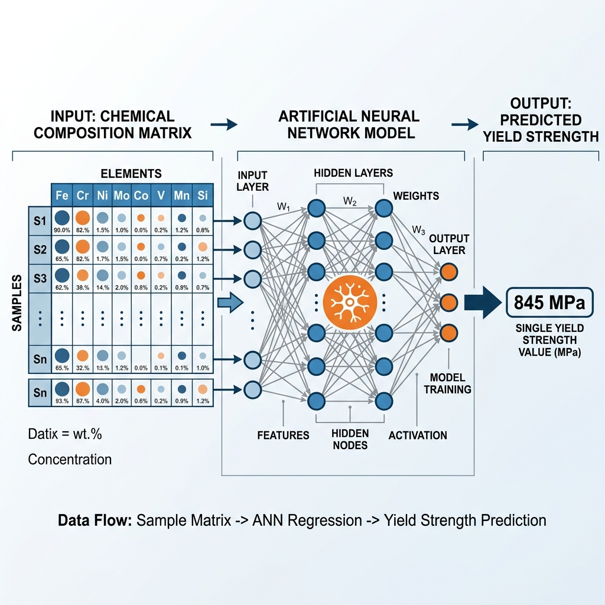{width=100%}
:::
:::

::: {.column width="33%"}
### Unsupervised Learning
::: {.fragment}
Finding hidden structure in unlabeled data (clustering, dimensionality reduction, embeddings).

**Example:** Clustering unlabelled microscopy images to discover distinct phases [*Stender et al., 4D-STEM phase mapping*].
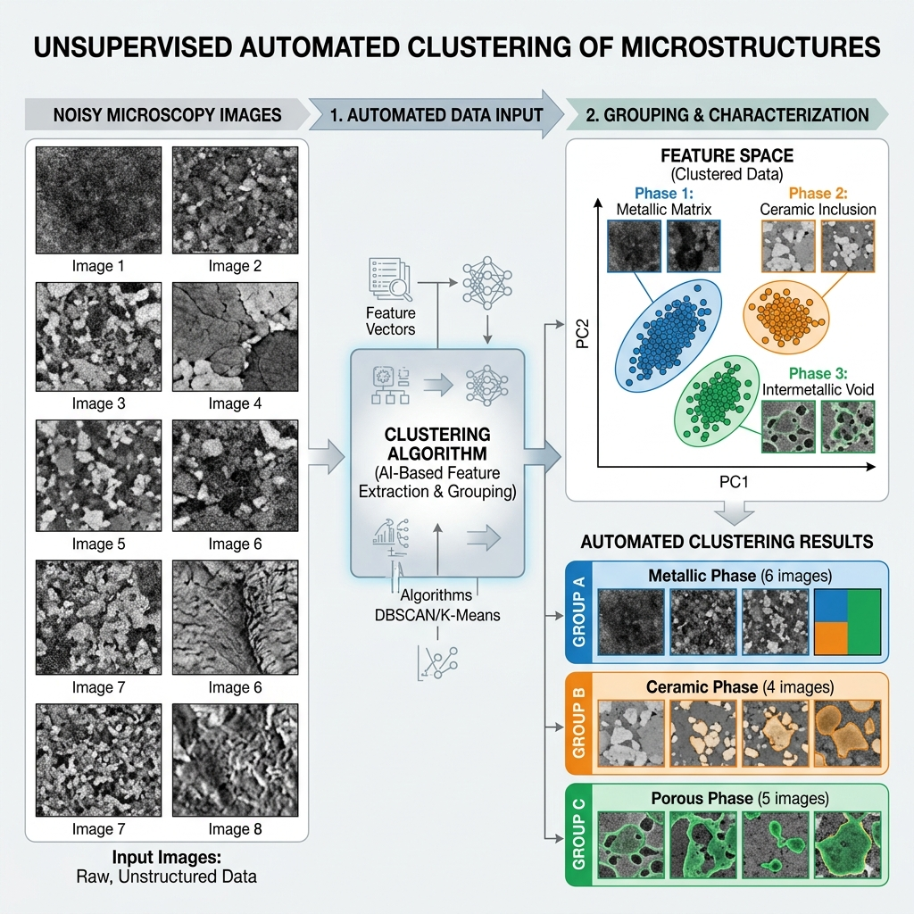{width=100%}
:::
:::

::: {.column width="33%"}
### Reinforcement Learning
::: {.fragment}
Learning optimal actions through trial and error to maximize a reward signal.

**Example:** An autonomous agent controlling a laser-melting process to minimize defects [*Wang et al., 2021*].
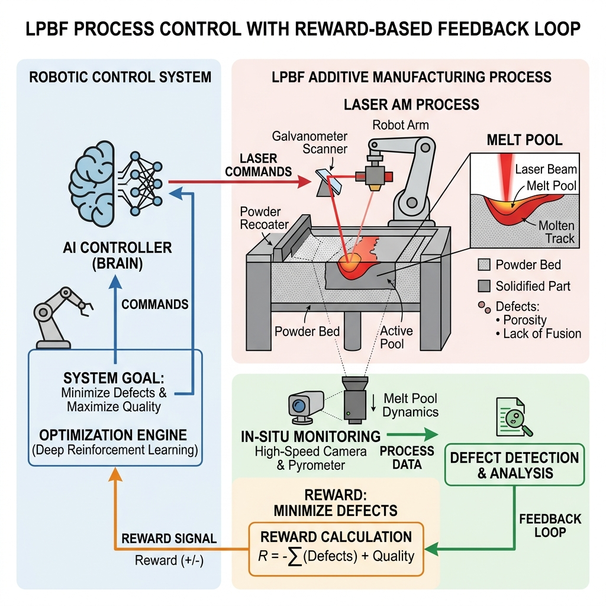{width=100%}
:::
:::
:::

::: {.notes}
Walk through the three main types. Emphasize that Supervised is the most common in current engineering applications, but Unsupervised and RL are growing in materials science.
:::

## Data notation and task notation

- Dataset: $\mathcal{D} = \{(\mathbf{x}_i, y_i)\}_{i=1}^N$
- Hypothesis class: $f_\theta: \mathcal{X} \to \mathcal{Y}$
- Objective: choose $\theta$ minimizing risk under deployment-relevant assumptions.

::: {.notes}
Formalize the notation early. Say 'D is our dataset', 'f is our model hypothesis', 'theta are the parameters'. Getting comfortable with this is crucial for the rest of MFML.
:::

## Empirical risk minimization (ERM)

- Core training objective:

$$
\hat{\theta} = \arg\min_\theta \frac{1}{N}\sum_{i=1}^{N}\ell\big(f_\theta(\mathbf{x}_i), y_i\big)
$$

- ERM fits observed data, not future distribution automatically.

::: {.notes}
Define ERM slowly. This is the heart of ML. Explain that it essentially means 'find the parameters that make the average training error as small as possible'.
:::

## Regularized objective and Parsimony

- **Parsimony and Occam’s Razor**: The preference for simpler models to avoid fitting noise (overfitting).
- **Regularization**: A technique to control complexity by adding a penalty term (e.g., Ridge/Lasso) to the loss function, discouraging large parameter values and wild oscillations.

$$
\hat{\theta} = \arg\min_\theta \frac{1}{N}\sum_{i=1}^{N}\ell\big(f_\theta(\mathbf{x}_i), y_i\big) + \lambda\Omega(\theta)
$$

- $\lambda$ controls fit–complexity tradeoff.

::: {.notes}
Introduce the concept of a 'penalty'. If we just memorize the training data, we haven't learned anything generalizable. The regularization term prevents this memorization.
:::

## Population risk vs empirical risk

::: {.columns}
::: {.column width="50%"}
### Empirical Risk
::: {.fragment}
- Optimized on $\mathcal{D}_{train}$
- Proxy for performance
- Can be driven to zero (overfit)
:::
:::

::: {.column width="50%"}
### Population Risk
::: {.fragment}
- Expected error on $\mathcal{P}$
- True performance goal
- Requires generalization
:::
:::
:::

::: {.fragment}
- **Generalization gap**: $R_{\text{test}} - R_{\text{train}}$.
- **Generalization**: The central goal of ML—ensuring the model performs well on unseen test data, not just the training set.
- This is the central bridge from statistics to real engineering decisions [@murphy2012machine; @bishop2006pattern].
:::

::: {.notes}
This is a crucial slide! Explain that Empirical Risk is what we can measure right now, but Population Risk is what we actually care about (performance on unseen future data deployed in the real world).
:::

## Regression vs classification vs ranking

- Regression: continuous target estimation.
- Classification: class-probability estimation.
- Ranking: relative ordering for screening/prioritization workflows.

::: {.notes}
Give examples for each. Regression: predicting yield stress. Classification: predicting defect vs no-defect. Ranking: prioritizing candidate alloys for synthesis.
:::

## Learning as optimization

- ML minimizes a loss function $\mathcal{L}(\theta)$ measuring the discrepancy between predictions and true targets.
- Different tasks require different penalties (e.g. robust to outliers vs penalizing large errors).

::: {.notes}
Make the link explicit. Once the loss function is defined, ML becomes a pure numerical optimization problem. Our goal is to find the minimum of that loss landscape.
:::

## Regression: MSE (L2 Error)

::: {.fragment}
$$\text{MSE} = \frac{1}{N}\sum_{i=1}^{N} (y_i - \hat{y}_i)^2$$

- **Mean Squared Error**: The standard loss for regression.
- **Intuition**: Penalizes large errors disproportionately (quadratic).
- **Geometric interpretation**: Minimizing the sum of squared residuals.
:::

::: {.notes}
Discuss why we square it: differentiable, and heavily penalizes large errors. Mention units: if predicting MPa, MSE is in MPa^2, which can be unintuitive.
:::

## Regression: MAE (L1 Error)

::: {.fragment}
$$\text{MAE} = \frac{1}{N}\sum_{i=1}^{N} |y_i - \hat{y}_i|$$

- **Mean Absolute Error**: Evaluates errors linearly.
- **Intuition**: "On average, our prediction is off by X units."
- **Robustness**: Less sensitive to outliers than MSE, picking the median rather than the mean.
- Less smooth for optimization since the gradient is undefined at zero.
:::

::: {.notes}
Contrast with MSE. MAE is less sensitive to outliers. Mention that it's the absolute distance, bringing the units back to the original scale (e.g., MPa), making it easier to explain to stakeholders.
:::

## Classification: 0-1 Loss

::: {.fragment}
$$L_{0-1} = \begin{cases} 0 & \text{if } \hat{y} = y \\ 1 & \text{if } \hat{y} \neq y \end{cases}$$

- **Intuition**: The absolute simplest classification metric. You are either right (0 penalty) or wrong (1 penalty).
- **In practice**: This is "Accuracy". Connects directly to human intuition for counting mistakes.
- **Problem**: It is a step function! The gradient is exactly zero everywhere (except where undefined). We cannot optimize this with gradient descent.
:::

::: {.notes}
Explain that this is what we ultimately want (minimize mistakes), but the mathematical property (gradient is zero almost everywhere) makes it impossible to optimize efficiently with gradient descent.
:::

## Classification in Materials Science

### Example: Identifying Crystal Defects
::: {.fragment}
- **Task**: Classify a defect from a microscopy image as a **Vacancy**, **Dislocation**, or **Precipitate**.
- **Problem with Regression**: Categories have no natural ordering. A "Vacancy" is not numerically "less" than a "Precipitate".
:::

::: {.fragment}
### The Solution: One-hot Encoding
Represent labels as vectors where the correct category is $1$ and others are $0$:
- Vacancy = $[1, 0, 0]^T$
- Dislocation = $[0, 1, 0]^T$
- Precipitate = $[0, 0, 1]^T$
:::

::: {.notes}
Start by grounding the problem in materials science. You can't fit a continuous line through categorical types. Emphasize that one-hot encoding transforms categorical strings into a vector format that a mathematical model can actually optimize against.
:::

## The Softmax Function

::: {.fragment}
Our model outputs a raw score (logit) $o_i$ for each class. But these can be negative and don't sum to 1! How do we convert them to probabilities $\hat{y}$?
:::

::: {.fragment}
### Softmax "Squishes" Scores into Probabilities

$$\hat{y}_i = \frac{\exp(o_i)}{\sum_{j} \exp(o_j)}$$

- **Non-negative**: Exponentiation ensures all probabilities are $>0$.
- **Sums to 1**: Dividing by the sum guarantees a valid probability distribution.
- **Physics Intuition**: This is mathematically identical to the **Boltzmann distribution** in statistical thermodynamics, where the prevalence of an energy state is proportional to $\exp(-E/kT)$!
:::

::: {.notes}
Explain why we need Softmax: raw model outputs aren't valid probabilities. Walk through the equation: the top part makes everything positive, the bottom normalizes. Connect this immediately to what materials engineers already know: the Boltzmann distribution. Just as nature distributes atoms among energy states exponentially, Softmax distributes probability among our classes exponentially!
:::

## Classification: Cross-entropy Loss

::: {.fragment}
Now that we have probability predictions $\hat{y}$, how do we penalize bad ones? 
$$L = -\sum_{c=1}^{C} y_c \log(\hat{y}_c)$$
Since $y$ is one-hot, this simplifies to $-\log(\hat{y}_{\text{true}})$.
:::

::: {.fragment}
### Why Cross-entropy?
- **Information Theory (Surprisal)**: If the image is a Vacancy ($y_1=1$), but our model assigns it 1% probability ($\hat{y}_1=0.01$), our "surprise" ($-\log 0.01$) is massive!
- **Perfect Gradients**: The derivative with respect to the raw score $o_i$ simplifies beautifully to exactly $(\hat{y}_i - y_i)$. 
The gradient is simply the difference between **our prediction** and **reality**!
:::

::: {.notes}
Introduce cross-entropy by mapping it back to information theory: it measures "surprise." A confidently wrong model gets heavily penalized over an unsure one. The magic of cross-entropy paired with Softmax is the derivative: it simplifies perfectly to (prediction - actual label). This convex gradient drives stable parameter updates, mirroring how MSE works for regression.
:::

## Optimization lens

- Learning is numerical optimization in parameter space.
- Convergence behavior depends on curvature, scaling, and initialization.
- “Model failure” is often an optimization-pathology issue.
- **Example:** Training a neural network to model an interatomic potential. If the optimizer gets stuck in a poor "local minimum", the model might predict completely unphysical behaviors (e.g., solid melting at room temperature), despite having mathematically "converged".

::: {.notes}
Briefly mention that finding the minimum isn't trivial. It depends on the 'shape' of the loss landscape, which is why initialization and scaling of your data really matter.
**Example detail:** Emphasize that "model failure" here isn't because the neural network lacks capacity, but because the numerical path (the optimization trajectory) failed to find the physical global minimum.
:::

## Bayesian lens (intro)

- Bayesian update:

$$
p(\theta\mid\mathcal{D}) \propto p(\mathcal{D}\mid\theta)\,p(\theta)
$$

- Output is a distribution over parameters/predictions, not just a point estimate.
- **Example:** Predicting the fatigue life of an aircraft component. Instead of outputting a single point estimate ("fails at 10,000 cycles"), Bayesian methods output a probability distribution, allowing engineers to establish a safe lower bound (e.g., 99% confidence life exceeds 8,000 cycles).

::: {.notes}
Contrast with point estimates. Instead of finding *the* single best parameter set, Bayesian methods find a *distribution* of likely parameters given the data.
**Example detail:** In safety-critical engineering applications, quantifying the *uncertainty* of a prediction via this distribution is arguably just as important as the prediction itself for risk management.
:::

## Frequentist vs Bayesian workflow (practical)

- Frequentist practice often emphasizes point estimates + confidence intervals.
- Bayesian practice emphasizes posterior predictive uncertainty.
- Engineering choice depends on risk tolerance, compute budget, and interpretability needs.

::: {.notes}
Acknowledge that Bayesian is often computationally heavier, but provides structurally better uncertainty estimates, which is crucial in engineering when failure costs are high.
:::

## Decision layer separate from inference

- Inference estimates what is likely.
- Decision-making selects actions under cost/utility constraints.
- Good predictions with wrong decision threshold can still be operationally bad.

::: {.notes}
Provide an engineering example. The model might say '80% chance of a crack'. The decision 'do we scrap the part?' depends heavily on the cost of scrapping vs the cost of a catastrophic failure.
:::

## No-free-lunch intuition

- No algorithm dominates over all data-generating processes.
- Every model encodes inductive bias.
- Model choice should reflect domain structure and failure costs [@murphy2012machine].

::: {.notes}
Ensure students know there is no universally 'best' algorithm. You always have to match the algorithm's inductive assumptions to the physical reality of the problem.
:::

## Curse of dimensionality (conceptual)

- Data requirement grows rapidly with feature dimension.
- Sparse high-dimensional regimes invite overfitting.
- Structure assumptions, priors, and representations are mandatory.

::: {.notes}
Explain that as you add more features (dimensions), the volume of the space explodes. Your data gets extremely sparse. Therefore, we intuitively need prior knowledge to constrain the problem.
:::

## Recap: 6 equations/ideas to remember

- ERM and regularized ERM.
- Population risk vs empirical risk.
- Bayesian update and posterior predictive view.
- Generalization gap and why train error is insufficient.
- Inductive bias and no-free-lunch perspective.
- Decision layer must align with uncertainty + cost.

::: {.notes}
Summarize the section. Pause for any questions before moving to practical concepts. Ensure these 6 points are firmly understood.
:::

## Overfitting explained visually

::: {.columns}
::: {.column width="33%"}
### Underfit
- High bias
- Misses structure
:::
::: {.column width="34%"}
### Well-fit
- Captures stable signal
- Controlled complexity
:::
::: {.column width="33%"}
### Overfit
- Memorizes quirks/noise
- Weak transfer
:::
:::

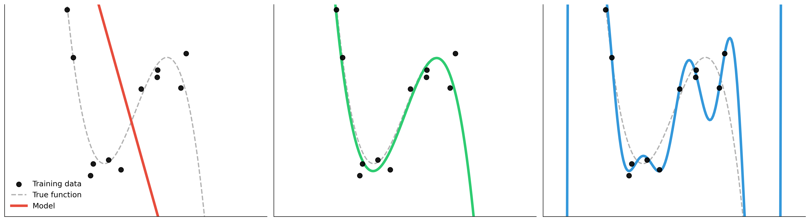{width=100%}

::: {.notes}
Point to the visual. Left: too rigid. Middle: just right. Right: too flexible, fitting the noise. Connect this visually to the core concept of bias-variance.
:::

## Bias–variance decomposition (Intuition)

::: {.columns}
::: {.column width="40%"}
::: {.fragment}
- **Truth (Bullseye)**: The true underlying physical mechanism.
- **Darts (Predictions)**: Where our model lands when trained on *slightly different* batches of data.
:::

<br>

::: {.fragment}
- **Bias**: The systematic offset from the truth. (Model is fundamentally too structurally simple or constrained).
- **Variance**: The scatter of the darts. (Model is hypersensitive to the exact noise in the training set).
:::
:::

::: {.column width="60%"}
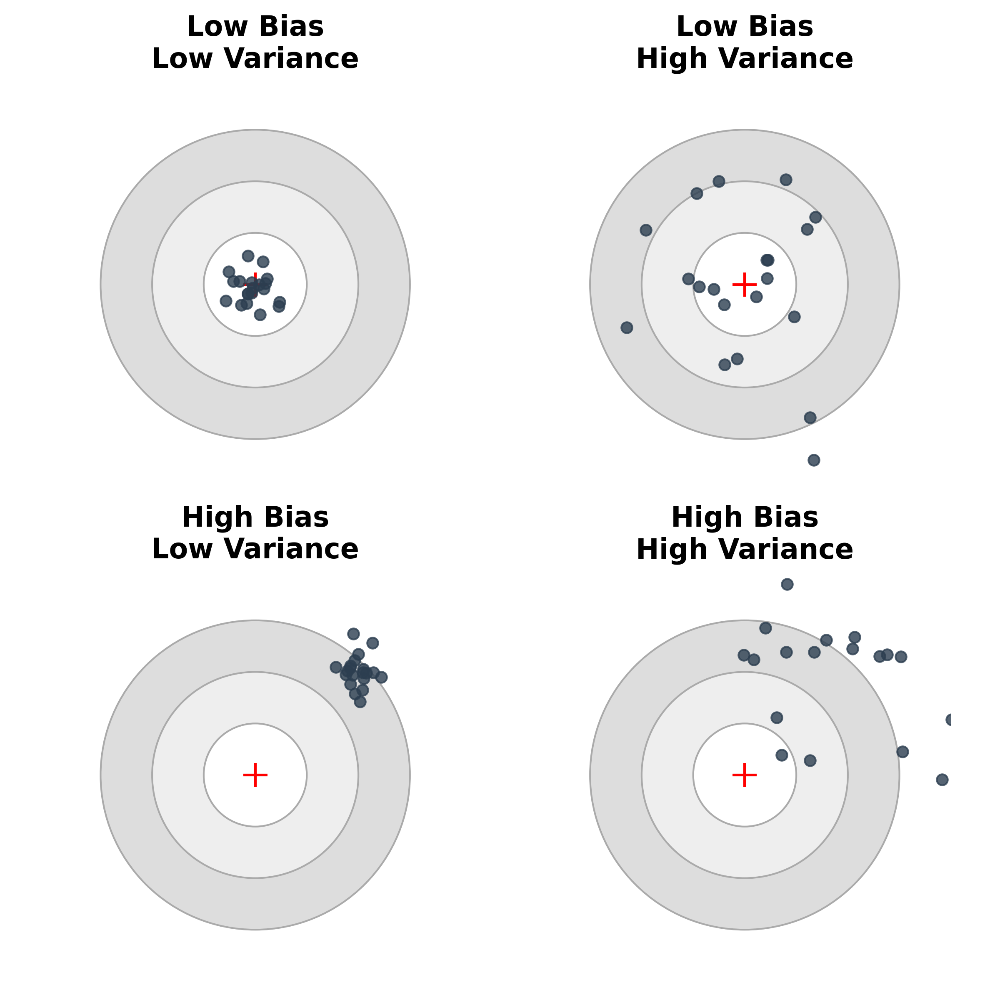{width=90%}
:::
:::

::: {.notes}
This mental model is critical. 
Bias is asking: "If I averaged a million models trained on a million datasets, would they center on the truth?" If no, that distance is the bias.
Variance is asking: "If I gather one more data point and retrain, how wildly does my prediction swing?" If it swings a lot, that is variance.
:::

## The Bias-Variance Tradeoff Curve

::: {.columns}
::: {.column width="55%"}
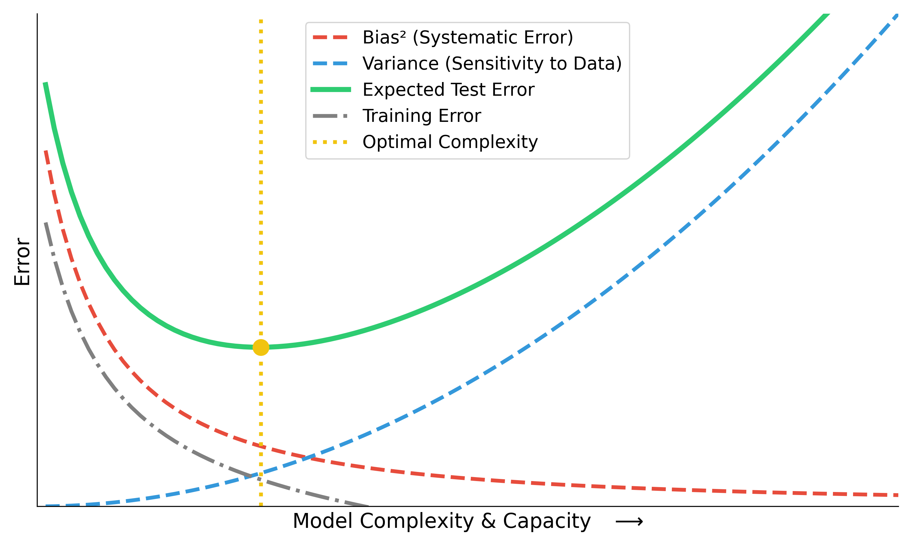{width=100%}
:::

::: {.column width="45%"}
::: {.fragment}
**Total Expected Error** = $\text{Bias}^2$ + $\text{Variance}$ + $\text{Noise}$
:::

<br>

::: {.fragment}
- Increasing model capacity drives down training error continuously.
- But expected deployment error forms a **U-shape**.
- Finding the sweet spot (yellow line) is the central pursuit of ML.
:::
:::
:::

::: {.notes}
Walk students through the curve. Point out the "Training Error" grey line—it's highly deceptive! It keeps going down.
A purely data-driven model will happily slide down the training-error slope right into the high-variance catastrophe zone.
The "Noise" term is irreducible. No model can beat the inherent stochasticity of physical measurement.
:::

## Navigating the tradeoff in Engineering

::: {.fragment}
How do we turn the dials to hit the sweet spot?
:::

::: {.columns}
::: {.column width="50%"}
### To reduce Bias (move right $\rightarrow$)
::: {.fragment}
- Increase model capacity (e.g., deeper network, higher polynomial).
- Relax physical constraints that are too strict.
- Engineer richer, non-linear features.
:::
:::

::: {.column width="50%"}
### To reduce Variance (move left $\leftarrow$)
::: {.fragment}
- Apply **Regularization** (mathematical penalty on complexity).
- Introduce **Physics Priors** (domain-knowledge constraints).
- Gather vastly more training data.
- Enforce simpler architectures.
:::
:::
:::

::: {.fragment}
> **Note for Engineers:** Adding a hard physical equation as a constraint explicitly *increases Bias* to drastically *kill Variance* in small-data regimes, making it deployable!
:::

::: {.notes}
This slide grounds the theory in practice.
When you have 50 expensive fatigue measurements, a pure neural network will have catastrophic variance.
By injecting physics (like a Paris' law constraint), you are *intentionally adding Bias* to drag the model back to the left, saving it from Variance blow-up.
Engineering ML is essentially the art of injecting "good bias".
:::

## Train/val/test splits

```{mermaid}
%%| echo: false
%%| fig-align: center
flowchart LR
    Data[(Full Dataset)] --> Train[Training Set]
    Data --> Val[Validation Set]
    Data --> Test[Test Set]
    
    Train --->|Fit parameters| Model((Model))
    Val --->|Tune hyperparameters| Model
    Model -.->|Iterative tuning| Val
    Model ===>|One-shot evaluation| Test
    
    style Train fill:#d4edda,stroke:#28a745,color:#155724,stroke-width:2px
    style Val fill:#fff3cd,stroke:#ffc107,color:#856404,stroke-width:2px
    style Test fill:#f8d7da,stroke:#dc3545,color:#721c24,stroke-width:2px,stroke-dasharray: 5 5
    style Model fill:#cce5ff,stroke:#004085,color:#004085,stroke-width:2px
    style Data fill:#e2e3e5,stroke:#383d41,color:#383d41,stroke-width:2px
```
 
::: {.mt-4}
- **Train**: Fit parameters.
- **Validation**: Tune model/hyperparameters.
- **Test**: One-shot final estimate.
- **Crucial Rule**: Never “peek” at the test set during tuning!
:::

::: {.notes}
Define the roles clearly. Train = study for exam. Val = practice test to tune studying strategy. Test = final exam. You can't use the final exam to study.
Walk through the diagram: emphasize the iterative loop between the Model and Validation set, versus the strict one-way street to the Test set at the very end.
:::

## Cross-validation

- k-fold CV improves stability under limited data.
- Use grouped/blocked CV when IID assumptions break.
- Random CV can be misleading for correlated materials families [@ryan2021machine].

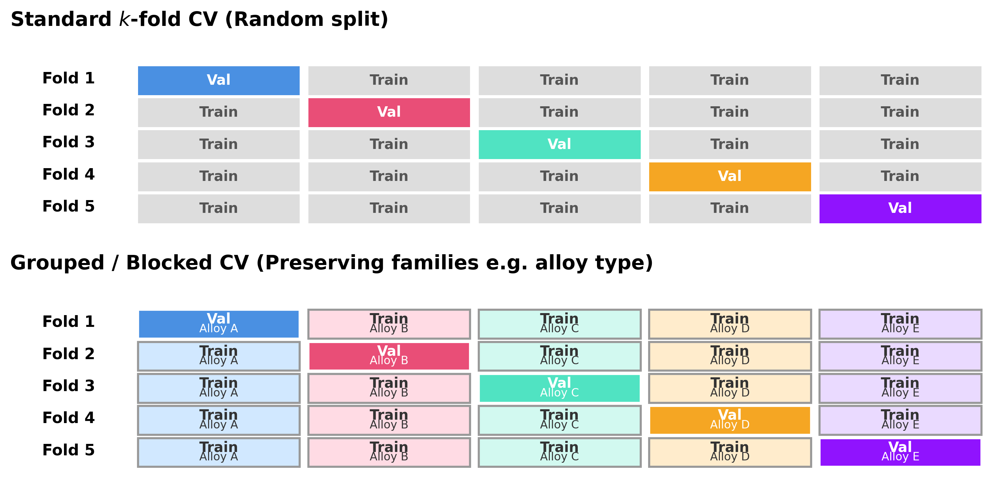{width=100%}

::: {.notes}
Explain why we do this: to get a stable estimate when our dataset is limited. Emphasize 'grouped CV' specifically for materials (e.g., ensuring an entire alloy family is in one single fold, not split).
:::

## Data leakage taxonomy

- Preprocessing leakage: statistics fit on full dataset.
- Group leakage: related samples split across train/test.
- Temporal leakage: future information in training features.

::: {.notes}
Leakage is arguably the #1 cause of ML failures in real engineering deployments. Highlight temporal leakage mapping (predicting the past using the future is cheating).
:::

## Metrics linked to decisions

- MAE/RMSE for absolute error behavior.
- Calibration for probability trustworthiness.
- Cost-sensitive metrics when false negatives/positives are asymmetric.

::: {.notes}
Reinforce that the ML metric must match the business or engineering goal. If false negatives are dangerous to safety, we must penalize them more aggressively during evaluation.
:::

## Uncertainty types (engineering interpretation)

::: {.columns}
::: {.column width="50%"}
### Aleatoric Uncertainty
::: {.fragment}
**Irreducible Noise** 🎲

- **Source**: Inherent randomness in physical processes or measurement limits.
- **Mitigation**: Needs better hardware/sensors, or robust design margins.
- **Example**: The $\pm 2^\circ\text{C}$ reading fluctuation on a thermocouple during casting.
:::
:::

::: {.column width="50%"}
### Epistemic Uncertainty
::: {.fragment}
**Reducible Ignorance** 📚

- **Source**: Limited data, knowledge gaps, or missing physics.
- **Mitigation**: Gather more training data or improve the model's structural assumptions.
- **Example**: A model's blind guesswork when extrapolating fatigue life to a novel alloy composition.
:::
:::
:::

::: {.fragment .mt-4}
$\rightarrow$ **Key takeaway:** Different mitigation actions are required. You cannot "smooth out" epistemic ignorance, nor can you "gather more data" to fix aleatoric noise [@neuer2024machine].
:::

::: {.notes}
Define Aleatoric (noise we can't fundamentally remove) and Epistemic (ignorance we can fix with more training data). 

**Walk through the engineering examples:**
- **Aleatoric**: The $\pm 2^\circ\text{C}$ noise on your thermocouple. More data won't magically give you $\pm 0.1^\circ\text{C}$ precision. You just have to live with it or buy a better sensor.
- **Epistemic**: Your neural network has never seen an alloy with >5% Titanium. Its prediction is wild guesswork. This is epistemic ignorance. You *can* fix this by going to the lab, making a >5% Ti alloy, and updating your dataset!
:::

## Model confidence vs correctness

- High confidence can still be wrong (miscalibration).
- Reliability diagrams and calibration checks are essential.
- Threshold decisions should use calibrated outputs.

::: {.notes}
A model can be 99% confident but completely wrong. This is why explicit calibration is incredibly important, rather than just taking output scores directly as probabilities.
:::

## Trust checklist for engineering ML

- Data provenance documented?
- Split strategy deployment-realistic?
- Uncertainty quantified and interpreted?
- Failure modes and fallback policy defined?

::: {.notes}
Run through this checklist as a practical takeaway. Tell students they should explicitly use this in their future engineering projects.
:::

## Checkpoint: Exam-style MCQ

**Question:** You train a deep neural network to predict the fatigue strength of an alloy. The training MSE is nearly zero, but the test MSE is very high. Adding a physical constraint (e.g., non-negative stiffness) slightly increases training MSE but significantly lowers test MSE. Why?

::: {.fragment}
- [ ] A: The constraint acts as a data leakage mechanism.
- [ ] B: The constraint introduces an inductive bias that reduces the hypothesis space, mitigating variance (overfitting).
- [ ] C: The formulation violates empirical risk minimization by adding random noise.
- [ ] D: The model has shifted from a grey-box to a white-box representation.
:::

::: {.fragment}
**Answer:** B. The domain constraint restricts the model from fitting spurious, physically impossible correlations in the training data.
:::

::: {.notes}
Read the question, give them 20 seconds to think independently, then reveal the answer. Explain *why* B is correct (reducing hypothesis space safely).
:::

## Materials example: spectra interpretation

::: {.columns}
::: {.column width="50%"}
### Task
::: {.fragment}
- Input $\mathbf{x}$: X-ray diffraction (XRD) pattern (1D intensity vector).
- Output $y$: Crystal system (classification) or lattice parameters (regression).
- Prior knowledge: Peak positions are governed by Bragg's law; intensities by atomic scattering factors.
:::
:::

::: {.column width="50%"}
### Modeling approach
::: {.fragment}
- **Pure Black-box**: CNN directly on the spectrum. Often data-hungry and fooled by background noise/shift.
- **Hybrid/Grey-box**: Extract physics-informed features (peak positions, integral breadths via profile fitting) and pass them to a simpler ML classifier.
:::
:::
:::

::: {.notes}
Connect the ML theory to a concrete materials task. Contrast perfectly the purely data-hungry black-box approach with a smarter physics-informed grey-box approach.
:::

## Connecting MFML to Materials Genomics (MG)

::: {.fragment}
- **MFML** provides the rigorous definition of the hypothesis space $\mathcal{H}$ and loss $\mathcal{L}$.
- **MG** applies this to the *discovery* of new materials.
- Example: High-throughput screening. MFML explains *how* the surrogate model fits the data and *what* uncertainty means. MG shows *how to use* that surrogate to query large compositional spaces for novel thermodynamics properties.
:::

::: {.notes}
Explain the explicit hand-off to the MG course, particularly high-throughput discovery and virtual screening.
:::

## Connecting MFML to ML-PC

::: {.fragment}
- **ML-PC (ML for Characterization and Processing)** deals with spatial/temporal data and in-situ monitoring.
- **MFML** explains the bias-variance tradeoff and cross-validation mechanics.
- Example: Defect detection in additive manufacturing. MFML gives the foundation of classification loss (cross-entropy) and data leakage; ML-PC covers the specialized CNN architectures and real-time processing constraints.
:::

::: {.notes}
Explain the explicit hand-off to the ML-PC course, particularly manufacturing process control and temporal/spatial data processing applications.
:::

## Lecture vs Exercise Content Split

::: {.columns}
::: {.column width="50%"}
### Lecture (Theory & Design)
::: {.fragment}
- Definitions and epistemology (What is learning?)
- Objective functions (ERM, regularized risk)
- Conceptual distinctions (Bias vs Variance)
- Validation logic and trust frameworks
:::
:::

::: {.column width="50%"}
### Exercise (Implementation & Doing)
::: {.fragment}
- Writing code (NumPy, PyTorch)
- Debugging loss curves
- Sensitivity analysis
- Setting realistic train/val/test splits without leakage
:::
:::
:::

::: {.notes}
Clarify expectations for the remaining semester structure. Lecture is for understanding 'why', Exercise is for practicing 'how'.
:::

## Exercise setup: NumPy linear regression from scratch

- Build linear regression objective and gradient updates manually.
- Implement train/validation split with strict separation.
- Plot training vs validation loss curves over iterations.

::: {.notes}
Introduce what they will effectively do in the upcoming exercise. Explain why from scratch: to completely demystify the optimization and backward pass processes.
:::

## Exercise extension: regularization + split stress test

- Add L2 term and compare under/overfit behavior.
- Repeat with different split strategies (random vs grouped).
- Document when measured “improvement” is actually leakage-driven.

::: {.notes}
Explain step 2 of the exercise. They will see overfitting and leakage consequences happen before their eyes on real code.
:::

## Glossary of Key Terms

::: {.fragment}
- **Empirical Risk Minimization (ERM)**: Finding parameters that minimize loss on the training set.
- **Generalization Gap**: The difference between training error and test error.
- **Data Leakage**: Information from outside the training dataset inappropriately influencing the model during training.
- **Inductive Bias**: The explicitly or implicitly stated assumptions a learning algorithm uses to predict outputs.
- **White/Grey/Black Box**: Spectrum indicating how much of the model's internal mechanism is physically interpretable vs purely data-driven.
:::

::: {.notes}
Quick review of the big words introduced today. They should be able to formally define all of these now.
:::

## Exam-aligned summary: 10 must-know statements

1. ML is optimization under uncertainty, not magic fitting.
2. Train loss is not deployment success.
3. Split design is part of the model.
4. Leakage invalidates performance claims.
5. Metrics must align with decisions.
6. Uncertainty must be interpreted by type.
7. Inductive bias is unavoidable.
8. Domain constraints improve trustworthiness.
9. Explainability is contextual, not absolute.
10. Reproducibility is a scientific requirement.

::: {.notes}
Tell them straight: 'If you really want to pass the exam and retain the core lessons, deeply understand these 10 points.'
:::

## References + reading assignment for next unit

- **Required reading before Unit 2:**
  - Neuer: Ch. 1.1 and 1.3
  - McClarren: Ch. 1.1 and 1.5
- **Optional depth:**
  - Murphy: Ch. 1.1–1.4
  - Bishop: Ch. 1.1 and 1.3
- Next unit: linear algebra geometry for learning (projections, conditioning, SVD/PCA bridge).

::: {#refs}
:::

::: {.notes}
Point them directly to the reading. Explicitly assign the next chapter so they arrive prepared for linear algebra geometry.
:::
