## Title + positioning in SS26 lecture triad

::: {.fragment}
- **MFML** provides the mathematical backbone for both applied SS26 courses.
- **Materials Genomics (MG)** and **ML for Characterization/Processing (ML-PC)** consume this notation directly.
- Goal: shared conceptual language so students can transfer methods across domains.
:::
::: {.fragment}
### Core textbooks for this course

::: {.columns}
::: {.column width="25%"}
{height=600px}
<br>
<small>Neuer: <br>Mathematical Foundations for Machine Learning</small>
:::
::: {.column width="25%"}
{height=600px}
<br>
<small>McClarren: <br>Machine Learning for Engineers</small>
:::
::: {.column width="25%"}
{height=600px}
<br>
<small>Murphy: <br>Machine Learning: A Probabilistic Perspective</small>
:::
::: {.column width="25%"}
{height=600px}
<br>
<small>Bishop: <br>Pattern Recognition and Machine Learning</small> 
:::
:::

:::
## Why this course now?

::: {.fragment}
- Many students can “run models” but struggle to justify modeling decisions.
- Engineering ML requires **validity, uncertainty, and failure analysis**, not only accuracy.
- This unit reframes ML from tool usage to principled scientific modeling.
:::

## Learning outcomes for Unit 1

By the end of this lecture, students can:

::: {.fragment}
- formulate supervised learning as a risk-minimization problem,
- explain model/loss/regularization/generalization coherently,
- identify leakage and overconfidence risks in materials workflows,
- separate lecture-core theory from exercise implementation tasks.
:::

## What you should already know

::: {.fragment}
- Calculus basics, linear algebra, and SVD are assumed.
- Very basic Python is assumed (NumPy-level competency).
- We now reinterpret these prior tools as components of learning systems.
:::

## What students often confuse

::: {.fragment}
- AI vs ML vs deep learning vs statistics vs simulation.
- Predictive fit vs scientific explanation.
- High benchmark score vs deployable trustworthy model.
:::

## Quick map: AI vs ML vs DL vs Data Science

::: {.columns}
::: {.column width="50%"}
::: {.fragment}
- **AI**: broad umbrella for intelligent systems.
- **ML**: data-driven function estimation inside AI.
- **DL**: model family inside ML.
- **Data science**: includes data engineering, diagnostics, domain interpretation, and deployment context [@sandfeld_materials_data_science].
:::
:::

::: {.column width="50%"}
```{mermaid}
%%| echo: false
%%| fig-align: center
graph TD
    %% Styling
    classDef default fill:#f8fafc,stroke:#cbd5e1,stroke-width:2px,color:#334155,rx:8px,ry:8px,font-family:Inter;
    classDef accent fill:#e0f2fe,stroke:#38bdf8,stroke-width:2px,color:#0f172a,rx:8px,ry:8px,font-family:Inter,font-weight:600;
    linkStyle default stroke:#94a3b8,stroke-width:2px;

    subgraph DS [Data Science]
    AI[Artificial Intelligence] --> ML[Machine Learning]
    ML --> DL[Deep Learning]
    end
```
:::
:::

## Domain knowledge matters

::: {.fragment}
- Materials and engineering constraints reduce the hypothesis space.
- Physically impossible predictions are still wrong even if numerically low-loss.
- Domain priors improve data efficiency and robustness.
:::

## Roadmap of today 

::: {.fragment}
- Part A: model concept and epistemology.
- Part B: formal supervised learning core.
- Part C: validation, uncertainty, and trust.
- Part D: transfer to materials tasks and exercise handoff.
:::

## What is a model? (Neuer 1.1)

::: {.fragment}
- A model is a purposeful abstraction of reality for prediction and reasoning.
- Models trade realism for tractability and decision usefulness.
- Good models are evaluated at the **decision point**, not by aesthetics [@neuer2024machine].
:::
::: {.fragment}
### First-principles models 

 
<iframe
  src="../../assets/widgets/gravitational_law_widget.html"
  frameBorder="0"
  width="50%"
  height="440px"
  style="border: none;"
  loading="lazy"
  title="Interactive gravitational law widget"
></iframe> 

 
- Example: classical gravitation as a mechanistic model.
- Strengths: interpretability, invariance, extrapolation under assumptions.
- Limits: real systems often violate simplifying assumptions.
:::

::: {.notes}
 

Many models originate from axioms and the laws of nature. They link physical quantities with each other and thus allow a direct understanding of the relationships. Because of this property, they are called First-Principle models. They are captured by compact mathematical equations. Differential equations, conservation laws up to state models of control technology are examples of this.

A well-known first-principle model illustrates this a bit closer: the law of gravity. The force that two masses $m_1$ and $m_2$ exert on each other is proportional to the product of these masses and inversely proportional to the square of their distance $r$,

$$
F \propto \frac{m_1 m_2}{r^2}
$$

This model allows us to directly understand the relationship between the masses and their distance. It is also compactly formulated. This equation states what will happen if we, for example, double the mass $m_2$. On the other hand, if we find that the force has become four times smaller than before, we can say why by measuring $r$ and knowing $m_1$ and $m_2$: because the radius has doubled.

Let’s highlight the important features of models again: a) They help us understand complex relationships as they link variables together and b) they predict the behavior of systems.
:::


## Data-based modeling (top-down)

::: {.fragment}
- Learn relationships from observed $(x,y)$ pairs.
- Assumes relevant structure is represented in measured data.
- Performance depends on data quality, coverage, and split design [@neuer2024machine].
:::

::: {.fragment}
**Example: Additive Manufacturing (3D Printing)**

- *Bottom-up limits*: Simulating melt-pool multiphysics for every layer is computationally intractable.
- *Top-down approach*: Predict final part porosity ($y$) directly from laser parameters and in-situ sensor data ($x$) [@meng2020machine].
  
{width=55%}
:::
 


::: {.notes}
**Data-based Models**
 
Since machines are based on scientific principles, models help us identify problems in industrial production. Many technical processes are combinations of several processes. Often, the individual processes are so complex that a complete representation is only possible to a limited extent, even with reduced first-principle models. Especially the original bottom-up approach, deriving relationships from axioms or basic laws, is difficult. For example, in metal additive manufacturing, simulating the exact melt pool multiphysics for every layer is computationally impossible.

This is where data-based modeling comes into play. Data exists from many technical processes. What happens in the processes can be recorded at least within the accuracy of the sensors. Assuming all relevant data is captured and we have both the influencing variables and the size we want to understand or predict, then the actual dependency is contained in the data and can be extracted from it. This is the basic assumption of data-based modeling.

In contrast to deriving a model with the bottom-up approach, data-based modeling begins with the observation of the processes. This is top-down, as the process serves as the starting point and the details are only discovered afterwards. Subsequently, statistical tools are used to set up simple models. As complexity increases, machine learning methods are used. They form a separate subgroup of data-based modeling. Yet, there are difficulties and open questions:

- Choice of variables. Is the dynamics we want to capture even captured by the data?
- Quality of measurement. Are the sensor data accurate enough to represent the problem?
- Amount of data. Do we have enough measurement points available to set up the desired model?
:::

## When first-principles is insufficient

::: {.fragment}
- Complex process chains can be nonlinear, high-dimensional, and partially observed.
- Closed-form mechanistic models can be unavailable or too expensive.
- Hybrid strategies (physics + data) are often the engineering sweet spot.
:::

### White-box / grey-box / black-box

::: {.columns}
::: {.column width="50%"}
::: {.fragment}
- **White-box**: explicit mechanism and interpretable parameters.
- **Black-box**: high predictive flexibility, low immediate interpretability.
- **Grey-box**: blends mechanistic structure with learned components [@neuer2024machine].
:::
:::

::: {.column width="50%"}
```{mermaid}
%%| echo: false
%%| fig-align: center
graph LR
    %% Styling
    classDef default fill:#f8fafc,stroke:#cbd5e1,stroke-width:2px,color:#334155,rx:8px,ry:8px,font-family:Inter;
    classDef accent fill:#e0f2fe,stroke:#38bdf8,stroke-width:2px,color:#0f172a,rx:8px,ry:8px,font-family:Inter,font-weight:600;
    linkStyle default stroke:#94a3b8,stroke-width:2px;

    Model[Model Type]:::accent --> WB[White-box]:::accent
    Model --> GB[Grey-box]:::accent
    Model --> BB[Black-box]:::accent

    WB --- WBdesc[Physics-based]
    GB --- GBdesc[Hybrid]
    BB --- BBdesc[Data-driven]
```
:::
:::

::: {.notes}
The characterization in first-principle and data-based models is oriented towards the model’s origin. Another property is the traceability of a model. Here, the following categories are distinguished:

- **White-Box Models**: Any model that is completely traceable and explainable is called a White-Box model. We can look into the model and understand how it works. First-Principle models are White-Box models. Data-based approaches such as linear regression can also be White-Box models.
- **Black-Box Models**: If traceability is not possible and thus the internal mechanisms are not known, then it is called a Black-Box model. Such models can predict processes, but they do not allow any statement about the relationship between input and output variables. Consequently, it is difficult to trust Black-Box models. Machine learning algorithms are often accused of belonging to this category. However, this is not necessarily true. There are methods, as we will learn later, that help us to investigate models for their internal mechanisms and thus move from the Black-Box character to a real understanding and trust.
- **Grey-Box Models**: A third variant is Grey-Box models, which are partially traceable. They use input variables whose influence is known, and additional variables whose effect cannot be captured. Monte Carlo methods are counted in this category because they contain an analytical core, e.g., a differential equation, and simulate this with stochastic variables. Since the latter are random processes, at least part of the Monte Carlo simulation is unpredictable.
:::

## Why black-box criticism appears

::: {.fragment}
- Safety, traceability, and auditability requirements in engineering settings.
- Difficulty diagnosing failure causes without behavioral probes.
- High-stakes contexts demand calibrated confidence and explainability.
:::

::: {.notes}
The lack of reference to natural laws is a disadvantage of data-based modeling. Some practitioners and users criticize data-based models because of their difficult traceability. They base their criticism on a purely Black-Box character. The acceptance of machine learning was initially affected by this. However, many of these critics are based on false assumptions.

The diversity of models has increased over the years. Machine learning algorithms can be made understandable and explainable. They now belong to the area of Grey-Box models. The integration of physical First-Principle models as part of data-based models is unknown to many users. However, these approaches have many successes in the industry to show.

Learning methods can be sampled. By deliberately disturbing the input variables, one can check how the algorithm behaves. Thus, we can identify analytical relationships for non-deterministic neural networks. For most learning methods, a basis for explainability can be achieved with the help of tools from stochastic.
:::

## Explainability as spectrum, not binary

::: {.fragment}
- Global explainability: model-level behavior patterns.
- Local explainability: case-level attribution/sensitivity.
- Explainability quality must be judged against stakeholder questions.
:::

## Hybrid modeling mindset

::: {.fragment}
- Put trusted physics where available.
- Learn residuals or unknown couplings from data.
- Keep interfaces explicit so assumptions are inspectable and testable.
:::
::: {.fragment}
### Mini-checkpoint question


- Is linear regression always “white-box” in practice?
- What if features are heavily engineered or leakage-contaminated?
- Discussion target: transparency depends on *entire pipeline*, not formula alone.
:::

## Structural classification of data

::: {.fragment}
<ul class="hover-example-list">
  <li class="hover-example-item">
    <strong>Structured:</strong> Predefined schema and format (e.g., SQL tables, technical process data).
    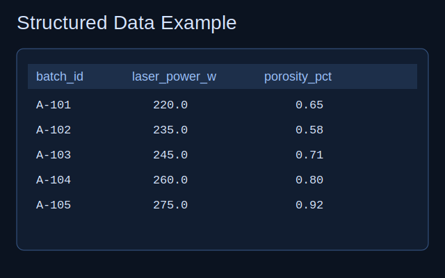
  </li>
  <li class="hover-example-item">
    <strong>Unstructured:</strong> No fixed data model (e.g., images, books, health records).
    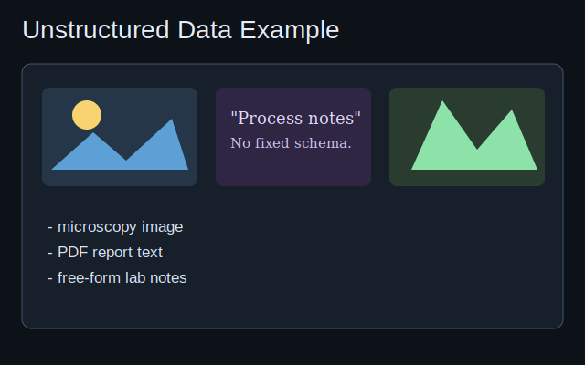
  </li>
  <li class="hover-example-item">
    <strong>Semi-structured:</strong> Mix of ordered and flexible components (e.g., emails, digital twin memory).
    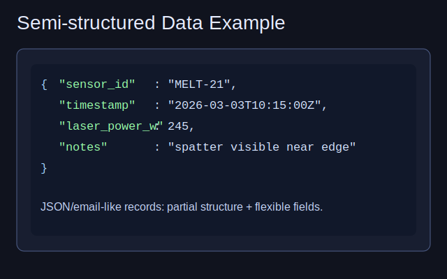
  </li>
</ul>
:::
::: {.fragment}
### Quantitative and qualitative classification


<ul>
  <li>
    <strong>Quantitative:</strong>    
    <ul>
      <li class="hover-example-item">
        <em>Continuous</em>: Can assume any value within a range (e.g., length, analog signals).
        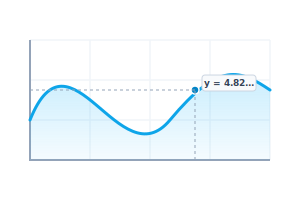
      </li>
      <li class="hover-example-item">
        <em>Discrete</em>: Clearly separable, countable points (e.g., product counts, digital data).
        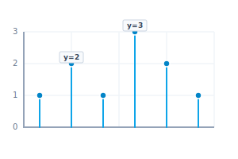
      </li>
    </ul>
  </li>
</ul>
:::
::: {.fragment}
<ul>
  <li>
    <strong>Qualitative:</strong> 
    <ul>
      <li class="hover-example-item">
        <em>Nominal</em>: Descriptive attributes without intrinsic order (e.g., material names, colors).
        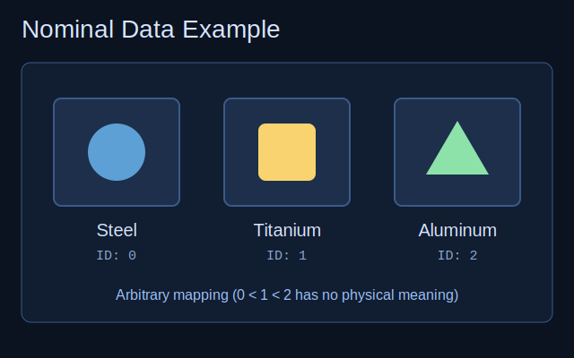
      </li>
      <li class="hover-example-item">
        <em>Ordinal</em>: Data with a logical ranking or sequence (e.g., months, quality ratings).
        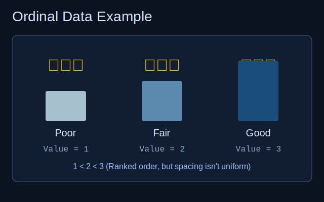
      </li>
      <li class="hover-example-item">
        <em>Cardinal</em>: Data supporting arithmetic operations.
        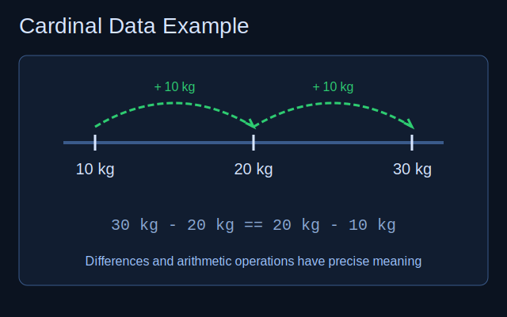
      </li>
      <li class="hover-example-item">
        <em>Binary</em>: Boolean (True/False, Pass/Fail) states.
        
      </li>
    </ul>
  </li>
</ul>
:::


## Time series and labels
::: {.fragment} 
<ul>
  <li class="hover-example-item">
    <strong>Time Series:</strong> Data points indexed and ordered by time; typically cardinal and discrete in modern systems.
    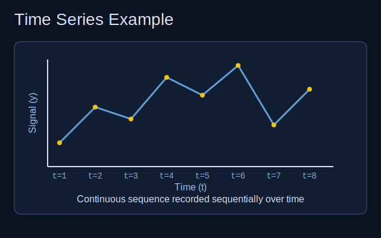
  </li>
  <li class="hover-example-item">
    <strong>Labels:</strong> Special qualitative or quantitative variables used as training targets in mapping $x \to y$.
    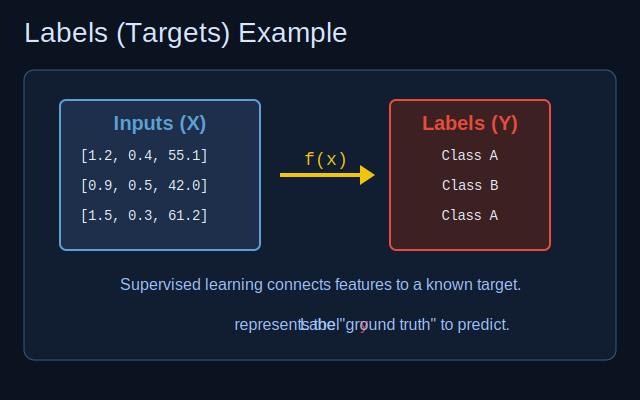
  </li>
</ul>
:::

### Measurement scales

::: {.fragment}
<ul>
  <li class="hover-example-item">
    <strong>Nominal scale:</strong> Sorting into categories; operations $=, \neq$.
    
  </li>
  <li class="hover-example-item">
    <strong>Ordinal scale:</strong> Introduces ranking; operations $<, >$.
    
  </li>
  <li class="hover-example-item">
    <strong>Interval scale:</strong> Meaningful distances, but no absolute zero (e.g., $^{\circ}$C); allows $+, -$.
    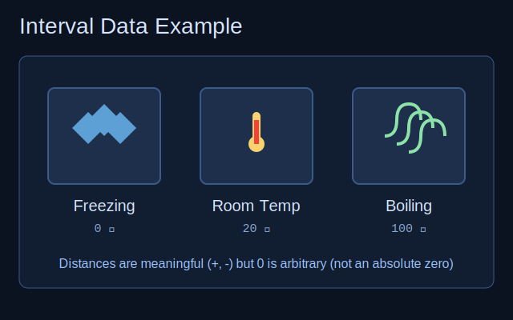
  </li>
  <li class="hover-example-item">
    <strong>Ratio scale:</strong> Absolute zero exists; enables ratios and scaling (e.g., Kelvin); allows $\times, \div$.
    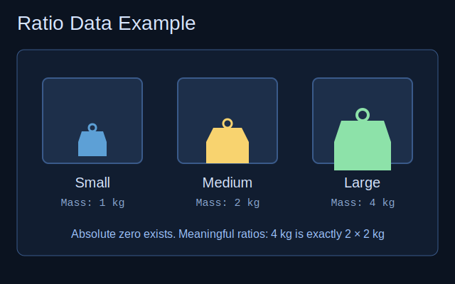
  </li>
</ul>
::: 

## Data Preprocessing: Goals and Overview

::: {.fragment}
Data preprocessing encompasses all steps to turn raw sensor outputs into a meaningful dataset.
:::

::: {.fragment}
- Increases interpretability and focuses learning models on relevant aspects.
- Often requires more labor than building the ML models themselves.
:::

::: {.notes}
**Preprocessing Overview**: Emphasize that raw data is rarely ready for algorithms. Missing values, wrong scales, or noisy signals can completely derail a learning method. A model is only as good as the data fed into it ("garbage in, garbage out").
:::

## Data Cleaning: Fixing the Foundation

::: {.columns}
::: {.column width="50%"}
### Common Issues
::: {.fragment}
- Missing values (NaNs) from dropped transmissions.
- Invalid ranges or duplicated entries.
:::

### Mitigation
::: {.fragment}
- **Interpolation**: Estimate missing data via neighbors.
- **Replacement markers**: E.g., substituting $-1000$ for a NaN temperature reading.
:::
:::

::: {.column width="50%"}
::: {.fragment}
> **Best Practice**: Always attempt to fix data problems at the physical source (e.g., cleaning a dirty camera lens) before mitigating digitally.
:::
:::
:::

::: {.notes}
**Data Cleaning**: It is crucial for engineers not to just mask bad sensor performance with code. If a sensor is broken, fix the sensor. Only perform digital interpolation when physical fixes are inaccessible or impossible.
:::

## Normalization: Scaling for Comparability

::: {.fragment}
Normalization rescales variables into a comparable numerical range.
:::

::: {.fragment}
- **Min-Max Scaling** ($[0,1]$): Highlights relative relationships regardless of absolute magnitude.
- **Normalization to Maximum**: Divides by $\max(|x_i|)$ to bound within $[-1, 1]$.
- **Subtraction of Mean (Z-score)**: Focuses strictly on variation ($\mu=0$).
:::

::: {.fragment .mt-4}
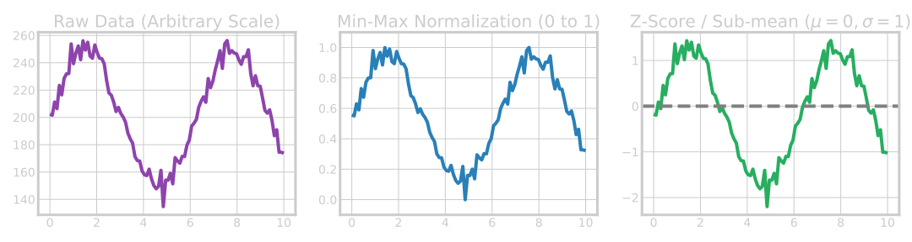
:::

::: {.notes}
**Normalization**: Without normalization, a neural network might completely ignore a variable measured in millivolts because a neighboring variable is measured in kilovolts. The absolute magnitude dictates how the algorithms weight features initially.
:::

## Filtering Data & Moving Averages

::: {.columns}
::: {.column width="40%"}
::: {.fragment}
- **Moving Average**: Smooths high-frequency noise by averaging sequential points.
- **Median Filter**: Robust against extreme outliers; preserves sharp step changes.
:::

::: {.fragment}
```{python}
#| eval: false
#| echo: true
#| code-line-numbers: false
#| code-block-height: 600px

import numpy as np

# Noisy 1D signal (e.g. sensor stream)
x = np.array([1.0, 1.2, 0.9, 5.0, 1.1, 1.0, 0.95])  # spike at index 3

# Moving average — box convolution, equal weights
def moving_average(a: np.ndarray, window: int = 3) -> np.ndarray:
    k = np.ones(window) / window
    return np.convolve(a, k, mode="same")

# Median filter — sliding window median (robust to spikes)
def median_filter_1d(a: np.ndarray, size: int = 3) -> np.ndarray:
    pad = size // 2
    padded = np.pad(a, (pad, pad), mode="edge")
    return np.array(
        [np.median(padded[i : i + size]) for i in range(len(a))]
    )

x_ma = moving_average(x, window=3)
x_med = median_filter_1d(x, size=3)
```
:::
:::
::: {.column width="60%"}
::: {.fragment}
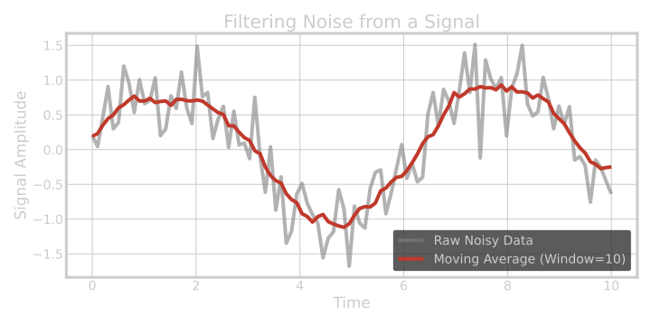
:::
:::
:::

::: {.notes}
**Filtering**: Engineers are familiar with signal filters. In ML data prep, moving averages and median filters are just convolutions that remove high-frequency noise so that subsequent models don't mistake sensor static for a real pattern.
:::

## Triggering and Event Extraction

::: {.fragment}
For continuous time-series, identifying the phenomena of interest is critical.
:::

::: {.fragment}
- **Triggering**: Cutting out specific repetitive windows (e.g., a motor turning on) based on a threshold.
:::

::: {.fragment}
**Example: Extraction via threshold triggering**
```python
import numpy as np

def extract_events(signal, threshold, window):
    events = []
    i = 0
    while i < len(signal) - window:
        if signal[i] > threshold:
            events.append(signal[i : i + window])
            i += window  # Skip forward to avoid overlapping
        else:
            i += 1
    return np.array(events)
```
:::

::: {.notes}
**Triggering**: Often, 99% of a time-series is boring steady-state. Triggering extracts just the events we care about.
:::

## Triggering Results

::: {.fragment}
A continuous process containing localized events is sliced based on a defined threshold:
:::

::: {.fragment}
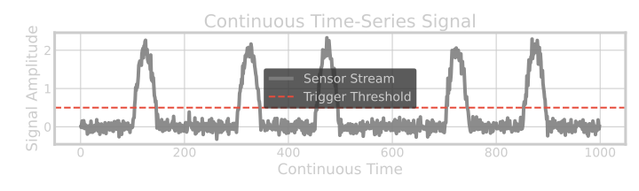{width=70%}
:::

::: {.fragment .mt-4}
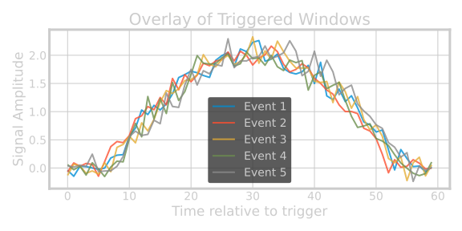{width=45%}
:::

::: {.notes}
**Triggering Result**: Show how triggering on a threshold slices a continuous chaotic timeline into neat, comparable chunks. By aligning them all at start = 0, we can easily see if an anomaly occurs during a specific phase of the repetitive process.
:::

## Differentiation

::: {.fragment}
Differentiation removes constant offsets and reveals slope dynamics, making it easier to study changes rather than absolute values. 
:::

::: {.fragment}
**Example: First-order differences**
```python
import numpy as np

# Differencing removes linear drift
signal_diff = np.diff(signal) 
```
:::

::: {.fragment .mt-2}
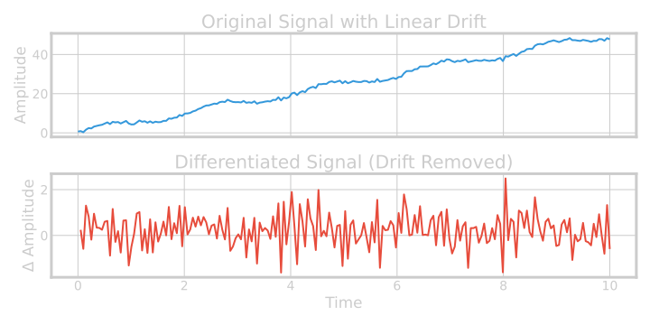{width=100%}
:::

::: {.notes}
**Differentiation**: If a sensor baseline constantly drifts (e.g. thermal expansion), absolute thresholding will fail. Differentiating the signal zeroes out the drift and highlights the sudden changes perfectly.
:::

## Fourier Transformation (FFT)

::: {.fragment}
Transforming temporal signals into frequency space exposes hidden periodic patterns that are invisible in the time domain.
:::

::: {.fragment}
**Example: Fast Fourier Transform**
```python
import numpy as np

frequencies = np.fft.rfftfreq(len(time), time[1] - time[0])
magnitudes = np.abs(np.fft.rfft(signal))
```
:::

::: {.fragment .mt-2}
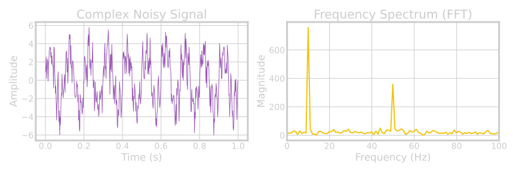{width=100%}
:::

::: {.notes}
**FFT**: Mention that a chaotic-looking vibration sensor output might actually be composed of two perfectly clean frequencies (e.g. an engine at 10Hz and a fan at 50Hz). The FFT reveals these components instantly.
:::

## Discrete Wavelet Transform (DWT)

::: {.fragment}
Unlike FFT which loses time resolution, DWT captures both *frequency* (scale) and *location* in time, making it ideal for non-stationary signals.
:::

::: {.fragment}
**Example: 1D DWT Decomposition**
```python
import pywt

# Decompose signal into Approximation (cA) and Detail (cD)
cA, cD = pywt.dwt(signal, 'db4')
```
:::

::: {.fragment .mt-2}
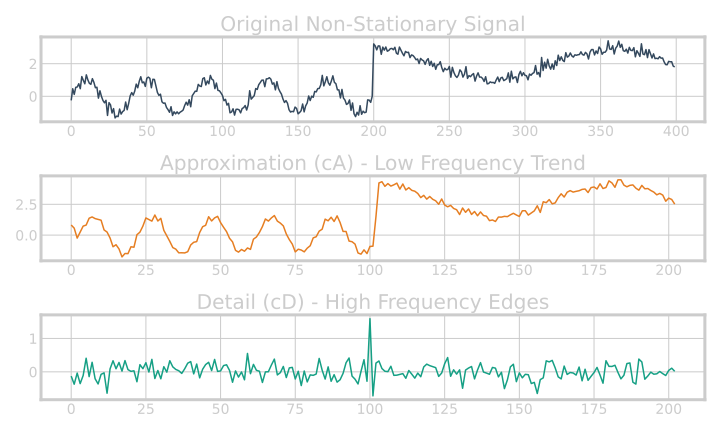{width=70%}
:::

::: {.notes}
**Wavelet Transform**: Mention that while FFT gives you the ingredients of a smoothie, DWT tells you *when* each ingredient was added. It splits data into broad trends (Approximations) and local abrupt changes or noise (Details).
:::

## Supervised Learning: Overview

::: {.fragment}
Machine Learning is broadly categorized into:

- **Supervised Learning**: Mapping inputs $x$ to known answers (labels) $d$.
- **Unsupervised Learning**: Finding hidden structures without labels.
- **Reinforcement Learning**: Interacting with an environment to maximize rewards.
 
:::

::: {.fragment}
Supervised Learning requires a dataset of input-output pairs: $\mathcal{D} = \{(\mathbf{x}_i, d_i)\}_{i=1}^N$
:::

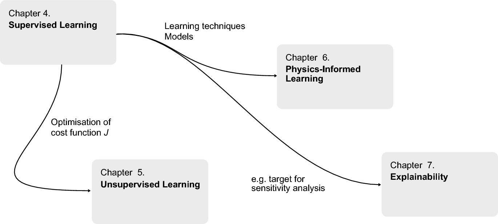{width=50%}

::: {.notes}
**Supervised Intro**: Explain that "supervised" means we play the role of the teacher. We know the correct answer ($d$), and we guide the algorithm to learn the mapping from $x$ to $d$.
:::

## The Learning Strategy: Optimization

::: {.fragment}
We learn by iteratively changing a model $f(x; \pi)$ to match target $d$.
:::

::: {.fragment}
- Define a **Cost Function** $J(f)$, measuring the gap between prediction and reality.
- **Example (Least Mean Squares)**:
  $$ J = (d - f(x))^2 $$
- Adjust model parameters $\pi$ in the direction that minimizes $J$.
::: 

::: {.notes}
**Optimization Strategy**: This is the core engine of supervised learning. Define how wrong the model is ($J$), and surgically alter the model's internal gears ($\pi$) to make it slightly less wrong. Repeat.
:::

## Classification vs. Regression

::: {.columns}
::: {.column width="50%"}
### Classification
::: {.fragment}
- Assigning inputs to discrete categories. 
- Result set is finite. Ex: $\mathcal{Y} = \{\text{"Motorcycle"}, \text{"Traffic Light"}\}$.
- Binary Alarm Ex: $d \in \{0, 1\}$ (Harmless vs. Danger).
:::

::: {.fragment .mt-2}
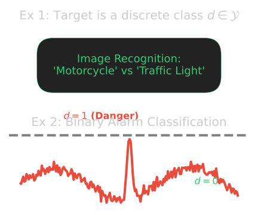{width=70%}
:::
:::

::: {.column width="50%"}
### Regression
::: {.fragment}
- Replicating a continuous functional curve.
- Result set lies on a numerical scale, reflecting continuous predictions.
- Ex: Outputting a risk probability ($y = 0.8$ for 80% risk) instead of a hard limit.
:::

::: {.fragment .mt-2}
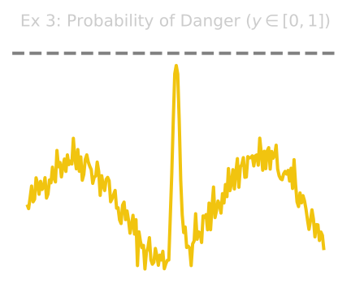{width=80%}
:::
:::
:::


::: {.notes}
**Classification vs Regression**: Use the alarm example. Classification returns a simple 0 or 1 (safe or dangerous). Regression models return the exact probability (0.8 or 80% risk of failure).

Example: Traffic Light and Motorcycle
An image recognition should recognize motorcycles and traffic lights in vid-
eos. The result set is  = (“Motorcycle”, “Traffic Light”) and d ∈  . ◄

Example: Alarm Classification
A measurement on a capacitor is examined for voltage peaks. The waveform
reflects these peaks. Using learning methods, it is decided whether the signal
course is dangerous or not. We use the voltage course as input data and for d
we need assignments d ∈ {0, 1} where 0 stands for harmless and 1 for dan-
gerous. This is a canonical classification situation. ◄

Example: Probability of Danger
We continue our last example and reformulate it: The evaluation of the sig-
nal should not only distinguish between the two categories 1 “Danger” and 0
“No Danger”, but rather output a risk value that, for example, lies between 0
and 1. With a result of y = 0.8 a 80 % risk is present. This is a classic exam-
ple of a regression. ◄
:::

## The Golden Rule of Model Evaluation

::: {.fragment}
To prove a model actually learned the underlying physics (and didn't just memorize), we split the data.
:::

::: {.fragment}
- **Training Set**: Used exclusively to update model parameters and minimize $J$.
- **Test Set**: Held back entirely; used only for final performance grading.
:::

::: {.fragment .mt-4}
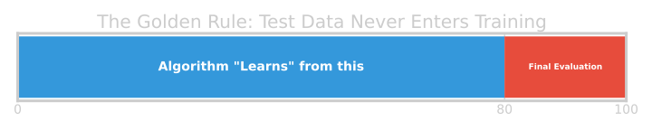
:::

::: {.fragment}
> **Golden Rule**: Elements of the Test set must *never* enter training!
:::

::: {.notes}
**Golden Rule**: If a test sample leaks into the training set, your test results are tainted. The model has "seen the exam questions before the test." Emphasize this heavily—it is the most common industry mistake.
:::

## Evolutionary Learning: A Brute-Force Example

::: {.fragment}
How do we minimize the cost $J$? One simple (but inefficient) way is randomly guessing parameters.
:::

::: {.fragment}
1. Define **Fitness**: $F = \frac{1}{J}$
2. Randomly mutate parameters $\pi \to \tilde{\pi}$.
3. If $F$ increases (Cost $J$ drops), keep the change!
4. Repeat endlessly.
:::

::: {.fragment}
This demonstrates that *any* optimization routine that navigates the cost landscape can theoretically "learn". Neural Networks simply do it far more intelligently using calculus (gradients).
:::

::: {.notes}
**Evolutionary Learning**: Use this as the conceptual bridge. It shows that learning isn't magic; it's just searching for parameters that reduce error. Once they accept this brute-force method works, you can introduce gradient-based methods as simply a much faster way to search.
:::

## The LMS Adaptive Filter

::: {.fragment}
The **Least-Mean-Squares (LMS)** adaptive filter iteratively adjusts its weights $\mathbf{a}$ to map an input $\mathbf{x}$ to a target $d$. 
This is an archetype for gradient-descent optimization in machine learning.
:::

::: {.fragment}
**Theory & Optimization Pipeline**

1. Calculate the current prediction: $y^{(i)} = \mathbf{a}^{(i)T} \mathbf{x}^{(i)}$
2. Determine the Error: $\epsilon^{(i)} = d - y^{(i)}$
3. Update weights (where $\eta$ is the **learning rate**):
$$ \mathbf{a}^{(i+1)} = \mathbf{a}^{(i)} + \eta \cdot \epsilon^{(i)} \cdot \mathbf{x}^{(i)} $$
:::

::: {.notes}
**LMS Filter**: Explain that this is how a vehicle's cruise control actively works. It continuously checks the error (current speed vs target speed) and injects an adjustment. The "learning rate" dictates how aggressively we push the throttle.
:::

## LMS Convergence & Hyperparameters

::: {.columns}
::: {.column width="50%"}
### The Learning Rate

::: {.fragment}
- The learning rate $\eta$ is a critical **hyperparameter**.
- Small $\eta$: Smooth, guaranteed convergence, but very slow.
- Large $\eta$: Rapid adaptation, but risks instability and divergence.
::: 

::: {.fragment}
**LMS implementation loop:**
```python
for i in range(iterations): 
    y = np.dot(a, x)
    error = d - y
    # Gradient Descent 
    a = a + learning_rate * error * x
```
:::
:::

::: {.column width="50%"}
::: {.fragment}
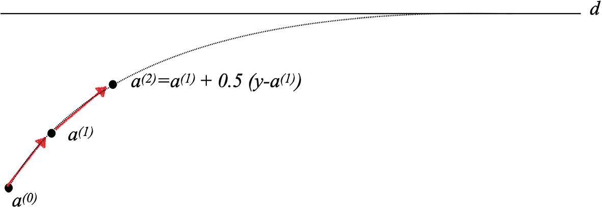{width=70%}
:::
:::
:::

::: {.notes}
**Convergence**: Point out the plot. The yellow line reaches the target almost immediately because of a higher learning rate, while the blue takes a long time. However, if the learning rate were pushed too far, the system would oscillate wildly and explode to infinity!
:::

## Gradient Descent Intuition (2D)

<iframe src="../../assets/widgets/gradient_descent_widget.html" width="100%" height="700" style="border:none; background:black;"></iframe>

::: {.notes}
**Widget Demo**: Show them how a high learning rate causes the algorithm to overshoot and oscillate violently across the valley, whereas a learning rate that is too small leads to painstakingly slow progress. Click around to start gradient descent from various points!
:::

## Materials example 1: process→property regression

::: {.columns}
::: {.column width="60%"}
::: {.fragment}
- Inputs: process parameters, composition, heat treatment metadata.
- Target: hardness / tensile strength (continuous).
- Risks: confounding from batch effects, hidden process controls.
:::
:::

::: {.column width="40%"}
::: {.fragment}
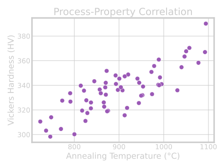{width=100%}
:::
:::
:::

## Materials example 2: defect classification from images

::: {.columns}
::: {.column width="60%"}
::: {.fragment}
- Inputs: microscopy images + acquisition metadata.
- Target: defect class / defect probability.
- Risks: class imbalance, label noise, instrument-specific artifacts.
:::
:::

::: {.column width="40%"}
::: {.fragment}
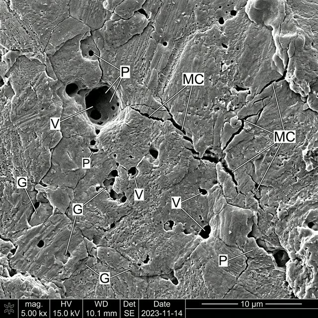{width=100%}
:::
:::
:::

## Materials example 3: spectra interpretation task framing

::: {.columns}
::: {.column width="60%"}
::: {.fragment}
- Inputs: spectral signal (possibly multimodal context).
- Targets: composition class, phase indicator, or property proxy.
- Risks: baseline drift, preprocessing leakage, calibration instability.
:::
:::

::: {.column width="40%"}
::: {.fragment}
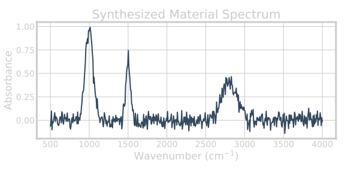{width=100%}
:::
:::
:::

## How MFML links to Materials Genomics

- MG relies on MFML’s risk/validation language for trustworthy discovery.
- Representation, latent spaces, and uncertainty all require Unit 1 foundations.
- Dataset quality and split logic dominate many downstream MG outcomes [@sandfeld_materials_data_science].

## How MFML links to ML-PC

- ML-PC applies the same principles to noisier experimental signals.
- Measurement physics introduces additional constraints on pipeline validity.
- MFML concepts become operational safeguards in lab workflows [@ryan2021machine].

## Lecture-essential vs exercise content split

**Lecture essential:**

- definitions, equations, assumptions, validity criteria.

**Exercise essential:**

- implementation, diagnostics, ablations, error analysis.

## Exercise setup: NumPy linear regression from scratch

- Build linear regression objective and gradient updates manually.
- Implement train/validation split with strict separation.
- Plot training vs validation loss curves over iterations.

## Exercise extension: regularization + split stress test

- Add L2 term and compare under/overfit behavior.
- Repeat with different split strategies (random vs grouped).
- Document when measured “improvement” is actually leakage-driven.

## Exam-aligned summary: 10 must-know statements

1. ML is optimization under uncertainty, not magic fitting.
2. Train loss is not deployment success.
3. Split design is part of the model.
4. Leakage invalidates performance claims.
5. Metrics must align with decisions.
6. Uncertainty must be interpreted by type.
7. Inductive bias is unavoidable.
8. Domain constraints improve trustworthiness.
9. Explainability is contextual, not absolute.
10. Reproducibility is a scientific requirement.

## References + reading assignment for next unit

- **Required reading before Unit 2:**
  - Neuer: Ch. 1, 3, 4.1 - 4.4
 
- **Optional depth:**
  - Murphy: Ch. 1.1–1.4
  - Bishop: Ch. 1.1 and 1.3
- Next unit: linear algebra geometry for learning (projections, conditioning, SVD/PCA bridge).

::: {#refs}
::: 
