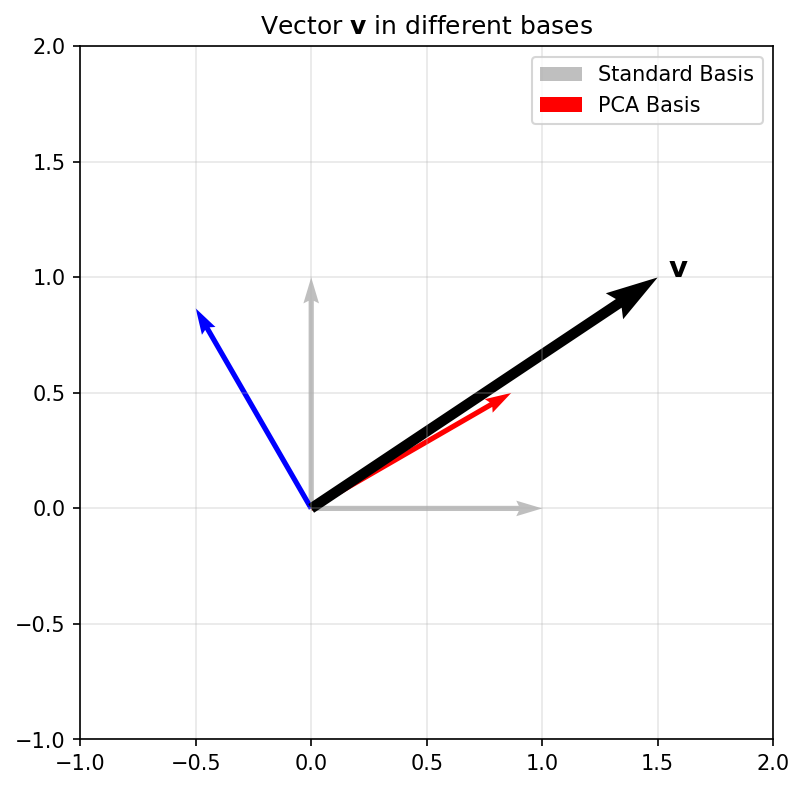

## Title: Linear Algebra for ML

- **The Geometry of Intelligence**: In this unit, we move from scalar arithmetic to the geometric world of vectors and matrices.
- **Dependency Role**: Linear Algebra (LA) is the bedrock for PCA, SVD, Linear Regression, and Neural Networks.
- **Goal**: Develop an intuitive understanding of high-dimensional spaces and transformations.

## Unit 2 learning outcomes

By the end of this lecture, you will be able to:
- Interpret matrices as **linear operators** that transform space.
- Derive **PCA** as a variance-maximization problem using eigendecomposition.
- Apply **SVD** for low-rank approximation and denoising of materials data.
- Assess **conditioning** and numerical stability in linear systems.

## Why LA still matters in modern ML

- **High-Dimensional Manifolds**: Data doesn't just "sit" in a table; it lives on non-linear manifolds in high-dim space [@sandfeld_materials_data_science].
- **Parallelism**: Modern GPUs are optimized for matrix-vector products ($\mathbf{y} = \mathbf{W}\mathbf{x} + \mathbf{b}$).
- **Compactness**: A million parameters in a Deep Net are just a series of matrix operations.

## Notation contract for the semester

- **Scalars**: $a, b, c$ (italic lowercase).
- **Vectors**: $\mathbf{x}, \mathbf{y}, \mathbf{w}$ (bold lowercase). Assumed to be **column vectors**.
- **Matrices**: $\mathbf{A}, \mathbf{X}, \mathbf{W}$ (bold uppercase).
- **Transposition**: $\mathbf{x}^T$ turns a column into a row.
- **Inner Product**: $\langle \mathbf{x}, \mathbf{y} \rangle = \mathbf{x}^T \mathbf{y} = \sum x_i y_i$.

## Scalars, vectors, matrices refresher

- **Vector**: A point in $D$-dimensional space $\mathbb{R}^D$.
- **Matrix**: A collection of $N$ vectors of dimension $D$, written as an $N \times D$ data matrix $\mathbf{X}$.
- **Tensors**: Generalization to more than 2 dimensions (e.g., RGB images are $H \times W \times 3$).

## Vector spaces and subspaces

- **Vector Space**: A set of vectors that is closed under addition and scalar multiplication.
- **Subspace**: A "flat" region within a larger space (e.g., a plane in 3D).
- **In ML**: We often look for a low-dimensional **subspace** that contains most of the data's information.

## Basis and change of basis

::: {.columns}
::: {.column width="60%"}
- **Basis**: A set of linearly independent vectors that **span** the space.
- **Standard Basis**: $\mathbf{e}_1 = [1, 0, \dots]^T, \mathbf{e}_2 = [0, 1, \dots]^T$.
- **Change of Basis**: Re-representing a vector in a new coordinate system.
:::

::: {.column width="40%"}
::: {.callout-note title="Geometric Plot" .fragment}
{width=80%}
:::
:::
:::

## Linear combinations and span

- **Linear Combination**: $\mathbf{v} = \sum \alpha_i \mathbf{b}_i$.
- **Span**: The set of all possible linear combinations of a set of vectors.
- **Expressivity**: A model's ability to represent different data depends on the span of its basis functions.

## Linear maps as operators

::: {.columns}
::: {.column width="40%"}
- A matrix $\mathbf{A}$ defines a mapping $f(\mathbf{x}) = \mathbf{Ax}$.
- **Geometric View**: Matrices can rotate, scale, and shear space.
- **Composition**: $f(g(\mathbf{x})) = \mathbf{A}(\mathbf{Bx}) = (\mathbf{AB})\mathbf{x}$.

```{ojs}
//| panel: input
viewof a11 = Inputs.range([-2, 2], {value: 1, step: 0.1, label: "A11"})
viewof a12 = Inputs.range([-2, 2], {value: 0, step: 0.1, label: "A12"})
viewof a21 = Inputs.range([-2, 2], {value: 0, step: 0.1, label: "A21"})
viewof a22 = Inputs.range([-2, 2], {value: 1, step: 0.1, label: "A22"})
```
:::

::: {.column width="60%"}
```{ojs}
//| fig-align: center
Plot.plot({
  grid: true,
  x: {domain: [-3, 3]},
  y: {domain: [-3, 3]},
  aspectRatio: 1,
  marks: [
    Plot.ruleX([0]),
    Plot.ruleY([0]),
    Plot.line(origSq, {x: "x", y: "y", stroke: "lightgray", strokeWidth: 2}),
    Plot.line(transSq, {x: "x", y: "y", stroke: "dodgerblue", strokeWidth: 3})
  ]
})
```
```{ojs}
//| output: false
origSq = [{x: 0, y: 0}, {x: 1, y: 0}, {x: 1, y: 1}, {x: 0, y: 1}, {x: 0, y: 0}]
transSq = origSq.map(p => ({
  x: a11 * p.x + a12 * p.y,
  y: a21 * p.x + a22 * p.y
}))
```
:::
:::

## Column space and row space

- **Column Space** $C(\mathbf{A})$: The span of the columns. All possible outputs $\mathbf{y} = \mathbf{Ax}$.
- **Row Space**: The span of the rows.
- **In ML**: If your target $\mathbf{y}$ is not in $C(\mathbf{X})$, your linear model will have non-zero residual error.

## Nullspace and identifiability

::: {.columns}
::: {.column width="30%"}
- **Nullspace** $N(\mathbf{A})$: All $\mathbf{x}$ such that $\mathbf{Ax} = \mathbf{0}$.
- **Identifiability**: If $N(\mathbf{X})$ is non-trivial, multiple parameter sets produce identical predictions.

**Matrix $\mathbf{A}$**:
$\begin{bmatrix} 1 & 2 \\ 2 & d \end{bmatrix}$

```{ojs}
//| panel: input
viewof dVal = Inputs.range([0, 6], {value: 4, step: 0.1, label: "d"})
```
*When d=4, the matrix is Singular. The output space squashes to a 1D line!*
:::

::: {.column width="70%"}
```{ojs}
//| fig-align: center
Plot.plot({
  grid: true,
  x: {domain: [-15, 15]},
  y: {domain: [-15, 15]},
  aspectRatio: 1,
  marks: [
    Plot.ruleX([0]),
    Plot.ruleY([0]),
    Plot.dot(mappedNull, {x: "x", y: "y", fill: d => d.is_null ? "red" : "dodgerblue", r: d => d.is_null ? 5 : 3, title: "Output Space"})
  ]
})
```

```{ojs}
//| output: false
ptsGridNull = {
  let res = [];
  for(let i=-3; i<=3; i+=0.5) {
    for(let j=-3; j<=3; j+=0.5) {
      res.push({x0: i, y0: j});
    }
  }
  return res;
}
mappedNull = ptsGridNull.map(p => ({
  x: 1 * p.x0 + 2 * p.y0,
  y: 2 * p.x0 + dVal * p.y0,
  is_null: Math.abs(1 * p.x0 + 2 * p.y0) < 0.1 && Math.abs(2 * p.x0 + dVal * p.y0) < 0.1
}))
```
:::
:::

## Rank and model capacity intuition

- **Rank**: The number of linearly independent columns (or rows).
- **Full Rank**: Maximum possible rank for a matrix's dimensions.
- **Capacity**: Rank measures the "true" dimensionality of the transformation. Low-rank matrices compress information.

## Inner products and similarity

- $\langle \mathbf{x}, \mathbf{y} \rangle = \|\mathbf{x}\| \|\mathbf{y}\| \cos(\theta)$.
- **Cosine Similarity**: Measures the alignment of two vectors, independent of their magnitude.
- **Orthogonality**: $\langle \mathbf{x}, \mathbf{y} \rangle = 0$. Vectors are at 90 degrees.

## Norms (L1/L2/Frobenius)

- **L2 Norm**: $\|\mathbf{x}\|_2 = \sqrt{\sum x_i^2}$ (Euclidean distance).
- **L1 Norm**: $\|\mathbf{x}\|_1 = \sum |x_i|$ (Manhattan distance, promotes sparsity).
- **Frobenius Norm**: $\|\mathbf{A}\|_F = \sqrt{\sum \sum A_{ij}^2}$ (Size of a matrix).

## Distance metrics and data geometry

- **Euclidean distance** is the default, but it can be misleading in high dimensions (**Curse of Dimensionality**).
- **Mahalanobis Distance**: Scales distances by the inverse covariance, accounting for correlations and feature variances [@murphy2012machine].

## Orthogonality and orthonormal bases

- **Orthonormal Basis**: $\langle \mathbf{u}_i, \mathbf{u}_j \rangle = \delta_{ij}$ (All vectors unit length and mutually perpendicular).
- **Numerical Advantage**: Calculating coefficients is just an inner product: $\alpha_i = \langle \mathbf{v}, \mathbf{u}_i \rangle$.
- **Stability**: Orthonormal matrices $\mathbf{Q}$ preserve norms: $\|\mathbf{Qx}\| = \|\mathbf{x}\|$.

## Projection onto subspaces

::: {.columns}
::: {.column width="50%"}
### Mathematical View
- **Formula**: For a column space spanned by $\mathbf{X}$:
  $$\hat{\mathbf{y}} = \mathbf{X}(\mathbf{X}^T\mathbf{X})^{-1}\mathbf{X}^T\mathbf{y}$$
- **Orthogonality**: The error $\mathbf{e} = \mathbf{y} - \hat{\mathbf{y}}$ is perpendicular to the subspace.

```{ojs}
//| panel: input
viewof y1 = Inputs.range([-5, 5], {value: 2, step: 0.1, label: "y₁"})
viewof y2 = Inputs.range([-5, 5], {value: 4, step: 0.1, label: "y₂"})
viewof thetaProj = Inputs.range([0, Math.PI], {value: 0.5, step: 0.05, label: "Subspace Angle"})
```
*Move $\mathbf{y}$ (blue) and watch its projection $\hat{\mathbf{y}}$ (green) drop orthogonally (red dashed) onto the subspace (gray).*
:::

::: {.column width="50%"}
```{ojs}
//| fig-align: center
Plot.plot({
  grid: true, x: {domain: [-5, 5]}, y: {domain: [-5, 5]}, aspectRatio: 1,
  marks: [
    Plot.ruleX([0]), Plot.ruleY([0]),
    Plot.line([[-6*Math.cos(thetaProj), -6*Math.sin(thetaProj)], [6*Math.cos(thetaProj), 6*Math.sin(thetaProj)]], {stroke: "lightgray", strokeWidth: 4}),
    Plot.arrow([{x1: 0, y1: 0, x2: yProj.x, y2: yProj.y}], {x1: "x1", y1: "y1", x2: "x2", y2: "y2", stroke: "green", strokeWidth: 4}),
    Plot.arrow([{x1: 0, y1: 0, x2: y1, y2: y2}], {x1: "x1", y1: "y1", x2: "x2", y2: "y2", stroke: "blue", strokeWidth: 2}),
    Plot.line([[yProj.x, yProj.y], [y1, y2]], {stroke: "red", strokeDasharray: "4", strokeWidth: 2}),
    Plot.text([{x: y1, y: y2+0.5, text: "y"}], {x: "x", y: "y", text: "text", fill: "blue"}),
    Plot.text([{x: yProj.x, y: yProj.y-0.5, text: "y_hat"}], {x: "x", y: "y", text: "text", fill: "green"})
  ]
})
```
```{ojs}
//| output: false
yProj = {
  const c = Math.cos(thetaProj);
  const s = Math.sin(thetaProj);
  const dot = y1*c + y2*s;
  return {x: dot*c, y: dot*s};
}
```
:::
:::

## Projection matrix properties

- **$\mathbf{P} = \mathbf{X}(\mathbf{X}^T\mathbf{X})^{-1}\mathbf{X}^T$**
- **Idempotence**: $\mathbf{P}^2 = \mathbf{P}$. Projecting twice doesn't change anything.
- **Symmetry**: $\mathbf{P}^T = \mathbf{P}$.
- **Interpretation**: $\mathbf{P}$ acts as a "filter" that keeps only the component of $\mathbf{y}$ aligned with $\mathbf{X}$.

## Least squares as projection

- **Linear Regression**: $\mathbf{y} \approx \mathbf{Xw}$.
- We want $\mathbf{Xw}$ to be the projection of $\mathbf{y}$ onto the column space of $\mathbf{X}$.
- This geometric view leads directly to the **Normal Equations**.

## Normal equations derivation

::: {.fragment}
1. **Residual error**: $\mathbf{r} = \mathbf{y} - \mathbf{Xw}$
:::

::: {.fragment}
2. **Orthogonality**: $\mathbf{X}^T \mathbf{r} = \mathbf{0}$ (Error must be orthogonal to feature span)
:::

::: {.fragment}
3. **Substitute**: $\mathbf{X}^T (\mathbf{y} - \mathbf{Xw}) = \mathbf{0}$
:::

::: {.fragment}
4. **Expand & Rearrange**: $\mathbf{X}^T \mathbf{Xw} = \mathbf{X}^T \mathbf{y}$
:::

::: {.fragment}
5. **Solve**: $\hat{\mathbf{w}} = (\mathbf{X}^T\mathbf{X})^{-1}\mathbf{X}^T\mathbf{y}$ [@bishop2006pattern]
:::

## Condition number intuition

- **Condition Number** $\kappa(\mathbf{A})$: Measures how much the output $\mathbf{y}$ can change for a small change in input $\mathbf{x}$.
- Ratio of largest to smallest singular values: $\kappa = \sigma_{max} / \sigma_{min}$.
- **Well-conditioned**: $\kappa \approx 1$. **Ill-conditioned**: $\kappa \gg 1$.

## Ill-conditioning in practice

- **Causes**: Multicollinearity (features are nearly linear combinations of each other).
- **Effect**: Small noise in $\mathbf{y}$ leads to massive, unstable swings in $\hat{\mathbf{w}}$.
- **Visual**: The loss landscape becomes a very narrow, elongated valley.

## Numerical stability and scaling

- **Standardization**: Subtracting mean and dividing by std-dev helps equalize eigenvalues.
- **Numerical Trick**: Never invert $(\mathbf{X}^T\mathbf{X})$ directly. Use **QR decomposition** or **SVD** for more stable solutions.

## Eigenvalues/eigenvectors recap

::: {.columns}
::: {.column width="40%"}
- $\mathbf{Ax} = \lambda \mathbf{x}$.
- **Intuition**: Eigenvectors are the "characteristic directions" where the transformation is just a simple scaling by $\lambda$.
- Observe how a symmetric matrix transforms a unit circle (gray) into an ellipse (blue). The principal axes (red) are the scaled eigenvectors!

```{ojs}
//| panel: input
viewof s11 = Inputs.range([-3, 3], {value: 1.5, step: 0.1, label: "S11"})
viewof s12 = Inputs.range([-2, 2], {value: 0.8, step: 0.1, label: "S12 = S21"})
viewof s22 = Inputs.range([-3, 3], {value: 1.0, step: 0.1, label: "S22"})
```
:::

::: {.column width="60%"}
```{ojs}
//| fig-align: center
Plot.plot({
  grid: true, x: {domain: [-4, 4]}, y: {domain: [-4, 4]}, aspectRatio: 1,
  marks: [
    Plot.ruleX([0]), Plot.ruleY([0]),
    Plot.line(circlePts, {x: "x", y: "y", stroke: "gray", strokeDasharray: "4"}),
    Plot.line(ellipsePts, {x: "x", y: "y", stroke: "dodgerblue", strokeWidth: 2}),
    Plot.arrow(eigenVectors, {x1: 0, y1: 0, x2: "x", y2: "y", stroke: "red", strokeWidth: 3})
  ]
})
```

```{ojs}
//| output: false
circlePts = Array.from({length: 100}, (_, i) => {
  let t = i * 2 * Math.PI / 99; return {x: Math.cos(t), y: Math.sin(t)};
});
ellipsePts = circlePts.map(p => ({
  x: s11*p.x + s12*p.y, y: s12*p.x + s22*p.y
}));
eigenVectors = {
  let T = s11 + s22; let D = s11*s22 - s12*s12;
  let L1 = T/2 + Math.sqrt(Math.max(0, T*T/4 - D));
  let L2 = T/2 - Math.sqrt(Math.max(0, T*T/4 - D));
  if (Math.abs(s12) < 0.001) return [{x: L1, y: 0}, {x: 0, y: L2}];
  let v1x = L1 - s22, v1y = s12;
  let n1 = Math.sqrt(v1x*v1x + v1y*v1y) || 1;
  let v2x = L2 - s22, v2y = s12;
  let n2 = Math.sqrt(v2x*v2x + v2y*v2y) || 1;
  return [
    {x: (v1x/n1)*L1, y: (v1y/n1)*L1},
    {x: (v2x/n2)*L2, y: (v2y/n2)*L2}
  ];
}
```
:::
:::

## Spectral decomposition intuition

- For a symmetric matrix $\mathbf{S}$: $\mathbf{S} = \mathbf{U \Lambda U}^T$.
- **Geometric View**: A symmetric matrix is just a rotation to the eigenbasis, a scaling along those axes, and a rotation back.
- **Decomposition**: $\mathbf{S} = \sum \lambda_i \mathbf{u}_i \mathbf{u}_i^T$.

## Positive semidefinite matrices

- $\mathbf{x}^T \mathbf{Ax} \ge 0$ for all $\mathbf{x}$.
- **Eigenvalues**: All $\lambda_i \ge 0$.
- **Covariance Matrices** are always PSD. This ensures that "variance" can never be negative.

## Covariance matrix geometry

::: {.columns}
::: {.column width="50%"}
- **Data Matrix** $\mathbf{X}$ (centered): $\mathbf{S} = \frac{1}{N-1}\mathbf{X}^T\mathbf{X}$.
- The surface $\mathbf{x}^T \mathbf{S}^{-1} \mathbf{x} = 1$ defines an **Error Ellipsoid**.
- The axes are the eigenvectors of $\mathbf{S}$, with lengths proportional to $\sqrt{\lambda_i}$.

```{ojs}
//| panel: input
viewof varX = Inputs.range([0.1, 5], {value: 3, step: 0.1, label: "Var(X)"})
viewof varY = Inputs.range([0.1, 5], {value: 1, step: 0.1, label: "Var(Y)"})
viewof covXY = Inputs.range([-4, 4], {value: 1.2, step: 0.1, label: "Cov(X,Y)"})
```
:::

::: {.column width="50%"}
```{ojs}
//| fig-align: center
Plot.plot({
  grid: true, x: {domain: [-6, 6]}, y: {domain: [-6, 6]}, aspectRatio: 1,
  marks: [
    Plot.dot(randomData, {x: "x", y: "y", r: 2, fill: "gray", fillOpacity: 0.5}),
    Plot.line(covarianceEllipse, {x: "x", y: "y", stroke: "red", strokeWidth: 3})
  ]
})
```

```{ojs}
//| output: false
validCov = Math.max(-Math.sqrt(varX*varY)*0.99, Math.min(Math.sqrt(varX*varY)*0.99, covXY));
randomData = {
  let pts = [];
  let L11 = Math.sqrt(varX);
  let L21 = validCov / L11;
  let L22 = Math.sqrt(Math.max(0, varY - L21*L21));
  for(let i=0; i<400; i++) {
    let u1 = Math.random(), u2 = Math.random();
    let z0 = Math.sqrt(-2.0 * Math.log(u1)) * Math.cos(2.0 * Math.PI * u2);
    let z1 = Math.sqrt(-2.0 * Math.log(u1)) * Math.sin(2.0 * Math.PI * u2);
    pts.push({x: L11*z0, y: L21*z0 + L22*z1});
  }
  return pts;
}
covarianceEllipse = {
  let pts = [];
  let T = varX + varY; let D = varX*varY - validCov*validCov;
  let L1 = T/2 + Math.sqrt(Math.max(0, T*T/4 - D));
  let L2 = T/2 - Math.sqrt(Math.max(0, T*T/4 - D));
  let v1x = L1 - varY, v1y = validCov;
  let n1 = Math.sqrt(v1x*v1x + v1y*v1y) || 1; v1x/=n1; v1y/=n1;
  let v2x = L2 - varY, v2y = validCov;
  let n2 = Math.sqrt(v2x*v2x + v2y*v2y) || 1; v2x/=n2; v2y/=n2;
  
  for(let i=0; i<=100; i++) {
    let t = i * 2 * Math.PI / 100;
    let c = Math.cos(t), s = Math.sin(t);
    // Multiply by 2.0 to show the 2-sigma ellipse
    pts.push({
      x: 2.0 * (Math.sqrt(L1)*v1x*c + Math.sqrt(L2)*v2x*s),
      y: 2.0 * (Math.sqrt(L1)*v1y*c + Math.sqrt(L2)*v2y*s)
    });
  }
  return pts;
}
```
:::
:::

## PCA as variance maximization

::: {.columns}
::: {.column width="40%"}
- **PCA** seeks directions $\mathbf{u}$ that maximize the variance of the projected data: $J = \mathbf{u}^T \mathbf{Su}$.
- Subject to $\|\mathbf{u}\|=1$, stationary point is $\mathbf{Su} = \lambda \mathbf{u}$.
- **The best direction is the eigenvector with the largest eigenvalue.**

```{ojs}
//| panel: input
viewof pcaTheta = Inputs.range([0, Math.PI], {value: 0, step: 0.05, label: "Projection Angle"})
```

**Projected Variance:** ${pcaVar.toFixed(3)}

*Rotate the line (gray). Watch the variance of the projected points (red) change! It peaks when aligned with the principal component.*
:::

::: {.column width="60%"}
```{ojs}
//| fig-align: center
Plot.plot({
  grid: true, x: {domain: [-6, 6]}, y: {domain: [-6, 6]}, aspectRatio: 1,
  marks: [
    Plot.ruleX([0]), Plot.ruleY([0]),
    Plot.link(pcaLinkData, {x1: "x1", y1: "y1", x2: "x2", y2: "y2", stroke: "pink", strokeWidth: 1}),
    Plot.dot(pcaData, {x: "x", y: "y", fill: "lightgray", r: 3}),
    Plot.line([[-7*Math.cos(pcaTheta), -7*Math.sin(pcaTheta)], [7*Math.cos(pcaTheta), 7*Math.sin(pcaTheta)]], {stroke: "gray", strokeWidth: 2}),
    Plot.dot(pcaProjData, {x: "x", y: "y", fill: "red", r: 4})
  ]
})
```

```{ojs}
//| output: false
pcaData = {
  let pts = [];
  let ang = Math.PI / 6; 
  let s_major = 3.0, s_minor = 0.5;
  for (let i = 0; i < 150; i++) {
    let u1 = Math.max(0.0001, (Math.sin(i * 123.456) + 1)/2); 
    let u2 = Math.max(0.0001, (Math.cos(i * 789.123) + 1)/2);
    let z0 = Math.sqrt(-2.0 * Math.log(u1)) * Math.cos(2.0 * Math.PI * u2);
    let z1 = Math.sqrt(-2.0 * Math.log(u1)) * Math.sin(2.0 * Math.PI * u2);
    let x_raw = s_major * z0; let y_raw = s_minor * z1;
    pts.push({ x: x_raw * Math.cos(ang) - y_raw * Math.sin(ang), y: x_raw * Math.sin(ang) + y_raw * Math.cos(ang) });
  }
  return pts;
}
pcaProjData = pcaData.map(p => {
  let c = Math.cos(pcaTheta), s = Math.sin(pcaTheta);
  let proj = p.x * c + p.y * s;
  return {x: proj * c, y: proj * s, proj_val: proj};
})
pcaLinkData = pcaData.map((p, i) => ({
  x1: p.x, y1: p.y, x2: pcaProjData[i].x, y2: pcaProjData[i].y
}))
pcaVar = d3.variance(pcaProjData, d => d.proj_val)
```
:::
:::

## SVD overview

- Any $N \times D$ matrix $\mathbf{X}$ can be decomposed as: $\mathbf{X} = \mathbf{U \Sigma V}^T$.

```{mermaid}
%%| echo: false
%%| fig-align: center
graph LR
    X["X"] --> Eq["="]
    Eq["="] --> U["U"]
    U["U"] --> Sigma["Σ"]
    Sigma["Σ"] --> VT["V^T"]
    
    subgraph Dimensions
    X---D1["N x D"]
    U---D2["N x N"]
    Sigma---D3["N x D"]
    VT---D4["D x D"]
    end
```

- **$\mathbf{U}$**: Left singular vectors (eigenvectors of $\mathbf{XX}^T$).
- **$\mathbf{V}$**: Right singular vectors (eigenvectors of $\mathbf{X}^T\mathbf{X}$ - the Principal Components).
- **$\mathbf{\Sigma}$**: Diagonal matrix of singular values $\sigma_i = \sqrt{\lambda_i}$.

## SVD and low-rank approximation

- **Compression**: By keeping only the top $k$ singular values, we get the best rank-$k$ approximation $\mathbf{X}_k$.
- **Denoising**: Small singular values often correspond to noise. Throwing them away cleans the signal.
- **Application**: Background subtraction in videos or extracting latent patterns in spectroscopy.

## Eckart–Young idea (conceptual)

- The matrix $\mathbf{X}_k$ obtained by SVD is the solution to:
  $$ \min_{\mathbf{A}: \text{rank}(\mathbf{A})=k} \|\mathbf{X} - \mathbf{A}\|_F $$
- This means SVD gives the **mathematically optimal** compression in terms of squared error.

## Non-negative Matrix Factorization (NMF)

- What if our data is strictly non-negative (e.g., pixel intensities, chemical concentrations, spectra)?
- **NMF**: Factorize $\mathbf{X} \approx \mathbf{WH}$ subject to $\mathbf{W} \ge 0, \mathbf{H} \ge 0$.
- **Interpretation**: $\mathbf{H}$ contains the "basis" vectors (components/parts), and $\mathbf{W}$ contains the activations (mixture weights).
- **Difference from SVD/PCA**: No orthogonality constraint, and **no subtraction allowed**. This forces a **parts-based** representation.

## NMF vs PCA/SVD conceptually

- **PCA/SVD**: Basis vectors (e.g., Eigenfaces) can have negative values. They form "holistic" representations where adding/subtracting components creates the original.
- **NMF**: Basis vectors look like individual, localized features (a nose, a sharp spectral peak). Models data as a strictly *additive* combination of these parts.
- **Applications**: Topic modeling in NLP, discovering chemical phases in material science, and audio source separation.

## Pseudo-inverse and solvability

- **Moore-Penrose Pseudo-inverse**: $\mathbf{X}^\dagger = \mathbf{V \Sigma}^\dagger \mathbf{U}^T$.
- Works even if $\mathbf{X}^T\mathbf{X}$ is not invertible.
- Provides the **minimum norm** solution to underdetermined systems.

## Linear regression matrix form

- Model: $\mathbf{y} = \mathbf{Xw} + \boldsymbol{\epsilon}$.
- We assume $\boldsymbol{\epsilon} \sim \mathcal{N}(\mathbf{0}, \sigma^2 \mathbf{I})$.
- Maximum Likelihood leads to the same Normal Equations derived from geometry.

## Regularization in matrix language

- **Ridge Regression**: $\hat{\mathbf{w}}_{ridge} = (\mathbf{X}^T\mathbf{X} + \lambda \mathbf{I})^{-1}\mathbf{X}^T\mathbf{y}$.
- **Spectral View**: Adding $\lambda \mathbf{I}$ shifts all eigenvalues of $\mathbf{X}^T\mathbf{X}$ by $+\lambda$, ensuring invertibility and suppressing high-variance (noisy) directions.

## L1 vs L2 geometric intuition

::: {.columns}
::: {.column width="40%"}
- **L2 (Ridge)**: Constraint is a hypersphere (blue). The solution moves smoothly toward the origin.
- **L1 (Lasso)**: Constraint is a hyper-diamond (red). The solution is likely to hit a "corner," setting some weights to **exactly zero** (Feature Selection).

```{ojs}
//| panel: input
viewof constraintC = Inputs.range([0.1, 2.5], {value: 0.8, step: 0.1, label: "Constraint Size (C)"})
```
*Increase C (weaker regularization, $\lambda \to 0$) to see the constraint regions expand to meet the unconstrained optimum (gray ellipses).*
:::

::: {.column width="60%"}
```{ojs}
//| fig-align: center
Plot.plot({
  grid: true, x: {domain: [-2, 3]}, y: {domain: [-2, 3]}, aspectRatio: 1,
  marks: [
    Plot.ruleX([0]), Plot.ruleY([0]),
    Plot.line(l2Boundary, {x: "x", y: "y", stroke: "blue", strokeWidth: 2}),
    Plot.line(l1Boundary, {x: "x", y: "y", stroke: "red", strokeWidth: 2}),
    Plot.dot([{x: 1.5, y: 1.0}], {x: "x", y: "y", r: 4, fill: "black"}),
    Plot.text([{x: 1.5, y: 1.0, text: "w* (OLS)"}], {x: "x", y: "y", text: "text", dy: -10}),
    Plot.line(lossContour1, {x: "x", y: "y", stroke: "gray"}),
    Plot.line(lossContour2, {x: "x", y: "y", stroke: "gray"}),
    Plot.line(lossContour3, {x: "x", y: "y", stroke: "gray"})
  ]
})
```

```{ojs}
//| output: false
l2Boundary = Array.from({length: 100}, (_, i) => {
  let t = i * 2 * Math.PI / 99; return {x: constraintC * Math.cos(t), y: constraintC * Math.sin(t)};
});
l1Boundary = [
  {x: constraintC, y: 0}, {x: 0, y: constraintC}, {x: -constraintC, y: 0},
  {x: 0, y: -constraintC}, {x: constraintC, y: 0}
];
makeContour = (r) => {
  return Array.from({length: 100}, (_, i) => {
    let t = i * 2 * Math.PI / 99;
    return {
      x: 1.5 + r * 1.5 * Math.cos(t) + r * 0.5 * Math.sin(t),
      y: 1.0 + r * 0.5 * Math.cos(t) + r * 0.8 * Math.sin(t)
    };
  });
};
lossContour1 = makeContour(0.4);
lossContour2 = makeContour(0.8);
lossContour3 = makeContour(1.3);
```
:::
:::

## Feature correlation and multicollinearity

- If two features are perfectly correlated, $\mathbf{X}^T\mathbf{X}$ is singular (rank deficient).
- If highly correlated, eigenvalues are near zero, and $(\mathbf{X}^T\mathbf{X})^{-1}$ explodes.
- **Solution**: PCA preprocessing or Ridge regularization.

## Whitening/standardization rationale

- **Whitening**: Transform data so $\mathbf{S} = \mathbf{I}$.
- Formula: $\mathbf{X}_{white} = \mathbf{X} \mathbf{V \Lambda}^{-1/2} \mathbf{V}^T$.
- This removes all correlations and gives every direction equal variance, which is crucial for some algorithms like Independent Component Analysis (ICA).

## Gram matrix interpretation

- **Gram Matrix** $\mathbf{K} = \mathbf{XX}^T$.
- $K_{ij} = \langle \mathbf{x}_i, \mathbf{x}_j \rangle$. It stores all pairwise similarities between samples.
- **Size**: $N \times N$. If $N \ll D$, it's more efficient to work with $\mathbf{K}$ than $\mathbf{X}$.

## Kernel hint from inner products

- Many ML algorithms only depend on the data through inner products $\langle \mathbf{x}_i, \mathbf{x}_j \rangle$.
- **Kernel Trick**: Replace $\langle \mathbf{x}_i, \mathbf{x}_j \rangle$ with a non-linear function $k(\mathbf{x}_i, \mathbf{x}_j)$ that computes an inner product in a much higher-dimensional feature space.

## From LA to optimization bridge

- We've seen that solving $\mathbf{Ax}=\mathbf{b}$ is equivalent to minimizing $J(\mathbf{x}) = \frac{1}{2}\mathbf{x}^T\mathbf{Ax} - \mathbf{b}^T\mathbf{x}$.
- LA gives us the **analytical** solutions; Unit 3 will show how to find these solutions **iteratively** when matrices are too big to fit in memory.

## Materials example: process matrix $\mathbf{X}$

::: {.columns}
::: {.column width="40%"}
- **Rows**: Individual batches or experiments.
- **Columns**: Sensor readings, alloy compositions, temperature setpoints.
- **Goal**: Find the subspace of "stable processing" that ignores sensor noise.
:::

::: {.column width="60%"}
```python
import numpy as np
import pandas as pd
from scipy.linalg import svd

# 1. Collect process data (N batches, D sensors)
data = {
    'Temp_Zone1': [1050, 1052, 1048, 1055],
    'Pressure': [2.1, 2.15, 2.05, 2.2],
    'Ni_content': [0.45, 0.44, 0.46, 0.45]
}
df = pd.DataFrame(data)

# 2. Form the Process Matrix X
X = df.values 

# 3. Standardize and find stable subspace
X_centered = X - np.mean(X, axis=0)
U, Sigma, Vt = svd(X_centered, full_matrices=False)

# Vt[0] is the primary direction of processing variance
print("Primary variation vector:", np.round(Vt[0], 2))
```
:::
:::

## Materials example: image embeddings

- A $1024 \times 1024$ TEM image is a vector in $\mathbb{R}^{1,048,576}$.
- **Dimensionality Reduction**: We use PCA to find the 50 "eigen-microstructures" that describe 90% of the morphological variance [@ryan2021machine].

```python
#| echo: true
#| eval: false
import numpy as np
from sklearn.decomposition import PCA

# X is our dataset of N flattened TEM images: shape (N, 1048576)
X = np.load("tem_images.npy")

# Fit PCA and extract the top 50 components
pca = PCA(n_components=50)
X_reduced = pca.fit_transform(X)

# Check how much morphological variance is captured
var_explained = np.sum(pca.explained_variance_ratio_)
print(f"Top 50 components explain {var_explained * 100:.1f}% of variance.")

# The 'eigen-microstructures' are the principal components
eigen_microstructures = pca.components_  # shape (50, 1048576)
```

## Materials example: spectra basis

- **X-ray Diffraction (XRD)**: Each scan is a vector.
- **Basis Functions**: Pure phases (e.g., Austenite, Martensite) act as a basis.
- **Task**: Decompose a mixed spectrum into a linear combination of pure phase bases.

```python
#| echo: true
#| eval: false
import numpy as np

# Basis matrix: columns are pure phase spectra (e.g., Austenite, Martensite)
# shape: (n_angles, n_phases)
X_basis = np.load("pure_phases_basis.npy") 

# Mixed measured XRD spectrum vector
# shape: (n_angles,)
y_mixed = np.load("mixed_spectrum.npy")

# Solve Xw = y using Ordinary Least Squares
# Finds fractions 'w' that minimize reconstruction error ||Xw - y||^2
fractions, residuals, rank, s = np.linalg.lstsq(X_basis, y_mixed, rcond=None)

# Normalize the fractions to sum to 100%
volume_fractions = fractions / np.sum(fractions)

print(f"Austenite:  {volume_fractions[0]*100:.1f}%")
print(f"Martensite: {volume_fractions[1]*100:.1f}%")

# The reconstructed spectrum is the projection onto the basis span
y_reconstructed = X_basis @ fractions
```

## The problem with unconstrained Least Squares

- The OLS solution $\hat{\mathbf{w}} = (\mathbf{X}^T\mathbf{X})^{-1}\mathbf{X}^T\mathbf{y}$ can yield **negative** fractions, which is physically impossible for volume fractions!
- **Non-negative Least Squares (NNLS)** solves this by enforcing $\mathbf{w} \ge 0$.
- But what if we don't even know the pure phase basis $\mathbf{X}$ beforehand?

## Enter Non-negative Matrix Factorization (NMF)

- **Unsupervised Discovery**: If we only have the mixed datasets $\mathbf{X}_{mixed}$, NMF can simultaneously discover the pure phases $\mathbf{H}$ and their physical concentrations $\mathbf{W}$.
- $\mathbf{X}_{mixed} \approx \mathbf{WH}$, with $\mathbf{W} \ge 0, \mathbf{H} \ge 0$.
- **Physical Meaning**: The non-negativity constraint ensures that spectra don't have negative intensities and concentrations are strictly positive. 
- It naturally extracts a **parts-based** representation (the separate physical phases) directly from the mixed data.

## Code: NMF for Spectral Unmixing

```python
#| echo: true
#| eval: false
from sklearn.decomposition import NMF

# X_mixed: rows are different sample spots, columns are XRD angles
# We suspect there are 2 pure phases (components)
nmf = NMF(n_components=2, init='nndsvd', random_state=42)

# W: The discovered physical concentrations (N samples x 2 phases)
W = nmf.fit_transform(X_mixed)

# H: The discovered pure phase spectra (2 phases x D angles)
H = nmf.components_
```

## Common pitfalls checklist

- [ ] **Shifting**: Did you center your data before running PCA?
- [ ] **Scaling**: Are features in wildly different units?
- [ ] **Rank**: Is your model more complex than your data's rank?
- [ ] **Leakage**: Did you compute PCA components using the test set?

## Mini quiz slide

1. If $\mathbf{A}$ has rank $k$, how many non-zero singular values does it have?
   - a) $k$
   - b) $N$
   - c) $D$
   - d) $1$
2. As the regularization parameter $\lambda \to \infty$ in Ridge regression, the weights $\hat{\mathbf{w}}$:
   - a) Approach the OLS solution
   - b) Approach $\mathbf{0}$
   - c) Approach $\infty$
   - d) Become sparse (exactly zero)
3. Can standard PCA find a non-linear circular pattern in 2D?
   - a) Yes, it identifies the radius
   - b) No, it only finds linear orthogonal directions of max variance
   - c) Yes, if we use enough components
   - d) Only if the data is centered


## Exercise task 1 scaffold: Projection

- Generate a 3D cloud of points.
- Project them onto a 2D plane manually using a projection matrix.
- Visualize the "shadow" of the data.

## Exercise task 2 scaffold: SVD

- Load a noisy materials image.
- Perform SVD.
- Plot singular values (Scree plot).
- Reconstruct the image using $k=5, 20, 100$ components and observe denoising.

## Exercise task 3 scaffold: Least Squares

- Fit a line to noisy experimental data.
- Introduce a redundant, correlated feature.
- Observe the weight instability.
- Fix it using Ridge regression.

## Summary + references + next unit link

- **Key Takeaway**: Matrices are transformations; SVD is the ultimate tool for understanding them.
- **Next Unit**: Optimization and Calculus - moving from static solutions to dynamic learning.
- **Read**: Neuer Ch. 2.1-2.3, Bishop Ch. 2.1.

::: {#refs}
:::
