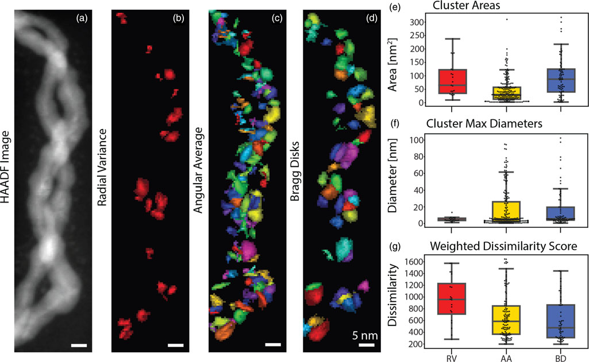

---
title: |
  Mathematical Foundations of AI & ML<br>Unit 2: Linear Algebra for Machine Learning
bibliography: ref.bib
author:
  - name: Prof. Dr. Philipp Pelz
    affiliation:
      - FAU Erlangen-Nürnberg
execute:
  eval: true
  echo: false
format:
  revealjs:
    chalkboard: true
    width: 1920
    height: 1080
    template-partials:
      - title-slide.html
    css: custom.css
    theme: custom.scss
    slide-number: c/t
    logo: "eclipse_logo_small.png"
    background-transition: fade
    footer: "© Philipp Pelz - Mathematical Foundations of AI & ML"
    menu:
      side: left
      loadIcons: true
    navigationMode: default   # Enable arrow navigation/progression
    controls: true           # Show next/prev arrows for slides
---


## Title: Linear Algebra for ML

- **The Geometry of Intelligence**: In this unit, we move from scalar arithmetic to the geometric world of vectors and matrices.
- **Dependency Role**: Linear Algebra (LA) is the bedrock for PCA, SVD, Linear Regression, and Neural Networks.
- **Goal**: Develop an intuitive understanding of high-dimensional spaces and transformations.

## Unit 2 learning outcomes

By the end of this lecture, you will be able to:

- Interpret matrices as **linear operators** that transform space.
- Derive **PCA** as a variance-maximization problem using eigendecomposition.
- Apply **SVD** for low-rank approximation and denoising of materials data.
- Assess **conditioning** and numerical stability in linear systems.

## Why LA still matters in modern ML

- **High-Dimensional Manifolds**: Data doesn't just "sit" in a table; it lives on non-linear manifolds in high-dim space [@sandfeld_materials_data_science].
- **Parallelism**: Modern GPUs are optimized for matrix-vector products ($\mathbf{y} = \mathbf{W}\mathbf{x} + \mathbf{b}$).
- **Compactness**: A million parameters in a Deep Net are just a series of matrix operations.

## Notation contract for the semester

- **Scalars**: $a, b, c$ (italic lowercase).
- **Vectors**: $\mathbf{x}, \mathbf{y}, \mathbf{w}$ (bold lowercase). Assumed to be **column vectors**.
- **Matrices**: $\mathbf{A}, \mathbf{X}, \mathbf{W}$ (bold uppercase).
- **Transposition**: $\mathbf{x}^T$ turns a column into a row.
- **Inner Product**: $\langle \mathbf{x}, \mathbf{y} \rangle = \mathbf{x}^T \mathbf{y} = \sum x_i y_i$.

### Scalars, vectors, matrices refresher

- **Vector**: A point in $D$-dimensional space $\mathbb{R}^D$.
- **Matrix**: A collection of $N$ vectors of dimension $D$, written as an $N \times D$ data matrix $\mathbf{X}$.
- **Tensors**: Generalization to more than 2 dimensions (e.g., RGB images are $H \times W \times 3$).

## Vector spaces and subspaces

- **Vector Space**: A set of vectors that is closed under addition and scalar multiplication.
- **Subspace**: A "flat" region within a larger space (e.g., a plane in 3D).
- **In ML**: We often look for a low-dimensional **subspace** that contains most of the data's information.

## Basis and change of basis

::: {.columns}
::: {.column width="60%"}
- **Basis**: A set of linearly independent vectors that **span** the space.
- **Standard Basis**: $\mathbf{e}_1 = [1, 0, \dots]^T, \mathbf{e}_2 = [0, 1, \dots]^T$.
- **Change of Basis**: Re-representing a vector in a new coordinate system.
:::

::: {.column width="40%"}
::: {.callout-note title="Geometric Plot" .fragment}
{width=80%}
:::
:::
:::

## Linear combinations and span

- **Linear Combination**: $\mathbf{v} = \sum \alpha_i \mathbf{b}_i$.
- **Span**: The set of all possible linear combinations of a set of vectors.
- **Expressivity**: A model's ability to represent different data depends on the span of its basis functions.

## Linear maps as operators

::: {.columns}
::: {.column width="40%"}
- A matrix $\mathbf{A}$ defines a mapping $f(\mathbf{x}) = \mathbf{Ax}$.
- **Geometric View**: Matrices can rotate, scale, and shear space.
- **Composition**: $f(g(\mathbf{x})) = \mathbf{A}(\mathbf{Bx}) = (\mathbf{AB})\mathbf{x}$.

```{ojs}
//| panel: input
viewof a11 = Inputs.range([-2, 2], {value: 1, step: 0.1, label: "A11"})
viewof a12 = Inputs.range([-2, 2], {value: 0, step: 0.1, label: "A12"})
viewof a21 = Inputs.range([-2, 2], {value: 0, step: 0.1, label: "A21"})
viewof a22 = Inputs.range([-2, 2], {value: 1, step: 0.1, label: "A22"})
```
:::

::: {.column width="60%"}
```{ojs}
//| fig-align: center
Plot.plot({
  grid: true,
  x: {domain: [-3, 3]},
  y: {domain: [-3, 3]},
  aspectRatio: 1,
  marks: [
    Plot.ruleX([0]),
    Plot.ruleY([0]),
    Plot.line(origSq, {x: "x", y: "y", stroke: "lightgray", strokeWidth: 2}),
    Plot.line(transSq, {x: "x", y: "y", stroke: "dodgerblue", strokeWidth: 3})
  ]
})
```
```{ojs}
//| output: false
origSq = [{x: 0, y: 0}, {x: 1, y: 0}, {x: 1, y: 1}, {x: 0, y: 1}, {x: 0, y: 0}]
transSq = origSq.map(p => ({
  x: a11 * p.x + a12 * p.y,
  y: a21 * p.x + a22 * p.y
}))
```
:::
:::

## Column space and row space

- **Column Space** $C(\mathbf{A})$: The span of the columns. All possible outputs $\mathbf{y} = \mathbf{Ax}$.
- **Row Space**: The span of the rows.
- **In ML**: If your target $\mathbf{y}$ is not in $C(\mathbf{X})$, your linear model will have non-zero residual error.

## Nullspace and identifiability

::: {.columns}
::: {.column width="30%"}
- **Nullspace** $N(\mathbf{A})$: All $\mathbf{x}$ such that $\mathbf{Ax} = \mathbf{0}$.
- **Identifiability**: If $N(\mathbf{X})$ is non-trivial, multiple parameter sets produce identical predictions.

**Matrix $\mathbf{A}$**:
$\begin{bmatrix} 1 & 2 \\ 2 & d \end{bmatrix}$

```{ojs}
//| panel: input
viewof dVal = Inputs.range([0, 6], {value: 4, step: 0.1, label: "d"})
```
*When d=4, the matrix is Singular. The output space squashes to a 1D line!*
:::

::: {.column width="70%"}
```{ojs}
//| fig-align: center
Plot.plot({
  grid: true,
  x: {domain: [-15, 15]},
  y: {domain: [-15, 15]},
  aspectRatio: 1,
  marks: [
    Plot.ruleX([0]),
    Plot.ruleY([0]),
    Plot.dot(mappedNull, {x: "x", y: "y", fill: d => d.is_null ? "red" : "dodgerblue", r: d => d.is_null ? 5 : 3, title: "Output Space"})
  ]
})
```

```{ojs}
//| output: false
ptsGridNull = {
  let res = [];
  for(let i=-3; i<=3; i+=0.5) {
    for(let j=-3; j<=3; j+=0.5) {
      res.push({x0: i, y0: j});
    }
  }
  return res;
}
mappedNull = ptsGridNull.map(p => ({
  x: 1 * p.x0 + 2 * p.y0,
  y: 2 * p.x0 + dVal * p.y0,
  is_null: Math.abs(1 * p.x0 + 2 * p.y0) < 0.1 && Math.abs(2 * p.x0 + dVal * p.y0) < 0.1
}))
```
:::
:::

::: {.notes}
- **The Connection:** A matrix is singular *because* it has a non-trivial nullspace. 
- **Geometrically:** A singular matrix squashes space into a lower dimension. The dimension that gets squashed (the points sent to the origin) is exactly the nullspace! Here, the entire line gets crushed to `(0,0)` when $d=4$.
- **Why it breaks identifiability in ML:** If our data matrix $\mathbf{A}$ is singular, we have a nullspace vector $\mathbf{n}$. If a model $\mathbf{x}$ predicts perfectly ($\mathbf{Ax} = \mathbf{y}$), then $\mathbf{x} + \mathbf{n}$ also predicts perfectly ($\mathbf{A}(\mathbf{x} + \mathbf{n}) = \mathbf{Ax} + \mathbf{An} = \mathbf{y} + \mathbf{0} = \mathbf{y}$). We can't uniquely identify the "true" parameters because there are infinite solutions that look identical from the outside.
:::

## Rank and model capacity intuition

- **Rank**: The number of linearly independent columns (or rows).
- **Full Rank**: Maximum possible rank for a matrix's dimensions.
- **Capacity**: Rank measures the "true" dimensionality of the transformation. Low-rank matrices compress information.

### Inner products and similarity

- $\langle \mathbf{x}, \mathbf{y} \rangle = \|\mathbf{x}\| \|\mathbf{y}\| \cos(\theta)$.
- **Cosine Similarity**: Measures the alignment of two vectors, independent of their magnitude.
- **Orthogonality**: $\langle \mathbf{x}, \mathbf{y} \rangle = 0$. Vectors are at 90 degrees.

### Norms (L1/L2/Frobenius)

- **L2 Norm**: $\|\mathbf{x}\|_2 = \sqrt{\sum x_i^2}$ (Euclidean distance).
- **L1 Norm**: $\|\mathbf{x}\|_1 = \sum |x_i|$ (Manhattan distance, promotes sparsity).
- **Frobenius Norm**: $\|\mathbf{A}\|_F = \sqrt{\sum \sum A_{ij}^2}$ (Size of a matrix).

## Distance metrics and data geometry

- **Euclidean distance** is the default, but it can be misleading in high dimensions (**Curse of Dimensionality**).
- **Mahalanobis Distance**: Scales distances by the inverse covariance, accounting for correlations and feature variances [@murphy2012machine].

::: {.notes}
- **Why Euclidean fails in high dimensions:** As $D$ grows, the ratio between the nearest and farthest neighbor of any query point converges to 1. Everything becomes "equidistant", so nearest-neighbor based methods (kNN, clustering) lose their discriminative power. This is one face of the curse of dimensionality.
- **Intuition for Mahalanobis:** Think of it as "Euclidean distance after whitening." We first de-correlate and rescale the features using $\mathbf{S}^{-1}$, then measure Euclidean distance. Formula: $d_M(\mathbf{x}, \mathbf{y}) = \sqrt{(\mathbf{x}-\mathbf{y})^T \mathbf{S}^{-1} (\mathbf{x}-\mathbf{y})}$.
- **Geometric picture:** Level sets of Euclidean distance are spheres; level sets of Mahalanobis distance are ellipsoids aligned with the data's covariance structure. A point 3 "Mahalanobis units" away is 3 standard deviations out along the local data geometry.
- **Materials science example:** When comparing alloy compositions, two samples differing by 0.01 in Ni content but sharing identical Cr content are not really "equally different" as two samples differing by 0.01 in both - Mahalanobis accounts for this by looking at how compositional variables co-vary in your dataset.
- **Practical caveat:** $\mathbf{S}^{-1}$ can be ill-conditioned or singular with few samples and many features. Regularize ($\mathbf{S} + \lambda \mathbf{I}$) or use a shrinkage estimator.
- **Connection forward:** Mahalanobis distance is the Euclidean distance in the PCA-whitened coordinate system. This motivates why we study whitening later in the unit.
:::

### Orthogonality and orthonormal bases

- **Orthonormal Basis**: $\langle \mathbf{u}_i, \mathbf{u}_j \rangle = \delta_{ij}$ (All vectors unit length and mutually perpendicular).
- **Numerical Advantage**: Calculating coefficients is just an inner product: $\alpha_i = \langle \mathbf{v}, \mathbf{u}_i \rangle$.
- **Stability**: Orthonormal matrices $\mathbf{Q}$ preserve norms: $\|\mathbf{Qx}\| = \|\mathbf{x}\|$.

::: {.notes}
- **Why we love orthonormal bases:** In a general basis, finding coefficients $\alpha_i$ requires solving a linear system $\mathbf{B} \boldsymbol{\alpha} = \mathbf{v}$. In an orthonormal basis, $\mathbf{B}^T\mathbf{B} = \mathbf{I}$, so the "inverse" is just the transpose, and each coefficient decouples into a single inner product. No system to solve, no numerical headaches.
- **Norm preservation is huge:** $\|\mathbf{Qx}\| = \|\mathbf{x}\|$ means applying $\mathbf{Q}$ is a rotation (or reflection) - it doesn't stretch or squash space. This is why algorithms built on orthonormal transforms (QR, SVD, orthogonal iterations) are numerically stable: errors don't get amplified.
- **Contrast with ill-conditioned bases:** If basis vectors are nearly parallel, small changes in $\mathbf{v}$ cause huge swings in coefficients - the Gram matrix has a tiny determinant. Orthonormality is the opposite extreme: maximum robustness.
- **Previews of what's coming:**
  - **PCA:** The principal components form an orthonormal basis of the data's covariance eigenvectors.
  - **SVD:** Both $\mathbf{U}$ and $\mathbf{V}$ are orthonormal - that's the whole source of SVD's numerical reliability.
  - **QR decomposition:** Explicitly constructs an orthonormal basis for the column space of $\mathbf{X}$ via Gram-Schmidt.
- **The Kronecker delta $\delta_{ij}$:** Reminder - this is 1 when $i=j$, 0 otherwise. Compactly encodes both normalization (length 1) and orthogonality (perpendicular) in one equation.
- **Worked mini-example on the board (optional):** Take $\mathbf{u}_1 = (1,0)^T$, $\mathbf{u}_2 = (0,1)^T$ and decompose $\mathbf{v} = (3, 4)^T$. Then rotate the basis by $45°$ and redo the calculation - the coefficients change but the vector doesn't.
:::

## Projection onto subspaces

::: {.columns}
::: {.column width="50%"}
### Mathematical View
- **Formula**: For a column space spanned by $\mathbf{X}$:
  $$\hat{\mathbf{y}} = \mathbf{X}(\mathbf{X}^T\mathbf{X})^{-1}\mathbf{X}^T\mathbf{y}$$
- **Orthogonality**: The error $\mathbf{e} = \mathbf{y} - \hat{\mathbf{y}}$ is perpendicular to the subspace.

```{ojs}
//| panel: input
viewof y1 = Inputs.range([-5, 5], {value: 2, step: 0.1, label: "y₁"})
viewof y2 = Inputs.range([-5, 5], {value: 4, step: 0.1, label: "y₂"})
viewof thetaProj = Inputs.range([0, Math.PI], {value: 0.5, step: 0.05, label: "Subspace Angle"})
```
*Move $\mathbf{y}$ (blue) and watch its projection $\hat{\mathbf{y}}$ (green) drop orthogonally (red dashed) onto the subspace (gray).*
:::

::: {.column width="50%"}
```{ojs}
//| fig-align: center
Plot.plot({
  grid: true, x: {domain: [-5, 5]}, y: {domain: [-5, 5]}, aspectRatio: 1,
  marks: [
    Plot.ruleX([0]), Plot.ruleY([0]),
    Plot.line([[-6*Math.cos(thetaProj), -6*Math.sin(thetaProj)], [6*Math.cos(thetaProj), 6*Math.sin(thetaProj)]], {stroke: "lightgray", strokeWidth: 4}),
    Plot.arrow([{x1: 0, y1: 0, x2: yProj.x, y2: yProj.y}], {x1: "x1", y1: "y1", x2: "x2", y2: "y2", stroke: "green", strokeWidth: 4}),
    Plot.arrow([{x1: 0, y1: 0, x2: y1, y2: y2}], {x1: "x1", y1: "y1", x2: "x2", y2: "y2", stroke: "blue", strokeWidth: 2}),
    Plot.line([[yProj.x, yProj.y], [y1, y2]], {stroke: "red", strokeDasharray: "4", strokeWidth: 2}),
    Plot.text([{x: y1, y: y2+0.5, text: "y"}], {x: "x", y: "y", text: "text", fill: "blue"}),
    Plot.text([{x: yProj.x, y: yProj.y-0.5, text: "y_hat"}], {x: "x", y: "y", text: "text", fill: "green"})
  ]
})
```
```{ojs}
//| output: false
yProj = {
  const c = Math.cos(thetaProj);
  const s = Math.sin(thetaProj);
  const dot = y1*c + y2*s;
  return {x: dot*c, y: dot*s};
}
```
:::
:::

## Projection matrix properties

- **$\mathbf{P} = \mathbf{X}(\mathbf{X}^T\mathbf{X})^{-1}\mathbf{X}^T$**
- **Idempotence**: $\mathbf{P}^2 = \mathbf{P}$. Projecting twice doesn't change anything.
- **Symmetry**: $\mathbf{P}^T = \mathbf{P}$.
- **Interpretation**: $\mathbf{P}$ acts as a "filter" that keeps only the component of $\mathbf{y}$ aligned with $\mathbf{X}$.

::: {.notes}
- **Why idempotence matters:** Once you've projected $\mathbf{y}$ onto the column space, it already lives there. Projecting again is a no-op. Algebraically: $\mathbf{P}^2 = \mathbf{X}(\mathbf{X}^T\mathbf{X})^{-1}\underbrace{\mathbf{X}^T\mathbf{X}(\mathbf{X}^T\mathbf{X})^{-1}}_{=\mathbf{I}}\mathbf{X}^T = \mathbf{P}$. Any matrix satisfying $\mathbf{P}^2 = \mathbf{P}$ is a projector - the rest is just whether it's orthogonal or oblique.
- **Symmetry is what makes it *orthogonal*:** A general projector only needs idempotence. Adding $\mathbf{P}^T = \mathbf{P}$ is what guarantees the residual $\mathbf{y} - \mathbf{P}\mathbf{y}$ is *perpendicular* to the subspace (minimum distance, not just some projection).
- **Eigenvalues of a projection matrix:** Only 0 and 1. Directions in the column space get eigenvalue 1 (preserved); directions in the orthogonal complement get 0 (killed). So $\text{rank}(\mathbf{P}) = \text{tr}(\mathbf{P}) = $ dimension of the subspace.
- **Complementary projector:** $\mathbf{I} - \mathbf{P}$ is also a projection - onto the orthogonal complement. Together they split any vector: $\mathbf{y} = \mathbf{P}\mathbf{y} + (\mathbf{I} - \mathbf{P})\mathbf{y}$. This is the "signal + residual" decomposition.
- **Numerical warning:** Never *form* $\mathbf{P}$ explicitly for large $\mathbf{X}$ - it's $N \times N$ and dense. Use QR or SVD to apply the projection implicitly.
- **Materials tie-in:** In spectral unmixing, $\mathbf{P}$ projects a measured spectrum onto the span of known pure-phase references. The residual $(\mathbf{I}-\mathbf{P})\mathbf{y}$ is the unexplained part - a red flag for missing phases or instrumentation artifacts.
:::

## Least squares as projection

- **Linear Regression**: $\mathbf{y} \approx \mathbf{Xw}$.
- We want $\mathbf{Xw}$ to be the projection of $\mathbf{y}$ onto the column space of $\mathbf{X}$.
- This geometric view leads directly to the **Normal Equations**.

::: {.notes}
- **The key reframing:** Least squares is not really about "minimizing a sum of squared errors" in some abstract calculus sense - it's a geometry problem. We have a target $\mathbf{y}$ living in $\mathbb{R}^N$, and a subspace $C(\mathbf{X})$ of things we can actually build from our features. The closest point in that subspace is the orthogonal projection. Full stop.
- **Why "closest" = "orthogonal":** This is the Pythagorean argument. For any $\mathbf{Xw}$ in the column space, $\|\mathbf{y} - \mathbf{Xw}\|^2 = \|\mathbf{y} - \hat{\mathbf{y}}\|^2 + \|\hat{\mathbf{y}} - \mathbf{Xw}\|^2$ where $\hat{\mathbf{y}}$ is the orthogonal projection. The second term is minimized (zero) when $\mathbf{Xw} = \hat{\mathbf{y}}$.
- **What goes wrong if $\mathbf{y} \in C(\mathbf{X})$ already:** Then there's no residual and the "regression" is actually an exact linear system. This is the overdetermined-vs-exactly-determined distinction.
- **Teaching tip:** Draw the classic "$\mathbf{y}$ arrow in 3D, plane = column space, $\hat{\mathbf{y}}$ dropped perpendicular" picture. Students often remember this figure for years after forgetting the algebra.
- **Bridge forward:** This geometric view gives us the normal equations for free on the next slide - no calculus required, just "the residual is perpendicular to the feature span."
:::

### Normal equations derivation

::: {.fragment}
1. **Residual error**: $\mathbf{r} = \mathbf{y} - \mathbf{Xw}$
:::

::: {.fragment}
2. **Orthogonality**: $\mathbf{X}^T \mathbf{r} = \mathbf{0}$ (Error must be orthogonal to feature span)
:::

::: {.fragment}
3. **Substitute**: $\mathbf{X}^T (\mathbf{y} - \mathbf{Xw}) = \mathbf{0}$
:::

::: {.fragment}
4. **Expand & Rearrange**: $\mathbf{X}^T \mathbf{Xw} = \mathbf{X}^T \mathbf{y}$
:::

::: {.fragment}
5. **Solve**: $\hat{\mathbf{w}} = (\mathbf{X}^T\mathbf{X})^{-1}\mathbf{X}^T\mathbf{y}$ [@bishop2006pattern]
:::

::: {.notes}
- **Walk through the fragments one-by-one in class** - this derivation is *the* foundational calculation for the rest of the course (Ridge, Gaussian Processes, GLMs all start here).
- **Step 2 is where the geometry pays off:** "Error orthogonal to feature span" means orthogonal to every column of $\mathbf{X}$. Stacking those $D$ inner products into one matrix equation gives $\mathbf{X}^T\mathbf{r} = \mathbf{0}$. No derivatives needed.
- **Alternative derivation (briefly mention):** You can also get this by setting $\nabla_{\mathbf{w}} \|\mathbf{y} - \mathbf{Xw}\|^2 = -2\mathbf{X}^T(\mathbf{y} - \mathbf{Xw}) = \mathbf{0}$. Same answer - calculus and geometry agree, as they should.
- **Why "normal" equations:** "Normal" here means *perpendicular*, not "typical" or "Gaussian" - an unfortunate naming collision. It refers to the orthogonality condition in step 2.
- **The matrix $\mathbf{X}^T\mathbf{X}$:**
  - Always symmetric and positive *semi*-definite.
  - Invertible iff $\mathbf{X}$ has full column rank (no redundant features).
  - This is *exactly* the covariance-like matrix that appears in PCA - foreshadow the deep connection.
- **Big red flag:** Do NOT actually compute $(\mathbf{X}^T\mathbf{X})^{-1}$ on a computer. Forming $\mathbf{X}^T\mathbf{X}$ squares the condition number (we'll see this next). Use QR or SVD in practice; the normal-equation form is pedagogical, not numerical.
- **Maximum likelihood connection:** Under Gaussian noise $\boldsymbol{\epsilon} \sim \mathcal{N}(\mathbf{0}, \sigma^2 \mathbf{I})$, minimizing squared error *is* maximum likelihood estimation. This is why least squares is so ubiquitous - it has both a geometric and a probabilistic justification.
:::

## Condition number intuition

- **Condition Number** $\kappa(\mathbf{A})$: Measures how much the output $\mathbf{y}$ can change for a small change in input $\mathbf{x}$.
- Ratio of largest to smallest singular values: $\kappa = \sigma_{max} / \sigma_{min}$.
- **Well-conditioned**: $\kappa \approx 1$. **Ill-conditioned**: $\kappa \gg 1$.

::: {.notes}
- **The fundamental bound:** For $\mathbf{Ax} = \mathbf{b}$, a relative perturbation $\delta \mathbf{b}$ in the right-hand side produces a relative error in $\mathbf{x}$ bounded by $\kappa(\mathbf{A})$ times the input error: $\frac{\|\delta\mathbf{x}\|}{\|\mathbf{x}\|} \le \kappa(\mathbf{A}) \frac{\|\delta\mathbf{b}\|}{\|\mathbf{b}\|}$. $\kappa$ is the worst-case amplification of noise.
- **Digits of precision lost:** A useful rule of thumb - if $\kappa \approx 10^k$, you lose about $k$ significant digits when solving the system. Double precision gives you 16 digits; $\kappa = 10^{10}$ leaves you with only 6 reliable digits.
- **Why the SVD definition:** $\mathbf{A}$ stretches space maximally by $\sigma_{max}$ in one direction and minimally by $\sigma_{min}$ in another. Dividing these gives the *shape* of the ellipsoid image of a unit sphere - a thin cigar means ill-conditioned.
- **Singular matrix = $\kappa = \infty$:** When $\sigma_{min} = 0$, the matrix is not invertible, and infinitesimal noise can produce arbitrary output changes. $\kappa$ continuously measures "how close to singular" you are.
- **For least squares specifically:** The relevant matrix is $\mathbf{X}^T\mathbf{X}$, whose condition number is $\kappa(\mathbf{X})^2$ - this is why forming the normal equations is a numerical sin for ill-conditioned problems.
- **Tangible example:** $\mathbf{A} = \begin{bmatrix} 1 & 1 \\ 1 & 1.0001 \end{bmatrix}$. Nearly singular, $\kappa \approx 4 \times 10^4$. Tiny changes in $\mathbf{b}$ swing the solution wildly - demo this live in numpy if time permits.
:::

## Ill-conditioning in practice

- **Causes**: Multicollinearity (features are nearly linear combinations of each other).
- **Effect**: Small noise in $\mathbf{y}$ leads to massive, unstable swings in $\hat{\mathbf{w}}$.
- **Visual**: The loss landscape becomes a very narrow, elongated valley.

::: {.notes}
- **Concrete multicollinearity example:** Measuring both temperature in Celsius *and* in Fahrenheit as separate features - they are exactly linearly dependent, so $\mathbf{X}^T\mathbf{X}$ is singular. More realistically, redundant sensor channels, tightly correlated compositional variables (Fe and Cr in a steel), or including both "mass" and "volume" when density is roughly constant.
- **The narrow valley picture:** The loss surface $\|\mathbf{y} - \mathbf{Xw}\|^2$ is quadratic, with Hessian $2\mathbf{X}^T\mathbf{X}$. Its eigenvalues are the squared singular values of $\mathbf{X}$. When one is tiny, the valley is nearly flat along that direction - the optimizer can slide enormous distances for negligible loss reduction. That's why $\hat{\mathbf{w}}$ becomes noise-dominated along ill-conditioned directions.
- **How you notice it in practice:**
  - Coefficients flip sign when you add or remove a single data point.
  - Huge standard errors on regression coefficients (even when $R^2$ is high).
  - The fit quality is fine, but the *parameters themselves* are meaningless.
- **Three standard remedies** (previewed on upcoming slides):
  1. **Drop features** or use PCA to project onto well-conditioned directions.
  2. **Regularize** (Ridge adds $\lambda \mathbf{I}$ to $\mathbf{X}^T\mathbf{X}$, lifting all eigenvalues by $\lambda$).
  3. **Use a pseudo-inverse** (SVD with truncated small singular values).
- **Materials-science punchline:** Processing data often has strongly correlated controls (e.g., temperature zones in a furnace, alloying elements in fixed ratios). Fitting linear models to this kind of data without regularization gives physically nonsensical coefficients. This is not a bug in your code - it's the data geometry fighting back.
:::

## Numerical stability and scaling

- **Standardization**: Subtracting mean and dividing by std-dev helps equalize eigenvalues.
- **Numerical Trick**: Never invert $(\mathbf{X}^T\mathbf{X})$ directly. Use **QR decomposition** or **SVD** for more stable solutions.

## Eigenvalues/eigenvectors recap

::: {.columns}
::: {.column width="40%"}
- $\mathbf{Ax} = \lambda \mathbf{x}$.
- **Intuition**: Eigenvectors are the "characteristic directions" where the transformation is just a simple scaling by $\lambda$.
- Observe how a symmetric matrix transforms a unit circle (gray) into an ellipse (blue). The principal axes (red) are the scaled eigenvectors!

```{ojs}
//| panel: input
viewof s11 = Inputs.range([-3, 3], {value: 1.5, step: 0.1, label: "S11"})
viewof s12 = Inputs.range([-2, 2], {value: 0.8, step: 0.1, label: "S12 = S21"})
viewof s22 = Inputs.range([-3, 3], {value: 1.0, step: 0.1, label: "S22"})
```
:::

::: {.column width="60%"}
```{ojs}
//| fig-align: center
Plot.plot({
  grid: true, x: {domain: [-4, 4]}, y: {domain: [-4, 4]}, aspectRatio: 1,
  marks: [
    Plot.ruleX([0]), Plot.ruleY([0]),
    Plot.line(circlePts, {x: "x", y: "y", stroke: "gray", strokeDasharray: "4"}),
    Plot.line(ellipsePts, {x: "x", y: "y", stroke: "dodgerblue", strokeWidth: 2}),
    Plot.arrow(eigenVectors, {x1: 0, y1: 0, x2: "x", y2: "y", stroke: "red", strokeWidth: 3})
  ]
})
```

```{ojs}
//| output: false
circlePts = Array.from({length: 100}, (_, i) => {
  let t = i * 2 * Math.PI / 99; return {x: Math.cos(t), y: Math.sin(t)};
});
ellipsePts = circlePts.map(p => ({
  x: s11*p.x + s12*p.y, y: s12*p.x + s22*p.y
}));
eigenVectors = {
  let T = s11 + s22; let D = s11*s22 - s12*s12;
  let L1 = T/2 + Math.sqrt(Math.max(0, T*T/4 - D));
  let L2 = T/2 - Math.sqrt(Math.max(0, T*T/4 - D));
  if (Math.abs(s12) < 0.001) return [{x: L1, y: 0}, {x: 0, y: L2}];
  let v1x = L1 - s22, v1y = s12;
  let n1 = Math.sqrt(v1x*v1x + v1y*v1y) || 1;
  let v2x = L2 - s22, v2y = s12;
  let n2 = Math.sqrt(v2x*v2x + v2y*v2y) || 1;
  return [
    {x: (v1x/n1)*L1, y: (v1y/n1)*L1},
    {x: (v2x/n2)*L2, y: (v2y/n2)*L2}
  ];
}
```
:::
:::

## Spectral decomposition intuition

- For a symmetric matrix $\mathbf{S}$: $\mathbf{S} = \mathbf{U \Lambda U}^T$.
- **Geometric View**: A symmetric matrix is just a rotation to the eigenbasis, a scaling along those axes, and a rotation back.
- **Decomposition**: $\mathbf{S} = \sum \lambda_i \mathbf{u}_i \mathbf{u}_i^T$.

## Positive semidefinite matrices

- $\mathbf{x}^T \mathbf{Ax} \ge 0$ for all $\mathbf{x}$.
- **Eigenvalues**: All $\lambda_i \ge 0$.
- **Covariance Matrices** are always PSD. This ensures that "variance" can never be negative.

## Covariance matrix geometry

::: {.columns}
::: {.column width="50%"}
- **Data Matrix** $\mathbf{X}$ (centered): $\mathbf{S} = \frac{1}{N-1}\mathbf{X}^T\mathbf{X}$.
- The surface $\mathbf{x}^T \mathbf{S}^{-1} \mathbf{x} = 1$ defines an **Error Ellipsoid**.
- The axes are the eigenvectors of $\mathbf{S}$, with lengths proportional to $\sqrt{\lambda_i}$.

```{ojs}
//| panel: input
viewof varX = Inputs.range([0.1, 5], {value: 3, step: 0.1, label: "Var(X)"})
viewof varY = Inputs.range([0.1, 5], {value: 1, step: 0.1, label: "Var(Y)"})
viewof covXY = Inputs.range([-4, 4], {value: 1.2, step: 0.1, label: "Cov(X,Y)"})
```
:::

::: {.column width="50%"}
```{ojs}
//| fig-align: center
Plot.plot({
  grid: true, x: {domain: [-6, 6]}, y: {domain: [-6, 6]}, aspectRatio: 1,
  marks: [
    Plot.dot(randomData, {x: "x", y: "y", r: 2, fill: "gray", fillOpacity: 0.5}),
    Plot.line(covarianceEllipse, {x: "x", y: "y", stroke: "red", strokeWidth: 3})
  ]
})
```

```{ojs}
//| output: false
validCov = Math.max(-Math.sqrt(varX*varY)*0.99, Math.min(Math.sqrt(varX*varY)*0.99, covXY));
randomData = {
  let pts = [];
  let L11 = Math.sqrt(varX);
  let L21 = validCov / L11;
  let L22 = Math.sqrt(Math.max(0, varY - L21*L21));
  for(let i=0; i<400; i++) {
    let u1 = Math.random(), u2 = Math.random();
    let z0 = Math.sqrt(-2.0 * Math.log(u1)) * Math.cos(2.0 * Math.PI * u2);
    let z1 = Math.sqrt(-2.0 * Math.log(u1)) * Math.sin(2.0 * Math.PI * u2);
    pts.push({x: L11*z0, y: L21*z0 + L22*z1});
  }
  return pts;
}
covarianceEllipse = {
  let pts = [];
  let T = varX + varY; let D = varX*varY - validCov*validCov;
  let L1 = T/2 + Math.sqrt(Math.max(0, T*T/4 - D));
  let L2 = T/2 - Math.sqrt(Math.max(0, T*T/4 - D));
  let v1x = L1 - varY, v1y = validCov;
  let n1 = Math.sqrt(v1x*v1x + v1y*v1y) || 1; v1x/=n1; v1y/=n1;
  let v2x = L2 - varY, v2y = validCov;
  let n2 = Math.sqrt(v2x*v2x + v2y*v2y) || 1; v2x/=n2; v2y/=n2;
  
  for(let i=0; i<=100; i++) {
    let t = i * 2 * Math.PI / 100;
    let c = Math.cos(t), s = Math.sin(t);
    // Multiply by 2.0 to show the 2-sigma ellipse
    pts.push({
      x: 2.0 * (Math.sqrt(L1)*v1x*c + Math.sqrt(L2)*v2x*s),
      y: 2.0 * (Math.sqrt(L1)*v1y*c + Math.sqrt(L2)*v2y*s)
    });
  }
  return pts;
}
```
:::
:::

## PCA as variance maximization

::: {.columns}
::: {.column width="40%"}
- **PCA** seeks directions $\mathbf{u}$ that maximize the variance of the projected data: $J = \mathbf{u}^T \mathbf{Su}$.
- Subject to $\|\mathbf{u}\|=1$, stationary point is $\mathbf{Su} = \lambda \mathbf{u}$.
- **The best direction is the eigenvector with the largest eigenvalue.**

```{ojs}
//| panel: input
viewof pcaTheta = Inputs.range([0, Math.PI], {value: 0, step: 0.05, label: "Projection Angle"})
```

**Projected Variance:** ${pcaVar.toFixed(3)}

*Rotate the line (gray). Watch the variance of the projected points (red) change! It peaks when aligned with the principal component.*
:::

::: {.column width="60%"}
```{ojs}
//| fig-align: center
Plot.plot({
  grid: true, x: {domain: [-6, 6]}, y: {domain: [-6, 6]}, aspectRatio: 1,
  marks: [
    Plot.ruleX([0]), Plot.ruleY([0]),
    Plot.link(pcaLinkData, {x1: "x1", y1: "y1", x2: "x2", y2: "y2", stroke: "pink", strokeWidth: 1}),
    Plot.dot(pcaData, {x: "x", y: "y", fill: "lightgray", r: 3}),
    Plot.line([[-7*Math.cos(pcaTheta), -7*Math.sin(pcaTheta)], [7*Math.cos(pcaTheta), 7*Math.sin(pcaTheta)]], {stroke: "gray", strokeWidth: 2}),
    Plot.dot(pcaProjData, {x: "x", y: "y", fill: "red", r: 4})
  ]
})
```

```{ojs}
//| output: false
pcaData = {
  let pts = [];
  let ang = Math.PI / 6; 
  let s_major = 3.0, s_minor = 0.5;
  for (let i = 0; i < 150; i++) {
    let u1 = Math.max(0.0001, (Math.sin(i * 123.456) + 1)/2); 
    let u2 = Math.max(0.0001, (Math.cos(i * 789.123) + 1)/2);
    let z0 = Math.sqrt(-2.0 * Math.log(u1)) * Math.cos(2.0 * Math.PI * u2);
    let z1 = Math.sqrt(-2.0 * Math.log(u1)) * Math.sin(2.0 * Math.PI * u2);
    let x_raw = s_major * z0; let y_raw = s_minor * z1;
    pts.push({ x: x_raw * Math.cos(ang) - y_raw * Math.sin(ang), y: x_raw * Math.sin(ang) + y_raw * Math.cos(ang) });
  }
  return pts;
}
pcaProjData = pcaData.map(p => {
  let c = Math.cos(pcaTheta), s = Math.sin(pcaTheta);
  let proj = p.x * c + p.y * s;
  return {x: proj * c, y: proj * s, proj_val: proj};
})
pcaLinkData = pcaData.map((p, i) => ({
  x1: p.x, y1: p.y, x2: pcaProjData[i].x, y2: pcaProjData[i].y
}))
pcaVar = d3.variance(pcaProjData, d => d.proj_val)
```
:::
:::

## SVD overview

- Any $N \times D$ matrix $\mathbf{X}$ can be decomposed as: $\mathbf{X} = \mathbf{U \Sigma V}^T$.

```{mermaid}
%%| echo: false
%%| fig-align: center
%%{init: {'theme': 'dark', 'themeVariables': { 'darkMode': true, 'background': 'transparent' }}}%%
graph LR
    X["X"] --> Eq["="]
    Eq["="] --> U["U"]
    U["U"] --> Sigma["Σ"]
    Sigma["Σ"] --> VT["V^T"]
    
    subgraph Dimensions
    X---D1["N x D"]
    U---D2["N x N"]
    Sigma---D3["N x D"]
    VT---D4["D x D"]
    end
    
    style Dimensions fill:#1e1e1e,stroke:#555,stroke-width:2px,color:#fff
```

- **$\mathbf{U}$**: Left singular vectors (eigenvectors of $\mathbf{XX}^T$).
- **$\mathbf{V}$**: Right singular vectors (eigenvectors of $\mathbf{X}^T\mathbf{X}$ - the Principal Components).
- **$\mathbf{\Sigma}$**: Diagonal matrix of singular values $\sigma_i = \sqrt{\lambda_i}$.

## SVD and low-rank approximation

- **Compression**: By keeping only the top $k$ singular values, we get the best rank-$k$ approximation $\mathbf{X}_k$.
- **Denoising**: Small singular values often correspond to noise. Throwing them away cleans the signal.
- **Application**: Background subtraction in videos or using dictionary learning (like **k-SVD**) to reconstruct sparse EELS datasets [@monier2020fast].

## Eckart–Young idea (conceptual)

- The matrix $\mathbf{X}_k$ obtained by SVD is the solution to:
  $$ \min_{\mathbf{A}: \text{rank}(\mathbf{A})=k} \|\mathbf{X} - \mathbf{A}\|_F $$
- This means SVD gives the **mathematically optimal** compression in terms of squared error.

## Non-negative Matrix Factorization (NMF)

::: {.columns}
::: {.column width="60%"}
- What if our data is strictly non-negative (e.g., pixel intensities, chemical concentrations, spectra)?
- **NMF**: Factorize $\mathbf{X} \approx \mathbf{WH}$ subject to $\mathbf{W} \ge 0, \mathbf{H} \ge 0$.
- **Interpretation**: $\mathbf{H}$ contains the "basis" vectors (components/parts), and $\mathbf{W}$ contains the activations (mixture weights).
- **Difference from SVD/PCA**: No orthogonality constraint, and **no subtraction allowed**. This forces a **parts-based** representation.
:::

::: {.column width="40%"}
{width=100%}
:::
:::

## NMF vs PCA/SVD conceptually

- **PCA/SVD**: Basis vectors (e.g., Eigenfaces) can have negative values. They form "holistic" representations where adding/subtracting components creates the original.
- **NMF**: Basis vectors look like individual, localized features (a nose, a sharp spectral peak). Models data as a strictly *additive* combination of these parts.
- **Applications**: Topic modeling in NLP, discovering chemical phases in material science, and audio source separation.

## Pseudo-inverse and solvability

- **Moore-Penrose Pseudo-inverse**: $\mathbf{X}^\dagger = \mathbf{V \Sigma}^\dagger \mathbf{U}^T$.
- Works even if $\mathbf{X}^T\mathbf{X}$ is not invertible.
- Provides the **minimum norm** solution to underdetermined systems.

::: {.notes}
- **The unified view of "solving $\mathbf{Xw}=\mathbf{y}$":** The pseudo-inverse $\mathbf{X}^\dagger$ handles *all four* cases in one formula:
  1. Square, invertible $\mathbf{X}$: $\mathbf{X}^\dagger = \mathbf{X}^{-1}$ (ordinary inverse).
  2. Tall, full column rank ($N > D$, overdetermined): $\mathbf{X}^\dagger = (\mathbf{X}^T\mathbf{X})^{-1}\mathbf{X}^T$ — the least-squares solution.
  3. Wide, full row rank ($N < D$, underdetermined): $\mathbf{X}^\dagger = \mathbf{X}^T(\mathbf{X}\mathbf{X}^T)^{-1}$ — the minimum-norm solution.
  4. Rank-deficient: Neither inverse above exists, but $\mathbf{X}^\dagger$ still exists via SVD — this is the pseudo-inverse's superpower.
- **Construction via SVD:** Take $\mathbf{X} = \mathbf{U}\mathbf{\Sigma}\mathbf{V}^T$. Then $\mathbf{\Sigma}^\dagger$ replaces each non-zero singular value $\sigma_i$ with $1/\sigma_i$ and leaves zeros as zeros. Transposing gives $\mathbf{X}^\dagger = \mathbf{V}\mathbf{\Sigma}^\dagger \mathbf{U}^T$. The "pseudo" part is exactly this: we invert only the directions the matrix *can* see.
- **"Minimum norm" = Occam's razor:** Among all $\mathbf{w}$ satisfying $\mathbf{Xw}=\mathbf{y}$, the pseudo-inverse picks the one with smallest $\|\mathbf{w}\|_2$. Geometrically: we project the zero vector onto the affine solution set. This is the default "simplest-explanation" solution.
- **Truncated SVD = regularization for free:** In practice we drop singular values below a threshold $\tau$ to get $\mathbf{X}^\dagger_\tau$. This is equivalent to Tikhonov/Ridge regularization in spirit — small $\sigma_i$ amplify noise catastrophically when you compute $1/\sigma_i$, so we zero them out. Rule of thumb: set $\tau$ to a few times the noise floor.
- **`np.linalg.pinv` vs `np.linalg.lstsq`:** Both are pseudo-inverse based. `lstsq` is usually preferred because it never forms $\mathbf{X}^\dagger$ explicitly (just solves via SVD internally). For $N \gg D$, use `lstsq`; for repeated solves with the same $\mathbf{X}$, precompute `pinv`.
- **Forward preview:** Ridge regression (next section) is the pseudo-inverse with $\sigma_i \to \sigma_i/(\sigma_i^2 + \lambda)$ — a smooth version of truncation instead of a hard cutoff.
:::

## Example: Sparse STEM-EELS reconstruction

::: {.columns}
::: {.column width="45%"}
- **Setup:** In atomic-scale STEM-EELS, acquiring every pixel damages the sample. Solution: randomly sample $\sim 20\%$ of positions and reconstruct the rest.
- **Linear system:** For each energy band, $\mathbf{y}_{\text{obs}} = \mathbf{M}\mathbf{x}$ where $\mathbf{M}$ is a fat $N_{\text{obs}} \times N_{\text{pix}}$ sampling matrix ($N_{\text{obs}} \ll N_{\text{pix}}$). Severely **underdetermined** — infinite $\mathbf{x}$ fit the data.
- **Pseudo-inverse role:** The minimum-norm pseudo-inverse gives a unique answer, but naive use overfits noise. Monier et al. [@monier2020fast] add spatio-spectral regularization ("CLS" = constrained least squares) — still a pseudo-inverse, just on an augmented system.
- **Takeaway:** Same algebra you just saw, applied to a $10^6$-dimensional electron microscopy inverse problem.
:::

::: {.column width="55%"}
{height=800px fig-align="center"}
:::
:::

::: {.notes}
- **Why this example is perfect for the pseudo-inverse slide:** It's the textbook rank-deficient, underdetermined case. The sampling operator $\mathbf{M}$ is roughly $0.2 \cdot N_{\text{pix}} \times N_{\text{pix}}$ — there are five times as many unknowns as equations. $\mathbf{M}^T\mathbf{M}$ has rank at most $0.2 \cdot N_{\text{pix}}$, so it's *never* invertible. You cannot write $(\mathbf{M}^T\mathbf{M})^{-1}\mathbf{M}^T\mathbf{y}$; you *must* use the pseudo-inverse (or equivalent regularized form).
- **Physical motivation (emphasize this):** EELS at atomic resolution uses a high-current electron probe. Dwelling on every pixel *destroys the sample* (beam damage, drift, contamination). Random sparse sampling is a direct dose-reduction strategy. The reconstruction quality is not a math curiosity — it's the difference between getting data and getting nothing.
- **Reading the figure:**
  - Top row: the random sampling mask (white = measured, black = missing). Looks like salt-and-pepper noise; about 20% of pixels are white.
  - "Reference" row: what we wish we had (the fully-sampled ground truth).
  - "NN" (nearest neighbor): a naive interpolation — equivalent to a badly conditioned pseudo-inverse with no regularization. Notice it's smoothed and blocky.
  - "3S" and "CLS": these are explicit least-squares/pseudo-inverse solutions with hand-designed regularizers (Sobolev smoothness, sparsity in a transform). CLS is the paper's contribution.
  - "ITKrMM", "wKSVD", "BPFA": dictionary-learning methods — conceptually a *learned* basis inserted in place of a hand-picked one.
- **Connect back to the whole unit:** Every method in this figure is a linear-algebra recipe you've now seen:
  - NN: nearest-neighbor = trivial projection.
  - 3S/CLS: regularized pseudo-inverse (Tikhonov/Ridge in matrix form).
  - ITKrMM/wKSVD/BPFA: pseudo-inverse in a *learned* orthonormal / redundant basis — i.e., SVD plus a sparsity prior. Exactly the "SVD + truncation" story with the basis itself being data-driven.
- **Great lead-in to Ridge regularization (next slide):** The cleanest way to fix the rank-deficient $\mathbf{M}^T\mathbf{M}$ is to add $\lambda \mathbf{I}$ — which is Ridge. The entire "parts-based reconstruction" literature is a rebranding of matrix-algebra tricks on this slide.
- **Optional live demo:** `np.linalg.pinv` on a $50 \times 200$ random sampling matrix applied to a smooth test image, comparing raw pseudo-inverse vs. truncated-SVD pseudo-inverse. Shows the noise explosion at the smallest singular values.
:::

## Linear regression matrix form

- Model: $\mathbf{y} = \mathbf{Xw} + \boldsymbol{\epsilon}$.
- We assume $\boldsymbol{\epsilon} \sim \mathcal{N}(\mathbf{0}, \sigma^2 \mathbf{I})$.
- Maximum Likelihood leads to the same Normal Equations derived from geometry.

::: {.notes}
- **The two-worlds bridge:** Up to now we've treated regression as pure geometry (project $\mathbf{y}$ onto $C(\mathbf{X})$). This slide reframes it as *probability*: we assume a generative process where nature picks a true $\mathbf{w}$, linearly mixes it into $\mathbf{Xw}$, and adds Gaussian noise.
- **The "isotropic Gaussian" assumption, unpacked:** $\boldsymbol{\epsilon} \sim \mathcal{N}(\mathbf{0}, \sigma^2\mathbf{I})$ says three things simultaneously:
  1. Noise has zero mean (no systematic bias).
  2. Noise variance is the same for every observation (homoscedastic).
  3. Noise in different observations is uncorrelated.
  All three together are strong — whenever one fails, we get **Generalized Least Squares** (with weighting $\boldsymbol{\Sigma}^{-1}$) instead.
- **Why MLE gives the normal equations:** Write the log-likelihood: $\log p(\mathbf{y}|\mathbf{X},\mathbf{w}) = -\frac{1}{2\sigma^2}\|\mathbf{y}-\mathbf{Xw}\|^2 + \text{const}$. Maximizing over $\mathbf{w}$ is *exactly* minimizing squared error. Two different philosophies (geometry vs. probability), same answer — this is deeply reassuring, not a coincidence.
- **What the probabilistic view buys you (beyond the point estimate):**
  - Uncertainty on $\hat{\mathbf{w}}$: $\text{Cov}(\hat{\mathbf{w}}) = \sigma^2 (\mathbf{X}^T\mathbf{X})^{-1}$. The ill-conditioned directions from earlier slides are precisely the high-variance directions here.
  - Confidence intervals and hypothesis tests on coefficients.
  - A principled way to compare models (AIC, BIC, Bayes factors).
  - A door into **Bayesian regression**: put a Gaussian prior on $\mathbf{w}$ and MAP estimation gives Ridge; a Laplace prior gives Lasso.
- **What changes if $\boldsymbol{\epsilon}$ is non-Gaussian:** Heavy tails → Huber / robust regression. Poisson (count data) → generalized linear models. These are *all* variations on the same matrix-form template — $\mathbf{y} = \mathbf{Xw} + $ (noise with some likelihood). The geometry only gave us Gaussian; the probabilistic view lets us generalize.
- **Historical note for flavor:** Gauss and Legendre independently derived least squares around 1805. Gauss's motivation was astronomical orbit determination (predicting Ceres from sparse measurements). The assumption of Gaussian errors was named after Gauss *because* of this work — he essentially invented "the bell curve" to justify least squares.
:::

## Regularization in matrix language

- **Ridge Regression**: $\hat{\mathbf{w}}_{ridge} = (\mathbf{X}^T\mathbf{X} + \lambda \mathbf{I})^{-1}\mathbf{X}^T\mathbf{y}$.
- **Spectral View**: Adding $\lambda \mathbf{I}$ shifts all eigenvalues of $\mathbf{X}^T\mathbf{X}$ by $+\lambda$, ensuring invertibility and suppressing high-variance (noisy) directions.

## L1 vs L2 geometric intuition

::: {.columns}
::: {.column width="40%"}
- **L2 (Ridge)**: Constraint is a hypersphere (blue). The solution moves smoothly toward the origin.
- **L1 (Lasso)**: Constraint is a hyper-diamond (red). The solution is likely to hit a "corner," setting some weights to **exactly zero** (Feature Selection).

```{ojs}
//| panel: input
viewof constraintC = Inputs.range([0.1, 2.5], {value: 0.8, step: 0.1, label: "Constraint Size (C)"})
```
*Increase C (weaker regularization, $\lambda \to 0$) to see the constraint regions expand to meet the unconstrained optimum (gray ellipses).*
:::

::: {.column width="60%"}
```{ojs}
//| fig-align: center
Plot.plot({
  grid: true, x: {domain: [-2, 3]}, y: {domain: [-2, 3]}, aspectRatio: 1,
  marks: [
    Plot.ruleX([0]), Plot.ruleY([0]),
    Plot.line(l2Boundary, {x: "x", y: "y", stroke: "blue", strokeWidth: 2}),
    Plot.line(l1Boundary, {x: "x", y: "y", stroke: "red", strokeWidth: 2}),
    Plot.dot([{x: 1.5, y: 1.0}], {x: "x", y: "y", r: 4, fill: "black"}),
    Plot.text([{x: 1.5, y: 1.0, text: "w* (OLS)"}], {x: "x", y: "y", text: "text", dy: -10}),
    Plot.line(lossContour1, {x: "x", y: "y", stroke: "gray"}),
    Plot.line(lossContour2, {x: "x", y: "y", stroke: "gray"}),
    Plot.line(lossContour3, {x: "x", y: "y", stroke: "gray"})
  ]
})
```

```{ojs}
//| output: false
l2Boundary = Array.from({length: 100}, (_, i) => {
  let t = i * 2 * Math.PI / 99; return {x: constraintC * Math.cos(t), y: constraintC * Math.sin(t)};
});
l1Boundary = [
  {x: constraintC, y: 0}, {x: 0, y: constraintC}, {x: -constraintC, y: 0},
  {x: 0, y: -constraintC}, {x: constraintC, y: 0}
];
makeContour = (r) => {
  return Array.from({length: 100}, (_, i) => {
    let t = i * 2 * Math.PI / 99;
    return {
      x: 1.5 + r * 1.5 * Math.cos(t) + r * 0.5 * Math.sin(t),
      y: 1.0 + r * 0.5 * Math.cos(t) + r * 0.8 * Math.sin(t)
    };
  });
};
lossContour1 = makeContour(0.4);
lossContour2 = makeContour(0.8);
lossContour3 = makeContour(1.3);
```
:::
:::

## Feature correlation and multicollinearity

- If two features are perfectly correlated, $\mathbf{X}^T\mathbf{X}$ is singular (rank deficient).
- If highly correlated, eigenvalues are near zero, and $(\mathbf{X}^T\mathbf{X})^{-1}$ explodes.
- **Solution**: PCA preprocessing or Ridge regularization.

::: {.notes}
- **Recap of the problem:** We saw earlier that the condition number of $\mathbf{X}^T\mathbf{X}$ is $\kappa(\mathbf{X})^2$. Multicollinearity is the concrete *cause* that drives $\kappa$ to infinity — redundant features create near-zero singular values.
- **Diagnostic: Variance Inflation Factor (VIF):** Regress each feature $x_j$ on the others; $\text{VIF}_j = 1/(1-R_j^2)$. Rule of thumb: $\text{VIF} > 10$ means the coefficient for that feature is essentially noise. This is the statistician's standard red-flag test in practice.
- **Why the coefficient estimates "explode":** If $\mathbf{X}^T\mathbf{X}$ has a tiny eigenvalue $\lambda_{\min}$, then $(\mathbf{X}^T\mathbf{X})^{-1}$ has a huge eigenvalue $1/\lambda_{\min}$. Recall $\text{Cov}(\hat{\mathbf{w}}) = \sigma^2(\mathbf{X}^T\mathbf{X})^{-1}$ — the coefficients' variance blows up along collinear directions. The fit $\hat{\mathbf{y}}$ still looks fine, but the *identifiability* of individual weights is destroyed.
- **The two remedies, contrasted:**
  - **PCA preprocessing:** Drop the near-zero eigendirections *before* regression. You end up fitting in a lower-dimensional, well-conditioned subspace. Trade-off: components are linear combinations of original features, so interpretability suffers.
  - **Ridge regularization:** Keeps all features, just biases the solution toward zero along ill-conditioned directions. No feature selection, but all original axes are preserved.
- **Materials-science realities:** Multicollinearity is the norm, not the exception. Temperature zones in a furnace are strongly coupled; alloying elements follow stoichiometric constraints; sensor redundancy is intentional (failure tolerance). Never feed raw process data into OLS without a correlation check.
- **Common student pitfall:** Dummy-encoding a categorical variable into $k$ columns (one per level). Their sum is always 1 = constant = linearly dependent with the intercept. The "dummy variable trap" - drop one level or omit the intercept.
:::

## Whitening/standardization rationale

- **Whitening**: Transform data so $\mathbf{S} = \mathbf{I}$.
- Formula: $\mathbf{X}_{white} = \mathbf{X} \mathbf{V \Lambda}^{-1/2} \mathbf{V}^T$.
- This removes all correlations and gives every direction equal variance, which is crucial for some algorithms like Independent Component Analysis (ICA).

::: {.notes}
- **Hierarchy of preprocessing, weakest to strongest:**
  1. **Centering:** $\mathbf{X} \leftarrow \mathbf{X} - \bar{\mathbf{x}}$. Removes the mean. Required for PCA.
  2. **Standardization (z-scoring):** $\mathbf{X} \leftarrow (\mathbf{X} - \bar{\mathbf{x}}) / \boldsymbol{\sigma}$. Each feature has unit variance. Doesn't touch correlations between features.
  3. **Whitening:** $\mathbf{X}_{\text{white}} = \mathbf{X}\mathbf{V}\mathbf{\Lambda}^{-1/2}\mathbf{V}^T$. Full decorrelation *and* equal variance. The covariance is now the identity.
- **Two flavors of whitening:** The version above (with the final $\mathbf{V}^T$) is **ZCA whitening** — closest to the original data in Frobenius norm. Dropping the final $\mathbf{V}^T$ gives **PCA whitening** — data lives in the principal-component basis. Different downstream tasks prefer different versions (image generation uses ZCA; dimensionality reduction uses PCA).
- **Why whitening is "the Mahalanobis transformation":** Recall Mahalanobis distance was $d_M(\mathbf{x},\mathbf{y}) = \sqrt{(\mathbf{x}-\mathbf{y})^T\mathbf{S}^{-1}(\mathbf{x}-\mathbf{y})}$. After whitening, $\mathbf{S}_{\text{white}} = \mathbf{I}$ and Mahalanobis distance *becomes* plain Euclidean. Whitening is literally "doing Mahalanobis first, then using everything else off the shelf."
- **Why ICA needs it:** ICA looks for directions that are statistically *independent*, not just uncorrelated. Uncorrelatedness is the Gaussian part (second order); independence is the non-Gaussian part (higher order). Whitening removes all the second-order structure so ICA can focus on the hard part — finding non-Gaussian directions.
- **Caveat for small-sample regimes:** The sample covariance $\mathbf{S}$ is a bad estimator when $N \lesssim D$. Whitening uses $\mathbf{S}^{-1/2}$, so any error gets amplified. Use shrinkage (Ledoit-Wolf) or diagonal-only whitening in high-$D$ regimes.
- **Practical tip:** In scikit-learn, `StandardScaler` does step 2 (feature-wise standardization), `PCA(whiten=True)` does step 3 (full whitening). Mind the difference.
:::

## Gram matrix interpretation

- **Gram Matrix** $\mathbf{K} = \mathbf{XX}^T$.
- $K_{ij} = \langle \mathbf{x}_i, \mathbf{x}_j \rangle$. It stores all pairwise similarities between samples.
- **Size**: $N \times N$. If $N \ll D$, it's more efficient to work with $\mathbf{K}$ than $\mathbf{X}$.

::: {.notes}
- **Two dual viewpoints of the same data matrix $\mathbf{X}$:**
  - **Feature view:** $\mathbf{X}^T\mathbf{X}$, size $D \times D$, stores feature-feature covariances. Natural when $D$ is small.
  - **Sample view:** $\mathbf{X}\mathbf{X}^T = \mathbf{K}$, size $N \times N$, stores sample-sample similarities. Natural when $D$ is large.
  The two matrices share the same non-zero eigenvalues (they're the squared singular values of $\mathbf{X}$). This is the fundamental "primal-dual" switch at the heart of kernel methods.
- **Concrete example of the $N \ll D$ regime:** A TEM-image dataset with $N=100$ samples of dimension $D=10^6$ pixels. The covariance matrix is $10^6 \times 10^6$ — unusable. The Gram matrix is $100 \times 100$ — trivial. Eigendecompose the Gram matrix, then map back to the feature space via $\mathbf{X}^T$. This is the **snapshot method** for PCA, attributed to Sirovich (1987), and is how all of computer-vision did "eigenfaces" before modern hardware.
- **Gram matrix is PSD:** Always, because $\mathbf{v}^T\mathbf{K}\mathbf{v} = \|\mathbf{X}^T\mathbf{v}\|^2 \ge 0$. This is why "covariance-like" matrices are guaranteed to have real, non-negative eigenvalues — a fact we've been using throughout the unit.
- **Reverse question:** Given any PSD matrix $\mathbf{K}$, can we find an $\mathbf{X}$ such that $\mathbf{X}\mathbf{X}^T = \mathbf{K}$? Yes — via the Cholesky factorization or eigendecomposition of $\mathbf{K}$. This is the theoretical foundation for the kernel trick on the next slide.
- **Numerical aside:** Forming $\mathbf{K}$ explicitly squares the condition number (same sin as forming $\mathbf{X}^T\mathbf{X}$). For stable computations, go through SVD of $\mathbf{X}$ directly rather than eigendecomposing $\mathbf{K}$.
:::

## Kernel hint from inner products

- Many ML algorithms only depend on the data through inner products $\langle \mathbf{x}_i, \mathbf{x}_j \rangle$.
- **Kernel Trick**: Replace $\langle \mathbf{x}_i, \mathbf{x}_j \rangle$ with a non-linear function $k(\mathbf{x}_i, \mathbf{x}_j)$ that computes an inner product in a much higher-dimensional feature space.

::: {.notes}
- **The big idea in one line:** Any algorithm expressible in terms of *only* inner products — PCA, linear regression, SVMs, Gaussian processes — can be made non-linear "for free" by replacing the inner product with a kernel. You never have to construct the high-dimensional features explicitly.
- **Why this is magical:** The polynomial kernel $k(\mathbf{x}, \mathbf{y}) = (1+\mathbf{x}^T\mathbf{y})^d$ in $D$ dimensions implicitly corresponds to a feature space of dimension $\binom{D+d}{d}$ — often millions. The Gaussian kernel $k(\mathbf{x},\mathbf{y}) = \exp(-\|\mathbf{x}-\mathbf{y}\|^2/(2\sigma^2))$ corresponds to an *infinite*-dimensional feature space. We get to compute inner products in $\infty$ dimensions using one line of code.
- **Mercer's theorem (the rigor):** A function $k(\cdot,\cdot)$ is a valid kernel iff the matrix $\mathbf{K}$ with $K_{ij}=k(\mathbf{x}_i,\mathbf{x}_j)$ is PSD for every finite dataset. PSD is thus the *defining* property of kernels — which is exactly why the previous slide about PSD Gram matrices mattered.
- **Common kernels:**
  - **Linear:** $k(\mathbf{x},\mathbf{y}) = \mathbf{x}^T\mathbf{y}$ — recovers plain linear methods (sanity check).
  - **Polynomial:** $k(\mathbf{x},\mathbf{y}) = (\mathbf{x}^T\mathbf{y}+c)^d$ — explicit polynomial feature interactions.
  - **Gaussian / RBF:** $k(\mathbf{x},\mathbf{y}) = \exp(-\|\mathbf{x}-\mathbf{y}\|^2/(2\sigma^2))$ — universal approximator, default for SVMs and GPs.
  - **Matérn:** A generalization of the Gaussian with controllable smoothness — ubiquitous in materials GPs for interpolating simulations.
- **Price of the trick:** You replace a $D \times D$ system with an $N \times N$ one. For big-$N$ datasets (millions of samples), the Gram matrix alone doesn't fit in memory — this is the central scalability bottleneck of kernel methods, and the reason neural networks displaced SVMs in the deep-learning era.
- **Materials application:** Gaussian Process Regression (GPR) with an RBF or Matérn kernel is the workhorse for building surrogates of expensive DFT calculations and for active learning in alloy design. All of GPR is built on the kernel trick applied to linear regression.
:::

## From LA to optimization bridge

- We've seen that solving $\mathbf{Ax}=\mathbf{b}$ is equivalent to minimizing $J(\mathbf{x}) = \frac{1}{2}\mathbf{x}^T\mathbf{Ax} - \mathbf{b}^T\mathbf{x}$.
- LA gives us the **analytical** solutions; Unit 3 will show how to find these solutions **iteratively** when matrices are too big to fit in memory.

::: {.notes}
- **Check the equivalence in one line:** $\nabla J(\mathbf{x}) = \mathbf{A}\mathbf{x} - \mathbf{b}$ (for symmetric $\mathbf{A}$). Setting the gradient to zero gives $\mathbf{A}\mathbf{x}=\mathbf{b}$ — so a stationary point of $J$ is a solution of the linear system. If additionally $\mathbf{A}$ is PSD, that stationary point is the *unique minimum* of a convex quadratic.
- **Why this reformulation is the entire motivation for Unit 3:** The analytical formula $\mathbf{x} = \mathbf{A}^{-1}\mathbf{b}$ costs $\mathcal{O}(N^3)$ and requires forming and storing $\mathbf{A}$. For $N = 10^9$ (modern neural nets), both are impossible. Instead, we *minimize* $J$ iteratively — each step only needs matrix-vector products $\mathbf{A}\mathbf{x}$ ($\mathcal{O}(N^2)$ per iteration, or much less for sparse/structured $\mathbf{A}$).
- **Previews of Unit 3 that live inside this formulation:**
  - **Gradient descent:** $\mathbf{x}_{k+1} = \mathbf{x}_k - \eta(\mathbf{A}\mathbf{x}_k - \mathbf{b})$. Convergence rate set by the condition number $\kappa(\mathbf{A})$ — exactly the quantity from our conditioning slides.
  - **Conjugate gradient:** The textbook method for symmetric PSD $\mathbf{A}$. Converges in at most $N$ steps exactly, but in practice converges to machine precision in $\sim \sqrt{\kappa}$ steps. Beats all other unstructured iterative solvers.
  - **Stochastic gradient descent:** Approximate $\mathbf{A}\mathbf{x}-\mathbf{b}$ with a noisy mini-batch estimate. This is what trains every neural network on the planet.
- **The deep punchline of the unit:** Linear algebra isn't replaced by optimization — it *is* optimization, for quadratic losses. Every spectral property of $\mathbf{A}$ we studied (eigenvalues, singular values, condition number, PSD-ness) translates directly into statements about *how fast an iterative solver converges*. Unit 2 told you what the answer is; Unit 3 tells you how to compute it at scale.
- **Big-picture landing:** Closing the loop from where we started — "the geometry of intelligence" was really "finding stationary points of quadratic forms in high-dimensional spaces," and every tool we'll use in the rest of the course is a variation on this theme.
:::

## Materials example: process matrix $\mathbf{X}$

::: {.columns}
::: {.column width="40%"}
- **Rows**: Individual batches or experiments.
- **Columns**: Sensor readings, alloy compositions, temperature setpoints.
- **Goal**: Find the subspace of "stable processing" that ignores sensor noise.
:::

::: {.column width="60%"}
::: {.code-tall}
```python
import numpy as np
import pandas as pd
from scipy.linalg import svd

# 1. Collect process data (N batches, D sensors)
data = {
    'Temp_Zone1':  [1050, 1052, 1048, 1055],
    'Pressure':    [2.1, 2.15, 2.05, 2.2],
    'Ni_content':  [0.45, 0.44, 0.46, 0.45],
}
df = pd.DataFrame(data)

# 2. Form the Process Matrix X and center it
X = df.values
X_centered = X - np.mean(X, axis=0)

# 3. SVD -> principal directions of variation
U, Sigma, Vt = svd(X_centered, full_matrices=False)

# 4. Interpret the result
explained = Sigma**2 / np.sum(Sigma**2)
print("Singular values:     ", np.round(Sigma, 3))
print("Explained variance:  ", np.round(explained, 3))
print("Primary direction:   ", np.round(Vt[0], 2))

# 5. Rank-1 approximation = "stable processing" subspace
X_rank1 = U[:, :1] @ np.diag(Sigma[:1]) @ Vt[:1, :]
```
:::
:::
:::

## Materials example: image embeddings

- A $1024 \times 1024$ TEM image is a vector in $\mathbb{R}^{1,048,576}$.
- **Dimensionality Reduction**: We use PCA to find the 50 "eigen-microstructures" that describe 90% of the morphological variance [@ryan2021machine].

```python
#| echo: true
#| eval: false
import numpy as np
from sklearn.decomposition import PCA

# X is our dataset of N flattened TEM images: shape (N, 1048576)
X = np.load("tem_images.npy")

# Fit PCA and extract the top 50 components
pca = PCA(n_components=50)
X_reduced = pca.fit_transform(X)

# Check how much morphological variance is captured
var_explained = np.sum(pca.explained_variance_ratio_)
print(f"Top 50 components explain {var_explained * 100:.1f}% of variance.")

# The 'eigen-microstructures' are the principal components
eigen_microstructures = pca.components_  # shape (50, 1048576)
```

## Materials example: spectra basis

- **X-ray Diffraction (XRD)**: Each scan is a vector.
- **Basis Functions**: Pure phases (e.g., Austenite, Martensite) act as a basis.
- **Task**: Decompose a mixed spectrum into a linear combination of pure phase bases.
 
```python
#| echo: true
#| eval: false
import numpy as np

# Basis matrix: columns are pure phase spectra (e.g., Austenite, Martensite)
# shape: (n_angles, n_phases)
X_basis = np.load("pure_phases_basis.npy") 

# Mixed measured XRD spectrum vector
# shape: (n_angles,)
y_mixed = np.load("mixed_spectrum.npy")

# Solve Xw = y using Ordinary Least Squares
# Finds fractions 'w' that minimize reconstruction error ||Xw - y||^2
fractions, residuals, rank, s = np.linalg.lstsq(X_basis, y_mixed, rcond=None)

# Normalize the fractions to sum to 100%
volume_fractions = fractions / np.sum(fractions)

print(f"Austenite:  {volume_fractions[0]*100:.1f}%")
print(f"Martensite: {volume_fractions[1]*100:.1f}%")

# The reconstructed spectrum is the projection onto the basis span
y_reconstructed = X_basis @ fractions
```
 

## The problem with unconstrained Least Squares

- The OLS solution $\hat{\mathbf{w}} = (\mathbf{X}^T\mathbf{X})^{-1}\mathbf{X}^T\mathbf{y}$ can yield **negative** fractions, which is physically impossible for volume fractions!
- **Non-negative Least Squares (NNLS)** solves this by enforcing $\mathbf{w} \ge 0$.
- But what if we don't even know the pure phase basis $\mathbf{X}$ beforehand?

## Enter Non-negative Matrix Factorization (NMF)

- **Unsupervised Discovery**: If we only have the mixed datasets $\mathbf{X}_{mixed}$, NMF can simultaneously discover the pure phases $\mathbf{H}$ and their physical concentrations $\mathbf{W}$.
- $\mathbf{X}_{mixed} \approx \mathbf{WH}$, with $\mathbf{W} \ge 0, \mathbf{H} \ge 0$.
- **Physical Meaning**: The non-negativity constraint ensures that spectra don't have negative intensities and concentrations are strictly positive. 
- It naturally extracts a **parts-based** representation (the separate physical phases) directly from the mixed data.

## Code: NMF for Spectral Unmixing

```python
#| echo: true
#| eval: false
from sklearn.decomposition import NMF

# X_mixed: rows are different sample spots, columns are XRD angles
# We suspect there are 2 pure phases (components)
nmf = NMF(n_components=2, init='nndsvd', random_state=42)

# W: The discovered physical concentrations (N samples x 2 phases)
W = nmf.fit_transform(X_mixed)

# H: The discovered pure phase spectra (2 phases x D angles)
H = nmf.components_
```

## Common pitfalls checklist

- [ ] **Shifting**: Did you center your data before running PCA?
- [ ] **Scaling**: Are features in wildly different units?
- [ ] **Rank**: Is your model more complex than your data's rank?
- [ ] **Leakage**: Did you compute PCA components using the test set?

## Mini quiz slide

1. If $\mathbf{A}$ has rank $k$, how many non-zero singular values does it have?
   - a) $k$
   - b) $N$
   - c) $D$
   - d) $1$
2. As the regularization parameter $\lambda \to \infty$ in Ridge regression, the weights $\hat{\mathbf{w}}$:
   - a) Approach the OLS solution
   - b) Approach $\mathbf{0}$
   - c) Approach $\infty$
   - d) Become sparse (exactly zero)
3. Can standard PCA find a non-linear circular pattern in 2D?
   - a) Yes, it identifies the radius
   - b) No, it only finds linear orthogonal directions of max variance
   - c) Yes, if we use enough components
   - d) Only if the data is centered

::: {.notes}
**Answers + explanations (for the instructor):**

- **Q1 — correct answer: (a) $k$.**
  - This is essentially the *definition* of rank via SVD. Write $\mathbf{A} = \mathbf{U}\mathbf{\Sigma}\mathbf{V}^T$; the rank of $\mathbf{A}$ equals the number of non-zero diagonal entries in $\mathbf{\Sigma}$. So $\text{rank}(\mathbf{A}) = k \Leftrightarrow k$ non-zero singular values.
  - Why not (b) $N$ or (c) $D$: those are just the matrix dimensions. A full-rank matrix has $\min(N, D)$ non-zero singular values; a rank-deficient one has fewer. The *matrix* can be any size; the *rank* is what controls how many $\sigma_i > 0$.
  - Why not (d) $1$: that would be a rank-1 matrix only — a very special case.
  - **Common student confusion:** conflating "rank" with "number of non-zero rows or columns." Emphasize that rank is about *linear independence*, and SVD is the clean numerical way to read it off.

- **Q2 — correct answer: (b) Approach $\mathbf{0}$.**
  - From the closed form $\hat{\mathbf{w}}_{\text{ridge}} = (\mathbf{X}^T\mathbf{X} + \lambda \mathbf{I})^{-1}\mathbf{X}^T\mathbf{y}$. As $\lambda \to \infty$, the denominator is dominated by $\lambda \mathbf{I}$, so $\hat{\mathbf{w}} \sim \tfrac{1}{\lambda}\mathbf{X}^T\mathbf{y} \to \mathbf{0}$.
  - Spectral picture: every singular-value contribution gets scaled by $\sigma_i / (\sigma_i^2 + \lambda) \to 0$ as $\lambda \to \infty$. Ridge smoothly kills *all* directions.
  - Why not (a): OLS is $\lambda \to 0$, the opposite limit.
  - Why not (c): the coefficients *shrink*, not blow up — that's the whole point of Ridge.
  - Why not (d) — **this is the classic Ridge-vs-Lasso trap.** Ridge shrinks weights smoothly toward zero but (almost) never sets them *exactly* to zero. Lasso (L1) is what gives exact sparsity, because its constraint region has corners. If students pick (d), bring up the "L1 diamond vs L2 sphere" figure from earlier.

- **Q3 — correct answer: (b) No, it only finds linear orthogonal directions of max variance.**
  - PCA is, by construction, *linear*: it only looks for orthogonal axes in the original coordinate space. A circular pattern ("donut" in 2D) has zero mean and equal variance in both directions — PCA returns two eigenvalues of equal size and two orthogonal axes, none of which describe the radius.
  - Why not (a): PCA has no notion of radial structure. That would require a polar parametrization, not a linear projection.
  - Why not (c): adding more components does not make a linear method non-linear. In 2D, PCA already uses both available components; the issue is the *linearity* of the projection, not the component count.
  - Why not (d): centering is *necessary* for PCA, but it doesn't give it non-linear capability.
  - **Teaching bridge:** this question sets up the *need* for **Kernel PCA** (from the previous kernel-trick slide). Kernel PCA with an RBF kernel *can* "unroll" a circular manifold into a linearly-separable structure — you implicitly lift to a space where radii become a linear feature.
  - **Optional live demo:** `sklearn.datasets.make_circles` + `PCA` vs. `KernelPCA(kernel='rbf')` is a two-minute illustration that visibly makes the point.

**Suggested teaching flow:** Have students vote with hands / clickers for each question; only then reveal the answer. Spend a minute on Q2's (b)-vs-(d) contrast (Ridge vs Lasso) and Q3's link forward to kernel methods — those are the places where real misconceptions hide.
:::


## Exercise task 1 scaffold: Projection

- Generate a 3D cloud of points.
- Project them onto a 2D plane manually using a projection matrix.
- Visualize the "shadow" of the data.

## Exercise task 2 scaffold: SVD

- Load a noisy materials image.
- Perform SVD.
- Plot singular values (Scree plot).
- Reconstruct the image using $k=5, 20, 100$ components and observe denoising.

## Exercise task 3 scaffold: Least Squares

- Fit a line to noisy experimental data.
- Introduce a redundant, correlated feature.
- Observe the weight instability.
- Fix it using Ridge regression.

<!-- BEGIN prev-next -->

## Continue

- &larr; Previous: [Unit 01 &mdash; Learning vs Data Analysis; Models, Loss Functions](../01_learning_vs_data_analysis/01_intro.html)
- &rarr; Next: [Unit 03 &mdash; Regression as Loss Minimization](../03_regression_as_loss_minimization/01_intro.html)
- [All courses](../../index.html)

<!-- END prev-next -->

## Summary + references + next unit link

- **Key Takeaway**: Matrices are transformations; SVD is the ultimate tool for understanding them.
- **Next Unit**: Optimization and Calculus - moving from static solutions to dynamic learning.
- **Read**: Neuer Ch. 2.1-2.3, Bishop Ch. 2.1.

::: {#refs}
:::
