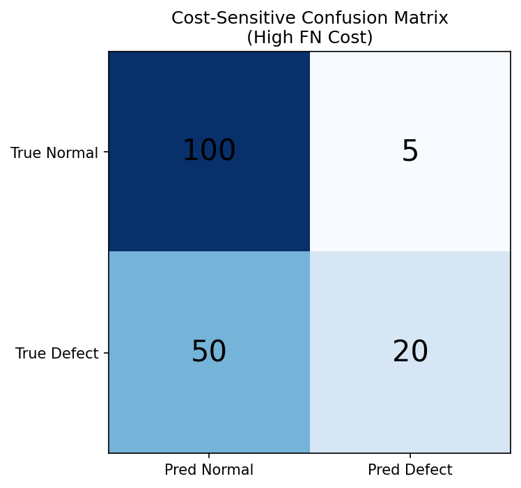
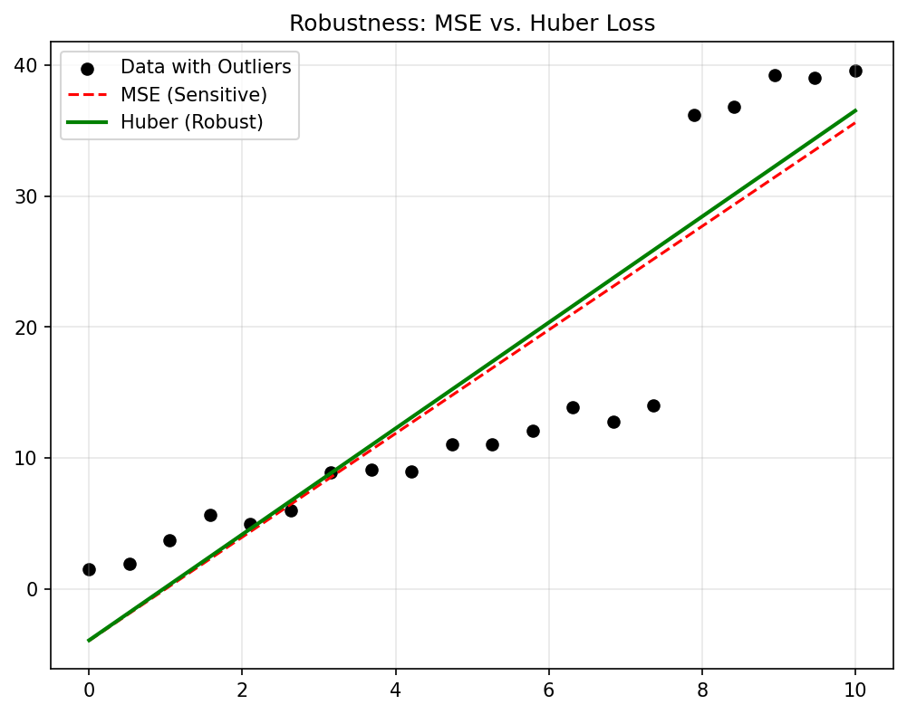
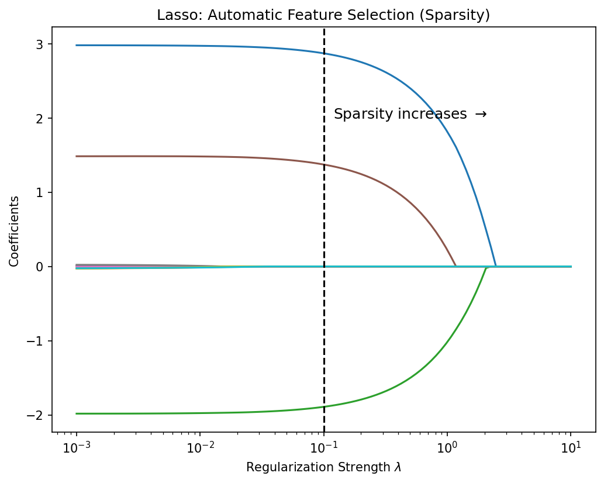

---
title: |
  Mathematical Foundations of AI & ML<br>Unit 3: Regression and Classification as Loss Minimization
bibliography: ref.bib
author:
  - name: Prof. Dr. Philipp Pelz
    affiliation:
      - FAU Erlangen-Nürnberg
format:
  revealjs:
    width: 1920
    height: 1080
    template-partials:
      - title-slide.html
    css: custom.css
    theme: custom.scss
    slide-number: c/t
    logo: "eclipse_logo_small.png"
    menu:
      side: left
      loadIcons: true
---

## Title: Regression and Classification as Loss Minimization

::: {.incremental}
- **The Learning Objective**: Moving from static data analysis to predictive modeling.
- **Unit Role**: Establishing the "Supervised Learning" framework where models are trained by minimizing discrepancies.
- **Scope**: From simple Mean Squared Error to advanced regularization techniques.
:::

## Learning outcomes

By the end of this unit, students can:

::: {.incremental}
- Formulate regression and classification as **Empirical Risk Minimization** problems.
- Explain the geometric and probabilistic meaning of **MSE**, **MAE**, and **Cross-Entropy**.
- Derive the **Normal Equations** and understand **Gradient Descent** update rules.
- Balance model complexity using **L1/L2 regularization** and the **Bias-Variance tradeoff**.
:::

## Recap from Unit 2

::: {.incremental}
- **Linear Projections**: We saw that least-squares regression is a projection onto the column space of the feature matrix $\mathbf{X}$.
- **Matrix Calculus**: We'll use gradients of quadratic forms to find optimal parameters $\mathbf{w}$.
- **Geometry**: Inner products define our similarity measures and similarity in feature space (Gram matrices).
:::

## Empirical risk minimization (ERM)

::: {.incremental}
- **The Goal**: Minimize the expected loss on the data distribution.
- **Problem**: We don't know the true distribution $p(\mathbf{x}, y)$, only a finite sample $\mathcal{D}$.
- **Empirical Risk**: $R_{emp}(\mathbf{w}) = \frac{1}{N} \sum_{i=1}^N L(f_{\mathbf{w}}(\mathbf{x}_i), y_i)$.
- Learning is the numerical optimization of this surrogate objective.
:::

## Loss as decision proxy

::: {.incremental}
- A **Loss Function** $L(\hat{y}, y)$ quantifies the "cost" of being wrong.
- Different tasks require different penalties:
    - Should we punish large errors quadratically?
    - Should we be robust to outliers?
    - Is a false positive more expensive than a false negative?
:::

## Regression losses overview

::: {.columns}
::: {.column width="50%"}
::: {.incremental}
- **Mean Squared Error (MSE)**: $L = (\hat{y} - y)^2$.
- **Mean Absolute Error (MAE)**: $L = |\hat{y} - y|$.
:::
:::

::: {.column width="50%"}
::: {.incremental}
- **Huber Loss**: A hybrid that is quadratic near zero and linear at the tails.
- **Choice**: Depends on the noise distribution in your engineering measurements [@neuer2024machine].
:::
:::
:::

## MSE geometry

::: {.incremental}
- **The Squared Penalty**: MSE strongly punishes large residuals, forcing the model to prioritize fitting "extreme" points.
- **Statistical Link**: Minimizing MSE is equivalent to **Maximum Likelihood Estimation (MLE)** under the assumption of additive Gaussian noise $\epsilon \sim \mathcal{N}(0, \sigma^2)$.
- **Optimization**: The surface is a smooth convex bowl (paraboloid), ideal for gradient descent.
:::

## MAE robustness

::: {.incremental}
- **The Linear Penalty**: Errors are penalized proportionally to their magnitude.
- **Robustness**: MAE is less sensitive to outliers (e.g., faulty sensor readings) than MSE.
- **Statistical Link**: Equivalent to MLE under **Laplacian noise** assumptions.
- **Caveat**: The derivative is undefined at zero, requiring sub-gradient methods.
:::

## Huber compromise

::: {.incremental}
- **Best of Both Worlds**:
    - Quadratic behavior for small residuals (smooth optimization).
    - Linear behavior for large residuals (robustness to outliers).
- **Industrial Use**: Ideal for materials process data where most data is clean but occasional "glitches" occur [@neuer2024machine].
:::

## Interactive: Regression Robustness

::: {.columns}
::: {.column width="25%"}
We have a dataset with a few points. Try dragging the red "outlier" point up and down.

```{ojs}
//| echo: false
viewof huber_delta = Inputs.range([0.1, 5], {value: 1, step: 0.1, label: "Huber δ"})
```

Notice how:
- **MSE** (Blue) is pulled strongly by the outlier to minimize the huge quadratic penalty.
- **MAE** (Green) ignores the outlier completely, picking the median line.
- **Huber** (Orange) compromises based on $\delta$.
:::

::: {.column width="75%"}
```{ojs}
//| echo: false
//| fig-height: 500


// Initial data
initialData1 = [
  {id: 0, x: 1, y: 1, isOutlier: false},
  {id: 1, x: 2, y: 2.2, isOutlier: false},
  {id: 2, x: 3, y: 2.8, isOutlier: false},
  {id: 3, x: 4, y: 4.1, isOutlier: false},
  {id: 4, x: 5, y: 4.8, isOutlier: false},
  {id: 5, x: 7, y: 10, isOutlier: true} // Initial outlier
]

mutable data1 = initialData1

// Regression helper functions
function fit_mse(pts) {
  const n = pts.length;
  let sumX = 0, sumY = 0, sumXY = 0, sumX2 = 0;
  for (let p of pts) {
    sumX += p.x; sumY += p.y;
    sumXY += p.x * p.y; sumX2 += p.x * p.x;
  }
  const denominator = (n * sumX2 - sumX * sumX);
  if (denominator === 0) return [0, sumY / n];
  const m = (n * sumXY - sumX * sumY) / denominator;
  const b = (sumY - m * sumX) / n;
  return [m, b];
}

function fit_gd(pts, loss_grad_fn, lr=0.01, epochs=1000) {
  let m = 1, b = 0;
  const mse_p = fit_mse(pts);
  m = mse_p[0]; b = mse_p[1];
  
  for(let i=0; i<epochs; i++) {
    let gm = 0, gb = 0;
    for(let p of pts) {
      let y_pred = m * p.x + b;
      let err = y_pred - p.y;
      let grad = loss_grad_fn(err);
      gm += grad * p.x;
      gb += grad;
    }
    m -= lr * (gm / pts.length);
    b -= lr * (gb / pts.length);
  }
  return [m, b];
}

mae_grad = (err) => err > 0 ? 1 : (err < 0 ? -1 : 0)

huber_grad = (err, d=huber_delta) => Math.abs(err) <= d ? err : (err > 0 ? d : -d)


mse_params = fit_mse(data1)
mae_params = fit_gd(data1, mae_grad, 0.05, 1000)
huber_params = fit_gd(data1, (e) => huber_grad(e, huber_delta), 0.05, 1000)

chart1 = {
  const width = 800;
  const height = 500;
  const margin = {top: 20, right: 30, bottom: 30, left: 40};

  const x = d3.scaleLinear().domain([0, 8]).range([margin.left, width - margin.right]);
  const y = d3.scaleLinear().domain([0, 12]).range([height - margin.bottom, margin.top]);

  const svg = d3.create("svg")
      .attr("viewBox", [0, 0, width, height])
      .style("background", "none"); 

  svg.append("g")
      .attr("transform", `translate(0,${height - margin.bottom})`)
      .call(d3.axisBottom(x))
      .attr("color", "#ccc");

  svg.append("g")
      .attr("transform", `translate(${margin.left},0)`)
      .call(d3.axisLeft(y))
      .attr("color", "#ccc");

  const drawLine = (params, color, dash="") => {
    return svg.append("line")
        .attr("x1", x(0))
        .attr("y1", y(params[1]))
        .attr("x2", x(8))
        .attr("y2", y(params[0] * 8 + params[1]))
        .attr("stroke", color)
        .attr("stroke-width", 3)
        .attr("stroke-dasharray", dash);
  };

  drawLine(mse_params, "#3498db"); 
  drawLine(mae_params, "#2ecc71"); 
  drawLine(huber_params, "#e67e22", "5,5"); 

  const dragBehavior = d3.drag()
      .on("drag", function(event, d) {
          if(!d.isOutlier) return;
          const newY = Math.max(0, Math.min(12, y.invert(event.y)));
          
          mutable data1 = data1.map(p => {
            if (p.id === d.id) return {...p, y: newY};
            return p;
          });
      });

  svg.append("g")
      .selectAll("circle")
      .data(data1)
      .join("circle")
        .attr("cx", d => x(d.x))
        .attr("cy", d => y(d.y))
        .attr("r", 8)
        .attr("fill", d => d.isOutlier ? "#e74c3c" : "#ecf0f1")
        .attr("stroke", d => d.isOutlier ? "#c0392b" : "#bdc3c7")
        .attr("stroke-width", 2)
        .attr("cursor", d => d.isOutlier ? "ns-resize" : "default")
        .call(dragBehavior);

  const legend = svg.append("g")
      .attr("transform", `translate(${margin.left + 20}, ${margin.top + 10})`)
      .attr("font-family", "sans-serif")
      .attr("font-size", 16)
      .attr("fill", "#ecf0f1");
      
  legend.append("rect").attr("x", 0).attr("y", 0).attr("width", 15).attr("height", 3).attr("fill", "#3498db");
  legend.append("text").attr("x", 25).attr("y", 5).text("MSE");
  
  legend.append("rect").attr("x", 0).attr("y", 25).attr("width", 15).attr("height", 3).attr("fill", "#2ecc71");
  legend.append("text").attr("x", 25).attr("y", 30).text("MAE");
  
  legend.append("rect").attr("x", 0).attr("y", 50).attr("width", 15).attr("height", 3).attr("fill", "#e67e22");
  legend.append("text").attr("x", 25).attr("y", 55).text("Huber");

  return svg.node();
}
```
:::
:::

## Classification losses

::: {.incremental}
- In classification, $y$ is discrete (e.g., phase A vs phase B).
- **0-1 Loss**: $L = 1$ if $\hat{y} \neq y$, $0$ otherwise. Problem: Not differentiable.
- **Surrogate Losses**: Logistic loss, Hinge loss, and Cross-Entropy provide differentiable bowls for optimization.
:::

## Cross-entropy intuition

::: {.incremental}
- **Probabilistic Targets**: We model $p(y=1|\mathbf{x}) = \sigma(\mathbf{w}^T \mathbf{x})$.
- **NLL**: Minimizing Cross-Entropy is equivalent to minimizing the **Negative Log-Likelihood** of a Bernoulli (binary) or Categorical (multi-class) distribution.
- **Meaning**: It punishes confident-but-wrong predictions much more harshly than slightly-unsure ones [@bishop2006pattern].
:::

## Interactive: Cross-Entropy & Decision Boundary

::: {.columns}
::: {.column width="30%"}
Adjust the logistic regression model's weights to classify the blue ($y=1$) and red ($y=0$) points.

```{ojs}
//| echo: false
viewof w1 = Inputs.range([-5, 5], {value: 1.5, step: 0.1, label: "Weight w₁"})

viewof w2 = Inputs.range([-5, 5], {value: 1.5, step: 0.1, label: "Weight w₂"})

viewof bias = Inputs.range([-15, 10], {value: -8, step: 0.2, label: "Bias b"})
```

The background color shows predicted probability $P(y=1|\mathbf{x}) = \sigma(w_1 x_1 + w_2 x_2 + b)$.
Notice how strongly the loss explodes if you push a red point deep into the "confident blue" region!
:::

::: {.column width="70%"}
```{ojs}
//| echo: false
//| fig-height: 500

chart4 = {
  const width = 600;
  const height = 500;
  const margin = {top: 40, right: 30, bottom: 30, left: 40};

  const x = d3.scaleLinear().domain([0, 10]).range([margin.left, width - margin.right]);
  const y = d3.scaleLinear().domain([0, 10]).range([height - margin.bottom, margin.top]);

  const svg = d3.create("svg")
      .attr("viewBox", [0, 0, width, height])
      .style("background", "none");

  const pts = [
    {x: 2, y: 3, c: 0}, {x: 3, y: 2, c: 0}, {x: 4, y: 4, c: 0}, 
    {x: 2, y: 5, c: 0}, {x: 5, y: 2, c: 0}, {x: 3, y: 4, c: 0},
    {x: 7, y: 8, c: 1}, {x: 8, y: 7, c: 1}, {x: 6, y: 9, c: 1},
    {x: 8, y: 9, c: 1}, {x: 9, y: 6, c: 1}, {x: 7, y: 6, c: 1},
    {x: 5, y: 6, c: 1}
  ];

  const sigmoid = (z) => 1 / (1 + Math.exp(-z));
  
  const res = 40; 
  const dx = 10 / res;
  const dy = 10 / res;
  
  const grid = [];
  for(let i=0; i<res; i++) {
    for(let j=0; j<res; j++) {
        let gx = i * dx;
        let gy = j * dy;
        let p = sigmoid(w1 * gx + w2 * gy + bias);
        grid.push({x: gx, y: gy, p: p});
    }
  }

  svg.append("g")
      .selectAll("rect")
      .data(grid)
      .join("rect")
      .attr("x", d => x(d.x))
      .attr("y", d => y(d.y + dy)) 
      .attr("width", x(dx) - x(0) + 1) 
      .attr("height", y(0) - y(dy) + 1)
      .attr("fill", d => d3.interpolateRdBu(1 - d.p)) 
      .attr("opacity", 0.6); 

  svg.append("g")
      .attr("transform", `translate(0,${height - margin.bottom})`)
      .call(d3.axisBottom(x))
      .attr("color", "#ecf0f1");

  svg.append("g")
      .attr("transform", `translate(${margin.left},0)`)
      .call(d3.axisLeft(y))
      .attr("color", "#ecf0f1");

  if (Math.abs(w2) > 0.01) {
      let x1 = 0, y1 = (-w1 * x1 - bias) / w2;
      let x2 = 10, y2 = (-w1 * x2 - bias) / w2;
      
      svg.append("line")
         .attr("x1", x(x1)).attr("y1", y(y1))
         .attr("x2", x(x2)).attr("y2", y(y2))
         .attr("stroke", "#f1c40f")
         .attr("stroke-width", 3)
         .attr("stroke-dasharray", "5,5"); 
  } else if (Math.abs(w1) > 0.01) {
      let x1 = -bias / w1;
      svg.append("line")
         .attr("x1", x(x1)).attr("y1", y(0))
         .attr("x2", x(x1)).attr("y2", y(10))
         .attr("stroke", "#f1c40f")
         .attr("stroke-width", 3)
         .attr("stroke-dasharray", "5,5");
  }

  svg.append("g")
      .selectAll("circle")
      .data(pts)
      .join("circle")
      .attr("cx", d => x(d.x))
      .attr("cy", d => y(d.y))
      .attr("r", 8)
      .attr("fill", d => d.c === 1 ? "#3498db" : "#e74c3c")  
      .attr("stroke", "#ecf0f1")
      .attr("stroke-width", 2);

  let ce_sum = 0;
  for(let p of pts) {
      let prob = sigmoid(w1 * p.x + w2 * p.y + bias);
      prob = Math.max(1e-15, Math.min(1 - 1e-15, prob));
      if (p.c === 1) ce_sum += -Math.log(prob);
      else ce_sum += -Math.log(1 - prob);
  }
  let ce_loss = ce_sum / pts.length;

  svg.append("rect")
     .attr("x", width - margin.right - 250)
     .attr("y", margin.top - 30)
     .attr("width", 240)
     .attr("height", 40)
     .attr("fill", "rgba(44, 62, 80, 0.8)")
     .attr("rx", 5);

  svg.append("text")
     .attr("x", width - margin.right - 240)
     .attr("y", margin.top - 5)
     .text(`Cross-Entropy Loss: ${ce_loss.toFixed(3)}`)
     .attr("fill", "#ecf0f1")
     .attr("font-size", 18)
     .attr("font-weight", "bold")
     .attr("font-family", "monospace");

  return svg.node();
}
```
:::
:::

## Margin-based view

::: {.incremental}
- **The Goal**: Not just to classify correctly, but to do so with a "cushion" (**Margin**).
- **Hinge Loss**: $L = \max(0, 1 - y \hat{y})$. Used in Support Vector Machines (SVMs).
- **Intuition**: Stop trying to improve once the point is correctly classified and far enough from the boundary.
:::

## Proper scoring rules

::: {.incremental}
- A loss function is **Proper** if the true distribution is the unique minimizer.
- **Brier Score**: MSE for probabilities.
- **Log-Loss**: (Cross-Entropy).
- Using proper rules ensures that our model's predicted probabilities are **calibrated** (meaning they reflect actual frequencies).
:::

## Class imbalance handling

::: {.incremental}
- **The Problem**: In materials discovery, "interesting" samples (e.g., superconductors) are much rarer than "dull" ones.
- **Weighted Loss**: $L = \sum w_j L_j$. Assign higher weights to minority classes.
- **Focal Loss**: Down-weights "easy" examples so the model focuses on hard-to-classify samples.
:::

## Multi-label loss setup

::: {.incremental}
- **Independent**: Treat as $K$ separate binary classification problems.
- **Coupled**: Use structured outputs or hierarchical loss if labels are related (e.g., "Steel" must also be "Metal").
- **Engineering Context**: Identifying multiple properties (conductivity, hardness, transparency) simultaneously.
:::

## Structured losses (light)

::: {.incremental}
- Used when the output is a sequence, graph, or image.
- **Connection**: We'll revisit this in Unit 12 when discussing Neural Network outputs for complex materials structures [@ryan2021machine].
:::

## Overfitting reminder

::: {.incremental}
- **Low Loss $\neq$ Good Model**.
- A model with 1 million parameters can have zero loss on 100 data points but will fail on the 101st.
- **The Gap**: Generalization error = Test Loss - Train Loss.
:::

## Regularization motivation

- **Occam's Razor**: Prefer the simplest explanation that fits the data [@sandfeld_materials_data_science].
- **Constraining Hypothesis Space**: We penalize complex models (large weights) so the model is forced to focus on the strongest signals.
- **Objective**: $J(\mathbf{w}) = \mathcal{L}(\mathbf{w}) + \lambda \Omega(\mathbf{w})$.

## L2 regularization (Ridge)

- **Penalty**: $\Omega(\mathbf{w}) = \frac{1}{2}\|\mathbf{w}\|_2^2$.
- **Objective**: $J(\mathbf{w}) = \mathcal{L}(\mathbf{w}) + \lambda \frac{1}{2}\|\mathbf{w}\|_2^2$.
- **Effect**: Shrinks all weights smoothly toward zero.
- **Geometry**: The constraint is a hypersphere.
- **Industrial Stability**: Helps handle correlated features by spreading the "blame" across them.

## Normal equations derivation

::: {.fragment}
1. **Objective**: Minimize $\mathcal{L}(\mathbf{w}) = \frac{1}{2} \|\mathbf{y} - \mathbf{Xw}\|_2^2$
:::

::: {.fragment}
2. **Gradient**: $\nabla_{\mathbf{w}} \mathcal{L} = -\mathbf{X}^T (\mathbf{y} - \mathbf{Xw})$
:::

::: {.fragment}
3. **Optimality**: Set $\nabla_{\mathbf{w}} \mathcal{L} = \mathbf{0}$
:::

::: {.fragment}
4. **Normal Equations**: $\mathbf{X}^T \mathbf{Xw} = \mathbf{X}^T \mathbf{y}$
:::

::: {.fragment}
5. **Solve**: $\hat{\mathbf{w}} = (\mathbf{X}^T\mathbf{X})^{-1}\mathbf{X}^T\mathbf{y}$ [@bishop2006pattern]
:::

## L1 regularization (Lasso)

- **Penalty**: $\Omega(\mathbf{w}) = \|\mathbf{w}\|_1$.
- **Objective**: $J(\mathbf{w}) = \mathcal{L}(\mathbf{w}) + \lambda \|\mathbf{w}\|_1$.
- **Effect**: Promotes **Sparsity**. Many weights will be set to *exactly zero*.
- **Geometry**: The constraint is a hyper-diamond with sharp corners.
- **Feature Selection**: Effectively tells you which inputs are irrelevant for the task [@murphy2012machine].

## Interactive: Geometry of Regularization

::: {.columns}
::: {.column width="30%"}
The objective is to find where the contours of our loss function touch the constraint boundary of the regularization.

```{ojs}
//| echo: false
viewof reg_lambda = Inputs.range([0.1, 4], {value: 1.5, step: 0.1, label: "Radius (1/λ)"})

viewof reg_type = Inputs.radio(["L1 (Lasso)", "L2 (Ridge)"], {value: "L1 (Lasso)", label: "Penalty Type"})
```

- **L1 (Diamond)**: The sharp corners mean the loss contour often hits exactly on an axis ($w_1=0$ or $w_2=0$), inducing **sparsity** (feature selection).
- **L2 (Circle)**: The smooth boundary means the weights shrink together, but rarely to exactly zero.
:::

::: {.column width="70%"}
```{ojs}
//| echo: false
//| fig-height: 500

chart2 = {
  const width = 600;
  const height = 500;
  const margin = {top: 20, right: 30, bottom: 30, left: 40};

  const x = d3.scaleLinear().domain([-4, 4]).range([margin.left, width - margin.right]);
  const y = d3.scaleLinear().domain([-4, 4]).range([height - margin.bottom, margin.top]);

  const svg = d3.create("svg")
      .attr("viewBox", [0, 0, width, height])
      .style("background", "none"); 

  svg.append("g")
      .attr("transform", `translate(0,${y(0)})`) 
      .call(d3.axisBottom(x).ticks(5))
      .attr("color", "#7f8c8d");

  svg.append("g")
      .attr("transform", `translate(${x(0)},0)`) 
      .call(d3.axisLeft(y).ticks(5))
      .attr("color", "#7f8c8d");

  const cx = 2;
  const cy = 2.5;
  const a = 1;
  const b = 0.5;
  const angle = Math.PI / 4; 
  
  const loss_val = (_w1, _w2) => {
    const dx = _w1 - cx;
    const dy = _w2 - cy;
    const u = dx * Math.cos(angle) + dy * Math.sin(angle);
    const v = -dx * Math.sin(angle) + dy * Math.cos(angle);
    return (u*u / a + v*v / b);
  };

  for (let c = 0.5; c <= 10; c+=1.2) {
    const pts = [];
    for(let t=0; t<Math.PI*2; t+=0.1) {
      const u = Math.sqrt(c * a) * Math.cos(t);
      const v = Math.sqrt(c * b) * Math.sin(t);
      const dx = u * Math.cos(-angle) + v * Math.sin(-angle);
      const dy = -u * Math.sin(-angle) + v * Math.cos(-angle);
      pts.push([dx + cx, dy + cy]);
    }
    pts.push(pts[0]);
    svg.append("path")
       .datum(pts)
       .attr("fill", "none")
       .attr("stroke", d3.interpolateBlues(0.3 + c*0.05))
       .attr("stroke-width", 1.5)
       .attr("d", d3.line().x(d => x(d[0])).y(d => y(d[1])));
  }
  
  const r = reg_lambda;
  if (reg_type === "L1 (Lasso)") {
    const diamondPts = [[r, 0], [0, r], [-r, 0], [0, -r], [r, 0]];
    svg.append("path")
       .datum(diamondPts)
       .attr("fill", "rgba(231, 76, 60, 0.2)")
       .attr("stroke", "#e74c3c")
       .attr("stroke-width", 3)
       .attr("d", d3.line().x(d => x(d[0])).y(d => y(d[1])));
  } else {
    svg.append("circle")
       .attr("cx", x(0))
       .attr("cy", y(0))
       .attr("r", Math.abs(x(r) - x(0))) 
       .attr("fill", "rgba(46, 204, 113, 0.2)")
       .attr("stroke", "#2ecc71")
       .attr("stroke-width", 3);
  }

  svg.append("circle").attr("cx", x(cx)).attr("cy", y(cy)).attr("r", 6).attr("fill", "#f39c12");
  svg.append("text").attr("x", x(cx) + 12).attr("y", y(cy) - 6).text("w* (Unregularized)").attr("fill", "#ecf0f1").style("font-size", "14px");
  
  let min_loss = Infinity;
  let opt_w = [0, 0];
  
  if (r > 0.05) {
      if (reg_type === "L1 (Lasso)") {
        for(let _w1=-r; _w1<=r; _w1+=0.02) {
            let pts = [[_w1, r - Math.abs(_w1)], [_w1, -(r - Math.abs(_w1))]];
            for(let p of pts) {
                const v = loss_val(p[0], p[1]);
                if(v < min_loss) { min_loss = v; opt_w = p; }
            }
        }
      } else {
        for(let t=0; t<Math.PI*2; t+=0.02) {
            const _w1 = r * Math.cos(t);
            const _w2 = r * Math.sin(t);
            const v = loss_val(_w1, _w2);
            if(v < min_loss) { min_loss = v; opt_w = [_w1, _w2]; }
        }
      }
      
      svg.append("circle").attr("cx", x(opt_w[0])).attr("cy", y(opt_w[1])).attr("r", 7).attr("fill", "#e74c3c");
      svg.append("text").attr("x", x(opt_w[0]) + 12).attr("y", y(opt_w[1]) + 20).text("w* (Regularized)").attr("fill", "#e74c3c").style("font-size", "14px");
      
      svg.append("defs").append("marker")
        .attr("id", "arrow")
        .attr("viewBox", "0 -5 10 10")
        .attr("refX", 8)
        .attr("refY", 0)
        .attr("markerWidth", 5)
        .attr("markerHeight", 5)
        .attr("orient", "auto")
        .append("path")
        .attr("fill", "#e74c3c")
        .attr("d", "M0,-5L10,0L0,5");

      svg.append("line")
         .attr("x1", x(0)).attr("y1", y(0))
         .attr("x2", x(opt_w[0])).attr("y2", y(opt_w[1]))
         .attr("stroke", "#e74c3c")
         .attr("stroke-width", 2)
         .attr("stroke-dasharray", "4,4")
         .attr("marker-end", "url(#arrow)");
  }

  return svg.node();
}
```
:::
:::

## Elastic net

- **The Tradeoff**: $\Omega = \alpha \|\mathbf{w}\|_1 + (1-\alpha) \frac{1}{2}\|\mathbf{w}\|_2^2$.
- **Why?**: Lasso can be unstable when features are highly correlated (it randomly picks one). Elastic Net groups them and keeps them together.
- **Standard Tool**: The default choice for high-dimensional materials regression.

## MAP interpretation

- **L2 Regularization** $\leftrightarrow$ Gaussian Prior on weights.
- **L1 Regularization** $\leftrightarrow$ Laplace Prior on weights.
- **Bayesian Perspective**: We are injecting our prior belief that parameters should be small or sparse.

## Early stopping

- **Implicit Regularization**: Monitor loss on a validation set. Stop training when validation loss starts to rise, even if training loss is still falling.
- **Mechanism**: Prevents the optimizer from exploring the "overfit" regions of the landscape.

## Data augmentation as regularizer

- If you don't have enough data, make some!
- **Symmetry**: Rotating an image or slightly perturbing a spectrum shouldn't change the label.
- **Effect**: Artificially expands the dataset, effectively smoothing the loss landscape.

## Dropout intuition

- **Ensemble-in-a-Model**: Randomly "kill" neurons during training.
- **Why it works**: Prevents neurons from relying too much on each other (co-adaptation). The network becomes more robust and generalized.

## Batch norm side effects

- While primarily for optimization, Batch Norm adds a small amount of noise to each batch.
- This noise acts as a regularizer, often allowing us to use less Dropout or weight decay.

## Label smoothing

- Instead of target $y=1$, use $y=0.9$.
- Prevents the network from becoming "overconfident" and pushing weights to infinity to satisfy the sigmoid/softmax saturation.
- Improves **Calibration**.

## Noise injection methods

- Injecting Gaussian noise into inputs during training acts similarly to L2 regularization.
- **Physical Interpretation**: The model becomes robust to measurement error in the lab [@neuer2024machine].

## Hyperparameter tuning

- $\lambda$ (regularization strength) is not learned by gradient descent!
- **Grid Search**: Try discrete values.
- **Random Search**: Often better for high-dim spaces.
- **Bayesian Optimization**: Use a model to predict which $\lambda$ will work best.

## Validation-driven model selection

- **Golden Rule**: Never use the Test Set for tuning hyperparameters.
- **Process**:
    1. Train on Train Set.
    2. Evaluate on Validation Set to pick the best $\lambda$.
    3. report final performance on the unseen Test Set.

## Bias-variance framing

::: {.columns}
::: {.column width="50%"}
- **High Bias**: Model is too simple (Underfitting).
- **High Variance**: Model is too sensitive to noise (Overfitting).
- **The Sweet Spot**: Where total error (Bias$^2$ + Variance + Noise) is minimized.
:::

::: {.column width="50%"}
```{mermaid}
%%| echo: false
graph TD
    Complexity[Model Complexity]
    Error[Total Error]
    Bias["Bias²"]
    Var[Variance]
    Complexity --- Bias
    Complexity --- Var
    Bias --- Error
    Var --- Error
    style Bias fill:#f9f,stroke:#333
    style Var fill:#ccf,stroke:#333
    style Error fill:#f96,stroke:#333
```
:::
:::

## Underfit vs overfit diagnostics

- **Learning Curves**: Plot Error vs Training Set Size.
- **Validation Curves**: Plot Error vs Model Complexity.
- If Train and Val error are both high $\to$ Underfit.
- If Train is low but Val is high $\to$ Overfit.

## Interactive: Polynomial Fitting & Overfitting

::: {.columns}
::: {.column width="25%"}
Let's fit a polynomial to noisy training data to see the Bias-Variance tradeoff live.

```{ojs}
//| echo: false
viewof poly_degree = Inputs.range([1, 10], {value: 1, step: 1, label: "Polynomial Degree"})
```

- **Degree 1-2**: Underfitting (High Bias). The model is too simple to capture the intrinsic curve.
- **Degree 3-4**: The "Sweet Spot". Fits the true curve well.
- **Degree 9-10**: Overfitting (High Variance). The model memorizes the noise, leading to wild oscillations between data points. Test error explodes!
:::

::: {.column width="75%"}
```{ojs}
//| echo: false
//| fig-height: 500

chart3 = {
  const width = 800;
  const height = 500;
  const margin = {top: 20, right: 30, bottom: 40, left: 50};

  const ground_truth = (x) => Math.sin(1.5 * Math.PI * x);
  
  const raw_x = [0.02, 0.05, 0.1, 0.15, 0.22, 0.28, 0.35, 0.40, 0.45, 0.52, 0.58, 0.65, 0.70, 0.78, 0.85, 0.90, 0.95, 0.98];
  const train_data = raw_x.map(x => ({
    x: x, 
    y: ground_truth(x) + (Math.sin(x * 1234) * 0.25) 
  }));

  const test_x = [0.01, 0.08, 0.12, 0.2, 0.25, 0.3, 0.38, 0.42, 0.48, 0.55, 0.6, 0.68, 0.75, 0.8, 0.88, 0.92, 0.96, 0.99];
  const test_data = test_x.map(x => ({
    x: x, 
    y: ground_truth(x) + (Math.sin(x * 4321) * 0.25)
  }));

  const svg = d3.create("svg")
      .attr("viewBox", [0, 0, width, height])
      .style("background", "none");

  const leftWidth = width * 0.55;
  const rightWidth = width * 0.45;

  const xLeft = d3.scaleLinear().domain([0, 1]).range([margin.left, leftWidth - margin.right/2]);
  const yLeft = d3.scaleLinear().domain([-1.8, 1.8]).range([height - margin.bottom, margin.top]);

  svg.append("g")
      .attr("transform", `translate(0,${yLeft(0)})`)
      .call(d3.axisBottom(xLeft).ticks(5))
      .attr("color", "#7f8c8d");

  svg.append("g")
      .attr("transform", `translate(${margin.left},0)`)
      .call(d3.axisLeft(yLeft).ticks(5))
      .attr("color", "#7f8c8d");

  const truth_pts = [];
  for(let x=0; x<=1; x+=0.01) truth_pts.push([x, ground_truth(x)]);
  svg.append("path")
      .datum(truth_pts)
      .attr("fill", "none")
      .attr("stroke", "#7f8c8d")
      .attr("stroke-width", 2)
      .attr("stroke-dasharray", "5,5")
      .attr("d", d3.line().x(d => xLeft(d[0])).y(d => yLeft(d[1])));

  const fit_poly = (data, degree) => {
    const X = data.map(d => {
        let row = [];
        for(let j=0; j<=degree; j++) row.push(Math.pow(d.x, j));
        return row;
    });
    const Y = data.map(d => d.y);
    
    const XT = [];
    for(let j=0; j<=degree; j++) {
        let row = [];
        for(let i=0; i<data.length; i++) row.push(X[i][j]);
        XT.push(row);
    }
    
    const XTX = [];
    for(let i=0; i<=degree; i++) {
        let row = [];
        for(let j=0; j<=degree; j++) {
            let sum = 0;
            for(let k=0; k<data.length; k++) sum += XT[i][k] * X[k][j];
            row.push(sum);
        }
        XTX.push(row);
    }

    const XTY = [];
    for(let i=0; i<=degree; i++) {
        let sum = 0;
        for(let k=0; k<data.length; k++) sum += XT[i][k] * Y[k];
        XTY.push(sum);
    }

    for(let i=0; i<=degree; i++) {
        let max_el = Math.abs(XTX[i][i]);
        let max_row = i;
        for(let k=i+1; k<=degree; k++) {
            if (Math.abs(XTX[k][i]) > max_el) {
                max_el = Math.abs(XTX[k][i]);
                max_row = k;
            }
        }
        
        let tmp = XTX[i]; XTX[i] = XTX[max_row]; XTX[max_row] = tmp;
        let tmpY = XTY[i]; XTY[i] = XTY[max_row]; XTY[max_row] = tmpY;
        
        for (let k=i+1; k<=degree; k++) {
            let c = -XTX[k][i] / XTX[i][i];
            for(let j=i; j<=degree; j++) {
                if(i===j) XTX[k][j] = 0;
                else XTX[k][j] += c * XTX[i][j];
            }
            XTY[k] += c * XTY[i];
        }
    }
    
    let w = new Array(degree+1).fill(0);
    for(let i=degree; i>=0; i--) {
        if(Math.abs(XTX[i][i]) < 1e-12) { w[i] = 0; continue; }
        w[i] = XTY[i] / XTX[i][i];
        for(let k=i-1; k>=0; k--) {
            XTY[k] -= XTX[k][i] * w[i];
        }
    }
    return w;
  };

  const predict = (x, weights) => {
    let sum = 0;
    for(let j=0; j<weights.length; j++) sum += weights[j] * Math.pow(x, j);
    return sum;
  };

  const calc_mse = (data, weights) => {
    let sum = 0;
    for(let d of data) {
        let err = d.y - predict(d.x, weights);
        sum += err * err;
    }
    return sum / data.length;
  };

  const weights = fit_poly(train_data, poly_degree);
  
  const fit_pts = [];
  for(let x=0; x<=1; x+=0.01) {
    let y = predict(x, weights);
    // clip wild oscillations to bounding box visually
    if(y > 2) y = 2; if(y < -2) y = -2;
    fit_pts.push([x, y]);
  }
  
  svg.append("path")
      .datum(fit_pts)
      .attr("fill", "none")
      .attr("stroke", "#e74c3c")
      .attr("stroke-width", 3)
      .attr("d", d3.line().x(d => xLeft(d[0])).y(d => yLeft(d[1])));

  svg.append("g")
      .selectAll("circle")
      .data(train_data)
      .join("circle")
      .attr("cx", d => xLeft(d.x))
      .attr("cy", d => yLeft(d.y))
      .attr("r", 5)
      .attr("fill", "#3498db")
      .attr("stroke", "#2980b9");

  const xRight = d3.scaleLinear().domain([1, 10]).range([leftWidth + margin.left, width - margin.right]);
  const yRight = d3.scaleLog().domain([0.01, 100]).range([height - margin.bottom, margin.top]);

  svg.append("g")
      .attr("transform", `translate(0,${height - margin.bottom})`)
      .call(d3.axisBottom(xRight).ticks(5))
      .attr("color", "#7f8c8d");

  svg.append("g")
      .attr("transform", `translate(${leftWidth + margin.left},0)`)
      .call(d3.axisLeft(yRight).ticks(4).tickFormat(d => d))
      .attr("color", "#7f8c8d");

  const train_errs = [];
  const test_errs = [];
  for(let d=1; d<=poly_degree; d++) {
      let w = fit_poly(train_data, d);
      train_errs.push([d, Math.max(0.01, Math.min(100, calc_mse(train_data, w)))]);
      test_errs.push([d, Math.max(0.01, Math.min(100, calc_mse(test_data, w)))]);
  }

  svg.append("path")
      .datum(train_errs)
      .attr("fill", "none")
      .attr("stroke", "#3498db")
      .attr("stroke-width", 2)
      .attr("d", d3.line().x(d => xRight(d[0])).y(d => yRight(d[1])));

  svg.append("g")
      .selectAll("circle.train")
      .data(train_errs)
      .join("circle")
      .attr("class", "train")
      .attr("cx", d => xRight(d[0]))
      .attr("cy", d => yRight(d[1]))
      .attr("r", 4)
      .attr("fill", "#3498db");

  svg.append("path")
      .datum(test_errs)
      .attr("fill", "none")
      .attr("stroke", "#e67e22")
      .attr("stroke-width", 2)
      .attr("d", d3.line().x(d => xRight(d[0])).y(d => yRight(d[1])));
      
  svg.append("g")
      .selectAll("circle.test")
      .data(test_errs)
      .join("circle")
      .attr("class", "test")
      .attr("cx", d => xRight(d[0]))
      .attr("cy", d => yRight(d[1]))
      .attr("r", 4)
      .attr("fill", "#e67e22");

  svg.append("text").attr("x", margin.left + 10).attr("y", margin.top).text("Training Data").attr("fill", "#3498db").attr("font-size", 14);
  svg.append("text").attr("x", margin.left + 10).attr("y", margin.top + 20).text("True Function").attr("fill", "#7f8c8d").attr("font-size", 14);
  svg.append("text").attr("x", margin.left + 10).attr("y", margin.top + 40).text("Model Fit").attr("fill", "#e74c3c").attr("font-size", 14);

  svg.append("text").attr("x", leftWidth + margin.left + 10).attr("y", margin.top).text("Train Error").attr("fill", "#3498db").attr("font-size", 14);
  svg.append("text").attr("x", leftWidth + margin.left + 10).attr("y", margin.top + 20).text("Test Error").attr("fill", "#e67e22").attr("font-size", 14);

  return svg.node();
}
```
:::
:::

## Double descent hint

- **Modern Paradox**: In deep learning, increasing complexity beyond the "interpolation threshold" can actually *decrease* test error again.
- We will revisit this in the Neural Networks units!

## Robust optimization preview

- Instead of minimizing average loss, minimize the *worst-case* loss under small perturbations.
- **Security**: Crucial for defending against adversarial attacks or unexpected process shifts.

## Loss landscape intuition

- **Curvature**: The Hessian $\mathbf{H}$ determines how fast we can learn.
- **Conditioning**: If the "bowl" is a very long, thin trench, gradient descent will oscillate wildly.
- **Solution**: Regularization and Feature Scaling.

## Optimization interaction

- **MSE**: Quadratic gradient, easy to optimize.
- **MAE**: Constant gradient, "jumps" around the minimum.
- **Cross-Entropy**: Can have very flat regions (vanishing gradients) if initialized poorly.

## Calibration and loss choice

- Margin losses (like Hinge) focus only on the boundary.
- Log-losses (like Cross-Entropy) focus on the entire distribution.
- For high-stakes engineering (e.g., "Is this bridge going to fail?"), we need **probabilities**, not just labels.

## Domain-specific loss design

- **Physics-Informed Losses**: Add a term that penalizes violations of physical laws (e.g., mass conservation, energy balance).
- $J = J_{data} + \lambda J_{physics}$.
- This acts as the ultimate regularizer for scientific ML [@neuer2024machine].

## Materials example: rare defect cost

::: {.columns}
::: {.column width="50%"}
- Task: Identifying micro-cracks from ultrasound.
- **Asymmetry**: Missing a crack (False Negative) is 100x more expensive than a false alarm (False Positive).
- **Solution**: Cost-sensitive weighted loss function.
:::

::: {.column width="50%"}
{width=80%}
:::
:::

## Materials example: smooth property regression

::: {.columns}
::: {.column width="50%"}
- Task: Predicting conductivity from composition.
- Data contains outliers due to experimental errors.
- **Solution**: Use Huber loss to stay robust to outliers while maintaining smooth convergence.
:::

::: {.column width="50%"}
{width=80%}
:::
:::

## Materials example: sparse feature model

::: {.columns}
::: {.column width="50%"}
- Task: Predicting melting point from 10,000 potential atomic descriptors.
- Most descriptors are irrelevant.
- **Solution**: Lasso ($L_1$) regression to find the "active" physical descriptors.
:::

::: {.column width="50%"}
{width=80%}
:::
:::

## Common pitfalls

- [ ] **Wrong Loss**: Using MSE for highly skewed data without transformation.
- [ ] **Leakage**: Tuning regularization strength using the test set.
- [ ] **Scaling**: Forgetting to scale features before L1/L2 (the penalty is not scale-invariant!).

## Checklist for loss selection

1. Is the target continuous or discrete?
2. Are there outliers in the data?
3. Is the class distribution imbalanced?
4. Do I need calibrated probabilities or just labels?
5. Are there physical constraints to satisfy?

## Exercise 1 scaffold: Loss Comparison

- Implement a custom loss function in NumPy.
- Compare the fit of a line using MSE, MAE, and Huber on a dataset with synthetic outliers.
- Visualize the resulting regression lines.

## Exercise 2 scaffold: Regularization Sweep

- Fit a high-degree polynomial to limited data points.
- Perform a sweep over $\lambda$ for both Ridge and Lasso.
- Plot the weight magnitudes and count the number of zero-weights for Lasso.

## Exercise 3 scaffold: Imbalanced Classification

- Train a logistic regression model on a 99% vs 1% class split.
- Observe the failure of standard accuracy.
- Implement a weighted loss and compare the resulting confusion matrices.

## Exam-oriented key statements

1. ERM is the core principle of training.
2. MSE is MLE under Gaussian noise.
3. L1 induces sparsity; L2 shrinks weights smoothly.
4. Bias-Variance tradeoff governs generalization.
5. Cross-Entropy is the standard for calibrated classification.

## Summary table

| Loss | Best for... | Property |
| :--- | :--- | :--- |
| **MSE** | Gaussian Noise | Smooth, Sensitive to Outliers |
| **MAE** | Laplacian Noise | Robust, Non-differentiable at 0 |
| **Huber** | Industrial Data | Hybrid, Robust + Smooth |
| **Log-Loss**| Probabilities | Calibrated, Strongly Convex |

## Unit summary

- We've moved from linear algebra to **Learning**.
- We understand that every modeling choice (loss, penalty, prior) has both a geometric and a statistical justification.
- Generalization is the only metric that truly matters.

## References + transition

- **Read**: Neuer Ch. 4.1-4.3, Bishop Ch. 3.1-3.2.
- **Next Unit**: Neural Networks Early - from linear combinations to deep hierarchies.

::: {#refs}
:::

## Example Notebook

::: {.callout-note icon=false}
## Week 3: Regression from Scratch — TensileTestDataset
[Open rendered notebook →](https://eclipse-lab.github.io/Ai4MatLectures/notebooks/MFML/week03_regression_tensile.html)  
[](https://colab.research.google.com/github/ECLIPSE-Lab/Ai4MatLectures/blob/main/notebooks/MFML/week03_regression_tensile.ipynb)
:::
