<!-- ===== §1. Framing ===== -->

## Where we are in the triad

:::: {.columns}
:::: {.column width="50%"}
**Just done (Unit 3):**

- Supervised learning as **loss minimization**.
- Linear and generalized linear models.
- Fixed feature maps $\boldsymbol\phi(\mathbf{x})$.
- Optimization as the engine behind fitting.
::::
:::: {.column width="50%"}
**Today:**

- Replace fixed features with **learned representations**.
- Understand why dense MLPs struggle with images.
- Derive convolution from **locality** and **translation equivariance**.
- Build the vocabulary for modern CNN architectures.
::::
::::

:::: {.notes}
- Unit 3: fixed features + loss minimization.
- Today: make the feature map trainable.
- Example: instead of hand-writing a grain-size descriptor, let layers learn texture and boundary detectors.
- Boundary of this lecture: forward architectures only; backprop is a self-study supplement (`02_backprop_self_study.qmd` in this folder).
- Transition: these are the skills students should have by the end.
::::


## The big leap

:::: {.incremental}
- Unit 3 used $f_{\mathbf{w}}(\mathbf{x}) = \mathbf{w}^T\boldsymbol\phi(\mathbf{x})$: a linear model on **fixed** features.
- Neural networks make $\boldsymbol\phi$ **learnable** by composing layers.
- For tabular data, dense layers are often a reasonable first architecture.
- For images, spectra, and spatial fields, dense layers ignore what we already know: nearby pixels matter, patterns can move, and features are hierarchical.
- **CNNs build those assumptions into the architecture.**
::::

:::: {.notes}
- Unit 3 fixed phi(x); now phi(x) becomes learnable.
- Concrete examples of hand-built features: grain size, mean pore diameter, XPS peak height, Fourier frequency bands.
- Neural nets trade convexity for feature flexibility.
- CNNs add structure: local, shared, hierarchical features.
- Transition: recall fixed bases before learning bases.
::::
## Fixed bases we already know

Before learning features, we often choose a basis by hand:

$$
f_{\mathbf{w}}(\mathbf{x}) = \sum_{j=1}^M w_j\,\phi_j(\mathbf{x}).
$$

:::: {.incremental}
- Fourier bases: global oscillatory patterns.
- Wavelet bases: localized multiscale patterns.
- GLM / polynomial bases: engineered non-linear coordinates for a linear model.
- The limitation is not linearity alone; it is that $\phi_j$ is fixed before seeing the task.
::::

:::: {.notes}
- Fixed basis model: choose phi_j first, then fit weights.
- Fourier: good for periodic signals and diffraction-like frequency content.
- Wavelets: good for localized edges or bursts.
- Polynomial GLM: good for low-dimensional curved decision boundaries.
- Key point: the basis is chosen before seeing the task labels.
::::
## Example: Fourier basis on a $16\times16$ image

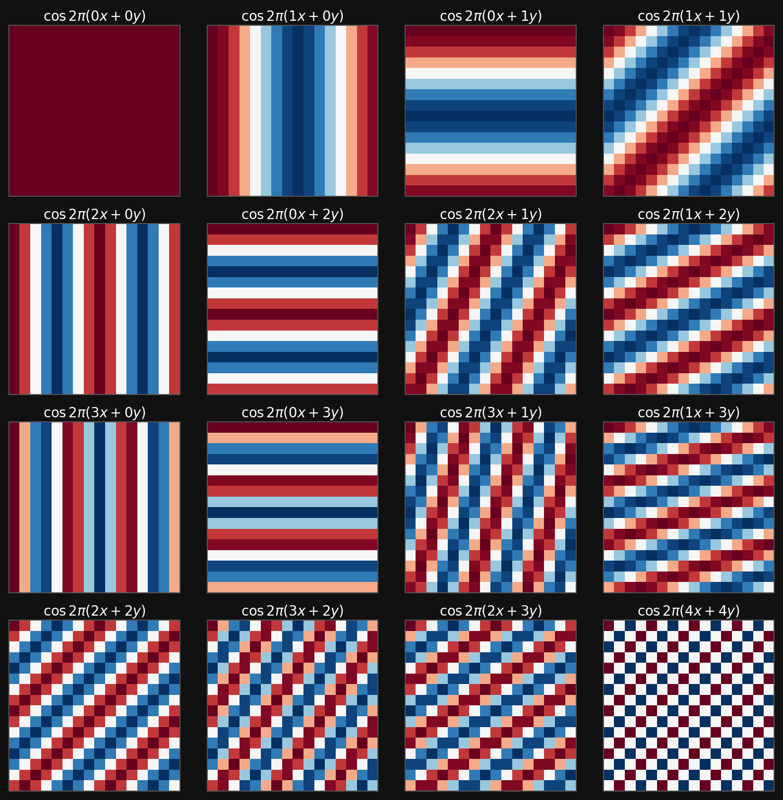{width="62%"}

:::: {.fragment}
Fourier features are excellent when the signal is naturally decomposed into global frequencies. They are less natural for localized edges, defects, and spatial motifs.
::::

:::: {.notes}
- Point out: every Fourier atom spans the whole image.
- Good example: periodic lattice fringes or diffraction frequency analysis.
- Weak example: one small defect in a large micrograph needs many global modes.
- Ask: is a global sine wave a natural primitive for a local crack?
- Transition: wavelets add locality.
::::
## Example: DWT / Haar wavelet basis

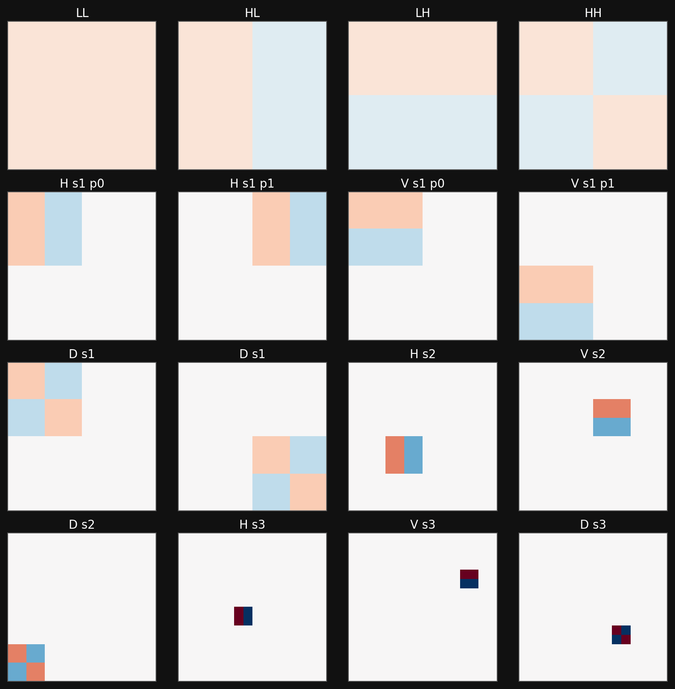{width="62%"}

:::: {.fragment}
Wavelets add locality and scale. This is already closer to images: a feature can live in one region and at one resolution.
::::

:::: {.notes}
- Haar atoms compare local regions: left vs right, top vs bottom, coarse vs fine.
- Good example: detecting abrupt contrast changes at a phase boundary.
- Multiscale point: large atoms see coarse structure; small atoms see details.
- Limitation: positions and shapes are still fixed by the transform.
- Transition: polynomial features do a similar job for coordinates.
::::
## Example: polynomial basis for a GLM

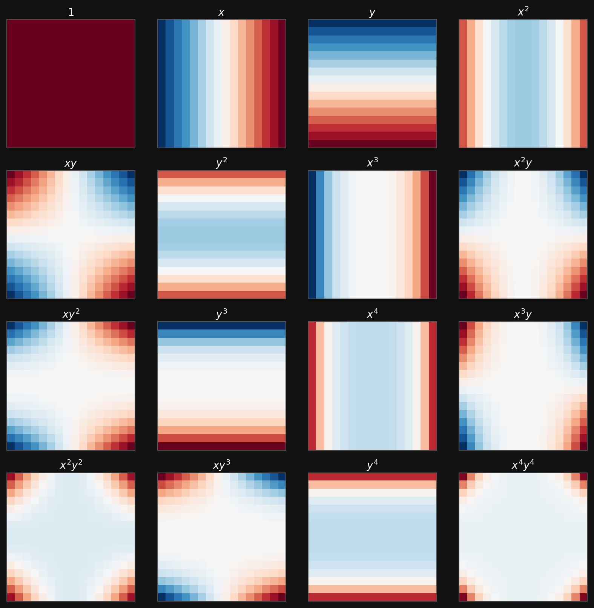{width="62%"}

:::: {.fragment}
Polynomial features make a linear model non-linear in the original coordinates, but the feature map is still chosen by the engineer.
::::

:::: {.notes}
- Polynomial features let a linear model draw curved boundaries.
- Example: class depends on radius, x^2 + y^2, not x or y alone.
- Useful for low-dimensional physics features: temperature squared, composition interactions.
- Limitation: terms explode with dimension and degree.
- Transition: learn useful coordinates instead of listing them.
::::
## The next step: learn the basis

:::: {.columns}
:::: {.column width="50%"}
**Fixed-basis model**

$$
\hat{y} = \sum_j w_j\,\phi_j(\mathbf{x})
$$

- Choose $\phi_j$ first.
- Learn only the coefficients $w_j$.
- Works well when the right basis is known.
::::
:::: {.column width="50%"}
**Neural-network model**

$$
\hat{y} = g_{\theta}\bigl(\mathbf{x}\bigr)
      = \sum_j v_j\,\phi_j(\mathbf{x};\theta)
$$

- Learn the feature map from data.
- Coefficients and basis adapt together.
- Architecture decides what kinds of bases are easy to learn.
::::
::::

:::: {.notes}
- Left: engineer chooses phi_j; model learns only w_j.
- Right: network learns both features and final coefficients.
- Example: final classifier is often linear on learned CNN feature maps.
- Ask: which part is the basis, which part is the coefficient?
- Transition: roadmap from dense layers to CNN motifs.
::::
## Roadmap

:::: {.columns}
:::: {.column width="50%"}
1. Minimal neural-network foundations.
2. Why dense MLPs are not enough for images.
3. Convolution from first principles.
4. Kernels, feature maps, and receptive fields.
::::
:::: {.column width="50%"}
5. Channels, padding, stride, and pooling.
6. Architecture motifs: LeNet/VGG, NiN, DenseNet, U-Net.
7. What CNNs buy us, and what they do not solve.
8. Forward links to backpropagation and optimization.
::::
::::


<!-- ===== §2. Minimal neural-network foundations ===== -->

:::: {.notes}
- First: dense-layer baseline and activations.
- Middle: derive convolution from locality and weight sharing.
- Later: CNN mechanics and architecture motifs.
- Park training questions for Unit 5.
- Transition: start with the minimal modern neural-network view.
::::
## From historical neuron to modern layer

:::: {.columns}
:::: {.column width="45%"}
**Historical arc, compressed:**

- MCP neurons made Boolean threshold logic explicit.
- Perceptrons added signed weights and a bias.
- ADALINE moved the error signal before the threshold, making gradient-based learning natural.
- MLPs stack many such units with non-linearities.
::::
:::: {.column width="55%"}
**Modern view:**

A neural network is a parameterized composition of simple maps:

$$
\mathbf{x}
\mapsto W^{(1)}\mathbf{x}+\mathbf{b}^{(1)}
\mapsto \sigma(\cdot)
\mapsto \cdots
\mapsto \hat{\mathbf{y}}.
$$

The historical names matter less than the compositional structure.
::::
::::

:::: {.notes}
- **MCP (McCulloch–Pitts, 1943)** → *threshold logic, no learning*  
  - Binary inputs and outputs (0/1)  
  - Computes a weighted sum and compares to a fixed threshold  
  - Implements logical functions (AND, OR, NOT)  
  - No training: weights and threshold are manually set  

- **Perceptron (Rosenblatt, 1957)** → *learned weights + bias, still binary decision*  
  - Introduces trainable weights and bias  
  - Output via step/sign activation (binary)  
  - Learns with a simple update rule based on classification errors  
  - Works for linearly separable problems only  

- **ADALINE (Widrow & Hoff, 1960)** → *smooth output, gradient-based learning*  
  - Linear activation (no threshold during training)  
  - Continuous output (real-valued)  
  - Trained using mean squared error (MSE)  
  - Enables gradient descent → more stable learning  

---

**Progression (intuition):**  
- MCP: hard threshold, fixed  
- Perceptron: hard threshold, learns  
- ADALINE: linear output, learns via smooth error  
::::
## A dense layer

A layer with input width $D$ and output width $M$ computes

$$
\mathbf{z} = W\mathbf{x} + \mathbf{b},
\qquad
\mathbf{a} = \sigma(\mathbf{z}),
$$

where

| Object | Shape |
|---|---|
| input $\mathbf{x}$ | $D \times 1$ |
| weights $W$ | $M \times D$ |
| bias $\mathbf{b}$ | $M \times 1$ |
| activation $\mathbf{a}$ | $M \times 1$ |

:::: {.fragment}
For a batch $X \in \mathbb{R}^{D\times N}$, the same layer is $A=\sigma(WX+\mathbf{b})$, with the bias broadcast across samples.
::::

:::: {.notes}
- Name shapes slowly: x is D by 1, W is M by D, output is M by 1.
- Quick check: D=100, M=20 gives W shape 20 by 100.
- Dense means every input coordinate can affect every output coordinate.
- Batch case: same operation for many samples at once.
- Transition: depth only helps if activations are nonlinear.
::::
## Why non-linearity is non-negotiable

:::: {.incremental}
- Stack two linear maps:
$$
\mathbf{a}^{(2)} = W^{(2)}(W^{(1)}\mathbf{x}+\mathbf{b}^{(1)})+\mathbf{b}^{(2)}.
$$
- Rearrange:
$$
\mathbf{a}^{(2)} = (W^{(2)}W^{(1)})\mathbf{x}+\tilde{\mathbf{b}}.
$$
- So two linear layers collapse into one linear layer.
- By induction, any depth of purely linear layers has the expressivity of a single affine map.
- Non-linear activations are what make depth meaningful.
::::

:::: {.notes}
- Walk through the algebra: two linear layers collapse into one.
- Key phrase: depth without nonlinearity is still one affine map.
- Example: 50 linear layers cannot solve XOR or ring separation by themselves.
- This is about representation, not about optimizer behavior.
- Transition: activation choice matters.
::::
## Activation functions: what we need today

| Activation | Formula | Typical role | Main caution |
|---|---|---|---|
| Identity | $z$ | regression output | no hidden-layer expressivity alone |
| Sigmoid | $(1+e^{-z})^{-1}$ | binary output | saturates, not hidden default |
| Tanh | $\tanh z$ | older hidden layers | saturates at both tails |
| ReLU | $\max(0,z)$ | hidden default | zero gradient for $z<0$ |
| Leaky ReLU / GeLU | smooth or leaky gates | modern hidden variants | architecture and optimizer dependent |
| Softmax | $e^{z_j}/\sum_k e^{z_k}$ | multi-class output | use with cross-entropy |

:::: {.fragment}
Today we only need the rule: hidden layers need non-linear activations; output activations must match the target range and loss.
::::

:::: {.notes}
- Hidden activation: creates nonlinear learned features.
- Output activation: matches target range.
- Example mistake: ReLU output for temperature anomaly, because negative values become impossible.
- Sigmoid: binary probability; softmax: class probabilities.
- Transition: show nonlinear feature maps with rings.
::::
## Interactive: warping rings into separable data

:::: {.columns}
:::: {.column width="40%"}
```{ojs}
//| echo: false
viewof innerRadius = Inputs.range([0.4, 1.6], {value: 0.8, step: 0.05, label: "Inner radius r1"})
viewof outerRadius = Inputs.range([1.2, 2.4], {value: 1.7, step: 0.05, label: "Outer radius r2"})
viewof ringNoise = Inputs.range([0.02, 0.25], {value: 0.08, step: 0.01, label: "Radial noise"})
viewof rawLineAngle = Inputs.range([-80, 80], {value: 25, step: 1, label: "Example linear boundary angle"})
viewof rawLineOffset = Inputs.range([-1.5, 1.5], {value: 0, step: 0.05, label: "Example linear boundary offset"})
```

Raw coordinates $(x_1,x_2)$ contain two concentric classes. A straight line cuts through both rings.

The feature map

$$
\phi(\mathbf{x}) = \bigl(x_1,\; x_1^2+x_2^2\bigr)
$$

turns radius into a coordinate, so a linear threshold separates the rings.
::::
:::: {.column width="60%"}
```{ojs}
//| echo: false
ringData = {
  let seed = 7;
  function rand() {
    seed = (1664525 * seed + 1013904223) >>> 0;
    return seed / 4294967296;
  }
  function randn() {
    const u = Math.max(rand(), 1e-12);
    const v = rand();
    return Math.sqrt(-2 * Math.log(u)) * Math.cos(2 * Math.PI * v);
  }

  const pts = [];
  for (const [label, radius] of [["inner ring", innerRadius], ["outer ring", outerRadius]]) {
    for (let i = 0; i < 120; i++) {
      const angle = 2 * Math.PI * rand();
      const r = Math.max(0.05, radius + ringNoise * randn());
      const x = r * Math.cos(angle);
      const y = r * Math.sin(angle);
      pts.push({x, y, rho: x*x + y*y, class: label});
    }
  }
  return pts;
}

ringThreshold = (innerRadius*innerRadius + outerRadius*outerRadius) / 2
rawSlope = Math.tan(rawLineAngle * Math.PI / 180)
rawBoundary = [
  {x: -2.6, y: rawSlope * -2.6 + rawLineOffset},
  {x:  2.6, y: rawSlope *  2.6 + rawLineOffset}
]

rawRingPlot = Plot.plot({
  width: 560,
  height: 420,
  marginLeft: 55,
  marginBottom: 45,
  x: {domain: [-2.7, 2.7], grid: true, label: "x1"},
  y: {domain: [-2.7, 2.7], grid: true, label: "x2"},
  color: {domain: ["inner ring", "outer ring"], range: ["#4ea3ff", "#ff6b6b"], legend: true},
  marks: [
    Plot.ruleX([0], {stroke: "#666"}),
    Plot.ruleY([0], {stroke: "#666"}),
    Plot.dot(ringData, {x: "x", y: "y", fill: "class", r: 4, fillOpacity: 0.85}),
    Plot.line(rawBoundary, {x: "x", y: "y", stroke: "white", strokeWidth: 3, strokeDasharray: "8 6"})
  ]
})

warpedRingPlot = Plot.plot({
  width: 560,
  height: 420,
  marginLeft: 70,
  marginBottom: 45,
  x: {domain: [-2.7, 2.7], grid: true, label: "x1"},
  y: {domain: [0, 6.0], grid: true, label: "rho = x1^2 + x2^2"},
  color: {domain: ["inner ring", "outer ring"], range: ["#4ea3ff", "#ff6b6b"], legend: false},
  marks: [
    Plot.dot(ringData, {x: "x", y: "rho", fill: "class", r: 4, fillOpacity: 0.85}),
    Plot.ruleY([ringThreshold], {stroke: "white", strokeWidth: 3, strokeDasharray: "8 6"}),
    Plot.text([{x: -2.2, y: ringThreshold + 0.25, text: "linear threshold after warp"}],
      {x: "x", y: "y", text: "text", fill: "white", fontSize: 15})
  ]
})

html`<div style="display: flex; gap: 18px; align-items: center;">${rawRingPlot}${warpedRingPlot}</div>`
```
::::
::::

:::: {.notes}
- Ask: can one straight line separate inner and outer rings in raw x1,x2?
- Move line angle/offset: every line cuts both rings.
- Point to rho = x1^2 + x2^2: radius becomes a coordinate.
- In warped space, one horizontal threshold separates classes.
- Message: here we hand-designed phi; networks learn useful phi from data.
::::
## Dense networks learn features

:::: {.incremental}
- A first hidden layer maps raw inputs to learned features.
- Later layers recombine those features into more abstract features.
- Universal approximation tells us that sufficiently wide MLPs can represent many functions [@goodfellow2016deep].
- But expressivity alone does not answer the engineering question: **which architecture makes the right functions easy to learn?**
- For images and spatial signals, dense MLPs spend parameters learning structure we already know.
::::


<!-- ===== §3. Why convolutions ===== -->

:::: {.notes}
- First hidden layer learns simple coordinates; later layers recombine them.
- Example: ring task could learn radius-like features.
- UAT says a network can represent many functions, not that SGD easily finds them.
- Practical question: which architecture makes useful features easy to learn?
- Transition: dense MLPs waste structure on images.
::::
## The dense image problem

Suppose an image has $1000\times1000$ pixels and a dense hidden layer has $1000$ neurons.

$$
D = 10^6,
\qquad
M = 10^3,
\qquad
\#W = MD = 10^9.
$$

:::: {.incremental}
- One dense layer already has **one billion weights** before any depth.
- It treats the top-left pixel and bottom-right pixel as unrelated input coordinates.
- It must relearn the same edge detector at every possible location.
- This is wasteful for images, microscopy fields, diffraction patterns, and spatial simulation outputs.
::::

:::: {.notes}
- 1000 by 1000 image to 1000 hidden units: 1 billion weights.
- Example: many microscopy datasets have hundreds or thousands of images, not millions.
- Dense layer does not know neighboring pixels are related.
- It relearns the same edge detector in many positions.
- Transition: images have structure we can encode.
::::

## What we know about images


:::: {.columns}
:::: {.column width="33%"}
**Locality**

Nearby pixels are strongly related. Early features should inspect local neighborhoods.
::::
:::: {.column width="33%"}
**Translation equivariance**

If a pattern shifts in the input, the corresponding response should shift in the feature map.
::::
:::: {.column width="33%"}
**Hierarchy**

Edges combine into motifs; motifs combine into shapes; shapes combine into objects or material structures.
::::
::::

:::: {.fragment}
CNNs are dense layers with these assumptions built in as constraints.
::::

:::: {.notes}
- Locality example: atomic column contrast depends on nearby pixels.
- Equivariance example: a pore detector should fire wherever the pore appears.
- Hierarchy example: edges -> grains -> cracks -> damage state.
- Caveat: absolute position can matter, e.g. detector artifacts or sample borders.
- Transition: define equivariance vs invariance.
::::
## Invariance vs equivariance

:::: {.columns}
:::: {.column width="50%"}
**Translation equivariance**

A shifted input produces a shifted response:

$$
T_\delta f(\mathbf{x}) = f(T_\delta \mathbf{x}).
$$

This is what convolutional feature maps provide.
::::
:::: {.column width="50%"}
**Translation invariance**

A shifted input produces the same final decision:

$$
g(T_\delta \mathbf{x}) = g(\mathbf{x}).
$$

This is usually built gradually with pooling, striding, aggregation, or global average pooling.
::::
::::

:::: {.notes}
- Equivariance: shift input, feature response shifts too.
- Invariance: shift input, final label stays the same.
- Example: segmentation needs location, so equivariance matters.
- Example: image-level defect present/absent can become invariant.
- Transition: convolution gives shifted responses naturally.
::::
## From dense image layer to local layer

For an image $X$ and hidden map $H$, the most general dense linear layer is

$$
H_{i,j} = U_{i,j} + \sum_k\sum_l W_{i,j,k,l}X_{k,l}.
$$

:::: {.incremental}
- Every output location $(i,j)$ can use every input location $(k,l)$.
- Parameter count scales like output pixels $\times$ input pixels.
- To impose **locality**, allow $H_{i,j}$ to use only pixels near $(i,j)$:
$$
H_{i,j} = U_{i,j} + \sum_a\sum_b V_{i,j,a,b}X_{i+a,j+b}.
$$
::::

:::: {.notes}
- Explain indices: (i,j) is output location; (k,l) is input location.
- Dense image map: every output pixel sees every input pixel.
- Local map: output sees only a neighborhood.
- Example: edge detector needs nearby pixels, not the whole image.
- Transition: now reuse the same local detector everywhere.
::::
## Weight sharing gives convolution

Now impose that the same local detector is used at every location:

$$
U_{i,j} = u,
\qquad
V_{i,j,a,b}=V_{a,b}.
$$

Then

$$
\boxed{
H_{i,j} = u + \sum_a\sum_b V_{a,b}X_{i+a,j+b}
}
$$

:::: {.fragment}
This is the convolutional layer idea: **local receptive fields plus shared weights**.
::::

:::: {.notes}
- Same kernel V_ab is applied at every location.
- This encodes: an edge means the same thing in the top-left and bottom-right.
- Benefit: fewer parameters and better data efficiency.
- Caveat example: if top/bottom have different physical meaning, pure sharing may be too strong.
- Transition: quantify parameter savings.
::::
## Parameter economy

For a single output channel from a single input channel:

| Layer type | Parameters |
|---|---:|
| Dense image-to-image map | $h_{out}w_{out}h_{in}w_{in}$ |
| Local but unshared map | $h_{out}w_{out}k_hk_w$ |
| Convolutional map | $k_hk_w + 1$ |

:::: {.fragment}
A $5\times5$ convolution uses 25 weights plus one bias per output channel. The same detector is evaluated across the image.
::::

:::: {.notes}
- Dense image map scales with input pixels times output pixels.
- Convolution scales with kernel size and channel count.
- Example: 5x5 single-channel kernel has 25 weights plus bias.
- Fewer parameters help only when locality and sharing match the data.
- Transition: summarize CNN design principles.
::::
## Convolutional design principles

:::: {.columns}
:::: {.column width="60%"}
1. **Locality**
   - Early layers inspect small neighborhoods.
   - Larger context emerges through depth.

2. **Weight sharing**
   - One kernel detects the same pattern everywhere.
   - Reduces parameters and improves data efficiency.
::::
:::: {.column width="40%"}
3. **Channel mixing**
   - Many kernels run in parallel.
   - Each output channel is a learned feature map.

4. **Hierarchy**
   - Later layers compose earlier features.
::::
::::


<!-- ===== §4. Convolution mechanics ===== -->

:::: {.notes}
- Locality: inspect small neighborhoods.
- Weight sharing: reuse detector across positions.
- Channels: learn many detectors in parallel.
- Hierarchy: combine simple local features into larger structures.
- Ask: which principle reduces parameters most? Weight sharing.
::::
## Cross-correlation: the operation used in CNNs

In strict mathematics, convolution flips the kernel:

$$
(f*g)(i,j)=\sum_a\sum_b f(a,b)g(i-a,j-b).
$$

CNN libraries usually implement **cross-correlation**:

$$
H_{i,j}=\sum_a\sum_b K_{a,b}X_{i+a,j+b}.
$$

:::: {.fragment}
Because $K$ is learned, the distinction rarely matters in neural networks. We still call the layer a convolutional layer.
::::

:::: {.notes}
- Math convolution flips the kernel; libraries usually do cross-correlation.
- Since kernels are learned, the model can learn either orientation.
- Avoid confusion when comparing PyTorch and signal-processing notation.
- Example: edge kernel [1, -1] vs flipped [-1, 1] detects opposite direction.
- Transition: see it as a sliding window.
::::
## Sliding-window view

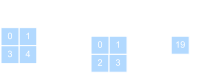{width="55%"}

:::: {.incremental}
- A small kernel slides across the input.
- At each location: multiply overlapping entries and sum.
- The output is a spatial map of detector responses.
- Add a bias and apply a non-linearity to get a convolutional activation map.
::::

:::: {.notes}
- Narrate one output value: align window, multiply, sum, move.
- Output is a response map: where did this detector fire?
- Example: bright-dot detector over a STEM image.
- Boundary question: what happens at image edges? This leads to padding.
- Transition: compute a simple filter by hand.
::::
## A hand-computable filter

A horizontal difference kernel

$$
K = \begin{bmatrix}1 & -1\end{bmatrix}
$$

responds strongly where neighboring pixels change.

:::: {.columns}
:::: {.column width="50%"}
If a row is constant:

$$
[1,1,1,1] \star [1,-1] = [0,0,0].
$$
::::
:::: {.column width="50%"}
If a row has an edge:

$$
[1,1,0,0] \star [1,-1] = [0,1,0].
$$
::::
::::

:::: {.fragment}
Learned CNN filters generalize this idea: they discover useful local detectors instead of receiving them by hand.
::::

:::: {.notes}
- Constant row gives zero response: no edge.
- Step row gives nonzero response: edge detected.
- Opposite edge would need flipped sign.
- This is hand-designed; CNNs learn such filters from labels.
- Transition: each learned filter creates a feature map.
::::
## Feature maps

:::: {.incremental}
- A **kernel** is a learned local detector.
- A **feature map** is the detector response at all spatial positions.
- Multiple kernels produce multiple feature maps.
- Stacking feature maps gives a tensor representation with shape
$$
C_{out}\times H_{out}\times W_{out}.
$$
- In microscopy, feature maps may respond to edges, atomic columns, defects, texture, or phase boundaries.
::::

:::: {.notes}
- Kernel: local detector.
- Feature map: detector response over all positions.
- Channel: one feature map in a stack.
- Examples: edge map, pore map, grain-boundary map, lattice-defect response.
- Transition: how much input can one activation see?
::::
## Receptive fields

:::: {.columns}
:::: {.column width="50%"}
The **receptive field** of an output activation is the input region that can influence it.

- One $3\times3$ convolution: local $3\times3$ view.
- Two stacked $3\times3$ convolutions: effective $5\times5$ view.
- Three stacked $3\times3$ convolutions: effective $7\times7$ view.
::::
:::: {.column width="50%"}
Why this matters:

- Deep CNNs grow context gradually.
- Small kernels keep parameters low.
- Non-linearities between kernels make the result richer than one large linear filter.
::::
::::

:::: {.notes}
- Sketch stacked 3x3 windows on the board.
- One 3x3 layer sees local pixels; stacked layers see wider context.
- Two 3x3 layers are not just one 5x5 layer because activation sits between them.
- Example: crack detection needs context beyond one edge pixel.
- Transition: hierarchy follows from growing receptive fields.
::::
## Hierarchy of learned features

:::: {.incremental}
- Layer 1: simple contrasts, edges, gradients, local textures.
- Layer 2: motifs such as corners, grains, pores, peaks, local lattice distortions.
- Layer 3+: object parts or material structures such as defects, precipitates, cracks, phase clusters.
- This is why CNNs match spatial scientific data: the architecture mirrors the structure of the signal [@ryan2021machine].
::::


<!-- ===== §5. Tensor mechanics ===== -->

:::: {.notes}
- Early: gradients, edges, bright spots.
- Middle: grain boundaries, pores, precipitates, local lattice motifs.
- Late: crack, phase cluster, defect-rich region, damage state.
- Not guaranteed: feature maps can be hard to interpret.
- Transition: these features live in channel tensors.
::::
## Multiple channels

Real image-like inputs are not just matrices:

$$
X \in \mathbb{R}^{C_{in}\times H\times W}.
$$

A convolutional layer with $C_{out}$ output channels uses kernels

$$
K \in \mathbb{R}^{C_{out}\times C_{in}\times k_h\times k_w}.
$$

The output is

$$
H \in \mathbb{R}^{C_{out}\times H_{out}\times W_{out}}.
$$

:::: {.fragment}
For electron microscopy or spectroscopy, channels might be RGB-like channels, detector channels, energy windows, tilt slices, or learned feature channels.
::::

:::: {.notes}
- Input channels can be RGB, energy windows, detector segments, tilt slices, or time frames.
- Output channels are learned feature maps.
- Kernel shape couples every input channel to every output channel.
- Example: EELS spectral image has spatial axes plus energy channels.
- Transition: write the multi-channel formula.
::::
## Multi-channel convolution formula

For output channel $d$:

$$
H_{d,i,j}
= b_d + \sum_{c=1}^{C_{in}}\sum_a\sum_b
K_{d,c,a,b}X_{c,i+a,j+b}.
$$

:::: {.incremental}
- Sum over spatial kernel offsets $(a,b)$.
- Sum over input channels $c$.
- Repeat for every output channel $d$.
- Each output channel learns a different mixture of local spatial patterns and input channels.
::::

:::: {.notes}
- For each output channel d and position i,j, sum over channels and local offsets.
- Spatial mixing and channel mixing happen together.
- Bias: one per output channel.
- Example: combine bright-field and dark-field channels into one defect detector.
- Transition: compute output shapes.
::::
## Shape checklist

For input $C_{in}\times H\times W$, kernel $C_{out}\times C_{in}\times k_h\times k_w$, padding $p_h,p_w$, and stride $s_h,s_w$:

$$
H_{out} = \left\lfloor\frac{H + 2p_h - k_h}{s_h}\right\rfloor + 1,
\qquad
W_{out} = \left\lfloor\frac{W + 2p_w - k_w}{s_w}\right\rfloor + 1.
$$

:::: {.fragment}
Parameter count is $C_{out}(C_{in}k_hk_w + 1)$ including biases.
::::

:::: {.notes}
- Active check: plug in H=64, k=3, p=1, s=1 gives H_out=64.
- Stride s=2 roughly halves size.
- Parameter count depends on channels and kernel size, not H and W.
- Common mistake: forgetting the input-channel factor in parameters.
- Transition: padding controls borders and size.
::::
## Padding

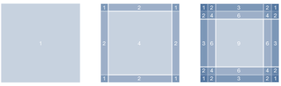{width="52%"}

:::: {.incremental}
- Without padding, borders are used less often and spatial dimensions shrink.
- Zero padding adds a frame around the image.
- With odd kernel size $k$ and padding $p=(k-1)/2$, stride 1 preserves height and width.
- Padding is a design choice: it changes boundary assumptions.
::::

:::: {.notes}
- Without padding, output shrinks and border pixels are underused.
- Same-padding example: 3x3 kernel, p=1, stride 1 keeps H and W.
- Physical caveat: zero outside the image is an assumption.
- Segmentation often needs preserved resolution.
- Transition: stride intentionally reduces resolution.
::::
## Stride

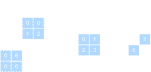{width="38%"}

:::: {.incremental}
- Stride controls how far the kernel moves between evaluations.
- Larger stride reduces spatial resolution.
- Strided convolutions can replace or complement pooling.
- Downsampling increases the effective receptive field of later layers.
::::

:::: {.notes}
- Stride means skipping positions while sliding.
- Benefit: lower resolution, less compute, larger effective context later.
- Cost: lost localization detail.
- Example: classification can downsample aggressively; segmentation cannot do it too early.
- Transition: pooling also aggregates local responses.
::::
## Pooling

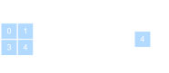{width="38%"}

:::: {.incremental}
- Pooling has no learned weights.
- Max pooling keeps the strongest local response.
- Average pooling smooths local neighborhoods.
- Pooling reduces resolution and makes the representation less sensitive to small shifts.
- Modern CNNs often use strided convolution or global average pooling instead of many pooling layers.
::::

:::: {.notes}
- No learned parameters.
- Max pooling: asks whether a feature appears in a local window.
- Average pooling: summarizes evidence.
- Example: small pore shifted by one pixel still activates nearby max pool.
- Transition: 1x1 convolution mixes channels without spatial mixing.
::::
## $1\times1$ convolution

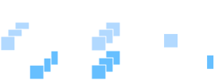{width="55%"}

A $1\times1$ convolution does not mix neighboring pixels. It mixes **channels at each location**:

$$
H_{d,i,j} = b_d + \sum_{c=1}^{C_{in}}K_{d,c,1,1}X_{c,i,j}.
$$

:::: {.fragment}
It is a small fully connected layer applied independently at every pixel. This is cheap channel mixing.
::::

:::: {.notes}
- A 1x1 convolution is a dense layer applied at each pixel location.
- It mixes channels, not neighboring pixels.
- Example: combine 64 local feature maps into 16 bottleneck channels.
- Used in NiN, bottlenecks, segmentation heads.
- Transition: convolution is still a structured linear map.
::::
## Convolution as a sparse matrix

:::: {.incremental}
- A convolution is still a linear map before the activation.
- If we flatten the input image, convolution can be written as multiplication by a large sparse matrix.
- Locality creates zeros in most matrix entries.
- Weight sharing ties many nonzero entries to the same parameter.
- This view connects CNNs back to the linear algebra of Unit 3 while explaining why CNNs are far more parameter efficient.
::::


<!-- ===== §6. Architecture motifs ===== -->

:::: {.notes}
- Flatten image: convolution becomes one big linear matrix.
- Locality gives many zeros.
- Weight sharing ties many entries to the same parameter.
- Example: same 3x3 edge weights repeated at every image location.
- Transition: architectures build reusable blocks from these operators.
::::
## From layers to blocks

:::: {.incremental}
- Early neural networks were described layer by layer.
- Modern CNNs are built from repeated **blocks**.
- A block packages a local design pattern: convolution, activation, normalization, pooling, skip connection, or channel mixing.
- Blocks make networks deeper while keeping the design understandable.
::::

:::: {.notes}
- Blocks are reusable architecture patterns.
- Example block: conv -> activation -> pooling.
- Benefit: reason about deep networks at module level.
- Like engineering modules: easier to scale and debug.
- Transition: LeNet is the classic CNN block pattern.
::::
## LeNet: the classical CNN template

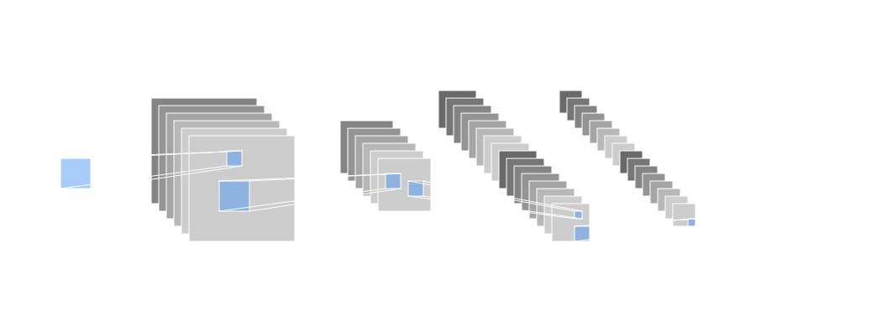{width="70%" style="background: white"}

:::: {.incremental}
- Alternates convolutional feature extraction and spatial downsampling.
- Ends with dense layers for classification.
- Still captures the basic CNN recipe: local filters, feature maps, pooling, classifier head.
::::

:::: {.notes}
- Basic grammar: convolution, nonlinearity, downsampling, classifier.
- Feature extractor first, decision head last.
- Historical example: digit recognition.
- Modern relevance: same structure appears in scientific image classifiers.
- Transition: VGG repeats small convolution blocks deeply.
::::
## VGG: deep networks from repeated blocks

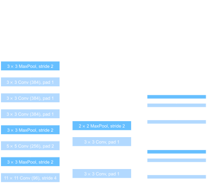{width="45%" style="background: white"}

:::: {.columns}
:::: {.column width="50%"}
**VGG block idea:**

- Use repeated $3\times3$ convolutions.
- Keep spatial size with padding.
- Downsample after several convolutions.
::::
:::: {.column width="50%"}
**Why it matters:**

- Two $3\times3$ layers see roughly a $5\times5$ receptive field.
- Three see roughly $7\times7$.
- Non-linearities between small filters beat one large linear filter.
::::
::::

:::: {.notes}
- VGG lesson: stack small 3x3 kernels.
- Two 3x3 layers see about 5x5 context with an activation between them.
- More nonlinearities, fewer parameters than one large dense patch.
- Example: build texture motifs from repeated local filters.
- Transition: NiN focuses on channel mixing.
::::
## Network in Network: channel mixing

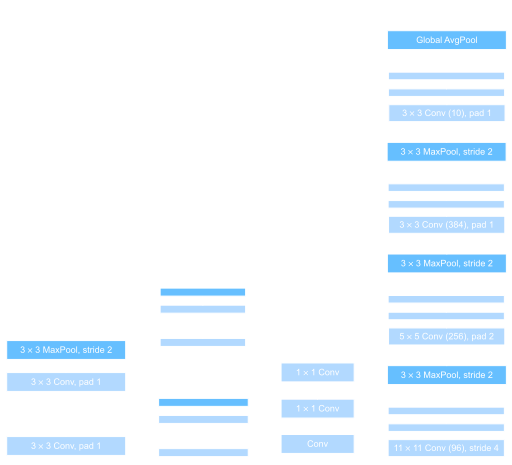{width="55%" style="background: grey"}

:::: {.incremental}
- NiN replaces large dense classifier heads with local channel mixing.
- $1\times1$ convolutions act like per-pixel MLPs.
- Global average pooling converts feature maps into class scores.
- This reduces parameters and strengthens the connection between feature maps and predictions.
::::

:::: {.notes}
- NiN idea: small per-pixel MLP using 1x1 convolutions.
- Replaces heavy dense classifier heads.
- Global average pooling links feature maps to classes.
- Example: one feature map responds to pores, average response supports pore-present class.
- Transition: DenseNet focuses on feature reuse.
::::
## DenseNet: feature reuse

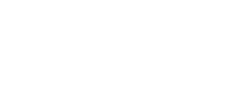{width="55%" style="background: grey"}

:::: {.incremental}
- Each layer receives earlier feature maps as additional input.
- Instead of adding features, DenseNet concatenates them.
- This encourages feature reuse and improves gradient flow.
- The broader motif is more important than the specific architecture: deep networks need paths that let information and gradients move easily.
::::

:::: {.notes}
- DenseNet concatenates earlier features into later layers.
- Motivation: preserve useful low-level information and improve gradient flow.
- Do not memorize DenseNet; remember feature reuse.
- Contrast: ResNet adds; DenseNet concatenates.
- Transition: dense blocks need transitions to control size.
::::
## Dense blocks and transitions

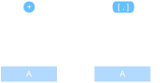{width="60%" style="background: grey"}

:::: {.columns}
:::: {.column width="50%"}
**Dense block:**

- Preserve earlier features.
- Add new feature channels at each layer.
- Concatenate along the channel axis.
::::
:::: {.column width="50%"}
**Transition layer:**

- Mix channels with $1\times1$ convolution.
- Downsample spatially.
- Keep the total computation bounded.
::::
::::

:::: {.notes}
- Inside dense block: channels grow by concatenation.
- Transition layer compresses channels and downsamples.
- Ask: concatenation happens along which axis? Channel axis.
- Example: keep edge features while adding pore/texture features.
- Transition: U-Net reuses features across encoder and decoder.
::::
## U-Net: encoder-decoder for dense prediction

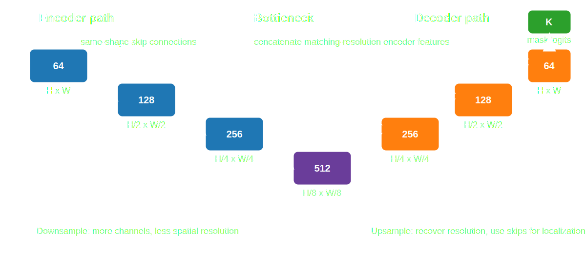{width="78%"}

:::: {.columns}
:::: {.column width="50%"}
**Classification head:**

Many CNNs compress the image to one prediction:

$$
C\times H\times W \rightarrow K.
$$

Good for labels like "phase present" or "defect class".
::::
:::: {.column width="50%"}
**Segmentation head:**

U-Net-like models predict at every location:

$$
C\times H\times W \rightarrow K\times H\times W.
$$

Good for masks, defect maps, and pixel-level structure labels.
::::
::::

:::: {.notes}
- Classification: one label per image.
- Segmentation: one label per pixel.
- U-Net: downsample for context, upsample for resolution.
- Skips connect same-resolution tensors, e.g. H/2 to H/2.
- Example: defect mask or phase boundary segmentation.
::::
## U-Net motif

:::: {.columns}
:::: {.column width="50%"}
**Encoder path**

- Convolutions extract features.
- Downsampling increases context.
- Channels usually increase as resolution decreases.
::::
:::: {.column width="50%"}
**Decoder path**

- Upsampling restores resolution.
- Skip connections bring back fine spatial details.
- Final layer predicts a map, not a single label.
::::
::::

:::: {.fragment}
The main lesson: architecture follows the task. Classification can discard spatial detail; segmentation must preserve and recover it.
::::

:::: {.notes}
- Encoder builds context: what structure is present?
- Decoder restores location: where is it?
- Skip connections bring fine detail back after downsampling.
- Examples: pore mask, crack map, grain-boundary segmentation.
- Transition: summarize motifs as design tools.
::::
## Architecture motif checklist

| Motif | Main purpose | Typical place |
|---|---|---|
| $3\times3$ convolution | local spatial feature extraction | most CNN blocks |
| ReLU/GeLU | non-linear feature composition | after linear/convolutional maps |
| Padding | preserve spatial size | before/inside convolution |
| Stride/pooling | downsample and grow context | between stages |
| $1\times1$ convolution | channel mixing, bottlenecks | within blocks |
| Skip/concat connections | information and gradient flow | deep networks |
| Global average pooling | map feature maps to labels | classifier head |
| Upsampling + skips | dense spatial prediction | segmentation heads |


<!-- ===== §7. Materials and scientific signals ===== -->

:::: {.notes}
- Use table as recap, not as memorization.
- Ask: what does each motif buy us?
- Example removal: no skip connections in U-Net gives blurry boundaries.
- Example removal: no padding shrinks maps and complicates alignment.
- Transition: apply motifs to materials signals.
::::
## Why CNNs fit microscopy and materials data

:::: {.incremental}
- Local neighborhoods carry physical meaning: atomic columns, grains, defects, interfaces, pores.
- Similar motifs appear at different spatial locations.
- Multi-channel measurements are common: energy channels, detector geometry, polarization, tilt, time, or simulated fields.
- The relevant features are often hierarchical: local contrast -> motif -> structure -> property.
- CNNs encode this hierarchy more naturally than dense MLPs.
::::

TODO example images here

:::: {.notes}
- Local example: atomic column neighborhood, grain boundary, pore edge.
- Repeated motif example: similar precipitates appear anywhere in a micrograph.
- Multi-channel example: EELS energy windows or detector segments.
- Hierarchy example: contrast -> boundary -> grain network -> property.
- Transition: choose heads by task.
::::
## Example architecture choices

:::: {.columns}
:::: {.column width="33%"}
**Micrograph classification**

- Input: SEM or TEM image.
- Use: convolutional encoder.
- Head: global pooling + class logits.
- Goal: one label per image.
::::
:::: {.column width="33%"}
**Defect segmentation**

- Input: image or spectral image.
- Use: U-Net-like encoder-decoder.
- Head: per-pixel logits.
- Goal: mask or defect probability map.
::::
:::: {.column width="33%"}
**Spectral-spatial regression**

- Input: channels over space.
- Use: CNN backbone plus regression head.
- Head: linear or physically constrained output.
- Goal: local property or global scalar.
::::
::::

:::: {.notes}
- Classification example: micrograph -> phase-present label.
- Segmentation example: SEM image -> crack mask.
- Regression example: spectral-spatial map -> local composition or thickness.
- Same backbone can support different heads.
- Ask: which examples need spatial detail at output?
::::
## What CNNs do not solve by themselves

:::: {.incremental}
- They do not remove the need for good training data.
- They do not decide the correct loss function.
- They do not guarantee optimization will succeed.
- They do not automatically generalize across microscopes, domains, or sample preparation protocols.
- They do not replace physical reasoning; they encode useful priors into a learnable model.
::::


<!-- ===== §8. Wrap-up ===== -->

:::: {.notes}
- Bad labels still give bad models.
- Domain shift example: train on one microscope, test on another.
- Loss example: class imbalance hides rare defects.
- Physics example: output may violate conservation or positivity constraints.
- Transition: use checklist before choosing architecture.
::::
## CNN design checklist

- [ ] What is the input tensor shape: channels, height, width?
- [ ] Which symmetries or approximate symmetries should the architecture exploit?
- [ ] How large should early kernels be?
- [ ] How quickly should spatial resolution decrease?
- [ ] How large must the final receptive field be?
- [ ] Where do channels need to mix?
- [ ] Does the task need a global prediction or a dense spatial prediction?
- [ ] Does the output activation match the target range and loss?

:::: {.notes}
- Run checklist on example: SEM crack segmentation.
- Input shape: 1 x H x W or multi-channel detector image.
- Need dense output, so preserve or recover resolution.
- Need receptive field large enough for full crack context.
- Output activation: sigmoid for binary mask.
::::
## Summary: the architectural decisions of a CNN

| Decision | Driver | Consequence |
|---|---|---|
| Kernel size | local pattern scale | parameters and receptive field |
| Channel count | feature diversity | capacity and compute |
| Padding | boundary assumptions | output size and border behavior |
| Stride/pooling | downsampling rate | resolution vs context |
| Depth | hierarchy level | abstraction and trainability |
| Skip connections | information flow | easier deep optimization |
| Head type | task structure | classification, regression, segmentation |

:::: {.notes}
- Kernel size: local pattern scale.
- Channels: number of learned detectors.
- Stride/pooling: context vs resolution trade-off.
- Skip connections: preserve information and gradients.
- Transition: next units train and regularize these choices.
::::
## Forward links

:::: {.incremental}
- **Self-study supplement** (this folder, `02_backprop_self_study.qmd`): backpropagation and gradient flow through the layers defined today.
- **Unit 5**: clustering and autoencoders — the first unsupervised representation-learning unit.
- **Unit 6**: optimization for deep nets, including momentum, Adam, normalization, and learning-rate schedules.
- **Unit 8**: generalization, regularization, and why parameter count alone does not predict test error.
- **Later ML-PC / applied units**: CNNs in materials characterization, attention, Transformers, and domain-specific architectures.
::::

:::: {.notes}
- Today: define forward computations and architecture priors.
- Self-study supplement (`02_backprop_self_study.qmd`): gradients through these computations.
- Unit 6: optimizers and normalization.
- Unit 8: generalization and regularization.
- Transition: quiz checks readiness.
::::
## End-of-unit quiz

1. Why does a dense layer become parameter-inefficient for a megapixel image?
2. Derive the convolution formula from locality and shared weights.
3. What is the difference between translation equivariance and translation invariance?
4. For input shape $3\times64\times64$, kernel shape $16\times3\times5\times5$, padding $2$, and stride $1$, what is the output shape and parameter count?
5. Why do two stacked $3\times3$ convolutions differ from one $5\times5$ convolution?
6. Which architecture head would you choose for image classification vs defect segmentation, and why?

:::: {.notes}
- Prioritize Q2, Q4, Q6 if time is short.
- Q2: tests convolution derivation.
- Q4: output shape is 16 x 64 x 64; parameters are 16*(3*5*5 + 1) = 1216.
- Q5: two 3x3 layers add nonlinearity between local filters.
- Q6: classification uses global head; segmentation uses U-Net-like dense head.
::::
<!-- BEGIN prev-next -->

## Continue

- &larr; Previous: [Unit 03 &mdash; Regression as Loss Minimization](../03_regression_as_loss_minimization/01_intro.html)
- &rarr; Next: [Unit 05 &mdash; Clustering & Autoencoders](../05_clustering_and_autoencoders/01_intro.html)
- [All courses](../../index.html)

<!-- END prev-next -->

## Notebook companion + references

:::: {.callout-note icon=false .fragment}
### Week 4 notebook: First `nn.Module` Classifier — IrisDataset
- [Open rendered notebook →](https://eclipse-lab.github.io/Ai4MatLectures/notebooks/MFML/week04_classifier_iris.html)
- [](https://colab.research.google.com/github/ECLIPSE-Lab/Ai4MatLectures/blob/main/notebooks/MFML/week04_classifier_iris.ipynb)

This companion remains useful for the minimal MLP foundation: it builds a two-layer network from affine maps and activations. The lecture has shifted toward CNN architecture foundations; CNN training details follow in later applied units.
::::

**Backpropagation is a self-study supplement this term.** See `02_backprop_self_study.qmd` in this unit folder, plus Sandfeld ch. 18.3-18.4 and the two example notebooks (`18.3_Backpropagation...`, `18.5_Python_Implementation...`). A short chain-rule warm-up is included on the next exercise sheet so the self-study has teeth. Use `loss.backward()` in PyTorch in the meantime — autograd handles it.

**Reading for next time.** **Unit 5 turns from supervised to unsupervised learning**: K-means and Gaussian mixtures for clustering, then autoencoders as the neural-network counterpart. Skim Neuer Ch. 5 and McClarren Ch. 4 + Ch. 8 before lecture.

## Learning outcomes

By the end of this unit, students can:

:::: {.incremental}
- **Write** the forward pass of a dense layer and explain why non-linear activations are required.
- **Estimate** why fully connected layers become impractical for image-like data.
- **Derive** a convolutional layer as a dense layer constrained by locality and shared weights.
- **Track** tensor shapes through kernels, channels, padding, stride, and pooling.
- **Explain** feature maps, receptive fields, and hierarchical feature learning.
- **Recognize** common CNN design motifs: blocks, $1\times1$ convolutions, skip/feature-reuse connections, and encoder-decoders.
::::

:::: {.notes}
- Stress the core skill: architectural reasoning, not coding.
- Students should track: operation, tensor shape, and built-in assumption.
- Example target skill: explain why a 3x3 CNN layer is better than a dense layer for SEM images.
- Ask: what does a layer assume about the data?
- Transition: start from fixed features in Unit 3.
::::

:::: {#refs}
::::

:::: {.notes}
- Notebook is MLP-focused; use it for affine maps, activations, and modules.
- CNN training details come later in applied units.
- Reading prepares for backprop through the same forward graphs.
- Closing line: architectures define feature spaces; training fills in the parameters.
- Remind students to review tensor shapes before tackling the backprop self-study and Unit 5.
::::
