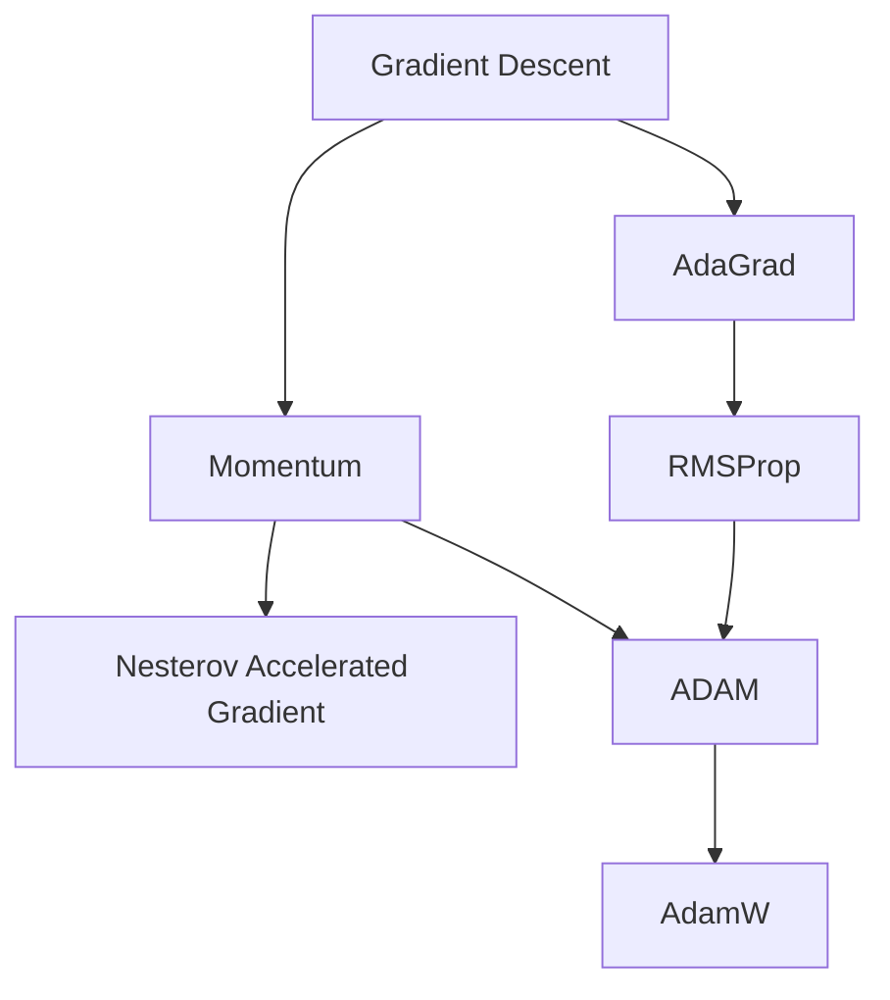
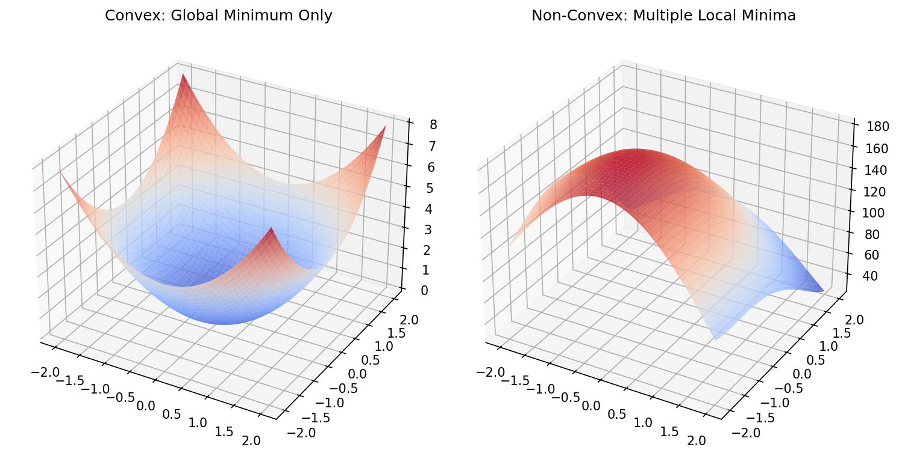

## 01. Title + Unit 6 positioning

::: {.fragment}
- Unit 5 introduced backpropagation and gradient computation.
- Unit 6 asks: **what does the surface look like** that we are descending on?
- Understanding landscape geometry is essential for choosing optimizers and diagnosing training failures.
:::

## 02. Recap: gradient descent as parameter update

::: {.fragment}
- Core update rule: $\boldsymbol{\theta}^{(t+1)} = \boldsymbol{\theta}^{(t)} - \eta \mathbf{g}^{(t)}$
- The learning rate $\eta$ controls step size.
- Convergence depends on landscape properties — not just the gradient direction [@mcclarren2021machine].
:::

## 03. Learning outcomes for Unit 6

By the end of this lecture, students can:

::: {.fragment}
- interpret the Hessian matrix $\mathbf{H}$ and its eigenvalues as curvature descriptors,
- explain why saddle points dominate over local minima in high dimensions,
- compare momentum, AdaGrad, RMSProp, and ADAM mechanistically,
- relate flat vs sharp minima to generalization performance.
:::

## 04. The loss landscape metaphor

::: {.fragment}
- The cost function $J(\boldsymbol{\theta})$ defines a surface over the parameter space $\mathbb{R}^p$.
- Peaks, valleys, saddle points, and plateaus characterize this topography.
- Training is a trajectory on this surface, guided by gradient information.
:::

## 05. Visualizing 1D and 2D loss surfaces

::: {.fragment}
- In 1D: loss curve with clear minima and maxima.
- In 2D: contour plots reveal elongated valleys and saddle structures.
- Real networks live in $\mathbb{R}^{10^6}$ or higher — visualization is always a projection [@goodfellow2016deep].
:::

## 06. Critical points: gradient equals zero

::: {.fragment}
- A critical point satisfies $\mathbf{g} = \mathbf{0}$.
- Classification requires second-order information: the **Hessian matrix** $\mathbf{H}$.
- Minimum, maximum, or saddle point depends on the sign pattern of $\mathbf{H}$ eigenvalues.
:::

## 07. The Hessian matrix: definition

::: {.fragment}
- The Hessian $\mathbf{H}$ is the matrix of second-order partial derivatives:

$$
H_{ij} = \frac{\partial^2 J}{\partial \theta_i \partial \theta_j}
$$
:::

::: {.fragment}
- $\mathbf{H}$ is symmetric for smooth loss functions (Schwarz's theorem).
- Its eigenvalues and eigenvectors encode curvature magnitude and direction.
:::

## 08. Eigenvalues of the Hessian

::: {.fragment}
- **Large eigenvalue**: the loss changes rapidly along the corresponding eigenvector direction (steep curvature).
- **Small eigenvalue**: the loss is nearly flat along that direction.
- **Negative eigenvalue**: the critical point is a saddle point along that direction.
:::

## 09. Conditioning and the condition number

::: {.columns}
::: {.column width="50%"}
### Mathematical Definition

::: {.fragment}
- The condition number is defined as $\kappa(\mathbf{H}) = \lambda_{\max} / \lambda_{\min}$.
- $\kappa \approx 1$: well-conditioned, isotropic curvature.
- $\kappa \gg 1$: ill-conditioned curvature.
:::
:::

::: {.column width="50%"}
### Geometric Intuition

::: {.fragment}
- **Well-conditioned**: Level sets are nearly circular.
- **Ill-conditioned**: Level sets are elongated ellipses.
- Gradient descent oscillates in steep directions and crawls in flat ones.
:::
:::
:::

## 10. Geometric interpretation: elliptical contours

::: {.fragment}
- Well-conditioned: circular level sets — equal progress in all directions.
- Ill-conditioned: elongated ellipses — the optimal step size differs drastically by direction.
- Standard gradient descent cannot adapt to direction-dependent curvature.
:::

## 11. Why local minima are rare in high dimensions

::: {.fragment}
- For a critical point to be a local minimum, **all** $\mathbf{H}$ eigenvalues must be positive.
- With $p$ parameters, each eigenvalue is independently likely to be positive or negative.
- The probability of all-positive eigenvalues decreases exponentially with $p$ [@goodfellow2016deep].
:::

## 12. Saddle points dominate the landscape

::: {.fragment}
- In high dimensions, most critical points are saddle points, not minima.
- Random matrix theory predicts: the fraction of negative eigenvalues concentrates near 0.5 at high-loss critical points.
- Low-loss critical points tend to have mostly positive eigenvalues — the "good" minima region.
:::

## 13. Saddle point dynamics under gradient descent

::: {.fragment}
- Near a saddle point, the gradient $\mathbf{g}$ is small in all directions — training slows dramatically.
- Escape is possible along negative-curvature directions, but can take many iterations.
- Gradient noise from mini-batches can help escape saddle points faster.
:::

## 14. Plateaus and vanishing gradients

::: {.fragment}
- Plateaus are extended flat regions where $\|\mathbf{g}\| \approx 0$.
- Common with saturating activation functions (sigmoid, tanh) in deep networks.
- Training appears stuck — but the model has not converged to a useful solution.
:::

## 15. Loss surface of linear networks

::: {.fragment}
- Even linear networks $f = W_L \cdots W_1 x$ have non-convex loss landscapes.
- Saddle points arise from the product structure of weight matrices.
- Analytical tractability makes them a useful theoretical testbed.
:::

## 16. Empirical observations: loss surfaces of deep networks

::: {.fragment}
- Many local minima exist, but they tend to have **similar loss values**.
- The loss at local minima decreases as network width increases.
- Sharp minima coexist with flat minima — optimizer choice determines which is found [@goodfellow2016deep].
:::

## 17. Role of overparameterization

::: {.fragment}
- Networks with more parameters than training samples create degenerate solution manifolds.
- Connected low-loss valleys allow smooth interpolation between solutions.
- Overparameterization paradoxically **helps** optimization by removing barriers.
:::

## 18. Symmetry and mode connectivity

- Permuting hidden units produces an equivalent network with identical loss.
- This creates combinatorially many equivalent minima in weight space.
- Recent work shows that minima found by different training runs can be connected by low-loss paths.

## 19. Landscape pathologies summary

- **Ill-conditioning**: oscillation + slow convergence; diagnosed by large $\kappa(\mathbf{H})$.
- **Saddle points**: near-zero gradient $\mathbf{g}$ in all directions; escape requires curvature exploitation.
- **Plateaus**: extended flat regions; caused by saturating activations.
- **Sharp minima**: low training loss but poor generalization; sensitive to perturbation.

## 20. Checkpoint: identify the pathology

- Scenario A: training loss oscillates wildly but does not decrease — **ill-conditioning + learning rate too large**.
- Scenario B: training loss flatlines at a high value — **saddle point or plateau**.
- Scenario C: training loss is very low but test loss is high — **sharp minimum / overfitting**.

## 21. Vanilla GD on ill-conditioned surface

- On an elongated bowl, GD zig-zags across the narrow direction.
- Progress along the long axis is extremely slow.
- The optimal learning rate is limited by the steepest direction: $\eta < 2/\lambda_{\max}$.

## 22. Momentum: physics analogy

- Think of the parameter vector $\boldsymbol{\theta}$ as a ball rolling on the loss surface.
- The ball accumulates **velocity** $\mathbf{v}$ in directions of consistent gradient.
- Oscillations in steep directions are damped because velocity averages out sign changes [@mcclarren2021machine].

## 23. Momentum update rule

- Velocity update: $\mathbf{v}^{(t+1)} = \alpha \mathbf{v}^{(t)} - \eta \mathbf{g}^{(t)}$
- Parameter update: $\boldsymbol{\theta}^{(t+1)} = \boldsymbol{\theta}^{(t)} + \mathbf{v}^{(t+1)}$
- Typical default: $\alpha = 0.9$; controls how much history is retained.

## 24. Momentum on the elongated bowl

- Oscillations across the narrow direction cancel in the velocity average.
- Net velocity builds up along the valley floor.
- Convergence is dramatically faster compared to vanilla GD.

## 25. Nesterov accelerated gradient

- Key idea: evaluate the gradient at the **look-ahead** position $\boldsymbol{\theta} + \alpha \mathbf{v}$.
- Provides a correction before committing to the full momentum step.
- Achieves provably better convergence rate $O(1/t^2)$ vs $O(1/t)$ for convex problems.

## 26. Momentum vs Nesterov: comparison

- Both reduce oscillations and accelerate convergence on ill-conditioned surfaces.
- Nesterov tends to overshoot less because of the look-ahead correction.
- In practice, the difference is modest for deep learning; both are widely used.

## 27. Learning rate as the most critical hyperparameter

- The learning rate $\eta$ governs the fundamental speed–stability tradeoff.
- Too large: divergence or chaotic oscillation.
- Too small: convergence to nearest minimum, which may be suboptimal [@neuer2024machine].

## 28. Learning rate sensitivity demonstration

- Same model, same data, three learning rates: training curves diverge dramatically.
- Optimal $\eta$ depends on curvature, batch size, and model architecture.
- This motivates **adaptive** methods that remove the need for manual tuning.

## 29. Why a single global learning rate is insufficient

- Different parameters experience different curvatures (different $\mathbf{H}$ eigenvalues).
- A single $\eta$ forces a compromise: too fast for some directions, too slow for others.
- Per-parameter adaptation is the natural solution.

## 30. Recap: what momentum solves and what it does not

- Momentum accelerates convergence along consistent gradient directions.
- It does **not** adapt the learning rate per parameter.
- Ill-conditioned landscapes still require direction-dependent step sizes.

## 31. Per-parameter learning rates: the core idea

- Scale each parameter's update by the inverse of its historical gradient magnitude.
- Parameters with large gradients get smaller effective learning rates.
- Parameters with small gradients get larger effective learning rates.

## 32. AdaGrad: accumulate squared gradients

- Accumulator: $\mathbf{G}_t = \mathbf{G}_{t-1} + \mathbf{g}_t^2$ (element-wise).
- Update: $\boldsymbol{\theta}_{t+1} = \boldsymbol{\theta}_t - \frac{\eta}{\sqrt{\mathbf{G}_t} + \epsilon} \mathbf{g}_t$
- Naturally adapts to sparse features — infrequent features get larger updates [@neuer2024machine].

## 33. AdaGrad: strengths and weaknesses

- **Strength**: excellent for sparse gradient problems (NLP, recommender systems).
- **Weakness**: $\mathbf{G}_t$ only grows, so effective learning rate monotonically decreases.
- Eventually, the learning rate becomes too small and training stops prematurely.

## 34. RMSProp: exponential moving average fix

- Replace the sum with a decaying average: $E[\mathbf{g}^2]_t = \gamma E[\mathbf{g}^2]_{t-1} + (1-\gamma)\mathbf{g}_t^2$.
- Prevents the aggressive accumulation that kills AdaGrad.
- Proposed by Hinton in a Coursera lecture — never formally published but universally used.

## 35. RMSProp update rule

- Update: $\boldsymbol{\theta}_{t+1} = \boldsymbol{\theta}_t - \frac{\eta}{\sqrt{E[\mathbf{g}^2]_t} + \epsilon} \mathbf{g}_t$
- Typical default: $\gamma = 0.9$, $\epsilon = 10^{-8}$.
- Effective learning rate adapts to recent curvature, not all-time history.

## 36. ADAM: combining momentum + adaptive scales

- **First moment** (mean of gradients): $\mathbf{m}_t = \beta_1 \mathbf{m}_{t-1} + (1-\beta_1)\mathbf{g}_t$
- **Second moment** (mean of squared gradients): $\mathbf{v}_t = \beta_2 \mathbf{v}_{t-1} + (1-\beta_2)\mathbf{g}_t^2$
- ADAM combines directional memory (momentum) with magnitude adaptation (RMSProp) [@neuer2024machine].

## 37. ADAM update rule (full derivation)

::: {.fragment}
- Bias correction: $\hat{\mathbf{m}}_t = \frac{\mathbf{m}_t}{1-\beta_1^t}, \quad \hat{\mathbf{v}}_t = \frac{\mathbf{v}_t}{1-\beta_2^t}$
:::

::: {.fragment}
- Parameter update:

$$
\boldsymbol{\theta}_{t+1} = \boldsymbol{\theta}_t - \frac{\eta}{\sqrt{\hat{\mathbf{v}}_t} + \epsilon}\,\hat{\mathbf{m}}_t
$$
:::

::: {.fragment}
- Defaults: $\beta_1=0.9$, $\beta_2=0.999$, $\epsilon=10^{-8}$, $\eta=10^{-3}$.
:::

## 38. ADAM as landscape normalizer

- ADAM effectively rescales coordinates to equalize curvature across parameter directions.
- In well-conditioned subspace: ADAM behaves like momentum SGD.
- In ill-conditioned subspace: ADAM compensates by scaling down steep directions and scaling up flat ones.

## 39. ADAM variants: AdamW, AMSGrad

- **AdamW**: decouples weight decay from the adaptive gradient scaling — better regularization behavior.
- **AMSGrad**: ensures the second moment estimate never decreases — addresses rare convergence failures.
- AdamW is now the recommended default in most deep learning frameworks.

## 40. Optimizer comparison on benchmark surfaces

- **SGD**: slow on ill-conditioned surfaces, but can find flatter minima.
- **SGD + momentum**: faster convergence, reduced oscillation.
- **ADAM**: fast initial progress, robust to hyperparameter choices, but may converge to sharper minima.

## 41. When ADAM is not enough

- ADAM can converge to sharper minima than SGD with momentum.
- Generalization gap: ADAM training loss is lower, but test loss can be higher.
- Recent practice: use ADAM for warm-up, switch to SGD + momentum for fine-tuning.

::: {.column width="100%"}
{width=80%}
:::

## 42. Practical optimizer selection guide

- **Default starting point**: AdamW with $\eta = 10^{-3}$ and default betas.
- **For best generalization**: SGD + momentum with tuned learning rate schedule.
- **For sparse or NLP tasks**: ADAM or AdaGrad variants.
- Always validate optimizer choice on a held-out set.

::: {.placeholder}
[INSERT: Selection flowchart or table tailored to materials science models (GNNs vs. simple MLPs).]
:::

## 43. Flat vs sharp minima

- A **flat minimum**: the loss remains low over a wide neighborhood of the solution.
- A **sharp minimum**: the loss increases rapidly with small parameter perturbations.
- Flatness can be quantified by the trace or top eigenvalues of the Hessian $\mathbf{H}$ at the minimum.

::: {.column width="100%"}
{width=80%}
:::

## 44. Connection to generalization

- Flat minima are less sensitive to the gap between training and test distributions.
- Sharp minima memorize training data specifics — poor transfer to unseen data.
- This connects landscape geometry to the bias-variance tradeoff of Unit 7 [@goodfellow2016deep].

## 45. Learning rate schedules

- **Step decay**: reduce $\eta$ by a factor at fixed epochs.
- **Exponential decay**: $\eta_t = \eta_0 \cdot \gamma^t$.
- **Cosine annealing**: $\eta_t = \frac{\eta_0}{2}(1 + \cos(\pi t / T))$ — smooth, widely used.
- **Warm-up**: start with small $\eta$, ramp up linearly, then decay.

## 46. Batch size and gradient noise

- Small batch size $\Rightarrow$ noisy gradient estimate $\Rightarrow$ implicit regularization.
- Large batch size $\Rightarrow$ accurate gradient $\Rightarrow$ faster per-step but may converge to sharper minima.
- Gradient noise helps escape saddle points and sharp minima [@mcclarren2021machine].

## 47. The learning rate–batch size relationship

- The **linear scaling rule**: when doubling batch size, double the learning rate.
- Effective learning rate: $\eta_{\text{eff}} = \eta / B$ where $B$ is batch size.
- This relationship breaks down at very large batch sizes — diminishing returns.

## 48. Exercise setup: optimizer comparison on 2D surfaces

- Implement vanilla GD, momentum, and ADAM in NumPy on a 2D quadratic.
- Visualize parameter trajectories overlaid on loss contours.
- Vary the condition number and observe how each optimizer responds.
- Experiment with learning rate schedules (constant vs cosine annealing).

## 49. Exam-aligned summary: 10 must-know statements

1. The $\mathbf{H}$ eigenvalues determine curvature magnitude in each direction.
2. The condition number $\kappa(\mathbf{H}) = \lambda_{\max}/\lambda_{\min}$ measures landscape difficulty.
3. Saddle points vastly outnumber local minima in high-dimensional spaces.
4. Momentum accumulates velocity $\mathbf{v}$ to dampen oscillations and accelerate convergence.
5. AdaGrad adapts per-parameter learning rates but decays too aggressively.
6. RMSProp uses exponential moving averages to fix AdaGrad's decay problem.
7. ADAM combines momentum with adaptive per-parameter scaling.
8. Flat minima correlate with better generalization; sharp minima tend to overfit.
9. Learning rate schedules (warm-up + decay) improve both convergence and final performance.
10. Smaller batch sizes provide implicit regularization through gradient noise.

## 50. References + reading assignment for next unit

- **Required reading before Unit 7:**
  - Neuer: Ch. 4.5.5 (optimization variants)
  - McClarren: Ch. 5.2.2 and Ch. 5.4 (regularization and dropout)
- **Optional depth:**
  - Goodfellow et al.: Ch. 8.1–8.5 (optimization for deep learning)
  - Bishop: Ch. 3.4 (Hessian and Laplace approximation)
- Next unit: Generalization, Bias-Variance Tradeoff, and Regularization.

::: {#refs}
:::
