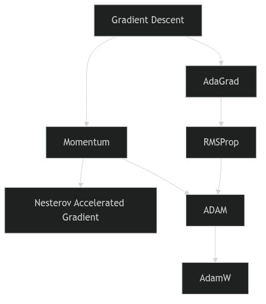
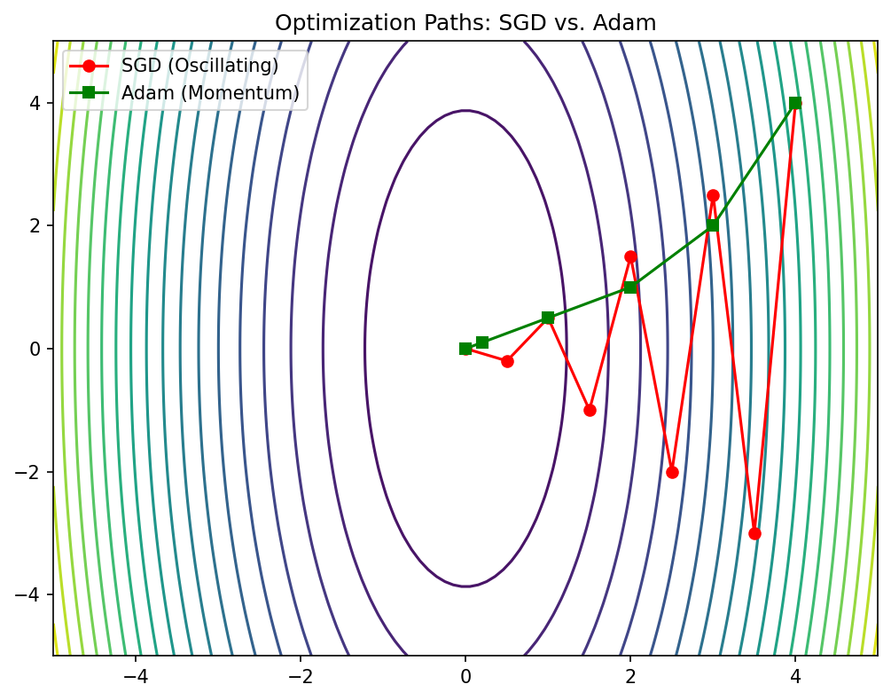

<!-- ===== §1. Framing ===== -->

 

## Recap: gradient descent as parameter update

:::: {.incremental}
- Core update rule: $\boldsymbol{\theta}^{(t+1)} = \boldsymbol{\theta}^{(t)} - \eta \mathbf{g}^{(t)}$
- The learning rate $\eta$ controls step size.
- Convergence depends on landscape properties — not just the gradient direction [@mcclarren2021machine].
::::

### Learning outcomes for Unit 6

By the end of this lecture, students can:

:::: {.incremental}
- interpret the Hessian matrix $\mathbf{H}$ and its eigenvalues as curvature descriptors,
- explain why saddle points dominate over local minima in high dimensions,
- compare momentum, AdaGrad, RMSProp, and ADAM mechanistically,
- relate flat vs sharp minima to generalization performance.
::::

:::: {.notes}
Pure recap — students saw $\boldsymbol{\theta}^{(t+1)} = \boldsymbol{\theta}^{(t)} - \eta\mathbf{g}^{(t)}$ in the optimization unit. Spend at most two minutes here. The one sentence that frames the entire unit: the gradient tells you only the *direction* of steepest descent at a point; it says nothing about how far to step or whether the terrain ahead is a ravine, a saddle, or a plateau. Everything in Unit 6 — Hessian, conditioning, momentum, adaptive methods — is about supplying the curvature information the bare gradient lacks.

Read the four learning outcomes aloud; they double as the exam blueprint. The Hessian-eigenvalue interpretation and the saddle-vs-minimum argument are the two heavy exam topics; the optimizer comparison is mechanistic recall; flat-vs-sharp is the conceptual bridge to Units 7/8. Tell them now that this unit answers "why does training behave the way it does," not "here is a new model."
::::

## The loss landscape metaphor

:::: {.columns}
:::: {.column width="55%"}
:::: {.incremental}
- The cost function $J(\boldsymbol{\theta})$ defines a surface over the parameter space $\mathbb{R}^p$.
- Peaks, valleys, saddle points, and plateaus characterize this topography.
- Training is a trajectory on this surface, guided by gradient information.
::::
::::

:::: {.column width="45%"}
![Error function as a surface over 2D weight space, showing local minimum $\mathbf{w}_A$, global minimum $\mathbf{w}_B$, and gradient vector $\nabla E$ at $\mathbf{w}_C$ [@bishop2006pattern].](images/bishop_error_surface_landscape.png){width=100%}
::::
::::

:::: {.notes}
The Bishop figure is the canonical mental image — draw it on the board if the slide is skimmed: a hilly terrain over $\mathbb{R}^p$, training is a marble rolling downhill, the gradient is the local slope. The point to stress is that this picture is *honest only in 2D*; the real surface lives in millions of dimensions and our entire geometric intuition (local minima everywhere, deep valleys) will be partly *wrong* there — foreshadow the saddle-point slides explicitly: "hold onto this picture, but I will break it in ten minutes."

One subtlety worth a sentence: $J(\boldsymbol{\theta})$ is the *empirical* loss surface; it changes every minibatch under SGD, so training is a noisy walk on a slightly different surface each step. The metaphor is a static landscape; reality is a flickering one — that noise turns out to be a feature (saddle escape, flat-minima bias), not just a nuisance.
::::


<!-- ===== §2. Visualizing 1D and 2D loss surfaces ===== -->

## Visualizing 1D and 2D loss surfaces

:::: {.columns}
:::: {.column width="55%"}
:::: {.incremental}
- In 1D: loss curve with clear minima and maxima.
- In 2D: contour plots reveal elongated valleys and saddle structures.
- Real networks live in $\mathbb{R}^{10^6}$ or higher — visualization is always a projection [@goodfellow2016deep].
::::
::::

:::: {.column width="45%"}
![Gradient descent on a 2D bowl, starting from (0,0) for 20 steps. Left: $\eta=0.1$ — slow convergence along the valley. Right: $\eta=0.6$ — oscillation and divergence [@murphy2012machine].](images/murphy_gd_learning_rate_effect.png){width=100%}
::::
::::

:::: {.notes}
The teaching contract to make explicit: from here on every surface picture in this deck is either a literal 1D/2D toy or a *projection* of the real thing — never the real surface. The Murphy bowl already shows the two failure modes that recur all unit: $\eta$ too small → crawl along the valley floor (left), $\eta$ too large → bounce across the narrow direction and diverge (right). Tell students to fix this image in memory; the elongated bowl is the running example for ill-conditioning, momentum, and Adam.

Quantitative anchor to plant now and cash in three slides later: for a quadratic with curvature $\lambda$ along a direction, GD is stable only if $\eta < 2/\lambda$. The narrow (steep) direction has the largest $\lambda$, so it caps the global $\eta$, while the flat direction with small $\lambda$ then crawls — that single inequality is the whole story of why one global step size cannot win on a stretched bowl.
::::

## Critical points: gradient equals zero

:::: {.incremental}
- A critical point satisfies $\mathbf{g} = \mathbf{0}$.
- Classification requires second-order information: the **Hessian matrix** $\mathbf{H}$.
- Minimum, maximum, or saddle point depends on the sign pattern of $\mathbf{H}$ eigenvalues.
::::

:::: {.notes}
This is the calculus bridge — students know the 1D second-derivative test; this generalizes it. State the logic cleanly: at a critical point the first-order term in the Taylor expansion vanishes, so $J(\boldsymbol{\theta}+\boldsymbol{\delta}) \approx J(\boldsymbol{\theta}) + \tfrac12\boldsymbol{\delta}^\top\mathbf{H}\boldsymbol{\delta}$ — the *Hessian alone* decides the local shape. Positive-definite → bowl (minimum), negative-definite → dome (maximum), mixed signs → saddle. There is no other case once $\mathbf{g}=\mathbf{0}$.

Caveat to flag: in practice the optimizer never reaches $\mathbf{g}$ *exactly* zero — under SGD it hovers near low-gradient regions. So "critical point" is an idealization; what matters operationally is *near-critical* regions where $\|\mathbf{g}\|$ is small and the Hessian sign pattern dictates whether training crawls (saddle/plateau) or has genuinely converged. This sets up the next three slides; keep it tight, ~3 minutes.
::::

## The Hessian matrix: definition

:::: {.incremental}
- The Hessian $\mathbf{H}$ is the matrix of second-order partial derivatives:

$$
H_{ij} = \frac{\partial^2 J}{\partial \theta_i \partial \theta_j}
$$
::::

:::: {.incremental}
- $\mathbf{H}$ is symmetric for smooth loss functions (Schwarz's theorem).
- Its eigenvalues and eigenvectors encode curvature magnitude and direction.
::::

:::: {.notes}
Symmetry is not a footnote — it is *why the whole eigen-story works*. Schwarz/Clairaut gives $H_{ij}=H_{ji}$, so $\mathbf{H}$ is real-symmetric, hence by the spectral theorem it has real eigenvalues and an orthonormal eigenbasis. That orthonormal basis is exactly what lets us say "curvature decomposes into independent 1D parabolas along orthogonal directions" — the mental model the next slide and all of conditioning depend on. Without symmetry there is no clean diagonalization and no $\lambda_i$ to reason about.

Scale reality check students must internalize: $\mathbf{H}$ is $p\times p$. For a 100M-parameter network that is $10^{16}$ entries — never formed, never stored, never inverted. Everything practical (power iteration for $\lambda_{\max}$, Hessian–vector products via a second backward pass, Adam's diagonal proxy) extracts *spectral information* from $\mathbf{H}$ without materializing it. Saying this now pre-answers "why don't we just use Newton" five slides later.
::::

## Eigenvalues of the Hessian

:::: {.columns}
:::: {.column width="55%"}
:::: {.incremental}
- **Large eigenvalue**: the loss changes rapidly along the corresponding eigenvector direction (steep curvature).
- **Small eigenvalue**: the loss is nearly flat along that direction.
- **Negative eigenvalue**: the critical point is a saddle point along that direction.
::::
::::

:::: {.column width="45%"}
![Newton's method on a 1D function. Left: convex region — the quadratic approximation $f_\text{quad}$ guides the step to the true minimum. Right: non-convex region — the step may move toward a local maximum, illustrating why Hessian sign matters [@murphy2012machine].](images/murphy_newtons_method_1d.png){width=100%}
::::
::::

:::: {.notes}
This is the exam-weight slide of the geometry block. Each eigenvalue $\lambda_i$ is the curvature of a 1D parabola along eigenvector $\mathbf{v}_i$; the sign and magnitude of the spectrum *is* the local geometry.

**The board derivation — GD on a quadratic decouples in the eigenbasis.** Take the local quadratic model around a minimum $\boldsymbol\theta^\star$,
$$
L(\boldsymbol\theta) \;=\; L(\boldsymbol\theta^\star) \;+\; \tfrac12\,(\boldsymbol\theta-\boldsymbol\theta^\star)^\top \mathbf{H}\,(\boldsymbol\theta-\boldsymbol\theta^\star),
\qquad
\nabla L(\boldsymbol\theta) \;=\; \mathbf{H}\,(\boldsymbol\theta-\boldsymbol\theta^\star),
$$
with $\mathbf{H}$ symmetric and constant (exactly so for a quadratic; locally so near any minimum). Write the GD update and subtract $\boldsymbol\theta^\star$ from both sides. With the **error vector** $\boldsymbol\delta^{(t)} \equiv \boldsymbol\theta^{(t)}-\boldsymbol\theta^\star$,
$$
\boldsymbol\theta^{(t+1)} = \boldsymbol\theta^{(t)} - \eta\,\mathbf{H}\,(\boldsymbol\theta^{(t)}-\boldsymbol\theta^\star)
\;\;\Longrightarrow\;\;
\boldsymbol\delta^{(t+1)} = (\mathbf{I} - \eta\mathbf{H})\,\boldsymbol\delta^{(t)}.
$$
Now diagonalize $\mathbf{H} = \mathbf{Q}\boldsymbol\Lambda\mathbf{Q}^\top$ with orthonormal eigenvectors $\mathbf{v}_i$ (columns of $\mathbf{Q}$) and eigenvalues $\lambda_i$, and expand the error in that basis: $\delta_i^{(t)} \equiv \mathbf{v}_i^\top\boldsymbol\delta^{(t)}$. Because $(\mathbf{I}-\eta\mathbf{H})\mathbf{v}_i = (1-\eta\lambda_i)\mathbf{v}_i$, the matrix recursion **decouples into $p$ independent scalar recursions**, one per eigendirection:
$$
\boxed{\;\delta_i^{(t+1)} = (1-\eta\lambda_i)\,\delta_i^{(t)}\;}
\qquad\Longrightarrow\qquad
\delta_i^{(t)} = (1-\eta\lambda_i)^{t}\,\delta_i^{(0)}.
$$
There is **no coupling between modes**: GD on a quadratic is just $p$ scalar geometric sequences running in parallel, each contracting (or exploding) by its own factor $1-\eta\lambda_i$.

**Read everything off the contraction factor $|1-\eta\lambda_i|$:**

- *Stability / step-size ceiling.* Need $|1-\eta\lambda_i|<1$ for **every** $i$ — the binding constraint is the stiffest mode, giving $\eta < 2/\lambda_{\max}$. Above that, the $\lambda_{\max}$ mode has $|1-\eta\lambda_{\max}|>1$ and **diverges by oscillating** (sign flips every step) — exactly the "exploding zig-zag" on the ill-conditioned-bowl slide.
- *Speed is set by the slowest mode.* The smallest curvature $\lambda_{\min}$ (the flat direction) contracts at $|1-\eta\lambda_{\min}|$, closest to $1$ — it is the bottleneck.
- *Optimal step and the condition number.* Balancing the two extreme modes, $\eta^\star = 2/(\lambda_{\min}+\lambda_{\max})$ gives worst-case rate $\dfrac{\kappa-1}{\kappa+1}$ with $\kappa=\lambda_{\max}/\lambda_{\min}$ (equivalently $\approx 1-2/\kappa$ for large $\kappa$). *Convergence speed is governed by $\kappa$, set by the eigenvalue spread* — and you cannot speed up the slow mode without destabilizing the fast one with a single global $\eta$.

That last sentence is the spine of the entire conditioning → momentum → RMSProp → Adam arc: every method after this slide is a different cheap trick to beat the $\kappa$ bottleneck without forming $\mathbf{H}$. Worth the full board (~5 min); the boxed recursion and the $\eta<2/\lambda_{\max}$ / $\kappa$-rate consequences are directly exam-assessable.

The Murphy Newton figure makes the negative-eigenvalue point concretely: a curvature-following step in a concave region moves *uphill toward a maximum*. Hold that picture; it is the exact reason Newton's method is dangerous at saddles and why deep learning stays first-order (paid off explicitly on the quasi-Newton slide).
::::


<!-- ===== §3. Conditioning and the condition number ===== -->
 
 
## Why local minima are rare in high dimensions

:::: {.incremental}
- For a critical point to be a local minimum, **all** $\mathbf{H}$ eigenvalues must be positive.
- With $p$ parameters, each eigenvalue is independently likely to be positive or negative.
- The probability of all-positive eigenvalues decreases exponentially with $p$ [@goodfellow2016deep].
::::

:::: {.notes}
This is the slide that *breaks the 2D intuition* deliberately planted on the metaphor slide. The back-of-envelope argument students should be able to reproduce: at a random critical point, treat each Hessian eigenvalue's sign as an (approximately) independent coin flip. A true local minimum needs *all* $p$ signs positive — probability $\sim 2^{-p}$. For $p=10^6$ that is astronomically small. So local minima are not "rare-ish," they are effectively absent except in the special low-loss region; almost every point with $\mathbf{g}\approx 0$ is a saddle.

Be honest about the model's limits: eigenvalues are not truly independent (Wigner semicircle / GOE statistics from random matrix theory, Bray & Dean 2007; Dauphin et al. 2014 brought this to deep learning), but the qualitative conclusion is robust and is one of the most important conceptual takeaways of the whole unit. Tie forward: this is *why* the next slides care about saddle dynamics rather than local-minima traps, and why "my training is stuck" almost always means "saddle/plateau," not "bad local minimum."
::::

## Saddle points dominate the landscape

:::: {.incremental}
- In high dimensions, most critical points are saddle points, not minima.
- Random matrix theory predicts: the fraction of negative eigenvalues concentrates near 0.5 at high-loss critical points.
- Low-loss critical points tend to have mostly positive eigenvalues — the "good" minima region.
::::

:::: {.notes}
The deep result to communicate: in these random-landscape models there is a *band structure* — the index of a critical point (its fraction of negative eigenvalues) is tightly correlated with its loss value. High-loss critical points sit near index $0.5$ (genuine saddles, escapable); as loss decreases the index drops; the lowest-loss critical points are nearly index $0$ (almost-minima). This is the formal version of the optimistic empirical fact: SGD does not get trapped in bad high-loss minima because, statistically, *there are no bad high-loss minima* — only saddles, which gradient noise eventually escapes.

Practical translation for the materials students: this is the theoretical reason "just train longer / add a bit of noise / use SGD" usually works, and why people stopped worrying about the local-minima bogeyman around 2014. Keep it conceptual — no derivation needed; the prior slide carried the $2^{-p}$ argument. Forward link: the "good minima region" reappears as the flat-vs-sharp discussion — not all low-loss minima generalize equally.
::::


<!-- ===== §4. Saddle point dynamics under gradient descent ===== -->

## Saddle point dynamics under gradient descent

- Near a saddle point, the gradient $\mathbf{g}$ is small in all directions — training slows dramatically.
- Escape is possible along negative-curvature directions, but can take many iterations.
- Gradient noise from mini-batches can help escape saddle points faster.

:::: {.columns}
:::: {.column width="30%"}
```{ojs}
//| echo: false
viewof lr_saddle = Inputs.range([0.01, 0.5], {value: 0.1, step: 0.01, label: "Learning Rate (η)"});
viewof noise_saddle = Inputs.range([0, 0.5], {value: 0.0, step: 0.01, label: "Gradient Noise StdDev"});
viewof steps_saddle = Inputs.range([1, 100], {value: 20, step: 1, label: "Steps"});
viewof btn_saddle = Inputs.button("Reset / Re-run");
```
::::
:::: {.column width="70%"}
```{ojs}
//| echo: false
// Saddle function f(x,y) = x^2 - y^2
gd_traj_saddle = {
  btn_saddle;
  let x = 0; // Exactly zero gradient in x direction initially!
  let y = 0.1;
  let traj = [{x: x, y: y, iter: 0}];
  const randn = () => Math.sqrt(-2.0 * Math.log(Math.random())) * Math.cos(2.0 * Math.PI * Math.random());
  
  for(let i=1; i<=steps_saddle; i++) {
    let gx = 2 * x + noise_saddle * randn();
    let gy = -2 * y + noise_saddle * randn();
    x = x - lr_saddle * gx;
    y = y - lr_saddle * gy;
    traj.push({x: x, y: y, iter: i});
  }
  return traj;
}

grid_saddle = {
  let pts = [];
  for(let i=-2; i<=2; i+=0.1) {
    for(let j=-2; j<=2; j+=0.1) {
      pts.push({x: i, y: j, z: (i*i - j*j)});
    }
  }
  return pts;
}

plot_saddle = Plot.plot({
  width: 1200, height: 700,
  x: {domain: [-2, 2], label: "Parameter x (Positive Curvature)"},
  y: {domain: [-2, 2], label: "Parameter y (Negative Curvature)"},
  color: {scheme: "RdBu", legend: false},
  marks: [
    Plot.contour(grid_saddle, {x: "x", y: "y", fill: "z", thresholds: 20, stroke: "black", strokeOpacity: 0.2}),
    Plot.line(gd_traj_saddle, {x: "x", y: "y", stroke: "lime", strokeWidth: 2}),
    Plot.dot(gd_traj_saddle, {x: "x", y: "y", fill: "black", r: 3})
  ]
})
```
::::
::::

:::: {.notes}
Use the interactive deliberately. The toy is $f(x,y)=x^2-y^2$, the canonical saddle: positive curvature in $x$, negative in $y$. The demo starts at $x=0$ — *exactly* on the gradient-zero ridge in the unstable direction — which is the whole pedagogical point: with zero gradient noise, GD sits on the ridge essentially forever, because the only escape is along the $y$ (negative-curvature) direction and the initial $y$-perturbation is tiny. The dynamics are $\delta_y^{(t)} = (1+2\eta)^t\delta_y^{(0)}$: escape is exponential but the time-to-escape grows logarithmically as the starting perturbation shrinks. That is why a saddle *looks* like convergence for many iterations.

Then crank the noise slider: even a little gradient noise kicks the iterate off the ridge and the escape happens fast. This is the concrete demonstration of the earlier claim — minibatch noise is not just tolerated, it is the mechanism that makes SGD escape the saddles that dominate high-dimensional landscapes (Ge et al. 2015 give the formal "noise escapes strict saddles" result; mention only if asked). Aha to extract verbally: "the optimizer was never near a minimum — it was balanced on a saddle, and noise saved it."
::::

## Plateaus and vanishing gradients

:::: {.fragment}
- Plateaus are extended flat regions where $\|\mathbf{g}\| \approx 0$.
- Common with saturating activation functions (sigmoid, tanh) in deep networks.
- Training appears stuck — but the model has not converged to a useful solution.
::::

:::: {.fragment}
### Loss surface of linear networks

- Even linear networks $f = W_L \cdots W_1 x$ have non-convex loss landscapes.
- Saddle points arise from the product structure of weight matrices.
- Analytical tractability makes them a useful theoretical testbed.
::::

:::: {.notes}
Distinguish plateau from saddle carefully — students conflate them. A saddle has *negative* curvature directions (escape exists, just slow); a plateau is genuinely *flat* in all directions over an extended region — near-zero gradient *and* near-zero curvature, so there is no descent signal to follow at all. The classic generator is activation saturation: a sigmoid/tanh in its tail has derivative $\approx 0$, and backprop multiplies that small factor through every layer, so $\|\mathbf{g}\|\to 0$ not because you are near a solution but because the signal died. Symptom: loss flat from step 0 (or after a sudden stall), not decreasing — the cousin of the "dead ReLU" failure.

The linear-network sub-point is the theorist's gift: $f=W_L\cdots W_1 x$ is linear in $x$ but the loss is *non-convex in the weights* purely from the product structure, and its critical points are provably all saddles or the global min (Kawaguchi 2016, Baldi & Hornik for the depth-2/PCA case). It is the cleanest existence proof that "non-convex" is the rule even without nonlinearities — and an analytically solvable sandbox. Cure for the practical pathology: non-saturating activations (ReLU), normalization, and good init — connecting straight to the next two slides.
::::

## Exploding gradients and gradient clipping

:::: {.columns}
:::: {.column width="55%"}
- The symmetric failure to vanishing gradients: through deep or recurrent layers, the gradient is a **product of Jacobians** — if their spectral norms exceed 1, $\|\mathbf{g}\|$ grows exponentially.
- Geometrically: the loss surface has **cliffs** (steep walls); a normal step off a cliff sends parameters to infinity → `NaN`.
- **Norm clipping** [@pascanu2013difficulty]: if $\|\mathbf{g}\| > c$, rescale
$$
\mathbf{g} \leftarrow c\,\frac{\mathbf{g}}{\|\mathbf{g}\|}
$$
- Direction preserved, step magnitude capped. Typical $c \approx 1.0$; near-universal in transformer / RNN / LLM training.
::::

:::: {.column width="45%"}
- Diagnose by **monitoring the global gradient norm** — spikes precede divergence by a few steps.
- Per-coordinate value clipping exists but is rarely used (it distorts the descent direction).
- Clipping is a *band-aid for landscape cliffs*, not a substitute for good initialization or normalization.
::::
::::

:::: {.notes}
This is the missing sibling of the vanishing-gradient / plateau slide: same mechanism (product of Jacobians along depth), opposite pathology. The "cliff" mental model is the one to draw — Goodfellow's picture of a near-vertical wall in the loss surface where the gradient is enormous but the *useful* step is tiny. Clipping is literally "take a controlled step off the cliff instead of being flung across the canyon."

Concrete teaching points: (1) RNNs/LSTMs are the historical motivation (Pascanu 2013) — backprop-through-time multiplies the recurrent Jacobian T times. (2) In 2026 it survives as a one-liner in every LLM training loop (`clip_grad_norm_(model.parameters(), 1.0)`), cheap insurance against a single bad minibatch nuking a million-dollar run. (3) Tell students the *diagnostic*: log the grad-norm; a sudden spike is the early-warning signal, and the fix is clip + (often) lower LR or check the data batch that caused it.
::::

## Initialization: where you start on the landscape

:::: {.columns}
:::: {.column width="55%"}
- The optimizer is local — the **starting point decides which basin** you fall into and whether gradients survive layer 1.
- Goal: keep activation **and** gradient variance roughly constant across depth (no exponential shrink/blow-up).
- **Xavier/Glorot** [@glorot2010xavier] (tanh/linear): $\operatorname{Var}(W)=\dfrac{2}{n_\text{in}+n_\text{out}}$
- **He/Kaiming** [@he2015delving] (ReLU): $\operatorname{Var}(W)=\dfrac{2}{n_\text{in}}$ — the factor 2 compensates ReLU killing half the units.
::::

:::: {.column width="45%"}
:::: {.incremental}
- All-zeros / all-equal → **symmetry**: every unit learns the identical function. Random breaking is mandatory.
- Too large → exploding activations/saturation; too small → vanishing signal — both stall training before the optimizer matters.
- Modern recipes lean on init **+ normalization + residuals** jointly (e.g. residual-aware scaling for deep transformers).
- A bad init can make even AdamW fail; a good init is the cheapest conditioning fix there is.
::::
::::
::::

:::: {.notes}
Frame this as the bookend to the exploding/vanishing-gradient slides: those described the failure; initialization is the *principled prevention*. The derivation is worth one sentence on the board — propagate the variance of activations forward through a linear layer and you need $n_\text{in}\operatorname{Var}(W)=1$; propagate the gradient backward and you need $n_\text{out}\operatorname{Var}(W)=1$; Xavier compromises with the harmonic-style average $2/(n_\text{in}+n_\text{out})$. He init redoes the same calculation for ReLU, where roughly half the inputs are zeroed, hence the factor of 2.

Two points students must leave with: 
(1) The symmetry argument — zero or constant init is not "a bad random seed," it is *structurally* broken: identical units get identical gradients forever. This is why we never initialize weights to zero (biases are fine). 
(2) Init is not obsolete in the normalization era — it interacts with BatchNorm/LayerNorm and residual connections; very deep transformers use residual-aware downscaling (e.g. $1/\sqrt{2L}$-style) precisely so the identity path dominates at start. Practical anchor: `torch.nn.init.kaiming_normal_` is the default students should reach for with ReLU/conv nets; the framework defaults are usually a sensible Xavier/He variant, but reach for the explicit call when training deep stacks from scratch.
::::

## Empirical observations: loss surfaces of deep networks

:::: {.incremental}
- Many local minima exist, but they tend to have **similar loss values**.
- The loss at local minima decreases as network width increases.
- Sharp minima coexist with flat minima — optimizer choice determines which is found [@goodfellow2016deep].
::::

:::: {.notes}
This is the empirical payoff of the random-matrix theory two slides back, stated as three observed regularities. (1) "Many minima, similar loss" — Choromanska et al. 2015 (spin-glass analogy): with enough parameters the minima form a thin band of near-equivalent loss, so *which* minimum you reach barely matters for training loss. (2) "Loss decreases with width" — overparameterization smooths and lowers the landscape; the modern lens is the neural-tangent-kernel / lazy-training regime where very wide nets are nearly convex near init. (3) The crucial pivot for the rest of the unit: minima that are equivalent in *training* loss are *not* equivalent in *test* loss — flat vs sharp — and the optimizer biases which one you land in.

Keep this slide brief and use it as a hinge: the geometry block is done (saddles, plateaus, conditioning); from here the question changes from "can we optimize?" to "*which* solution do we want, and which optimizer gets us there?" Forward-link explicitly to the flat-vs-sharp and generalization slides — point (3) is the thesis they develop.
::::

## Visualizing real loss landscapes

:::: {.columns}
:::: {.column width="55%"}
- A network has $10^6$–$10^{11}$ parameters — every "landscape picture" is a **2D projection** through that space.
- **Naive random-direction slices are misleading**: ReLU networks are scale-invariant, so you can make any minimum look arbitrarily sharp or flat just by rescaling weights.
- **Filter-normalized directions** [@li2018visualizing]: normalize each random direction filter-wise to the weight norm → slices become *comparable* across models.
- **Trajectory-informed directions** [@ding2023better]: pick the projection plane from the *optimization path itself* (PCA of training checkpoints) instead of random directions → the slice actually contains the route SGD took, not an arbitrary cross-section.
::::

:::: {.column width="45%"}
**What the corrected plots reveal**

:::: {.incremental}
- Skip connections (ResNets) and normalization layers dramatically **smooth** an otherwise chaotic surface.
- Wider networks → visibly flatter, more convex-looking minima.
- The famous ResNet-56 "with vs without skip connections" landscape is the canonical image of this effect.
- Caveat: even filter-normalized slices are still 2D shadows — useful intuition, not ground truth.
::::
::::
::::

:::: {.notes}
The single most important message: every loss-landscape visualization students will ever see (including the ones earlier in this deck) is a 2D shadow of a billion-dimensional object, and the *method of projection matters*. Spend a moment on the scale-invariance pitfall — for a ReLU net, scaling layer $\ell$ by $a$ and layer $\ell{+}1$ by $1/a$ leaves the function unchanged but arbitrarily rescales curvature, so an un-normalized sharpness plot is meaningless. Filter normalization (Li et al. 2018) is the fix that made these plots scientifically usable.

The headline ResNet-56 figure (chaotic, non-convex mess without skips → smooth bowl with skips) is the best single argument that *architecture shapes the landscape* — connect it forward to the normalization slide and to Units 4/10. Asset note: this figure is an external image (Li et al. 2018); it is tracked in `EXTERNAL_ASSETS_TODO.md` for sourcing — describe it verbally if the image is not yet embedded.
::::


<!-- ===== §5. Role of overparameterization ===== -->
 
::: {.fragment}
## Role of overparameterization


- Networks with more parameters than training samples create degenerate solution manifolds.
- Connected low-loss valleys allow smooth interpolation between solutions.
- Overparameterization paradoxically **helps** optimization by removing barriers.
:::
 
::: {.fragment}
### Symmetry and mode connectivity

- Permuting hidden units produces an equivalent network with identical loss.
- This creates combinatorially many equivalent minima in weight space.
- Recent work shows that minima found by different training runs can be connected by low-loss paths.
:::

## Landscape pathologies summary

- **Ill-conditioning**: oscillation + slow convergence; diagnosed by large $\kappa(\mathbf{H})$.
- **Saddle points**: near-zero gradient $\mathbf{g}$ in all directions; escape requires curvature exploitation.
- **Plateaus**: extended flat regions; caused by saturating activations.
- **Sharp minima**: low training loss but poor generalization; sensitive to perturbation.

::: {.fragment}
### Checkpoint: identify the pathology

- Scenario A: training loss oscillates wildly but does not decrease — **ill-conditioning + learning rate too large**.
- Scenario B: training loss flatlines at a high value — **saddle point or plateau**.
- Scenario C: training loss is very low but test loss is high — **sharp minimum / overfitting**.
:::

:::: {.notes}
This is a recap/consolidation slide — keep it to ~2 minutes. The value is the *diagnostic table*: each pathology has a distinct loss-curve signature, and a practitioner debugs by reading the curve, not by guessing. Drill the three checkpoint scenarios as a mini-quiz (good exam-style item): A = bouncing/divergent loss → ill-conditioning aggravated by too-large $\eta$ (fix: lower $\eta$, momentum, normalization); B = flat high loss → saddle or plateau (fix: wait/noise/different init/non-saturating activations); C = train-test gap → sharp minimum/overfitting (fix: regularization, smaller batch, flat-seeking optimizer).

Frame it as the transition slide: we have catalogued *what goes wrong with vanilla GD*; the rest of the unit is the *toolbox of fixes* — momentum and adaptive methods (conditioning), schedules and clipping (stability), flat-minima methods (generalization). Tell students this table is the mental index for the optimizer half of the lecture.
::::

<!-- ===== §6. Vanilla GD on ill-conditioned surface ===== -->

## Vanilla GD on ill-conditioned surface

:::: {.columns}
:::: {.column width="55%"}
- On an elongated bowl, GD zig-zags across the narrow direction.
- Progress along the long axis is extremely slow.
- The optimal learning rate is limited by the steepest direction: $\eta < 2/\lambda_{\max}$.
- We will see this behavior visualized alongside momentum/RMSProp/ADAM in the optimizer comparison plot below.
::::

:::: {.column width="45%"}
![Steepest descent with exact line search on a 2D bowl. The zig-zag pattern arises because consecutive search directions are orthogonal at the end of each line search [@murphy2012machine].](images/murphy_gd_zigzag_linesearch.png){width=100%}
::::
::::

:::: {.notes}
Cash in the eigenvalue derivation now. The elongated bowl is just a quadratic with $\lambda_{\max}\gg\lambda_{\min}$ (large condition number $\kappa$). The narrow direction's curvature $\lambda_{\max}$ caps the stable step at $\eta<2/\lambda_{\max}$; with that ceiling, progress along the flat valley direction contracts only at rate $\sim 1-2/\kappa$ per step — so you need $O(\kappa)$ iterations just to traverse the valley. For a realistic $\kappa=10^4$ that is hopeless with plain GD. The zig-zag in the Murphy figure is the *visual* of this: exact line search makes consecutive steps orthogonal, so GD ping-pongs across the ravine while creeping along it.

Two anti-patterns to name: students think "the optimizer is broken" or "lower the learning rate" — but lowering $\eta$ makes the slow direction *even slower*; the problem is the *ratio* of curvatures, not the absolute step. The honest fixes are (a) change the geometry (preconditioning / normalization, so $\kappa\to 1$) or (b) add memory (momentum averages out the orthogonal bouncing). This slide is the motivation cliffhanger — the very next slides are exactly these two fixes; the shared interactive below lets you replay GD vs momentum vs Adam on this same bowl.
::::

## Momentum: physics analogy

:::: {.columns}
:::: {.column width="55%"}
- Think of the parameter vector $\boldsymbol{\theta}$ as a ball rolling on the loss surface.
- The ball accumulates **velocity** $\mathbf{v}$ in directions of consistent gradient.
- Oscillations in steep directions are damped because velocity averages out sign changes [@mcclarren2021machine].
::::

:::: {.column width="45%"}
![GD on a 1D loss function: different learning rates lead to different local minima. Momentum helps escape local traps by maintaining directional speed [@mcclarren2021machine].](images/mcclarren_gd_local_minimum.png){width=100%}
::::
::::

:::: {.notes}
The physics analogy is the load-bearing intuition: a ball with mass rolling on the surface, not a massless point that teleports along $-\mathbf{g}$. Two consequences to draw on the board: (1) in the *consistent* (valley-floor) direction, the same-sign gradients accumulate → velocity builds → effective step grows, attacking the slow-direction problem from the previous slide; (2) in the *oscillating* (across-ravine) direction the gradient flips sign every step, so contributions cancel in the running velocity → the zig-zag is damped. Net effect: momentum directly fixes the ill-conditioning pathology without touching $\kappa$.

Caveat about the figure: it suggests momentum "escapes local minima by carrying speed through." Be precise — that 1D escape picture is real but secondary; in high dimensions the dominant benefit is *acceleration on ill-conditioned valleys* (the previous slide), not jumping out of local minima (which the saddle slides showed are rare anyway). State the historical anchor: this is Polyak's heavy-ball method (1964); the formal derivation and the Nesterov refinement come on the next slides — here keep it physical and intuitive, ~4 minutes.
::::

## Momentum update rule

- Velocity update: $\mathbf{v}^{(t+1)} = \alpha \mathbf{v}^{(t)} - \eta \mathbf{g}^{(t)}$
- Parameter update: $\boldsymbol{\theta}^{(t+1)} = \boldsymbol{\theta}^{(t)} + \mathbf{v}^{(t+1)}$
- Typical default: $\alpha = 0.9$; controls how much history is retained.

::: {.fragment}
### Momentum on the elongated bowl

- Oscillations across the narrow direction cancel in the velocity average.
- Net velocity builds up along the valley floor.
- Convergence is dramatically faster compared to vanilla GD — the multi-optimizer interactive below makes this concrete.
:::


<!-- ===== §7. Nesterov accelerated gradient ===== -->
::: {.fragment}
### Nesterov accelerated gradient

- Key idea: evaluate the gradient at the **look-ahead** position $\boldsymbol{\theta} + \alpha \mathbf{v}$.
- Provides a correction before committing to the full momentum step.
- Achieves provably better convergence rate $O(1/t^2)$ vs $O(1/t)$ for convex problems.
:::

:::: {.notes}
Make the recursion's behavior explicit. Unrolling $\mathbf{v}^{(t+1)}=\alpha\mathbf{v}^{(t)}-\eta\mathbf{g}^{(t)}$ shows the velocity is an exponentially-weighted sum of past gradients with horizon $\sim 1/(1-\alpha)$; at $\alpha=0.9$ that is a ~10-step running average, at $0.99$ a ~100-step one. Two takeaways: (1) in the steady state along a constant-gradient valley the effective step is amplified by $1/(1-\alpha)$ — a 10× speedup at $\alpha=0.9$, which is the quantitative answer to "why is momentum so much faster on the bowl"; (2) practitioner reality — *nobody tunes $\alpha$*; $0.9$ is a constant of nature, the only knob that matters is $\eta$ (and its schedule). Note the sign/parameterization convention varies between texts (some write $\mathbf{v}\leftarrow\alpha\mathbf{v}+\mathbf{g}$); the dynamics are identical, just flag it so students aren't thrown by PyTorch's `momentum=` form.

Nesterov (1983) precisely: heavy-ball evaluates $\mathbf{g}$ at the *current* point; Nesterov evaluates it at the *look-ahead* point $\boldsymbol{\theta}+\alpha\mathbf{v}$ — "peek where momentum is about to send you, then correct." For convex smooth problems this upgrades the worst-case rate from $O(1/t)$ to the optimal $O(1/t^2)$ (this is a *provable* acceleration, exam-relevant as a fact, not a derivation). Honest caveat for deep nets: the empirical gap over plain momentum is small; Nesterov is a free improvement, not a game-changer — it is the default in many recipes simply because it never hurts.
::::

## Momentum vs Nesterov: comparison

- Both reduce oscillations and accelerate convergence on ill-conditioned surfaces.
- Nesterov tends to overshoot less because of the look-ahead correction.
- In practice, the difference is modest for deep learning; both are widely used.

:::: {.notes}
Short consolidation slide, ~2 minutes. The single sentence that resolves the "which should I use" question students always ask: in convex theory Nesterov is strictly better (optimal first-order rate), in non-convex deep learning the difference is in the noise — so use whichever the framework defaults to (PyTorch SGD with `nesterov=True` is a costless flip) and spend the saved attention on the learning rate. The deeper point worth one line: neither momentum variant *adapts per parameter* — both still apply one global $\eta$ to a velocity vector, so an ill-conditioned landscape with very different curvatures across coordinates is still under-served. That unresolved gap is the explicit motivation for the next block (per-parameter adaptive methods); end the momentum section by stating it as the open problem.
::::

## Learning rate as the most critical hyperparameter

:::: {.columns}
:::: {.column width="55%"}
- The learning rate $\eta$ governs the fundamental speed–stability tradeoff.
- Too large: divergence or chaotic oscillation.
- Too small: convergence to nearest minimum, which may be suboptimal [@neuer2024machine].
::::

:::: {.column width="45%"}
![Effect of step size on gradient descent trajectory for the same 2D problem. Small $\eta$: slow but stable. Large $\eta$: oscillation that never converges [@murphy2012machine].](images/murphy_gd_learning_rate_effect.png){width=100%}
::::
::::

:::: {.notes}
Say it bluntly: if a student has time to tune exactly one hyperparameter, it is the learning rate — it dominates architecture-secondary knobs, optimizer choice, and almost everything else for getting a model to train at all. Ground it in the math already derived: too large violates $\eta<2/\lambda_{\max}$ → divergence/NaN; too small wastes the $\sim 1/(\eta\lambda_{\min})$ iteration budget → never finishes. There is no universally "safe" value because $\lambda_{\max}$ depends on architecture, data scale, and batch size — which is why people sweep it logarithmically (e.g. $10^{-1}\ldots10^{-5}$) or use an LR-range test (Smith 2017).

Give the two diagnostic signatures students should memorize: loss is NaN/Inf by step ~50 → $\eta$ too high (or missing grad-clip / bad data batch); loss is flat from step 0 → $\eta$ too low (or dead ReLUs / broken data pipeline). The slight subtlety in bullet 3 — "too small converges to the nearest minimum" — is worth nuancing aloud: with a small $\eta$ the optimizer follows the steepest local descent and lands in whatever basin it started near; larger $\eta$ (and noise) lets it skip past narrow/sharp basins, which foreshadows the flat-minima and LR-schedule slides.
::::

## Learning rate sensitivity demonstration

- Same model, same data, three learning rates: training curves diverge dramatically.
- This interactive 1D example ($f(x) = x^4 - 2x^2 + \frac{1}{2}x$) shows how $\eta$ controls convergence, oscillation, or divergence.
- Try different learning rates and observe the optimization trajectory.

:::: {.columns}
:::: {.column width="30%"}
```{ojs}
//| echo: false
viewof lr_1d = Inputs.range([0.01, 1.0], {value: 0.1, step: 0.01, label: "Learning Rate (η)"});
viewof epochs_1d = Inputs.range([1, 50], {value: 5, step: 1, label: "Steps"});
viewof reset_btn_1d = Inputs.button("Reset / Re-run");
```
::::
:::: {.column width="70%"}
```{ojs}
//| echo: false
gd_trajectory = {
  reset_btn_1d; // react to button
  let x = 0; // starting point
  let traj = [{x: x, iter: 0}];
  for(let i=1; i<=epochs_1d; i++) {
    let grad = 4 * Math.pow(x, 3) - 4 * x + 0.5;
    x = x - lr_1d * grad;
    if(x > 2 || x < -2 || isNaN(x)) { x = (x>0? 2: -2); traj.push({x: x, iter: i}); break; }
    traj.push({x: x, iter: i});
  }
  return traj;
}

x_range = d3.range(-1.5, 1.6, 0.05)
plot_func_1d = Plot.plot({
  width: 800, height: 400,
  x: {domain: [-1.5, 1.5], label: "Parameter x"},
  y: {domain: [-1.5, 3], label: "Loss f(x)"},
  marks: [
    Plot.line(x_range, {x: d => d, y: d => Math.pow(d, 4) - 2 * Math.pow(d, 2) + 0.5*d, stroke: "steelblue", strokeWidth: 3}),
    Plot.line(gd_trajectory, {x: "x", y: d => Math.pow(d.x, 4) - 2 * Math.pow(d.x, 2) + 0.5*d.x, stroke: "orange", strokeWidth: 2}),
    Plot.dot(gd_trajectory, {x: "x", y: d => Math.pow(d.x, 4) - 2 * Math.pow(d.x, 2) + 0.5*d.x, fill: "red", r: d => d.iter == 0 ? 6 : 4, title: d => "Step " + d.iter})
  ]
})
```
::::
::::

:::: {.notes}
Drive the interactive live — this is intuition-only, no exam content, but it makes the abstract $\eta$ argument visceral in ~3 minutes. The function $f(x)=x^4-2x^2+\tfrac12 x$ is a tilted double-well: two minima of *unequal* depth, a local max between them, started at $x=0$ (on the hump). Demonstrate three regimes by dragging the slider: tiny $\eta$ → creeps into whichever well it slides toward and stops (slow, and possibly the *shallower* one); moderate $\eta$ → smooth fast descent into the global min; large $\eta$ → overshoots, oscillates across the wells, and the guard clause clips it to the boundary (the toy's stand-in for divergence/NaN).

Two teaching beats: (1) note the asymmetric tilt — with a careless small $\eta$ the optimizer can converge to the *worse* local minimum simply because of where it started, the concrete version of "small $\eta$ = nearest minimum, not best." (2) Have a student predict the trajectory before you release the slider; the mismatch between prediction and the chaotic large-$\eta$ path is the memorable moment. Then transition: this is one parameter — now imagine millions, each wanting a different $\eta$. That is the exact setup for the per-parameter-adaptation block.
::::


<!-- ===== §8. Why a single global learning rate is insufficient ===== -->

## Why a single global learning rate is insufficient

- Different parameters experience different curvatures (different $\mathbf{H}$ eigenvalues).
- A single $\eta$ forces a compromise: too fast for some directions, too slow for others.
- Per-parameter adaptation is the natural solution.

::: {.fragment}

### Recap: what momentum solves and what it does not
- Momentum accelerates convergence along consistent gradient directions.
- It does **not** adapt the learning rate per parameter.
- Ill-conditioned landscapes still require direction-dependent step sizes.
:::

::: {.fragment}
### Per-parameter learning rates: the core idea

- Scale each parameter's update by the inverse of its historical gradient magnitude.
- Parameters with large gradients get smaller effective learning rates.
- Parameters with small gradients get larger effective learning rates.
:::

:::: {.notes}
This slide is the conceptual pivot of the optimizer half — make the logical chain explicit. The ideal step is $\boldsymbol{\theta}\leftarrow\boldsymbol{\theta}-\mathbf{H}^{-1}\mathbf{g}$ (Newton): it rescales each direction by its own curvature, so a single notional step size works everywhere. We *cannot* form $\mathbf{H}$ (the $p\times p$ point from the Hessian slide), so the entire adaptive-optimizer family is a sequence of cheaper-and-cheaper *diagonal approximations* to that ideal preconditioner. Momentum fixed direction memory but, as the recap bullet states, applies one global $\eta$ — it does not rescale per coordinate, so ill-conditioning survives it.

The "per-parameter learning rate" idea: use the running magnitude of each coordinate's own gradient as a proxy for its curvature ($\mathbb{E}[g_i^2]$ stands in for $H_{ii}$, which is exactly the diagonal-preconditioner reading of Adam derived later). Big-gradient (steep) coordinate → shrink its step; small-gradient (flat) coordinate → grow it — the per-coordinate version of "respect $\eta<2/\lambda_i$ for every $i$ at once." Set the expectation now: AdaGrad → RMSProp → Adam are three refinements of this single idea; the per-coordinate denominator introduced here *is* Adam's $\sqrt{\hat{\mathbf v}_t}$ a few slides on. Keep this slide tight; the heavy mechanics land on the AdaGrad slide.
::::

## AdaGrad: accumulate squared gradients for per-parameter learning rates

:::: {.columns}
:::: {.column width="50%"}
**Mechanism**

:::: {.incremental}
- Sparse-data regimes (NLP, recommenders): some parameters update often, others rarely — one global $\eta$ cannot serve both.
- **Accumulator** (element-wise, never resets):
  $$
  \mathbf{G}_t = \mathbf{G}_{t-1} + \mathbf{g}_t^2
  $$
- **Update rule**:
  $$
  \theta_{t+1,i} = \theta_{t,i} - \frac{\eta}{\sqrt{G_{t,i}} + \epsilon}\; g_{t,i}
  $$
::::
::::

:::: {.column width="50%"}
**Effect & caveat**

:::: {.incremental}
- Large historical gradient $\Rightarrow$ smaller step; small historical gradient $\Rightarrow$ larger step.
- Rarely-updated features catch up automatically (e.g. word-embedding rows for rare tokens) [@neuer2024machine].
- Frequent features get damped — fewer oscillations / divergence.
- **Caveat:** $\mathbf{G}_t$ only grows $\Rightarrow$ effective LR decays monotonically; training can stall.
- Motivates RMSProp / Adam (next slides).
::::
::::
::::

:::: {.notes}
**Motivation in full.** In many learning problems, especially those with sparse data (NLP, recommender systems), some parameters are updated frequently while others are rarely touched. A fixed global learning rate treats all parameters identically, which slows convergence — especially for rarely-updated features. AdaGrad adapts the effective learning rate per-parameter from historical gradient information.

**Mechanism.** AdaGrad maintains an accumulator $\mathbf{G}_t$ for each parameter, tracking the sum of squared gradients element-wise. The update divides the global step size by $\sqrt{G_{t,i}} + \epsilon$ — parameters with large historical gradients get smaller learning rates, while parameters with small cumulative gradients get comparatively larger steps.

**Effect, expanded.**

- *Sparse features* (rarely receive a gradient) keep their effective learning rate high and can catch up during training.
- *Frequent features* (updated often) have their learning rate damped, preventing oscillation or divergence.
- This makes AdaGrad an excellent default where sparsity is significant — training word embeddings, learning weights for rare items in recommender systems.

**Intuition.** AdaGrad continuously tunes each parameter's learning rate from the frequency and magnitude of its own updates — no manual scheduling. Shrinking the step for well-trodden parameters and boosting it for under-updated ones balances and accelerates convergence in sparse-data regimes.

**Caveat in full.** Because $\mathbf{G}_t$ only grows (never shrinks), the effective learning rate keeps decreasing and training may stop too early if the LR decays excessively. This motivates RMSProp (exponential moving average instead of a running sum) and Adam.
::::


<!-- ===== §9. AdaGrad: strengths and weaknesses ===== -->

## AdaGrad: strengths and weaknesses

- **Strength**: excellent for sparse gradient problems (NLP, recommender systems).
- **Weakness**: $\mathbf{G}_t$ only grows, so effective learning rate monotonically decreases.
- Eventually, the learning rate becomes too small and training stops prematurely.

:::: {.notes}
This is a deliberate redundancy slide reinforcing the caveat from the AdaGrad-mechanism notes — keep it to ~1.5 minutes; it exists so the strength/weakness dichotomy is exam-crisp. The mechanism in one sentence: $G_{t,i}=\sum_{s\le t} g_{s,i}^2$ is monotone non-decreasing, so the effective rate $\eta/\sqrt{G_{t,i}}\to 0$ for *every* parameter that keeps receiving gradients — the denominator has no forgetting. Duchi, Hazan & Singer 2011 designed exactly this for *convex, sparse* problems, where the decay is a feature (it gives the optimal regret bound and rare features stay learnable). The pathology only bites in *deep, non-convex, many-epoch* training, where the LR dies long before convergence.

The fix is a one-word change with large consequences — replace the cumulative *sum* with an exponential *moving average*, so the denominator tracks *recent* curvature and can shrink again when gradients calm down. That single substitution is the entire content of the next slide (RMSProp); say it now so RMSProp lands as "AdaGrad with forgetting," not a new algorithm.
::::

## RMSProp: exponential moving average fix

- Replace the sum with a decaying average: $E[\mathbf{g}^2]_t = \gamma E[\mathbf{g}^2]_{t-1} + (1-\gamma)\mathbf{g}_t^2$.
- Prevents the aggressive accumulation that kills AdaGrad.
- Proposed by Hinton in a Coursera lecture — never formally published but universally used.

:::: {.notes}
The whole slide is the one-word edit promised on the previous slide: cumulative sum → exponential moving average. Unrolled, $E[\mathbf{g}^2]_t = (1-\gamma)\sum_{s\le t}\gamma^{t-s}\mathbf{g}_s^{2}$ — a geometrically-weighted average with effective memory $\sim 1/(1-\gamma)\approx 10$ steps at $\gamma=0.9$. Because old squared-gradients decay, the denominator can *increase or decrease*: when a coordinate enters a flat region its $E[\mathbf{g}^2]$ falls and its effective LR *recovers*, exactly the behavior AdaGrad lacked. Read it as a *running, local* curvature estimate rather than AdaGrad's all-time one.

The historical anecdote is genuinely instructive, not just trivia: RMSProp was never published — it appears only in Hinton's 2012 Coursera lecture 6e — yet it became one of the most-used optimizers in history. It is the canonical example that in deep learning *empirical robustness drives adoption faster than theory*; the convergence theory came years later (and is still partial). Mention it; students enjoy it and it lands the methodological point. Forward link: keep this average, *add momentum on the numerator*, and you have Adam — the very next slides.
::::

## RMSProp update rule

- Update: $\boldsymbol{\theta}_{t+1} = \boldsymbol{\theta}_t - \frac{\eta}{\sqrt{E[\mathbf{g}^2]_t} + \epsilon} \mathbf{g}_t$
- Typical default: $\gamma = 0.9$, $\epsilon = 10^{-8}$.
- Effective learning rate adapts to recent curvature, not all-time history.

:::: {.notes}
Short formula slide, ~2 minutes. Walk the update once: $\boldsymbol{\theta}_{t+1}=\boldsymbol{\theta}_t-\dfrac{\eta}{\sqrt{E[\mathbf{g}^2]_t}+\epsilon}\,\mathbf{g}_t$ — note this is *element-wise*; each coordinate gets its own denominator, so it is genuinely $p$ independent learning rates, not one. The dimensional reading is the key insight to repeat (it returns in the Adam derivation): $\sqrt{E[g^2]}$ has the units of a gradient, so $g/\sqrt{E[g^2]}$ is *dimensionless* — RMSProp is, to first order, taking the *sign* of the gradient scaled by signal-to-noise, which is why a single global $\eta\approx 10^{-3}$ works across wildly different parameter scales. $\epsilon\approx10^{-8}$ is pure numerical hygiene: it caps the step at $\eta/\epsilon$ in dead/flat directions where $E[g^2]\to 0$ and prevents division-by-zero NaNs.

Defaults are *not tuned* in practice: $\gamma=0.9$ and $\epsilon=10^{-8}$ are left alone; the only knob is $\eta$. State the missing piece explicitly so the next slide is motivated: RMSProp adapts the *magnitude* per coordinate but uses the raw, noisy $\mathbf{g}_t$ as the *direction* — it has no gradient memory. Glue RMSProp's denominator onto a momentum numerator and you get Adam, which is the next two slides verbatim.
::::

## ADAM: combining momentum + adaptive scales

- **First moment** (mean of gradients): $\mathbf{m}_t = \beta_1 \mathbf{m}_{t-1} + (1-\beta_1)\mathbf{g}_t$
- **Second moment** (mean of squared gradients): $\mathbf{v}_t = \beta_2 \mathbf{v}_{t-1} + (1-\beta_2)\mathbf{g}_t^2$
- ADAM combines directional memory (momentum) with magnitude adaptation (RMSProp) [@neuer2024machine].

:::: {.notes}
Frame Adam as the synthesis the whole optimizer arc was building toward, in one sentence: *Adam = momentum (first moment $\mathbf{m}_t$, the smoothed direction) ÷ RMSProp (square-root of second moment $\mathbf{v}_t$, the per-coordinate scale)*. The first moment recovers the noise-averaging/acceleration benefit from the momentum block; the second moment recovers the per-parameter conditioning from the RMSProp block; Adam is literally those two ideas multiplied together coordinate-wise. Kingma & Ba 2015 — and "Adam" is *adaptive moment estimation*, not a name; worth saying so students stop capitalizing it as an acronym in exams (the deck's "ADAM" is stylistic).

This slide is the moments only; do *not* derive bias correction here — flag that $\mathbf{m}_0=\mathbf{v}_0=\mathbf{0}$ makes both estimates biased toward zero early in training, which is exactly the gap the next (full-derivation) slide closes. Practitioner anchor to state plainly: Adam/AdamW is the default optimizer of the deep-learning era — if a student is unsure what to use, the correct answer is "AdamW, $\eta=10^{-3}$, default betas, then tune $\eta$." Keep this slide to ~2 minutes; the heavy lifting (and the existing detailed note) is on the derivation slide.
::::


<!-- ===== §10. ADAM update rule (full derivation) ===== -->

## ADAM update rule (full derivation)

::: {.fragment}
- Bias correction: $\hat{\mathbf{m}}_t = \frac{\mathbf{m}_t}{1-\beta_1^t}, \quad \hat{\mathbf{v}}_t = \frac{\mathbf{v}_t}{1-\beta_2^t}$
 
- Parameter update:

$$
\boldsymbol{\theta}_{t+1} = \boldsymbol{\theta}_t - \frac{\eta}{\sqrt{\hat{\mathbf{v}}_t} + \epsilon}\,\hat{\mathbf{m}}_t
$$
:::


:::: {.incremental}
- Defaults: $\beta_1=0.9$, $\beta_2=0.999$, $\epsilon=10^{-8}$, $\eta=10^{-3}$.
::::

::: {.fragment}
### ADAM as landscape normalizer

- ADAM effectively rescales coordinates to equalize curvature across parameter directions.
- In well-conditioned subspace: ADAM behaves like momentum SGD.
- In ill-conditioned subspace: ADAM compensates by scaling down steep directions and scaling up flat ones.
:::
 
::: {.notes}
**Step-by-step derivation of the ADAM update.** ADAM tracks two exponential moving averages (EMAs) of the per-coordinate stochastic gradient $\mathbf{g}_t$, initialized at zero:

- First moment (mean estimate): $\mathbf{m}_t = \beta_1 \mathbf{m}_{t-1} + (1-\beta_1)\,\mathbf{g}_t$,  $\mathbf{m}_0 = \mathbf{0}$.
- Second moment (uncentered variance estimate, element-wise): $\mathbf{v}_t = \beta_2 \mathbf{v}_{t-1} + (1-\beta_2)\,\mathbf{g}_t^{\odot 2}$,  $\mathbf{v}_0 = \mathbf{0}$.

*Step 1 — closed-form unroll.* Unrolling the recurrence gives the geometric weighting
$$
\mathbf{m}_t = (1-\beta_1)\sum_{i=1}^{t} \beta_1^{\,t-i}\,\mathbf{g}_i,
\qquad
\mathbf{v}_t = (1-\beta_2)\sum_{i=1}^{t} \beta_2^{\,t-i}\,\mathbf{g}_i^{\odot 2}.
$$

*Step 2 — why bias correction is needed.* Assume the gradient is approximately stationary so that $\mathbb{E}[\mathbf{g}_i]\approx\mathbb{E}[\mathbf{g}]$ for the recent window. Taking the expectation of the unrolled sum and using $\sum_{k=0}^{t-1}\beta_1^k = (1-\beta_1^t)/(1-\beta_1)$:
$$
\mathbb{E}[\mathbf{m}_t]
= (1-\beta_1^t)\,\mathbb{E}[\mathbf{g}],
\qquad
\mathbb{E}[\mathbf{v}_t]
= (1-\beta_2^t)\,\mathbb{E}[\mathbf{g}^{\odot 2}].
$$
With $\mathbf{m}_0=\mathbf{v}_0=\mathbf{0}$, both EMAs are *biased toward zero* at small $t$ — early-training steps underestimate the gradient statistics. Dividing by the correction factor removes the bias:
$$
\hat{\mathbf{m}}_t = \frac{\mathbf{m}_t}{1-\beta_1^t},
\qquad
\hat{\mathbf{v}}_t = \frac{\mathbf{v}_t}{1-\beta_2^t}.
$$
As $t\to\infty$ the corrections approach 1 and the update reduces to the plain EMA form.

*Step 3 — the update direction.* Use $\hat{\mathbf{m}}_t$ as the noise-averaged search direction and $\sqrt{\hat{\mathbf{v}}_t}$ as a per-coordinate RMS gradient magnitude (units of $g$). The element-wise ratio $\hat{\mathbf{m}}_t / (\sqrt{\hat{\mathbf{v}}_t} + \epsilon)$ is then a *dimensionless* signal-to-RMS-noise quantity, so a single global step $\eta$ has consistent scale across parameters:
$$
\boldsymbol{\theta}_{t+1} = \boldsymbol{\theta}_t - \eta\,\frac{\hat{\mathbf{m}}_t}{\sqrt{\hat{\mathbf{v}}_t}+\epsilon}.
$$

*Step 4 — why a square root, not $\hat{\mathbf v}_t$ itself.* $\sqrt{\hat{\mathbf v}_t}$ has the same units as $\mathbf{g}$ (an RMS gradient), so $\hat{\mathbf m}_t/\sqrt{\hat{\mathbf v}_t}$ is unitless — same logic as RMSProp. It can also be read as a diagonal approximation to a Newton-style preconditioner $\mathbf{H}^{-1/2}\mathbf{g}$ using $\mathbb{E}[\mathbf{g}\mathbf{g}^\top]_{ii}$ as a cheap stand-in for curvature along coordinate $i$.

*Step 5 — role of $\epsilon$.* Pure numerical stability. When a parameter sits in a flat direction $\hat{\mathbf v}_{t,i}\to 0$ and the bare ratio explodes; $\epsilon\approx 10^{-8}$ caps the effective per-coordinate learning rate at $\eta/\epsilon$ and prevents NaNs.

*Step 6 — bounded step size ("trust region" property, Kingma & Ba 2015).* When the gradient signal is on the order of its RMS, $|\hat m_{t,i}| \lesssim \sqrt{\hat v_{t,i}}$, so the magnitude of the step in each coordinate is bounded by $\eta$ regardless of the gradient scale. This is the reason ADAM works almost out-of-the-box across very different problems with $\eta=10^{-3}$.

*Step 7 — interpreting the defaults.* $\beta_1=0.9$ corresponds to an effective momentum window of $\sim 1/(1-\beta_1)=10$ steps; $\beta_2=0.999$ averages the second moment over $\sim 1000$ steps so the denominator is stable; $\epsilon=10^{-8}$ is below typical gradient RMS and acts only in pathological regions; $\eta=10^{-3}$ is small enough to respect the trust-region bound while large enough to make progress.

*Step 8 — connection to surrounding slides.* Dropping $\hat{\mathbf{v}}_t$ recovers SGD with momentum. Dropping $\hat{\mathbf{m}}_t$ recovers RMSProp. AMSGrad replaces $\hat{\mathbf v}_t$ with $\max_{s\le t}\hat{\mathbf v}_s$ to repair a convergence-proof gap (rarely used in practice). The next slide (AdamW) decouples weight decay from this adaptive denominator, which is the standard production fix.
:::

## AdamW: decoupled weight decay (the production default)

:::: {.columns}
::: {.column width="50%"}
**Why plain Adam + L2 misbehaves**

:::: {.incremental}
- Adding an L2 penalty $\tfrac{\lambda}{2}\|\theta\|^2$ injects $\lambda\theta$ into the gradient $g_t$.
- Adam then divides by $\sqrt{\hat v_t} + \epsilon$ — so the *effective* weight decay becomes $\lambda\theta / (\sqrt{\hat v_t} + \epsilon)$.
- Parameters with large second moment get *less* regularization; small-$\hat v_t$ parameters get *more*. Coupling is unintended.
::::
:::

::: {.column width="50%"}
**AdamW's fix** [@loshchilov2019adamw]

:::: {.incremental}
- Decouple weight decay from the gradient: apply $\theta \leftarrow \theta - \eta\lambda\theta$ as a separate step, *outside* the adaptive scaling.
- Update rule: $\theta_{t+1} = \theta_t - \eta\bigl(\hat m_t / (\sqrt{\hat v_t} + \epsilon) + \lambda\theta_t\bigr)$.
- Regularization strength is now uniform across parameters and independent of curvature estimates.
- **Production default in 2026.** PyTorch, JAX/Optax, HuggingFace Trainer all ship AdamW as the recommended choice.
::::
:::
::::

::: {.notes}
The L2-vs-decoupled distinction is the single most cited reason to prefer AdamW over Adam. Historically, AMSGrad (Reddi et al., 2018) was another Adam variant that patched a gap in the original convergence proof by taking a running max of the second-moment estimate; in practice it never displaced Adam/AdamW and is essentially absent from modern training stacks — students should recognize the name but not reach for it.
:::

## Modern alternatives to AdamW (2023–2024)

:::: {.columns}
:::: {.column width="50%"}
**Why optimizer research is alive again**

:::: {.incremental}
- AdamW has been the default since 2017–2018; recent work targets specific LLM-era pain points: optimizer-state memory, schedule tuning, and billion-parameter pretraining.
- All three alternatives below are drop-in replacements for AdamW in PyTorch — a few lines of code to swap in.
::::
::::

:::: {.column width="50%"}
**Three post-AdamW optimizers**

:::: {.incremental}
- **Lion** [@chen2023lion]: sign-of-gradient + momentum, no second moment. Roughly half the optimizer memory of Adam; matches or beats AdamW on LLM and ViT pretraining at scale. Discovered by Google via symbolic search over optimizer programs.
- **Sophia** [@liu2023sophia]: cheap stochastic 2nd-order method using a diagonal Gauss–Newton–Bartlett Hessian estimate. Reports ~2× wall-clock speedup over Adam on GPT-class language-model pretraining.
- **Schedule-Free AdamW** [@defazio2024schedulefree]: eliminates the learning-rate schedule via Polyak-style parameter averaging built into the update. No warmup/cosine to tune; strong on LM and image benchmarks.
::::
::::
::::

:::: {.fragment}
Default in 2026 is still AdamW for most work; reach for Lion (memory), Sophia (LLM pretraining speed), or Schedule-Free (no schedule tuning) when those specifics matter.
::::

:::: {.notes}
- Why optimizer research stagnated then revived: ResNets trained fine with Adam, so for ~5 years there was little pressure to change. LLMs at billion-parameter scale exposed Adam's memory footprint (two extra tensors per parameter) and its sensitivity to LR warmup/decay schedules.
- When to actually switch: mostly *don't*. AdamW is fine for materials-scale models. Use Lion if optimizer-state memory is a real bottleneck; use Sophia if you're pretraining a language model and wall-clock matters; use Schedule-Free if you can't afford an LR sweep.
- Tie back to materials: for the kinds of CNNs/ViTs we train in materials (hundreds of millions of parameters at most), the optimizer choice is not the bottleneck — data and architecture dominate.
- One-line mention: Muon (Jordan, 2024) is a newer matrix-aware optimizer that operates on weight matrices rather than flat parameter vectors; less established but worth tracking.
::::

## Optimizer comparison on benchmark surfaces

- **SGD**: slow on ill-conditioned surfaces, but can find flatter minima.
- **SGD + momentum**: faster convergence, reduced oscillation.
- **ADAM**: fast initial progress, robust to hyperparameter choices, but may converge to sharper minima.

:::: {.columns}
:::: {.column width="40%"}
```{ojs}
//| echo: false
viewof lr_opt = Inputs.range([0.01, 1.0], {value: 0.1, step: 0.01, label: "Base LR"});
viewof lr_adam = Inputs.range([0.01, 1.0], {value: 0.5, step: 0.01, label: "ADAM LR"});
viewof steps_opt = Inputs.range([1, 200], {value: 50, step: 10, label: "Steps"});
viewof btn_opt = Inputs.button("Reset / Re-run");
```
::::
:::: {.column width="60%"}
```{ojs}
//| echo: false
// Skewed bowl: f(x,y) = x^2/2 + 10y^2 + xy
traj_multi = {
  btn_opt;
  let t = [];
  let x_init = 3, y_init = -3;
  
  const grad = (x,y) => [x + y, 20*y + x];
  
  // 1. Vanilla GD
  let x1=x_init, y1=y_init;
  for(let i=0; i<=steps_opt; i++){
    t.push({x:x1, y:y1, algo:"GD", iter:i});
    let [gx, gy] = grad(x1, y1);
    x1 -= lr_opt * gx; y1 -= lr_opt * gy;
  }
  
  // 2. Momentum
  let x2=x_init, y2=y_init, vx2=0, vy2=0;
  for(let i=0; i<=steps_opt; i++){
    t.push({x:x2, y:y2, algo:"Momentum", iter:i});
    let [gx, gy] = grad(x2, y2);
    vx2 = 0.9*vx2 - lr_opt * gx;
    vy2 = 0.9*vy2 - lr_opt * gy;
    x2 += vx2; y2 += vy2;
  }
  
  // 3. RMSProp
  let x3=x_init, y3=y_init, egx=0, egy=0;
  for(let i=0; i<=steps_opt; i++){
    t.push({x:x3, y:y3, algo:"RMSProp", iter:i});
    let [gx, gy] = grad(x3, y3);
    egx = 0.9*egx + 0.1*(gx*gx);
    egy = 0.9*egy + 0.1*(gy*gy);
    x3 -= (lr_opt / (Math.sqrt(egx) + 1e-8)) * gx;
    y3 -= (lr_opt / (Math.sqrt(egy) + 1e-8)) * gy;
  }
  
  // 4. ADAM
  let x4=x_init, y4=y_init, m1x=0, m1y=0, v2x=0, v2y=0;
  for(let i=0; i<=steps_opt; i++){
    t.push({x:x4, y:y4, algo:"ADAM", iter:i});
    let [gx, gy] = grad(x4, y4);
    m1x = 0.9*m1x + 0.1*gx; m1y = 0.9*m1y + 0.1*gy;
    v2x = 0.999*v2x + 0.001*(gx*gx); v2y = 0.999*v2y + 0.001*(gy*gy);
    let m1xh = m1x / (1 - Math.pow(0.9, i+1));
    let m1yh = m1y / (1 - Math.pow(0.9, i+1));
    let v2xh = v2x / (1 - Math.pow(0.999, i+1));
    let v2yh = v2y / (1 - Math.pow(0.999, i+1));
    x4 -= (lr_adam / (Math.sqrt(v2xh) + 1e-8)) * m1xh;
    y4 -= (lr_adam / (Math.sqrt(v2yh) + 1e-8)) * m1yh;
  }
  return t;
}

grid_multi = {
  let pts = [];
  for(let i=-4; i<=4; i+=0.2) {
    for(let j=-4; j<=4; j+=0.2) {
      pts.push({x: i, y: j, z: (i*i)/2 + 10*(j*j) + i*j});
    }
  }
  return pts;
}

plot_multi = {
  const plot = Plot.plot({
    width: 1000, height: 600,
    x: {domain: [-4, 4]},
    y: {domain: [-4, 4]},
    color: {scheme: "viridis"},
    marks: [
      Plot.contour(grid_multi, {x: "x", y: "y", fill: "z", thresholds: 20, stroke: "white", strokeOpacity: 0.2}),
      Plot.line(traj_multi.filter(d=>d.algo==="GD"), {x: "x", y: "y", stroke: "gray", strokeWidth: 2}),
      Plot.line(traj_multi.filter(d=>d.algo==="Momentum"), {x: "x", y: "y", stroke: "red", strokeWidth: 2}),
      Plot.line(traj_multi.filter(d=>d.algo==="RMSProp"), {x: "x", y: "y", stroke: "blue", strokeWidth: 2}),
      Plot.line(traj_multi.filter(d=>d.algo==="ADAM"), {x: "x", y: "y", stroke: "orange", strokeWidth: 2}),
      Plot.dot(traj_multi.filter(d=>d.algo==="GD"), {x: "x", y: "y", fill: "gray", r: 3}),
      Plot.dot(traj_multi.filter(d=>d.algo==="Momentum"), {x: "x", y: "y", fill: "red", r: 3}),
      Plot.dot(traj_multi.filter(d=>d.algo==="RMSProp"), {x: "x", y: "y", fill: "blue", r: 3}),
      Plot.dot(traj_multi.filter(d=>d.algo==="ADAM"), {x: "x", y: "y", fill: "orange", r: 3})
    ]
  });
  const legend = Plot.legend({color: {domain: ["GD", "Momentum", "RMSProp", "ADAM"], range: ["gray", "red", "blue", "orange"]}});
  return html`<div>${legend}${plot}</div>`;
}
```
::::
::::

:::: {.notes}
The payoff demo — run it live, ~4 minutes, it makes the whole optimizer half concrete on one surface. The toy is the skewed bowl $f(x,y)=x^2/2+10y^2+xy$, deliberately ill-conditioned (the $y$ direction is ~20× steeper, with cross-coupling from $xy$). Watch the four traces: gray GD zig-zags slowly across the steep $y$ axis (the conditioning pathology in the flesh); red momentum still oscillates but accelerates down the valley; blue RMSProp and orange Adam *rescale per coordinate* and march almost straight to the minimum — visible proof that per-parameter scaling beats raw direction memory on ill-conditioned problems.

Teaching moves: (1) push the base LR up until GD diverges while Adam is still stable — that is the robustness-to-$\eta$ point made viscerally. (2) Note the separate Adam-LR slider: Adam's "good" $\eta$ lives on a different scale than SGD's, the practical reason you cannot port a learning rate between optimizers. (3) Honesty caveat: this is a convex 2D quadratic, so it shows *speed/conditioning* only — it cannot show the generalization story (Adam → sharper minima), which is the explicit subject of the upcoming "When ADAM is not enough" slide. Set that hook here so the next slides don't feel like a contradiction.
::::


<!-- ===== §11. Optimizer genealogy ===== -->

## Optimizer genealogy

{fig-align="center"}

:::: {.notes}
One-slide map of the family tree — ~1.5 minutes, no new content, pure consolidation. Trace it aloud as a *lineage of two ideas*: the **momentum branch** (GD → Polyak heavy-ball → Nesterov) carries gradient direction memory; the **adaptive branch** (GD → AdaGrad → RMSProp) carries per-coordinate magnitude scaling; **Adam is the junction** where the two branches merge, and **AdamW** is Adam with the weight-decay bug fixed. Tell students the genealogy *is* the exam answer to "explain how Adam relates to momentum and RMSProp" — if they can redraw this tree from memory and name the one-line delta on each edge (add velocity / accumulate $g^2$ / add forgetting / add bias correction / decouple decay), they understand the optimizer half.

Use it as a breathing/recap slide between the heavy Adam derivation and the generalization-focused slides that follow. Mention the modern leaves (Lion, Sophia, Schedule-Free, Muon) hang off the Adam node as 2023–2024 offshoots — already covered — so the tree is current, not a 2017 fossil.
::::

## When ADAM is not enough

- ADAM can converge to sharper minima than SGD with momentum.
- Generalization gap: ADAM training loss is lower, but test loss can be higher.
- Recent practice: use ADAM for warm-up, switch to SGD + momentum for fine-tuning.

:::: {.column width="50%"}
{width=80%}
::::

:::: {.notes}
This is the slide that resolves the cliffhanger from the comparison demo: Adam *wins on training speed* but can *lose on test accuracy*. The mechanism (Wilson et al. 2017, "The Marginal Value of Adaptive Gradient Methods"): Adam's per-coordinate rescaling lets it dive efficiently into narrow, *sharp* basins that tuned SGD+momentum would skip past — and sharp minima generalize worse (this is the forward bridge to the flat-vs-sharp slides; say so explicitly). It is *not* that Adam is broken; it optimizes the training objective too well in the wrong geometry.

Practitioner reality, stated honestly so students aren't dogmatic: (1) the Adam-vs-SGD generalization gap is real for *vision/CNN classification* (where the SGD-for-fine-tuning recipe and Adam→SGD switch originate) but is largely *absent for transformers/LLMs*, which essentially require AdamW — the right answer is domain-dependent. (2) AdamW (decoupled decay, already covered) and flat-seeking methods (SAM, next block) substantially close the gap, so the crude "switch to SGD" recipe is now often unnecessary. (3) For materials-scale CNNs/ViTs, validate both on a held-out set rather than trusting folklore. ~3 minutes; this is conceptually load-bearing, not a throwaway.
::::

## Practical optimizer selection guide

- **Default starting point**: AdamW with $\eta = 10^{-3}$ and default betas.
- **For best generalization**: SGD + momentum with tuned learning rate schedule.
- **For sparse or NLP tasks**: ADAM or AdaGrad variants.
- Always validate optimizer choice on a held-out set.

:::: {.notes}
The pragmatic decision slide — students will screenshot this; make the priorities explicit. The default is genuinely AdamW + $\eta=10^{-3}$ + default betas: it trains *almost anything* on the first try, which is why it is the field default. The hierarchy of effort to communicate: tune $\eta$ first (an order-of-magnitude sweep), add a schedule second (cosine + warmup), only then consider changing the optimizer at all — optimizer choice is a smaller lever than LR/schedule for most problems.

Nuance the bullets so they aren't cargo-culted: "SGD+momentum for best generalization" is a *vision-classification* heuristic with a tuned schedule and budget — it is not free, and it is the wrong default for transformers (AdamW) or for a quick baseline. "AdaGrad for sparse/NLP" is now largely historical; modern sparse/embedding workloads use Adam or sparse-Adam variants. The non-negotiable bullet is the last one: *validate on held-out data* — the only reliable arbiter, because the training-loss winner (often Adam) is frequently not the test-loss winner (the previous slide's whole point). Tie forward: the next two blocks (second-order methods, flat-minima/SAM) are the principled extensions of this guide when the defaults are not enough. ~2 minutes.
::::

## Second-order and quasi-Newton methods in practice

:::: {.columns}
:::: {.column width="50%"}
- **Newton:** $\boldsymbol{\theta} \leftarrow \boldsymbol{\theta} - \mathbf{H}^{-1}\mathbf{g}$ — quadratic convergence, but $\mathbf{H}$ is $p\times p$ (infeasible to form/invert) and **indefinite at saddles** (steps toward maxima).
- **Why DL stays first-order:** stochastic mini-batch gradients make curvature estimates noisy and brittle; first-order is cheap, robust, and parallel.
::::

:::: {.column width="50%"}
**Where second-order *is* used**

:::: {.incremental}
- **L-BFGS** — limited-memory quasi-Newton; deterministic, full-batch. The workhorse for **PINNs** and small/scientific problems → direct link to **Unit 13**.
- **Gauss–Newton / Levenberg–Marquardt** — exploits least-squares structure (classic in scientific computing).
- **K-FAC, Shampoo** [@martens2015kfac] — tractable Kronecker/matrix curvature approximations used at scale (conceptual cousins of Muon).
- **Natural gradient** — preconditioning by the Fisher information metric.
::::
::::
::::

:::: {.notes}
Pay back the Newton's-method figure from the geometry section: we showed there that blindly trusting curvature in a non-convex region steps toward a *maximum*. That, plus the $O(p^3)$ inversion cost, is the full answer to "why don't we just use Newton in deep learning." Reference @nocedal2006numerical as the standard text if students want the classical optimization background.

The cross-link to make explicit: **PINNs (Unit 13) routinely use L-BFGS**, not Adam — because PINN losses are smooth, deterministic, and full-batch, exactly the regime where quasi-Newton shines. So this is not a museum slide; students in the materials track will type `scipy.optimize.minimize(method="L-BFGS-B")` or `torch.optim.LBFGS` within a few weeks. Also note K-FAC/Shampoo as the bridge: they are the "approximate matrix-aware curvature" lineage that Muon (covered among modern optimizers) belongs to — second-order ideas are quietly re-entering large-scale training.
::::

## Curvature explains differential learning rates

- Different layers of a network sit at very different points on the loss landscape.
- A convolutional backbone pretrained on ImageNet is **already near a good minimum** — a large step pushes it out of that basin and destroys the learned features (catastrophic forgetting). It must take *small* steps.
- A freshly initialized classification head is **far from any minimum**, with large, poorly-conditioned gradients — it *needs* larger steps to make progress.
- One global $\eta$ cannot serve both: the head's good $\eta$ wrecks the backbone; the backbone's good $\eta$ starves the head.
- **This is exactly the geometric reason** transfer-learning recipes (this week's parallel ML-PC Unit 6) freeze the backbone or use a $100\times$ smaller learning rate for it than for the head.

:::: {.notes}
This slide *closes the loop* of the unit: the abstract Hessian-spectrum theory from the geometry block becomes a recipe students will literally type next week in the parallel ML-PC course. The operational message is robust regardless of how one labels the curvature: a pretrained backbone is already *near a good solution*, so it must take *small* steps or it overshoots and destroys the learned features (catastrophic forgetting = geometrically, being kicked out of the basin it converged to); a freshly initialized head is *far from any solution* with large gradients, so it *needs large* steps to make progress. One global $\eta$ cannot serve both — the head's good $\eta$ wrecks the backbone, the backbone's good $\eta$ starves the head. Hence discriminative/layer-wise learning rates, gradual unfreezing, or freezing the backbone outright.

Frame it as the same "different parameters want different $\eta$" principle from the adaptive-methods block, now applied at *layer* granularity (Adam applies it at *coordinate* granularity). Make the cross-course link explicit — a strong "the math pays rent" moment, ~3 minutes. Note the slide deliberately frames the backbone as "near a good minimum, so small steps to avoid catastrophic forgetting" rather than via curvature magnitude — this sidesteps the reparameterization subtlety (a basin can be made to look flat or sharp by rescaling) and keeps the operational rule clean.
::::


<!-- ===== §12. Flat vs sharp minima ===== -->

## Flat vs sharp minima

- A **flat minimum**: the loss remains low over a wide neighborhood of the solution.
- A **sharp minimum**: the loss increases rapidly with small parameter perturbations.
- Flatness can be quantified by the trace or top eigenvalues of the Hessian $\mathbf{H}$ at the minimum.

:::: {.columns}
:::: {.column width="30%"}
```{ojs}
//| echo: false
viewof dshift = Inputs.range([-0.5, 0.5], {value: 0.0, step: 0.01, label: "Test Data Shift"});
```
<br>
**Generalization Error Analysis**
```{ojs}
//| echo: false
md`- **Sharp Minimum Loss**: ${(Math.pow(0 - dshift, 2) * 50).toFixed(2)}`
```
```{ojs}
//| echo: false
md`- **Flat Minimum Loss**: ${(Math.pow(0 - dshift, 2) * 2).toFixed(2)}`
```
::::
:::: {.column width="70%"}
```{ojs}
//| echo: false
// Flat vs Sharp
x_grid_fs = d3.range(-1, 1, 0.01);
plot_fs = Plot.plot({
  width: 800, height: 400,
  x: {domain: [-1, 1], label: "Parameter Deviation"},
  y: {domain: [0, 5], label: "Loss"},
  color: {domain: ["Sharp Minimum", "Flat Minimum"], range: ["red", "blue"], legend: true},
  marks: [
    // True test losses (shifted)
    Plot.line(x_grid_fs, {x: d => d, y: d => Math.pow(d - dshift, 2) * 50, stroke: "red", strokeWidth: 2, strokeDasharray: dshift === 0 ? "none" : "5,5"}),
    Plot.line(x_grid_fs, {x: d => d, y: d => Math.pow(d - dshift, 2) * 2, stroke: "blue", strokeWidth: 2, strokeDasharray: dshift === 0 ? "none" : "5,5"}),
    
    // Evaluation points (trained model doesn't change parameter, it evaluates at 0)
    Plot.dot([{x: 0}], {x: "x", y: d => Math.pow(0 - dshift, 2) * 50, fill: "red", r: 8}),
    Plot.dot([{x: 0}], {x: "x", y: d => Math.pow(0 - dshift, 2) * 2, fill: "blue", r: 8})
  ]
})
```
::::
::::

:::: {.notes}
The conceptual climax of the unit — budget 6–8 minutes, it is exam-weight and the bridge to Units 7/8. Definition first: flatness = the loss stays low over a *wide* neighborhood of $\boldsymbol{\theta}^\star$; sharpness = it shoots up under tiny perturbations. Quantify it with the Hessian at the minimum: large $\operatorname{tr}(\mathbf{H})$ or large $\lambda_{\max}$ = sharp; small = flat (this is why we spent a whole block on the eigenspectrum — flatness is just "small curvature at the solution"). The interactive nails the *why it matters*: drag the "test data shift" slider and watch the sharp (×50) minimum's loss explode while the flat (×2) one barely moves. The mental model to draw: train and test losses are *slightly shifted copies* of each other; a wide basin still contains the shifted minimum, a narrow spike does not — flatness buys robustness to the train→test distribution gap.

Three caveats to deliver, in order of importance: (1) Keskar et al. 2017 — *large-batch* training empirically finds sharper minima with worse test accuracy; this is the empirical anchor and the link to the batch-size slide ahead. (2) Dinh et al. 2017 — sharpness is *not reparameterization-invariant*: the ReLU rescaling trick can make any minimum look arbitrarily sharp without changing the function, so naive Hessian-norm sharpness is not a clean generalization predictor (scale-invariant measures, e.g. ASAM's, are the fix). (3) The principled link is PAC-Bayes / minimum-description-length: flat = low effective complexity = tighter generalization bound — that is the precise forward connection to the probabilistic-learning (Unit 7) and bias–variance (Unit 8) story. SGD/large-LR/SAM/SWA all *bias toward flat regions*; SAM (next slide) operationalizes this directly.
::::

## Connection to generalization

- Flat minima are less sensitive to the gap between training and test distributions.
- Sharp minima memorize training data specifics — poor transfer to unseen data.
- This connects landscape geometry to the bias-variance tradeoff of Unit 8 [@goodfellow2016deep].

:::: {.notes}
Short reinforcement slide (~2 minutes) — it states the thesis the previous interactive demonstrated, so do not re-derive; instead use it to *forge the cross-unit links* deliberately. One sentence: flat minima are robust to the train→test distribution gap because the test loss is a perturbed copy of the training loss and a wide basin still contains the perturbed optimum; sharp minima "memorize" the exact training-loss landscape and collapse when the surface shifts even slightly.

Make the bias–variance bridge explicit since the slide names Unit 8: sharpness behaves like *variance* (high sensitivity to the particular training sample / perturbation), flatness like *controlled complexity* — same trade-off, geometric language. And the forward hook to Unit 7: the probabilistic view will recast "flat = generalizes" as a Bayesian/PAC-Bayes statement (flat = high posterior volume = low description length). Tell students plainly: flat-vs-sharp, the bias–variance trade-off, and the PAC-Bayes bound are *three descriptions of one phenomenon* — that unifying sentence is a likely exam prompt. The very next slide (SAM) is the optimizer that *acts* on this claim.
::::

## SAM: optimizing for flatness directly

:::: {.columns}
:::: {.column width="55%"}
- Don't just minimize the loss — minimize the **worst-case loss in a neighborhood**:
$$
\min_{\boldsymbol{\theta}}\; \max_{\|\boldsymbol{\epsilon}\|\le\rho} \; L(\boldsymbol{\theta}+\boldsymbol{\epsilon})
$$
- Two-step update [@foret2021sam]:
  1. Ascend to the worst point: $\hat{\boldsymbol{\epsilon}} = \rho\,\dfrac{\nabla L(\boldsymbol{\theta})}{\|\nabla L(\boldsymbol{\theta})\|}$
  2. Descend using the gradient *at* $\boldsymbol{\theta}+\hat{\boldsymbol{\epsilon}}$.
::::

:::: {.column width="45%"}
:::: {.incremental}
- Explicitly biases training toward **flat** minima → better generalization & robustness, especially for ViTs and limited-data regimes.
- Cost: ~**2× gradient evaluations** per step.
- It *wraps* a base optimizer (SAM + SGD, SAM + AdamW) — not a replacement for AdamW.
- Variants: ASAM (scale-invariant $\rho$), GSAM, efficient-SAM.
::::
::::
::::

:::: {.notes}
This is the operationalization of the flat-vs-sharp slide: we spent two slides arguing flat minima generalize better; SAM is the optimizer that *acts* on that claim by explicitly minimizing the sharpest direction in an $\rho$-ball. Walk the two-step picture concretely: first take a small step *uphill* to find the most adversarial nearby point, then descend from the original point using the gradient measured there — the net effect penalizes sharpness.

Honest framing for practitioners: the 2× cost is real (two forward/backward passes), so SAM is a *targeted* tool — reach for it when generalization or distribution-shift robustness is the bottleneck and you can afford the compute (vision/ViT, small datasets, materials data with covariate shift), not a default. Tie it back to Wilson et al.'s adaptive-methods generalization gap and forward to the Unit 7/8 generalization story — SAM, flat minima, and bias–variance are three views of the same phenomenon.
::::

## Learning rate schedules

:::: {.columns}
:::: {.column width="55%"}
- **Step decay**: reduce $\eta$ by a factor at fixed epochs.
- **Exponential decay**: $\eta_t = \eta_0 \cdot \gamma^t$.
- **Cosine annealing**: $\eta_t = \frac{\eta_0}{2}(1 + \cos(\pi t / T))$ — smooth, widely used.
- **Warm-up**: start with small $\eta$, ramp up linearly, then decay.
::::

:::: {.column width="45%"}
![Learning curve (cost vs epoch) for a classification network trained with SGD. The rapid early decrease followed by plateau illustrates why schedules that reduce $\eta$ over time improve final performance [@neuer2024machine].](images/neuer_learning_curve_sgd.png){width=100%}
::::
::::

:::: {.notes}
The unifying intuition (one board sentence): a *large* early $\eta$ explores — it skips across narrow basins and makes fast bulk progress; a *small* late $\eta$ exploits — it settles precisely into the basin you ended up near. SGD with constant $\eta$ stalls because the gradient-noise ball has a fixed radius $\propto\eta$ around the minimum; shrinking $\eta$ shrinks that residual noise floor, which is exactly the plateau-then-drop the Neuer learning curve shows (and why a step-decay produces the classic staircase loss curve). Connect to the noise-scale picture from the saddle slide: the schedule is annealing the *effective temperature* of the optimization.

Practitioner reality, stated as defaults: cosine decay with linear warmup is the modern de-facto standard (Loshchilov & Hutter SGDR 2017; Goyal et al. 2017 for warmup). Warmup is *not* cosmetic — early in training the curvature estimates (Adam's $\hat{\mathbf v}_t$) and activations are unreliable, so a full-size step can blow up; ramp $\eta$ from ~0 over a few hundred–thousand steps to let statistics stabilize, then decay. Anti-pattern to flag: tuning a fancy schedule before the *peak* $\eta$ is right — the schedule shape matters far less than the maximum value. Forward link: Schedule-Free AdamW (covered earlier) is the recent attempt to delete this whole slide via parameter averaging. ~4 minutes.
::::

## Batch size and gradient noise

:::: {.columns}
:::: {.column width="55%"}
- Small batch size $\Rightarrow$ noisy gradient estimate $\Rightarrow$ implicit regularization.
- Large batch size $\Rightarrow$ accurate gradient $\Rightarrow$ faster per-step but may converge to sharper minima.
- Gradient noise helps escape saddle points and sharp minima [@mcclarren2021machine].
::::

:::: {.column width="45%"}
![Training and test mean-absolute error versus epoch for networks with 1, 2, and 3 hidden layers trained with ADAM. Noisier convergence in deeper models reflects gradient noise from batching [@mcclarren2021machine].](images/mcclarren_training_convergence.png){width=100%}
::::
::::

:::: {.notes}
The key quantitative object is the *gradient noise*: the minibatch gradient is the true gradient plus zero-mean noise whose covariance scales like $\sigma^2/B$ for batch size $B$. So small batch = large noise = a hotter, more diffusive SGD that (i) escapes saddles and narrow sharp basins more easily and (ii) is implicitly regularized toward flat minima — directly the mechanism behind the Keskar large-batch-sharp-minimum result from the flat/sharp slide. Large batch = near-exact gradient = fast, low-variance steps that *can* dive into the nearest (often sharper) basin and generalize worse. Punchline to state: the noise is not a defect to be engineered away — it is part of *why SGD generalizes*, and the reason naive "just use a huge batch for speed" backfires.

This sets up the next slide directly: if reducing $B$ raises noise and that noise is functionally similar to raising $\eta$ (both scale the diffusion term), then $\eta$ and $B$ are *coupled* — you can trade one for the other, which is the entire content of the linear-scaling-rule slide. Caveat on the figure: the "deeper models look noisier" reading is partly architecture/optimization difficulty, not purely batch noise — don't over-claim from this particular plot. ~3 minutes.
::::

## Normalization smooths the loss landscape

:::: {.columns}
:::: {.column width="55%"}
- The textbook story ("BatchNorm fixes internal covariate shift") is **wrong** — Santurkar et al. 2018 showed it still helps even with noise injected *after* normalization.
- The real effect: normalization improves the **Lipschitzness / conditioning** of the loss and its gradients — it reshapes the landscape, not the statistics.
::::

:::: {.column width="45%"}
:::: {.incremental}
- Consequence: **larger stable learning rates**, less sensitivity to initialization, faster convergence.
- It is a *conditioning* intervention — same goal as Adam's per-parameter scaling, achieved architecturally.
- **LayerNorm / RMSNorm** is the backbone of every transformer; **pre-norm** placement is what makes very deep transformers trainable [@santurkar2018howbn].
::::
::::
::::

:::: {.notes}
This slide deliberately overturns the explanation most students will have heard. The Santurkar et al. (2018) ablation is the memorable bit: they deliberately added non-stationary noise *after* the BatchNorm layer (restoring "covariate shift") and it still trained fast — so the covariate-shift story cannot be the mechanism. The actual mechanism is landscape smoothing: the loss and its gradient become more Lipschitz, so larger steps are stable and the effective condition number drops.

Connect three earlier threads: (1) "Adam as a landscape normalizer" — normalization does the same conditioning job in the architecture instead of the optimizer; (2) the visualization slide — BN/skip connections are exactly what smooths the Li et al. plots; (3) the ill-conditioned-bowl slide — normalization is arguably the *highest-leverage* fix for conditioning, often more than optimizer choice. Practical pointer for the transformer unit (10): pre-norm vs post-norm is a stability decision, not cosmetic — post-norm deep transformers need careful warmup, pre-norm largely removes that.
::::


<!-- ===== §13. The learning rate–batch size relationship ===== -->

## The learning rate–batch size relationship

- The **linear scaling rule** (Goyal et al. 2017): when you multiply batch size $B$ by $k$, multiply the learning rate $\eta$ by $k$ — applied *with warmup*.
- Why: mini-batch gradient noise scales as $\propto 1/B$; to hold the noise-driven exploration (and its regularization effect) fixed as $B$ grows, $\eta$ must grow *with* $B$.
- **Adam variant:** square-root scaling $\eta \propto \sqrt{B}$ — Adam already normalizes by the gradient's second moment.
- Breaks down beyond the **gradient-noise scale** (McCandlish et al. 2018): past it the gradient is already near-exact, extra samples buy no variance reduction, and pushing $\eta$ further only destabilizes — diminishing returns.

:::: {.notes}
This is the practical cash-out of the previous (gradient-noise) slide and is exam-weight, ~6 minutes. Derive the scaling intuitively: over $k$ SGD steps the parameters do a biased random walk whose *signal* (drift) is $\propto k\eta$ and whose *noise* injected per step is $\propto \eta^2\,\sigma^2/B$. Doubling $B$ halves the per-step noise; to keep the *exploration/regularization* unchanged (so generalization doesn't degrade) you must compensate by raising $\eta$ — to first order, *linearly* in $B$. That is the **linear scaling rule** (Goyal et al. 2017, the ImageNet-in-1-hour paper): $\eta \propto B$, applied *with warmup* because a large $\eta$ from step 0 diverges before the statistics settle (ties back to the schedule slide).

Be precise about regimes and flag the slide's notation for the professor: the linear rule is an SGD/momentum result; for Adam the empirical compensation is closer to **square-root** scaling ($\eta\propto\sqrt{B}$), because Adam already normalizes by the gradient's second moment. And it *breaks* beyond a critical batch size (McCandlish et al. 2018, "gradient noise scale"): once $B$ exceeds the noise scale the gradient is already near-exact, extra samples buy no variance reduction, and pushing $\eta$ further just destabilizes — the "diminishing returns" bullet. Anti-pattern to name: scaling batch size up "for speed" without rescaling $\eta$ (and adding warmup) — the classic large-batch generalization collapse from the Keskar slide.
::::

## Exercise setup: optimizer comparison on 2D surfaces

- Implement vanilla GD, momentum, and ADAM in NumPy on a 2D quadratic.
- Visualize parameter trajectories overlaid on loss contours.
- Vary the condition number and observe how each optimizer responds.
- Experiment with learning rate schedules (constant vs cosine annealing).

:::: {.notes}
The pedagogical goal is not "code three optimizers" — it is to make the unit's central abstraction *tactile*: they implement GD/momentum/Adam from the bare update equations (≤10 lines each), then *watch the trajectories* on a 2D quadratic whose condition number $\kappa$ they control. The intended "aha" is the eigenvalue story made physical: at small $\kappa$ all three converge similarly; crank $\kappa$ up and vanilla GD visibly zig-zags and stalls while momentum dampens the oscillation and Adam marches nearly straight down the rescaled valley — the student *sees* that conditioning, not the gradient, is the bottleneck, and that adaptivity is a per-coordinate preconditioner.

Set instructor expectations for the debrief: (1) every student should be able to point at a divergent GD run and explain it via $\eta>2/\lambda_{\max}$ — that connection is the assessable learning outcome. (2) The schedule sub-task (constant vs cosine) should reproduce the staircase/plateau-then-drop curve from the schedule slide on their own plot. (3) Common pitfalls to pre-empt: forgetting Adam's bias correction (slow start), sign convention in the momentum update, and using SGD's $\eta$ for Adam (diverges) — these mistakes are *the lesson*, so let them happen and discuss. Steer them away from rabbit-holing on plotting; the insight is in the contrast, not the aesthetics.
::::

## Unit summary

- The Hessian's eigenspectrum *is* the loss landscape — curvature, conditioning, saddles, and flatness all read off it.
- In high dimensions, "stuck" almost always means a saddle, not a local minimum.
- Momentum, RMSProp, and ADAM are progressively richer attempts to use second-order information without ever forming $\mathbf{H}$.
- Flat minima generalize better — and that's the bridge to the probabilistic view (Unit 7) and the bias-variance/regularization story in Unit 8.
- The same Hessian view explains why different *parts* of a network want different learning rates — the operating principle behind transfer-learning recipes.

:::: {.notes}
Closing synthesis, ~3 minutes — read the five bullets as the spine of the unit and the exam contract. The thesis to land in one sentence: *the Hessian's eigenspectrum is the loss landscape, and every optimizer is a different cheap attempt to use that curvature information without ever forming $\mathbf{H}$* — momentum (direction memory), RMSProp (per-coordinate scale), Adam (both), second-order methods (explicit but expensive), normalization/init (reshape the landscape so curvature is benign). If a student leaves remembering only one thing, it is that conditioning ($\kappa$), not the gradient, is the central difficulty.

Use the last two bullets to throw forward explicitly: "flat minima generalize" is *not* finished here — Unit 7 recasts it probabilistically (PAC-Bayes / posterior volume) and Unit 8 as bias–variance/regularization; the differential-learning-rate point is the operating principle of the transfer-learning recipes in the parallel ML-PC course this week. End by previewing the required reading (probability primer) so the self-study actually happens. Likely exam prompts to telegraph: derive $\eta<2/\lambda_{\max}$ and the $\kappa$ convergence rate; explain why saddles dominate ($2^{-p}$ argument); contrast momentum vs RMSProp vs Adam mechanistically; argue why flat minima generalize and why that bridges to Unit 7/8.
::::

<!-- BEGIN prev-next -->

## Continue

- &larr; Previous: [Unit 05 &mdash; Clustering & Autoencoders](../05_clustering_and_autoencoders/01_intro.html)
- &rarr; Next: [Unit 07 &mdash; Probabilistic View of Learning; Noise; Conformal Prediction](../07_probabilistic_view_of_learning/01_intro.html)
- [All courses](../../index.html)

<!-- END prev-next -->

## References + reading assignment for next unit

- **Required reading before Unit 7:**
  - Neuer: Ch. 2.2–2.3 (probability and statistics primer)
  - Murphy: Ch. 2 (probability review)
- **Optional depth:**
  - Bishop: Ch. 2.1–2.3 (Gaussian and Bayesian inference)
  - Murphy: Ch. 4 (multivariate Gaussian)
- Next unit: **Probabilistic View of Learning; Noise; Conformal Prediction** — connecting optimization to statistical inference and finite-sample coverage.

::: {#refs}
:::
