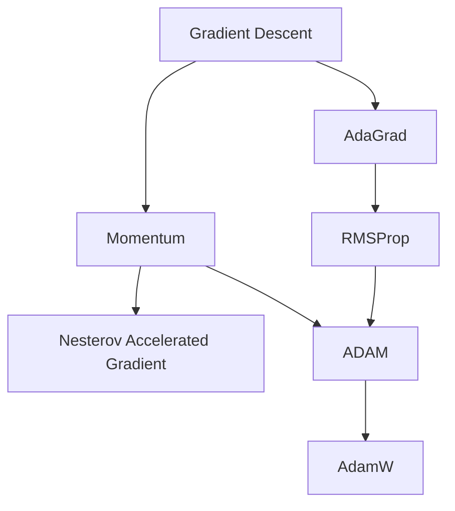

## Title + Unit 6 positioning

::: {.fragment}
- Unit 5 introduced backpropagation and gradient computation.
- Unit 6 asks: **what does the surface look like** that we are descending on?
- Understanding landscape geometry is essential for choosing optimizers and diagnosing training failures.
:::

## Recap: gradient descent as parameter update

::: {.fragment}
- Core update rule: $\boldsymbol{\theta}^{(t+1)} = \boldsymbol{\theta}^{(t)} - \eta \mathbf{g}^{(t)}$
- The learning rate $\eta$ controls step size.
- Convergence depends on landscape properties — not just the gradient direction [@mcclarren2021machine].
:::

## Learning outcomes for Unit 6

By the end of this lecture, students can:

::: {.fragment}
- interpret the Hessian matrix $\mathbf{H}$ and its eigenvalues as curvature descriptors,
- explain why saddle points dominate over local minima in high dimensions,
- compare momentum, AdaGrad, RMSProp, and ADAM mechanistically,
- relate flat vs sharp minima to generalization performance.
:::

## The loss landscape metaphor

::: {.fragment}
- The cost function $J(\boldsymbol{\theta})$ defines a surface over the parameter space $\mathbb{R}^p$.
- Peaks, valleys, saddle points, and plateaus characterize this topography.
- Training is a trajectory on this surface, guided by gradient information.
:::

## Visualizing 1D and 2D loss surfaces

::: {.fragment}
- In 1D: loss curve with clear minima and maxima.
- In 2D: contour plots reveal elongated valleys and saddle structures.
- Real networks live in $\mathbb{R}^{10^6}$ or higher — visualization is always a projection [@goodfellow2016deep].
:::

## Critical points: gradient equals zero

::: {.fragment}
- A critical point satisfies $\mathbf{g} = \mathbf{0}$.
- Classification requires second-order information: the **Hessian matrix** $\mathbf{H}$.
- Minimum, maximum, or saddle point depends on the sign pattern of $\mathbf{H}$ eigenvalues.
:::

## The Hessian matrix: definition

::: {.fragment}
- The Hessian $\mathbf{H}$ is the matrix of second-order partial derivatives:

$$
H_{ij} = \frac{\partial^2 J}{\partial \theta_i \partial \theta_j}
$$
:::

::: {.fragment}
- $\mathbf{H}$ is symmetric for smooth loss functions (Schwarz's theorem).
- Its eigenvalues and eigenvectors encode curvature magnitude and direction.
:::

## Eigenvalues of the Hessian

::: {.fragment}
- **Large eigenvalue**: the loss changes rapidly along the corresponding eigenvector direction (steep curvature).
- **Small eigenvalue**: the loss is nearly flat along that direction.
- **Negative eigenvalue**: the critical point is a saddle point along that direction.
:::

## Conditioning and the condition number

::: {.columns}
::: {.column width="50%"}
### Mathematical Definition

::: {.fragment}
- The condition number is defined as $\kappa(\mathbf{H}) = \lambda_{\max} / \lambda_{\min}$.
- $\kappa \approx 1$: well-conditioned, isotropic curvature.
- $\kappa \gg 1$: ill-conditioned curvature.
:::
:::

::: {.column width="50%"}
### Geometric Intuition

::: {.fragment}
- **Well-conditioned**: Level sets are nearly circular.
- **Ill-conditioned**: Level sets are elongated ellipses.
- Gradient descent oscillates in steep directions and crawls in flat ones.
:::
:::
:::

## Geometric interpretation: elliptical contours

::: {.fragment}
- Well-conditioned: circular level sets — equal progress in all directions.
- Ill-conditioned: elongated ellipses — the optimal step size differs drastically by direction.
- Standard gradient descent cannot adapt to direction-dependent curvature.
:::

## Why local minima are rare in high dimensions

::: {.fragment}
- For a critical point to be a local minimum, **all** $\mathbf{H}$ eigenvalues must be positive.
- With $p$ parameters, each eigenvalue is independently likely to be positive or negative.
- The probability of all-positive eigenvalues decreases exponentially with $p$ [@goodfellow2016deep].
:::

## Saddle points dominate the landscape

::: {.fragment}
- In high dimensions, most critical points are saddle points, not minima.
- Random matrix theory predicts: the fraction of negative eigenvalues concentrates near 0.5 at high-loss critical points.
- Low-loss critical points tend to have mostly positive eigenvalues — the "good" minima region.
:::

## Saddle point dynamics under gradient descent

- Near a saddle point, the gradient $\mathbf{g}$ is small in all directions — training slows dramatically.
- Escape is possible along negative-curvature directions, but can take many iterations.
- Gradient noise from mini-batches can help escape saddle points faster.

::: {.columns}
::: {.column width="30%"}
```{ojs}
//| echo: false
viewof lr_saddle = Inputs.range([0.01, 0.5], {value: 0.1, step: 0.01, label: "Learning Rate (η)"});
viewof noise_saddle = Inputs.range([0, 0.5], {value: 0.0, step: 0.01, label: "Gradient Noise StdDev"});
viewof steps_saddle = Inputs.range([1, 100], {value: 20, step: 1, label: "Steps"});
viewof btn_saddle = Inputs.button("Reset / Re-run");
```
:::
::: {.column width="70%"}
```{ojs}
//| echo: false
// Saddle function f(x,y) = x^2 - y^2
gd_traj_saddle = {
  btn_saddle;
  let x = 0; // Exactly zero gradient in x direction initially!
  let y = 0.1;
  let traj = [{x: x, y: y, iter: 0}];
  const randn = () => Math.sqrt(-2.0 * Math.log(Math.random())) * Math.cos(2.0 * Math.PI * Math.random());
  
  for(let i=1; i<=steps_saddle; i++) {
    let gx = 2 * x + noise_saddle * randn();
    let gy = -2 * y + noise_saddle * randn();
    x = x - lr_saddle * gx;
    y = y - lr_saddle * gy;
    traj.push({x: x, y: y, iter: i});
  }
  return traj;
}

grid_saddle = {
  let pts = [];
  for(let i=-2; i<=2; i+=0.1) {
    for(let j=-2; j<=2; j+=0.1) {
      pts.push({x: i, y: j, z: (i*i - j*j)});
    }
  }
  return pts;
}

plot_saddle = Plot.plot({
  width: 800, height: 400,
  x: {domain: [-2, 2], label: "Parameter x (Positive Curvature)"},
  y: {domain: [-2, 2], label: "Parameter y (Negative Curvature)"},
  color: {scheme: "RdBu", legend: false},
  marks: [
    Plot.contour(grid_saddle, {x: "x", y: "y", fill: "z", thresholds: 20, stroke: "black", strokeOpacity: 0.2}),
    Plot.line(gd_traj_saddle, {x: "x", y: "y", stroke: "lime", strokeWidth: 2}),
    Plot.dot(gd_traj_saddle, {x: "x", y: "y", fill: "black", r: 3})
  ]
})
```
:::
:::

## Plateaus and vanishing gradients

::: {.fragment}
- Plateaus are extended flat regions where $\|\mathbf{g}\| \approx 0$.
- Common with saturating activation functions (sigmoid, tanh) in deep networks.
- Training appears stuck — but the model has not converged to a useful solution.
:::

## Loss surface of linear networks

::: {.fragment}
- Even linear networks $f = W_L \cdots W_1 x$ have non-convex loss landscapes.
- Saddle points arise from the product structure of weight matrices.
- Analytical tractability makes them a useful theoretical testbed.
:::

## Empirical observations: loss surfaces of deep networks

::: {.fragment}
- Many local minima exist, but they tend to have **similar loss values**.
- The loss at local minima decreases as network width increases.
- Sharp minima coexist with flat minima — optimizer choice determines which is found [@goodfellow2016deep].
:::

## Role of overparameterization

::: {.fragment}
- Networks with more parameters than training samples create degenerate solution manifolds.
- Connected low-loss valleys allow smooth interpolation between solutions.
- Overparameterization paradoxically **helps** optimization by removing barriers.
:::

## Symmetry and mode connectivity

- Permuting hidden units produces an equivalent network with identical loss.
- This creates combinatorially many equivalent minima in weight space.
- Recent work shows that minima found by different training runs can be connected by low-loss paths.

## Landscape pathologies summary

- **Ill-conditioning**: oscillation + slow convergence; diagnosed by large $\kappa(\mathbf{H})$.
- **Saddle points**: near-zero gradient $\mathbf{g}$ in all directions; escape requires curvature exploitation.
- **Plateaus**: extended flat regions; caused by saturating activations.
- **Sharp minima**: low training loss but poor generalization; sensitive to perturbation.

## Checkpoint: identify the pathology

- Scenario A: training loss oscillates wildly but does not decrease — **ill-conditioning + learning rate too large**.
- Scenario B: training loss flatlines at a high value — **saddle point or plateau**.
- Scenario C: training loss is very low but test loss is high — **sharp minimum / overfitting**.

## Vanilla GD on ill-conditioned surface

- On an elongated bowl, GD zig-zags across the narrow direction.
- Progress along the long axis is extremely slow.
- The optimal learning rate is limited by the steepest direction: $\eta < 2/\lambda_{\max}$.

::: {.columns}
::: {.column width="30%"}
```{ojs}
//| echo: false
viewof a_cond = Inputs.range([1, 20], {value: 10, step: 1, label: "Condition Number (a)"});
viewof lr_cond = Inputs.range([0.01, 0.5], {value: 0.1, step: 0.01, label: "Learning Rate (η)"});
viewof steps_cond = Inputs.range([1, 50], {value: 20, step: 1, label: "Steps"});
viewof btn_cond = Inputs.button("Reset / Re-run");
```
:::
::: {.column width="70%"}
```{ojs}
//| echo: false
gd_traj_cond = {
  btn_cond;
  let x = -8;
  let y = -4;
  let traj = [{x: x, y: y, iter: 0}];
  for(let i=1; i<=steps_cond; i++) {
    x = x - lr_cond * x;
    y = y - lr_cond * a_cond * y;
    traj.push({x: x, y: y, iter: i});
  }
  return traj;
}

grid_cond = {
  let pts = [];
  for(let i=-10; i<=10; i+=0.5) {
    for(let j=-5; j<=5; j+=0.25) {
      pts.push({x: i, y: j, z: (i*i)/2 + a_cond * (j*j)/2});
    }
  }
  return pts;
}

plot_cond = Plot.plot({
  width: 800, height: 400,
  x: {domain: [-10, 10], label: "Parameter x_1 (Flat)"},
  y: {domain: [-5, 5], label: "Parameter x_2 (Steep)"},
  color: {scheme: "viridis", legend: false},
  marks: [
    Plot.contour(grid_cond, {x: "x", y: "y", fill: "z", thresholds: 15, stroke: "white", strokeOpacity: 0.3}),
    Plot.line(gd_traj_cond, {x: "x", y: "y", stroke: "red", strokeWidth: 2}),
    Plot.dot(gd_traj_cond, {x: "x", y: "y", fill: "white", r: 3, title: d => "Step " + d.iter})
  ]
})
```
:::
:::

## Momentum: physics analogy

- Think of the parameter vector $\boldsymbol{\theta}$ as a ball rolling on the loss surface.
- The ball accumulates **velocity** $\mathbf{v}$ in directions of consistent gradient.
- Oscillations in steep directions are damped because velocity averages out sign changes [@mcclarren2021machine].

## Momentum update rule

- Velocity update: $\mathbf{v}^{(t+1)} = \alpha \mathbf{v}^{(t)} - \eta \mathbf{g}^{(t)}$
- Parameter update: $\boldsymbol{\theta}^{(t+1)} = \boldsymbol{\theta}^{(t)} + \mathbf{v}^{(t+1)}$
- Typical default: $\alpha = 0.9$; controls how much history is retained.

## Momentum on the elongated bowl

- Oscillations across the narrow direction cancel in the velocity average.
- Net velocity builds up along the valley floor.
- Convergence is dramatically faster compared to vanilla GD.

::: {.columns}
::: {.column width="30%"}
```{ojs}
//| echo: false
viewof lr_mom = Inputs.range([0.01, 0.2], {value: 0.05, step: 0.01, label: "Learning Rate (η)"});
viewof alpha_mom = Inputs.range([0.0, 0.99], {value: 0.9, step: 0.01, label: "Momentum (α)"});
viewof steps_mom = Inputs.range([1, 100], {value: 40, step: 1, label: "Steps"});
viewof btn_mom = Inputs.button("Reset / Re-run");
```
:::
::: {.column width="70%"}
```{ojs}
//| echo: false
grid_mom_fixed = {
  let pts = [];
  for(let i=-10; i<=10; i+=0.5) {
    for(let j=-5; j<=5; j+=0.25) {
      pts.push({x: i, y: j, z: (i*i)/2 + 15 * (j*j)/2});
    }
  }
  return pts;
}

traj_comparison = {
  btn_mom;
  const a = 15; // fixed ill-conditioning
  let x1 = -8, y1 = -4; // GD
  let x2 = -8, y2 = -4; // Momentum
  let vx2 = 0, vy2 = 0;
  
  let traj = [];
  traj.push({x: x1, y: y1, algo: "Vanilla GD", iter: 0});
  traj.push({x: x2, y: y2, algo: "Momentum", iter: 0});
  
  for(let i=1; i<=steps_mom; i++) {
    // GD step
    x1 = x1 - lr_mom * x1;
    y1 = y1 - lr_mom * a * y1;
    traj.push({x: x1, y: y1, algo: "Vanilla GD", iter: i});
    
    // Momentum step
    let gx2 = x2;
    let gy2 = a * y2;
    vx2 = alpha_mom * vx2 - lr_mom * gx2;
    vy2 = alpha_mom * vy2 - lr_mom * gy2;
    x2 = x2 + vx2;
    y2 = y2 + vy2;
    traj.push({x: x2, y: y2, algo: "Momentum", iter: i});
  }
  return traj;
}

plot_mom = {
  const plot = Plot.plot({
    width: 800, height: 400,
    x: {domain: [-10, 5], label: "Parameter x_1"},
    y: {domain: [-5, 5], label: "Parameter x_2"},
    color: {scheme: "viridis"},
    marks: [
      Plot.contour(grid_mom_fixed, {x: "x", y: "y", fill: "z", thresholds: 15, stroke: "white", strokeOpacity: 0.2}),
      Plot.line(traj_comparison.filter(d => d.algo === "Vanilla GD"), {x: "x", y: "y", stroke: "gray", strokeWidth: 2}),
      Plot.line(traj_comparison.filter(d => d.algo === "Momentum"), {x: "x", y: "y", stroke: "red", strokeWidth: 2}),
      Plot.dot(traj_comparison.filter(d => d.algo === "Vanilla GD"), {x: "x", y: "y", fill: "gray", r: 3}),
      Plot.dot(traj_comparison.filter(d => d.algo === "Momentum"), {x: "x", y: "y", fill: "red", r: 3})
    ]
  });
  const legend = Plot.legend({color: {domain: ["Vanilla GD", "Momentum"], range: ["gray", "red"]}});
  return html`<div>${legend}${plot}</div>`;
}
```
:::
:::

## Nesterov accelerated gradient

- Key idea: evaluate the gradient at the **look-ahead** position $\boldsymbol{\theta} + \alpha \mathbf{v}$.
- Provides a correction before committing to the full momentum step.
- Achieves provably better convergence rate $O(1/t^2)$ vs $O(1/t)$ for convex problems.

## Momentum vs Nesterov: comparison

- Both reduce oscillations and accelerate convergence on ill-conditioned surfaces.
- Nesterov tends to overshoot less because of the look-ahead correction.
- In practice, the difference is modest for deep learning; both are widely used.

## Learning rate as the most critical hyperparameter

- The learning rate $\eta$ governs the fundamental speed–stability tradeoff.
- Too large: divergence or chaotic oscillation.
- Too small: convergence to nearest minimum, which may be suboptimal [@neuer2024machine].

## Learning rate sensitivity demonstration

- Same model, same data, three learning rates: training curves diverge dramatically.
- This interactive 1D example ($f(x) = x^4 - 2x^2 + \frac{1}{2}x$) shows how $\eta$ controls convergence, oscillation, or divergence.
- Try different learning rates and observe the optimization trajectory.

::: {.columns}
::: {.column width="30%"}
```{ojs}
//| echo: false
viewof lr_1d = Inputs.range([0.01, 1.0], {value: 0.1, step: 0.01, label: "Learning Rate (η)"});
viewof epochs_1d = Inputs.range([1, 50], {value: 5, step: 1, label: "Steps"});
viewof reset_btn_1d = Inputs.button("Reset / Re-run");
```
:::
::: {.column width="70%"}
```{ojs}
//| echo: false
gd_trajectory = {
  reset_btn_1d; // react to button
  let x = 0; // starting point
  let traj = [{x: x, iter: 0}];
  for(let i=1; i<=epochs_1d; i++) {
    let grad = 4 * Math.pow(x, 3) - 4 * x + 0.5;
    x = x - lr_1d * grad;
    if(x > 2 || x < -2 || isNaN(x)) { x = (x>0? 2: -2); traj.push({x: x, iter: i}); break; }
    traj.push({x: x, iter: i});
  }
  return traj;
}

x_range = d3.range(-1.5, 1.6, 0.05)
plot_func_1d = Plot.plot({
  width: 800, height: 400,
  x: {domain: [-1.5, 1.5], label: "Parameter x"},
  y: {domain: [-1.5, 3], label: "Loss f(x)"},
  marks: [
    Plot.line(x_range, {x: d => d, y: d => Math.pow(d, 4) - 2 * Math.pow(d, 2) + 0.5*d, stroke: "steelblue", strokeWidth: 3}),
    Plot.line(gd_trajectory, {x: "x", y: d => Math.pow(d.x, 4) - 2 * Math.pow(d.x, 2) + 0.5*d.x, stroke: "orange", strokeWidth: 2}),
    Plot.dot(gd_trajectory, {x: "x", y: d => Math.pow(d.x, 4) - 2 * Math.pow(d.x, 2) + 0.5*d.x, fill: "red", r: d => d.iter == 0 ? 6 : 4, title: d => "Step " + d.iter})
  ]
})
```
:::
:::

## Why a single global learning rate is insufficient

- Different parameters experience different curvatures (different $\mathbf{H}$ eigenvalues).
- A single $\eta$ forces a compromise: too fast for some directions, too slow for others.
- Per-parameter adaptation is the natural solution.

## Recap: what momentum solves and what it does not

- Momentum accelerates convergence along consistent gradient directions.
- It does **not** adapt the learning rate per parameter.
- Ill-conditioned landscapes still require direction-dependent step sizes.

## Per-parameter learning rates: the core idea

- Scale each parameter's update by the inverse of its historical gradient magnitude.
- Parameters with large gradients get smaller effective learning rates.
- Parameters with small gradients get larger effective learning rates.

## AdaGrad: accumulate squared gradients

- Accumulator: $\mathbf{G}_t = \mathbf{G}_{t-1} + \mathbf{g}_t^2$ (element-wise).
- Update: $\boldsymbol{\theta}_{t+1} = \boldsymbol{\theta}_t - \frac{\eta}{\sqrt{\mathbf{G}_t} + \epsilon} \mathbf{g}_t$
- Naturally adapts to sparse features — infrequent features get larger updates [@neuer2024machine].

## AdaGrad: strengths and weaknesses

- **Strength**: excellent for sparse gradient problems (NLP, recommender systems).
- **Weakness**: $\mathbf{G}_t$ only grows, so effective learning rate monotonically decreases.
- Eventually, the learning rate becomes too small and training stops prematurely.

## RMSProp: exponential moving average fix

- Replace the sum with a decaying average: $E[\mathbf{g}^2]_t = \gamma E[\mathbf{g}^2]_{t-1} + (1-\gamma)\mathbf{g}_t^2$.
- Prevents the aggressive accumulation that kills AdaGrad.
- Proposed by Hinton in a Coursera lecture — never formally published but universally used.

## RMSProp update rule

- Update: $\boldsymbol{\theta}_{t+1} = \boldsymbol{\theta}_t - \frac{\eta}{\sqrt{E[\mathbf{g}^2]_t} + \epsilon} \mathbf{g}_t$
- Typical default: $\gamma = 0.9$, $\epsilon = 10^{-8}$.
- Effective learning rate adapts to recent curvature, not all-time history.

## ADAM: combining momentum + adaptive scales

- **First moment** (mean of gradients): $\mathbf{m}_t = \beta_1 \mathbf{m}_{t-1} + (1-\beta_1)\mathbf{g}_t$
- **Second moment** (mean of squared gradients): $\mathbf{v}_t = \beta_2 \mathbf{v}_{t-1} + (1-\beta_2)\mathbf{g}_t^2$
- ADAM combines directional memory (momentum) with magnitude adaptation (RMSProp) [@neuer2024machine].

## ADAM update rule (full derivation)

::: {.fragment}
- Bias correction: $\hat{\mathbf{m}}_t = \frac{\mathbf{m}_t}{1-\beta_1^t}, \quad \hat{\mathbf{v}}_t = \frac{\mathbf{v}_t}{1-\beta_2^t}$
:::

::: {.fragment}
- Parameter update:

$$
\boldsymbol{\theta}_{t+1} = \boldsymbol{\theta}_t - \frac{\eta}{\sqrt{\hat{\mathbf{v}}_t} + \epsilon}\,\hat{\mathbf{m}}_t
$$
:::

::: {.fragment}
- Defaults: $\beta_1=0.9$, $\beta_2=0.999$, $\epsilon=10^{-8}$, $\eta=10^{-3}$.
:::

## ADAM as landscape normalizer

- ADAM effectively rescales coordinates to equalize curvature across parameter directions.
- In well-conditioned subspace: ADAM behaves like momentum SGD.
- In ill-conditioned subspace: ADAM compensates by scaling down steep directions and scaling up flat ones.

## ADAM variants: AdamW, AMSGrad

- **AdamW**: decouples weight decay from the adaptive gradient scaling — better regularization behavior.
- **AMSGrad**: ensures the second moment estimate never decreases — addresses rare convergence failures.
- AdamW is now the recommended default in most deep learning frameworks.

## Optimizer comparison on benchmark surfaces

- **SGD**: slow on ill-conditioned surfaces, but can find flatter minima.
- **SGD + momentum**: faster convergence, reduced oscillation.
- **ADAM**: fast initial progress, robust to hyperparameter choices, but may converge to sharper minima.

::: {.columns}
::: {.column width="30%"}
```{ojs}
//| echo: false
viewof lr_opt = Inputs.range([0.01, 1.0], {value: 0.1, step: 0.01, label: "GD/Mom/RMS LR"});
viewof lr_adam = Inputs.range([0.01, 1.0], {value: 0.5, step: 0.01, label: "ADAM LR"});
viewof steps_opt = Inputs.range([1, 200], {value: 50, step: 10, label: "Steps"});
viewof btn_opt = Inputs.button("Reset / Re-run");
```
:::
::: {.column width="70%"}
```{ojs}
//| echo: false
// Skewed bowl: f(x,y) = x^2/2 + 10y^2 + xy
traj_multi = {
  btn_opt;
  let t = [];
  let x_init = 3, y_init = -3;
  
  const grad = (x,y) => [x + y, 20*y + x];
  
  // 1. Vanilla GD
  let x1=x_init, y1=y_init;
  for(let i=0; i<=steps_opt; i++){
    t.push({x:x1, y:y1, algo:"GD", iter:i});
    let [gx, gy] = grad(x1, y1);
    x1 -= lr_opt * gx; y1 -= lr_opt * gy;
  }
  
  // 2. Momentum
  let x2=x_init, y2=y_init, vx2=0, vy2=0;
  for(let i=0; i<=steps_opt; i++){
    t.push({x:x2, y:y2, algo:"Momentum", iter:i});
    let [gx, gy] = grad(x2, y2);
    vx2 = 0.9*vx2 - lr_opt * gx;
    vy2 = 0.9*vy2 - lr_opt * gy;
    x2 += vx2; y2 += vy2;
  }
  
  // 3. RMSProp
  let x3=x_init, y3=y_init, egx=0, egy=0;
  for(let i=0; i<=steps_opt; i++){
    t.push({x:x3, y:y3, algo:"RMSProp", iter:i});
    let [gx, gy] = grad(x3, y3);
    egx = 0.9*egx + 0.1*(gx*gx);
    egy = 0.9*egy + 0.1*(gy*gy);
    x3 -= (lr_opt / (Math.sqrt(egx) + 1e-8)) * gx;
    y3 -= (lr_opt / (Math.sqrt(egy) + 1e-8)) * gy;
  }
  
  // 4. ADAM
  let x4=x_init, y4=y_init, m1x=0, m1y=0, v2x=0, v2y=0;
  for(let i=0; i<=steps_opt; i++){
    t.push({x:x4, y:y4, algo:"ADAM", iter:i});
    let [gx, gy] = grad(x4, y4);
    m1x = 0.9*m1x + 0.1*gx; m1y = 0.9*m1y + 0.1*gy;
    v2x = 0.999*v2x + 0.001*(gx*gx); v2y = 0.999*v2y + 0.001*(gy*gy);
    let m1xh = m1x / (1 - Math.pow(0.9, i+1));
    let m1yh = m1y / (1 - Math.pow(0.9, i+1));
    let v2xh = v2x / (1 - Math.pow(0.999, i+1));
    let v2yh = v2y / (1 - Math.pow(0.999, i+1));
    x4 -= (lr_adam / (Math.sqrt(v2xh) + 1e-8)) * m1xh;
    y4 -= (lr_adam / (Math.sqrt(v2yh) + 1e-8)) * m1yh;
  }
  return t;
}

grid_multi = {
  let pts = [];
  for(let i=-4; i<=4; i+=0.2) {
    for(let j=-4; j<=4; j+=0.2) {
      pts.push({x: i, y: j, z: (i*i)/2 + 10*(j*j) + i*j});
    }
  }
  return pts;
}

plot_multi = {
  const plot = Plot.plot({
    width: 800, height: 400,
    x: {domain: [-4, 4]},
    y: {domain: [-4, 4]},
    color: {scheme: "viridis"},
    marks: [
      Plot.contour(grid_multi, {x: "x", y: "y", fill: "z", thresholds: 20, stroke: "white", strokeOpacity: 0.2}),
      Plot.line(traj_multi.filter(d=>d.algo==="GD"), {x: "x", y: "y", stroke: "gray", strokeWidth: 2}),
      Plot.line(traj_multi.filter(d=>d.algo==="Momentum"), {x: "x", y: "y", stroke: "red", strokeWidth: 2}),
      Plot.line(traj_multi.filter(d=>d.algo==="RMSProp"), {x: "x", y: "y", stroke: "blue", strokeWidth: 2}),
      Plot.line(traj_multi.filter(d=>d.algo==="ADAM"), {x: "x", y: "y", stroke: "orange", strokeWidth: 2}),
      Plot.dot(traj_multi.filter(d=>d.algo==="GD"), {x: "x", y: "y", fill: "gray", r: 3}),
      Plot.dot(traj_multi.filter(d=>d.algo==="Momentum"), {x: "x", y: "y", fill: "red", r: 3}),
      Plot.dot(traj_multi.filter(d=>d.algo==="RMSProp"), {x: "x", y: "y", fill: "blue", r: 3}),
      Plot.dot(traj_multi.filter(d=>d.algo==="ADAM"), {x: "x", y: "y", fill: "orange", r: 3})
    ]
  });
  const legend = Plot.legend({color: {domain: ["GD", "Momentum", "RMSProp", "ADAM"], range: ["gray", "red", "blue", "orange"]}});
  return html`<div>${legend}${plot}</div>`;
}
```
:::
:::

## Optimizer genealogy



## When ADAM is not enough

- ADAM can converge to sharper minima than SGD with momentum.
- Generalization gap: ADAM training loss is lower, but test loss can be higher.
- Recent practice: use ADAM for warm-up, switch to SGD + momentum for fine-tuning.

::: {.column width="50%"}
{width=80%}
:::

## Practical optimizer selection guide

- **Default starting point**: AdamW with $\eta = 10^{-3}$ and default betas.
- **For best generalization**: SGD + momentum with tuned learning rate schedule.
- **For sparse or NLP tasks**: ADAM or AdaGrad variants.
- Always validate optimizer choice on a held-out set.

::: {.placeholder}
[INSERT: Selection flowchart or table tailored to materials science models (GNNs vs. simple MLPs).]
:::

## Flat vs sharp minima

- A **flat minimum**: the loss remains low over a wide neighborhood of the solution.
- A **sharp minimum**: the loss increases rapidly with small parameter perturbations.
- Flatness can be quantified by the trace or top eigenvalues of the Hessian $\mathbf{H}$ at the minimum.

::: {.columns}
::: {.column width="30%"}
```{ojs}
//| echo: false
viewof dshift = Inputs.range([-0.5, 0.5], {value: 0.0, step: 0.01, label: "Test Data Shift"});
```
<br>
**Generalization Error Analysis**
```{ojs}
//| echo: false
md`- **Sharp Minimum Loss**: ${(Math.pow(0 - dshift, 2) * 50).toFixed(2)}`
```
```{ojs}
//| echo: false
md`- **Flat Minimum Loss**: ${(Math.pow(0 - dshift, 2) * 2).toFixed(2)}`
```
:::
::: {.column width="70%"}
```{ojs}
//| echo: false
// Flat vs Sharp
x_grid_fs = d3.range(-1, 1, 0.01);
plot_fs = Plot.plot({
  width: 800, height: 400,
  x: {domain: [-1, 1], label: "Parameter Deviation"},
  y: {domain: [0, 5], label: "Loss"},
  color: {domain: ["Sharp Minimum", "Flat Minimum"], range: ["red", "blue"], legend: true},
  marks: [
    // True test losses (shifted)
    Plot.line(x_grid_fs, {x: d => d, y: d => Math.pow(d - dshift, 2) * 50, stroke: "red", strokeWidth: 2, strokeDasharray: dshift === 0 ? "none" : "5,5"}),
    Plot.line(x_grid_fs, {x: d => d, y: d => Math.pow(d - dshift, 2) * 2, stroke: "blue", strokeWidth: 2, strokeDasharray: dshift === 0 ? "none" : "5,5"}),
    
    // Evaluation points (trained model doesn't change parameter, it evaluates at 0)
    Plot.dot([{x: 0}], {x: "x", y: d => Math.pow(0 - dshift, 2) * 50, fill: "red", r: 8}),
    Plot.dot([{x: 0}], {x: "x", y: d => Math.pow(0 - dshift, 2) * 2, fill: "blue", r: 8})
  ]
})
```
:::
:::

## Connection to generalization

- Flat minima are less sensitive to the gap between training and test distributions.
- Sharp minima memorize training data specifics — poor transfer to unseen data.
- This connects landscape geometry to the bias-variance tradeoff of Unit 7 [@goodfellow2016deep].

## Learning rate schedules

- **Step decay**: reduce $\eta$ by a factor at fixed epochs.
- **Exponential decay**: $\eta_t = \eta_0 \cdot \gamma^t$.
- **Cosine annealing**: $\eta_t = \frac{\eta_0}{2}(1 + \cos(\pi t / T))$ — smooth, widely used.
- **Warm-up**: start with small $\eta$, ramp up linearly, then decay.

## Batch size and gradient noise

- Small batch size $\Rightarrow$ noisy gradient estimate $\Rightarrow$ implicit regularization.
- Large batch size $\Rightarrow$ accurate gradient $\Rightarrow$ faster per-step but may converge to sharper minima.
- Gradient noise helps escape saddle points and sharp minima [@mcclarren2021machine].

## The learning rate–batch size relationship

- The **linear scaling rule**: when doubling batch size, double the learning rate.
- Effective learning rate: $\eta_{\text{eff}} = \eta / B$ where $B$ is batch size.
- This relationship breaks down at very large batch sizes — diminishing returns.

## Exercise setup: optimizer comparison on 2D surfaces

- Implement vanilla GD, momentum, and ADAM in NumPy on a 2D quadratic.
- Visualize parameter trajectories overlaid on loss contours.
- Vary the condition number and observe how each optimizer responds.
- Experiment with learning rate schedules (constant vs cosine annealing).

## Exam-aligned summary: 10 must-know statements

1. The $\mathbf{H}$ eigenvalues determine curvature magnitude in each direction.
2. The condition number $\kappa(\mathbf{H}) = \lambda_{\max}/\lambda_{\min}$ measures landscape difficulty.
3. Saddle points vastly outnumber local minima in high-dimensional spaces.
4. Momentum accumulates velocity $\mathbf{v}$ to dampen oscillations and accelerate convergence.
5. AdaGrad adapts per-parameter learning rates but decays too aggressively.
6. RMSProp uses exponential moving averages to fix AdaGrad's decay problem.
7. ADAM combines momentum with adaptive per-parameter scaling.
8. Flat minima correlate with better generalization; sharp minima tend to overfit.
9. Learning rate schedules (warm-up + decay) improve both convergence and final performance.
10. Smaller batch sizes provide implicit regularization through gradient noise.

## References + reading assignment for next unit

- **Required reading before Unit 7:**
  - Neuer: Ch. 4.5.5 (optimization variants)
  - McClarren: Ch. 5.2.2 and Ch. 5.4 (regularization and dropout)
- **Optional depth:**
  - Goodfellow et al.: Ch. 8.1–8.5 (optimization for deep learning)
  - Bishop: Ch. 3.4 (Hessian and Laplace approximation)
- Next unit: Generalization, Bias-Variance Tradeoff, and Regularization.

::: {#refs}
:::
