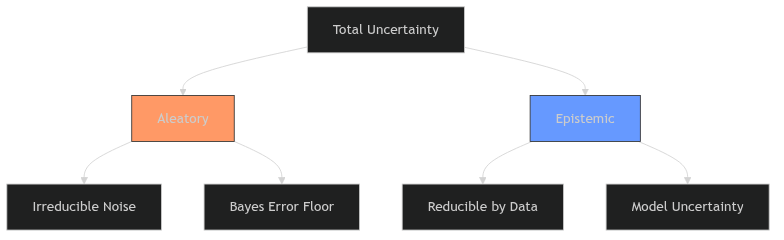

<!-- ===== §1. Framing ===== -->

## Title + Unit 7 positioning

:::: {.incremental}
- Units 1–6 built the optimization machinery for learning.
- Unit 7 introduces the **probabilistic foundations** that underlie everything.
- Probability is the language of uncertainty — and learning is fundamentally about reasoning under uncertainty.
- We close the unit with **conformal prediction**: a distribution-free coverage guarantee that any downstream UQ method can plug into.
::::

::: {.notes}
- Open by naming the pivot: Units 1–6 answered "how do we *fit* a model" (loss, gradients, optimizers). This unit answers "what does the data *mean*" — every loss we minimized is secretly a probabilistic statement, and making that explicit is what lets us put error bars on predictions.
- Set the destination early: the unit ends with conformal prediction, a guarantee that holds *even if our probability model is wrong*. Tell students that arc — "we build the probabilistic worldview, then give them a safety net that survives its failure" — so the long Gaussian/MLE/Bayes middle has a clear payoff.
- Audience anchor: this is a materials-science cohort. Promise concrete returns — why MSE is the "right" loss, why ridge regression is not arbitrary, how to report a trustworthy ±interval to a metallurgist. Keep that promissory note visible all lecture.
- Timing: this is a content-dense 90 min. Budget ~10 min framing+uncertainty, ~25 min Gaussian/entropy/KL, ~20 min MLE, ~20 min Bayes, ~15 min conformal. Flag the interactives as the pace-recovery points you can compress if behind.
:::

## Recap: what risk minimization assumes

:::: {.incremental}
- Unit 1: $\hat{\boldsymbol{\theta}} = \arg\min_{\boldsymbol{\theta}} \mathbb{E}_{(\mathbf{x},y) \sim P}[L(f_{\boldsymbol{\theta}}(\mathbf{x}), y)]$.
- The expectation is over a **probability distribution** $P$ of data.
- Until now, we treated this as a mathematical abstraction. Now we make it concrete.
::::

::: {.notes}
- This slide is the "aha" the whole unit rests on: the $\mathbb{E}_{P}$ we wrote casually in Unit 1 was never decorative — it presupposes a data distribution $P$. Learning is estimating properties of $P$ from finite samples.
- Make the abstraction concrete with one sentence: "We never see $P$; we see a handful of draws from it, and we gamble that minimizing average loss on those draws minimizes it on the unseen rest." That gamble is exactly what the rest of the course (generalization, Unit 8) interrogates.
- Common student misconception to preempt: that the training set *is* the problem. Reframe — the training set is a noisy window onto $P$; the real target is performance under $P$.
- Transition line: "To reason about $P$ we need its vocabulary — distributions, expectations, likelihood, Bayes. That vocabulary is today."
:::

## Learning outcomes for Unit 7

By the end of this lecture, students can:

:::: {.incremental}
- classify uncertainty as aleatory or epistemic and explain why this matters,
- write the Gaussian in 1D and multivariate form and explain its maximum-entropy property,
- compute and interpret KL divergence between distributions, in particular the closed form between two Gaussians,
- derive the MLE for Gaussian parameters and connect it to MSE minimization,
- apply Bayes' theorem to update prior beliefs into posterior distributions,
- apply **split conformal prediction** to wrap any predictor with a finite-sample coverage guarantee, and recognise when the exchangeability assumption breaks.
::::

::: {.notes}
- Don't read the list — use it as a contract. Tell students each bullet maps to one block of the lecture and to specific exam statements at the end; the "must-know statements" slide is the same list in assessable form.
- Flag the two outcomes students historically underestimate: the KL-between-Gaussians closed form (it returns as the VAE regularizer in Unit 11 — they will thank you) and the exchangeability caveat of conformal (the single most common misuse in practice).
- Set expectation on rigor level: derivations are done to the point of insight (MLE for the Gaussian, MAP↔ridge), not measure-theoretic completeness. This is a foundations-for-engineers course.
:::

## Why probability is the language of learning

:::: {.incremental}
- Data is inherently noisy — repeated measurements give different results.
- Models are uncertain — finite data cannot determine parameters exactly.
- Probability provides a **consistent, rigorous** framework for quantifying both.
- Without probability, we cannot define what "learning from data" means.
::::


<!-- ===== §2. Aleatory uncertainty — definition ===== -->

::: {.notes}
- The philosophical load-bearing slide. The claim is strong: without probability the phrase "learning from data" is not even well-defined, because there is no way to say a model is "probably right" or "wrong by this much."
- Two failure-without-probability examples to say aloud: (1) a model that fits 100 points perfectly — is it good? Unanswerable without a noise model. (2) Two labs report different hardness for the same alloy — which is "true"? The question dissolves once you model measurement as a distribution.
- Tie back to Unit 6: there we treated the loss surface as deterministic geometry; the *reason* it is noisy (mini-batch noise, data noise) is exactly this slide. Probability was under the hood the whole time.
:::

## Aleatory uncertainty — definition

:::: {.incremental}
- **Aleatory** (from Latin *alea* = dice): irreducible randomness in the data-generating process.
- Examples: thermal noise in sensors, quantum measurement, turbulent flow variability.
- No amount of additional data or better models can eliminate aleatory uncertainty.
- It sets a **floor** on achievable prediction error (the Bayes error — formally treated in Unit 8 with the bias-variance decomposition).
::::

::: {.notes}
- Etymology is a memory hook, not trivia: *alea* = the die. Aleatory uncertainty is the die itself — re-rolling (more data) does not change that it's a die.
- The key, examinable claim: aleatory uncertainty is **irreducible**. More data shrinks your uncertainty about the *mean*, never the scatter of individual outcomes. Students conflate these constantly — drill it now, it pays off at the interactive two slides on.
- Forward link to say explicitly: this "floor" is the Bayes error / the irreducible-noise term in the bias–variance decomposition of Unit 8. Plant the term now so Unit 8 is a callback, not a surprise.
- Materials anchor: grain-to-grain variation in a microstructure, thermal sensor jitter — genuinely aleatory at the modeling scale. No model fixes it; you *report* it.
:::

## Epistemic uncertainty — definition

:::: {.incremental}
- **Epistemic** (from Greek *episteme* = knowledge): uncertainty from limited knowledge.
- Reducible by collecting more data, improving the model, or adding features.
- Examples: parameter uncertainty with small $N$, model misspecification, missing variables.
- Epistemic uncertainty **decreases** as the training set grows.
::::

::: {.notes}
- Mirror-image of the previous slide: same etymology trick (*episteme* = knowledge) — epistemic uncertainty is uncertainty *in your head*, not in the world, so knowledge (data, features, better model) dissolves it.
- The discriminating test to give students: "Would more data of the same kind help?" Yes → epistemic. No → aleatory. Apply it live to 2–3 examples.
- Subtle point worth 30 seconds: model misspecification is epistemic but **not** always reducible by more data — it needs a better model class. So "epistemic = reducible" is a useful slogan with an asterisk; honesty here prevents a sharp student's objection from derailing later.
- This sets up the interactive: the blue band (epistemic) will shrink with N; the red scatter (aleatory) will not. Pre-load that prediction now.
:::

## Why the distinction matters

{fig-align="center"}

:::: {.incremental}
- **Aleatory uncertainty**: set appropriate error bars; do not waste resources trying to reduce it.
- **Epistemic uncertainty**: invest in data collection or model improvement.
- Confusing the two leads to wasted effort (trying to reduce noise) or false confidence (ignoring model uncertainty).
- Engineering systems must handle both types appropriately [@neuer2024machine].
::::

::: {.notes}
- This is the decision slide — the taxonomy only matters because it changes *what you do*. Make the two-column action explicit: aleatory → stop spending money on data, report honest error bars; epistemic → the money *is* worth spending.
- The expensive real-world mistake to name: a team chasing a 2 °C sensor wobble with ever-bigger datasets for months — that's aleatory; no dataset removes it. Conversely, shipping a confident extrapolation into an unseen composition region — that's unacknowledged epistemic uncertainty, and it's how models fail safety reviews.
- Connect to the unit's ending: conformal prediction gives an honest interval that *bundles both* without needing to disentangle them — useful when the split is unclear in practice.
:::

## Interactive: Aleatory vs. Epistemic Uncertainty

::: {.panel-tabset}
### Interactive Plot

:::: {.columns}
:::: {.column width="25%"}
```{ojs}
//| echo: false
//| panel: input
viewof n_samples_unc = Inputs.range([5, 500], {value: 20, step: 1, label: "Sample Size (N) 📉"})
viewof aleatory_noise = Inputs.range([0, 2], {value: 0.5, step: 0.1, label: "Aleatory Noise (σ) 🎲"})
```
::::
:::: {.column width="75%"}
```{ojs}
//| echo: false

true_func = (x) => Math.sin(x * Math.PI) + 0.5 * x;

// Generate Data
unc_data = {
  const points = [];
  const rng = d3.randomNormal(0, aleatory_noise);
  for (let i = 0; i < n_samples_unc; i++) {
    const x = d3.randomUniform(-2, 2)();
    points.push({x: x, y: true_func(x) + rng()});
  }
  return points.sort((a,b) => a.x - b.x);
}

// Fit a simple polynomial (degree 3) for the epistemic uncertainty band
// Instead of complex regression, let's just use a confidence interval approach
// width of CI shrinks as 1 / sqrt(N)
unc_ci_width = aleatory_noise * 1.96 / Math.sqrt(n_samples_unc);
  
unc_curve = d3.range(-2, 2.001, 0.02).map(x => ({
  x: x,
  y: true_func(x),
  lo: true_func(x) - unc_ci_width,
  hi: true_func(x) + unc_ci_width
}));

Plot.plot({
  width: 1200,
  height: 650,
  marginLeft: 60,
  marginBottom: 50,
  style: {background: "transparent", color: "#e2e8f0", fontSize: "18px"},
  x: {domain: [-2.1, 2.1], label: "x", grid: true},
  y: {domain: [-3, 3], label: "y", grid: true},
  marks: [
    Plot.areaY(unc_curve, {x: "x", y1: "lo", y2: "hi", fill: "#38bdf8", fillOpacity: 0.35, title: "Epistemic Uncertainty"}),
    Plot.line(unc_curve, {x: "x", y: "lo", stroke: "#38bdf8", strokeWidth: 2}),
    Plot.line(unc_curve, {x: "x", y: "hi", stroke: "#38bdf8", strokeWidth: 2}),
    Plot.line(unc_curve, {x: "x", y: "y", stroke: "#fde047", strokeWidth: 5, strokeDasharray: "12 8", title: "True Process"}),
    Plot.dot(unc_data, {x: "x", y: "y", r: 5, fill: "#ff4d4d", stroke: "#ffffff", strokeWidth: 0.8, fillOpacity: 0.9, title: "Observation"})
  ]
})
```
::::
::::

### Interpretation

- The **yellow dashed line** is the true, hidden process.
- The **red dots** are sampled data. Their spread around the true process is **aleatory uncertainty** (irreducible noise).
- The **cyan band** represents our model's confidence in the mean (**epistemic uncertainty**).
- **Try it:** Increase `N`. Notice how the cyan band shrinks, but the red dots remain scattered.
:::


<!-- ===== §3. The sampling process ===== -->

::: {.notes}
- Demo script (do it live, ~90 s): start N≈20, σ≈0.5. Then drag **N to 500** — narrate "the blue confidence band collapses: epistemic uncertainty is being bought down by data." Then reset N, drag **σ up** — "the red scatter explodes but the band barely moves: aleatory uncertainty is immune to anything we do."
- The punchline to say out loud: increasing N shrinks the band but the dots stay scattered — the visual proof of the previous two slides. Have students predict *before* you drag.
- Honesty note for sharp students: the band here is a stylized $1.96\,\sigma/\sqrt{N}$, not a fitted model's true posterior — the qualitative behavior is right, the exact shape is illustrative. Say this so no one over-reads the figure.
- Recovery point: if running behind, this interactive can be shown for 30 s instead of 2 min without losing the thread.
:::

## The sampling process

:::: {.incremental}
- Data is a collection of **realizations** from a random process.
- The sampling rate, resolution, and digitization affect what information is preserved.
- Insufficient sampling introduces systematic errors that no model can correct.
::::

::: {.notes}
- Bridge sentence: "Data isn't handed to us by nature — it's *sampled*, and the sampling apparatus injects its own systematic errors that no learning algorithm can undo." This reframes data as a measured signal, not ground truth.
- The point most ML courses skip and engineers must not: digitization/resolution/sampling-rate choices are made *before* any model sees the data, and a bad choice is unrecoverable. The model can only ever be as good as the sampling.
- Transition to Nyquist: the cleanest, most famous instance of "undersampling destroys information irreversibly" — set it up as the canonical example.
:::


## Engineering example: sensor data and uncertainty sources

:::: {.incremental}
- A temperature sensor measuring a furnace:
  - **Aleatory**: thermal fluctuations ($\pm 2°C$ at steady state).
  - **Epistemic**: calibration drift (systematic, correctable with recalibration).
- An ML model trained on this data must account for both sources to make reliable predictions.
::::

::: {.notes}
- The concrete-engineering payoff for the uncertainty taxonomy: one physical system, both uncertainty types side by side. Walk it slowly — ±2 °C jitter is aleatory (report it), calibration drift is epistemic (recalibrate).
- Teaching move: ask the room to classify the calibration drift *before* revealing it. Many say "noise/aleatory" because it looks random in the data. The lesson: systematic-but-unknown is epistemic and correctable — the exact distinction that saves real engineering effort.
- Land it: a reliable model here must *both* emit a ±band (aleatory) and trigger recalibration when drift is detected (epistemic). Different problems, different fixes.
:::

## Random variables and probability distributions

:::: {.incremental}
- A **random variable** $X$ maps outcomes to numbers.
- **Discrete**: probability mass function $P(X = x)$.
- **Continuous**: probability density function $p(x)$ where $\int p(x)\,dx = 1$.
- The PDF gives relative likelihood — not probability — at each point.
::::


::: {.notes}
- This is the formal vocabulary slide — keep it crisp, the payoff is downstream. The one point students must internalize: a PDF is **not** a probability. $p(x)$ can exceed 1; only $\int p\,dx$ over an interval is a probability. This trips up nearly everyone the first time and causes real bugs (e.g. "likelihood > 1, is that wrong?" — no).
- Discrete vs continuous: the PMF/PDF distinction is what determines whether you sum or integrate — and whether you write cross-entropy as a sum (classification, Unit 4) or a density log-likelihood (regression, this unit). Make that connection so it isn't abstract.
- Transition: "with random variables defined, we can finally summarize a distribution with numbers — expectation and variance — which is where every loss function secretly lives."
:::

<!-- ===== §4. Expected value and variance ===== -->

## Expected value and variance

:::: {.incremental}
- **Expected value** (mean): $\mu = \mathbb{E}[X] = \int x \, p(x) \, dx$.
- **Variance**: $\sigma^2 = \text{Var}[X] = \mathbb{E}[(X - \mu)^2]$.
- **Standard deviation**: $\sigma = \sqrt{\text{Var}[X]}$ — same units as $X$.
- The mean locates the distribution; the variance measures its spread.
::::

::: {.notes}
- These two numbers are the entire interface between "probability" and "the loss functions you already know." Make the connection explicit: minimizing MSE = matching the model's predicted mean; the variance is the noise scale you will later *also* estimate (heteroscedastic regression, MDNs).
- Emphasize units: σ has the same units as the quantity (MPa, °C), which is why we report σ not σ² to engineers. Small thing, but it's how an error bar becomes communicable.
- Quick board aside: $\mathrm{Var}[X]=\mathbb{E}[X^2]-\mu^2$ — the computational form they'll actually use. 20 seconds, prevents a recurring exam mistake.
:::

## Higher moments: skewness and kurtosis

:::: {.incremental}
- **Skewness** $= \mathbb{E}\left[\left(\frac{X-\mu}{\sigma}\right)^3\right]$: measures asymmetry (0 for symmetric distributions).
- **Kurtosis** $= \mathbb{E}\left[\left(\frac{X-\mu}{\sigma}\right)^4\right]$: measures tail heaviness (3 for the Gaussian).
- **Excess kurtosis** $= \text{kurtosis} - 3$: deviation from Gaussian tail behavior.
::::

::: {.notes}
- Why this slide exists at all: real materials data is often skewed (grain sizes, fatigue life) or heavy-tailed (defect-driven failure). A model that silently assumes Gaussian residuals will be confidently wrong in the tail — exactly where safety lives.
- Kurtosis = 3 for the Gaussian is the reference everyone forgets; "excess kurtosis" re-centers it to 0 so positive = heavier-than-Gaussian tails. This is the quantitative hook for the Student-t robustness slide later — plant it.
- Don't over-derive moments; the takeaway is qualitative: mean = location, variance = spread, skew = asymmetry, kurtosis = tail risk. Engineers need the vocabulary and the warning, not the integrals.
:::

## The Gaussian distribution (1D)

$$
p(x \mid \mu, \sigma^2) = \frac{1}{\sqrt{2\pi\sigma^2}} \exp\!\left(-\frac{(x-\mu)^2}{2\sigma^2}\right)
$$

:::: {.incremental}
- Completely characterized by two parameters: mean $\mu$ and variance $\sigma^2$.
- Symmetric, unimodal, bell-shaped.
- The 68-95-99.7 rule: probability within $1\sigma, 2\sigma, 3\sigma$ of the mean.
::::

::: {.notes}
- Walk the formula once, structurally not term-by-term: the $\exp(-(x-\mu)^2/2\sigma^2)$ is "penalize squared distance from the mean" (recognize it — it *is* the MSE you minimized in Unit 3, exponentiated) and the prefactor is just the normalizer that makes it integrate to 1. This single observation is the seed of the MLE↔MSE equivalence 12 slides later.
- Two parameters, full description — contrast with the messy real distributions from the previous slide. The Gaussian's seductive simplicity is exactly why it's overused; flag that honestly now, resolve it at Student-t.
- The 68–95–99.7 rule is the one number students must leave with for back-of-envelope error bars; ±2σ ≈ 95% is the workhorse.
:::

## Interactive: The 1D Gaussian & Empirical Rule

::: {.panel-tabset}
### Interactive Plot

:::: {.columns}
:::: {.column width="25%"}
```{ojs}
//| echo: false
//| panel: input
viewof g_mean = Inputs.range([-3, 3], {value: 0, step: 0.1, label: "Mean (μ)"})
viewof g_std = Inputs.range([0.1, 3], {value: 1, step: 0.1, label: "Std Dev (σ)"})
viewof show_intervals = Inputs.checkbox(["1σ (68%)", "2σ (95%)", "3σ (99.7%)"], {label: "Show Intervals", value: ["1σ (68%)"]})
```
::::
:::: {.column width="75%"}
```{ojs}
//| echo: false

gaussian_pdf = (x, mu, sigma) => {
  const variance = sigma * sigma;
  return (1 / Math.sqrt(2 * Math.PI * variance)) * Math.exp(-Math.pow(x - mu, 2) / (2 * variance));
}

g_x_vals = d3.range(-6, 6.05, 0.05);
g_data = g_x_vals.map(x => ({x: x, y: gaussian_pdf(x, g_mean, g_std)}));

Plot.plot({
  width: 800,
  height: 350,
  style: {background: "transparent", color: "#e2e8f0", fontSize: "14px"},
  x: {domain: [-6, 6], label: "x", grid: true},
  y: {domain: [0, 4.2], label: "Density p(x)", grid: true},
  marks: [
    // 3 sigma
    show_intervals.includes("3σ (99.7%)") ? Plot.areaY(g_data.filter(d => d.x >= g_mean - 3*g_std && d.x <= g_mean + 3*g_std), {x: "x", y: "y", fill: "#ffbaba", fillOpacity: 0.5}) : null,
    // 2 sigma
    show_intervals.includes("2σ (95%)") ? Plot.areaY(g_data.filter(d => d.x >= g_mean - 2*g_std && d.x <= g_mean + 2*g_std), {x: "x", y: "y", fill: "#ff7b7b", fillOpacity: 0.6}) : null,
    // 1 sigma
    show_intervals.includes("1σ (68%)") ? Plot.areaY(g_data.filter(d => d.x >= g_mean - 1*g_std && d.x <= g_mean + 1*g_std), {x: "x", y: "y", fill: "#ff5252", fillOpacity: 0.8}) : null,
    
    // PDF Line
    Plot.line(g_data, {x: "x", y: "y", stroke: "white", strokeWidth: 3}),
    
    // Mean Line
    Plot.ruleX([g_mean], {stroke: "white", strokeDasharray: "4,4"})
  ]
})
```
::::
::::

### Interpretation

- Modifying the **Mean ($\mu$)** shifts the distribution left or right. It represents the center of mass.
- Modifying the **Standard Deviation ($\sigma$)** stretches the distribution. 
- Notice that the *peak* height drops as it stretches, to ensure the total area (probability) always integrates to 1.
:::


<!-- ===== §5. Why the Gaussian is special: maximum entropy ===== -->

::: {.notes}
- Demo (~45 s): toggle the σ intervals on so students *see* 68/95/99.7 as areas, not memorized numbers. Then drag σ and narrate the conservation law: "the peak drops as it widens — total probability is fixed at 1, the curve can only redistribute mass." This is the intuition behind why a confident (narrow) prediction has a tall, thin density.
- Drag μ and stress it only translates — shape is σ's job. Cleanly separates "where" (mean/prediction) from "how sure" (σ/uncertainty), the central distinction of the whole unit.
- If short on time, 30 s here is enough; the empirical rule is the only must-keep.
:::

## Why the Gaussian is special: maximum entropy

:::: {.incremental}
- Among all distributions with a given mean $\mu$ and variance $\sigma^2$, the Gaussian has **maximum entropy**.
- Maximum entropy = maximum uncertainty = fewest additional assumptions.
- Using a Gaussian is therefore the **most conservative** choice when only mean and variance are known.
- This is the information-theoretic justification for the Gaussian's ubiquity [@murphy2012machine].
- *(Entropy $H(p)$ is defined formally in the information-theoretic primer later in this unit.)*
::::

::: {.notes}
- This is the *intellectual* justification for the Gaussian, distinct from the CLT (mechanistic) justification on the next slide — make that pairing explicit: "next slide says Gaussians *arise*; this slide says even when you don't know they arise, assuming one is the least presumptuous choice."
- Maximum entropy = "I commit to nothing beyond the mean and variance I actually measured." Any non-Gaussian choice smuggles in extra assumptions you cannot defend from the data. That is the honest-modeling argument an engineer can take to a review.
- Deliberately deferred: the formal $H(p)$ definition comes in the info-theory primer later; here it's conceptual. Tell students the rigor is coming so the hand-wave is a promise, not a gap.
:::

## Central Limit Theorem connection

:::: {.columns}
:::: {.column width="55%"}
:::: {.incremental}
- The sum (or average) of many independent random variables converges to a Gaussian, regardless of their individual distributions.
- This explains why the Gaussian appears everywhere:
  - Measurement errors = sum of many small independent perturbations.
  - Aggregate quantities in materials science follow approximately Gaussian distributions.
::::
::::
:::: {.column width="45%"}
![Histograms of the mean of $N$ uniform random variables for $N=1,2,10$. As $N$ grows the distribution rapidly becomes Gaussian [@bishop2006pattern].](images/central_limit_theorem_histograms.png){width=95%}
::::
::::

::: {.notes}
- The CLT is *why* the maximum-entropy choice is so often also the correct one: measurement error is a sum of many small independent effects, so it is approximately Gaussian by theorem, not by assumption.
- Use the figure live: N=1 is flat (uniform), N=2 triangular, N=10 already a bell. The speed of convergence is the surprise — "you don't need many terms." That's why averaging/aggregating in materials data (mean grain property over a region) gives near-Gaussian quantities even from non-Gaussian microscale.
- Caveat to state so students don't over-apply it: CLT needs finite variance and roughly independent terms. Heavy-tailed or strongly correlated contributions break it — and that failure is the Student-t / outlier slide later.
:::

## Multivariate Gaussian distribution

:::: {.columns}
:::: {.column width="55%"}
$$
p(\mathbf{x} \mid \boldsymbol{\mu}, \boldsymbol{\Sigma}) = (2\pi)^{-d/2} |\boldsymbol{\Sigma}|^{-1/2} \exp\!\left(-\frac{1}{2}(\mathbf{x}-\boldsymbol{\mu})^\top \boldsymbol{\Sigma}^{-1}(\mathbf{x}-\boldsymbol{\mu})\right)
$$

:::: {.incremental}
- $\boldsymbol{\mu} \in \mathbb{R}^d$: mean vector. $\boldsymbol{\Sigma} \in \mathbb{R}^{d \times d}$: covariance matrix (symmetric, positive definite).
- Level sets are **ellipsoids** whose axes align with eigenvectors of $\boldsymbol{\Sigma}$.
- Eigenvectors $\mathbf{u}_i$ give the ellipse orientation; eigenvalues $\lambda_i$ give the axis lengths $\lambda_i^{1/2}$.
::::
::::
:::: {.column width="45%"}
![2D Gaussian density ellipse. The principal axes are the eigenvectors $\mathbf{u}_1, \mathbf{u}_2$ of $\boldsymbol{\Sigma}$, scaled by $\lambda_i^{1/2}$ [@murphy2012machine].](images/mvn_ellipse_eigenvectors.png){width=90%}
::::
::::

::: {.notes}
- This is a direct callback to Unit 2 (PCA/SVD) and Unit 6 (Hessian eigenstructure): the quadratic form $(\mathbf{x}-\boldsymbol\mu)^\top\boldsymbol\Sigma^{-1}(\mathbf{x}-\boldsymbol\mu)$ is the *same* eigen-geometry — eigenvectors set ellipse orientation, eigenvalues set axis lengths. Say "you have seen this matrix three times now in three disguises" — it consolidates the course's central linear-algebra thread.
- The $\boldsymbol\Sigma^{-1}$ is a Mahalanobis distance: it rescales each direction by its variance so "far" means "statistically surprising," not "large in raw units." This is the right mental model for anomaly detection / process corridors later in the unit.
- Practical note: $\boldsymbol\Sigma$ symmetric PSD is what guarantees the ellipsoid picture is even valid; a non-PSD "covariance" estimate is a real bug students hit with small N (next slide's $N>d$ condition).
:::

## Covariance matrix: diagonal vs full

:::: {.columns}
:::: {.column width="45%"}
- **Diagonal** $\boldsymbol{\Sigma}$: features are uncorrelated; ellipsoids are axis-aligned.
- **Full** $\boldsymbol{\Sigma}$: features are correlated; ellipsoids are rotated.
- **Spherical** ($\boldsymbol{\Sigma} = \sigma^2 \mathbf{I}$): isotropic; level sets are spheres.
- The eigenvalues of $\boldsymbol{\Sigma}$ determine the extent along each principal axis.
::::
:::: {.column width="55%"}
![Contours of constant density for (a) full, (b) diagonal, and (c) spherical (isotropic) covariance matrices [@bishop2006pattern].](images/gaussian_contours_general_diagonal_isotropic.png){width=95%}
::::
::::


<!-- ===== §6. Interactive: Conditioning a 2D Gaussian ===== -->

::: {.notes}
- The three-case taxonomy maps directly to modeling choices students will make: spherical = "I assume all features equivalent and independent" (rarely true), diagonal = "independent but differently scaled" (the naive-Bayes / mean-field assumption), full = "I model correlations" (most expressive, needs the most data).
- The cost ladder is the real lesson: full $\boldsymbol\Sigma$ has $d(d{+}1)/2$ parameters — quadratic in dimension. This is *why* high-dimensional Gaussian models default to diagonal/low-rank, and it foreshadows the diagonal-covariance approximation in VAEs (Unit 11) and Gaussian-mixture clustering (Unit 5).
- Quick interpretive question to the room: "Diagonal Σ — can features still be dependent?" Answer: uncorrelated ≠ independent in general, *but* for a joint Gaussian, zero covariance *does* imply independence. That Gaussian-only equivalence is worth stating cleanly; it's a classic exam trap.
:::

## Interactive: Conditioning a 2D Gaussian

::: {.panel-tabset}
### Interactive Plot
:::: {.columns}
:::: {.column width="25%"}
```{ojs}
//| echo: false
//| panel: input
viewof cond_rho = Inputs.range([-0.95, 0.95], {value: 0.7, step: 0.05, label: "Correlation (ρ)"})
viewof cond_x0  = Inputs.range([-3, 3], {value: 1.0, step: 0.1, label: "Observed x"})
```
*(Unit standardises $\sigma_x=\sigma_y=1$, $\mu=0$ so the conditioning formula is visible directly.)*
::::
:::: {.column width="75%"}
```{ojs}
//| echo: false

// Joint samples from N(0, [[1, rho],[rho, 1]])
cond_data = {
  const N = 500, pts = [];
  const L21 = cond_rho, L22 = Math.sqrt(Math.max(1e-9, 1 - cond_rho * cond_rho));
  const rng = d3.randomNormal(0, 1);
  for (let i = 0; i < N; i++) {
    const z1 = rng(), z2 = rng();
    pts.push({x: z1, y: L21 * z1 + L22 * z2});
  }
  return pts;
}

// Conditional p(y | x = x0): mean = rho*x0, var = 1 - rho^2
cond_mu  = cond_rho * cond_x0;
cond_var = 1 - cond_rho * cond_rho;
cond_curve = d3.range(-4, 4.05, 0.05).map(y => ({
  y: y,
  // density scaled into the plot's x-units for display alongside the cloud
  d: cond_x0 + 2.2 * (1 / Math.sqrt(2 * Math.PI * cond_var)) *
       Math.exp(-Math.pow(y - cond_mu, 2) / (2 * cond_var))
}));

Plot.plot({
  width: 600, height: 600,
  style: {background: "transparent", color: "#e2e8f0", fontSize: "14px"},
  x: {domain: [-4, 4], label: "X", grid: true},
  y: {domain: [-4, 4], label: "Y", grid: true},
  aspectRatio: 1,
  marks: [
    Plot.dot(cond_data, {x: "x", y: "y", r: 3, fill: "#93c5fd", fillOpacity: 0.35}),
    Plot.density(cond_data, {x: "x", y: "y", stroke: "white", thresholds: 5}),
    Plot.ruleX([cond_x0], {stroke: "#ff7b7b", strokeWidth: 2, strokeDasharray: "4,3"}),
    Plot.line(cond_curve, {x: "d", y: "y", stroke: "#ff7b7b", strokeWidth: 3}),
    Plot.dot([{x: cond_x0, y: cond_mu}], {x: "x", y: "y", r: 7, fill: "#ff7b7b"})
  ]
})
```
::::
::::
### Key take-aways
- Slicing the cloud at $X=x_0$ (red line) leaves a **1D Gaussian** — the red conditional curve.
- **Conditional mean** moves: $\;\mathbb{E}[Y\mid X=x_0] = \rho\, x_0$ (the regression line).
- **Conditional variance shrinks**: $\;\mathrm{Var}[Y\mid X=x_0] = 1-\rho^2$ — observing $X$ *reduced our uncertainty about* $Y$.
- At $\rho=0$ the slice is unchanged ($X$ tells us nothing); as $|\rho|\to 1$ the conditional collapses to a line.
:::

::: {.notes}
- This is the slide the rest of the unit runs on, so make conditioning visceral, not algebraic. Demo (~60 s): set ρ≈0.7, drag x — narrate "the red curve is what we'd believe about Y *after measuring* X = this value." The dot is the conditional mean = the regression prediction; the curve's width is the leftover uncertainty.
- Two examinable facts to say out loud, both readable off the screen: conditioning *shifts the mean* by ρ·x₀ (this is literally linear regression) and *shrinks the variance* by the factor (1−ρ²) (this is "data reduces uncertainty"). Contrast with the Unit-2 covariance widget: that one showed the *shape* of the cloud; this one shows what *learning from an observation* does to it.
- Forward-point hard: this exact operation — "Gaussian in, observe something, Gaussian out, narrower" — IS the Bayesian update (next block, prior→posterior) and IS a Gaussian process (Unit 12). Tell them they are watching the engine of the next two weeks. ρ→0 means an uninformative observation: same as a flat prior.
:::

## Marginal and conditional Gaussians

- A key property: marginals and conditionals of a joint Gaussian are also Gaussian.
- **Marginal**: integrate out some variables — the result is Gaussian with sub-matrix of $\boldsymbol{\Sigma}$.
- **Conditional**: condition on some variables — the result is Gaussian with updated $\boldsymbol{\mu}$ and reduced $\boldsymbol{\Sigma}$.
- This closure property makes Gaussian models analytically tractable [@bishop2006pattern].

::: {.notes}
- This closure property is not a curiosity — it is the single reason Gaussian models are *the* tractable family. "Marginalize or condition a Gaussian and you stay Gaussian, with formulas." Everything analytic later (Bayesian Gaussian update, Gaussian processes in Unit 12, the VAE's Gaussian latent) rides on this.
- The conditional is the engine of prediction: $p(y\mid \mathbf{x})$ for a joint Gaussian *is* linear regression with a noise term — the conditional mean is linear in $\mathbf{x}$, the conditional variance is constant. Say this explicitly; it retro-justifies Unit 3.
- Don't derive the block-matrix formulas on the board (time sink). State the result, point to Bishop §2.3, and move — the *closure* idea is the keeper.
:::

## Checkpoint: interpret the covariance matrix

- Given $\boldsymbol{\Sigma} = \begin{pmatrix} 4 & 3 \\ 3 & 9 \end{pmatrix}$:
  - Feature 1 has variance 4, feature 2 has variance 9.
  - Correlation coefficient: $\rho = 3/\sqrt{4 \cdot 9} = 0.5$ — moderate positive correlation.
  - The contour ellipse is tilted toward the upper-right.


<!-- ===== Information-theoretic primer: entropy and KL divergence ===== -->

::: {.notes}
- Run this as a 90-second cold-call, not a lecture. Have students compute ρ = 3/√(4·9) = 0.5 themselves and *predict the tilt direction* before you reveal it. Active recall locks in the Σ→geometry mapping.
- The transferable skill: read any 2×2 (or block) covariance at a glance — diagonal = variances, off-diagonal sign = tilt direction, normalized off-diagonal = correlation strength. They will do exactly this when inspecting feature covariance in the exercises.
- Bridge to the next block: "We have been saying 'Gaussian = maximum uncertainty' loosely. Now we make 'uncertainty' a number — entropy — and then a way to compare distributions — KL."
:::

## Entropy of a distribution

For a continuous distribution $p(x)$, the **(differential) entropy** is

$$
H(p) \;=\; -\int p(x)\, \log p(x)\, dx \;=\; -\mathbb{E}_p[\log p(X)]
$$

(discrete analogue: $H(p) = -\sum_x p(x) \log p(x)$).

:::: {.incremental}
- Intuition: expected **surprise** $-\log p(X)$ — rare outcomes carry more information.
- Larger $H$ = more uncertainty / less concentration of mass.
- 1D Gaussian: $H(\mathcal{N}(\mu,\sigma^2)) = \tfrac{1}{2}\log(2\pi e\, \sigma^2)$ — depends on $\sigma$, not $\mu$.
- This formalizes the earlier claim: among distributions with given mean and variance, $\mathcal{N}(\mu,\sigma^2)$ **maximizes** $H$ [@bishop2006pattern].
::::

::: {.notes}
- Lead with the one-line intuition: entropy = expected surprise, where surprise of an outcome is $-\log p$. Rare event → big surprise → high information. This framing makes cross-entropy loss (Unit 4) suddenly obvious in hindsight — say so.
- The Gaussian entropy $\tfrac12\log(2\pi e\,\sigma^2)$ depends only on σ, not μ: uncertainty is about *spread*, not *location*. This closes the loop on the earlier hand-waved maximum-entropy claim — now it's a theorem statement, promise delivered.
- Differential (continuous) entropy caveat, one sentence: it can go negative and isn't reparameterization-invariant — unlike discrete entropy. Mention it so a careful student isn't confused; don't dwell.
:::

## KL divergence: comparing two distributions

For distributions $q$ and $p$ on the same space:

$$
\mathrm{KL}(q \,\|\, p) \;=\; \mathbb{E}_q\!\left[\log \tfrac{q(x)}{p(x)}\right] \;=\; \int q(x)\, \log \tfrac{q(x)}{p(x)}\, dx
$$

:::: {.incremental}
- Three load-bearing properties:
  1. $\mathrm{KL}(q\|p) \ge 0$ (Gibbs inequality, via Jensen's inequality on $-\log$).
  2. $\mathrm{KL}(q\|p) = 0$ **iff** $q = p$ almost everywhere.
  3. **Asymmetric** in general: $\mathrm{KL}(q\|p) \ne \mathrm{KL}(p\|q)$.
- Intuition: extra cost (in nats) of describing samples from $q$ using a code optimized for $p$ [@bishop2006pattern].
- KL is therefore a **directed** dissimilarity — not a metric.
::::

::: {.notes}
- The three properties are the exam content; drill them. Non-negativity + (zero iff equal) is what licenses KL as a training objective ("drive it to zero = match the distributions"). Asymmetry is the one students get wrong on exams and in code.
- Make asymmetry concrete: $\mathrm{KL}(q\|p)$ with the expectation under *q* penalizes $q$ putting mass where $p$ has none (mode-seeking / zero-forcing); the reverse is mean-seeking. This is *the* reason variational inference and VAEs use $\mathrm{KL}(q\|p)$ specifically — forward-pointer to Unit 11, don't derive.
- The coding interpretation (extra nats to encode q-samples with a p-optimal code) is worth one sentence — it grounds "divergence" as a real, operational cost, not an abstract metric. And stress: not a metric (no symmetry, no triangle inequality).
:::

## KL between two Gaussians (the VAE-relevant case)

For two 1D Gaussians, KL admits a closed form:

$$
\mathrm{KL}\!\left(\mathcal{N}(\mu_1,\sigma_1^2)\,\|\,\mathcal{N}(\mu_2,\sigma_2^2)\right)
\;=\; \log\frac{\sigma_2}{\sigma_1} \;+\; \frac{\sigma_1^2 + (\mu_1 - \mu_2)^2}{2\sigma_2^2} \;-\; \frac{1}{2}
$$

The form used to regularize variational autoencoders — $p = \mathcal{N}(\mathbf{0}, I)$ vs.
$q = \mathcal{N}(\boldsymbol{\mu},\, \mathrm{diag}(\sigma_1^2,\dots,\sigma_d^2))$ — is the per-dimension sum:

$$
\mathrm{KL}(q\,\|\,p) \;=\; \tfrac{1}{2} \sum_{j=1}^{d} \left( \mu_j^2 + \sigma_j^2 - \log \sigma_j^2 - 1 \right)
$$

:::: {.incremental}
- Sanity check: vanishes iff $\mu_j = 0$ and $\sigma_j = 1$ for all $j$ — i.e., $q$ already matches the standard-normal prior.
- **Forward pointer:** Unit 11 will use exactly this expression as the regularizer in the VAE loss [@bishop2006pattern].
::::

::: {.notes}
- This is the highest-leverage forward investment in the unit: tell students explicitly "photograph this slide — you will see this exact formula again in Unit 11 as the VAE regularizer, and it will be the one piece you already understand." Motivation now pays off massively later.
- Walk the sanity check live: the per-dimension KL vanishes iff μ_j=0 and σ_j=1, i.e. q is already the standard normal prior. So the VAE's KL term literally penalizes "how far the encoder's latent distribution drifts from N(0,I)." That sentence demystifies the entire VAE loss in advance.
- Derivation is not worth board time; the *structure* (a closed form, differentiable, one term per latent dim) is what makes it usable as a loss. Point to Bishop and move.
:::

## Interactive: KL between Gaussians (VAE regularizer)

::: {.panel-tabset}
### PDFs & KL value

:::: {.columns}
:::: {.column width="25%"}
```{ojs}
//| echo: false
//| panel: input
viewof kl_mu = Inputs.range([-3, 3], {value: 1.2, step: 0.05, label: "Encoder mean μ_q"})
viewof kl_sigma = Inputs.range([0.3, 2.5], {value: 1.4, step: 0.05, label: "Encoder std σ_q"})
```
*Prior fixed at* $p = \mathcal{N}(0, 1)$ *(standard normal).*
::::
:::: {.column width="75%"}
```{ojs}
//| echo: false

kl_gauss_pdf = (x, mu, sigma) => {
  const v = sigma * sigma;
  return Math.exp(-0.5 * Math.pow((x - mu) / sigma, 2)) / Math.sqrt(2 * Math.PI * v);
}

kl_x = d3.range(-5, 5.05, 0.04);
kl_p_curve = kl_x.map(x => ({x, y: kl_gauss_pdf(x, 0, 1), which: "prior"}));
kl_q_curve = kl_x.map(x => ({x, y: kl_gauss_pdf(x, kl_mu, kl_sigma), which: "encoder"}));

// VAE per-dimension KL(q || p) with p = N(0,1)
kl_total = 0.5 * (kl_mu * kl_mu + kl_sigma * kl_sigma - Math.log(kl_sigma * kl_sigma) - 1);
kl_mean_term = 0.5 * kl_mu * kl_mu;
kl_var_term = 0.5 * (kl_sigma * kl_sigma - Math.log(kl_sigma * kl_sigma) - 1);
kl_at_prior = kl_total < 0.02;

html`
<div style="margin-bottom: 14px; font-size: 1.05em; line-height: 1.5;">
  <div><strong>KL</strong>(<span style="color:#38bdf8">q</span> ‖ <span style="color:#94a3b8">p</span>) =
    <span style="color:${kl_at_prior ? '#86efac' : '#fde047'}; font-weight:700;">${kl_total.toFixed(3)}</span> nats
    ${kl_at_prior ? ' ✓ matches prior' : ''}</div>
  <div style="color:#cbd5e1; font-size:0.92em;">
    ½μ² = <strong>${kl_mean_term.toFixed(3)}</strong> &nbsp;|&nbsp;
    ½(σ² − log σ² − 1) = <strong>${kl_var_term.toFixed(3)}</strong>
  </div>
</div>
`

Plot.plot({
  width: 900,
  height: 380,
  style: {background: "transparent", color: "#e2e8f0", fontSize: "14px"},
  x: {domain: [-5, 5], label: "latent z", grid: true},
  y: {domain: [0, 0.55], label: "density", grid: true},
  color: {legend: true},
  marks: [
    Plot.line(kl_p_curve, {x: "x", y: "y", stroke: "#94a3b8", strokeWidth: 2.5, strokeDasharray: "8 6", title: "Prior p = N(0,1)"}),
    Plot.areaY(kl_q_curve, {x: "x", y: "y", fill: "#38bdf8", fillOpacity: 0.28}),
    Plot.line(kl_q_curve, {x: "x", y: "y", stroke: "#38bdf8", strokeWidth: 3, title: "Encoder q = N(μ,σ²)"}),
    Plot.ruleX([0], {stroke: "#64748b", strokeDasharray: "2,4"}),
    Plot.ruleX([kl_mu], {stroke: "#38bdf8", strokeDasharray: "4,3"})
  ]
})
```
::::
::::

### KL landscape

:::: {.columns}
:::: {.column width="25%"}
Same sliders — red dot tracks $(\mu_q, \sigma_q)$ on the **KL contour map** (darker = larger penalty).
::::
:::: {.column width="75%"}
```{ojs}
//| echo: false

kl_landscape = {
  const pts = [];
  for (let mu = -3; mu <= 3.001; mu += 0.12) {
    for (let sig = 0.3; sig <= 2.501; sig += 0.07) {
      const kl = 0.5 * (mu * mu + sig * sig - Math.log(sig * sig) - 1);
      pts.push({mu, sigma: sig, kl});
    }
  }
  return pts;
}

Plot.plot({
  width: 900,
  height: 420,
  style: {background: "transparent", color: "#e2e8f0", fontSize: "14px"},
  x: {label: "encoder mean μ_q", grid: true},
  y: {label: "encoder std σ_q", grid: true},
  color: {type: "linear", scheme: "blues", legend: true, label: "KL(q‖p)"},
  marks: [
    Plot.contour(kl_landscape, {x: "mu", y: "sigma", stroke: "#64748b", strokeOpacity: 0.45, levels: 8}),
    Plot.raster(kl_landscape, {x: "mu", y: "sigma", fill: "kl", interpolate: "barycentric"}),
    Plot.dot([{mu: kl_mu, sigma: kl_sigma}], {x: "mu", y: "sigma", fill: "#ff7b7b", stroke: "#fff", strokeWidth: 2, r: 9}),
    Plot.text([{mu: 0, sigma: 1}], {x: "mu", y: "sigma", text: ["KL = 0"], fill: "#86efac", fontSize: 14, dy: -14}),
    Plot.ruleX([0], {stroke: "#475569", strokeDasharray: "4,4"}),
    Plot.ruleY([1], {stroke: "#475569", strokeDasharray: "4,4"})
  ]
})
```
::::
::::

### Interpretation

- **Cyan** = encoder $q(z\mid x)$; **gray dashed** = fixed prior $p(z)=\mathcal{N}(0,1)$.
- $\mathrm{KL}(q\|p) = \tfrac{1}{2}\bigl(\mu^2 + \sigma^2 - \log\sigma^2 - 1\bigr)$ — the per-dimension VAE regularizer (sum over latent dims in Unit 11).
- **Mean penalty** $\tfrac{1}{2}\mu^2$: pushes the encoder mean toward $0$.
- **Variance penalty** $\tfrac{1}{2}(\sigma^2 - \log\sigma^2 - 1)$: pushes $\sigma$ toward $1$ (minimum at $\sigma=1$ when $\mu=0$).
- **Try it:** set $\mu=0$, $\sigma=1$ — KL vanishes and $q$ overlays $p$. Move $\mu$ or $\sigma$ away — KL grows even if the curves still look similar.
:::

::: {.notes}
- Demo (~2 min): start at the defaults (μ≈1.2, σ≈1.4) so KL is visibly nonzero. Drag **μ → 0** with σ fixed — "this is the mean-regularization term, half μ squared." Reset μ, drag **σ → 1** — "this is the variance term; it is minimized at σ=1." Then hit **μ=0, σ=1** and point at the green readout: "this is what the VAE KL term is driving toward for every latent dimension."
- Switch to the **KL landscape** tab: the green minimum at (0,1) is the sanity check from the previous slide made geometric. Stress that KL is **not** the shaded area between the curves — it is an expectation of log-density ratios — but the landscape shows the *cost* the VAE pays for drifting in (μ, σ) space.
- Forward pointer (say it): in Unit 11 this term is added to the reconstruction loss; a large KL means the encoder is hoarding information in the latent instead of using the prior.
:::

## The likelihood function

- Given observed data $\mathcal{D} = \{\mathbf{x}_1, \dots, \mathbf{x}_N\}$ (assumed i.i.d.):

$$
\mathcal{L}(\boldsymbol{\theta}) = p(\mathcal{D} \mid \boldsymbol{\theta}) = \prod_{i=1}^{N} p(\mathbf{x}_i \mid \boldsymbol{\theta})
$$

- $\mathcal{L}(\boldsymbol{\theta})$ is a function of the **parameters** $\boldsymbol{\theta}$, not the data.
- It measures how well $\boldsymbol{\theta}$ explains the observed data.


<!-- ===== §7. Log-likelihood ===== -->

::: {.notes}
- The conceptual hinge of the whole MLE block, and the most common student confusion: $\mathcal{L}(\boldsymbol\theta)$ is a function of **θ with the data fixed**, not a probability over data. Same formula, flipped reading. Say it twice; put "likelihood is read vertically, density is read horizontally" on the board.
- The i.i.d. product is doing real work — it's an *assumption*, and it's the same exchangeability-flavored assumption that conformal will need at the end of the unit. Foreshadow: "this independence assumption will come back to bite us, and the last section of today is the fix."
- Land the engineering reframe: "the likelihood scores how well a parameter setting explains what we actually saw" — that is the entire idea; everything after is calculus to maximize it.
:::

## Log-likelihood

- Taking the log converts the product into a sum:

$$
\ell(\boldsymbol{\theta}) = \log \mathcal{L}(\boldsymbol{\theta}) = \sum_{i=1}^{N} \log p(\mathbf{x}_i \mid \boldsymbol{\theta})
$$

- Sums are numerically stable and easier to differentiate.
- Maximizing $\ell(\boldsymbol{\theta})$ gives the same solution as maximizing $\mathcal{L}(\boldsymbol{\theta})$.

::: {.notes}
- Three reasons for the log, and they all matter in practice: (1) products of hundreds of densities underflow to 0 in float — the log is a *numerical necessity*, not elegance; (2) sums differentiate term-by-term, enabling SGD; (3) monotonic transform, so the argmax is unchanged. Students who skip the log will hit underflow in the exercise — pre-empt it.
- This is the bridge slide: log-likelihood is a *sum over data points* of a per-point term — structurally identical to the empirical-risk sums of Units 1–6. Make the equivalence explicit here so MLE doesn't feel like a new machine, just the old one with a probabilistic loss.
:::

## MLE principle

$$
\hat{\boldsymbol{\theta}}_{\text{MLE}} = \arg\max_{\boldsymbol{\theta}} \ell(\boldsymbol{\theta})
$$

- Choose the parameters that make the observed data **most probable** under the model.
- MLE is the most widely used estimation principle in statistics and machine learning.
- Set $\nabla_{\boldsymbol{\theta}} \ell(\boldsymbol{\theta}) = 0$ and solve.

::: {.notes}
- One sentence is the whole principle: "pick the parameters under which the data we actually observed would have been most probable." Everything else is optimization machinery from Units 3–6 applied to $\ell(\boldsymbol\theta)$.
- Connect the mechanics: $\nabla_{\boldsymbol\theta}\ell=0$ is *exactly* the stationary-point condition from the optimization unit — for the Gaussian it's solvable in closed form (next slides), for a neural net it's gradient ascent. Same principle, different solver. This unifies "training" and "estimation" for them.
- Flag the limitation now so it doesn't feel like a bait-and-switch later: MLE has no notion of prior plausibility — it will happily overfit small N. That gap is the entire motivation for the Bayesian block.
:::

## Interactive: Maximum Likelihood Estimation

::: {.panel-tabset}
### Interactive Fit
:::: {.columns}
:::: {.column width="25%"}
```{ojs}
//| echo: false
//| panel: input
viewof mle_mu = Inputs.range([-4, 4], {value: 0, step: 0.1, label: "Guess Mean (μ)"})
viewof mle_sigma = Inputs.range([0.1, 3], {value: 1, step: 0.1, label: "Guess Std Dev (σ)"})
```
::::
:::: {.column width="75%"}
```{ojs}
//| echo: false

// 5 fixed data points
mle_fixed_data = [{x: -0.5}, {x: 0.2}, {x: 1.1}, {x: 1.5}, {x: 2.2}]

// Calculate true MLE
mle_true_mu = d3.mean(mle_fixed_data, d => d.x);
mle_true_var = d3.mean(mle_fixed_data, d => Math.pow(d.x - mle_true_mu, 2));
mle_true_sigma = Math.sqrt(mle_true_var);

// Calculate log likelihood for current guess
mle_log_likelihood = {
  let ll = 0;
  for(let p of mle_fixed_data) {
    const variance = mle_sigma * mle_sigma;
    const pdf = (1 / Math.sqrt(2 * Math.PI * variance)) * Math.exp(-Math.pow(p.x - mle_mu, 2) / (2 * variance));
    ll = ll + Math.log(pdf);
  }
  return ll;
}

// Max log likelihood for the true parameters
mle_max_ll = {
  let ll = 0;
  for(let p of mle_fixed_data) {
    const variance = mle_true_var;
    const pdf = (1 / Math.sqrt(2 * Math.PI * variance)) * Math.exp(-Math.pow(p.x - mle_true_mu, 2) / (2 * variance));
    ll = ll + Math.log(pdf);
  }
  return ll;
}

mle_pdf_curve = d3.range(-5, 5.05, 0.05).map(x => {
  const variance = mle_sigma * mle_sigma;
  return {x: x, y: (1 / Math.sqrt(2 * Math.PI * variance)) * Math.exp(-Math.pow(x - mle_mu, 2) / (2 * variance))}
});

html`
<div style="margin-bottom: 20px;">
  <strong>Current Log-Likelihood: <span style="color: ${mle_log_likelihood > mle_max_ll - 0.5 ? '#a8ff9e' : '#ff9e9e'}">${mle_log_likelihood.toFixed(2)}</span></strong><br>
  <progress value="${mle_log_likelihood}" min="-30" max="${mle_max_ll}" style="width: 100%; height: 20px; accent-color: ${mle_log_likelihood > mle_max_ll - 0.5 ? '#a8ff9e' : '#ff9e9e'};"></progress>
</div>
`

Plot.plot({
  width: 800,
  height: 350,
  style: {background: "transparent", color: "#e2e8f0", fontSize: "14px"},
  x: {domain: [-5, 5], label: "Data Value (x)", grid: true},
  y: {domain: [0, 1.5], label: "Likelihood p(x|μ,σ)", grid: true},
  marks: [
    Plot.ruleY([0], {stroke: "#94a3b8"}),
    // The guessed PDF
    Plot.areaY(mle_pdf_curve, {x: "x", y: "y", fill: "steelblue", fillOpacity: 0.3}),
    Plot.line(mle_pdf_curve, {x: "x", y: "y", stroke: "white", strokeWidth: 2}),
    
    // The data points projected onto the PDF
    Plot.dot(mle_fixed_data, {
      x: "x", 
      y: d => {
        const variance = mle_sigma * mle_sigma;
        return (1 / Math.sqrt(2 * Math.PI * variance)) * Math.exp(-Math.pow(d.x - mle_mu, 2) / (2 * variance));
      }, 
      r: 6, stroke: "#ff7b7b", fill: "none", strokeWidth: 2
    }),
    
    // Droplines to axis
    Plot.ruleX(mle_fixed_data, {
      x: "x", 
      y1: 0, 
      y2: d => {
        const variance = mle_sigma * mle_sigma;
        return (1 / Math.sqrt(2 * Math.PI * variance)) * Math.exp(-Math.pow(d.x - mle_mu, 2) / (2 * variance));
      },
      stroke: "#ff7b7b", strokeDasharray: "2,2"
    }),

    // Data points on axis
    Plot.dot(mle_fixed_data, {x: "x", y: 0, r: 6, fill: "#ff7b7b"})
  ]
})
```
::::
::::

### Try it yourself!
- Adjust the **Mean ($\mu$)** and **Std Dev ($\sigma$)** to try and trap the red data points under the highest part of the blue curve.
- Watch the **Log-Likelihood** gauge increase.
- The red circles show the individual likelihood $p(x_i|\mu,\sigma)$. The product of these heights determines the log-likelihood (converted to a sum). 
- Maximizing log-likelihood means pushing the curve up directly over the data points without spreading it too thin!
:::

::: {.notes}
- Demo (~90 s): let a student call out μ/σ moves while you watch the gauge. The "aha" to engineer: pushing σ too small spikes likelihood for points near the center but *tanks* it for the far point — the optimum is a compromise. That compromise *is* the MLE, felt rather than derived.
- Key observable: maximizing likelihood ≠ "make the curve tall." It's "cover the data well on average." Students who only chase peak height will see the gauge drop — let that mistake happen, then name it.
- Transition: "your hand found the optimum by trial and error; the next two slides find it with one derivative — and the answer is something you already know, the sample mean."
:::

## MLE for Gaussian mean

- Gaussian log-likelihood (with known $\sigma^2$):

$$
\ell(\mu) = -\frac{N}{2}\log(2\pi\sigma^2) - \frac{1}{2\sigma^2}\sum_{i=1}^{N}(x_i - \mu)^2
$$

- Differentiate w.r.t. $\mu$, set to zero:

$$
\hat{\mu}_{\text{MLE}} = \frac{1}{N}\sum_{i=1}^{N} x_i = \bar{x}
$$

- The MLE for the mean is the **sample mean** — intuitive and unbiased.


<!-- ===== §8. MLE for Gaussian variance ===== -->

::: {.notes}
- Do this derivation on the board — it's short and it's the template for every MLE: write ℓ, drop θ-independent constants, differentiate, set to zero. The payoff line: "the principled probabilistic answer is just the sample mean you'd have guessed." MLE *recovers* common sense here, which builds trust for when it gives less obvious answers.
- The constant term $-\tfrac{N}{2}\log(2\pi\sigma^2)$ is irrelevant for the μ-estimate but *not* for the σ-estimate (next slide) — flag it so the variance derivation isn't a surprise.
- Unbiasedness of $\hat\mu$ is a nice one-liner; contrast deliberately with the *biased* $\hat\sigma^2$ coming next — the asymmetry is a favorite exam question.
:::

## MLE for Gaussian variance

- Differentiate w.r.t. $\sigma^2$:

$$
\hat{\sigma}^2_{\text{MLE}} = \frac{1}{N}\sum_{i=1}^{N}(x_i - \hat{\mu})^2
$$

- This is the **biased** sample variance (divides by $N$, not $N-1$).
- The bias vanishes as $N \to \infty$ — MLE is **consistent**.
- For small $N$, the unbiased estimator ($N-1$) is often preferred.

::: {.notes}
- The "1/N vs 1/(N−1)" point is small but it's a guaranteed exam/interview question and a real bug in student code. Explain *why* biased: we plug in $\hat\mu$ estimated from the same data, so the deviations are systematically too small (the data hugs its own mean). One sentence of intuition beats the algebra.
- Bigger lesson to state: MLE is **consistent but not always unbiased**. Consistency (right answer as N→∞) is the property that matters for large data; bias matters for small N — which is exactly the regime where the Bayesian prior (later) earns its keep.
- Practical: NumPy `var` defaults to 1/N (the MLE), pandas to 1/(N−1). Students *will* be bitten by this in the exercise — say it explicitly.
:::

## MLE and MSE: the connection

- For a regression model $y = f_{\boldsymbol{\theta}}(\mathbf{x}) + \epsilon$ with $\epsilon \sim \mathcal{N}(0, \sigma^2)$:

$$
\ell(\boldsymbol{\theta}) = -\frac{N}{2}\log(2\pi\sigma^2) - \frac{1}{2\sigma^2}\sum_{i=1}^{N}(y_i - f_{\boldsymbol{\theta}}(\mathbf{x}_i))^2
$$

- Maximizing $\ell(\boldsymbol{\theta})$ w.r.t. $\boldsymbol{\theta}$ is **equivalent** to minimizing MSE.
- This provides the **probabilistic justification** for using MSE as a loss function.

::: {.notes}
- This is the intellectual climax of the unit's first half — pause and make it land. The MSE we minimized for six units was never arbitrary: it is *exactly* the Gaussian negative log-likelihood with the constants dropped. "Least squares = assuming Gaussian noise." Write the cancellation on the board so they see the squared-error term fall out of the exponent.
- Immediate consequence to state: if your noise is *not* Gaussian (heavy-tailed, skewed), MSE is the *wrong* loss — this is the bridge to the robustness/Student-t slides and to why MAE or Huber exist. The probabilistic view tells you *which loss to pick*, not just how to minimize it.
- Forward link: same logic gives cross-entropy from a Bernoulli/categorical likelihood — mention it as a one-liner so classification losses also feel derived, not decreed.
:::

## MLE for multivariate Gaussian

- For $\mathbf{x}_i \in \mathbb{R}^d$:

$$
\hat{\boldsymbol{\mu}} = \frac{1}{N}\sum_{i=1}^{N}\mathbf{x}_i, \quad \hat{\boldsymbol{\Sigma}} = \frac{1}{N}\sum_{i=1}^{N}(\mathbf{x}_i - \hat{\boldsymbol{\mu}})(\mathbf{x}_i - \hat{\boldsymbol{\mu}})^\top
$$

- Direct extension of the 1D case to vectors and matrices [@murphy2012machine].
- Requires $N > d$ for $\hat{\boldsymbol{\Sigma}}$ to be invertible.

::: {.notes}
- Keep this brief — it's "the 1D story scales to vectors, nothing conceptually new." The two takeaways: $\hat{\boldsymbol\Sigma}$ is the average outer product (a sum of rank-1 matrices), and it needs **N > d** to be invertible/full-rank.
- The N > d condition is a real engineering wall, not a footnote: materials problems are routinely high-d, low-N (few expensive samples, many descriptors). State the consequences students will hit: singular covariance → shrinkage estimators (Ledoit–Wolf), diagonal approximations, or PCA first. This is the practical bridge back to Unit 2.
:::

## MLE: properties and limitations

- **Consistency**: $\hat{\theta}_{\text{MLE}} \to \theta_{\text{true}}$ as $N \to \infty$.
- **Efficiency**: achieves the lowest possible variance among unbiased estimators (Cramér-Rao bound).
- **Limitation**: can overfit with small $N$ — MLE has **no built-in regularization**.
- MLE treats all parameter values as equally plausible before seeing data.


<!-- ===== §9. Robustness: the outlier problem ===== -->

::: {.notes}
- This slide is the honest accounting of MLE's selling points *and* its fatal flaw, set up so the next two blocks (robustness, Bayes) are clearly *fixes* for named limitations, not new topics.
- Efficiency / Cramér–Rao: state it as "you can't beat MLE asymptotically among unbiased estimators" — that's why it's the default. Then immediately pivot: asymptotic optimality says nothing about small N or wrong noise model.
- The load-bearing limitation: "no built-in regularization, treats all θ as a priori equally plausible." Write that sentence and leave it up — MAP↔regularization later is literally the resolution of this exact sentence.
:::

## Robustness: the outlier problem

- The Gaussian has **light tails** — extreme values are extremely unlikely under the model.
- When outliers are present, MLE distorts $\hat{\mu}$ and inflates $\hat{\sigma}^2$ to accommodate them.
- A single outlier can shift the mean by $O(1/N)$ of its magnitude.
- Need: a distribution with **heavier tails** that accommodates outliers without distortion.

::: {.notes}
- Direct callback to the kurtosis slide: the Gaussian's light tails are the root cause — under a Gaussian, an outlier is "impossible," so MLE bends μ and inflates σ to make it "possible." That is *the* mechanism; draw it.
- The $O(1/N)$ sensitivity is reassuring but misleading at small N — with N=20 a single bad measurement visibly moves the estimate. In materials data (rare expensive samples, occasional instrument glitches) this is the common case, not the exception.
- Set up the fix: "we don't need a better optimizer, we need a better *noise model* — one that finds outliers unsurprising." That reframes robustness as a modeling choice (likelihood selection), reinforcing the MLE↔loss lesson.
:::

## Student's t-distribution for robust estimation

:::: {.columns}
:::: {.column width="50%"}
- The Student's t-distribution has a parameter $\nu$ (degrees of freedom) controlling tail heaviness.
- $\nu \to \infty$: converges to Gaussian. $\nu = 1$: Cauchy distribution (very heavy tails).
- MLE with Student's t automatically **downweights** outliers.
- Practical recommendation: use $\nu \approx 4{-}10$ for moderate robustness [@murphy2012machine].
::::
:::: {.column width="50%"}
![Gaussian, Student-$t$, and Laplace pdfs (left) and log-pdfs (right). The Student-$t$ has heavier tails than the Gaussian [@murphy2012machine].](images/gaussian_vs_student_t_tails.png){width=95%}

![Fitting Gaussian, Student, and Laplace distributions without (a) and with (b) outliers. The Gaussian fit is strongly affected by the outliers [@murphy2012machine].](images/outlier_robustness_gaussian_vs_student.png){width=95%}
::::
::::

::: {.notes}
- Use the figure as the argument: same data, Gaussian fit vs Student-t fit, with and without outliers. The Gaussian mean visibly chases the outlier; the Student-t barely flinches. "Heavier tails = the model already expects rare big errors, so it doesn't panic and re-fit around them."
- The mechanism in one sentence: Student-t MLE *implicitly* solves an iteratively-reweighted least squares — points far from the fit get down-weighted automatically. No manual outlier deletion, no threshold to tune. That's why it's the principled robust choice.
- Practical recommendation to state plainly: ν ≈ 4–10 is a safe default; ν→∞ is back to Gaussian, ν=1 (Cauchy) is so heavy the mean doesn't exist. Connect to Huber loss as the "same idea, loss-function flavor."
:::

## Bayes' theorem — statement

$$
p(\boldsymbol{\theta} \mid \mathcal{D}) = \frac{p(\mathcal{D} \mid \boldsymbol{\theta}) \, p(\boldsymbol{\theta})}{p(\mathcal{D})}
$$

- **Posterior** $p(\boldsymbol{\theta} \mid \mathcal{D})$: what we believe about $\boldsymbol{\theta}$ after seeing data.
- **Likelihood** $p(\mathcal{D} \mid \boldsymbol{\theta})$: how probable the data is under each $\boldsymbol{\theta}$.
- **Prior** $p(\boldsymbol{\theta})$: what we believed before seeing data.
- **Evidence** $p(\mathcal{D})$: normalizing constant.

::: {.notes}
- Open the Bayesian block with the reframing that resolves the MLE limitation left on the board: MLE asked "which single θ best explains the data?"; Bayes asks "what is my full belief distribution over θ after seeing the data?" Point estimate → distribution. That shift is the whole block.
- Read the four pieces as a sentence, not symbols: "belief after = (how well θ explains data) × (belief before) ÷ (normalizer)." Engineers retain the sentence, not the fraction.
- Name the controversy honestly: the prior is a modeling choice and people object to its subjectivity. Pre-empt it — "the prior is an assumption you state explicitly and can defend, unlike the hidden assumptions MLE already makes (e.g. Gaussian noise)." This disarms the standard objection before a student raises it.
:::

## Components of Bayes' theorem

:::: {.columns}
:::: {.column width="55%"}
- The **prior** encodes domain knowledge or assumptions (e.g., "weights should be small").
- The **likelihood** is the same function used in MLE — it connects data to parameters $\boldsymbol{\theta}$.
- The **posterior** combines both: it is a **compromise** between prior knowledge and data evidence.
- More data → posterior dominated by likelihood. Less data → posterior dominated by prior.
::::
:::: {.column width="45%"}
![Beta distribution $\text{Beta}(\mu|a,b)$ for different hyperparameters. Flat ($a=b=1$) = non-informative prior; peaked = strong prior belief [@bishop2006pattern].](images/beta_distribution_shapes.png){width=95%}
::::
::::


<!-- ===== §10. The evidence (marginal likelihood) ===== -->

::: {.notes}
- The single most important sentence of the Bayesian block: **the posterior is a data-weighted compromise between prior and likelihood**, and the weighting shifts with N. Demo this verbally now, then *show* it on the interactive two slides on.
- The likelihood is *the same function from the MLE block* — stress the continuity. Bayes doesn't replace MLE; it wraps it with a prior and keeps the whole distribution instead of the peak. This continuity is what makes the block feel like one story.
- Use the Beta figure to make "prior strength" tangible: flat = "I know nothing," peaked = "I have strong prior belief." Foreshadow MAP↔regularization: a peaked-at-zero prior is exactly a weight penalty.
:::

## The evidence (marginal likelihood)

$$
p(\mathcal{D}) = \int p(\mathcal{D} \mid \boldsymbol{\theta}) \, p(\boldsymbol{\theta}) \, d\boldsymbol{\theta}
$$

- Integrates the likelihood over all possible parameter values, weighted by the prior.
- Ensures the posterior integrates to 1.
- Often **intractable** for complex models — motivates approximation methods (MCMC, variational inference).
- Also used for **model comparison**: models with higher evidence explain the data better.

::: {.notes}
- The evidence is where Bayes gets *computationally* hard — say this plainly. The numerator is easy; the integral in the denominator is usually intractable, and that single fact is why MCMC and variational inference (Unit 11) exist. Frame it as "the price of keeping the whole distribution."
- For point estimation you can ignore it (it's θ-independent) — that's the trick MAP exploits two slides on. Tell them now so MAP's "drop the evidence" step isn't magic.
- Model comparison via evidence: one sentence — higher marginal likelihood = the model explains the data better *while automatically penalizing complexity* (Bayesian Occam's razor). This is a forward hook to Unit 8's model selection; don't derive it.
:::

## Bayesian inference for Gaussian mean (known variance)

:::: {.columns}
:::: {.column width="55%"}
:::: {.incremental}
- Prior: $\mu \sim \mathcal{N}(\mu_0, \sigma_0^2)$.
::::
:::: {.incremental}
- Likelihood: $x_i | \mu \sim \mathcal{N}(\mu, \sigma^2)$ (known $\sigma^2$).
::::
:::: {.incremental}
- Posterior: $\mu | \mathcal{D} \sim \mathcal{N}(\mu_N, \sigma_N^2)$ where:

$$
\mu_N = \frac{\sigma^2 \mu_0 + N \sigma_0^2 \bar{x}}{\sigma^2 + N \sigma_0^2}, \quad \sigma_N^2 = \frac{\sigma^2 \sigma_0^2}{\sigma^2 + N \sigma_0^2}
$$
::::

:::: {.incremental}
- This is a **conjugate** pair: Gaussian prior + Gaussian likelihood = Gaussian posterior [@bishop2006pattern].
::::
::::
:::: {.column width="45%"}
![One step of Bayesian update: Beta prior (left) × Bernoulli likelihood (centre) = Beta posterior (right). Conjugate structure yields the same family [@bishop2006pattern].](images/beta_bernoulli_bayesian_update.png){width=95%}
::::
::::

::: {.notes}
- Don't grind the algebra — interpret it. Rewrite $\mu_N$ on the board as a **precision-weighted average**: posterior mean = (prior precision · prior mean + data precision · x̄) / total precision, where precision = 1/variance. That one re-expression makes every Bayesian-Gaussian result intuitive and is the form they should memorize.
- Conjugacy is the *only* reason this is closed-form. Define it crisply: prior and posterior in the same family. Materials-relevant honest caveat: real models are rarely conjugate, hence the approximation methods flagged earlier. Conjugacy is the teaching sandbox, not the deployment reality.
- Sanity checks to say aloud: σ₀²→∞ (no prior) recovers x̄ = the MLE; N→∞ also recovers the MLE. "Bayes contains MLE as a limiting case" — this reassures, not threatens, the frequentist-trained student.
:::

## Posterior update: visual intuition

:::: {.columns}
:::: {.column width="50%"}
- **Before data** ($N=0$): posterior = prior (wide, uncertain).
- **After a few points** ($N=2$): posterior narrows, shifts toward sample mean.
- **More data** ($N=10$): posterior is very narrow, centered near $\bar{x}$.
- As $N \to \infty$: posterior concentrates at $\hat{\mu}_{\text{MLE}}$ — the prior washes out.
::::
:::: {.column width="50%"}
![Bayesian inference for a Gaussian mean with known variance. Each curve is the posterior after observing $N$ data points. The distribution narrows as $N$ grows [@bishop2006pattern].](images/gaussian_posterior_update_sequential.png){width=95%}
::::
::::

::: {.notes}
- This slide is just the previous formula made visual — use the figure to tell the story of *learning as belief-narrowing*: wide prior → each data point tightens and shifts the posterior → eventually a spike at x̄. "This is what 'learning from data' looks like as a picture."
- The N→∞ "prior washes out" point is the reconciliation message of the whole unit: with enough data, Bayesian and frequentist agree. The choice only matters in the small-N / safety-critical regime — which is precisely materials science. Say that explicitly; it's the practical decision rule.
- Hand off to the interactive: "now you control the prior strength and the data — find how much data it takes to overrule a confident prior."
:::

## Interactive: Bayesian Posterior Update

::: {.panel-tabset}
### Interactive Update
:::: {.columns}
:::: {.column width="25%"}
```{ojs}
//| echo: false
//| panel: input
viewof bayes_prior_mu = Inputs.range([-5, 5], {value: 0, step: 0.1, label: "Prior Mean (μ₀)"})
viewof bayes_prior_var = Inputs.range([0.1, 10], {value: 3, step: 0.1, label: "Prior Var (σ₀²)"})
viewof bayes_data_mu = Inputs.range([-5, 5], {value: 2.5, step: 0.1, label: "Data Mean (Sample x̄)"})
viewof bayes_data_var = Inputs.range([0.1, 10], {value: 1, step: 0.1, label: "Data Noise (σ²)"})
viewof bayes_N = Inputs.range([0, 50], {value: 3, step: 1, label: "Samples Observed (N)"})
```
::::
:::: {.column width="75%"}
```{ojs}
//| echo: false

// Calculate Posterior params
bayes_post_var = 1.0 / ( (1.0/bayes_prior_var) + (bayes_N/bayes_data_var) )
bayes_post_mu = bayes_post_var * ( (bayes_prior_mu/bayes_prior_var) + (bayes_N * bayes_data_mu / bayes_data_var) )

bayes_x_vals = d3.range(-8, 8.05, 0.05);

bayes_curves = {
  const data = [];
  for(let x of bayes_x_vals) {
    // Prior
    const p_prior = (1 / Math.sqrt(2 * Math.PI * bayes_prior_var)) * Math.exp(-Math.pow(x - bayes_prior_mu, 2) / (2 * bayes_prior_var));
    
    // Likelihood (conceptually, the likelihood of the mean parameter given the data)
    // Scaled for visualization so it fits on same plot
    const likelihood_var = bayes_data_var / (bayes_N > 0 ? bayes_N : 0.0001);
    const p_like_unscaled = (1 / Math.sqrt(2 * Math.PI * likelihood_var)) * Math.exp(-Math.pow(x - bayes_data_mu, 2) / (2 * likelihood_var));
    // Scale likelihood to have max height ~ 1 for visual clarity against prior
    const p_like = bayes_N === 0 ? 0 : p_like_unscaled * Math.sqrt(2 * Math.PI * likelihood_var) * 0.5;

    // Posterior
    const p_post = (1 / Math.sqrt(2 * Math.PI * bayes_post_var)) * Math.exp(-Math.pow(x - bayes_post_mu, 2) / (2 * bayes_post_var));
    
    data.push({x: x, val: p_prior, type: "Prior P(θ)"});
    if (bayes_N > 0) data.push({x: x, val: p_like, type: "Likelihood (scaled)"});
    data.push({x: x, val: p_post, type: "Posterior P(θ|D)"});
  }
  return data;
}

Plot.plot({
  width: 800,
  height: 400,
  style: {background: "transparent", color: "#e2e8f0", fontSize: "14px"},
  x: {domain: [-8, 8], label: "Mean Parameter (μ)", grid: true},
  y: {domain: [0, 1.2], label: "Density", grid: true},
  color: {
    domain: ["Prior P(θ)", "Likelihood (scaled)", "Posterior P(θ|D)"],
    range: ["#cbd5e1", "#5ca7ff", "#ff4d4d"]
  },
  marks: [
    Plot.line(bayes_curves, {x: "x", y: "val", stroke: "type", strokeWidth: 3}),
    Plot.areaY(bayes_curves, {x: "x", y: "val", fill: "type", fillOpacity: 0.15}),
    
    // Highlight MAP / Data Mean points on axis
    Plot.ruleX([bayes_prior_mu], {stroke: "#888888", strokeDasharray: "4,4"}),
    bayes_N > 0 ? Plot.ruleX([bayes_data_mu], {stroke: "#5ca7ff", strokeDasharray: "4,4"}) : null,
    Plot.ruleX([bayes_post_mu], {stroke: "#ff4d4d", strokeWidth: 2})
  ]
})
```
::::
::::
### Intuition
- **$N = 0$**: The Posterior (red) perfectly matches the Prior (gray).
- **Small $N$**: The Posterior is a compromise between the Prior and the Data Likelihood (blue).
- **Large $N$**: The Likelihood narrows dramatically, pulling the Posterior entirely towards the Data Mean ($2.5$). The Prior is "washed out".
- **Strong Prior (small $\sigma_0^2$)**: The Prior resists the data pull much longer. Try changing *Prior Var* to 0.1 and notice how much data it takes to shift the belief!
:::


<!-- ===== §11. Bayesian vs frequentist comparison ===== -->

::: {.notes}
- Demo (~2 min, the centerpiece of the Bayesian block). Default run: prior var 3, N=3 → posterior is visibly *between* gray prior and blue likelihood. Then drag N up → red posterior snaps onto blue. Then set **prior var = 0.1** and repeat → it now takes far more data to move the belief. Narrate each as "strength of evidence vs strength of prior conviction."
- The examinable insight: a strong prior (small σ₀²) is *informative* and resists data; a weak/flat prior defers to data immediately. This is literally the regularization strength knob — say "you are dragging λ right now" to pre-wire the MAP↔ridge slide.
- The N=0 case (posterior ≡ prior) is the cleanest possible statement of "with no data, belief = prior." Don't skip it.
:::

## Bayesian vs frequentist comparison

:::: {.columns}
:::: {.column width="70%"}
| Aspect | Frequentist | Bayesian |
|--------|:-----------:|:--------:|
| Parameters | Fixed, unknown | Random variables |
| Inference | Point estimate + CI | Full posterior distribution |
| Prior knowledge | Not incorporated | Formally included |
| Uncertainty | Sampling variability | Posterior width |
| Interpretation | Long-run frequency | Degree of belief |
::::

:::: {.column width="30%"}
- **Frequentist**: Objective, based on repeated trials.
- **Bayesian**: Subjective, based on evidence update.
- **Choice**: Often depends on data availability and prior confidence.
::::
::::

::: {.notes}
- Don't let this become a tribal debate. The honest framing: these are two *answers to different questions*, both valid, and an engineer should know which question they're answering. Walk the table row by row with one concrete example (the alloy mean) carried through both columns.
- The deepest row is "Parameters: fixed vs random." Frequentist: θ is fixed, the *interval* is random. Bayesian: θ is the random thing, the data is fixed. This single distinction explains every other row — teach it as the root, the rest as consequences.
- Reconciliation, restated: with enough data they numerically coincide. The choice is a small-N and interpretability decision, not a correctness one. Sets up the next slide's interpretation contrast.
:::

## Credible interval vs confidence interval

- **95% Bayesian credible interval**: "Given the data, there is a 95% probability that $\theta$ lies in this interval."
- **95% frequentist confidence interval**: "If we repeated the experiment many times, 95% of such intervals would contain the true $\theta$."
- The Bayesian interpretation is often more natural for engineering decisions.

::: {.notes}
- This is the slide students get wrong on every exam, so make it muscle memory: the frequentist CI does **not** say "95% chance θ is in here" — θ is fixed, it's either in or out; the 95% refers to the *procedure* over hypothetical repetitions. The credible interval *does* make the intuitive probability statement.
- Why engineers care: when you tell a regulator "95% credible interval," you can defend the plain-language meaning. The CI's meaning is subtle and routinely misreported in industry — a real communication failure mode, not pedantry.
- Keep it to 60 s; it's a precision/communication point, then move to MAP which is where Bayes pays back the regularization debt.
:::

## MAP estimation

- **Maximum A Posteriori**: find the mode of the posterior:

$$
\hat{\boldsymbol{\theta}}_{\text{MAP}} = \arg\max_{\boldsymbol{\theta}} \, p(\boldsymbol{\theta} \mid \mathcal{D}) = \arg\max_{\boldsymbol{\theta}} \left[\log p(\mathcal{D} \mid \boldsymbol{\theta}) + \log p(\boldsymbol{\theta})\right]
$$

- MAP is a **point estimate** — it summarizes the posterior by its peak.
- MAP = MLE when the prior is uniform (non-informative).

::: {.notes}
- MAP is the pragmatic bridge: full posterior is expensive, so take its mode. Stress what is *lost*: MAP throws away the posterior's width — i.e., the uncertainty, which was the whole point of going Bayesian. It's a compromise, name it as one.
- The key equation reading: maximize log-likelihood **+** log-prior. The prior became an *additive penalty term* on the objective. Pause here — the next slide reveals this penalty IS regularization, resolving the "MLE has no regularization" sentence you left on the board an hour ago.
- "MAP = MLE under a flat prior" is the clean unification statement. Frequentist training is just Bayesian inference that refuses to state its prior.
:::

## MAP closes the regularization loop from Unit 3

- Unit 3 *asserted*: Gaussian prior → Ridge, Laplace prior → Lasso. Here we **derive why**.
- Plug the conjugate Gaussian posterior into $\hat{\boldsymbol{\theta}}_{\text{MAP}} = \arg\max[\log p(\mathcal{D}\mid\boldsymbol{\theta}) + \log p(\boldsymbol{\theta})]$:

$$
\underbrace{\tfrac{1}{2\sigma^2}\sum_i (y_i - f_{\boldsymbol{\theta}}(\mathbf{x}_i))^2}_{\text{negative log-likelihood}} \;+\; \underbrace{\tfrac{1}{2\tau^2}\|\boldsymbol{\theta}\|_2^2}_{\text{negative log-prior}}
$$

- So the penalty strength is **not a free knob**: $\lambda = \sigma^2/\tau^2$ = (noise variance)/(prior variance).
- MAP keeps only the **mode**; the posterior also carries the **width** $\sigma_N^2$ — the uncertainty, which is the whole reason we went Bayesian. Caveat: mode ≠ mean for skewed posteriors, and the mode is not reparametrisation-invariant.


<!-- ===== §12. When to be Bayesian vs frequentist ===== -->

::: {.notes}
- The intellectual payoff, but framed as the *debt being repaid*: Unit 3 told them "ridge = Gaussian prior" as a stated fact and explicitly pointed here for the derivation. Open by saying "remember the IOU from Unit 3 — we cash it now." Do the cancellation on the board: the squared-error term is the Gaussian NLL exponent, the L2 penalty is the Gaussian-prior exponent, add the logs, and λ falls out as a *ratio of variances*, not a hyperparameter you tune blind.
- The quantitative punch is $\lambda = \sigma^2/\tau^2$: large λ ⇔ tight prior ($\tau^2$ small) ⇔ "I strongly believe weights are near zero." This is the *same knob* they dragged on the Bayesian-update interactive — close that loop explicitly rather than re-listing the Ridge/Lasso table (Unit 3 owns that table).
- The deeper Unit-7-only point: MAP discards the posterior width. Frequentist ridge gives a number; the Bayesian view gives that *same* number **plus** an error bar. That gap is exactly what the predictive-distribution and conformal slides fill. Forward-point, don't derive.
:::

## When to be Bayesian vs frequentist

- **Small data, safety-critical**: Bayesian — uncertainty quantification is essential.
- **Large data, fast iteration**: MLE/frequentist — posterior approximates MLE anyway.
- **Model comparison**: Bayesian evidence is a principled selection criterion.
- **Engineering practice**: often a pragmatic mix — MLE for training, Bayesian for uncertainty.

::: {.notes}
- This is the decision-rule slide — students should leave able to *choose*. Anchor each row in a materials scenario: small-N fatigue testing → Bayesian (uncertainty is the deliverable); large process-monitoring stream → MLE (they converge anyway, MLE is cheaper); comparing two surrogate models → Bayesian evidence.
- The honest practitioner's answer is the last bullet: a *mix*. Train with MLE/MAP (fast), then quantify uncertainty separately (ensembles, MC-dropout, or — punchline — conformal). This sets up the unit's final pivot.
- Transition line into the predictive-distribution / UQ tail: "We've argued *why* uncertainty matters and *how* to reason about it. The rest of the unit is *how to actually report it* — and a method that works even when our model is wrong."
:::

## Predictive distribution

- Instead of predicting with a point estimate, integrate over parameter uncertainty:

$$
p(\mathbf{x}_{\text{new}} \mid \mathcal{D}) = \int p(\mathbf{x}_{\text{new}} \mid \boldsymbol{\theta}) \, p(\boldsymbol{\theta} \mid \mathcal{D}) \, d\boldsymbol{\theta}
$$

- The predictive distribution is **wider** than the distribution under a point estimate.
- It honestly reflects both data noise (aleatory) and parameter uncertainty (epistemic).

::: {.notes}
- The single most under-appreciated slide for engineers: a point prediction plus a fixed σ *under-reports* uncertainty because it ignores that θ itself is uncertain. The integral *adds* parameter (epistemic) uncertainty on top of noise (aleatory) — the predictive distribution is correctly wider. Tie the two integrals' two uncertainty sources back to the very first taxonomy slide; this is the unit coming full circle.
- Practical translation: "plug-in" intervals (predict with θ̂, report ±σ) are systematically overconfident, especially at small N or when extrapolating. This is *the* mechanism behind confident-but-wrong extrapolation in materials property models.
- This also exposes the gap conformal will fill: the predictive integral is usually intractable and still assumes the model is right. Foreshadow: "next we get honest intervals without trusting the model."
:::

## Checkpoint: update a prior

- **Setup**: Prior $\mu_0 = 0$, $\sigma_0^2 = 10$. Known noise $\sigma^2 = 1$. Five observations with $\bar{x} = 3.2$.
- Compute $\mu_N$ and $\sigma_N^2$.
- $\sigma_N^2 = \frac{1 \cdot 10}{1 + 5 \cdot 10} = \frac{10}{51} \approx 0.196$.
- $\mu_N = \frac{1 \cdot 0 + 5 \cdot 10 \cdot 3.2}{1 + 50} = \frac{160}{51} \approx 3.14$.

::: {.notes}
- Run as a 2-minute paper exercise — students compute σ_N² and μ_N by hand from the precision-weighted-average form, then check against the slide. Active computation here is what makes the Bayesian update stick for the exam.
- Sanity narration: prior is weak (σ₀²=10) relative to 5 fairly precise observations, so the posterior mean 3.14 sits very close to x̄=3.2, only slightly pulled toward μ₀=0; posterior variance 0.196 ≪ prior 10 — "five points already crushed the uncertainty." This is the whole Bayesian story in one arithmetic line.
- Common error to flag: forgetting to convert between variance and precision, or using σ instead of σ². Have them state units as they go.
:::

## Stochastic enrichment of input data

- Add Gaussian noise to training inputs to simulate measurement uncertainty:
  - $\tilde{x}_i = x_i + \epsilon$, $\epsilon \sim \mathcal{N}(0, \sigma_{\text{noise}}^2)$.
- This **augments** the training set and makes the model robust to input perturbations.
- Especially effective when the noise level matches real deployment conditions [@neuer2024machine].

:::: {.column width="50%"}
{width=80%}
::::


<!-- ===== §13. Mixture-density networks ===== -->

::: {.notes}
- Frame this as the *applied* face of "the Gaussian as maximum-entropy noise model": injecting calibrated Gaussian input noise is data augmentation with a probabilistic justification — it teaches the model the aleatory uncertainty you measured.
- The critical practical caveat: the noise level must **match real deployment conditions**. Too little → no robustness gain; too much → you destroy signal. Tie to the sensor example: σ_noise should be the actual sensor σ, not a guessed hyperparameter.
- Connect to the parallel ML-PC course (data quality unit, referenced by the figure path) — this is a shared technique; one sentence acknowledging the cross-track link.
:::

## Mixture-density networks

- Standard networks predict a **single value** $\hat{y}$ — they cannot express multi-modal uncertainty.
- A mixture-density network predicts the parameters of a Gaussian mixture:

$$
p(y|x) = \sum_{k=1}^{K} \pi_k(x) \, \mathcal{N}(y | \mu_k(x), \sigma_k^2(x))
$$

- Mixing coefficients $\pi_k$, means $\mu_k$, and variances $\sigma_k^2$ are all functions of input $x$ [@neuer2024machine].

:::: {.column width="50%"}
{width=80%}
::::

::: {.notes}
- The motivating failure: a standard regressor outputs one number even when the physics is genuinely bimodal (e.g., two stable phases, two processing outcomes for the same input). Averaging two modes gives a prediction in the *forbidden* middle — a confidently wrong answer. MDNs fix this by predicting a *distribution*, not a point.
- Connect to everything prior: the network now outputs the parameters (π_k, μ_k, σ_k) of a Gaussian *mixture* — it's the maximum-entropy/Gaussian machinery from earlier, made input-dependent and multi-modal. It's also the supervised cousin of the GMM clustering from Unit 5 and a stepping stone to the VAE decoder (Unit 11).
- Forward pointer: this is the preview of mixture-density / heteroscedastic outputs that Unit 12 develops for uncertainty. One sentence; don't derive the (numerically delicate) MDN loss here.
:::

## Process corridors via 2D histograms

- In manufacturing, define acceptable parameter ranges as probability contours.
- A 2D histogram of (process parameter, quality metric) shows the **process corridor**.
- Points outside the corridor flag anomalies or process drift.
- This converts probabilistic thinking into actionable quality control [@neuer2024machine].

:::: {.column width="100%"}
{width=80%}
::::

::: {.notes}
- This is the "probability becomes a factory floor decision" slide — the concrete answer to the unit's opening promise. A 2D histogram of (process parameter, quality) *is* an empirical joint distribution; the high-density region is the process corridor (an acceptance region), and points outside flag drift/anomaly.
- Tie back to the multivariate Gaussian: the corridor is the Mahalanobis-distance ellipse made empirical — same concept (statistically-surprising = far in σ-units), no Gaussian assumption needed. This is anomaly detection without a model, which also rhymes with the distribution-free spirit of the conformal section coming next.
- Engineering value statement: this converts "the model is uncertain" into "this batch is out of spec" — actionable, auditable quality control. Keep it brief; it's an application illustration, not new theory.
:::

## Materials example: property prediction with uncertainty

- Predicting tensile strength of a new alloy composition.
- **Point prediction**: 450 MPa. But how confident are we?
- **With uncertainty**: 450 ± 35 MPa (95% credible interval).
- Epistemic uncertainty is large in composition regions far from training data — flagging extrapolation.

::: {.notes}
- The recurring motif of the unit, made tangible: "450 MPa" is uninformative for a safety decision; "450 ± 35 MPa (95%)" is decision-grade. Insist students never report a materials prediction without an interval — this is the single behavioral takeaway.
- The crucial sentence: epistemic uncertainty *grows in composition regions far from training data* — the model flags its own extrapolation. This is the most valuable thing a UQ method can do for discovery (and exactly what plain point predictions hide). Connect back to aleatory-vs-epistemic: the ±35 bundles both.
- Honest segue to the final block: "but this ±35 is only trustworthy if our Gaussian/Bayesian model is right. How do we check that — and what if it isn't?" → calibration plots, then conformal.
:::

## Practical diagnostic: calibration plots

- A well-calibrated model's predicted $p$% confidence intervals should contain $p$% of test points.
- Plot: predicted confidence level vs observed coverage.
- Perfect calibration = diagonal line.
- Overconfident models: predicted intervals are too narrow (points fall outside too often).


<!-- ===== §13b. Distribution-free coverage: Conformal Prediction ===== -->

::: {.notes}
- This is the diagnostic that sets up conformal. Define it operationally: bin test points by predicted confidence, plot claimed vs achieved coverage; the 45° line is perfect calibration. Above/below = under/over-confident.
- The key limitation to state, because it motivates the next section: a calibration plot *diagnoses* miscalibration after the fact but does not *fix* it, and it is itself only as trustworthy as the test set's resemblance to deployment. "It tells you that you're wrong, not how to be right for the next point."
- Hand-off line into conformal: "What if we could get a coverage *guarantee* for the next prediction, with no assumption that our model — Gaussian, Bayesian, or neural — is correct? That is conformal prediction, and it's how we close the unit."
:::

## Distribution-Free Coverage: Conformal Prediction

:::: {.columns}
:::: {.column width="50%"}
**The gap calibration plots leave open.**

:::: {.incremental}
- Bayesian / MAP intervals depend on the **model being right**. Mis-specify the prior or the likelihood and the credible interval is no longer trustworthy.
- Calibration plots *diagnose* miscalibration but do not *fix* it for a new test point.
- We want a wrapper that takes **any** point predictor and produces an interval with a **finite-sample**, **distribution-free** coverage guarantee.
::::
::::

:::: {.column width="50%"}
**Conformal prediction in one sentence.**

:::: {.incremental}
- Pick miscoverage level $\alpha$. Conformal prediction outputs $C(\mathbf{x})$ such that, for any exchangeable new $(X, Y)$,
$$\Pr\!\left(Y \in C(X)\right) \;\geq\; 1 - \alpha.$$
- **No assumption** on the data distribution. **No assumption** on the model.
- Only assumption: **exchangeability** of calibration and test data (typically i.i.d. from the same source) [@angelopoulos_2023_conformal].
::::
::::
::::

::: {.fragment}
> The guarantee is *marginal* — averaged over the test distribution. Conditional coverage (per input $\mathbf{x}$) needs CQR, two slides from now.
:::

::: {.notes}
- Hoisting conformal into the probabilistic unit (instead of leaving it in Unit 12) is deliberate: ML-PC u07 (time series), u08 (generalisation), and u11 (automation) all assume the audience already knows split conformal. Promoting it here resolves three cross-track forward dependencies.
- Historical pointer (one sentence): the framework goes back to Vovk, Gammerman, Shafer; practical uptake exploded post-2019 with split conformal and CQR.
- For materials: when you tell a metallurgist your hardness prediction is "120 $\pm$ 8 HV with 90% coverage", and that 90% holds on a held-out lab batch *regardless of whether your NN is well-calibrated*, that lands. Bayesian "credible interval" is harder to defend in a regulated context.
- Forward link: ML-PC u07, u08, u11 use conformal as a black-box wrapper; this slide block is where they expect students to have seen the derivation.
:::

## Split conformal in 5 lines

:::: {.columns}
:::: {.column width="50%"}
**The algorithm.** Given a trained predictor $\hat f$ and a separate **calibration set** $\{(\mathbf{x}_i, y_i)\}_{i=1}^{n}$:

:::: {.incremental}
1. Compute **nonconformity scores** $s_i = |y_i - \hat f(\mathbf{x}_i)|$ for $i = 1, \dots, n$.
2. Compute the empirical quantile
$$ \hat q = \mathrm{Quantile}\!\left(\{s_i\};\; \tfrac{\lceil (n+1)(1-\alpha) \rceil}{n}\right). $$
3. For a new $\mathbf{x}$, output the interval
$$ C(\mathbf{x}) = \big[\hat f(\mathbf{x}) - \hat q,\; \hat f(\mathbf{x}) + \hat q\big]. $$
::::

For any exchangeable new $(X, Y)$:
$$\Pr\!\left(Y \in C(X)\right) \;\geq\; 1 - \alpha.$$
::::

:::: {.column width="50%"}
**The 5-line Python.**

```python
# Held-out calibration set (x_cal, y_cal);
# trained model `model`; alpha = 0.1
scores = np.abs(y_cal - model.predict(x_cal))
n = len(scores)
qhat = np.quantile(
    scores, np.ceil((n + 1) * (1 - alpha)) / n)

# At test time:
def conformal_interval(x):
    yhat = model.predict(x)
    return yhat - qhat, yhat + qhat
```
::::
::::

::: {.fragment}
> $\hat q$ is a single scalar. The interval width is the **same for every test point** in vanilla split CP — the next slide (CQR) is the standard fix [@angelopoulos_2023_conformal].
:::

::: {.notes}
- Proof in one sentence: by exchangeability, the rank of the test-point score $s_{n+1}$ among $\{s_1, \dots, s_n, s_{n+1}\}$ is uniformly distributed on $\{1, \dots, n+1\}$; thresholding at the $\lceil (n+1)(1-\alpha) \rceil$-th score guarantees marginal coverage.
- Practical: $n$ should be a few hundred; smaller works with chunkier quantiles. The training set is **separate** from the calibration set — no leakage.
- Critical practical points to say aloud:
  - "Split conformal is **trivially parallel** with any model; you don't retrain when you change $\alpha$."
  - "It needs **exchangeability** — if there's distribution shift between calibration and test, coverage fails."
- Forward link: Unit 12 (uncertainty in predictions) uses this as a black-box wrapper around GP / MC-dropout / ensemble predictors. ML-PC u07, u08, u11 also assume this slide as a prerequisite.
:::

## Conformalized Quantile Regression (CQR) --- adaptive interval widths

:::: {.columns}
:::: {.column width="50%"}
**Why vanilla split CP is too coarse.**

:::: {.incremental}
- $\hat q$ is the **same constant** for every $\mathbf{x}$.
- Easy inputs get unnecessarily wide intervals; hard inputs may still under-cover *conditionally*.
- We *want* intervals that **widen** near hard regions of input space — i.e., locally heteroscedastic coverage.
::::
::::

:::: {.column width="50%"}
**CQR fix** [@romano_2019_cqr].

:::: {.incremental}
1. Train a **quantile-regression** model predicting $\hat q_{\alpha/2}(\mathbf{x})$ and $\hat q_{1-\alpha/2}(\mathbf{x})$ — e.g., a NN with two heads using the **pinball** loss $\ell_\tau(r) = \max(\tau r, (\tau - 1) r)$, or a quantile gradient-boosted tree.
2. Compute conformity scores
$$ s_i = \max\!\big(\hat q_{\alpha/2}(\mathbf{x}_i) - y_i,\; y_i - \hat q_{1-\alpha/2}(\mathbf{x}_i)\big). $$
3. Take $\hat q = \mathrm{Quantile}\!\left(s_i;\; \tfrac{\lceil (n+1)(1-\alpha) \rceil}{n}\right)$ and output
$$ C(\mathbf{x}) = \big[\hat q_{\alpha/2}(\mathbf{x}) - \hat q,\; \hat q_{1-\alpha/2}(\mathbf{x}) + \hat q\big]. $$
- Marginal coverage is **preserved**; intervals **adapt** to local input difficulty.
::::
::::
::::

::: {.fragment}
> The 2026 default UQ stack for a regression NN: **quantile heads + CQR**. Calibrate once, ship with finite-sample coverage.
:::

::: {.notes}
- Why CQR is the practical default: vanilla CP is too conservative in easy regions and over-confident in hard ones; CQR fixes both with one extra training step. Same marginal guarantee.
- For materials: any composition-property regression — fit a quantile NN, apply CQR, ship. The result is a heteroscedastic interval with a frequentist coverage stamp.
- Forward link: Unit 12 wraps GP / ensemble / MDN predictors with CQR; ML-PC u07 uses CQR over sequential process data; ML-PC u08 uses it for process-window certification; ML-PC u11 uses it for automated decision-making under safety constraints.
:::

## Failure mode — exchangeability under drift

:::: {.columns}
:::: {.column width="55%"}
**When the guarantee breaks.**

:::: {.incremental}
- The coverage proof needs **exchangeability** of $\{(X_1, Y_1), \dots, (X_n, Y_n), (X_{n+1}, Y_{n+1})\}$.
- I.i.d. data: exchangeable. Time-series with drift, train/test from different labs, post-deployment shifts: **not** exchangeable.
- Under covariate shift the marginal coverage **drops below** $1 - \alpha$; under harder shifts the guarantee can be lost entirely.
::::
::::

:::: {.column width="45%"}
**Mitigations (named, not derived).**

:::: {.incremental}
- **Weighted conformal prediction** — reweight calibration scores by an importance ratio (assumes known shift structure).
- **Online conformal** — adapt the quantile $\hat q$ from streaming feedback.
- **Jackknife+ / CV+** — recover finite-sample coverage with leave-one-out scoring [@angelopoulos_2023_conformal].
::::
::::
::::

::: {.fragment}
> **Engineering rule of thumb.** Report split-conformal / CQR intervals *and* the exchangeability assumption you are making. When the assumption is shaky, instrument for coverage tracking after deployment.
:::

::: {.notes}
- This slide exists to prevent the most common student error: applying conformal across a process-window boundary in materials data and being surprised the coverage drops.
- For ML-PC u07 (time-series): exchangeability fails by construction; online conformal is the standard fix.
- For ML-PC u08 (generalisation / process windows): conformal certifies coverage *within* a window; the moment the process leaves the calibration window, coverage is no longer guaranteed.
- Optional discussion: link to distribution-shift literature is large; we keep this slide as a warning-and-pointer, not a derivation.
:::


<!-- ===== §14. Lecture-essential vs exercise content split ===== -->

## Lecture-essential vs exercise content split

- **Lecture**: uncertainty taxonomy, Gaussian distribution, MLE derivation, Bayesian framework, MAP-regularization connection, **split conformal + CQR**.
- **Exercise**: noise injection and Nyquist demo, MLE implementation in NumPy, Bayesian posterior updating, MLE-MSE equivalence proof, calibration plots, **5-line split-conformal wrapper around a baseline regressor**.

::: {.notes}
- Use this slide to set expectations explicitly: what is fair game for the written exam (concepts, derivations, the MLE↔MSE and MAP↔regularization equivalences, the conformal guarantee + its assumption) vs what is assessed only in the coding exercise (implementations, the 5-line conformal wrapper).
- Tell students the exercise is where the conformal wrapper becomes muscle memory — and that the parallel ML-PC course *assumes* they can already do it. This is a cross-track dependency, not optional enrichment; frame skipping it as a real downstream cost.
- 30 seconds, administrative. Then move to the must-know list and treat it as the actual revision sheet.
:::

## Exam-aligned summary: must-know statements

1. Aleatory uncertainty is irreducible; epistemic uncertainty is reducible with more data.
2. The Gaussian is the maximum-entropy distribution for given mean and variance.
3. MLE maximizes the probability of the observed data under the model.
4. For Gaussian noise, MLE is equivalent to MSE minimization.
5. Bayes' theorem: posterior $\propto$ likelihood $\times$ prior.
6. Conjugate priors yield closed-form posteriors (e.g., Gaussian-Gaussian).
7. MAP with a Gaussian prior is equivalent to Ridge regression.
8. The predictive distribution integrates over parameter uncertainty.
9. Student's t-distribution provides robustness to outliers.
10. Calibration plots assess whether predicted uncertainties match observed frequencies.
11. KL divergence is non-negative, zero iff the two distributions agree, and asymmetric; the closed form between Gaussians is the regularizer in the VAE loss.
12. Split conformal prediction wraps any predictor with a finite-sample, distribution-free marginal-coverage guarantee under exchangeability; CQR adapts the width to local input difficulty.

::: {.notes}
- This is the revision sheet — read each statement and have the room supply the one-line justification from memory. If they can justify all 12, the unit landed. The four "equivalence" items (2 Gaussian=maxent, 4 MLE=MSE, 7 MAP=ridge, 11 KL closed form=VAE regularizer) are the conceptual spine — weight them.
- Statement 12 (conformal: distribution-free, finite-sample, marginal coverage *under exchangeability*; CQR for adaptive width) is the newest and the most cross-load-bearing — ML-PC u07/u08/u11 depend on it. Drill the assumption ("exchangeability") as hard as the guarantee; the assumption is what students forget and misuse.
- Close the lecture by re-stating the arc in one breath: built the probabilistic worldview (Gaussian, MLE, Bayes), saw it justifies the losses and regularizers we'd used on faith, then armed them with conformal — a guarantee that survives the worldview being wrong. Then point to the Unit 8 reading: this machinery now gets turned on overfitting itself.
:::

<!-- BEGIN prev-next -->

## Continue

- &larr; Previous: [Unit 06 &mdash; Loss Landscapes & Optimization Behavior](../06_loss_landscapes_optimization/01_intro.html)
- &rarr; Next: [Unit 08 &mdash; Tree Ensembles for Tabular Learning](../08_tree_ensembles_tabular/01_intro.html)
- [All courses](../../index.html)

<!-- END prev-next -->

## References + reading assignment for next unit

- **Required reading before Unit 8:**
  - Neuer: Ch. 4.5.9 (overfitting and cross-validation)
  - McClarren: Ch. 2.4 (Ridge, Lasso, elastic net)
- **Optional depth:**
  - Murphy: Ch. 6.4.4, 6.5.3 (bias-variance, CV for $\lambda$ selection)
  - Bishop: Ch. 3.2 (bias-variance decomposition)
  - Angelopoulos & Bates 2023 (conformal): §1–§3 of @angelopoulos_2023_conformal
- Next unit: **Generalization, Bias-Variance, Regularization, Tree Ensembles** — using the probabilistic machinery to reason about overfitting.

::: {#refs}
:::
