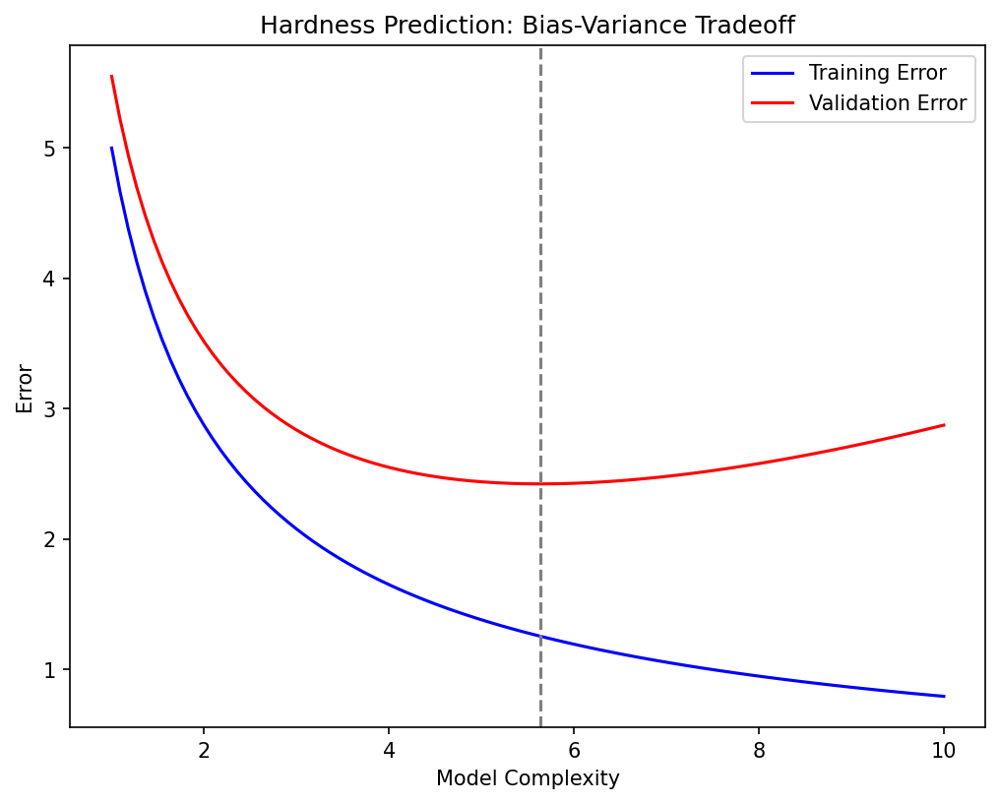
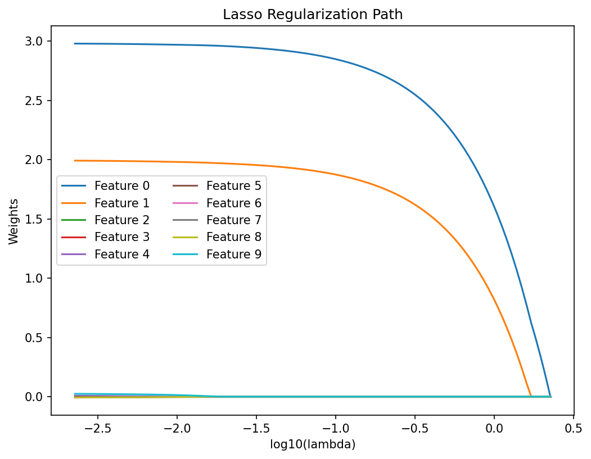
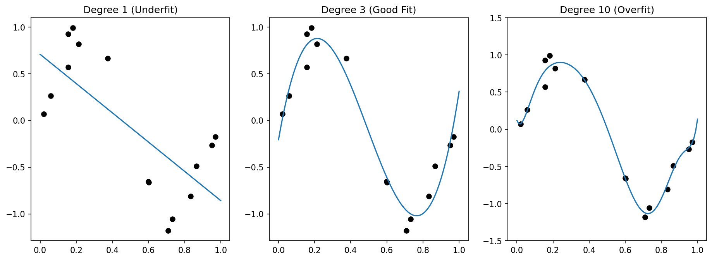

---
title: |
  Mathematical Foundations of AI & ML<br>Unit 8: Generalization, Bias-Variance, and Regularization
bibliography: ref.bib
author:
  - name: Prof. Dr. Philipp Pelz
    affiliation:
      - FAU Erlangen-Nürnberg
format:
  revealjs:
    width: 1920
    height: 1080
    template-partials:
      - title-slide.html
    css: custom.css
    theme: custom.scss
    slide-number: c/t
    logo: "eclipse_logo_small.png"
    footer: "© Philipp Pelz - Mathematical Foundations of AI & ML"
    menu:
      side: left
      loadIcons: true
---


<!-- ===== §1. Framing ===== -->

## Title + Unit 8 positioning

:::: {.incremental}
- Units 1–7 built the machinery: loss functions, architectures, backprop, optimization, and the **probabilistic view** (Unit 7).
- Unit 8 asks the fundamental question: **does the model work on data it has never seen?**
- Generalization is the central goal of machine learning — everything else is in service of it.
- The probabilistic vocabulary from Unit 7 (likelihood, expectations, KL) is what we use to *quantify* the answer.
::::

## Learning outcomes for Unit 8

By the end of this lecture, students can:

:::: {.incremental}
- derive and interpret the bias-variance decomposition of expected prediction error,
- diagnose overfitting vs underfitting from training/validation loss curves,
- formulate Ridge (L2) and Lasso (L1) regularization and explain their geometric effects,
- design a k-fold cross-validation procedure for model selection and hyperparameter tuning.
::::

## Recall: ERM from Unit 1

:::: {.incremental}
- Empirical Risk Minimization: $\hat{\mathbf{w}} = \arg\min_{\mathbf{w}} \frac{1}{N}\sum_{i=1}^{N} L(f_{\mathbf{w}}(\mathbf{x}_i), y_i)$.
- We minimize **empirical** risk (training loss), but we care about **population** risk (expected loss on new data).
- The gap between these two is the core challenge of learning.
::::

## The generalization gap

:::: {.incremental}
- **Generalization gap** = test error − training error.
- A small gap means the model has learned the true pattern.
- A large gap means the model has memorized the training data.
- The gap is not observable during training — we need held-out data to estimate it.
::::


<!-- ===== §2. Why generalization is the central goal ===== -->

## Why generalization is the central goal

:::: {.incremental}
- A model that perfectly fits training data but fails on new data is useless in deployment.
- In engineering applications (materials, manufacturing), deployment failure can be costly and dangerous.
- Every design choice — architecture, regularization, optimizer — should be evaluated by its effect on generalization.
::::

## Overfitting — definition and visual example

:::: {.columns}
:::: {.column width="55%"}
:::: {.incremental}
- **Overfitting**: the model captures noise and idiosyncrasies of the training data instead of the underlying signal.
- Symptom: training error is very low, test error is high.
- Visual: a high-degree polynomial passes through every training point but oscillates wildly between them.
- M = 9 (bottom right) has zero training error but wild oscillations everywhere else.
::::
::::
:::: {.column width="45%"}
![Polynomial fits of degree M = 0, 1, 3, 9 to N = 10 noisy points. The degree-9 fit is a textbook example of overfitting [@bishop2006pattern, Fig. 1.4].](images/bishop_poly_degree_sweep.png){width=100%}
::::
::::

## Underfitting — definition and visual example

:::: {.incremental}
- **Underfitting**: the model is too simple to capture the structure in the data.
- Symptom: both training and test error are high.
- Visual: a straight line fit to clearly nonlinear data misses the pattern entirely.
::::

## The complexity spectrum

:::: {.incremental}
- **Low complexity** (few parameters, simple model): high bias, low variance → underfitting.
- **High complexity** (many parameters, flexible model): low bias, high variance → overfitting.
- The **sweet spot**: enough complexity to capture the signal, not so much that it captures noise.
::::


<!-- ===== §3. Interactive: The Complexity Spectrum ===== -->

## Interactive: The Complexity Spectrum

:::: {.columns}
:::: {.column width="25%"}
```{ojs}
//| echo: false
//| panel: input
viewof polyDegree = Inputs.range([1, 15], {value: 1, step: 1, label: "Polynomial Degree (Complexity)"})
```
**Training Data**: 15 samples
**Noise**: $\sigma = 0.2$

```{ojs}
//| echo: false
html`
<div style="margin-top: 20px;">
  <strong>Train MSE:</strong> ${mse.train.toFixed(3)}<br>
  <strong>Test MSE:</strong> ${mse.test.toFixed(3)}
</div>
`
```
::::
:::: {.column width="75%"}
```{ojs}
//| echo: false
d3 = require("d3@7")
d3_reg = require("d3-regression@1")
seed = 42
randomVal = d3.randomNormal.source(d3.randomLcg(seed))(0, 0.2)
trueFunc = (x) => Math.sin(1.5 * Math.PI * x)

points = {
  const train = Array.from({length: 15}, (_, i) => {
    let x = (i+0.5) / 15 + (d3.randomUniform.source(d3.randomLcg(seed+i))() - 0.5) * 0.05;
    return {x: x, y: trueFunc(x) + randomVal(), type: "train"};
  });
  const test = Array.from({length: 100}, (_, i) => {
    let x = (i+0.5) / 100;
    return {x: x, y: trueFunc(x) + randomVal(), type: "test"};
  });
  return [...train, ...test];
}

trainPts = points.filter(d => d.type === "train")
testPts = points.filter(d => d.type === "test")

polyModel = {
  try {
    return d3_reg.regressionPoly().x(d => d.x).y(d => d.y).order(polyDegree)(trainPts);
  } catch(e) {
    // fallback if d3-regression fails for very high degrees/collinearity
    return {predict: (x) => 0}; 
  }
}

mse = {
  const trainMSE = d3.mean(trainPts, d => Math.pow(polyModel.predict(d.x) - d.y, 2));
  const testMSE = d3.mean(testPts, d => Math.pow(polyModel.predict(d.x) - d.y, 2));
  return {train: trainMSE || 0, test: testMSE || 0};
}

Plot.plot({
  width: 1000,
  height: 600,
  y: {domain: [-2, 2], grid: true},
  x: {domain: [0, 1], grid: true},
  color: {domain: ["train", "test"], range: ["red", "steelblue"]},
  marks: [
    Plot.dot(points, {x: "x", y: "y", fill: "type", fillOpacity: 0.8, r: d => d.type === "train" ? 6 : 3}),
    Plot.line(d3.range(0, 1.01, 0.01), {x: d => d, y: d => trueFunc(d), stroke: "gray", strokeDasharray: "4,4", strokeWidth: 2, title: "True Function"}),
    Plot.line(d3.range(0, 1.01, 0.01).map(x => ({x: x, y: polyModel.predict(x)})), {x: "x", y: "y", stroke: "orange", strokeWidth: 4, title: "Fitted Model", clip: true})
  ]
})
```
::::
::::

## Detecting overfitting in practice

:::: {.columns}
:::: {.column width="55%"}
:::: {.incremental}
- Plot training loss and validation loss over training epochs.
- **Healthy**: both decrease and converge.
- **Overfitting**: training loss continues to decrease while validation loss starts increasing.
- The divergence point suggests when to stop training (early stopping) [@neuer2024machine].
::::

![Train vs test RMS error as a function of polynomial order M. Low M → underfitting; M = 9 → test error explodes [@bishop2006pattern, Fig. 1.5].](images/bishop_train_test_rms_vs_degree.png){width=90%}
::::
:::: {.column width="45%"}
![Overfitting boundary in a classification setting [@neuer2024machine, Fig. 4.8]: the overfit boundary memorizes noise and fails to generalize.](images/neuer_overfitting_classification.png){width=95%}
::::
::::

## Engineering consequence: false confidence

:::: {.incremental}
- A model with 99% training accuracy may have 60% test accuracy.
- In materials science: a property-prediction model that overfits may suggest alloy compositions that fail experimentally.
- Perfect training fit can mask catastrophic deployment failure — always validate on held-out data.
::::

## Setup: expected prediction error

:::: {.incremental}
- Consider the expected loss over both the training data $\mathcal{D}$ and a new test point $(\mathbf{x}, y)$:

$$
\text{EPE}(\mathbf{x}) = \mathbb{E}_{\mathcal{D}} \mathbb{E}_{y|\mathbf{x}} \big[ (y - \hat{f}_{\mathcal{D}}(\mathbf{x}))^2 \big]
$$
::::

:::: {.incremental}
- This averages over all possible training sets and all possible true outputs at $\mathbf{x}$.
::::


<!-- ===== §4. Decomposing squared error — step 1 ===== -->

## Decomposing squared error — step 1

:::: {.incremental}
- Add and subtract the expected prediction $\mathbb{E}_{\mathcal{D}}[\hat{f}(\mathbf{x})]$:
::::

::: {.fragment}
$$
y - \hat{f}(\mathbf{x}) = \underbrace{(y - f(\mathbf{x}))}_{\text{noise}} + \underbrace{(f(\mathbf{x}) - \mathbb{E}_{\mathcal{D}}[\hat{f}(\mathbf{x})])}_{\text{bias}} + \underbrace{(\mathbb{E}_{\mathcal{D}}[\hat{f}(\mathbf{x})] - \hat{f}(\mathbf{x}))}_{\text{variance term}}
$$
:::

## Decomposing squared error — step 2

:::: {.incremental}
- Square the expression and take expectations.
::::

:::: {.incremental}
- Cross-terms vanish because noise is independent of the model and $\mathbb{E}_{\mathcal{D}}[\hat{f}(\mathbf{x}) - \mathbb{E}_{\mathcal{D}}[\hat{f}(\mathbf{x})]] = 0$.
::::

:::: {.incremental}
- The three surviving terms give us the decomposition.
::::

## The three components

::: {.fragment}
$$
\text{EPE}(\mathbf{x}) = \underbrace{\sigma^2_{\text{noise}}}_{\text{irreducible}} + \underbrace{\big(\mathbb{E}_{\mathcal{D}}[\hat{f}(\mathbf{x})] - f(\mathbf{x})\big)^2}_{\text{Bias}^2} + \underbrace{\mathbb{E}_{\mathcal{D}}\big[(\hat{f}(\mathbf{x}) - \mathbb{E}_{\mathcal{D}}[\hat{f}(\mathbf{x})])^2\big]}_{\text{Variance}}
$$
:::

:::: {.incremental}
- **Bias²**: systematic error from model assumptions.
- **Variance**: sensitivity to the specific training set.
- **Noise**: irreducible — the Bayes error [@bishop2006pattern].
::::

## Bias — interpretation

:::: {.incremental}
- Bias measures how far the **average** prediction (over all possible training sets) is from the truth.
- High bias means the model class cannot represent the true function.
- Example: fitting a linear model to quadratic data — no amount of data will fix the systematic error.
- Bias is a property of the **model family**, not the specific training set.
::::


<!-- ===== §5. Variance — interpretation ===== -->

## Variance — interpretation

:::: {.incremental}
- Variance measures how much the prediction **changes** when we draw a different training set.
- High variance means the model is too sensitive to the particular data it was trained on.
- Example: a degree-15 polynomial changes dramatically with each new training sample.
- Variance is controlled by model complexity and training set size.
::::

## Intrinsic noise / Bayes error

:::: {.incremental}
- The noise term $\sigma^2$ represents inherent randomness in the data-generating process.
- No model — no matter how complex — can reduce the error below this floor.
- In materials science: measurement noise, batch-to-batch variability, uncontrolled environmental factors.
- Estimating $\sigma^2$ helps set realistic performance expectations.
::::

## The bias-variance tradeoff

:::: {.columns}
:::: {.column width="55%"}
:::: {.incremental}
- **Increasing complexity**: bias decreases (model can fit more patterns), variance increases (model fits noise too).
- **Decreasing complexity**: variance decreases (model is stable), bias increases (model misses structure).
- Optimal complexity minimizes the **sum** Bias² + Variance.
- This is the most fundamental tradeoff in machine learning [@murphy2012machine].
::::
::::
:::: {.column width="45%"}
![High-bias (top) vs high-variance (bottom) regime visualised by 20 fitted curves and their mean (red) vs the true function (green). [@murphy2012machine, Fig. 6.5] (based on [@bishop2006pattern, Fig. 3.5])](images/murphy_bias_variance_ridge_illustration.png){width=100%}
::::
::::

## Visual: U-shaped total error curve — from data

![Bias², variance, and their sum vs regularization strength ln(λ). The minimum of Bias² + Variance (≈ ln λ = −0.31) closely matches the test-set error minimum — the operational sweet spot [@bishop2006pattern, Fig. 3.6].](images/bishop_bias_variance_tradeoff_curve.png){width=60% fig-align="center"}

## Visual: U-shaped total error curve — schematic

```{mermaid}
%%| echo: false
%%| fig-align: center
%%| align: center
graph LR
    C["Model Complexity"] --> B["Bias decreases"]
    C --> V["Variance increases"]
    B --> E["Total Error"]
    V --> E
    N["Noise"] --> E
    style E fill:#f9f,stroke:#333,stroke-width:4px
    style C fill:#ccf,stroke:#333
```

:::: {.incremental}
- Plot Bias², Variance, and total error against model complexity.
- Bias² decreases monotonically with complexity.
- Variance increases monotonically with complexity.
- Total error = Bias² + Variance + noise: a **U-shaped** curve with a minimum at optimal complexity.
::::


## Modern view: double descent

:::: {.columns}
:::: {.column width="55%"}
:::: {.incremental}
- Classical theory predicts a **U-shaped** test error curve: error falls, then rises with model complexity.
- Modern overparameterized models (deep neural networks) show a **second descent**: beyond the interpolation threshold, test error falls again.
- The interpolation threshold occurs when the number of parameters equals the number of training points.
- Beyond the threshold, the model is expressive enough to interpolate — but the **minimum-norm** solution generalizes well [@belkin2019reconciling; @nakkiran2020deep].
::::
::::
:::: {.column width="45%"}
![Double descent in a two-layer neural network: training error (blue squares) falls to zero at the interpolation threshold, while test error (black circles) peaks then decreases again in the overparameterized regime [@rocks2022memorizing].](images/double_descent_rocks2022.png){width=100%}
::::
::::


<!-- ===== §6. Interactive: Bias and Variance Demystified ===== -->

## Interactive: Bias and Variance Demystified

:::: {.columns}
:::: {.column width="25%"}
```{ojs}
//| echo: false
//| panel: input
viewof bvDegree = Inputs.range([1, 12], {value: 3, step: 1, label: "Model Complexity (Degree)"})
viewof numSamples = Inputs.range([5, 50], {value: 10, step: 5, label: "Number of Datasets"})
viewof showAverage = Inputs.toggle({label: "Show Expected Fit (Bias)", value: false})
```
- Each faint blue curve is trained on a different dataset sampled from the true distribution.
- The spread of these curves represents **Variance**.
- The distance from the red average curve to the true function represents **Bias**.
::::
:::: {.column width="75%"}
```{ojs}
//| echo: false
bvDatasets = {
  const sets = [];
  for(let i=0; i<numSamples; i++) {
    const rng = d3.randomNormal.source(d3.randomLcg(seed * 10 + i))(0, 0.4);
    const pts = Array.from({length: 12}, (_, j) => {
      let x = (j+0.5)/12 + (d3.randomUniform.source(d3.randomLcg(seed * 100 + i*12 + j))() - 0.5) * 0.05;
      return {x: x, y: trueFunc(x) + rng()};
    });
    sets.push(pts);
  }
  return sets;
}

bvModels = bvDatasets.map(pts => d3_reg.regressionPoly().x(d=>d.x).y(d=>d.y).order(bvDegree)(pts))

bvLines = bvModels.flatMap((model, i) => {
  return d3.range(0, 1.05, 0.05).map(x => ({x: x, y: model.predict(x), lineId: i, type: "individual"}));
})

bvAverageLine = {
  const xs = d3.range(0, 1.05, 0.05);
  return xs.map(x => {
    const sum = bvModels.reduce((acc, m) => acc + m.predict(x), 0);
    return {x: x, y: sum / numSamples, type: "average"};
  });
}

Plot.plot({
  width: 1000,
  height: 600,
  y: {domain: [-2, 2], grid: true},
  x: {domain: [0, 1], grid: true},
  marks: [
    Plot.line(d3.range(0, 1.01, 0.01), {x: d => d, y: d => trueFunc(d), stroke: "gray", strokeDasharray: "4,4", strokeWidth: 3, title: "True Function"}),
    Plot.line(bvLines, {x: "x", y: "y", z: "lineId", stroke: "steelblue", strokeOpacity: 0.2, strokeWidth: 2, clip: true}),
    showAverage ? Plot.line(bvAverageLine, {x: "x", y: "y", stroke: "red", strokeWidth: 5, strokeDasharray: "2,2", title: "Average Fit", clip: true}) : null
  ]
})
```
::::
::::

## Example: polynomial regression

:::: {.columns}
:::: {.column width="55%"}
:::: {.incremental}
- **Degree 1**: high bias (line cannot capture curvature), low variance → underfitting.
- **Degree 3–5**: moderate bias and variance → good fit.
- **Degree 15**: low bias (passes through training points), high variance (oscillates wildly) → overfitting.
- The optimal degree depends on the data: amount of noise, sample size, true function complexity.
::::
::::
:::: {.column width="45%"}
![L = 100 datasets fitted with different regularization strengths. Left column: individual fits. Right column: ensemble mean vs true sinusoid. High λ → low variance, high bias (top); low λ → high variance, low bias (bottom). [@bishop2006pattern, Fig. 3.5]](images/bishop_bias_variance_fitted_curves.png){width=100%}
::::
::::

## Example: Ridge regression and the tradeoff

:::: {.columns}
:::: {.column width="55%"}
:::: {.incremental}
- Ridge regression with regularization parameter $\lambda$:
  - High $\lambda$: heavy shrinkage → high bias, low variance.
  - Low $\lambda$: minimal shrinkage → low bias, high variance.
- $\lambda$ acts as a **complexity knob** that traces out the bias-variance tradeoff.
- Optimal $\lambda$ minimizes total MSE, not training error [@murphy2012machine].
::::
::::
:::: {.column width="45%"}
![Degree-14 polynomial with increasing L2 regularization. Left (λ ≈ 0): wiggly overfit. Right (large λ): over-smoothed. Stars mark the same λ values as in Figure 7.8. [@murphy2012machine, Fig. 7.7]](images/murphy_poly_regularization_fit.png){width=100%}
::::
::::

## Checkpoint: why is the MLE not always best?

:::: {.incremental}
- Maximum Likelihood Estimation is **unbiased** but can have high variance.
- A biased estimator (MAP / regularized) can achieve lower total MSE.
- The key insight: introducing a small bias can yield a large variance reduction.
- This is the mathematical justification for regularization.
::::


<!-- ===== §7. Regularization — the key idea ===== -->

## Regularization — the key idea

:::: {.incremental}
- Add a **penalty** to the loss function that discourages unnecessary complexity:

$$
J_{\text{reg}}(\mathbf{w}) = \underbrace{\frac{1}{N}\sum_{i=1}^{N} L(\hat{y}_i, y_i)}_{\text{data fit}} + \underbrace{\lambda \cdot \Omega(\mathbf{w})}_{\text{complexity penalty}}
$$
::::

:::: {.incremental}
- The penalty $\Omega(\mathbf{w})$ grows with model complexity.
- $\lambda > 0$ controls the strength of regularization.
::::

## Regularized ERM

:::: {.incremental}
- The regularized optimization problem:

$$
\hat{\mathbf{w}} = \arg\min_{\mathbf{w}} \left[ R_N(\mathbf{w}) + \lambda \, \Omega(\mathbf{w}) \right]
$$
::::

:::: {.incremental}
- $\lambda = 0$: no regularization (pure ERM).
- $\lambda \to \infty$: penalty dominates — model collapses to the simplest possible solution.
- Choosing $\lambda$ is a **model selection** problem, not a parameter estimation problem.
::::

## Ridge regression (L2 penalty)

:::: {.incremental}
- Penalty: $\Omega(\mathbf{w}) = \|\mathbf{w}\|_2^2 = \sum_j w_j^2$.
- Loss:

$$
L_{\text{ridge}} = \sum_{i=1}^{N}(\hat{y}_i - y_i)^2 + \lambda \|\mathbf{w}\|_2^2
$$
::::

:::: {.incremental}
- Effect: shrinks all coefficients toward zero, but none exactly to zero.
- Equivalent to a Gaussian prior on weights in Bayesian interpretation.
::::

## Ridge regression — closed-form solution

:::: {.columns}
:::: {.column width="55%"}
::: {.fragment}
$$
\hat{\mathbf{w}}_{\text{ridge}} = (\mathbf{X}^\top\mathbf{X} + \lambda\mathbf{I})^{-1}\mathbf{X}^\top\mathbf{y}
$$
:::

:::: {.incremental}
- Adding $\lambda\mathbf{I}$ makes the matrix **always invertible** (even if $\mathbf{X}^\top\mathbf{X}$ is singular).
- This stabilizes the solution when features are correlated or $p > N$.
- The closed form connects regularization directly to linear algebra [@mcclarren2021machine].
::::
::::
:::: {.column width="45%"}
![Effect of regularization strength on an M = 9 polynomial. ln λ = −18 (left) suppresses overfitting; ln λ = 0 (right) over-shrinks. [@bishop2006pattern, Fig. 1.7]](images/bishop_regularization_lambda_effect.png){width=100%}

![Ridge circular constraint [@mcclarren2021machine, Fig. 2.7]: The LS unconstrained optimum is outside the circle; the ridge solution (star) lands on the boundary.](images/mcclarren_ridge_geometric_view.png){width=100%}
::::
::::


<!-- ===== §8. Ridge regression — geometric view ===== -->

## Ridge regression — geometric view

:::: {.columns}
:::: {.column width="55%"}
:::: {.incremental}
- The unconstrained optimum lies at the OLS solution.
- Ridge constrains the solution to lie within a **sphere** $\|\mathbf{w}\|_2^2 \leq t$.
- The regularized solution is the point on the sphere closest to the OLS solution.
- Contour plot: elliptical loss contours intersect the circular constraint region.
::::
::::
:::: {.column width="45%"}
![Ridge (circle, left) vs Lasso (diamond, right) constraint regions with OLS error ellipses. The lasso solution lands at a corner, setting w₁* = 0 exactly. [@bishop2006pattern, Fig. 3.4]](images/bishop_ridge_lasso_constraint_regions.png){width=100%}
::::
::::

## Lasso regression (L1 penalty)

:::: {.incremental}
- Penalty: $\Omega(\mathbf{w}) = \|\mathbf{w}\|_1 = \sum_j |w_j|$.
- Loss:

$$
L_{\text{lasso}} = \sum_{i=1}^{N}(\hat{y}_i - y_i)^2 + \lambda \|\mathbf{w}\|_1
$$
::::

:::: {.incremental}
- Key property: Lasso can set coefficients **exactly to zero** — it performs **variable selection**.
::::

## Lasso — geometric view and sparsity

:::: {.columns}
:::: {.column width="50%"}
:::: {.incremental}
- The L1 constraint region is a **diamond** (in 2D) or cross-polytope (in higher dimensions).
- The diamond has **corners** that lie on coordinate axes.
- Loss contours are more likely to intersect a corner → some coefficients become exactly zero.
- This geometric property is why L1 promotes sparsity while L2 does not [@mcclarren2021machine].
::::
::::
:::: {.column width="50%"}
![Lasso diamond constraint [@mcclarren2021machine, Fig. 2.8]: The elliptic error contours touch the diamond at a corner — one coefficient is exactly zero, producing a sparse solution.](images/mcclarren_lasso_diamond_geometric.png){width=95%}
::::
::::

## Interactive Geometry: Ridge vs Lasso

:::: {.columns}
:::: {.column width="25%"}
```{ojs}
//| echo: false
//| panel: input
viewof regType = Inputs.radio(["Lasso (L1)", "Ridge (L2)"], {value: "Lasso (L1)", label: "Regularization Type"})
viewof constraintT = Inputs.range([0.1, 3], {value: 1.5, step: 0.05, label: "Constraint Bound (t)"})
```
- A geometric view of minimizing $MSE(\mathbf{w})$ subject to $\Omega(\mathbf{w}) \leq t$.
- In the dual, a smaller $t$ corresponds to a larger $\lambda$.
- Notice how the optimal regularized solution (red dot) naturally strikes the corners of the L1 diamond, setting $w_2=0$ identically.
::::
:::: {.column width="75%"}
```{ojs}
//| echo: false

constraintRegion = {
  if (regType === "Ridge (L2)") {
    return d3.range(0, 2 * Math.PI + 0.1, 0.1).map(theta => {
      const r = constraintT;
      return {w1: r * Math.cos(theta), w2: r * Math.sin(theta)};
    });
  } else {
    return [
      {w1: constraintT, w2: 0},
      {w1: 0, w2: constraintT},
      {w1: -constraintT, w2: 0},
      {w1: 0, w2: -constraintT},
      {w1: constraintT, w2: 0}
    ];
  }
}

minPointPerfect = {
  const unconstrainedLoss = 0; 
  let inRegion = false;
  if (regType === "Ridge (L2)") {
    inRegion = (2*2 + 1*1) <= constraintT*constraintT;
  } else {
    inRegion = (2 + 1) <= constraintT;
  }
  
  if (inRegion) return {w1: 2, w2: 1};

  let minLoss = Infinity;
  let bestW1 = 0, bestW2 = 0;
  
  if (regType === "Ridge (L2)") {
    for (let theta = 0; theta < 2*Math.PI; theta += 0.01) {
      let w1 = constraintT * Math.cos(theta);
      let w2 = constraintT * Math.sin(theta);
      let loss = Math.pow(w1 - 2, 2) + 3 * Math.pow(w2 - 1, 2);
      if (loss < minLoss) { minLoss = loss; bestW1 = w1; bestW2 = w2; }
    }
  } else {
    const segments = [
      {sw1: constraintT, sw2: 0, ew1: 0, ew2: constraintT},
      {sw1: 0, sw2: constraintT, ew1: -constraintT, ew2: 0},
      {sw1: -constraintT, sw2: 0, ew1: 0, ew2: -constraintT},
      {sw1: 0, sw2: -constraintT, ew1: constraintT, ew2: 0}
    ];
    for (const seg of segments) {
      for (let alpha = 0; alpha <= 1; alpha += 0.005) {
        let w1 = seg.sw1 * (1 - alpha) + seg.ew1 * alpha;
        let w2 = seg.sw2 * (1 - alpha) + seg.ew2 * alpha;
        let loss = Math.pow(w1 - 2, 2) + 3 * Math.pow(w2 - 1, 2);
        if (loss < minLoss) { minLoss = loss; bestW1 = w1; bestW2 = w2; }
      }
    }
  }
  
  if (regType === "Lasso (L1)") {
     if (Math.abs(bestW1) < 0.05) { bestW1 = 0; bestW2 = constraintT * Math.sign(bestW2); }
     if (Math.abs(bestW2) < 0.05) { bestW2 = 0; bestW1 = constraintT * Math.sign(bestW1); }
  }
  
  return {w1: bestW1, w2: bestW2};
}

contourLines = {
  const lines = [];
  const minLoss = Math.pow(minPointPerfect.w1 - 2, 2) + 3 * Math.pow(minPointPerfect.w2 - 1, 2);
  const levels = [0.5, 2, 4, 8, 12, minLoss];
  for (const C of levels) {
    if (C < 0) continue;
    const pts = [];
    for (let alpha = 0; alpha <= 2*Math.PI + 0.1; alpha += 0.05) {
      pts.push({
        w1: 2 + Math.sqrt(C) * Math.cos(alpha),
        w2: 1 + Math.sqrt(C/3) * Math.sin(alpha),
        level: C,
        isMin: Math.abs(C - minLoss) < 0.01
      });
    }
    lines.push(pts);
  }
  return lines;
}

Plot.plot({
  width: 800,
  height: 600,
  x: {domain: [-2, 3], grid: true, label: "Coefficient w1"},
  y: {domain: [-2, 3], grid: true, label: "Coefficient w2"},
  marks: [
    ...contourLines.map(pts => 
      Plot.line(pts, {x: "w1", y: "w2", stroke: d => d.isMin[0] ? "red" : "gray", strokeWidth: d => d.isMin[0] ? 3 : 1})
    ),
    Plot.line(constraintRegion, {x: "w1", y: "w2", stroke: "steelblue", fill: "steelblue", fillOpacity: 0.2, strokeWidth: 2}),
    Plot.dot([minPointPerfect], {x: "w1", y: "w2", fill: "red", r: 8}),
    Plot.dot([{w1: 2, w2: 1}], {x: "w1", y: "w2", fill: "black", r: 5, stroke: "white"}),
    Plot.text([{w1: 2, w2: 1.15}], {x: "w1", y: "w2", text: () => "OLS Unconstrained Min", fill: "black"})
  ]
})
```
::::
::::


<!-- ===== §9. Ridge vs Lasso — side-by-side comparison ===== -->

## Ridge vs Lasso — side-by-side comparison

:::: {.columns}
:::: {.column width="70%"}
| Property | Ridge (L2) | Lasso (L1) |
|----------|:----------:|:----------:|
| Penalty | $\sum w_j^2$ | $\sum \|w_j\|$ |
| Sparsity | No (shrinks all) | Yes (zeroes some) |
| Closed form | Yes | No (requires optimization) |
| Correlated features | Keeps all, shrinks equally | Selects one arbitrarily |
| Best for | Many relevant features | Few relevant features |
::::

:::: {.column width="30%"}
:::: {.incremental}
- **Ridge**: Shrinks coefficients toward zero, stabilizes solutions.
- **Lasso**: Zeroes out coefficients, performs feature selection.
- **Guideline**: Use Lasso if you expect a sparse underlying signal [@mcclarren2021machine].
::::
::::
::::

## Elastic net (brief)

:::: {.incremental}
- Combines L1 and L2 penalties:

$$
\Omega(\mathbf{w}) = \alpha \|\mathbf{w}\|_1 + (1 - \alpha) \|\mathbf{w}\|_2^2
$$
::::

:::: {.incremental}
- Gets sparsity from L1 and stability from L2.
- Handles correlated feature groups better than pure Lasso.
- $\alpha$ interpolates between Ridge ($\alpha = 0$) and Lasso ($\alpha = 1$).
::::

## Normalization requirement

:::: {.incremental}
- Regularization penalizes coefficient **magnitude**.
- If features have different scales, the penalty is inconsistent: large-scale features get penalized more.
- **Always normalize/standardize features before applying regularization.**
- Standard approach: zero mean, unit variance for each feature [@mcclarren2021machine].
::::

## Dropout as regularization (neural networks)

:::: {.incremental}
- During training, randomly set each neuron's output to zero with probability $p$.
- Effect: the network cannot rely on any single neuron → prevents **co-adaptation**.
- At test time, scale activations by $(1-p)$ to compensate.
- Dropout is equivalent to training an ensemble of $2^H$ sub-networks (where $H$ = number of hidden units).
::::


<!-- ===== §10. Choosing lambda — preview of cross-validation ===== -->

## Choosing lambda — preview of cross-validation

:::: {.incremental}
- $\lambda$ is a **hyperparameter** — it controls model complexity but is not a model parameter.
- It cannot be learned from training data alone (that would just lead to $\lambda = 0$).
- We need a principled method to select $\lambda$: **cross-validation**.
::::

## Train / validation / test — the three roles

:::: {.incremental}
- **Training set**: used to fit model parameters $\mathbf{w}$.
- **Validation set**: used to tune hyperparameters ($\lambda$, architecture, learning rate).
- **Test set**: used **once** for final performance evaluation — never used during development.
- Typical split: 60% train / 20% validation / 20% test.
::::

## Why we need three sets, not two

:::: {.incremental}
- If we use the test set to select $\lambda$, the reported test performance is **optimistically biased**.
- The test set must remain untouched until the very end.
- The validation set absorbs the selection bias instead.
- Violation of this principle is one of the most common mistakes in applied ML.
::::

## k-fold cross-validation — procedure

:::: {.columns}
:::: {.column width="55%"}
:::: {.incremental}
1. Split data into $k$ equal folds.
2. For each fold $j = 1, \dots, k$:
   - Train on all folds except fold $j$.
   - Evaluate on fold $j$.
3. Average the $k$ performance estimates:

$$
\text{CV}(k) = \frac{1}{k} \sum_{j=1}^{k} R_{\text{test}}^{(j)}
$$
::::

:::: {.incremental}
- Common choice: $k = 5$ or $k = 10$ [@neuer2024machine].
::::
::::
:::: {.column width="45%"}
![5-fold cross-validation: training data is split into 5 folds; each fold serves once as the validation set while the model trains on the remaining four. The held-out test set is used only for final evaluation [@scikit-learn].](images/sklearn_kfold_cv.png){width=100%}
::::
::::


<!-- ===== §11. k-fold cross-validation — variance reduction ===== -->

## k-fold cross-validation — variance reduction

:::: {.incremental}
- Every data point is used for both training and evaluation (in different folds).
- More efficient use of limited data compared to a single train/validation split.
- The averaged estimate has lower variance than a single hold-out estimate.
- Tradeoff: $k$ times more expensive computationally.
::::

## Choosing lambda via CV

:::: {.columns}
:::: {.column width="55%"}
:::: {.incremental}
- For each candidate $\lambda$, compute the CV error $\text{CV}(\lambda)$.
- Plot $\text{CV}(\lambda)$ vs $\log(\lambda)$.
- Select $\lambda^*$ at the minimum of the CV curve.
- The **one-standard-error rule**: pick the simplest model within one SE of the minimum [@murphy2012machine].
::::
::::
:::: {.column width="45%"}
![Train MSE (dashed blue) and test MSE (solid red) vs log(λ) for ridge-regularized degree-14 polynomial. Right of minimum = underfit. Left of minimum = overfit. [@murphy2012machine, Fig. 7.8a]](images/murphy_train_test_mse_vs_lambda.png){width=100%}

![5-fold CV error vs log(λ) with one-SE rule (blue line) for selecting a parsimonious λ. [@murphy2012machine, Fig. 6.6b]](images/murphy_cv_lambda_selection.png){width=100%}
::::
::::

<!-- ===== §12. Model selection: complexity vs performance ===== -->

## Model selection: complexity vs performance

:::: {.incremental}
- Cross-validation is not limited to tuning $\lambda$.
- Compare entirely different model families: linear, polynomial, neural network, random forest.
- For each model, tune its hyperparameters via inner CV loop.
- Select the model family with the best outer CV performance.
::::

## Checkpoint MCQ slide

:::: {.incremental}
- **Scenario**: A student uses the test set to tune $\lambda$, then reports test set accuracy as the model's generalization performance. What goes wrong?

- A) Nothing — this is standard practice.
- B) The reported accuracy is pessimistically biased.
- C) The reported accuracy is optimistically biased.
- D) The model will underfit.

- **Answer**: C — the test set was used for selection, so it no longer provides an unbiased estimate.
::::

## Materials example: overfitting in alloy property prediction

:::: {.incremental}
- Setting: predicting hardness from 50 compositional features using only 200 samples.
- Without regularization: the model memorizes training data and predicts poorly on new alloys.
- With Ridge regularization ($\lambda$ selected via 5-fold CV): test error drops by 40%.
- Lesson: when $p/N$ is large, regularization is not optional — it is essential.
::::

:::: {.column width="50%"}
{width=80%}
::::


<!-- ===== §13. Materials example: Lasso for identifying governing features ===== -->

## Materials example: Lasso for identifying governing features

:::: {.incremental}
- Starting from 100 candidate features (composition, processing, microstructure).
- Lasso with increasing $\lambda$ progressively zeros out irrelevant features.
- The surviving features align with known physical mechanisms (grain size, carbon content, cooling rate).
- Lasso provides both prediction and **interpretability**.
::::

:::: {.column width="50%"}
{width=80%}
::::

## Materials example: polynomial models for process-property curves

:::: {.incremental}
- A high-degree polynomial captures batch-to-batch noise in sintering temperature vs density data.
- A low-degree polynomial misses the genuine nonlinearity (plateau near full density).
- Cross-validation identifies degree 3 as the sweet spot for this dataset.
- This is the bias-variance tradeoff in action on real engineering data.
::::

:::: {.column width="100%"}
{width=80%}
::::

<!-- ===== §13. Tree-based methods: ensembles through the bias-variance lens ===== -->

## Trees, forests, and boosting — where they fit

:::: {.incremental}
- We just spent the unit on bias-variance decomposition and regularization.
- Two practical model families are best understood **directly** through this lens:
  - **Random Forests** = variance reduction by averaging.
  - **Gradient Boosting** = bias reduction by sequential refinement.
- For tabular materials data, these usually beat neural networks. Knowing them well is non-negotiable for a working materials engineer.
::::

:::: {.notes}
- Pivot from regularized linear models to ensembles.
- Frame the next 12 slides as direct applications of bias-variance theory.
- Practical aside: Kaggle leaderboards on tabular data are dominated by gradient boosting (XGBoost, LightGBM, CatBoost).
::::

## Decision trees — a single learner

:::: {.columns}
:::: {.column width="55%"}
A decision tree partitions input space by axis-aligned splits.

- Internal node: a test like *"Cr fraction $> 0.18$?"*
- Leaf: a constant prediction (mean for regression, majority class for classification).
- Prediction: route a new $x$ down the tree to its leaf.
::::
:::: {.column width="45%"}
- Trees are **non-parametric**: capacity grows with depth.
- Naturally handle mixed feature types (continuous, categorical, binary).
- No normalization needed — splits are scale-invariant.
::::
::::

:::: {.notes}
- Trees feel different from regression and NNs but are mathematically piecewise-constant function approximators.
- The "no normalization" point is a major practical advantage on tabular materials data.
::::

## How splits are chosen

At each node, choose the feature and threshold that **maximize impurity reduction**:

$$
\Delta = I(\text{parent}) - \frac{N_L}{N} I(\text{left}) - \frac{N_R}{N} I(\text{right}).
$$

:::: {.incremental}
- **Regression**: $I = $ within-node variance (squared-error reduction).
- **Classification**: $I = $ Gini impurity $\sum_c p_c (1 - p_c)$ or entropy $-\sum_c p_c \log p_c$.
- The split search is **greedy** — best split at each node, no backtracking.
::::

:::: {.notes}
- Greedy splitting is what makes trees fast (~$O(N d \log N)$).
- Greedy = not globally optimal. The price for tractability.
::::

## A single tree is a high-variance learner

:::: {.incremental}
- Stop splitting too early → underfit (high bias, low variance).
- Grow to pure leaves → fits training data perfectly (low bias, **high variance**).
- A small change in training data can completely reshape a deep tree.
- Pruning helps but is fragile.
::::

:::: {.fragment}
**This is exactly the regime where averaging helps.** Cue ensembles.
::::

:::: {.notes}
- This slide closes the loop with bias-variance: trees occupy the high-variance corner.
- Pruning is a one-tree fix; ensembling is the more powerful move.
::::

## Bagging — variance reduction by averaging

**B**ootstrap **agg**regat**ing** [@breiman1996bagging]:

:::: {.incremental}
1. Draw $B$ bootstrap samples from the training data (sample with replacement, same size $N$).
2. Train one tree per bootstrap sample (no pruning, fully grown).
3. Average their predictions: $\hat f_{\text{bag}}(x) = \frac{1}{B}\sum_{b=1}^B \hat f_b(x)$.
::::

:::: {.fragment}
$$\mathrm{Var}\!\left(\frac{1}{B}\sum_b \hat f_b\right) = \frac{\sigma^2}{B} + \rho\!\left(1 - \frac{1}{B}\right)\sigma^2.$$

Variance shrinks as $B$ grows — but only as fast as tree-pair correlation $\rho$ allows.
::::

:::: {.notes}
- The variance formula is the entire reason bagging works — and the entire reason RF improves on bagging.
- Tree predictions on similar bootstrap samples are correlated, which the next slide fixes.
::::

## Random forest = bagging + random feature subsets

:::: {.incremental}
- At each split, search only a **random subset** of features (typical: $\sqrt{d}$ for classification, $d/3$ for regression).
- This **decorrelates** the trees: $\rho \downarrow$, so the variance reduction from averaging is much larger.
- All other tree mechanics unchanged.
- Default in scikit-learn: `RandomForestRegressor`, `RandomForestClassifier` [@breiman2001randomforests].
::::

:::: {.fragment}
**Performance**: with $B = 500$ trees and reasonable feature subsetting, RF usually beats a tuned single tree by a wide margin.
::::

:::: {.notes}
- Breiman's 2001 insight: don't just bag, also decorrelate.
- 500 trees is the typical default; more rarely hurt, just cost time.
::::

## Random forest in practice

:::: {.incremental}
- **Out-of-bag (OOB) error**: each bootstrap sample omits ~37% of training data; predict on those for a free CV-like estimate.
- **Feature importance**: aggregate the impurity reduction each feature contributes across all splits in all trees.
- **Hyperparameters that matter**: number of trees ($B$), min samples per leaf, max features per split.
- **Hyperparameters that mostly don't**: tree depth (let them grow), splitting criterion.
::::

:::: {.notes}
- OOB is one of the most underused diagnostic tools in tabular ML — free generalization estimate, no held-out split needed.
- Feature importance is where engineering interpretation begins: which compositions / parameters drive the prediction?
::::

## Boosting — sequential bias reduction

:::: {.incremental}
- Bagging averages many low-bias, high-variance learners → reduces variance.
- **Boosting** does the opposite: it builds a sequence of *high-bias, low-variance* learners (shallow trees, "weak learners"), each correcting the residual error of the previous ensemble.
- $\hat f^{(t)}(x) = \hat f^{(t-1)}(x) + \eta \cdot h_t(x)$.
- Result: bias decreases as the ensemble grows.
::::

:::: {.fragment}
Where bagging averages independent learners, boosting *composes* dependent learners.
::::

:::: {.notes}
- Sequential vs parallel is the conceptual contrast.
- AdaBoost (1997) was the first; today everything is gradient boosting.
::::

## Gradient boosting — fit the negative gradient

For loss $\mathcal{L}$, at iteration $t$:

:::: {.incremental}
1. Compute pseudo-residuals: $r_i^{(t)} = -\partial \mathcal{L}(y_i, \hat f^{(t-1)}(x_i)) / \partial \hat f^{(t-1)}(x_i)$.
2. Fit a small tree $h_t$ to predict the residuals.
3. Update: $\hat f^{(t)} = \hat f^{(t-1)} + \eta \cdot h_t$.
::::

:::: {.fragment}
$\eta$: learning rate (shrinkage). Small $\eta$ + many trees > large $\eta$ + few trees.
::::

:::: {.notes}
- For squared error, the pseudo-residual is the ordinary residual $y - \hat f(x)$. For other losses (logistic, Huber), the gradient gives a more meaningful target.
- This is gradient descent in *function space* rather than parameter space.
::::

## XGBoost, LightGBM, CatBoost

The 2025 toolbox for tabular data:

:::: {.incremental}
- **XGBoost** [@chen2016xgboost]: gradient boosting + L2 regularization on leaf values + histogram-based splits + careful missing-value handling.
- **LightGBM**: faster on large datasets via leaf-wise growth and gradient-based one-side sampling.
- **CatBoost**: best out-of-box on heavy categorical features (alloy chemistries, processing routes).
- All three: drop-in scikit-learn-compatible, support GPU, handle missing values natively.
::::

:::: {.fragment}
**Practical advice**: XGBoost is the default; LightGBM if $N > 10^6$; CatBoost if you have lots of categorical features.
::::

:::: {.notes}
- These three implementations dominate Kaggle and most industrial tabular pipelines.
- For materials work, all three handle the typical "compositions + processing parameters + measurements" mix natively.
::::

## Trees vs neural networks on tabular data

:::: {.columns}
:::: {.column width="50%"}
**Trees / boosting win when:**

- Tabular features (compositions, parameters).
- $N < 10^5$ rows.
- Mixed feature types.
- Strong feature interactions, weak structure.
- You want fast training and feature importance.
::::
:::: {.column width="50%"}
**Neural networks win when:**

- Spatial / sequential / graph data.
- $N \gg 10^5$ rows.
- Pre-trained foundation models exist (Unit 9).
- End-to-end pipelines from raw signals.
::::
::::

:::: {.fragment}
For **most** materials projects with tabular features, **try gradient boosting first**. Use a NN only if the data shape demands it.
::::

:::: {.fragment}
**Watch for:** **TabPFN** [@hollmann2023tabpfn] — a transformer pre-trained on synthetic tabular tasks that does *zero-shot* classification by passing the entire training set as a context window. As of 2025, competitive with XGBoost on small ($\leq 10\text{k}$ rows) tabular benchmarks. Not a replacement at scale, but the first credible deep-learning approach to tabular data.
::::

:::: {.notes}
- The single most actionable slide of the unit.
- Reference: Grinsztajn et al. 2022 "Why do tree-based models still outperform deep learning on tabular data?" — empirically confirmed across 45 datasets.
- TabPFN reframes tabular learning as in-context learning: no per-task training, just a single forward pass with (train_X, train_y, test_X) packed into the prompt.
- Limitations as of 2025: $\leq 10$k training rows, $\leq 100$ features, classification only in v1 (regression added in TabPFN v2).
- Materials context: most of our ML-on-tabular work (composition $\to$ property) sits squarely in TabPFN's sweet spot — worth a small benchmark vs XGBoost when starting a new project.
::::

## Materials example — alloy property prediction

:::: {.incremental}
- Dataset: 5000 alloys, 12 elemental fractions + 4 processing parameters → predict yield strength.
- **Linear regression** with quadratic features: $R^2 = 0.62$ on held-out alloys.
- **Random Forest** (500 trees, $\sqrt{d}$ features per split): $R^2 = 0.84$.
- **XGBoost** (300 trees, $\eta = 0.05$, depth 6): $R^2 = 0.88$.
- Top RF feature importances: Cr fraction, anneal temperature, C fraction, Mo fraction.
::::

:::: {.fragment}
The numbers are typical: tree ensembles often add 10–20 points of $R^2$ on materials tabular regression at no engineering cost.
::::

:::: {.notes}
- Show the feature-importance bar chart if a figure is available.
- The interpretability + accuracy combination is hard to beat for a working materials engineer.
::::

## Bias-variance summary across Unit 8

| Method | Bias | Variance | How |
|---|---|---|---|
| Linear regression | high | low | rigid model class |
| Polynomial regression | low | high | flexible features |
| Ridge / Lasso | medium | reduced | penalize weights |
| Single deep tree | low | high | flexible partitioning |
| **Random Forest** | low | **strongly reduced** | average decorrelated trees |
| **Gradient Boosting** | **reduced** | medium | sequentially fit residuals |
| Dropout in NNs | — | reduced | implicit averaging |

:::: {.notes}
- This table is the unit's mental model in compact form.
- Ridge / Lasso / dropout / RF / boosting are *all* mechanisms for traversing the bias-variance trade-off.
::::

## Lecture-essential vs exercise content split

:::: {.incremental}
- **Lecture**: bias-variance decomposition derivation, regularization formulation, geometric interpretation, CV design, model selection principles.
- **Exercise**: polynomial overfitting demo, $\lambda$ sweeps for Ridge vs Lasso, CV implementation in Python, materials feature selection.
::::

## Exam-aligned summary: 12 must-know statements

::: {.fragment}
1. Generalization gap = test error − training error.
2. Overfitting: the model learns noise, not signal.
3. MSE = Bias² + Variance + irreducible noise.
4. Bias decreases and variance increases with model complexity.
5. Ridge (L2) shrinks all weights; Lasso (L1) sets some to zero.
6. Regularization strength $\lambda$ must be tuned, not learned from training data.
7. Cross-validation provides an unbiased estimate of generalization error.
8. Train / validation / test roles must never be mixed.
9. Feature normalization is mandatory before regularization.
10. Model selection balances complexity against validated performance.
11. **Random Forest** reduces variance by averaging decorrelated trees (bagging + random feature subsets per split).
12. **Gradient Boosting** reduces bias by sequentially fitting residuals; XGBoost is the default for tabular data.
:::


<!-- ===== §14. References + reading assignment for next unit ===== -->

<!-- BEGIN prev-next -->

## Continue

- &larr; Previous: [Unit 07 &mdash; Probabilistic View of Learning; Noise; Conformal Prediction](../07_probabilistic_view_of_learning/01_intro.html)
- &rarr; Next: [Unit 09 &mdash; Latent Spaces & Advanced Representation Learning](../09_latent_spaces_advanced/01_intro.html)
- [All courses](../../index.html)

<!-- END prev-next -->

## References + reading assignment for next unit

:::: {.incremental}
- **Required reading before Unit 9:**
  - Murphy: Ch. 28 (representation learning) — skim the SSL chapter intro.
  - Bishop: Ch. 12.1–12.3 (continuous latent variable models, PCA revisited).
- **Optional depth:**
  - Goodfellow: Ch. 15 (representation learning).
- Next unit: **Latent Spaces & Advanced Representation Learning** — t-SNE, UMAP, contrastive and self-supervised methods.
::::

::: {#refs}
:::

## Example Notebook

::: {.callout-note icon=false}
## Week 8: Overfitting & Regularization — IsingDataset (16×16)
[Open rendered notebook →](https://eclipse-lab.github.io/Ai4MatLectures/notebooks/MFML/week07_overfitting_ising_light.html)  
[](https://colab.research.google.com/github/ECLIPSE-Lab/Ai4MatLectures/blob/main/notebooks/MFML/week07_overfitting_ising_light.ipynb)
:::
