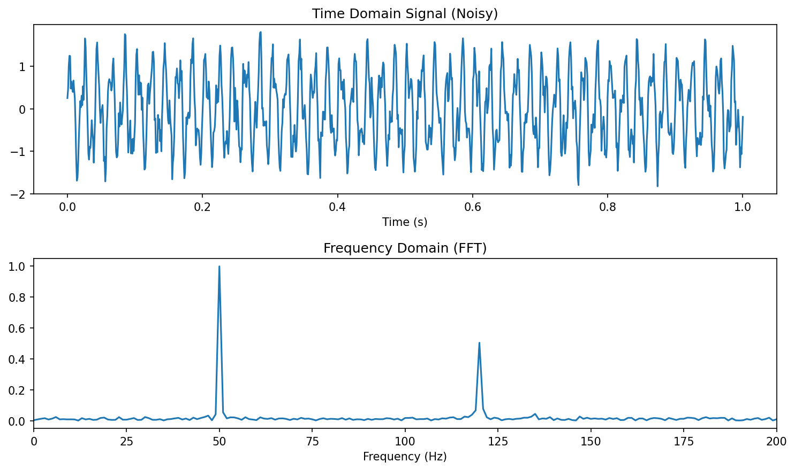
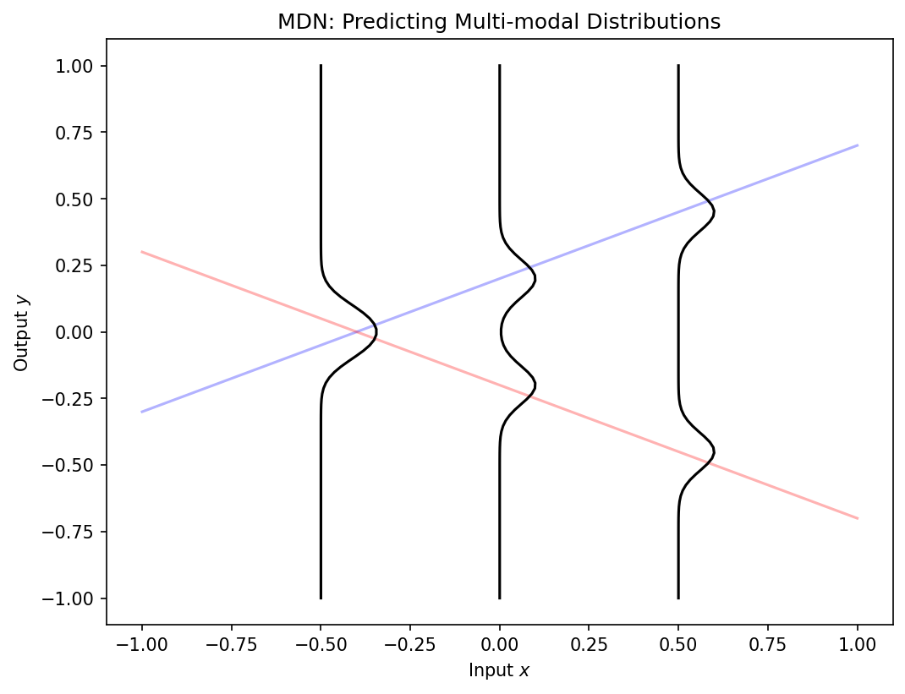
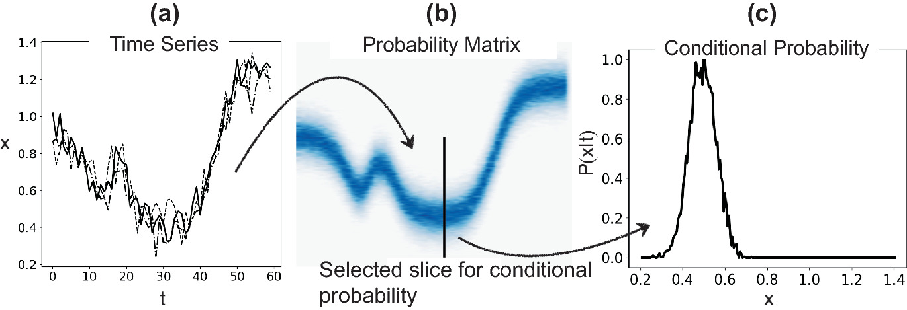

---
title: |
  Mathematical Foundations of AI & ML<br>Unit 8: The Probabilistic View of Learning
bibliography: ref.bib
author:
  - name: Prof. Dr. Philipp Pelz
    affiliation:
      - FAU Erlangen-Nürnberg
format:
  revealjs:
    width: 1920
    height: 1080
    template-partials:
      - title-slide.html
    css: custom.css
    theme: custom.scss
    slide-number: c/t
    logo: "eclipse_logo_small.png"
    footer: "© Philipp Pelz - Mathematical Foundations of AI & ML"
    menu:
      side: left
      loadIcons: true
---


<!-- ===== §1. Framing ===== -->

## Title + Unit 8 positioning

:::: {.incremental}
- Units 1–7 built the optimization and generalization framework for learning.
- Unit 8 introduces the **probabilistic foundations** that underlie everything.
- Probability is the language of uncertainty — and learning is fundamentally about reasoning under uncertainty.
::::

## Recap: what risk minimization assumes

:::: {.incremental}
- Unit 1: $\hat{\boldsymbol{\theta}} = \arg\min_{\boldsymbol{\theta}} \mathbb{E}_{(\mathbf{x},y) \sim P}[L(f_{\boldsymbol{\theta}}(\mathbf{x}), y)]$.
- The expectation is over a **probability distribution** $P$ of data.
- Until now, we treated this as a mathematical abstraction. Now we make it concrete.
::::

## Learning outcomes for Unit 8

By the end of this lecture, students can:

:::: {.incremental}
- classify uncertainty as aleatory or epistemic and explain why this matters,
- write the Gaussian in 1D and multivariate form and explain its maximum-entropy property,
- compute and interpret KL divergence between distributions, in particular the closed form between two Gaussians,
- derive the MLE for Gaussian parameters and connect it to MSE minimization,
- apply Bayes' theorem to update prior beliefs into posterior distributions.
::::

## Why probability is the language of learning

:::: {.incremental}
- Data is inherently noisy — repeated measurements give different results.
- Models are uncertain — finite data cannot determine parameters exactly.
- Probability provides a **consistent, rigorous** framework for quantifying both.
- Without probability, we cannot define what "learning from data" means.
::::


<!-- ===== §2. Aleatory uncertainty — definition ===== -->

## Aleatory uncertainty — definition

:::: {.incremental}
- **Aleatory** (from Latin *alea* = dice): irreducible randomness in the data-generating process.
- Examples: thermal noise in sensors, quantum measurement, turbulent flow variability.
- No amount of additional data or better models can eliminate aleatory uncertainty.
- It sets a **floor** on achievable prediction error (the Bayes error from Unit 7).
::::

## Epistemic uncertainty — definition

:::: {.incremental}
- **Epistemic** (from Greek *episteme* = knowledge): uncertainty from limited knowledge.
- Reducible by collecting more data, improving the model, or adding features.
- Examples: parameter uncertainty with small $N$, model misspecification, missing variables.
- Epistemic uncertainty **decreases** as the training set grows.
::::

## Why the distinction matters

```{mermaid}
%%| echo: false
%%| fig-align: center
%%| align: center
graph TD
    U["Total Uncertainty"] --> A["Aleatory"]
    U --> E["Epistemic"]
    A --> A1["Irreducible Noise"]
    A --> A2["Bayes Error Floor"]
    E --> E1["Reducible by Data"]
    E --> E2["Model Uncertainty"]
    style A fill:#f96,stroke:#333
    style E fill:#69f,stroke:#333
```

:::: {.incremental}
- **Aleatory uncertainty**: set appropriate error bars; do not waste resources trying to reduce it.
- **Epistemic uncertainty**: invest in data collection or model improvement.
- Confusing the two leads to wasted effort (trying to reduce noise) or false confidence (ignoring model uncertainty).
- Engineering systems must handle both types appropriately [@neuer2024machine].
::::

## Interactive: Aleatory vs. Epistemic Uncertainty

::: {.panel-tabset}
### Interactive Plot

:::: {.columns}
:::: {.column width="25%"}
```{ojs}
//| echo: false
//| panel: input
viewof n_samples_unc = Inputs.range([5, 500], {value: 20, step: 1, label: "Sample Size (N) 📉"})
viewof aleatory_noise = Inputs.range([0, 2], {value: 0.5, step: 0.1, label: "Aleatory Noise (σ) 🎲"})
```
::::
:::: {.column width="75%"}
```{ojs}
//| echo: false

true_func = (x) => Math.sin(x * Math.PI) + 0.5 * x;

// Generate Data
unc_data = {
  const points = [];
  const rng = d3.randomNormal(0, aleatory_noise);
  for (let i = 0; i < n_samples_unc; i++) {
    const x = d3.randomUniform(-2, 2)();
    points.push({x: x, y: true_func(x) + rng()});
  }
  return points.sort((a,b) => a.x - b.x);
}

// Fit a simple polynomial (degree 3) for the epistemic uncertainty band
// Instead of complex regression, let's just use a confidence interval approach
// width of CI shrinks as 1 / sqrt(N)
unc_ci_width = aleatory_noise * 1.96 / Math.sqrt(n_samples_unc);

Plot.plot({
  width: 800,
  height: 400,
  x: {domain: [-2.1, 2.1], label: "x"},
  y: {domain: [-3, 3], label: "y"},
  marks: [
    // True function
    Plot.line(d3.range(-2, 2.1, 0.1), {x: d => d, y: d => true_func(d), stroke: "gray", strokeDasharray: "4,4", title: "True Process"}),
    // Epistemic Uncertainty Band
    Plot.areaY(d3.range(-2, 2.1, 0.1), {
      x: d => d, 
      y1: d => true_func(d) - unc_ci_width,
      y2: d => true_func(d) + unc_ci_width,
      fill: "steelblue", 
      fillOpacity: 0.3, 
      title: "Epistemic Uncertainty (Model Confidence)"
    }),
    // Aleatory Noise (Data points)
    Plot.dot(unc_data, {x: "x", y: "y", r: 4, fill: "red", fillOpacity: 0.6, title: "Observations (Aleatory Noise)"})
  ]
})
```
::::
::::

### Interpretation

- The **gray dashed line** is the true, hidden process.
- The **red dots** are sampled data. Their spread around the true process is **aleatory uncertainty** (irreducible noise).
- The **blue band** represents our model's confidence in the mean (**epistemic uncertainty**). 
- **Try it:** Increase `N`. Notice how the blue band shrinks, but the red dots remain scattered.
:::


<!-- ===== §3. The sampling process ===== -->

## The sampling process

:::: {.incremental}
- Data is a collection of **realizations** from a random process.
- The sampling rate, resolution, and digitization affect what information is preserved.
- Insufficient sampling introduces systematic errors that no model can correct.
::::

## Nyquist-Shannon theorem

:::: {.incremental}
- To reconstruct a signal with maximum frequency $f_{\max}$, the sampling rate must satisfy:

$$
f_s \geq 2 f_{\max}
$$

- Below this rate: **aliasing** — high-frequency components fold into low frequencies.
- Relevance to ML: undersampled data contains phantom patterns that models can overfit to [@neuer2024machine].
::::

## Engineering example: sensor data and uncertainty sources

:::: {.incremental}
- A temperature sensor measuring a furnace:
  - **Aleatory**: thermal fluctuations ($\pm 2°C$ at steady state).
  - **Epistemic**: calibration drift (systematic, correctable with recalibration).
- An ML model trained on this data must account for both sources to make reliable predictions.
::::

## Random variables and probability distributions

:::: {.incremental}
- A **random variable** $X$ maps outcomes to numbers.
- **Discrete**: probability mass function $P(X = x)$.
- **Continuous**: probability density function $p(x)$ where $\int p(x)\,dx = 1$.
- The PDF gives relative likelihood — not probability — at each point.
::::


<!-- ===== §4. Expected value and variance ===== -->

## Expected value and variance

:::: {.incremental}
- **Expected value** (mean): $\mu = \mathbb{E}[X] = \int x \, p(x) \, dx$.
- **Variance**: $\sigma^2 = \text{Var}[X] = \mathbb{E}[(X - \mu)^2]$.
- **Standard deviation**: $\sigma = \sqrt{\text{Var}[X]}$ — same units as $X$.
- The mean locates the distribution; the variance measures its spread.
::::

## Higher moments: skewness and kurtosis

:::: {.incremental}
- **Skewness** $= \mathbb{E}\left[\left(\frac{X-\mu}{\sigma}\right)^3\right]$: measures asymmetry (0 for symmetric distributions).
- **Kurtosis** $= \mathbb{E}\left[\left(\frac{X-\mu}{\sigma}\right)^4\right]$: measures tail heaviness (3 for the Gaussian).
- **Excess kurtosis** $= \text{kurtosis} - 3$: deviation from Gaussian tail behavior.
::::

## The Gaussian distribution (1D)

$$
p(x \mid \mu, \sigma^2) = \frac{1}{\sqrt{2\pi\sigma^2}} \exp\!\left(-\frac{(x-\mu)^2}{2\sigma^2}\right)
$$

:::: {.incremental}
- Completely characterized by two parameters: mean $\mu$ and variance $\sigma^2$.
- Symmetric, unimodal, bell-shaped.
- The 68-95-99.7 rule: probability within $1\sigma, 2\sigma, 3\sigma$ of the mean.
::::

## Interactive: The 1D Gaussian & Empirical Rule

::: {.panel-tabset}
### Interactive Plot

:::: {.columns}
:::: {.column width="25%"}
```{ojs}
//| echo: false
//| panel: input
viewof g_mean = Inputs.range([-3, 3], {value: 0, step: 0.1, label: "Mean (μ)"})
viewof g_std = Inputs.range([0.1, 3], {value: 1, step: 0.1, label: "Std Dev (σ)"})
viewof show_intervals = Inputs.checkbox(["1σ (68%)", "2σ (95%)", "3σ (99.7%)"], {label: "Show Intervals", value: ["1σ (68%)"]})
```
::::
:::: {.column width="75%"}
```{ojs}
//| echo: false

gaussian_pdf = (x, mu, sigma) => {
  const variance = sigma * sigma;
  return (1 / Math.sqrt(2 * Math.PI * variance)) * Math.exp(-Math.pow(x - mu, 2) / (2 * variance));
}

g_x_vals = d3.range(-6, 6.05, 0.05);
g_data = g_x_vals.map(x => ({x: x, y: gaussian_pdf(x, g_mean, g_std)}));

Plot.plot({
  width: 800,
  height: 350,
  x: {domain: [-6, 6], label: "x"},
  y: {domain: [0, 4.2], label: "Density p(x)"},
  marks: [
    // 3 sigma
    show_intervals.includes("3σ (99.7%)") ? Plot.areaY(g_data.filter(d => d.x >= g_mean - 3*g_std && d.x <= g_mean + 3*g_std), {x: "x", y: "y", fill: "#ffbaba", fillOpacity: 0.5}) : null,
    // 2 sigma
    show_intervals.includes("2σ (95%)") ? Plot.areaY(g_data.filter(d => d.x >= g_mean - 2*g_std && d.x <= g_mean + 2*g_std), {x: "x", y: "y", fill: "#ff7b7b", fillOpacity: 0.6}) : null,
    // 1 sigma
    show_intervals.includes("1σ (68%)") ? Plot.areaY(g_data.filter(d => d.x >= g_mean - 1*g_std && d.x <= g_mean + 1*g_std), {x: "x", y: "y", fill: "#ff5252", fillOpacity: 0.8}) : null,
    
    // PDF Line
    Plot.line(g_data, {x: "x", y: "y", stroke: "white", strokeWidth: 3}),
    
    // Mean Line
    Plot.ruleX([g_mean], {stroke: "white", strokeDasharray: "4,4"})
  ]
})
```
::::
::::

### Interpretation

- Modifying the **Mean ($\mu$)** shifts the distribution left or right. It represents the center of mass.
- Modifying the **Standard Deviation ($\sigma$)** stretches the distribution. 
- Notice that the *peak* height drops as it stretches, to ensure the total area (probability) always integrates to 1.
:::


<!-- ===== §5. Why the Gaussian is special: maximum entropy ===== -->

## Why the Gaussian is special: maximum entropy

:::: {.incremental}
- Among all distributions with a given mean $\mu$ and variance $\sigma^2$, the Gaussian has **maximum entropy**.
- Maximum entropy = maximum uncertainty = fewest additional assumptions.
- Using a Gaussian is therefore the **most conservative** choice when only mean and variance are known.
- This is the information-theoretic justification for the Gaussian's ubiquity [@murphy2012machine].
- *(Entropy $H(p)$ is defined formally in the information-theoretic primer later in this unit.)*
::::

## Central Limit Theorem connection

:::: {.incremental}
- The sum (or average) of many independent random variables converges to a Gaussian, regardless of their individual distributions.
- This explains why the Gaussian appears everywhere:
  - Measurement errors = sum of many small independent perturbations.
  - Aggregate quantities in materials science follow approximately Gaussian distributions.
::::

## Multivariate Gaussian distribution

$$
p(\mathbf{x} \mid \boldsymbol{\mu}, \boldsymbol{\Sigma}) = (2\pi)^{-d/2} |\boldsymbol{\Sigma}|^{-1/2} \exp\!\left(-\frac{1}{2}(\mathbf{x}-\boldsymbol{\mu})^\top \boldsymbol{\Sigma}^{-1}(\mathbf{x}-\boldsymbol{\mu})\right)
$$

:::: {.incremental}
- $\boldsymbol{\mu} \in \mathbb{R}^d$: mean vector. $\boldsymbol{\Sigma} \in \mathbb{R}^{d \times d}$: covariance matrix (symmetric, positive definite).
- Level sets are **ellipsoids** whose axes align with eigenvectors of $\boldsymbol{\Sigma}$.
::::

## Covariance matrix: diagonal vs full

- **Diagonal** $\boldsymbol{\Sigma}$: features are uncorrelated; ellipsoids are axis-aligned.
- **Full** $\boldsymbol{\Sigma}$: features are correlated; ellipsoids are rotated.
- **Spherical** ($\boldsymbol{\Sigma} = \sigma^2 \mathbf{I}$): isotropic; level sets are spheres.
- The eigenvalues of $\boldsymbol{\Sigma}$ determine the extent along each principal axis.


<!-- ===== §6. Interactive: Multivariate Gaussian Covariance ===== -->

## Interactive: Multivariate Gaussian Covariance

::: {.panel-tabset}
### Interactive Plot
:::: {.columns}
:::: {.column width="25%"}
```{ojs}
//| echo: false
//| panel: input
viewof cov_var_x = Inputs.range([0.1, 5], {value: 2, step: 0.1, label: "Variance X (σ_x²)"})
viewof cov_var_y = Inputs.range([0.1, 5], {value: 2, step: 0.1, label: "Variance Y (σ_y²)"})
viewof cov_rho = Inputs.range([-0.99, 0.99], {value: 0, step: 0.05, label: "Correlation (ρ)"})
```
::::
:::: {.column width="75%"}
```{ojs}
//| echo: false

// Generate 2D Gaussian samples
cov_data = {
  const N = 500;
  const points = [];
  
  // Cholesky decomposition of [[var_x, cov], [cov, var_y]]
  // cov = rho * sqrt(var_x * var_y)
  const cv = cov_rho * Math.sqrt(cov_var_x * cov_var_y);
  
  const L11 = Math.sqrt(cov_var_x);
  const L21 = cv / L11;
  const L22 = Math.sqrt(cov_var_y - L21 * L21);
  
  const rng = d3.randomNormal(0, 1);
  for (let i = 0; i < N; i++) {
    const z1 = rng();
    const z2 = rng();
    
    const x = L11 * z1;
    const y = L21 * z1 + L22 * z2;
    points.push({x: x, y: y});
  }
  return points;
}

Plot.plot({
  width: 600,
  height: 600,
  x: {domain: [-8, 8], label: "Feature 1 (X)"},
  y: {domain: [-8, 8], label: "Feature 2 (Y)"},
  aspectRatio: 1,
  marks: [
    Plot.dot(cov_data, {x: "x", y: "y", r: 3, fill: "steelblue", fillOpacity: 0.4}),
    Plot.density(cov_data, {x: "x", y: "y", stroke: "white", thresholds: 5})
  ]
})
```
::::
::::
### Key take-aways
- **No correlation ($\rho = 0$)**: The contours form axis-aligned ellipses (or circles if variances are equal).
- **Positive correlation ($\rho > 0$)**: The ellipses tilt towards the top-right. Knowing $X$ gives you information that $Y$ is likely high too!
- **Negative correlation ($\rho < 0$)**: The ellipses tilt towards the bottom-right.
:::

## Marginal and conditional Gaussians

- A key property: marginals and conditionals of a joint Gaussian are also Gaussian.
- **Marginal**: integrate out some variables — the result is Gaussian with sub-matrix of $\boldsymbol{\Sigma}$.
- **Conditional**: condition on some variables — the result is Gaussian with updated $\boldsymbol{\mu}$ and reduced $\boldsymbol{\Sigma}$.
- This closure property makes Gaussian models analytically tractable [@bishop2006pattern].

## Checkpoint: interpret the covariance matrix

- Given $\boldsymbol{\Sigma} = \begin{pmatrix} 4 & 3 \\ 3 & 9 \end{pmatrix}$:
  - Feature 1 has variance 4, feature 2 has variance 9.
  - Correlation coefficient: $\rho = 3/\sqrt{4 \cdot 9} = 0.5$ — moderate positive correlation.
  - The contour ellipse is tilted toward the upper-right.


<!-- ===== Information-theoretic primer: entropy and KL divergence ===== -->

## Entropy of a distribution

For a continuous distribution $p(x)$, the **(differential) entropy** is

$$
H(p) \;=\; -\int p(x)\, \log p(x)\, dx \;=\; -\mathbb{E}_p[\log p(X)]
$$

(discrete analogue: $H(p) = -\sum_x p(x) \log p(x)$).

:::: {.incremental}
- Intuition: expected **surprise** $-\log p(X)$ — rare outcomes carry more information.
- Larger $H$ = more uncertainty / less concentration of mass.
- 1D Gaussian: $H(\mathcal{N}(\mu,\sigma^2)) = \tfrac{1}{2}\log(2\pi e\, \sigma^2)$ — depends on $\sigma$, not $\mu$.
- This formalizes the earlier claim: among distributions with given mean and variance, $\mathcal{N}(\mu,\sigma^2)$ **maximizes** $H$ [@bishop2006pattern].
::::

## KL divergence: comparing two distributions

For distributions $q$ and $p$ on the same space:

$$
\mathrm{KL}(q \,\|\, p) \;=\; \mathbb{E}_q\!\left[\log \tfrac{q(x)}{p(x)}\right] \;=\; \int q(x)\, \log \tfrac{q(x)}{p(x)}\, dx
$$

:::: {.incremental}
- Three load-bearing properties:
  1. $\mathrm{KL}(q\|p) \ge 0$ (Gibbs inequality, via Jensen's inequality on $-\log$).
  2. $\mathrm{KL}(q\|p) = 0$ **iff** $q = p$ almost everywhere.
  3. **Asymmetric** in general: $\mathrm{KL}(q\|p) \ne \mathrm{KL}(p\|q)$.
- Intuition: extra cost (in nats) of describing samples from $q$ using a code optimized for $p$ [@bishop2006pattern].
- KL is therefore a **directed** dissimilarity — not a metric.
::::

## KL between two Gaussians (the VAE-relevant case)

For two 1D Gaussians, KL admits a closed form:

$$
\mathrm{KL}\!\left(\mathcal{N}(\mu_1,\sigma_1^2)\,\|\,\mathcal{N}(\mu_2,\sigma_2^2)\right)
\;=\; \log\frac{\sigma_2}{\sigma_1} \;+\; \frac{\sigma_1^2 + (\mu_1 - \mu_2)^2}{2\sigma_2^2} \;-\; \frac{1}{2}
$$

The form used to regularize variational autoencoders — $p = \mathcal{N}(\mathbf{0}, I)$ vs.
$q = \mathcal{N}(\boldsymbol{\mu},\, \mathrm{diag}(\sigma_1^2,\dots,\sigma_d^2))$ — is the per-dimension sum:

$$
\mathrm{KL}(q\,\|\,p) \;=\; \tfrac{1}{2} \sum_{j=1}^{d} \left( \mu_j^2 + \sigma_j^2 - \log \sigma_j^2 - 1 \right)
$$

:::: {.incremental}
- Sanity check: vanishes iff $\mu_j = 0$ and $\sigma_j = 1$ for all $j$ — i.e., $q$ already matches the standard-normal prior.
- **Forward pointer:** Unit 11 will use exactly this expression as the regularizer in the VAE loss [@bishop2006pattern].
::::

## The likelihood function

- Given observed data $\mathcal{D} = \{\mathbf{x}_1, \dots, \mathbf{x}_N\}$ (assumed i.i.d.):

$$
\mathcal{L}(\boldsymbol{\theta}) = p(\mathcal{D} \mid \boldsymbol{\theta}) = \prod_{i=1}^{N} p(\mathbf{x}_i \mid \boldsymbol{\theta})
$$

- $\mathcal{L}(\boldsymbol{\theta})$ is a function of the **parameters** $\boldsymbol{\theta}$, not the data.
- It measures how well $\boldsymbol{\theta}$ explains the observed data.


<!-- ===== §7. Log-likelihood ===== -->

## Log-likelihood

- Taking the log converts the product into a sum:

$$
\ell(\boldsymbol{\theta}) = \log \mathcal{L}(\boldsymbol{\theta}) = \sum_{i=1}^{N} \log p(\mathbf{x}_i \mid \boldsymbol{\theta})
$$

- Sums are numerically stable and easier to differentiate.
- Maximizing $\ell(\boldsymbol{\theta})$ gives the same solution as maximizing $\mathcal{L}(\boldsymbol{\theta})$.

## MLE principle

$$
\hat{\boldsymbol{\theta}}_{\text{MLE}} = \arg\max_{\boldsymbol{\theta}} \ell(\boldsymbol{\theta})
$$

- Choose the parameters that make the observed data **most probable** under the model.
- MLE is the most widely used estimation principle in statistics and machine learning.
- Set $\nabla_{\boldsymbol{\theta}} \ell(\boldsymbol{\theta}) = 0$ and solve.

## Interactive: Maximum Likelihood Estimation

::: {.panel-tabset}
### Interactive Fit
:::: {.columns}
:::: {.column width="25%"}
```{ojs}
//| echo: false
//| panel: input
viewof mle_mu = Inputs.range([-4, 4], {value: 0, step: 0.1, label: "Guess Mean (μ)"})
viewof mle_sigma = Inputs.range([0.1, 3], {value: 1, step: 0.1, label: "Guess Std Dev (σ)"})
```
::::
:::: {.column width="75%"}
```{ojs}
//| echo: false

// 5 fixed data points
mle_fixed_data = [{x: -0.5}, {x: 0.2}, {x: 1.1}, {x: 1.5}, {x: 2.2}]

// Calculate true MLE
mle_true_mu = d3.mean(mle_fixed_data, d => d.x);
mle_true_var = d3.mean(mle_fixed_data, d => Math.pow(d.x - mle_true_mu, 2));
mle_true_sigma = Math.sqrt(mle_true_var);

// Calculate log likelihood for current guess
mle_log_likelihood = {
  let ll = 0;
  for(let p of mle_fixed_data) {
    const variance = mle_sigma * mle_sigma;
    const pdf = (1 / Math.sqrt(2 * Math.PI * variance)) * Math.exp(-Math.pow(p.x - mle_mu, 2) / (2 * variance));
    ll = ll + Math.log(pdf);
  }
  return ll;
}

// Max log likelihood for the true parameters
mle_max_ll = {
  let ll = 0;
  for(let p of mle_fixed_data) {
    const variance = mle_true_var;
    const pdf = (1 / Math.sqrt(2 * Math.PI * variance)) * Math.exp(-Math.pow(p.x - mle_true_mu, 2) / (2 * variance));
    ll = ll + Math.log(pdf);
  }
  return ll;
}

mle_pdf_curve = d3.range(-5, 5.05, 0.05).map(x => {
  const variance = mle_sigma * mle_sigma;
  return {x: x, y: (1 / Math.sqrt(2 * Math.PI * variance)) * Math.exp(-Math.pow(x - mle_mu, 2) / (2 * variance))}
});

html`
<div style="margin-bottom: 20px;">
  <strong>Current Log-Likelihood: <span style="color: ${mle_log_likelihood > mle_max_ll - 0.5 ? '#a8ff9e' : '#ff9e9e'}">${mle_log_likelihood.toFixed(2)}</span></strong><br>
  <progress value="${mle_log_likelihood}" min="-30" max="${mle_max_ll}" style="width: 100%; height: 20px; accent-color: ${mle_log_likelihood > mle_max_ll - 0.5 ? '#a8ff9e' : '#ff9e9e'};"></progress>
</div>
`

Plot.plot({
  width: 800,
  height: 350,
  x: {domain: [-5, 5], label: "Data Value (x)"},
  y: {domain: [0, 1.5], label: "Likelihood p(x|μ,σ)"},
  marks: [
    Plot.ruleY([0]),
    // The guessed PDF
    Plot.areaY(mle_pdf_curve, {x: "x", y: "y", fill: "steelblue", fillOpacity: 0.3}),
    Plot.line(mle_pdf_curve, {x: "x", y: "y", stroke: "white", strokeWidth: 2}),
    
    // The data points projected onto the PDF
    Plot.dot(mle_fixed_data, {
      x: "x", 
      y: d => {
        const variance = mle_sigma * mle_sigma;
        return (1 / Math.sqrt(2 * Math.PI * variance)) * Math.exp(-Math.pow(d.x - mle_mu, 2) / (2 * variance));
      }, 
      r: 6, stroke: "#ff7b7b", fill: "none", strokeWidth: 2
    }),
    
    // Droplines to axis
    Plot.ruleX(mle_fixed_data, {
      x: "x", 
      y1: 0, 
      y2: d => {
        const variance = mle_sigma * mle_sigma;
        return (1 / Math.sqrt(2 * Math.PI * variance)) * Math.exp(-Math.pow(d.x - mle_mu, 2) / (2 * variance));
      },
      stroke: "#ff7b7b", strokeDasharray: "2,2"
    }),

    // Data points on axis
    Plot.dot(mle_fixed_data, {x: "x", y: 0, r: 6, fill: "#ff7b7b"})
  ]
})
```
::::
::::

### Try it yourself!
- Adjust the **Mean ($\mu$)** and **Std Dev ($\sigma$)** to try and trap the red data points under the highest part of the blue curve.
- Watch the **Log-Likelihood** gauge increase.
- The red circles show the individual likelihood $p(x_i|\mu,\sigma)$. The product of these heights determines the log-likelihood (converted to a sum). 
- Maximizing log-likelihood means pushing the curve up directly over the data points without spreading it too thin!
:::

## MLE for Gaussian mean

- Gaussian log-likelihood (with known $\sigma^2$):

$$
\ell(\mu) = -\frac{N}{2}\log(2\pi\sigma^2) - \frac{1}{2\sigma^2}\sum_{i=1}^{N}(x_i - \mu)^2
$$

- Differentiate w.r.t. $\mu$, set to zero:

$$
\hat{\mu}_{\text{MLE}} = \frac{1}{N}\sum_{i=1}^{N} x_i = \bar{x}
$$

- The MLE for the mean is the **sample mean** — intuitive and unbiased.


<!-- ===== §8. MLE for Gaussian variance ===== -->

## MLE for Gaussian variance

- Differentiate w.r.t. $\sigma^2$:

$$
\hat{\sigma}^2_{\text{MLE}} = \frac{1}{N}\sum_{i=1}^{N}(x_i - \hat{\mu})^2
$$

- This is the **biased** sample variance (divides by $N$, not $N-1$).
- The bias vanishes as $N \to \infty$ — MLE is **consistent**.
- For small $N$, the unbiased estimator ($N-1$) is often preferred.

## MLE and MSE: the connection

- For a regression model $y = f_{\boldsymbol{\theta}}(\mathbf{x}) + \epsilon$ with $\epsilon \sim \mathcal{N}(0, \sigma^2)$:

$$
\ell(\boldsymbol{\theta}) = -\frac{N}{2}\log(2\pi\sigma^2) - \frac{1}{2\sigma^2}\sum_{i=1}^{N}(y_i - f_{\boldsymbol{\theta}}(\mathbf{x}_i))^2
$$

- Maximizing $\ell(\boldsymbol{\theta})$ w.r.t. $\boldsymbol{\theta}$ is **equivalent** to minimizing MSE.
- This provides the **probabilistic justification** for using MSE as a loss function.

## MLE for multivariate Gaussian

- For $\mathbf{x}_i \in \mathbb{R}^d$:

$$
\hat{\boldsymbol{\mu}} = \frac{1}{N}\sum_{i=1}^{N}\mathbf{x}_i, \quad \hat{\boldsymbol{\Sigma}} = \frac{1}{N}\sum_{i=1}^{N}(\mathbf{x}_i - \hat{\boldsymbol{\mu}})(\mathbf{x}_i - \hat{\boldsymbol{\mu}})^\top
$$

- Direct extension of the 1D case to vectors and matrices [@murphy2012machine].
- Requires $N > d$ for $\hat{\boldsymbol{\Sigma}}$ to be invertible.

## MLE: properties and limitations

- **Consistency**: $\hat{\theta}_{\text{MLE}} \to \theta_{\text{true}}$ as $N \to \infty$.
- **Efficiency**: achieves the lowest possible variance among unbiased estimators (Cramér-Rao bound).
- **Limitation**: can overfit with small $N$ — MLE has **no built-in regularization**.
- MLE treats all parameter values as equally plausible before seeing data.


<!-- ===== §9. Robustness: the outlier problem ===== -->

## Robustness: the outlier problem

- The Gaussian has **light tails** — extreme values are extremely unlikely under the model.
- When outliers are present, MLE distorts $\hat{\mu}$ and inflates $\hat{\sigma}^2$ to accommodate them.
- A single outlier can shift the mean by $O(1/N)$ of its magnitude.
- Need: a distribution with **heavier tails** that accommodates outliers without distortion.

## Student's t-distribution for robust estimation

- The Student's t-distribution has a parameter $\nu$ (degrees of freedom) controlling tail heaviness.
- $\nu \to \infty$: converges to Gaussian. $\nu = 1$: Cauchy distribution (very heavy tails).
- MLE with Student's t automatically **downweights** outliers.
- Practical recommendation: use $\nu \approx 4{-}10$ for moderate robustness [@murphy2012machine].

## Bayes' theorem — statement

$$
p(\boldsymbol{\theta} \mid \mathcal{D}) = \frac{p(\mathcal{D} \mid \boldsymbol{\theta}) \, p(\boldsymbol{\theta})}{p(\mathcal{D})}
$$

- **Posterior** $p(\boldsymbol{\theta} \mid \mathcal{D})$: what we believe about $\boldsymbol{\theta}$ after seeing data.
- **Likelihood** $p(\mathcal{D} \mid \boldsymbol{\theta})$: how probable the data is under each $\boldsymbol{\theta}$.
- **Prior** $p(\boldsymbol{\theta})$: what we believed before seeing data.
- **Evidence** $p(\mathcal{D})$: normalizing constant.

## Components of Bayes' theorem

- The **prior** encodes domain knowledge or assumptions (e.g., "weights should be small").
- The **likelihood** is the same function used in MLE — it connects data to parameters $\boldsymbol{\theta}$.
- The **posterior** combines both: it is a **compromise** between prior knowledge and data evidence.
- More data → posterior dominated by likelihood. Less data → posterior dominated by prior.


<!-- ===== §10. The evidence (marginal likelihood) ===== -->

## The evidence (marginal likelihood)

$$
p(\mathcal{D}) = \int p(\mathcal{D} \mid \boldsymbol{\theta}) \, p(\boldsymbol{\theta}) \, d\boldsymbol{\theta}
$$

- Integrates the likelihood over all possible parameter values, weighted by the prior.
- Ensures the posterior integrates to 1.
- Often **intractable** for complex models — motivates approximation methods (MCMC, variational inference).
- Also used for **model comparison**: models with higher evidence explain the data better.

## Bayesian inference for Gaussian mean (known variance)

:::: {.incremental}
- Prior: $\mu \sim \mathcal{N}(\mu_0, \sigma_0^2)$.
::::
:::: {.incremental}
- Likelihood: $x_i | \mu \sim \mathcal{N}(\mu, \sigma^2)$ (known $\sigma^2$).
::::
:::: {.incremental}
- Posterior: $\mu | \mathcal{D} \sim \mathcal{N}(\mu_N, \sigma_N^2)$ where:

$$
\mu_N = \frac{\sigma^2 \mu_0 + N \sigma_0^2 \bar{x}}{\sigma^2 + N \sigma_0^2}, \quad \sigma_N^2 = \frac{\sigma^2 \sigma_0^2}{\sigma^2 + N \sigma_0^2}
$$
::::

:::: {.incremental}
- This is a **conjugate** pair: Gaussian prior + Gaussian likelihood = Gaussian posterior [@bishop2006pattern].
::::

## Posterior update: visual intuition

- **Before data** ($N=0$): posterior = prior (wide, uncertain).
- **After a few points** ($N=5$): posterior narrows, shifts toward sample mean.
- **Large sample** ($N=100$): posterior is very narrow, centered near $\bar{x}$.
- As $N \to \infty$: posterior concentrates at $\hat{\mu}_{\text{MLE}}$ — the prior washes out.

## Interactive: Bayesian Posterior Update

::: {.panel-tabset}
### Interactive Update
:::: {.columns}
:::: {.column width="25%"}
```{ojs}
//| echo: false
//| panel: input
viewof bayes_prior_mu = Inputs.range([-5, 5], {value: 0, step: 0.1, label: "Prior Mean (μ₀)"})
viewof bayes_prior_var = Inputs.range([0.1, 10], {value: 3, step: 0.1, label: "Prior Var (σ₀²)"})
viewof bayes_data_mu = Inputs.range([-5, 5], {value: 2.5, step: 0.1, label: "Data Mean (Sample x̄)"})
viewof bayes_data_var = Inputs.range([0.1, 10], {value: 1, step: 0.1, label: "Data Noise (σ²)"})
viewof bayes_N = Inputs.range([0, 50], {value: 3, step: 1, label: "Samples Observed (N)"})
```
::::
:::: {.column width="75%"}
```{ojs}
//| echo: false

// Calculate Posterior params
bayes_post_var = 1.0 / ( (1.0/bayes_prior_var) + (bayes_N/bayes_data_var) )
bayes_post_mu = bayes_post_var * ( (bayes_prior_mu/bayes_prior_var) + (bayes_N * bayes_data_mu / bayes_data_var) )

bayes_x_vals = d3.range(-8, 8.05, 0.05);

bayes_curves = {
  const data = [];
  for(let x of bayes_x_vals) {
    // Prior
    const p_prior = (1 / Math.sqrt(2 * Math.PI * bayes_prior_var)) * Math.exp(-Math.pow(x - bayes_prior_mu, 2) / (2 * bayes_prior_var));
    
    // Likelihood (conceptually, the likelihood of the mean parameter given the data)
    // Scaled for visualization so it fits on same plot
    const likelihood_var = bayes_data_var / (bayes_N > 0 ? bayes_N : 0.0001);
    const p_like_unscaled = (1 / Math.sqrt(2 * Math.PI * likelihood_var)) * Math.exp(-Math.pow(x - bayes_data_mu, 2) / (2 * likelihood_var));
    // Scale likelihood to have max height ~ 1 for visual clarity against prior
    const p_like = bayes_N === 0 ? 0 : p_like_unscaled * Math.sqrt(2 * Math.PI * likelihood_var) * 0.5;

    // Posterior
    const p_post = (1 / Math.sqrt(2 * Math.PI * bayes_post_var)) * Math.exp(-Math.pow(x - bayes_post_mu, 2) / (2 * bayes_post_var));
    
    data.push({x: x, val: p_prior, type: "Prior P(θ)"});
    if (bayes_N > 0) data.push({x: x, val: p_like, type: "Likelihood (scaled)"});
    data.push({x: x, val: p_post, type: "Posterior P(θ|D)"});
  }
  return data;
}

Plot.plot({
  width: 800,
  height: 400,
  x: {domain: [-8, 8], label: "Mean Parameter (μ)"},
  y: {domain: [0, 1.2], label: "Density"},
  color: {
    domain: ["Prior P(θ)", "Likelihood (scaled)", "Posterior P(θ|D)"],
    range: ["#888888", "#5ca7ff", "#ff4d4d"]
  },
  marks: [
    Plot.line(bayes_curves, {x: "x", y: "val", stroke: "type", strokeWidth: 3}),
    Plot.areaY(bayes_curves, {x: "x", y: "val", fill: "type", fillOpacity: 0.15}),
    
    // Highlight MAP / Data Mean points on axis
    Plot.ruleX([bayes_prior_mu], {stroke: "#888888", strokeDasharray: "4,4"}),
    bayes_N > 0 ? Plot.ruleX([bayes_data_mu], {stroke: "#5ca7ff", strokeDasharray: "4,4"}) : null,
    Plot.ruleX([bayes_post_mu], {stroke: "#ff4d4d", strokeWidth: 2})
  ]
})
```
::::
::::
### Intuition
- **$N = 0$**: The Posterior (red) perfectly matches the Prior (gray).
- **Small $N$**: The Posterior is a compromise between the Prior and the Data Likelihood (blue).
- **Large $N$**: The Likelihood narrows dramatically, pulling the Posterior entirely towards the Data Mean ($2.5$). The Prior is "washed out".
- **Strong Prior (small $\sigma_0^2$)**: The Prior resists the data pull much longer. Try changing *Prior Var* to 0.1 and notice how much data it takes to shift the belief!
:::


<!-- ===== §11. Bayesian vs frequentist comparison ===== -->

## Bayesian vs frequentist comparison

:::: {.columns}
:::: {.column width="70%"}
| Aspect | Frequentist | Bayesian |
|--------|:-----------:|:--------:|
| Parameters | Fixed, unknown | Random variables |
| Inference | Point estimate + CI | Full posterior distribution |
| Prior knowledge | Not incorporated | Formally included |
| Uncertainty | Sampling variability | Posterior width |
| Interpretation | Long-run frequency | Degree of belief |
::::

:::: {.column width="30%"}
- **Frequentist**: Objective, based on repeated trials.
- **Bayesian**: Subjective, based on evidence update.
- **Choice**: Often depends on data availability and prior confidence.
::::
::::

## Credible interval vs confidence interval

- **95% Bayesian credible interval**: "Given the data, there is a 95% probability that $\theta$ lies in this interval."
- **95% frequentist confidence interval**: "If we repeated the experiment many times, 95% of such intervals would contain the true $\theta$."
- The Bayesian interpretation is often more natural for engineering decisions.

## MAP estimation

- **Maximum A Posteriori**: find the mode of the posterior:

$$
\hat{\boldsymbol{\theta}}_{\text{MAP}} = \arg\max_{\boldsymbol{\theta}} \, p(\boldsymbol{\theta} \mid \mathcal{D}) = \arg\max_{\boldsymbol{\theta}} \left[\log p(\mathcal{D} \mid \boldsymbol{\theta}) + \log p(\boldsymbol{\theta})\right]
$$

- MAP is a **point estimate** — it summarizes the posterior by its peak.
- MAP = MLE when the prior is uniform (non-informative).

## MAP and regularization

- **Gaussian prior** $p(\boldsymbol{\theta}) \propto \exp(-\frac{\lambda}{2}\|\boldsymbol{\theta}\|_2^2)$: MAP = **Ridge regression**.
- **Laplace prior** $p(\boldsymbol{\theta}) \propto \exp(-\lambda\|\boldsymbol{\theta}\|_1)$: MAP = **Lasso regression**.
- Regularization is not an ad-hoc trick — it has a principled **Bayesian justification**.
- The regularization strength $\lambda$ corresponds to the prior precision (inverse variance).


<!-- ===== §12. When to be Bayesian vs frequentist ===== -->

## When to be Bayesian vs frequentist

- **Small data, safety-critical**: Bayesian — uncertainty quantification is essential.
- **Large data, fast iteration**: MLE/frequentist — posterior approximates MLE anyway.
- **Model comparison**: Bayesian evidence is a principled selection criterion.
- **Engineering practice**: often a pragmatic mix — MLE for training, Bayesian for uncertainty.

## Predictive distribution

- Instead of predicting with a point estimate, integrate over parameter uncertainty:

$$
p(\mathbf{x}_{\text{new}} \mid \mathcal{D}) = \int p(\mathbf{x}_{\text{new}} \mid \boldsymbol{\theta}) \, p(\boldsymbol{\theta} \mid \mathcal{D}) \, d\boldsymbol{\theta}
$$

- The predictive distribution is **wider** than the distribution under a point estimate.
- It honestly reflects both data noise (aleatory) and parameter uncertainty (epistemic).

## Checkpoint: update a prior

- **Setup**: Prior $\mu_0 = 0$, $\sigma_0^2 = 10$. Known noise $\sigma^2 = 1$. Five observations with $\bar{x} = 3.2$.
- Compute $\mu_N$ and $\sigma_N^2$.
- $\sigma_N^2 = \frac{1 \cdot 10}{1 + 5 \cdot 10} = \frac{10}{51} \approx 0.196$.
- $\mu_N = \frac{1 \cdot 0 + 5 \cdot 10 \cdot 3.2}{1 + 50} = \frac{160}{51} \approx 3.14$.

## Stochastic enrichment of input data

- Add Gaussian noise to training inputs to simulate measurement uncertainty:
  - $\tilde{x}_i = x_i + \epsilon$, $\epsilon \sim \mathcal{N}(0, \sigma_{\text{noise}}^2)$.
- This **augments** the training set and makes the model robust to input perturbations.
- Especially effective when the noise level matches real deployment conditions [@neuer2024machine].

:::: {.column width="50%"}
{width=80%}
::::


<!-- ===== §13. Mixture-density networks ===== -->

## Mixture-density networks

- Standard networks predict a **single value** $\hat{y}$ — they cannot express multi-modal uncertainty.
- A mixture-density network predicts the parameters of a Gaussian mixture:

$$
p(y|x) = \sum_{k=1}^{K} \pi_k(x) \, \mathcal{N}(y | \mu_k(x), \sigma_k^2(x))
$$

- Mixing coefficients $\pi_k$, means $\mu_k$, and variances $\sigma_k^2$ are all functions of input $x$ [@neuer2024machine].

:::: {.column width="50%"}
{width=80%}
::::

## Process corridors via 2D histograms

- In manufacturing, define acceptable parameter ranges as probability contours.
- A 2D histogram of (process parameter, quality metric) shows the **process corridor**.
- Points outside the corridor flag anomalies or process drift.
- This converts probabilistic thinking into actionable quality control [@neuer2024machine].

:::: {.column width="100%"}
{width=80%}
::::

## Materials example: property prediction with uncertainty

- Predicting tensile strength of a new alloy composition.
- **Point prediction**: 450 MPa. But how confident are we?
- **With uncertainty**: 450 ± 35 MPa (95% credible interval).
- Epistemic uncertainty is large in composition regions far from training data — flagging extrapolation.

## Practical diagnostic: calibration plots

- A well-calibrated model's predicted $p$% confidence intervals should contain $p$% of test points.
- Plot: predicted confidence level vs observed coverage.
- Perfect calibration = diagonal line.
- Overconfident models: predicted intervals are too narrow (points fall outside too often).


<!-- ===== §14. Lecture-essential vs exercise content split ===== -->

## Lecture-essential vs exercise content split

- **Lecture**: uncertainty taxonomy, Gaussian distribution, MLE derivation, Bayesian framework, MAP-regularization connection.
- **Exercise**: noise injection and Nyquist demo, MLE implementation in NumPy, Bayesian posterior updating, MLE-MSE equivalence proof, calibration plots.

## Exam-aligned summary: must-know statements

1. Aleatory uncertainty is irreducible; epistemic uncertainty is reducible with more data.
2. The Gaussian is the maximum-entropy distribution for given mean and variance.
3. MLE maximizes the probability of the observed data under the model.
4. For Gaussian noise, MLE is equivalent to MSE minimization.
5. Bayes' theorem: posterior $\propto$ likelihood $\times$ prior.
6. Conjugate priors yield closed-form posteriors (e.g., Gaussian-Gaussian).
7. MAP with a Gaussian prior is equivalent to Ridge regression.
8. The predictive distribution integrates over parameter uncertainty.
9. Student's t-distribution provides robustness to outliers.
10. Calibration plots assess whether predicted uncertainties match observed frequencies.
11. KL divergence is non-negative, zero iff the two distributions agree, and asymmetric; the closed form between Gaussians is the regularizer in the VAE loss.

## References + reading assignment for next unit

- **Required reading before Unit 9:**
  - Neuer: Ch. 2.2–2.3
  - Murphy: Ch. 2 (probability review)
- **Optional depth:**
  - Bishop: Ch. 2.1–2.3 (Gaussian and Bayesian inference)
  - Murphy: Ch. 4 (multivariate Gaussian)
- Next unit: **Representation Learning** — how models discover useful features from raw data.

::: {#refs}
:::
