<!-- ===== §0. Framing ===== -->

## Title + Unit 8 positioning

:::: {.incremental}
- Units 6–7 already gave us the conceptual machinery: loss landscapes, the bias–variance trade-off, regularization, and the probabilistic view.
- This unit cashes that in on the **single most important model family for tabular data**: decision trees and their ensembles.
- Random forests and gradient boosting are the *workhorses* of applied materials ML — and the prerequisite for ML-PC Units 7–8 and Materials Genomics.
- The whole unit is one sentence of bias–variance theory turned into two algorithms: **bagging reduces variance, boosting reduces bias**.
::::

:::: {.notes}
- Set the framing explicitly and honestly: the generalization / bias–variance / regularization theory was developed in Units 6–7, so we do **not** re-derive it here. This unit is the *applied payoff* — the models a working materials engineer actually reaches for.
- The stakes for this cohort: on tabular materials data (compositions + processing parameters + measurements), gradient-boosted trees beat neural networks the large majority of the time. If a student leaves this course able to use exactly one model well, it should be a gradient-boosted tree — CatBoost for the categorical-heavy materials data they'll actually face — say that out loud.
- The unifying thesis, repeated all lecture: every method here is a move along the bias–variance trade-off. Keep "bagging ↓variance, boosting ↓bias" on the board the entire 90 minutes.
- Timing: ~5 min framing, ~25 min trees, ~25 min bagging/RF, ~25 min boosting/GBM, ~10 min practice/comparison/materials. The three interactives are the pace buffers.
::::

## Learning outcomes for Unit 8

By the end of this lecture, students can:

:::: {.incremental}
- explain how a decision tree partitions feature space and how splits are chosen by impurity reduction,
- state why a single deep tree is a low-bias / high-variance learner,
- derive why bagging reduces variance and why the tree-correlation $\rho$ caps that reduction,
- explain random forests as bagging + feature subsampling, and read OOB error and feature importances correctly,
- describe gradient boosting as gradient descent in function space, and the role of shrinkage and early stopping,
- choose appropriately between random forests, gradient boosting, and neural networks for a given tabular problem.
::::

:::: {.notes}
- Use the list as a contract, not a recitation. Each bullet is one block of the lecture and maps to the exam slide at the end.
- Flag the two outcomes students most underestimate: (1) the correlation ceiling — *why* RF exists and not just bagging; (2) reading feature importance correctly — impurity importance is biased and routinely over-interpreted in materials papers. These two are the "you'll use this in your thesis next month" items.
- Rigor level: derivations to the point of insight (the bagging variance formula, functional-gradient view), not measure-theoretic completeness. Engineering foundations course.
::::

## Bias–variance in one slide (the only theory we need)

:::: {.columns}
:::: {.column width="55%"}
$$\mathbb{E}[(y-\hat f(x))^2] = \underbrace{\mathrm{Bias}[\hat f]^2}_{\text{too rigid}} + \underbrace{\mathrm{Var}[\hat f]}_{\text{too sensitive}} + \underbrace{\sigma^2}_{\text{irreducible}}$$

- **Bias**: error from a model class too simple to capture the truth.
- **Variance**: error from sensitivity to the particular training sample.
- **Irreducible $\sigma^2$**: aleatory noise — no model removes it (Unit 7).
::::
:::: {.column width="45%"}
:::: {.incremental}
- A single deep tree: **low bias, high variance**.
- **Bagging / Random Forest**: average many high-variance trees → drive **variance** down.
- **Boosting**: sequentially correct a biased ensemble → drive **bias** down.
- Everything in this unit is one of these two moves.
::::
::::
::::

:::: {.notes}
- This is the *only* recap — deliberately one slide. Units 6–7 derived it; here it is purely the lens through which every algorithm is read. Do not re-derive; if students want the derivation, point back to Unit 8's predecessor material / Bishop §3.2.
- Write the two-arrow summary on the chalkboard and leave it: "bagging → ↓Var, boosting → ↓Bias." Every subsequent slide should be relatable to one arrow. When you introduce RF, point at the Var arrow; when you introduce GBM, point at the Bias arrow.
- Pre-empt the common confusion: bagging does *not* reduce bias (the trees are already low-bias), and boosting does *not* primarily reduce variance (it can even increase it — hence early stopping). Saying this now prevents the most frequent exam mistake.
::::


<!-- ===== §1. Decision trees ===== -->

<!-- ----- §1.0 Intuition first: the orchard (after MLU-explain) ----- -->

## First, the intuition: name that tree {.smaller}

:::: {.columns}
:::: {.column width="48%"}
You are a **farmer** with a new plot of land. For each tree you can measure only two things — the trunk's **diameter** and its **height** — and you must decide: *Apple, Cherry, or Oak?*

- No equations yet. Just look at the scatter and ask: **where would you draw lines** to separate the colours?
- This is the whole idea of a decision tree: **split the space with simple questions** until each region is (almost) one kind of tree.
::::
:::: {.column width="52%"}
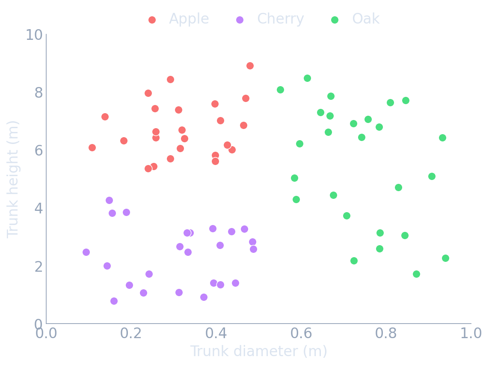{fig-align="center" width="100%"}
::::
::::

:::: {.notes}
- Deliberately concrete and example-first — this cohort has *never* seen a decision tree, so we build the picture before any impurity formula. Borrowed pedagogy from the MLU-explain "Decision Trees" explainer (mlu-explain.github.io/decision-tree).
- Ask the room to literally point at where they'd cut. Almost everyone says "diameter splits Oak off first" — that is exactly what the algorithm will discover two slides later. Let them predict it.
- Two features only so the partition is drawable on the board; emphasise that the real materials version has dozens of features and the same logic applies.
::::

## Carve the space with yes/no questions {.smaller}

:::: {.columns}
:::: {.column width="52%"}
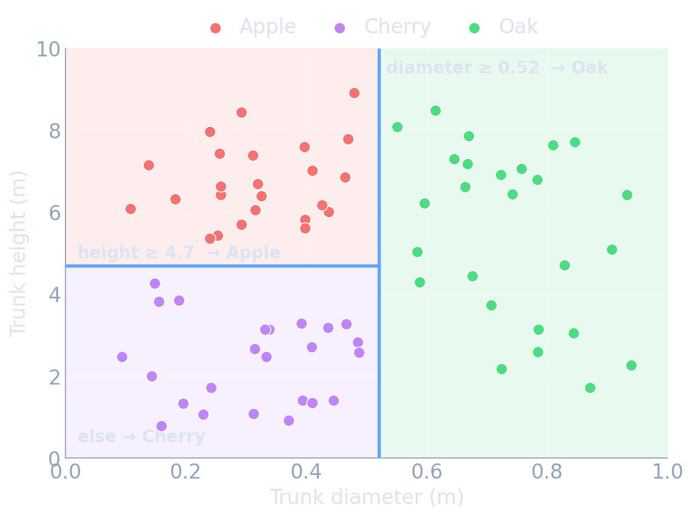{fig-align="center" width="100%"}
::::
:::: {.column width="48%"}
- **First cut**: *diameter ≥ 0.52?* → everything to the right is **Oak**.
- **Second cut** (left part only): *height ≥ 4.7?* → tall ones are **Apple**, short ones are **Cherry**.
- Each cut is a **vertical or horizontal line** — a question about *one* feature at a time.
- A new tree? Measure it, see which **box** it lands in, predict that box's majority species.
::::
::::

:::: {.notes}
- The key visual: cuts are axis-aligned (perpendicular to one axis). This is the seed of "axis-aligned splits / hyper-rectangles" on the formal slide that follows — point forward to it.
- Stress *recursive*: the second question is asked only inside the left region. Nesting questions = the tree structure on the next slide, and = "interactions for free" later.
::::

## …and that is literally a decision tree {.smaller}

:::: {.columns}
:::: {.column width="55%"}
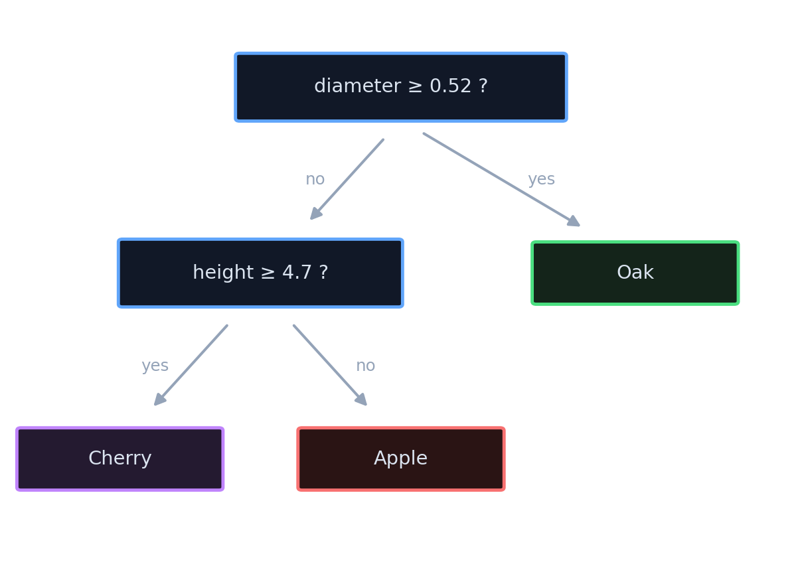{fig-align="center" width="92%"}
::::
:::: {.column width="45%"}
:::: {.incremental}
- **Boxes on the previous slide ⇔ leaves here.** Same model, two pictures.
- **Internal node** = a yes/no question on one feature.
- **Leaf** = a prediction (the majority class of the points that reach it).
- To classify a new tree, start at the top and follow the **yes/no** arrows down to a leaf.
::::
::::
::::

:::: {.notes}
- Make the equivalence explicit by tracing one point through both pictures: pick a small-diameter, tall tree → right partition cell *and* left-then-Apple path. Same answer.
- This is the payoff slide of the intuition block: students now own the object before we formalise it. Everything after (impurity, greedy search, ensembles) is "how do we *build* this automatically and *reliably*."
::::

## Which question is best? Measure "purity" {.smaller}

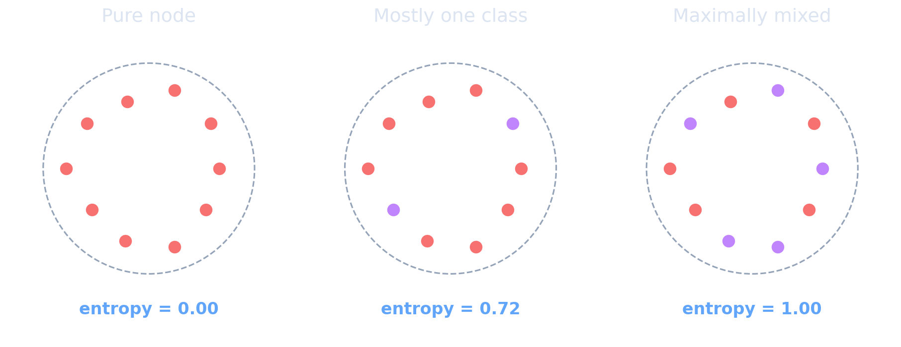{fig-align="center" width="78%"}

:::: {.incremental}
- A good question makes the resulting regions **more pure** than the parent.
- We will measure impurity with **entropy** $-\sum_c p_c \log p_c$ or **Gini** $\sum_c p_c(1-p_c)$ — formalised in a moment.
::::

:::: {.notes}
- Entropy intuition only here — the formula is on the upcoming impurity slide, so this is a soft landing, not a derivation. "Pure = boring = zero information left to gain."
- Connect to the next slide: if we can score purity, we can score a *split* by how much purity it buys → information gain.
::::

## Pick the split with the biggest payoff {.smaller}

:::: {.columns}
:::: {.column width="55%"}
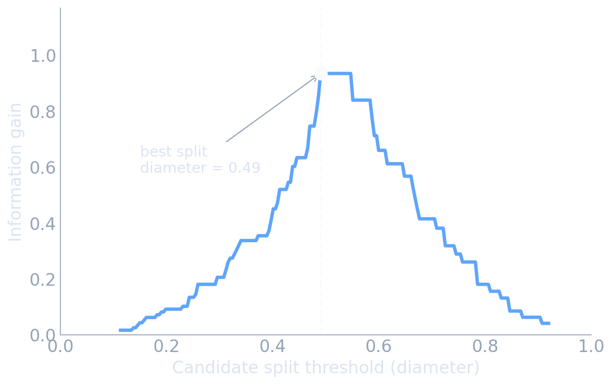{fig-align="center" width="100%"}
::::
:::: {.column width="45%"}
:::: {.incremental}
- Try **every** feature and **every** threshold; score each by the impurity it removes.
- Keep the **single best** split, then **recurse** on each child region.
- **Greedy**: best question now, no looking back — fast, but not globally optimal.
- The eye-balled "diameter ≈ 0.5" cut is the algorithm's peak. The intuition *was* the math.
::::
::::
::::

:::: {.notes}
- This is the bridge to the formal "How splits are chosen" slide: $\Delta = I(\text{parent}) - \frac{N_L}{N}I(\text{left}) - \frac{N_R}{N}I(\text{right})$ is precisely the curve's height.
- Greedy + recursive is the entire training algorithm. Say it plainly: no gradient descent, no global objective — just repeat "best cut, then split."
::::

## One tree is powerful — but fragile {.smaller}

:::: {.columns}
:::: {.column width="55%"}
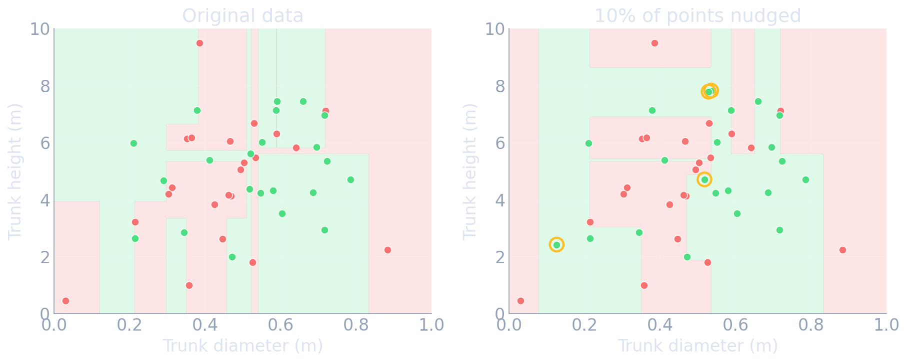{fig-align="center" width="100%"}
::::
:::: {.column width="45%"}
:::: {.incremental}
- A single deep tree can fit *anything* — including the noise (**high variance**).
- Small data changes → very different tree → the **variance** arrow on the board.
- The fix, the rest of this unit: **average many trees** (bagging / forests) and **stack corrective trees** (boosting).
- Hold onto this picture — it is *why* ensembles exist.
::::
::::
::::

:::: {.notes}
- This closes the intuition arc and re-points at the bias–variance summary still on the chalkboard: a single tree sits at the high-variance end. Bagging/RF pulls variance down; boosting pulls bias down.
- Honest framing: trees are not weak — they are *unstable*. Ensembles trade a little interpretability for a lot of stability. That trade is the spine of §2–§3.
- Instability illustration follows MLU-explain's "problem of perturbations" section — same lesson, our orchard data.
::::

## Decision trees — a single learner

:::: {.columns}
:::: {.column width="55%"}
A decision tree recursively partitions input space by **axis-aligned splits**.

- Internal node: a test like *"Cr fraction $> 0.18$?"*
- Leaf: a constant prediction — **mean** of the leaf's targets (regression) or **majority / class frequencies** (classification).
- Prediction: route a new $x$ down the tree to its leaf and return that constant.
::::
:::: {.column width="45%"}
:::: {.incremental}
- **Non-parametric**: model capacity grows with depth, not a fixed parameter count.
- Handles **mixed feature types** (continuous, ordinal, categorical) natively.
- **Scale-invariant**: splits depend only on order, so no normalization is needed.
- The learned function is **piecewise constant** — not smooth.
::::
::::
::::

:::: {.notes}
- Anchor the mental model immediately: a tree is a *piecewise-constant function approximator* built by recursive binary partitioning. Everything else (forests, boosting) is built from this primitive.
- The "no normalization, handles mixed types, handles missing values" trio is the single biggest practical reason trees dominate tabular materials data — contrast with linear models / NNs where preprocessing is half the work. Say it now; it pays off at the trees-vs-NN slide.
- Caveat to plant for later: piecewise-constant means trees extrapolate as a flat line and cannot represent a smooth trend without many splits. This is the seed of the "non-smooth target" discussion (Grinsztajn) and of why a single tree is unstable.
::::

## Trees partition feature space

:::: {.columns}
:::: {.column width="50%"}
- Each split is a hyperplane **perpendicular to one feature axis**.
- The leaves tile the input space into axis-aligned **boxes (hyper-rectangles)**.
- The prediction surface is constant within each box and jumps at box boundaries.
::::
:::: {.column width="50%"}
:::: {.incremental}
- Consequence 1: trees capture **feature interactions for free** (a split on $x_2$ *inside* a branch of $x_1$ is an interaction).
- Consequence 2: trees are **rotation-variant** — a diagonal decision boundary needs a staircase of many splits.
- Consequence 3: a deep enough tree can isolate every training point in its own box → memorization.
::::
::::
::::

:::: {.notes}
- This geometric picture is load-bearing for the entire unit — draw the 2D box partition on the chalkboard and refer back to it for RF (averaging smooths the staircase) and for boosting (adding boxes that fix residuals).
- The rotation-variance point is subtle but it is *the* reason given by Grinsztajn et al. for why trees beat NNs on tabular but not on rotated/structured data — flag it now so the later slide is a callback, not a new idea.
- "Interactions for free" vs linear models (which need explicit cross terms) is a major selling point for materials data, where composition–processing interactions are everywhere and unknown a priori.
::::

## How splits are chosen

At each node, pick the (feature, threshold) that **maximizes impurity reduction**:

$$
\Delta = I(\text{parent}) - \frac{N_L}{N} I(\text{left}) - \frac{N_R}{N} I(\text{right}).
$$

:::: {.incremental}
- **Regression**: $I =$ within-node variance → equivalently, squared-error reduction.
- **Classification**: $I =$ Gini impurity $\sum_c p_c (1 - p_c)$ or entropy $-\sum_c p_c \log p_c$.
- The search is **greedy and recursive**: best split now, no backtracking.
- Cost $\approx O(N\,d\,\log N)$ — fast, which is why trees scale to large tabular data.
::::

:::: {.notes}
- The key conceptual point: a tree is trained by *recursive greedy optimization*, not gradient descent. There is no global objective being minimized — each split is locally optimal. This is why trees are fast and why they are not globally optimal (the price of tractability).
- Worked micro-example to do on the board: a node with targets {1,1,9,9}; the split that separates {1,1}|{9,9} drops variance from 16 to 0 — Δ is maximal. Students *see* why variance reduction = good split in 20 seconds.
- Connect forward: gradient boosting will reuse this exact greedy-tree primitive as its weak learner — the impurity criterion does not change, only what the tree is fit *to* (residuals).
::::

## Impurity measures: variance, Gini, entropy

:::: {.columns}
:::: {.column width="50%"}
**Regression**

- $I_{\text{var}} = \frac{1}{N}\sum_i (y_i - \bar y)^2$.
- Maximizing variance reduction = minimizing within-leaf SSE = fitting leaf means by least squares.
::::
:::: {.column width="50%"}
**Classification**

- Gini: $\sum_c p_c(1-p_c)$ — expected misclassification rate of random labeling.
- Entropy: $-\sum_c p_c\log p_c$ — information content.
- Both are maximized at uniform $p_c$, zero at a pure node.
::::
::::

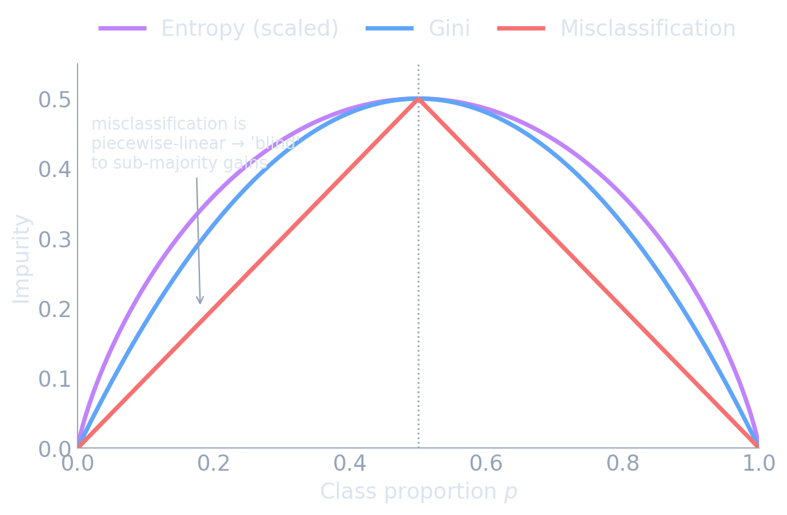{fig-align="center" width="44%"}

:::: {.incremental}
- Gini and entropy give **very similar trees** in practice; Gini is slightly cheaper (no log) and is the scikit-learn default.
- Misclassification error is *not* used for growing — it is insensitive to changes that don't flip the majority class.
::::

:::: {.notes}
- The examinable insight: for regression, "impurity = variance" means a regression tree is doing *piecewise least squares* — it connects directly back to the MSE/Gaussian story of Unit 7. Say "the tree is least squares with a learned partition."
- Why not misclassification error for splitting? Concrete example: a 400/100 node split into 300/0 and 100/100 — misclassification error is unchanged (still 100 errors) but Gini/entropy both drop sharply. The curvature of Gini/entropy rewards purer children even without a majority flip. This is a classic exam question — drill it.
- Don't over-spend here (~3 min). The takeaway is "Gini ≈ entropy, both are concave purity measures; variance for regression." Move on.
::::

## Growing and pruning a tree

:::: {.incremental}
- **Grow**: recurse until a stopping rule — max depth, min samples per leaf, or no positive impurity gain.
- An unconstrained tree grows until every leaf is pure → it **memorizes** the training set (zero training error).
- **Pre-pruning** (early stopping): cap depth / min-leaf-size. Cheap but myopic — a weak split may enable a strong one below it.
- **Post-pruning** (cost-complexity): grow fully, then prune back minimizing $R_\alpha(T)=R(T)+\alpha|T|$ — error plus a penalty on the number of leaves.
::::

:::: {.notes}
- Make the regularization parallel explicit: cost-complexity pruning $R(T)+\alpha|T|$ is *exactly* the regularized-ERM template from Unit 7 — fit quality plus a complexity penalty, with $\alpha$ tuned by cross-validation. Trees are not exempt from the bias–variance law; pruning is their λ.
- Practical reality check for the materials audience: in modern practice you almost never carefully prune a single tree — you let trees overgrow and control complexity at the *ensemble* level (RF: fully grown; GBM: shallow + shrinkage + early stopping). Pruning matters conceptually and for single-tree interpretability, not for production accuracy.
- The "pre-pruning is myopic" point motivates why fully-grown-then-ensemble beats carefully-pruned-single — bridge to the next slides.
::::

## A single tree is a high-variance learner

:::: {.incremental}
- Stop too early → underfit (high bias, low variance).
- Grow to pure leaves → near-zero training error (low bias, **high variance**).
- A **small change in the training data can completely reshape** a deep tree — the greedy top split flips and the whole structure changes.
- Pruning trades some variance for bias, but a single tree never escapes this instability.
::::

:::: {.fragment}
**This is precisely the regime where averaging helps.** → Ensembles.
::::

:::: {.notes}
- This slide is the hinge of the unit — it places the single tree in the high-variance corner of the bias–variance picture and thereby *motivates the entire rest of the lecture*. Point at the "↓Var" arrow on the board.
- Make instability visceral: deep trees are so sensitive that re-sampling the data or removing one influential point can change the root split and cascade. That sensitivity is not a bug to fix by pruning — it is the *raw material* bagging exploits (averaging unstable, decorrelated predictors is exactly what reduces variance).
- One-line bridge: "A single tree is the best possible input to an averaging machine — low bias, high variance, fast to train. Now let's average."
::::

## Strengths and limitations of a single tree

:::: {.columns}
:::: {.column width="50%"}
**Strengths**

- Interpretable (you can read the rules).
- No scaling / encoding ceremony; handles missing values.
- Captures interactions and nonlinearity automatically.
- Fast, $O(N d\log N)$.
::::
:::: {.column width="50%"}
**Limitations**

- High variance / unstable.
- Piecewise-constant: no smooth extrapolation.
- Greedy → not globally optimal.
- Axis-aligned → diagonal structure needs many splits.
::::
::::

:::: {.notes}
- This is the honest scorecard; every limitation on the right is addressed (or inherited) by ensembles, so frame it as the agenda for the next two sections: variance → bagging/RF; bias from shallow/greedy → boosting; the piecewise-constant/axis-aligned limits are *inherent* and resurface at the trees-vs-NN comparison.
- The interpretability strength is the one ensembles partially sacrifice — flag it now and promise the resolution (TreeSHAP, importance) in the interpretability slide. Materials reviewers and regulators care about this; it's not academic.
- Keep brief (~2 min); it is a consolidation slide before the first interactive.
::::

## Interactive: tree depth controls the fit

- A 1D regression tree fit to noisy data $y=\sin(2x)+0.3x+\varepsilon$.
- Drag **max depth**: depth 1 = one stump (high bias); large depth = a step for almost every point (high variance / memorization).

:::: {.columns}
:::: {.column width="28%"}
```{ojs}
//| echo: false
viewof tree_depth = Inputs.range([1, 10], {value: 3, step: 1, label: "Max depth"})
viewof tree_noise = Inputs.range([0, 0.8], {value: 0.3, step: 0.05, label: "Noise σ"})
viewof tree_reseed = Inputs.button("Resample data")
```
::::
:::: {.column width="72%"}
```{ojs}
//| echo: false
tree_data = {
  tree_reseed;
  const n = 60;
  const rnd = d3.randomNormal(0, tree_noise);
  const pts = [];
  for (let i = 0; i < n; i++) {
    const x = (i / (n - 1)) * 6;
    pts.push({ x, y: Math.sin(2 * x) + 0.3 * x + rnd() });
  }
  return pts;
}

function buildRegTree(rows, depth, maxDepth) {
  const ys = rows.map(d => d.y);
  const mean = d3.mean(ys);
  if (depth >= maxDepth || rows.length < 4) return { leaf: true, value: mean };
  const xs = Array.from(new Set(rows.map(d => d.x))).sort((a, b) => a - b);
  let best = null;
  for (let i = 1; i < xs.length; i++) {
    const thr = (xs[i - 1] + xs[i]) / 2;
    const L = rows.filter(d => d.x <= thr);
    const R = rows.filter(d => d.x > thr);
    if (L.length < 2 || R.length < 2) continue;
    const sse =
      L.length * (d3.variance(L.map(d => d.y)) || 0) +
      R.length * (d3.variance(R.map(d => d.y)) || 0);
    if (best === null || sse < best.sse) best = { thr, sse, L, R };
  }
  if (best === null) return { leaf: true, value: mean };
  return {
    leaf: false,
    thr: best.thr,
    left: buildRegTree(best.L, depth + 1, maxDepth),
    right: buildRegTree(best.R, depth + 1, maxDepth)
  };
}

function predictTree(node, x) {
  return node.leaf ? node.value : (x <= node.thr ? predictTree(node.left, x) : predictTree(node.right, x));
}

tree_fitted = {
  const t = buildRegTree(tree_data, 0, tree_depth);
  return d3.range(0, 6.001, 0.02).map(x => ({ x, y: predictTree(t, x) }));
}

Plot.plot({
  width: 820, height: 430,
  marginLeft: 60, marginBottom: 52, marginTop: 20,
  style: {
    background: "transparent",
    color: "#e5edf7",
    fontSize: "20px",
    fontFamily: "Inter, sans-serif"
  },
  x: { domain: [0, 6], label: "x →", grid: true },
  y: { domain: [-2, 3], label: "↑ y", grid: true },
  marks: [
    Plot.line(d3.range(0, 6.01, 0.05), { x: d => d, y: d => Math.sin(2 * d) + 0.3 * d, stroke: "#94a3b8", strokeDasharray: "4,4", strokeWidth: 2 }),
    Plot.dot(tree_data, { x: "x", y: "y", r: 3.5, fill: "#60a5fa", fillOpacity: 0.55 }),
    Plot.line(tree_fitted, { x: "x", y: "y", stroke: "#4ade80", strokeWidth: 3, curve: "step-after" })
  ]
})
```
::::
::::

:::: {.notes}
- Demo script (~90 s): start depth 1 — narrate "one split, gross underfit, pure bias." Step to 3–4 — "captures the shape, good bias/variance balance." Push to 10 — "a step per point, the orange line chases every noisy dot: that is variance/memorization." Then hit *Resample data* at depth 10 — the fit reshapes completely; at depth 3 it barely moves. That contrast *is* the high-variance lesson, shown not told.
- The step-shaped fit makes the piecewise-constant nature undeniable — tie back to "trees can't extrapolate smoothly."
- Recovery point: 30 s suffices if behind; the single must-show is resample-at-high-depth vs resample-at-low-depth.
::::


<!-- ===== §2. Bagging and Random Forests ===== -->

## From one tree to many: the ensemble idea

:::: {.incremental}
- Averaging $B$ predictors that are individually noisy but **not making the same mistakes** cancels their independent errors.
- For unbiased predictors, averaging leaves bias unchanged but shrinks variance.
- We need many trees that are (a) individually low-bias and (b) as **decorrelated** as possible.
- Two ways to build them: resample the **data** (bagging) and restrict the **features** (random forest).
::::

:::: {.notes}
- This is the conceptual core of bagging stated before any formula — make sure they get the intuition first: "errors that point in random directions cancel; bias points the same way every time, so averaging can't remove it." That single sentence predicts everything on the next three slides.
- The two requirements (low-bias base learner + decorrelation) are the design spec; bagging delivers the first via fully-grown trees, RF delivers the second via feature subsampling. Frame the next slides as "meeting this spec."
- Connect to Unit 7's variance-of-the-mean ($\sigma^2/N$) — averaging is the same statistical lever, now applied to predictors instead of measurements.
::::

## Bootstrap sampling

:::: {.incremental}
- A **bootstrap sample**: draw $N$ points from the training set **with replacement**.
- Each bootstrap sample contains $\approx 63\%$ of the unique points; the rest are duplicated.
- The omitted $\approx 37\%$ are **out-of-bag** for that tree — a free held-out set (used later).
- Different bootstrap samples → different trees → the decorrelation we need.
::::

:::: {.notes}
- The 63%/37% numbers come from $1-(1-1/N)^N \to 1-e^{-1}\approx 0.632$ — show the one-line limit; it's a satisfying derivation and it makes OOB error (two slides on) feel principled rather than magical.
- Emphasize *with replacement* — sampling without replacement at size N would just return the whole set; the replacement is what injects the per-tree variation that decorrelates the ensemble.
- Bootstrap is also a Unit-7 callback (resampling to estimate variability) — name the continuity so the course feels cumulative.
::::

## Bagging — variance reduction by averaging

**B**ootstrap **agg**regat**ing** [@breiman1996bagging]:

:::: {.incremental}
1. Draw $B$ bootstrap samples (size $N$, with replacement).
2. Train one **fully grown** tree per sample (low bias, high variance).
3. Predict by averaging: $\hat f_{\text{bag}}(x)=\frac1B\sum_{b=1}^B \hat f_b(x)$ (regression) or majority vote (classification).
::::

:::: {.fragment}
$$\mathrm{Var}\!\left(\tfrac1B\sum_b \hat f_b\right)=\rho\,\sigma^2+\frac{1-\rho}{B}\,\sigma^2.$$

As $B\to\infty$ the second term vanishes; variance floors at $\rho\sigma^2$.
::::

:::: {.notes}
- This formula is the intellectual center of the whole bagging/RF story — derive the two terms verbally: $\sigma^2$ is one tree's variance, $\rho$ is the average pairwise prediction correlation. Term 2 ($\propto 1/B$) is killed by more trees; term 1 ($\rho\sigma^2$) is **not** — it is the floor.
- The punchline that motivates random forests on the very next slide: "throwing more trees at bagging hits a wall set by $\rho$. To go lower you must reduce $\rho$ itself." Write the floor $\rho\sigma^2$ on the board and box it.
- Note bias is absent from the formula by design — averaging unbiased trees does not touch bias. Reiterate the board arrow.
::::

## The correlation ceiling

:::: {.incremental}
- Trees trained on bootstrap samples of the **same** data still pick the **same dominant splits** → highly correlated predictions ($\rho$ large).
- Large $\rho$ ⇒ the $\rho\sigma^2$ floor is high ⇒ bagging alone gives only modest gains.
- To break the ceiling we must force the trees to be **structurally different** — not just trained on resampled data.
- Random forests do this by **restricting the features** each split may consider.
::::

:::: {.notes}
- This slide exists to make the next one (RF) feel inevitable rather than arbitrary. The story: bagging is necessary but insufficient; the binding constraint is $\rho$, and resampling data alone barely moves $\rho$ because one or two strong features dominate the top splits in every tree.
- Materials-relevant intuition: if "annealing temperature" is by far the most predictive feature, every bagged tree splits on it first and they all look alike — bagging wastes its averaging on near-duplicates. Feature subsampling forces some trees to discover the *secondary* structure.
- Keep tight; it's the logical bridge, ~2 min.
::::

## Random forest = bagging + random feature subsets

:::: {.incremental}
- At **each split**, search only a **random subset** of features (typical: $\sqrt{d}$ for classification, $d/3$ for regression).
- This **decorrelates** the trees ($\rho\downarrow$) → the $\rho\sigma^2$ floor drops → averaging buys far more.
- Slight increase in individual-tree bias (each split sees fewer options), massively offset by the variance reduction.
- The de-facto default: `RandomForestRegressor` / `RandomForestClassifier` [@breiman2001randomforests].
::::

:::: {.fragment}
With $B\approx 500$ fully grown, feature-subsampled trees, RF is a strong, low-tuning baseline that usually crushes a single tuned tree.
::::

:::: {.notes}
- Breiman's 2001 insight in one sentence: "don't just bag — *also* decorrelate, at every split." Connect it explicitly to the boxed floor $\rho\sigma^2$ from two slides ago: RF lowers $\rho$, which lowers the floor; that is the entire mechanism.
- Be honest about the trade: restricting features raises each tree's bias slightly. The reason RF still wins is that the variance term dominates for deep trees, so trading a little bias for a lot of decorrelation is hugely net-positive. This is bias–variance reasoning applied live — point at the board.
- Practical default to state: 500 trees, $\sqrt d$ / $d/3$ features, fully grown. RF's reputation for "works well with almost no tuning" is real and worth emphasizing for the materials audience.
::::

## See it: averaging smooths the boundary {.smaller}

:::: {.columns}
:::: {.column width="62%"}
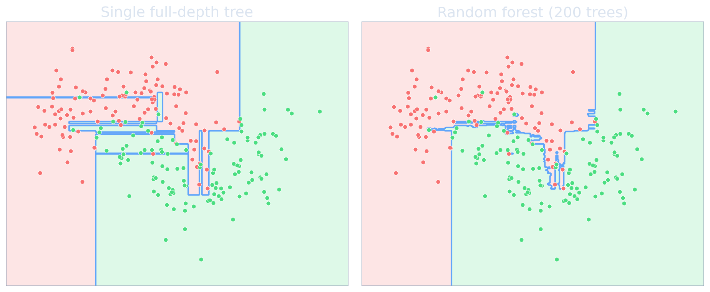{fig-align="center" width="100%"}
::::
:::: {.column width="38%"}
:::: {.incremental}
- Left = **high variance**: every noisy point gets its own box.
- Right = the **same trees, averaged** → the staircase washes out.
- The decision boundary barely moves if you resample the data — exactly the variance reduction the $\rho\sigma^2$ formula promised.
- Bias is untouched; only the jitter is gone.
::::
::::
::::

:::: {.notes}
- This is the visual payoff of the whole bagging/RF section — pair it explicitly with the single-tree instability figure from §1: same kind of data, but averaging removes the fragility. "Remember the boundary that jumped around? Average 200 of them and it stops jumping."
- Point out that the smooth boundary is *not* from lower-variance individual trees (each is still a jagged deep tree) — it emerges from averaging decorrelated jagged predictors. That is the entire mechanism, made visible.
::::

## Interactive: the bagging variance ceiling

- Plot of ensemble variance $\;\rho\sigma^2+\frac{1-\rho}{B}\sigma^2\;$ (with $\sigma^2=1$) vs number of trees $B$.
- See the **floor at $\rho\sigma^2$**: lowering correlation (what random forests do) is what actually buys you accuracy.

:::: {.columns}
:::: {.column width="28%"}
```{ojs}
//| echo: false
viewof rho_a = Inputs.range([0.0, 1.0], {value: 0.6, step: 0.02, label: "ρ (bagging)"})
viewof rho_b = Inputs.range([0.0, 1.0], {value: 0.15, step: 0.02, label: "ρ (random forest)"})
```
::::
:::: {.column width="72%"}
```{ojs}
//| echo: false
ens_var = (rho, B) => rho + (1 - rho) / B;

var_curves = {
  const rows = [];
  for (let B = 1; B <= 200; B++) {
    rows.push({ B, v: ens_var(rho_a, B), kind: `Bagging (ρ=${rho_a.toFixed(2)})` });
    rows.push({ B, v: ens_var(rho_b, B), kind: `Random forest (ρ=${rho_b.toFixed(2)})` });
  }
  return rows;
}

Plot.plot({
  width: 1000, height: 700,
  marginLeft: 80, marginBottom: 64, marginTop: 50,
  style: {
    background: "transparent",
    color: "#e5edf7",
    fontSize: "21px",
    fontFamily: "Inter, sans-serif"
  },
  x: { domain: [1, 200], label: "Number of trees B →", grid: true },
  y: { domain: [0, 1], label: "↑ Ensemble variance (σ²=1)", grid: true },
  color: { legend: true, range: ["#f87171", "#60a5fa"] },
  marks: [
    Plot.ruleY([rho_a], { stroke: "#f87171", strokeDasharray: "4,4", strokeWidth: 1.5 }),
    Plot.ruleY([rho_b], { stroke: "#60a5fa", strokeDasharray: "4,4", strokeWidth: 1.5 }),
    Plot.line(var_curves, { x: "B", y: "v", stroke: "kind", strokeWidth: 3.5 })
  ]
})
```
::::
::::

:::: {.notes}
- Demo (~60 s): with both ρ's default, both curves drop fast then flatten — onto their dashed floors. Drag "ρ (bagging)" up to 0.9: the red floor barely moves with B — "more trees, no gain; you are stuck on the ceiling." Drag "ρ (random forest)" toward 0: the blue floor collapses — "*this* is what RF buys, and it's a property of decorrelation, not of B."
- The single takeaway to verbalize: after ~100 trees, adding more is nearly free of benefit; the lever that matters is ρ. This also explains the standard advice "≥ a few hundred trees, then stop tuning B."
- Tie back to the boxed formula; this interactive is that formula made tactile.
::::

## Out-of-bag (OOB) error

:::: {.incremental}
- Each tree's bootstrap sample omits $\approx37\%$ of points — its **out-of-bag** set.
- Predict each training point using **only the trees that did not see it**, then score.
- Result: a nearly **free, CV-quality estimate** of generalization error — no separate validation split needed.
- OOB curves vs $B$ also tell you when adding trees has stopped helping.
::::

:::: {.notes}
- OOB is one of the most under-used diagnostics in applied tabular ML — emphasize it for the materials audience, where data is scarce and giving up a validation split hurts. "RF hands you a held-out estimate for free; use it."
- Be precise about the mechanism so they can implement it: a point's OOB prediction aggregates only the ~37% of trees for which it was out-of-bag. With enough trees this is a legitimate generalization estimate, empirically close to k-fold CV but at a fraction of the cost.
- Caveat to state: OOB error degrades under the same assumption-violations as CV (e.g., grouped/temporal structure, distribution shift) — it is not magic, it is CV's cheaper cousin. Bridge to the conformal caveat from Unit 7 if students ask.
::::

## Impurity (MDI) importance — what it measures {.smaller}

**MDI = Mean Decrease in Impurity.** Reuse the per-split gain $\Delta$ from "how splits are chosen": credit each feature with the impurity it removed, **weighted by how many samples passed through that split**, summed over every node and averaged across all $B$ trees.

$$
\text{MDI}_j \;=\; \frac{1}{B}\sum_{b=1}^{B}\;\sum_{\substack{\text{nodes in tree }b\\\text{that split on }j}} \frac{N_{\text{node}}}{N}\,\Delta_{\text{node}},
\qquad \text{then normalized so } \sum_j \text{MDI}_j = 1.
$$

:::: {.incremental}
- It is `feature_importances_` in scikit-learn — **free**, computed during training, no extra passes.
- **Computed on the *training* set** → it cannot tell "genuinely useful" from "useful for memorizing."
- **Cardinality bias**: a continuous / high-cardinality column offers **more candidate thresholds**, so it wins more splits and accumulates spurious $\Delta$ — even pure noise scores nonzero.
::::

:::: {.notes}
- Spell the formula out loud: "for each split on feature $j$, take its impurity drop $\Delta$, scale by the fraction of samples reaching that node, add them all up over every tree, normalize." The sample-weighting is the part students miss — a split near the root that sorts many samples counts far more than a deep split touching ten points.
- The two failure causes to name explicitly: (1) it's a *training-set* quantity (no held-out check), (2) cardinality bias — more thresholds = more chances to reduce impurity by chance. These are exactly what the worked example two slides on will show.
- This slide exists so "MDI is biased" on the next slide is a conclusion students can derive, not a claim they must accept.
::::

## Feature importance — done right

:::: {.columns}
:::: {.column width="50%"}
**Impurity (Gini/MDI) importance**

- Sum of (sample-weighted) impurity reduction per feature across all splits and trees, normalized to 1.
- Free, but **biased**: inflates high-cardinality / continuous features and is unreliable under correlated features.
::::
:::: {.column width="50%"}
**Better alternatives**

- **Permutation importance**: shuffle one feature, measure the performance drop on held-out data (*explained next*). Model-agnostic, honest.
- **TreeSHAP** [@lundberg2020treeshap]: exact Shapley values for trees — consistent, local + global.
::::
::::

:::: {.fragment}
For a materials paper claiming "feature X drives the property," report **permutation or SHAP**, not raw impurity importance.
::::

:::: {.notes}
- This is the slide that prevents a real, common scientific error. Materials papers routinely publish RF impurity-importance bar charts as if they were causal feature rankings; impurity importance is biased toward high-cardinality and continuous features and is destabilized by correlated descriptors (ubiquitous in compositional data). Say bluntly: "do not put impurity importance in a paper as evidence."
- Give the actionable rule: permutation importance for an honest global ranking, TreeSHAP when you need per-sample explanations or correlated-feature robustness. This is also the explicit bridge to Unit 14 (explainability) — name it.
- None of these are causal — importance ≠ causation. Add the one-sentence caveat; it's the second most common misuse.
- The next two slides unpack permutation importance (which students have not seen) and show the impurity-vs-permutation failure on a worked example.
::::

## Permutation importance — how it actually works {.smaller}

It answers one question: **how much does the trained model actually rely on this feature?**

:::: {.columns}
:::: {.column width="53%"}
:::: {.incremental}
1. Score the fitted model on a **held-out set** (e.g. $R^2$ or accuracy) → **baseline**.
2. Take one feature and **randomly shuffle its column** across rows. The column keeps its distribution but its **link to the target is destroyed**.
3. Re-score the *same* model on the shuffled data.
4. **Importance = baseline − shuffled score** — the bigger the drop, the more the model needed that feature.
5. Repeat the shuffle a few times and **average** (it is random).
::::
::::
:::: {.column width="47%"}
:::: {.incremental}
- **Intuition**: if scrambling a feature barely hurts, the model was not using it; if the score collapses, it was load-bearing.
- **Model-agnostic**: works for *any* fitted model (RF, GBM, neural net) — it only needs `predict` and a score.
- Computed on **held-out data**, so it cannot be fooled by training-set overfitting — the key advantage over impurity (MDI) importance.
- **Caveat**: two correlated features can *share* importance — shuffle one and its twin still leaks the signal, so both look weak. Group them, or use SHAP.
::::
::::
::::

:::: {.notes}
- Define it concretely because students have never seen it: "permute = shuffle the column." Do the one-sentence thought experiment live — "imagine I randomly reassign every alloy's Cr value to a different alloy; if the model's error barely moves, the model wasn't really using Cr."
- Stress the held-out point: this is *why* permutation beats MDI — MDI is a training-set quantity and cannot tell whether a feature helped genuinely or just helped memorize. Permutation asks the test set.
- The correlation caveat is the one honest limitation to state so they don't over-trust it on compositional data where features are simplex-constrained and correlated.
::::

## Example: impurity importance is fooled by noise {.smaller}

:::: {.columns}
:::: {.column width="62%"}
{fig-align="center" width="100%"}
::::
:::: {.column width="38%"}
:::: {.incremental}
- Left (MDI): the **random descriptor** ranks alongside real **Mo fraction** — a red flag you would never catch from the bar chart alone.
- Right (permutation): the noise *and* the genuinely-useless Mo both drop to ≈ 0.
- Both panels agree the real driver is **Phase**, then anneal temp, then C.
- **Lesson**: never publish raw MDI as evidence that a feature "matters."
::::
::::
::::

:::: {.notes}
- This is the payoff: a concrete, reproducible failure of the default `feature_importances_`. The noise column is literally `np.random.uniform` and never enters the target, yet MDI gives it real-feature-level importance because (a) it is computed on train and (b) continuous high-cardinality columns offer more thresholds to overfit.
- Walk left→right: "MDI says noise ≈ Mo; permutation on held-out says noise = 0. The second one is telling the truth." This single picture justifies the whole slide's rule.
- Numbers are real (scikit-learn `permutation_importance`), not illustrative — say so; it pre-empts "did you cook this?" and models honest reporting.
::::

## Extremely randomized trees (ExtraTrees)

:::: {.incremental}
- Like a random forest, but the split **threshold is chosen at random** (not optimized) for each candidate feature.
- Even more decorrelation ($\rho$ even lower) → lower variance, slightly higher bias.
- Often trains **faster** (no threshold search) and can match RF on noisy tabular data [@geurts2006extratrees].
- A useful second baseline to try alongside RF — one line to swap in scikit-learn.
::::

:::: {.notes}
- Keep this brief (~2 min) — it is a "know it exists, it's one import away" slide, not a deep topic. The conceptual value: it shows the decorrelation lever taken to its logical extreme (randomize even the threshold), reinforcing the ρ-is-the-thing message.
- Practical guidance: try RF and ExtraTrees both as quick baselines; ExtraTrees sometimes wins on very noisy materials measurements and is cheaper to fit. Not usually the final model — that's typically gradient boosting (next section).
::::

## Random forest in practice

:::: {.incremental}
- **Hyperparameters that matter**: number of trees $B$ (more = better then flat), min samples per leaf, max features per split.
- **Hyperparameters that mostly don't**: tree depth (let them grow), splitting criterion.
- Use **OOB** (or CV) to pick min-leaf and max-features; set $B$ as large as your compute allows.
- Strong, robust, low-effort baseline — but for peak tabular accuracy, boosting usually wins (next).
::::

:::: {.notes}
- The actionable summary: RF is the "first model you run" — minimal tuning, robust, gives you OOB error and importances for free. It is the baseline every materials project should start from before anything fancier.
- Reiterate the asymmetry: depth and criterion barely matter (fully grown + Gini/variance is fine); min-leaf and max-features are the knobs, tuned via OOB. This saves students from wasted grid searches.
- Transition line into boosting: "RF squeezes out variance and then plateaus. To push accuracy further we stop averaging independent trees and start *composing* dependent ones — boosting." Point at the board's ↓Bias arrow.
::::


<!-- ===== §3. Boosting and Gradient Boosting ===== -->

## Boosting — sequential bias reduction

:::: {.incremental}
- Bagging/RF: average many **low-bias, high-variance** trees in **parallel** → cut variance.
- Boosting: build a **sequence** of **high-bias, low-variance** weak learners (shallow trees), each correcting the previous ensemble's errors.
- Additive model: $\hat f^{(t)}(x)=\hat f^{(t-1)}(x)+\eta\,h_t(x)$.
- Bias falls as the ensemble grows — the opposite mechanism to bagging.
::::

:::: {.fragment}
Bagging **averages independent** learners; boosting **composes dependent** ones.
::::

:::: {.notes}
- The parallel-vs-sequential, variance-vs-bias contrast is the single most important conceptual takeaway of the boosting section. Put it as a 2×2 on the board: {bagging/RF: parallel, ↓Var, deep trees} vs {boosting: sequential, ↓Bias, shallow trees}. Every student should be able to reproduce this table in the exam.
- Stress *why* shallow weak learners: a boosting step only needs to nudge the ensemble toward the residual; a deep tree as the weak learner would overfit each step and the sequence would not generalize. Depth 3–6 stumps/trees is the norm — the bias is intentional and is removed by the *sequence*, not by each member.
- Historical one-liner: AdaBoost (1997) launched the field; everything modern is gradient boosting — next two slides.
::::

## AdaBoost — the original idea

:::: {.incremental}
- Maintain a **weight** on each training point; start uniform.
- Each round: fit a weak learner, **up-weight the misclassified points**, down-weight the correct ones.
- Final prediction: weighted vote of all weak learners, better learners weighted more [@freund1997adaboost].
- Reframed later (Friedman): AdaBoost is gradient boosting with an exponential loss — a special case of the general view next.
::::

:::: {.notes}
- Keep this historical and short (~3 min). Its pedagogical job: give an intuitive, weights-based picture of "focus on what you're getting wrong" before the more abstract functional-gradient formulation. Many students grok AdaBoost's reweighting first, then see gradient boosting as its generalization.
- The key bridge sentence: "re-weighting misclassified points is, mathematically, taking a step against the gradient of an exponential loss." That reframing (Friedman 2001) is exactly the next slide — set it up here so the generalization lands.
- Note AdaBoost is rarely used directly today (sensitive to noisy labels/outliers via the exponential loss); it's the conceptual ancestor, not the production tool.
::::

## Gradient boosting — descent in function space

:::: {.incremental}
- Think of the predictor $\hat f$ itself as the thing being optimized — not a parameter vector, but a **function**.
- We want to minimize $\sum_i \mathcal{L}(y_i,\hat f(x_i))$. The steepest-descent direction *at each point* is the negative gradient of the loss w.r.t. the prediction.
- We cannot store an arbitrary function — so **fit a tree** to approximate that negative-gradient direction, and take a small step along it.
- Gradient boosting = **gradient descent, where each step is a regression tree** [@friedman2001greedy].
::::

:::: {.notes}
- This is the "aha" slide of the section — deliver it with weight. The analogy to Unit 6 is exact and worth drawing: there, gradient descent moved a *parameter vector* $\theta$ against $\nabla_\theta L$; here it moves a *function* $\hat f$ against $\nabla_{\hat f} L$, and because we can't represent arbitrary functions we project the gradient onto "the space of trees" by fitting a tree to it.
- The learning rate η is literally the same η as Unit 6 — the step size of functional gradient descent. Foreshadow that "small η + many steps" will be the same speed/stability story as the optimizer unit (it is).
- If students only remember one sentence: "boosting is gradient descent and the trees are the steps." Everything operational (pseudo-residuals, shrinkage, early stopping) follows from that.
::::

## Gradient boosting — the algorithm

For loss $\mathcal{L}$, at iteration $t$:

:::: {.incremental}
1. **Pseudo-residuals**: $r_i^{(t)}=-\dfrac{\partial \mathcal{L}(y_i,\hat f^{(t-1)}(x_i))}{\partial \hat f^{(t-1)}(x_i)}$.
2. Fit a small regression tree $h_t$ to predict $r_i^{(t)}$.
3. Update: $\hat f^{(t)}=\hat f^{(t-1)}+\eta\,h_t$.
::::

:::: {.fragment}
$\eta$ = learning rate (shrinkage). **Small $\eta$ + many trees** generalizes better than large $\eta$ + few.
::::

:::: {.notes}
- Walk the three steps as "compute the direction (gradient), approximate it with a tree, take a small step" — explicitly mapping each to the functional-gradient picture from the previous slide so it is not three memorized lines.
- The shrinkage point is the most important practical rule in the section: η small (0.01–0.1) with many trees (hundreds–thousands) + early stopping is the standard recipe; large η is faster but overfits and is less robust. This is the same speed/stability trade-off as Unit 6's learning rate — say so explicitly, it consolidates the course.
- Set up the next slide: "what *are* these pseudo-residuals concretely? For squared error they're something you already know."
::::

## See it: the ensemble builds up tree by tree {.smaller}

:::: {.columns}
:::: {.column width="64%"}
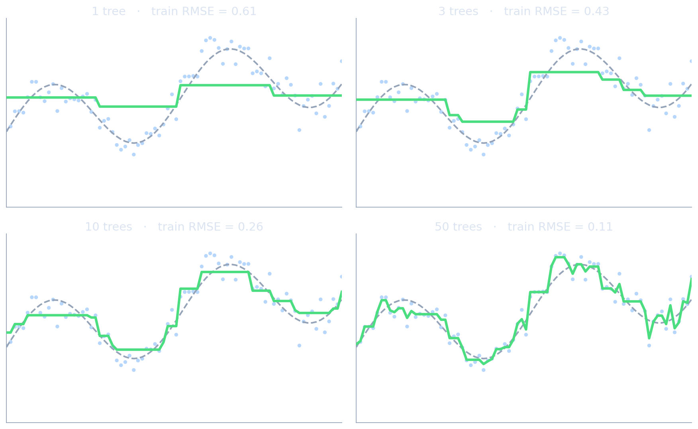{fig-align="center" width="100%"}
::::
:::: {.column width="36%"}
:::: {.incremental}
- **1 tree**: one step — pure bias, just like a stump.
- **3–10 trees**: the shape emerges as each tree fits the *leftover residual*.
- **50 trees**: near-perfect on train — and beginning to wiggle on noise (variance creeping in).
- Bias falls monotonically; **early stopping** decides when to quit.
::::
::::
::::

:::: {.notes}
- The static companion to the boosting interactive: here you see the *function* being assembled, not just the RMSE curve. Walk left-to-right and narrate "each green curve = previous green curve + one shrunken tree fit to what was still wrong."
- Tie the 50-tree wiggle to the regularization slide: this is the overfitting that early stopping / shrinkage exist to control. The same picture as Unit 6's "train loss keeps falling while validation turns up."
::::

## Pseudo-residuals — a worked example

:::: {.columns}
:::: {.column width="50%"}
**Squared error** $\mathcal{L}=\tfrac12 (y-\hat f)^2$

- $-\partial\mathcal{L}/\partial\hat f = (y-\hat f)$.
- Pseudo-residual = **ordinary residual**.
- Each tree just fits "what the ensemble still gets wrong."
::::
:::: {.column width="50%"}
**Logistic / other losses**

- The gradient gives a *re-weighted* target that focuses on hard, informative points.
- Same algorithm, only step 1 changes → boosting works for regression, classification, ranking, survival, custom losses.
::::
::::

:::: {.notes}
- The squared-error case is the one to anchor: "fit a tree to the residuals, add a shrunk version, repeat" — this is the entire algorithm with no calculus, and it's correct. Many students carry this picture forever; give it to them cleanly.
- Then the generalization: only step 1 (the gradient) changes for other losses; steps 2–3 are identical. That modularity is *why* gradient boosting is a framework, not one algorithm — and why XGBoost/LightGBM can support arbitrary differentiable objectives, including physics-informed custom losses in materials work.
- Connect to Unit 7: choosing the loss = choosing the noise model (Gaussian→squared error, Bernoulli→logistic). The "which loss" decision they learned there directly selects the pseudo-residual here.
::::

## Regularizing gradient boosting

Boosting **can and will overfit** — it drives training loss toward zero. Controls:

:::: {.incremental}
- **Shrinkage** $\eta$: smaller steps, more trees — the primary regularizer.
- **Number of trees** + **early stopping** on a validation/OOB curve.
- **Tree size**: shallow trees (depth 3–6) cap interaction order and variance.
- **Stochastic boosting**: subsample rows and/or columns per tree (à la RF) → decorrelation + speed.
- **Explicit penalties**: L1/L2 on leaf values (XGBoost — next slide).
::::

:::: {.notes}
- Correct the most common misconception head-on: students think "boosting reduces bias, so it can't overfit." It absolutely overfits — unbounded boosting interpolates the training data. The bias↓ comes with variance↑ as t grows; early stopping is non-negotiable.
- The hierarchy of knobs to teach: η + early stopping first (biggest lever), then tree depth, then subsampling, then leaf penalties. This ordering is the practical tuning recipe two slides on — preview it.
- Stochastic gradient boosting (row/col subsampling) is the elegant point: it imports RF's decorrelation trick *into* boosting, so the two families are not opposites but composable ideas. Reinforces the unit's "everything is a bias–variance move" thesis.
::::

## Interactive: boosting iterations × learning rate

- Gradient-boosted **stumps** on the same $y=\sin(2x)+0.3x+\varepsilon$ data.
- Watch **train vs validation RMSE**: large $\eta$ overfits fast; small $\eta$ needs more rounds but generalizes better.

:::: {.columns}
:::: {.column width="28%"}
```{ojs}
//| echo: false
viewof gb_eta = Inputs.range([0.02, 1.0], {value: 0.3, step: 0.02, label: "Learning rate η"})
viewof gb_T = Inputs.range([1, 120], {value: 40, step: 1, label: "Number of trees"})
```
::::
:::: {.column width="72%"}
```{ojs}
//| echo: false
gb_all = {
  const n = 70;
  const rndTr = d3.randomNormal(0, 0.3);
  const rndVa = d3.randomNormal(0, 0.3);
  const tr = [], va = [];
  for (let i = 0; i < n; i++) {
    const x = (i / (n - 1)) * 6;
    tr.push({ x, y: Math.sin(2 * x) + 0.3 * x + rndTr() });
    const xv = ((i + 0.5) / n) * 6;
    va.push({ x: xv, y: Math.sin(2 * xv) + 0.3 * xv + rndVa() });
  }
  return { tr, va };
}

bestStump = function (rows) {
  const xs = Array.from(new Set(rows.map(d => d.x))).sort((a, b) => a - b);
  let best = null;
  for (let i = 1; i < xs.length; i++) {
    const thr = (xs[i - 1] + xs[i]) / 2;
    const L = rows.filter(d => d.x <= thr);
    const R = rows.filter(d => d.x > thr);
    if (!L.length || !R.length) continue;
    const cL = d3.mean(L, d => d.r), cR = d3.mean(R, d => d.r);
    let sse = 0;
    for (const d of L) sse += (d.r - cL) ** 2;
    for (const d of R) sse += (d.r - cR) ** 2;
    if (best === null || sse < best.sse) best = { thr, cL, cR, sse };
  }
  return best;
}

gb_curves = {
  const { tr, va } = gb_all;
  const stumps = [];
  let predTr = tr.map(() => 0);
  let predVa = va.map(() => 0);
  const rmse = (arr, pred) => Math.sqrt(d3.mean(arr.map((d, i) => (d.y - pred[i]) ** 2)));
  const rows = [];
  for (let t = 1; t <= gb_T; t++) {
    const resid = tr.map((d, i) => ({ x: d.x, r: d.y - predTr[i] }));
    const s = bestStump(resid);
    if (!s) break;
    stumps.push(s);
    predTr = tr.map((d, i) => predTr[i] + gb_eta * (d.x <= s.thr ? s.cL : s.cR));
    predVa = va.map((d, i) => predVa[i] + gb_eta * (d.x <= s.thr ? s.cL : s.cR));
    rows.push({ t, e: rmse(tr, predTr), kind: "Train RMSE" });
    rows.push({ t, e: rmse(va, predVa), kind: "Validation RMSE" });
  }
  return rows;
}

Plot.plot({
  width: 820, height: 430,
  marginLeft: 64, marginBottom: 52, marginTop: 44,
  style: {
    background: "transparent",
    color: "#e5edf7",
    fontSize: "20px",
    fontFamily: "Inter, sans-serif"
  },
  x: { domain: [1, gb_T], label: "Boosting iteration →", grid: true },
  y: { domain: [0, 1.2], label: "↑ RMSE", grid: true },
  color: { legend: true, range: ["#60a5fa", "#f87171"] },
  marks: [
    Plot.line(gb_curves, { x: "t", y: "e", stroke: "kind", strokeWidth: 3.5 })
  ]
})
```
::::
::::

:::: {.notes}
- Demo (~90 s): η=0.3, 40 trees — train and validation both fall, validation flattens: healthy. Crank η→1.0: train RMSE plummets toward 0 while validation **turns up** — textbook overfitting; point at the divergence and say "this gap is variance; *this* is why you early-stop." Then set η=0.05 and push trees to 120: slower descent, but train and validation track together far longer — the shrinkage lesson, shown.
- The single takeaway: the validation minimum is where you stop; small η widens and flattens that basin, making the stopping point forgiving. This is the same speed/stability picture as Unit 6's learning rate — call back to it.
- Robustness: stumps keep it fast and the curves stable; if behind, 30 s on the η=1.0 overfit divergence is the must-show.
::::

## XGBoost — the regularized objective

:::: {.incremental}
- Optimizes a **second-order Taylor expansion** of the loss at each step (uses gradient *and* Hessian) → better steps, principled leaf values.
- Adds an explicit complexity penalty: $\Omega(h)=\gamma T+\tfrac12\lambda\lVert w\rVert^2$ (number of leaves $T$, leaf weights $w$).
- **Histogram-based split finding**: bin features → near-linear-time training on large data.
- Native missing-value handling, column/row subsampling, parallel + GPU [@chen2016xgboost].
::::

:::: {.fragment}
This is why XGBoost, not plain gradient boosting, is the general-purpose tabular workhorse — and the most documented one.
::::

:::: {.notes}
- The conceptual upgrade over Friedman's GBM: XGBoost uses the *second-order* expansion (Newton-style step in function space), so the leaf values are computed from gradient and curvature rather than a line search — better-conditioned steps, which is a direct callback to the second-order discussion in Unit 6.
- The $\gamma T+\tfrac12\lambda\|w\|^2$ penalty is the regularized-ERM template from Unit 7 applied to trees: penalize number of leaves (structure) and leaf magnitudes (L2). Say "trees are not exempt from regularization; XGBoost just bakes it into the objective." This is the slide that earns its place vs the old one-bullet treatment.
- Histogram splits are the engineering reason it's fast enough to be a default — not a conceptual point, but the one that made boosting practical at scale; LightGBM pushes this further (next slide).
::::

## CatBoost — the materials-tabular default

:::: {.columns}
:::: {.column width="55%"}
Three ideas, all aimed at categorical-heavy, modest-size tabular data [@prokhorenkova2018catboost]:

:::: {.incremental}
- **Ordered target statistics**: encode a category using only *earlier* rows' targets → native categoricals, **no target leakage**, no manual one-hot.
- **Ordered boosting**: score each model on rows it did *not* train on → removes the prediction-shift bias all other GBMs carry.
- **Oblivious (symmetric) trees**: the same split across a whole level → strong implicit regularization + very fast inference.
::::
::::
:::: {.column width="45%"}
:::: {.incremental}
- **Best out-of-the-box accuracy with almost no tuning** — the decisive property for non-experts.
- Native handling of the categoricals that fill materials data: alloy family, processing route, crystal system, phase.
- GPU support; robust on the few-hundred-to-tens-of-thousands-row regime typical here.
- **Honest caveat**: XGBoost has the larger ecosystem/docs; LightGBM is faster at very large $N$.
::::
::::
::::

:::: {.fragment}
**For the typical materials problem, start with CatBoost.** Reach for XGBoost as the general-purpose workhorse, LightGBM when $N>10^6$.
::::

:::: {.notes}
- This is the slide that changes their default modeling choice — deliver the rationale, not just the name. The decisive argument for *this* cohort: CatBoost rewards *not* being a tuning expert. XGBoost's ceiling is reached only with skilled tuning; CatBoost is near that ceiling at defaults. For materials engineers who are not ML specialists, "great with defaults" beats "greater if you're an expert."
- The two mechanisms that matter for materials data: (1) ordered target statistics — explain the leakage it prevents: naive target/mean encoding of "alloy family" uses each row's own label, silently inflating R²; CatBoost's "use only prior rows" permutation fixes this. Students *will* otherwise make this exact mistake. (2) Ordered boosting — same permutation idea applied to the gradient step, removing prediction shift.
- Keep oblivious trees to one sentence (same split per level → regularization + fast inference); it's the "why it's also fast" footnote, not the headline.
- Be honest about the caveat so it's not salesmanship: if there are no categoricals and you have tuning budget and a huge ecosystem need, XGBoost is at least as good. The recommendation is audience-conditioned, and saying so is good scientific hygiene.

Background: target (mean) encoding
For a categorical like alloy_family ∈ {Ni-superalloy, 316L-stainless, Ti-6Al-4V, …}, you don't want one-hot columns (too many, sparse). A powerful alternative is target encoding: replace each category with the average target value of rows in that category.
::::

## LightGBM — when speed matters

:::: {.incremental}
- **Leaf-wise growth**: always split the highest-loss leaf (not level-wise) → faster loss reduction per tree.
- **GOSS** (gradient-based one-side sampling) + **EFB** (exclusive feature bundling) → trains fast on $N>10^6$ and wide sparse data.
- Trade-off: leaf-wise trees can become deep and unbalanced → **overfits small data**; guard with `num_leaves` cap / larger `min_data_in_leaf`.
- Same gradient-boosting framework as XGBoost — the difference is engineering, not theory [@ke2017lightgbm].
::::

:::: {.notes}
- Frame all three GBMs as one algorithm with different engineering trade-offs, not three theories — XGBoost (robust general default + biggest ecosystem), CatBoost (best no-tuning + categoricals → materials default), LightGBM (speed at large N). That triangulation is the photographable mental model.
- The one practical warning students must hear: leaf-wise growth is exactly why LightGBM overfits small datasets — the typical materials dataset is *small*, so LightGBM is usually **not** the right pick here despite its speed reputation. Give the concrete guards (`num_leaves`, `min_data_in_leaf`) for when they do use it on large data.
- Don't deep-dive GOSS/EFB mechanics (one sentence each); the objective is "know which to reach for and why," not re-implement them.
::::

## A practical GBM tuning recipe

:::: {.incremental}
1. Start: $\eta=0.1$, depth 4–6, subsample 0.8, colsample 0.8, large `n_estimators`.
2. Use **early stopping** on a validation set to pick the number of trees.
3. Tune **tree depth** and **min child weight** (capacity) next.
4. Lower $\eta$ (e.g. 0.03) and raise `n_estimators` for the final model.
5. Tune L1/L2 leaf penalties last; re-confirm with cross-validation.
::::

:::: {.fragment}
This recipe is mainly for **XGBoost/LightGBM**. **CatBoost is usually near-optimal at its defaults** — fit it first, only tune if it underperforms.
::::

:::: {.notes}
- This is the slide students should photograph and literally follow in the exercise and their theses. The ordering matters: early stopping first (it makes everything else cheaper and prevents you tuning on an overfit model), capacity second, shrinkage refinement last.
- The meta-lesson: change one thing at a time and always confirm on held-out / CV — the same experimental-hygiene rule from the Unit 6 optimizer guide. Consistency across units is intentional; point it out.
- Reassure them: GBMs have many knobs but the *defaults are good*; this recipe is "sensible defaults + early stopping," not a 50-trial grid search. Over-tuning is a more common student error than under-tuning.
::::


<!-- ===== §4. Practice, comparison, materials ===== -->

## Trees vs neural networks on tabular data

:::: {.columns}
:::: {.column width="50%"}
**Trees / boosting win when**

- Tabular features (compositions, parameters).
- $N \lesssim 10^5$ rows.
- Mixed types, missing values.
- Strong interactions, weak geometric structure.
- You need fast training + importances.
::::
:::: {.column width="50%"}
**Neural networks win when**

- Spatial / sequential / graph data.
- $N \gg 10^5$.
- A pretrained foundation model exists (Unit 9).
- End-to-end from raw signals/images.
::::
::::

:::: {.fragment}
For **most** materials projects with tabular features: **try gradient boosting first.**
::::

:::: {.notes}
- This is the single most actionable slide of the unit for a working materials engineer. State the default unambiguously: tabular features → start with a gradient-boosted tree (CatBoost first for this cohort's categorical-heavy data, XGBoost as the general workhorse); only reach for a NN when the data *shape* (images, spectra, sequences, graphs) demands it.
- Pre-empt the prestige bias: students assume deep learning is "more advanced" hence better. On tabular data that is empirically false (next slide quantifies it). Detaching "newer/deeper" from "better-for-this-problem" is a real learning objective.
- Bridge: "*why* do trees win on tabular? It's not an accident — there are three concrete reasons." → next slide.
::::

## Why tree ensembles still beat deep learning on tabular

:::: {.incremental}
- **Robust to uninformative features**: trees ignore them via split selection; MLPs must learn to.
- **Non-smooth targets**: real tabular targets have sharp thresholds/jumps — piecewise-constant trees fit these naturally; smooth MLPs fight them.
- **Rotation non-invariance is a feature**: trees respect the original, meaningful axes (each column is a physical quantity); MLPs are rotation-invariant and waste capacity.
- Empirically confirmed across 45 datasets [@grinsztajn2022treesdl].
::::

:::: {.notes}
- These three reasons are the intellectual payoff — and they are callbacks to the geometry slide (axis-aligned boxes) and the piecewise-constant point from the trees section. The deck has been building to this; make the callback explicit ("remember the staircase? on tabular data the staircase is *correct*").
- The rotation point is the deepest and most counter-intuitive: NN rotation-invariance, an asset for images, is a *liability* for tabular data where columns are individually meaningful physical quantities (at% Cr, anneal °C). Mixing them via a learned rotation destroys structure trees exploit for free.
- Cite Grinsztajn 2022 as the empirical backbone (45 datasets) so this is evidence, not opinion. Sets up the honest exception: TabPFN, next.
::::

## See it: why rotation matters {.smaller}

:::: {.columns}
:::: {.column width="62%"}
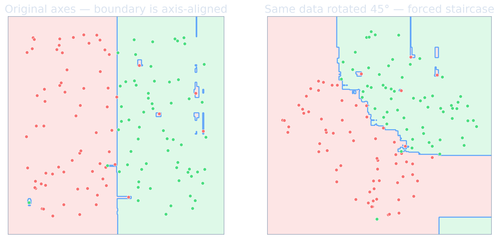{fig-align="center" width="100%"}
::::
:::: {.column width="38%"}
:::: {.incremental}
- Each column here is a **physical quantity** (at% Cr, anneal °C) — the informative cuts are *axis-aligned*.
- Trees exploit that for free; a rotation **destroys** it.
- A neural net is rotation-invariant — great for pixels, a **liability** when axes are meaningful.
- This is *why* "rotation non-invariance is a feature" for tabular data.
::::
::::
::::

:::: {.notes}
- This is the deck's intellectual climax made visible — the explicit callback the previous notes promised: "remember the staircase from §1? On tabular data, where columns are meaningful, the staircase is *correct* and cheap; rotating the data is what makes trees struggle."
- Drive the counter-intuition: students assume invariances are always good (they help on images). Here invariance is harmful because it discards the human-meaningful coordinate system. That reframing is the learning objective.
::::

## TabPFN — deep learning's tabular comeback

:::: {.incremental}
- A transformer **pretrained on millions of synthetic tabular tasks**; does **zero-shot** prediction by taking the entire training set as a context window — *no per-dataset training*.
- As of 2025, competitive with tuned XGBoost on **small** ($\lesssim 10$k rows, $\lesssim 100$ features) tabular problems [@hollmann2023tabpfn].
- v2 adds regression; still bounded by context size — not a large-$N$ replacement yet.
- The first credible deep-learning approach to tabular — worth a quick benchmark on new materials projects.
::::

:::: {.notes}
- This earns its own slide because it is the honest counter-evidence to the previous slide and because the materials sweet spot (composition→property, often a few thousand rows, <100 descriptors) sits squarely in TabPFN's regime. Tell students to literally add it as a one-line baseline next to XGBoost when starting a project.
- The conceptual novelty worth 30 s: TabPFN reframes tabular learning as *in-context learning* — no gradient training per task, just one forward pass with (train_X, train_y, test_X) packed into the prompt. It is Bayesian prediction approximated by a pretrained transformer. This connects forward to Units 9–10 (foundation models / attention).
- Stay calibrated: it is not dethroning gradient boosting at scale today; it is the first deep method that is genuinely competitive in a regime we care about. "Track it, benchmark it, don't bet the thesis on it yet."
::::

## Interpreting tree ensembles

:::: {.columns}
:::: {.column width="50%"}
**Global** (whole model)

- Permutation importance — honest feature ranking.
- Partial dependence / ALE — average effect of one feature.
::::
:::: {.column width="50%"}
**Local** (one prediction)

- **TreeSHAP** [@lundberg2017shap] — exact, additive per-feature attributions for a single sample; aggregates to a faithful global view too.
::::
::::

:::: {.fragment}
Ensembles trade a single tree's readability for accuracy — SHAP/PDP buy back the interpretability that materials science and regulators require.
::::

:::: {.notes}
- Acknowledge the real cost of ensembling: you lose the "read the rules off one tree" interpretability. For materials science (mechanistic insight) and regulated settings (justification), that loss is not acceptable — so this slide is how you recover it, and it is the explicit hand-off to Unit 14 (explainability/trust). Name that forward link.
- Practical guidance: PDP/ALE for "how does property depend on Cr%?", TreeSHAP for "why did the model predict 480 MPa for *this* alloy?". TreeSHAP is exact and fast for trees (unlike kernel SHAP) — that exactness is why it's the standard for tree models.
- Repeat the caveat from the importance slide: explanations describe the *model*, not nature — importance/SHAP ≠ causal effect. This is the single most over-claimed result in applied-ML materials papers.
::::

## Materials example — alloy property prediction {.smaller}

:::: {.columns}
:::: {.column width="52%"}
:::: {.incremental}
- Dataset: 5000 alloys, 12 elemental fractions + 4 processing parameters → predict yield strength.
- **Linear regression** (quadratic features): $R^2 = 0.62$ on held-out alloys.
- **Random Forest** (500 trees, $\sqrt d$ features/split): $R^2 = 0.84$.
- **XGBoost** ($300$ trees, $\eta=0.05$, depth 6): $R^2 = 0.88$.
- Top SHAP features: Cr fraction, anneal temperature, C fraction, Mo fraction.
::::
::::
:::: {.column width="48%"}
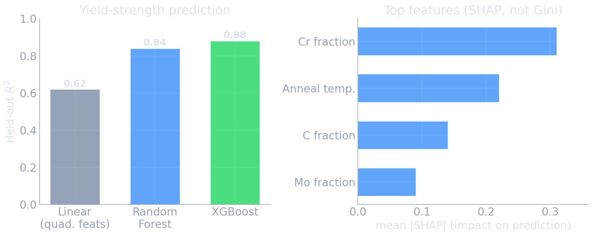{fig-align="center" width="100%"}
::::
::::

:::: {.fragment}
Typical pattern: tree ensembles add **10–20 points of $R^2$** over linear models at essentially no engineering cost.
::::

:::: {.notes}
- This is the "why you just sat through 40 slides" slide — a concrete, representative materials result. The jump from 0.62 → 0.88 with *no feature engineering, no scaling, default-ish hyperparameters* is the entire value proposition in one number.
- Note the SHAP framing (not raw impurity) — practice what the importance slide preached; reinforce by saying "I deliberately reported SHAP here, not Gini importance."
- Honest caveats to state: numbers are illustrative-typical; held-out split must respect alloy families (no near-duplicate leakage across train/test) or R² is optimistic — connect to the OOB/CV assumptions and the Unit 7 exchangeability caveat. Good students will ask; pre-empt it.
::::

## Which model when — a decision guide

:::: {.incremental}
- **First baseline, any tabular problem**: Random Forest (robust, OOB, importances, ~no tuning).
- **Best tabular accuracy, typical materials data**: **CatBoost first** (categorical-heavy, near-optimal at defaults); XGBoost as the general-purpose workhorse; LightGBM if $N>10^6$.
- **Small data ($\lesssim 10$k)**: also benchmark **TabPFN**.
- **Images / spectra / sequences / graphs**: neural networks (Units 9–13), not trees.
- Always: respect the train/val/test split, early-stop boosting, report honest (permutation/SHAP) importances.
::::

:::: {.notes}
- The capstone "what do I actually type" slide — students should photograph this and the tuning recipe. It is the operational distillation of the whole unit.
- Re-emphasize the workflow discipline in the last bullet: the split integrity and honest-importance rules are where real projects fail, not the model choice. Tie back to Unit 7 (data leakage = broken exchangeability) and forward to Unit 14 (honest reporting).
- One sentence on the applied-course dependency: ML-PC Units 7–8 and Materials Genomics *assume* this decision guide as background — students who skip it will be lost there. Frame mastery here as load-bearing for the rest of the track.
::::

## Bias–variance summary across this unit

| Method | Bias | Variance | Mechanism |
|---|---|---|---|
| Single deep tree | low | **high** | flexible greedy partition |
| Bagging | low | reduced | average bootstrap trees |
| **Random Forest** | low | **strongly reduced** | + decorrelate via feature subsets |
| Gradient Boosting | **reduced** | medium | sequentially fit residuals |
| XGBoost (regularized) | reduced | controlled | + leaf penalty, shrinkage, early stop |

:::: {.notes}
- This table is the unit's mental model in one frame — and it should map exactly onto the two-arrow diagram you put on the board in slide 3. Walk each row pointing at "↓Var" or "↓Bias." If a student can reconstruct this table from the two arrows, the unit succeeded.
- Use it as the active-recall checkpoint: cover the last two columns, name a method, have the room supply bias/variance/mechanism. 60 seconds, high retention.
- Transition to wrap-up: every method here was one move on the trade-off Units 6–7 set up — the course is one coherent argument, not a list of algorithms.
::::


<!-- ===== §5. Wrap-up ===== -->

## Unit summary

:::: {.incremental}
- A decision tree is a fast, interpretable, piecewise-constant partitioner — and a **low-bias, high-variance** learner.
- **Bagging / Random Forest** kill variance by averaging *decorrelated* trees; the correlation $\rho$ sets the floor, which is why RF subsamples features.
- **Gradient boosting** is gradient descent in function space; it kills bias by sequentially fitting pseudo-residuals, controlled by shrinkage + early stopping.
- **Gradient-boosted trees** are the 2026 tabular default — **CatBoost** for the categorical-heavy materials data here, XGBoost as the general workhorse, LightGBM at large $N$; trees beat NNs on tabular for concrete, understood reasons (TabPFN the emerging exception).
- Interpret with permutation importance / TreeSHAP, never raw impurity in a paper.
::::

:::: {.notes}
- Deliver three sentences they must leave with: (1) tabular materials problem → gradient boosting first, NN only if data shape demands it; (2) RF reduces variance, boosting reduces bias — name the floor (ρσ²) and the cure (shrinkage + early stopping); (3) report honest importances (permutation/SHAP), not Gini.
- Close the course-level arc: Units 6–8 are one argument — the loss landscape (6), the probabilistic meaning of the loss (7), and the models that best navigate the bias–variance trade-off on real tabular data (8). Then point at the Unit 9 reading: we now leave tabular for *learned representations*.
::::

## Common pitfalls and best practices

:::: {.incremental}
- **Data leakage**: target-derived features, or train/test split that ignores alloy/batch grouping → inflated scores.
- **Over-trusting impurity importance** as if it were causal — it is biased and not causal.
- **No early stopping** on boosting → silent overfitting.
- **Forgetting trees ≠ extrapolation**: predictions are flat outside the training range — dangerous for materials discovery in new composition regions.
- **Over-tuning**: defaults + early stopping beat a frantic grid search more often than students expect.
::::

:::: {.notes}
- This slide is deliberately a list of the specific ways the materials cohort's projects will actually fail — it is worth more than another algorithm. Dwell on the extrapolation point: tree ensembles predict a constant outside the training hull, so using them to *discover* alloys in unexplored composition space gives confident, flat, wrong answers. Pair with epistemic-uncertainty/conformal from Unit 7 as the mitigation.
- Grouped-leakage is the second killer: random row splits on data with near-duplicate alloy families leak information and inflate R²; split by group. This is the single most common reason a materials ML result fails to reproduce.
- End on the over-tuning reassurance — it lowers anxiety and is true: sensible defaults + early stopping + honest evaluation beats hyperparameter panic.
::::

## Lecture-essential vs exercise content split

:::: {.incremental}
- **Lecture**: tree mechanics + impurity, the bagging variance formula and the $\rho$ ceiling, RF decorrelation + OOB, gradient boosting as functional gradient descent, regularization, model choice.
- **Exercise**: build a regression tree from scratch; RF vs single tree on alloy data with OOB; XGBoost with early stopping + a learning-curve sweep; permutation vs TreeSHAP importances; RF/XGBoost baseline on the alloy regression task.
::::

:::: {.notes}
- Set expectations: the written exam tests concepts and the two derivations (bagging variance formula, functional-gradient view) and model-choice reasoning; the coding exercise tests the workflow (early stopping, honest importances, the decision guide).
- Stress the cross-track dependency again: ML-PC Units 7–8 use RF/XGBoost as the assumed tabular workhorse and expect the exercise to have been done. Skipping it has a concrete downstream cost — frame it as non-optional.
::::

## Exam-aligned summary: must-know statements

::: {.fragment}
1. A decision tree partitions feature space into axis-aligned boxes via greedy impurity reduction.
2. Regression impurity = within-node variance; classification = Gini or entropy (≈ equivalent).
3. A single deep tree is low-bias, high-variance, and unstable.
4. Bagging averages bootstrap trees: $\mathrm{Var}=\rho\sigma^2+\frac{1-\rho}{B}\sigma^2$ → floor at $\rho\sigma^2$.
5. Random forest lowers $\rho$ by random feature subsets per split — that is why it beats plain bagging.
6. OOB error is a near-free generalization estimate from the ~37% unused points.
7. Impurity importance is biased; use permutation or TreeSHAP, and never claim causality.
8. Boosting reduces bias by sequentially fitting pseudo-residuals (= negative loss gradient).
9. Gradient boosting = gradient descent in function space; $\eta$ is its learning rate.
10. Boosting overfits without early stopping; small $\eta$ + many trees + early stop is the recipe.
11. XGBoost adds a 2nd-order objective + leaf penalties (general-purpose workhorse); CatBoost (ordered target statistics + ordered boosting) is the near-zero-tuning default for categorical-heavy materials data.
12. On tabular data trees usually beat NNs (uninformative features, non-smooth targets, axis meaning); TabPFN is the emerging small-data exception.
:::

:::: {.notes}
- This is the revision sheet — run it as cold-call active recall: read the statement, the room supplies the justification. Statements 4, 5, 8, 9 are the conceptual spine (the two derivations); weight them heaviest in review and on the exam.
- Statement 7 is the one with real-world scientific stakes (it prevents a publishable error); statement 12 is the one that changes their default modeling choice for the rest of the track. Flag both as "remember this even if you forget the formulas."
- Close: this list is exactly the Learning Outcomes slide, now assessable — the unit delivered its contract. Point to the Unit 9 reading and the transition from tabular models to learned representations.
::::

<!-- BEGIN prev-next -->

## Continue

- &larr; Previous: [Unit 07 &mdash; Probabilistic View of Learning; Noise; Conformal Prediction](../07_probabilistic_view_of_learning/01_intro.html)
- &rarr; Next: [Unit 09 &mdash; Latent Spaces & Advanced Representation Learning](../09_latent_spaces_advanced/01_intro.html)
- [All courses](../../index.html)

<!-- END prev-next -->

## References + reading assignment for next unit

:::: {.incremental}
- **Required reading before Unit 9:**
  - Murphy: Ch. 28 (representation learning) — skim the SSL chapter intro.
  - Bishop: Ch. 12.1–12.3 (continuous latent variable models, PCA revisited).
- **Optional depth:**
  - Hastie, Tibshirani & Friedman, *ESL* Ch. 9–10 & 15 (trees, boosting, random forests).
  - Grinsztajn et al. 2022 — why trees beat deep learning on tabular data.
- Next unit: **Latent Spaces & Advanced Representation Learning** — t-SNE, UMAP, contrastive and self-supervised methods.
::::

::: {#refs}
:::

## Example Notebook

::: {.callout-note icon=false}
## Week 8: Tree Ensembles — RF & XGBoost on alloy regression
[Open rendered notebook →](https://eclipse-lab.github.io/Ai4MatLectures/notebooks/MFML/week07_overfitting_ising_light.html)
[](https://colab.research.google.com/github/ECLIPSE-Lab/Ai4MatLectures/blob/main/notebooks/MFML/week07_overfitting_ising_light.ipynb)
:::
