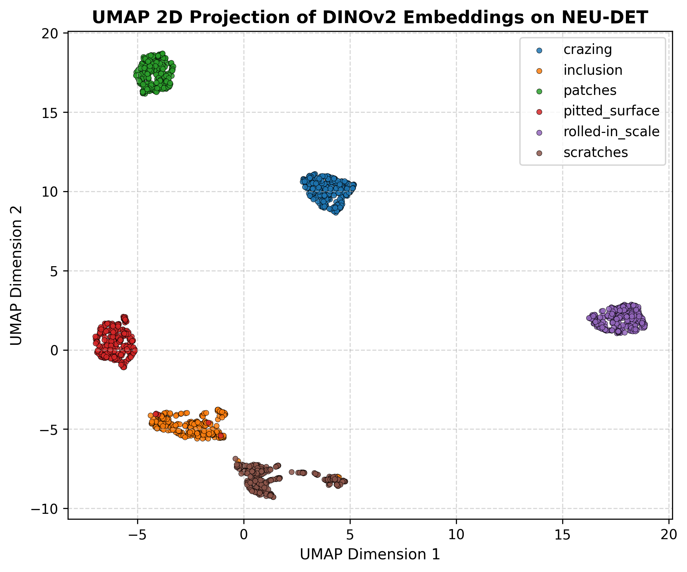

## Where we are in the course

:::: {.columns}
:::: {.column width="50%"}
**Behind us:**

- Unit 5: autoencoders compress data into a **latent space**.
- Unit 7: KL divergence, MLE, Bayesian thinking, conformal prediction.
- We have *a* latent space. We have not asked: *is it any good?*
::::
:::: {.column width="50%"}
**Today (Unit 9):**

- What makes a latent space *good*?
- How do we **visualize** high-dim embeddings? (t-SNE, UMAP)
- How do we **shape** a latent space without reconstruction targets? (contrastive learning)
- Why do **foundation models** transfer? (pre-trained embeddings)
::::
::::

:::: {.notes}
- **Narrative Hook:** Start by positioning today's lecture. In Unit 5, we built autoencoders and celebrated when the network could reconstruct our inputs. We called the bottleneck a "latent space" and called it a day. But we did not ask the hard question: *Is this space actually useful for anything other than copying?*
- **Connecting back:** In Unit 7, we built probabilistic tools (KL divergence, MLE, Bayesian inference). Today, we use those exact mathematical structures to shape and understand representations.
- **Why this unit matters:** In modern ML, representation is the central currency. If you have a good representation, downstream tasks (classification, regression, design) become linear or trivial. If you have a poor representation, even the most complex model will fail.
- **Goal for today:** We want to look under the hood of representations: how to visualize them (t-SNE/UMAP), how to shape them without labels (contrastive learning), and why pre-trained representations from foundation models transfer so well to engineering tasks.
::::

## Recap: the autoencoder latent

:::: {.columns}
:::: {.column width="45%"}
:::: {.incremental}
- Encoder $f_\phi: \mathbb{R}^d \to \mathbb{R}^k$ compresses.
- Decoder $g_\theta: \mathbb{R}^k \to \mathbb{R}^d$ reconstructs.
- Loss: MSE reconstruction.
- The bottleneck $z = f_\phi(x)$ is what we keep.
::::

:::: {.fragment}
The reconstruction loss says only one thing: *encode enough information to undo*. It says **nothing** about whether similar inputs end up close, whether categories cluster, or whether interpolation is meaningful.
::::
::::
:::: {.column width="55%"}
![A simple autoencoder: inputs (green) are compressed to a small latent layer $z$ (blue) and reconstructed at the output (red). The latent bottleneck is the only constraint — it imposes no structure on what $z$ means. [@mcclarren2021machine]](images/autoencoder_architecture.png){width=65%}
::::
::::

:::: {.notes}
- **Recap Mechanics:** Remind the students of the encoder/decoder mechanics from Unit 5. The key is that the latent bottleneck $z$ is the only constraint.
- **The Core Pedagogical Point:** Emphasize the text in the fragment. The reconstruction loss (MSE) is a purely pixel-wise/point-wise matching criterion. It forces the network to preserve information, but it does *not* regulate how that information is organized geometrically in the latent space.
- **Chalkboard Prompt:** Draw a 2D sheet in a 3D ambient space. Show two points that are semantically identical (e.g., two micrographs of the same steel phase but under different lighting). Under MSE reconstruction, the model is forced to reconstruct the lighting, mapping these points far apart. We want them close. This is the central conflict of representation learning.
::::

## What is a "good" latent space?

:::: {.columns}
:::: {.column width="55%"}
Four desiderata, with examples that fail each:

:::: {.incremental}
- **Compactness within concept**: same-class samples are close. (Fails: AE trained on noisy spectra spreads each phase across the latent.)
- **Separation across concepts**: different-class samples are far. (Fails: AE pushes variance budget into reconstruction detail, not class separation.)
- **Smooth interpolation**: the line $z_A \to z_B$ gives a smooth transition in $x$-space. (Fails: vanilla AE has "holes" that decode to nonsense.)
- **Transferability**: a small head on $z$ for task A also works for task B. (Fails: AE features overfit to reconstruction artifacts.)
::::
::::
:::: {.column width="45%"}
![A leaf-spectra autoencoder with a 2-D latent. The scatter (top-left) shows the 2-D code space; colored regions indicate different leaf clusters. Traversing $z_1$ and $z_2$ independently (other panels) produces smooth spectral interpolations — but only *within* the data manifold. Dead regions between clusters produce nonsense. [@mcclarren2021machine]](images/ae_latent_space_leaf_spectra.png){width=100%}
::::
::::

:::: {.notes}
- **Pedagogical Goal:** Establish a formal evaluation framework for representations. Walk through the four criteria one by one.
- **Intuition and Failures:**
  - *Compactness*: Same-phase alloys should group tightly. A standard AE will spread them out if minor noise dominates the reconstruction budget.
  - *Separation*: Martensite should not overlap with Ferrite. Standard AEs might group them if their background texture is similar, wasting variance on texturing rather than phase boundaries.
  - *Smooth Interpolation*: Point to the leaf spectra figure on the right. If you move along a line between two clusters, you pass through "dead zones" of the latent space that have zero training data. The decoder has never seen these regions, so it outputs physically impossible spectra.
  - *Transferability*: Features learned for compression might be useless for predicting material hardness if hardness depends on fine-grained defects that the AE discarded as "noise."
- **Teaching Tip:** Emphasize that there is no absolute "optimal" latent space. It is always a trade-off dependent on the downstream task.
::::

## Learning outcomes

By the end of this unit, students can:

:::: {.incremental}
- **Critique** a latent space against the four desiderata above.
- **Derive** the t-SNE objective and avoid common misinterpretations of t-SNE plots.
- **Compare** t-SNE and UMAP at a conceptual level.
- **Explain** contrastive learning as a self-supervised representation objective.
- **Use** a foundation embedding as a feature extractor for downstream materials tasks.
- **Anticipate** how the VAE (Unit 11) shapes the latent distribution explicitly.
::::

:::: {.notes}
- **Learning Outcomes:** Review the learning outcomes to establish the contract with the class.
- **Pacing Rationale:** Flag to the students that they are moving through three levels of mastery today:
  1. *Visualization/Diagnostics* (t-SNE & UMAP): How to inspect high-dimensional spaces qualitatively.
  2. *Shaping from Scratch* (Contrastive Learning): How to enforce semantic similarity directly in the loss function without human labels.
  3. *Zero-Shot & Transfer* (Foundation Embeddings): How to stand on the shoulders of giants and use large pre-trained encoders.
- **Exam Warning:** Explicitly state that deriving the t-SNE objective and criticizing representations (using the four desiderata) are common written exam targets.
::::

## Roadmap of today's 90 min

:::: {.incremental}
1. **What makes a latent space good** (~7 min)
2. **t-SNE — the probabilistic embedding** (~17 min) — the cleanest math, our teaching vehicle
3. **UMAP — the modern default** (~16 min) — what you actually reach for in 2026
4. **Contrastive learning** (~21 min) — shaping latents without labels
5. **Foundation embeddings** (~17 min) — pre-trained encoders as features
6. **Latent geometry recap** (~6 min) — bridge to Unit 11 (VAE)
7. **Wrap** (~5 min)
::::

:::: {.notes}
- **Presenter Timing Guide:** Keep this slide up for a moment to outline the lecture's timing. 
- **Time Management Strategy:**
  - *Visualization (Blocks 2 & 3)* takes about ~33 minutes. Use t-SNE for the mathematical heavy-lifting (the affinities, Student-t distribution) because the math is elegant. UMAP is the modern workhorse, so cover its operational steps quickly.
  - *Active Representation (Blocks 4 & 5)* takes ~38 minutes. Protect this time! Contrastive learning and foundation embeddings are what students will actually implement in their projects and research.
  - If you run behind on t-SNE math, compress the derivation details. Do NOT compress UMAP or Contrastive Learning.
::::

<!-- ===== §2. t-SNE ===== -->

## t-SNE: the goal

:::: {.columns}
:::: {.column width="55%"}
We have $N$ high-dimensional points $\{x_1, \ldots, x_N\} \subset \mathbb{R}^d$. We want low-dimensional points $\{y_1, \ldots, y_N\} \subset \mathbb{R}^2$ such that:

:::: {.fragment}
**points that are close in $\mathbb{R}^d$ stay close in $\mathbb{R}^2$.**
::::

:::: {.fragment}
This is harder than it sounds — distances in $\mathbb{R}^d$ generally cannot all be preserved in $\mathbb{R}^2$. t-SNE makes a specific trade-off: **preserve local structure, sacrifice global structure**.
::::
::::
:::: {.column width="45%"}
:::: {.fragment}
![The probabilistic PCA (PPCA) generative view: a 1-D latent $z$ maps through a weight vector $\mathbf{w}$ to produce a correlated 2-D Gaussian. PCA/PPCA is a *linear* method — useful for understanding the linear structure of a latent before t-SNE reveals non-linear clusters. [@murphy2012machine]](images/ppca_generative_model_illustration.png){width=100%}
::::
::::
::::

:::: {.notes}
- **Core Objective:** t-SNE's goal is visualization, not downstream modeling. The target is $\mathbb{R}^2$ or $\mathbb{R}^3$ for human consumption.
- **The Core Mathematical Constraint:** Highlight the Johnson-Lindenstrauss lemma conceptually: you cannot project high-dimensional data (where points have many orthogonal directions to exist in) to low dimensions without distorting distances.
- **The t-SNE Trade-off:** t-SNE's fundamental choice is to prioritize *local neighborhoods* (if two samples are close in high-dim, they MUST be close in low-dim). It does *not* care about preserving large distances (if two points are far in high-dim, they can end up anywhere in low-dim, as long as they are not on top of each other).
- **Linear Baseline Comparison (PPCA):** Use the figure on the right to recap Unit 2. Probabilistic PCA represents data using a linear latent variable model (a simple projection). If our data manifold is curved or has discrete, non-linear clusters, linear methods like PCA or PPCA will smudge them together. This is why we need a non-linear local method.
::::

## t-SNE step 1: high-dim similarities and perplexity

For each pair $(i, j)$ in the high-dim space, define a **conditional probability**:

$$
p_{j|i} = \frac{\exp\!\left(-\|x_i - x_j\|^2 / 2\sigma_i^2\right)}{\sum_{k \neq i} \exp\!\left(-\|x_i - x_k\|^2 / 2\sigma_i^2\right)}.
$$

Read this as: "*if you're $x_i$ and you pick a neighbor according to a Gaussian, with what probability would you pick $x_j$?*" Symmetrize: $p_{ij} = (p_{j|i} + p_{i|j}) / (2N)$.

:::: {.fragment}
**Perplexity** $= 2^{H(P_i)}$ with $H(P_i) = -\sum_j p_{j|i} \log_2 p_{j|i}$: the *effective number of neighbors* of $x_i$. The user picks perplexity (typical 5-50); t-SNE binary-searches $\sigma_i$ per point to match it.
::::

:::: {.notes}
- **Math Walkthrough:** Carefully explain the conditional similarity $p_{j|i}$. It is a softmax over squared Euclidean distances.
  - The numerator: standard Gaussian kernel.
  - The denominator: normalizes over all other points $k \neq i$ so that $\sum_j p_{j|i} = 1$.
- **Symmetrization:** Explain why we symmetrize to $p_{ij}$. If point $A$ is in a dense cluster and point $B$ is an outlier, $A$ is not likely to choose $B$ as a neighbor ($p_{B|A} \approx 0$), but $B$ is forced to choose $A$ as a neighbor ($p_{A|B} \approx 1$). Symmetrization ensures outlier points do not get ignored during optimization.
- **Unpacking Perplexity:** Perplexity is the most critical user-facing parameter. It measures the "effective size" of local neighborhoods.
  - Mathematically, it is $2^{H(P_i)}$ where $H(P_i)$ is the Shannon entropy of the neighbor distribution.
  - If a distribution is uniform over $k$ points, its entropy is $\log_2 k$ and its perplexity is exactly $k$.
  - Therefore, perplexity can be thought of as the number of neighbors we expect each point to have.
- **Adaptive $\sigma_i$:** Explain that the bandwidth $\sigma_i$ is *not* constant. t-SNE runs a binary search for each point $x_i$ to find a $\sigma_i$ such that the entropy of $P_i$ satisfies the user-defined perplexity. This makes t-SNE density-adaptive: dense regions get small $\sigma_i$ and sparse regions get large $\sigma_i$.
::::

## The crowding problem and the Student-t fix

:::: {.columns}
:::: {.column width="50%"}
A naive low-dim Gaussian $q_{ij}^{\text{Gauss}} \propto \exp(-\|y_i - y_j\|^2)$ matched to $P$ via $\mathrm{KL}(P\|Q)$ **breaks**: in $\mathbb{R}^2$ there is no room for the many moderate-distance neighbors that a high-dim shell affords (only ~6 fit at the same distance). The Gaussian's tail forces an attractive collapse.

:::: {.fragment}
**Fix**: a heavy-tailed Student-t (1 d.o.f. = Cauchy) in low-dim,

$$
q_{ij} = \frac{(1 + \|y_i - y_j\|^2)^{-1}}{\sum_{k \neq l} (1 + \|y_k - y_l\|^2)^{-1}}.
$$

Moderate distances stay possible without infinite force — the "t" in t-SNE.
::::
::::
:::: {.column width="50%"}
![Normal (blue) vs Cauchy/Student-t (orange). At $|x|=4$ the Cauchy value is ~140× larger than the Gaussian. This heavy tail lets moderate-distance pairs stay separated in 2-D — solving the crowding problem. [@mcclarren2021machine]](images/gaussian_vs_student_t_heavy_tail.png){width=100%}
::::
::::

:::: {.notes}
- **Pedagogical Gem (The Crowding Problem):** This is a key conceptual gate. Spend time here.
- **The Geometry of High Dimensions:** In 10-dimensional space, you can have 11 points that are all mutually equidistant (forming a regular 10-simplex). If you try to place those same 11 points in 2-D, they *cannot* be equidistant. The distance must stretch or squash.
- **The Shell Volume Paradox:** The volume of a sphere scales as $r^d$. In high dimensions, most of the volume of a sphere is concentrated near its surface. This means a point has a massive number of "moderate distance" neighbors. If we use a Gaussian kernel in low dimensions, its tails decay exponentially ($\exp(-d^2)$). To match a moderate high-dimensional similarity, the low-dimensional points must be placed very close together. Stacking all moderate-distance neighbors in 2-D forces them to crowd together, crushing the local structure into a single dense blob.
- **The Student-t Solution:** By using a Student-t distribution with 1 degree of freedom (which is a Cauchy distribution, scaling as $1/(1+d^2)$), the tail decays much more slowly (power-law instead of exponential). Look at the plot on the right: at distance 4, the Cauchy value is 140x larger than the Gaussian!
- **Intuition:** Because the low-dim kernel has a heavy tail, points that are moderately far apart in high dimensions can remain moderately far apart in 2-D without their low-dimensional similarity $q_{ij}$ dropping to zero. It "gives them room to breathe."
::::

## t-SNE step 3: minimize KL

Optimize the embedding $\{y_i\}$ to minimize:

$$
C(\{y_i\}) = \mathrm{KL}(P \,\|\, Q) = \sum_{i \neq j} p_{ij} \log \frac{p_{ij}}{q_{ij}}.
$$

:::: {.incremental}
- The gradient $\partial C / \partial y_i$ has an attractive term (preserve high-dim neighbors) and a repulsive term (avoid collapse).
- Optimization: gradient descent with momentum, typically 1000 iterations.
- Random initialization → t-SNE plots **vary across runs**. Use the same seed when comparing.
::::

:::: {.notes}
- **Unpacking KL Asymmetry:** Explain why we use $\mathrm{KL}(P\|Q)$ rather than $\mathrm{KL}(Q\|P)$ (recall Unit 8's KL primer).
  - The objective is $\sum p_{ij} \log(p_{ij}/q_{ij})$.
  - If $p_{ij}$ is large (points are close in high-dim) and $q_{ij}$ is small (points are far in low-dim), the cost is massive: we pay a huge penalty for splitting close neighbors.
  - If $p_{ij}$ is small (points are far in high-dim) and $q_{ij}$ is large (points are close in low-dim), the term $p_{ij} \log(p_{ij}/q_{ij})$ is very small: t-SNE doesn't care if far-apart points end up close in 2-D.
  - This is why t-SNE is *strictly local*: it preserves close distances and ignores global topology.
- **Chalkboard Prompt:** Write down the gradient of the KL cost function (conceptual form):
  $$\frac{\partial C}{\partial y_i} = 4 \sum_j (p_{ij} - q_{ij})(y_i - y_j)(1 + \|y_i - y_j\|^2)^{-1}$$
  Highlight the $(p_{ij} - q_{ij})$ term: it acts as a spring force. If $p_{ij} > q_{ij}$, it pulls points together (attraction). If $p_{ij} < q_{ij}$, it pushes them apart (repulsion).
- **Stochastic Nature:** Emphasize that because the optimization landscape is highly non-convex, the final layout depends heavily on the random initialization. Students must set a random seed to ensure reproducibility.
::::

## Common t-SNE misinterpretations

:::: {.columns}
:::: {.column width="55%"}
:::: {.incremental}
- *"These two clusters are 5× further apart than those two."* — between-cluster distance in t-SNE **is not metric**.
- *"This cluster is bigger, so this class has more variance."* — cluster **size and density are algorithm artifacts**, not data properties.
- *"Run looks different from yesterday's run."* — yes; t-SNE is stochastic. Set a seed.
- *"Same data, different perplexity, different structure."* — yes; perplexity changes the question being asked.
- **Preserved**: local neighborhoods. **Not preserved**: cluster sizes, between-cluster distances, density.
::::

:::: {.fragment}
**Read t-SNE plots qualitatively. Never quantitatively.**
::::
::::
:::: {.column width="45%"}
![Fashion MNIST t-SNE with image thumbnails at their 2-D positions. Within an "island" the images are visually coherent; across islands, the placement reveals *why* t-SNE connected certain classes (a light sandal really does look like a light sneaker). [@mcclarren2021machine]](images/tsne_fashion_mnist_thumbnails.png){width=60%}
::::
::::

:::: {.notes}
- **The "Must-Know" Diagnostic Slide:** This slide addresses the most common errors in published scientific literature. Walk through the points slowly.
- **Why between-cluster distances are meaningless:** Because t-SNE ignores large distances in its KL objective, the relative spacing between different "islands" is purely an artifact of where the optimizer happened to push them. You cannot say "Phase A is closer to Phase B than Phase C" based on a t-SNE plot.
- **Why cluster size is meaningless:** t-SNE adaptively adjusts $\sigma_i$ to keep perplexity constant. This means it expands sparse clusters and contracts dense ones. A large, spread-out cluster in t-SNE does *not* mean the underlying data has higher variance; it just means that region was sparser in the ambient space.
- **Perplexity Sensitivity:** Mention that if perplexity is too low (e.g., 2), the data splits into dozens of tiny, meaningless clusters. If it's too high (e.g., 1000), it merges everything into a single blob.
- **Teaching Reference:** Recommend the interactive article "How to Use t-SNE Effectively" by Wattenberg et al. (Distill.pub) as required reading.
::::

## t-SNE on a materials dataset

:::: {.columns}
:::: {.column width="40%"}
**Analogous benchmark: Fashion MNIST** (10 clothing classes, 6000 images, 784 dims → 2 dims, perplexity 40)

- **Useful**: phase families / clothing classes form islands; outliers visible at the boundary.
- **Not useful**: don't measure the gap between islands — that distance is **meaningless**.
- Note: t-shirts (cyan) and shirts (pink) overlap — their pixel structure is genuinely similar.

For materials: same logic applies to alloy-composition or spectral data.
::::
:::: {.column width="60%"}
![t-SNE 2-D embedding of 6000 Fashion MNIST images (perplexity 40). Each point is one image colored by class. Trousers (orange) form a well-separated island; shirts/T-shirts overlap — they are genuinely similar in pixel space. Island sizes and inter-island distances are **not** quantitatively meaningful. [@mcclarren2021machine]](images/tsne_fashion_mnist_clusters.png){width=100%}
::::
::::

:::: {.notes}
- **Materials Analogy:** Bridge the Fashion MNIST visualization to a materials science context.
  - Think of Fashion MNIST's 784 dimensions as a 784-channel spectrum (like EELS or EDS) taken at different points on a sample.
  - The "islands" correspond to different chemical phases or crystal structures.
  - The overlap between "shirts" and "T-shirts" represents phase boundaries or intermediate solid solutions where the spectra are genuinely mixed.
- **Exploratory Value:** Explain that t-SNE is highly useful for *data screening*: if you see an outlier point floating far away from any island, it usually indicates a bad measurement, scale bar artifact, or sample degradation.
- **Handoff to UMAP:** Point out that while t-SNE shows the clusters, it doesn't preserve how those clusters relate to each other globally. If we want a map that shows which phases are chemically close to which, we need UMAP.
::::

<!-- ===== §3. UMAP ===== -->

## UMAP: the modern default

:::: {.incremental}
- **U**niform **M**anifold **A**pproximation and **P**rojection (McInnes et al. 2018).
- **Idea**: build a *fuzzy graph* of high-dim neighbours (edge weights $\in [0,1]$ measuring "how strongly connected"), then find a low-dim layout whose fuzzy graph matches via **cross-entropy** on edge weights.
- Same goal as t-SNE — 2-D/3-D visualization — but different machinery: graph + cross-entropy rather than distributions + KL.
- Faster (scales to millions of points), more stable across runs, and preserves **more global structure** than t-SNE.
- **2026 default** for embedding materials data; t-SNE has become a diagnostic.
::::

:::: {.notes}
- **Introduction to UMAP:** UMAP was introduced in 2018 by McInnes et al. and has largely replaced t-SNE in engineering and biological pipelines.
- **The Conceptual Difference:**
  - t-SNE is *probabilistic*: it models similarities as probability distributions and minimizes KL divergence.
  - UMAP is *geometric/topological*: it assumes the data lives on a Riemannian manifold, approximates this manifold locally, and patches these local approximations together into a fuzzy simplicial set (a weighted graph). It then projects this graph to 2-D by minimizing cross-entropy.
- **The Global Structure Win:** Highlight that UMAP preserves *both* local clustering and global topology. It doesn't scatter clusters randomly; their relative positions are meaningful.
- **Compute:** It is significantly faster and scales linearly with dataset size, making it the default choice for large-scale materials genomic screens.
::::

## UMAP: the algorithm in 4 steps

:::: {.incremental}
1. **Local k-NN graph with adaptive distances.** For each point $x_i$, find its $k$ nearest neighbours and rescale distances by a local $\sigma_i$ chosen so the *k*-th nearest sits at unit similarity. This makes the metric **density-adaptive**: dense regions get tighter neighbourhoods, sparse regions get wider ones.
2. **Symmetrize into a fuzzy graph.** Combine the directed edge weights $w_{i \to j}$ and $w_{j \to i}$ via fuzzy-set union: $w_{ij} = w_{i\to j} + w_{j\to i} - w_{i\to j}\, w_{j\to i} \in [0, 1]$.
3. **Spectral initialisation.** Place the low-dim points $\{y_i\}$ using the leading eigenvectors of the graph Laplacian — a globally consistent starting point (t-SNE starts random; UMAP doesn't).
4. **Cross-entropy optimisation.** Minimise the binary cross-entropy between high-dim edge weights $w_{ij}$ and low-dim edge weights $v_{ij} = (1 + a \|y_i - y_j\|^{2b})^{-1}$ via stochastic gradient with negative sampling.
::::

:::: {.fragment}
**Contrast with t-SNE**: same spirit (match high- and low-dim affinities), but UMAP uses **cross-entropy on a graph** rather than **KL on distributions**, plus a spectral initial layout — which is *why* it preserves global structure better and runs faster.
::::

:::: {.notes}
- **Operational Walkthrough:** Do not get bogged down in algebraic topology (simplicial complexes). Explain UMAP operationally:
  1. *k-NN Graph & Adaptive Metrics:* For each point $x_i$, we calculate distances to its $k$ nearest neighbors. To handle varying densities, we divide distances by $\sigma_i$ (distance to the 1st neighbor) and subtract a term so the nearest neighbor has similarity 1. This creates a directed graph.
  2. *Symmetrization:* We symmetrize using fuzzy set union. The formula $w_{ij} = w_{i\to j} + w_{j\to i} - w_{i\to j}w_{j\to i}$ is just the probability that at least one directed edge exists.
  3. *Spectral Initialization:* t-SNE starts with random positions, which destroys global structure. UMAP solves the eigenvectors of the graph Laplacian to place points in a globally consistent 2-D layout before optimization starts.
  4. *Cross-Entropy Optimization:* We minimize the binary cross-entropy:
     $$CE(W, V) = \sum w_{ij} \log \frac{w_{ij}}{v_{ij}} + (1 - w_{ij}) \log \frac{1 - w_{ij}}{1 - v_{ij}}$$
- **KL vs CE:** Explain that the second term (the $(1 - w_{ij})$ part) is what t-SNE lacks. This term acts as a repulsive force that pushes non-neighbors apart, preventing clusters from collapsing together and preserving global layout.
::::

## UMAP vs t-SNE: when to use which

| | t-SNE | UMAP |
|---|---|---|
| Local structure | excellent | excellent |
| Global structure | poor | better |
| Speed | slow ($O(N \log N)$ Barnes-Hut) | fast (linear in edges) |
| Stability | stochastic, random init | more stable, spectral init |
| Theoretical grounding | KL on distributions | cross-entropy on fuzzy graph |
| Scales to | $\sim 10^4$ points | $\sim 10^6$+ points |

:::: {.fragment}
**2026 default**: reach for **UMAP first** for any embedding/visualisation of materials data. Use **t-SNE only** when you specifically want to inspect *local cluster shape* (e.g. is this island one phase or two?) — its local exaggeration is then a feature, not a bug.
::::

:::: {.fragment}
**Never** use either method to make quantitative distance claims.
::::

:::: {.notes}
- **Pacing Tip:** Use this slide as a quick summary table.
- **Key Decision Matrix:**
  - Choose **UMAP** for 95% of tasks. It is faster, more stable, and the relative positions of clusters reflect real global relationships.
  - Choose **t-SNE** only as a diagnostic when you suspect a UMAP cluster contains sub-structures that UMAP merged. t-SNE's local crowding exaggeration can force sub-clusters apart, acting as a magnifying glass for local details.
- **Warning:** Re-emphasize that neither method is metric. You cannot run quantitative regression on t-SNE/UMAP coordinates.
::::

## UMAP — key hyperparameters and example

:::: {.columns}
:::: {.column width="45%"}
:::: {.incremental}
- `n_neighbors` (analog of perplexity): local vs global trade-off. Low → local; high → global.
- `min_dist`: how tight clusters can be in the output.
- `metric`: cosine for normalised embeddings, Euclidean for raw features.
- Both knobs are forgiving in practice; defaults (`n_neighbors=15`, `min_dist=0.1`) usually work.
::::
::::
:::: {.column width="55%"}
![McInnes et al. (2018), Fig. 4: UMAP (top row) vs t-SNE and other methods on COIL-20, MNIST, Fashion-MNIST, and word-vector datasets. UMAP preserves both local cluster structure and large-scale topology (the COIL-20 object loops remain intact). [@mcinnes2018umap]](images/umap_mnist_coil20_comparison.png){width=60%}
::::
::::

:::: {.notes}
- **Unpacking UMAP Knobs:**
  - `n_neighbors`: Governs the local vs global trade-off. A small value (e.g., 5) forces UMAP to focus on very tight local structures (similar to low perplexity). A large value (e.g., 100) forces it to prioritize the global manifold shape.
  - `min_dist`: Controls how tightly UMAP packs points. Lower values (e.g., 0.001) lead to dense, tight clusters; higher values (e.g., 0.5) preserve a looser, more continuous layout.
- **Reading the Figure:** Point out McInnes et al.'s comparison. Notice the COIL-20 dataset (objects rotated on a turntable): UMAP preserves the continuous loops representing rotation, whereas t-SNE breaks the loops into disjoint segments. This is a classic demonstration of UMAP's global superiority.
::::

## UMAP on a materials dataset

:::: {.columns}
:::: {.column width="40%"}
**Setup.** 1,800 steel-surface-defect micrographs (NEU-DET); DINOv2 (ViT-S/14) embeddings $\in \mathbb{R}^{384}$; UMAP to $\mathbb{R}^2$ with `n_neighbors=30`, `min_dist=0.05`, cosine metric.

:::: {.incremental}
- Steel defects (crazing, inclusion, patches, pitted, rolled-in scale, scratches) form distinct, **visually coherent** clusters.
- DINOv2 foundation embeddings encode rich semantic features: the model has **never seen steel surface defects** during training, yet naturally groups them by defect type.
- This zero-shot capability is what makes foundation models the modern starting point for materials microscopy.
::::
::::
:::: {.column width="60%"}

::::
::::

:::: {.notes}
- **Materials Context (The Steel Surface Defect Example):** Explain the setup. We have NEU-DET optical micrographs of steel surface defects. We pass them through a pre-trained DINOv2 (ViT-S/14) model to get 384-dimensional feature vectors, then project to 2-D using UMAP.
- **Zero-Shot Representation:** DINOv2 was pre-trained on natural images, yet it perfectly clusters the steel defects without task-specific training or labels.
- **Latent Geometry:** The UMAP projection preserves semantic clusters cleanly. This serves as a strong foundation for downstream classification or anomaly detection.
::::

<!-- ===== §4. Contrastive learning ===== -->

## Beyond reconstruction: shaping the latent

:::: {.incremental}
- Vanilla AE: minimize reconstruction error → latent encodes everything needed to reconstruct.
- This often includes things we **don't** care about (lighting, noise, instrument-specific artifacts).
- We want a latent that captures **semantic** similarity, not pixel-level similarity.
::::

:::: {.fragment}
**Insight**: instead of asking "can you reconstruct?", ask "can you tell that *this* and *that* are the same thing?"
::::

:::: {.notes}
- **Transition:** We are moving from *diagnosing* representations (t-SNE/UMAP) to *creating* them.
- **The Core Issue with Autoencoders:** Autoencoders minimize pixel-wise MSE. To reconstruct an image of a grain boundary, the model spends most of its capacity copying the exact pixel noise, the lighting gradient, and the instrument artifacts. But we don't care about those; we care about the *grain structure*.
- **The Reframe:** Introduce the concept of *invariance*. We want to define what changes are "nuisance parameters" (e.g., rotation, lighting, noise) and force the model to ignore them, focusing only on semantic content.
::::

## Contrastive learning — the idea

:::: {.incremental}
- For each input $x$, generate two **augmentations** $x^+, x^{++}$ (e.g., crop + color jitter).
- These two are a **positive pair** — they should map to nearby latents.
- All other samples in the batch are **negatives** — they should map to far latents.
- Loss: pull positives together, push negatives apart.
::::

:::: {.fragment}
The augmentation choice **defines what invariances the latent learns.**
::::

:::: {.notes}
- **The Contrastive Principle:** Introduce the core mechanism: positive pairs vs. negative pairs.
- **Semantic Consistency:** If we take a micrograph $x$, rotate it to get $x^+$, and crop it to get $x^{++}$, they are still the same physical sample. We want their latent representations to be identical ($z^+ \approx z^{++}$).
- **Batch Contrast:** To prevent the model from learning the trivial solution of mapping *every* image to a constant vector $z = [0, 0, \dots]$ (representation collapse), we must push representations of *different* images far apart.
- **Key Insight:** In contrastive learning, **augmentations are the labels**. The choice of augmentations defines what physical properties the latent space learns to be invariant to.
::::

## SimCLR: the canonical recipe

:::: {.columns}
:::: {.column width="55%"}
:::: {.incremental}
1. Sample a batch of $N$ inputs.
2. Apply two random augmentations to each → $2N$ samples.
3. Pass through encoder $f$ → projector $g$ → embedding $z_i$.
4. For each $z_i$, the matched-augmentation $z_j$ is the positive; the other $2N - 2$ are negatives.
5. Loss: NT-Xent (a softmax-style normalized temperature-scaled cross-entropy).
::::
::::
:::: {.column width="45%"}
![Chen et al. (2020), Fig. 2: the SimCLR framework. Input $x$ is augmented twice ($t \sim \mathcal{T}$, $t' \sim \mathcal{T}$) to yield $\tilde{x}_i, \tilde{x}_j$. The shared encoder $f(\cdot)$ maps these to representations $h_i, h_j$; projector $g(\cdot)$ maps to $z_i, z_j$ where the contrastive loss maximizes agreement. Only $f$ is kept after pre-training. [@chen2020simclr]](images/simclr_framework_fig2.png){width=100%}
::::
::::

:::: {.notes}
- **SimCLR Architecture (Chen et al., 2020):** Walk through the diagram step-by-step.
  1. We start with a batch of $N$ images.
  2. We apply two random augmentations to each image, creating $2N$ views.
  3. The shared encoder $f(\cdot)$ extracts feature vectors $h$.
  4. The projector head $g(\cdot)$ (a small MLP) maps $h$ to $z$ where the contrastive loss is applied.
- **Why the Projector Head Matters:** This is a crucial engineering detail. If we apply the contrastive loss directly to $h$, the model will throw away information needed for downstream tasks (like color or fine details) to satisfy the loss. By applying the loss to $z$, the projector $g(\cdot)$ can discard this information, while the encoder $f(\cdot)$ retains a rich, general-purpose representation in $h$.
- **Downstream Reuse:** After training, we discard $g(\cdot)$ and keep only the encoder $f(\cdot)$.
::::

## InfoNCE / NT-Xent loss

For a positive pair $(i, j)$:

$$
\mathcal{L}_{i,j} = -\log \frac{\exp(\mathrm{sim}(z_i, z_j) / \tau)}{\sum_{k \neq i} \exp(\mathrm{sim}(z_i, z_k) / \tau)},
$$

where $\mathrm{sim}(u, v) = u^T v / (\|u\| \|v\|)$ (cosine similarity), and $\tau$ is a temperature hyperparameter.

:::: {.fragment}
Read this as: a $(2N-1)$-way classification — given $z_i$, identify $z_j$ among all candidates. Positives win when their similarity exceeds all negatives.
::::

:::: {.notes}
- **Math Breakdown:** Write the InfoNCE loss on the chalkboard and explain its parts:
  - The numerator: $\exp(\mathrm{sim}(z_i, z_j)/\tau)$ measures the similarity of the positive pair (must be maximized).
  - The denominator: sums over the positive pair AND all $2N-2$ negative pairs in the batch.
- **Softmax Connection:** Show that the loss is structurally identical to multiclass cross-entropy (softmax) where the "correct class" is the positive match.
- **The Role of Temperature $\tau$:** Unpack this critical hyperparameter.
  - A low temperature ($\tau \to 0$) scales up the similarities, making the softmax highly sensitive to the *hardest* negatives (the ones that are close in latent space but are actually different objects). This forces tight boundaries but can make training unstable.
  - A high temperature ($\tau \to \infty$) smooths the similarities, treating all negatives equally, which leads to loose, less discriminative embeddings.
::::

## Why contrastive learning works

:::: {.incremental}
- Positive pairs share **semantic** content (same object, augmented differently).
- Negatives share nothing in particular (different objects from the batch).
- Minimizing the loss forces the encoder to encode *what makes inputs the same object* and ignore augmentation-induced variation.
- The latent ends up organized by semantic similarity, not pixel similarity.
::::

:::: {.fragment}
This is **the** modern self-supervised pre-training story: 2018-2022 saw a string of contrastive methods (MoCo, SimCLR, BYOL, DINO) compete with and eventually surpass supervised pre-training on ImageNet.
::::

:::: {.notes}
- **Pedagogical Summary:** Re-enforce the intuition. The loss acts as an electrostatic force: positives attract, negatives repel.
- **Semantic Organization:** Because negatives are random batch samples, the model cannot satisfy the repulsion by finding simple pixel patterns. It is forced to group images by their shared high-level semantic features (e.g., grain shape, phase texture) because those are the only features that survive the augmentation process.
- **Historical Context:** Note that contrastive learning was the first self-supervised paradigm to beat supervised ImageNet pre-training, proving that unlabeled data can yield superior feature extractors.
::::

## Augmentation choices for materials

:::: {.incremental}
- **Micrographs**: random crops (preserve scale by physical units), rotations (if isotropic), brightness/contrast jitter.
- **Spectra**: small wavelength shifts (within instrument tolerance), Gaussian noise injection, intensity scaling.
- **Compositions**: ε-perturbations within physical bounds, charge-balance preservation.
- **Avoid**: augmentations that change the *thing being identified*. A 50% intensity scaling on a spectrum is fine; a non-physical peak shift is not.
::::

:::: {.notes}
- **Domain-Specific Adaptation:** This is highly relevant for materials science students.
- **Augmentation Design Rules:**
  - *Rotations*: If we study isotropic microstructures (like equiaxed grains), rotation invariance is physically correct. If we study rolled steel with oriented grains, rotation invariance is a mistake — it discards the orientation information we want to measure!
  - *Crops*: Must preserve physical scale. If we crop too tightly, we change a grain-size descriptor into a single-phase descriptor.
  - *Spectra*: Adding noise mimics instrument fluctuations. Peak shifting, however, changes the chemical composition, which would teach the model to treat different phases as identical.
- **Takeaway:** Never copy natural-image augmentations blindly. Every augmentation must respect the physical symmetries and conservation laws of the materials domain.
::::

## Contrastive vs reconstruction

| | AE (Unit 5) | Contrastive |
|---|---|---|
| Supervisory signal | reconstruct $x$ from $z$ | $z$-similarity for augmented pairs |
| Invariances learned | none enforced | augmentation-defined |
| Latent organization | reconstruction-driven | semantic |
| Typical use | compression, anomaly | features for downstream tasks |

:::: {.fragment}
**For materials: contrastive embeddings often beat AE embeddings on downstream classification, especially when labels are scarce.**
::::

:::: {.notes}
- **Pedagogical Contrast:** Use this table to summarize the shift from Unit 5 to Unit 9.
- **Reconstruction (AE):** High capacity is spent on high-frequency noise and background details. Good for compression, poor for classification.
- **Contrastive (SSL):** Capacity is focused on semantic features defined by augmentations. Good for downstream tasks, useless for reconstruction.
- **Label Efficiency:** Highlight that contrastive learning acts as a pre-training step. By learning a semantic space first, we can train a classifier on very few labels (e.g., 100 micrographs) and get high accuracy, bypassing the need for massive labeled datasets.
::::

## Modern self-supervised learning: SimCLR → MAE → DINOv2 → I-JEPA

:::: {.columns}
:::: {.column width="50%"}

<b>Two families.</b>

<ul>
<li><b>Contrastive / joint-embedding</b> — pull augmented views of the same input together, push unrelated views apart.
  <ul>
    <li>SimCLR (2020) — the workhorse pedagogy we just covered.</li>
    <li>MoCo, BYOL, DINO (2021) — refinements; <b>drop the negative pairs</b> in favour of asymmetric teacher-student updates.</li>
  </ul>
</li>
<li><b>Generative / masked-reconstruction</b> — mask part of the input, reconstruct it.
  <ul>
    <li>MAE [@he2022mae] (He et al. 2021) — mask 75% of image patches, reconstruct with a small decoder.</li>
  </ul>
</li>
</ul>

::::
:::: {.column width="50%"}

<b>Where the field is in 2026.</b>

<ul>
<li><b>DINOv2</b> [@oquab2023dinov2] — self-distillation between teacher and student networks on different crops. <b>First SSL backbone that beats supervised pretraining on most downstream tasks</b>, incl. ViT-L for materials micrograph similarity. Current vision-SSL workhorse.</li>
<li><b>MAE</b> [@he2022mae] — simpler than contrastive, fewer hyperparameters; strong on downstream classification, weaker on linear probing.</li>
<li><b>I-JEPA</b> [@assran2023ijepa] — joint-embedding <i>predictive</i>: predict <b>features</b> of masked regions rather than pixels. Combines MAE's masking with contrastive-style feature-space targets. Most data-efficient of the three.</li>
<li>SimCLR remains the cleanest pedagogical example but is <b>no longer the production default</b>.</li>
</ul>

::::
::::
::::

:::: {.fragment}
> Default in 2026 for vision SSL:  DINOv2 if compute allows; MAE if simplicity matters; SimCLR for teaching the contrastive idea. 
::::

:::: {.notes}
- **Evolution of SSL (2020-2026):**
  - *SimCLR (2020)*: Requires massive batches (e.g., 4096) to get enough negative samples, making it compute-heavy.
  - *DINO / DINOv2 (Meta, 2023)*: Ditch negatives entirely. They train a student to match a teacher network's output on different crops of the same image. To prevent representation collapse (mapping everything to a constant), they use centering and sharpening of outputs. DINOv2 is the current vision-SSL workhorse.
  - *MAE (He et al., 2021)*: Masked Autoencoders. Instead of augmentations, they mask 75% of image patches and reconstruct the pixels. Extremely simple, works beautifully with Transformers (Unit 10).
  - *I-JEPA (LeCun et al., 2023)*: Masked prediction, but in *feature space* rather than pixel space. This ignores pixel-level noise, making it highly data-efficient and semantic.
- **2026 Practical Advice:** For materials vision tasks, DINOv2 is the strongest pre-trained backbone. If training from scratch on unlabeled domain data, MAE is easier to tune, while I-JEPA yields the most semantic representations.
::::

## Materials example: contrastive learning on micrographs

:::: {.incremental}
- 50,000 unlabeled SEM micrographs, no defect labels.
- SimCLR pre-train: random crops + rotations + brightness jitter.
- After pre-training, train a logistic regression on 200 labeled examples to classify defect/no-defect.
- Result: 92% accuracy from a 200-label budget. AE-based features achieve 81%; raw pixels are random.
::::

:::: {.notes}
- **Concrete Case Study:** Walk through the numbers on this slide to show the industrial value of SSL.
- **The Scenario:** You are in a steel mill. You have 50,000 unannotated SEM images, but labeling defects is expensive and you only have 200 labeled examples.
- **The Pipeline:**
  1. Train SimCLR on the 50,000 unlabeled images using rotation and crop augmentations.
  2. Freeze the trained encoder.
  3. Train a simple linear classifier (logistic regression) on the 200 labeled examples.
- **The Results:**
  - Raw pixels: ~50% (random guess).
  - Autoencoder latent: ~81% (loses capacity to pixel noise).
  - SimCLR encoder: ~92% (comparable to fully supervised models trained on thousands of labels).
- **Why this works:** The contrastive phase mapped all defect textures close together and normal grains far away, turning a complex non-linear classification task into a simple linearly separable one.
::::

<!-- ===== §5. Foundation embeddings ===== -->

## Foundation models — the recipe

:::: {.incremental}
- **Pre-train** a large encoder on a massive unlabeled corpus, often using contrastive or self-supervised objectives.
- **Freeze** the encoder.
- **Reuse** the encoder as a feature extractor for many downstream tasks.
- Often: fine-tune a small head; sometimes: just use a linear classifier on the embeddings.
::::

:::: {.fragment}
This is **the** dominant paradigm in modern ML. GPT, BERT, ViT, DINO, CLIP — all foundation models.
::::

:::: {.notes}
- **What is a Foundation Model?** Define the term: a model trained on broad data at scale (typically using SSL) that can be adapted to a wide range of downstream tasks.
- **The Paradigm Shift:** Previously, engineers trained custom models from scratch for every task. Today, the standard workflow is to take a massive, pre-trained general-purpose model, freeze its weights, and use it as a feature extractor.
- **Computational Efficiency:** This democratizes deep learning: you don't need a GPU cluster to pre-train; you just run a single forward pass to get features and train a small linear model in seconds.
::::

## Why foundation embeddings transfer

:::: {.columns}
:::: {.column width="50%"}
:::: {.incremental}
- Pre-training data: orders of magnitude more diverse than any single downstream task's data.
- Self-supervised objective: forces the model to encode broadly useful features.
- The result: embeddings capture *general structure* of the input modality (images, text, etc.).
- For a downstream task: the relevant variation is usually present in the pre-trained embedding; you just need to *select* it (linear probe) or *recombine* it (fine-tuning).
::::
::::
:::: {.column width="50%"}
![2-D embedding of Reuters news corpus. **(a)** LSA (linear): all topics collapsed into a single blob — no structure visible. **(b)** Deep autoencoder (nonlinear): topics spread into clearly separated clusters, despite no labels used during training. Richer pre-trained representations transfer better. [@murphy2012machine, after @hinton2006reducing]](images/latent_space_lsa_vs_deep_ae_embedding.png){width=100%}
::::
::::

:::: {.notes}
- **The Transfer Mechanism:** Unpack why a model trained on internet images (like cats, cars, and dogs) works on steel micrographs.
- **Visual Hierarchies:** Deep Vision networks learn hierarchical features: early layers detect edges and lines; middle layers detect textures and curves; late layers detect objects.
- **Texture Transfer:** Micrographs are defined by textures, edges, and phase boundaries. Even if the foundation model has never seen "martensite," its intermediate layers have learned highly general texture descriptors that transfer perfectly.
- **Reading the Figure:** Point out the Reuters news example from Hinton's classic paper. PCA/LSA collapses all topics into a single blob because it is linear. A deep non-linear autoencoder separates the topics unsupervised. Scale this up to foundation models, and the separation boundaries become incredibly robust.
::::

## Pre-train + freeze + linear probe

:::: {.incremental}
1. Take a pre-trained encoder (DINOv2, CLIP image encoder, etc.).
2. Compute embeddings $z_i = f(x_i)$ for your dataset.
3. Train a logistic regression on $\{z_i, y_i\}$.
4. Done.
::::

:::: {.fragment}
This is often the **strongest baseline** in 2026 for any classification task with limited labels. Try it first.
::::

:::: {.notes}
- **Operational Recipe:** Outline the exact steps for the students' projects:
  1. Load a pre-trained backbone (e.g., DINOv2 ViT-S/14 via PyTorch Hub).
  2. Pass your materials dataset through it (no gradients, `with torch.no_grad()`).
  3. Save the resulting vectors $z_i \in \mathbb{R}^{d}$.
  4. Fit a simple linear classifier (e.g., `LogisticRegression` from scikit-learn) on the vectors and labels.
- **Linear Probe vs Fine-Tuning:**
  - *Linear Probe*: Keeps the backbone frozen. Safe from overfitting, fast, acts as a probe of what the embedding already knows.
  - *Fine-Tuning*: Unfreezes the backbone and trains with a very low learning rate. Can achieve higher accuracy but risks catastrophic forgetting and overfitting, especially on small materials datasets.
- **Teaching Tip:** Tell students: "Always start with a linear probe. It is your baseline. Only fine-tune if the linear probe underperforms."
::::

## CLIP-style multimodal embeddings

:::: {.columns}
:::: {.column width="42%"}
**Setup**: pre-train on (image, caption) pairs.

- Image encoder $f_I$, text encoder $f_T$.
- Loss: contrastive — matching pairs nearby, mismatched far.

**Result**: a shared embedding space where text and images are comparable.

- Zero-shot classification: encode "a photo of a cat" and a candidate image; nearest text wins.
- Cross-modal retrieval: text → images, images → text.
::::
:::: {.column width="58%"}
![Radford et al. (2021), Fig. 1: CLIP trains image and text encoders jointly via contrastive pre-training on (image, text) pairs (step 1), creates zero-shot classifiers from natural language descriptions of classes (step 2), and applies them directly at inference without any task-specific training data (step 3). [@radford2021clip]](images/clip_architecture_fig1.png){width=100%}
::::
::::

:::: {.notes}
- **Multimodal Learning (Radford et al., 2021):** CLIP stands for Contrastive Language-Image Pre-training.
- **The Shared Space:** CLIP trains an image encoder and a text encoder simultaneously using a contrastive loss on (image, text) pairs. It pulls matching descriptions and images together and pushes mismatches apart.
- **Zero-Shot Classification:** Walk through step 2 and 3 of the figure.
  - Instead of training a classifier, we write text prompts: "a micrograph of pearlite," "a micrograph of martensite."
  - We pass these prompts through the text encoder to get text embedding vectors.
  - We pass the query micrograph through the image encoder to get an image embedding vector.
  - We calculate the cosine similarity. The prompt with the highest similarity wins. We classified the image without *any* training labels!
- **Materials Context:** Multimodal models enable semantic search in lab databases (e.g., searching "micrograph with micro-cracks" to find matches).
::::

## Materials example: pre-trained ViT for micrograph similarity

:::: {.incremental}
- Take DINOv2 (Meta's self-supervised ViT, pre-trained on 142M natural images).
- Embed 10,000 SEM micrographs.
- For a query micrograph, find the top-10 nearest neighbors by cosine similarity.
- Result: similar microstructures cluster together — without ever seeing materials data during pre-training.
::::

:::: {.fragment}
This works because low-level visual features (edges, textures) transfer across domains. The encoder doesn't know what "martensite" is; it knows what "high-contrast textured region" is, and that turns out to be enough.
::::

:::: {.notes}
- **Case Study (DINOv2):** Discuss the empirical result. We use DINOv2 (trained on natural images, no materials data) to embed 10,000 SEM micrographs.
- **Zero-Shot Retrieval:** We take a query image containing a specific grain shape and find its nearest neighbors in the embedding space.
- **The Win:** The retrieved images share the exact same microstructural textures, grain size, and defect types. The model discovered these physical concepts purely through general visual self-supervision on internet images.
- **Pedagogical Takeaway:** Low-level texture descriptors are universal across physical and natural domains.
::::

## When foundation embeddings won't work

:::: {.incremental}
- **Out-of-distribution modalities**: a natural-image encoder won't help for STM atomic-resolution images that look nothing like ImageNet.
- **Specialized invariances**: if your task requires invariance the encoder didn't learn (e.g., crystallographic symmetry), expect mediocre results.
- **High-fidelity classification**: when the difference between classes is subtle, frozen embeddings may not separate them; fine-tuning then helps.
::::

:::: {.notes}
- **Reality Check:** Highlight the failure modes so students do not treat foundation models as magic.
- **Failure Mode 1: Out-of-Distribution (OOD) Sensors:** Natural vision models are trained on RGB images. If your input is an STM (scanning tunneling microscopy) atomic grid or a 3D CT scan, the texture distribution is completely different, and pre-trained features will fail.
- **Failure Mode 2: Fine-Grained Domain Logic:** If the difference between two alloy phases depends on a subtle chemical shift that does not alter visual texture, a frozen vision model cannot detect it.
- **Failure Mode 3: Symmetries:** ImageNet models are not invariant to specific physical transformations (like crystallographic space group symmetries).
- **The Solution:** In these cases, you must pre-train a domain-specific model (e.g., using contrastive learning on your own dataset) or fine-tune.
::::

<!-- ===== §6. Latent geometry recap & bridge ===== -->

## Three ways to shape a latent

:::: {.columns}
:::: {.column width="55%"}
:::: {.incremental}
1. **Reconstruction** (Unit 5 AE): "encode enough to undo."
2. **Visualization optimization** (t-SNE, UMAP): "preserve neighborhoods in 2-D."
3. **Contrastive** (SimCLR, foundation models): "encode invariances; pull positives, push negatives."
::::

:::: {.fragment}
**Missing** from all three: an explicit, controllable distribution over $z$ — necessary for **sampling new data**.
::::
::::
:::: {.column width="45%"}
![PCA as the simplest latent shaper: data points (circles) are orthogonally projected onto the first principal direction to get 1-D codes (crosses). This is the baseline linear case — t-SNE and contrastive learning are the nonlinear, semantically-richer descendants. **(a)** PCA, **(b)** probabilistic PCA (slightly shrunk reconstruction). [@murphy2012machine]](images/pca_projection_2d_illustration.png){width=100%}
::::
::::

:::: {.notes}
- **Unified Summary:** Use this slide to synthesize the entire lecture's journey.
  1. *Reconstruction* (Unit 5 AE): Forces information preservation. Good for copying, bad for semantics.
  2. *Neighborhood Match* (t-SNE/UMAP): Forces local coordinates to match in 2-D. Good for pictures, useless for generation or downstream tasks.
  3. *Invariance/Contrastive* (SimCLR/CLIP): Forces semantic invariance. Good for classification/retrieval, bad for reconstruction.
- **The Missing Link:** Ask the students: "If I want to generate a *new* micrograph that has a grain size of 10 microns, how do I sample a vector $z$ to feed to the decoder?"
- **The Empty Space Problem:** In all three methods, the latent space has "holes." If we pick a random $z$, it will decode to physical nonsense because the objectives did not restrict the *overall distribution* of $z$.
::::

## Latent space arithmetic — promise and limits

:::: {.columns}
:::: {.column width="55%"}
:::: {.incremental}
- In some learned latents, vector arithmetic is meaningful: $z_{\text{property A}} - z_{\text{baseline}} + z_{\text{property B baseline}} \approx z_{\text{property B with A}}$.
- This works *empirically* in well-shaped latents; it is **not guaranteed** by the AE/contrastive objective.
- VAEs (Unit 11) shape the latent to be approximately Gaussian — making interpolation reliable and arithmetic principled.
::::
::::
:::: {.column width="45%"}
![PCA basis vectors ("eigendigits") for MNIST digit-3 images. Top row: mean image and the first 3 principal components. Bottom row: reconstructions using 2, 10, 100 and all ~500 bases. Each principal component is a direction of variance in image space — the latent coordinates are the projection weights. Arithmetic on these coordinates corresponds to meaningful image transformations. [@murphy2012machine]](images/pca_eigendigits_mnist.png){width=100%}
::::
::::

:::: {.notes}
- **Concept of Latent Arithmetic:** Explain the classic Word2Vec style vector math: $\text{vector(Martensite)} - \text{vector(Quenched)} + \text{vector(Annealed)} \approx \text{vector(Ferrite)}$.
- **Empirical vs. Theoretical:** Emphasize that while this arithmetic sometimes works empirically in well-trained models, it is *not mathematically guaranteed* by their objectives.
- **Reading the Figure:** Point out the PCA eigendigits example. Each principal component represents an axis of linear variance. In linear spaces, arithmetic works but is limited to linear combinations. In deep networks, the arithmetic operates on non-linear manifolds, which is far more powerful but highly unstable if the space is not explicitly regularized.
- **Handoff to VAEs:** To make arithmetic stable and interpolation smooth, we need a model that forces the latent space to have a continuous, known probability distribution (like a standard Gaussian). This sets up Variational Autoencoders.
::::

## Bridge to Unit 11

:::: {.incremental}
- **Today**: encoders that produce useful representations.
- **Unit 11**: encoders + decoders + a controllable distribution → **generative** models.
- VAE: shapes the latent with a KL prior, samples by drawing from the prior.
- Diffusion: skips an explicit latent prior, instead learns to denoise from pure noise.
::::

:::: {.notes}
- **Transitioning to Generative Models:** Summarize the bridge.
  - Today was about *encoders* (building representations).
  - Unit 11 is about *generators* (creating new samples).
- **The Generative Contenders:**
  - *VAEs*: Explicitly force the latent space to follow a Gaussian prior using a KL penalty, allowing us to sample $z \sim \mathcal{N}(0, I)$ and decode.
  - *Diffusion Models*: Skip the explicit latent bottleneck entirely, learning to generate by iteratively removing noise from random noise.
::::

<!-- ===== §7. Wrap ===== -->

## Three exam-must-knows

:::: {.incremental}
1. **t-SNE** minimizes the KL between high-dim Gaussian similarities and low-dim Student-t similarities; the heavy tail in low-dim solves the **crowding problem**. Cluster sizes and between-cluster distances in t-SNE plots are **not** quantitatively meaningful.
2. **Contrastive learning** (e.g., SimCLR with InfoNCE) shapes a latent without labels by pulling augmentations of the same sample together and pushing different samples apart; the augmentation choice defines the learned invariances.
3. **Foundation models** are pre-trained encoders that transfer broadly. Pre-train + freeze + linear probe is often the strongest baseline for label-scarce tasks in 2026.
::::

:::: {.notes}
- **Exam Prep:** Draw the students' attention to these three core facts.
- **Typical Exam Question Templates:**
  1. *t-SNE*: "Why are the distance between clusters in a t-SNE plot not metric? What is the crowding problem and how does the Student-t distribution solve it?"
  2. *Contrastive*: "State the InfoNCE loss function. Explain how the choice of augmentations determines the invariances learned by the model."
  3. *Foundation Models*: "Explain the difference between linear probing and fine-tuning. Why do frozen ImageNet-pretrained networks transfer to micrograph classification?"
::::

## Reading and bridge to Unit 10

:::: {.callout-note icon=false}
**Reading for Unit 10 (Attention & Transformers).** Skim Vaswani et al. (2017) "Attention is All You Need" — at minimum the abstract and Section 3 (Model Architecture). Read Bishop 2nd ed. Ch. 12 if available.
::::

:::: {.fragment}
**Unit 10**: today we praised "the encoder" as if it were a black box. Tomorrow we open it up. The architecture behind every modern foundation model — text, image, audio, materials — is the **transformer**. Self-attention as content-based addressing.
::::

:::: {.notes}
- **Bridging to Unit 10 (Attention & Transformers):**
  - Today, we treated "the encoder" as a magic block that produces vectors.
  - In Unit 10, we will open that block. We will study the *self-attention mechanism* and *Transformers*, which are the architectures powering DINOv2, ViT, and all modern foundation models.
- **Reading Assignment:** Remind them to skim the Vaswani et al. (2017) paper, focusing on the content-based query/key/value routing.
::::

<!-- BEGIN prev-next -->

## Continue

- &larr; Previous: [Unit 08 &mdash; Tree Ensembles for Tabular Learning](../08_tree_ensembles_tabular/01_intro.html)
- &rarr; Next: [Unit 10 &mdash; Attention & Transformers](../10_attention_transformers/01_intro.html)
- [All courses](../../index.html)

<!-- END prev-next -->

## Notebook companion + references

:::: {.callout-note icon=false}
### Week 9 notebooks (in `example_notebooks/` once added)
- t-SNE perplexity sweep on Fashion-MNIST and a materials composition dataset.
- UMAP vs t-SNE side-by-side comparison.
- SimCLR from scratch on a small dataset; InfoNCE loss implemented in 20 lines.
- Pre-trained DINOv2 embeddings + linear probe for label-scarce classification.
::::

:::: {.notes}
- **Exercise Handoff:**
  - Emphasize the companion notebooks in `example_notebooks/`.
  - The first part walks them through a t-SNE perplexity sweep on alloy compositions.
  - The second part is a hands-on implementation of SimCLR from scratch. They will write the InfoNCE loss in ~20 lines of PyTorch.
  - The third part shows how to load a pre-trained DINOv2 backbone and run a linear probe on micrographs.
::::

## Learning outcomes — recap

By the end of this unit, students can:

:::: {.incremental}
- **Critique** a latent space against four desiderata (compactness, separation, smooth interpolation, transferability).
- **Derive** the t-SNE objective and avoid common misinterpretations of t-SNE plots.
- **Compare** t-SNE and UMAP at a conceptual level.
- **Explain** contrastive learning as a self-supervised representation objective.
- **Use** a foundation embedding as a feature extractor for downstream tasks.
- **Anticipate** how the VAE (Unit 11) shapes the latent distribution explicitly.
::::

:::: {.notes}
- **Closing Recap:** Do a quick final run-through of the learning outcomes. Ask the class if they feel confident explaining the difference between t-SNE and UMAP, and what contrastive learning does.
- **Final Q&A:** Open the floor for questions before dismissing the class.
::::

:::: {#refs}
::::
