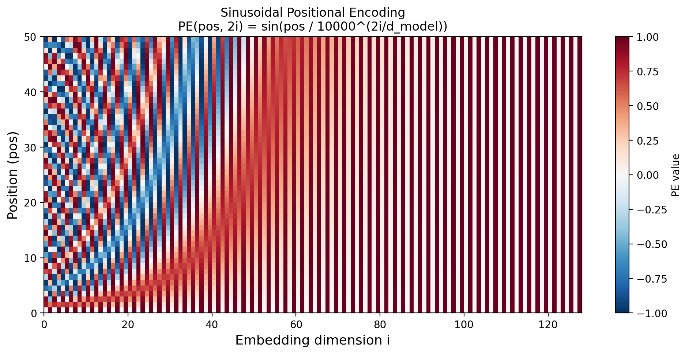

<!-- ===== §1. Framing ===== -->

## Where we are in the course

:::: {.columns}
:::: {.column width="50%"}
**Behind us:**

- Unit 4: convolutional networks. Locality + weight-sharing as a built-in **prior**.
- Unit 9: pre-trained encoders produce useful embeddings.
- We praised "the encoder" without asking *what it actually is*.
::::
:::: {.column width="50%"}
**Today (Unit 10):**

- Open the encoder. Today's answer to "what is the encoder?" is almost always: **a transformer**.
- Self-attention as content-based addressing.
- Why transformers replaced CNNs/RNNs as the default modern architecture.
- Vision Transformer (ViT) for materials data.
::::
::::

:::: {.notes}
- Open by paying off a debt the course deliberately incurred: in Unit 9 we kept saying "feed it through the encoder" as if "the encoder" were a black box. Say explicitly: "today we open that box, and what's inside is almost always a transformer." That framing makes the whole unit feel like a promised reveal, not a new topic dropped from nowhere.
- Put the four-stage arc on the board and leave it up the whole lecture: **features (CNN, U4) → representations (U9) → the architecture behind representations (U10, today) → generation (U11)**. Every slide today should be locatable on that arc.
- Calibrate stakes honestly for this cohort: this is, with Units 9 and 11, the most directly career-relevant content in the course — a 2026 materials-ML practitioner who cannot read transformer code is locked out of foundation models. Don't undersell it as "just another architecture."
- Timing: this is a dense 90 min. The framing block (this + next 2 slides) is ~5 min total — do not linger; the conceptual payoff is the attention derivation, not the motivation.
::::

## Why this unit matters in 2026

:::: {.incremental}
- Every modern foundation model is a transformer: GPT (text), BERT (text), ViT (images), DINO (self-supervised vision), CLIP (multimodal), AlphaFold-2 (proteins).
- Materials work increasingly uses transformers: composition tokens, micrograph patches, spectra sequences.
- A 2026 ML practitioner who can't read transformer code is professionally limited.
::::

:::: {.notes}
- The single most effective motivator: "the architecture you are about to derive from scratch in the next 40 minutes is the one inside ChatGPT, AlphaFold-2, and every image foundation model you used in Unit 9." Say it plainly; it converts a math lecture into a thing they want.
- Anchor the citation as a cultural fact, not a reference: Vaswani et al. 2017, "Attention Is All You Need" — among the most-cited papers in all of science (>100k). The provocative title is a thesis we will literally test today (does attention alone replace recurrence? — yes).
- Pre-empt the "this is a language thing, I do materials" dismissal *now*, before it forms: list the materials modalities (composition as a token set, micrograph patches, XRD/spectra as sequences). Every example today will be materials-grounded for exactly this reason.
- Keep to ~90 s; this slide is pure motivation. If running tight it can be delivered in one sentence over the previous slide.
::::

## Recap: CNNs encode a *prior*

:::: {.incremental}
- A CNN layer assumes:
  - **Locality**: nearby pixels matter most.
  - **Translation equivariance**: a feature shifted in input shifts the same way in output.
  - **Weight sharing**: the same kernel is applied everywhere.
- These assumptions are **inductive biases** — they bake in human knowledge about images.
- Cost: when these assumptions are wrong, CNNs hit a ceiling.
::::

:::: {.notes}
- This is the conceptual fulcrum of the entire unit — spend a real 2 minutes here. Define inductive bias precisely on the board: *an assumption the architecture makes before seeing any data*. A CNN's three biases are not bugs, they are why CNNs are so data-efficient on natural images.
- The framing sentence to write and leave up: "**A CNN's prior is fixed by the human; attention's prior is learned from data.**" Everything today is an unpacking of that one contrast.
- Pre-empt the false dichotomy: priors are not "bad." With little data, a good fixed prior beats a flexible model (this returns, quantitatively, at the ViT-vs-CNN data-efficiency slide — plant the seed now: "remember this when we ask when ViT beats CNN").
- Bridge sentence to next slide: "the cost of a fixed prior is a ceiling — let's see exactly where the locality prior breaks."
::::

## When CNN locality fails

:::: {.incremental}
- **Long-range dependencies**: a defect in one corner of a micrograph correlates with grain structure on the other side.
- **Sets**: composition fractions are a set of (element, fraction) pairs — order doesn't matter, but interactions do.
- **Sequences with arbitrary range**: SMILES strings, XRD peaks, spectra interpreted as sequences.
- **Graphs**: molecular bonds — neighbors aren't defined by spatial proximity.
::::

:::: {.fragment}
For all of these, locality is **the wrong inductive bias**. We need a layer where any position can attend to any other.
::::

:::: {.notes}
- Make this concrete and materials-first so no one files transformers under "NLP, not my problem." Walk one example slowly: a fatigue crack nucleates where a hard inclusion sits next to a soft grain — those two features can be on opposite sides of the image. A 3×3 (or even dilated) kernel *cannot* relate them without many layers of indirection; attention relates them in one layer.
- The "set" case is the deepest and most under-appreciated: composition is an unordered set of (element, fraction) pairs. CNNs and RNNs both impose a spurious order; attention is the natural operator on sets (this is the seed of "permutation-equivariance," which we make precise later — flag it).
- Land the reveal line (the fragment): "we want a layer where *any* position can attend to *any* other, with strength decided by content." Write that sentence — it is the literal specification we will now build into a formula.
- ~2 min; this slide's job is to create the need. Don't enumerate exhaustively; three vivid examples beat ten.
::::

<!-- ===== §2b. Historical predecessor: RNNs and LSTMs ===== -->

## Before transformers: Recurrent Neural Networks

:::: {.columns}
:::: {.column width="50%"}
**The sequence problem:**

:::: {.incremental}
- CNNs fail on sequences — no notion of "time" or "long-range" order.
- RNNs added a **recurrent loop**: the output of a neuron feeds back as its own input at the next time step.
- The network state $z_t$ carries a "memory" of the past.
- Used for time series, speech, NLP throughout the 2010s.
::::
::::
:::: {.column width="50%"}
![Basic recurrent neural network: the hidden state $z$ feeds back into itself at the next time step [@mcclarren2021machine, Fig. 7.1].](images/rnn_basic.png){width=90%}
::::
::::

:::: {.notes}
- Frame the RNN block honestly as "the right idea, the wrong mechanism." The right idea — *carry a state forward and update it with each new input* — survives into transformers conceptually; the mechanism (sequential recurrence) is what we will discard.
- Why teach the dead architecture at all? Two reasons, state them: (1) the vanishing-gradient pain RNNs suffer is exactly the motivation for the residual connections inside a transformer block (callback to Unit 5 self-study and Unit 6); (2) the seq2seq bottleneck is *literally* what the original attention mechanism (Bahdanau 2015) was invented to fix — attention predates the transformer.
- On the figure: name the weights so the next slide's gradient argument lands — $w$ on the input, $v$ on the recurrent self-loop, $w_o$ to the output. The self-loop weight $v$ is the villain of the next slide.
- Pace: the RNN/LSTM block (this + next 4 slides) is historical scaffolding — ~8 min total, brisk. The payoff is "why they were replaced," not LSTM internals.
::::

## RNNs unrolled through time

:::: {.columns}
:::: {.column width="50%"}
"Unrolling" repeats the RNN block for each step — a chain $z_0 \to z_1 \to \cdots \to z_T$ with the **same** recurrent weight $v$ reused every step.

:::: {.incremental}
- Backprop to an early weight multiplies the recurrent Jacobian **once per step**:

$$
\frac{\partial \mathcal{L}}{\partial \theta}\;\propto\;\prod_{t=1}^{T}\frac{\partial z_t}{\partial z_{t-1}}\;\sim\;v^{\,T}
$$

- $|v|<1 \;\Rightarrow\; v^{T}\to 0$ — **vanishing gradient**: early steps stop learning.
- $|v|>1 \;\Rightarrow\; v^{T}\to \infty$ — **exploding gradient**.
- Exactly the **product-of-Jacobians** mechanism from **Unit 6** — you have seen this failure mode before; it is not new.
::::
::::
:::: {.column width="50%"}
![Unrolled basic RNN across three time steps. Weights $w$, $v$, $w_o$ are shared across time [@mcclarren2021machine, Fig. 7.2].](images/rnn_unrolled.png){width=100%}
::::
::::

:::: {.notes}
- The one-line gradient argument is now **on the slide** — walk it left-to-right, building the product on the board as you reveal each bullet: chain $z_0\to\cdots\to z_T$ ⇒ backprop multiplies the recurrent Jacobian once per step ⇒ $\sim v^{T}$. Land the dichotomy crisply ($|v|<1$ vanish, $|v|>1$ explode) and hit the **Unit 6 callback** hard: "you have seen this exact failure mode before — product of Jacobians — it is not new." The reveal should feel like recognition, not new material.
- The killer consequence to state: a vanilla RNN effectively cannot learn dependencies more than ~10–20 steps apart. For a 500-token sequence, the beginning is invisible to the end. That is a hard ceiling, not a tuning problem.
- Weight sharing across time is a double-edged point worth 20 s: it gives parameter efficiency *and* it is what concentrates the gradient into that single $v^T$ factor. Efficiency and the pathology have the same root.
- Transition: "LSTMs were the 1997 fix; transformers are the 2017 fix. Let's see the first, briefly, then why the second won."
::::

## Types of feedback in recurrent networks

:::: {.columns}
:::: {.column width="40%"}
:::: {.incremental}
- **(a) Direct feedback**: output of a neuron feeds back to itself — the basic RNN loop.
- **(b) Lateral feedback**: output of a neuron feeds into a neighbor in the same layer.
- **(c) Indirect feedback**: output of a neuron feeds into a layer upstream.
- Each type enables different memory structures.
::::
::::
:::: {.column width="60%"}
![Three forms of recurrence: direct, lateral, and indirect feedback [@neuer2024machine, Fig. 4.9].](images/rnn_feedback_types.png){width=100%}
::::
::::

:::: {.notes}
- This is a low-stakes taxonomy slide — deliver it in ~60 s. Its only job is vocabulary so that "bidirectional RNN," "GRU," "LSTM" are not mysterious if students meet them elsewhere; it is not load-bearing for transformers.
- The one sentence that matters: every one of these feedback types is still *sequential* — the computation at step $t$ needs the result of step $t-1$. That sequential dependency, not the feedback topology, is the thing transformers abolish. Plant that so the "why replaced" slide lands hard.
- If running behind, this is the first slide to compress to a single sentence over the figure. It is genuinely optional for the through-line.
::::

## Long Short-Term Memory (LSTM)

:::: {.columns}
:::: {.column width="45%"}
**LSTM adds a separate "state" track $C_t$** — a long-term memory highway:

:::: {.incremental}
- **Forget gate**: decides what fraction of the old state $C_{t-1}$ to keep ($f_t \in [0,1]$).
- **Input gate**: proposes a new state $\tilde C_t$ and a weight $\omega$ for how much to add.
- **Output gate**: produces $z_t$ by applying an activation to the new state.
- The state $C_t$ flows with *additive* updates — gradients no longer vanish exponentially.
::::
::::
:::: {.column width="55%"}
![Complete LSTM cell at time $t$: state track $C$ (top horizontal line) and output track $z$ (diagonal), controlled by three gates [@mcclarren2021machine, Fig. 7.8].](images/lstm_cell_complete.png){width=100%}
::::
::::

:::: {.notes}
- Don't teach the gate equations line-by-line — that's a rabbit hole. Teach the *one idea* that makes LSTM work and connects to the rest of the course: the cell state $C_t$ updates **additively** ($C_t \approx f_t \odot C_{t-1} + \omega \odot \tilde C_t$), so its gradient is a *sum/product of gate values*, not a single weight raised to the $T$th power. Additive skip path = stable gradient. Write "additive update = gradient highway" on the board.
- The payoff cross-link, say it explicitly: this is the **exact same trick as a residual connection** (Unit 5/6) and as the cell-state highway is to LSTM, the residual stream is to a transformer block. Students should leave seeing LSTM gating and transformer residuals as the same idea in different clothes.
- Historical weight: Hochreiter & Schmidhuber 1997 — they solved long-range gradients 20 years before transformers. LSTMs ran production NLP/speech ~2014–2017. This is not a strawman; it is the strong predecessor transformers had to beat.
- ~2 min. The gate taxonomy is detail; the additive-highway idea is the keeper.
::::

## LSTM signal flow (gate view)

:::: {.columns}
:::: {.column width="40%"}
:::: {.incremental}
- At each time step, two quantities flow forward: the memory $m$ (state) and the hidden state $h$.
- The three gates (forget, update, output) act as learned valves on this flow.
- The forget gate clears irrelevant history; the update gate writes new information; the output gate reads the result.
- LSTMs dominated NLP benchmarks from ~2014 to 2017.
::::
::::
:::: {.column width="60%"}
![LSTM signal flow: memory track $m$ and hidden state $h$ flow left to right, modulated by the three gates [@neuer2024machine, Fig. 4.11].](images/lstm_cell_neuer.png){width=100%}
::::
::::

:::: {.notes}
- This is the same cell as the previous slide drawn as data-flow rather than equations — present it as a *re-view*, not new content (~60–90 s). The valve metaphor (forget = erase, update = write, output = read) is the memorable encoding; it's literally a differentiable read/write memory, which foreshadows attention as differentiable content-addressed memory two sections from now.
- The crucial limitation to state here, setting up the next slide: even with the gradient highway, the *entire past* is still squeezed through one fixed-size state vector $m$, and the computation is still strictly left-to-right. Gradients are fixed; *throughput and the information bottleneck are not*.
- One forward pointer: Bahdanau et al. 2015 bolted "attention" onto an LSTM seq2seq model to relieve exactly this bottleneck — attention existed *inside* the RNN era before it ate it. We'll see Bahdanau's alignment heatmap later as the first attention visualization.
::::

## Why RNNs/LSTMs were replaced

:::: {.incremental}
- **Sequential computation**: RNNs cannot be parallelized over time steps — slow on GPUs.
- **Limited range**: even LSTMs struggle with very long-range dependencies (hundreds of tokens).
- **Fixed bottleneck**: the whole past is compressed into one hidden state vector — an information bottleneck for long sequences (the seq2seq problem).
- **Transformers solve all three**: parallel (all positions at once), full context (any position attends to any other), no bottleneck (attention directly reads all positions).
::::

:::: {.fragment}
This is why the transformer title "Attention is All You Need" is provocative: attention replaces the recurrence entirely.
::::

:::: {.notes}
- This is the climax of the historical block — deliver it as a three-column scorecard on the board: {Sequential→slow on GPU} {Bottleneck→long-range loss} {one state vector→info loss}, and a matching column showing attention fixes each. If students take one thing from the RNN block, it is this table.
- The decisive, often-missed point is #1, *training throughput*, not accuracy: LSTMs were competitive on quality but a transformer trains in parallel across all positions, so on the same GPU budget you train a much bigger model on much more data. The transformer didn't just win on the algorithm; it won on the *hardware utilization* — emphasize this, it's the real lesson and it recurs at "why scaling won."
- Honest caveat so it's not triumphalist: RNNs/SSMs are not dead — streaming, ultra-low-latency, and very-long-sequence regimes still favor recurrence (this returns at the Mamba/SSM slide). "Replaced as the default," not "deleted."
- The fragment is the lecture's narrative hinge: the provocative 2017 title is a hypothesis, and we will now *derive* the mechanism that makes it true. Pause here; transition into the attention block with energy.
::::

## Learning outcomes

By the end of this unit, students can:

:::: {.incremental}
- **Explain** when CNN locality is the wrong prior.
- **Derive** scaled dot-product self-attention as content-based addressing.
- **Trace** an attention computation by hand for a small sequence.
- **Sketch** a transformer block: attention + MLP + residual + LayerNorm.
- **Describe** Vision Transformer (ViT) as "transformer on patch sequences."
- **Explain** why scaling drove transformer dominance.
::::

:::: {.notes}
- Use the list as a contract, not a recital (~30 s). Map the verbs to assessment: *Derive* and *Trace* are exam-paper targets (the √d_k argument; a hand-traced 4-token attention); *Sketch* is the "draw a transformer block from memory" question; *Explain why scaling won* is the conceptual essay.
- Flag the one outcome students chronically underrate: *Trace by hand*. Anyone can recite the formula; the hand-trace is what proves they understand it's just similarity-weighted averaging. We will literally do it on the board in two sections — tell them to expect it on the exam.
- Rigor level statement: we derive the attention formula to genuine understanding, sketch the block architecturally, and treat foundation-model scaling as an empirical phenomenon (no scaling-law proofs). Engineering-foundations depth, not a systems course.
::::

## Roadmap of today's 90 min

:::: {.incremental}
1. **From CNN to attention** (~7 min) — motivating the new layer.
2. **Self-attention as soft dictionary lookup** (~13 min) — the intuition.
3. **The scaled dot-product formula** (~10 min) — the math.
4. **Multi-head attention** (~10 min) — parallel subspaces.
5. **Positional encoding** (~10 min) — restoring order information.
6. **The transformer block** (~10 min) — putting it together.
7. **Architecture variants** (~7 min) — encoder-only, decoder-only, encoder-decoder.
8. **Vision Transformer** (~13 min) — transformers on images.
9. **Foundation models** (~7 min) — why scaling won.
10. **Wrap** (~3 min)
::::

:::: {.notes}
- Be explicit about where the load is: blocks 2–3 (the soft-dictionary intuition + the scaled dot-product formula, ~23 min combined) are the conceptual core; everything after is composition and consequences. If you protect one thing today, protect these.
- Block 8 (ViT, ~13 min) is the materials-cohort payoff — it's the concrete "what do I actually run on micrographs" content and connects directly to Unit 9. Do not let earlier blocks bleed into it; it's the slide students will use in their theses.
- Built-in recovery valves if you fall behind: the RNN/LSTM historical block (already past) and block 9 (foundation models) compress gracefully; the hand-trace and √d_k slides do *not* — never rush those. Say none of this to students; it's your pacing contract with yourself.
- Total is ~90 min with ~5 min of slack distributed; the interactives-free design here means pacing discipline is on you, not a demo timer.
::::

<!-- ===== §2. From CNN to attention ===== -->

## The motivating question

:::: {.incremental}
- A CNN says: "every position should be combined with its **spatial neighbors**."
- An MLP says: "every position should be combined with **every other position** (with a fixed weight)."
- **What if the combination weights were *learned per input*?**
- That is the core idea of attention: weights that depend on **content**, not just position.
::::

:::: {.notes}
- This is the cleanest one-slide statement of what attention *is* — build it as a three-way contrast table on the board and keep it: **CNN = fixed local weights | MLP = fixed global weights | Attention = input-dependent global weights**. Every later formula is just "how do we compute those input-dependent weights."
- The decisive word is *per input*. CNN and MLP weights are frozen after training; an attention pattern is recomputed for every example from its content. Drive this: a CNN applies the same kernel to a cat photo and a micrograph; attention forms a *different* connectivity for each image. That dynamism is the entire ballgame.
- Pre-empt the natural objection ("isn't input-dependent weighting just a bigger MLP?"): no — the weights are produced by a *learned similarity function* with O(parameters) independent of sequence length, which is why one layer generalizes across lengths and sets. Don't fully resolve it here; promise the resolution in the formula.
- ~2 min, high-energy; this is the "thesis statement" of the technical half.
::::

## Soft dictionary lookup

:::: {.incremental}
- A regular Python dict: `d["key"] → value`. Match must be exact.
- A **soft** dictionary: any query matches *every* key, with similarity-weighted strength. The result is a weighted average of values.
- Self-attention is a soft dictionary lookup over the input itself.
::::

:::: {.fragment}
For each query, return $\sum_i \mathrm{similarity}(\text{query}, \text{key}_i) \cdot \text{value}_i$.
::::

:::: {.notes}
- This analogy is the single highest-leverage mental model in the entire unit — invest in it. Do it live: write `d = {"Fe": 0.7, "Cr": 0.2}` then `d["Fe"]` (hard, exact). Then ask "what if the query is `"Fee"`?" — a hard dict throws KeyError; a *soft* dict returns 0.95·0.7 + 0.05·0.2. Attention is that, with learned notions of "key," "value," and "similarity."
- Make the three words concrete before they become matrices next slide: **query** = what this position is looking for; **key** = what each position advertises; **value** = what each position actually contributes if matched. Keep that gloss on the board through the whole attention section — students will refer back to it constantly.
- The generalization remark earns its place: this soft-lookup primitive is *not* transformer-specific — it is the operation behind retrieval-augmented generation, cross-modal alignment (CLIP), and memory networks. Teaching it as "differentiable, content-addressed memory" pays dividends in Units 9/11 and beyond.
- ~3 min. This slide is worth slowing down for; if it lands, the formula slides are trivial; if it doesn't, the formula is just symbols.
::::

<!-- ===== §3. Self-attention idea ===== -->

## Self-attention — the players

For each position $i$ in a sequence of length $n$ with embeddings $x_i \in \mathbb{R}^{d_{\text{model}}}$, compute three vectors:

:::: {.incremental}
- $q_i = W^Q x_i$ — the **query**: "what am I looking for?"
- $k_i = W^K x_i$ — the **key**: "what do I offer for matching?"
- $v_i = W^V x_i$ — the **value**: "what would I contribute if matched?"
::::

:::: {.fragment}
$W^Q, W^K, W^V \in \mathbb{R}^{d_k \times d_{\text{model}}}$ are **learned** projection matrices.
::::

:::: {.notes}
- The conceptual move to land: each token plays *three roles simultaneously* — it asks (query), it advertises (key), it offers (value) — and each role is a different learned linear view of the same embedding. Students reliably conflate these; the fix is the soft-dict gloss from the previous slide ("looking for / advertise / contribute"), repeated verbatim here.
- Emphasize the word *learned*: $W^Q, W^K, W^V$ are not given; training discovers projections such that the right queries align with the right keys for the task. Nothing about Q/K/V is hand-designed — that is the "learned prior" promise from the framing slide being delivered.
- The defining detail of *self*-attention: all three come from the *same* sequence $X$. Contrast (forward pointer): in cross-attention (later) Q comes from one sequence, K/V from another — same machinery, different sources. Saying this now makes cross-attention a one-liner later.
- The Q/K/V vocabulary is borrowed from information retrieval (search engines, databases) — a 10-second etymology that demystifies the names and reinforces the soft-dictionary frame.
::::

## Self-attention — the computation

For each query $q_i$:

:::: {.incremental}
1. Score against every key: $s_{ij} = q_i^T k_j$.
2. Normalize via softmax: $\alpha_{ij} = \mathrm{softmax}_j(s_{ij})$.
3. Weighted sum of values: $z_i = \sum_j \alpha_{ij} v_j$.
::::

:::: {.fragment}
The output $z_i$ is a content-weighted blend of all values in the sequence.
::::

:::: {.notes}
- Three lines, and they are *the* algorithm — write them on the board and box them; everything else today (scaling, multi-head, masking, ViT) is a modification of these three lines. Read each as plain English: (1) "how well does my query match each key?" (2) "turn those match scores into a probability distribution over positions" (3) "average the values using that distribution."
- The dot product as similarity is the conceptual crux — connect to Unit 2: $q^\top k$ is large when the vectors point the same way (high cosine, comparable magnitude). The model *learns* $W^Q, W^K$ so that "should attend" becomes "vectors aligned." This is the geometric heart; it returns explicitly two slides on.
- Step 2's softmax is where "soft" in soft-dictionary comes from — weights are non-negative and sum to 1, so $z_i$ is a *convex combination* (a weighted average that stays inside the value cloud, never extrapolates). State that property; it bounds what attention can do and is exam-relevant.
- Note loudly: **no locality, no order, no learned position** appears anywhere in these three lines. That omission is deliberate and is the bug we will deliberately fix in the positional-encoding section — flag it now so it's a setup, not a surprise.
::::

## Hand-traced example: 4 tokens

Sequence: tokens $A, B, C, D$ with $d_{\text{model}} = 2$.

After applying $W^Q, W^K, W^V$ (small toy values):

| | Q | K | V |
|---|---|---|---|
| A | (1, 0) | (1, 0) | (10, 0) |
| B | (0, 1) | (0, 1) | (0, 10) |
| C | (1, 1) | (1, 1) | (5, 5) |
| D | (1,-1) | (1,-1) | (3,-3) |

:::: {.notes}
- This is the slide that converts belief into understanding — do it *live on the board*, do not just show it. Tell students up front: "an attention computation you can do with a pen is on the exam; we are doing it now."
- Setup narration: we've already applied the projection matrices, so the table is Q/K/V directly (don't re-derive the projections — that's not the point and burns time). $d_k=2$ keeps every dot product a 2-number arithmetic the room can do in their heads.
- Pre-stage the punchline you'll confirm next slide: query A = (1,0) will score highest against keys aligned with the x-axis (A, C, D) and ~0 against B = (0,1). Ask the room to predict *before* you compute "which token will A mostly ignore?" — the answer (B) makes the geometry visceral.
- Deliberately drop the √d_k factor here (say so explicitly: "we'll add the scaling next section; right now we want clean arithmetic"). This keeps the trace mental-math-friendly and isolates one concept at a time.
::::

## Hand-traced example: query A's output

Compute $s_{A, \cdot} = q_A^T k_j$:

- $q_A^T k_A = (1,0)\cdot(1,0) = 1$
- $q_A^T k_B = (1,0)\cdot(0,1) = 0$
- $q_A^T k_C = (1,0)\cdot(1,1) = 1$
- $q_A^T k_D = (1,0)\cdot(1,-1) = 1$

:::: {.fragment}
Softmax of $(1, 0, 1, 1)$ ≈ $(0.31, 0.11, 0.31, 0.31)$. So $A$ attends mostly to $A$, $C$, $D$.
::::

:::: {.fragment}
$z_A = 0.31 \cdot v_A + 0.11 \cdot v_B + 0.31 \cdot v_C + 0.31 \cdot v_D$.
::::

:::: {.notes}
- Compute the softmax with the room, don't just reveal it: $e^1\approx2.72$ (×3) and $e^0=1$, sum $\approx 9.16$, so the three "1" scores get $2.72/9.16\approx0.31$ and B gets $1/9.16\approx0.11$. Watching 0.11 fall out for the *orthogonal* key is the "aha": orthogonal query/key ⇒ near-zero weight. Write "orthogonal ⇒ ignored, aligned ⇒ attended" on the board.
- Then compute $z_A$ numerically: $\approx 0.31(10,0)+0.11(0,10)+0.31(5,5)+0.31(3,-3)\approx(5.5,0.5)$. The output is a *blend living inside the convex hull of the values* — point back to the "softmax ⇒ convex combination" note. It can never produce (100, 100); attention interpolates, it does not extrapolate.
- The pedagogically vital observation: strong self-attention ($A\to A$) is normal and expected, not a bug — a token usually carries information relevant to itself. Students often "fix" this by masking the diagonal; tell them not to.
- This is the exam template. Explicitly say: "if I give you Q/K/V for n=3, d_k=2, you produce z for one query — that is a guaranteed exam mechanic." ~4–5 min total across the two trace slides; it is time exceptionally well spent.
::::

## Self-attention — the matrix view

Stack queries, keys, values into matrices:

$$
Q = X W^Q \in \mathbb{R}^{n \times d_k}, \quad K = X W^K \in \mathbb{R}^{n \times d_k}, \quad V = X W^V \in \mathbb{R}^{n \times d_v}.
$$

:::: {.fragment}
All scores at once: $S = Q K^T \in \mathbb{R}^{n \times n}$. Each row is one query's scores against all keys.
::::

:::: {.fragment}
Output: $Z = \mathrm{softmax}(S) V \in \mathbb{R}^{n \times d_v}$.
::::

:::: {.notes}
- The shift to make explicit: the per-query loop we just hand-traced *is* three matrix multiplications — no algorithmic change, only vectorization. Write the shapes on the board and have students sanity-check them ($X: n\times d_{\text{model}}$, $S=QK^\top: n\times n$, $Z=\text{softmax}(S)V: n\times d_v$). Shape-checking is the #1 debugging skill for real transformer code; drill it here.
- This is *why transformers won the hardware*, callback to the RNN-replacement slide: the whole layer is two big matmuls and a softmax — embarrassingly parallel, exactly what GPUs/TPUs are built for, with zero sequential dependency across positions. Connect "parallel = trains bigger on more data = scaling laws" (forward pointer to the scaling slide).
- Box the $n\times n$ matrix $S$ and name it now: this is the origin of the famous **$O(n^2)$ memory/compute** cost — every position scores every position. It is *the* limitation of vanilla attention and the entire reason Flash Attention / SSMs exist (forward pointer to that slide). Plant the term "quadratic in sequence length."
- ~2 min; mostly a reframing slide. Its keepers are the shape discipline and the $O(n^2)$ flag.
::::

## What does the attention matrix tell us?

:::: {.columns}
:::: {.column width="50%"}
:::: {.incremental}
- $\mathrm{softmax}(S) \in \mathbb{R}^{n \times n}$: each row sums to 1.
- Entry $(i, j)$ is "how much position $i$ pays attention to position $j$."
- **Visualizing this matrix is one of the most useful interpretability tools in modern ML.**
- For a ViT classifying a defect: the attention map shows *which image patches the model used*.
::::
::::
:::: {.column width="50%"}
![Attention alignment heatmaps from an RNN-based NMT model (Bahdanau et al. 2014). Bright pixels = high attention weight of target word (y-axis) to source word (x-axis). Note the near-diagonal structure for closely aligned language pairs [@bahdanau2014attention, Fig. 3].](images/attention_weight_heatmap.png){width=85%}
::::
::::

:::: {.notes}
- Read the figure with the room: near-diagonal = the model learned word-by-word alignment *without being told the alignment* — it discovered it from data. This is the historical origin (Bahdanau 2015, attention bolted onto an RNN), so it closes the loop with the RNN block: attention was born as an interpretability/alignment fix and then ate the architecture.
- The materials payoff to state plainly: row $i$ of softmax(S) is a saliency map over inputs *for free* — for a ViT defect classifier, "which patches did it use to decide?" requires no extra computation, no gradient backflow (contrast GradCAM). This is a genuine engineering advantage for review/audit and is the explicit bridge to Unit 14.
- Deliver the honest caveat in the same breath so it isn't oversold: attention weights are *a* lens, not a faithful causal explanation — there are well-known "register"/sink heads and the "attention is not explanation" literature. Calibrated honesty here builds the trust the explainability unit will need. Don't over-claim.
- ~2 min; the keeper is "attention map = free saliency, with an asterisk."
::::

<!-- ===== §4. Self-attention formula ===== -->

## The scaled dot-product formula

:::: {.columns}
:::: {.column width="60%"}
The full self-attention layer:

$$
\boxed{\,\mathrm{Attention}(Q, K, V) = \mathrm{softmax}\!\left(\frac{QK^T}{\sqrt{d_k}}\right) V.\,}
$$

:::: {.fragment}
The only difference from what we just derived: the **scaling factor $\sqrt{d_k}$**.
::::
::::
:::: {.column width="40%"}
![Scaled dot-product attention: Q×K score, scale by $\sqrt{d_k}$, optional mask, softmax, then MatMul with V [@vaswani2017attention, Fig. 2].](images/attention_scaled_dot_product.png){width=80%}
::::
::::

:::: {.notes}
- This is THE equation of the course's modern half. Write it on the board, box it, and announce "this stays up for the rest of the lecture; every remaining slide is a wrapper around this." Have the room read it back decomposed: inside-out — scores $QK^\top$, scale $/\sqrt{d_k}$, normalize softmax, average against $V$. They derived all of it except the scale on the previous five slides; this slide is consolidation + one new symbol.
- Emphasize how *little* is new: the entire transformer revolution's core operator fits in one line and we built it from a Python-dict analogy. That economy is itself the lesson — say it out loud; it's motivating and true.
- Set up the next slide as a genuine question, not a footnote: "why is the $\sqrt{d_k}$ there? It looks arbitrary. It is the difference between a transformer that trains and one that doesn't — next slide." Creating that curiosity makes the variance argument land.
- Verify against the hand-trace: with $d_k$ small the scaling barely changed our toy numbers, which is exactly why we could omit it for the trace. Closing that loop rewards students who noticed.
::::

## Why $\sqrt{d_k}$?

:::: {.incremental}
- Without scaling: as $d_k$ grows, $q_i^T k_j$ has variance proportional to $d_k$ (sum of $d_k$ products).
- Large variance scores → softmax saturates → gradients vanish on most entries.
- Dividing by $\sqrt{d_k}$ keeps the variance constant, so the softmax stays in its responsive range.
- For typical $d_k = 64$: divide by 8. Small detail, big effect on training.
::::

:::: {.notes}
- Do the variance argument on the board — it is a beautiful, exam-ready application of Unit 7. If $q,k$ have i.i.d. unit-variance entries, $q^\top k=\sum_{1}^{d_k} q_\ell k_\ell$ is a sum of $d_k$ zero-mean unit-variance terms, so $\mathrm{Var}=d_k$, std $=\sqrt{d_k}$. Dividing by $\sqrt{d_k}$ restores unit variance. That is the entire derivation, ~90 s, and it explicitly reuses "variance of a sum of independent terms" from Unit 7 — name the callback.
- Make the failure mechanism concrete: large-variance logits ⇒ softmax peaks to near one-hot ⇒ its Jacobian $\approx 0$ on the off-peak entries ⇒ gradients vanish, training stalls *at initialization*. Tie to Unit 6's saturation/vanishing-gradient discussion: this is the same pathology, prevented by a scalar.
- The number anchors it: $d_k=64\Rightarrow$ divide by 8. State the meta-point bluntly — "this 'tiny' constant is the line between a transformer that learns and one that is dead on arrival." Students systematically under-weight numerical-stability details; this is the canonical example to cure that.
- Likely exam item; say so. ~2 min, do not rush — it's the highest concept-density slide in the unit.
::::

## Geometric intuition

:::: {.incremental}
- $q_i^T k_j$ is large when $q_i$ and $k_j$ point in similar directions.
- After softmax: each query "votes" for the values whose keys align with it.
- The output $z_i$ is a similarity-weighted average of $V$ — geometrically, a centroid biased toward aligned keys.
- All operations are differentiable, so the projection matrices learn to *make the right keys align with the right queries* for the task.
::::

:::: {.notes}
- This slide answers the question students don't ask aloud: "where does the *intelligence* live?" Answer, and write it on the board: not in the attention formula (it's fixed), but in $W^Q, W^K, W^V$ — training rotates the embedding space so that "tokens that should interact" become geometrically aligned. The formula is the mechanism; the projections are the learning.
- The "centroid biased toward aligned keys" picture is the geometric closure of the hand-trace ($z_A$ landed inside the value cloud): output = a point pulled toward whichever values' keys point along the query. Connect to Unit 2 (dot product = alignment) and Unit 9 (representation geometry) — this is the same geometric language, now dynamic and input-dependent.
- The deep takeaway, say it explicitly: a CNN's "what relates to what" is engineered (locality); a transformer's is *learned geometry*. This is the literal payoff of the "learned vs fixed prior" thesis written on the board in slide 3 — point back at it.
- ~90 s, conceptual capstone of the attention math. Then transition: "one set of projections asks one kind of question — what if we want several at once?" → multi-head.
::::

## Masking (briefly)

:::: {.incremental}
- Before softmax, set selected scores to $-\infty$.
- **Causal mask**: position $i$ may not attend to positions $j > i$. Used in autoregressive models (GPT-style).
- **Padding mask**: ignore padding tokens that don't correspond to real input.
- A "decoder" layer is just a self-attention layer with a causal mask.
::::

:::: {.notes}
- Keep this genuinely brief (~90 s) but land two precise points. (1) Mechanism: $-\infty$ before softmax ⇒ $e^{-\infty}=0$ ⇒ that position gets exactly zero weight and, crucially, zero gradient — it is *information-theoretically* removed, not just down-weighted. (2) Architectural consequence: "decoder" is not a different layer, it is *self-attention + causal mask*. That one sentence demystifies GPT and pre-empts the misconception that encoders and decoders are different machinery.
- The causal mask is *the* reason language models generate left-to-right and can be trained on all positions in parallel (each position predicts the next, never peeking ahead). One sentence; it makes "decoder-only" later trivial.
- Materials-cohort calibration: padding masks matter (variable-length spectra/sequence batches — get this wrong and you attend to garbage); causal masks rarely matter (materials tasks are seldom autoregressive, except SMILES/structure generation). Tell them which one will actually bite them.
::::

<!-- ===== §5. Multi-head ===== -->

## Why one head is not enough

:::: {.incremental}
- A single attention head produces one weighted average per position.
- Often we want to attend to **multiple things at once** — for a defect classifier, maybe one head focuses on shape, another on texture, another on spatial context.
- Solution: run several attention layers in parallel, with different learned projections.
::::

:::: {.notes}
- The crisp limitation to state: one head = one similarity structure = the output is *one* convex average. If a token legitimately needs to gather "the syntactically related token" *and* "the long-range contextual token" simultaneously, a single softmax must compromise into one blurry distribution. Multi-head removes the compromise by running several in parallel.
- The CNN analogy is the fastest intuition for this cohort and worth stating precisely: a conv layer doesn't learn one filter, it learns many in parallel (edges, texture, color); multi-head attention is the same design — many parallel "questions," each its own learned projection. Same idea, attention flavor.
- Pre-empt the cost worry now (resolved next slide): "more heads, isn't that more compute?" — no, because each head works in a *smaller* subspace ($d_k = d_{\text{model}}/h$); total FLOPs are ~unchanged. Promise the arithmetic on the next slide so the worry doesn't distract.
- ~90 s; motivation only. The content is the definition + sizes that follow.
::::

## Multi-head attention — definition

:::: {.columns}
:::: {.column width="60%"}
For each head $i = 1, \ldots, h$:

$$
\mathrm{head}_i = \mathrm{Attention}(Q W_i^Q, K W_i^K, V W_i^V),
$$

with each head's projection matrices independent. Concatenate and project:

$$
\mathrm{MultiHead}(Q, K, V) = \mathrm{Concat}(\mathrm{head}_1, \ldots, \mathrm{head}_h) W^O.
$$
::::
:::: {.column width="40%"}
![Multi-head attention: $h$ parallel scaled dot-product attention heads, concatenated and projected by $W^O$ [@vaswani2017attention, Fig. 2].](images/attention_multihead.png){width=85%}
::::
::::

:::: {.notes}
- Read the two equations as one sentence: "project into $h$ independent low-dimensional subspaces, run the *same* scaled-dot-product attention in each, concatenate the results, mix them with one learned output matrix $W^O$." Nothing new is invented — it is the boxed formula run $h$ times in parallel plus a final linear mix.
- The single most under-appreciated component is $W^O$, and it's a frequent exam gap: without it the heads are just concatenated and never *interact*. $W^O$ is what lets head 3 ("texture") and head 5 ("spatial context") be *combined* into one representation. Write "W^O = the head mixer" on the board; students forget it exists.
- Reinforce independence: each head has its *own* $W_i^Q, W_i^K, W_i^V$, so heads specialize during training (next slide makes this empirical). Specialization is emergent, not assigned — connect to "learned, not engineered" thesis again.
- ~2 min; the keepers are "h parallel copies of the boxed formula" and "W^O mixes them." The sizes slide makes it quantitative.
::::

## Multi-head — sizes that work

Standard recipe (Vaswani et al. 2017):

:::: {.incremental}
- $d_{\text{model}} = 512$, $h = 8$, $d_k = d_v = d_{\text{model}} / h = 64$.
- Each head's projection: $\mathbb{R}^{d_{\text{model}}} \to \mathbb{R}^{d_k}$.
- Concatenated output: $h \cdot d_v = 512 = d_{\text{model}}$. Same shape going in and out.
- Total compute: roughly the same as a single full-width attention.
::::

:::: {.notes}
- Resolve the cost worry from two slides ago with the arithmetic on the board: $h\cdot d_k = 8\cdot 64 = 512 = d_{\text{model}}$. Eight heads of width 64 cost about the same as one head of width 512 — you get *diversity for free*, not for extra FLOPs. This is the slide that makes multi-head feel like a free lunch rather than a tax; let the number do the convincing.
- The shape-preservation point is structurally load-bearing and is exactly *why the next section (stacking blocks) works*: input $\mathbb{R}^{n\times d_{\text{model}}}$ → output $\mathbb{R}^{n\times d_{\text{model}}}$. Identical interface ⇒ you can stack the block $L$ times like Lego. Plant this; it makes "stacking blocks" a one-liner.
- Modern scale calibration so they can read real configs: ViT-Base $d_{\text{model}}=768, h=12$; GPT-3 $d_{\text{model}}=12288, h=96$. Same recipe, bigger numbers — reinforces "one architecture, scaled" (forward to the scaling slide).
- ~90 s; mostly arithmetic. The keeper is "shape in = shape out ⇒ stackable."
::::

## What different heads attend to

:::: {.incremental}
- Trained transformers often develop **specialized heads**:
  - Some heads attend strictly to the previous token.
  - Some attend to syntactically related tokens (in language).
  - Some attend uniformly (a "summarize" head).
- For ViT on materials micrographs: heads can specialize to *texture*, *shape*, *grain boundary structure*.
- Visualizing per-head attention is a common interpretability practice.
::::

:::: {.notes}
- The headline point: head specialization is **emergent**, not designed — nobody tells head 4 to be a "previous-token head"; it falls out of optimization. This is a recurring deep theme of the course (cf. CNN filters, RF feature use): give a flexible model data and structure self-organizes. Say it as a thesis, not a factoid.
- Materials interpretability practice to give them: for a ViT defect classifier, visualize attention *per head*, not averaged — the averaged map is mush; an individual head often cleanly tracks grain boundaries or contrast transitions. This is concretely useful in their thesis work and is the bridge to Unit 14.
- Calibrated caveat (consistent with the earlier attention-map slide): not all heads are interpretable; many are redundant (pruning studies remove a large fraction with little loss) or do bookkeeping ("attention sinks"). Resist the urge to assign every head a tidy story — that's the rookie over-reading.
- ~90 s; conceptual + practical. Keeper: "specialization emerges; inspect per-head, with skepticism."
::::

<!-- ===== §6. Positional encoding ===== -->

## Attention is permutation-equivariant

:::: {.incremental}
- Suppose we shuffle the input tokens.
- All Q, K, V vectors are computed from individual tokens — no positional information.
- The attention operation doesn't care about order: the output is the *same set of vectors*, just reordered.
- **For language and sequences, order matters.** "Dog bites man" ≠ "Man bites dog."
::::

:::: {.fragment}
We need to inject positional information explicitly.
::::

:::: {.notes}
- Prove it, don't assert it: permute the input rows of $X$; then $Q,K,V$ rows permute identically, $S=QK^\top$ permutes rows *and* columns, softmax is row-wise, and $Z$ comes out permuted the same way — *same set, reordered*. One minute of board algebra and the property is undeniable. This is the exact "set vs sequence" thread from the "When CNN locality fails" slide, now made rigorous — name the callback.
- Frame it as a feature *and* a bug, both true: it is *exactly right* for sets (composition: {Fe:0.7, Cr:0.2} has no order — attention is the natural operator) and *exactly wrong* for sequences ("dog bites man" ≠ "man bites dog"; micrograph patch order encodes geometry). The architecture's correctness is task-dependent — a sophisticated point worth stating crisply.
- Set up the fix as elegant, not a patch: "we won't change the attention operator; we'll change the *input* so position is baked into the embeddings." The cleanest engineering move in modern ML — adding, not modifying. Builds anticipation for sinusoidal PE.
- ~2 min. Keeper: the proof + "feature for sets, bug for sequences, fixed at the input."
::::

## Sinusoidal positional encoding

:::: {.columns}
:::: {.column width="50%"}
For position $\mathrm{pos}$ and embedding dimension $i$:

$$
\mathrm{PE}(\mathrm{pos}, 2i) = \sin(\mathrm{pos} / 10000^{2i/d_{\text{model}}}),
$$
$$
\mathrm{PE}(\mathrm{pos}, 2i+1) = \cos(\mathrm{pos} / 10000^{2i/d_{\text{model}}}).
$$

:::: {.fragment}
Add $\mathrm{PE}$ to the token embeddings before the first attention layer: $\tilde x_i = x_i + \mathrm{PE}(i, \cdot)$.
::::
::::
:::: {.column width="50%"}
![Sinusoidal positional encoding matrix for 50 positions and 128 dimensions. Low dimensions oscillate rapidly (fine-grained position); high dimensions change slowly (coarse-grained). Each row is a unique positional fingerprint. (Generated locally.)]{.caption}

{width=100%}
::::
::::

:::: {.notes}
- The intuition before the formula: it's a **binary-counter-in-continuous-form**. Like binary digits where bit 0 flips every step, bit 1 every two, bit 2 every four, here each embedding dimension is a sinusoid of a different (geometrically spaced) wavelength — low dims wiggle fast (fine position), high dims drift slowly (coarse position). The figure *is* this; read it as "each row = a unique multi-scale fingerprint." Give the binary-odometer analogy; it's the one that sticks.
- The single most common student misconception, kill it explicitly: PE is **added**, not concatenated. Same dimensionality, summed into the token embedding. Yes, "summing position into meaning" feels wrong; the resolution is that $d_{\text{model}}$ is large and the network learns to read positional and semantic components from (mostly) different subspaces. Expect this question; have the answer ready.
- The 10000 base is arbitrary-but-deliberate: it sets the longest wavelength (~max sequence length the scheme resolves). Don't derive it; one sentence so it isn't mysterious.
- ~3 min. This is the densest slide of the PE block; the figure does heavy lifting — narrate it. The "why it works" properties go on the next slide; don't preload them here.
::::

## Why sinusoidal works

:::: {.incremental}
- Different frequencies → each position has a unique "fingerprint" across embedding dimensions.
- Properties:
  - **Bounded**: PE values stay in [-1, 1], so they don't dominate the token embedding.
  - **Generalizes**: PE for position $\mathrm{pos} + k$ is a linear function of PE at $\mathrm{pos}$ — the model can extrapolate.
  - **Inductive**: useful for sequences longer than seen in training.
::::

:::: {.notes}
- The deepest property — worth the board — is the linearity one: $\mathrm{PE}(\text{pos}+k)$ is a *fixed linear (rotation) function* of $\mathrm{PE}(\text{pos})$, with the rotation depending only on the offset $k$, not on pos. Consequence: a single learned linear map can implement "attend $k$ positions back" *uniformly across the whole sequence*. That is how a transformer represents *relative* position despite only being given *absolute* position — the elegant, non-obvious payoff. (It is also precisely the idea RoPE makes explicit — forward pointer.)
- Bounded ([-1,1]) is the practical one: PE can't swamp the token embedding's magnitude, so adding it doesn't destroy semantic content. Tie to the "added not concatenated" worry from the previous slide — this property is *why* the addition is safe.
- "Generalizes to longer sequences" is the honest half-truth: the formula is defined for any position, but in practice extrapolation degrades and learned PEs fail entirely out of range. State it honestly; it motivates RoPE/relative schemes next.
- Be ready for "why sinusoids specifically?" — the candid answer: they give bounded, unique, multi-scale, relative-position-friendly codes; *other* choices (learned, RoPE) also work. Don't manufacture false necessity. ~2 min.
::::

## Learned vs sinusoidal vs RoPE

:::: {.incremental}
- **Sinusoidal** (Vaswani 2017): fixed, generalizes to longer sequences.
- **Learned** (BERT, ViT): a learned lookup table indexed by position. Simpler, slightly better in-distribution, doesn't extrapolate.
- **Rotary Position Embedding (RoPE)** (Su et al. 2021): rotates Q and K vectors by position-dependent angles. Now standard in LLaMA, GPT-NeoX, and most modern LLMs.
::::

:::: {.fragment}
**For this course**: assume sinusoidal or learned. RoPE is for the curious.
::::

:::: {.notes}
- Triage this slide ruthlessly (~90 s): the exam-relevant content is the *trade-off table*, not RoPE internals. Sinusoidal = fixed, extrapolates, slightly worse in-distribution. Learned = a position embedding table, simplest, best in-distribution, *cannot* extrapolate beyond trained length (state the concrete failure: ViT trained at 224px breaks at 384px without PE interpolation — a real bug students hit fine-tuning pretrained ViTs on bigger micrographs).
- RoPE in one honest sentence: instead of *adding* a position vector, it *rotates* Q and K by a position-dependent angle, so the dot product $q_i^\top k_j$ depends only on the *relative* offset $i-j$. It is the operationalization of the linearity property from the previous slide, and it is the de-facto 2024–2026 LLM standard (LLaMA, most open models). Name-drop, don't derive — say "for the curious / your reading," and move.
- Materials calibration: for ViT on micrographs you will almost always use *learned* PE (that's what pretrained ViTs ship); the actionable warning is the resolution-change pitfall above. That's the one thing from this slide they'll actually trip on.
::::

<!-- ===== §7. Transformer block ===== -->

## The transformer block

:::: {.columns}
:::: {.column width="55%"}
```
   x  ──┐
        ├─► LayerNorm ─► Multi-Head Attn ──► (+) ─►
        └────────────────────────────────────┘   │
                                                 │
        ┌────────────────────────────────────────┘
        │
        ├─► LayerNorm ─► MLP (2-layer FF) ─────► (+) ─► output
        └─────────────────────────────────────────┘
```

:::: {.fragment}
Two sublayers: attention (mixes positions) and MLP (transforms each position independently). Each wrapped in a residual connection and LayerNorm.
::::
::::
:::: {.column width="45%"}
![Full transformer: encoder (left) and decoder (right), each stacked $N$ times. Encoder uses bidirectional self-attention; decoder adds a causal mask and cross-attention to the encoder output [@vaswani2017attention, Fig. 1].](images/transformer_encoder_decoder.png){width=75%}
::::
::::

:::: {.notes}
- This is the assembly slide — draw the ASCII diagram on the board and have students name each piece *from memory* (they've now met all four: multi-head attention, MLP, residual, LayerNorm). The pedagogical win is realizing the famous "transformer" is just these four known parts wired in a fixed pattern — demystification, not new theory.
- The two-residual structure is the load-bearing insight and a direct callback to Units 5/6 and the LSTM additive-highway note: each sublayer computes a *delta* added to a clean "residual stream." Without the residuals a deep stack of attention does not train at all (state this as fact — it's the empirical reality). Same gradient-highway idea as the LSTM cell state; close that loop explicitly.
- Pre-norm vs post-norm, one precise sentence: the diagram is **pre-norm** (LayerNorm *inside* each branch, before the sublayer); the 2017 original was post-norm. Pre-norm trains stably without learning-rate warmup and is the modern default (callback to Unit 6's normalization-conditions-the-landscape slide). Don't belabor; just plant "pre-norm = modern default, more stable."
- ~3 min; the architectural climax. Keeper: "four known parts + two residual highways = the transformer block."
::::

## What each sublayer does

:::: {.incremental}
- **Attention sublayer**: each position pulls in information from other positions. *Mixes across positions.*
- **MLP sublayer**: a 2-layer fully-connected net (typically with GELU activation), applied **independently** to each position. *Transforms within positions.*
- **Residual connections**: stable gradients, easier optimization (Unit 5 self-study material!).
- **LayerNorm**: stabilizes activations, like BatchNorm but along the feature dimension.
::::

:::: {.notes}
- The one sentence to make them memorize, write it on the board: **"attention communicates; the MLP computes."** Attention is the *only* component that moves information *between* positions; the MLP is applied identically and independently to each position (it never looks sideways). Students conflate these constantly — this single mnemonic fixes it and is a classic exam discriminator.
- A surprising, retention-boosting fact: the position-wise MLP holds roughly *two-thirds of a transformer's parameters* (it expands $d_{\text{model}}\to 4d_{\text{model}}\to d_{\text{model}}$). "Most of the parameters do per-position computation, not mixing" reframes what the model spends capacity on and pre-empts the misconception that "transformer = attention" (attention is the *communication*, not the bulk of the model).
- LayerNorm vs BatchNorm in one line, callback to Unit 6/8: same goal (condition the landscape), different axis — LayerNorm normalizes across features within one token, so it's batch-size- and sequence-length-independent (why transformers don't suffer BatchNorm's small-batch fragility). One sentence; don't re-derive normalization.
- ~90 s; consolidation. Keeper: "attention communicates, MLP computes; MLP is most of the weights."
::::

## Stacking blocks

:::: {.incremental}
- Stack $L$ identical transformer blocks. Typical: $L = 6$ to $L = 96$.
- Each layer refines the representation: lower layers tend to capture surface features, higher layers capture more abstract relationships.
- Final layer's output is the **representation** used downstream (classification head, generation, etc.).
::::

:::: {.notes}
- This works *only because* of the shape-preservation property proved at the multi-head-sizes slide (input $\mathbb{R}^{n\times d_{\text{model}}}$ = output shape). Say "remember why we insisted shape-in = shape-out? This is the payoff — identical blocks compose like Lego." Reward the students who tracked that thread.
- The depth-hierarchy claim is a genuine empirical finding worth one concrete instance (BERTology / ViT probing): early layers ≈ local/surface features, middle ≈ syntactic/structural, late ≈ task-abstract. It's the transformer analogue of CNN feature hierarchies (Unit 4) — same "depth = abstraction" story, learned not engineered. Connect, don't re-teach.
- Materials calibration to prevent over-engineering: $L=6$–$96$ is the LLM range; for materials ViTs/encoders $L=4$–$12$ is almost always plenty, and going deeper on small datasets *overfits and wastes compute*. Give them the number — it stops a common thesis mistake.
- ~90 s. Keeper: "identical stackable blocks; depth ⇒ abstraction; keep L small for materials."
::::

<!-- ===== §8. Architecture variants ===== -->

## Three transformer architectures

:::: {.incremental}
- **Encoder-only** (BERT, ViT, DINO): bidirectional attention; takes input, produces representation. Used for classification, retrieval, embeddings.
- **Decoder-only** (GPT, LLaMA): causal-masked attention; generates tokens one at a time. Used for autoregressive generation.
- **Encoder-decoder** (original transformer, T5): encoder reads input; decoder generates output, attending to both itself (causal) and encoder output (cross-attention). Used for translation, summarization.
::::

:::: {.notes}
- The unifying punchline, and it's the whole point of the slide: these are **not three architectures — they are one block with different masking and wiring**. Encoder-only = no mask (bidirectional). Decoder-only = causal mask. Encoder-decoder = both, plus cross-attention. Callback to the masking slide: "we said a decoder is just self-attention + a causal mask — here is that statement scaled to whole models." Demystifies the entire zoo in one sentence.
- Map to what they actually know so it's not abstract: BERT/ViT/DINO = encoder-only (the Unit 9 embedding extractors — *this is what was inside the encoder we deferred opening*; close the course-long loop here, explicitly). GPT/LLaMA = decoder-only (ChatGPT). T5/original = encoder-decoder (translation).
- Materials calibration: encoder-only is ~90% of materials work (representations, property prediction, retrieval — anything Unit 9-shaped); decoder-only for generative chemistry (SMILES/structure generation, Unit 11); encoder-decoder rare here. Tell them where they live so the taxonomy is actionable, not trivia.
- ~2 min. Keeper: "one block, three masking/wiring choices; you mostly want encoder-only."
::::

## Cross-attention (briefly)

:::: {.incremental}
- In encoder-decoder, the decoder's middle sublayer is **cross-attention**: queries from the decoder, keys and values from the encoder.
- "Each decoder position decides what to pull from the encoder representation."
- Used in image captioning, translation, and conditional generation in Unit 11.
::::

:::: {.notes}
- The whole slide is one sentence to deliver crisply (~60 s): cross-attention is *the boxed self-attention formula, unchanged*, with Q from sequence A and K,V from sequence B. Self-attention is the special case A=B. Callback to the "self-attention — the players" note where you promised this exact reveal — pay it off: "remember I said cross-attention would be a one-liner once you understood self-attention? Here it is."
- Why it matters downstream, the forward hook: cross-attention is *the* mechanism for **conditioning** — it's how a diffusion U-Net injects a text prompt or a property target into image generation (Unit 11), and how CLIP-style models align modalities (Unit 9 callback). Frame it as "the conditioning operator," because that's the role it plays for the rest of the course.
- Don't expand beyond this; it's a pointer slide. The keeper is "Q from one stream, K/V from another = conditioning."
::::

<!-- ===== §9. Vision Transformer ===== -->

## Vision Transformer (ViT)

:::: {.columns}
:::: {.column width="50%"}
:::: {.incremental}
- Take an image. Split it into a grid of fixed-size patches (e.g., 16×16 pixels).
- Flatten each patch to a vector. Apply a learned linear projection to get a token embedding.
- The image is now a *sequence* of patch tokens. Add positional embeddings.
- Apply a standard transformer encoder. Use the output of a special [CLS] token as the image representation.
::::

:::: {.fragment}
**That's it.** ViT is "transformer on patches." No convolutions, no spatial inductive bias.
::::
::::
:::: {.column width="50%"}
![ViT model overview: image split into patches, linearly embedded, positional encodings added, fed to a standard transformer encoder. A [CLS] token aggregates the representation for classification [@dosovitskiy2021vit, Fig. 1].](images/vit_patch_tokenization.png){width=100%}
::::
::::

:::: {.notes}
- This is the materials-cohort payoff of the entire unit — slow down, this is the slide they'll use. The dramatic point to make: ViT introduces **zero vision-specific machinery**. No convolution, no pooling, no locality prior. "Cut into patches, treat as a sequence, run the *exact* transformer encoder we just built." Everything from the last 25 slides applies *unchanged* to images.
- The "that's it" fragment deserves a beat of theatre — the genuine 2020 shock (Dosovitskiy et al., "An Image Is Worth 16×16 Words") was that *removing* the hand-built image prior and replacing it with data + scale *worked*. This is the literal empirical confirmation of the slide-3 thesis ("learned prior beats fixed prior — given enough data"). Point back at the board.
- The honest tension to flag now (resolved two slides on): no locality prior is exactly why ViT is *data-hungry* — it must learn from scratch what a CNN gets for free. Plant it here so "ViT vs CNN — when does ViT win?" answers a question already in their heads.
- ~3 min. Keeper: "ViT = our transformer encoder, applied to patch tokens, with no image-specific changes."
::::

## ViT — patch embedding

:::: {.columns}
:::: {.column width="45%"}
For a $224 \times 224$ image with $16 \times 16$ patches:

- Number of patches: $14 \times 14 = 196$.
- Each patch: $16 \times 16 \times 3 = 768$-dim.
- Linear projection to $d_{\text{model}}$ (e.g., 768).
- Sequence length: $196 + 1$ (the [CLS] token) = $197$.

:::: {.fragment}
The **[CLS] token** is a learned vector prepended to the sequence; after all blocks its final state is the image embedding — the same trick BERT uses for sentence classification.
::::
::::
:::: {.column width="55%"}
![The patch-embedding projection is **learned**, not fixed: its leading principal components are Gabor-like edge/frequency bases — ViT *rediscovers* the low-level visual features a CNN's first conv layer is hand-wired to detect [@dosovitskiy2021vit, Fig. 7].](images/vit_patch_embedding_filters.png){width=95%}
::::
::::

:::: {.notes}
- Do this arithmetic on the board with the room — it's a five-number sanity check they must be able to reproduce (it's a natural exam item): 224/16 = 14 per side ⇒ 196 patches; each patch 16·16·3 = 768 raw numbers ⇒ linearly projected to $d_{\text{model}}$; +1 for [CLS] ⇒ sequence length 197. Concrete numbers convert "ViT" from buzzword to a thing they can implement.
- The [CLS] token is the conceptually slippery bit — make it precise: it is a *learned* vector (a parameter, not data) prepended to every sequence; because attention lets it read all patches across $L$ layers, its final state becomes a learned, task-tuned pooled summary. It's the same trick as BERT's [CLS] — naming the reuse reinforces "one architecture everywhere."
- Practitioner footnote with a real consequence: modern ViTs often drop [CLS] for mean-pooling over patch tokens (DINOv2 exposes both) — and the choice affects how you build attention-saliency maps two slides on. One sentence; it prevents confusion when they read real model code.
- The $O(n^2)$ callback worth one line: 197 tokens ⇒ a 197×197 attention matrix per head per layer — small here, but explains why high-resolution ViTs (tiny patches ⇒ many tokens) get expensive fast (link to the Flash Attention slide). ~2 min.
- Use the filter figure for the punchline: ViT is given *no* vision prior, yet the learned patch projection's principal components come out as Gabor-like edge/frequency detectors — the *same* low-level features a CNN's first layer is hand-wired for. The deep point (callback to slide 3): "the prior wasn't necessary as architecture; given data, the model learned it." This is the single most convincing visual that 'no inductive bias' does not mean 'no structure' — it means *learned* structure.
::::

## ViT vs CNN — when does ViT win?

:::: {.columns}
:::: {.column width="50%"}
:::: {.incremental}
- **ViT wins**: when there is **lots** of pre-training data (think ImageNet-21k or JFT-300M).
- **CNN wins**: when training data is **limited** — locality is a useful prior that ViT has to learn from scratch.
- A common hybrid: pre-train ViT on a huge corpus, fine-tune on your small materials dataset. Best of both worlds.
::::

:::: {.fragment}
For materials work: a pre-trained ViT (e.g., DINOv2) frozen + linear probe is often the strongest baseline. (Unit 9 told you this; now you know what's inside the encoder.)
::::
::::
:::: {.column width="50%"}
![Performance vs. pre-training compute (exaFLOPs) for Vision Transformers, ResNets, and hybrids. ViT overtakes ResNet at larger compute budgets; CNNs are more data-efficient at small scale [@dosovitskiy2021vit, Fig. 5].](images/vit_vs_cnn_data_efficiency.png){width=100%}
::::
::::

:::: {.notes}
- This is the single most actionable slide for the cohort's actual work — deliver the decision rule unambiguously. The crossover is a *bias–variance* statement (callback to Unit 8): the CNN's locality prior = helpful inductive bias when data is scarce (low variance, slight bias); ViT = no prior, so it needs data to *learn* the prior, but then has no ceiling. Read the figure as the empirical bias–variance curve it literally is.
- The decision rule to write on the board and have them photograph: **small labeled materials dataset (the normal case) ⇒ do NOT train a ViT from scratch. Take a pretrained ViT (DINOv2), freeze it, linear-probe.** Training ViT from scratch on 3,000 micrographs is the classic thesis failure; the prior you "removed" must be re-bought with data you don't have.
- This explicitly closes the Unit 9 loop — say it: "in Unit 9 I told you 'frozen pretrained encoder + linear probe' is the strong baseline and asked you to take it on faith. Now you know *what* the encoder is (a ViT) and *why* freezing works (the prior was learned during pretraining on data you'll never have)." Course-spanning payoff; deliver it deliberately.
- ~3 min, protected time. Keeper: the photograph-this decision rule.
::::

## ViT for materials micrographs

:::: {.incremental}
- A pre-trained ViT (DINOv2) embeds 256×256 SEM patches into 768-D vectors.
- For defect classification: train a linear classifier on top of the frozen embeddings. 5,000 labeled examples → 95% accuracy.
- Attention map: shows which patches the model "looks at" — typically defect regions, grain boundaries, contrast transitions.
- This is interpretable in a way CNN feature maps usually aren't.
::::

:::: {.notes}
- This is the concrete "this is your thesis baseline" slide — present the pipeline as a recipe they can run *this week*: pretrained DINOv2 → freeze → extract 768-D embeddings → logistic regression / linear head → ~95% on ~5k labels, hours not weeks, no GPU training of the backbone. Numbers are representative-typical; the *workflow* is the deliverable.
- The interpretability advantage is real and engineering-relevant: attention from [CLS]→patches is a free saliency map with no extra computation (callback to the attention-matrix slide), so a metallurgist can verify "it called this a defect *and it was looking at the actual defect*." That auditability is often what gets an ML result accepted in a materials review — emphasize it; it's the explainability bridge to Unit 14.
- Honest caveats, stated so they don't over-trust: 95% is illustrative and assumes (a) the pretraining domain isn't too far from SEM (natural-image DINOv2 transfers surprisingly well but not always — micrographs are out-of-distribution), and (b) a leakage-free split (no near-duplicate fields-of-view across train/test — the same grouped-leakage trap from Unit 8). Pre-empt both; students will hit them.
- ~2 min. Keeper: the runnable recipe + the two caveats.
::::

## ViT attention maps as saliency

:::: {.incremental}
- For each transformer block, the attention from the [CLS] token to each patch is a *patch-importance score*.
- Average across heads or visualize per-head.
- Materials engineers can verify: "the model classified this as a defect, and it was looking at the actual defect."
- Compare to GradCAM for CNNs — attention maps require no extra computation, no gradient backflow.
::::

:::: {.notes}
- The mechanical recipe to give them, concretely: take row of softmax(S) corresponding to the [CLS] query, in the last (or a chosen) block; that vector over patch positions, reshaped to the 14×14 grid and upsampled, *is* the saliency heatmap. No gradients, no GradCAM backward pass — one forward pass already contains it. Contrast with CNN+GradCAM (needs a backward pass and a target class) — attention's "free" saliency is a genuine practical edge.
- Practical guidance consistent with the multi-head note: the head-averaged map is often a blur; per-head maps are sharper and individually interpretable — inspect both. If [CLS] was dropped for mean-pooling (the footnote two slides back), use attention-rollout or patch-to-patch aggregation instead — flag this so their code matches their model.
- The mandatory honesty, and the bridge to Unit 14: attention saliency is *plausible*, not *proven faithful* — "attention is not explanation" is a live debate; treat the map as a hypothesis a domain expert validates, not ground truth. The course's stance on explainability (useful + skeptical) is set here; deliver it as principle, not hedge.
- ~90 s. Keeper: the one-forward-pass recipe + "validate, don't trust."
::::

<!-- ===== §10. Foundation models ===== -->

## Why scaling won

:::: {.columns}
:::: {.column width="55%"}
:::: {.incremental}
- Transformers scale *gracefully*: doubling parameters and data gives predictable performance gains (scaling laws — Kaplan et al., Hoffmann et al.).
- Self-attention has no built-in inductive bias — which sounds bad — but means the model is **flexible**: with enough data, it learns the right priors.
- Hardware loves matmul; transformers are mostly matmul. GPUs and TPUs were designed around them (or vice versa).
- Bigger is also **more sample-efficient**: a larger model reaches a target loss in *fewer* tokens — and compute-optimal training deliberately stops *short of convergence* (the seed of the Chinchilla allocation result).
- **Result**: the same architecture, scaled up with more data and compute, kept getting better.
::::
::::
:::: {.column width="45%"}
![Power-law scaling: test loss is a straight line in log compute, dataset size, and parameters [@kaplan2020scaling, Fig. 1].](images/scaling_laws_kaplan.png){width=92%}

:::: {.fragment}
![Larger models need fewer samples for a given loss; compute-optimal training stops before convergence [@kaplan2020scaling, Fig. 2].](images/scaling_laws_kaplan_sample_efficiency.png){width=92%}
::::
::::
::::

:::: {.notes}
- This is the conceptual capstone — deliver the deep lesson as a single sentence and write it on the board: **"no inductive bias *is* the inductive bias."** A CNN's locality prior is a ceiling *and* a floor; attention's absence of prior means no floor (data-hungry) but also *no ceiling* — so it keeps improving as you add data/compute while CNNs plateau. This is the slide-3 thesis, fully closed, at civilization scale.
- Read the scaling-law figure precisely: test loss is a *straight line on log-log* in compute, data, and parameters — i.e., a power law, smooth and *predictable*. The predictability is the revolution, not just the slope: you can forecast a frontier model's loss before training it, which is what made the billion-dollar bets rational. Connect to Unit 6: this only works because the architecture is parallel matmul (trains at scale at all) — three threads (parallelism, no-prior flexibility, hardware) converge here; name all three.
- The honest forward-looking caveat (sets up the next slide): vanilla dense attention is $O(n^2)$ and scaling further required *systems and architecture* fixes (Flash Attention, MoE, SSMs) — "scaling won, but not with the 2017 layer unchanged." Don't let it sound like a finished story.
- Reveal the second figure (fragment) only after the power-law point lands: it makes two non-obvious claims concrete — (1) bigger models are *more sample-efficient* (they hit a target loss in fewer tokens), and (2) compute-optimal training *stops before convergence*. Point at the un-converged tails and say "training to convergence is the wrong move under a compute budget — this plot is the seed of the Chinchilla compute-allocation result." One sentence on Chinchilla is enough; don't derail.
- ~3 min, then a hard pivot to alternatives. Keeper: "no prior = no ceiling; loss is a predictable power law; bigger is also more sample-efficient."
::::

## Modern alternatives and extensions to dense attention

:::: {.columns}
:::: {.column width="50%"}
**Three directions that move past 2017-vanilla attention:**

:::: {.incremental}
- **Flash Attention** [@dao2022flashattention; @dao2023flashattention2]
  - Same math, faster implementation. Tiles $QK^T$ into SRAM blocks; avoids materialising the $N \times N$ attention matrix in HBM.
  - **2–4× wall-clock** speedup and linear-in-$N$ memory at training time. Default in every modern transformer codebase since 2023.
 
- **Mixture of Experts (MoE)** [@shazeer2017outrageously; @fedus2022switch]
  - Each token routes to a small subset (top-$k$) of expert FFN blocks instead of every FFN. Total parameters grow; compute per token stays constant.
  - Key trade-off: sparse activation breaks classic scaling laws favourably (more params, same FLOPs).
::::
::::
:::: {.column width="50%"}
**What if attention isn't the right operator at all?**

:::: {.incremental}
- **State Space Models (Mamba / S4 / S5)** [@gu2023mamba; @dao2024mamba2]
  - Selective SSM: $h_t = \bar A h_{t-1} + \bar B x_t$, where $\bar A, \bar B$ depend on the input. Linear in sequence length, parallelizable via scan.
  - Beats transformers on language modelling at the same parameter count for sequences $> 16\text{k}$ tokens; competitive at shorter.
  - Mamba2 (2024) unifies SSMs with linear attention via the state-space duality.
::::
::::
::::

:::: {.fragment}
**Defaults in 2026:** Flash Attention always; MoE for frontier LLMs; SSMs increasingly for very long sequences (genomes, audio, time series). Dense attention with quadratic memory is now a teaching reference, not a production target.
::::

:::: {.notes}
- Frame the slide's purpose first: we spent 25 slides building dense $O(n^2)$ attention because it is the right *mental model*; this slide is the honesty that it is *not* the right 2026 *default*. Keep the conceptual/practical distinction explicit so students don't think they wasted the lecture — the formula is still exactly what to reason with; the implementation has moved on.
- Categorize the three so they don't blur (this is the examinable structure): **Flash Attention = same math, smarter memory** (a *systems* win — identical outputs, ~2–4× faster, linear memory; not a new attention — say this twice, students miscategorize it). **MoE = an FFN change, not an attention change** (sparse expert routing; decouples parameter count from per-token FLOPs — note it's the *MLP* sublayer being modified, callback to "MLP is most of the parameters"). **SSM/Mamba = a different operator entirely** (recurrence reborn, linear in $n$, the RNN block's revenge — explicitly callback to "why RNNs were replaced": parallel-scan training removes the sequential-throughput objection that killed RNNs).
- Materials calibration so it's not just LLM tourism: Flash Attention helps the moment they train *any* ViT (it's free, on by default in modern PyTorch — tell them to just use SDPA). MoE/SSM rarely matter at materials sequence lengths/scales — "know they exist, don't reach for them" unless doing genomes/long spectra/time-series.
- ~3 min; this is a compressible block if behind (it's awareness, not mechanism). Keeper: the three-way categorization + "Flash Attention always, the rest only with a reason."
::::

## The foundation model recipe

:::: {.incremental}
1. Pre-train a large transformer on a massive unlabeled corpus.
2. Use a self-supervised objective: language modeling (text), masked patch prediction or contrastive learning (images).
3. Freeze (or lightly fine-tune) the encoder.
4. Reuse it for downstream tasks via embeddings + small heads.
::::

:::: {.fragment}
This is the dominant paradigm in 2026. For materials, true domain-specific foundation models are emerging (Materials Project's MatBench Discovery, MoLFormer for molecules, MaterialsAtlas).
::::

:::: {.notes}
- This four-step recipe is the synthesis of the last three units — say so explicitly and write it on the board as the course's spine: Unit 9 gave the *self-supervised objective* (step 2: contrastive/masked), Unit 10 gave the *architecture* (steps 1,3: the transformer encoder), and steps 3–4 (freeze + small head) are the ViT-baseline recipe we just made concrete. Three units, one recipe — that's the course-level "aha," deliver it as such.
- The economic/strategic point that makes it stick: steps 1–2 cost millions and are done *once by someone else*; steps 3–4 cost a laptop afternoon and are done by *them*. The entire value proposition of foundation models is that the expensive part is amortized — which is *exactly why* "frozen pretrained ViT + linear probe" is the right default for a materials lab with no GPU farm. Connect the money to the method.
- Materials frontier, calibrated: domain foundation models are *emerging*, not mature (MatBench Discovery, MoLFormer, MACE/Orb-style interatomic potentials) — a research opportunity for students entering now, not yet a turnkey solution. State it as "you might *build* one," which is genuinely true for this cohort and motivating.
- ~2 min. Keeper: the four-step recipe as the U9+U10+U11 synthesis.
::::

## Tokenization (briefly)

:::: {.incremental}
- For language: BPE / WordPiece — splits text into subword pieces.
- For images: patch embedding (we just saw).
- For materials: open question. Composition fractions as tokens? Element types? Crystal symmetries?
- Tokenization choice **defines what units the model can reason about**.
::::

:::: {.notes}
- Keep brief (~90 s) but deliver the one principle that matters: **the model can only reason about distinctions its tokenization preserves.** Tokenization is a modeling choice *upstream* of the architecture — get it wrong and no amount of attention recovers the lost information (callback to Unit 7's "undersampling destroys information irreversibly" — same lesson, representation layer).
- Make the materials open-question concrete so it's a research prompt, not a shrug: is an alloy a sequence of (element, fraction) tokens? a set (recall permutation-equivariance — composition has no order, so a *set* tokenization + no positional encoding is principled)? a graph (bonds)? a sequence of crystal-symmetry tokens? Each choice bakes in a different prior — tie back to the slide-3 thesis one last time. This is genuinely unsettled and a legitimate thesis direction for this cohort.
- Don't go deeper; it's a pointer. Keeper: "tokenization bounds what's learnable; for materials it's unsolved and yours to explore."
::::

<!-- ===== §11. Wrap ===== -->

## Three exam-must-knows

:::: {.incremental}
1. **Self-attention** computes $\mathrm{softmax}(QK^T / \sqrt{d_k}) V$ — a similarity-weighted average of value vectors, where similarity is content-based (Q vs K dot product). Multi-head runs several attentions in parallel on different learned subspaces.
2. **A transformer block** = multi-head attention + MLP, each wrapped in a residual connection and LayerNorm. Positional encoding is added at input because attention is permutation-equivariant.
3. **ViT** treats an image as a sequence of patch tokens and applies a standard transformer. ViT beats CNNs with enough data; CNNs win with less data because of their locality prior.
::::

:::: {.notes}
- Run this as active recall, not a read-back: state each number, the room supplies the *why* — for #1, "why √d_k?" (the variance argument); for #2, "why positional encoding?" (permutation-equivariance proof); for #3, "why does the CNN win with little data?" (locality prior = bias–variance, Unit 8). If they can justify all three from memory, the unit landed.
- Be explicit about exam format so revision is targeted: expect (a) *derive/trace* — a small hand-traced attention or the √d_k variance argument on paper; (b) *sketch* — draw a transformer block labeled, from memory; (c) *explain* — the ViT-vs-CNN data-efficiency trade-off in bias–variance language. These are the three guaranteed question shapes; say so.
- The single deepest sentence to leave them with, write it last on the board: *one operator (similarity-weighted averaging) + residual stacking + scale ate computer vision, NLP, and protein folding.* Architectural unification is the era's lesson, not any one model.
- ~2 min.
::::

## Reading and bridge to Unit 11

:::: {.fragment}
**Unit 11**: today's transformer can be an encoder. What if we want a *generator* — something that produces new molecules, microstructures, designs? VAEs add a probabilistic latent; diffusion learns to denoise. The U-Net inside Stable Diffusion is, increasingly, a **transformer**.
::::

:::: {.callout-warning icon=false .fragment}
**Reading for Unit 11 (Generative Models: VAE & Diffusion).** Skim Kingma & Welling (2013) "Auto-Encoding Variational Bayes" for VAE, and Lilian Weng's blog post "What are diffusion models?" for diffusion intuition. Murphy (2023) Ch. 28 is the textbook reference.
::::


:::: {.notes}
- Frame the bridge as the arc reaching its turn: Units 9–10 *solved representation* (we now know what the encoder is and why it works); Unit 11 asks the inverse question — *generation* — and it is the directly thesis-relevant one for this cohort (inverse design: generate a microstructure / molecule with a target property).
- Plant the payoff hook that makes them do the reading: the denoiser inside modern diffusion models (DiT, Stable Diffusion 3) *is a transformer*, and the *conditioning* — "make an image matching this property/text" — is **cross-attention**, the exact operator from this unit's cross-attention slide. Unit 11 is not a new world; it's today's machinery pointed at generation. Say this explicitly so the reading feels continuous.
- Make the reading concrete and proportioned: Kingma & Welling = skim for the reparameterization trick (it's a Unit 7 callback — KL + Gaussian latent); Weng's blog = intuition only, not the SDEs. Tell them the weighting so they don't drown in the VAE paper. ~60 s.
::::

<!-- BEGIN prev-next -->

## Continue

- &larr; Previous: [Unit 09 &mdash; Latent Spaces & Advanced Representation Learning](../09_latent_spaces_advanced/01_intro.html)
- &rarr; Next: [Unit 11 &mdash; Generative Models — VAE & Diffusion](../11_generative_vae_diffusion/01_intro.html)
- [All courses](../../index.html)

<!-- END prev-next -->

## Notebook companion + references
 


:::: {.fragment}
**Strongly recommended take-home**: Karpathy's ["Let's build GPT" video walkthrough](https://www.youtube.com/watch?v=kCc8FmEb1nY) — code: [karpathy/ng-video-lecture](https://github.com/karpathy/ng-video-lecture) (the 200-line `nanoGPT`). Demystifies decoder-only transformers entirely.
::::

:::: {.callout-important icon=false .fragment}
### Week 10 notebooks (in `example_notebooks/` once added)
- Single-head attention from scratch in 10 lines of PyTorch; inspect attention weights on a toy sequence.
- Hand-trace one full attention computation for $n = 3$, $d_k = 2$; verify against autograd.
- Tiny ViT on CIFAR-10 or a small materials dataset; compare to a CNN of similar parameter count.
- Pre-trained ViT (DINOv2 from `timm` or HuggingFace): attention map visualization on micrographs.
::::

:::: {.notes}
- Sequence the notebooks by pedagogical role, don't just list them: notebook 2 (hand-trace vs autograd) is the one that *guarantees* the exam mechanic — make it non-optional and tell them it directly trains the most-failed exam item. Notebook 4 (frozen DINOv2 + attention maps on micrographs) is the one that becomes their thesis baseline — flag it as the highest-ROI for their research.
- Sell the Karpathy nanoGPT take-home with conviction, not as a footnote: ~200 lines, ~2 hours, and it collapses everything today (attention, masking, blocks, residuals, training loop) into runnable code. It is the single best transformer-internalization investment a student can make; frame skipping it as a missed opportunity, not optional enrichment.
- Practical note: notebook 3 (tiny ViT vs CNN at matched parameter count on a *small* dataset) will, if set up honestly, show the *CNN winning* — that's not a bug, it's the data-efficiency lesson made experimental. Tell them to expect it; the "wrong-looking" result *is* the learning.
::::

## Learning outcomes — recap

By the end of this unit, students can:

:::: {.incremental}
- **Explain** when CNN locality is the wrong inductive bias.
- **Derive** scaled dot-product self-attention as content-based addressing.
- **Trace** an attention computation by hand for a small sequence.
- **Sketch** a transformer block: attention + MLP + residual + LayerNorm.
- **Describe** the Vision Transformer as "transformer on patch sequences."
- **Explain** why scaling drove transformer dominance.
::::

:::: {.notes}
- Close the contract you opened: read each outcome and have the room self-check with a thumbs signal — anything below confidence flags exactly what to revise tonight, mapped to the must-knows slide. Make the metacognition explicit; it's worth the 60 s.
- Leave them with the one sentence that compresses the whole unit, said slowly as the last thing before the bell: **a single architecture — similarity-weighted averaging, stacked with residuals and scaled with data — replaced the specialized architectures of three entire fields.** That unification, not any equation, is what they should remember in five years.
- Final forward glance: "you can now read the encoder in any 2026 paper. Unit 11 turns it around — from understanding representations to *generating* new materials." One sentence; end on the arc, not administration.
::::

:::: {#refs}
::::
