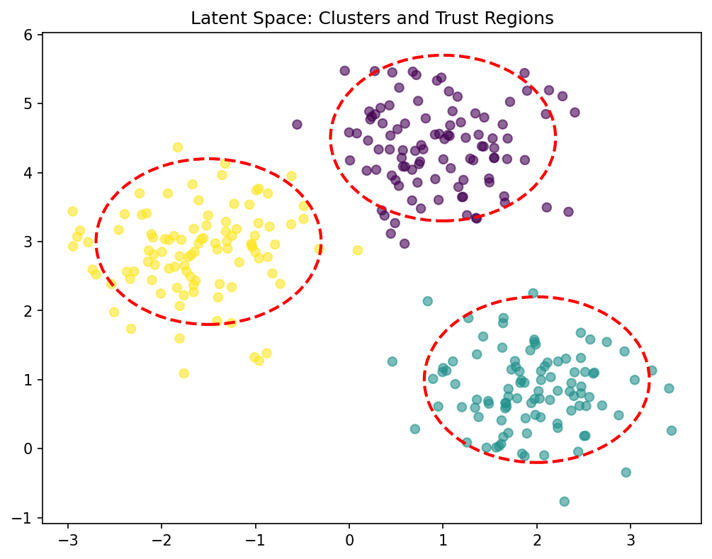
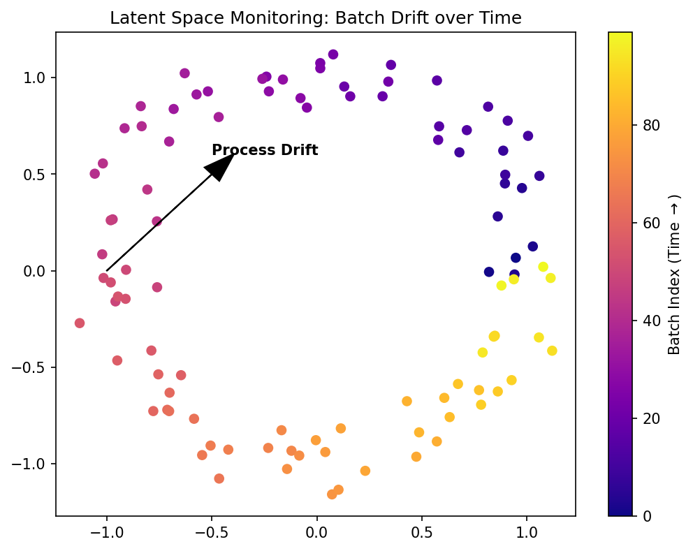

---
title: |
  Mathematical Foundations of AI & ML<br>Unit 10: Latent Spaces and Embeddings
bibliography: ref.bib
author:
  - name: Prof. Dr. Philipp Pelz
    affiliation:
      - FAU Erlangen-Nürnberg
format:
  revealjs:
    width: 1920
    height: 1080
    template-partials:
      - title-slide.html
    css: custom.css
    theme: custom.scss
    slide-number: c/t
    logo: "eclipse_logo_small.png"
    footer: "© Philipp Pelz - Mathematical Foundations of AI & ML"
    menu:
      side: left
      loadIcons: true
---


<!-- ===== §1. Framing ===== -->

## Title + Unit 10 positioning

:::: {.incremental}
- Unit 9 introduced autoencoders as representation learners.
- Unit 10 dives deeper: **what is the structure of the latent space**, and how do we visualize and exploit it?
- We also introduce t-SNE, UMAP, and kernel PCA for nonlinear dimensionality reduction.
::::

## Learning outcomes for Unit 10

By the end of this lecture, students can:

:::: {.incremental}
- define latent spaces formally and distinguish them from raw feature spaces,
- derive the t-SNE objective and explain the crowding problem,
- compare t-SNE, UMAP, and kernel PCA for visualization and dimensionality reduction,
- use latent-space distributions for anomaly detection and trust assessment.
::::

## What is a latent space?

:::: {.incremental}
- A **latent space** is a low-dimensional space that captures the essential variation of high-dimensional data.
- "Latent" = hidden — these variables are not directly observed but inferred from the data.
- Every dimensionality reduction method (PCA, autoencoders, t-SNE) defines a latent space.
::::

## Latent space vs feature space vs PCA eigenspace

| Space | Definition | Structure |
|-------|:----------:|:---------:|
| Feature space | Raw measurements ($\mathbb{R}^d$) | High-dimensional, redundant |
| PCA eigenspace | Linear projection onto top eigenvectors | Flat subspace, orthogonal axes |
| Latent space | Learned embedding (possibly nonlinear) | Captures manifold structure |


<!-- ===== §2. Why latent spaces matter ===== -->

## Why latent spaces matter

:::: {.incremental}
- **Compression**: store data efficiently as latent codes.
- **Visualization**: project to 2D/3D for exploration.
- **Generation**: sample from latent space to create new data.
- **Anomaly detection**: identify out-of-distribution points.
- **Downstream prediction**: use latent features as inputs to supervised models.
::::

## Recap: autoencoder as latent space constructor

:::: {.columns}
:::: {.column width="45%"}
:::: {.incremental}
- Encoder $f_\phi: \mathbb{R}^{d_{\mathbf{x}}} \to \mathbb{R}^{d_{\mathbf{z}}}$ maps each input to a latent code.
- The collection $\{\mathbf{z}_i = f_\phi(\mathbf{x}_i)\}$ forms a **point cloud** in the latent space.
- The decoder $g_\psi$ ensures the latent code retains enough information for reconstruction.
::::
::::

:::: {.column width="55%"}
```{mermaid}
%%| echo: false
%%| fig-align: center
graph LR
    A["Input Data x"] --> B["Encoder f_phi"]
    B --> C(("Latent Space z"))
    C --> D["Decoder g_psi"]
    D --> E["Reconstruction x'"]
    style C fill:#f9f,stroke:#333,stroke-width:4px
```
::::
::::


## Embeddings: points in latent space

:::: {.incremental}
- An **embedding** assigns each data point a coordinate in the latent space.
- Good embeddings preserve meaningful relationships:
  - Similar inputs $\to$ nearby embeddings.
  - Different inputs $\to$ distant embeddings.
- The quality of the embedding determines the utility of the latent space.
::::

## What makes a good latent space?

:::: {.incremental}
- **Neighborhood preservation**: similar data points remain neighbors.
- **Smoothness**: small changes in latent coordinates produce small changes in decoded output.
- **Continuity**: no "holes" — every point in the latent space decodes to something meaningful.
- **Disentanglement** (ideal): each latent dimension corresponds to one interpretable factor of variation.
::::

<!-- ===== §3. Latent space geometry: clusters and manifolds ===== -->

## Latent space geometry: clusters and manifolds

:::: {.incremental}
- **Clusters**: discrete categories form separated groups in latent space.
- **Manifolds**: continuous variation creates smooth surfaces or curves.
- **Mixed**: clusters connected by low-density paths — partially continuous, partially discrete.
- The geometry reflects the structure of the data [@neuer2024machine].
::::

## Roadmap of today's 90 min

:::: {.incremental}
- **10–25 min**: Autoencoder latent space structure and interpretation.
- **25–40 min**: Latent space geometry, interpolation, arithmetic.
- **40–55 min**: t-SNE — derivation and application.
- **55–65 min**: UMAP and kernel PCA.
- **65–80 min**: Anomaly detection and trust quantification in latent space.
::::

## Autoencoder latent neurons: what do they encode?

:::: {.incremental}
- Each latent dimension captures a **learned factor of variation**.
- Example (spectral data): one latent neuron encodes peak position, another encodes peak width.
- These factors are discovered automatically — no human labeling required.
- But: factors may be entangled (mixed together) in standard autoencoders [@neuer2024machine].
::::

## Visualizing 2D latent spaces

:::: {.incremental}
- When $d_{\mathbf{z}} = 2$, the latent space can be plotted directly.
- Color points by class label or continuous property to reveal structure.
- Well-separated colored clusters indicate the AE has learned discriminative features.
- Overlapping colors indicate ambiguity or insufficient bottleneck capacity.
::::


<!-- ===== §4. Interpreting latent space clusters ===== -->

## Interpreting latent space clusters

:::: {.incremental}
- **Tight, separated clusters**: distinct data modes that the AE can distinguish.
- **Overlapping clusters**: similar classes or insufficient latent capacity.
- **Elongated clusters**: continuous variation within a class (e.g., material composition gradient).
- Cluster structure informs downstream tasks: classification boundaries follow cluster separations.
::::

## Latent space interpolation

:::: {.columns}
:::: {.column width="45%"}
- Linearly interpolate between two latent codes:
  $\mathbf{z}_{\text{mix}} = \alpha \mathbf{z}_1 + (1-\alpha) \mathbf{z}_2$
- Decode $\mathbf{z}_{\text{mix}}$ to observe structural transitions.
- **Example**: Latent space encodes `[frequency, phase]`. Interpolating yields smooth structural changes in the generated waveform.
- **Smooth interpolation** proves the latent space has learned a meaningful, continuous representation.
::::

:::: {.column width="55%"}
```{ojs}
//| echo: false
viewof alpha_interp = Inputs.range([0, 1], {value: 0.5, step: 0.01, label: "α (Interpolation)"})

z1_latent = [1, 0]      // freq 1, phase 0
z2_latent = [5, Math.PI] // freq 5, phase pi

z_mix_latent = [
  alpha_interp * z1_latent[0] + (1 - alpha_interp) * z2_latent[0],
  alpha_interp * z1_latent[1] + (1 - alpha_interp) * z2_latent[1]
]

x_interp = d3.range(0, 4 * Math.PI, 0.05)

Plot.plot({
  width: 550,
  height: 350,
  y: {domain: [-1.2, 1.2], label: "Decoded Output"},
  x: {domain: [0, 4 * Math.PI], label: "x"},
  marks: [
    Plot.ruleY([0]),
    Plot.line(x_interp, {x: d => d, y: d => Math.sin(z1_latent[0] * d + z1_latent[1]), stroke: "black", strokeOpacity: 0.2}),
    Plot.line(x_interp, {x: d => d, y: d => Math.sin(z2_latent[0] * d + z2_latent[1]), stroke: "black", strokeOpacity: 0.2}),
    Plot.line(x_interp, {x: d => d, y: d => Math.sin(z_mix_latent[0] * d + z_mix_latent[1]), stroke: "blue", strokeWidth: 3, title: "Interpolated"}),
    Plot.text([[2 * Math.PI, 1.1]], {text: [`Freq: ${z_mix_latent[0].toFixed(2)}, Phase: ${(z_mix_latent[1]/Math.PI).toFixed(2)}π`], fill: "blue", fontSize: 16})
  ]
})
```
::::
::::

## Latent space arithmetic

:::: {.incremental}
- Compute "concept vectors" by averaging latent codes of a category.
- Perform arithmetic: $\mathbf{z}_{\text{result}} = \mathbf{z}_A + (\bar{\mathbf{z}}_B - \bar{\mathbf{z}}_C)$.
- Famous example (word embeddings): king − man + woman ≈ queen.
- This works when the latent space disentangles the relevant factors.
::::

## The issue of latent space structure

:::: {.incremental}
- Standard autoencoders produce **unstructured** latent spaces.
- There may be "holes" — regions where no training data maps — and decoding produces nonsense.
- The latent space is not designed for sampling or generation.
- This motivates **variational autoencoders** (VAEs), covered in a later unit.
::::


<!-- ===== §5. Preview: variational autoencoders (VAEs) ===== -->

## Preview: variational autoencoders (VAEs)

:::: {.incremental}
- VAEs impose a **prior** (typically Gaussian) on the latent space.
- The encoder outputs a distribution $q(\mathbf{z}|\mathbf{x})$, not a point.
- The loss includes a KL-divergence term that regularizes the latent space.
- Result: a continuous, smooth latent space suitable for generation.
::::
## Checkpoint: latent space quality

- **Question**: Your 2D latent space has a large empty region between two clusters. What does this mean?
- **Answer**: The AE has not seen data in that region — decoding points from the gap may produce artifacts. This indicates a **discontinuous** latent space (typical for standard AEs, addressed by VAEs).

## t-SNE: purpose and overview

- **t-Distributed Stochastic Neighbor Embedding** (van der Maaten & Hinton, 2008).
- Purpose: **visualization** of high-dimensional data in 2D or 3D.
- Key idea: preserve local neighborhood structure while allowing global distortion.
- Not for feature extraction or downstream ML — purely for visualization [@mcclarren2021machine].

## Step 1: Gaussian similarities in high dimensions

:::: {.incremental}
- For each pair $(i, j)$, define the conditional probability that $j$ is a neighbor of $i$:
::::

::: {.fragment}
$$
p_{j|i} = \frac{\exp(-\|\mathbf{x}_i - \mathbf{x}_j\|^2 / 2\sigma_i^2)}{\sum_{k \neq i}\exp(-\|\mathbf{x}_i - \mathbf{x}_k\|^2 / 2\sigma_i^2)}
$$
:::

:::: {.incremental}
- $\sigma_i$ is chosen per point to achieve a target **perplexity**.
::::


<!-- ===== §6. Perplexity parameter ===== -->

## Perplexity parameter

:::: {.columns}
:::: {.column width="45%"}
- Perplexity $\approx$ effective number of neighbors considered for a point.
  - **Low** (e.g. 5): local structure, many clusters.
  - **High** (e.g. 50): broader neighborhoods.
- The algorithm adjusts $\sigma_i$ to match the target perplexity. Dense regions get smaller $\sigma_i$, sparse get larger.
- *Adjust $\sigma_i$ to see how the neighborhood probability $p_{j|i}$ changes for the red point.*
::::

:::: {.column width="55%"}
```{ojs}
//| echo: false
viewof sigma_tsne = Inputs.range([0.1, 4], {value: 1, step: 0.1, label: "Bandwidth (σ_i)"})

pts_tsne = [-3, -2, -0.5, 0, 0.8, 2.5, 4]
target_idx_tsne = 3

function p_ji_tsne(idx_i, idx_j, sigma) {
  if (idx_i === idx_j) return 0;
  let dist_sq = (pts_tsne[idx_i] - pts_tsne[idx_j])**2;
  let num = Math.exp(-dist_sq / (2 * sigma * sigma));
  let den = 0;
  for (let k = 0; k < pts_tsne.length; k++) {
    if (k !== idx_i) {
      den += Math.exp(-((pts_tsne[idx_i] - pts_tsne[k])**2) / (2 * sigma * sigma));
    }
  }
  return num / den;
}

tsne_data = pts_tsne.map((x, i) => ({
  x: x,
  p: p_ji_tsne(target_idx_tsne, i, sigma_tsne),
  is_target: i === target_idx_tsne
}))

Plot.plot({
  width: 550,
  height: 350,
  x: {domain: [-4.5, 4.5], label: "Data points (1D Space)"},
  y: {domain: [-0.1, 1], label: "Probability p_{j|i}"},
  marks: [
    Plot.ruleY([0]),
    Plot.line(d3.range(-5, 5, 0.1), {
      x: d => d, 
      y: d => Math.exp(-Math.pow(d - pts_tsne[target_idx_tsne], 2) / (2 * sigma_tsne * sigma_tsne)), 
      stroke: "gray", strokeDasharray: "4"
    }),
    Plot.ruleX(tsne_data.filter(d => !d.is_target), {x: "x", y1: 0, y2: "p", stroke: "blue", strokeWidth: 4}),
    Plot.dot(tsne_data.filter(d => !d.is_target), {x: "x", y: "p", fill: "blue", r: 6}),
    Plot.dot(tsne_data, {x: "x", y: -0.02, fill: d => d.is_target ? "red" : "black", r: d => d.is_target ? 8 : 5})
  ]
})
```
::::
::::

## Step 2: Student-t similarities in low dimensions

- In the 2D embedding space, similarities are defined using a **Student-t distribution** (1 degree of freedom):

$$
q_{ij} = \frac{(1 + \|\mathbf{y}_i - \mathbf{y}_j\|^2)^{-1}}{\sum_{k \neq l}(1 + \|\mathbf{y}_k - \mathbf{y}_l\|^2)^{-1}}
$$

- The heavy tails of the Student-t distribution allow distant points to spread out in the embedding, avoiding the **crowding problem**.


## The crowding problem: why heavy tails?

:::: {.columns}
:::: {.column width="45%"}
- In high dimensions, the available volume grows exponentially. Many points can be mutually almost equidistant.
- When mapped to 2D, they naturally crowd into a small area.
- Using a Gaussian in both spaces $\to$ points collapse together.
- Student-t has **heavier tails**: to achieve the same similarity $q_{ij}$ for moderately similar points, they must be placed **further apart** in 2D space.
::::

:::: {.column width="55%"}
```{ojs}
//| echo: false
viewof distScale = Inputs.range([1, 10], {value: 4, step: 0.1, label: "Viewing Distance"})

x_vals_t = d3.range(-distScale, distScale, distScale/200)

Plot.plot({
  width: 550,
  height: 350,
  y: {domain: [0, 0.45], label: "Similarity / Density"},
  x: {domain: [-distScale, distScale], label: "Distance ||y_i - y_j||"},
  marks: [
    Plot.ruleY([0]),
    Plot.line(x_vals_t, {x: d => d, y: d => Math.exp(-d*d/2) / Math.sqrt(2*Math.PI), stroke: "blue", strokeWidth: 3}),
    Plot.line(x_vals_t, {x: d => d, y: d => Math.PI**(-1) * (1 + d*d)**(-1), stroke: "red", strokeWidth: 3}),
    Plot.text([[distScale*0.5, 0.4]], {text: ["Gaussian similarity"], fill: "blue", fontSize: 16}),
    Plot.text([[distScale*0.5, 0.35]], {text: ["Student-t similarity"], fill: "red", fontSize: 16})
  ]
})
```
::::
::::

## Step 3: KL divergence minimization

:::: {.incremental}
- Minimize the KL divergence between high-dim ($\mathbf{P}$) and low-dim ($\mathbf{Q}$) similarities:
::::

::: {.fragment}
$$
\text{KL}(\mathbf{P} \| \mathbf{Q}) = \sum_{i \neq j} p_{ij} \log \frac{p_{ij}}{q_{ij}}
$$
:::

:::: {.incremental}
- Optimize the embedding coordinates $\{\mathbf{y}_i\}$ via gradient descent.
::::
:::: {.incremental}
- Asymmetric KL: heavily penalizes nearby points being mapped far apart.
::::


<!-- ===== §7. t-SNE: what it preserves ===== -->

## t-SNE: what it preserves

- **Preserves**: local neighborhood structure (nearby points stay nearby).
- **Does NOT preserve**: global distances, cluster sizes, cluster positions.
- t-SNE is a **nonparametric** method — it computes embeddings for fixed data, not a mapping function.
- New data points cannot be projected without rerunning the entire algorithm.

## t-SNE: common misinterpretations

- **Cluster size is meaningless**: tight clusters are not "tighter" in the original space.
- **Inter-cluster distance is meaningless**: far-apart clusters are not necessarily far apart originally.
- **Topology can change with hyperparameters**: different perplexity values produce different layouts.
- Only within-cluster neighborhood relationships are reliable.

## t-SNE hyperparameters

- **Perplexity** (5–50): controls locality. Try multiple values and look for stable patterns.
- **Learning rate** (200 default in sklearn): too low → compression; too high → chaotic layout.
- **Iterations** (≥ 1000): t-SNE needs many iterations to converge.
- **Random seed**: stochastic — results vary between runs. Report multiple runs.

## t-SNE on Fashion MNIST: archipelago interpretation

- 10 clothing categories projected to 2D.
- Similar categories (shirt, pullover, coat) overlap — the algorithm captures semantic similarity.
- Dissimilar categories (trouser, sandal) form isolated islands.
- The "archipelago" pattern = successful class separation [@mcclarren2021machine].


<!-- ===== §8. t-SNE: strengths and weaknesses ===== -->

## t-SNE: strengths and weaknesses

| Strengths | Weaknesses |
|:---------:|:----------:|
| Excellent local structure | No global distance preservation |
| Handles complex manifolds | $O(N^2)$ complexity (slow) |
| Reveals clusters and subgroups | Non-parametric (no new-point mapping) |
| Widely used and understood | Hyperparameter-sensitive |

## Checkpoint: t-SNE interpretation

- **Question**: Two clusters appear far apart in a t-SNE plot. Does this mean they are far apart in the original space?
- **Answer**: No. Inter-cluster distances in t-SNE are not meaningful. Only local neighborhoods are preserved.

## UMAP: Uniform Manifold Approximation and Projection

- Based on **topological data analysis** and manifold theory (McInnes et al., 2018).
- Key advantages over t-SNE:
  - Faster (approximate nearest neighbors, $O(N \log N)$).
  - Better preserves **global structure**.
  - Supports **transform** of new data points.

## UMAP vs t-SNE

| Aspect | t-SNE | UMAP |
|--------|:-----:|:----:|
| Speed | Slow ($O(N^2)$) | Fast ($O(N \log N)$) |
| Global structure | Poor | Better preserved |
| New points | Must rerun | Transform method available |
| Theory | KL divergence | Topological / cross-entropy |
| Typical use | Small–medium datasets | Any size |


<!-- ===== §9. UMAP hyperparameters ===== -->

## UMAP hyperparameters

- **n_neighbors**: controls local vs global balance (similar to perplexity in t-SNE).
- **min_dist**: how tightly points cluster (small → tight clusters, large → spread out).
- **n_components**: embedding dimension (typically 2 for visualization).
- UMAP results are generally more stable across runs than t-SNE.

## Kernel PCA: the kernel trick for nonlinear structure

- Replace dot products in PCA with **kernel evaluations**:

$$
k(\mathbf{x}_i, \mathbf{x}_j) = \phi(\mathbf{x}_i)^\top \phi(\mathbf{x}_j)
$$

- The kernel implicitly maps data to a high-dimensional feature space $\phi(\mathbf{x})$.
- PCA in this space captures nonlinear structure in the original space [@bishop2006pattern].

## Common kernels

- **RBF (Gaussian)**: $k(\mathbf{x}_i, \mathbf{x}_j) = \exp(-\gamma \|\mathbf{x}_i - \mathbf{x}_j\|^2)$ — captures smooth nonlinearity.
- **Polynomial**: $k(\mathbf{x}_i, \mathbf{x}_j) = (\mathbf{x}_i^\top \mathbf{x}_j + c)^d$ — captures polynomial interactions.
- **Sigmoid**: $k(\mathbf{x}_i, \mathbf{x}_j) = \tanh(\alpha \mathbf{x}_i^\top \mathbf{x}_j + c)$ — neural network connection.
- The kernel choice encodes assumptions about the data structure.

## Kernel PCA: strengths and limitations

- **Strengths**: principled (eigenvalue decomposition), captures nonlinear structure, theoretical guarantees.
- **Limitations**: $O(N^2)$ memory for kernel matrix, no density estimation, kernel selection requires care.
- Best suited for moderate-sized datasets where a kernel can be specified.


<!-- ===== §10. Comparison: PCA, kernel PCA, t-SNE, UMAP ===== -->

## Comparison: PCA, kernel PCA, t-SNE, UMAP

:::: {.columns}
:::: {.column width="65%"}
| Method | Linear? | Preserves | Scalability | New points |
|--------|:-------:|:---------:|:-----------:|:----------:|
| PCA | Yes | Global variance | $O(d^2 N)$ | Yes |
| Kernel PCA | No | Kernel similarity | $O(N^3)$ | Limited |
| t-SNE | No | Local neighborhoods | $O(N^2)$ | No |
| UMAP | No | Local + some global | $O(N \log N)$ | Yes |
::::

:::: {.column width="35%"}
### Key Takeaway
- **Linear**: Best for interpretability and speed.
- **Nonlinear**: Best for complex manifolds.
- **UMAP**: Often preferred for large datasets.
::::
::::


## When to use which

- **Quick exploration**: PCA (fast, interpretable).
- **Visualization of clusters**: t-SNE or UMAP (nonlinear, reveals structure).
- **Feature extraction for ML**: PCA or autoencoder (produces reusable features).
- **Nonlinear feature extraction**: kernel PCA (moderate $N$) or autoencoder (large $N$).

## Anomaly detection in latent space

- Train autoencoder on **normal** data.
- Normal data forms clusters in latent space; anomalies map to **low-density regions**.
- Two complementary strategies: reconstruction error and latent density [@neuer2024machine].

## Strategy 1: reconstruction error revisited

- High reconstruction error $\|\mathbf{x} - g(f(\mathbf{x}))\|$ indicates the input differs from learned patterns.
- Set threshold from validation normal distribution.
- Limitation: some anomalies may reconstruct well if they share local structure with normals.


<!-- ===== §11. Strategy 2: latent density estimation ===== -->

## Strategy 2: latent density estimation

- Fit a density model to normal latent embeddings:
  - Gaussian: $p(\mathbf{z}) = \mathcal{N}(\mathbf{z}; \hat{\boldsymbol{\mu}}, \hat{\boldsymbol{\Sigma}})$.
  - GMM: $p(\mathbf{z}) = \sum_k \pi_k \mathcal{N}(\mathbf{z}; \mu_k, \Sigma_k)$.
- Anomaly score: $-\log p(\mathbf{z})$. High score = low density = potential anomaly.

## Combining both strategies

- Flag a sample as anomalous if:
  - Reconstruction error exceeds threshold, **OR**
  - Latent density is below threshold.
- This reduces false negatives: catches anomalies that one strategy alone might miss.
- The two scores can also be combined into a single anomaly score.

## Conditional latent probabilities and trust

- For classification, compute $p(\text{class} | \mathbf{z})$ using a classifier trained in latent space.
- Low maximum probability $\max_c p(c | \mathbf{z})$ indicates **uncertain** classification.
- Use this as a **trust score**: predictions with low trust are flagged for human review [@neuer2024machine].

## Trust quantification in deployment

- In safety-critical applications (materials, medical), blind model predictions are unacceptable.
- The latent-space trust score provides an automated quality gate:
  - High trust: deploy prediction.
  - Low trust: defer to human expert.
- This creates a **human-in-the-loop** system with quantified confidence.


<!-- ===== §12. Materials example: spectral classification with trust scoring ===== -->

## Materials example: spectral classification with trust scoring

:::: {.columns}
:::: {.column width="50%"}
- Classify material type from NIR spectrum using autoencoder + classifier.
- High-confidence predictions (trust > 0.95) are automatically accepted.
- Low-confidence predictions (trust < 0.8) are flagged for expert review.
- Result: 95% of samples classified automatically; 5% reviewed manually.
::::

:::: {.column width="50%"}
{fig-align="center"}
::::
::::

## Materials example: process monitoring via latent drift

:::: {.columns}
:::: {.column width="50%"}
- Track latent embeddings $\mathbf{z}_t$ over time during a manufacturing process.
- **Drift** from the normal cluster indicates process degradation.
- Advantage over raw sensor monitoring: latent space distills many sensors into a compact signal.
- Early drift detection enables preventive maintenance.
::::

:::: {.column width="50%"}
{fig-align="center"}
::::
::::


## Lecture-essential vs exercise content split

- **Lecture**: latent space formalism, t-SNE/UMAP theory, kernel PCA, anomaly detection, trust quantification.
- **Exercise**: AE latent visualization, t-SNE and UMAP on Fashion MNIST, anomaly injection, comparison experiments.

## Exercise setup summary

- Build AE on synthetic Gaussian pulse data; visualize 2D latent space.
- Apply t-SNE (sklearn) to Fashion MNIST subset; interpret the archipelago.
- Compare t-SNE vs UMAP: local vs global structure preservation.
- Inject anomalous signals; detect via reconstruction error and latent density.


<!-- ===== §13. Mini concept quiz ===== -->

## Mini concept quiz

1. Which distribution is used in the low-dimensional space of t-SNE to solve the crowding problem?
   - a) Gaussian distribution
   - b) Uniform distribution
   - c) Student-t distribution
   - d) Poisson distribution
2. What is a key advantage of UMAP over t-SNE?
   - a) It is slower but more accurate
   - b) It better preserves global structure and supports transforming new data
   - c) It only works for 2D visualization
   - d) It does not have any hyperparameters
3. How is an anomaly typically identified in a trained autoencoder's latent space?
   - a) It maps to the center of the normal data cluster
   - b) It has a very low reconstruction error
   - c) It maps to a low-density region of the normal latent distribution
   - d) It increases the training speed
4. What does "latent space interpolation" verify?
   - a) The number of layers in the encoder
   - b) The smoothness and continuity of the learned representation
   - c) The exact value of the learning rate
   - d) The rank of the input matrix

## References + reading assignment for next unit

- **Required reading before Unit 11:**
  - Neuer: Ch. 5.5
  - McClarren: Ch. 4.4, 5
- **Optional depth:**
  - Murphy: Ch. 12 (latent linear models)
  - Bishop: Ch. 12 (kernel PCA)
- Next unit: **Unsupervised Learning** — clustering, mixture models, and density estimation.

::: {#refs}
:::

## Example Notebook

::: {.callout-note icon=false}
## Week 10: Autoencoder Latent Space — IsingDataset (64×64)
[Open rendered notebook →](https://eclipse-lab.github.io/Ai4MatLectures/notebooks/MFML/week10_autoencoder_ising_full.html)  
[](https://colab.research.google.com/github/ECLIPSE-Lab/Ai4MatLectures/blob/main/notebooks/MFML/week10_autoencoder_ising_full.ipynb)
:::
