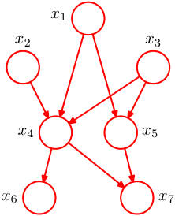
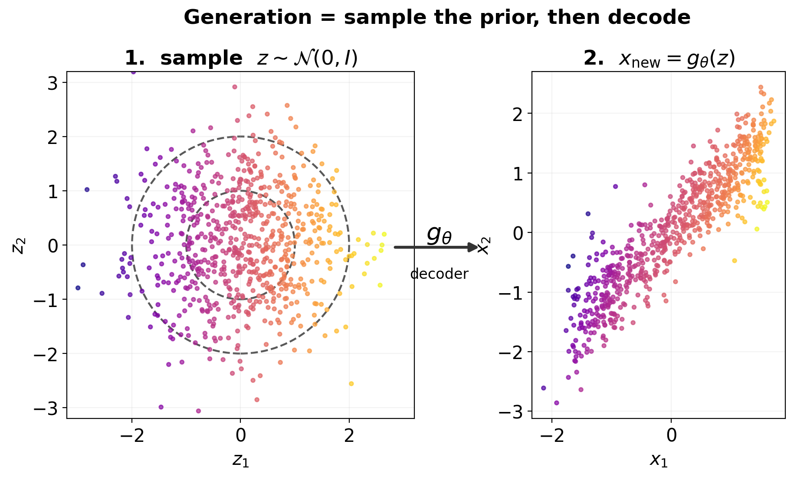

<!-- ===== §1. Framing ===== -->

## Where we are in the course

:::: {.columns}
:::: {.column width="50%"}
**Behind us:**

- Unit 5: autoencoders compress.
- Unit 7: KL divergence and Bayesian thinking.
- Units 9–10: encoders that produce useful representations; transformers as the architecture behind them.
- We can encode. We cannot **generate**.
::::
:::: {.column width="50%"}
**Today (Unit 11):**

- From discriminative to **generative**.
- Variational Autoencoders (VAEs): probabilistic latent + sampling.
- Diffusion models: learn to denoise.
- The dominant generative paradigms of the 2020s.
::::
::::

:::: {.notes}
- Open by naming the inversion this unit performs: every model so far answered "given $x$, predict $y$ (or a representation)". Today we flip the arrow — "produce a new $x$ that looks like it came from the data." Write on the board: **discriminative = $p(y\mid x)$, generative = $p(x)$**. That single contrast organizes the whole lecture.
- Close the course-long arc explicitly (it pays back three units): U5 *compressed* into a latent, U9 *shaped* the latent, U11 *samples* from it. Generation is the capstone of the representation thread, not a new island — say this so students feel the cumulative payoff.
- Stakes for this cohort, stated up front: the killer application is **inverse design** — "give me a microstructure with this stiffness and density." Keep that promissory note visible; the VAE/diffusion math is the means, inverse design is the end they care about.
- Timing: dense 90 min. ELBO (block 3) and reverse diffusion (block 7) are the load-bearing derivations — everything else can flex around them. ~5 min on framing; do not linger here.
::::

## Why this unit matters

:::: {.incremental}
- **Inverse design**: generate a microstructure with target Young's modulus and density.
- **Data augmentation**: synthesize plausible spectra to expand a labeled training set.
- **Scientific discovery**: sample candidate molecules conditioned on a desired property.
- **Modern AI literacy**: every "AI generates X" headline since 2022 is a diffusion model.
::::

:::: {.notes}
- Lead with the inversion that makes generative models scientifically powerful: a forward model predicts property *from* structure (cheap, what we've done all course); a *conditional generative* model proposes structure *from* a desired property. That is the dream of materials informatics — say it as the thesis-relevant headline for this cohort.
- The deep, non-obvious point worth one sentence: a model that can *sample* $x\sim p(x)$ has, implicitly, *learned the data distribution* — generation is a stringent test of understanding, not just a party trick. Tie back to Unit 7 ("a good model of $p$ is the whole game").
- The literacy bullet is the motivator that lands with every student regardless of materials interest: every image/video/protein "AI generates" headline since 2022 is the second half of today's lecture. You are about to learn what is inside Stable Diffusion and AlphaFold-3.
- ~90 s; pure motivation. Do not let it expand.
::::

## Recap: what an autoencoder cannot do

:::: {.incremental}
- An AE encoder $f_\phi: \mathbb{R}^d \to \mathbb{R}^k$ maps **observed** $x$ to a deterministic latent $z = f_\phi(x)$.
- Question: can we sample a *new* $x$? Specifically, can we sample some $z$ and decode?
- **No.** We don't know the distribution of $z$ over the training data — the latent might cluster weirdly, leave gaps ("holes"), or have no clean prior structure.
- Sampling random $z$ from $\mathcal{N}(0, I)$ → decode → garbage.
::::

:::: {.fragment}
**Missing piece**: a controllable distribution over $z$ — and a tractable way to sample from it.
::::

:::: {.notes}
- This is the slide that *creates the need* for everything that follows — deliver it as a failed experiment, not a fact. "We have a trained autoencoder from Unit 5. Let's try to generate: sample $z\sim\mathcal{N}(0,I)$, decode. What comes out?" Answer: garbage. Make them feel the failure before you offer the fix.
- The precise reason, on the board: an AE only ever *trains the decoder on latents the encoder actually produced*. Those occupy some unknown, ragged, hole-ridden region of $\mathbb{R}^k$ — definitely not $\mathcal{N}(0,I)$. Decoding a point the decoder never saw during training is extrapolation into the void. This is a direct callback to Unit 9's "latent has holes / no clean prior" slide — name it.
- The fix preview (the fragment) is the entire VAE in one sentence: "we need to *force* the latent distribution to be something we can sample from." Write it; the next 8 slides are just *how*.
- ~2 min. Keeper: "AE has no controllable $p(z)$ → can't generate; that missing piece *is* the VAE."
::::

## What is a generative model?

:::: {.columns}
:::: {.column width="55%"}
A generative model represents (or approximates) the data distribution $p(x)$. It must support:

:::: {.incremental}
- **Sampling**: produce $x \sim p(x)$.
- **Likelihood** (sometimes): evaluate $p(x)$ for a given $x$.
- **Conditioning**: sample from $p(x \mid c)$ for a condition $c$ (target property, class label, prompt).
::::

:::: {.fragment}
**Today**: VAEs (sampling + approximate likelihood) and diffusion (sampling, no exact likelihood, but extraordinary quality).
::::
::::
:::: {.column width="45%"}
{width=85%}
::::
::::

:::: {.notes}
- Give them the three capabilities as the *axes of the comparison table* they'll see at the end — "remember these three words: sample, score, condition; we'll grade every model on them." This makes the final decision table a payoff, not a surprise.
- The crucial distinction students miss: **sampling and likelihood are different abilities**. A GAN/diffusion can sample beautifully but cannot tell you $p(x)$; a flow can do both; a VAE gives a *lower bound* on likelihood. "Can generate" ≠ "knows the probability." State it explicitly — it's a recurring exam discriminator.
- For the materials cohort, *conditioning* is the one that matters most — "sample $x$ given target property $c$" is literally inverse design. Flag now that classifier-free guidance (later) is what makes conditioning actually work.
- Use the DAG figure for the simplest possible generative idea: ancestral sampling — factor the joint, sample top-down. VAEs/diffusion are this idea with one latent layer and many noised layers respectively. ~2 min.
::::

## Learning outcomes

By the end of this unit, students can:

:::: {.incremental}
- **Explain** why a vanilla autoencoder cannot generate new samples.
- **Derive** the VAE ELBO at intuition depth and use the reparameterization trick.
- **Use** a trained VAE: encode, sample latent, decode.
- **Describe** the forward (noising) and reverse (denoising) processes of a diffusion model.
- **Apply** classifier-free guidance for conditional generation.
- **Compare** VAEs, diffusion, and normalizing flows on the trade-off axes.
::::

:::: {.notes}
- Use the list as a contract and map verbs to assessment: *Derive* (the ELBO + why reparameterization is needed) and *Describe* (the DDPM forward/reverse + training step) are the exam-paper targets; *Compare* is the conceptual essay (the trade-off table).
- Flag the two outcomes students underrate: (1) *why* reparameterization is needed — they memorize $z=\mu+\sigma\epsilon$ without grasping it's about gradient flow through a sample; (2) classifier-free guidance — the one technique that turns "conditional diffusion" from a toy into Stable Diffusion. Both are guaranteed exam material; say so.
- Rigor calibration: ELBO derived to insight (Jensen, one line), not measure-theoretic VI; diffusion at the DDPM level (one closed-form forward marginal, one MSE loss), flow matching/consistency as *named modern context*, not derivations. Engineering-foundations depth.
::::

## Roadmap of today's 90 min

:::: {.incremental}
1. **What is a generative model?** (~5 min)
2. **VAE setup and intuition** (~10 min)
3. **VAE loss: ELBO + reparameterization** (~15 min)
4. **Training and using a VAE** (~5 min)
5. **VAE → diffusion bridge** (~5 min)
6. **Forward diffusion** (~10 min)
7. **Reverse diffusion** (~15 min)
8. **Sampling and conditional generation** (~10 min)
9. **Score matching, alternatives, materials applications** (~10 min)
10. **Wrap** (~5 min)
::::

:::: {.notes}
- Be explicit with yourself about the two protected blocks: **block 3 (ELBO + reparameterization, ~15 min)** and **block 7 (reverse diffusion, ~15 min)**. These are the conceptual spines of the two halves; if you fall behind, you compress block 9 (flow matching / consistency / alternatives — they are awareness, not mechanism), never these.
- Block 8 (conditional generation / classifier-free guidance) is the materials-relevance peak — inverse design lives there. Protect it second.
- The natural recovery valves: block 9's flow-matching and consistency slides degrade gracefully to one sentence each; the VAE→diffusion bridge (block 5) can be a single sentence if needed. Say none of this to students — it's your private pacing contract.
- ~90 s on the roadmap; it orients, it doesn't teach.
::::

<!-- ===== §2. VAE setup ===== -->

## VAE — the architectural change

:::: {.columns}
:::: {.column width="55%"}
**Vanilla AE**:

$$
x \xrightarrow{f_\phi} z \xrightarrow{g_\theta} \hat x
$$

Encoder produces a single point $z$.

**VAE**:

$$
x \xrightarrow{f_\phi} (\mu, \sigma) \xrightarrow{\text{sample}} z \xrightarrow{g_\theta} \hat x
$$

Encoder produces a *distribution* $\mathcal{N}(\mu, \sigma^2 I)$. Sample $z$ from it.

:::: {.fragment}
The latent $z$ is now a random variable, not a deterministic function of $x$.
::::
::::
:::: {.column width="45%"}
![Plate notation for a latent-variable generative model: open circle $z_i$ = hidden, shaded circle $x_i$ = observed. The plate (box labelled $N$) means the pattern repeats over all data points. [@bishop2006pattern, Ch. 8]](images/plate_notation_observed_latent.png){width=75%}
::::
::::

:::: {.notes}
- The single most important framing to deliver, and the one students miss: **the architectural change is tiny and not where the magic is.** Encoder outputs $(\mu,\sigma)$ instead of $z$ — that's it. Write both diagrams stacked on the board so the diff is one node. Then say the line that matters: "this change does almost nothing by itself; the *loss* is what forces the latent to be sampleable. Hold that thought for three slides."
- Pre-empt the misconception that "VAE = AE with noise added." It is not noise injection; it is making $z$ a *parameterized distribution* whose parameters the network predicts, so we can later (a) regularize that distribution toward a prior and (b) sample from the prior at test time. Both require the distributional view.
- The plate diagram sets up the *generative direction* ($z\to x$): the decoder is literally the generative model $p_\theta(x\mid z)$; the encoder is the inference network that inverts it. Naming this now makes "ELBO = the objective for fitting this latent-variable model" land later. ~2 min.
::::

## VAE — the prior on $z$

:::: {.columns}
:::: {.column width="55%"}
:::: {.incremental}
- We want a tractable distribution to **sample from at generation time**.
- Choose a fixed prior $p(z) = \mathcal{N}(0, I)$ — the standard Gaussian on $\mathbb{R}^k$.
- Constrain training so that the *aggregate* posterior $q_\phi(z) = \mathbb{E}_{x}[q_\phi(z \mid x)]$ stays close to $p(z)$.
- At generation time: sample $z \sim \mathcal{N}(0, I)$, decode.
::::

:::: {.fragment}
**This is the core trick**: train the encoder to push latents toward a known prior, so we can sample from that prior at test time.
::::
::::
:::: {.column width="45%"}
{width=100%}
::::
::::

:::: {.notes}
- This is the slide that *solves the problem from "Recap: what an AE cannot do."* Say it explicitly: "remember the AE failed because we didn't know $p(z)$? The VAE's answer is brutally simple — we *decree* $p(z)=\mathcal{N}(0,I)$ and then *train the encoder to comply*." Box "the core trick" fragment on the board; it is the thesis of the VAE half.
- The subtle, exam-worthy distinction to make precise: the KL term acts per-$x$ ($q_\phi(z\mid x)\to\mathcal{N}(0,I)$), but what we actually need for generation is the *aggregate* posterior $\approx\mathcal{N}(0,I)$. Per-$x$ posteriors need not individually be the prior — they need to *tile* the prior collectively. This is why VAE latents are space-filling where AE latents have holes (callback to the AE-can't-generate slide).
- One honest caveat in a sentence: the $\mathcal{N}(0,I)$ prior is a *convenience choice* (tractable KL, trivial sampling), not a law — mixture/flow priors exist and reduce blurriness, but standard normal is the default and what they'll implement. ~2 min.
- Use the figure to *make bullet 3 visible*: point at any single coloured blob = one $q_\phi(z\mid x)$ (no individual blob is the prior); then sweep over all of them = the aggregate posterior, which the KL term forces to fill the dashed rings. The "no holes in the union" is exactly why sampling the prior and decoding works — contrast with the AE, whose blobs would clump and leave gaps. (Figure generated locally; it replaced a borrowed mixture-model plate that wrongly depicted a *discrete* GMM latent — say nothing about that to students, just don't imply $z$ is discrete.)
::::

## VAE — the loss, intuitively

For each training point $x$, the VAE loss has two terms:

:::: {.incremental}
- **Reconstruction term**: how well does decoding $z$ recover $x$? (Same as a vanilla AE.)
- **Prior-matching term**: is $q_\phi(z \mid x)$ close to $p(z) = \mathcal{N}(0, I)$? Use **KL divergence**.
::::

:::: {.fragment}
$$
\mathcal{L}(\theta, \phi; x) = \underbrace{-\mathbb{E}_{z \sim q_\phi(z|x)}[\log p_\theta(x \mid z)]}_{\text{reconstruction}} + \underbrace{\mathrm{KL}(q_\phi(z \mid x) \,\|\, p(z))}_{\text{prior-matching}}
$$
::::

:::: {.notes}
- Teach the loss as a *tug-of-war* and draw it as two arrows pulling $q_\phi(z\mid x)$: reconstruction pulls the latent to be *informative* (encode enough about $x$ to rebuild it); KL pulls it to be *generic* (look like $\mathcal{N}(0,I)$). The VAE is the equilibrium. Every VAE pathology (blurriness, posterior collapse) is this balance tipping one way — foreshadow both.
- The reconstruction term is *not new*: for a Gaussian decoder, $-\log p_\theta(x\mid z)$ reduces to MSE — exactly the autoencoder loss and exactly the Unit 7 "Gaussian likelihood ⇒ squared error" result. Say "the first term is the AE you already know; only the second term is new." This continuity lowers the perceived difficulty enormously.
- The KL term is the *price of being sampleable*. Frame it as such: "we pay reconstruction quality to buy a latent we can sample from." That framing makes β-VAE (the knob on this price) obvious later. ~2 min; the formula is motivated next, derived after.
::::

<!-- ===== §3. VAE loss ===== -->

## The ELBO — what's that?

The actual quantity we want to maximize is $\log p_\theta(x)$ — but it is intractable (an integral over $z$).

:::: {.fragment}
**Trick**: derive a tractable **lower bound**.
$$
\log p_\theta(x) \geq \mathbb{E}_{q_\phi(z|x)}[\log p_\theta(x \mid z)] - \mathrm{KL}(q_\phi(z \mid x) \,\|\, p(z)) = \mathrm{ELBO}.
$$
::::

:::: {.fragment}
Maximizing the ELBO maximizes a lower bound on the log-likelihood. We are *almost* doing maximum likelihood.
::::

:::: {.notes}
- Motivate *why we can't just do MLE*: we want $\max_\theta \log p_\theta(x)=\log\int p_\theta(x\mid z)p(z)\,dz$ — an integral over all latents, intractable for a neural decoder. This is the same intractable-evidence wall from Unit 7's Bayesian block — name the callback: "remember the marginal likelihood we said was usually intractable? This is that wall, and the ELBO is how the whole field climbs it."
- The conceptual payoff line: maximizing the ELBO is "almost MLE" — and the *gap* between ELBO and $\log p(x)$ is exactly $\mathrm{KL}(q_\phi(z\mid x)\,\|\,p_\theta(z\mid x))$, the distance from your encoder to the *true* posterior. So tightening the bound = making the encoder a better inference network. Put that sentence on the board; it's the deepest idea in the VAE half and a favorite exam question.
- Don't fully derive here — the next slide does the one-line Jensen sketch. This slide's job is *why a lower bound at all*. ELBO = Evidence Lower BOund; "evidence" = $p(x)$, the Unit 7 vocabulary. ~3 min across this + the derivation slide; protected block.
::::

## ELBO derivation sketch

Start with $\log p(x) = \log \int p(x, z) dz$. Multiply and divide by $q_\phi(z|x)$:

$$
\log p(x) = \log \int q_\phi(z|x) \frac{p(x, z)}{q_\phi(z|x)} dz \geq \int q_\phi(z|x) \log \frac{p(x, z)}{q_\phi(z|x)} dz \quad \text{(Jensen)}.
$$

:::: {.fragment}
Expanding $p(x, z) = p(x|z) p(z)$ and rearranging:
$$
\log p(x) \geq \mathbb{E}_q[\log p(x|z)] - \mathrm{KL}(q(z|x) \| p(z)).
$$
::::

:::: {.notes}
- Do this derivation on the board — it is three moves and it is exam-able, so don't just display it. (1) Introduce $q$ by multiply/divide (the "variational" move — we get to *choose* $q$). (2) Jensen: $\log\mathbb{E}[\cdot]\ge\mathbb{E}[\log\cdot]$ because $\log$ is concave — *this* is the single inequality the whole framework rests on; draw the concave-chord picture. (3) Factor $p(x,z)=p(x\mid z)p(z)$ and regroup → recover the reconstruction − KL form from two slides ago. Closing the loop ("the loss we stated *is* this bound") is the satisfying moment — land it.
- The one sentence students must leave with: **the bound is tight exactly when $q_\phi(z\mid x)$ equals the true posterior $p_\theta(z\mid x)$**; the slack is $\mathrm{KL}(q\,\|\,p_\theta(z\mid x))\ge 0$. This is *why* a more expressive encoder helps and *why* Jensen's gap is not a bug but a tunable.
- Pre-empt the "is this rigorous?" question honestly: yes (Jensen is exact), and the choice of $q$ is the only approximation — everything else is identity. ~2 min on this slide; it's the proof, the previous slide was the why.
::::

## The reparameterization trick

:::: {.columns}
:::: {.column width="52%"}
:::: {.incremental}
- We need to backpropagate through the **sampling step** $z \sim \mathcal{N}(\mu, \sigma^2)$.
- Problem: sampling is not differentiable.
- Solution: rewrite the sample as a deterministic function of a noise variable:
$$
z = \mu_\phi(x) + \sigma_\phi(x) \odot \epsilon, \quad \epsilon \sim \mathcal{N}(0, I).
$$
::::

:::: {.fragment}
The randomness sits in $\epsilon$ (no parameters); $\mu, \sigma$ are deterministic functions of $\phi$. Now gradients flow from the loss through $z$ back to $\phi$.
::::
::::
:::: {.column width="48%"}
![Reparameterization trick: instead of sampling $z$ directly (stochastic node, top path), inject external noise $\epsilon \sim \mathcal{N}(0,I)$ and compute $z = \mu + \sigma \odot \epsilon$ deterministically (bottom path). Gradients now flow through $\mu$ and $\sigma$. Source: Wikimedia Commons (CC-BY-SA 4.0). [@doersch2016vaetutorial]](images/vae_reparameterization_trick.png){width=90%}
::::
::::

:::: {.notes}
- State the problem sharply first, because students don't feel it: "the ELBO has $\mathbb{E}_{z\sim q_\phi}[\cdot]$ — to train $\phi$ by SGD we need $\nabla_\phi$ of an expectation *whose distribution depends on $\phi$*. You cannot backprop through `torch.randn` — the sample is a discontinuous function of the parameters." Make them see the wall before the ladder.
- The trick in one sentence on the board: **move the randomness off the parameter path** — $z=\mu_\phi+\sigma_\phi\odot\epsilon$ with $\epsilon\sim\mathcal{N}(0,I)$ *fixed* and parameter-free. Now $z$ is a *deterministic, differentiable* function of $(\mu,\sigma)$ given $\epsilon$; gradients flow. The figure's two paths (stochastic node vs external-noise node) is the picture to point at.
- Sell its importance beyond VAEs: this exact "push noise to a parameter-free source" idea powers Bayesian neural nets, normalizing flows, stochastic policies in RL, and the diffusion training loop you'll see in 30 minutes (sampling $\epsilon$, then $x_t=\sqrt{\bar\alpha_t}x_0+\sqrt{1-\bar\alpha_t}\epsilon$ is the same move). Flag the forward connection — it makes diffusion feel familiar.
- This is the single most-asked VAE exam question ("why is reparameterization needed?"). Tell them the answer is "differentiable sampling for gradient-based training," not "to add noise." ~3 min; protected.
::::

## KL between Gaussians — closed form

When $q_\phi(z \mid x) = \mathcal{N}(\mu, \mathrm{diag}(\sigma^2))$ and $p(z) = \mathcal{N}(0, I)$:

$$
\mathrm{KL}(q \,\|\, p) = \frac{1}{2}\sum_{j=1}^{k}\!\left(\mu_j^2 + \sigma_j^2 - \log \sigma_j^2 - 1\right).
$$

:::: {.fragment}
- $\mu_j^2$: penalize means away from 0.
- $\sigma_j^2 - \log \sigma_j^2 - 1$: penalize variances away from 1 (minimum at $\sigma_j = 1$).
- Easy to compute, no Monte Carlo needed.
::::

:::: {.notes}
- Pay back a Unit 7 debt explicitly — this is the moment promised earlier in the course. Say: "in Unit 7 I told you to photograph the KL-between-Gaussians formula because it would return as the VAE regularizer. Here it is, unchanged. The hard part was done weeks ago." Students love a promise kept; it also proves the course is one argument.
- Read the term geometrically on the board: $\mu_j^2$ pulls each latent mean to 0; $\sigma_j^2-\log\sigma_j^2-1$ is a convex bowl with its *minimum exactly at $\sigma_j=1$* (differentiate: $1-1/\sigma_j^2=0\Rightarrow\sigma_j=1$). So the KL term is literally "be a unit Gaussian, per dimension." Sketch that bowl — it makes posterior collapse (next-but-one slide) visually obvious (the encoder can zero the KL by outputting $\mu=0,\sigma=1$ and *ignoring $x$*).
- The practical punchline: because it's closed-form, the KL term costs *zero* Monte Carlo — only the reconstruction term needs the sampled $z$. This asymmetry (analytic KL, sampled recon) is exactly what the 10-line training code on the next slide exploits. ~2 min.
::::

## VAE training step — the recipe

```python
mu, log_sigma = encoder(x)
epsilon = torch.randn_like(mu)
z = mu + torch.exp(log_sigma) * epsilon
x_recon = decoder(z)

recon_loss = ((x - x_recon)**2).mean()
kl_loss = 0.5 * (mu**2 + (2*log_sigma).exp() - 2*log_sigma - 1).sum()
loss = recon_loss + kl_loss
loss.backward()
```

:::: {.fragment}
~10 lines. Encoder predicts $\log \sigma$ for numerical stability. Sample once per training step (more samples = lower-variance gradient estimate but more compute).
::::

:::: {.notes}
- Walk the code line-by-line and map each line to the math just derived — this is the "it's only 10 lines" demystification moment that converts a scary framework into something they can implement tonight. Lines 1–3 = reparameterization; line 4 = decoder; line 6 = the closed-form KL from the previous slide *typed out verbatim*; line 7 = the ELBO (negated). Point at the one-to-one correspondence.
- The `log_sigma` trick is a real, examinable engineering point (callback to Unit 6/7 numerical-stability theme): predicting $\log\sigma$ instead of $\sigma$ guarantees positivity for free and keeps gradients well-scaled — you never clamp or `softplus`. Note the code's `(2*log_sigma).exp()` is $\sigma^2$ and `2*log_sigma` is $\log\sigma^2$ — match it to the formula so it isn't magic.
- One subtle point worth 20 s: a *single* $\epsilon$ sample per step gives an unbiased but high-variance gradient estimate; it works because SGD averages over the minibatch (same logic as minibatch gradients, Unit 6). More samples = lower variance, rarely worth the compute. ~2 min; high-payoff concreteness.
::::

## β-VAE: weighted KL

:::: {.incremental}
- Vanilla VAE: equal weight on reconstruction and KL.
- β-VAE: $\mathcal{L} = \mathrm{recon} + \beta \cdot \mathrm{KL}$.
- $\beta > 1$: stricter prior matching → more disentangled, smoother latent, *worse* reconstruction.
- $\beta < 1$: looser prior → sharper reconstruction, latent less Gaussian.
- Choice depends on use case: generation quality vs interpretability.
::::

:::: {.notes}
- Frame β as *the single knob on the tug-of-war* you drew two slides ago: it literally sets the rope tension between "informative latent" and "Gaussian latent." Everything practical about VAEs is choosing β for the task. Make the trade concrete and directional: $\beta\uparrow$ → latent more disentangled/interpretable, samples blurrier; $\beta\downarrow$ → sharper recon, latent less sampleable.
- Materials-cohort calibration: when the goal is *interpretable* latent axes (e.g., "does dimension 3 track grain size?") use $\beta>1$ — disentanglement is the deliverable. When the goal is *generation quality*, keep $\beta\approx1$ or use a richer prior. Give them the decision rule, not just the equation.
- One honest caveat: disentanglement from β-VAE is empirically fragile and not guaranteed (Locatello et al. 2019 showed unsupervised disentanglement has no free lunch). Mention it so they don't over-claim "interpretable dimensions" in a thesis. ~90 s.
::::

## Posterior collapse

:::: {.incremental}
- Failure mode: the encoder outputs $\mu \approx 0, \sigma \approx 1$ for *all* inputs — the latent ignores $x$.
- The decoder then ignores $z$ and reconstructs from "average" data.
- Symptom: KL term ≈ 0; reconstruction is poor.
- Causes: too-strong KL weight; too-powerful decoder.
- Mitigations: KL warm-up (start with low β, increase); weaker decoder; β-VAE with $\beta < 1$.
::::

:::: {.notes}
- This is the #1 VAE failure in practice — present it as the predictable consequence of the KL geometry you sketched, not a mysterious bug. The encoder discovers it can *zero the KL for free* by always emitting $\mu=0,\sigma=1$ (the minimum of that convex bowl) — and if the decoder is powerful enough to reconstruct a blurry "average" without using $z$, training happily settles there. The latent becomes information-free.
- Give the diagnostic checklist they'll actually use: KL term → 0 *and* reconstruction stuck/blurry ⇒ collapse. (KL→0 with *good* recon is fine — that just means an easy dataset.) This KL-monitoring habit is the practical takeaway; tell them to always log the KL term separately.
- The mitigation that matters most and why it works: **KL warm-up** (anneal β from 0→1 over early epochs) lets the encoder first learn to *use* $z$ for reconstruction before the prior pressure arrives — order of optimization matters, a recurring course theme (cf. learning-rate warmup, Unit 6). Especially needed with strong autoregressive/transformer decoders. ~90 s.
::::

<!-- ===== §4. Using a VAE ===== -->

## Generating new data from a trained VAE

:::: {.columns}
:::: {.column width="55%"}
:::: {.incremental}
1. Sample $z \sim \mathcal{N}(0, I)$.
2. Decode: $x_{\text{new}} = g_\theta(z)$.
3. (Optional) for a stochastic decoder: also sample $x \sim p_\theta(x \mid z)$.
::::

:::: {.fragment}
That's it. No labels needed; no special procedure. The trained encoder/decoder pair is now also a sampler.
::::
::::
:::: {.column width="45%"}
{width=100%}
::::
::::

:::: {.notes}
- This is the *payoff slide* — circle all the way back to "Recap: what an AE cannot do" and run the *same* experiment that failed: sample $z\sim\mathcal{N}(0,I)$, decode. This time it works, and it works *because* the KL term trained the aggregate posterior to be $\mathcal{N}(0,I)$. Make the callback explicit and let it land — this is the moment the unit's first half justifies itself.
- The "no labels, no special procedure" point is worth dwelling on: generation is *free* once trained — the same network is autoencoder *and* sampler. Contrast with the AE where the decoder existed but was unusable as a generator. The difference was purely the loss.
- Materials framing: the inverse-design loop in miniature — sample candidate $z$ → decode to a candidate microstructure/spectrum → screen with a cheap surrogate or simulator. We'll make this conditional (target property) at the classifier-free-guidance slide; flag it forward. ~90 s.
- Walk the figure left→right: a *featureless Gaussian blob* of latent samples becomes *structured data* purely by passing through $g_\theta$ — the colour (a latent coordinate) carried into the right panel shows the map is smooth and deterministic given $z$. Emphasise: the structure was *learned into the decoder weights*, not present in the noise. (Figure generated locally; replaced a borrowed mixture-of-factor-analysers plate — FA is the VAE's linear ancestor so the *direction* was right, but the $\mu_k,W_k$ mixture index is not a VAE; don't imply discrete components.)
::::

## Latent interpolation in a VAE

:::: {.incremental}
- Encode two real samples $x_A, x_B$ → latents $z_A, z_B$.
- Interpolate: $z_t = (1-t) z_A + t z_B$ for $t \in [0, 1]$.
- Decode each $z_t$.
- Result in a well-trained VAE: a **smooth path** between the two outputs in $x$-space.
::::

:::: {.fragment}
For materials: interpolate between two micrographs to see how phases transition; interpolate between two compositions to traverse phase space.
::::

:::: {.notes}
- Interpolation is the cleanest *visual proof* that the VAE latent has meaningful geometry (not just that it can sample). The smooth $x$-space path exists *because* the KL term made the latent space-filling — there are no "holes" to fall into between $z_A$ and $z_B$. Contrast directly with a vanilla AE, whose interpolation famously passes through hole regions and decodes to garbage mid-path. This is the experimental signature of the structural fix.
- Materials payoff to make concrete: interpolating between two compositions traverses a *learned* path through phase space — a fast, smooth proxy for "what's between these two alloys?" useful for exploratory design and for sanity-checking that the latent encodes physically meaningful variation.
- A subtle honesty note for sharp students: linear interpolation in a Gaussian latent slightly under-shoots the typical-set radius (the "interpolation should be spherical" point) — mention only if asked; it's a refinement, not a correction. ~90 s.
::::

## VAE summary

:::: {.incremental}
- **Architecture**: encoder → distribution → reparameterized sample → decoder.
- **Loss**: reconstruction + KL to standard Gaussian prior.
- **Sampling**: $z \sim \mathcal{N}(0, I)$, decode.
- **Strengths**: principled, fast sampling, smooth latent.
- **Weaknesses**: blurry samples (the KL prior tends to "smooth out" generation).
::::

:::: {.notes}
- Run this as active recall, not a read-back: cover the bullets, ask the room to reconstruct "architecture / loss / how to sample" from memory. If they can produce reparameterization + (recon − KL) + "sample $\mathcal{N}(0,I)$, decode," the VAE half landed.
- The weakness bullet is the *narrative pivot* of the whole lecture — dwell on *why* VAEs are blurry: a single decode step must map a Gaussian latent to a sharp data point, and the Gaussian reconstruction likelihood (= MSE) provably prefers the *mean* of plausible outputs → averaged, blurry samples. This is not a tuning failure; it is structural. Name it precisely, because the next slide's entire motivation is "what if we don't do it in one step?"
- This is the historical hinge too: VAE blurriness motivated GANs (2014–2021, now legacy) and then diffusion (2020–). Frame the transition as a *problem statement* the second half answers, not a topic change. ~2 min; end on the cliffhanger.
::::

<!-- ===== §5. VAE → diffusion bridge ===== -->

## VAEs sample in one step. What if we used many?

:::: {.columns}
:::: {.column width="55%"}
:::: {.incremental}
- A VAE samples $z$ from a learned prior, then decodes in **one** step.
- The single-step decode has to do all the work — and produces blurry outputs.
- **What if we generated through many small steps**, each easier than the last?
::::

:::: {.fragment}
This is the **diffusion idea**: start from pure noise, gradually denoise to produce a sample.
::::
::::
:::: {.column width="45%"}
![Metropolis–Hastings sampling from a 2D Gaussian: accepted steps (green) and rejected steps (red). Iterative refinement through many small moves — each step uses the current state. [@bishop2006pattern, Ch. 11]](images/metropolis_chain_steps.png){width=85%}

:::: {.fragment .small}
*Analogy*: diffusion also iterates many small denoising steps. Unlike MCMC, the denoiser is a learned neural network.
::::
::::
::::

:::: {.notes}
- This is the conceptual bridge of the lecture — deliver the reframing as a single powerful question on the board: **"the VAE's blurriness is the price of doing generation in *one* hard step. What if we split it into *many easy* steps?"** That sentence *is* diffusion; everything in the second half is engineering that idea.
- The intuition to make vivid: asking a network to turn pure noise into a sharp micrograph in one shot is an impossibly hard regression (hence the blurry VAE mean). Asking it to remove a *tiny bit* of noise — a problem where the answer is close to the input — is easy and well-posed. Repeat 1000 times and the easy steps compose into the hard transformation. "Many easy problems > one impossible problem" — write it.
- Use the MCMC figure as analogy *and* contrast: like MCMC, generation is iterative refinement of a state; *unlike* MCMC, the step is not a random proposal but a *learned* denoiser pointing toward the data. One sentence; don't teach MCMC. ~2 min; this slide is short but pivotal — don't rush the reframing.
::::

## The diffusion picture

 
:::: {.incremental}
- **Forward process** (fixed, no learning): gradually add Gaussian noise to data.
- **Reverse process** (learned): gradually remove noise to recover data.
- At training time: pick a random timestep $t$, add the right amount of noise to a real sample, train a network to predict the noise.
- At generation time: start from $x_T \sim \mathcal{N}(0, I)$, iterate the learned reverse process.
::::
 
![The directed graphical model of a diffusion model: the reverse process $p_\theta(\mathbf{x}_{t-1}\mid\mathbf{x}_t)$ (solid arrows) gradually denoises from $\mathbf{x}_T$ to $\mathbf{x}_0$; the forward process $q(\mathbf{x}_t\mid\mathbf{x}_{t-1})$ (dashed) adds noise. Source: [@ho2020ddpm] Fig. 2 (arXiv 2006.11239).](images/image.png){width=100%}
 
 

:::: {.notes}
- Establish the single most important asymmetry up front and box it on the board: **the forward process is fixed (no parameters, no learning); only the reverse is learned.** Students assume both are learned — pre-empt it hard. The forward process is a *known, hand-designed corruption*; all the modeling effort goes into learning to *invert* it.
- Why this asymmetry is the whole trick: because the forward process is known and Gaussian, we can (a) jump to any noise level $t$ in closed form (next-but-one slide) and (b) define the exact target the reverse network must predict. A fixed forward process turns generation into *supervised denoising* — no adversarial game, no intractable normalizer. That is why diffusion is so stable (callback later to "no min-max, unlike GANs").
- Read the figure as the two-arrow story: dashed = fixed noising $q$, solid = learned denoising $p_\theta$. Training touches only the solid arrows. ~2 min; this slide is the map for the next six.
::::

<!-- ===== §6. Forward diffusion ===== -->

## Forward process — definition

A Markov chain that progressively adds Gaussian noise:

$$
q(x_t \mid x_{t-1}) = \mathcal{N}\!\left(x_t;\; \sqrt{1 - \beta_t}\, x_{t-1},\; \beta_t I\right).
$$

:::: {.incremental}
- $\beta_t \in (0, 1)$ is a **noise schedule**, typically small (e.g., 0.0001 to 0.02 over 1000 steps).
- Each step shrinks the signal by $\sqrt{1 - \beta_t}$ and adds isotropic Gaussian noise of variance $\beta_t$.
- After enough steps, $x_T$ is approximately $\mathcal{N}(0, I)$.
::::

:::: {.notes}
- Decode the formula in words before the symbols: "each step *slightly shrinks the current signal* (multiply by $\sqrt{1-\beta_t}<1$) and *adds a little Gaussian noise* (variance $\beta_t$)." That is the entire forward process; it has no parameters and nothing to learn — re-emphasize the asymmetry from the previous slide.
- The exam-able subtlety: *why $\sqrt{1-\beta_t}$ and not just "add noise"?* Because that specific scaling makes the process **variance-preserving** — if $\mathrm{Var}(x_{t-1})=1$ then $\mathrm{Var}(x_t)=(1-\beta_t)\cdot1+\beta_t=1$. Without it, variance would blow up and $x_T$ would not be a clean standard Gaussian. Show the one-line variance computation on the board; it's a beautiful, small, Unit-7-flavored result and it's *why* generation can start from exactly $\mathcal{N}(0,I)$.
- Numbers anchor it: $\beta_t$ from $10^{-4}$ to $0.02$ over $T=1000$ steps — each step is *tiny*; the destruction is gradual, which is exactly why each reverse step is an *easy* problem (callback to the bridge slide). ~2 min.
::::

## Forward process — closed-form marginal

The composition of $t$ Gaussian steps is itself Gaussian:

$$
q(x_t \mid x_0) = \mathcal{N}\!\left(x_t;\; \sqrt{\bar\alpha_t}\, x_0,\; (1 - \bar\alpha_t) I\right),
$$

where $\alpha_t = 1 - \beta_t$ and $\bar\alpha_t = \prod_{s=1}^{t} \alpha_s$.

:::: {.fragment}
Equivalently:
$$
x_t = \sqrt{\bar\alpha_t}\, x_0 + \sqrt{1 - \bar\alpha_t}\, \epsilon, \quad \epsilon \sim \mathcal{N}(0, I).
$$
::::

:::: {.notes}
- This is *the* slide that makes diffusion trainable — say so explicitly and make them feel why. Naively, getting $x_t$ requires simulating $t$ sequential noising steps; for $t=900$ that is 900 forward passes *per training example* — fatal. The closed-form marginal lets you **jump directly to any noise level in one shot**: pick $t$, draw one $\epsilon$, compute $x_t=\sqrt{\bar\alpha_t}x_0+\sqrt{1-\bar\alpha_t}\epsilon$. Training becomes O(1), not O(t). This is the diffusion analogue of the VAE's reparameterization payoff — name that parallel; it's the same "fold the randomness into one $\epsilon$" move.
- Why the composition stays Gaussian: a Gaussian linearly transformed and added to Gaussian noise is Gaussian; the means/variances telescope into the product $\bar\alpha_t=\prod\alpha_s$. One sentence of justification is enough; the *consequence* (closed form) is the keeper, not the proof.
- Have them read the limits off the formula: $\bar\alpha_t\to1$ ⇒ $x_t\approx x_0$ (no noise); $\bar\alpha_t\to0$ ⇒ $x_t\approx\epsilon\sim\mathcal{N}(0,I)$ (pure noise). The single scalar $\bar\alpha_t$ is the "signal knob." This is the formula they must memorize for the exam. ~2–3 min; protected.
::::

## What the schedule looks like

:::: {.columns}
:::: {.column width="55%"}
:::: {.incremental}
- $t = 0$: pure data. $\bar\alpha_0 = 1$, no noise.
- $t \approx T/2$: half noise, half data. The hard regime — both signal and noise visible.
- $t = T$: $\bar\alpha_T \approx 0$. Effectively pure Gaussian noise.
- Total steps $T$: typically 1000 in DDPM, fewer (50–250) in modern accelerated samplers.
- **Cosine schedule** [@nichol2021improved]: $\bar\alpha_t = \cos^2\!\left(\tfrac{t/T+s}{1+s}\tfrac{\pi}{2}\right)/\cos^2\!\left(\tfrac{s}{1+s}\tfrac{\pi}{2}\right)$. Keeps signal longer at early steps; avoids abrupt destruction.
::::
::::
:::: {.column width="45%"}
{width=100%}
::::
::::

:::: {.notes}
- Frame the schedule as a *design choice with a clear failure mode*, not a hyperparameter to sweep blindly. The linear schedule destroys signal too fast at the end — the last ~20% of steps are "almost pure noise to slightly-more-pure noise," which the network can't learn anything useful from (wasted capacity) while the *informative* mid-range is rushed. Read this directly off the figure's $\bar\alpha_t$ curves.
- The cosine fix (Nichol & Dhariwal 2021) in one sentence: spend more steps where signal and noise *coexist* (the regime where denoising is both hard and informative), less where the input is already pure noise. Don't derive the formula; the *principle* ("allocate steps where learning happens") is the keeper and a transferable lesson.
- The $T/2$ "hard regime" point is the intuition for *why diffusion works at all*: near $t=0$ denoising is trivial (almost no noise), near $t=T$ it's hopeless (almost no signal) but also unnecessary; the model earns its quality in the middle. ~90 s; the figure does the work.
::::

<!-- ===== §7. Reverse diffusion ===== -->

## Reverse process — what we want

Ideally:

$$
p(x_{t-1} \mid x_t) = ?
$$

:::: {.incremental}
- We want to undo the noising step: given $x_t$, where was $x_{t-1}$?
- This *is* a Gaussian — but its mean and variance depend on the unknown $x_0$.
- We approximate $p(x_{t-1} \mid x_t)$ with a **learned Gaussian** $p_\theta(x_{t-1} \mid x_t)$.
::::

:::: {.notes}
- This slide states the *problem*; the next states the *clever solution*. Keep them paired. The key fact, on the board: the true reverse step $q(x_{t-1}\mid x_t, x_0)$ is *exactly Gaussian* and *analytically known* — **but only if you know $x_0$**, the clean image you're trying to generate. At generation time you don't have $x_0$ (it's the goal). That circular dependency is the entire problem.
- The resolution to preview: we can't know $x_0$, so we *learn a network to estimate the missing information*, and a Gaussian approximation for $p_\theta(x_{t-1}\mid x_t)$ is provably good *when $\beta_t$ is small* (tiny steps ⇒ the true reverse is nearly Gaussian — this is *why* the schedule uses many small steps; callback to the forward-definition slide). Connect the design choices: small $\beta_t$ isn't arbitrary, it's what makes the Gaussian reverse assumption valid.
- Don't derive the posterior-mean formula on the board (it's algebra-heavy and not the insight) — state that it exists, is Gaussian, depends on $x_0$, and that the network's job is to supply the $x_0$ information. ~2 min; setup for the parameterization payoff.
::::

## Reverse process — parameterization

The cleanest parameterization: train a network $\epsilon_\theta(x_t, t)$ to predict the noise that was added:

$$
\epsilon_\theta(x_t, t) \approx \epsilon \quad \text{where} \quad x_t = \sqrt{\bar\alpha_t}\, x_0 + \sqrt{1 - \bar\alpha_t}\, \epsilon.
$$

:::: {.fragment}
**Why predict noise (instead of $x_0$ or $x_{t-1}$)?** Empirically: noise prediction trains more stably and produces better samples. Also: noise has unit variance everywhere, so the network output is well-scaled.
::::

:::: {.notes}
- This is the conceptual "aha" of the diffusion half — deliver it as a reframing, slowly. The reverse step needed the unknown $x_0$. But the forward formula $x_t=\sqrt{\bar\alpha_t}x_0+\sqrt{1-\bar\alpha_t}\epsilon$ is *invertible in $x_0$ given $\epsilon$* — so **knowing the noise $\epsilon$ is equivalent to knowing $x_0$.** The network's job is therefore "look at the noisy $x_t$ and timestep $t$, predict which noise was added." That's a *supervised regression with a known target* — we literally created the noise, so we have the label for free. Write the equivalence "predict $\epsilon$ ⇔ know $x_0$ ⇔ can take the reverse step" on the board.
- The "why $\epsilon$ not $x_0$ or $x_{t-1}$" point is examinable and not just empirical hand-waving: $\epsilon\sim\mathcal{N}(0,I)$ has *unit variance at every timestep*, so the regression target is well-scaled regardless of $t$ (a single network handles all noise levels without output renormalization). Predicting $x_0$ or $x_{t-1}$ has $t$-dependent scale → harder optimization. Connect to Unit 6's "well-conditioned targets train better."
- Note for the curious (one sentence): the $v$-prediction and $x_0$-prediction parameterizations are equivalent reparameterizations used in some modern models; $\epsilon$-prediction (Ho 2020) is the canonical default and what they should assume. ~3 min; protected, this is the crux.
::::

## The DDPM training loss

The simplified loss is just MSE on noise:

$$
\mathcal{L}_{\text{simple}} = \mathbb{E}_{t, x_0, \epsilon}\!\left[\left\| \epsilon - \epsilon_\theta\!\left(\sqrt{\bar\alpha_t} x_0 + \sqrt{1 - \bar\alpha_t} \epsilon,\; t\right) \right\|^2\right].
$$

:::: {.fragment}
**Algorithm (training)**:

1. Sample $x_0$ from data, $t \sim \mathrm{Uniform}\{1, \ldots, T\}$, $\epsilon \sim \mathcal{N}(0, I)$.
2. Compute $x_t = \sqrt{\bar\alpha_t} x_0 + \sqrt{1 - \bar\alpha_t}\, \epsilon$.
3. Predict $\hat\epsilon = \epsilon_\theta(x_t, t)$.
4. Loss: $\|\epsilon - \hat\epsilon\|^2$.
5. Backpropagate.
::::

:::: {.notes}
- Land the punchline with deliberate understatement: "the loss for the model behind Stable Diffusion, Sora, and AlphaFold-3 is... MSE." Write $\|\epsilon-\epsilon_\theta\|^2$ on the board next to the VAE ELBO and let the contrast sit — the ELBO took two slides of Jensen; this took one line. The simplicity *is* the historical reason diffusion won.
- Walk the 5-step algorithm as the literal training loop they could code in 15 lines (and will, in the notebook): the only non-obvious line is step 1's $t\sim\mathrm{Uniform}$ — *one network learns all noise levels*, trained by randomly sampling which level to practice each step. That random-$t$ trick is what makes a single $\epsilon_\theta(x_t,t)$ suffice; emphasize it.
- The deepest point, say it explicitly and tie the whole course together: **no adversarial min-max (unlike GANs), no intractable normalizer, no variational lower bound — just stable supervised regression.** This is *the* reason diffusion eclipsed GANs after 2021 and why it scales so reliably (callback to Unit 6: stable, well-conditioned optimization beats clever-but-fragile objectives). ~3 min; the climax of the diffusion half.
::::

## What is $\epsilon_\theta$?

:::: {.columns}
:::: {.column width="50%"}
:::: {.incremental}
- A neural network that takes a noisy image and a timestep, outputs predicted noise.
- Most common architecture: a **U-Net** [@ronneberger2015unet] with timestep embedding (sinusoidal).
- Contracting path encodes context; expansive path restores resolution with skip connections.
- Modern alternative: a **transformer** (DiT — Diffusion Transformer; Stable Diffusion 3).
- Receives time $t$ as an additional input — same network handles all timesteps.
::::
::::
:::: {.column width="50%"}
![U-Net architecture: contracting (encoder) path on the left reduces spatial resolution while increasing channels; expansive (decoder) path on the right restores resolution using skip connections. Source: Wikimedia Commons CC-BY-SA 4.0 (Yazdani 2019); cf. [@ronneberger2015unet].](images/unet_architecture.png){width=100%}
::::
::::

:::: {.notes}
- Demystify "$\epsilon_\theta$" — it has been an abstract symbol for three slides; now it's just *a network with a specific input/output signature*: in = (noisy image $x_t$, timestep $t$), out = predicted noise (same shape as the image). Image→image with a scalar side-input. Nothing exotic.
- Why a U-Net specifically: noise prediction is a *dense, pixel-aligned* task (every pixel needs a noise estimate) — the U-Net's skip connections preserve high-frequency spatial detail that a pure encoder–decoder would lose. It's inherited from biomedical segmentation (Ronneberger 2015), another "the right tool already existed" story (cf. transformers borrowing from NLP). The timestep $t$ is injected via a sinusoidal embedding — *literally the positional encoding from Unit 10* — name that callback; it makes "how does the net know the noise level?" click instantly.
- The DiT pointer is the convergence moment of the course: modern diffusion (Stable Diffusion 3, Sora) replaces the U-Net with a *transformer* (Unit 10). Say "the two halves of this course's modern arc — transformers and diffusion — are now the same model." One sentence; it's a satisfying unification, not a new topic. ~2 min.
::::

<!-- ===== §8. Sampling ===== -->

## Sampling from a trained diffusion model

:::: {.columns}
:::: {.column width="55%"}
```
Input:  trained ε_θ
1. x_T ← sample from N(0, I)
2. for t = T, T-1, ..., 1:
3.     ε̂ ← ε_θ(x_t, t)
4.     compute mean μ_t and variance σ_t² from ε̂
5.     x_{t-1} ← μ_t + σ_t · z   (z=0 at t=1)
6. return x_0
```

:::: {.fragment}
$T$ network calls per sample. With $T = 1000$, this is **slow** compared to a VAE (1 call) — the dominant practical limitation.
::::
::::
:::: {.column width="45%"}
{width=100%}
::::
::::

:::: {.notes}
- Walk the pseudocode as the mirror image of training: training picks a *random* $t$ and does *one* denoising estimate; sampling walks *all* $t$ from $T$ down to $1$, each step using $\epsilon_\theta$ to take one small denoising move. "Train on random single steps; sample by chaining all of them." That symmetry is the cleanest mental model — put both loops side by side on the board.
- The line that matters for practitioners is the fragment: **$T$ network forward passes per sample.** A VAE generates in 1; DDPM in 1000. For a single image that's a coffee break; inside an inverse-design loop that evaluates thousands of candidates, it's the difference between interactive and overnight. This is *the* practical limitation and the entire motivation for the next two slides (DDIM, consistency models) — set up the problem with weight.
- Note the $z$ injected at step 5 (stochastic sampler): each reverse step adds a little fresh noise except the last. This is why DDPM samples are diverse; removing it (DDIM, next slide) makes sampling deterministic *and* faster. Flag the connection. ~2 min.
- Use the figure to *set up the next two slides*: trace the curve left→right — quality climbs steeply then **flatlines by ~50 steps**. Land two points: (1) past the green band you pay compute for ~zero quality (this is the "1000 steps is wasteful" punchline); (2) the curve is the entire reason DDIM/DPM-Solver (10–25 steps) and consistency models (1 step) exist — they live at the left of this plot. Resist any MCMC analogy: diffusion sampling has *no* accept/reject and too-few-steps gives discretization blur, not mode-trapping — say "discretization error," not "mixing."
::::

## DDIM and faster sampling

:::: {.incremental}
- DDPM uses stochastic reverse steps. Each step has injected noise.
- **DDIM** (Song et al. 2021): a deterministic reverse process. Same trained network, fewer steps.
- 50 DDIM steps ≈ 1000 DDPM steps in quality.
- Modern solvers (DPM-Solver, EDM): 10–25 steps with state-of-the-art quality.
::::

:::: {.notes}
- The single most important practical point, and the one students find counterintuitive: **DDIM does not retrain anything.** Same $\epsilon_\theta$, same weights — only the *sampler* (the reverse-step rule) changes. The network learned a denoiser; how you chain it is a separate, swappable algorithmic choice. Say "training and sampling are decoupled" and write it down — it reframes a whole class of speedups (DDIM, DPM-Solver, EDM) as post-hoc, free.
- The intuition for *why* fewer steps work deterministically: removing the injected noise turns the reverse process into integrating a smooth ODE (foreshadow flow matching — "hold this thought, we'll formalize it in 15 minutes"), and smooth ODEs can be solved with large adaptive steps. 1000→50→25 with negligible quality loss.
- The concrete payoff line for the cohort: "this is *why* Stable Diffusion runs in ~25 steps on a laptop, and why diffusion is viable inside a materials design loop at all." Connect back to the "diffusion is slow" problem the previous slide set up — this slide is its resolution. ~90 s.
::::

<!-- ===== §9. Conditional generation ===== -->

## Conditional diffusion

:::: {.incremental}
- We often want $p(x \mid c)$: generate an image conditioned on a caption, a microstructure conditioned on a target property.
- Modify the network: $\epsilon_\theta(x_t, t, c)$ — pass the condition as additional input.
- Train with $(x_0, c)$ pairs; sample with the desired $c$.
::::

:::: {.fragment}
For text-to-image: $c$ is a text embedding (often from a frozen CLIP encoder; Unit 9).
::::

:::: {.notes}
- This is where the unit becomes *materials-relevant* — unconditional generation makes pretty pictures; *conditional* generation is inverse design ("give me a microstructure with $c$ = target stiffness"). Frame the whole conditioning section as "the part you'll actually use in a thesis."
- The mechanism is deliberately anticlimactic, and that's the point: just add $c$ as another input to the *same* network — $\epsilon_\theta(x_t,t,c)$ — and train on $(x_0,c)$ pairs. No new loss, no new theory. The architecture detail worth one sentence: $c$ is injected via **cross-attention** inside the U-Net/DiT — *exactly* the cross-attention operator from Unit 10 ("Q from the image, K/V from the condition"). Name the callback; it makes "how does a text prompt steer an image?" concrete instead of magic.
- The CLIP-embedding point closes the Unit 9 loop: the text condition is a *frozen pretrained encoder's* output — the foundation-model recipe (pretrain once, reuse) from Units 9–10 reused here. Say it; the course is one argument.
- But flag the cliffhanger: naive conditioning *works weakly* — the model often ignores $c$. The fix is the next slide (classifier-free guidance), which is what makes it actually follow the condition. Don't let students think this slide is the whole story. ~90 s.
::::

## Classifier-free guidance

The trick that makes conditional diffusion *actually work well*:

:::: {.incremental}
- During training: with probability $p$ (e.g., 10%), drop the condition. Train one model for both conditional and unconditional.
- At sampling time:
$$
\tilde\epsilon_\theta(x_t, c) = (1 + w) \epsilon_\theta(x_t, c) - w \, \epsilon_\theta(x_t, \emptyset).
$$
- $w$: guidance scale. $w = 0$: pure conditional. $w > 0$: amplify the difference between conditional and unconditional → stronger conditioning.
::::

:::: {.notes}
- This is the single most important *practical* slide of the diffusion half — it is the difference between "diffusion that ignores your prompt" and Stable Diffusion. Give it real time.
- Read the sampling formula geometrically on the board: $\epsilon_\theta(x_t,c)-\epsilon_\theta(x_t,\emptyset)$ is the *direction the condition pushes generation*; the formula **extrapolates along that direction** by factor $w$. "Take the conditional prediction and exaggerate how it differs from the unconditional one." That's the entire idea — a vector extrapolation in noise-prediction space.
- The training trick is elegantly cheap: randomly dropping $c$ ~10% of the time trains *one* network to be both the conditional and unconditional model — no second model, no separate classifier (contrast the older "classifier guidance" that needed a separate noisy-image classifier; hence the name *classifier-free*). One sentence on the name's origin; it demystifies it.
- The $w$ trade-off is exam-able and practically vital: $w\uparrow$ ⇒ samples follow the condition harder but become *less diverse* and can over-saturate; typical image $w\approx5\text{–}10$. For materials inverse design, $w$ is the knob between "on-target but mode-collapsed candidates" and "diverse but loosely-on-target" — frame it as a design decision, not a default. ~3 min; protected.
::::

## Latent diffusion (briefly)

:::: {.columns}
:::: {.column width="50%"}
:::: {.incremental}
- Diffusion in pixel space is expensive: 1024×1024 images mean huge networks.
- **Latent diffusion** [@rombach2022ldm] (Stable Diffusion): train a VAE first, then run diffusion in the **VAE's latent space** (e.g., 64×64 latents from 512×512 images).
- 64× fewer pixels in the diffusion process. Fast and high-quality.
- VAE + diffusion together — both halves of today's lecture in one model.
- Conditioning (text, semantic map, class) via **cross-attention** inside the U-Net.
::::
::::
:::: {.column width="50%"}
![Latent Diffusion Model architecture: a VAE encoder $\mathcal{E}$ compresses images to latent space $z$; a denoising U-Net $\epsilon_\theta$ with cross-attention blocks runs in that latent space; decoder $\mathcal{D}$ maps back to pixel space. Conditioning inputs $\tau_\theta$ (text, maps, images) are injected via cross-attention. Source: [@rombach2022ldm] Fig. 3 (arXiv 2112.10752).](images/image2.png){width=100%}
::::
::::

:::: {.notes}
- This is the synthesis slide — the moment the whole lecture clicks into one architecture. Say it directly: "everything today, in one model. The VAE (first half) compresses 512×512 → 64×64. Diffusion (second half) runs in *that* latent space. Conditioning is cross-attention (Unit 10). This is Stable Diffusion." Let the convergence land; students remember the moment the pieces fuse.
- The key insight, on the board: diffusion's cost is dominated by spatial resolution (the U-Net runs $T$ times over the full grid). The VAE does the *perceptually-heavy, easy compression* once; diffusion does the *semantically-hard generation* in a 64× smaller space. "Use each tool for what it's good at" — the VAE's blurriness (its weakness!) is irrelevant here because the diffusion model adds the sharp detail. The VAE's flaw becomes a non-issue by design — a beautiful engineering point.
- Materials framing: a latent diffusion model on a VAE of micrographs/spectra is the natural, *affordable* architecture for the inverse-design loop — flag it as the template their projects would actually use. ~2 min; high-impact, don't rush the synthesis.
::::

<!-- ===== §10. Flow matching & consistency models ===== -->

## Flow matching: ODE-based generation (the modern unifying view)

:::: {.columns}
:::: {.column width="50%"}
**From SDE to ODE:**

:::: {.incremental}
- DDPM samples by stepping a stochastic differential equation backward; reverses many small noise additions.
- A deterministic ODE view: define a probability path $p_t(x)$ from data ($t=0$) to Gaussian ($t=1$), learn a vector field $u_\theta(x, t)$ that transports samples along it.
- Sampling is then ODE integration of $\dot x = u_\theta(x, t)$ from noise to data — needs *far fewer steps* than the reverse SDE.
::::
::::
:::: {.column width="50%"}
**Three flavours, one idea:**

:::: {.incremental}
- **Flow Matching** [@lipman2023flowmatching]: regress the vector field directly. Loss is MSE on $u_\theta$ vs the conditional-OT vector field — closed form for Gaussian paths.
- **Rectified Flow** [@liu2023rectifiedflow]: enforce the path to be a straight line in $(x_0, x_1)$ space. Reflow trick: a few iterations make sampling ~1-step.
- **Stable Diffusion 3** [@esser2024sd3] uses rectified flow with a transformer backbone (MM-DiT). DDPM is now a special case.
::::
::::
::::

:::: {.fragment}
> "In 2026, training a new image generator from scratch: start with flow matching, not DDPM. Same neural network shape, simpler loss, faster inference."
::::

:::: {.notes}
- Set expectations honestly first: this is a *modern-context awareness* slide, not a derivation to master — it is also the most compressible block if you are behind (one sentence: "DDPM has a deterministic, straighter-path successor called flow matching; SD3 uses it; same network, simpler loss, fewer steps"). Say none of that to students; it's your pacing valve.
- The one conceptual upgrade worth landing: DDPM's reverse process is a *curved, stochastic* trajectory (SDE) needing many small steps; flow matching learns a *velocity field* whose trajectories can be made *straight* (rectified flow), and straight paths integrate in very few ODE steps. "Curvy random walk vs straight drive" — that picture is enough.
- The unifying point is the intellectually satisfying payoff and is *true*: DDPM is flow matching with a specific noise schedule and path; score matching is the same trick on $\nabla\log p$ instead of velocity. So the second half of this lecture is one idea with three coordinate systems — say it, then move on.
- Code reality check (keeps it from feeling abstract): the change from a DDPM codebase to flow matching is ≈ *one line* in the loss (predict velocity instead of noise); architecture identical. That's why SD3/Flux switched and why it's the 2026 default for new models. ~2 min, or 30 s if compressing.
::::

## Consistency models: one-step generation

:::: {.columns}
:::: {.column width="50%"}
**The cost of diffusion is the step count:**

:::: {.incremental}
- Even DDIM needs ~10–50 NFEs; that's expensive in a property-prediction or design loop.
- **Consistency models** [@song2023consistency]: train a network $f_\theta(x_t, t) \to x_0$ to map *any* point on a diffusion / flow trajectory directly to the clean endpoint. **Self-consistency** enforces $f_\theta(x_t, t) = f_\theta(x_{t'}, t')$ for two points on the same trajectory.
- Once trained, sampling is *one* network call. Quality slightly below multi-step diffusion but usable as a fast first pass.
::::
::::
:::: {.column width="50%"}
**Two training routes:**

:::: {.incremental}
- **Consistency distillation**: train consistency model from a *pretrained* diffusion/FM teacher.
- **Consistency training (CT)**: train from scratch, no teacher needed.
- Multi-step variant ("multistep consistency", "latent consistency models" / LCM 2023): trade quality vs steps in 2–8 NFEs.
::::
::::
::::

:::: {.fragment}
> "Default in 2026 for real-time / interactive generation: a consistency-distilled student of a flow-matching teacher. The flow-matching teacher itself is the high-quality reference."
::::

:::: {.notes}
- The mental model in one sentence, on the board: **diffusion learns the *whole trajectory* (the slope at every point); a consistency model learns the *destination directly* (jump straight to $x_0$ from anywhere on the path).** Same data, different parameterization — the network is told "wherever you are on this trajectory, output the clean endpoint." Self-consistency (all points on one trajectory must map to the same $x_0$) is the training signal that enforces it.
- Why the cohort should care: this is the slide that makes diffusion *interactive*. The earlier "diffusion is slow" problem → DDIM cut 1000→25 → consistency cuts 25→1. In a Bayesian-optimization inverse-design loop evaluating thousands of conditional samples, 1-step vs 25-step is the difference between an afternoon and a week. Frame it as the deployment-time enabler.
- Keep the two-training-routes detail to one sentence (distill from a teacher vs train from scratch); the practical workhorse to name-drop is **LCM** — a drop-in adapter giving 4-step Stable Diffusion. ~90 s; compressible to 30 s.
::::

<!-- ===== §11. Alternatives ===== -->

## Normalizing flows

:::: {.incremental}
- A sequence of *invertible* transformations $f_1, \ldots, f_K$ from a base distribution (Gaussian) to data.
- **Strengths**: exact likelihood, exact sampling.
- **Weaknesses**: invertibility constraint restricts architecture choices; usually worse sample quality than diffusion.
- Specialized uses: scientific applications where exact likelihoods matter (lattice QCD, free-energy estimation).
::::

:::: {.notes}
- Position flows by what makes them *unique* on the comparison axes from slide 4: they are the only model today with **exact likelihood *and* exact sampling**. VAE gives a lower bound; diffusion gives neither. If a student ever asks "but I need the actual probability of this sample," the answer is flows — make that the one-sentence takeaway.
- The cost of that exactness, stated plainly: every layer must be *invertible with a tractable Jacobian determinant* — a severe architectural straitjacket (no free-form conv stacks), which is why sample quality lags diffusion. It's a principled trade, not a defect: exactness ↔ flexibility.
- For *this* cohort the relevant niche is the keeper: **Boltzmann generators** — flows trained to sample from a physical equilibrium distribution $\propto e^{-E(x)/kT}$, giving asymptotically unbiased free-energy estimates. This is the one place a materials/physics student genuinely needs flows over diffusion; everything else, prefer diffusion.
- Concrete, real uses to name so it isn't hand-waving: the foundational *Boltzmann generators* paper (Noé et al., **Science 2019** [@noe2019boltzmann]) does equilibrium sampling of condensed-matter and protein systems; the directly materials-relevant one is Wirnsberger et al. (DeepMind, 2022 [@wirnsberger2022atomicsolids]) — normalizing flows estimating the **Helmholtz free energy of an FCC Lennard-Jones crystal and of ice I (Ic vs Ih)**, accurate enough to resolve *sub-$kT$ polymorph free-energy differences* (i.e. crystal-phase stability — exactly a thesis-type question). The same machinery is standard in **lattice field theory / QCD** (Albergo, Kanwar & Shanahan, 2019 [@albergo2019flowlattice]). ~60 s.
::::

## Choosing the right generative model

| | VAE | Diffusion | Flow |
|---|---|---|---|
| Sampling speed | fast | slow (fast w/ consistency) | fast |
| Sample quality | low (blurry) | very high | medium |
| Training stability | good | very good | good |
| Exact likelihood | no (lower bound) | no | yes |
| Best for | fast prototyping, latent geometry | high-quality generation, conditioning | exact likelihood |

*Historical footnote*: GANs (Goodfellow et al. 2014) dominated image generation 2015–2021 but have been superseded by diffusion and flow matching in 2026.

:::: {.notes}
- This is the photograph-this slide and the answer to every "which one do I use?" — run it as active recall against the three axes from slide 4 (sample / score / condition + speed/quality). Don't read it; build it column-by-column asking the room to fill cells from what they learned today.
- The decision rule to state out loud, materials-calibrated: **default to diffusion (or flow matching)** for any serious generation/inverse-design; **VAE** when you need a fast, smooth, *interpretable latent* to explore (or as the compressor inside latent diffusion); **flow** only when you genuinely need exact likelihoods (Boltzmann generators). One sentence, decisive.
- The GAN footnote is a deliberate teaching choice — explain it: GANs ruled 2015–2021 but their min-max instability (callback to Unit 6: fragile optimization) lost to diffusion's stable MSE training. Kept *out* of the table so students don't treat it as a live default; mention it exists so they recognize the name in older papers. ~2 min.
::::

<!-- ===== §12. Materials applications ===== -->

## Inverse design via conditional diffusion

:::: {.incremental}
- **Goal**: find an $x$ (composition, microstructure, lattice) that satisfies a target property $y$.
- Train a conditional diffusion model on $(x, y)$ pairs.
- At inference: condition on the desired $y$; sample candidate $x$'s.
- Verify candidates with a physics simulator or experiment.
- Iterate: failed candidates → add to training data → re-train.
::::

:::: {.fragment}
This is the materials-design loop in 2026: generative + simulator + experiment, in a closed loop.
::::

:::: {.notes}
- This is the slide the entire unit was built toward for this cohort — deliver it as the synthesis: every technique today (conditional diffusion, classifier-free guidance, fast sampling) exists to make *this loop* work. Draw the closed loop on the board: condition on target $y$ → sample candidates → verify with simulator/experiment → feed failures back as training data → repeat.
- The conceptual inversion to emphasize (callback to slide 2): traditional design is *search* (propose, simulate, discard, repeat — exponential in design space); generative inverse design is *sampling* directly from $p(x\mid y=\text{target})$ — you propose only plausible, on-target candidates. That is why generative models are a step-change for discovery, not just a faster search.
- The honest caveats that make it scientifically credible, not hype: 

(1) the model only knows the data distribution — it will not extrapolate to genuinely novel physics (out-of-distribution = unreliable; callback to Unit 7 epistemic uncertainty); 
(2) every candidate **must** be verified by simulation/experiment — the generator proposes, physics disposes. Frame the loop's verifier as non-optional. This sets up Unit 13. ~2 min.
::::

## Microstructure generation

:::: {.incremental}
- Diffusion model on 2-D micrographs.
- Conditional on processing parameters (temperature, cooling rate).
- Generates plausible synthetic micrographs for parameters not in training data.
- Use cases: data augmentation, exploratory design, surrogate for expensive characterization.
::::

:::: {.notes}
- Concrete instantiation of the previous slide's loop — keep it brief (~60 s) and make the *validation* point the keeper, because it's where student projects fail. A generated micrograph looking "plausible" to the eye is not evidence; validate against **physical statistics**: two-point correlation functions, grain-size distributions, volume fractions. "Looks real" ≠ "is statistically faithful" — this is the microstructure analogue of the calibration/honesty theme from Unit 7.
- The genuinely useful capability is *interpolation/extrapolation in processing space*: condition on a (temperature, cooling-rate) the lab never ran and get a plausible micrograph — a cheap surrogate for expensive SEM characterization. State the value and the caveat together (extrapolation reliability degrades away from training conditions).
::::

## Spectral synthesis

:::: {.incremental}
- 1-D diffusion or VAE for spectra (XRD, Raman, EELS).
- Conditional on phase composition, processing state.
- Useful for **data augmentation** when labeled measurements are scarce.
- Useful for **simulation**: a fast sampler that respects measured statistics.
::::

:::: {.notes}
- The pedagogically important point and a confidence-builder: **the algorithm does not change for 1-D.** Same forward/reverse process, same MSE-on-noise loss — only the U-Net becomes 1-D (or a small transformer). "Everything you learned today transfers to spectra by swapping `Conv2d`→`Conv1d`." Say it; it generalizes the lecture beyond images for an audience that mostly works with spectra, not photos.
- Practical calibration: 1-D spectral diffusion is *easier* to train than 2-D micrograph diffusion (orders of magnitude fewer points, simpler structure) — a good first project for a thesis student wanting to learn diffusion on real materials data. Recommend it as the on-ramp. ~60 s.
::::

## Bridge to Unit 13: physics-constrained generation

:::: {.incremental}
- Pure generative models can produce *physically impossible* outputs.
- **Fix**: encode physics as soft penalties in the diffusion loss (Unit 13 will dive in).
- Or: train on simulator-validated data only.
- Or: use a physics-aware decoder (e.g., differentiable PDE solver in the loop).
::::

:::: {.callout-note .fragment}
Generative + physics is one of the most active research frontiers in materials ML.
::::

:::: {.notes}
- This is the honest limitation that motivates the next unit — state it bluntly: a diffusion model trained on data has *no knowledge of conservation laws*. It can generate a microstructure violating mass balance or a "molecule" that breaks valence, *confidently*, because plausibility-under-the-data-distribution ≠ physical validity. The verifier in the inverse-design loop catches some of this; building physics *into* the model is better.
- Preview the three Unit-13 strategies as a spectrum from cheap to principled: (1) soft physics penalty in the loss (easy, approximate — like regularization, Unit 7/8), (2) train only on simulator-validated data (clean but data-limited), (3) differentiable physics in the loop (principled, expensive). Don't teach them; plant the taxonomy so Unit 13 is a continuation, not a new start.
- One-sentence forward arc: "today we learned to model $p(x)$; next week we *constrain* $p(x)$ by physics — the frontier of trustworthy generative materials science." ~60 s.
::::

<!-- ===== §13. Wrap ===== -->

## Three exam-must-knows

:::: {.incremental}
1. **VAE** maximizes the **ELBO** = reconstruction term − KL divergence to a Gaussian prior. The **reparameterization trick** ($z = \mu + \sigma \odot \epsilon$) makes the gradient flow through sampling.
2. **Diffusion** training: predict the noise added to a clean sample at a random timestep; loss is MSE on the predicted noise. Sampling: start from $\mathcal{N}(0, I)$, iterate the learned reverse process.
3. **Trade-off**: VAE is fast at sampling and has explicit lower-bound likelihoods, but produces blurry samples. Diffusion is slow at sampling (many steps) but currently produces the highest-quality samples. Classifier-free guidance is the standard way to make conditional diffusion follow conditions strongly.
::::

:::: {.notes}
- Run as cold-call active recall: state the number, the room supplies the *why* — for #1, "why reparameterization?" (differentiable sampling for SGD, not noise injection — the most-failed answer); for #2, "why predict $\epsilon$ not $x_0$?" (well-scaled target, all timesteps); for #3, "why is the VAE blurry?" (one-step decode + MSE → mean of plausible outputs). If they justify all three, the unit landed.
- Be explicit on exam format: expect (a) *state/derive* the ELBO and explain the reparameterization necessity; (b) *write* the 5-step DDPM training loop and the closed-form forward marginal $x_t=\sqrt{\bar\alpha_t}x_0+\sqrt{1-\bar\alpha_t}\epsilon$; (c) *explain* the guidance-scale $w$ trade-off. These three are the guaranteed question shapes.
- The one sentence to leave them with, written last on the board: **a VAE turns generation into one hard step; diffusion turns it into many easy steps — and "many easy steps, trained by MSE" beat every clever alternative.** Simplicity at scale, the recurring lesson of Units 6–11. ~2 min.
::::

## Reading and bridge to Unit 12

:::: {.callout-note icon=false}
**Reading for Unit 12 (Uncertainty Quantification).** Skim Bishop Ch. 6 (kernel methods, Gaussian processes) and Murphy 2nd ed. Ch. 17 (Bayesian deep learning). Background reading: Rasmussen & Williams "Gaussian Processes for Machine Learning."
::::

:::: {.fragment}
**Unit 12**: today we learned to *generate*. Next, we learn to *say what we don't know*. Gaussian processes give us calibrated uncertainty bands; deep ensembles and conformal prediction approximate this for neural networks.
::::

:::: {.notes}
- Frame the pivot precisely so the reading has motivation: today we modeled the distribution *of the data* $p(x)$; Unit 12 models the distribution *of our predictions' error* — calibrated uncertainty on $y\mid x$. Both are "stop giving point answers, give distributions," now applied to predictions instead of data. Continuity, not a new world.
- The materials hook that makes the next unit matter to this cohort: an inverse-design candidate is worthless without "and how confident are we?" — today's generator *proposes*, Unit 12's uncertainty *triages* which proposals are worth an expensive experiment. Explicitly connect: Unit 12 is the missing half of the inverse-design loop. And conformal prediction returns (Unit 7 callback) as the distribution-free option.
- Proportion the reading: Rasmussen & Williams Ch. 1–2 for GP intuition (not the whole book); Murphy Ch. 17 skim for Bayesian-DL context. ~60 s.
::::

<!-- BEGIN prev-next -->

## Continue

- &larr; Previous: [Unit 10 &mdash; Attention & Transformers](../10_attention_transformers/01_intro.html)
- &rarr; Next: [Unit 12 &mdash; Uncertainty in Predictions](../12_uncertainty_in_predictions/01_intro.html)
- [All courses](../../index.html)

<!-- END prev-next -->

## Notebook companion + references

:::: {.callout-note icon=false}
### Week 11 notebooks (in `example_notebooks/` once added)
- VAE on Fashion-MNIST: train, plot 2-D latent, interpolate, generate, observe KL term.
- Toy diffusion in 200 lines: 2-D Swiss roll, tiny U-Net, DDPM training and sampling.
- Conditional diffusion with classifier-free guidance: vary $w$, observe diversity vs fidelity.
- Bonus: latent diffusion — train a small VAE first, then a tiny diffusion in the latent space.
::::

:::: {.fragment}
**Strongly recommended**: Lilian Weng's blog post "What are diffusion models?" — the best free overview, with derivations and intuition.
::::

:::: {.notes}
- Sequence the notebooks by pedagogical role, don't just list them. Notebook 1 (VAE + watch the KL term) is the one that makes posterior collapse *visible* — the abstract failure mode becomes a number going to zero; assign it as the must-do. Notebook 3 (sweep the guidance scale $w$) is the one that makes the diversity↔fidelity trade-off *felt* rather than told — highest ROI for the inverse-design intuition.
- The "toy diffusion in 200 lines on a 2-D Swiss roll" is the demystifier — same role Karpathy's nanoGPT played for transformers (Unit 10 callback). Pitch it the same way: a weekend that collapses the whole second half of the lecture into runnable code; framing it as optional undersells it.
- Sell Lilian Weng's post with conviction: it is the canonical free derivation-with-intuition for diffusion; tell them it's the resource to read *before* the exam, not a footnote. ~60 s.
::::

## Learning outcomes — recap

By the end of this unit, students can:

:::: {.incremental}
- **Explain** why a vanilla autoencoder cannot generate new samples.
- **Derive** the VAE ELBO at intuition depth and use the reparameterization trick.
- **Use** a trained VAE: encode, sample latent, decode.
- **Describe** the forward and reverse processes of a diffusion model.
- **Apply** classifier-free guidance for conditional generation.
- **Compare** VAE, diffusion, and flow on the trade-off axes.
::::

:::: {.notes}
- Close the contract you opened: read each outcome, thumbs self-check, map weak spots to the must-knows slide and the Weng reading. The metacognition is worth the 45 s.
- The course-level sentence to end on, said slowly as the last words: this unit closes the representation-learning arc — **Unit 5 *compressed* into a latent, Unit 9 *shaped* it, Unit 11 *samples* from it.** Generation is not a separate topic; it is the destination the whole second half of the course was walking toward. Then point forward: "next we learn to attach honest uncertainty to everything we predict and generate." End on the arc, not administration.
::::

:::: {#refs}
::::
