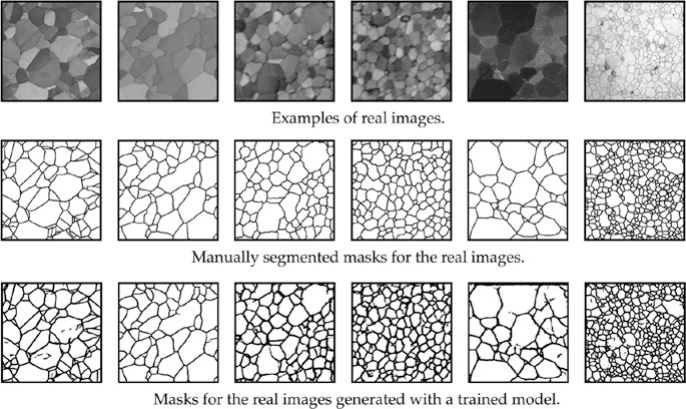
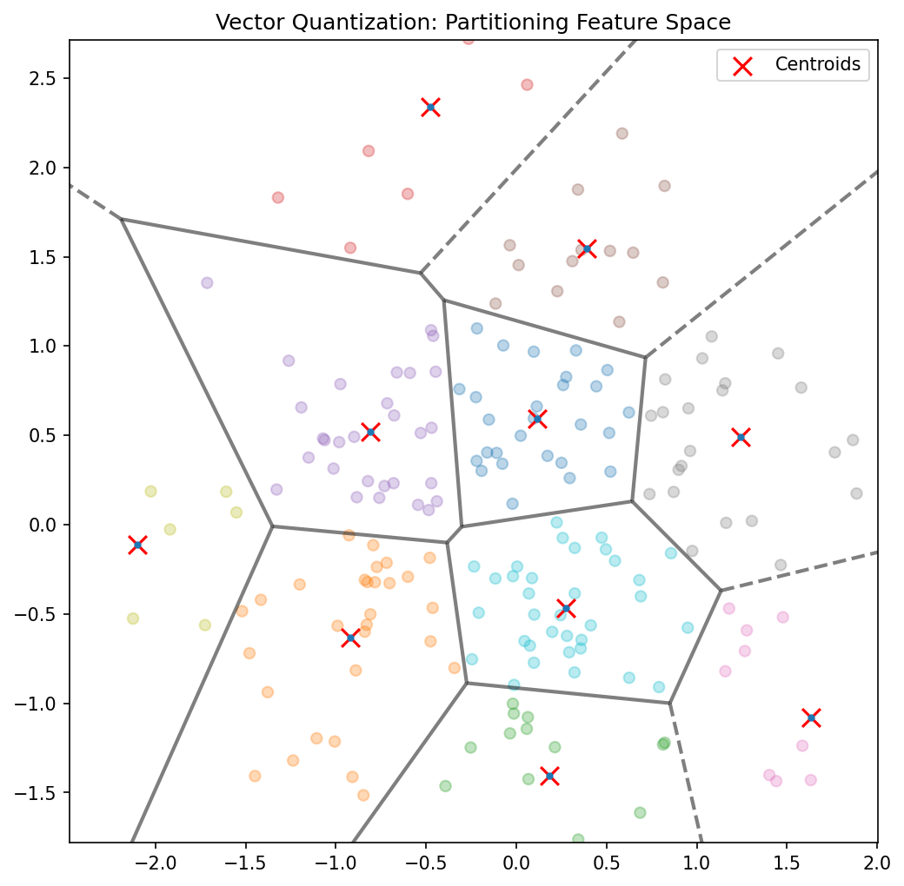

## Title + Unit 11 positioning

::: {.incremental}
- Units 9–10 explored learned representations and latent spaces.
- Unit 11: **discovering structure in data without labels** — the unsupervised paradigm.
- Core algorithms: K-Means clustering, Gaussian Mixture Models, and the EM algorithm.
:::

## Learning outcomes for Unit 11

By the end of this lecture, students can:

::: {.incremental}
- state the K-Means objective and derive the assignment-update algorithm,
- formulate a GMM as a latent variable model,
- derive the E-step and M-step of EM for GMMs,
- explain why EM maximizes a lower bound on the log-likelihood.
:::

## Supervised vs unsupervised learning

::: {.columns}
::: {.column width="50%"}
### Supervised
::: {.incremental}
- Given input-output pairs $(\mathbf{x}_i, y_i)$
- Learn the mapping $f: X \to Y$
- Direct teacher signal (labels)
- Goal: prediction/regression
:::
:::

::: {.column width="50%"}
### Unsupervised
::: {.incremental}
- Given inputs $\mathbf{x}_i$ only
- Discover hidden structure
- No teacher signal
- Goal: pattern discovery
:::
:::
:::

::: {.incremental}
- Unsupervised learning is often a preprocessing step for supervised tasks.
:::

## Why unsupervised learning matters in engineering

::: {.incremental}
- **Labels are expensive**: destructive testing (tensile strength), expert annotation (micrographs).
- **Labels are unavailable**: real-time sensor streams, exploratory data analysis.
- **Labels are undefined**: the goal is to discover unknown groupings or regimes.
- Unsupervised methods extract value from the vast amounts of unlabeled data in engineering.
:::

## Types of unsupervised learning

::: {.incremental}
- **Clustering**: partition data into groups (K-Means, GMM).
- **Density estimation**: model the data distribution $p(\mathbf{x})$.
- **Dimensionality reduction**: PCA, autoencoders (Units 2, 9–10).
- **Generative models**: learn to generate new samples similar to the data.
- Today: focus on clustering and density estimation via mixture models.
:::

## Clustering: the core task

::: {.incremental}
- Partition $N$ data points into $K$ groups such that:
  - Within-group similarity is **high** (compact clusters).
  - Between-group similarity is **low** (separated clusters).
- The number of clusters $K$ is typically a hyperparameter that must be chosen.
:::

## What defines a "good" cluster?

::: {.incremental}
- **Compact**: low within-cluster variance.
- **Separated**: high distance between cluster centers.
- **Interpretable**: clusters correspond to meaningful categories.
- Different clustering objectives can produce different partitions of the same data.
:::

## Roadmap of today's 90 min

::: {.incremental}
- **10–25 min**: K-Means algorithm — objective, convergence, initialization.
- **25–40 min**: From hard to soft — GMM as probabilistic clustering.
- **40–55 min**: EM algorithm — E-step, M-step, derivation.
- **55–70 min**: Lower bound maximization and convergence guarantee.
- **70–80 min**: Variants (K-Medoids, Bernoulli mixtures, model selection).
- **80–88 min**: Engineering applications.
:::

## K-Means objective

- Minimize the total **within-cluster sum of squared distances** (distortion):

$$
J = \sum_{k=1}^{K} \sum_{i \in C_k} \|\mathbf{x}_i - \boldsymbol{\mu}_k\|^2
$$

::: {.incremental}
- $C_k$: set of points assigned to cluster $k$. $\boldsymbol{\mu}_k$: centroid of cluster $k$.
- This is an NP-hard optimization problem — K-Means finds a local minimum [@neuer2024machine].
:::

## K-Means algorithm: two alternating steps

::: {.incremental}
1. **Assignment step**: assign each point to the nearest centroid:
$$
c_i = \arg\min_k \|\mathbf{x}_i - \boldsymbol{\mu}_k\|^2
$$

2. **Update step**: recompute centroids as the mean of assigned points:
$$
\boldsymbol{\mu}_k = \frac{1}{|C_k|}\sum_{i \in C_k} \mathbf{x}_i
$$
:::

```{mermaid}
%%| fig-align: center
graph TD
    A[Initialize Centroids] --> B[Assign Points to Nearest Centroid]
    B --> C[Update Centroids to Mean of Assigned Points]
    C --> D{Convergence?}
    D -- No --> B
    D -- Yes --> E[Final Clusters]
```

::: {.incremental}
- Repeat until assignments stop changing.
:::

## K-Means as coordinate descent

::: {.incremental}
- The assignment step minimizes $J$ with respect to cluster assignments (centroids fixed).
- The update step minimizes $J$ with respect to centroids (assignments fixed).
- Each step reduces or maintains $J$ — this is **coordinate descent** on the distortion cost.
- Since $J$ is bounded below (by 0) and decreases monotonically, convergence is guaranteed.
:::

## K-Means convergence

::: {.incremental}
- $J$ decreases (or stays constant) at every step.
- There are finitely many possible assignments → algorithm must terminate.
- Convergence is to a **local minimum** — the result depends on initialization.
- Typical convergence: 10–50 iterations for moderate datasets [@mcclarren2021machine].
:::

## K-Means: initialization matters

::: {.incremental}
- Random initialization can lead to poor local minima.
- **K-Means++**: choose first centroid randomly, then each subsequent centroid with probability proportional to squared distance from nearest existing centroid.
- Spreads initial centroids → much better results on average.
- **Multiple restarts**: run K-Means several times, keep the result with lowest $J$.
:::

## K-Means: choosing K

::: {.incremental}
- **Elbow method**: plot $J$ vs $K$. Look for the "elbow" where adding clusters gives diminishing returns.
- **Silhouette score**: for each point, compare within-cluster distance to nearest-neighbor-cluster distance. Average across all points.
- **Domain knowledge**: sometimes $K$ is known (e.g., number of material phases).
- No universally best method — combine quantitative and qualitative assessment.
:::

## K-Means: limitations

::: {.incremental}
- Assumes **spherical** clusters of roughly equal size and density.
- **Hard assignments**: each point belongs to exactly one cluster — no uncertainty.
- Sensitive to outliers (centroids pulled toward outliers).
- Cannot represent clusters with different shapes or orientations.
- These limitations motivate probabilistic clustering with GMMs.
:::

## K-Means: worked example

::: {.incremental}
- 2D data with 3 Gaussian blobs (well-separated).
- **Initialize**: place 3 centroids (K-Means++).
- **Iteration 1**: assign points → update centroids.
- **Iteration 5**: centroids stabilize at cluster centers. Assignments are correct.
- Total distortion $J$ decreases from ~150 to ~45 over 5 iterations.
:::

## K-Medoids: robust variant

::: {.incremental}
- Instead of centroids (means), use actual data points as cluster representatives (**medoids**).
- Objective: minimize sum of distances (not necessarily squared) to nearest medoid.
- **Robust to outliers**: the medoid is a real data point, not pulled by extreme values.
- More expensive: $O(N^2)$ per iteration vs $O(NK)$ for K-Means.
:::

## Checkpoint: K-Means failure mode

- **Question**: K-Means splits a single elongated cluster into two halves. Why?
- **Answer**: K-Means assumes spherical clusters. An elongated cluster has high variance along one axis — two spherical clusters fit it better under the K-Means objective.
- **Fix**: use GMM with full covariance matrices.

## From hard to soft clustering

::: {.columns}
::: {.column width="50%"}
### Hard Clustering (K-Means)
- Each point belongs to **exactly one** cluster.
- Membership is binary: $\{0, 1\}$.
- No representation of uncertainty.
:::

::: {.column width="50%"}
### Soft Clustering (GMM)
- Each point has a **probability** of belonging to each cluster.
- Membership is continuous: $[0, 1]$.
- Naturally handles overlap and uncertainty.
:::
:::

- Gaussian Mixture Models provide this probabilistic framework.

## Gaussian Mixture Model: definition

$$
p(\mathbf{x}) = \sum_{k=1}^{K} \pi_k \, \mathcal{N}(\mathbf{x} | \boldsymbol{\mu}_k, \boldsymbol{\Sigma}_k)
$$

- $\boldsymbol{\pi}$: mixing coefficients (prior probability of cluster $k$, $\sum_k \pi_k = 1$).
- $\boldsymbol{\mu}_k$: mean of component $k$.
- $\boldsymbol{\Sigma}_k$: covariance of component $k$ — allows elliptical clusters [@murphy2012machine].

## GMM as a latent variable model

- Introduce a **latent indicator** $z_i \in \{1, \dots, K\}$ for each data point:
  - $p(z_i = k) = \pi_k$ (prior on cluster membership).
  - $p(\mathbf{x}_i | z_i = k) = \mathcal{N}(\mathbf{x}_i | \boldsymbol{\mu}_k, \boldsymbol{\Sigma}_k)$.
- Marginalizing over $z$ recovers the mixture: $p(\mathbf{x}_i) = \sum_k \pi_k \mathcal{N}(\mathbf{x}_i | \boldsymbol{\mu}_k, \boldsymbol{\Sigma}_k)$.

## Responsibilities: soft assignments

- The **responsibility** of cluster $k$ for point $i$ is the posterior:

$$
r_{ik} = p(z_i = k | \mathbf{x}_i) = \frac{\pi_k \, \mathcal{N}(\mathbf{x}_i | \boldsymbol{\mu}_k, \boldsymbol{\Sigma}_k)}{\sum_j \pi_j \, \mathcal{N}(\mathbf{x}_i | \boldsymbol{\mu}_j, \boldsymbol{\Sigma}_j)}
$$

- $r_{ik} \in [0, 1]$ and $\sum_k r_{ik} = 1$ for each point $i$.
- Responsibilities are the **soft** analogue of K-Means hard assignments.

## The log-likelihood for GMMs

$$
\ell(\theta) = \sum_{i=1}^{N} \log \left[ \sum_{k=1}^{K} \pi_k \, \mathcal{N}(\mathbf{x}_i | \boldsymbol{\mu}_k, \boldsymbol{\Sigma}_k) \right]
$$

- The **sum inside the log** makes direct optimization intractable.
- Setting derivatives to zero does not yield closed-form solutions.
- This motivates the EM algorithm as an iterative approach.

## Why MLE is hard for mixtures

- The log of a sum cannot be decomposed into a sum of logs.
- The parameters $\boldsymbol{\mu}_k, \boldsymbol{\Sigma}_k, \boldsymbol{\pi}$ are **coupled** through the responsibilities.
- Direct gradient-based optimization is possible but EM is more elegant and interpretable.
- EM decomposes the problem into tractable sub-problems.

## The EM algorithm: overview

- **Expectation-Maximization** (Dempster, Laird & Rubin, 1977).
- A general algorithm for MLE in latent variable models.
- Two alternating steps:
  1. **E-step**: compute expected values of latent variables (responsibilities).
  2. **M-step**: maximize expected complete-data log-likelihood.

## E-step: compute responsibilities

- Given current parameters $\theta^{(t)} = \{\boldsymbol{\mu}_k, \boldsymbol{\Sigma}_k, \boldsymbol{\pi}^{(t)}\}$:

::: {.fragment}
$$
r_{ik}^{(t)} = \frac{\pi_k^{(t)} \, \mathcal{N}(\mathbf{x}_i | \boldsymbol{\mu}_k^{(t)}, \boldsymbol{\Sigma}_k^{(t)})}{\sum_j \pi_j^{(t)} \, \mathcal{N}(\mathbf{x}_i | \boldsymbol{\mu}_j^{(t)}, \boldsymbol{\Sigma}_j^{(t)})}
$$
:::

::: {.fragment}
- "Given the current model, how much does cluster $k$ explain point $i$?"
:::

## M-step: update parameters

- Given responsibilities $r_{ik}^{(t)}$, update parameters:

::: {.fragment}
$$
N_k = \sum_{i=1}^{N} r_{ik}, \quad \boldsymbol{\mu}_k = \frac{1}{N_k}\sum_{i=1}^{N} r_{ik} \mathbf{x}_i
$$
:::

::: {.fragment}
$$
\boldsymbol{\Sigma}_k = \frac{1}{N_k}\sum_{i=1}^{N} r_{ik} (\mathbf{x}_i - \boldsymbol{\mu}_k)(\mathbf{x}_i - \boldsymbol{\mu}_k)^\top, \quad \pi_k = \frac{N_k}{N}
$$
:::

::: {.fragment}
- These are **weighted** versions of the sample statistics [@murphy2012machine].
:::

## EM algorithm: pseudocode

1. **Initialize**: set $\boldsymbol{\mu}_k, \boldsymbol{\Sigma}_k, \boldsymbol{\pi}$ (e.g., from K-Means).
2. **Repeat until convergence**:
   - **E-step**: compute responsibilities $r_{ik}$ for all $i, k$.
   - **M-step**: update $\boldsymbol{\mu}_k, \boldsymbol{\Sigma}_k, \boldsymbol{\pi}$ using weighted statistics.
   - Compute log-likelihood $\ell(\theta)$.
3. **Stop** when $\ell(\theta)$ changes by less than a threshold $\epsilon$.

## EM convergence

- **Theorem**: the log-likelihood $\ell(\theta^{(t)})$ is non-decreasing: $\ell(\theta^{(t+1)}) \geq \ell(\theta^{(t)})$.
- Convergence to a **local maximum** is guaranteed (not necessarily global).
- Rate of convergence depends on the "overlap" between components.
- Multiple restarts help find better local maxima.

## The lower bound perspective

- EM can be understood as **maximizing a lower bound** on $\ell(\theta)$.
- For any distribution $q(z)$ over latent variables:

$$
\ell(\theta) \geq \sum_i \sum_k q(z_i = k) \log \frac{p(\mathbf{x}_i, z_i = k | \theta)}{q(z_i = k)}
$$

- **E-step**: choose $q = p(z|\mathbf{x}, \theta)$ to **tighten** the bound.
- **M-step**: maximize the bound w.r.t. $\theta$ [@bishop2006pattern].

## Jensen's inequality and the auxiliary function

- **Jensen's inequality**: $\log \mathbb{E}[X] \geq \mathbb{E}[\log X]$ for concave $\log$.
- The **auxiliary function** $Q(\theta | \theta^{(t)}) = \mathbb{E}_{z|\mathbf{x},\theta^{(t)}}[\log p(\mathbf{x}, z | \theta)]$.
- M-step: $\theta^{(t+1)} = \arg\max_\theta Q(\theta | \theta^{(t)})$.
- This guarantees $\ell(\theta^{(t+1)}) \geq \ell(\theta^{(t)})$.

## K-Means as a special case of EM

- Set all $\boldsymbol{\Sigma}_k = \sigma^2 \mathbf{I}$ (isotropic, equal covariance).
- As $\sigma \to 0$: responsibilities become **hard** ($r_{ik} \to 0$ or $1$).
- E-step becomes the assignment step; M-step becomes the centroid update.
- K-Means is EM for a GMM with isotropic covariances in the zero-temperature limit.

## GMM: worked example

- 2D data from 2 overlapping Gaussians (different means and covariances).
- **Initialize** from K-Means.
- **E-step**: points near boundaries get $r_{ik} \approx 0.5$ (uncertain assignment).
- **M-step**: update means, covariances, mixing coefficients.
- After 10 iterations: log-likelihood converges; elliptical clusters correctly identified.

## Checkpoint: EM understanding

- **Question**: After the E-step, what do the responsibilities tell you?
- **Answer**: The posterior probability of each cluster $k$ given each data point $\mathbf{x}_i$, under the current model parameters. They quantify how much each cluster "explains" each point.

## Bernoulli mixture models

- For **binary data** (e.g., presence/absence of features):
  - Replace Gaussian with Bernoulli likelihood: $p(\mathbf{x} | z = k) = \prod_j \mu_{kj}^{x_j}(1-\mu_{kj})^{1-x_j}$.
- EM updates: $\mu_{kj} = \frac{\sum_i r_{ik} x_{ij}}{N_k}$ (weighted mean of binary features per cluster).
- Application: document clustering, genetic data analysis.

## Model selection: choosing K

- **BIC** (Bayesian Information Criterion):

$$
\text{BIC} = \ell(\hat{\theta}) - \frac{K_{\text{params}}}{2}\log N
$$

- **AIC** (Akaike Information Criterion):

$$
\text{AIC} = \ell(\hat{\theta}) - K_{\text{params}}
$$

- Select $K$ that maximizes BIC (or minimizes −BIC). Lower penalty = more components allowed.

## BIC vs AIC

- BIC: stronger penalty for complexity ($\log N / 2$ per parameter). Preferred for large $N$.
- AIC: weaker penalty (1 per parameter). More permissive — tends to select larger $K$.
- BIC is consistent (selects true $K$ as $N \to \infty$). AIC is not.
- In practice: compare both and use domain knowledge to adjudicate.

## Initialization strategies for EM

- **Random**: fast but unreliable — can converge to poor local maxima.
- **K-Means**: run K-Means first, use resulting centroids as initial means. Most common.
- **Multiple restarts**: run EM several times with different initializations, keep best log-likelihood.
- Good initialization is critical for EM convergence quality.

## Singular covariance matrices

- If a cluster collapses to a single point, $\boldsymbol{\Sigma}_k$ becomes **singular** (determinant = 0).
- The likelihood goes to infinity — a pathological solution.
- **Fix**: add a small diagonal regularization $\boldsymbol{\Sigma}_k + \epsilon \mathbf{I}$.
- Alternative: constrain covariance matrices to be diagonal or shared across clusters.

## Checkpoint: model selection

- **Question**: BIC selects $K=3$ but you know there are 5 distinct groups. What might be wrong?
- **Answer**: The groups may significantly overlap, making them statistically indistinguishable. BIC prefers parsimony — 3 components may fit the data nearly as well as 5.

## Application: image segmentation

::: {.columns}
::: {.column width="60%"}
- Model pixel colors (RGB) as a GMM with $K$ components.
- Each component corresponds to a material or region (background, grain, defect).
- Segment the image by assigning each pixel to its most probable cluster.
- Soft assignments provide uncertainty at boundaries.
:::

::: {.column width="40%"}
{width=100%}
:::
:::

## Application: vector quantization

::: {.columns}
::: {.column width="60%"}
- Replace each data point with its nearest centroid from a learned **codebook**.
- Used for signal compression: store cluster index instead of full data.
- Materials application: fingerprint alloy microstructures by their cluster assignments.
- Compression ratio = $\log_2(\text{codebook size})$ bits per data point.
:::

::: {.column width="40%"}
{width=100%}
:::
:::

## Application: regime identification in manufacturing

::: {.columns}
::: {.column width="60%"}
- Cluster sensor data over time; each cluster represents an **operating regime**.
- Transitions between clusters indicate regime changes (startup, steady state, degradation).
- Real-time clustering enables automated process monitoring and control.
:::

::: {.column width="40%"}

:::
:::

## Application: anomaly detection via density

- Fit a GMM to normal operating data.
- For a new observation, compute $p(\mathbf{x}_{\text{new}})$ under the GMM.
- Low density $\to$ anomaly.
- This provides a principled, probabilistic anomaly score (unlike ad-hoc thresholds).

## Clustering vs autoencoder embeddings

- Clustering operates in the **original** data space — affected by curse of dimensionality.
- Autoencoders provide a **learned latent space** where clustering may work better.
- **Best of both**: train autoencoder (Unit 9), then cluster in latent space.
- The latent space concentrates relevant variation, making cluster separation clearer.

## Materials example: alloy phase identification

- Input: X-ray diffraction (XRD) patterns from unknown alloy samples.
- GMM clustering identifies distinct peak patterns → crystallographic phases.
- No prior labeling needed — the algorithm discovers phases from data.
- Responsibilities indicate mixed-phase samples (points between clusters).

## Lecture-essential vs exercise content split

- **Lecture**: K-Means objective, GMM formulation, EM derivation, lower bound, model selection.
- **Exercise**: K-Means from scratch, EM for 2-component GMM, log-likelihood tracking, hard vs soft comparison.

## Exercise setup summary

- Implement K-Means in NumPy on 2D synthetic Gaussian clusters.
- Implement EM for a 2-component GMM: responsibilities, parameter updates, log-likelihood.
- Compare K-Means hard assignments vs GMM soft assignments on overlapping clusters.
- Bonus: cluster autoencoder embeddings from Unit 10 and compare.

## Exam-aligned summary: 10 must-know statements

1. K-Means minimizes within-cluster sum of squared distances.
2. K-Means alternates between assignment and update steps (coordinate descent).
3. A GMM models data as a weighted sum of Gaussian components.
4. Responsibilities are posterior probabilities of cluster membership.
5. The E-step computes responsibilities; the M-step updates parameters.
6. EM monotonically increases the log-likelihood (convergence to local max).
7. EM maximizes a lower bound on the observed-data log-likelihood.
8. K-Means is a limiting case of EM with isotropic covariances and hard assignments.
9. BIC/AIC balance model fit against complexity for choosing $K$.
10. GMM-based density estimation enables principled anomaly detection.

## References + reading assignment for next unit

- **Required reading before Unit 12:**
  - Murphy: Ch. 11.1–11.5
  - Neuer: Ch. 5.3
- **Optional depth:**
  - McClarren: Ch. 4.3 (K-Means)
  - Bishop: Ch. 9.2–9.4 (GMM and EM)
- Next unit: **Uncertainty in Predictions** — Bayesian predictive distributions and Gaussian Processes.

::: {#refs}
:::

## Example Notebook

::: {.callout-note icon=false}
## Week 11: Unsupervised Clustering — NanoindentationDataset
[Open rendered notebook →](https://eclipse-lab.github.io/Ai4MatLectures/notebooks/MFML/week11_clustering_nanoindentation.html)  
[](https://colab.research.google.com/github/ECLIPSE-Lab/Ai4MatLectures/blob/main/notebooks/MFML/week11_clustering_nanoindentation.ipynb)
:::
