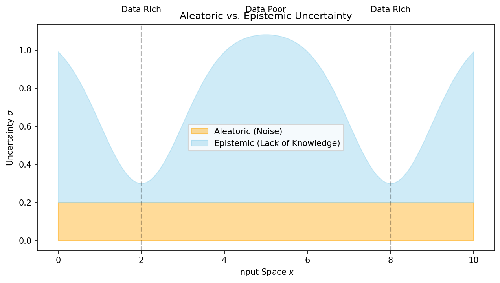
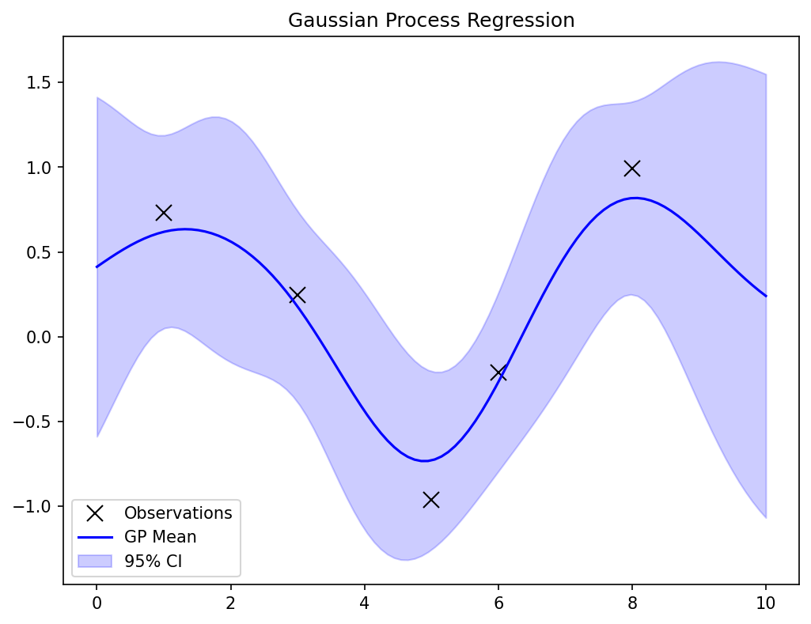

<!-- ===== §1. Framing ===== -->

## Title + Unit 12 positioning

:::: {.incremental}
- Unit 11 discovered structure in data. Unit 12 asks: **how confident are our predictions?**
- Single-point predictions are insufficient for engineering decisions.
- We need principled uncertainty quantification — from Bayesian inference to Gaussian Processes.
::::

::: {.notes}
- Open by naming the arc of the whole second half: Units 9–11 were about *representation* (latent spaces, attention, generative models) — squeezing structure out of data. This unit pivots from "what did the model learn" to "how much should we trust what it says." That reframing is the entire point; say it before any math.
- One-sentence stakes for a materials cohort: a regression model that says "yield strength = 450 MPa" is not a usable engineering object — a *decision* needs the bar around it. The number without the bar is the most dangerous artifact in applied ML.
- Plant the destination: by minute 85 they will have a method (a GP) that *honestly widens its error bars where it has no data*, and a wrapper (conformal, recalled from Unit 7) that gives a coverage guarantee even when the model is wrong. Tell them that payoff now so the Bayesian middle has a target.
- Timing contract: ~10 min framing, ~15 min Bayesian predictive + variance split, ~15 min evidence, ~20 min GPs, ~15 min practical UQ, ~10 min calibration + materials. The checkpoints are your pace-recovery valves.
:::

## Learning outcomes for Unit 12

By the end of this lecture, students can:

:::: {.incremental}
- derive the Bayesian predictive distribution and interpret the variance decomposition,
- describe the evidence framework and the concept of effective parameters,
- define a GP, derive its posterior, and interpret uncertainty bands,
- compare practical UQ methods: MC Dropout, ensembles, and MDNs.
::::

::: {.notes}
- Don't read the list — use it as a contract. Each bullet maps to one block of the lecture and to one of the "10 must-know statements" at the end; tell them that explicitly so they know the exam surface is fixed and visible.
- Flag the two outcomes students underestimate: (1) the variance decomposition — it is *the* conceptual spine of the unit and the most likely short-derivation exam question; (2) the GP posterior in closed form — they will be asked to write those two boxed formulas from memory.
- Calibrate rigor: we derive to the point of insight (the predictive integral, the GP conditioning result), not measure-theoretic completeness. This is a foundations-for-engineers course; the test is "can you put a defensible error bar on a prediction," not "can you prove a theorem."
:::

## Why point predictions are not enough

:::: {.incremental}
- A model predicting 450 MPa tensile strength is useless without knowing if the uncertainty is $\pm 5$ or $\pm 100$ MPa.
- In safety-critical applications, the **uncertainty** drives the decision, not the prediction.
- Overconfident models are more dangerous than inaccurate ones.
::::

::: {.notes}
- Land the third bullet hard — it is the moral of the unit. An inaccurate-but-honest model says "I don't know" and you go collect data; an overconfident model says "450 ± 3" when the truth is ±80 and you ship a part that fails. Wrong-and-loud beats wrong-and-quiet only for the person who isn't liable.
- Make the ±5 vs ±100 concrete: same point estimate, completely different engineering action — one passes a safety factor, the other forbids the design. The decision lives entirely in the bar, not the mean.
- Misconception to preempt: students equate "good model" with "low test error." Reframe — a model can have great average error and be catastrophically miscalibrated on the tail you actually care about. Average accuracy is necessary, not sufficient.
- Transition: "So we need predictions that are *distributions*, not points. The cleanest way to get there is to stop committing to a single parameter value — that is the Bayesian predictive distribution."
:::

## Recall: aleatory vs epistemic uncertainty (Unit 7)

:::: {.columns}
:::: {.column width="55%"}
:::: {.incremental}
- **Aleatory**: inherent noise in the data-generating process — irreducible.
- **Epistemic**: uncertainty from limited data or model capacity — reducible.
- A complete UQ framework must quantify and distinguish both types.
- As training data grows, epistemic uncertainty should shrink; aleatory uncertainty should not.
::::
::::

:::: {.column width="45%"}
{width=100%}
::::
::::

::: {.notes}
- This is a deliberate callback to Unit 7 — say "you have seen this," then make it operational rather than philosophical. The new content is the *shape* in the figure: aleatory is a flat noise floor; epistemic balloons where there is no data. That picture is the visual the entire GP section pays off.
- The examinable test of understanding: "you collect 10× more data — which band shrinks?" Only epistemic. Students who can't answer this instantly are not ready for the variance decomposition two slides on; ask it aloud as a temperature check.
- Materials anchor: aleatory = grain-to-grain scatter in a hardness measurement, irreducible at the modeling scale. Epistemic = you have tested only 3 compositions and are predicting a 4th — that shrinks the moment you synthesize it.
- Forward link: "Keep this picture. In 20 minutes the GP will reproduce *exactly* this figure with no hand-tuning — narrow on data, wide off it. That is why GPs are the reference method for honest UQ."
:::


<!-- ===== §2. The Bayesian predictive distribution ===== -->

## The Bayesian predictive distribution

:::: {.columns}
:::: {.column width="55%"}
:::: {.incremental}
- Instead of predicting with a single $\hat{\theta}$, integrate over all plausible $\theta$:
::::

$$
p(\mathbf{y}^* | \mathbf{x}^*, \mathcal{D}) = \int p(\mathbf{y}^* | \mathbf{x}^*, \theta) \, p(\theta | \mathcal{D}) \, d\theta
$$

:::: {.incremental}
- This accounts for **parameter uncertainty** — the full posterior contributes to the prediction.
- The result is a **distribution** over predictions, not a single point.
- As data increases (1 → 2 → 20 obs.), the predictive band narrows.
::::
::::

:::: {.column width="45%"}
![Bayesian predictive distribution: pink band = $\pm 2\sigma$ credible interval, narrows as training data grows. [@bishop2006pattern, Fig. 3.8]](images/bayes_predictive_distribution.png){width=100%}
::::
::::

::: {.notes}
- Read the integral aloud as an English sentence: "for every parameter the data finds plausible, ask what it predicts, then average those predictions weighted by how plausible the parameter is." That sentence *is* the lecture; the symbols are bookkeeping.
- Contrast with the plug-in estimate they know: MLE/MAP picks one $\hat\theta$ and is blind to the fact that nearby $\theta$ explain the data almost as well. The integral keeps that disagreement and *propagates it into the prediction* — that is where the error bar comes from.
- Misconception to kill: this is not "averaging several models for accuracy" (ensembling) — it is the mathematically correct way to express not knowing $\theta$. The width is a feature, not noise to be smoothed away.
- Tie to the figure: the band narrowing from 1→2→20 observations is the epistemic term from the previous slide collapsing. Same story, now with an equation. Transition: "How much of that width is reducible? Decompose it."
:::

## Variance decomposition

$$
\text{Var}[\mathbf{y}^*] = \underbrace{\mathbb{E}_\theta[\sigma^2(\theta)]}_{\text{aleatory}} + \underbrace{\text{Var}_\theta[\boldsymbol{\mu}(\theta)]}_{\text{epistemic}}
$$

:::: {.incremental}
- **Aleatory** component: average noise variance across parameter values.
::::

:::: {.incremental}
- **Epistemic** component: how much the prediction mean varies across plausible parameters.
::::

:::: {.incremental}
- The epistemic term shrinks with more data; the aleatory term does not.
::::

::: {.notes}
- This is the conceptual keystone of the entire unit and the highest-probability derivation question on the exam. Spend real time. It is the law of total variance applied to predictions: "noise within each model" + "disagreement between models."
- Derive it in one line on the chalkboard if time allows: $\mathrm{Var}[y^*] = \mathbb{E}_\theta[\mathrm{Var}(y^*\mid\theta)] + \mathrm{Var}_\theta[\mathbb{E}(y^*\mid\theta)]$ — then name each piece. Students who see it fall out of total variance never forget it; students who memorize the boxed form forget it by the exam.
- The single most important sentence in the unit: "More data attacks only the second term." Say it, write it, and reuse the phrase verbatim at the GP slides and the active-learning slide so it becomes a refrain.
- Misconception: that a flexible enough model can drive total variance to zero. No — the first term is the irreducible Bayes floor from Unit 7/8. Honesty means reporting it, not pretending it away.
:::

## Point estimates vs full distributions

| Approach | Output | Uncertainty | Cost |
|----------|:------:|:-----------:|:----:|
| MLE/MAP | Single $\hat{\mathbf{y}}$ | None (or ad-hoc) | Low |
| Bayesian (exact) | Full $p(\mathbf{y}^*|\mathbf{x}^*,\mathcal{D})$ | Principled | High |
| Bayesian (approx.) | Approximate distribution | Approximate | Moderate |

::: {.notes}
- Use this table as the map for the rest of the lecture: every method we cover is one row. GPs are "Bayesian (exact)"; MC Dropout / VI are "Bayesian (approx.)"; ensembles and MDNs live just off this table as practical surrogates. Point at the row before each method block so students always know where they are.
- The honest framing of the cost column: "principled" and "cheap" are in tension all unit. The engineering skill is not knowing the most rigorous method — it is choosing the cheapest row that still gives a defensible bar for the decision at hand.
- Note the "(or ad-hoc)" on MLE: people *do* bolt error bars onto point estimates (bootstrap, a variance head). It can work, but it has no consistency guarantee — flag this so the conformal slide later lands as "the wrapper that fixes exactly this."
:::

## When uncertainty matters most

:::: {.incremental}
- **Safety-critical**: structural components, medical devices — failure consequences are severe.
- **Expensive experiments**: each new alloy costs $10K to synthesize — guide experiments with uncertainty.
- **Extrapolation**: new compositions, extreme conditions — the model is outside its training domain.
- **Active learning**: acquire data where uncertainty is highest for maximum information gain.
::::

::: {.notes}
- This slide answers the student's silent "why should I care" — make it concrete to their domain in every bullet, not abstract. The materials cohort lives in the second and third bullets daily: experiments are slow and expensive, and the interesting compositions are always extrapolative.
- The extrapolation bullet is the one to dwell on: a model is most confident-sounding exactly where it is most wrong — far from training data a plug-in NN extrapolates a smooth line with no warning. A good UQ method must *raise its hand* there. This is the criterion we judge every method against.
- The active-learning bullet is a forward hook to slides 44–45: "uncertainty isn't only for reporting — it tells you which experiment to run next." Plant it now, pay it off there.
- Transition: "These needs are real. The rest of the lecture is a toolbox to meet them — here is the map."
:::


<!-- ===== §3. Practical UQ: a taxonomy ===== -->

## Practical UQ: a taxonomy

:::: {.columns}
:::: {.column width="50%"}
:::: {.incremental}
- **Exact Bayesian**: Gaussian Processes — closed-form posterior, principled, but $O(N^3)$.
- **Approximate Bayesian**: MC Dropout, variational inference — scale to large data, approximate.
::::
::::

:::: {.column width="50%"}
:::: {.incremental}
- **Frequentist ensembles**: deep ensembles — no Bayesian formalism, practical uncertainty from disagreement.
- **Direct prediction**: MDNs — predict distribution parameters directly.
::::
::::
::::

::: {.notes}
- This is the skeleton students should be able to redraw on the exam from memory — four families, one representative each, the trade-off that defines each. Tell them to photograph this slide; everything after it is detail hung on these four hooks.
- The organizing axis is *how do you get the distribution*: integrate it exactly (GP), approximate the integral (MC Dropout/VI), get disagreement empirically (ensembles), or just have the network output the distribution's parameters (MDN). Say that axis out loud — it makes the taxonomy memorable instead of a list.
- Foreshadow honestly: "Three of these four give you a bar that is only valid *if the model is right*. We will add a fifth thing at the end — conformal — that wraps any of them and is valid even if it isn't."
:::

## Roadmap of today's 90 min

:::: {.incremental}
- **10–25 min**: Bayesian predictive distribution and variance decomposition.
- **25–40 min**: Evidence framework, marginal likelihood, effective parameters.
- **40–60 min**: Gaussian Processes — definition, posterior, uncertainty bands.
- **60–75 min**: Practical UQ — MC Dropout, ensembles, MDNs, stochastic enrichment.
- **75–85 min**: Calibration and engineering applications.
::::

::: {.notes}
- A 15-second slide — its job is pacing transparency, not content. Tell students which segment is the conceptual core (the GP block, 40–60) so they ration their attention; the evidence block is the most abstract and the safest to compress if you are running behind.
- Self-instruction: glance at the wall clock at the 25 and 60 marks. If behind at 60, the recoverable cuts are the "Other kernels" slide, one materials example, and the recalibration-methods detail — never the variance decomposition or the GP posterior.
:::

## The marginal likelihood (evidence)

$$
p(\mathcal{D} | \mathcal{M}) = \int p(\mathcal{D} | \theta, \mathcal{M}) \, p(\theta | \mathcal{M}) \, d\theta
$$

:::: {.incremental}
- Measures how well model $\mathcal{M}$ explains the data, averaging over all parameter values.
- Automatically balances **fit** (likelihood) and **complexity** (prior spread) [@murphy2012machine].
::::

::: {.notes}
- Frame the structural parallel explicitly: this is the *same integral* as the predictive distribution, but integrating the likelihood of the data instead of a new prediction. One machine — marginalize over $\theta$ — answers both "what do I predict" and "which model is best." Students who see that unity stop treating these as separate topics.
- The non-obvious idea worth slowing down on: a model that can fit *anything* spreads its prior probability thin over a huge data space, so it assigns *low* probability to the particular dataset you saw. Flexibility is paid for in the evidence. This is Occam's razor falling out of probability with no penalty term bolted on.
- Examinable phrase to dictate: "the evidence is the probability the model assigned to the data *before* seeing it, averaged over the prior." Get them to write that sentence; it is the whole next three slides.
:::

## Evidence as automatic Occam's razor

:::: {.columns}
:::: {.column width="55%"}
:::: {.incremental}
- **Simple model** $\mathcal{M}_1$: prior concentrated on few parameter values → high evidence if data is simple.
- **Complex model** $\mathcal{M}_3$: prior spread thinly over many parameters → lower evidence unless data demands complexity.
- **Just-right model** $\mathcal{M}_2$: highest evidence at observed $\mathcal{D}_0$.
- The evidence automatically penalizes unnecessary complexity — no need for explicit regularization.
::::
::::

:::: {.column width="45%"}
![Bayesian Occam's razor: $M_2$ (red) has the highest evidence at the observed data $D_0$. [@murphy2012machine, Fig. 5.6]](images/bayesian_occam_razor.png){width=100%}
::::
::::

::: {.notes}
- Drive the figure, not the bullets. Every distribution integrates to one along the data axis — so a model that "could explain many datasets" must be *flatter and lower* on the one you actually observed. That conservation-of-probability argument is the entire intuition; draw it with your hand on the screen.
- The punchline that surprises students: there is no $\lambda$, no penalty term, no held-out set. Complexity control is a *consequence* of normalization, not an ingredient you add. Contrast with the explicit regularizer from Unit 8 — same effect, derived rather than imposed.
- Honesty caveat to state: this is exact only if you can compute the integral, which you usually can't for deep nets — that is why we still cross-validate in practice. The evidence is the *principle*; the GP marginal likelihood later is the rare case where it is computable in closed form.
:::


<!-- ===== §4. Model comparison via evidence ===== -->

## Model comparison via evidence

:::: {.columns}
:::: {.column width="55%"}
:::: {.incremental}
- Bayes factor: $\frac{p(\mathcal{M}_1 | \mathcal{D})}{p(\mathcal{M}_2 | \mathcal{D})} = \frac{p(\mathcal{D} | \mathcal{M}_1)}{p(\mathcal{D} | \mathcal{M}_2)} \cdot \frac{p(\mathcal{M}_1)}{p(\mathcal{M}_2)}$.
- With equal model priors: the model with higher evidence is preferred.
- Unlike cross-validation, this uses **all** the data for both fitting and evaluation.
- Evidence selects $d{=}1$ (linear) over $d{=}2,3$ for small $N{=}5$; at $N{=}30$ it correctly selects $d{=}2$.
::::
::::

:::: {.column width="45%"}
![Polynomial regression ($d{=}1,2,3$) on $N{=}5$ points: dotted bands show $\pm\sigma$ predictive uncertainty. Bottom-right: posterior $p(M|D)$ — degree 1 wins at small $N$. [@murphy2012machine, Fig. 5.7]](images/bayesian_model_selection.png){width=100%}
::::
::::

::: {.notes}
- The data-efficiency point is the one to sell: cross-validation throws away a fold to estimate generalization; the evidence uses every point for both fitting and model scoring because it never needs a held-out set — the prior-averaging *is* the regularization. For a 50-sample alloy dataset that difference is decisive.
- Make the last bullet a story about adaptivity: with 5 points, "degree 1" is not the *true* model — it is the *appropriately humble* model. As data arrives the evidence promotes degree 2. The right complexity is a function of how much you know, and the evidence tracks that automatically.
- Caution to state plainly: Bayes factors are notoriously sensitive to the prior (unlike the posterior, which washes the prior out with data). Mention it so they don't over-trust a single number — and so empirical Bayes two slides on is motivated as "then choose the prior by the data too."
:::

## Effective number of parameters

$$
\gamma = \sum_i \frac{\lambda_i}{\lambda_i + \alpha}
$$

:::: {.incremental}
- $\lambda_i$: eigenvalues of the data precision matrix. $\alpha$: prior precision.
- $\gamma \leq$ total number of parameters. Often $\gamma \ll$ total parameters.
- Interpretation: only $\gamma$ parameters are effectively constrained by the data [@bishop2006pattern].
::::

::: {.notes}
- Read each term in the sum as a soft switch in $[0,1]$: a direction the data constrains strongly ($\lambda_i \gg \alpha$) contributes ≈1 — "one real parameter"; a direction the data barely touches ($\lambda_i \ll \alpha$) contributes ≈0 — "the prior is holding this one up, not the data." $\gamma$ just counts how many parameters the data is actually paying for.
- This dissolves a paradox students carry: a model can have a million weights and still not overfit if the data only pins down a few hundred effective directions. Parameter *count* is the wrong complexity measure; $\gamma$ is the right one. Forward link: this is the seed of the double-descent / over-parameterization story they'll meet later.
- Keep it conceptual — the eigen-decomposition derivation is exercise/optional-depth (Bishop 3.5). The examinable claim is the interpretation sentence, not the spectral algebra.
:::

## Empirical Bayes

:::: {.incremental}
- Instead of fixing hyperparameters (prior variance, noise level), **optimize** them by maximizing the evidence.
- $\hat{\alpha}, \hat{\sigma}^2 = \arg\max_{\alpha, \sigma^2} \log p(\mathcal{D} | \alpha, \sigma^2)$.
- This is a principled alternative to cross-validation for hyperparameter selection.
- Also called **type-II maximum likelihood**.
::::

::: {.notes}
- Name the level shift clearly: ordinary MLE fits parameters; empirical Bayes does MLE one floor up — it fits the *hyperparameters* by maximizing the evidence, with $\theta$ already integrated out. "Type-II ML" is just that one-sentence idea; the jargon hides how simple it is.
- This is the slide that makes GPs *practical*, so flag the forward link hard: "Remember this — in 20 minutes 'learn the GP length scale by maximizing the marginal likelihood' is literally this slide. The evidence section is not abstract; it is the GP's training algorithm."
- Honest caveat: empirical Bayes can over-fit the hyperparameters when data is scarce (you used the data to pick the prior). Usually mild, occasionally not — worth one sentence so they don't treat it as free.
:::

## Checkpoint: evidence interpretation

:::: {.incremental}
- **Question**: Model A has 100 parameters and log-evidence −500. Model B has 10 parameters and log-evidence −480. Which is preferred?
- **Answer**: Model B — higher evidence means it explains the data better relative to its complexity.
::::

::: {.notes}
- Run this as a genuine 30-second poll, not a rhetorical question — hands up for A, hands up for B, *then* reveal. The wrong answers are diagnostic and worth surfacing.
- Expect the trap answer "A, because more parameters fit better." That confuses likelihood with evidence — and it is exactly the misconception this whole block exists to correct. If a chunk of the room picks A, replay the Occam's-razor figure; do not move on until the parameter-count instinct is visibly broken.
- Reinforce the takeaway phrase: the evidence has *already* paid the complexity cost — a higher number is better, full stop, no separate penalty to apply. Then pivot: "Now we meet the one model where this entire evidence machinery is available in closed form — the Gaussian Process."
:::


<!-- ===== §5. What is a Gaussian Process? ===== -->

## What is a Gaussian Process?

:::: {.incremental}
- A **GP** is a distribution over functions: $f \sim \mathcal{GP}(m(\mathbf{x}), k(\mathbf{x}, \mathbf{x}'))$.
- Any finite collection of function values $[f(\mathbf{x}_1), \dots, f(\mathbf{x}_N)]$ is jointly Gaussian.
- The GP is fully specified by its **mean function** $m(\mathbf{x})$ and **kernel function** $k(\mathbf{x}, \mathbf{x}')$.
::::

```{mermaid}
%%| echo: false
%%| fig-align: center
graph LR
    A["GP Prior"] -- Kernel + Mean --> B{Condition on Data}
    B -- Training Data --> C["GP Posterior"]
    C -- Prediction --> D["Uncertainty Bands"]
```

::: {.notes}
- The conceptual leap, stated slowly: a Gaussian distribution is over *vectors*; a GP is over *functions*. The trick that makes that tractable is the second bullet — you never manipulate the infinite object, only its finite restriction at the inputs you care about, and that restriction is an ordinary multivariate Gaussian. Everything else is conditioning that Gaussian.
- Walk the mermaid arrows aloud as the lecture roadmap for the next eight slides: prior (mean + kernel) → condition on data → posterior → read off uncertainty bands. Tell them every GP slide is one box in this chain so they can place each piece.
- Anchor "distribution over functions" with the figure they will see at the prior slide: each draw is a whole curve, not a point. Promise it now: "in three slides you will see five random functions sampled from this thing — that is what the prior literally is."
:::

## GP as infinite-dimensional Gaussian

- A multivariate Gaussian is a distribution over **vectors**.
- A GP extends this to a distribution over **functions** (infinite-dimensional objects).
- The kernel function $k(\mathbf{x}, \mathbf{x}')$ plays the role of the covariance matrix.
- This is a Bayesian nonparametric model — complexity grows with data [@murphy2012machine].

::: {.notes}
- The sentence that makes it click: "index the Gaussian by a continuous input instead of an integer." A 3-vector Gaussian has a 3×3 covariance *matrix*; a GP has a covariance *function* $k(\mathbf{x},\mathbf{x}')$ that returns the entry for any pair of inputs, including ones you haven't picked yet. Same object, continuous index.
- Define "nonparametric" honestly so it isn't a buzzword: not *no* parameters — the effective capacity grows with the data because the model keeps all training points around. Contrast with a fixed-width NN whose capacity is frozen at design time. This is also the seed of the $O(N^3)$ cost later — flag that the same property that makes it flexible makes it expensive.
- Keep this slide short; it is the bridge between "what is a GP" and "so we must choose $m$ and $k$" — the next three slides.
:::

## Mean function m(x)

- $m(\mathbf{x}) = \mathbb{E}[f(\mathbf{x})]$: the expected function value at each input.
- Common choice: $m(\mathbf{x}) = 0$ (zero-mean prior).
- Can encode prior knowledge: $m(\mathbf{x}) = a\mathbf{x} + b$ for a linear trend.
- The mean function is updated to the posterior mean after observing data.

::: {.notes}
- Preempt the obvious worry: "zero mean? all my yield strengths are ≈400 MPa." Reassure — zero-mean is a statement about the *prior away from data*, and it is conventional to center/standardize targets first. Near data the posterior mean is driven entirely by the kernel and the observations, not by $m$.
- The one place a non-zero mean earns its keep: known physics or a known trend. If theory says the property grows linearly with temperature, put that in $m(\mathbf{x})$ and let the GP model only the residual. Forward hook to Unit 13 (physics-informed): "an informative mean function is the simplest way to inject domain knowledge — we revisit this next unit."
- This is the lowest-leverage of the three GP-specification slides; spend the time budget on the kernel, where the modeling decisions actually live.
:::

## Kernel (covariance) function k(x, x')

- $k(\mathbf{x}, \mathbf{x}') = \text{Cov}[f(\mathbf{x}), f(\mathbf{x}')]$: encodes the **correlation** between function values.
- The kernel determines the properties of sampled functions:
  - Smoothness, periodicity, length scale, amplitude.
- The kernel must be **positive semi-definite** (valid covariance matrix for any finite set of points).

::: {.notes}
- This is the heart of GP modeling — say so. Choosing a kernel is choosing your *prior beliefs about the function*: "nearby inputs give similar outputs" is the entire content of the RBF kernel, and that one assumption is what produces the honest uncertainty bands later. The kernel is where the science goes in.
- Build the core intuition in one sentence: $k$ large ⇒ the two function values are tied together ⇒ knowing one tells you a lot about the other; $k\to 0$ ⇒ they are independent ⇒ data here says nothing there. That is *exactly* why GP uncertainty grows away from data — the kernel decorrelates you from your observations. Plant this; it is the payoff at the uncertainty-band slide.
- The PSD requirement: state it as the rule, not the proof — it just means "for any set of inputs the resulting matrix must be a legal covariance matrix (no negative variances)." Why some functions are invalid kernels is exercise/optional depth.
:::


<!-- ===== §6. The RBF (squared exponential) kernel ===== -->

## The RBF (squared exponential) kernel

$$
k(\mathbf{x}, \mathbf{x}') = \sigma_f^2 \exp\!\left(-\frac{\|\mathbf{x} - \mathbf{x}'\|^2}{2\ell^2}\right)
$$

- **Length scale** $\ell$: controls how far apart inputs can be and still be correlated.
- **Signal variance** $\sigma_f^2$: controls the amplitude of function variation.
- Produces **infinitely differentiable** (very smooth) functions.

::: {.notes}
- Read the formula physically: correlation is 1 when $\mathbf{x}=\mathbf{x}'$ and decays smoothly to 0 as they separate, with $\ell$ setting "how far is far." Beyond a few $\ell$ apart, two points are effectively independent — *that distance is where the uncertainty band will balloon back to $\sigma_f$*. Connect the two parameters to the two visible features of any GP plot now so the length-scale slide is a callback.
- $\ell$ is the single most consequential knob in the unit and the most common exam target; $\sigma_f^2$ just rescales the vertical axis. Say which one to obsess over.
- Honest caveat: "infinitely differentiable" is mathematically elegant and often *too* smooth for real signals with kinks — which is the entire motivation for the Matérn kernel on the next slide. Set up that contrast deliberately rather than presenting RBF as default-and-done.
:::

## Other kernels

- **Matérn**: $k(\mathbf{x},\mathbf{x}') \propto$ Bessel function — adjustable smoothness via parameter $\nu$.
- **Periodic**: captures repeating patterns.
- **Linear**: $k(\mathbf{x},\mathbf{x}') = \sigma^2 \mathbf{x}^\top \mathbf{x}'$ — equivalent to Bayesian linear regression.
- **Composite**: sums and products of kernels combine properties (e.g., smooth + periodic).

::: {.notes}
- Don't catalogue — teach the meta-point: the kernel is a modeling language, and each entry here is a vocabulary word for a belief about the function. Matérn = "smooth but not infinitely so" (the realistic default for physical signals). Periodic = "I know there's a cycle." Linear-kernel GP = Bayesian linear regression, a unification worth one sentence: GPs *contain* the models they already know.
- The composite bullet has the leverage and the best demo line: "smooth long-term trend + seasonal cycle = RBF + Periodic" is the textbook Mauna Loa CO₂ model — *literally the dataset in the MC Dropout figure later*. Forward-link it so the course feels stitched together.
- This whole slide is the first thing to cut if you hit 60 minutes behind — decide now which Matérn-vs-RBF sentence survives the cut (the "real signals aren't infinitely smooth" one).
:::

## GP prior: sampling functions

:::: {.columns}
:::: {.column width="55%"}
- Before seeing data, sample functions from the prior: $f \sim \mathcal{GP}(0, k)$.
- With RBF kernel: smooth, random functions with length scale $\ell$ and amplitude $\sigma_f$.
- Different kernel parameters produce visually different function families.
- The prior encodes our **beliefs** about what functions are plausible.
::::

:::: {.column width="45%"}
![Sequential Bayesian learning: prior (row 1) → posterior after 1 obs. (row 2) → 2 obs. (row 3) → 20 obs. (row 4). Left: parameter space. Right: sample functions. [@bishop2006pattern, Fig. 3.7]](images/bayesian_sequential_learning.png){width=100%}
::::
::::

::: {.notes}
- This is the slide that makes "distribution over functions" finally tangible — slow down and let them look. Each curve on the right is *one sample* — one entire function drawn from the prior. The spread of the curves at a fixed $x$ *is* the prior uncertainty there. Trace one curve with your hand so they see it as a single draw, not a band.
- Walk the figure top to bottom as the GP story in one image: row 1 = pure prior, wild disagreement everywhere; each new observation collapses the bundle through that point while leaving the gaps free. By 20 observations the curves agree where data is and fan out where it isn't. This figure *is* "epistemic uncertainty shrinks with data" — call back to the recall slide and the variance decomposition explicitly.
- This is also the spine the next slide (posterior) and the band slide hang on — tell them "we just did conditioning visually; the next slide does it with the formula."
:::

## GP posterior: conditioning on data

:::: {.columns}
:::: {.column width="55%"}
- Observe $\mathcal{D} = \{(\mathbf{x}_i, y_i)\}_{i=1}^N$ with $y_i = f(\mathbf{x}_i) + \epsilon$, $\epsilon \sim \mathcal{N}(0, \sigma_n^2)$.
- The posterior $f | \mathcal{D}$ is also a GP with updated mean and covariance.
- The posterior **passes through** (or near) the training points.
- Away from data, the posterior reverts to the prior.
::::

:::: {.column width="45%"}
{width=100%}
::::
::::

::: {.notes}
- The structurally beautiful fact to emphasize: conditioning a GP on data gives *another GP*. The family is closed under observation — that is exactly why everything stays in closed form and why GPs are the "exact Bayesian" row of the taxonomy. No approximation enters here.
- "Passes through (or near)": the *near* is doing real work — it is the $\sigma_n^2$ noise term. With noisy observations the posterior mean should *not* interpolate every point exactly; forcing it through noisy data is overfitting. Tie $\sigma_n^2$ to the aleatory floor from the variance decomposition — same quantity, reappearing.
- "Reverts to the prior away from data" is the one-sentence summary of honest uncertainty and a verbatim callback to the recall figure. Pause on it, then transition: "Now the formulas that produce exactly this picture — and you will be asked to write them."
:::


<!-- ===== §7. GP posterior: closed-form formulas ===== -->

## GP posterior: closed-form formulas

::: {.fragment}
$$
\boldsymbol{\mu}^*(\mathbf{x}^*) = \mathbf{k}_*^\top (\mathbf{K} + \sigma_n^2 \mathbf{I})^{-1} \mathbf{y}
$$
:::

::: {.fragment}
$$
\sigma^{*2}(\mathbf{x}^*) = k(\mathbf{x}^*, \mathbf{x}^*) - \mathbf{k}_*^\top (\mathbf{K} + \sigma_n^2 \mathbf{I})^{-1} \mathbf{k}_*
$$
:::

- $\mathbf{K}$: kernel matrix $[k(\mathbf{x}_i, \mathbf{x}_j)]_{N \times N}$. $\mathbf{k}_*$: vector $[k(\mathbf{x}^*, \mathbf{x}_i)]$.
- The key operation is inverting $(\mathbf{K} + \sigma_n^2 \mathbf{I})$ — cost $O(N^3)$.

::: {.notes}
- These two boxes are the highest-yield memorization target in the unit — students will be asked to reproduce them. Reveal them one fragment at a time and *narrate the structure* rather than the symbols, because the structure is what's memorable.
- Mean, in words: "a weighted average of the training outputs $\mathbf{y}$, where the weights are how kernel-similar the query is to each training point." A test point near training data leans on it; far away, $\mathbf{k}_*\to 0$ and the mean returns to the prior mean (0). Show them the limit on the board.
- Variance, in words: "prior variance at the query *minus* what the data explains away." The subtracted term is non-negative — **observing data can only reduce variance, never increase it**, and crucially the reduction does not depend on $\mathbf{y}$, only on *where* you sampled. That last fact is the entire theoretical basis for active learning (slide 45) — flag it now.
- The $O(N^3)$ note is the seed of the cost slide; mention it lives in the matrix inverse so the limitation later is not a surprise.
:::

## GP posterior: interpretation

- **Mean** $\boldsymbol{\mu}^*(\mathbf{x}^*)$: best prediction — a weighted combination of training outputs.
- **Variance** $\sigma^{*2}(\mathbf{x}^*)$:
  - **Small** near training data (low epistemic uncertainty).
  - **Large** far from training data (high epistemic uncertainty).
  - Approaches prior variance $\sigma_f^2$ as distance from data grows.

::: {.notes}
- This slide is the plain-English decompression of the previous one — if the formulas felt abstract, this is where the room re-boards. Keep returning to "the variance only depends on *where* you have data, not on *what* the values were." Students consistently find this surprising and it is genuinely deep: a GP knows it is uncertain in a gap before it has seen a single label there.
- Connect the third sub-bullet straight back to the recall figure and the variance decomposition: "GP variance → $\sigma_f^2$ far from data" is literally the epistemic term not having been reduced. Same concept, third appearance — the repetition is intentional, name it as a refrain.
- One-line exam framing: the GP gives you the variance decomposition *for free and spatially resolved* — $\sigma_n^2$ is the aleatory floor everywhere, the subtracted term is the locally-reducible epistemic part.
:::

## GP uncertainty bands

:::: {.columns}
:::: {.column width="55%"}
- Plot $\boldsymbol{\mu}(\mathbf{x}) \pm 2\sigma(\mathbf{x})$: the **95% credible band**.
- Bands are **narrow** near observed data (confident predictions).
- Bands **widen** away from data (uncertain predictions).
- This is **honest** uncertainty — the GP admits what it does not know.
::::

:::: {.column width="45%"}
{width=100%}
::::
::::

::: {.notes}
- This is the emotional payoff of the entire GP block — let it land. Point at the figure: "*This* is the picture I promised you at the recall slide." The band you drew by hand as 'what good UQ should look like' is now produced automatically by the posterior-variance formula, with no tuning of the shape. Make the closing of that loop explicit.
- The word "honest" is the one to dwell on and contrast: a plug-in neural net draws a confident line straight through the data gap; the GP fans out and says "I don't know here." For a materials engineer deciding whether to trust an extrapolated composition, that fan-out is the most valuable output the model produces — more than the mean.
- Numeric caveat worth one sentence: ±2σ ≈ 95% holds *because* the posterior is Gaussian. When we leave GPs for NNs (next block) that clean mapping breaks — which is precisely why we will need calibration and conformal. Plant the motivation here.
:::

## GP hyperparameter learning

:::: {.columns}
:::: {.column width="55%"}
- Optimize kernel hyperparameters $\ell, \sigma_f, \sigma_n$ by maximizing the **log marginal likelihood**:

$$
\log p(\mathbf{y} | \mathbf{X}) = -\frac{1}{2}\mathbf{y}^\top(\mathbf{K} + \sigma_n^2 \mathbf{I})^{-1}\mathbf{y} - \frac{1}{2}\log|\mathbf{K} + \sigma_n^2 \mathbf{I}| - \frac{N}{2}\log 2\pi
$$

- Three terms: data fit, complexity penalty, normalization.
- Gradient-based optimization (L-BFGS is common).
::::

:::: {.column width="45%"}
![Log marginal likelihood surface (a) and the two GP fits at local optima: wiggly short-$\ell$ fit (b) vs smooth long-$\ell$ fit (c). [@murphy2012machine, Fig. 15.5]](images/gp_marginal_likelihood.png){width=100%}
::::
::::

::: {.notes}
- Cash the promissory note from the empirical-Bayes slide: "I told you the evidence section was the GP's training algorithm — here it is." Walk the three terms and name the Occam tension explicitly: first term rewards fitting $\mathbf{y}$, second term ($\log|\mathbf{K}+\sigma_n^2 I|$) penalizes an over-flexible (short-$\ell$) kernel, third is a constant. The kernel is chosen by the same automatic-razor argument from the Occam slide — same machine, now differentiable.
- The figure carries a sober warning: the marginal-likelihood surface is *multimodal*. The wiggly short-$\ell$ fit and the smooth long-$\ell$ fit are *both local optima* — different random restarts give different GPs. Say plainly: GP training is not the convex free lunch it's sometimes sold as; restart and sanity-check the length scale against domain knowledge.
- Examinable contrast to state: this replaces cross-validation for hyperparameters — one differentiable objective, all the data, no folds. That data efficiency is the practical reason GPs win on small materials datasets.
:::


<!-- ===== §8. Length scale effect ===== -->

## Length scale effect

:::: {.columns}
:::: {.column width="55%"}
- **Short** $\ell$: wiggly functions, fits local patterns (and possibly noise).
- **Long** $\ell$: smooth functions, captures global trends (may miss local structure).
- **Optimal** $\ell$: balances data fit and smoothness — determined by marginal likelihood.
- Same 20 noisy training points; three different $\ell$ choices give very different posteriors.
::::

:::: {.column width="45%"}
![GP posteriors for the same data with (a) optimal $\ell{=}1$, (b) short $\ell{=}0.3$ (wiggly, fast uncertainty growth), (c) long $\ell{=}3$ (smooth). [@murphy2012machine, Fig. 15.3]](images/gp_length_scale_effect.png){width=100%}
::::
::::

::: {.notes}
- This is the bias–variance trade-off from Unit 8 wearing a GP costume — say that out loud. Short $\ell$ = high variance (chases noise, uncertainty re-inflates between *every* point); long $\ell$ = high bias (smooths real structure away). Students who see it as the *same* trade-off, not a new one, retain it; make the cross-reference explicit.
- Drive the figure as the warning it is: identical data, three radically different stories. The implication for their exercise and thesis work: a GP's bands are only trustworthy *after* the length scale is fit by the marginal likelihood — a hand-set or badly-initialized $\ell$ produces confidently wrong uncertainty. This is the most common way people misuse GPs in practice.
- Subtle but examinable observation from panel (b): short $\ell$ doesn't just wiggle — its uncertainty shoots up *between* points because correlation dies off within the gap. The length scale controls the *bands*, not only the mean.
:::

## GP: computational cost

- Training: $O(N^3)$ for matrix inversion + $O(N^2)$ storage.
- Prediction: $O(N)$ per test point (after training).
- Practical limit: $N \approx 10^3 - 10^4$ for exact GPs.
- Approximations exist for larger datasets: sparse GPs, inducing points, random features.

::: {.notes}
- Be blunt about why this matters: this single slide is *the* reason GPs are not the universal default and why the rest of the lecture exists. The $O(N^3)$ comes straight from the matrix inverse in the posterior formula — point back to that box so the cost feels derived, not asserted.
- Reframe the limit as a feature for this audience: $N \approx 10^3$–$10^4$ is *exactly* the regime of expensive experimental materials datasets. GPs are not a weak method that fails at scale — they are the *right* method precisely where data is scarce and each point is costly. Pair this with the active-learning slide: small-data + uncertainty-guided acquisition is the GP's home turf.
- Mention sparse/inducing-point GPs by name only — "this is how you push to $10^5$+, it's a known engineering path" — but it is out of scope and the first thing to cut for time. Don't derive it.
:::

## GP: strengths and limitations

:::: {.columns}
:::: {.column width="50%"}
**Strengths**

- Principled uncertainty quantification
- Automatic complexity control (evidence)
- Interpretable hyperparameters
- Works well with small data
::::

:::: {.column width="50%"}
**Limitations**

- $O(N^3)$ training cost
- Kernel design requires domain knowledge
- Gaussian assumption may be limiting
- Scales poorly to high-dimensional inputs
::::
::::

::: {.notes}
- Use this as the honest scorecard that closes the GP block — don't oversell. Each strength has a matching weakness, and the engineering lesson is that this profile dictates *when* to reach for a GP, not whether GPs are "good."
- "Interpretable hyperparameters" is the underrated strength for this cohort: $\ell$ is a length in input units a metallurgist can sanity-check ("correlation over ~50 K of temperature — does that match physics?"). A deep net has no such inspectable knob. That interpretability is a real engineering asset, not a footnote.
- The honest weakness to dwell on is "kernel design requires domain knowledge" — there is no free lunch; the RBF default fails on signals with kinks or discontinuities. This sets up the pivot: "When data is large, high-dimensional, or you can't hand-design a kernel, you switch to neural approaches — and pay for it with approximate, not exact, uncertainty. That is the rest of the lecture."
:::

## Checkpoint: GP prediction

- **Question**: A GP is trained on 10 data points. You query a point very far from all training data. What happens to the uncertainty?
- **Answer**: The posterior variance grows toward the prior variance $\sigma_f^2$. The GP honestly reports high uncertainty in unexplored regions.

::: {.notes}
- Poll it: hands up before reveal. The single most common wrong answer is "the uncertainty stays small because it was trained well" — that is the plug-in-NN mental model leaking in, and catching it here is the whole point of the checkpoint.
- Push for the *mechanism*, not just the answer: as $\mathbf{x}^*$ moves away, $\mathbf{k}_* \to 0$, the subtracted term in the variance formula vanishes, and $\sigma^{*2} \to k(\mathbf{x}^*,\mathbf{x}^*) = \sigma_f^2$. Make them recite the formula's behavior, not just the slogan — that is the exam-grade answer.
- Close the GP block with the one-sentence thesis to carry forward: "A GP is the gold standard for honest uncertainty *because the variance formula forces it to admit ignorance away from data*. Every method we see next is a cheaper attempt to imitate this without the $O(N^3)$ bill."
:::


<!-- ===== §9. Mixture-Density Networks (MDNs) ===== -->

## Mixture-Density Networks (MDNs)

:::: {.columns}
:::: {.column width="55%"}
- A standard NN outputs a single $\hat{\mathbf{y}}$ (or $\hat{y}$). An MDN outputs parameters of a **mixture of Gaussians**:

$$
p(\mathbf{y}|\mathbf{x}) = \sum_{k=1}^{K} \pi_k(\mathbf{x}) \, \mathcal{N}(\mathbf{y} | \boldsymbol{\mu}_k(\mathbf{x}), \sigma_k^2(\mathbf{x}))
$$

- The network predicts mixing coefficients $\omega$, means $\mu$, and variances $\sigma$ — all functions of input $\mathbf{x}$ [@neuer2024machine].
::::

:::: {.column width="45%"}
![MDN architecture: the network outputs $\omega$, $\mu$, $\sigma$ that parameterize a mixture distribution over $y$. [@neuer2024machine, Fig. 6.10]](images/mdn_architecture.png){width=100%}
::::
::::

::: {.notes}
- Mark the change of philosophy explicitly: GP/MC-Dropout/ensembles *infer* a distribution; an MDN is just told to *output the parameters of one*. The network's last layer emits $(\pi,\mu,\sigma)$ instead of $\hat y$, and you train it by maximizing the mixture likelihood instead of minimizing MSE. This is the "Direct prediction" row of the taxonomy — point back to it.
- The "aha" that motivates the whole MDN idea: an ordinary regression NN can only ever say "the answer is around *one* value" because squared-error assumes a single Gaussian. Some inputs genuinely have *two* right answers — and a single-Gaussian model is forced to put its mean *in the empty valley between them*, the one place the truth never is. The next slide shows exactly that failure.
- Practical caveat to flag for the bonus exercise: MDN training is finicky (mode collapse, $\sigma\to 0$ blow-ups) — softplus on $\sigma$, enough components $K$. Mention it now so their bonus task isn't a surprise.
:::

## MDN: capturing multi-modal uncertainty

- Standard regression assumes **unimodal** output distribution.
- MDNs can represent **branching** predictions: "this composition could yield phase A or phase B."
- The number of mixture components $K$ is a design choice.
- Particularly useful for inverse problems with multiple solutions.

::: {.notes}
- Sell this with the materials story, because it is genuinely their problem: the same alloy composition, depending on cooling path, lands in phase A *or* phase B. A standard NN predicts the *average* of the two phase properties — a value that corresponds to *no physically realizable material*. The MDN reports "60% A, 40% B" with two separate means. That is not a nicer error bar; it is a categorically more correct answer.
- "Inverse problems with multiple solutions" is the deep reason and worth one sentence: many materials-design questions ("which composition gives this property?") are one-to-many by physics. Unimodal regression is structurally wrong for them; multimodality is mandatory, not optional.
- Honest limitation: $K$ is a hyperparameter you must guess, and the GP's automatic complexity control does *not* come along for free here. Contrast it explicitly — the MDN buys flexibility and gives up the principled model selection of the Bayesian section.
:::

## MC Dropout for uncertainty estimation


:::: {.incremental}
- Standard dropout: randomly zero neurons during **training**.
- MC Dropout: keep dropout active at **test time**.
- Run $T$ stochastic forward passes → $T$ predictions $\{\hat{y}_1, \dots, \hat{y}_T\}$.
- **Mean** = prediction. **Variance** across samples ≈ epistemic uncertainty.
::::


![MC Dropout predictive uncertainty on the Mauna Loa CO$_2$ dataset. Red = predictive mean; shaded = uncertainty band. Standard dropout (a) underestimates; MC Dropout with ReLU (c) grows uncertainty outside training range. [@gal2016dropout, Fig. 2]](images/image.png){width=100%}

::: {.notes}
- The hook that always lands: dropout was invented as *regularization* — Gal's insight is that *not turning it off at test time* turns it into an (approximate) Bayesian posterior sampler. Same code, one line changed (`model.train()` at inference), uncertainty for free. Students remember the "one-line change" framing.
- Connect the figure to the Mauna Loa kernel callback from the "Other kernels" slide — same trend+seasonal signal — and to the variance decomposition: the spread across the $T$ passes *is* an estimate of the epistemic term. Make panel (c) the focus: outside the training range the band grows, the honest behavior we demanded of every method.
- The honest caveat, stated before the next slide makes it precise: MC Dropout's bands are *approximate* and notoriously sensitive to the dropout rate — too low and it is overconfident (panel a). It is the cheap imitation of the GP, not an equal. This is exactly the kind of bar conformal will later be needed to certify.
:::


## MC Dropout: interpretation

:::: {.incremental}
- Each forward pass uses a different randomly thinned network.
- Equivalent to sampling from an **approximate posterior** over network architectures.
- Theoretical connection to variational inference [@gal2016dropout].
- Advantage: **zero additional training cost** — uncertainty is free at test time.
::::

::: {.notes}
- Give the one-sentence theory, no more: dropout-at-test is mathematically a variational approximation to a Bayesian neural network — the dropout mask is the variational distribution. State it as "there is a real proof here (Gal & Ghahramani 2016); the takeaway is that this hack is principled, not a trick." Depth of the VI derivation is out of scope — say so explicitly so nobody waits for it.
- The decisive engineering point is the last bullet: *zero extra training cost*. Versus a deep ensemble's $M\times$ training bill (next slide), MC Dropout's only cost is $T$ forward passes at inference. For a model already in production, it is the lowest-friction way to get *some* uncertainty. Frame the whole MC-Dropout / ensemble pair as a cost-vs-quality decision.
- Set up the comparison: "MC Dropout — cheap, approximate, sensitive to dropout rate. Next: deep ensembles — expensive, but the best-calibrated thing that actually scales."
:::


<!-- ===== §10. Deep ensembles ===== -->

## Deep ensembles


:::: {.incremental}
- Train $M$ independent networks (different random initializations, same architecture).
- Each network produces a prediction $\hat{y}_m$.
- **Mean**: $\bar{y} = \frac{1}{M}\sum_m \hat{y}_m$. **Variance**: $\frac{1}{M}\sum_m (\hat{y}_m - \bar{y})^2$.
- Empirically produces well-calibrated uncertainties. Cost: $M\times$ training [@lakshminarayanan2017simple].
::::


![Results on a toy regression task: x-axis denotes x. On the y-axis, the blue line is the ground
truth curve, the red dots are observed noisy training data points and the gray lines correspond to
the predicted mean along with three standard deviations. Left most plot corresponds to empirical
variance of 5 networks trained using MSE, second plot shows the effect of training using NLL using
a single net, third plot shows the additional effect of adversarial training, and final plot shows the
effect of using an ensemble of 5 networks respectively. [@lakshminarayanan2017simple, Fig. 1]](images/image2.png){width=100%}

::: {.notes}
- The honest headline: this is the embarrassingly simple method that, empirically, *wins* on calibration — often beating fancier Bayesian approximations. Tell students that plainly; it is a useful corrective to the assumption that more mathematical machinery means better uncertainty.
- The mechanism is the variance decomposition's epistemic term made literal: different random inits → different solutions in the non-convex loss landscape (callback to Unit 6) → they *agree near data and disagree in the gaps*. The variance across members IS the epistemic uncertainty. Walk the figure panels: the bare MSE ensemble already fans out off-data; NLL + adversarial training sharpens it — same honest behavior the GP gave us, from five `for`-loop trainings instead of a kernel.
- The cost is the whole story for deployment: $M\times$ training (typically $M{=}5$). Position it in the trade-off space — GP: exact but $O(N^3)$; ensemble: scalable and best-calibrated but $5\times$ compute; MC Dropout: cheapest but roughest. That triangle is the examinable summary.
:::


<!-- ===== §10b. Conformal prediction (already covered in Unit 7) ===== -->

## Conformal prediction --- already in your toolbox

:::: {.columns}
:::: {.column width="55%"}
**Recall from Unit 7.** Split conformal and CQR were introduced as the distribution-free coverage layer of the probabilistic toolbox.

:::: {.incremental}
- Pick miscoverage $\alpha$. For any exchangeable new $(X, Y)$, the conformal interval $C(X)$ satisfies $\Pr(Y \in C(X)) \geq 1 - \alpha$ — finite-sample, model-agnostic [@angelopoulos_2023_conformal].
- **Split conformal** (constant-width) is one calibration-set quantile away from any trained predictor.
- **Conformalized Quantile Regression** (adaptive width) wraps a pinball-loss quantile head with the same finite-sample guarantee [@romano_2019_cqr].
::::
::::

:::: {.column width="45%"}
**Why it shows up here.**

:::: {.incremental}
- This unit's UQ methods — GPs, MC Dropout, deep ensembles, MDN — all give intervals **conditional on a model being correct**.
- Conformal **wraps** any of those to inherit a frequentist marginal-coverage stamp, independent of model correctness.
- See **Unit 7** for the derivation, the 5-line Python recipe, and the exchangeability failure modes.
::::
::::
::::

::: {.fragment}
> In 2026 practice the default UQ stack for a regression NN is **quantile heads + CQR** on top of whatever this unit's method produced as a point estimate.
:::

::: {.notes}
- This block deliberately does not re-derive conformal: Unit 7 already owns it (so that ML-PC u07 / u08 / u11 can assume the audience knows split CP and CQR).
- The role of this slide in Unit 12 is purely the **composition** message: "any UQ method above + conformal wrapper = coverage guarantee on top of model-conditional uncertainty."
- Jackknife+ [@barber2021jackknife] is the leave-one-out version — uses all data for both fitting and calibration, slightly more efficient with similar guarantees. Mention by name only.
- Forward link: §13 PINNs can supply a physics-informed mean prediction; CQR wraps it with coverage. The two compose.
:::

## Stochastic enrichment

:::: {.columns}
:::: {.column width="55%"}
- Add noise to inputs during prediction: $\tilde{\mathbf{x}} = \mathbf{x} + \boldsymbol{\epsilon}$, $\boldsymbol{\epsilon} \sim \mathcal{N}(\mathbf{0}, \boldsymbol{\Sigma}_\epsilon)$.
- Run multiple predictions with different noise realizations.
- **High variance** across perturbed predictions = model is sensitive = high uncertainty.
- Matches real-world measurement noise propagation [@neuer2024machine].
::::

:::: {.column width="45%"}
![Stochastic enrichment: red error bars show prediction uncertainty from input perturbation; uncertainty grows in the high-$x$ region where the model is more sensitive. [@neuer2024machine, Fig. 6.11]](images/mdn_bimodal.png){width=100%}
::::
::::

::: {.notes}
- Distinguish it sharply from MC Dropout — students conflate them. MC Dropout perturbs the *model* (which network). Stochastic enrichment perturbs the *input* (which measurement). They answer different questions: "how unsure am I about the function" vs "how does my known sensor noise propagate to the output." Both are Monte Carlo over forward passes; the noise enters in a different place.
- Why this is the *materials-engineer's* uncertainty, per Neuer: the perturbation covariance $\boldsymbol\Sigma_\epsilon$ is not a tuning knob — it is your *measured instrument error bar*. This is honest error propagation through a learned model, the ML analogue of propagating measurement uncertainty in a lab. That physical grounding is its main selling point.
- Read the figure as sensitivity analysis: uncertainty balloons in the high-$x$ region because the *learned function is steep there*, so the same input jitter produces a bigger output swing. It surfaces where the model is fragile to measurement noise — complementary to, not a substitute for, epistemic methods.
:::

## Calibration: are uncertainties trustworthy?

:::: {.columns}
:::: {.column width="55%"}
:::: {.incremental}
- A model is **well-calibrated** if predicted $p$% confidence intervals contain $p$% of test points.
- **Calibration plot**: predicted confidence level vs observed coverage.
- Perfect calibration = diagonal line.
- **Overconfident**: intervals too narrow (common in NNs). **Underconfident**: intervals too wide.
- Modern deep NNs are systematically overconfident — confidence exceeds accuracy [@guo2017calibration].
::::
::::

:::: {.column width="45%"}
![Reliability diagrams for LeNet (left) and ResNet (right) on CIFAR-100. Blue bars = observed accuracy per confidence bin; gap (pink) shows overconfidence. [@guo2017calibration, Fig. 1]](images/calibration_reliability_diagram_fig1.png){width=100%}
::::
::::

::: {.notes}
- This slide is the auditor of the entire lecture — make that its job explicit. Every method so far *produces* an uncertainty number; this is the only tool that asks "is that number *true*?" An uncalibrated ±10 is a lie with a decimal point. A model can have great accuracy and worthless uncertainty.
- The Guo et al. result is the one to state forcefully because it overturns a default assumption: modern deep nets are *systematically overconfident*, and it got *worse* as networks got more accurate (LeNet → ResNet). Higher accuracy did not buy honesty — it bought louder wrongness. Connect straight to the "overconfident is the dangerous failure mode" moral from slide 3.
- Operational definition for the exam, dictate it: "well-calibrated ⇔ the 90% interval contains the truth 90% of the time, empirically, on held-out data." The reliability diagram is just that statement plotted; the pink gap is the overconfidence. This is also the empirical reason conformal exists — it *constructs* calibration by design rather than hoping for it.
:::

## Recalibration methods

- **Temperature scaling**: divide logits by a learned temperature $T$ before softmax.
- **Platt scaling**: fit a logistic regression on validation predictions.
- **Isotonic regression**: non-parametric calibration mapping.
- Applied **post-hoc** on a held-out calibration set — does not change the model.

::: {.notes}
- The reassuring engineering message: you do not retrain to fix calibration. These are cheap *post-hoc* patches fit on a small held-out set, and temperature scaling — a *single scalar* $T$ — fixes most of the overconfidence in the previous slide's figure. One number, one validation pass. Lead with that; it is the practical takeaway.
- Sharpen the contrast with conformal so the toolbox is coherent: recalibration *adjusts* the model's stated probabilities and works *on average* but carries no guarantee; conformal *constructs* an interval with a finite-sample coverage proof. Recalibration is "make the existing number more honest"; conformal is "wrap it in a number you can prove." Say which you'd reach for in a regulated setting (conformal).
- "Does not change the model" is the deployment selling point: certified weights stay frozen, calibration is a thin wrapper — exactly what a safety/QA process wants. One sentence, then move to the synthesis table.
:::


<!-- ===== §11. Comparison of UQ methods ===== -->

## Comparison of UQ methods

| Method | Type | Cost | Calibration | Scalability |
|--------|:----:|:----:|:-----------:|:-----------:|
| GP | Exact Bayesian | $O(N^3)$ | Excellent | Small $N$ |
| MC Dropout | Approx. Bayesian | $T \times$ inference | Good | Any |
| Deep ensemble | Frequentist | $M \times$ training | Very good | Any |
| MDN | Direct | 1× training | Requires tuning | Any |
| Conformal / CQR | Distribution-free wrapper | 1 calibration pass ($\sim 10^3$ pts) | **Guaranteed** (finite-sample, marginal) | Any (model-agnostic) |

- Only Conformal / CQR is **distribution-free** *and* **model-agnostic** — it wraps any row above to inherit a coverage guarantee [@angelopoulos_2023_conformal].

::: {.notes}
- This is the synthesis slide — the one to photograph and the one the exam tests. Don't read it; *use* it to rehearse the decision logic. Walk one column at a time and tie each cell back to the slide that earned it (GP's $O(N^3)$ to the cost slide, ensemble's $M\times$ to the ensemble slide, "good but rate-sensitive" to MC Dropout).
- The structural punchline, said explicitly: the first four rows are *alternatives* — pick one. The last row is *orthogonal* — it composes with any of them. "GP for the mean + conformal for the certified bar" is a valid, recommended stack; the rows are not all mutually exclusive. Make sure that distinction is unambiguous before the exam.
- The single most important word in the table is "Guaranteed," and it carries an asterisk you must voice: marginal coverage under exchangeability, *not* conditional, and it fails under distribution shift (callback to Unit 7's failure modes). A guarantee whose assumptions you can't state is not a guarantee — hold them to that.
:::

## Checkpoint: choosing a UQ method

- **Small dataset, need exact UQ**: Gaussian Process.
- **Large dataset, budget for training**: deep ensemble.
- **Large dataset, need cheap inference**: MC Dropout.
- **Multi-modal outputs**: Mixture-Density Network.
- **Need a coverage guarantee (regulated / safety-critical)**: wrap your favourite predictor with Conformal Prediction (CQR for adaptive widths).

::: {.notes}
- Run this as rapid-fire scenarios, not a slide to read: pose each situation as a one-liner ("50 tensile tests, need honest bars for a design review — go"), let the room answer, then reveal. This is the format their exam question will take, so rehearse the *reasoning*, not the memorized pairs.
- Push past the lookup answer to the *why*: "small data → GP" is right *because* GPs are data-efficient and exact and $N$ is small enough that $O(N^3)$ doesn't bite — all three conditions, recited. A student who says "GP" without the reason hasn't learned the unit.
- The decisive professional habit to leave them with: the last bullet is not mutually exclusive with the others. The mature answer to almost any safety-critical question is "*method X for the estimate, conformal on top for the certified guarantee.*" Composition, not selection. That sentence is the thesis of the whole second half of the unit.
:::

## Materials example: GP for composition-property mapping

:::: {.columns}
:::: {.column width="50%"}
- GP regression from alloy composition (5 features) to yield strength.
- 50 training samples from expensive tensile tests.
- GP provides uncertainty bands → compositions with high uncertainty are targets for next experiments.
- Active learning with GP uncertainty reduces required experiments by 40%.
::::

:::: {.column width="50%"}
{width=100%}
::::
::::

::: {.notes}
- This is where the abstract machinery becomes their job — present it as a real workflow, not an illustration. 50 samples, 5-dimensional composition space, each data point a destroyed specimen and a day in the lab. This is the exact $N$, $d$, and cost regime the GP cost slide said GPs *own* — close that loop explicitly.
- The "40% fewer experiments" number is the headline that should make a materials student sit up: the uncertainty band is not a report artifact, it is an *experiment-selection device* — and translating "I don't know here" into "so synthesize *here* next" is worth real money and months. Don't let it pass as a bullet; it is the practical thesis of the unit.
- Honest scope note: 5D is comfortable for a GP; remind them the high-dimensional weakness from the strengths/limitations slide is why this doesn't trivially extend to a 50-descriptor featurization. Sets up the next slide's loop and its limits.
:::

## Materials example: active learning with GP uncertainty

:::: {.columns}
:::: {.column width="50%"}
- **Goal**: map the composition-property landscape with minimum experiments.
- **Strategy**: train GP, identify input with highest uncertainty, synthesize and test it.
- **Iterate**: retrain GP, select next experiment, repeat.
- This is **Bayesian optimization** applied to materials discovery.
::::

:::: {.column width="50%"}
::: {.card}
**[PLACEHOLDER: Active Learning animation/sequence]**
- Panel 1: Initial GP with high uncertainty
- Panel 2: Selection of point with max variance
- Panel 3: Updated GP with reduced uncertainty after adding point
:::
::::
::::

::: {.notes}
- This is the intellectual peak of the unit — the moment the variance formula becomes an *action*. Recall the boxed result from the GP-posterior slide: the predictive variance depends only on *where* you sample, not on $\mathbf{y}$. So you can compute the variance at an unseen composition *before synthesizing it* — and deliberately go make the most informative experiment. Say this slowly; it is the deepest idea in the lecture.
- Name the closed loop and its name: train GP → pick argmax-variance point → run the experiment → retrain → repeat. That is Bayesian optimization / active learning, and it is *the* modern paradigm for autonomous materials discovery and self-driving labs. Give them the term so they recognize it in the literature and the ML-PC course.
- Be honest about the slide state: this is a placeholder, so *narrate the animation by hand* — "watch the band collapse where we add a point and stay wide elsewhere; the algorithm always attacks the widest gap." (Self-note: build this 3-panel sequence — it is the unit's signature figure and currently missing. Logged for the assets backlog.)
:::


<!-- ===== §12. Materials example: MDN for multi-phase prediction ===== -->

## Materials example: MDN for multi-phase prediction

:::: {.columns}
:::: {.column width="50%"}
- Some alloy compositions can yield different crystallographic phases depending on processing.
- A standard NN predicts the average — meaningless for bimodal distributions.
- An MDN with 2 Gaussian components correctly captures both possible phases and their probabilities.
::::

:::: {.column width="50%"}
![Process corridor: probability matrix $\mathbf{P}$ over time captures the full conditional distribution $P(x|t_j)$ — a structured uncertainty band around a time-evolving signal. [@neuer2024machine, Fig. 6.12]](images/process_corridor.png){width=100%}
::::
::::

::: {.notes}
- This is the payoff of the MDN slides in their language — keep hammering the "average is a lie" point because it is counterintuitive and important: the mean of {phase A = 300 MPa, phase B = 600 MPa} is 450 MPa, a value that *describes no real specimen you could ever make*. A confident single-number model here is not slightly wrong, it is categorically wrong.
- Read the process-corridor figure as the time-series cousin of the idea: instead of one curve through a manufacturing process, the model outputs a *probability band* $P(x\mid t_j)$ at every timestep — the full conditional distribution as the process evolves. Tie it to QA: a part is acceptable if it stays inside the corridor, not if it matches a single nominal trajectory. This is structured UQ doing real factory work.
- Forward/backward stitch: this is the same one-to-many physics as the earlier MDN slide, now with a real Neuer Ch. 6.4 example — and it is the bridge to Unit 13's claim that *physics constraints can collapse spurious modes*.
:::

## Physics-informed uncertainty reduction (preview of Unit 13)

- Embedding physical constraints (conservation laws, symmetries) reduces epistemic uncertainty.
- The model is forced to respect known physics → fewer plausible functions → tighter uncertainty.
- This is equivalent to a more informative prior in the Bayesian framework.

::: {.notes}
- The unifying sentence that should make the whole unit click shut: the third bullet. "Add physics" and "use a more informative prior" are *the same operation* viewed from two cultures — constraint-engineering vs Bayesian modeling. Both shrink the space of plausible functions, and from the variance decomposition, a smaller function space ⇒ smaller epistemic term. Everything connects: priors, kernels, constraints, the variance split. Say it as the closing synthesis.
- Make it concrete: a GP whose kernel or mean enforces a known monotonic or conservation relation simply *cannot* draw functions that violate it — so the posterior bands are tighter *without a single extra experiment*. Information from theory substitutes for information from data. For an expensive-experiment field, that is the highest-leverage idea in the course.
- Keep it a teaser, not a lecture — one sentence of forward promise: "Unit 13 is entirely about how to *build* these constraints into the model. Today's takeaway is just *why* it tightens uncertainty: it is an informative prior by another name."
:::

## Lecture-essential vs exercise content split

- **Lecture**: Bayesian prediction, evidence framework, GP derivation, practical UQ taxonomy, calibration.
- **Exercise**: GP implementation from scratch, kernel hyperparameter exploration, ensemble comparison, MDN bonus.

::: {.notes}
- A logistics slide — 20 seconds. Its real function is expectation-setting: the exam comes from the *lecture* column (derivations, taxonomy, calibration concept); the *exercise* column builds the intuition that makes those derivations stick but is assessed through the hand-in, not the written exam.
- Tell them plainly which is which so nobody panics about coding a GP from memory under exam conditions, and nobody skips the exercise thinking it is optional — implementing the posterior formula from scratch is what makes the closed-form slide unforgettable. Then go straight to the exercise brief.
:::

## Exercise setup summary

- Implement GP regression (RBF kernel) in NumPy: compute posterior mean and variance.
- Compare GP uncertainty bands with predictions from an NN ensemble (3 networks).
- Vary length scale $\ell$ and observe effect on fit and uncertainty.
- Bonus: implement a simple MDN with 2 Gaussian components in PyTorch.

::: {.notes}
- Frame the exercise as "make the closed-form slide real with your own hands": the GP task is *literally typing the two boxed posterior formulas* into NumPy — ~15 lines, one `np.linalg.solve`, no library. The point is to feel that the honest uncertainty bands fall directly out of that algebra, with nothing hidden in a `.fit()` call.
- Pre-empt the two predictable stumbles so office hours aren't swamped: (1) numerical instability inverting $\mathbf{K}$ — tell them now to add a jitter term $\sigma_n^2\mathbf{I}$, which is also the *physically meaningful* noise term, not a hack (connect to the conditioning slide); (2) the length-scale sweep should *reproduce the length-scale-effect figure* — if their short-$\ell$ run isn't wiggly with exploding between-point bands, they have a bug.
- Position the GP-vs-ensemble comparison as the experiment that earns the whole comparison table: same data, see for themselves that two completely different methods both fan out off-data — that convergence is the unit's central empirical claim, not just a slide.
:::


<!-- ===== §13. Exam-aligned summary: 10 must-know statements ===== -->

## Exam-aligned summary: 10 must-know statements

1. The Bayesian predictive distribution integrates over parameter uncertainty.
2. Total prediction variance = aleatory variance + epistemic variance.
3. The marginal likelihood (evidence) measures model fit with automatic complexity penalty.
4. A GP is a distribution over functions specified by mean and kernel functions.
5. The GP posterior has closed-form mean and variance (for Gaussian likelihood).
6. GP uncertainty grows away from training data — honest epistemic uncertainty.
7. Kernel hyperparameters (length scale, signal variance) control GP behavior.
8. MC Dropout approximates Bayesian inference by sampling sub-networks at test time.
9. Deep ensembles provide uncertainty via disagreement among independently trained models.
10. Calibration plots verify that predicted confidence matches observed accuracy.

::: {.notes}
- This is the contract from the learning-outcomes slide, closed. Read each statement and, in one breath, name the slide it came from — students should *see* the lecture replay as a 10-beat spine. If a statement doesn't trigger recognition, that is their personalized revision list; tell them to self-audit live.
- Flag the three that are *derivation* questions, not recall: #2 (write the law-of-total-variance split and name each term), #3 (the evidence integral + the Occam argument), #5 (reproduce both boxed GP posterior formulas). The other seven are explain-in-two-sentences. Make the format expectation explicit so revision is targeted.
- The one-sentence thesis to end on, said slowly: "A prediction without a defensible uncertainty is not an engineering result. This unit gave you the principled version (GP), the scalable versions (dropout, ensembles, MDN), the auditor (calibration), and the certifier (conformal). Knowing *which* to deploy for a given decision is the actual skill." Then hand to the exercise.
:::

<!-- BEGIN prev-next -->

## Continue

- &larr; Previous: [Unit 11 &mdash; Generative Models — VAE & Diffusion](../11_generative_vae_diffusion/01_intro.html)
- &rarr; Next: [Unit 13 &mdash; Physics-Informed & Constrained Learning](../13_physics_informed_learning/01_intro.html)
- [All courses](../../index.html)

<!-- END prev-next -->

## References + reading assignment for next unit

- **Required reading before Unit 13:**
  - Murphy: Ch. 5, 15
  - Neuer: Ch. 6.4
- **Optional depth:**
  - Bishop: Ch. 3.5 (evidence framework)
  - Rasmussen & Williams: GP reference text
- Next unit: **Physics-Informed Learning** — embedding domain knowledge into ML models.

::: {.notes}
- Make the reading purposeful, not a list: Murphy Ch. 5 *is* the evidence/empirical-Bayes block and Ch. 15 *is* the GP block — reading them before Unit 13 closes the gaps this 90 min compressed (the eigen-decomposition behind effective parameters; the sparse-GP scaling we name-dropped). Tell them which slide each chapter back-fills.
- Sell Rasmussen & Williams as the one reference to actually own if they do anything Bayesian later (thesis, ML-PC course) — it is *the* GP text and freely available online; the GP exercise will make Ch. 2 readable in an afternoon.
- One-line bridge to Unit 13, stated as a question to carry out the door: "Today physics entered only as an informative prior in passing — next unit, how do you *build* a conservation law into the model itself so the uncertainty tightens without new data?" Leave them with the question, not a summary.
:::

::: {#refs}
:::
