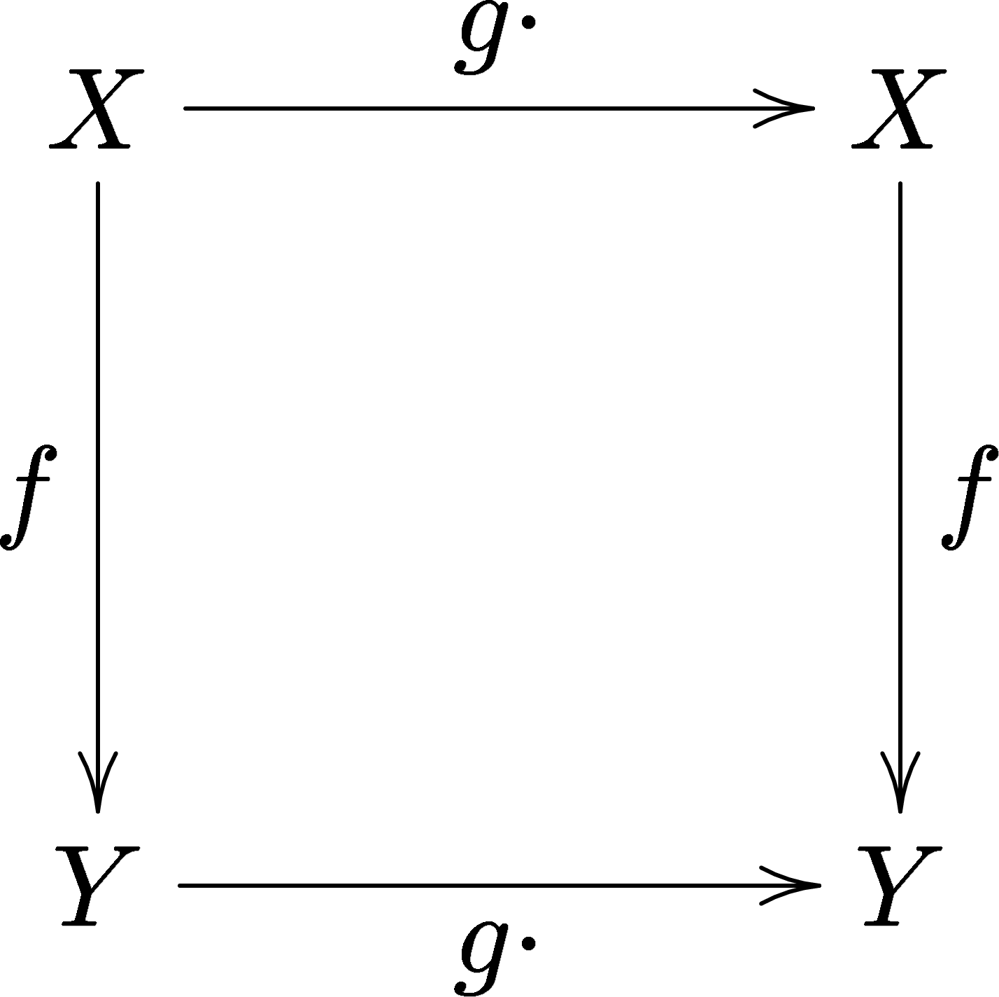

<!-- ===== §1. Framing ===== -->

## Unit 13 positioning: recap + the deferred math

::: {.incremental}
- You have already **used** PINNs: ML-PC Unit 8 (inverse problems) and Unit 11 (physics-constrained lab patterns) — and MG Unit 14 instantiates them for materials.
- Today, first half: **consolidate** the PINN core you have seen — loss, collocation, $\lambda$, failure modes.
- Today, second half: the **mathematics those units deferred here** — exact boundary-condition enforcement (Lagaris), why small data works (Occam/MDL), and physics in the *architecture*.
:::

::: {.notes}
- Say the structure out loud in the first minute: this is deliberately half recap. The triad has already put PINNs in their hands (ML-PC u8/u11, MG u14); this lecture's job is to consolidate and then deliver the theory those decks explicitly point at ("see MFML W13").
- Timing contract: ~40 min recap (fast, checkpoint-driven — these slides compress 3–4 old slides each), ~40 min new material (Lagaris, Occam/MDL, architectural constraints), ~10 min exercise + exam summary. If a recap slide sparks no questions, move on — it is a memory refresh, not first contact.
- For students taking MFML only: the recap half is self-contained — every formula they need is on the slides. They lose the lab anecdotes, not the math.
- Transition: "Here is the contract for the 90 minutes."
:::

## Learning outcomes for Unit 13

By the end of this lecture, students can:

::: {.incremental}
- formulate the PINN loss $(J = J_{\text{data}} + \lambda J_{\text{physics}})$ and explain every term (recap),
- diagnose the standard PINN failure modes: wrong physics, convection, gradient imbalance (recap),
- apply the **Lagaris substitution** to enforce boundary conditions exactly (new),
- explain via Occam/MDL **why** physics constraints reduce data requirements (new),
- place equivariant NNs, Hamiltonian NNs, and neural operators on the PIML spectrum (new).
:::

::: {.notes}
- Use as a contract, not a read-aloud: the first two bullets are recap — students should already half-own them; the last three are today's genuinely new deliverables and map onto the second half.
- Flag the two exam anchors now: the PINN loss (write it blind, statement #3) and the Lagaris substitution (guaranteed derivation, statement #6).
- Transition: "One map organizes everything — the PIML spectrum."
:::

## The PIML spectrum and taxonomy

:::: {.columns}
:::: {.column width="55%"}
| Approach | Physics enters via | Example |
|----------|:----------:|:-------:|
| Data-only | — | Standard NN |
| **(a)** Data enrichment | Inputs | FFT, derivatives |
| **(b)** Loss constraint | Objective | PINN |
| **(c)** Architecture | Function class | Equivariant NN, HNN |
| **(d)** Hybrid simulation | Solver | Differentiable FEM |
::::

:::: {.column width="45%"}

::: {.incremental}
- One axis: **more physics ⇒ less data needed**, but harder implementation.
- (a)–(b) are recap territory; (c) is today's second half.
- Physics in the loss is *requested*; physics in the architecture is *guaranteed*.
:::

::::
::::

::: {.notes}
- This merges the old spectrum + taxonomy slides — walk the table once, top to bottom: physics enters at the inputs (enrichment), the objective (PINN), the function class (equivariant/Hamiltonian), or the solver (hybrid). Increasing intrusiveness, increasing guarantee.
- Materials anchor in one breath: empirical Hall–Petch fit → Arrhenius-transformed features → a PINN enforcing diffusion → an equivariant net respecting crystal symmetry → DFT. Same property, five points on the line.
- The right-column punchline ("requested vs guaranteed") is the thesis of the second half — plant it now, harvest it at the HNN slide.
- Transition: "Recap block starts here. First: *why* does physics help at all?"
:::


<!-- ===== §2. RECAP: the PINN core ===== -->

## Recap: physics as informed regularization

:::: {.columns}
:::: {.column width="55%"}

::: {.incremental}
- Without constraints, a NN considers **all** functions; physics deletes the impossible ones ⇒ less data to identify the right one.
- **L2**: "prefer small weights" — generic. **Physics**: "satisfy $\nabla \cdot \mathbf{v} = 0$" — informed. Same machinery (Unit 8), better prior (Unit 7).
- Information budget: $\text{data info} + \text{physics info} = \text{learning requirement}$ — more physics buys down data needs [@neuer2024machine].
:::

::::

:::: {.column width="45%"}
![Degree of physics vs amount of data required. More prior knowledge offsets data needs. [@neuer2024machine]](images/neuer_ch6_fig4_statistical_balance_data_vs_physics.png){width=100%}
::::
::::

::: {.notes}
- Three old slides in one — take it at recap speed (~3 min). The chain to re-say: fewer admissible functions ⇒ lower effective capacity ⇒ less data ⇒ better generalization. It is Unit 8's bias–variance argument with an *informed* constraint, and Unit 7's "every regularizer is a prior" with a physical prior.
- Point at the figure once: a downward-sloping iso-information line — physics knowledge and data are two currencies paying one bill. This is *why* PINNs work with tiny datasets.
- Asterisk to plant: the trade only holds when the physics is *correct* — wrong physics injects negative information (failure-mode slide later, exam statement #10).
- Transition: "Cheapest way to spend the physics budget: transform the inputs."
:::

## Recap: data enrichment

:::: {.columns}
:::: {.column width="55%"}

::: {.incremental}
- Add physics-derived features to the inputs; architecture and loss untouched — taxonomy **(a)**.
- **FFT**: periodicity, resonances (vibration, cyclic processes).
- **Wavelets**: time-localized frequency — transients, phase transitions.
- **Derivatives**: $dT/dt$, strain rate — dynamics handed to the model (smooth first: noise amplifies!).
- **Statistics & dimensionless groups**: moments, percentiles; Reynolds, Arrhenius $1/T$.
:::

::::

:::: {.column width="45%"}
![Motor current time series: "good" (black) vs "bad" (green, oscillating). FFT readily separates classes invisible to raw time-series models. [@neuer2024machine]](images/neuer_ch6_fig2_motor_current_good_bad.png){width=100%}
::::
::::

::: {.notes}
- The whole enrichment block of the old lecture, at recap speed (~4 min). The one idea: the network *could* learn an FFT or a derivative internally, but only with enormous data — handing it the transform spends physics budget to save data budget.
- Walk the figure: "good" vs "bad" motor current are indistinguishable in time, trivially separated in frequency. Enrichment moves data into coordinates where the decision boundary is simple.
- Quick oral checkpoint instead of a slide: "cooling curve $T(t)$ — name three enriched features and the physics each injects." Expect $dT/dt$, FFT of fluctuations, peak/percentile statistics, Biot number. Justification is the skill, not the list.
- Practical caveats in one breath: concatenate, don't replace raw inputs; smooth before differentiating; fit PCA on training data only.
- Transition: "Now the derivative moves from the data to the model itself — auto-diff."
:::

## Recap: auto-diff gives derivatives w.r.t. inputs

::: {.incremental}
- Backprop (Unit 5) computes $\partial L / \partial \boldsymbol{\theta}$ — derivatives w.r.t. **parameters**.
- The same reverse-mode machinery gives $\partial f_{\boldsymbol{\theta}} / \partial \mathbf{x}$ — derivatives w.r.t. **inputs** — **exactly**, no finite differences.
- So any differential operator can be evaluated on the network output during training:

$$
J_{\text{cons}} = \frac{1}{M}\sum_{j=1}^{M}\left(\frac{\partial \rho_{\boldsymbol{\theta}}}{\partial t} + \nabla \cdot (\rho_{\boldsymbol{\theta}} \mathbf{v})\right)^2 \quad \text{(mass conservation as a penalty)}
$$

- The pattern: residual → square → average over sample points. Every physics loss has this shape.
:::

::: {.notes}
- The examinable distinction (statement #7): training derivatives are w.r.t. **parameters**; physics residuals need derivatives w.r.t. **inputs** $(x,t)$. Same algorithm, different leaf nodes — students conflate these constantly.
- The conservation-law example replaces the old smoothness + conservation slides: read the formula as "auto-diff the terms, form the residual, square, average." Note it is *soft* enforcement — satisfied only approximately, where penalized. That tension sets up Lagaris later.
- Cost note for the limitations callback: each extra derivative order is another backward pass; second-order PDEs roughly double the cost.
- Transition: "Wrap that pattern in a name — the PINN loss."
:::

## Recap: the PINN loss

$$
J = J_{\text{data}} + \lambda \cdot J_{\text{physics}}, \qquad
J_{\text{data}} = \frac{1}{N}\sum_{i=1}^{N}\|\mathbf{y}_i - f_{\boldsymbol{\theta}}(\mathbf{x}_i)\|^2
$$

:::: {.columns}
:::: {.column width="50%"}

```{mermaid}
%%| echo: false
%%| fig-align: center
graph LR
    X["Inputs: \mathbf{x}, t"] --> NN["Neural Network"]
    NN --> U["Predicted Field: u"]
    U --> AD["Auto-Diff"]
    AD --> R["Residual: \mathcal{R}(u, u_t, u_{\mathbf{x}\mathbf{x}}, ...)"]
    R --> Jp["Physics Loss"]
    U --> Jd["Data Loss"]
    Jp --> J["Total Loss J"]
    Jd --> J
```

::::

:::: {.column width="50%"}

::: {.incremental}
- $J_{\text{data}}$: MSE on the sparse, noisy labeled points — alone it is a standard, data-starved NN.
- $J_{\text{physics}}$: PDE/ODE residual — next slide.
- $\lambda$: the exchange rate between measurements and equations.
- A PINN is **MAP estimation with a physics prior** (Unit 7).
:::

::::
::::

::: {.notes}
- Still *the* slide of the unit even in recap mode — slow down here. Read the loss as a sentence: "fit the sparse data **and** satisfy the equation everywhere, with $\lambda$ setting the exchange rate." Exam statement #3: write it blind.
- Walk the mermaid flow once: inputs → network → field → (auto-diff) → residual → physics loss; the field also feeds the data loss. Everything upstream of the auto-diff arrow is an ordinary MLP.
- The unifying sentence worth saying twice: $J_{\text{data}}$ is the Gaussian NLL, $\lambda J_{\text{physics}}$ is a log-prior — a PINN is literally MAP with a physics prior. It ties Units 7, 8, and 13 together.
- Transition: "The term that does the real work needs no labels at all."
:::

## Recap: $J_{\text{physics}}$ and collocation points

$$
J_{\text{physics}} = \frac{1}{M}\sum_{j=1}^{M}\|\mathcal{R}(f_{\boldsymbol{\theta}}, \mathbf{x}_j)\|^2
$$

::: {.incremental}
- $\mathcal{R}$: the governing equation moved to one side — a perfect solution makes it identically zero.
- Evaluated at $M$ **collocation points**: unlabeled domain locations, sampled uniformly or adaptively.
- **No labels needed** — the target is zero. Physics supervision is effectively unlimited and free.
- Collocation points $\neq$ data points: 8 measured hardness values, but 10,000 collocation points across the process window.
:::

::: {.notes}
- The conceptual jewel, exam statement #4: $J_{\text{physics}}$ needs **no labels** — only the equation. Say it twice; it is the entire source of the small-data advantage.
- Re-hit the stubborn confusion: collocation points are *unlabeled* residual-check locations; data points need a measured $y$. The materials one-liner (8 hardness values vs 10,000 collocation points) is the memory hook.
- Trade-off in one breath: more collocation points ⇒ better-enforced physics, higher per-step cost; adaptive/residual-driven placement matters near sharp features (previews the convection failure).
- Transition: "One knob balances the two terms."
:::

## Recap: the role of $\lambda$

::: {.incremental}
- $\lambda = 0$: pure data-driven. $\lambda \to \infty$: NN solves the PDE, data ignored. In between: the negotiated compromise.
- **Too high**: satisfies physics, ignores noisy data — underfits the measurements.
- **Too low**: fits data, violates physics — physically inconsistent predictions.
- The symptom tells you which way to move. Adaptive schemes rescale $\lambda$ from relative gradient magnitudes of the two terms.
:::

::: {.notes}
- Recap of two old slides (~2 min). Frame $\lambda$ as the data-vs-prior dial from the information-budget slide, now a tunable scalar — and (Unit 7) the prior-precision knob of a MAP estimate.
- Misconception re-sweep: bigger $\lambda$ is not "more physics is better" — it is "trust the equation more than the measurements," wrong when the equation is approximate (statement #5).
- ML-PC callback: unit 11's loss-weighting recipes (non-dimensionalization, log-transform, curriculum, NTK reweighting) are the practical toolbox for exactly this knob — we cover the *root cause* on the gradient-pathology slide shortly.
- Transition: "What does the network itself look like? Anticlimactically simple."
:::

## Recap: PINN architecture — Burgers equation

:::: {.columns}
:::: {.column width="55%"}

::: {.incremental}
- A standard MLP; inputs are **coordinates** $(\mathbf{x}, t)$, output is the **field** (temperature, velocity, stress).
- **Smooth activations** (tanh, swish) — never ReLU: its second derivative is zero almost everywhere, killing the residual.
- The network represents *one solution* as a continuous function — not a dataset map.
- Raissi et al.: sharp Burgers shock recovered from **100 data points**, because the PDE supervised everywhere else [@raissi2019physics].
:::

::::

:::: {.column width="45%"}
![PINN solution of the Burgers equation. Top: predicted spatio-temporal field with 100 training points (×). Bottom: exact (blue) vs PINN prediction (red) at $t=0.25, 0.50, 0.75$. [@raissi2019physics]](images/raissi2019_fig1_pinn_burgers.png){width=100%}
::::
::::

::: {.notes}
- The deliberately anticlimactic point: all the physics lives in the loss, not the architecture. The one hard rule — smooth activations — is the classic fatal student bug; pre-empt it for the exercise now.
- Let the figure land as the "this actually works" moment: a shock from ~100 points. This is the same figure ML-PC unit 11 gestured at; now they can read every element of it.
- Transition: "Quick recap check — can you still write the loss for a concrete PDE?"
:::

## Checkpoint: PINN loss for heat diffusion

- **Problem**: $\frac{\partial T}{\partial t} = \alpha \frac{\partial^2 T}{\partial \mathbf{x}^2}$ with noisy temperature measurements.
- **Data loss**: $J_{\text{data}} = \frac{1}{N}\sum_i (T_i^{\text{obs}} - f_{\boldsymbol{\theta}}(\mathbf{x}_i, t_i))^2$.
- **Physics loss**: $J_{\text{physics}} = \frac{1}{M}\sum_j \left(\frac{\partial f_{\boldsymbol{\theta}}}{\partial t} - \alpha \frac{\partial^2 f_{\boldsymbol{\theta}}}{\partial \mathbf{x}^2}\right)^2$.
- **Total**: $J = J_{\text{data}} + \lambda \cdot J_{\text{physics}}$.

::: {.notes}
- 3-minute recap check: students write all three lines *before* the reveal. The skill: translate "$\partial_t T=\alpha\partial^2_{xx}T$" into a squared residual at collocation points — exactly the exam task.
- Watch for the two classic errors: forgetting the residual is the PDE moved to one side (zero target), and evaluating $J_{\text{physics}}$ at data points instead of collocation points.
- If this checkpoint is smooth, the recap is done its job — bank the saved minutes for Lagaris.
- Transition: "Recap's last stop: what breaks. Two distinct failure categories."
:::

## Recap: failure modes I — wrong or hard physics

:::: {.columns}
:::: {.column width="55%"}

::: {.incremental}
- **Incorrect physics**: the PINN converges to the solution of the equation you gave it — garbage equation ⇒ **confidently wrong** solution.
- **Convection-dominated PDEs**: error explodes with convection coefficient $\beta$; soft-constraint training cannot learn sharp advecting fronts [@krishnapriyan2021characterizing].
- **Multi-scale problems** (boundary layers): conflicting gradients. **High-dimensional PDEs**: collocation cost scales exponentially.
:::

::::

:::: {.column width="45%"}
![PINN failure on the 1D convection equation: (a) prediction error vs $\beta$; (b) exact solution for $\beta=30$; (c) PINN solution for $\beta=30$ — the sharp advecting front is not learned. [@krishnapriyan2021characterizing]](images/krishnapriyan2021_fig1_convection_failure.png){width=100%}
::::
::::

::: {.notes}
- Lead with the cardinal sin, exam statement #10: unlike a data model that just fits noise, a PINN *actively converges* to the wrong equation's solution. Authoritative garbage. Say it bluntly.
- Walk the figure: error vs $\beta$ explodes; panel (c) shows the network simply giving up on the front. Cited, concrete, real — not a footnote.
- These are *modeling* failures. Keep them mentally separate from the *optimization* failures on the next slide — the exam asks students to name both categories.
- Transition: "Even with correct physics, the optimization itself fights you."
:::

## Recap: failure modes II — optimization pathologies

:::: {.columns}
:::: {.column width="55%"}

::: {.incremental}
- **Gradient imbalance**: physics-loss gradients dwarf data/BC gradients by orders of magnitude — SGD effectively ignores the data term [@wang2021understanding].
- **Spectral bias**: NNs learn low frequencies first; high-frequency PDE features train painfully slowly.
- **Stiff PDEs**: training instability from very large physics-loss gradients.
- **Cost**: high-order auto-diff at every collocation point, every step — for forward 3D problems, FEM/CFD often wins. PINNs pay off for **inverse problems and data scarcity** (ML-PC Unit 8).
:::

::::

:::: {.column width="45%"}
![Histograms of back-propagated gradients per layer for a PINN solving the Helmholtz equation: data-loss gradients (blue) are orders of magnitude smaller than physics-loss gradients (orange). [@wang2021understanding]](images/wang2021_fig2_gradient_pathology.png){width=100%}
::::
::::

::: {.notes}
- The root cause behind ML-PC unit 11's loss-weighting recipes: the Wang figure shows *why* naive $\lambda$ fails — one term's gradients drown the other's. Adaptive balancing is a treatment for a diagnosed disease, not a superstition.
- Spectral bias connects to their Fourier intuition from Unit 4: networks are low-pass learners; sharp PDE features are exactly what they resist.
- The honest cost accounting closes the recap: do not leave thinking PINNs replace FEM. They win where classical methods are weak — inverse problems, data assimilation, extreme scarcity. ML-PC unit 8 is the worked treatment of that regime.
- Transition: "Recap done. Now the first piece of deferred math: making boundary conditions *impossible to violate*."
:::


<!-- ===== §3. NEW: hard BC enforcement — Lagaris ===== -->

## Boundary conditions and soft enforcement

::: {.incremental}
- **Dirichlet**: $f(\mathbf{x}_{\text{boundary}}) = a$ (prescribed value). **Neumann**: $\frac{\partial f}{\partial n}(\mathbf{x}_{\text{boundary}}) = b$ (prescribed gradient/flux).
- Without BCs, the PDE has infinitely many solutions — the PINN converges to a valid but **wrong** field.
- Soft enforcement: $J = J_{\text{data}} + \lambda_1 J_{\text{physics}} + \lambda_2 J_{\text{BC}}$ with $J_{\text{BC}} = \|f_{\boldsymbol{\theta}}(\mathbf{x}_{\text{boundary}}) - a\|^2$.
- Price: BCs only **approximately** satisfied, and a second weight $\lambda_2$ to balance — the gradient-pathology risk just doubled.
:::

::: {.notes}
- Vocabulary to lock in (exam identification task): Dirichlet = prescribed *value* (fixed-temperature wall), Neumann = prescribed *gradient/flux* (insulated wall).
- Soft = "asked nicely, possibly disobeyed": every added loss term multiplies the tuning surface and the imbalance risk from the previous slide. Frame the pain honestly — it motivates what comes next.
- Misconception: more loss terms ≠ more control. The opposite, per the Wang slide they just saw.
- Transition: "What if the BC simply *could not* be violated, by construction? That is Lagaris — the most elegant idea in the unit."
:::

## Hard BC enforcement: the Lagaris substitution

:::: {.columns}
:::: {.column width="60%"}
- Construct the solution so BCs hold **by construction**:

$$
f(\mathbf{x}) = A(\mathbf{x}) + B(\mathbf{x}) \cdot \text{NN}(\mathbf{x})
$$

- $A(\mathbf{x})$ satisfies the BCs.
- $B(\mathbf{x})$ vanishes at the boundaries.
- The NN only learns the unknown interior part.
::::

:::: {.column width="40%"}
- **Guaranteed consistency**: BCs met before training starts — no $J_{\text{BC}}$, no $\lambda_2$.
- **Smaller search space**: physics moves from the *objective* into the *function class* — taxonomy (b) → (c).
- **Reference**: @lagaris1998artificial.
::::
::::

::: {.notes}
- Present as a trick worth memorizing (exam statement #6, guaranteed derivation). Read the formula aloud: $A$ *carries* the boundary values, $B$ *vanishes* on the boundary — the network can output anything and the BC still holds exactly.
- Misconception to kill immediately: $A, B$ are *chosen by hand* from the BCs — algebra, not optimization. The next slide does it live.
- The meta-principle to state as a design rule: whenever you *can* satisfy a constraint by construction, do — it strictly dominates penalizing it. This is the "requested vs guaranteed" line from the spectrum slide, cashed out.
- Transition: "Pick $A$ and $B$ for concrete cases."
:::

## Lagaris substitution: choosing $A$ and $B$

- **One-sided**: $f(\mathbf{0}) = a$. Trial: $f(\mathbf{x}) = a + \mathbf{x} \cdot \text{NN}(\mathbf{x})$.

:::: {.incremental}
- At $\mathbf{x} = \mathbf{0}$: $f(\mathbf{0}) = a + \mathbf{0} \cdot \text{NN}(\mathbf{0}) = a$ ✓ — **regardless of the NN**.
::::

:::: {.incremental}
- **Two-sided**: $f(\mathbf{0})=a, f(L)=b$. Trial: $f(\mathbf{x}) = a + \frac{\mathbf{x}}{L}(b-a) + \mathbf{x}(L-\mathbf{x})\,\text{NN}(\mathbf{x})$.
- The pattern: **boundary-satisfying interpolant + vanishing bump × NN**. The NN learns the *deviation* from the base solution.
::::

::: {.notes}
- Do this live on the board — it is the exam derivation. Substitute $x=0$ and watch the NN term annihilate; that "regardless of the network" is the whole magic.
- Have students verify both endpoints of the two-sided form by inspection. Name the reusable recipe explicitly: interpolant + vanishing-bump×NN.
- The full-marks phrasing to dictate: "the NN learns the deviation from the boundary-satisfying base solution."
- Transition: "Run the recipe on an actual ODE against a known analytical answer."
:::

## Lagaris worked example: $x' = x$, $x(0) = 1$

:::: {.columns}
:::: {.column width="55%"}
- **Trial solution**: $x(t) = 1 + t \cdot \text{NN}(t)$ — IC holds by construction.

:::: {.incremental}
- **ODE residual** (product rule via auto-diff): $\mathcal{R} = x'(t) - x(t) = \text{NN}(t) + t \cdot \text{NN}'(t) - 1 - t \cdot \text{NN}(t)$.
- Minimize $\sum_j \mathcal{R}(t_j)^2$ over collocation points — **no time-stepping**; the network *is* the continuous solution.
- Exact: $x(t) = e^t$, so $\text{NN}(t) \approx (e^t - 1)/t$ — a bounded, smooth correction.
::::
::::

:::: {.column width="45%"}
![Analytical solution $e^t$ (black) vs neural network solution (green) for $x'=x$, $x(0)=1$. The Lagaris substitution guarantees the IC; the NN learns the remaining shape. [@neuer2024machine]](images/neuer_ch6_fig7_lagaris_ode_exp_solution.png){width=100%}
::::
::::

::: {.notes}
- The model answer for exercise Part B — derive the residual on the board so they see auto-diff of the trial form (product rule on $t\cdot\mathrm{NN}$) in action.
- Two insights to land: (1) this is a mesh-free, continuous, differentiable ODE solver — query any $t$, no marching, no accumulated step error, IC exact to machine precision; (2) the network learns a *bounded* correction, not the fast-growing solution itself — constraining what must be learned is why it trains on tiny collocation sets.
- Honest caveat: elegant, but not a replacement for a good stiff solver — the regime argument from the cost slide applies.
- Transition: "Your turn — a two-sided boundary problem."
:::

## Checkpoint: Lagaris design

- **Problem**: $f''(\mathbf{x}) = g(\mathbf{x})$, $f(\mathbf{0}) = \mathbf{0}$, $f(\mathbf{1}) = \mathbf{0}$.
- **Trial solution**: $f(\mathbf{x}) = \mathbf{x}(\mathbf{1}-\mathbf{x}) \cdot \text{NN}(\mathbf{x})$.
- Check: $f(\mathbf{0}) = \mathbf{0} \cdot \mathbf{1} \cdot \text{NN}(\mathbf{0}) = \mathbf{0}$ ✓. $f(\mathbf{1}) = \mathbf{1} \cdot \mathbf{0} \cdot \text{NN}(\mathbf{1}) = \mathbf{0}$ ✓.
- The NN freely shapes the interior while both BCs are guaranteed.

::: {.notes}
- 2-minute drill: students propose the trial form *before* the reveal; the skill is choosing a $B(x)$ vanishing at *both* ends ($A=0$ here since both BCs are zero).
- Make them verify by substitution out loud — each endpoint kills a factor regardless of the NN. The verification habit is the exam-defensive skill.
- Honest caveat to close the block: constructing $A, B$ is easy on intervals and boxes, genuinely hard on complex geometries — which is why soft enforcement still exists in practice.
- Transition: "We now know *how* to constrain. The second piece of deferred math: *why* constrained models generalize — Occam and MDL."
:::


<!-- ===== §4. NEW: why small data works ===== -->

## Why small data works: Occam's razor and MDL

::: {.incremental}
- **Occam**: among models fitting the data equally well, prefer the simplest.
- The complexity that matters is not parameter count but the **size of the reachable function set** — a physics-constrained net with 100 parameters can be *effectively* simpler than a free one with 10 (effective parameters, Unit 12).
- **Minimum Description Length**: best model minimizes (model complexity) + (data residual). Physics priors shrink the complexity term — the equation already specifies bits the data no longer must supply.
- This is the formal reason physics-informed models generalize better with less data.
:::

::: {.notes}
- Two old slides merged; ~4 min. The sharpened idea: "parameter count lies; constrained capacity is the truth." Connect explicitly to Unit 12's effective number of parameters.
- MDL at engineer depth: total description length = model bits + residual bits; the physics prior pre-pays model bits. State it conceptually, no coding theorems.
- This slide is the theoretical thesis of the unit (exam statement #8) — the statistical-balance figure from the recap is its picture.
- Transition: "The empirical cash-out."
:::

## Small-data advantage in practice

:::: {.columns}
:::: {.column width="55%"}

::: {.incremental}
- With ~10 labeled points + the governing ODE, a PINN can outperform a standard NN trained on ~1000 points — every collocation point is free, exact supervision.
- Same logic at the feature level: **water/binder ratio**, a derived physical variable, lifts concrete-strength $R^2$ from 0.800 to 0.834 with zero extra data [@mcclarren2021machine].
- The right physics — as a residual or as a feature — is worth a pile of samples.
:::

::::

:::: {.column width="45%"}
![Concrete compressive strength vs water/binder ratio (a physics-derived feature) and regression model output. Adding this domain variable improves $R^2$ from 0.800 to 0.834. [@mcclarren2021machine]](images/mcclarren_ch5_fig12_concrete_water_binder_ratio.jpg){width=100%}
::::
::::

::: {.notes}
- The headline number students remember: 10 points + physics beats 1000 points without. Name the mechanism once more — $J_{\text{physics}}$ needs no labels.
- The concrete figure closes the loop back to enrichment: same budget argument, spent at the input side. Occam, MDL, statistical balance, and this slide are one argument in four costumes — say so.
- Transition: "Last block: go past the loss entirely — physics welded into the architecture."
:::


<!-- ===== §5. NEW: physics in the architecture ===== -->

## Beyond PINNs: physics in the architecture

::: {.incremental}
- Taxonomy step (b) → (c): physics in the loss is **requested**; physics in the architecture is **guaranteed** — no $\lambda$, no residual, no violation possible.
- **Neural operators** (DeepONet, FNO): learn maps between *function spaces* — solve a whole PDE family, then answer new instances in one forward pass.
- **Hamiltonian NNs**: energy conservation by structure.
- **Equivariant networks**: symmetry by structure.
:::

::: {.notes}
- The organizing sentence for the last 20 minutes: each of the next three slides guarantees one structural property — function→function maps (operators), energy conservation (HNN), symmetry (equivariance). One example each, then the wrap-up.
- ML-PC unit 11 name-dropped all of these and deferred the math here — this is the debt being paid.
- Transition: "Most general first: networks that map functions to functions."
:::

## DeepONet: learning operators between function spaces

:::: {.columns}
:::: {.column width="50%"}

::: {.incremental}
- Standard NNs map vectors to vectors. **DeepONet** maps *functions* to functions: $G: u \mapsto G(u)$ [@lu2021learning].
- **Branch net** encodes the input function $u$ at fixed sensor locations; **trunk net** encodes the query location $y$.
- Output: $G(u)(y) = \sum_k b_k(u) \cdot t_k(y)$ — a learned dot product.
- Once trained, a **new** initial condition is solved by a single forward pass — no per-instance re-optimization, unlike a PINN.
:::

::::

:::: {.column width="50%"}
![DeepONet architectures: (A) network for operator $G$; (B) training data — input function $u$ at sensors $x_1,\ldots,x_m$, output $G(u)(y)$ at random $y$; (C) stacked and (D) unstacked variants with branch and trunk nets. [@lu2021learning]](images/lu2021_deeponet_fig1_architecture.png){width=100%}
::::
::::

::: {.notes}
- The conceptual leap: initial condition in, full solution field out — the operator, not one solution, is what is learned. Contrast with a PINN, which is re-optimized per problem instance.
- The examinable structure is the branch/trunk split and the bilinear output $\sum_k b_k(u)\,t_k(y)$.
- Materials anchor: a trained microstructure→stress-field or process-parameter→thermal-history operator is an instant surrogate across a *family* of problems — the industrial reason operator learning matters.
- Transition: "Do the same in Fourier space and you get resolution invariance for free."
:::

## Fourier Neural Operator (FNO)

:::: {.columns}
:::: {.column width="50%"}

::: {.incremental}
- FNO parameterizes the operator's convolution **in Fourier space** [@li2020fourier]: lift → learned weights on low Fourier modes → transform back.
- **Resolution-invariant**: train at one grid, evaluate at another. SOTA for Navier–Stokes, Darcy flow, weather.
- **PINO** [@li2024pino]: FNO operator + PINN-style physics residual — data-driven operator, physics-enforced.
- **MeshGraphNets** [@pfaff2021mgn]: message-passing on unstructured meshes where the FFT does not apply — the industrial standard for CFD surrogates.
:::

::::

:::: {.column width="50%"}
![FNO: **top** — input lifted by $P$, passed through $T$ Fourier layers, projected by $Q$; **bottom** — one Fourier layer: spectral convolution (keeps low-frequency modes) plus a local linear transform $W$, summed and activated. [@li2020fourier]](images/li2020_fno_fig2_fourier_layer.png){width=100%}
::::
::::

::: {.notes}
- Walk the figure once: the spectral path ($\mathcal{F} \to R \to \mathcal{F}^{-1}$) is a global convolution with learned low-mode weights; the $W$ path is local. Truncating to low modes is what buys resolution invariance — and connects to the spectral-bias story: here low frequencies are a *feature*, deliberately exploited.
- PINO in one sentence bridges the unit's dichotomy: keep the operator's speed, add the residual's physics. GNN solvers are the answer when meshes are unstructured — one sentence each, no derivation.
- Unifying view: DeepONet, FNO, PINO, MeshGraphNets are all *neural operators* — learned maps between function spaces.
- Transition: "From function spaces to conservation laws: Hamiltonian networks."
:::

## Hamiltonian Neural Networks (HNN)

:::: {.columns}
:::: {.column width="50%"}

::: {.incremental}
- A vanilla NN predicting the next state does **not** conserve energy.
- **HNN** [@greydanus2019hamiltonian]: learn the scalar Hamiltonian $\mathcal{H}(q,p)$; dynamics follow from
:::

$$\dot{q} = \frac{\partial \mathcal{H}}{\partial p}, \quad \dot{p} = -\frac{\partial \mathcal{H}}{\partial q}$$

::: {.incremental}
- Energy conservation holds **structurally** — exactly, for free, forever. No $\lambda$, no residual.
- PINN = conservation *softly* via the loss; HNN = conservation *structurally* via the architecture.
:::

::::

:::: {.column width="50%"}
![Mass-spring system: baseline NN prediction spirals inward (energy loss); the Hamiltonian NN stays on the correct orbit even when trained from noisy observations. [@greydanus2019hamiltonian]](images/greydanus2019_hnn_fig1_mass_spring.png){width=100%}
::::
::::

::: {.notes}
- The cleanest example of "requested vs guaranteed" — the contrast to put on the board: same physics (energy conservation), different taxonomy slot, and the architectural version is strictly stronger.
- Let the figure carry it: baseline spirals inward bleeding energy; HNN stays on the closed orbit even from noisy data. Structure beats penalty.
- Transition: "Energy is one invariance. Generalize 'build the symmetry in' to any group."
:::

## Group-equivariant neural networks

:::: {.columns}
:::: {.column width="55%"}

::: {.incremental}
- $f$ is **equivariant** to group $G$ if $f(g \cdot x) = g \cdot f(x)$ [@cohen2016group] — transform the input, the output transforms the same way.
- CNNs are already the famous case (translation). G-CNNs extend to rotations, reflections, crystal point groups.
- Molecular and crystal property prediction **must** be rotation/permutation equivariant — energy cannot depend on the lab frame.
- Symmetry-tied weights ⇒ fewer parameters, less data, and the constraint can **never** be violated.
:::

::::

:::: {.column width="45%"}
{width=70%}
::::
::::

::: {.notes}
- Define physically before the formula, then point at the diagram: both paths around the square must agree.
- This is the architectural extreme of the unit's thesis — maximum physics injected, maximum data saved, zero possibility of violation — and the deep reason equivariant nets dominate ML for atoms (ML-PC unit 11's elastic-tensor pattern is the lab instance).
- Close the arc: we walked the spectrum end to end — enrichment (inputs) → PINN (loss) → HNN/equivariance/operators (architecture). Every method they meet later slots onto this line.
- Transition: "What you will build in the exercise, then the exam contract."
:::


<!-- ===== §6. Wrap-up ===== -->

## Exercise setup

::: {.incremental}
- **Part A**: enforce a known symmetry ($f(\mathbf{x}) = f(-\mathbf{x})$) via loss penalty in a regression task — taxonomy (b) on a toy.
- **Part B**: build a PINN for $\mathbf{x}' = \mathbf{x}$, $\mathbf{x}(0) = \mathbf{1}$ with the Lagaris substitution; compare to $e^t$ — you have the model answer from today.
- **Part C (bonus)**: add noisy data and sweep $\lambda$ — cause the under- and over-constraining failure modes *on purpose*.
- Practical heads-up: use a **smooth activation**, or Part B's residual is garbage.
:::

::: {.notes}
- Set expectations, don't teach. Part C's deliverable is the *intuition* for the $\lambda$ failure modes, not a converged number.
- The lecture owns the concepts (PIML spectrum, PINN loss, Lagaris, Occam/MDL, limitations, architectural constraints); the exercise owns the implementation. The exercise solidifies but does not extend the examinable set.
- Pre-empt the classic submission bug one last time: ReLU kills the second derivative.
- Transition: "The exam contract, in ten statements."
:::

## Exam-aligned summary: 10 must-know statements

1. Physics-informed ML embeds domain knowledge to reduce data requirements.
2. Data enrichment adds physics-derived features (FFT, derivatives) to raw inputs.
3. The PINN loss is $J = J_{\text{data}} + \lambda \cdot J_{\text{physics}}$.
4. $J_{\text{physics}}$ is the PDE/ODE residual evaluated at collocation points — no labels needed.
5. $\lambda$ balances data fidelity against physics compliance.
6. The Lagaris substitution enforces boundary conditions exactly by construction.
7. Auto-diff computes exact derivatives of NN outputs w.r.t. inputs for physics residuals.
8. Physics constraints act as informed regularization, reducing the hypothesis space.
9. PINNs excel in small-data regimes where physics provides complementary information.
10. Incorrect physics in PINNs leads to confidently wrong predictions — always validate.

::: {.notes}
- The assessment contract — read each statement and name the slide it came from so students can self-audit in real time. Defend all ten in a sentence each = exam-ready.
- Highest-value three: #3 (write the loss blind), #6 (derive Lagaris), #10 (the maturity point).
- Last misconception sweep: collocation ≠ data points (#4); larger $\lambda$ is not automatically better (#5).
- Transition: "Reading, and the bridge to the final unit."
:::

<!-- BEGIN prev-next -->

## Continue

- &larr; Previous: [Unit 12 &mdash; Uncertainty in Predictions](../12_uncertainty_in_predictions/01_intro.html)
- &rarr; Next: [Unit 14 &mdash; Explainability, Limits, and Scientific Trust](../14_explainability_limits_trust/01_intro.html)
- [All courses](../../index.html)

<!-- END prev-next -->

## References + reading assignment for next unit

- **Required reading before Unit 14:**
  - Neuer: Ch. 6.1–6.3
- **Optional depth:**
  - Karniadakis et al. (2021): PIML taxonomy
  - Raissi et al. (2019): PINN framework
  - Lagaris et al. (1998): NN-based ODE/PDE solvers
- Next unit: **Explainability, Limits, and Trust** — the final lecture.

::: {#refs}
:::

::: {.notes}
- Assign with intent: Raissi 2019 for the loss formulation and Burgers result; Neuer Ch. 6 for enrichment + Lagaris; Krishnapriyan 2021 and Wang 2021 as the "why it fails" depth reading.
- Forward bridge in one sentence: a model that respects physics is one input to a trustworthy system, not the whole story — Unit 14 asks whether we can *trust* what we built.
- End on the unit's thesis: physics is the cheapest data you will ever have — used wisely and validated always.
:::
